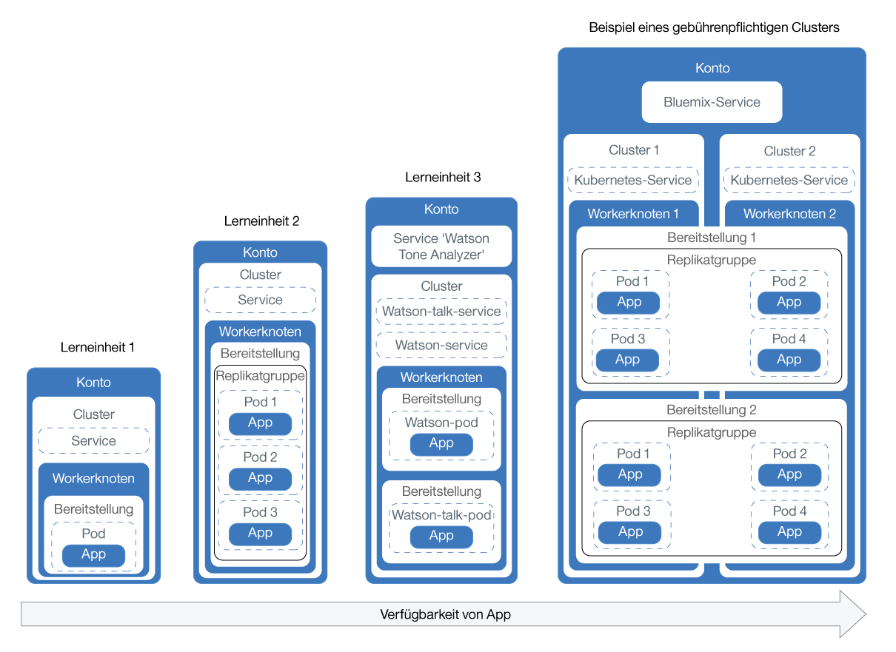
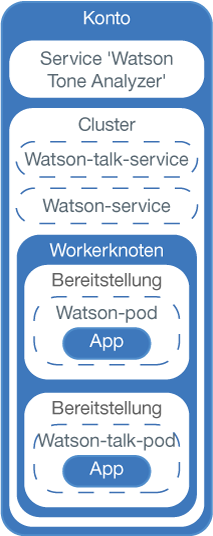

---

copyright:
  years: 2014, 2017
lastupdated: "2017-10-20"

---

{:new_window: target="blank"}
{:shortdesc: .shortdesc}
{:screen: .screen}
{:pre: .pre}
{:table: .aria-labeledby="caption"}
{:codeblock: .codeblock}
{:tip: .tip}
{:download: .download}


# Lernprogramm: Apps in Clustern bereitstellen
{: #cs_apps_tutorial}

In diesem zweiten Lernprogramm erfahren Sie, wie Sie mit Kubernetes eine containerisierte App bereitstellen, die den {{site.data.keyword.Bluemix_notm}}-Service {{site.data.keyword.watson}} {{site.data.keyword.toneanalyzershort}} nutzt. Hier setzt ein fiktives PR-Unternehmen {{site.data.keyword.watson}} ein, um Pressemitteilungen zu analysieren und Feedback zum Tenor in ihren Nachrichten zu erhalten.
{:shortdesc}

In diesem Szenario stellt der App-Entwickler des PR-Unternehmens eine 'Hello World'-Version der App in einem Kubernetes-Cluster bereit, der vom Netzadministrator im [ersten Lernprogramm](cs_tutorials.html#cs_cluster_tutorial) erstellt wurde.

In jeder Lerneinheit erfahren Sie, wie Sie zunehmend komplexere Versionen ein und derselben App implementieren. Im Diagramm sind (mit Ausnahme von Teil 4) die Komponenten der App-Bereitstellungen des Lernprogramms sichtbar.

<a href="https://console.bluemix.net/docs/api/content/containers/images/cs_app_tutorial_roadmap.png"></a>

Kubernetes verwendet diverse Typen von Ressourcen, um Ihre Apps betriebsbereit für die Ausführung in Clustern zu gestalten. In Kubernetes arbeiten Bereitstellungen und Services zusammen. Bereitstellungen enthalten die Definitionen für die App, wie z. B. das Image, das für den Container verwendet werden soll oder die Angabe, welcher Port für die App offengelegt werden soll. Beim Erstellen einer Bereitstellung wird für jeden Container, den Sie in der Bereitstellung definiert haben, jeweils ein Kubernetes-Pod erstellt. Um Ihre App widerstandsfähiger zu machen, können Sie in Ihrer Bereitstellung mehrere Instanzen derselben App definieren und von Kubernetes automatisch eine Replikatgruppe erstellen lassen. Die Replikatgruppe überwacht die Pods und stellt sicher, dass zu jedem beliebigen Zeitpunkt die gewünschte Anzahl von Pods betriebsbereit ist. Reagiert einer der Pods nicht mehr, so wird dieser automatisch neu erstellt.

Services fassen eine Gruppe von Pods zusammen und stellen diesen Pods eine Netzverbindung für andere Services im Cluster bereit, ohne hierbei die tatsächlichen privaten IP-Adressen der einzelnen Pods preiszugeben. Mit Kubernetes-Services können Sie eine App anderen Pods im Cluster zur Verfügung stellen oder über das Internet verfügbar machen. Im vorliegenden Lernprogramm verwenden Sie einen Kubernetes-Service, um über eine öffentliche IP-Adresse, die automatisch einem Workerknoten zugewiesen wird, und einen öffentlichen Port vom Internet aus auf Ihre aktive App zuzugreifen.

Um die Verfügbarkeit Ihrer App noch weiter zu steigern, können sie bei Standardclustern mehrere Workerknoten erstellen, die eine noch größere Anzahl an Replikaten der App ausführen. Obwohl diese Task im vorliegenden Lernprogramm nicht behandelt wird, sollten Sie dieses Konzept im Hinterkopf behalten, wenn Sie zu einem späteren Zeitpunkt die Verfügbarkeit einer App weiter verbessern möchten.

Die Integration eines {{site.data.keyword.Bluemix_notm}}-Service
in eine App wird nur in einer Lerneinheit behandelt. Sie können Services jedoch mit so einfach oder so komplex
konzipierten Apps verwenden, wie überhaupt vorstellbar.

## Ziele

* Grundlegende Kubernetes-Terminologie verstehen
* Image mit Push-Operation in Registry-Namensbereich in {{site.data.keyword.registryshort_notm}} übertragen
* App öffentlich zugänglich machen
* Einzelne Instanz einer App mit einem Kubernetes-Befehl und eine Script in einem Cluster bereitstellen
* Mehrere Instanzen einer App in Containern bereitstellen, die bei Statusprüfungen neu erstellt werden
* Eine App implementieren, die Funktionalität eines {{site.data.keyword.Bluemix_notm}}-Service verwendet

## Erforderlicher Zeitaufwand

40 Minuten

## Zielgruppen

Softwareentwickler und Netzadministratoren, die noch nie zuvor eine App in einem Kubernetes-Cluster bereitgestellt haben.

## Voraussetzungen

[Lernprogramm: Kubernetes-Cluster in {{site.data.keyword.containershort_notm}}](cs_tutorials.html#cs_cluster_tutorial) erstellen.

## Lerneinheit 1: Einzelinstanz-Apps auf Kubernetes-Clustern bereitstellen
{: #cs_apps_tutorial_lesson1}

In dieser Lerneinheit stellen Sie eine einzelne Instanz der App 'Hello World' in einem Cluster bereit.

<a href="https://console.bluemix.net/docs/api/content/containers/images/cs_app_tutorial_components1.png"></a>


1.  Melden Sie sich an der {{site.data.keyword.Bluemix_notm}}-CLI an. Geben Sie Ihre {{site.data.keyword.Bluemix_notm}}-Berechtigungsnachweise ein, wenn Sie dazu aufgefordert werden. Zur Angabe einer {{site.data.keyword.Bluemix_notm}}-Region müssen Sie den [API-Endpunkt einschließen](cs_regions.html#bluemix_regions).

    ```
    bx login
    ```
    {: pre}

    **Hinweis:** Falls Sie über eine eingebundene ID verfügen, geben Sie `bx login --sso` ein, um sich an der Befehlszeilenschnittstelle von {{site.data.keyword.Bluemix_notm}} anzumelden. Geben Sie Ihren Benutzernamen ein und verwenden Sie die bereitgestellte URL in Ihrer CLI-Ausgabe, um Ihren einmaligen Kenncode abzurufen. Bei Verwendung einer eingebundenen ID schlägt die Anmeldung ohne die Option `--sso` fehl, mit der Option `--sso` ist sie erfolgreich.

2.  Legen Sie in Ihrer CLI (Befehlszeilenschnittstelle) den Kontext für den Cluster fest.
    1.  Ermitteln Sie den Befehl zum Festlegen der Umgebungsvariablen und laden Sie die Kubernetes-Konfigurationsdateien herunter.

        ```
        bx cs cluster-config <pr-unternehmenscluster>
        ```
        {: pre}

        Wenn
der Download der Konfigurationsdateien abgeschlossen ist, wird ein Befehl angezeigt, den Sie verwenden können,
um den Pfad zu der lokalen Kubernetes-Konfigurationsdatei als Umgebungsvariable festzulegen.

        Beispiel für OS X:

        ```
        export KUBECONFIG=/Users/<benutzername>/.bluemix/plugins/container-service/clusters/<pr-unternehmenscluster>/kube-config-prod-dal10-pr_firm_cluster.yml
        ```
        {: screen}

    2.  Kopieren Sie den Befehl, der in Ihrem Terminal angezeigt wird, um die Umgebungsvariable `KUBECONFIG` festzulegen.
    3.  Stellen Sie sicher, dass die Umgebungsvariable `KUBECONFIG` richtig eingestellt ist.

        Beispiel für OS X:

        ```
        echo $KUBECONFIG
        ```
        {: pre}

        Ausgabe:

        ```
        /Users/<benutzername>/.bluemix/plugins/container-service/clusters/<pr-unternehmenscluster>/kube-config-prod-dal10-pr_firm_cluster.yml
        ```
        {: screen}

    4.  Stellen Sie sicher, dass die `kubectl`-Befehle mit Ihrem Cluster ordnungsgemäß ausgeführt werden. Überprüfen Sie dazu die Serverversion der Kubernetes-CLI wie folgt.

        ```
        kubectl version  --short
        ```
        {: pre}

        Beispielausgabe:

        ```
        Client Version: v1.7.4
        Server Version: v1.7.4
        ```
        {: screen}

3.  Starten Sie Docker.
    * Wenn Sie Docker CE verwenden, sind keine weiteren Maßnahmen erforderlich.
    * Wenn Sie Linux verwenden, durchsuchen Sie die [Docker-Dokumentation ](https://docs.docker.com/engine/admin/) nach Anweisungen dazu, wie Docker abhängig von der verwendeten Linux-Distribution gestartet wird.
    * Wenn Sie Docker Toolbox unter Windows oder OSX verwenden, können Sie das Programm 'Docker Quickstart Terminal' verwenden, das Docker für Sie startet. Verwenden Sie 'Docker Quickstart Terminal' für die nächsten Schritte, um die Docker-Befehle auszuführen. Wechseln Sie anschließend zurück zur CLI (Befehlszeilenschnittstelle) und legen Sie dort die Sitzungsvariable `KUBECONFIG` fest.
        * Führen Sie bei Verwendung des Programms 'Docker QuickStart Terminal' erneut den Anmeldebefehl für die {{site.data.keyword.Bluemix_notm}}-CLI aus.

          ```
          bx login
          ```
          {: pre}

4.  Melden Sie sich an der {{site.data.keyword.registryshort_notm}}-CLI an. **Hinweis**: Stellen Sie sicher, dass das Plug-in 'container-registry' [installiert](/docs/services/Registry/index.html#registry_cli_install) ist.

    ```
    bx cr login
    ```
    {: pre}

    -   Wenn Sie Ihren Namensbereich in {{site.data.keyword.registryshort_notm}} vergessen haben, führen Sie den folgenden Befehl aus.

        ```
        bx cr namespace-list
        ```
        {: pre}

5.  Klonen Sie den Quellcode für die [App 'Hello World' ](https://github.com/IBM/container-service-getting-started-wt) oder laden Sie ihn in das Benutzerausgangsverzeichnis herunter.

    ```
    git clone https://github.com/IBM/container-service-getting-started-wt.git
    ```
    {: pre}

    Wenn Sie das Repository heruntergeladen haben, extrahieren Sie die komprimierte Datei.

    Beispiel:

    * Windows: `C:\Benutzer\<my_username>\container-service-getting-started-wt`
    * OS X: `/Users/<my_username>/container-service-getting-started-wt`

    Das Repository enthält drei Versionen einer ähnlichen App in drei Ordnern namens `Stage1`, `Stage2` und `Stage3`. Jede Version enthält die folgenden Dateien:
    * `Dockerfile`: Builddefinitionen für das Image
    * `app.js`: App 'Hello World'
    * `package.json`: Metadaten zur App

6.  Navigieren Sie zum ersten App-Verzeichnis namens `Stage1`.

    ```
    cd <benutzername_ausgangsverzeichnis>/container-service-getting-started-wt/Stage1
    ```
    {: pre}

7.  Erstellen Sie ein Docker-Image, das die App-Dateien aus dem Verzeichnis `Stage1` enthält. Falls zu einem späteren Zeitpunkt Änderungen an der App vorgenommen werden sollen, wiederholen Sie diese Schritte, um eine weitere Version des Image zu erstellen.

    1.  Erstellen Sie das Image lokal und kennzeichnen Sie es mit dem Namen und Tag, den Sie verwenden möchten, und dem Namensbereich, den Sie in {{site.data.keyword.registryshort_notm}} im vorherigen Lernprogramm erstellt haben. Durch die Kennzeichnung (das Tagging) des Image mit den Namensbereichsinformationen weiß Docker, wohin das Image in einem späteren Schritt per Push-Operation übertragen werden soll. Verwenden Sie im Imagenamen nur alphanumerische Zeichen in Kleinschreibung oder Unterstreichungszeichen (`_`). Vergessen Sie nicht den Punkt (`.`) am Ende des Befehls. Der Punkt signalisiert Docker, im aktuellen Verzeichnis nach der Dockerfile zu suchen und Artefakte zum Erstellen des Image zu erstellen.

        ```
        docker build -t registry.<region>.bluemix.net/<namensbereich>/hello-world:1 .
        ```
        {: pre}

        Stellen Sie nach der Beendigung des Buildprozesses sicher, dass die Nachricht über die erfolgreiche Ausführung angezeigt wird.

        ```
        Successfully built <image-id>
        ```
        {: screen}

    2.  Übertragen Sie das Image mit einer Push-Operation in den Registry-Namensbereich.

        ```
        docker push registry.<region>.bluemix.net/<namensbereich>/hello-world:1
        ```
        {: pre}

        Ausgabe:

        ```
        The push refers to a repository [registry.<region>.bluemix.net/<namensbereich>/hello-world]
        ea2ded433ac8: Pushed
        894eb973f4d3: Pushed
        788906ca2c7e: Pushed
        381c97ba7dc3: Pushed
        604c78617f34: Pushed
        fa18e5ffd316: Pushed
        0a5e2b2ddeaa: Pushed
        53c779688d06: Pushed
        60a0858edcd5: Pushed
        b6ca02dfe5e6: Pushed
        1: digest: sha256:0d90cb73288113bde441ae9b8901204c212c8980d6283fbc2ae5d7cf652405
        43 size: 2398
        ```
        {: screen}

        Fahren Sie erst dann mit dem nächsten Schritt fort, wenn das Image per Push-Operation übertragen worden ist.

    3.  Wenn Sie das Programm 'Docker Quickstart Terminal' verwenden, wechseln Sie zurück zu der CLI (Befehlszeilenschnittstelle), über die Sie die Sitzungsvariable `KUBECONFIG` festgelegt haben.

    4.  Überprüfen Sie, ob das Image erfolgreich zum Namensbereich hinzugefügt wurde.

        ```
        bx cr images
        ```
        {: pre}

        Ausgabe:

        ```
        Listing images...

        REPOSITORY                                  NAMESPACE   TAG       DIGEST         CREATED        SIZE     VULNERABILITY STATUS
        registry.<region>.bluemix.net/<namensbereiche>/hello-world   <namensbereich>   1   0d90cb732881   1 minute ago   264 MB   OK
        ```
        {: screen}

8.  Erstellen Sie eine Kubernetes-Bereitstellung namens _hello-world-deployment_, um die App in einem Pod in Ihrem Cluster bereitzustellen. Bereitstellungen werden zum Verwalten von Pods verwendet, die containerisierte Instanzen einer App enthalten. Die folgende Bereitstellung stellt die App in einem einzelnen Pod bereit.

    ```
    kubectl run hello-world-deployment --image=registry.<region>.bluemix.net/<namensbereich>/hello-world:1
    ```
    {: pre}

    Ausgabe:

    ```
    deployment "hello-world-deployment" created
    ```
    {: screen}

    Da bei dieser Bereitstellung nur eine Instanz der App erstellt wird, kann die Bereitstellung schneller als in späteren Lerneinheiten erstellt werden, in denen mehrere Instanzen der App erstellt werden.

9.  Machen Sie die App zugänglich, indem Sie die Bereitstellung als Service vom Typ 'NodePort' zur Verfügung stellen. Services wenden Vernetzung für die App an. Da der Cluster nur über einen Workerknoten und nicht über mehrere verfügt, ist kein workerknotenübergreifender Lastausgleich erforderlich. Daher kann ein Knotenport (NodePort) verwendet werden, um Benutzern den externen Zugriff auf die App zu ermöglichen. Genau so, wie Sie einen Port für eine Cloud Foundry-App zugänglich machen würden, ist der Knotenport, den Sie offenlegen, der Port, an dem der Arbeiterknoten für Datenverkehr empfangsbereit ist. In einem späteren Schritt erfahren Sie, welche Knotenportnummer dem Service nach dem Zufallsprinzip zugewiesen wurde.

    ```
    kubectl expose deployment/hello-world-deployment --type=NodePort --port=8080 --name=hello-world-service --target-port=8080
    ```
    {: pre}

    Ausgabe:

    ```
    service "hello-world-service" exposed
    ```
    {: screen}

    <table>
    <table summary=“Information about the expose command parameters.”>
    <caption>Tabelle 1. Befehlsparameter</caption>
    <thead>
    <th colspan=2> Weitere Informationen zu den expose-Parametern</th>
    </thead>
    <tbody>
    <tr>
    <td><code>expose</code></td>
    <td>Macht eine Ressource als Kubernetes-Service verfügbar und macht sie den Benutzern öffentlich zugänglich.</td>
    </tr>
    <tr>
    <td><code>deployment/<em>&lt;hello-world-deployment&gt;</em></code></td>
    <td>Der Ressourcentyp und der Name der Ressource, die mit diesem Service verfügbar gemacht werden soll.</td>
    </tr>
    <tr>
    <td><code>--name=<em>&lt;hello-world-service&gt;</em></code></td>
    <td>Der Name des Service.</td>
    </tr>
    <tr>
    <td><code>--port=<em>&lt;8080&gt;</em></code></td>
    <td>Der Port, an dem der Service bereitgestellt werden soll.</td>
    </tr>
    <tr>
    <td><code>--type=NodePort</code></td>
    <td>Der Typ des Service, der erstellt werden soll.</td>
    </tr>
    <tr>
    <td><code>--target-port=<em>&lt;8080&gt;</em></code></td>
    <td>Der Port, an den der Service den Datenverkehr leitet. In dieser Instanz ist der Zielport mit dem Port identisch, andere von Ihnen erstellte Apps können hiervon jedoch abweichen.</td>
    </tr>
    </tbody></table>

    Nachdem alle Schritte für die Bereitstellung ausgeführt worden sind, können Sie das Ergebnis überprüfen.

10. Testen Sie Ihre App in einem Browser. Rufen Sie dazu die Details ab, um die zugehörige URL zu bilden.
    1.  Rufen Sie Informationen zum Service ab, um zu erfahren, welcher Knotenport (NodePort) zugewiesen wurde.

        ```
        kubectl describe service <hello-world-service>
        ```
        {: pre}

        Ausgabe:

        ```
        Name:                   hello-world-service
        Namespace:              default
        Labels:                 run=hello-world-deployment
        Selector:               run=hello-world-deployment
        Type:                   NodePort
        IP:                     10.10.10.8
        Port:                   <unset> 8080/TCP
        NodePort:               <unset> 30872/TCP
        Endpoints:              172.30.171.87:8080
        Session Affinity:       None
        No events.
        ```
        {: screen}

        Knotenportnummern (NodePort) werden nach dem Zufallsprinzip zugewiesen, wenn sie mit dem Befehl `expose` generiert werden, bewegen sich aber im Bereich 30000-32767. Im vorliegenden Beispiel lautet die Portnummer für den Service vom Typ 'NodePort' 30872.

    2.  Rufen Sie die öffentliche IP-Adresse für den Workerknoten im Cluster ab.

        ```
        bx cs workers <pr-unternehmenscluster>
        ```
        {: pre}

        Ausgabe:

        ```
        Listing cluster workers...
        OK
        ID                                            Public IP        Private IP      Machine Type   State      Status
        dal10-pa10c8f571c84d4ac3b52acbf50fd11788-w1   169.47.227.138   10.171.53.188   free           normal    Ready
        ```
        {: screen}

11. Öffnen Sie einen Browser und überprüfen Sie die App mit der folgenden URL: `http://<IP_address>:<NodePort>`. Anhand der Werte für das Beispiel lautet die URL wie folgt: `http://169.47.227.138:30872`. Bei Eingabe dieser URL in einen Browser wird folgender Text angezeigt.

    ```
    Hello world! Your app is up and running in a cluster!
(Hallo Welt! Ihre App steht jetzt in einem Cluster für den Betrieb bereit!)
    ```
    {: screen}

    Geben Sie diese URL an eine Kollegin oder einen Kollegen weiter und fordern Sie diese bzw. diesen auf, die URL selbst auszuprobieren, oder geben Sie auf Ihrem Mobiltelefon in den Browser ein, um sich davon zu überzeugen, dass die App 'Hello
World' auch tatsächlich zugänglich verfügbar ist.

12. Starten Sie Ihr Kubernetes-Dashboard über den Standardport 8001.
    1.  Legen Sie die Standardportnummer für den Proxy fest.

        ```
        kubectl proxy
        ```
         {: pre}

        ```
        Starting to serve on 127.0.0.1:8001
        ```
        {: screen}

    2.  Öffnen Sie die folgende URL in einem Web-Browser, damit das Kubernetes-Dashboard angezeigt wird.

        ```
        http://localhost:8001/ui
        ```
         {: pre}

13. Auf der Registerkarte **Workloads** werden die von Ihnen erstellten Ressourcen angezeigt. Wenn Sie das Kubernetes-Dashboard fertig untersucht haben, beenden Sie den Befehl `proxy` mit der Tastenkombination STRG + C.

Glückwunsch! Sie haben die erste Version der App bereitgestellt.

Sie sind der Ansicht, dass diese Lerneinheit zu viele Befehle enthält? Ganz Ihrer Meinung. Warum also verwenden Sie nicht ein Konfigurationsscript, das Ihnen einen Teil der Arbeit abnimmt? Um für die zweite Version der App ein Konfigurationsscript zu verwenden und durch die Bereitstellung mehrerer Instanzen dieser App ein höheres Maß an Verfügbarkeit erreichen, fahren Sie mit der nächsten Lerneinheit fort.

## Lerneinheit 2: Apps mit höherer Verfügbarkeit bereitstellen und aktualisieren
{: #cs_apps_tutorial_lesson2}

In dieser Lerneinheit stellen Sie drei Instanzen der App 'Hello World' in einem Cluster für höhere Verfügbarkeit als in der ersten Version der App bereit. Höhere Verfügbarkeit bedeutet, dass der Benutzerzugriff auf drei Instanzen aufgeteilt ist. Versuchen zu viele Benutzer, auf dieselbe Instanz der App zuzugreifen, so können schleppende Reaktionszeiten auftreten. Eine höhere Anzahl von Instanzen kann für Ihre Benutzer gleichbedeutend mit geringeren Reaktionszeiten sein. In der vorliegenden Lerneinheit erfahren Sie außerdem, wie Statusprüfungen und Bereitstellungsaktualisierungen mit Kubernetes funktionieren können.


<a href="https://console.bluemix.net/docs/api/content/containers/images/cs_app_tutorial_components2.png"></a>


Wie im Konfigurationsscript definiert kann Kubernetes anhand einer Verfügbarkeitsprüfung feststellen, ob ein Container in einem Pod aktiv oder inaktiv ist. Mit diesen Prüfungen können gegebenenfalls Deadlocks abgefangen werden, bei denen eine App zwar aktiv, nicht aber in der Lage ist, Verarbeitungsfortschritt zu machen. Durch den Neustart eines Containers, der sich in einem solchen Zustand befindet, ist es möglich, die Verfügbarkeit der App trotz Fehlern zu erhöhen. Anhand einer Bereitschaftsprüfung ermittelt Kubernetes dann, wann ein Container wieder für die Entgegennahme von Datenverkehr ist. Ein Pod gilt als bereit, wenn sein Container bereit ist. Wenn der Pod bereit ist, wird er wieder gestartet. In der App 'Stage2' überschreitet die App alle 15 Sekunden das Zeitlimit. Da im Konfigurationsscript eine Statusprüfung konfiguriert ist, werden Container erneut  erstellt, falls bei der Statusprüfung ein Problem im Zusammenhang mit der App festgestellt wird.

1.  Navigieren Sie in einer CLI (Befehlszeilenschnittstelle) zum Verzeichnis für die zweite App namens `Stage2`. Wenn Sie mit Docker Toolbox für Windows oder OS X arbeiten, verwenden Sie 'Docker Quickstart Terminal'.

  ```
  cd <benutzername_ausgangsverzeichnis>/container-service-getting-started-wt/Stage2
  ```
  {: pre}

2.  Erstellen und kennzeichnen (taggen) Sie die zweite Version der App lokal als Image. Vergessen Sie auch hier nicht den Punkt (`.`) am Ende des Befehls.

  ```
  docker build -t registry.<region>.bluemix.net/<namensbereich>/hello-world:2 .
  ```
  {: pre}

  Stellen Sie sicher, dass die Nachricht über die erfolgreiche Ausführung angezeigt wird.

  ```
  Successfully built <image-id>
  ```
  {: screen}

3.  Übertragen Sie die zweite Version des Image mit einer Push-Operation an Ihren Registry-Namensbereich. Fahren Sie erst dann mit dem nächsten Schritt fort, wenn das Image per Push-Operation übertragen worden ist.

  ```
  docker push registry.<region>.bluemix.net/<namensbereich>/hello-world:2
  ```
  {: pre}

  Ausgabe:

  ```
  The push refers to a repository [registry.<region>.bluemix.net/<namensbereich>/hello-world]
  ea2ded433ac8: Pushed
  894eb973f4d3: Pushed
  788906ca2c7e: Pushed
  381c97ba7dc3: Pushed
  604c78617f34: Pushed
  fa18e5ffd316: Pushed
  0a5e2b2ddeaa: Pushed
  53c779688d06: Pushed
  60a0858edcd5: Pushed
  b6ca02dfe5e6: Pushed
  1: digest: sha256:0d90cb73288113bde441ae9b8901204c212c8980d6283fbc2ae5d7cf652405
  43 size: 2398
  ```
  {: screen}

4.  Wenn Sie das Programm 'Docker Quickstart Terminal' verwenden, wechseln Sie zurück zu der CLI (Befehlszeilenschnittstelle), über die Sie die Sitzungsvariable `KUBECONFIG` festgelegt haben.
5.  Überprüfen Sie, ob das Image erfolgreich zum Registry-Namensbereich hinzugefügt wurde.

    ```
    bx cr images
    ```
     {: pre}

    Ausgabe:

    ```
    Listing images...

    REPOSITORY                                 NAMESPACE  TAG  DIGEST        CREATED        SIZE     VULNERABILITY STATUS
    registry.<region>.bluemix.net/<namensbereich>/hello-world  <namensbereich>  1    0d90cb732881  30 minutes ago 264 MB   OK
    registry.<region>.bluemix.net/<namensbereich>/hello-world  <namensbereich>  2    c3b506bdf33e  1 minute ago   264 MB   OK
    ```
    {: screen}

6.  Öffnen Sie die Datei `<username_home_directory>/container-service-getting-started-wt/Stage2/healthcheck.yml` in einem Texteditor. Dieses Konfigurationsscript verbindet einige Schritte aus der vorherigen Lerneinheit, um zur gleichen Zeit eine Bereitstellung sowie einen Service zu erstellen. Die App-Entwickler des PR-Unternehmens können diese Scripts verwenden, wenn Aktualisierungen durchgeführt werden. Sie können sie auch im Rahmen der Fehlerbehebung einsetzen, indem Sie die Pods neu erstellen.

    1.  Beachten Sie im Abschnitt **Deployment** für die Bereitstellung die Angabe für die Anzahl der Replikate (`replicas`). Replikate sind gleichbedeutend mit der Anzahl von Instanzen Ihrer App. Durch Ausführen von drei Instanzen ist die Verfügbarkeit der App sehr viel höher als dies bei Ausführung von nur einer Instanz der Fall wäre.

        ```
        replicas: 3
        ```
        {: pre}

    2.  Aktualisieren Sie die Details für das Image in Ihrem privaten Registry-Namensbereich.

        ```
        image: "registry.<region>.bluemix.net/<namensbereich>/hello-world:2"
        ```
        {: pre}

    3.  Beachten Sie die HTTP-Aktivitätsprüfung (livenessProbe), die den Zustand des Containers alle 5 Sekunden überprüft.

        ```
        livenessProbe:
                    httpGet:
                      path: /healthz
                      port: 8080
                    initialDelaySeconds: 5
                    periodSeconds: 5
        ```
        {: codeblock}

    4.  Beachten Sie im Abschnitt **Service** die Angabe für die Knotenportnummern (`NodePort`). Anstatt einen Knotenport nach dem Zufallsprinzip generieren zu lassen, wie das der Fall in der vorherigen Lerneinheit war, können Sie eine Portnummer im Bereich 30000-32767 angeben. Das vorliegende Beispiel verwendet die Nummer 30072.

7.  Führen Sie das Konfigurationsscript im Cluster aus. Wenn die Bereitstellung und der Service erstellt worden sind, kann die App gegenüber den Benutzern des PR-Unternehmens verfügbar gemacht werden.

  ```
  kubectl apply -f <benutzername_ausgangsverzeichnis>/container-service-getting-started-wt/Stage2/healthcheck.yml
  ```
  {: pre}

  Ausgabe:

  ```
  deployment "hw-demo-deployment" created
  service "hw-demo-service" created
  ```
  {: screen}

  Nachdem alle Schritte für die Bereitstellung ausgeführt worden sind, sollten Sie das Ergebnis überprüfen. Gegebenenfalls stellen Sie fest, dass alles etwas langsamer ist, da mehr Instanzen aktiv sind.

8.  Öffnen Sie einen Browser und überprüfen Sie die App. Sie bilden die URL, indem Sie dieselbe öffentliche IP-Adresse, die Sie in der vorherigen Lerneinheit für Ihren Workerknoten verwendet haben, mit der Knotenportnummer (NodePort) kombinieren, die im Konfigurationsscript angegeben war. So rufen Sie die öffentliche IP-Adresse für den Workerknoten ab:

  ```
  bx cs workers <pr-unternehmenscluster>
  ```
  {: pre}

  Anhand der Werte für das Beispiel lautet die URL wie folgt: `http://169.47.227.138:30072`. Bei Eingabe dieser URL in einen Browser wird gegebenenfalls der folgende Text angezeigt. Falls dieser Text nicht angezeigt wird, machen Sie sich keine Gedanken. Diese App wurde für alternierende Intervalle von Aktivität und Inaktivität konzipiert.

  ```
  Hello world! Great job getting the second stage up and running! (Hallo Welt! Sie haben Stage2 hervorragend umgesetzt.)
  ```
  {: screen}

  Sie können den Status auch unter `http://169.47.227.138:30072/healthz` überprüfen.

  Während der ersten 10-15 Sekunden wird eine Nachricht vom Typ 200 zurückgegeben. Dadurch wissen Sie, dass die App erfolgreich ausgeführt wird. Nach Verstreichen dieser 15 Sekunden wird wie in der App vorgesehen eine Zeitlimitnachricht angezeigt.

  ```
  {
    "error": "Timeout, Health check error!" ("Fehler": "Zeitlimitüberschreitung, Fehler bei Statusprüfung!")
  }
  ```
  {: screen}

9.  Starten Sie Ihr Kubernetes-Dashboard über den Standardport 8001.
    1.  Legen Sie die Standardportnummer für den Proxy fest.

        ```
        kubectl proxy
        ```
        {: pre}

        Ausgabe:

        ```
        Starting to serve on 127.0.0.1:8001
        ```
        {: screen}

    2.  Öffnen Sie die folgende URL in einem Web-Browser, damit das Kubernetes-Dashboard angezeigt wird.

        ```
        http://localhost:8001/ui
        ```
        {: codeblock}

10. Auf der Registerkarte **Workloads** werden die von Ihnen erstellten Ressourcen angezeigt. Von dieser Registerkarte aus können Sie die Anzeige fortlaufend aktualisieren lassen und sicherstellen, dass die Statusprüfung ordnungsgemäß funktioniert. Im Abschnitt **Pods** wird angegeben, wie häufig die Pods erneut gestartet werden, wenn die in ihnen enthaltenen Container erneut erstellt werden. Falls Sie per Zufall den folgenden Fehler im Dashboard abfangen, so beachten Sie, das diese Nachricht darauf hinweist, dass bei der Statusprüfung ein Problem festgestellt wurde. Warten Sie einige Minuten ab und aktualisieren Sie dann die Anzeige erneut. Sie können erkennen, dass die Anzahl von Neustarts für jeden Pod variiert.

    ```
    Liveness probe failed: HTTP probe failed with statuscode: 500
Back-off restarting failed docker container
Error syncing pod, skipping: failed to "StartContainer" for "hw-container" with CrashLoopBackOff: "Back-off 1m20s restarting failed container=hw-container pod=hw-demo-deployment-3090568676-3s8v1_default(458320e7-059b-11e7-8941-56171be20503)"
(Aktivitätsprüfung fehlgeschlagen: HTTP-Prüfung fehlgeschlagen mit Statuscode: 500
Fehlgeschlagener Container wird mit 'Back-off' neu gestartet
Fehler bei Synchronisierung von Pod, wird übersprungen: "StartContainer" für "hw-container" mit CrashLoopBackOff fehlgeschlagen: "Back-off 1m20s restarting failed container=hw-container pod=hw-demo-deployment-3090568676-3s8v1_default(458320e7-059b-11e7-8941-56171be20503)"
    ```
    {: screen}

    Wenn Sie das Kubernetes-Dashboard fertig untersucht haben, beenden Sie in Ihrer CLI (Befehlszeilenschnittstelle) den Befehl `proxy` mit der Tastenkombination STRG + C.


Glückwunsch! Sie haben die zweite Version der App bereitgestellt. Hierzu haben Sie eine geringere Anzahl von Befehlen verwenden müssen, konnten erfahren, wie Statusprüfungen funktionieren, und haben eine Bereitstellung bearbeitet, was hervorragend ist. Die App 'Hello World' hat den Test für das PR-Unternehmen bestanden. Nun können Sie eine App mit höherem Nutzwert für das PR-Unternehmen bereitstellen, um mit der Analyse von Pressemitteilungen zu beginnen.

Sind Sie bereit, die von Ihnen erstellten Elemente zu löschen, bevor Sie fortfahren? Dieses Mal können Sie dasselbe Konfigurationsscript verwenden, um die beiden von Ihnen erstellten Ressourcen zu löschen.

```
kubectl delete -f <benutzername_ausgangsverzeichnis>/container-service-getting-started-wt/Stage2/healthcheck.yml
```
{: pre}

Ausgabe:

```
deployment "hw-demo-deployment" deleted
service "hw-demo-service" deleted
```
{: screen}

## Lerneinheit 3: App 'Watson Tone Analyzer' bereitstellen und aktualisieren
{: #cs_apps_tutorial_lesson3}

In den vorherigen Lerneinheiten wurden die Apps als einzelne Komponenten in einem Workerknoten bereitgestellt. In dieser Lerneinheit stellen Sie zwei Komponenten einer App in einem Cluster bereit, die den Service 'Watson Tone Analyzer' verwenden,
den Sie im vorherigen Lernprogramm zu Ihrem Cluster hinzugefügt haben. Durch das Aufteilen der Komponenten auf verschiedene Container stellen Sie sicher, dass Sie ein Element aktualisieren können, ohne dass sich dies nachteilig auf die übrigen auswirkt. Dann aktualisieren Sie die App, um sie mit einer größeren Anzahl von Replikaten vertikal zu skalieren und so ihre Verfügbarkeit weiter zu steigern.

<a href="https://console.bluemix.net/docs/api/content/containers/images/cs_app_tutorial_components3.png"></a>


### Lerneinheit 3a: App 'Watson Tone Analyzer' bereitstellen
{: #lesson3a}

1.  Navigieren Sie in einer CLI (Befehlszeilenschnittstelle) zum Verzeichnis für die dritte App namens `Stage3`. Wenn Sie mit Docker Toolbox für Windows oder OS X arbeiten, verwenden Sie 'Docker Quickstart Terminal'.

  ```
  cd <benutzername_ausgangsverzeichnis>/container-service-getting-started-wt/Stage3
  ```
  {: pre}

2.  Erstellen Sie das erste {{site.data.keyword.watson}}-Image.

    1.  Navigieren Sie zum Verzeichnis `watson`.

        ```
        cd watson
        ```
        {: pre}

    2.  Erstellen und kennzeichnen (taggen) Sie den ersten Teil der App lokal als Image. Vergessen Sie auch hier nicht den Punkt (`.`) am Ende des Befehls.

        ```
        docker build -t registry.<region>.bluemix.net/<namensbereich>/watson .
        ```
        {: pre}

        Stellen Sie sicher, dass die Nachricht über die erfolgreiche Ausführung angezeigt wird.

        ```
        Successfully built <image-id>
        ```
        {: screen}

    3.  Übertragen Sie den ersten Teil der App mit einer Push-Operation als Image an Ihren private Registry-Namensbereich. Fahren Sie erst dann mit dem nächsten Schritt fort, wenn das Image per Push-Operation übertragen worden ist.

        ```
        docker push registry.<region>.bluemix.net/<namensbereich>/watson
        ```
        {: pre}

3.  Erstellen Sie das zweite '{{site.data.keyword.watson}}-talk'-Image.

    1.  Navigieren Sie zum Verzeichnis `watson-talk`.

        ```
        cd <benutzername_ausgangsverzeichnis>/container-service-getting-started-wt/Stage3/watson-talk
        ```
        {: pre}

    2.  Erstellen und kennzeichnen (taggen) Sie den zweiten Teil der App lokal als Image. Vergessen Sie auch hier nicht den Punkt (`.`) am Ende des Befehls.

        ```
        docker build -t registry.<region>.bluemix.net/<namensbereich>/watson-talk .
        ```
        {: pre}

        Stellen Sie sicher, dass die Nachricht über die erfolgreiche Ausführung angezeigt wird.

        ```
        Successfully built <image-id>
        ```
        {: screen}

    3.  Übertragen Sie den zweiten Teil der App mit einer Push-Operation an Ihren privaten Registry-Namensbereich. Fahren Sie erst dann mit dem nächsten Schritt fort, wenn das Image per Push-Operation übertragen worden ist.

        ```
        docker push registry.<region>.bluemix.net/<namensbereich>/watson-talk
        ```
        {: pre}

4.  Wenn Sie das Programm 'Docker Quickstart Terminal' verwenden, wechseln Sie zurück zu der CLI (Befehlszeilenschnittstelle), über die Sie die Sitzungsvariable `KUBECONFIG` festgelegt haben.

5.  Überprüfen Sie, ob die Images erfolgreich zu Ihrem Registry-Namensbereich hinzugefügt wurden.

    ```
    bx cr images
    ```
    {: pre}

    Ausgabe:

    ```
    Listing images...

    REPOSITORY                                  NAMESPACE  TAG            DIGEST         CREATED         SIZE     VULNERABILITY STATUS
    registry.<region>.bluemix.net/namespace/hello-world   namespace  1              0d90cb732881   40 minutes ago  264 MB   OK
    registry.<region>.bluemix.net/namespace/hello-world   namespace  2              c3b506bdf33e   20 minutes ago  264 MB   OK
    registry.<region>.bluemix.net/namespace/watson        namespace  latest         fedbe587e174   3 minutes ago   274 MB   OK
    registry.<region>.bluemix.net/namespace/watson-talk   namespace  latest         fedbe587e174   2 minutes ago   274 MB   OK
    ```
    {: screen}

6.  Öffnen Sie die Datei `<username_home_directory>/container-service-getting-started-wt/Stage3/watson-deployment.yml` in einem Texteditor. Dieses Konfigurationsscript enthält sowohl für die 'watson'- als auch die 'watson-talk'-Komponente der
App eine Bereitstellung und einen Service.

    1.  Aktualisieren Sie für beide Bereitstellungen die Details für das Image in Ihrem Registry-Namensbereich.

        watson:

        ```
        image: "registry.<region>.bluemix.net/namespace/watson"
        ```
        {: codeblock}

        watson-talk:

        ```
        image: "registry.<region>.bluemix.net/namespace/watson-talk"
        ```
        {: codeblock}

    2.  Aktualisieren Sie im Datenträgerabschnitt der Watson-Bereitstellung den Namen des geheimen Schlüssels
für {{site.data.keyword.watson}} {{site.data.keyword.toneanalyzershort}}, den Sie im vorherigen Lernprogramm erstellt haben. Wenn Sie den geheimen Kubernetes-Schlüssel als Datenträger an Ihre Bereitstellung anhängen, stellen Sie die
{{site.data.keyword.Bluemix_notm}}-Serviceberechtigungsnachweise
dem Container zur Verfügung, der in Ihrem Pod ausgeführt wird. Die {{site.data.keyword.watson}}-App-Komponenten in diesem Lernprogramm sind so konfiguriert, dass sie die
Serviceberechtigungsnachweise unter Verwendung des Datenträgermountpfads suchen.

        ```
        volumes:
                - name: service-bind-volume
                  secret:
                    defaultMode: 420
                    secretName: binding-<mein_tone_analyzer>
        ```
        {: codeblock}

        Sollten Sie vergessen haben, welchen Namen Sie dem geheimen Schlüssel gegeben haben, führen Sie den folgenden Befehl aus.

        ```
        kubectl get secrets --namespace=default
        ```
        {: pre}

    3.  Beachten Sie im Abschnitt für den Service 'watson-talk' die Knotenportnummer, die für `NodePort` festgelegt ist. Das vorliegende Beispiel verwendet die Nummer 30080.

7.  Führen Sie das Konfigurationsscript aus.

  ```
  kubectl apply -f <benutzername_ausgangsverzeichnis>/container-service-getting-started-wt/Stage3/watson-deployment.yml
  ```
  {: pre}

8.  Optional: Überprüfen Sie, ob der geheime Schlüssel für {{site.data.keyword.watson}} {{site.data.keyword.toneanalyzershort}} als Datenträger an den Pod angehängt wurde.

    1.  Wenn Sie den Namen eines Watson-Pods abrufen wollen, führen Sie den folgenden Befehl aus:

        ```
        kubectl get pods
        ```
        {: pre}

        Ausgabe:

        ```
        NAME                                 READY     STATUS    RESTARTS  AGE
        watson-pod-4255222204-rdl2f          1/1       Running   0         13h
        watson-talk-pod-956939399-zlx5t      1/1       Running   0         13h
        ```
        {: screen}

    2.  Rufen Sie die Details zum Pod ab und suchen Sie den Namen des geheimen Schlüssels.

        ```
        kubectl describe pod <podname>
        ```
        {: pre}

        Ausgabe:

        ```
        Volumes:
          service-bind-volume:
            Type:       Secret (Datenträger, der mit einem geheimen Schlüssel belegt ist)
            SecretName: binding-mytoneanalyzer
          default-token-j9mgd:
            Type:       Secret (Datenträger, der mit einem geheimen Schlüssel belegt ist)
            SecretName: default-token-j9mgd
        ```
        {: codeblock}

9.  Öffnen Sie einen Browser und analysieren Sie Text. Mit der IP-Adresse des Beispiels weist die URL das folgende Format auf `http://<worker_node_IP_address>:<watson-talk-nodeport>/analyze/"<text_to_analyze>"`. Beispiel:

    ```
    http://169.47.227.138:30080/analyze/"Heute ist ein herrlicher Tag"
    ```
    {: codeblock}

    In einem Browser wird die JSON-Antwort auf den von Ihnen eingegebenen Text angezeigt.

10. Starten Sie Ihr Kubernetes-Dashboard über den Standardport 8001.

    1.  Legen Sie die Standardportnummer für den Proxy fest.

        ```
        kubectl proxy
        ```
        {: pre}

        ```
        Starting to serve on 127.0.0.1:8001
        ```
        {: screen}

    2.  Öffnen Sie die folgende URL in einem Web-Browser, damit das Kubernetes-Dashboard angezeigt wird.

        ```
        http://localhost:8001/ui
        ```
        {: codeblock}

11. Auf der Registerkarte **Workloads** werden die von Ihnen erstellten Ressourcen angezeigt. Wenn Sie das Kubernetes-Dashboard fertig untersucht haben, beenden Sie den Befehl `proxy` mit der Tastenkombination STRG + C.

### Lerneinheit 3b. Aktive Bereitstellung von 'Watson Tone Analyzer' aktualisieren
{: #lesson3b}

Während der Ausführung einer Bereitstellung können Sie die Bereitstellung durch Änderung von Werten in der Pod-Vorlage bearbeiten. In dieser Lerneinheit aktualisieren Sie das verwendete Image.

1.  Ändern Sie den Namen des Image. Das PR-Unternehmen möchte eine andere App in derselben Bereitstellung ausprobieren, aber die Änderungen rückgängig machen können, falls ein Problem mit der neuen App auftritt.

    1.  Öffnen Sie das Konfigurationsscript für die aktive Bereitstellung.

        ```
        kubectl edit deployment/watson-talk-pod
        ```
        {: pre}

        Abhängig vom verwendeten Betriebssystem wird ein Editor vom Typ 'vi' oder ein Texteditor geöffnet.

    2.  Ändern Sie den Namen des Image in das 'ibmliberty'-Image.

        ```
        spec:
              containers:
              - image: registry.<region>.bluemix.net/ibmliberty:latest
        ```
        {: codeblock}

    3.  Speichern Sie die Änderungen und beenden Sie den Editor.

    4.  Wenden Sie die Änderungen im Konfigurationsscript auf die aktive Bereitstellung an.

        ```
        kubectl rollout status deployment/watson-talk-pod
        ```
        {: pre}

        Warten Sie die Bestätigung ab, dass der Rollout vollständig abgeschlossen wurde.

        ```
        deployment "watson-talk-pod" successfully rolled out
        ```
        {: screen}

        Wenn Sie eine Änderung implementieren, wird ein weiterer Pod von Kubernetes erstellt getestet. Wenn der Test erfolgreich ist, wird der alte Pod entfernt.

    5.  Wenn die Änderungen die Erwartungen nicht erfüllen, können sie rückgängig gemacht werden. Stellen Sie sich vor, dass jemand im PR-Unternehmen bei den App-Änderungen ein Fehler unterlaufen ist
und es daher erforderlich ist, zur vorherigen Bereitstellung zurückzukehren.

        1.  Zeigen Sie die Revisionsnummern an, um die Anzahl der vorherigen Bereitstellungen herauszufinden. Die aktuelle Revision hat die höchste Versionsnummer. In diesem Beispiel war Revision 1 die ursprüngliche Bereitstellung und
Revision 2 ist die Imageänderung, die Sie im vorherigen Schritt vorgenommen haben.

            ```
            kubectl rollout history deployment/watson-talk-pod
            ```
            {: pre}

            Ausgabe:

            ```
            deployments "watson-talk-pod"
            REVISION CHANGE-CAUSE
            1          <keine>
            2          <keine>

            ```
            {: screen}

        2.  Führen Sie den folgenden Befehl aus, um die Bereitstellung auf die vorherige Revision zurückzusetzen. Es wird wieder ein weiterer Pod von Kubernetes erstellt und getestet. Wenn der Test erfolgreich ist, wird der alte Pod entfernt.

            ```
            kubectl rollout undo deployment/watson-talk-pod --to-revision=1
            ```
            {: pre}

            Ausgabe:

            ```
            deployment "watson-talk-pod" rolled back
            ```
            {: screen}

        3.  Notieren Sie sich den Namen des Pods für den nächsten Schritt.

            ```
            kubectl get pods
            ```
            {: pre}

            Ausgabe:

            ```
            NAME                              READY     STATUS    RESTARTS   AGE
            watson-talk-pod-2511517105-6tckg  1/1       Running   0          2m
            ```
            {: screen}

        4.  Zeigen Sie die Details des Pod an und überprüfen Sie, dass die Änderungen am Image rückgängig gemacht wurden.

            ```
            kubectl describe pod <podname>
            ```
            {: pre}

            Ausgabe:

            ```
            Image: registry.<region>.bluemix.net/namespace/watson-talk
            ```
            {: screen}

2.  Optional: Wiederholen Sie die Änderungen für die Bereitstellung 'watson-pod'.

[Testen Sie Ihr Wissen in einem Quiz! ](https://bluemix-quizzes.mybluemix.net/containers/apps_tutorial/quiz.php)

Glückwunsch! Sie haben die App 'Watson Tone Analyzer' bereitgestellt. Das PR-Unternehmen kann diese Bereitstellung der App künftig definitiv einsetzen, um mit der Analyse seiner Pressemitteilungen zu beginnen.

Sind Sie bereit, die von Ihnen erstellten Elemente zu löschen? Zum Löschen der von Ihnen erstellten Ressourcen können Sie das Konfigurationsscript verwenden.

```
kubectl delete -f <benutzername_ausgangsverzeichnis>/container-service-getting-started-wt/Stage3/watson-deployment.yml
```
{: pre}

Ausgabe:

```
deployment "watson-pod" deleted
deployment "watson-talk-pod" deleted
service "watson-service" deleted
service "watson-talk-service" deleted
```
{: screen}

Falls Sie den Cluster nicht beibehalten wollen, können Sie diesen ebenfalls löschen.

```
bx cs cluster-rm <pr-unternehmenscluster>
```
{: pre}

## Womit möchten Sie fortfahren?

Versuchen Sie die Lernprogramme für die Containerkoordination unter [developerWorks ](https://developer.ibm.com/code/journey/category/container-orchestration/).
