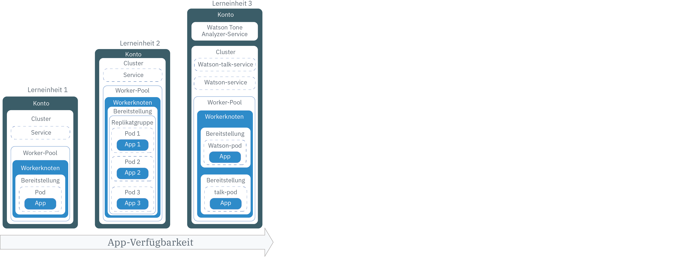
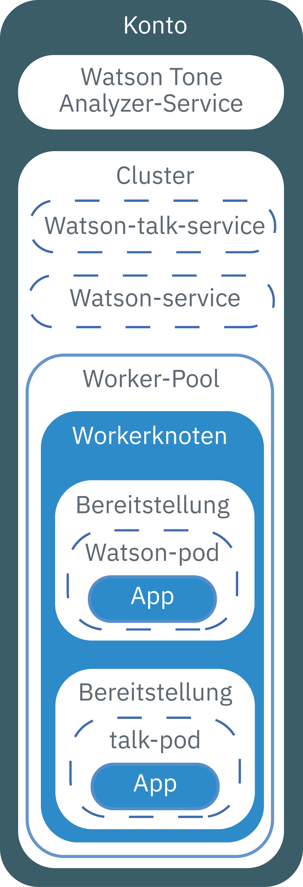

---

copyright:
  years: 2014, 2019
lastupdated: "2019-04-09"

keywords: kubernetes, iks

subcollection: containers

---

{:new_window: target="_blank"}
{:shortdesc: .shortdesc}
{:screen: .screen}
{:pre: .pre}
{:table: .aria-labeledby="caption"}
{:codeblock: .codeblock}
{:tip: .tip}
{:note: .note}
{:important: .important}
{:deprecated: .deprecated}
{:download: .download}


# Lernprogramm: Apps in Kubernetes-Clustern bereitstellen
{: #cs_apps_tutorial}

Hier erfahren Sie, wie Sie mit {{site.data.keyword.containerlong}} eine containerisierte App bereitstellen, die den {{site.data.keyword.watson}} {{site.data.keyword.toneanalyzershort}} nutzt.
{: shortdesc}

In diesem Szenario nutzt ein fiktives PR-Unternehmen den {{site.data.keyword.Bluemix_notm}}-Service, um Pressemitteilungen zu analysieren und Feedback zum Tenor in ihren Nachrichten zu erhalten.

Der App-Entwickler des PR-Unternehmens verwendet den im vorherigen Lernprogramm erstellten Kubernetes-Cluster, um eine 'Hello World'-Version der App bereitzustellen. In den aufeinander aufbauenden Lerneinheiten dieses Lernprogramms stellt der App-Entwickler zunehmend komplexere Versionen derselben App bereit. Das folgende Diagramm zeigt die Komponenten der Bereitstellungen in den einzelnen Lerneinheiten.



Wie im Diagramm dargestellt, verwendet Kubernetes verschiedene Typen von Ressourcen, um Ihre Apps betriebsbereit für die Ausführung in Clustern zu gestalten. In Kubernetes arbeiten Bereitstellungen und Services zusammen. Bereitstellungen enthalten die Definitionen für die App. Dazu zählen beispielsweise das Image, das für den Container verwendet werden soll, oder die Angabe, welcher Port für die App zugänglich gemacht werden muss. Wenn Sie eine Bereitstellung erstellen, wird für jeden Container, den Sie in der Bereitstellung definiert haben, ein Kubernetes-Pod erstellt. Um Ihre App widerstandsfähiger zu machen, können Sie in Ihrer Bereitstellung mehrere Instanzen derselben App definieren und von Kubernetes automatisch eine Replikatgruppe erstellen lassen. Die Replikatgruppe überwacht die Pods und stellt sicher, dass die angegebene Anzahl von Pods immer betriebsbereit ist. Reagiert einer der Pods nicht mehr, so wird dieser automatisch neu erstellt.

Services fassen eine Gruppe von Pods zusammen und stellen diesen Pods eine Netzverbindung für andere Services im Cluster bereit, ohne hierbei die tatsächlichen privaten IP-Adressen der einzelnen Pods preiszugeben. Mit Kubernetes-Services können Sie eine App anderen Pods im Cluster zur Verfügung stellen oder über das Internet verfügbar machen. Im vorliegenden Lernprogramm verwenden Sie einen Kubernetes-Service, um über eine öffentliche IP-Adresse, die automatisch einem Workerknoten zugewiesen wird, und einen öffentlichen Port vom Internet aus auf Ihre aktive App zuzugreifen.

Um die Verfügbarkeit Ihrer App noch weiter zu steigern, können Sie in Standardclustern einen Worker-Pool erstellen, der mehrere Zonen mit Workerknoten in jeder Zone umfasst, um eine noch größere Anzahl an Replikaten der App ausführen. Obwohl diese Task im vorliegenden Lernprogramm nicht behandelt wird, sollten Sie dieses Konzept im Hinterkopf behalten, wenn Sie zu einem späteren Zeitpunkt die Verfügbarkeit einer App weiter verbessern möchten.

Die Integration eines {{site.data.keyword.Bluemix_notm}}-Service in eine App wird nur in einer Lerneinheit behandelt. Sie können Services jedoch mit so einfach oder so komplex konzipierten Apps verwenden, wie überhaupt vorstellbar.

## Ziele
{: #apps_objectives}

* Grundlegende Kubernetes-Terminologie verstehen
* Image mit Push-Operation in Registry-Namensbereich in {{site.data.keyword.registryshort_notm}} übertragen
* App öffentlich zugänglich machen
* Einzelne Instanz einer App mit einem Kubernetes-Befehl und eine Script in einem Cluster bereitstellen
* Mehrere Instanzen einer App in Containern bereitstellen, die bei Statusprüfungen neu erstellt werden
* Eine App implementieren, die Funktionalität eines {{site.data.keyword.Bluemix_notm}}-Service verwendet

## Erforderlicher Zeitaufwand
{: #apps_time}

40 Minuten

## Zielgruppen
{: #apps_audience}

Softwareentwickler und Netzadministratoren, die erstmalig eine App in einem Kubernetes-Cluster bereitstellen.

## Voraussetzungen
{: #apps_prereqs}

[Lernprogramm: Kubernetes-Cluster erstellen](/docs/containers?topic=containers-cs_cluster_tutorial#cs_cluster_tutorial)


## Lerneinheit 1: Einzelinstanz-Apps auf Kubernetes-Clustern bereitstellen
{: #cs_apps_tutorial_lesson1}

Im vorherigen Lernprogramm haben Sie einen Cluster mit einem Workerknoten erstellt. In dieser Lerneinheit konfigurieren Sie eine Bereitstellung und stellen eine einzelne Instanz der App in einem Kubernetes-Pod im Workerknoten bereit.
{:shortdesc}

Das folgende Diagramm zeigt die Komponenten, die Sie im Rahmen dieser Lerneinheit bereitstellen.


Gehen Sie wie folgt vor, um die App bereitzustellen:

1.  Klonen Sie den Quellcode für die [App 'Hello World' ](https://github.com/IBM/container-service-getting-started-wt) in Ihr Benutzerausgangsverzeichnis. Das Repository enthält verschiedene Versionen einer ähnlichen App in Ordnern, deren Namen jeweils mit `Lab` beginnen. Jede Version enthält die folgenden Dateien:
    * `Dockerfile`: Die Builddefinitionen für das Image.
    * `app.js`: Die App 'Hello World'.
    * `package.json`: Metadaten zur App.

    ```
    git clone https://github.com/IBM/container-service-getting-started-wt.git
    ```
    {: pre}

2.  Navigieren Sie zum Verzeichnis `Lab 1`.

    ```
    cd 'container-service-getting-started-wt/Lab 1'
    ```
    {: pre}

3. [Melden Sie sich an Ihrem Konto an. Geben Sie als Ziel die entsprechende Region und, sofern zutreffend, die Ressourcengruppe an. Legen Sie den Kontext für den Cluster fest.](/docs/containers?topic=containers-cs_cli_install#cs_cli_configure)

5.  Melden Sie sich an der {{site.data.keyword.registryshort_notm}}-CLI an.

    ```
    ibmcloud cr login
    ```
    {: pre}
    -   Wenn Sie Ihren Namensbereich in {{site.data.keyword.registryshort_notm}} vergessen haben, führen Sie den folgenden Befehl aus.

        ```
        ibmcloud cr namespace-list
        ```
        {: pre}

6.  Erstellen Sie ein Docker-Image, das die App-Dateien aus dem Verzeichnis `Lab 1` enthält, und übertragen Sie das Image per Push zu dem {{site.data.keyword.registryshort_notm}}-Namensbereich, den Sie im vorherigen Lernprogramm erstellt haben. Falls zu einem späteren Zeitpunkt Änderungen an der App vorgenommen werden sollen, wiederholen Sie diese Schritte, um eine weitere Version des Image zu erstellen. **Hinweis**: Erfahren Sie mehr über das [Sichern der persönlichen Daten](/docs/containers?topic=containers-security#pi) bei der Arbeit mit Container-Images.

    Verwenden Sie im Imagenamen nur alphanumerische Zeichen in Kleinschreibung oder Unterstreichungszeichen (`_`). Vergessen Sie nicht den Punkt (`.`) am Ende des Befehls. Der Punkt signalisiert Docker, im aktuellen Verzeichnis nach der Dockerfile zu suchen und Artefakte zum Erstellen des Image zu erstellen. Zum Abrufen des Regionspräfixes für die Region, in der Sie sich momentan befinden, führen Sie den Befehl `ibmcloud api` aus. Beispiel: Der Standort Dallas in der Region 'Vereinigte Staaten (Süden)' hat das Präfix `ng`.

    ```
    ibmcloud cr build -t registry.<region>.bluemix.net/<namensbereich>/hello-world:1 .
    ```
    {: pre}

    Überprüfen Sie nach der Beendigung des Buildprozesses, dass die folgende Nachricht über die erfolgreiche Ausführung angezeigt wird:

    ```
    Successfully built <image_ID>
    Successfully tagged registry.<region>.bluemix.net/<namespace>/hello-world:1
    The push refers to a repository [registry.<region>.bluemix.net/<namespace>/hello-world]
    29042bc0b00c: Pushed
    f31d9ee9db57: Pushed
    33c64488a635: Pushed
    0804854a4553: Layer already exists
    6bd4a62f5178: Layer already exists
    9dfa40a0da3b: Layer already exists
    1: digest: sha256:f824e99435a29e55c25eea2ffcbb84be4b01345e0a3efbd7d9f238880d63d4a5 size: 1576
    ```
    {: screen}

7.  Bereitstellungen werden zum Verwalten von Pods verwendet, die containerisierte Instanzen einer App enthalten. Der folgende Befehl stellt die App in einem einzelnen Pod bereit. Im vorliegenden Lernprogramm wird der Bereitstellung der Name **hello-world-deployment** zugeordnet. Sie können jedoch einen eigenen Namen verwenden.

    ```
    kubectl run hello-world-deployment --image=registry.<region>.bluemix.net/<namensbereich>/hello-world:1
    ```
    {: pre}

    Beispielausgabe:

    ```
    deployment "hello-world-deployment" created
    ```
    {: screen}

    Erfahren Sie mehr über das [Sichern der persönlichen Daten](/docs/containers?topic=containers-security#pi) bei der Arbeit mit Kubernetes-Ressourcen.

8.  Machen Sie die App zugänglich, indem Sie die Bereitstellung als Service vom Typ 'NodePort' zur Verfügung stellen. Genau wie beim Zugänglichmachen eines Ports für eine Cloud Foundry-App machen Sie als Knotenport (NodePort) den Port zugänglich, an dem der Workerknoten für Datenverkehr empfangsbereit ist.

    ```
    kubectl expose deployment/hello-world-deployment --type=NodePort --port=8080 --name=hello-world-service --target-port=8080
    ```
    {: pre}

    Beispielausgabe:

    ```
    service "hello-world-service" exposed
    ```
    {: screen}

    <table summary=“Information about the expose command parameters.”>
    <caption>Weitere Informationen zu den Parametern von 'expose'</caption>
    <thead>
    <th colspan=2> Weitere Informationen zu den Parametern von 'expose'</th>
    </thead>
    <tbody>
    <tr>
    <td><code>expose</code></td>
    <td>Macht eine Ressource als Kubernetes-Service verfügbar und macht sie den Benutzern öffentlich zugänglich.</td>
    </tr>
    <tr>
    <td><code>deployment/<em>&lt;hello-world-deployment&gt;</em></code></td>
    <td>Der Ressourcentyp und der Name der Ressource, die mit diesem Service verfügbar gemacht werden soll.</td>
    </tr>
    <tr>
    <td><code>--name=<em>&lt;hello-world-service&gt;</em></code></td>
    <td>Der Name des Service.</td>
    </tr>
    <tr>
    <td><code>--port=<em>&lt;8080&gt;</em></code></td>
    <td>Der Port, an dem der Service bereitgestellt wird.</td>
    </tr>
    <tr>
    <td><code>--type=NodePort</code></td>
    <td>Der Typ des Service, der erstellt werden soll.</td>
    </tr>
    <tr>
    <td><code>--target-port=<em>&lt;8080&gt;</em></code></td>
    <td>Der Port, an den der Service den Datenverkehr leitet. In dieser Instanz ist der Zielport mit dem Port identisch, andere von Ihnen erstellte Apps können hiervon jedoch abweichen.</td>
    </tr>
    </tbody></table>

9. Nachdem alle Schritte für die Bereitstellung ausgeführt worden sind, können Sie Ihre App in einem Browser testen. Rufen Sie die Details ab, um die zugehörige URL zu bilden.
    1.  Rufen Sie Informationen zum Service ab, um zu erfahren, welcher Knotenport (NodePort) zugewiesen wurde.

        ```
        kubectl describe service hello-world-service
        ```
        {: pre}

        Beispielausgabe:

        ```
        Name:                   hello-world-service
        Namespace:              default
        Labels:                 run=hello-world-deployment
        Selector:               run=hello-world-deployment
        Type:                   NodePort
        IP:                     10.xxx.xx.xxx
        Port:                   <unset> 8080/TCP
        NodePort:               <unset> 30872/TCP
        Endpoints:              172.30.xxx.xxx:8080
        Session Affinity:       None
        No events.
        ```
        {: screen}

        Knotenportnummern (NodePort) werden nach dem Zufallsprinzip zugewiesen, wenn sie mit dem Befehl `expose` generiert werden, bewegen sich aber im Bereich 30000-32767. Im vorliegenden Beispiel lautet die Portnummer für den Service vom Typ 'NodePort' 30872.

    2.  Rufen Sie die öffentliche IP-Adresse für den Workerknoten im Cluster ab.

        ```
        ibmcloud ks workers --cluster <clustername_oder_-id>
        ```
        {: pre}

        Beispielausgabe:

        ```
        ibmcloud ks workers --cluster pr_firm_cluster
        Listing cluster workers...
        OK
        ID                                                 Public IP       Private IP       Machine Type   State    Status   Zone   Version
        kube-mil01-pa10c8f571c84d4ac3b52acbf50fd11788-w1   169.xx.xxx.xxx  10.xxx.xx.xxx    free           normal   Ready    mil01      1.12.7
        ```
        {: screen}

10. Öffnen Sie einen Browser und überprüfen Sie die App mit der folgenden URL: `http://<IP_address>:<NodePort>`. Anhand der Werte im Beispiel lautet die URL wie folgt: `http://169.xx.xxx.xxx:30872`. Bei Eingabe dieser URL in einen Browser wird folgender Text angezeigt.

    ```
    Hello world! Your app is up and running in a cluster!
(Hallo Welt! Ihre App steht jetzt in einem Cluster für den Betrieb bereit!)
    ```
    {: screen}

    Um zu überprüfen, ob die App öffentlich verfügbar ist, versuchen Sie, sie im Browser Ihres Mobiltelefons einzugeben.
    {: tip}

11. [Starten Sie das Kubernetes-Dashboard](/docs/containers?topic=containers-app#cli_dashboard).

    Wenn Sie den Cluster in der [{{site.data.keyword.Bluemix_notm}}-Konsole](https://cloud.ibm.com/) auswählen, können Sie über die Schaltfläche **Kubernetes-Dashboard** das Dashboard mit einem einzigen Klick starten.
    {: tip}

12. Auf der Registerkarte **Workloads** werden die von Ihnen erstellten Ressourcen angezeigt.

Gute Arbeit! Sie haben die erste Version der App bereitgestellt.

Sie sind der Ansicht, dass diese Lerneinheit zu viele Befehle enthält? Ganz Ihrer Meinung. Warum also verwenden Sie nicht ein Konfigurationsscript, das Ihnen einen Teil der Arbeit abnimmt? Um für die zweite Version der App ein Konfigurationsscript zu verwenden und durch die Bereitstellung mehrerer Instanzen dieser App ein höheres Maß an Verfügbarkeit erreichen, fahren Sie mit der nächsten Lerneinheit fort.

<br />


## Lerneinheit 2: Apps mit höherer Verfügbarkeit bereitstellen und aktualisieren
{: #cs_apps_tutorial_lesson2}

In dieser Lerneinheit stellen Sie drei Instanzen der App 'Hello World' in einem Cluster mit höherer Verfügbarkeit als in der ersten Version der App bereit.
{:shortdesc}

Höhere Verfügbarkeit bedeutet, dass der Benutzerzugriff auf drei Instanzen aufgeteilt ist. Versuchen zu viele Benutzer, auf dieselbe Instanz der App zuzugreifen, so können schleppende Reaktionszeiten auftreten. Eine höhere Anzahl von Instanzen kann für Ihre Benutzer gleichbedeutend mit geringeren Reaktionszeiten sein. In der vorliegenden Lerneinheit erfahren Sie außerdem, wie Statusprüfungen und Bereitstellungsaktualisierungen mit Kubernetes funktionieren können. Das folgende Diagramm enthält die von Ihnen im Rahmen der Lerneinheit bereitgestellten Komponenten.


Im vorherigen Lernprogramm haben Sie ein eigenes Konto und einen Cluster mit einem Workerknoten erstellt. In dieser Lerneinheit konfigurieren Sie eine Bereitstellung und stellen drei Instanzen der App 'Hello World' bereit. Jede dieser Instanzen wird in einem Kubernetes-Pod als Teil einer Replikatgruppe im Workerknoten implementiert. Um die App öffentlich zu machen, erstellen Sie zudem einen Kubernetes-Service.

Wie im Konfigurationsscript definiert kann Kubernetes anhand einer Verfügbarkeitsprüfung feststellen, ob ein Container in einem Pod aktiv oder inaktiv ist. Mit diesen Prüfungen können gegebenenfalls Deadlocks abgefangen werden, bei denen eine App zwar aktiv, nicht aber in der Lage ist, Verarbeitungsfortschritt zu machen. Durch den Neustart eines Containers, der sich in einem solchen Zustand befindet, ist es möglich, die Verfügbarkeit der App trotz Fehlern zu erhöhen. Anhand einer Bereitschaftsprüfung ermittelt Kubernetes dann, wann ein Container wieder für die Entgegennahme von Datenverkehr ist. Ein Pod gilt als bereit, wenn sein Container bereit ist. Wenn der Pod bereit ist, wird er wieder gestartet. In dieser Version der App wird das Zeitlimit alle 15 Sekunden überschritten. Da im Konfigurationsscript eine Statusprüfung konfiguriert ist, werden Container erneut  erstellt, falls bei der Statusprüfung ein Problem im Zusammenhang mit der App festgestellt wird.

1.  Navigieren Sie in einer CLI (Befehlszeilenschnittstelle) zum Verzeichnis `Lab 2`.

  ```
  cd 'container-service-getting-started-wt/Lab 2'
  ```
  {: pre}

2.  Wenn Sie eine CLI-Sitzung gestartet haben, melden Sie sich an und legen Sie den Clusterkontext fest.

3.  Erstellen und kennzeichnen (taggen) Sie die App und übertragen Sie sie per Push als Image an Ihren Namensbereich in {{site.data.keyword.registryshort_notm}}.  Vergessen Sie auch hier nicht den Punkt (`.`) am Ende des Befehls.

    ```
    ibmcloud cr build -t registry.<region>.bluemix.net/<namensbereich>/hello-world:2 .
      ```
    {: pre}

    Stellen Sie sicher, dass die Nachricht über die erfolgreiche Ausführung angezeigt wird.

    ```
    Successfully built <image_ID>
    Successfully tagged registry.<region>.bluemix.net/<namespace>/hello-world:1
    The push refers to a repository [registry.<region>.bluemix.net/<namespace>/hello-world]
    29042bc0b00c: Pushed
    f31d9ee9db57: Pushed
    33c64488a635: Pushed
    0804854a4553: Layer already exists
    6bd4a62f5178: Layer already exists
    9dfa40a0da3b: Layer already exists
    1: digest: sha256:f824e99435a29e55c25eea2ffcbb84be4b01345e0a3efbd7d9f238880d63d4a5 size: 1576
    ```
    {: screen}

4.  Öffnen Sie die Datei `healthcheck.yml` im Verzeichnis `Lab 2` mit einem Texteditor. Dieses Konfigurationsscript verbindet einige Schritte aus der vorherigen Lerneinheit, um zur gleichen Zeit eine Bereitstellung sowie einen Service zu erstellen. Die App-Entwickler des PR-Unternehmens können diese Scripts verwenden, wenn Aktualisierungen durchgeführt werden. Sie können sie auch im Rahmen der Fehlerbehebung einsetzen, indem Sie die Pods neu erstellen.
    1. Aktualisieren Sie die Details für das Image in Ihrem privaten Registry-Namensbereich.

        ```
        image: "registry.<region>.bluemix.net/<namensbereich>/hello-world:2"
        ```
        {: codeblock}

    2.  Beachten Sie im Abschnitt **Deployment** für die Bereitstellung die Angabe für die Anzahl der Replikate (`replicas`). Replikate sind gleichbedeutend mit der Anzahl von Instanzen Ihrer App. Durch Ausführen von drei Instanzen ist die Verfügbarkeit der App sehr viel höher als dies bei Ausführung von nur einer Instanz der Fall wäre.

        ```
        replicas: 3
        ```
        {: codeblock}

    3.  Beachten Sie die HTTP-Aktivitätsprüfung (livenessProbe), die den Zustand des Containers alle 5 Sekunden überprüft.

        ```
        livenessProbe:
                    httpGet:
                      path: /healthz
                      port: 8080
                    initialDelaySeconds: 5
                    periodSeconds: 5
        ```
        {: codeblock}

    4.  Beachten Sie im Abschnitt **Service** die Angabe für die Knotenportnummern (`NodePort`). Anstatt einen Knotenport nach dem Zufallsprinzip generieren zu lassen, wie das der Fall in der vorherigen Lerneinheit war, können Sie eine Portnummer im Bereich 30000-32767 angeben. Das vorliegende Beispiel verwendet die Nummer 30072.

5.  Wechseln Sie zurück zu der CLI, die Sie zum Festlegen des Clusterkontexts verwendet haben, und führen Sie das Konfigurationsscript aus. Wenn die Bereitstellung und der Service erstellt worden sind, kann die App gegenüber den Benutzern des PR-Unternehmens verfügbar gemacht werden.

  ```
  kubectl apply -f healthcheck.yml
  ```
  {: pre}

  Beispielausgabe:

  ```
  deployment "hw-demo-deployment" created
  service "hw-demo-service" created
  ```
  {: screen}

6.  Nachdem die Bereitstellung nun abgeschlossen ist, können Sie einen Browser öffnen und die App überprüfen. Um die URL zu bilden, kombinieren Sie die öffentliche IP-Adresse, die Sie in der vorherigen Lerneinheit für Ihren Workerknoten verwendet haben, mit der Knotenportnummer (NodePort), die im Konfigurationsscript angegeben war. So rufen Sie die öffentliche IP-Adresse für den Workerknoten ab:

  ```
  ibmcloud ks workers --cluster <clustername_oder_-id>
  ```
  {: pre}

  Anhand der Werte im Beispiel lautet die URL wie folgt: `http://169.xx.xxx.xxx:30072`. Bei Eingabe dieser URL in einen Browser wird gegebenenfalls der folgende Text angezeigt. Falls dieser Text nicht angezeigt wird, machen Sie sich keine Gedanken. Diese App wurde für alternierende Intervalle von Aktivität und Inaktivität konzipiert.

  ```
  Hello world! Great job getting the second stage up and running! (Hallo Welt! Sie haben Stage2 hervorragend umgesetzt.)
  ```
  {: screen}

  Sie können den Status auch unter `http://169.xx.xxx.xxx:30072/healthz` überprüfen.

  Während der ersten 10-15 Sekunden wird eine Nachricht vom Typ 200 zurückgegeben. Dadurch wissen Sie, dass die App erfolgreich ausgeführt wird. Nach Verstreichen dieser 15 Sekunden wird eine Zeitlimitnachricht angezeigt. Dies entspricht dem erwarteten Verhalten.

  ```
  {
    "error": "Timeout, Health check error!" ("Fehler": "Zeitlimitüberschreitung, Fehler bei Statusprüfung!")
  }
  ```
  {: screen}

7.  Überprüfen Sie Ihren Podstatus, um den Zustand Ihrer App in Kubernetes zu überwachen. Sie können den Status über die CLI oder im Kubernetes-Dashboard überprüfen.

    *  **Über die CLI**: Beobachten Sie, was mit Ihren Pods geschieht, während sich ihr Status ändert.
       ```
       kubectl get pods -o wide -w
       ```
       {: pre}

    *  **Im Kubernetes-Dashboard**:

       1.  [Starten Sie das Kubernetes-Dashboard](/docs/containers?topic=containers-app#cli_dashboard).
       2.  Auf der Registerkarte **Workloads** werden die von Ihnen erstellten Ressourcen angezeigt. Von dieser Registerkarte aus können Sie die Anzeige fortlaufend aktualisieren lassen und sicherstellen, dass die Statusprüfung ordnungsgemäß funktioniert. Im Abschnitt **Pods** wird angegeben, wie häufig die Pods erneut gestartet werden, wenn die in ihnen enthaltenen Container erneut erstellt werden. Falls Sie per Zufall den folgenden Fehler im Dashboard abfangen, so beachten Sie, das diese Nachricht darauf hinweist, dass bei der Statusprüfung ein Problem festgestellt wurde. Warten Sie einige Minuten ab und aktualisieren Sie dann die Anzeige erneut. Sie können erkennen, dass die Anzahl von Neustarts für jeden Pod variiert.

       ```
       Liveness probe failed: HTTP probe failed with statuscode: 500
Back-off restarting failed docker container
Error syncing pod, skipping: failed to "StartContainer" for "hw-container" with CrashLoopBackOff: "Back-off 1m20s restarting failed container=hw-container pod=hw-demo-deployment-3090568676-3s8v1_default(458320e7-059b-11e7-8941-56171be20503)"
(Aktivitätsprüfung fehlgeschlagen: HTTP-Prüfung fehlgeschlagen mit Statuscode: 500
Fehlgeschlagener Container wird mit 'Back-off' neu gestartet
Fehler bei Synchronisierung von Pod, wird übersprungen: "StartContainer" für "hw-container" mit CrashLoopBackOff fehlgeschlagen: "Back-off 1m20s restarting failed container=hw-container pod=hw-demo-deployment-3090568676-3s8v1_default(458320e7-059b-11e7-8941-56171be20503)"
       ```
       {: screen}

Gute Arbeit! Sie haben die zweite Version der App bereitgestellt. Hierzu haben Sie eine geringere Anzahl von Befehlen verwenden müssen, konnten erfahren, wie Statusprüfungen funktionieren, und haben eine Bereitstellung bearbeitet, was hervorragend ist. Die App 'Hello World' hat den Test für das PR-Unternehmen bestanden. Nun können Sie eine App mit höherem Nutzwert für das PR-Unternehmen bereitstellen, um mit der Analyse von Pressemitteilungen zu beginnen.

Sind Sie bereit, die von Ihnen erstellten Elemente zu löschen, bevor Sie fortfahren? Dieses Mal können Sie dasselbe Konfigurationsscript verwenden, um die beiden von Ihnen erstellten Ressourcen zu löschen.

  ```
  kubectl delete -f healthcheck.yml
  ```
  {: pre}

  Beispielausgabe:

  ```
  deployment "hw-demo-deployment" deleted
service "hw-demo-service" deleted
  ```
  {: screen}

<br />


## Lerneinheit 3: App 'Watson Tone Analyzer' bereitstellen und aktualisieren
{: #cs_apps_tutorial_lesson3}

In den vorherigen Lerneinheiten wurden die Apps als einzelne Komponenten in einem Workerknoten bereitgestellt. In dieser Lerneinheit stellen Sie zwei Komponenten einer App in einem Cluster bereit, die den Service {{site.data.keyword.watson}} {{site.data.keyword.toneanalyzershort}} verwenden.
{:shortdesc}

Durch das Aufteilen der Komponenten auf verschiedene Container stellen Sie sicher, dass Sie ein Element aktualisieren können, ohne dass sich dies nachteilig auf die übrigen auswirkt. Dann aktualisieren Sie die App, um sie mit einer größeren Anzahl von Replikaten vertikal zu skalieren und so ihre Verfügbarkeit weiter zu steigern. Das folgende Diagramm enthält die von Ihnen im Rahmen der Lerneinheit bereitgestellten Komponenten.



Aus dem vorherigen Lernprogramm verfügen Sie bereits über ein Konto und einen Cluster mit einem Workerknoten. In dieser Lerneinheit erstellen Sie eine Instanz des {{site.data.keyword.watson}} {{site.data.keyword.toneanalyzershort}}-Service in Ihrem {{site.data.keyword.Bluemix_notm}}-Konto und konfigurieren zwei Bereitstellungen (eine Bereitstellung für jede Komponente der App). Jede Komponente wird in einem Kubernetes-Pod im Workerknoten implementiert. Um beide Komponenten öffentlich zu machen, erstellen Sie zudem für jede Komponente einen Kubernetes-Service.


### Lerneinheit 3a: App '{{site.data.keyword.watson}} {{site.data.keyword.toneanalyzershort}}' bereitstellen
{: #lesson3a}

1.  Navigieren Sie in einer CLI (Befehlszeilenschnittstelle) zum Verzeichnis `Lab 3`.

  ```
  cd 'container-service-getting-started-wt/Lab 3'
  ```
  {: pre}

2.  Wenn Sie eine CLI-Sitzung gestartet haben, melden Sie sich an und legen Sie den Clusterkontext fest.

3.  Erstellen Sie das erste {{site.data.keyword.watson}}-Image.

    1.  Navigieren Sie zum Verzeichnis `watson`.

        ```
        cd watson
        ```
        {: pre}

    2.  Erstellen und kennzeichnen (taggen) Sie die `watson`-App und übertragen Sie sie per Push als Image an Ihren Namensbereich in {{site.data.keyword.registryshort_notm}}. Vergessen Sie auch hier nicht den Punkt (`.`) am Ende des Befehls.

        ```
        ibmcloud cr build -t registry.<region>.bluemix.net/<namensbereich>/watson .
        ```
        {: pre}

        Stellen Sie sicher, dass die Nachricht über die erfolgreiche Ausführung angezeigt wird.

        ```
        Successfully built <image-id>
        ```
        {: screen}

4.  Erstellen Sie das '{{site.data.keyword.watson}}-talk'-Image.

    1.  Navigieren Sie zum Verzeichnis `watson-talk`.

        ```
        cd 'container-service-getting-started-wt/Lab 3/watson-talk'
        ```
        {: pre}

    2.  Erstellen und kennzeichnen (taggen) Sie die `watson-talk`-App und übertragen Sie sie per Push als Image an Ihren Namensbereich in {{site.data.keyword.registryshort_notm}}. Vergessen Sie auch hier nicht den Punkt (`.`) am Ende des Befehls.

        ```
        ibmcloud cr build -t registry.<region>.bluemix.net/<namensbereich>/watson-talk .
        ```
        {: pre}

        Stellen Sie sicher, dass die Nachricht über die erfolgreiche Ausführung angezeigt wird.

        ```
        Successfully built <image-id>
        ```
        {: screen}

5.  Überprüfen Sie, ob die Images erfolgreich zu Ihrem Registry-Namensbereich hinzugefügt wurden.

    ```
    ibmcloud cr images
    ```
    {: pre}

    Beispielausgabe:

    ```
    Listing images...

    REPOSITORY                                      NAMESPACE  TAG      DIGEST         CREATED         SIZE     VULNERABILITY STATUS
    registry.ng.bluemix.net/namespace/hello-world   namespace  1        0d90cb732881   40 minutes ago  264 MB   OK
    registry.ng.bluemix.net/namespace/hello-world   namespace  2        c3b506bdf33e   20 minutes ago  264 MB   OK
    registry.ng.bluemix.net/namespace/watson        namespace  latest   fedbe587e174   3 minutes ago   274 MB   OK
    registry.ng.bluemix.net/namespace/watson-talk   namespace  latest   fedbe587e174   2 minutes ago   274 MB   OK
    ```
    {: screen}

6.  Öffnen Sie die Datei `watson-deployment.yml` im Verzeichnis `Lab 3` mit einem Texteditor. Dieses Konfigurationsscript enthält sowohl für die `watson`- als auch die `watson-talk`-Komponente der App eine Bereitstellung und einen Service.

    1.  Aktualisieren Sie für beide Bereitstellungen die Details für das Image in Ihrem Registry-Namensbereich.

        watson:

        ```
        image: "registry.<region>.bluemix.net/namespace/watson"
        ```
        {: codeblock}

        watson-talk:

        ```
        image: "registry.<region>.bluemix.net/namespace/watson-talk"
        ```
        {: codeblock}

    2.  Aktualisieren Sie im Datenträgerabschnitt ('volumes') der `watson-pod`-Bereitstellung den Namen des geheimen Schlüssels für {{site.data.keyword.watson}} {{site.data.keyword.toneanalyzershort}}, den Sie im vorherigen [Lernprogramm: Kubernetes-Cluster erstellen](/docs/containers?topic=containers-cs_cluster_tutorial#cs_cluster_tutorial_lesson4) erstellt haben. Wenn Sie den geheimen Kubernetes-Schlüssel als Datenträger an Ihre Bereitstellung anhängen, stellen Sie den {{site.data.keyword.Bluemix_notm}} IAM-API-Schüssel (Identity and Access Management) dem Container zur Verfügung, der in Ihrem Pod ausgeführt wird. Die {{site.data.keyword.watson}}-App-Komponenten in diesem Lernprogramm sind so konfiguriert, dass sie den API-Schlüssel unter Verwendung des Datenträgermountpfads suchen.

        ```
        volumes:
                - name: service-bind-volume
                  secret:
                    defaultMode: 420
                    secretName: binding-mytoneanalyzer
        ```
        {: codeblock}

        Falls Sie vergessen haben, welchen Namen Sie dem geheimen Schlüssel zugeordnet haben, führen Sie den folgenden Befehl aus.

        ```
        kubectl get secrets --namespace=default
        ```
        {: pre}

    3.  Beachten Sie im Abschnitt für den Service 'watson-talk' die Knotenportnummer, die für `NodePort` festgelegt ist. Das vorliegende Beispiel verwendet die Nummer 30080.

7.  Führen Sie das Konfigurationsscript aus.

  ```
  kubectl apply -f watson-deployment.yml
  ```
  {: pre}

8.  Optional: Überprüfen Sie, ob der geheime Schlüssel für {{site.data.keyword.watson}} {{site.data.keyword.toneanalyzershort}} als Datenträger an den Pod angehängt wurde.

    1.  Wenn Sie den Namen eines Watson-Pods abrufen wollen, führen Sie den folgenden Befehl aus:

        ```
        kubectl get pods
        ```
        {: pre}

        Beispielausgabe:

        ```
        NAME                                 READY     STATUS    RESTARTS  AGE
        watson-pod-4255222204-rdl2f          1/1       Running   0         13h
        watson-talk-pod-956939399-zlx5t      1/1       Running   0         13h
        ```
        {: screen}

    2.  Rufen Sie die Details zum Pod ab und suchen Sie den Namen des geheimen Schlüssels.

        ```
        kubectl describe pod <podname>
        ```
        {: pre}

        Beispielausgabe:

        ```
        Volumes:
          service-bind-volume:
            Type:       Secret (Datenträger, der mit einem geheimen Schlüssel belegt ist)
            SecretName: binding-mytoneanalyzer
          default-token-j9mgd:
            Type:       Secret (Datenträger, der mit einem geheimen Schlüssel belegt ist)
            SecretName: default-token-j9mgd
        ```
        {: codeblock}

9.  Öffnen Sie einen Browser und analysieren Sie Text. Die URL weist das folgende Format auf: `http://<worker_node_IP_address>:<watson-talk-nodeport>/analyze/"<text_to_analyze>"`.

    Beispiel:

    ```
    http://169.xx.xxx.xxx:30080/analyze/"Heute ist ein herrlicher Tag"
    ```
    {: screen}

    In einem Browser wird die JSON-Antwort auf den von Ihnen eingegebenen Text angezeigt.

10. [Starten Sie das Kubernetes-Dashboard](/docs/containers?topic=containers-app#cli_dashboard).

11. Auf der Registerkarte **Workloads** werden die von Ihnen erstellten Ressourcen angezeigt.

### Lerneinheit 3b. Aktive Bereitstellung von 'Watson Tone Analyzer' aktualisieren
{: #lesson3b}

Während der Ausführung einer Bereitstellung können Sie die Bereitstellung durch Änderung von Werten in der Pod-Vorlage bearbeiten. In dieser Lerneinheit aktualisieren Sie das verwendete Image. Die PR-Firma möchte die App in der Bereitstellung ändern.
{: shortdesc}

Ändern Sie den Namen des Image:

1.  Öffnen Sie die Konfigurationsdetails für die aktive Bereitstellung.

    ```
    kubectl edit deployment/watson-talk-pod
    ```
    {: pre}

    Abhängig vom verwendeten Betriebssystem wird ein Editor vom Typ 'vi' oder ein Texteditor geöffnet.

2.  Ändern Sie den Namen des Image in das 'ibmliberty'-Image.

    ```
    spec:
          containers:
          - image: registry.<region>.bluemix.net/ibmliberty:latest
    ```
    {: codeblock}

3.  Speichern Sie die Änderungen und beenden Sie den Editor.

4.  Wenden Sie die Änderungen auf die aktive Bereitstellung an.

    ```
    kubectl rollout status deployment/watson-talk-pod
    ```
    {: pre}

    Warten Sie die Bestätigung ab, dass der Rollout vollständig abgeschlossen wurde.

    ```
    deployment "watson-talk-pod" successfully rolled out
    ```
    {: screen}

    Wenn Sie eine Änderung implementieren, wird ein weiterer Pod von Kubernetes erstellt getestet. Wenn der Test erfolgreich ist, wird der alte Pod entfernt.

[Testen Sie Ihr Wissen und nehmen Sie an einem Quiz teil! ](https://ibmcloud-quizzes.mybluemix.net/containers/apps_tutorial/quiz.php)

Gute Arbeit! Sie haben die App '{{site.data.keyword.watson}} {{site.data.keyword.toneanalyzershort}}' bereitgestellt. Das PR-Unternehmen kann diese Bereitstellung künftig einsetzen, um mit der Analyse seiner Pressemitteilungen zu beginnen.

Sind Sie bereit, die von Ihnen erstellten Elemente zu löschen? Zum Löschen der von Ihnen erstellten Ressourcen können Sie das Konfigurationsscript verwenden.

  ```
  kubectl delete -f watson-deployment.yml
  ```
  {: pre}

  Beispielausgabe:

  ```
  deployment "watson-pod" deleted
  deployment "watson-talk-pod" deleted
  service "watson-service" deleted
  service "watson-talk-service" deleted
  ```
  {: screen}

  Falls Sie den Cluster nicht beibehalten wollen, können Sie diesen ebenfalls löschen.

  ```
  ibmcloud ks cluster-rm --cluster <clustername_oder_-id>
  ```
  {: pre}

## Womit möchten Sie fortfahren?
{: #apps_next}

Nachdem Sie sich mit den grundlegenden Informationen vertraut gemacht haben, können Sie nun komplexere Aufgaben in Angriff nehmen. Ziehen Sie eine der folgenden Aufgaben in Betracht:

- Ein [kompliziertes Lab ](https://github.com/IBM/container-service-getting-started-wt#lab-overview) im Repository vervollständigen
- [Apps automatisch skalieren](/docs/containers?topic=containers-app#app_scaling) mit {{site.data.keyword.containerlong_notm}}
- Lernprogramme für Codemuster für die Containerorchestrierung unter [IBM Developer ](https://developer.ibm.com/technologies/containers/) erkunden
