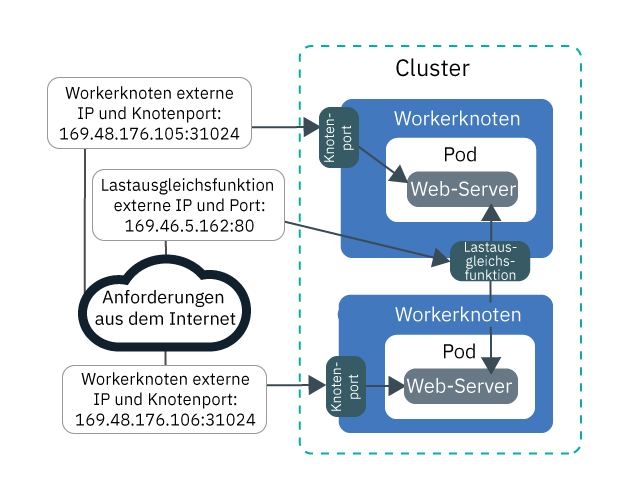
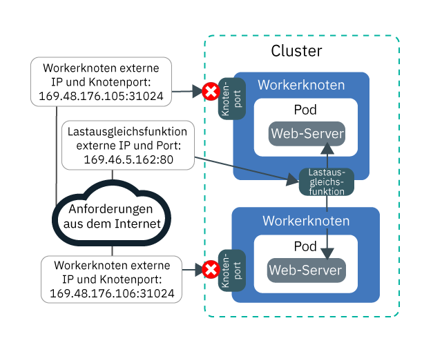
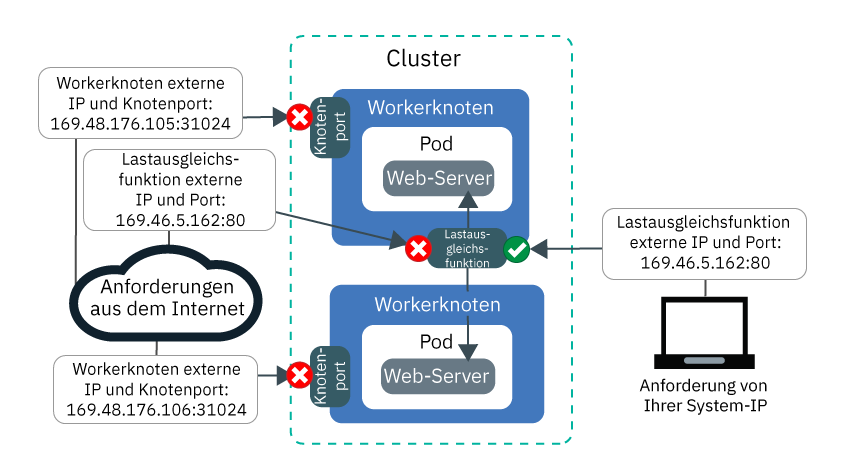
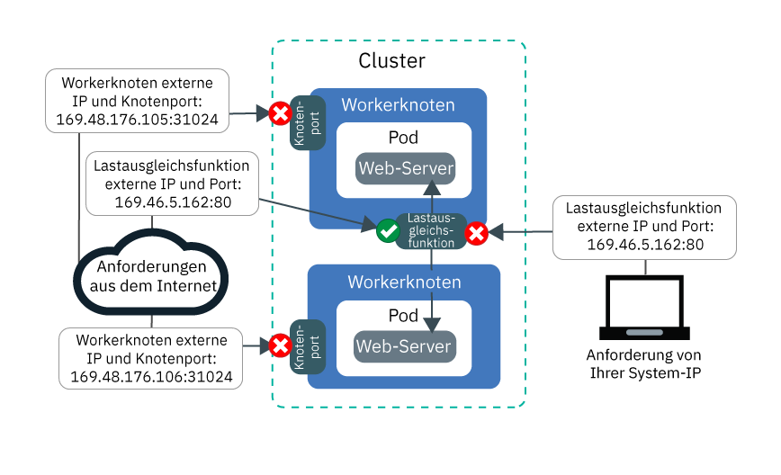

---

copyright:
  years: 2014, 2018
lastupdated: "2018-12-05"

---

{:new_window: target="_blank"}
{:shortdesc: .shortdesc}
{:screen: .screen}
{:pre: .pre}
{:table: .aria-labeledby="caption"}
{:codeblock: .codeblock}
{:tip: .tip}
{:note: .note}
{:important: .important}
{:deprecated: .deprecated}
{:download: .download}


# Lernprogramm: Calico-Netzrichtlinien zum Blockieren von Datenverkehr verwenden
{: #policy_tutorial}

Standardmäßig wird Ihre App durch die NodePort-, LoadBalancer- und Ingress-Services von Kubernetes in allen öffentlichen und privaten Clusternetzschnittstellen verfügbar gemacht. Die Calico-Standardrichtlinie `allow-node-port-dnat` ermöglicht eingehenden Datenverkehr von Knotenportservices, Services für die Lastausgleichsfunktion und Ingress-Services zu den App-Pods zu, die diese Services zugänglich machen. Kubernetes verwendet die Zielnetzadressumsetzung (DNAT – Destination Network Address Translation), um Serviceanforderungen an die richtigen Pods weiterzuleiten.
{: shortdesc}

Aus Sicherheitsgründen ist es jedoch unter Umständen erforderlich, dass der Datenverkehr zu den Netzservices nur über bestimmte Quellen-IP-Adressen zulässig ist. Sie können [Calico-Richtlinien des Typs 'Pre-DNAT' ](https://docs.projectcalico.org/v3.1/getting-started/bare-metal/policy/pre-dnat) verwenden, um Datenverkehr von oder zu bestimmten IP-Adressen in Whitelists oder Blacklists zu führen. Mit Pre-DNAT-Richtlinien wird verhindert, dass angegebener Datenverkehr Ihre Apps erreicht, da die Richtlinien angewendet werden, bevor Kubernetes reguläre DNAT verwendet, um Datenverkehr an Pods weiterzuleiten. Wenn Sie Calico-Richtlinien des Typs Pre-DNAT erstellen, wählen Sie aus, ob Quellen-IP-Adressen in einer Whitelist oder einer Blacklist geführt werden. In den meisten Szenarios bietet das Setzen auf eine Whitelist die sicherste Konfiguration, da der gesamte Datenverkehr mit Ausnahme des Verkehrs von bekannten, zulässigen Quellen-IP-Adressen blockiert wird. Das Setzen auf eine Blacklist ist in der Regel nur in Szenarios nützlich, in denen z. B. ein Angriff, der von einer kleinen Gruppe von IP-Adressen ausgeht, verhindert werden soll.

In diesem Szenario übernehmen Sie die Rolle des Netzadministrators für eine PR-Firma und Sie bemerken ungewöhnlichen Datenverkehr, der Ihre Apps erreicht. Die Lerneinheiten in diesem Lernprogramm führen Sie durch die Schritte für die Erstellung einer Web-Server-Beispielapp, für das Verfügbarmachen der App mithilfe eines Lastausgleichsservice und für das Schützen der App vor unerwünschtem ungewöhnlichen Datenverkehr mithilfe von Calico-Richtlinien für eine Whitelist und eine Blacklist.

## Ziele

- Erlernen Sie, wie der gesamte und zu allen Knotenports eingehende Datenverkehr durch Erstellen einer höchstwertigen Pre-DNAT-Richtlinie blockiert wird.
- Erlernen Sie, wie Sie den auf eine Whitelist gesetzten Quellen-IP-Adressen den Zugriff auf die öffentliche Lastausgleichsfunktions-IP und den Port ermöglichen, indem Sie eine niederwertige Pre-DNAT-Richtlinie erstellen. Niederwertigere Richtlinien setzen höherwertigere Richtlinien außer Kraft.
- Erlernen Sie, wie Sie den auf eine Blacklist gesetzten Quellen-IP-Adressen den Zugriff auf die öffentliche Lastausgleichsfunktions-IP und den Port verweigern, indem Sie eine niederwertige Pre-DNAT-Richtlinie erstellen.

## Erforderlicher Zeitaufwand
1 Stunde

## Zielgruppe
Dieses Lernprogramm ist für Softwareentwickler und Netzadministratoren konzipiert, die den an eine App gehenden Netzverkehr verwalten möchten.

## Voraussetzungen

- [Erstellen Sie einen Cluster der Version 1.10 oder höher](cs_clusters.html#clusters_ui) oder [aktualisieren Sie einen vorhandenen Cluster auf Version 1.10](cs_versions.html#cs_v110). Ein Cluster mit Kubernetes Version 1.10 oder höher muss in diesem Lernprogramm die Calico-CLI der Version 3.3.1 und die Syntax für Calico Version 3-Richtlinien verwenden.
- [Geben Sie als Ziel Ihrer CLI den Cluster an](cs_cli_install.html#cs_cli_configure).
- [Installieren und konfigurieren Sie die Calico-CLI](cs_network_policy.html#1.10_install).
- Stellen Sie sicher, dass Sie über die folgenden {{site.data.keyword.Bluemix_notm}} IAM-Zugriffsrichtlinien für {{site.data.keyword.containerlong_notm}} verfügen:
    - [Beliebige Plattformrolle](cs_users.html#platform)

<br />


## Lerneinheit 1: App bereitstellen und mit einer Lastausgleichsfunktion zugänglich machen
{: #lesson1}

In der ersten Lerneinheit erfahren Sie, wie Ihre App von mehreren IP-Adressen und Ports aus zugänglich gemacht wird und an welcher Stelle öffentlicher Datenverkehr in Ihren Cluster eingeht.
{: shortdesc}

Starten Sie mit der Bereitstellung einer Web-Server-Beispielapp, die während des gesamten Lernprogramms verwendet wird. Der Web-Server `echoserver` zeigt Daten zu der Verbindung an, die vom Client zum Cluster hergestellt wird, und lässt Sie den Zugriff auf den Cluster der PR-Firma testen. Machen Sie die App anschließend durch Erstellen eines Lastausgleichsservice der Version 2.0 zugänglich. Eine Lastausgleichsfunktion der Version 2.0 macht Ihre App sowohl über die IP-Adresse des Lastausgleichsservice als auch über die Knotenports der Workerknoten zugänglich.

Möchten Sie stattdessen eine [Ingress-Lastausgleichsfunktion für Anwendungen (Application Load Balancer, ALB)](cs_ingress.html) verwenden? Überspringen Sie die Erstellung der Lastausgleichsfunktion in den Schritten 3 und 4. Verwenden Sie stattdessen die öffentlichen IPs Ihrer ALBs, indem Sie `ibmcloud ks albs --cluster <cluster_name>` ausführen, und verwenden Sie diese IPs während des gesamten Lernprogramms anstelle von `<loadbalancer_IP>.`
{: tip}

Aus der folgenden Abbildung geht hervor, wie die Web-Server-App am Ende von Lerneinheit 1 über den öffentlichen Knotenport und die öffentliche Lastausgleichsfunktion im Internet zugänglich gemacht wird:



1. Stellen Sie die Web-Server-Beispielapp bereit. Wenn eine Verbindung zur Web-Server-App hergestellt ist, antwortet die App mit den HTTP-Headern, die sie in der Verbindung empfangen hat.
    ```
    kubectl run webserver --image=k8s.gcr.io/echoserver:1.10 --replicas=3
    ```
    {: pre}

2. Stellen Sie sicher, dass der **STATUS** der Web-Server-App-Pods 'Aktiv' (`Running`) lautet.
    ```
    kubectl get pods -o wide
    ```
    {: pre}

    Beispielausgabe:
    ```
    NAME                         READY     STATUS    RESTARTS   AGE       IP               NODE
    webserver-855556f688-6dbsn   1/1       Running   0          1m        172.30.xxx.xxx   10.176.48.78
    webserver-855556f688-76rkp   1/1       Running   0          1m        172.30.xxx.xxx   10.176.48.78
    webserver-855556f688-xd849   1/1       Running   0          1m        172.30.xxx.xxx   10.176.48.78
    ```
    {: screen}

3. Um die App im öffentlichen Internet zugänglich zu machen, erstellen Sie für den Lastausgleichsservice der Version 2.0 in einem Texteditor eine Konfigurationsdatei mit dem Namen `webserver-lb.yaml`.
    ```
    apiVersion: v1
    kind: Service
    metadata:
      labels:
        run: webserver
      name: webserver-lb
      annotations:
        service.kubernetes.io/ibm-load-balancer-cloud-provider-enable-features: "ipvs"
    spec:
      type: LoadBalancer
      selector:
        run: webserver
      ports:
      - name: webserver-port
        port: 80
        protocol: TCP
        targetPort: 8080
      externalTrafficPolicy: Local
    ```
    {: codeblock}

4. Stellen Sie die Lastausgleichsfunktion bereit.
    ```
    kubectl apply -f filepath/webserver-lb.yaml
    ```
    {: pre}

5. Stellen Sie sicher, dass Sie von Ihrem Computer aus öffentlich auf die App zugreifen können, die von der Lastausgleichsfunktion zugänglich gemacht wird.

    1. Rufen Sie die öffentliche IP-Adresse (**EXTERNAL-IP**) der Lastausgleichsfunktion ab.
        ```
        kubectl get svc -o wide
        ```
        {: pre}

        Beispielausgabe:
        ```
        NAME           CLUSTER-IP       EXTERNAL-IP        PORT(S)        AGE       SELECTOR
        webserver-lb   172.21.xxx.xxx   169.xx.xxx.xxx     80:31024/TCP   2m        run=webserver
        ```
        {: screen}

    2. Erstellen Sie mit Spickzettel eine Textdatei und kopieren Sie die IP der Lastausgleichsfunktion in die Textdatei. Mithilfe des Spickzettels können Sie in späteren Lerneinheiten Werte schneller verwenden.

    3. Stellen Sie sicher, dass Sie öffentlich auf die externe IP der Lastausgleichsfunktion zugreifen können.
        ```
        curl --connect-timeout 10 <ip_der_lastausgleichsfunktion>:80
        ```
        {: pre}

        In der folgenden Beispielausgabe wird bestätigt, dass die Lastausgleichsfunktion Ihre App an der öffentlichen IP-Adresse `169.1.1.1` der Lastausgleichsfunktion zugänglich macht. Der App-Pod `webserver-855556f688-76rkp` hat die curl-Anforderung empfangen:
        ```
        Hostname: webserver-855556f688-76rkp
        Pod Information:
            -no pod information available-
        Server values:
            server_version=nginx: 1.13.3 - lua: 10008
        Request Information:
            client_address=1.1.1.1
            method=GET
            real path=/
            query=
            request_version=1.1
            request_scheme=http
            request_uri=http://169.1.1.1:8080/
        Request Headers:
            accept=*/*
            host=169.1.1.1
            user-agent=curl/7.54.0
        Request Body:
            -no body in request-
        ```
        {: screen}

6. Überprüfen Sie, ob Sie von Ihrem Computer aus öffentlich auf die App zugreifen können, die vom Knotenport zugänglich gemacht wurde. Ein Lastausgleichsservice macht Ihre App sowohl über die IP-Adresse des Lastausgleichsservice als auch über die Knotenports der Workerknoten zugänglich.

    1. Rufen Sie den Knotenport ab, der den Workerknoten von der Lastausgleichsfunktion zugeordnet wurde. Der Knotenport befindet sich im Bereich 30000 - 32767.
        ```
        kubectl get svc -o wide
        ```
        {: pre}

        In der folgenden Beispielausgabe lautet der Knotenport `31024`:
        ```
        NAME           CLUSTER-IP       EXTERNAL-IP        PORT(S)        AGE       SELECTOR
        webserver-lb   172.21.xxx.xxx   169.xx.xxx.xxx     80:31024/TCP   2m        run=webserver
        ```
        {: screen}  

    2. Rufen Sie die **Öffentliche IP** eines Workerknotens ab.
        ```
        ibmcloud ks workers <clustername>
        ```
        {: pre}

        Beispielausgabe:
        ```
        ID                                                 Public IP        Private IP     Machine Type        State    Status   Zone    Version   
        kube-dal10-cr18e61e63c6e94b658596ca93d087eed9-w1   169.xx.xxx.xxx   10.176.48.67   u2c.2x4.encrypted   normal   Ready    dal10   1.10.11_1513*   
        kube-dal10-cr18e61e63c6e94b658596ca93d087eed9-w2   169.xx.xxx.xxx   10.176.48.79   u2c.2x4.encrypted   normal   Ready    dal10   1.10.11_1513*   
        kube-dal10-cr18e61e63c6e94b658596ca93d087eed9-w3   169.xx.xxx.xxx   10.176.48.78   u2c.2x4.encrypted   normal   Ready    dal10   1.10.11_1513*   
        ```
        {: screen}

    3. Kopieren Sie die öffentliche IP des Workerknotens und den Knotenport in Ihren Text-Spickzettel, um sie in späteren Lerneinheiten zu verwenden.

    4. Überprüfen Sie, ob Sie über den Knotenport auf die öffentliche IP-Adresse des Workerknotens zugreifen können.
        ```
        curl  --connect-timeout 10 <worker-ip>:<knotenport>
        ```
        {: pre}

        In der folgenden Beispielausgabe wird bestätigt, dass die Anforderung an Ihre App über die private IP-Adresse `10.1.1.1` des Workerknotens und über den Knotenport `31024` eingegangen ist. Der App-Pod `webserver-855556f688-xd849` hat die curl-Anforderung empfangen:
        ```
        Hostname: webserver-855556f688-xd849
        Pod Information:
            -no pod information available-
        Server values:
            server_version=nginx: 1.13.3 - lua: 10008
        Request Information:
            client_address=1.1.1.1
            method=GET
            real path=/
            query=
            request_version=1.1
            request_scheme=http
            request_uri=http://10.1.1.1:8080/
        Request Headers:
            accept=*/*
            host=10.1.1.1:31024
            user-agent=curl/7.60.0
        Request Body:
            -no body in request-
        ```
        {: screen}

Zu diesem Zeitpunkt wird Ihre App von mehreren IP-Adressen und Ports aus zugänglich gemacht. Die meisten dieser IPs sind clusterintern es kann nur über das private Netz auf sie zugegriffen werden. Nur der öffentliche Knotenport und der öffentliche Port der Lastausgleichsfunktion sind im öffentlichen Internet zugänglich.

Als Nächstes können Sie mit der Erstellung und Anwendung von Calico-Richtlinien beginnen, um öffentlichen Datenverkehr zu blockieren.

## Lerneinheit 2: Gesamten eingehenden Datenverkehrs an alle Knotenports blockieren
{: #lesson2}

Zum Sichern des Clusters der PR-Firma müssen Sie den öffentlichen Zugriff sowohl auf den Lastausgleichsservice als auch auf die Knotenports blockieren, die Ihre App zugänglich machen. Beginnen Sie, indem Sie den Zugriff auf die Knotenports blockieren. In der folgenden Abbildung wird veranschaulicht, wie am Ende von Lerneinheit 2 der Datenverkehr zur Lastausgleichsfunktion zulässig ist, jedoch nicht zu den Knotenports.



1. Erstellen Sie in einem Texteditor eine höherwertige Richtlinie des Typs Pre-DNAT mit dem Namen `deny-nodeports.yaml`, um eingehenden TCP- und UDP-Datenverkehr zurückzuweisen, der von beliebigen Quellen-IPs an alle Knotenports fließt.
    ```
    apiVersion: projectcalico.org/v3
    kind: GlobalNetworkPolicy
    metadata:
      name: deny-nodeports
    spec:
      applyOnForward: true
      doNotTrack: true
      ingress:
      - action: Deny
            destination:
              ports:
          - 30000:32767
            protocol: TCP
            source: {}
      - action: Deny
            destination:
              ports:
          - 30000:32767
        protocol: UDP
        source: {}
      selector: ibm.role=='worker_public'
      order: 1100
      types:
      - Ingress
    ```
    {: codeblock}

2. Wenden Sie die Richtlinie an.
    - Linux:

      ```
      calicoctl apply -f filepath/deny-nodeports.yaml
      ```
      {: pre}

    - Windows und OS X:

      ```
      calicoctl apply -f filepath/deny-nodeports.yaml --config=filepath/calicoctl.cfg
      ```
      {: pre}
  Beispielausgabe:
  ```
  Successfully applied 1 'GlobalNetworkPolicy' resource(s)
  ```
  {: screen}

3. Stellen Sie anhand der Werte aus Ihrem Spickzettel sicher, dass Sie nicht auf die öffentliche IP-Adresse und den Knotenport des Workerknotens zugreifen können.
    ```
    curl  --connect-timeout 10 <worker-ip>:<knotenport>
    ```
    {: pre}

    Die Verbindung überschreitet das Zeitlimit, da die von Ihnen erstellte Calico-Richtlinie Datenverkehr zu den Knotenports blockiert.
    ```
    curl: (28) Connection timed out after 10016 milliseconds
    ```
    {: screen}

4. Prüfen Sie mithilfe des Werts aus Ihrem Spickzettel, ob Sie weiterhin öffentlich auf die externe IP-Adresse der Lastausgleichsfunktion zugreifen können.
    ```
    curl --connect-timeout 10 <ip_der_lastausgleichsfunktion>:80
    ```
    {: pre}

    Beispielausgabe:
    ```
    Hostname: webserver-855556f688-76rkp
    Pod Information:
        -no pod information available-
    Server values:
        server_version=nginx: 1.13.3 - lua: 10008
    Request Information:
        client_address=1.1.1.1
        method=GET
        real path=/
        query=
        request_version=1.1
        request_scheme=http
        request_uri=http://<loadbalancer_IP>:8080/
    Request Headers:
        accept=*/*
        host=<loadbalancer_IP>
        user-agent=curl/7.54.0
    Request Body:
        -no body in request-
    ```
    {: screen}
    Beachten Sie im Abschnitt für die Anforderungsinformationen (`Request Information`) der Ausgabe, dass die Quellen-IP-Adresse z. B. `client_address=1.1.1.1` lautet. Die Quellen-IP-Adresse ist die öffentliche IP des Systems, das Sie verwenden, um den Befehl 'curl' auszuführen. Wenn Sie eine Verbindung zum Internet über einen Proxy oder ein VPN herstellen, kann nämlich andernfalls der Proxy oder das VPN die tatsächliche IP-Adresse Ihres Systems verdecken. In beiden Fällen wird die Quellen-IP-Adresse des Systems von der Lastausgleichsfunktion als IP-Adresse des Clients interpretiert.

5. Kopieren Sie die Quellen-IP-Adresse Ihres Systems (`client_address=1.1.1.1` in der Ausgabe des vorherigen Schritts) in Ihren Spickzettel, um sie in späteren Lerneinheiten zu verwenden.

Super! Zu diesem Zeitpunkt wird Ihre App nur vom öffentlichen Port und der Lastausgleichsfunktion im öffentlichen Internet zugänglich gemacht. Der Datenverkehr an die öffentlichen Knotenports ist blockiert. Sie haben einen Teil Ihres Clusters für unerwünschten Datenverkehr gesperrt.

Als Nächstes können Sie Calico-Richtlinien erstellen und anwenden, um Datenverkehr von bestimmten Quellen-IPs in der Whitelist aufzuführen.

## Lerneinheit 3: Eingehenden Datenverkehr von einer Whitelist-IP an die Lastausgleichsfunktion zulassen
{: #lesson3}

Sie entscheiden sich nun, den Datenverkehr an den Cluster der PR-Firma vollständig zu sperren und den Zugriff zu testen, indem Sie nur die IP-Adresse Ihres eigenen Computers in der Whitelist aufführen.
{: shortdesc}

Zuerst müssen Sie wie schon bei den Knotenports den gesamten eingehenden Datenverkehr an die Lastausgleichsfunktion, die die App zugänglich macht, blockieren. Anschließend können Sie eine Richtlinie erstellen, mit der die IP-Adresse Ihres Systems auf die Whitelist gesetzt wird. Am Ende von Lerneinheit 3 wird der gesamte Datenverkehr an die öffentlichen Knotenports und an die Lastausgleichsfunktion blockiert und nur der Datenverkehr von Ihrer in der Whitelist aufgeführten IP-Adresse ist zulässig:


1. Erstellen Sie in einem Texteditor eine höherwertige Richtlinie des Typs Pre-DNAT mit dem Namen `deny-lb-port-80.yaml`, um den gesamten TCP- und UDP-Datenverkehr zurückzuweisen, der von beliebigen Quellen-IPs an die IP-Adresse und den Port der Lastausgleichsfunktion fließt. Ersetzen Sie `<loadbalancer_IP>` durch die öffentliche IP-Adresse der Lastausgleichsfunktion, die Sie auf dem Spickzettel notiert haben.

    ```
    apiVersion: projectcalico.org/v3
    kind: GlobalNetworkPolicy
    metadata:
      name: deny-lb-port-80
    spec:
      applyOnForward: true
      doNotTrack: true
      ingress:
      - action: Deny
        destination:
          nets:
          - <ip_der_lastausgleichsfunktion>/32
          ports:
          - 80
        protocol: TCP
        source: {}
      - action: Deny
        destination:
          nets:
          - <ip_der_lastausgleichsfunktion>/32
          ports:
          - 80
        protocol: UDP
        source: {}
      selector: ibm.role=='worker_public'
      order: 800
      types:
      - Ingress
    ```
    {: codeblock}

2. Wenden Sie die Richtlinie an.
    - Linux:

      ```
      calicoctl apply -f filepath/deny-lb-port-80.yaml
      ```
      {: pre}

    - Windows und OS X:

      ```
      calicoctl apply -f filepath/deny-lb-port-80.yaml --config=filepath/calicoctl.cfg
      ```
      {: pre}

3. Überprüfen Sie mithilfe des Werts auf dem Spickzettel, ob Sie nun nicht auf die öffentliche IP-Adresse der Lastausgleichsfunktion zugreifen können. Die Verbindung überschreitet das Zeitlimit, da die von Ihnen erstellte Calico-Richtlinie den Datenverkehr an die Lastausgleichsfunktion blockiert.
    ```
    curl --connect-timeout 10 <ip_der_lastausgleichsfunktion>:80
    ```
    {: pre}

4. Erstellen Sie in einem Texteditor eine niederwertige Richtlinie des Typs Pre-DNAT mit dem Namen `whitelist.yaml`, um Datenverkehr von der IP Ihres Systems an die IP-Adresse und den Port der Lastausgleichsfunktion zuzulassen. Ersetzen Sie mithilfe der Werte auf dem Spickzettel `<loadbalancer_IP>` durch die öffentliche IP-Adresse der Lastausgleichsfunktion und `<client_address>` durch die öffentliche IP-Adresse der Quellen-IP Ihres Systems.
    ```
    apiVersion: projectcalico.org/v3
    kind: GlobalNetworkPolicy
    metadata:
      name: whitelist
    spec:
      applyOnForward: true
      doNotTrack: true
      ingress:
      - action: Allow
        destination:
          nets:
          - <ip_der_lastausgleichsfunktion>/32
          ports:
          - 80
        protocol: TCP
        source:
          nets:
          - <clientadresse>/32
      selector: ibm.role=='worker_public'
      order: 500
      types:
      - Ingress
    ```
    {: codeblock}

5. Wenden Sie die Richtlinie an.
    - Linux:

      ```
      calicoctl apply -f filepath/whitelist.yaml
      ```
      {: pre}

    - Windows und OS X:

      ```
      calicoctl apply -f filepath/whitelist.yaml --config=filepath/calicoctl.cfg
      ```
      {: pre}
  Die IP-Adresse Ihres Systems wird jetzt in der Whitelist aufgeführt.

6. Überprüfen Sie mithilfe des Werts auf dem Spickzettel, ob Sie nun auf die öffentliche IP-Adresse der Lastausgleichsfunktion zugreifen können.
    ```
    curl --connect-timeout 10 <ip_der_lastausgleichsfunktion>:80
    ```
    {: pre}

7. Wenn Sie über Zugriff auf ein anderes System verfügen, das eine andere IP-Adresse aufweist, können Sie versuchen, von diesem System aus auf die Lastausgleichsfunktion zuzugreifen.
    ```
    curl --connect-timeout 10 <ip_der_lastausgleichsfunktion>:80
    ```
    {: pre}
    Die Verbindung überschreitet das Zeitlimit, weil die IP-Adresse des betreffenden Systems nicht in der Whitelist aufgeführt ist.

Zu diesem Zeitpunkt ist der gesamte Datenverkehr an die öffentlichen Knotenports und die Lastausgleichsfunktion blockiert. Es ist nur Datenverkehr von der IP-Adresse Ihres Systems zulässig, die in der Whitelist aufgeführt ist.

## Lerneinheit 4: Eingehenden Datenverkehr an die Lastausgleichsfunktion zurückweisen, der von IPs stammt, die in der Blacklist aufgeführt sind
{: #lesson4}

In der vorherigen Lerneinheit haben Sie den gesamten Datenverkehr blockiert und nur einige IPs in der Whitelist aufgeführt. Dieses Szenario ist günstig für Testzwecke, wenn Sie den Zugriff auf nur einige wenige kontrollierte Quellen-IP-Adressen beschränken wollen. Die PR-Firma hat jedoch Apps, die in hohem Maße öffentlich verfügbar sein sollen. Sie müssen sicherstellen, dass der gesamte Datenverkehr zulässig ist, mit Ausnahme des ungewöhnlichen Datenverkehrs, der von einigen wenigen IP-Adressen stammt. Das Aufführen in einer Blacklist ist in einem solchen Szenario wie diesem nützlich, da es Ihnen helfen kann, einen Angriff zu verhindern, der von einer kleinen Gruppe von IP-Adressen ausgeht.

In dieser Lerneinheit testen Sie die Arbeit mit einer Blacklist, indem Sie den Datenverkehr blockieren, der aus der Quellen-IP-Adresse Ihres eigenen Systems stammt. Am Ende von Lerneinheit 4 ist der gesamte Datenverkehr an die öffentlichen Knotenports blockiert und der gesamte Datenverkehr an die öffentliche Lastausgleichsfunktion ist zulässig. Nur der Datenverkehr von Ihrer in der Blacklist aufgeführten System-IP zur Lastausgleichsfunktion wird blockiert:


1. Bereinigen Sie die Whitelist-Richtlinien, die Sie in der vorherigen Lerneinheit erstellt haben.
    - Linux:
      ```
      calicoctl delete GlobalNetworkPolicy deny-lb-port-80
      ```
      {: pre}
      ```
      calicoctl delete GlobalNetworkPolicy whitelist
      ```
      {: pre}

    - Windows und OS X:
      ```
      calicoctl delete GlobalNetworkPolicy deny-lb-port-80 --config=filepath/calicoctl.cfg
      ```
      {: pre}
      ```
      calicoctl delete GlobalNetworkPolicy whitelist --config=filepath/calicoctl.cfg
      ```
      {: pre}

    Nun ist der gesamte eingehende TCP- und UDP-Datenverkehr von beliebigen Quellen-IPs an die IP-Adresse der Lastausgleichsfunktion und an den Port ist erneut zulässig.

2. Wenn Sie den gesamten TCP- und UDP-Datenverkehr von der Quellen-IP-Adresse Ihres Systems an die IP-Adresse und den Port der Lastausgleichsfunktion zurückweisen möchten, erstellen Sie in einem Texteditor eine niedrigstwertige Richtlinie des Typs Pre-DNAT mit dem Namen `blacklist.yaml`. Ersetzen Sie mithilfe der Werte auf dem Spickzettel `<loadbalancer_IP>` durch die öffentliche IP-Adresse der Lastausgleichsfunktion und `<client_address>` durch die öffentliche IP-Adresse der Quellen-IP Ihres Systems.
    ```
    apiVersion: projectcalico.org/v3
    kind: GlobalNetworkPolicy
    metadata:
      name: blacklist
    spec:
      applyOnForward: true
      doNotTrack: true
      ingress:
      - action: Deny
        destination:
          nets:
          - <ip_der_lastausgleichsfunktion>/32
          ports:
          - 80
        protocol: TCP
        source:
          nets:
          - <clientadresse>/32
      - action: Deny
        destination:
          nets:
          - <ip_der_lastausgleichsfunktion>/32
          ports:
          - 80
        protocol: UDP
        source:
          nets:
          - <clientadresse>/32
      selector: ibm.role=='worker_public'
      order: 500
      types:
      - Ingress
    ```
    {: codeblock}

3. Wenden Sie die Richtlinie an.
    - Linux:

      ```
      calicoctl apply -f filepath/blacklist.yaml
      ```
      {: pre}

    - Windows und OS X:

      ```
      calicoctl apply -f filepath/blacklist.yaml --config=filepath/calicoctl.cfg
      ```
      {: pre}
  Die IP-Adresse Ihres Systems ist jetzt in der Blacklist aufgeführt.

4. Überprüfen Sie mithilfe des Werts auf dem Spickzettel ausgehend von Ihrem System, ob Sie nicht auf die IP der Lastausgleichsfunktion zugreifen können, weil die IP Ihres Systems in der Blacklist aufgeführt ist.
    ```
    curl --connect-timeout 10 <ip_der_lastausgleichsfunktion>:80
    ```
    {: pre}
    Zu diesem Zeitpunkt ist der gesamte Datenverkehr zu den öffentlichen Knotenports blockiert und der gesamte Datenverkehr zur öffentliche Lastausgleichsfunktion ist zulässig. Nur der Datenverkehr von der in der Blacklist aufgeführten System-IP zur Lastausgleichsfunktion ist blockiert.

5. Gehen Sie wie folgt vor, um diese Blacklist-Richtlinie zu bereinigen:

    - Linux:
      ```
      calicoctl delete GlobalNetworkPolicy blacklist
      ```
      {: pre}

    - Windows und OS X:
      ```
      calicoctl delete GlobalNetworkPolicy blacklist --config=filepath/calicoctl.cfg
      ```
      {: pre}

Ganz hervorragend! Sie haben erfolgreich den in Ihre App eingehenden Datenverkehr gesteuert, indem Sie Calico-Richtlinien des Typs Pre-DNAT verwendet haben, um Quellen-IPs in einer Whitelist oder in einer Blacklist aufzuführen.

## Womit möchten Sie fortfahren?
{: #whats_next}

* Weitere Informationen zur [Steuerung des Datenverkehrs mithilfe von Netzrichtlinien](cs_network_policy.html).
* Weitere Beispiele für Calico-Netzrichtlinien, die den Datenverkehr zu und von Ihrem Cluster steuern, finden Sie unter [Richtliniendemo 'Stars' ](https://docs.projectcalico.org/v3.1/getting-started/kubernetes/tutorials/stars-policy/) und [erweiterte Netzrichtlinie ](https://docs.projectcalico.org/v3.1/getting-started/kubernetes/tutorials/advanced-policy).
