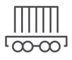

---

copyright:
  years: 2014, 2018
lastupdated: "2018-10-25"

---

{:new_window: target="_blank"}
{:shortdesc: .shortdesc}
{:screen: .screen}
{:pre: .pre}
{:table: .aria-labeledby="caption"}
{:codeblock: .codeblock}
{:tip: .tip}
{:download: .download}

# Übersicht über die Anwendungsfälle
{: #cs_uc_intro}

In einer Reihe unterschiedlicher Anwendungsfälle werden die Stärken von {{site.data.keyword.containerlong_notm}} und der {{site.data.keyword.Bluemix_notm}}-Services verdeutlicht, wenn beides gemeinsam verwendet wird. In diesen Szenarios werden unterschiedliche Branchen und ihre verschiedenen Workload-Typen beleuchtet. In jedem einzelnen Anwendungsfall wird zwar eine Situation in einer bestimmten Branche beschrieben, die Workloads sind jedoch in vielen Branchen sehr ähnlich. Die Workloads betreffen unter anderem die folgenden Themen:
* Künstliche Intelligenz und maschinelles Lernen
* Daten und Speicher
* DevOps

{: shortdesc}
<table summary="In der Tabelle sind die Anwendungsfälle aufgeführt. Die Zeilen sind von links nach rechts zu lesen; die Symbole in Zeile eins stehen für die jeweilige Branche, die Beschreibung befindet sich in Spalte zwei.">
<caption>Anwendungsfälle</caption>
  <thead>
  <th colspan=2>Anwendungsfälle nach Branche</th>
  </thead>
  <tbody>
    <tr>
    <td align="center"> Finanzdienstleistungen</td>
    <td><ul>
    <li>[Einfrieren der IT-Kosten und Beschleunigung der Einhaltung gesetzlicher Bestimmungen](cs_uc_finance.html#uc_mortgage)</li>
    <li>[Optimierung der Entwicklerproduktivität, um den Partnern KI-Tools viermal schneller bereitstellen zu können](cs_uc_finance.html#uc_payment_tech)</li>
    </ul></td>
     </tr>
     <tr>
     <td align="center"> Verwaltungsbehörde</td>
     <td><ul>
    <li>[Sicherung des Datenaustauschs, Verbindung zwischen öffentlichen und privaten Organisationen](cs_uc_gov.html#uc_port)</li>
     <li>[Verbesserung der Kooperationsgeschwindigkeit mit behördlichen Entwicklern durch kombinieren der öffentlichen und privaten Daten](cs_uc_gov.html#uc_data_mashup)</li></ul></td>
      </tr>
    <tr>
      <td align="center"> Gesundheitswesen</td>
      <td><ul>
     <li>[Migration der Workloads von ineffizienten virtuellen Maschinen auf einfach zu verwaltende Container für Patientensysteme](cs_uc_health.html#uc_migrate)</li>
      <li>[Sicheres Hosten sensibler Daten bei zunehmender Forschung mit Partnern](cs_uc_health.html#uc_research)</li>
      </ul></td>
      </tr>
      <tr>
         <td align="center"> Einzelhandel</td>
         <td><ul>
        <li>[Gemeinsame Nutzung von Daten über APIs mit globalen Partnern zur Förderung des Omni-Channel-Vertriebs](cs_uc_retail.html#uc_data-share)</li>
         <li>[Optimierung der Lagerkosten mit digitalen Erkenntnissen über das Einkaufsverhalten](cs_uc_retail.html#uc_grocer)</li>
              </ul></td>
          </tr>
      <tr>
       <td align="center"> Transportwesen</td>
           <td><ul>
          <li>[Erstellung und Bereitstellung einer Human Resources-Site mit künstlicher Intelligenz in weniger als drei Wochen](cs_uc_transport.html#uc_airline)</li>
           <li>[Steigerung der Verfügbarkeit von weltweiten Systemen für Partner](cs_uc_transport.html#uc_shipping)</li></ul></td>
      </tr>
  </tbody>
  </table>
