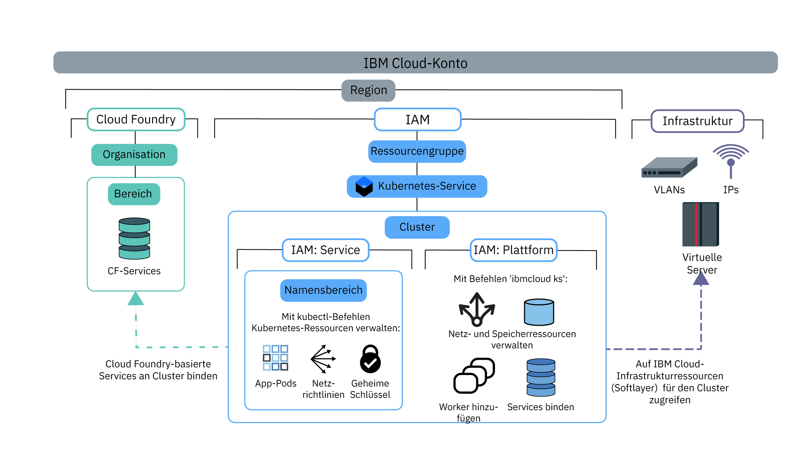

---

copyright:
  years: 2014, 2019
lastupdated: "2019-04-18"

keywords: kubernetes, iks

subcollection: containers

---

{:new_window: target="blank"}
{:shortdesc: .shortdesc}
{:screen: .screen}
{:pre: .pre}
{:table: .aria-labeledby="caption"}
{:codeblock: .codeblock}
{:tip: .tip}
{:note: .note}
{:important: .important}
{:deprecated: .deprecated}
{:download: .download}


# Clusterzugriff zuweisen
{: #users}

Als Clusteradministrator können Sie Zugriffsrichtlinien für den {{site.data.keyword.containerlong}}-Cluster definieren, um verschiedene Zugriffsebenen für unterschiedliche Benutzer zu erstellen. Sie können beispielsweise bestimmte Benutzer autorisieren, mit Clusterinfrastrukturressourcen und anderen Ressourcen zu arbeiten, um nur Container bereitzustellen.
{: shortdesc}

Seit dem 30. Januar 2019 arbeitet {{site.data.keyword.containerlong_notm}} mit einer neuen Methode zur Berechtigung von Benutzern für {{site.data.keyword.Bluemix_notm}} IAM: [Servicezugriffsrollen](/docs/containers?topic=containers-access_reference#service). Durch diese Servicerollen wird der Zugriff auf Ressourcen im Cluster, wie zum Beispiel auf Kubernetes-Namensbereiche, erteilt. Weitere Informationen finden Sie im folgenden Blog: [Introducing service roles and namespaces in IAM for more granular control of cluster access ](https://www.ibm.com/blogs/bluemix/2019/02/introducing-service-roles-and-namespaces-in-iam-for-more-granular-control-of-cluster-access/).
{: note}

## Erklärung der Zugriffsrichtlinien und Rollen
{: #access_policies}

Zugriffsrichtlinien legen die Zugriffsebene fest, über die Benutzer in Ihrem {{site.data.keyword.Bluemix_notm}}-Konto auf Ressourcen auf der gesamten {{site.data.keyword.Bluemix_notm}}-Plattform verfügen. Eine Richtlinie ordnet einem Benutzer mindestens eine Rolle zu, die den Geltungsbereich des Zugriffs auf einen einzelnen Service oder eine Gruppe von Services und Ressourcen definiert, die in einer Ressourcengruppe zusammengefasst sind. Für jeden Service in {{site.data.keyword.Bluemix_notm}} ist möglicherweise eine eigene Gruppe von Zugriffsrichtlinien erforderlich.
{: shortdesc}

Wenn Sie einen Plan zur Verwaltung des Benutzerzugriffs entwickeln, beachten Sie die folgenden allgemeinen Schritte:
1.  [Wählen Sie die richtige Zugriffsrichtlinie und Rolle für die Benutzer aus.](#access_roles)
2.  [Ordnen Sie den einzelnen Benutzern oder Benutzergruppen in {{site.data.keyword.Bluemix_notm}} IAM Zugriffsrollen zu.](#iam_individuals_groups)
3.  [Definieren Sie den Bereich für den Benutzerzugriff auf Clusterinstanzen, Kubernetes-Namensbereiche oder Ressourcengruppen.](#resource_groups)

Wenn Sie mit der Verwaltung von Rollen, Benutzern und Ressourcen im Konto vertraut sind, finden Sie eine Checkliste zur Konfiguration des Zugriffs unter [Zugriff auf Cluster konfigurieren](#access-checklist).

### Richtige Zugriffsrichtlinie und Rolle für Benutzer auswählen
{: #access_roles}

Sie müssen Zugriffsrichtlinien für jeden Benutzer definieren, der mit {{site.data.keyword.containerlong_notm}} arbeitet. Der Geltungsbereich einer Zugriffsrichtlinie basiert auf benutzerdefinierten Rollen, die die Aktionen bestimmen, die die Benutzer ausführen können. dürfen. Einige Richtlinien sind vordefiniert, andere können jedoch angepasst werden. Es wird dieselbe Richtlinie umgesetzt, unabhängig davon, ob der Benutzer eine Anforderung über die {{site.data.keyword.containerlong_notm}}-Konsole oder über die CLI startet. Dies gilt auch dann, wenn die Aktionen in IBM Cloud Infrastructure (SoftLayer) ausgeführt werden.
{: shortdesc}

Die folgende Abbildung zeigt die unterschiedlichen Typen von Berechtigungen und Rollen, mit welcher Rolle welche Arten von Aktionen ausgeführt werden können und wie die Rollen zueinander in Beziehung stehen.



Wenn Sie die spezifischen {{site.data.keyword.containerlong_notm}}-Berechtigungen für jede Rolle anzeigen möchten, überprüfen Sie dem Referenzabschnitt [Benutzerzugriffsberechtigungen](/docs/containers?topic=containers-access_reference).
{: tip}

<dl>
<dt><a href="#platform">{{site.data.keyword.Bluemix_notm}} IAM-Plattformrollen und -Servicerollen</a></dt>
<dd>{{site.data.keyword.containerlong_notm}} verwendet Plattform- und Servicerollen von {{site.data.keyword.Bluemix_notm}} Identity and Access Management (IAM), um Benutzern Zugriff auf Cluster zu erteilen.
<ul><li>**Plattform:** Plattformrollen bestimmen die Aktionen, die Benutzer an der Clusterinfrastruktur über die {{site.data.keyword.containerlong_notm}}-API, die Konsole und die CLI (`ibmcloud ks`) ausführen können. Plattformrollen erteilen keinen Zugriff auf die Kubernetes-API. Sie können die Richtlinien für diese Rollen nach Ressourcengruppe, Region oder Clusterinstanz festlegen. Plattformrollen berechtigen zwar zur Ausführung von Infrastrukturaktionen am Cluster, jedoch erteilen sie keinen Zugriff auf die Ressourcen der IBM Cloud-Infrastruktur (SoftLayer). Der Zugriff auf die Ressourcen der IBM Cloud-Infrastruktur (SoftLayer) ergibt sich aus dem [API-Schlüssel, der für die Region festgelegt ist](#api_key). Beispiele für Aktionen, zu denen die Plattformrollen berechtigen, sind das Erstellen oder Entfernen von Clustern, das Binden von Services an einen Cluster, das Verwalten von Netz- und Speicherressourcen oder das Hinzufügen zusätzlicher Workerknoten.<br><br>Wenn Sie Benutzern nur Plattformrollen zuweisen, können sie nicht mit Kubernetes-Ressourcen im Cluster interagieren. Sie können trotzdem den [Befehl](/docs/containers?topic=containers-cs_cli_reference#cs_cluster_config) `ibmcloud ks cluster-config` ausführen. In diesem Fall können Sie die Benutzer durch [angepasste RBAC-Richtlinien](/docs/containers?topic=containers-users#role-binding) berechtigen, ausgewählte Kubernetes-Aktionen auszuführen. Sie könnten dies zum Beispiel tun, wenn Ihre Organisation zurzeit angepasste RBAC-Richtlinien verwendet, um den Kubernetes-Zugriff zu steuern, und plant, auch weiterhin angepasste RBAC-Richtlinien anstelle von Servicerollen zu verwenden.</li>
<li>**Service**: Servicerollen berechtigen mit den entsprechenden Kubernetes-RBAC-Richtlinien, die einem Benutzer in einem Cluster gegeben werden. Servicerollen erteilen an sich Zugriff auf die Kubernetes-API, das Dashboard und die CLI (`kubectl`). Sie können den Bereich (Scope) der Richtlinie für Servicerollen nach Ressourcengruppe, Region oder Clusterinstanz festlegen. Darüber hinaus können Sie den Bereich von Servicerollen auf Kubernetes-Namensbereiche festlegen, die sich in allen, einzelnen oder regionsweiten Clustern befinden. Wenn Sie den Bereich einer Servicerolle auf einen Namensbereich festlegen, können Sie die Richtlinie nicht gleichzeitig auf eine Ressourcengruppe anwenden oder ihr eine Plattformrolle zuordnen. Beispiele für Aktionen, zu denen Servicerollen berechtigen, sind das Erstellen von App-Bereitstellungen, das Hinzufügen von Namensbereichen oder das Einrichten von Konfigurationszuordnungen (Configmaps).<br><br>Wenn Sie Benutzern nur Servicerollen zuweisen, können diese keine der {{site.data.keyword.containerlong_notm}}-Ressourcen anzeigen oder mit diesen interagieren. Damit Benutzer auf den Cluster zugreifen und die Kubernetes-Ressourcen des Clusters verwenden können, müssen Sie den Benutzern den Clusternamen und die ID geben, sodass sie den [Befehl](/docs/containers?topic=containers-cs_cli_reference#cs_cluster_config) `ibmcloud ks cluster-config` ausführen und anschließend das [Kubernetes-Dashboard über die CLI starten](/docs/containers?topic=containers-app#db_cli) können. Wenn diese Benutzer weiterhin auf die {{site.data.keyword.containerlong_notm}}-Cluster-Konsole zugreifen sowie Cluster und andere Infrastrukturressourcen über die CLI auflisten können sollen, geben Sie den Benutzern die Plattformrolle **Anzeigeberechtigter**.</li></ul></dd>
<dt><a href="#role-binding">RBAC</a></dt>
<dd>In Kubernetes ist eine rollenbasierte Zugriffssteuerung (Role-Based Access Control, RBAC) eine Möglichkeit zum Sichern der Ressourcen im Cluster. Von den RBAC-Rollen hängt ab, welche Kubernetes-Aktionen Benutzer für diese Ressourcen ausführen können. Jedem Benutzer, dem eine Servicerolle zugeordnet ist, wird automatisch eine entsprechende RBAC-Clusterrolle zugeordnet. Diese RBAC-Clusterrolle wird abhängig davon, ob Sie den Bereich der Richtlinie für einen Namensbereich definieren, entweder in einem bestimmten Namensbereich oder in allen Namensbereichen angewendet.</br></br>
Beispiele für Aktionen, zu denen RBAC-Rollen berechtigen, sind das Erstellen von Objekten wie Pods oder das Lesen von Pod-Protokollen.</dd>
<dt><a href="#api_key">Infrastruktur</a></dt>
<dd>Infrastrukturrollen ermöglichen den Zugriff auf Ressourcen der IBM Cloud-Infrastruktur (SoftLayer). Richten Sie einen Benutzer mit der Infrastrukturrolle **Superuser** ein und speichern Sie die Infrastrukturberechtigungsnachweise dieses Benutzers in einem API-Schlüssel. Legen Sie anschließend den API-Schlüssel in jeder Region fest, in der Sie Cluster erstellen möchten. Nachdem Sie den API-Schlüssel eingerichtet haben, benötigen andere Benutzer, denen Sie Zugriff auf {{site.data.keyword.containerlong_notm}} erteilt haben, keine Infrastrukturrollen, da der API-Schlüssel von allen Benutzern in der Region gemeinsam genutzt wird. Stattdessen legen die {{site.data.keyword.Bluemix_notm}} IAM-Plattformrollen die Infrastrukturaktionen fest, die Benutzer ausführen dürfen. Wenn Sie den API-Schlüssel nicht mit vollständiger <strong>Superuser</strong>-Infrastruktur festlegen oder für Benutzer Zugriff auf bestimmte Geräte festlegen müssen, können Sie [Infrastrukturberechtigungen anpassen](#infra_access). </br></br>
Beispiele für Aktionen, die Infrastrukturrollen ermöglichen, sind das Anzeigen der Details von Workerknotenmaschinen in einem Cluster oder das Bearbeiten der Netzbetriebs- und Speicherressourcen.</dd>
<dt>Cloud Foundry</dt>
<dd>Nicht alle Services können mit {{site.data.keyword.Bluemix_notm}} IAM verwaltet werden. Wenn Sie einen dieser Services nutzen, können Sie weiterhin die Cloud Foundry-Benutzerrollen verwenden, um den Zugriff auf diese Services zu steuern. Cloud Foundry-Rollen gewähren Zugriff für Organisationen und Bereiche innerhalb des Kontos. Zum Anzeigen der Liste von Cloud Foundry-basierten Services in {{site.data.keyword.Bluemix_notm}} führen Sie <code>ibmcloud service list</code> aus.</br></br>
Beispiele für Aktionen, zu denen Cloud Foundry-Rollen berechtigen, sind das Erstellen einer neuen Cloud Foundry-Serviceinstanzen und das Binden einer Cloud Foundry-Serviceinstanz an einen Cluster. Weitere Informationen finden Sie unter den verfügbaren [Organisations- und Benutzerrollen](/docs/iam?topic=iam-cfaccess) oder in den Schritten unter [Cloud Foundry-Zugriff verwalten](/docs/iam?topic=iam-mngcf) in der Dokumentation zu {{site.data.keyword.Bluemix_notm}} Identity and Access Management.</dd>
</dl>

### Einzelnen Benutzern oder Benutzergruppen in {{site.data.keyword.Bluemix_notm}} IAM Zugriffsrollen zuordnen
{: #iam_individuals_groups}

Wenn Sie {{site.data.keyword.Bluemix_notm}} IAM-Richtlinien festlegen, können Sie einem einzelnen Benutzer oder einer Benutzergruppe Rollen zuordnen.
{: shortdesc}

<dl>
<dt>Einzelne Benutzer</dt>
<dd>Es kann vorkommen, dass ein bestimmter Benutzer mehr oder weniger Berechtigungen als der Rest des Teams benötigt. Sie können die Berechtigungen individuell anpassen, sodass jede Person über die Berechtigungen verfügt, die sie zur Ausführung ihrer Aufgaben benötigt. Sie können jedem Benutzer mehrere {{site.data.keyword.Bluemix_notm}} IAM-Rollen zuordnen.</dd>
<dt>Mehrere Benutzer in einer Zugriffsgruppe</dt>
<dd>Sie können eine Benutzergruppe erstellen und dann dieser Gruppe Berechtigungen zuweisen. Sie können zum Beispiel alle Teamleiter zusammenfassen und der Gruppe Administratorzugriff erteilen. Anschließend können Sie alle Entwickler zusammenfassen und dieser Gruppe nur Schreibzugriff erteilen. Sie können jeder Zugriffsgruppe mehrere {{site.data.keyword.Bluemix_notm}} IAM-Rollen zuordnen. Wenn Sie einer Gruppe Berechtigungen zuordnen, ist jeder Benutzer betroffen, der dieser Gruppe hinzugefügt oder aus dieser Gruppe entfernt wird. Wenn Sie der Gruppe Benutzer hinzufügen, verfügen diese Benutzer auch über den zusätzlichen Zugriff. Werden sie entfernt, wird ihr Zugriff widerrufen.</dd>
</dl>

{{site.data.keyword.Bluemix_notm}} IAM-Rollen können keinem Servicekonto zugeordnet werden. Stattdessen können Sie [Servicekonten direkt RBAC-Rollen zuordnen](#rbac).
{: tip}

Sie müssen außerdem angeben, ob Benutzer über Zugriff auf einen Cluster in einer Ressourcengruppe, auf alle Cluster in einer Ressourcengruppe oder auf alle Cluster in allen Ressourcengruppen im Konto verfügen.

### Bereich des Benutzerzugriffs auf Clusterinstanzen, Namensbereiche oder Ressourcengruppen festlegen
{: #resource_groups}

In {{site.data.keyword.Bluemix_notm}} IAM können Sie Ressourceninstanzen, Kubernetes-Namensbereichen oder Ressourcengruppen Benutzerzugriffsrollen zuordnen.
{: shortdesc}

Wenn Sie Ihr {{site.data.keyword.Bluemix_notm}}-Konto erstellen, wird automatisch die Standardressourcengruppe erstellt. Wenn Sie bei der Erstellung einer Ressource keine Ressourcengruppe angeben, gehören die Ressourceninstanzen (Cluster) zur Standardressourcengruppe. In {{site.data.keyword.Bluemix_notm}} IAM ist ein Kubernetes-Namensbereich ein Ressourcentyp einer Ressourceninstanz (Cluster). Wenn Sie in Ihrem Konto eine Ressourcengruppe hinzufügen möchten, finden Sie Informationen hierzu unter [Bewährte Verfahren beim Einrichten des Kontos](/docs/account?topic=account-account_setup) und [Ressourcengruppen einrichten](/docs/resources?topic=resources-bp_resourcegroups#setuprgs).

<dl>
<dt>Ressourceninstanz</dt>
  <dd><p>Jeder {{site.data.keyword.Bluemix_notm}}-Service im Konto ist eine Ressource, die über Instanzen verfügt. Die Instanzen sind von Service zu Service unterschiedlich. In {{site.data.keyword.containerlong_notm}} ist die Instanz zum Beispiel ein Cluster, in {{site.data.keyword.cloudcerts_long_notm}} ist die Instanz jedoch ein Zertifikat. Ressourcen gehören standardmäßig auch zur Standardressourcengruppe im Konto. Einem Benutzer können Sie eine Zugriffsrolle für eine Ressourceninstanz für die folgenden Szenarios zuordnen.
  <ul><li>Alle {{site.data.keyword.Bluemix_notm}} IAM-Services im Konto, einschließlich aller Cluster in {{site.data.keyword.containerlong_notm}} und Images in {{site.data.keyword.registrylong_notm}}.</li>
  <li>Alle Instanzen in einem Service, zum Beispiel alle Cluster in {{site.data.keyword.containerlong_notm}}.</li>
  <li>Alle Instanzen in einer Region eines Service, zum Beispiel alle Cluster in der Region **Vereinigte Staaten (Süden)** von {{site.data.keyword.containerlong_notm}}.</li>
  <li>Eine einzelne Instanz, zum Beispiel einen Cluster.</li></ul></dd>
<dt>Kubernetes-Namensbereich</dt>
  <dd><p>Als Teil von Clusterressourceinstanzen in {{site.data.keyword.Bluemix_notm}} IAM können Sie Benutzern Servicezugriffsrollen für Kubernetes-Namensbereiche in Ihren Clustern zuweisen. Wenn Sie den Bereich einer Servicerolle auf einen Namensbereich festlegen, können Sie die Richtlinie nicht gleichzeitig auf eine Ressourcengruppe anwenden oder ihr eine Plattformrolle zuordnen.</p>
  <p>Wenn Sie Zugriff auf einen Namensbereich erteilen, gilt die Richtlinie für alle aktuellen und zukünftigen Instanzen des Namensbereichs in allen Clustern, die Sie berechtigen. Beispiel: Sie möchten, dass eine Benutzergruppe `dev` Kubernetes-Ressourcen in einem Namensbereich `test` in allen Ihren Clustern in der Region 'Asien-Pazifik (Norden)' bereitstellen kann. Wenn Sie der Zugriffsgruppe `dev` die Servicezugriffsrolle **Schreibberechtigter** für den Kubernetes-Namensbereich 'test' in allen Clustern in der Region 'Asien-Pazifik (Norden)' in der Ressourcengruppe `default` zuweisen, kann die Gruppe `dev` auf den Namensbereich `test` in einem beliebigen Cluster der Region 'Asien-Pazifik (Norden)' in der Ressourcengruppe `default` zugreifen, die zurzeit einen Namensbereich 'test' enthält oder in Zukunft enthalten wird.</p>
  <p class="important">Sie können die auf einen Namensbereich festgelegten Servicezugriffsrollen nicht auf Ressourcengruppenebene zuordnen oder solche Rollen gleichzeitig mit Plattformrollen zuordnen.</p></dd>
<dt>Ressourcengruppe</dt>
  <dd><p>Sie können Ihre Kontoressourcen in anpassbaren Gruppierungen zusammenfassen, sodass Sie einzelnen Benutzern oder Benutzergruppen schnell Zugriff auf mehrere Ressourcen gleichzeitig zuordnen können. Mit Ressourcengruppen können Operatoren und Administratoren Ressourcen filtern, um ihre aktuelle Verwendung anzuzeigen, Fehler zu beheben und Teams zu verwalten.</p>
  <p class="important">Ein Cluster kann in nur einer Ressourcengruppe erstellt werden; eine Änderung ist danach nicht mehr möglich. Wenn Sie einen Cluster in der falschen Ressourcengruppe erstellen, müssen Sie den Cluster löschen und in der richtigen Ressourcengruppe erneut erstellen. Wenn Sie außerdem den [Befehl](/docs/containers-cli-plugin?topic=containers-cli-plugin-cs_cli_reference#cs_cluster_service_bind) `ibmcloud ks cluster-service-bind` verwenden müssen, um eine [Integration mit einem {{site.data.keyword.Bluemix_notm}}-Service durchzuführen](/docs/containers?topic=containers-service-binding#bind-services), muss sich dieser Service in derselben Ressourcengruppe befinden wie der Cluster. Services, die keine Ressourcengruppen verwenden, wie {{site.data.keyword.registrylong_notm}}, oder die keine Servicebindung benötigen, wie {{site.data.keyword.la_full_notm}}, funktionieren auch dann, wenn sich der Cluster in einer anderen Ressourcengruppe befindet.</p>
  <p>Wenn Sie beabsichtigen, [{{site.data.keyword.monitoringlong_notm}} für Metriken](/docs/containers?topic=containers-health#view_metrics) zu verwenden, achten Sie darauf, für jeden Cluster einen Namen festzulegen, der in allen Ressourcengruppen und Regionen des Kontos eindeutig ist, um Konflikte bei Metriknamen zu vermeiden. Sie können einen Cluster nicht umbenennen.</p>
  <p>Einem Benutzer können Sie eine Zugriffsrolle für eine Ressourcengruppe für die folgenden Szenarios zuordnen. Beachten Sie, dass Sie im Gegensatz zu Ressourceninstanzen nicht Zugriff auf eine einzelne Instanz innerhalb einer Ressourcengruppe erteilen können.</p>
  <ul><li>Alle {{site.data.keyword.Bluemix_notm}} IAM-Services in der Ressourcengruppe, einschließlich aller Cluster in {{site.data.keyword.containerlong_notm}} und Images in {{site.data.keyword.registrylong_notm}}.</li>
  <li>Alle Instanzen in einem Service in der Ressourcengruppe, zum Beispiel alle Cluster in {{site.data.keyword.containerlong_notm}}.</li>
  <li>Alle Instanzen in einer Region eines Service in einer Ressourcengruppe, zum Beispiel alle Cluster in der Region **Vereinigte Staaten (Süden)** von {{site.data.keyword.containerlong_notm}}.</li></ul></dd>
</dl>

<br />


## Zugriff auf Cluster konfigurieren
{: #access-checklist}

Nachdem Sie [sich damit vertraut gemacht haben, wie Rollen, Benutzer und Ressourcen im Konto](#access_policies) verwaltet werden können, verwenden Sie die folgende Checkliste zum Konfigurieren des Benutzerzugriffs im Cluster.
{: shortdesc}

<p class="tip">Weisen Sie {{site.data.keyword.Bluemix_notm}} IAM-Plattformrollen nicht gleichzeitig mit einer Servicerolle zu. Sie müssen Plattform- und Servicerollen separat zuweisen.</p>

1. [Legen Sie den API-Schlüssel](#api_key) für alle Regionen und Ressourcengruppen fest, in denen Sie Cluster erstellen möchten.
2. Laden Sie Benutzer zu Ihrem Konto ein und [ordnen Sie ihnen {{site.data.keyword.Bluemix_notm}} IAM-Rollen](#platform) für {{site.data.keyword.containerlong_notm}} zu. 
3. Um Benutzern das Binden von Services an den Cluster oder das Anzeigen von Protokollen zu ermöglichen, die von Clusterprotokollierungskonfigurationen weitergeleitet werden, [erteilen Sie den Benutzern Cloud Foundry-Rollen](/docs/iam?topic=iam-mngcf) für die Organisation und den Bereich, in der bzw. dem die Services bereitgestellt werden oder die Protokolle erfasst werden.
4. Wenn Sie Kubernetes-Namensbereiche verwenden, um Ressourcen im Cluster zu isolieren, erteilen Sie Zugriff auf Namensbereiche, indem Sie [Benutzern {{site.data.keyword.Bluemix_notm}} IAM-Servicerollen für Namensbereiche zuordnen](#platform).
5. Legen Sie für alle Automatisierungstools, wie zum Beispiel die CI/CD-Pipeline, Servicekonten fest und [ordnen Sie den Servicekonten Kubernetes-RBAC-Berechtigungen zu](#rbac).
6. Weitere erweiterte Konfigurationen zum Steuern des Zugriffs auf die Clusterressourcen auf Pod-Ebene finden Sie unter [Sicherheit für Pods konfigurieren](/docs/containers?topic=containers-psp).

</br>

Weitere Informationen zum Konfigurieren des Kontos und der Ressourcen finden Sie im Lernprogramm zu [Best Practices für die Organisation von Benutzern, Teams und Anwendungen](/docs/tutorials?topic=solution-tutorials-users-teams-applications).
{: tip}

<br />


## API-Schlüssel für Aktivierung des Zugriffs auf Infrastrukturportfolio konfigurieren
{: #api_key}

Um erfolgreich Cluster bereitzustellen und mit diesen zu arbeiten, müssen Sie sicherstellen, dass Ihr {{site.data.keyword.Bluemix_notm}}-Konto korrekt für den Zugriff auf das Portfolio der IBM Cloud-Infrastruktur (SoftLayer) konfiguriert wurde.
{: shortdesc}

**Meiste Fälle:** Das nutzungsabhängige {{site.data.keyword.Bluemix_notm}}-Konto verfügt bereits über Zugriff auf das Portfolio der IBM Cloud-Infrastruktur (SoftLayer). Um für {{site.data.keyword.containerlong_notm}} Zugriff auf das Portfolio zu konfigurieren, muss der **Kontoeigner** den API-Schlüssel für die Region und die Ressourcengruppe festlegen.

1. Melden Sie sich als Kontoeigner am Terminal an.
    ```
    ibmcloud login [--sso]
    ```
    {: pre}

2. Geben Sie die Ressourcengruppe als Ziel an, in der Sie den API-Schlüssel festlegen möchten. Wenn Sie keine Ressourcengruppe als Ziel angeben, wird der API-Schlüssel für die Standardressourcengruppe festgelegt.
    ```
    ibmcloud target -g <ressourcengruppenname>
    ```
    {:pre}

4. Definieren Sie den API-Schlüssel für die Region und die Ressourcengruppe.
    ```
    ibmcloud ks api-key-reset
    ```
    {: pre}    

5. Überprüfen Sie, dass der API-Schlüssel festgelegt wurde.
    ```
    ibmcloud ks api-key-info <clustername_oder_-id>
    ```
    {: pre}

6. Wiederholen Sie die Schritte für jede Region und Ressourcengruppe, in der Sie Cluster erstellen möchten.

**Alternative Optionen und weitere Informationen:** Informationen zu weiteren Möglichkeiten für den Zugriff auf das Portfolio der IBM Cloud-Infrastruktur (SoftLayer) finden Sie in den folgenden Abschnitten.
* Wenn Sie sich nicht sicher sind, ob Ihr Konto bereits über Zugriff auf das Portfolio der IBM Cloud-Infrastruktur (SoftLayer) verfügt, lesen Sie den Abschnitt [Informationen zum Zugriff auf das Portfolio der IBM Cloud-Infrastruktur (SoftLayer)](#understand_infra).
* Wenn der Kontoeigner keinen API-Schlüssel festlegt, [stellen Sie sicher, dass der Benutzer, der den API-Schlüssel festlegt, über die passenden Berechtigungen verfügt](#owner_permissions).
* Weitere Informationen zur Verwendung des Standardkontos zum Festlegen des API-Schlüssels finden Sie im Abschnitt [Mit nutzungsabhängigem {{site.data.keyword.Bluemix_notm}}-Standardkonto auf Infrastrukturportfolio zugreifen](#default_account).
* Falls Sie nicht über ein nutzungsabhängiges Standardkonto verfügen oder ein abweichendes Konto der IBM Cloud-Infrastruktur (SoftLayer) verwenden müssen, finden Sie Informationen im Abschnitt [Auf anderes Konto der IBM Cloud-Infrastruktur (SoftLayer) zugreifen](#credentials).

### Informationen zum Zugriff auf das Portfolio der IBM Cloud-Infrastruktur (SoftLayer)
{: #understand_infra}

Stellen Sie fest, ob Ihr Konto über Zugriff auf das Portfolio der IBM Cloud-Infrastruktur (SoftLayer) verfügt und machen Sie sich damit vertraut, wie der API-Schlüssel von {{site.data.keyword.containerlong_notm}} für den Zugriff auf das Portfolio verwendet wird.
{: shortdesc}

**Verfügt mein Konto bereits über Zugriff auf das Portfolio der IBM Cloud-Infrastruktur (SoftLayer)?**</br>

Für den Zugriff auf das Portfolio der IBM Cloud-Infrastruktur (SoftLayer) verwenden Sie ein nutzungsabhängiges {{site.data.keyword.Bluemix_notm}}-Konto. Wenn Sie über einen anderen Kontotyp verfügen, finden Sie Ihre Optionen in der folgenden Tabelle.

<table summary="In der Tabelle werden die Standardoptionen für die Clustererstellung nach Kontotyp angezeigt. Die Zeilen sind von links nach rechts zu lesen, mit der Kontobeschreibung in Spalte eins und den Optionen zum Erstellen eines Standardclusters in Spalte 2.">
<caption>Erstellungsoptionen für Standardcluster nach Kontotyp</caption>
  <thead>
  <th>Kontobeschreibung</th>
  <th>Optionen zum Erstellen eines Standardclusters</th>
  </thead>
  <tbody>
    <tr>
      <td>Mit **Lite-Konten** können keine Cluster bereitgestellt werden.</td>
      <td>[Führen Sie für Ihr Lite-Konto ein Upgrade auf ein nutzungsabhängiges {{site.data.keyword.Bluemix_notm}}-Konto durch](/docs/account?topic=account-accounts#paygo).</td>
    </tr>
    <tr>
      <td>**Nutzungsabhängige Konten** werden mit Zugriff auf das Infrastruktur-Portfolio geliefert.</td>
      <td>Sie können Standardcluster erstellen. Verwenden Sie einen API-Schlüssel, um die Infrastrukturberechtigungen für die Cluster einzurichten.</td>
    </tr>
    <tr>
      <td>**Abonnementkonten** werden ohne Zugriff auf das Portfolio der IBM Cloud-Infrastruktur (SoftLayer) eingerichtet.</td>
      <td><p><strong>Option 1:</strong> [Erstellen Sie ein neues nutzungsabhängiges Konto](/docs/account?topic=account-accounts#paygo), das mit Zugriff auf das Portfolio der IBM Cloud-Infrastruktur (SoftLayer) eingerichtet wird. Wenn Sie diese Option auswählen, erhalten Sie zwei separate {{site.data.keyword.Bluemix_notm}}-Konten und -Abrechnungen.</p><p>Wenn Sie Ihr Abonnementkonto weiterhin verwenden möchten, können Sie mit Ihrem neuen nutzungsabhängigen Konto einen API-Schlüssel in der IBM Cloud-Infrastruktur (SoftLayer) generieren. Anschließend müssen Sie für Ihr Abonnementkonto den API-Schlüssel der IBM Cloud-Infrastruktur (SoftLayer) manuell festlegen. Beachten Sie, dass Ressourcen der IBM Cloud-Infrastruktur (SoftLayer) über Ihr neues nutzungsabhängiges Konto in Rechnung gestellt werden.</p><p><strong>Option 2:</strong> Wenn Sie bereits ein Konto der IBM Cloud-Infrastruktur (SoftLayer) haben, das Sie verwenden möchten, können Sie die Berechtigungsnachweise für die IBM Cloud-Infrastruktur (SoftLayer) für Ihr {{site.data.keyword.Bluemix_notm}}-Konto manuell festlegen.</p><p class="note">Wenn Sie eine manuelle Verknüpfung zu einem Konto der IBM Cloud-Infrastruktur (SoftLayer) herstellen, werden die Berechtigungsnachweise für jede für die IBM Cloud-Infrastruktur (SoftLayer) spezifische Aktion in Ihrem {{site.data.keyword.Bluemix_notm}}-Konto verwendet. Sie müssen sicherstellen, dass der von Ihnen angegebene API-Schlüssel über [ausreichende Infrastrukturberechtigungen](/docs/containers?topic=containers-users#infra_access) verfügt, damit die Benutzer Cluster erstellen und mit diesen arbeiten können.</p></td>
    </tr>
    <tr>
      <td>**Konten der IBM Cloud-Infrastruktur (SoftLayer)**, kein {{site.data.keyword.Bluemix_notm}}-Konto</td>
      <td><p>[Erstellen Sie ein nutzungsabhängiges {{site.data.keyword.Bluemix_notm}}-Konto](/docs/account?topic=account-accounts#paygo). Sie verfügen über zwei separate Konten der IBM Cloud-Infrastruktur (SoftLayer) und jeweils separate Abrechnungen.</p><p>Ihr neues {{site.data.keyword.Bluemix_notm}}-Konto verwendet standardmäßig das neue Infrastrukturkonto. Wenn Sie das alte Infrastrukturkonto weiter verwenden möchten, legen Sie die Berechtigungsnachweise manuell fest.</p></td>
    </tr>
  </tbody>
  </table>

**Das Infrastrukturportfolio ist jetzt eingerichtet. Wie wird von {{site.data.keyword.containerlong_notm}} auf das Portfolio zugegriffen?**</br>

{{site.data.keyword.containerlong_notm}} greift über einen API-Schlüssel auf das Portfolio der IBM Cloud-Infrastruktur (SoftLayer) zu. Im API-Schlüssel werden die Berechtigungsnachweise eines Benutzers mit Zugriff auf ein Konto der IBM Cloud-Infrastruktur (SoftLayer) gespeichert. API-Schlüssel werden nach Region in einer Ressourcengruppe festgelegt und von den Benutzern in dieser Region gemeinsam genutzt. 
Damit alle Benutzer auf das Portfolio der IBM Cloud-Infrastruktur (SoftLayer) zugreifen können, muss der Benutzer, dessen Berechtigungsnachweise im API-Schlüssel gespeichert sind, über [die Infrastrukturrolle **Superuser** und die Plattformrolle **Administrator** für {{site.data.keyword.containerlong_notm}} und für {{site.data.keyword.registryshort_notm}}](#owner_permissions) im {{site.data.keyword.Bluemix_notm}}-Konto verfügen.Danach kann dieser Benutzer die erste Administratoraktion in einer Region und einer Ressourcengruppe ausführen. Die Berechtigungsnachweise des Benutzers für die Infrastruktur werden in einem API-Schlüssel für diese Region und Ressourcengruppe gespeichert.

Andere Benutzer innerhalb des Kontos nutzen den API-Schlüssel für den Zugriff auf die Infrastruktur gemeinsam. Wenn Benutzer sich beim {{site.data.keyword.Bluemix_notm}}Konto anmelden, wird ein {{site.data.keyword.Bluemix_notm}} IAM-Token, das auf dem API-Schlüssel basiert, für die CLI-Sitzung generiert und ermöglicht die Ausführung von infrastrukturbezogenen Befehlen in einem Cluster.

Um das {{site.data.keyword.Bluemix_notm}} IAM-Token für eine CLI-Sitzung anzuzeigen, können Sie `ibmcloud iam oauth-tokens` ausführen. {{site.data.keyword.Bluemix_notm}} IAM-Tokens können auch verwendet werden, um [die {{site.data.keyword.containerlong_notm}}-API direkt aufzurufen](/docs/containers?topic=containers-cs_cli_install#cs_api).
{: tip}

**Wie kann ich einschränken, welche Befehle Benutzer ausführen können, wenn diese über ein {{site.data.keyword.Bluemix_notm}} IAM-Token Zugriff auf das Portfolio haben?**

Nachdem Sie den Zugriff auf das Portfolio für Benutzer in Ihrem Konto eingerichtet haben, können Sie steuern, welche Infrastrukturaktionen die Benutzer ausführen können, indem Sie die entsprechende [Plattformrolle](#platform) zuordnen. Indem Sie Benutzern {{site.data.keyword.Bluemix_notm}} IAM-Rollen zuordnen, schränken Sie ein, welche Befehle die Benutzer in einem Cluster ausführen können. Beispiel: Da der API-Schlüsseleigner die Infrastrukturrolle **Superuser** innehat, können alle infrastrukturbezogenen Befehle in einem Cluster ausgeführt werden. Aber abhängig von der {{site.data.keyword.Bluemix_notm}} IAM-Rolle, die einem Benutzer zugeordnet ist, kann er nur manche dieser infrastrukturbezogenen Befehle ausführen.

Wenn Sie beispielsweise einen Cluster in einer neuen Region erstellen möchten, stellen Sie sicher, dass der erste Cluster von einem Benutzer mit der Infrastrukturrolle **Superuser** erstellt wird, zum Beispiel dem Kontoeigner. Anschließend können Sie einzelne Benutzer oder Benutzer in {{site.data.keyword.Bluemix_notm}} IAM-Zugriffsgruppen in diese Region einladen, indem Sie die Plattformverwaltungsrichtlinien für sie in dieser Region festlegen. Ein Benutzer mit der Plattformrolle **Anzeigeberechtigter** ist nicht berechtigt, einen Workerknoten hinzuzufügen. Daher schlägt die Aktion `worker-add` fehl, auch wenn der API-Schlüssel über die richtigen Infrastrukturberechtigungen verfügt. Wenn Sie die Plattformrolle des Benutzers in **Operator** ändern, ist der Benutzer berechtigt, einen Workerknoten hinzuzufügen. Die Aktion `worker-add` ist erfolgreich, weil der Benutzer berechtigt und der API-Schlüssel korrekt definiert ist. Sie müssen die Berechtigungen des Benutzers für die IBM Cloud-Infrastruktur (SoftLayer) nicht bearbeiten.

Wenn Sie prüfen möchten, was für Aktionen Benutzer in Ihrem Konto ausführen, können Sie mit [{{site.data.keyword.cloudaccesstrailshort}}](/docs/containers?topic=containers-at_events) alle clusterbezogenen Ereignisse anzeigen.
{: tip}

**Was kann ich tun, wenn ich dem Eigner des API-Schlüssels oder der Berechtigungsnachweise nicht die Infrastrukturrolle eines Superusers zuweisen möchte?**</br>

Es kann vorkommen, dass Compliance-, Sicherheits- oder Abrechnungsgründe dagegen sprechen, die Infrastrukturrolle **Superuser** dem Benutzer zuzuweisen, der den API-Schlüssel festlegt oder dessen Berechtigungsnachweise mit dem Befehl `ibmcloud ks credential-set` festgelegt werden. Wenn dieser Benutzer jedoch nicht über die Rolle **Superuser** verfügt, können infrastrukturbezogene Aktionen, wie zum Beispiel das Erstellen eines Clusters oder das erneute Laden eines Workerknotens, fehlschlagen. Anstatt {{site.data.keyword.Bluemix_notm}} IAM-Plattformrollen zu verwenden, um den Infrastrukturzugriff der Benutzer zu steuern, müssen Sie für die Benutzer [spezifische Berechtigungen für die IBM Cloud-Infrastruktur (SoftLayer) festlegen](#infra_access).

**Was passiert, wenn der Benutzer, der den API-Schlüssel für eine Region oder Ressourcengruppe festgelegt hat, das Unternehmen verlässt?**

Wenn der Benutzer Ihr Unternehmen verlässt, kann der {{site.data.keyword.Bluemix_notm}}-Kontoeigner die Berechtigungen des Benutzers entfernen. Bevor Sie jedoch die spezifischen Zugriffsberechtigungen eines Benutzers oder einen Benutzer selbst vollständig aus Ihrem Konto entfernen, müssen Sie den API-Schlüssel mit den Infrastrukturberechtigungsnachweisen eines anderen Benutzers zurücksetzen. Andernfalls verlieren die anderen Benutzer in dem Konto möglicherweise den Zugriff auf die IBM Cloud-Infrastruktur (SoftLayer) oder die infrastrukturbezogenen Befehle schlagen fehl. Weitere Informationen finden Sie unter [Benutzerberechtigungen entfernen](#removing).

**Wie kann ich meinen Cluster sperren, wenn mein API-Schlüssel kompromittiert wird?**

Wenn ein API-Schlüssel, der für eine Region oder Ressourcengruppe in Ihrem Cluster festgelegt ist, kompromittiert wird, [löschen Sie ihn](/docs/iam?topic=iam-userapikey#delete_user_key), damit keine weiteren Aufrufe unter Verwendung dieses API-Schlüssels als Authentifizierung getätigt werden können. Weitere Informationen zum Sichern des Zugriffs auf den Kubernetes-API-Server finden Sie im Sicherheitsthema [Sicherheit für Kubernetes-API-Server und 'etcd'](/docs/containers?topic=containers-security#apiserver).

**Wie lege ich den API-Schlüssel für meinen Cluster fest?**</br>

Das hängt davon ab, welchen Kontotyp Sie für den Zugriff auf das Portfolio der IBM Cloud-Infrastruktur (SoftLayer) verwenden:
* [Ein nutzungsabhängiges {{site.data.keyword.Bluemix_notm}}-Konto](#default_account)
* [Ein anderes Konto der IBM Cloud-Infrastruktur (SoftLayer), das nicht mit dem nutzungsabhängigen {{site.data.keyword.Bluemix_notm}}-Standardkonto verknüpft ist](#credentials)

### Sicherstellen, dass der Eigner des API-Schlüssels oder der Infrastrukturberechtigungsnachweise über die passenden Berechtigungen verfügt
{: #owner_permissions}

Um sicherzustellen, dass alle infrastrukturbezogenen Aktionen im Cluster erfolgreich ausgeführt werden können, muss der Benutzer, dessen Berechtigungsnachweise Sie für den API-Schlüssel festlegen möchten, über die entsprechenden Berechtigungen verfügen.
{: shortdesc}

1. Melden Sie sich bei der [{{site.data.keyword.Bluemix_notm}}-Konsole ](https://cloud.ibm.com/) an.

2. Überprüfen Sie, ob der Benutzer über die passenden {{site.data.keyword.Bluemix_notm}} IAM-Plattformrollen verfügt, um sicherzustellen, dass alle kontenbezogenen Aktionen erfolgreich ausgeführt werden können.
    1. Wählen Sie in der Menüleiste **Verwalten > Zugriff (IAM)** aus und klicken Sie auf die Seite **Benutzer**.
    2. Klicken Sie auf den Namen des Benutzers, für den Sie den API-Schlüssel festlegen möchten oder dessen Berechtigungsnachweise Sie für den API-Schlüssel festlegen möchten, und klicken Sie auf die Registerkarte **Zugriffsrichtlinien**.
    3. Wenn der Benutzer nicht über die Plattformrolle **Administrator** für alle {{site.data.keyword.containerlong_notm}}-Cluster in allen Regionen verfügt, [ordnen Sie dem Benutzer diese Plattformrolle zu](#platform).
    4. Wenn der Benutzer nicht mindestens über die Plattformrolle **Anzeigeberechtigter** für die Ressourcengruppe verfügt, in der Sie den API-Schlüssel festlegen möchten, [ordnen Sie dem Benutzer die Rolle für diese Ressourcengruppe zu](#platform).
    5. Zum Erstellen von Clustern benötigt der Benutzer auch die Plattformrolle **Administrator** für {{site.data.keyword.registrylong_notm}} auf Kontoebene. Schränken Sie Richtlinien für {{site.data.keyword.registryshort_notm}} nicht auf Ressourcengruppenebene ein.

3. Überprüfen Sie, ob der Benutzer über die passenden Infrastrukturzugriffsrichtlinien verfügt, um sicherzustellen, dass alle infrastrukturbezogenen Aktionen im Cluster erfolgreich ausgeführt werden können.
    1.  Wählen Sie in der Menüleiste **Verwalten > Zugriff (IAM)** aus.
    2.  Wählen Sie die Registerkarte **Benutzer** aus und klicken Sie auf den Benutzer.
    3. Überprüfen Sie im Fenster **API-Schlüssel**, ob der Benutzer einen **API-Schlüssel für klassische Infrastruktur** hat, oder klicken Sie auf **IBM Cloud-API-Schlüssel erstellen**. Weitere Informationen finden Sie unter [API-Schlüssel für klassische Infrastruktur verwalten](/docs/iam?topic=iam-classic_keys#classic_keys).
    4. Klicken Sie auf die Registerkarte **Klassische Infrastruktur** und klicken Sie anschließend auf die Registerkarte **Berechtigungen**.
    5. Wenn für den Benutzer nicht jede Kategorie ausgewählt ist, können Sie ihm über die Dropdown-Liste **Berechtigungssets** die Rolle **Superuser** zuordnen. Oder Sie können jede Kategorie erweitern und dem Benutzer die erforderlichen [Infrastrukturberechtigungen](/docs/containers?topic=containers-access_reference#infra) erteilen.

### Mit nutzungsabhängigem {{site.data.keyword.Bluemix_notm}}-Standardkonto auf Infrastrukturportfolio zugreifen
{: #default_account}

Wenn Sie über ein nutzungsabhängiges {{site.data.keyword.Bluemix_notm}}-Konto verfügen, haben Sie standardmäßig Zugriff auf das Portfolio der IBM Cloud-Infrastruktur (SoftLayer). Der API-Schlüssel wird verwendet, um Infrastrukturressourcen aus dem Portfolio der IBM Cloud-Infrastruktur (SoftLayer) zu bestellen, zum Beispiel neue Workerknoten oder VLANs.
{: shortdec}

Sie können den aktuellen API-Schlüsseleigner finden, indem Sie [`ibmcloud ks api-key-info --cluster <cluster>`](/docs/containers?topic=containers-cs_cli_reference#cs_api_key_info) ausführen. Wenn Sie feststellen, dass Sie den API-Schlüssel aktualisieren müssen, der für eine Region gespeichert ist, können Sie dies mit dem Befehl [`ibmcloud ks api-key-reset`](/docs/containers?topic=containers-cs_cli_reference#cs_api_key_reset) tun. Dieser Befehl erfordert die {{site.data.keyword.containerlong_notm}}-Administratorzugriffsrichtlinie und speichert den API-Schlüssel des Benutzers, der diesen Befehl ausführt, im Konto.

Stellen Sie sicher, dass Sie den Schlüssel zurücksetzen möchten und die Auswirkungen auf Ihre App verstehen. Der Schlüssel wird an mehreren unterschiedlichen Stellen verwendet und kann zu unterbrechenden Änderungen führen, wenn er unnötigerweise geändert wird.
{: note}

**Vorbereitende Schritte**:
- Wenn der Kontoeigner keinen API-Schlüssel festlegt, [stellen Sie sicher, dass der Benutzer, der den API-Schlüssel festlegt, über die passenden Berechtigungen verfügt](#owner_permissions).
- [Melden Sie sich an Ihrem Konto an. Geben Sie als Ziel die entsprechende Region und, sofern zutreffend, die Ressourcengruppe an. Legen Sie den Kontext für den Cluster fest.](/docs/containers?topic=containers-cs_cli_install#cs_cli_configure)

Gehen Sie wie folgt vor, um den API-Schlüssel für den Zugriff auf das Portfolio der IBM Cloud-Infrastruktur (SoftLayer) festzulegen:

1.  Legen Sie für die Region und Ressourcengruppe, in der sich der Cluster befindet, den API-Schlüssel fest.
    1.  Melden Sie sich bei dem Terminal als der Benutzer an, dessen Infrastrukturberechtigungen Sie verwenden möchten.
    2.  Geben Sie die Ressourcengruppe als Ziel an, in der Sie den API-Schlüssel festlegen möchten. Wenn Sie keine Ressourcengruppe als Ziel angeben, wird der API-Schlüssel für die Standardressourcengruppe festgelegt.
        ```
        ibmcloud target -g <ressourcengruppenname>
        ```
        {:pre}
    4.  Legen Sie den API-Schlüssel für die Region fest.
        ```
        ibmcloud ks api-key-reset
        ```
        {: pre}    
    5.  Überprüfen Sie, dass der API-Schlüssel festgelegt wurde.
        ```
        ibmcloud ks api-key-info --cluster <clustername_oder_-id>
        ```
        {: pre}

2. [Erstellen Sie einen Cluster](/docs/containers?topic=containers-clusters). Zum Erstellen des Clusters werden die Berechtigungsnachweise für den API-Schlüssel verwendet, die Sie für die Region und die Ressourcengruppe festgelegt haben.

### Auf anderes Konto der IBM Cloud-Infrastruktur (SoftLayer) zugreifen
{: #credentials}

Anstatt das verknüpfte Standardkonto der IBM Cloud-Infrastruktur (SoftLayer) zu verwenden, um Infrastruktur für Cluster in einer Region zu bestellen, möchten Sie vielleicht ein anderes Konto der IBM Cloud-Infrastruktur (SoftLayer) verwenden, das über das Sie bereits verfügen. Sie können dieses Infrastrukturkonto mit Ihrem {{site.data.keyword.Bluemix_notm}}-Konto verbinden, indem Sie den Befehl [`ibmcloud ks credential-set`](/docs/containers?topic=containers-cs_cli_reference#cs_credentials_set) verwenden. Die Berechtigungsnachweise für die IBM Cloud-Infrastruktur (SoftLayer) werden anstatt der Berechtigungsnachweise für das nutzungsabhängige Standardkonto verwendet, die für die Region gespeichert sind.
{: shortdesc}

Die Berechtigungsnachweise der IBM Cloud-Infrastruktur (SoftLayer), die unter Verwendung des Befehls `ibmcloud ks credential-set` festgelegt wurden, bleiben nach dem Ende der Sitzung bestehen. Wenn Sie die Berechtigungsnachweise für die IBM Cloud-Infrastruktur (SoftLayer) entfernen, die manuell mit dem Befehl [`ibmcloud ks credential-unset`](/docs/containers?topic=containers-cs_cli_reference#cs_credentials_unset) festgelegt wurden, werden die Berechtigungsnachweise für das nutzungsabhängige Standardkonto verwendet. Eine solche Änderung der Berechtigungsnachweise für Infrastrukturkonten kann jedoch zu [verwaisten Clustern](/docs/containers?topic=containers-cs_troubleshoot_clusters#orphaned) führen.
{: important}

**Vorbereitende Schritte**:
- Wenn Sie nicht die Berechtigungsnachweise des Kontoeigners verwenden, [stellen Sie sicher, dass der Benutzer, dessen Berechtigungsnachweise Sie für den API-Schlüssel festlegen möchten, über die passenden Berechtigungen verfügt](#owner_permissions).
- [Melden Sie sich an Ihrem Konto an. Geben Sie als Ziel die entsprechende Region und, sofern zutreffend, die Ressourcengruppe an. Legen Sie den Kontext für den Cluster fest.](/docs/containers?topic=containers-cs_cli_install#cs_cli_configure)

Gehen Sie wie folgt vor, um die Berechtigungsnachweise für das Infrastrukturkonto für den Zugriff auf das Portfolio der IBM Cloud-Infrastruktur (SoftLayer) festzulegen:

1. Rufen Sie das Infrastrukturkonto ab, das Sie für den Zugriff auf das Portfolio der IBM Cloud-Infrastruktur (SoftLayer) verwenden möchten. Sie haben verschiedene Optionen, die sich nach Ihrem [aktuellen Kontotyp](#understand_infra) richten.

2.  Legen Sie die Infrastruktur-API-Berechtigungsnachweise mit dem richtigen Benutzer für das Konto fest.

    1.  Rufen Sie die Infrastruktur-API-Berechtigungsnachweise des Benutzers ab. Die Berechtigungsnachweise lauten anders als die IBMid.

        1.  Wählen Sie in der Konsole von [{{site.data.keyword.Bluemix_notm}} ](https://cloud.ibm.com/) die Tabelle unter **Verwalten** > **Zugriff (IAM)** > **Benutzer** aus und klicken Sie auf den Benutzernamen.

        2.  Suchen Sie im Abschnitt **API-Schlüssel** einen API-Schlüssel für klassische Infrastruktur oder erstellen Sie einen solchen API-Schlüssel.   

    2.  Legen Sie die zu verwendenden Berechtigungsnachweise für die Infrastruktur-API fest.
        ```
        ibmcloud ks credential-set --infrastructure-username <infrastruktur-api-benutzername> --infrastructure-api-key <infrastruktur-api-authentifizierungsschlüssel>
        ```
        {: pre}

    3. Stellen Sie sicher, dass die ordnungsgemäßen Berechtigungsnachweise festgelegt wurden.
        ```
        ibmcloud ks credential-get
        ```
        Beispielausgabe:
        ```
        Infrastructure credentials for user name user@email.com set for resource group default.
        ```
        {: screen}

3. [Erstellen Sie einen Cluster](/docs/containers?topic=containers-clusters). Zum Erstellen des Clusters werden die Infrastrukturberechtigungsnachweise verwendet, die Sie für die Region und die Ressourcengruppe festgelegt haben.

4. Stellen Sie sicher, dass vom Cluster die festgelegten Berechtigungsnachweise für das Infrastrukturkonto verwendet werden.
  1. Öffnen Sie die [{{site.data.keyword.containerlong_notm}}-Konsole ](https://cloud.ibm.com/kubernetes/clusters) und wählen Sie Ihren Cluster aus. 
  2. Suchen Sie in der Registerkarte 'Übersicht' nach dem Feld **Infrastrukturbenutzer**.
  3. Wenn Sie dieses Feld sehen, bedeutet das, dass Sie nicht die Standard-Infrastrukturberechtigungsnachweise verwenden, die im Umfang Ihres nutzungsabhängigen Kontos in dieser Region enthalten sind. Stattdessen ist für die Region festgelegt, dass andere Berechtigungsnachweise für das Infrastrukturkonto verwendet werden, die Sie festgelegt haben.

<br />


## Benutzern Zugriff auf Cluster über {{site.data.keyword.Bluemix_notm}} IAM erteilen
{: #platform}

Definieren Sie {{site.data.keyword.Bluemix_notm}} IAM-Plattformverwaltungsrichtlinien und -Servicezugriffsrichtlinien über die [{{site.data.keyword.Bluemix_notm}}-Konsole](#add_users) oder über die [Befehlszeilenschnittstelle (CLI)](#add_users_cli), damit Benutzer mit Clustern in {{site.data.keyword.containerlong_notm}} arbeiten können. Lesen Sie vor Beginn die [Erklärung der Zugriffsrichtlinien und Rollen](#access_policies), um zu überprüfen, was Richtlinien sind, wem Sie Richtlinien zuordnen können und für welche Ressourcen Richtlinien erteilt werden können.
{: shortdesc}

{{site.data.keyword.Bluemix_notm}} IAM-Rollen können keinem Servicekonto zugeordnet werden. Stattdessen können Sie [Servicekonten direkt RBAC-Rollen zuordnen](#rbac).
{: tip}

### {{site.data.keyword.Bluemix_notm}} IAM-Rollen über die Konsole zuweisen
{: #add_users}

Erteilen Sie Benutzern Zugriff auf Ihre Cluster, indem Sie {{site.data.keyword.Bluemix_notm}} IAM-Plattformmanagementrollen und -Servicezugriffsrollen über die {{site.data.keyword.Bluemix_notm}}-Konsole zuweisen.
{: shortdesc}

<p class="tip">Weisen Sie keine Plattformrollen zur selben Zeit wie eine Servicerolle zu. Sie müssen Plattform- und Servicerollen separat zuweisen.</p>

Bevor Sie damit beginnen, vergewissern Sie sich, dass Ihnen die Plattformrolle **Administrator** für das {{site.data.keyword.Bluemix_notm}}-Konto zugeordnet ist, in dem Sie arbeiten.

1. Melden Sie sich bei der [{{site.data.keyword.Bluemix_notm}}-Konsole ](https://cloud.ibm.com/) an. Wählen Sie in der Menüleiste **Verwalten > Zugriff (IAM)** aus.

2. Wählen Sie die Benutzer einzeln aus oder erstellen Sie eine Zugriffsgruppe für Benutzer.
    * **Gehen Sie wie folgt vor, um einem einzelnen Benutzer Rollen zuzuordnen:**
      1. Klicken Sie in der linksseitigen Navigation auf die Seite **Benutzer** und anschließend auf den Namen des Benutzers, für den Sie Berechtigungen festlegen möchten. Wenn der Benutzer nicht angezeigt wird, klicken Sie auf **Benutzer einladen**, um diese dem Konto hinzuzufügen.
      2. Klicken Sie auf die Registerkarte **Zugriffsrichtlinien** und anschließend auf **Zugriff zuweisen**.
    * **Gehen Sie wie folgt vor, um mehreren Benutzern in einer Zugriffsgruppe Rollen zuzuordnen:**
      1. Klicken Sie in der linksseitigen Navigation auf die Seite **Zugriffsgruppen**.
      2. Klicken Sie auf **Erstellen** und geben Sie Ihrer Gruppe einen **Namen** und eine **Beschreibung**. Klicken Sie auf **Erstellen**.
      3. Klicken Sie auf **Benutzer hinzufügen**, um Ihrer Zugriffsgruppe Personen hinzuzufügen. Es wird eine Liste mit Benutzern angezeigt, die Zugriff auf Ihr Konto haben.
      4. Wählen Sie das Kästchen neben den Benutzern aus, die Sie zur Gruppe hinzufügen möchten. Ein Dialogfeld wird angezeigt.
      5. Klicken Sie auf **Zu Gruppe hinzufügen**.
      6. Klicken Sie auf die Registerkarte **Zugriffsrichtlinien**.
      7. Klicken Sie auf **Zugriff zuweisen**.

3. Weisen Sie eine Richtlinie entweder für Ressourcengruppen oder für Ressourceninstanzen zu. Wenn Sie den Bereich der Richtlinie auf einen Namensbereich festlegen wollen, müssen Sie die Richtlinie Ressourceninstanzen (nicht Ressourcengruppen) zuweisen.
  * **Für Ressourcengruppen:**
    1. Klicken Sie auf **Zugriff in einer Ressourcengruppe zuweisen**.
    2. Wählen Sie den Ressourcengruppennamen aus.
    3. Wählen Sie in der Dropdown-Liste **Zugriff für eine Ressourcengruppe zuweisen** die Berechtigungsebene aus, die dem Benutzer für die Ressourcengruppe selbst (nicht für die Ressourcen in der Gruppe) gegeben werden soll. Wenn Benutzer zum Beispiel Cluster anzeigen können sollen, auf die sie in mehreren Ressourcengruppe Zugriff haben, geben Sie ihnen die Rolle **Anzeigeberechtigter** für jede Ressourcengruppe.
    4. Wählen Sie in der Liste **Services** den Eintrag **{{site.data.keyword.containershort_notm}}** aus.
    5. Wählen Sie in der Liste **Region** eine Region oder alle Regionen aus.
    6. Wählen Sie eine Rolle für die Richtlinie aus.
       * **Plattformzugriffsrolle:** Erteilt Zugriff auf {{site.data.keyword.containerlong_notm}}, sodass Benutzer Infrastrukturressourcen wie Cluster, Workerknoten, Worker-Pools, Ingress-Lastausgleichsfunktionen für Anwendungen (ALBs) und Speicher verwalten können. Eine Liste der unterstützten Aktionen pro Rolle finden Sie auf der Seite der [Referenzinformationen zu Plattformrollen](/docs/containers?topic=containers-access_reference#iam_platform).
       * **Servicezugriffsrolle:** Erteilt Zugriff auf Kubernetes als Zugriff aus einem Cluster heraus, sodass Benutzer Kubernetes-Ressourcen wie Pods, Bereitstellungen, Services und Namensbereiche verwalten können. Eine Liste der unterstützten Aktionen pro Rolle finden Sie auf der Seite der [Referenzinformationen zu Servicerollen](/docs/containers?topic=containers-access_reference#service).<p class="note">Sie können den Bereich einer Servicezugriffsrolle nicht auf einen Namensbereich festlegen, wenn Sie die Rolle auf der Ressourcengruppenebene zuweisen. Weisen Sie den Zugriff stattdessen auf eine Ressourceninstanz zu. Weisen Sie auch keine Plattformrolle zur selben Zeit wie eine Servicerolle zu.</p>
    7. Klicken Sie auf **Zuweisen**.
    8. **Optional:** Wenn Sie Benutzern nur eine Servicerolle zugeordnet haben, müssen Sie den Benutzern den Clusternamen und die Cluster-ID geben, damit sie den [Befehl](/docs/containers?topic=containers-cs_cli_reference#cs_cluster_config) `ibmcloud ks cluster-config` ausführen und anschließend das [Kubernetes-Dashboard über die CLI starten](/docs/containers?topic=containers-app#db_cli) oder andere Interaktionen mit der Kubernetes-API durchführen können. Wenn diese Benutzer weiterhin auf die {{site.data.keyword.containerlong_notm}}-Cluster-Konsole zugreifen sowie Cluster und andere Infrastrukturressourcen über die CLI auflisten können sollen, wiederholen Sie diese Schritte, um den Benutzern die Plattformrolle **Anzeigeberechtigter** zu geben.
  * **Für Ressourceninstanzen innerhalb von Ressourcengruppen oder über Ressourcengruppen hinweg:**
    1. Klicken Sie auf **Zugriff auf Ressourcen zuweisen**.
    2. Wählen Sie in der Liste **Services** den Eintrag **{{site.data.keyword.containershort_notm}}** aus.
    3. Wählen Sie in der Liste **Region** eine Region oder alle Regionen aus.
    4. Wählen Sie in der Liste **Cluster** eine oder alle Clusterinstanzen aus.
    5. Geben Sie im Feld **Namensbereich** den Namen des Kubernetes-Namensbereichs ein, auf den Sie den Bereich der Richtlinie _service access_ (Servicezugriff) festlegen wollen. Beachten Sie, dass Sie den Bereich der Richtlinie _platform access_ nicht auf einen Namensbereich festlegen können. Die Richtlinie erteilt Zugriff auf Namensbereiche in allen Clustern, die Sie zuvor ausgewählt haben, wie zum Beispiel auf alle Cluster in einer Region. Wenn Sie Zugriff auf alle Namensbereiche erteilen wollen, können Sie das Feld für den Namensbereich leer lassen.
    6. Wählen Sie eine Rolle für die Richtlinie aus.
       *  **Plattformzugriffsrolle:** Erteilt Zugriff auf {{site.data.keyword.containerlong_notm}}, sodass Benutzer Infrastrukturressourcen wie Cluster, Workerknoten, Worker-Pools, Ingress-Lastausgleichsfunktionen für Anwendungen (ALBs) und Speicher verwalten können. Eine Liste der unterstützten Aktionen pro Rolle finden Sie auf der Seite der [Referenzinformationen zu Plattformrollen](/docs/containers?topic=containers-access_reference#iam_platform).
          * Wenn Sie einem Benutzer die Plattformrolle **Administrator** für nur einen Cluster zuordnen, müssen Sie ihm auch die Plattformrolle **Anzeigeberechtigter** für alle Cluster in dieser Region in der Ressourcengruppe zuordnen.
          * Wenn Sie den Bereich der Richtlinie auf einen Namensbereich festgelegt haben, können Sie nicht gleichzeitig eine Plattformrolle zuweisen. Wenn der Benutzer außerdem auch eine Plattformrolle haben soll, wiederholen Sie diese Schritte, lassen jedoch das Namensbereichsfeld leer und weisen nur eine Plattformrolle zu (weisen Sie nicht wieder eine Servicezugriffsrolle zu).
       * **Servicezugriffsrolle:** Erteilt Zugriff auf Kubernetes als Zugriff aus einem Cluster heraus, sodass Benutzer Kubernetes-Ressourcen wie Pods, Bereitstellungen, Services und Namensbereiche verwalten können. Eine Liste der unterstützten Aktionen pro Rolle finden Sie auf der Seite der [Referenzinformationen zu Servicerollen](/docs/containers?topic=containers-access_reference#service).
    7. Klicken Sie auf **Zuweisen**.
    8. **Optional:** Wenn Sie Benutzern nur Servicerollen zugeordnet haben, müssen Sie den Benutzern den Clusternamen und die Cluster-ID geben, damit sie den [Befehl](/docs/containers?topic=containers-cs_cli_reference#cs_cluster_config) `ibmcloud ks cluster-config` ausführen und anschließend das [Kubernetes-Dashboard über die CLI starten](/docs/containers?topic=containers-app#db_cli) oder andere Interaktionen mit der Kubernetes-API durchführen können. Wenn diese Benutzer weiterhin auf die {{site.data.keyword.containerlong_notm}}-Cluster-Konsole zugreifen sowie Cluster und andere Infrastrukturressourcen über die CLI auflisten können sollen, wiederholen Sie diese Schritte, um den Benutzern die Plattformrolle **Anzeigeberechtigter** zu geben.

4.  Optional: Wenn die Benutzer in der Lage sein sollen, mit Clustern in einer anderen Ressourcengruppe als der Standardressourcengruppe zu arbeiten, benötigen diese Benutzer zusätzlichen Zugriff auf die Ressourcengruppen, in denen sich die Cluster befinden. Sie können diesen Benutzern mindestens die Plattformrolle **Anzeigeberechtigter** für Ressourcengruppen zuordnen, wenn Sie dies zuvor nicht getan haben.
    1.  Klicken Sie auf **Zugriff in einer Ressourcengruppe zuweisen**.
    2.  Wählen Sie den Ressourcengruppennamen aus.
    3.  Wählen Sie in der Liste **Zugriff für eine Ressourcengruppe zuweisen** die Rolle **Anzeigeberechtigter** aus. Diese Rolle ermöglicht es Benutzern, auf die Ressourcengruppe selbst zuzugreifen, aber nicht auf Ressourcen innerhalb der Gruppe.
    4.  Klicken Sie auf **Zuweisen**.

5.  Damit der Benutzer hinzugefügt werden kann, müssen die RBAC-Berechtigungen mit dem Cluster synchronisiert werden. Der Benutzer, dem der Zugriff erteilt wird, muss das [Kubernetes-Dashboard starten](/docs/containers?topic=containers-app#db_gui), um die Synchronisation einzuleiten. RBAC-Berechtigungen werden im Cache gespeichert, sodass die Synchronisation möglicherweise nicht sofort umgesetzt wird.

### {{site.data.keyword.Bluemix_notm}} IAM-Rollen über die Befehlszeilenschnittstelle zuweisen
{: #add_users_cli}

Erteilen Sie Benutzern Zugriff auf Ihre Cluster, indem Sie {{site.data.keyword.Bluemix_notm}} IAM-Plattformmanagementrollen und -Seervicezugriffsrollen über die CLI zuweisen.
{: shortdesc}

**Vorbereitende Schritte**:

- Vergewissern Sie sich, dass Ihnen die {{site.data.keyword.Bluemix_notm}} IAM-Plattformrolle `cluster-admin` (Clusteradministrator) für das {{site.data.keyword.Bluemix_notm}}-Konto zugeordnet ist, in dem Sie arbeiten.
- Stellen Sie sicher, dass der Benutzer dem Konto hinzugefügt wurde. Wenn der Benutzer nicht hinzugefügt wurde, laden Sie den Benutzer in Ihr Konto ein, indem Sie `ibmcloud account user-invite<user@email.com>` ausführen.
- [Melden Sie sich an Ihrem Konto an. Geben Sie als Ziel die entsprechende Region und, sofern zutreffend, die Ressourcengruppe an. Legen Sie den Kontext für den Cluster fest.](/docs/containers?topic=containers-cs_cli_install#cs_cli_configure)
- Entscheiden Sie, ob Rollen für den [Plattform- oder Servicezugriff](/docs/containers?topic=containers-users#access_policies) zugewiesen werden sollen. Die CLI-Schritte variieren abhängig von der Zugriffsrolle, die Sie zuweisen möchten:
  * [Plattformrollen über die CLI zuweisen](#add_users_cli_platform)
  * [Servicerollen über die CLI zuweisen](#add_users_cli_service)

**Vorgehensweise zum Zuweisen von {{site.data.keyword.Bluemix_notm}} IAM-_Plattform_-Rollen über die CLI:**
{: #add_users_cli_platform}

1.  Erstellen Sie eine {{site.data.keyword.Bluemix_notm}} IAM-Zugriffsrichtlinie, um Berechtigungen für {{site.data.keyword.containerlong_notm}} (**`--service-name container-kubernetes`**) festzulegen. Legen Sie den Bereich der Zugriffsrichtlinie entsprechend den Komponenten fest, auf die Sie Zugriff zuweisen wollen.

    <table summary="In der Tabelle werden die Zugriffsbereiche beschrieben, auf die Sie die Richtlinie mithilfe von CLI-Flags festlegen können. Die Zeilen sind von links nach rechts zu lesen, wobei der Bereich in Spalte 1, das CLI-Flag in Spalte 2 und die Beschreibung in Spalte 3 enthalten sind.">
    <caption>Optionen zum Festlegen eines Bereichs für die Zugriffsrichtlinie</caption>
      <thead>
      <th>Bereich</th>
      <th>CLI-Flag</th>
      <th>Beschreibung</th>
      </thead>
      <tbody>
        <tr>
        <td>Benutzer</td>
        <td>n.z.</td>
        <td>Sie können die Richtlinie einem einzelnen Benutzer oder einer Gruppe von Benutzern zuweisen. Geben Sie dieses positionsabhängige Argument unmittelbar nach dem Befehl an.
        <ul><li>**Einzelner Benutzer:** Geben Sie die E-Mail-Adresse des Benutzers ein.</li>
        <li>**Zugriffsgruppe:** Geben Sie den Namen der Zugriffsgruppe von Benutzern ein. Sie können eine Zugriffsgruppe mit dem Befehl `ibmcloud iam access-group-create` erstellen. Zum Auflisten der verfügbaren Zugriffsgruppe führen Sie den Befehl `ibmcloud iam access-groups` aus. Zum Hinzufügen eines Benutzers zu einer Zugriffsgruppe führen Sie den Befehl `ibmcloud iam access-group-user-add <zugriffsgruppenname> <benutzer-e-mail-adresse>`.</li></ul></td>
        </tr>
        <tr>
        <td>Ressourcengruppe</td>
        <td>`--resource-group-name`</td>
        <td>Sie können eine Richtlinie für eine Ressourcengruppe festlegen. Wenn Sie keine Ressourcengruppe und keine bestimmte Cluster-ID angeben, gilt die Richtlinie für alle Cluster für alle Ressourcengruppen. Zum Auflisten der verfügbaren Ressourcengruppen führen Sie den Befehl `ibmcloud resource groups` aus.</td>
        </tr>
        <tr>
        <td>Cluster</td>
        <td>`--service-instance`</td>
        <td>Sie können die Richtlinie auf einen einzelnen Cluster einschränken. Zum Auflisten Ihrer Cluster-IDs führen Sie den Befehl `ibmcloud ks clusters` aus. **Hinweis:** Wenn Sie einem Benutzer die Plattformrolle **Administrator** für nur einen Cluster zuordnen, müssen Sie ihm auch die Plattformrolle **Anzeigeberechtigter** für alle Cluster in dieser Region der Ressourcengruppe zuordnen.</td>
        </tr>
        <tr>
        <td>Region</td>
        <td>`--region`</td>
        <td>Sie können den Bereich der Richtlinie auf Cluster in einer bestimmten Region festlegen. Wenn Sie keine Region und keine bestimmte Cluster-ID angeben, gilt die Richtlinie für alle Cluster für alle Regionen. Zum Auflisten der verfügbaren Regionen führen Sie den Befehl `ibmcloud ks regions` aus. Verwenden Sie den Wert in der Spalte **Region Alias**.</td>
        </tr>
        <tr>
        <td>Rolle</td>
        <td>`--role`</td>
        <td>Wählen Sie die [Plattformrolle](/docs/containers?topic=containers-access_reference#iam_platform) aus, die Sie zuweisen möchten. Mögliche Werte: `Administrator`, `Operator`, `Editor` oder `Viewer` (Anzeigeberechtigter).</td>
        </tr>
      </tbody>
      </table>

    **Beispielbefehle:**

    *  Sie weisen einem einzelnen Benutzer die Plattformrolle **Anzeigeberechtigter** für einen Cluster in der Standardressourcengruppe und der Region 'Vereinigte Staaten (Osten)' zu:
       ```
       ibmcloud iam user-policy-create user@email.com --resource-group-name default --service-name containers-kubernetes --region us-east --service-instance clusterID-1111aa2b2bb22bb3333c3c4444dd4ee5 --roles Viewer
       ```
       {: pre}

    *  Sie weisen einem einzelnen Benutzer ('user') den Plattformzugriff **Administrator** auf alle Cluster in einer Ressourcengruppe `HR` zu:
       ```
       ibmcloud iam user-policy-create user@email.com --resource-group-name HR --service-name containers-kubernetes [--region <region>] --roles Administrator
       ```
       {: pre}

    *  Sie weisen eine Gruppe `Auditoren` die Plattformrolle **Anzeigeberechtigter** für alle Cluster in allen Ressourcengruppen zu:
       ```
       ibmcloud iam access-group-policy-create auditors --service-name containers-kubernetes --roles Viewer
       ```
       {: pre}

2. Wenn die Benutzer in der Lage sein sollen, mit Clustern in einer anderen Ressourcengruppe als der Standardressourcengruppe zu arbeiten, benötigen diese Benutzer zusätzlichen Zugriff auf die Ressourcengruppen, in denen sich die Cluster befinden. Sie können diesen Benutzern mindestens die Rolle **Viewer** (Anzeigeberechtigter) für Ressourcengruppen zuordnen. Zum Suchen der Ressourcengruppen-ID können Sie `ibmcloud resource group <ressourcengruppenname> --id` ausführen.
    *   Für einzelne Benutzer:
        ```
        ibmcloud iam user-policy-create <user@email.com> --resource-type resource-group --resource <resource_group_ID> --roles Viewer
        ```
        {: pre}
    *   Für Zugriffsgruppen:
        ```
        ibmcloud iam access-group-policy-create <access_group> --resource-type resource-group --resource <resource_group_ID> --roles Viewer
        ```
        {: pre}

3.  Stellen Sie sicher, dass der Benutzer oder die Zugriffsgruppe über die zugewiesene Plattformrolle verfügt.
    *   Für einzelne Benutzer:
        ```
        ibmcloud iam user-policies <user@email.com>
        ```
        {: pre}
    *   Für Zugriffsgruppen:
        ```
        ibmcloud iam access-group-policies <zugriffsgruppe>
        ```
        {: pre}

<br>
<br>

**Sie weisen {{site.data.keyword.Bluemix_notm}} IAM-_Service_-Rollen über die CLI zu:**
{: #add_users_cli_service}

1.  Rufen Sie die Benutzerinformationen für den einzelnen Benutzer oder die Zugriffsgruppe ab, dem bzw. der Sie die Servicerolle zuweisen möchten.

    1.  Rufen Sie Ihre **Konto-ID** ab.
        ```
        ibmcloud account show
        ```
        {: pre}
    2.  Für einzelne Benutzer rufen Sie die **userID** (Benutzer-ID) und **ibmUniqueId** (eindeutige IBM ID) ab.
        ```
        ibmcloud account users --account-id <konto-ID> --output JSON
        ```
        {: pre}
    3.  Für Zugriffsgruppen rufen Sie **Name** und **ID** ab.
        ```
        ibmcloud iam access-groups
        ```
        {: pre}

2.  Erstellen Sie eine `policy.json`-Datei, die die Service-Zugriffsrolle für einen Kubernetes-Namensbereich in Ihrem Cluster umfasst.

    ```
    {
        "subjects": [
            {
                "attributes": [
                    {
                        "name": "(iam_id|access_group_id)",
                        "value": "<user_or_group_ID>"
                    }
                ]
            }
        ],
        "roles": [
            {
                "role_id": "crn:v1:bluemix:public:iam::::serviceRole:<(Manager|Writer|Reader)>"
            }
        ],
        "resources": [
            {
                "attributes": [
                    {
                        "name": "accountId",
                        "value": "<account_ID>"
                    },
                    {
                        "name": "serviceName",
                        "value": "containers-kubernetes"
                    },
                    {
                        "name": "serviceInstance",
                        "value": "<cluster_ID1,cluster_ID2>"
                    },
                    {
                        "name": "namespace",
                        "value": "<namespace_name>"
                    }
                ]
            }
        ]
    }
    ```
    {: codeblock}

    <table summary="Die Tabelle beschreibt die auszufüllenden Felder für die JSON-Datei. Die Tabellenzeilen enthalten von links nach rechts gesehen den Umfang in Spalte 1, das CLI-Flag in Spalte 2 und die Beschreibung in Spalte 3.">
    <caption>Informationen über die Komponenten der JSON-Datei</caption>
      <thead>
      <th colspan=2>Informationen über die Komponenten der JSON-Datei</th>
      </thead>
      <tbody>
        <tr>
        <td>`subjects.attributes`</td>
        <td>Geben Sie die {{site.data.keyword.Bluemix_notm}} IAM-Details für den einzelnen Benutzer oder die Zugriffsgruppe ein, die Sie zuvor abgerufen haben.
        <ul><li>Legen Sie für einzelne Benutzer den Wert `iam_id` im Feld `name` fest. Geben Sie die zuvor abgerufene **ibmUniqueId** für das Feld `value` ein.</li>
        <li>Legen Sie für Zugriffsgruppen den Wert `access_group_id` im Feld `name` fest. Geben Sie die zuvor abgerufene **ID** im Feld `value` ein.</li></ul></td>
        </tr>
        <tr>
        <td>`roles.role_id`</td>
        <td>Wählen Sie die [IAM-Service-Zugriffsrollen](/docs/containers?topic=containers-access_reference#service) aus, die Sie zuweisen möchten. Mögliche Werte:
        <ul><li>`crn:v1:bluemix:public:iam::::serviceRole:Manager`</li>
        <li>`crn:v1:bluemix:public:iam::::serviceRole:Writer`</li>
        <li>`crn:v1:bluemix:public:iam::::serviceRole:Reader`</li></ul></td>
        </tr>
        <tr>
        <td>`resources.attributes`</td>
        <td>Konfigurieren Sie den Geltungsbereich der Richtlinie für Ihr Konto, den Cluster und den Namensbereich. Belassen Sie die Felder für `"name"` wie im Beispiel angegeben und geben Sie bestimmte `"value"`-Felder wie folgt ein.
        <ul><li>**Für `"accountId"`**: Geben Sie Ihre {{site.data.keyword.Bluemix_notm}}-Konto-ID ein, die Sie zuvor abgerufen haben.</li>
        <li>**Für `"serviceName"`**: Belassen Sie den Servicenamen wie angegeben: `containers-kubernetes`.</li>
        <li>**Für `"serviceInstance"`**: Geben Sie Ihre Cluster-ID ein. Bei mehreren Clustern trennen Sie die IDs mit Kommas. Führen Sie den Befehl `ibmcloud ks clusters` aus, um Ihre Cluster-ID abzurufen.</li>
        <li>**Für `"namespace"`**: Geben Sie einen Kubernetes-Namensbereich in Ihren Cluster ein. Zum Auflisten der Namensbereiche in Ihrem Cluster führen Sie `kubectl get namespaces` aus. <p class="note">Zum Zuweisen der Zugriffsrichtlinie zu allen Namensbereichen in einem Cluster entfernen Sie den gesamten Eintrag `{"name": "namespace", "value": "<namespace_name"}`.</p></li></td>
        </tr>
      </tbody>
      </table>

3.  Wenden Sie die {{site.data.keyword.Bluemix_notm}}-IAM-Richtlinie auf einen einzelnen Benutzer oder eine Zugriffsgruppe an.
    *   Für einzelne Benutzer:
        ```
        ibmcloud iam user-policy-create <user@email.com> --file <filepath>/policy.json
        ```
        {: pre}
    *   Für Zugriffsgruppen:
        ```
        ibmcloud iam access-group-policy-create <access_group> --file <filepath>/policy.json
        ```
        {: pre}

4.  Wenn Sie Benutzern nur Servicerollen zugeordnet haben, müssen Sie den Benutzern den Clusternamen und die Cluster-ID geben, damit sie den [Befehl](/docs/containers?topic=containers-cs_cli_reference#cs_cluster_config) `ibmcloud ks cluster-config` ausführen und anschließend das [Kubernetes-Dashboard über die CLI starten](/docs/containers?topic=containers-app#db_cli) oder andere Interaktionen mit der Kubernetes-API durchführen können. Wenn diese Benutzer weiterhin auf die Konsole des {{site.data.keyword.containerlong_notm}}-Clusters zugreifen sowie Cluster und andere Infrastrukturressourcen über die CLII auflisten können sollen, [geben Sie den Benutzern die Plattformrolle **Anzeigeberechtigter**](#add_users_cli_platform).

5.  Der Benutzer, dem der Zugriff erteilt wurde, muss die Clusterkonfiguration aktualisieren, um die Änderungen in Kraft zu setzen. Benutzer werden erst dann zu den Rollenbindungen hinzugefügt, wenn sie die Clusterkonfiguration einzeln aktualisieren, auch dann, wenn Sie mehrere Benutzer gleichzeitig hinzugefügt haben. Benutzer werden einer Rollenbindung auch dann nicht hinzugefügt, wenn sie über eine höhere Berechtigung verfügen. Wenn Benutzer beispielsweise über eine Clusterrolle verfügen und in einer Cluster-Rollenbindung enthalten sind, werden sie nicht zu jeder einzelnen Namensbereichs-Rollenbindung hinzugefügt.
```
    ibmcloud ks cluster-config --cluster <clustername_oder_-id>
    ```
    {: pre}

6.  **Optional:** Überprüfen Sie, ob der Benutzer der entsprechenden [RBAC-Rollenbindung oder Clusterrollenbindung](#role-binding) hinzugefügt wurde. Beachten Sie, dass Sie ein Clusteradministrator (Servicerolle **Manager** in allen Namensbereichen) sein müssen, um die Rollenbindungen und Clusterrollenbindungen prüfen zu können.
    Prüfen Sie die Rollenbindung oder die Clusterrollenbindung für die Rolle.
    *   Reader (Leseberechtigter):
        ```
        kubectl get rolebinding ibm-view -o yaml -n <namensbereich>
        ```
        {: pre}
    *   Writer (Schreibberechtigter):
        ```
        kubectl get rolebinding ibm-edit -o yaml -n <namensbereich>
        ```
        {: pre}
    *   Manager mit auf einen Namensbereich festgelegtem Bereich:
        ```
        kubectl get rolebinding ibm-operate -o yaml -n <namensbereich>
        ```
        {: pre}
    *   Manager für alle Namensbereiche:
        ```
        kubectl get clusterrolebinding ibm-admin -o yaml
        ```
        {: pre}

    **Beispielausgabe**: Sie weisen dem Benutzer `user@email.com` und der Zugriffsgruppe `team1` die Servicerolle **Reader** zu und führen dann den Befehl `kubectl get rolebinding ibm-view -o yaml -n default` aus.

    ```
    apiVersion: rbac.authorization.k8s.io/v1
    kind: RoleBinding
    metadata:
      creationTimestamp: 2018-05-23T14:34:24Z
      name: ibm-view
      namespace: default
      resourceVersion: "8192510"
      selfLink: /apis/rbac.authorization.k8s.io/v1/namespaces/default/rolebindings/ibm-view
      uid: 63f62887-5e96-11e8-8a75-b229c11ba64a
    roleRef:
      apiGroup: rbac.authorization.k8s.io
      kind: ClusterRole
      name: view
    subjects:
    - apiGroup: rbac.authorization.k8s.io
      kind: User
      name: IAM#user@email.com
    - apiGroup: rbac.authorization.k8s.io
      kind: group
      name: team1
    ```
    {: screen}

<br />


## RBAC-Berechtigungen zuordnen
{: #role-binding}

Mit RBAC-Rollen können Sie die Aktionen definieren, die ein Benutzer ausführen kann, um mit den Kubernetes-Ressourcen in Ihrem Cluster zu arbeiten.
{: shortdesc}

**Was sind RBAC-Rollen und Clusterrollen?**</br>
Von RBAC-Rollen und Clusterrollen werden Berechtigungen definiert, die festlegen, wie Benutzer mit Kubernetes-Ressourcen im Cluster interagieren können. Für eine Rolle wird ein Bereich für Ressourcen in einem bestimmten Namensbereich festgelegt, zum Beispiel einer Bereitstellung. Für eine Clusterrolle wird ein Bereich für clusterweite Ressourcen wie Workerknoten oder Ressourcen in einem Namensbereich festgelegt, die in jedem Namensbereich vorhanden sind, wie zum Beispiel Pods.

**Was sind RBAC-Rollenbindungen und Clusterrollenbindungen?**</br>
Von Rollenbindungen werden RBAC-Rollen oder Clusterrollen auf einen bestimmten Namensbereich angewendet. Wenn Sie eine Rollenbindung zum Anwenden auf eine Rolle verwenden, erteilen Sie einem Benutzer Zugriff auf eine bestimmte Ressource in einem bestimmten Namensbereich. Wenn Sie eine Rollenbindung zum Anwenden auf eine Clusterrolle verwenden, erteilen Sie einem Benutzer Zugriff auf Ressourcen in einem Namensbereich, die in jedem Namensbereich vorhanden sind (wie zum Beispiel Pods), aber nur in einem bestimmten Namensbereich.

Von Clusterrollenbindungen werden RBAC-Clusterrollen auf alle Namensbereiche im Cluster angewendet. Wenn Sie eine Clusterrollenbindung verwenden, um eine Clusterrolle anzuwenden, erteilen Sie einem Benutzer Zugriff auf clusterweite Ressourcen wie Workerknoten oder auf namensbereichsorientierte Ressourcen in jedem Namensbereich, wie zum Beispiel Pods.

**Wie werden diese Rollen in meinem Cluster dargestellt?**</br>
Wenn Benutzer innerhalb eines Clusters mit Kubernetes-Ressourcen interagieren können sollen, müssen Sie den Benutzerzugriff auf einen oder mehrere Namensbereiche durch [{{site.data.keyword.Bluemix_notm}} IAM-Servicerollen](#platform) zuordnen. Jedem Benutzer, dem eine Servicerolle zugeordnet ist, wird automatisch eine entsprechende RBAC-Clusterrolle zugeordnet. Diese RBAC-Clusterrollen sind vordefiniert und ermöglichen es Benutzern, mit Kubernetes-Ressourcen im Cluster zu interagieren. Darüber hinaus wird entweder eine Rollenbindung erstellt, um die Clusterrolle auf einen bestimmten Namensbereich anzuwenden, oder eine Clusterrollenbindung wird erstellt, um die Clusterrolle auf alle Namensbereiche anzuwenden.

Weitere Informationen zu den Aktionen, die durch die einzelnen RBAC-Rollen zugelassen werden, finden Sie im Referenzabschnitt zu [{{site.data.keyword.Bluemix_notm}} IAM-Servicerollen](/docs/containers?topic=containers-access_reference#service). Informationen zu den Berechtigungen, die durch die einzelnen RBAC-Rollen für einzelne Kubernetes-Ressourcen erteilt werden, finden Sie im Abschnitt zu den [Kubernetes-Ressourcenberechtigungen für RBAC-Rollen](/docs/containers?topic=containers-access_reference#rbac_ref).
{: tip}

**Kann ich angepasste Rollen oder Clusterrollen erstellen?**
Die Clusterrollen `view` (Anzeigen), `edit` (Bearbeiten), `admin` (Administrator) und `cluster-admin` (Clusteradministrator) sind vordefinierte Rollen, die automatisch erstellt werden, wenn Sie einem Benutzer die entsprechende {{site.data.keyword.Bluemix_notm}} IAM-Servicerolle zuordnen. Wenn Sie andere Kubernetes-Berechtigungen erteilen möchten, können Sie [angepasste RBAC-Berechtigungen erstellen](#rbac). Angepasste RBAC-Rollen sind zusätzliche Rollen und ändern oder überschreiben keine der RBAC-Rollen, die Sie vielleicht durch Servicezugriffsrollen zugeordnet haben. Beachten Sie, dass Sie zum Erstellen angepasster RBAC-Berechtigungen die IAM-Servicezugriffsrolle **Manager** haben müssen, die Ihnen die Kubernetes-RBAC-Rolle `cluster-admin` (Clusteradministrator) gibt. Die anderen Benutzer benötigen jedoch keine IAM-Servicezugriffsrolle, wenn Sie Ihre eigenen angepassten Kubernetes-RBAC-Rollen verwalten.

Erstellen Sie eigene angepasste RBAC-Richtlinien? Stellen Sie sicher, dass Sie keine der vorhandenen IBM Rollenbindungen, die sich in einem Cluster befinden, bearbeiten oder neue Rollenbindungen mit dem Namen einer vorhandenen Rollenbindung versehen. Alle Änderungen an von IBM bereitgestellten RBAC-Rollenbindungen werden in regelmäßigen Abständen überschrieben. Erstellen Sie stattdessen eigene Rollenbindungen.
{: tip}

**Wann muss ich Clusterrollenbindungen und Rollenbindungen verwenden, die nicht an die {{site.data.keyword.Bluemix_notm}} IAM-Berechtigungen gebunden sind, die ich festgelegt habe?**
Es kann sinnvoll sein, Personen Berechtigungen zuzuordnen, die Pods im Cluster erstellen und aktualisieren. Mit [Sicherheitsrichtlinien für Pods](/docs/containers?topic=containers-psp#psp) können Sie vorhandene Clusterrollenbindungen verwenden, die im Cluster enthalten sind, oder können eigene Bindungen erstellen.

Es kann auch sinnvoll sein, Add-ons in den Cluster zu integrieren. Wenn Sie beispielsweise [Helm im Cluster konfigurieren](/docs/containers?topic=containers-helm#public_helm_install), müssen Sie ein Servicekonto für Tiller im Namensbereich `kube-system` und eine Kubernetes-RBAC-Clusterrollenbindung für den Pod `tiller-deploy` erstellen.

### Angepasste RBAC-Berechtigungen für Benutzer, Gruppen oder Servicekonten erstellen
{: #rbac}

Die Clusterrollen `view` (Anzeigen), `edit` (Bearbeiten), `admin` (Administrator) und `cluster-admin` (Clusteradministrator) werden automatisch erstellt, wenn Sie die entsprechende {{site.data.keyword.Bluemix_notm}} IAM-Servicerolle zuordnen. Müssen die Clusterzugriffsrichtlinien differenzierter sein, als dies anhand der vordefinierten Berechtigungen möglich ist? Kein Problem. Sie können angepasste RBAC-Rollen und Clusterrollen erstellen.
{: shortdesc}

Sie können einzelnen Benutzern, Benutzergruppen (in Clustern, in denen Kubernetes Version 1.11 oder höher ausgeführt wird) oder Servicekonten angepasste RBAC-Rollen und Clusterrollen zuordnen. Wenn für eine Gruppe eine Bindung erstellt wird, wirkt sich dies auf alle Benutzer aus, die dieser Gruppe hinzugefügt oder die aus dieser Gruppe entfernt werden. Wenn Sie Benutzer zu einer Gruppe hinzufügen, erhalten diese zusätzlich zu den individuellen Zugriffsberechtigungen, die Sie ihnen gewähren, die Zugriffsberechtigungen der Gruppe. Werden sie entfernt, wird ihr Zugriff widerrufen. Beachten Sie, dass Sie Zugriffsgruppen keine Servicekonten hinzufügen können.

Wenn Sie Zugriff auf einen Prozess (zum Beispiel eine Continuous Delivery-Toolchain), der in Pods ausgeführt wird, zuweisen möchten, können Sie [Kubernetes-`Servicekonten` ](https://kubernetes.io/docs/reference/access-authn-authz/service-accounts-admin/) verwenden. Wenn Sie ein Lernprogramm durcharbeiten möchten, in dem die Einrichtung von Servicekonten für Travis und Jenkins und die Zuordnung von angepassten RBAC-Rollen zu den Servicekonten demonstriert wird, lesen Sie den Blogbeitrag zu [Kubernetes-Servicekonten (`ServiceAccounts)` zur Verwendung in automatisierten Systemen ](https://medium.com/@jakekitchener/kubernetes-serviceaccounts-for-use-in-automated-systems-515297974982).

Zur Vermeidung unterbrechender Änderungen sollten Sie keine der vordefinierten Clusterrollen `view` (Anzeigen), `edit` (Bearbeiten), `admin` (Administrator) und `cluster-admin` (Clusteradministrator) ändern. Angepasste RBAC-Rollen sind zusätzliche Rollen und ändern oder überschreiben keine der RBAC-Rollen, die Sie vielleicht durch {{site.data.keyword.Bluemix_notm}} IAM-Servicezugriffsrollen zugeordnet haben.
{: important}

**Soll ich eine Rolle oder Clusterrolle erstellen? Soll sie mit einer Rollenbindung oder einer Clusterrollenbindung angewendet werden?**

* **Namensbereichszugriff:** Wenn Sie einem Benutzer, einer Zugriffsgruppe oder einem Servicekonto Zugriff auf eine Ressource in einem bestimmten Namensbereich gewähren möchten, wählen Sie eine der folgenden Kombinationen aus:
  * Erstellen Sie eine Rolle und wenden Sie sie mit einer Rollenbindung an. Diese Option ist nützlich, um den Zugriff auf eine eindeutige Ressource zu steuern, die nur in einem Namensbereich vorhanden ist, wie zum Beispiel eine App-Implementierung.
  * Erstellen Sie eine Clusterrolle und wenden Sie sie mit einer Rollenbindung an. Diese Option ist nützlich, um den Zugriff auf allgemeine Ressourcen in einem Namensbereich zu steuern, zum Beispiel auf Pods.
* **Clusterweiter Zugriff:** Um einem Benutzer oder einer Zugriffsgruppe den Zugriff auf clusterweite Ressourcen oder Ressourcen in allen Namensbereichen zu ermöglichen, erstellen Sie eine Clusterrolle und wenden sie mit einer Clusterrollenbindung an. Diese Option ist nützlich, um den Zugriff auf Ressourcen zu steuern, die sich nicht auf Namensbereiche (zum Beispiel Workerknoten) oder Ressourcen in allen Namensbereichen im Cluster (zum Beispiel Pods in jedem Namensbereich) beziehen.

**Vorbereitende Schritte**:

- Wählen Sie Ihr Cluster als Ziel Ihrer [Kubernetes-CLI](/docs/containers?topic=containers-cs_cli_install#cs_cli_configure) aus.
- Stellen Sie sicher, dass Sie über die [{{site.data.keyword.Bluemix_notm}} IAM-Servicerolle **Manager**](/docs/containers?topic=containers-users#platform) für alle Namensbereiche verfügen.
- Wenn Sie einzelnen Benutzern oder Benutzern in einer Zugriffsgruppe Zugriff erteilen möchten, stellen Sie sicher, dass dem Benutzter oder der Gruppe mindestens eine [{{site.data.keyword.Bluemix_notm}}IAM-Plattformrolle](#platform) auf der {{site.data.keyword.containerlong_notm}}-Serviceebene zugewiesen wurde.

**Gehen Sie wie folgt vor, um angepasste RBAC-Berechtigungen zu erstellen:**

1. Erstellen Sie die Rolle oder Clusterrolle mit dem Zugriff, den Sie erteilen möchten.

    1. Erstellen Sie eine `.yaml`-Datei zum Definieren der Rolle oder Clusterrolle.

        ```
        kind: Role
        apiVersion: rbac.authorization.k8s.io/v1
        metadata:
          namespace: default
          name: my_role
        rules:
        - apiGroups: [""]
          resources: ["pods"]
          verbs: ["get", "watch", "list"]
        - apiGroups: ["apps", "extensions"]
          resources: ["daemonsets", "deployments"]
          verbs: ["get", "list", "watch", "create", "update", "patch", "delete"]
        ```
        {: codeblock}

        <table>
        <caption>Erklärung der Komponenten der YAML-Datei</caption>
          <thead>
            <th colspan=2> Erklärung der Komponenten der YAML-Datei</th>
          </thead>
          <tbody>
            <tr>
              <td><code>kind</code></td>
              <td>Verwenden Sie `Role`, um Zugriff auf die Ressourcen in einem bestimmten Namensbereich zu erteilen. Verwenden Sie `ClusterRole`, um Zugriff auf clusterweite Ressourcen (zum Beispiel Workerknoten) oder namensbereichsorientierte Ressourcen (zum Beispiel Pods in allen Namensbereichen) zu erteilen.</td>
            </tr>
            <tr>
              <td><code>apiVersion</code></td>
              <td><ul><li>Für Cluster, die Kubernetes 1.8 oder höher ausführen, verwenden Sie `rbac.authorization.k8s.io/v1`. </li><li>Für ältere Versionen verwenden Sie `apiVersion: rbac.authorization.k8s.io/v1beta1`.</li></ul></td>
            </tr>
            <tr>
              <td><code>metadata.namespace</code></td>
              <td>Nur für `Role`: Geben Sie den Kubernetes-Namensbereich an, für den der Zugriff erteilt wird.</td>
            </tr>
            <tr>
              <td><code>metadata.name</code></td>
              <td>Benennen Sie die Rolle oder die Clusterrolle.</td>
            </tr>
            <tr>
              <td><code>rules.apiGroups</code></td>
              <td>Geben Sie die Kubernetes-[API-Gruppen ](https://kubernetes.io/docs/reference/using-api/api-overview/#api-groups) an, mit denen Benutzer interagieren können sollen, zum Beispiel `"apps"`, `"batch"` oder `"extensions"`. Für den Zugriff auf die Gruppe der API-Kerndefinitionen im REST-Pfad `api/v1` lassen Sie die Angabe für die Gruppe leer `[""]`.</td>
            </tr>
            <tr>
              <td><code>rules.resources</code></td>
              <td>Geben Sie die Kubernetes-[Ressourcentypen ](https://kubernetes.io/docs/reference/kubectl/cheatsheet/) an, auf die Sie Zugriff erteilen möchten, zum Beispiel `"daemonsets"`, `"deployments"`, `"events"` oder `"ingresses"`. Falls Sie `"nodes"` angeben, muss als Typ `ClusterRole` angegeben werden.</td>
            </tr>
            <tr>
              <td><code>rules.verbs</code></td>
              <td>Geben Sie die Typen der [Aktionen ](https://kubectl.docs.kubernetes.io/) an, die Benutzer ausführen können sollen, zum Beispiel `"get"`, `"list"`, `"describe"`, `"create"` oder `"delete"`.</td>
            </tr>
          </tbody>
        </table>

    2. Erstellen Sie die Rolle oder Clusterrolle in Ihrem Cluster.

        ```
        kubectl apply -f my_role.yaml
        ```
        {: pre}

    3. Überprüfen Sie, ob die Rolle bzw. Clusterrolle erstellt wurde.
      * Rolle:
          ```
          kubectl get roles -n <namensbereich>
          ```
          {: pre}

      * Clusterrolle:
          ```
          kubectl get clusterroles
          ```
          {: pre}

2. Binden Sie Benutzer an die Rolle bzw. Clusterrolle.

    1. Erstellen Sie eine `.yaml`-Datei, um Benutzer an die Rolle bzw. Clusterrolle zu binden. Notieren Sie die eindeutige URL, die für die einzelnen Namen des jeweiligen Subjekts verwendet werden soll

        ```
        kind: RoleBinding
        apiVersion: rbac.authorization.k8s.io/v1
        metadata:
          name: my_role_binding
          namespace: default
        subjects:
        - kind: User
          name: IAM#user1@example.com
          apiGroup: rbac.authorization.k8s.io
        - kind: Group
          name: team1
          apiGroup: rbac.authorization.k8s.io
        - kind: ServiceAccount
          name: <servicekontoname>
          namespace: <kubernetes-namensbereich>
        roleRef:
          kind: Role
          name: my_role
          apiGroup: rbac.authorization.k8s.io
        ```
        {: codeblock}

        <table>
        <caption>Erklärung der Komponenten der YAML-Datei</caption>
          <thead>
            <th colspan=2> Erklärung der Komponenten der YAML-Datei</th>
          </thead>
          <tbody>
            <tr>
              <td><code>kind</code></td>
              <td><ul><li>Geben Sie `RoleBinding` für eine namensbereichsspezifische `Role` bzw. `ClusterRole` an.</li><li>Geben Sie `ClusterRoleBinding` für eine clusterweite `ClusterRole` an.</li></ul></td>
            </tr>
            <tr>
              <td><code>apiVersion</code></td>
              <td><ul><li>Für Cluster, die Kubernetes 1.8 oder höher ausführen, verwenden Sie `rbac.authorization.k8s.io/v1`. </li><li>Für ältere Versionen verwenden Sie `apiVersion: rbac.authorization.k8s.io/v1beta1`.</li></ul></td>
            </tr>
            <tr>
              <td><code>metadata.namespace</code></td>
              <td><ul><li>Für den Typ `RoleBinding`: Geben Sie den Kubernetes-Namensbereich an, für den der Zugriff erteilt wird.</li><li>Für den Typ `ClusterRoleBinding`: Verwenden Sie nicht das Feld `namespace`.</li></ul></td>
            </tr>
            <tr>
              <td><code>metadata.name</code></td>
              <td>Benennen Sie die Rollenbindung bzw. Clusterrollenbindung.</td>
            </tr>
            <tr>
              <td><code>subjects.kind</code></td>
              <td>Geben Sie für 'kind' eine der folgenden Optionen an:
              <ul><li>`User`: Binden Sie die RBAC-Rolle oder Clusterrolle an einen einzelnen Benutzer im Konto.</li>
              <li>`Group`: Für Cluster, die Kubernetes 1.11 oder höher ausführen, müssen Sie die RBAC-Rolle bzw. Clusterrolle an eine [{{site.data.keyword.Bluemix_notm}}IAM-Zugriffsgruppe](/docs/iam?topic=iam-groups#groups) in Ihrem Konto binden.</li>
              <li>`ServiceAccount`: Binden Sie die RBAC-Rolle bzw. Clusterrolle an ein Servicekonto in einem Namensbereich in Ihrem Cluster.</li></ul></td>
            </tr>
            <tr>
              <td><code>subjects.name</code></td>
              <td><ul><li>Für `User`: Hängen Sie die E-Mail-Adresse des einzelnen Benutzers an die folgenden URLs an.<ul><li>Für Cluster, auf denen Kubernetes 1.11 oder eine aktuellere Version ausgeführt wird: <code>IAM#user@email.com</code></li><li>Für Cluster, auf denen Kubernetes 1.10 oder eine ältere Version ausgeführt wird: <code>https://iam.ng.bluemix.net/kubernetes#user@email.com</code></li></ul></li>
              <li>Für `Group`: Für Cluster, in denen Kubernetes 1.11 oder höher ausgeführt wird, geben Sie den Namen der [{{site.data.keyword.Bluemix_notm}}IAM-Zugriffsgruppe](/docs/iam?topic=iam-groups#groups) in Ihrem Konto an.</li>
              <li>Für `ServiceAccount`: Geben Sie den Namen des Servicekontos an.</li></ul></td>
            </tr>
            <tr>
              <td><code>subjects.apiGroup</code></td>
              <td><ul><li>Für `User` oder `Group`: Verwenden Sie `rbac.authorization.k8s.io`.</li>
              <li>Für `ServiceAccount`: Fügen Sie dieses Feld nicht ein.</li></ul></td>
            </tr>
            <tr>
              <td><code>subjects.namespace</code></td>
              <td>Nur für `ServiceAccount`: Geben Sie den Namen des Kubernetes-Namensbereichs an, in dem das Servicekonto bereitgestellt wird.</td>
            </tr>
            <tr>
              <td><code>roleRef.kind</code></td>
              <td>Geben Sie denselben Wert als `kind` in der `.yaml`-Rollendatei an: `Role` oder `ClusterRole`.</td>
            </tr>
            <tr>
              <td><code>roleRef.name</code></td>
              <td>Geben Sie den Namen der `.yaml`-Rollendatei an.</td>
            </tr>
            <tr>
              <td><code>roleRef.apiGroup</code></td>
              <td>Verwenden Sie `rbac.authorization.k8s.io`.</td>
            </tr>
          </tbody>
        </table>

    2. Erstellen Sie die Ressource für die Rollenbindung bzw. Clusterrollenbindung in Ihrem Cluster.

        ```
        kubectl apply -f my_role_binding.yaml
        ```
        {: pre}

    3.  Überprüfen Sie, dass die Bindung erstellt wurde.

        ```
        kubectl get rolebinding -n <namensbereich>
        ```
        {: pre}

3. Optional: Wenn Sie dieselbe Stufe des Benutzerzugriffs in anderen Namensbereichen erzwingen möchten, ist das Kopieren der Rollenbindungen für diese Rollen oder Clusterrollen in andere Namensbereiche möglich.
    1. Kopieren Sie die Rollenbindung von einem Namensbereich in einen anderen Namensbereich.
        ```
        kubectl get rolebinding <rollenbindungsname> -o yaml | sed 's/<namensbereich_1>/<namensbereich_2>/g' | kubectl -n <namensbereich_2> create -f -
        ```
        {: pre}

        Gehen Sie zum Beispiel wie folgt vor, um die Rollenbindung `custom-role` von dem Namensbereich `default` in den Namensbereich `testns` zu kopieren:
        ```
        kubectl get rolebinding custom-role -o yaml | sed 's/default/testns/g' | kubectl -n testns create -f -
        ```
        {: pre}

    2. Überprüfen Sie, dass die Bindung kopiert wurde. Wenn Sie eine {{site.data.keyword.Bluemix_notm}} IAM-Zugriffsgruppe zu der Rollenbindung hinzugefügt haben, wird jeder Benutzer in dieser Gruppe einzeln hinzugefügt, nicht als Zugriffsgruppen-ID.
        ```
        kubectl get rolebinding -n <namensbereich_2>
        ```
        {: pre}

Fahren Sie jetzt, nachdem Sie eine angepasste Kubernetes-RBAC-Rolle oder -Clusterrolle erstellt und gebunden haben, mit den Benutzern fort. Bitten Sie sie, eine Aktion auszuführen, für deren Ausführung sie die Berechtigung aufgrund Ihrer Rolle haben. Zum Beispiel das Löschen eines Pods.

<br />


## Infrastrukturberechtigungen anpassen
{: #infra_access}

Wenn Sie dem Administrator, der den API-Schlüssel festlegt oder dessen Infrastrukturberechtigungsnachweise festgelegt werden, die Infrastrukturrolle **Superuser** zuordnen, nutzen andere Benutzer im Konto den API-Schlüssel oder die Berechtigungsnachweise gemeinsam für die Ausführung von Infrastrukturaktionen. Sie können dann steuern, welche Infrastrukturaktionen die Benutzer ausführen können, indem Sie die entsprechende [{{site.data.keyword.Bluemix_notm}}IAM-Plattformrolle](#platform) zuordnen. Sie müssen die Berechtigungen des Benutzers für die IBM Cloud-Infrastruktur (SoftLayer) nicht bearbeiten.
{: shortdesc}

Es kann vorkommen, dass Compliance-, Sicherheits- oder Abrechnungsgründe dagegen sprechen, die Infrastrukturrolle **Superuser** dem Benutzer zuzuweisen, der den API-Schlüssel festlegt oder dessen Berechtigungsnachweise mit dem Befehl `ibmcloud ks credential-set` festgelegt werden. Wenn dieser Benutzer jedoch nicht über die Rolle **Superuser** verfügt, können infrastrukturbezogene Aktionen, wie zum Beispiel das Erstellen eines Clusters oder das erneute Laden eines Workerknotens, fehlschlagen. Anstatt {{site.data.keyword.Bluemix_notm}} IAM-Plattformrollen zu verwenden, um den Infrastrukturzugriff der Benutzer zu steuern, müssen Sie für die Benutzer bestimmte Berechtigungen für die IBM Cloud-Infrastruktur (SoftLayer) festlegen.

Wenn Sie Mehrzonencluster haben, muss der Eigner Ihres Kontos der IBM Cloud-Infrastruktur (SoftLayer) das VLAN-Spanning aktivieren, damit Knoten in unterschiedlichen Zonen innerhalb des Clusters miteinander kommunizieren können. Der Kontoeigner kann einem Benutzer auch die Berechtigung **Netz > VLAN-Spanning für das Netz verwalten** zuweisen, damit der Benutzer das VLAN-Spanning aktivieren kann. Zum Prüfen, ob das VLAN-Spanning bereits aktiviert ist, verwenden Sie den [Befehl](/docs/containers?topic=containers-cs_cli_reference#cs_vlan_spanning_get) `ibmcloud ks vlan-spanning-get`.
{: tip}

Stellen Sie zunächst sicher, dass Sie der Kontoeigner sind oder über die Zugriffsberechtigung **Superuser** sowie Zugriff auf alle Geräte verfügen. Sie können nicht einen Benutzerzugriff erteilen, über den Sie selbst nicht verfügen.

1. Melden Sie sich bei der [{{site.data.keyword.Bluemix_notm}}-Konsole ](https://cloud.ibm.com) an. Wählen Sie in der Menüleiste **Verwalten > Zugriff (IAM)** aus.

2. Klicken Sie auf die Seite **Benutzer** und anschließend auf den Namen des Benutzers, für den Sie Berechtigungen festlegen möchten.

3. Klicken Sie auf die Registerkarte **Klassische Infrastruktur** und klicken Sie anschließend auf die Registerkarte **Berechtigungen**.

4. Passen Sie den Zugriff des Benutzers an. Welche Berechtigungen die Benutzer benötigen, ist davon abhängig, welche Infrastrukturressourcen sie verwenden müssen. Sie haben zwei Möglichkeiten für die Zuordnung des Zugriffs:
    * Verwenden Sie die Dropdown-Liste **Berechtigungssets**, um eine der folgenden vordefinierten Rollen zuzuweisen. Klicken Sie nach der Auswahl einer Rolle auf **Festlegen**.
        * **Nur anzeigen** erteilt dem Benutzer nur die Berechtigungen zum Anzeigen von Infrastrukturdetails.
        * **Basisbenutzer** erteilt dem Benutzer einige, aber nicht alle Infrastrukturberechtigungen.
        * **Superuser** erteilt dem Benutzer alle Infrastrukturberechtigungen.
    * Wählen Sie einzelne Berechtigungen für jede Kategorie aus. Informationen zum Überprüfen von Berechtigungen, die für die Ausführung allgemeiner Tasks in {{site.data.keyword.containerlong_notm}} erforderlich sind, finden Sie im Abschnitt [Benutzerzugriffsberechtigungen](/docs/containers?topic=containers-access_reference#infra).

5.  Klicken Sie auf **Speichern**.

6.  Wählen Sie auf der Registerkarte **Gerät** die Geräte aus, auf die Zugriff erteilt werden soll.

    * In der Gruppe **Typ auswählen** können Sie Zugriff auf alle Bare-Metal-Server, dedizierten Server und virtuellen Server erteilten, sodass Benutzer mit allen [Maschinentypen für Workerknoten](/docs/containers?topic=containers-plan_clusters#shared_dedicated_node) arbeiten können.
    * In der Gruppe **Späteren Zugriff aktivieren** können Sie dem Benutzer Zugriff auf alle zukünftigen Bare-Metal-Server, dedizierten Server und virtuellen Server erteilen.
    * Stellen Sie in der Tabelle der Geräte sicher, dass die entsprechenden Geräte ausgewählt sind.

7. Klicken Sie zum Speichern Ihrer Änderungen auf **Festlegen**.

Laden Sie gerade Berechtigungen herunter? Die Ausführung dieser Aktion kann einige Minuten in Anspruch nehmen.
{: tip}

<br />


## Benutzerzugriffsberechtigungen entfernen
{: #removing}

Wenn ein Benutzer keine spezifischen Zugriffsberechtigungen mehr braucht oder wenn er Ihr Unternehmen verlässt, kann der {{site.data.keyword.Bluemix_notm}}-Kontoeigner die Berechtigungen des Benutzers entfernen.
{: shortdesc}

Bevor Sie die spezifischen Zugriffsberechtigungen eines Benutzers oder einen Benutzer selbst vollständig aus Ihrem Konto entfernen, müssen Sie sicherstellen, dass die Infrastrukturberechtigungsnachweise des Benutzers nicht verwendet werden, um den API-Schlüssel festzulegen oder den Befehl `ibmcloud ks credential-set` auszuführen. Andernfalls verlieren die anderen Benutzer in dem Konto möglicherweise den Zugriff auf die IBM Cloud-Infrastruktur (SoftLayer) oder die infrastrukturbezogenen Befehle schlagen fehl.
{: important}

1. Geben Sie für Ihren CLI-Kontext eine Zielregion oder Zielressourcengruppe an, in der Sie über Cluster verfügen.
    ```
    ibmcloud target -g <ressourcengruppenname> -r <region>
    ```
    {: pre}

2. Überprüfen Sie den Eigner der API-Schlüssels oder der Infrastrukturberechtigungsnachweise, die für diese Region und Ressourcengruppe festgelegt wurden.
    * Wenn Sie den [API-Schlüssel für den Zugriff auf das Portfolio der IBM Cloud-Infrastruktur (SoftLayer)](#default_account) verwenden:
        ```
        ibmcloud ks api-key-info --cluster <clustername_oder_-id>
        ```
        {: pre}
    * Wenn Sie [Infrastrukturberechtigungsnachweise für den Zugriff auf das Portfolio der IBM Cloud-Infrastruktur (SoftLayer)](#credentials) festlegen:
        ```
        ibmcloud ks credential-get
        ```
        {: pre}

3. Wenn der Benutzername dieses spezifischen Benutzers zurückgegeben wird, versuchen Sie, den API-Schlüssel oder die Infrastrukturberechtigungsnachweise mithilfe der Berechtigungsnachweise eines anderen Benutzers festzulegen.

  Wenn der Kontoeigner den API-Schlüssel nicht festlegt oder wenn Sie nicht die Infrastrukturberechtigungsnachweise des Kontoeigners festlegen, [müssen Sie sicherstellen, dass der Benutzer, der den API-Schlüssel festlegt oder dessen Berechtigungen Sie festlegen, über die passenden Berechtigungen verfügt](#owner_permissions).
  {: note}

    * Gehen Sie wie folgt vor, um den API-Schlüssel zurückzusetzen:
        ```
        ibmcloud ks api-key-reset
        ```
        {: pre}
    * Gehen Sie wie folgt vor, um die Infrastrukturberechtigungsnachweise zurückzusetzen:
        ```
        ibmcloud ks credential-set --infrastructure-username <infrastruktur-api-benutzername> --infrastructure-api-key <infrastruktur-api-authentifizierungsschlüssel>
        ```
        {: pre}

4. Wiederholen Sie diese Schritte für jede Kombination von Ressourcengruppen und Regionen, in denen Sie über Cluster verfügen.

### Benutzer aus Ihrem Konto entfernen
{: #remove_user}

Wenn ein Benutzer in Ihrem Konto Ihre Organisation verlässt, müssen Sie die Berechtigungen für diesen Benutzer sorgfältig entfernen, um sicherzustellen, dass Sie keine Cluster oder anderen Ressourcen verwaisen lassen. Anschließend können Sie den Benutzer aus Ihrem {{site.data.keyword.Bluemix_notm}}-Konto entfernen.
{: shortdesc}

Vorbereitende Schritte:
- [Stellen Sie sicher, dass die Infrastrukturberechtigungsnachweise des Benutzers nicht verwendet werden, um den API-Schlüssel festzulegen oder den Befehl `ibmcloud ks credential-set` auszuführen](#removing).
- Wenn andere Serviceinstanzen in Ihrem {{site.data.keyword.Bluemix_notm}}-Konto vorhanden sind, die der Benutzer unter Umständen bereitgestellt hat, lesen Sie in der Dokumentation für diese Services nach, ob bestimmte Schritte ausgeführt werden müssen, bevor Sie den Benutzer aus dem Konto entfernen.

Vor dem Verlassen des Benutzers muss der {{site.data.keyword.Bluemix_notm}}-Kontoeigner die folgenden Schritte ausführen, um unterbrechende Änderungen in {{site.data.keyword.containerlong_notm}} zu vermeiden.

1. Bestimmen Sie, welche Cluster der Benutzer erstellt hat.
    1.  Melden Sie sich bei der [{{site.data.keyword.containerlong_notm}}-Konsole ](https://cloud.ibm.com/kubernetes/clusters) an.
    2.  Wählen Sie Ihren Cluster in der Tabelle aus.
    3.  Suchen Sie auf der Registerkarte **Übersicht** nach dem Feld **Eigner**.

2. Führen Sie für jeden Cluster, den der Benutzer erstellt hat, die folgenden Schritte aus:
    1. Überprüfen Sie, welches Infrastrukturkonto der Benutzer zum Bereitstellen des Clusters verwendet hat.
        1.  Wählen Sie in der Registerkarte **Workerknoten** einen Workerknoten aus und notieren Sie seine **ID**.
        2.  Öffnen Sie das Menü  und klicken Sie auf **Klassische Infrastruktur**.
        3.  Klicken Sie im Infrastrukturnavigationsbereich auf **Geräte > Geräteliste**.
        4.  Suchen Sie die Workerknoten-ID, die Sie vorher notiert haben.
        5.  Wenn Sie die Workerknoten-ID nicht finden, wird der Workerknoten in diesem Infrastrukturkonto nicht bereitgestellt. Wechseln Sie zu einem anderen Infrastrukturkonto und versuchen Sie es erneut.
    2. Bestimmen Sie, was mit dem Infrastrukturkonto, das der Benutzer verwendet hat, um die Cluster bereitzustellen, nach dem Verlassen des Benutzers geschehen soll.
        * Wenn der Benutzer nicht Eigner des Infrastrukturkontos ist, haben andere Benutzer Zugriff auf dieses Infrastrukturkonto und es bleibt nach dem Verlassen des Benutzers erhalten. Sie können die Arbeit mit diesen Clustern in Ihrem Konto fortsetzen. Stellen Sie sicher, dass mindestens ein anderer Benutzer über die [Plattformrolle **Administrator**](#platform) für die Cluster verfügt.
        * Wenn der Benutzer Eigner des Infrastrukturkontos ist, wird das Infrastrukturkonto beim Verlassen des Benutzers gelöscht. Sie können die Arbeit mit diesen Clustern nicht fortsetzen. Um zu vermeiden, dass Cluster verwaisen, muss der Benutzer die Cluster vor dem Verlassen löschen. Wenn der Benutzer die Organisation verlassen hat, aber die Cluster nicht gelöscht wurden, müssen Sie den Befehl `ibmcloud ks credential-set` verwenden, um Ihre Infrastrukturberechtigungsnachweise in das Konto zu ändern, in dem die Workerknoten des Clusters bereitgestellt werden, und den Cluster löschen. Weitere Informationen finden Sie unter [Ändern oder Löschen der Infrastruktur in verwaistem Cluster nicht möglich](/docs/containers?topic=containers-cs_troubleshoot_clusters#orphaned).

3. Entfernen Sie den Benutzer aus dem {{site.data.keyword.Bluemix_notm}}-Konto.
    1. Wählen Sie in der Menüleiste **Verwalten > Zugriff (IAM)** aus. Klicken Sie dann auf die Seite **Benutzer**.
    2. Klicken Sie auf den Benutzernamen des Benutzers.
    3. Klicken Sie im Tabelleneintrag für den Benutzer auf **Aktionsmenü**  **> Benutzer entfernen**. Wenn Sie einen Benutzer entfernen, werden die ihm zugeordneten {{site.data.keyword.Bluemix_notm}} IAM-Plattformrollen, Cloud Foundry-Rollen und IBM Cloud-Infrastrukturrollen (SoftLayer) automatisch entfernt.

4.  Wenn {{site.data.keyword.Bluemix_notm}} IAM-Plattformberechtigungen entfernt werden, werden die Berechtigungen des Benutzers auch automatisch aus den zugeordneten vordefinierten RBAC-Rollen entfernt. Wenn Sie jedoch angepasste RBAC-Rollen oder Clusterrollen erstellt haben, [entfernen Sie den Benutzer aus diesen RBAC-Rollenbindungen oder Clusterrollenbindungen](#remove_custom_rbac).<p class="note">Der Prozess zum Entfernen von {{site.data.keyword.Bluemix_notm}} IAM-Berechtigungen wird asynchron ausgeführt und kann einige Zeit dauern.</p>


### Bestimmte Berechtigungen entfernen
{: #remove_permissions}

Wenn Sie bestimmte Berechtigungen für einen Benutzer entfernen möchten, können Sie einzelne Zugriffsrichtlinien entfernen, die dem Benutzer zugeordnet wurden.
{: shortdesc}

[Stellen Sie zunächst sicher, dass die Infrastrukturberechtigungsnachweise des Benutzers nicht verwendet werden, um den API-Schlüssel festzulegen oder den Befehl `ibmcloud ks credential-set` auszuführen](#removing). Anschließend können Sie Folgendes entfernen:
* [Einen Benutzer aus einer Zugriffsgruppe](#remove_access_group)
* [Die {{site.data.keyword.Bluemix_notm}} IAM-Plattformberechtigungen und zugeordneten RBAC-Berechtigungen eines Benutzers](#remove_iam_rbac)
* [Die angepassten RBAC-Berechtigungen eines Benutzers](#remove_custom_rbac)
* [Die Cloud Foundry-Berechtigungen eines Benutzers](#remove_cloud_foundry)
* [Die Infrastrukturberechtigungen eines Benutzers](#remove_infra)

#### Benutzer aus einer Zugriffsgruppe entfernen
{: #remove_access_group}

1. Melden Sie sich bei der [{{site.data.keyword.Bluemix_notm}}-Konsole ](https://cloud.ibm.com/) an. Wählen Sie in der Menüleiste **Verwalten > Zugriff (IAM)** aus.
2. Klicken Sie auf die Seite **Benutzer** und anschließend auf den Namen des Benutzers, für den Sie Berechtigungen entfernen möchten.
3. Klicken Sie auf die Registerkarte **Zugriffsgruppe**.
4. Klicken Sie im Tabelleneintrag für die Zugriffsgruppe auf **Aktionsmenü**  **> Benutzer entfernen**. Wenn der Benutzer entfernt wird, werden alle Rollen, die der Zugriffsgruppe zugeordnet wurden, von dem Benutzer entfernt.

#### {{site.data.keyword.Bluemix_notm}} IAM-Plattformberechtigungen und zugeordnete vordefinierte RBAC-Berechtigungen entfernen
{: #remove_iam_rbac}

1. Melden Sie sich bei der [{{site.data.keyword.Bluemix_notm}}-Konsole ](https://cloud.ibm.com/) an. Wählen Sie in der Menüleiste **Verwalten > Zugriff (IAM)** aus.
2. Klicken Sie auf die Seite **Benutzer** und anschließend auf den Namen des Benutzers, für den Sie Berechtigungen entfernen möchten.
3. Klicken Sie im Tabelleneintrag für den Benutzer auf **Aktionsmenü**  **> Benutzer entfernen**.
5. Wenn {{site.data.keyword.Bluemix_notm}} IAM-Plattformberechtigungen entfernt werden, werden die Berechtigungen des Benutzers auch automatisch aus den zugeordneten vordefinierten RBAC-Rollen entfernt. Um die RBAC-Rollen mit den Änderungen zu aktualisieren, führen Sie `ibmcloud ks cluster-config` aus. Wenn Sie jedoch [angepasste RBAC-Rollen oder Clusterrollen](#rbac) erstellt haben, müssen Sie den Benutzer aus den `.yaml`-Dateien für diese RBAC-Rollenbindungen oder Clusterrollenbindungen entfernen. Im Folgenden finden Sie Schritte zum Entfernen angepasster RBAC-Berechtigungen.

#### Angepasste RBAC-Berechtigungen entfernen
{: #remove_custom_rbac}

Wenn Sie keine angepassten RBAC-Berechtigungen mehr benötigen, können Sie sie entfernen.
{: shortdesc}

1. Öffnen Sie die `.yaml`-Datei für die Rollenbindung oder Clusterrollenbindung, die Sie erstellt haben.
2. Entfernen Sie im Abschnitt `subjects` den Abschnitt zu dem Benutzer.
3. Speichern Sie die Datei.
4. Wenden Sie die Änderungen an der Rollenbindung oder Clusterrollenbindung in Ihrem Cluster an.
    ```
    kubectl apply -f my_role_binding.yaml
    ```
    {: pre}

#### Cloud Foundry-Berechtigungen entfernen
{: #remove_cloud_foundry}

Um alle Cloud Foundry-Berechtigungen eines Benutzers zu entfernen, können Sie die Organisationsrollen des Benutzers entfernen. Wenn Sie lediglich die Fähigkeit eines Benutzers, beispielsweise Services in einem Cluster zu binden, entfernen möchten, entfernen Sie die Bereichsrollen des Benutzers.
{: shortdesc}

1. Melden Sie sich bei der [{{site.data.keyword.Bluemix_notm}}-Konsole](https://cloud.ibm.com/) an. Wählen Sie in der Menüleiste **Verwalten > Zugriff (IAM)** aus.
2. Klicken Sie auf die Seite **Benutzer** und anschließend auf den Namen des Benutzers, für den Sie Berechtigungen entfernen möchten.
3. Klicken Sie auf die Registerkarte **Cloud Foundry-Zugriff**.
    * Gehen Sie wie folgt vor, um die Bereichsrolle eines Benutzers zu entfernen:
        1. Erweitern Sie den Tabelleneintrag für die Organisation, in der sich der Bereich befindet.
        2. Klicken Sie im Tabelleneintrag für die Bereichsrolle auf das Menü 'Aktionen' und wählen Sie **Bereichsrolle bearbeiten** aus.
        3. Löschen Sie eine Rolle, indem Sie auf die Schaltfläche 'Schließen' klicken.
        4. Um alle Bereichsrollen zu löschen, wählen Sie in der Dropdown-Liste **Keine Bereichsrolle** aus.
        5. Klicken Sie auf **Rolle speichern**.
    * Gehen Sie wie folgt vor, um die Organisationsrolle des Benutzers zu entfernen:
        1. Klicken Sie im Tabelleneintrag für die Organisationsrolle auf das Menü 'Aktionen' und wählen Sie **Organisationsrolle bearbeiten** aus.
        3. Löschen Sie eine Rolle, indem Sie auf die Schaltfläche 'Schließen' klicken.
        4. Um alle Organisationsrollen zu löschen, wählen Sie in der Dropdown-Liste **Keine Organisationsrolle** aus.
        5. Klicken Sie auf **Rolle speichern**.

#### IBM Cloud-Infrastrukturberechtigungen (SoftLayer) entfernen
{: #remove_infra}

Sie können IBM Cloud-Infrastrukturberechtigungen (SoftLayer) für einen Benutzer über die {{site.data.keyword.Bluemix_notm}}-Konsole entfernen.
{: shortdesc}

1. Melden Sie sich bei der [{{site.data.keyword.Bluemix_notm}}-Konsole ](https://cloud.ibm.com/) an. Wählen Sie in der Menüleiste **Verwalten > Zugriff (IAM)** aus.
2. Klicken Sie auf die Seite **Benutzer** und anschließend auf den Namen des Benutzers, für den Sie Berechtigungen entfernen möchten.
4. Klicken Sie auf die Registerkarte **Klassische Infrastruktur** und klicken Sie anschließend auf die Registerkarten **Berechtigungen, Geräte oder VPN-Teilnetze**.
5. Wählen Sie auf den einzelnen Registerkarten bestimmte Berechtigungen ab.
6. Klicken Sie zum Speichern Ihrer Änderungen auf **Festlegen** und **Speichern**. Berechtigungen werden nach wenigen Minuten herabgestuft.
