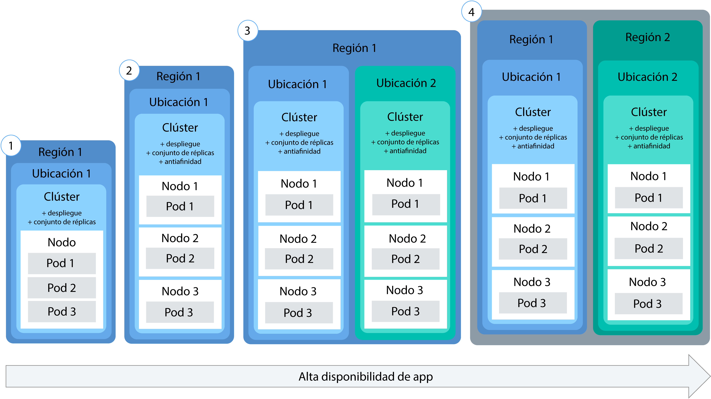

---

copyright:
  years: 2014, 2018
lastupdated: "2018-4-20"

---

{:new_window: target="_blank"}
{:shortdesc: .shortdesc}
{:screen: .screen}
{:pre: .pre}
{:table: .aria-labeledby="caption"}
{:codeblock: .codeblock}
{:tip: .tip}
{:download: .download}


# Despliegue de apps en clústeres
{: #app}

Puede utilizar las técnicas de Kubernetes en {{site.data.keyword.containerlong}} para desplegar apps en contenedores y asegurarse de que las estén siempre activas y en funcionamiento. Por ejemplo, puede realizar actualizaciones continuas y retrotracciones sin causar a los usuarios tiempos de inactividad.
{: shortdesc}

Conozca los pasos generales para desplegar apps pulsando en un área de la imagen siguiente.


<map name="d62e18" id="d62e18">
<area href="cs_cli_install.html" target="_blank" alt="Instale las CLI." title="Instale las CLI." shape="rect" coords="30, 69, 179, 209" />
<area href="https://kubernetes.io/docs/concepts/configuration/overview/" target="_blank" alt="Cree un archivo de configuración para la app. Revise las mejores prácticas desde Kubernetes." title="Cree un archivo de configuración para la app. Revise las mejores prácticas desde Kubernetes." shape="rect" coords="254, 64, 486, 231" />
<area href="#app_cli" target="_blank" alt="Opción 1: Ejecute los archivos de configuración desde la CLI de Kubernetes." title="Opción 1: Ejecute los archivos de configuración desde la CLI de Kubernetes." shape="rect" coords="544, 67, 730, 124" />
<area href="#cli_dashboard" target="_blank" alt="Opción 2: Inicie el panel de control de Kubernetes localmente y ejecute los archivos de configuración." title="Opción 2: Inicie el panel de control de Kubernetes localmente y ejecute los archivos de configuración." shape="rect" coords="544, 141, 728, 204" />
</map>


<br />


## Planificación de despliegues de alta disponibilidad
{: #highly_available_apps}

Cuanto más ampliamente distribuya la configuración entre varios nodos trabajadores y clústeres, menor será la probabilidad de que los usuarios experimenten tiempo de inactividad con la app.
{: shortdesc}

Revise las siguientes configuraciones potenciales de apps que están ordenadas por grados de disponibilidad en orden ascendente.



1.  Un despliegue con n+2 pods gestionados por un conjunto de réplicas.
2.  Un despliegue con n+2 pods gestionados por un conjunto de réplicas y distribuidos en varios nodos (antiafinidad) en la misma ubicación.
3.  Un despliegue con n+2 pods gestionados por un conjunto de réplicas y distribuidos en varios nodos (antiafinidad) en distintas ubicaciones.
4.  Un despliegue con n+2 pods gestionados por un conjunto de réplicas y distribuidos en varios nodos (antiafinidad) en distintas regiones.


### Cómo aumentar la disponibilidad de la app

<dl>
  <dt>Utilice despliegues y conjuntos de réplicas para desplegar la app y sus dependencias</dt>
    <dd><p>Un despliegue es un recurso de Kubernetes que puede utilizar para declarar todos los componentes de su app y sus dependencias. Con los despliegues, no tiene que encargarse de todos los pasos y en su lugar puede centrarse en la app. </p>
    <p>Si despliega más de un pod, se crea automáticamente un conjunto de réplicas que supervisa los pods y garantiza que el número deseado de pods están activos y en ejecución en todo momento. Cuando un pod pasa a estar inactivo, el conjunto de réplicas sustituye el pod que no responde por uno nuevo.</p>
    <p>Puede utilizar un despliegue para definir estrategias para la app que incluyan el número de pods que desea añadir durante una actualización continuada y el número de pods que pueden no estar disponibles al mismo tiempo. Cuando lleva a cabo una actualización continuada, el despliegue comprueba si la revisión funciona o no y detiene la implantación cuando se detectan anomalías.</p>
    <p>Los despliegues permiten desplegar simultáneamente varias revisiones con diferentes distintivos. Por ejemplo, puede probar un primer despliegue antes de decidir si se debe utilizar para producción. </p>
    <p>Los despliegues permiten realizar un seguimiento de las revisiones desplegadas. Puede utilizar este historial para retrotraer a una versión anterior si detecta que las actualizaciones no funcionan como esperaba. </p></dd>
  <dt>Incluya suficientes réplicas para la carga de trabajo de la app, más dos</dt>
    <dd>Para que la app esté aún más disponible y resulte más resistente frente a errores, considere la posibilidad de incluir más réplicas que el mínimo para gestionar la carga de trabajo prevista. Las réplicas adicionales pueden gestionar la carga de trabajo en el caso de que un pod se cuelgue y el conjunto de réplicas aún no haya recuperado el pod inactivo. Para la protección frente a dos anomalías simultáneas, incluya dos réplicas adicionales. Esta configuración es un patrón de tipo N+2, donde N es el número de réplicas necesario para gestionar la carga de trabajo entrante y +2 significa dos réplicas adicionales. Mientras el clúster tenga suficiente espacio, puede tener tantos pods como desee. </dd>
  <dt>Distribuya los pods entre varios nodos (antiafinidad)</dt>
    <dd><p>Cuando se crea un despliegue, cada pod se puede desplegar en el mismo nodo trabajador. Esto se conoce como afinidad o coubicación. Para proteger la app con relación a una anomalía del nodo trabajador, es posible configurar el despliegue para repartir los pods a través de varios nodos de trabajo utilizando la opción <em>podAntiAffinity</em> con los clústeres estándar.  Puede definir dos tipos de antiafinidad de pod: preferida o necesaria. Para obtener más información, consulte la documentación de Kubernetes en <a href="https://kubernetes.io/docs/concepts/configuration/assign-pod-node/" rel="external" target="_blank" title="(Se abre en un nuevo separador o ventana)">Asignación de pods a nodos</a>. </p>
    <p><strong>Nota</strong>: Con la antiafinidad necesaria, únicamente puede desplegar un número de réplicas para las que tenga nodos de trabajador. Por ejemplo, si tiene 3 nodos de trabajador en su clúster y define 5 réplicas en su archivo YAML, únicamente se desplegarán 3 réplicas. Cada réplica se basa en un nodo trabajador diferente. Las 2 réplicas sobrantes quedarán pendientes. Si añade otro nodo trabajador al clúster, una de las réplicas sobrantes se desplegará de forma automática en el nuevo nodo trabajador. <p>
    <p><strong>Ejemplo de archivos YAML de despliegue</strong>:<ul>
    <li><a href="https://raw.githubusercontent.com/IBM-Cloud/kube-samples/master/deploy-apps-clusters/nginx_preferredAntiAffinity.yaml" rel="external" target="_blank" title="(Se abre en un nuevo separador o ventana)">App de Nginx con antiafinidad de pod preferida. </a></li>
    <li><a href="https://raw.githubusercontent.com/IBM-Cloud/kube-samples/master/deploy-apps-clusters/liberty_requiredAntiAffinity.yaml" rel="external" target="_blank" title="(Se abre en un nuevo separador o ventana)">App de IBM WebSphere Application Server Liberty con antiafinidad de pod requerida. </a></li></ul></p>
    </dd>
<dt>Distribución de pods entre varias zonas o regiones</dt>
  <dd>Para proteger la app ante un error de la ubicación o de la región, puede crear un segundo clúster en otra ubicación o región y utilizar el archivo YAML de despliegue para desplegar un conjunto de réplicas duplicado para la app. Mediante la adición de una ruta compartida y un equilibrador de la carga frente a los clústeres, puede distribuir la carga de trabajo entre las ubicaciones y regiones. Para obtener más información, consulte [Alta disponibilidad de clústeres](cs_clusters.html#clusters).
  </dd>
</dl>


### Despliegue de una app mínima
{: #minimal_app_deployment}

Un despliegue básico de app en un clúster gratuito o estándar puede incluir los siguientes componentes.
{: shortdesc}


Para desplegar los componentes de una app mínima tal como se muestra en el diagrama, utilice un archivo de configuración parecido al del siguiente ejemplo:
```
apiVersion: apps/v1beta1
kind: Deployment
metadata:
  name: ibmliberty
spec:
  replicas: 1
  template:
    metadata:
      labels:
        app: ibmliberty
    spec:
      containers:
      - name: ibmliberty
        image: registry.bluemix.net/ibmliberty:latest
        ports:
        - containerPort: 9080        
---
apiVersion: v1
kind: Service
metadata:
  name: ibmliberty-service
  labels:
    app: ibmliberty
spec:
  selector:
    app: ibmliberty
  type: NodePort
  ports:
   - protocol: TCP
     port: 9080
```
{: codeblock}

**Nota:** Para exponer el servicio, asegúrese de que el par clave/valor que utiliza en la sección `spec.selector` del servicio es el mismo que el par de clave/valor utilizado en la sección `spec.template.metadata.labels` de su yaml de despliegue. Para obtener más información sobre cada componente, revise [Aspectos básicos de Kubernetes](cs_tech.html#kubernetes_basics).

<br />


## Inicio del panel de control de Kubernetes
{: #cli_dashboard}

Abra un panel de control de Kubernetes en el sistema local para ver información sobre un clúster y sus nodos trabajadores.
{:shortdesc}

Antes de empezar, seleccione su clúster como [destino de la CLI](cs_cli_install.html#cs_cli_configure). Esta tarea precisa de la [política de acceso de administrador](cs_users.html#access_policies). Verifique su [política de acceso](cs_users.html#infra_access) actual.

Puede utilizar el puerto predeterminado o definir su propio puerto para iniciar el panel de control de Kubernetes para un clúster.

1.  Para clústeres con una versión maestra de Kubernetes 1.7.16 o anterior:

    1.  Establezca el proxy con el número de puerto predeterminado.

        ```
        kubectl proxy
        ```
        {: pre}

        Salida:

        ```
        Starting to serve on 127.0.0.1:8001
        ```
        {: screen}

    2.  Abra el panel de control de Kubernetes en un navegador web.

        ```
        http://localhost:8001/ui
        ```
        {: codeblock}

2.  Para clústeres con una versión maestra de Kubernetes 1.8.2 o posterior:

    1.  Obtenga las credenciales para Kubernetes.

        ```
        kubectl config view -o jsonpath='{.users[0].user.auth-provider.config.id-token}'
        ```
        {: pre}

    2.  Copie el valor **id-token** que se muestra en la salida.

    3.  Establezca el proxy con el número de puerto predeterminado.

        ```
        kubectl proxy
        ```
        {: pre}

        Salida de ejemplo:

        ```
        Starting to serve on 127.0.0.1:8001
        ```
        {: screen}

    4.  Inicie sesión en el panel de control.

      1.  En el navegador, vaya al siguiente URL:

          ```
          http://localhost:8001/api/v1/namespaces/kube-system/services/https:kubernetes-dashboard:/proxy/
          ```
          {: codeblock}

      2.  En la página de inicio de sesión, seleccione el método de autenticación **Señal**.

      3.  A continuación, pegue el valor **id-token** que ha copiado anteriormente en el campo **Señal** y pulse **INICIAR SESIÓN**.

[A continuación, puede ejecutar un archivo de configuración desde el panel de control.](#app_ui)

Cuando termine de utilizar el panel de control de Kubernetes, utilice `CONTROL+C` para salir del mandato `proxy`. Después de salir, el panel de control Kubernetes deja de estar disponible. Ejecute el mandato `proxy` para reiniciar el panel de control de Kubernetes.


<br />


## Creación de secretos
{: #secrets}

Los secretos de Kubernetes constituyen una forma segura de almacenar información confidencial, como nombres de usuario, contraseñas o claves.
{:shortdesc}

<table>
<caption>Archivos necesarios para almacenar en secretos por tarea</caption>
<thead>
<th>Tarea</th>
<th>Archivos necesarios para almacenar en secretos</th>
</thead>
<tbody>
<tr>
<td>Añadir un servicio a un clúster</td>
<td>Ninguno. Un secreto se crea automáticamente al enlazar un servicio a un clúster.</td>
</tr>
<tr>
<td>Opcional: Configure el servicio de Ingress con TLS, si no utiliza ingress-secret. <p><b>Nota</b>: TLS ya está habilitado de forma predeterminada y ya hay un secreto creado para la conexión TLS.

Para ver el secreto de TLS predeterminado:
<pre>
bx cs cluster-get &lt;cluster_name_or_ID&gt; | grep "Ingress secret"
</pre>
</p>
Para crear su propio secreto, siga los pasos de este tema.</td>
<td>Certificado de servidor y clave: <code>server.crt</code> y <code>server.key</code></td>
<tr>
<td>Cree la anotación de autenticación mutua.</td>
<td>Certificado de CA: <code>ca.crt</code></td>
</tr>
</tbody>
</table>

Para obtener más información sobre lo que se puede almacenar en secretos, consulte la [Documentación de Kubernetes](https://kubernetes.io/docs/concepts/configuration/secret/).


Para crear un secreto con un certificado:

1. Genere el certificado de la autoridad de certificados (CA) y la clave de su proveedor de certificados. Si tiene su propio dominio, compre un certificado TLS oficial para el mismo. Para realizar pruebas, puede generar un certificado firmado de forma automática.

 **Importante**: asegúrese de que [CN](https://support.dnsimple.com/articles/what-is-common-name/) sea diferente para cada certificado. 

 El certificado de cliente y la clave de cliente se deben verificar hasta el certificado raíz de confianza, que en este caso, es el certificado de CA. Ejemplo:

 ```
 Certificado de cliente: emitido por certificado intermedio
 Certificado intermedio: emitido por certificado raíz
 Certificado raíz: emitido por sí mismo
 ```
 {: codeblock}

2. Cree el certificado como un secreto de Kubernetes.

   ```
   kubectl create secret generic <secret_name> --from-file=<cert_file>=<cert_file>
   ```
   {: pre}

   Ejemplos:
   - Conexión de TLS:

     ```
     kubectl create secret tls <secret_name> --from-file=tls.crt=server.crt --from-file=tls.key=server.key
     ```
     {: pre}

   - Anotación de autenticación mutua:

     ```
     kubectl create secret generic <secret_name> --from-file=ca.crt=ca.crt
     ```
     {: pre}

<br />


## Despliegue de apps con la GUI
{: #app_ui}

Cuando despliega una app a un clúster utilizando el panel de control de Kubernetes, un recurso de despliegue crea, actualiza y gestiona automáticamente los pods del clúster.
{:shortdesc}

Antes de empezar:

-   Instale las [CLI](cs_cli_install.html#cs_cli_install) necesarias.
-   Defina su clúster como [destino de la CLI](cs_cli_install.html#cs_cli_configure).

Para desplegar la app:

1.  Abra el [panel de control](#cli_dashboard) de Kubernetes y pulse **+ Crear**. 
2.  Especifique los detalles de la app de una de las dos siguientes maneras. 
  * Seleccione **Especificar detalles de app a continuación** y especifique los detalles.
  * Seleccione **Cargar un archivo YAML o JSON** para cargar su [archivo de configuración ](https://kubernetes.io/docs/tasks/inject-data-application/define-environment-variable-container/). 

  ¿Necesita ayuda con su archivo de configuración? Consulte este [archivo YAML de ejemplo ](https://github.com/IBM-Cloud/kube-samples/blob/master/deploy-apps-clusters/deploy-ibmliberty.yaml). En este ejemplo, se despliega un contenedor desde la imagen **ibmliberty** en la región EE.UU. Sur.
  {: tip}

3.  Verifique que ha desplegado satisfactoriamente la app de una de las siguientes formas.
  * En el panel de control de Kubernetes, pulse **Despliegues**. Se visualiza una lista de despliegues satisfactorios. 
  * Si la app está [disponible públicamente](cs_network_planning.html#public_access), vaya a la página de visión general del clúster en el panel de control de {{site.data.keyword.containerlong}}. Copie el subdominio, que se encuentra en la sección de resumen del clúster y péguelo en un navegador para ver la app. 

<br />


## Despliegue de apps con la CLI
{: #app_cli}

Después de crear un clúster, puede desplegar una app en dicho clúster mediante la CLI de Kubernetes.
{:shortdesc}

Antes de empezar:

-   Instale las [CLI](cs_cli_install.html#cs_cli_install) necesarias.
-   Defina su clúster como [destino de la CLI](cs_cli_install.html#cs_cli_configure).

Para desplegar la app:

1.  Cree un archivo de configuración basado en la [prácticas recomendadas de Kubernetes ](https://kubernetes.io/docs/concepts/configuration/overview/). Generalmente, un archivo de configuración contiene detalles de configuración de cada uno de los recursos que está creando en Kubernetes. El script puede incluir una o varias de las siguientes secciones:

    -   [Despliegue ](https://kubernetes.io/docs/concepts/workloads/controllers/deployment/): Define la creación de pods y conjuntos de réplicas. Un pod incluye una app contenerizada individual y conjuntos de réplicas que controlan varias instancias de pods.

    -   [Servicio ](https://kubernetes.io/docs/concepts/services-networking/service/): Ofrece un acceso frontal a los pods mediante un nodo trabajador o una dirección IP pública de equilibrador de carga, o bien una ruta pública de Ingress.

    -   [Ingress ](https://kubernetes.io/docs/concepts/services-networking/ingress/): Especifica un tipo de equilibrador de carga que ofrece rutas para acceder a la app a nivel público.

    

2.  Ejecute el archivo de configuración en el contexto de un clúster.

    ```
    kubectl apply -f config.yaml
    ```
    {: pre}

3.  Si ha puesto la app a disponibilidad pública mediante un servicio de puerto de nodo, un servicio de equilibrador de carga o Ingress, compruebe que puede acceder a la app.

<br />


## Escalado de apps 
{: #app_scaling}

Con Kubernetes, puede habilitar el [escalado automático de pod horizontal ](https://kubernetes.io/docs/tasks/run-application/horizontal-pod-autoscale/) para aumentar o disminuir automáticamente el número de instancias de las apps en función de la CPU.
{:shortdesc}

¿Está buscando información sobre las aplicaciones de escalado de Cloud Foundry? Consulte [IBM Auto-Scaling for {{site.data.keyword.Bluemix_notm}}](/docs/services/Auto-Scaling/index.html). 
{: tip}

Antes de empezar:
- Defina su clúster como [destino de la CLI](cs_cli_install.html#cs_cli_configure).
- La supervisión de Heapster debe desplegarse en el clúster que desea escalar automáticamente.

Pasos:

1.  Despliegue la app en el clúster desde la CLI. Cuando despliegue la app, debe solicitar CPU.

    ```
    kubectl run <app_name> --image=<image> --requests=cpu=<cpu> --expose --port=<port_number>
    ```
    {: pre}

    <table>
    <thead>
    <th colspan=2> Visión general de los componentes de este mandato</th>
    </thead>
    <tbody>
    <tr>
    <td><code>--image</code></td>
    <td>La aplicación que desea desplegar.</td>
    </tr>
    <tr>
    <td><code>--request=cpu</code></td>
    <td>La CPU necesaria para el contenedor, que se especifica en milinúcleos. Por ejemplo, <code>--requests=200m</code>.</td>
    </tr>
    <tr>
    <td><code>--expose</code></td>
    <td>Si tiene el valor true, crea un servicio externo.</td>
    </tr>
    <tr>
    <td><code>--port</code></td>
    <td>El puerto en el que la app está disponible externamente.</td>
    </tr></tbody></table>

    Para despliegues más complejos, es posible que tenga que crear un [archivo de configuración](#app_cli).
    {: tip}

2.  Cree un autoscaler y defina la política. Para obtener más información sobre cómo trabajar con el mandato `kubectl autoscale`, consulte [la documentación de Kubernetes ](https://v1-8.docs.kubernetes.io/docs/reference/generated/kubectl/kubectl-commands#autoscale).

    ```
    kubectl autoscale deployment <deployment_name> --cpu-percent=<percentage> --min=<min_value> --max=<max_value>
    ```
    {: pre}

    <table>
    <thead>
    <th colspan=2> Visión general de los componentes de este mandato</th>
    </thead>
    <tbody>
    <tr>
    <td><code>--cpu-percent</code></td>
    <td>Utilización media de CPU que mantiene el componente Horizontal Pod Autoscaler, que se especifica como un porcentaje.</td>
    </tr>
    <tr>
    <td><code>--min</code></td>
    <td>El número mínimo de pods desplegados que se utilizan para mantener el porcentaje especificado de utilización de CPU.</td>
    </tr>
    <tr>
    <td><code>--max</code></td>
    <td>El número máximo de pods desplegados que se utilizan para mantener el porcentaje especificado de utilización de CPU.</td>
    </tr>
    </tbody></table>


<br />


## Gestión de despliegues continuos
{: #app_rolling}

Puede gestionar la implantación de los cambios de una forma automatizada y controlada. Si el despliegue no va según lo planificado, puede retrotraerlo a la revisión anterior.
{:shortdesc}

Antes de empezar, cree un [despliegue](#app_cli).

1.  [Implante ](https://kubernetes.io/docs/reference/generated/kubectl/kubectl-commands#rollout) un cambio. Por ejemplo, supongamos que desea cambiar la imagen que ha utilizado en el despliegue inicial.

    1.  Obtener el nombre del despliegue.

        ```
        kubectl get deployments
        ```
        {: pre}

    2.  Obtener el nombre del pod.

        ```
        kubectl get pods
        ```
        {: pre}

    3.  Obtener el nombre del contenedor que se está ejecutando en el pod.

        ```
        kubectl describe pod <pod_name>
        ```
        {: pre}

    4.  Definir la imagen que utilizará el despliegue.

        ```
        kubectl set image deployment/<deployment_name><container_name>=<image_name>
        ```
        {: pre}

    Al ejecutar estos mandatos, el cambio se aplica de inmediato y se registra en el historial de implantaciones.

2.  Comprobar el estado del despliegue.

    ```
    kubectl rollout status deployments/<deployment_name>
    ```
    {: pre}

3.  Retrotraer un cambio.
    1.  Ver el historial de implantaciones del despliegue e identificar el número de revisión del último despliegue.

        ```
        kubectl rollout history deployment/<deployment_name>
        ```
        {: pre}

        **Sugerencia:** Para ver los detalles de una revisión concreta, incluya el número de revisión.

        ```
        kubectl rollout history deployment/<deployment_name> --revision=<number>
        ```
        {: pre}

    2.  Retrotraer a la versión anterior o especificar una revisión. Para retrotraer a la versión anterior, utilice el mandato siguiente.

        ```
        kubectl rollout undo deployment/<depoyment_name> --to-revision=<number>
        ```
        {: pre}

<br />


