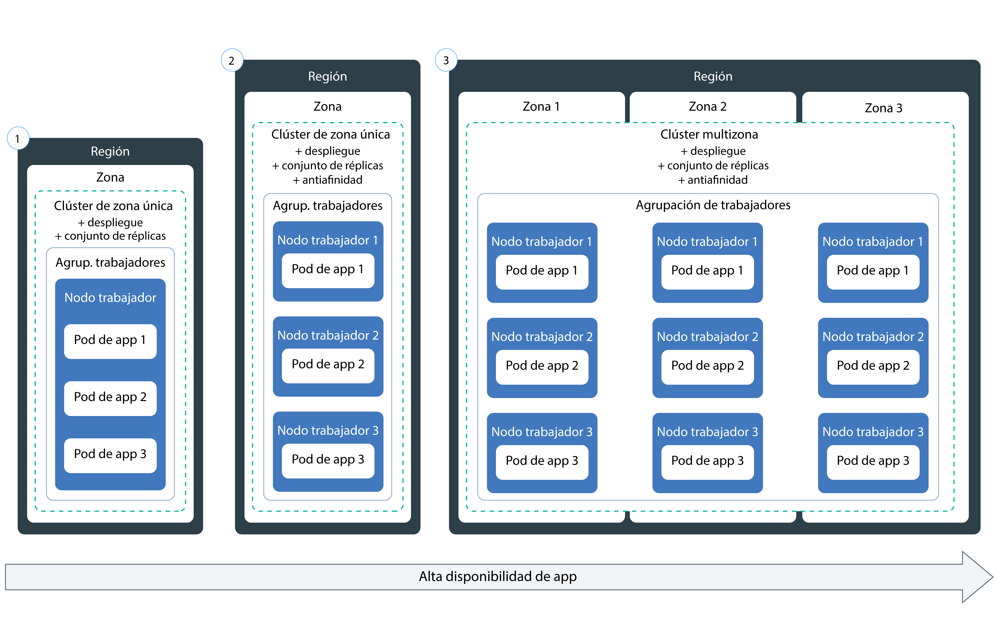

---

copyright:
  years: 2014, 2019
lastupdated: "2019-06-11"

keywords: kubernetes, iks, node.js, js, java, .net, go, flask, react, python, swift, rails, ruby, spring boot, angular

subcollection: containers

---

{:new_window: target="_blank"}
{:shortdesc: .shortdesc}
{:screen: .screen}
{:pre: .pre}
{:table: .aria-labeledby="caption"}
{:codeblock: .codeblock}
{:tip: .tip}
{:note: .note}
{:important: .important}
{:deprecated: .deprecated}
{:download: .download}
{:preview: .preview}


# Despliegue de apps nativas de Kubernetes en clústeres
{: #app}

Puede utilizar las técnicas de Kubernetes en {{site.data.keyword.containerlong}} para desplegar apps en contenedores y asegurarse de que las estén siempre activas y en funcionamiento. Por ejemplo, puede realizar actualizaciones continuas y retrotracciones sin causar a los usuarios tiempos de inactividad. Debido a que Kubernetes es una plataforma de orquestación de contenedor extensible que no impone un lenguaje o una app específicos, puede ejecutar diversas cargas de trabajo, como por ejemplo apps sin estado, con estado y de proceso de datos escritas en el lenguaje de su elección.
{: shortdesc}

Conozca los pasos generales para desplegar apps pulsando en un área de la imagen siguiente. ¿Desea aprender primero los conceptos básicos? Consulte la [guía de aprendizaje para desplegar apps](/docs/containers?topic=containers-cs_apps_tutorial#cs_apps_tutorial).


<map name="d62e18" id="d62e18">
<area href="/docs/containers?topic=containers-cs_cli_install" target="_blank" alt="Instale las CLI." title="Instale las CLI." shape="rect" coords="30, 69, 179, 209" />
<area href="https://kubernetes.io/docs/concepts/configuration/overview/" target="_blank" alt="Cree un archivo de configuración para la app. Revise las mejores prácticas desde Kubernetes." title="Cree un archivo de configuración para la app. Revise las mejores prácticas desde Kubernetes." shape="rect" coords="254, 64, 486, 231" />
<area href="#app_cli" target="_blank" alt="Opción 1: Ejecute los archivos de configuración desde la CLI de Kubernetes." title="Opción 1: Ejecute los archivos de configuración desde la CLI de Kubernetes." shape="rect" coords="544, 67, 730, 124" />
<area href="#cli_dashboard" target="_blank" alt="Opción 2: Inicie el panel de control de Kubernetes localmente y ejecute los archivos de configuración." title="Opción 2: Inicie el panel de control de Kubernetes localmente y ejecute los archivos de configuración." shape="rect" coords="544, 141, 728, 204" />
</map>

<br />


## Planificación de la ejecución de apps en clústeres
{: #plan_apps}

Antes de desplegar una app en un clúster de {{site.data.keyword.containerlong_notm}}, decida cómo desea configurar la app para que se pueda acceder a la app correctamente y se pueda integrar con otros servicios de {{site.data.keyword.Bluemix_notm}}.
{:shortdesc}

### ¿Qué tipo de objetos Kubernetes puedo hacer para mi app?
{: #object}

Cuando prepare el archivo YAML de la app, tiene muchas opciones para aumentar la disponibilidad, el rendimiento y la seguridad de la app. Por ejemplo, en lugar de un solo pod, puede utilizar un objeto controlador de Kubernetes para gestionar la carga de trabajo, como un conjunto de réplicas, un trabajo o un conjunto de daemons. Para obtener más información sobre los pods y los controladores, consulte la [documentación de Kubernetes ](https://kubernetes.io/docs/concepts/workloads/pods/pod-overview/). Un despliegue que gestiona un conjunto de réplicas de pods es un caso de uso común para una app.
{: shortdesc}

Por ejemplo, un objeto `kind: Deployment` constituye una buena opción para desplegar un pod de app porque con este objeto puede especificar un conjunto de réplicas para aumentar la disponibilidad de los pods.

En la tabla siguiente se describe por qué puede crear distintos tipos de objetos de carga de trabajo de Kubernetes.

| Objeto | Descripción |
| --- | --- |
| [`Pod` ](https://kubernetes.io/docs/concepts/workloads/pods/pod/) | Un pod es la unidad desplegable más pequeña para las cargas de trabajo, y puede contener un solo contenedor o varios. Parecidos a los contenedores, los pods están diseñadas para ser desechados y a menudo se utilizan para probar las características de una app. Para evitar el tiempo de inactividad de la app, considere la posibilidad de desplegar pods con un controlador de Kubernetes, como un despliegue. Un despliegue le ayuda a gestionar varios pods, réplicas, escalado de pods, despliegues y más. |
| [`ReplicaSet` ](https://kubernetes.io/docs/concepts/workloads/controllers/replicaset/) | Un conjunto de réplicas garantiza que se ejecutan varias réplicas del pod y que se vuelve a planificar el pod en el caso de que se desactive. Puede crear un conjunto de réplicas para probar cómo funciona la planificación del pod, pero, para gestionar actualizaciones de app, despliegues y escalado, cree en su lugar un despliegue. |
| [`Deployment` ](https://kubernetes.io/docs/concepts/workloads/controllers/deployment/) | Un despliegue es un controlador que gestiona un pod o un [conjunto de réplicas ](https://kubernetes.io/docs/concepts/workloads/controllers/replicaset/) de plantillas de pod. Puede crear pods o conjuntos de réplicas sin un despliegue para probar las características de la app. En el caso de una configuración de nivel de producción, utilice despliegues para gestionar actualizaciones, despliegues y escalado de apps. |
| [`StatefulSet` ](https://kubernetes.io/docs/concepts/workloads/controllers/statefulset/) | De forma similar a los despliegues, un conjunto con estado es un controlador que gestiona un conjunto de réplicas de pods. A diferencia de los despliegues, un conjunto con estado garantiza que su pod tiene una identidad de red exclusiva que mantiene su estado entre replanificaciones. Cuando desee ejecutar cargas de trabajo en la nube, intente [diseñar la app de modo que sea sin estado](/docs/containers?topic=containers-strategy#cloud_workloads) para que las instancias de servicio sean independientes entre sí y, si fallan, no se interrumpa el servicio. Sin embargo, algunas apps, como las bases de datos, deben ser con estado. En estos casos, considere la posibilidad de crear un conjunto con estado y utilizar el almacenamiento [de archivos](/docs/containers?topic=containers-file_storage#file_statefulset), [en bloque](/docs/containers?topic=containers-block_storage#block_statefulset) o [de objeto](/docs/containers?topic=containers-object_storage#cos_statefulset) como almacenamiento persistente para el conjunto con estado. También puede instalar [Portworx](/docs/containers?topic=containers-portworx) en la parte superior de los nodos trabajadores nativos y utilizar Portworx como una solución de almacenamiento definida por software de alta disponibilidad para gestionar el almacenamiento persistente para el conjunto con estado. |
| [`DaemonSet` ](https://kubernetes.io/docs/concepts/workloads/controllers/daemonset/) | Utilice un conjunto de daemons cuando tenga que ejecutar el mismo pod en cada nodo trabajador del clúster. Los pods gestionados por un conjunto de daemons se planifican automáticamente cuando se añade un nodo trabajador a un clúster. Los casos de uso típicos incluyen recopiladores de registros, como `logstash` o `prometheus`, que recopilan registros de cada nodo trabajador para proporcionar detalles sobre el estado de un clúster o de una app. |
| [`Job` ](https://kubernetes.io/docs/concepts/workloads/controllers/jobs-run-to-completion/) | Un trabajo garantiza que uno o varios pods se ejecutan correctamente hasta su finalización. Puede utilizar un trabajo para colas o trabajos por lotes, para dar soporte al proceso en paralelo de elementos de trabajo distintos pero relacionados, como un determinado número de tramas que hay que mostrar, correos electrónicos que hay que enviar y archivos que hay que convertir. Para planificar un trabajo de modo que se ejecute a determinadas horas, utilice un [`CronJob` ](https://kubernetes.io/docs/concepts/workloads/controllers/cron-jobs/).|
{: caption="Tipos de objetos de carga de trabajo de Kubernetes que se pueden crear." caption-side="top"}

### ¿Cómo puedo añadir funciones a la configuración de mi app Kubernetes?
Consulte [Especificación de los requisitos de la app en el archivo YAML](#app_yaml) para ver descripciones de lo que puede incluir en un despliegue. El ejemplo incluye:
* [Conjuntos de réplicas](#replicaset)
* [Etiquetas](#label)
* [Afinidad](#affinity)
* [Políticas de imágenes](#image)
* [Puertos](#port)
* [Solicitudes y límites de recursos](#resourcereq)
* [Sondeos de actividad y de preparación](#probe)
* [Servicios](#app-service) para exponer el servicio de la app en un puerto
* [Mapas de configuración](#configmap) para definir las variables de entorno de un contenedor
* [Secretos](#secret) para definir las variables de entorno de un contenedor
* [Volúmenes persistentes](#pv) que están montados en el contenedor para almacenamiento

### ¿Qué sucede si quiero que la configuración de mi app Kubernetes utilice variables? ¿Cómo las añado al archivo YAML?
{: #variables}

Para añadir información sobre variables a los despliegues en lugar de codificar los datos en el archivo YAML, puede utilizar un objeto [`ConfigMap` de Kubernetes ](https://kubernetes.io/docs/tasks/configure-pod-container/configure-pod-configmap/) o un objeto [`Secret` ](https://kubernetes.io/docs/concepts/configuration/secret/).
{: shortdesc}

Para consumir un mapa de configuración o un secreto, debe montarlo en el pod. El objeto configmap o secret se combina con el pod justo antes de que se ejecute el pod. Puede reutilizar una especificación de despliegue y una imagen entre varias apps, pero luego debe intercambiar los mapas de configuración y los secretos personalizados. Los secretos en concreto consumen mucho almacenamiento en el nodo local, así que debe planificarlos en consecuencia.

Ambos recursos definen pares de clave-valor, pero se utilizan para situaciones diferentes.

<dl>
<dt>Configmap</dt>
<dd>Proporcione información de configuración no confidencial para las cargas de trabajo que se especifican en un despliegue. Puede utilizar configmaps de tres maneras principales.
<ul><li><strong>Sistema de archivos</strong>: puede montar un archivo completo o un conjunto de variables en un pod. Se crea un archivo para cada entrada, en función del contenido de nombre de clave del archivo que se establece en el valor.</li>
<li><strong>Variable de entorno</strong>: establezca una variable de entorno de forma dinámica para una especificación de contenedor.</li>
<li><strong>Argumento de línea de mandatos</strong>: establezca el argumento de línea de mandatos que se utiliza en una especificación de contenedor.</li></ul></dd>

<dt>Secreto</dt>
<dd>Proporcione información confidencial a las cargas de trabajo tal como se indica a continuación. Otros usuarios del clúster pueden tener acceso al secreto, de modo que asegúrese de que la información secreta se puede compartir con esos usuarios.
<ul><li><strong>Información de identificación personal (PII)</strong>: guarde en secretos la información confidencial, como direcciones de correo electrónico u otra información necesaria para la conformidad de la empresa o para la regulación gubernamental.</li>
<li><strong>Credenciales</strong>: coloque las credenciales, como contraseñas, claves y señales, en un secreto para reducir el riesgo de exposición accidental. Por ejemplo, cuando [enlaza un servicio](/docs/containers?topic=containers-service-binding#bind-services) al clúster, las credenciales se guardan en un secreto.</li></ul></dd>
</dl>

¿Desea proteger aún más sus secretos? Solicite al administrador del clúster que [habilite {{site.data.keyword.keymanagementservicefull}}](/docs/containers?topic=containers-encryption#keyprotect) en el clúster para cifrar los secretos nuevos y existentes.
{: tip}

### ¿Cómo puedo añadir servicios de IBM, como por ejemplo Watson, a mi app?
Consulte [Adición de servicios a apps](/docs/containers?topic=containers-service-binding#adding_app).

### ¿Cómo puedo asegurarme de que mi app tenga los recursos adecuados?
Cuando [especifique el archivo YAML de la app](#app_yaml), puede añadir a la configuración de la app funciones de Kubernetes que ayuden a que la app a obtener los recursos correctos. En particular, [establezca límites de recursos y solicitudes ](https://kubernetes.io/docs/concepts/configuration/manage-compute-resources-container/) para cada contenedor que esté definido en el archivo YAML.
{: shortdesc}

Además, el administrador del clúster puede configurar controles de recursos que afecten al despliegue de la app, como los siguientes.
*  [Cuotas de recursos ](https://kubernetes.io/docs/concepts/policy/resource-quotas/)
*  [Prioridad de pod](/docs/containers?topic=containers-pod_priority#pod_priority)

### ¿Cómo puedo acceder a mi app?
Puede acceder a la app de forma privada dentro del clúster, [utilizando un servicio `clusterIP`](/docs/containers?topic=containers-cs_network_planning#in-cluster).
{: shortdesc}

Si desea exponer su app públicamente, tiene distintas opciones que dependen del tipo de clúster.
*  **Clúster gratuito**: puede exponer la app utilizando un [servicio NodePort](/docs/containers?topic=containers-nodeport#nodeport).
*  **Clúster estándar**: puede exponer la app utilizando un [servicio NodePort, equilibrador de carga o Ingress](/docs/containers?topic=containers-cs_network_planning#external).
*  **Clúster que se hace privado mediante Calico**: puede exponer la app utilizando un [servicio NodePort, equilibrador de carga o Ingress](/docs/containers?topic=containers-cs_network_planning#private_both_vlans). También debe utilizar una política de red preDNAT de Calico para bloquear los puertos del nodo público.
*  **Clúster estándar de solo VLAN privada**: puede exponer la app utilizando un [servicio NodePort, equilibrador de carga o Ingress](/docs/containers?topic=containers-cs_network_planning#plan_private_vlan). También debe abrir el puerto para la dirección IP privada del servicio en el cortafuegos.

### Después de desplegar mi app, ¿cómo puedo supervisar su estado?
Puede configurar el [registro y supervisión](/docs/containers?topic=containers-health#health) de {{site.data.keyword.Bluemix_notm}} para el clúster. También puede integrar un [servicio de registro o supervisión](/docs/containers?topic=containers-supported_integrations#health_services) de terceros.
{: shortdesc}

### ¿Cómo puedo mantener actualizada mi app?
Si desea añadir y eliminar apps de forma dinámica en respuesta a la utilización de la carga de trabajo, consulte [Escalado de apps](/docs/containers?topic=containers-app#app_scaling).
{: shortdesc}

Si desea gestionar las actualizaciones de la app, consulte [Gestión de despliegues continuos](/docs/containers?topic=containers-app#app_rolling).

### ¿Cómo puedo controlar quién tiene acceso a mis implementaciones de apps?
Los administradores de cuentas y de clústeres pueden controlar el acceso a diferentes niveles: clúster, espacio de nombres de Kubernetes, pod y contenedor.
{: shortdesc}

Con {{site.data.keyword.Bluemix_notm}} IAM, puede asignar permisos a usuarios individuales, grupos o cuentas de servicio a nivel de instancia de clúster.  Puede limitar aún más el acceso al clúster restringiendo el acceso de los usuarios a determinados espacios de nombres del clúster. Para obtener más información, consulte [Asignación de acceso a clúster](/docs/containers?topic=containers-users#users).

Para controlar el acceso a nivel de pod, puede [configurar políticas de seguridad de pod con Kubernetes RBAC](/docs/containers?topic=containers-psp#psp).

En el archivo YAML de despliegue de la app, puede definir el contexto de seguridad para un pod o un contenedor. Para obtener más información, consulte la [documentación de Kubernetes ](https://kubernetes.io/docs/tasks/configure-pod-container/security-context/).

¿Desea controlar el acceso a nivel de aplicación? Para crear un flujo de inicio de sesión que puede actualizar en cualquier momento sin cambiar el código de la app, intente utilizar [{{site.data.keyword.appid_long_notm}}](/docs/services/appid?topic=appid-getting-started).
{: tip}

<br />


## Planificación de despliegues de alta disponibilidad
{: #highly_available_apps}

Cuanto más ampliamente distribuya la configuración entre varios nodos trabajadores y clústeres, menor será la probabilidad de que los usuarios experimenten tiempo de inactividad con la app.
{: shortdesc}

Revise las siguientes configuraciones potenciales de apps que están ordenadas por grados de disponibilidad en orden ascendente.



1.  Un despliegue con n+2 pods gestionados por un conjunto de réplicas en un solo nodo de un clúster de una sola zona.
2.  Un despliegue con n+2 pods gestionados por un conjunto de réplicas y distribuidos en varios nodos (antiafinidad) en un clúster de una sola zona.
3.  Un despliegue con n+2 pods gestionados por un conjunto de réplicas y distribuidos en varios nodos (antiafinidad) en varias zonas de un clúster multizona.

También puede [conectar varios clústeres en distintas regiones con un equilibrador de carga global](/docs/containers?topic=containers-ha_clusters#multiple_clusters) para aumentar la alta disponibilidad.

### Cómo aumentar la disponibilidad de la app
{: #increase_availability}

Tenga en cuenta las opciones siguientes para aumentar la disponibilidad de la app.
{: shortdesc}

<dl>
  <dt>Utilice despliegues y conjuntos de réplicas para desplegar la app y sus dependencias</dt>
    <dd><p>Un despliegue es un recurso de Kubernetes que puede utilizar para declarar todos los componentes de su app y sus dependencias. Con los despliegues, no tiene que encargarse de todos los pasos y en su lugar puede centrarse en la app.</p>
    <p>Si despliega más de un pod, se crea automáticamente un conjunto de réplicas para los despliegues que supervisa los pods y garantiza que el número especificado de pods están activos y en ejecución en todo momento. Cuando un pod pasa a estar inactivo, el conjunto de réplicas sustituye el pod que no responde por uno nuevo.</p>
    <p>Puede utilizar un despliegue para definir estrategias para la app que incluyan el número de pods que desea añadir durante una actualización continuada y el número de pods que pueden no estar disponibles al mismo tiempo. Cuando lleva a cabo una actualización continuada, el despliegue comprueba si la revisión funciona o no y detiene la implantación cuando se detectan anomalías.</p>
    <p>Los despliegues permiten desplegar simultáneamente varias revisiones con diferentes distintivos. Por ejemplo, puede probar un primer despliegue antes de decidir si se debe utilizar para producción.</p>
    <p>Mediante el uso de despliegues, puede realizar un seguimiento de las revisiones desplegadas. Puede utilizar este historial para retrotraer a una versión anterior si detecta que las actualizaciones no funcionan como esperaba.</p></dd>
  <dt>Incluya suficientes réplicas para la carga de trabajo de la app, más dos</dt>
    <dd>Para que la app esté aún más disponible y resulte más resistente frente a errores, considere la posibilidad de incluir más réplicas que el mínimo para gestionar la carga de trabajo prevista. Las réplicas adicionales pueden gestionar la carga de trabajo en el caso de que un pod se cuelgue y el conjunto de réplicas aún no haya recuperado el pod inactivo. Para la protección frente a dos anomalías simultáneas, incluya dos réplicas adicionales. Esta configuración es un patrón de tipo N+2, donde N es el número de réplicas necesario para gestionar la carga de trabajo entrante y +2 significa dos réplicas adicionales. Mientras el clúster tenga suficiente espacio, puede tener tantos pods como desee.</dd>
  <dt>Distribuya los pods entre varios nodos (antiafinidad)</dt>
    <dd><p>Cuando se crea un despliegue, cada pod se puede desplegar en el mismo nodo trabajador. Esto se conoce como afinidad o coubicación. Para proteger la app con relación a una anomalía del nodo trabajador, es posible configurar el despliegue para repartir los pods a través de varios nodos de trabajo utilizando la opción <code>podAntiAffinity</code> con los clústeres estándar. Puede definir dos tipos de antiafinidad de pod: preferida o necesaria.
      <p>Para obtener más información, consulte la documentación de Kubernetes en <a href="https://kubernetes.io/docs/concepts/configuration/assign-pod-node/" rel="external" target="_blank" title="(Se abre en un nuevo separador o ventana)">Asignación de pods a nodos</a>.</p>
      <p>Para ver un ejemplo de afinidad en un despliegue de app, consulte [Cómo crear el archivo YAML de despliegue de la app](#app_yaml).</p>
      </dd>
    </dd>
<dt>Distribución de pods entre varias zonas o regiones</dt>
  <dd><p>Para proteger la app frente a un error de zona, puede crear varios clústeres en distintas zonas o puede añadir zonas a una agrupación de nodos trabajadores en un clúster multizona. Los clústeres multizona solo están disponibles en [determinadas áreas metropolitanas](/docs/containers?topic=containers-regions-and-zones#zones), como Dallas. Si crea varios clústeres en distintas zonas, debe [configurar un equilibrador de carga global](/docs/containers?topic=containers-ha_clusters#multiple_clusters).</p>
  <p>Cuando se utiliza un conjunto de réplicas y se especifica la antiafinidad de pod, Kubernetes distribuye los pods de la app entre los nodos. Si los nodos están en varias zonas, los pods se distribuyen entre las zonas, lo que aumenta la disponibilidad de la app. Si desea limitar las apps de modo que solo se ejecuten en una zona, puede configurar la afinidad de pod, o puede crear y etiquetar una agrupación de nodos trabajadores en una zona. Para obtener más información, consulte [Alta disponibilidad de clústeres multizona](/docs/containers?topic=containers-ha_clusters#ha_clusters).</p>
  <p><strong>En un despliegue de clúster multizona, ¿se distribuyen mis pods de app de forma uniforme entre los nodos? </strong></p>
  <p>Los pods se distribuyen uniformemente entre las zonas, pero no siempre entre los nodos. Por ejemplo, si tiene un clúster con un nodo en cada una de las tres zonas y despliega un conjunto de réplicas de seis pods, cada nodo obtiene dos pods. Sin embargo, si tiene un clúster con dos nodos en cada una de las tres zonas y despliega un conjunto de réplicas de seis pods, cada zona planifica dos pods, y puede que planifique un pod por nodo o puede que no. Para obtener más control sobre la planificación, puede [establecer la afinidad de pod ](https://kubernetes.io/docs/concepts/configuration/assign-pod-node).</p>
  <p><strong>Si cae una zona, ¿cómo se replanifican los pods en los nodos restantes de las otras zonas?</strong></br>Depende de la política de planificación que haya utilizado en el despliegue. Si ha incluido la [afinidad de pod específica del nodo ](https://kubernetes.io/docs/concepts/configuration/assign-pod-node/#node-affinity-beta-feature), los pods no se vuelven a planificar. Si no lo ha hecho, los pods se crean en los nodos trabajadores disponibles en otras zonas, pero es posible que no estén equilibrados. Por ejemplo, es posible que los dos pods se distribuyan entre los dos nodos disponibles, o puede que ambos se planifiquen en un nodo con capacidad disponible. De forma similar, cuando la zona no disponible vuelve a estar activa, los pods no se suprimen y se reequilibran automáticamente entre los nodos. Si desea que los pods se reequilibren entre las zonas cuando la zona vuelve a estar activa, tenga en cuenta la posibilidad de utilizar el [deplanificador de Kubernetes ](https://github.com/kubernetes-incubator/descheduler).</p>
  <p><strong>Consejo</strong>: en clústeres multizona, intente mantener una capacidad de nodo trabajador del 50 % por zona para disponer de suficiente capacidad para proteger el clúster frente un error de la zona.</p>
  <p><strong>¿Qué ocurre si quiero distribuir mi app entre regiones?</strong></br>Para proteger la app frente a un error de región, cree un segundo clúster en otra región, [configure un equilibrador de carga global](/docs/containers?topic=containers-ha_clusters#multiple_clusters) para conectar los clústeres y utilice un YAML de despliegue para desplegar un conjunto de réplicas duplicado con [antiafinidad de pod ](https://kubernetes.io/docs/concepts/configuration/assign-pod-node/) para la app.</p>
  <p><strong>¿Qué pasa si mis apps necesitan almacenamiento persistente?</strong></p>
  <p>Utilice un servicio de nube, como por ejemplo [{{site.data.keyword.cloudant_short_notm}}](/docs/services/Cloudant?topic=cloudant-getting-started#getting-started) o [{{site.data.keyword.cos_full_notm}}](/docs/services/cloud-object-storage?topic=cloud-object-storage-about).</p></dd>
</dl>

## Especificación de los requisitos de la app en el archivo YAML
{: #app_yaml}

En Kubernetes, describe su app en un archivo YAML que declara la configuración del objeto Kubernetes. A continuación, el servidor de API de Kubernetes procesa el archivo YAML y guarda la configuración y el estado necesario del objeto en el almacén de datos etcd. El planificador de Kubernetes planifica las cargas de trabajo en los nodos trabajadores del clúster, teniendo en cuenta la especificación del archivo YAML, las políticas de clúster que define el administrador y la capacidad disponible del clúster.
{: shortdesc}

Consulte una copia del [archivo YAML completo](https://raw.githubusercontent.com/IBM-Cloud/kube-samples/master/deploy-apps-clusters/deploy_wasliberty.yaml). A continuación, revise las secciones siguientes para ver cómo puede mejorar el despliegue de la app.

* [Conjuntos de réplicas](#replicaset)
* [Etiquetas](#label)
* [Afinidad](#affinity)
* [Políticas de imágenes](#image)
* [Puertos](#port)
* [Solicitudes y límites de recursos](#resourcereq)
* [Sondeos de actividad y de preparación](#probe)
* [Servicios](#app-service) para exponer el servicio de la app en un puerto
* [Mapas de configuración](#configmap) para definir las variables de entorno de un contenedor
* [Secretos](#secret) para definir las variables de entorno de un contenedor
* [Volúmenes persistentes](#pv) que están montados en el contenedor para almacenamiento
* [Siguientes pasos](#nextsteps)
* [Archivo YAML de ejemplo completo](#yaml-example)

<dl>
<dt>Metadatos de despliegue básico</dt>
  <dd><p>Utilice la versión de API adecuada para el [tipo de objeto Kubernetes](#object) que va a desplegar. La versión de API determina las características admitidas para el objeto Kubernetes que tiene disponibles. El nombre que asigne en los metadatos es el nombre del objeto, no su etiqueta. El nombre se utiliza cuando interactúa con el objeto, como por ejemplo en `kubectl get deployment <name>`.</p>
  <p><pre class="codeblock"><code>apiVersion: apps/v1
kind: Deployment
metadata:
  name: wasliberty</code></pre></p></dd>

<dt id="replicaset">Conjuntos de réplicas</dt>
  <dd><p>Para aumentar la disponibilidad de la app, puede añadir un conjunto de réplicas en el despliegue. En un conjunto de réplicas, puede definir el número de instancias de la app que desea desplegar. Los conjuntos de réplicas se gestionan y se supervisan mediante el despliegue de Kubernetes. Si una instancia de la app deja de estar activa, Kubernetes automáticamente activa una nueva instancia de la app para mantener el número especificado de instancias de la app.</p>
  <p><pre class="codeblock"><code>spec:
  replicas: 3</pre></code></p></dd>

<dt id="label">Etiquetas</dt>
  <dd><p>Con las [etiquetas](/docs/containers?topic=containers-strategy#deploy_organize) puede marcar distintos tipos de recursos en el clúster con el mismo par de `clave: valor`. Luego puede especificar el selector de modo que coincida con la etiqueta de forma que pueda crear con base en estos otros recursos. Si tiene previsto exponer la app públicamente, debe utilizar una etiqueta que coincida con el selector que especifique en el servicio. En el ejemplo, la especificación del despliegue utiliza la plantilla que coincide con la etiqueta `app: wasliberty.`</p>
  <p>Puede recuperar los objetos que están etiquetados en el clúster, por ejemplo para ver los componentes `staging` o `production`. Por ejemplo, obtenga una lista de todos los recursos que tienen la etiqueta `env: production` en todos los espacios de nombres del clúster. <strong>Nota:</strong> se necesita acceso a todos los espacios de nombres para ejecutar este mandato.<pre class="pre"><code>kubectl get all -l env=production --all-namespaces</code></pre></p>
  <ul><li>Para obtener más información sobre etiquetas, consulte la [documentación de Kubernetes ](https://kubernetes.io/docs/concepts/overview/working-with-objects/labels/).</li>
  <li>Para aplicar etiquetas a nodos trabajadores, [cree la agrupación de nodos trabajadores](/docs/containers?topic=containers-add_workers#add_pool) con etiquetas o [actualice una agrupación de nodos trabajadores existente](/docs/containers?topic=containers-add_workers#worker_pool_labels).</li>
  <li>Para ver un ejemplo más detallado, consulte [Despliegue de apps en nodos trabajadores específicos mediante la utilización de etiquetas](/docs/containers?topic=containers-app#node_affinity).</li></ul>
  <p><pre class="codeblock"><code>selector:
  matchLabels:
    app: wasliberty
template:
  metadata:
    labels:
      app: wasliberty</pre></code></p></dd>

<dt id="affinity">Afinidad</dt>
  <dd><p>Especifique afinidad (coubicación) cuando desee tener más control sobre los nodos trabajadores en los que están planificados los pods. La afinidad solo afecta a los pods en el momento de la planificación. Por ejemplo, para distribuir el despliegue entre nodos trabajadores en lugar de permitir que los pods planifiquen en el mismo nodo, utilice la opción <code>podAntiAffinity</code> con los clústeres estándares. Puede definir dos tipos de antiafinidad de pod: preferida o necesaria.</p>
  <p>Para obtener más información, consulte la documentación de Kubernetes en <a href="https://kubernetes.io/docs/concepts/configuration/assign-pod-node/" rel="external" target="_blank" title="(Se abre en un nuevo separador o ventana)">Asignación de pods a nodos</a>.</p>
  <ul><li><strong>Antiafinidad necesaria</strong>: solo puede desplegar el número de réplicas para las que tiene nodos trabajadores. Por ejemplo, si tiene tres nodos trabajadores en su clúster y define cinco réplicas en su archivo YAML, únicamente se desplegarán tres réplicas. Cada réplica se basa en un nodo trabajador diferente. Las dos réplicas sobrantes quedarán pendientes. Si añade otro nodo trabajador al clúster, una de las réplicas sobrantes se desplegará de forma automática en el nuevo nodo trabajador. Si un nodo trabajador falla, el pod no se vuelve a programar porque se necesita la política de afinidad. Para ver un ejemplo de archivo YAML con antiafinidad necesaria, consulte <a href="https://github.com/IBM-Cloud/kube-samples/blob/master/deploy-apps-clusters/liberty_requiredAntiAffinity.yaml" rel="external" target="_blank" title="(Se abre en un nuevo separador o ventana)">App Liberty con antiafinidad de pod necesaria</a></li>
  <li><strong>Antiafinidad preferida</strong>: puede desplegar sus pods en nodos con la capacidad disponible, lo que proporciona más flexibilidad para la carga de trabajo. Cuando sea posible, los pods se planifican en distintos nodos trabajadores. Por ejemplo, si tiene tres nodos trabajadores con suficiente capacidad en el clúster, puede planificar los cinco pods de réplica entre los nodos. Sin embargo, si añade dos nodos trabajadores más al clúster, la regla de afinidad no obliga la reprogramación de los dos pods adicionales que se ejecutan en los nodos existentes en el nodo libre.</li>
  <li><strong>Afinidad de nodo trabajador</strong>: puede configurar el despliegue de modo que solo se ejecute en determinados nodos trabajadores, como por ejemplo los nativos. Para obtener más información, consulte [Despliegue de apps en nodos trabajadores específicos mediante la utilización de etiquetas](/docs/containers?topic=containers-app#node_affinity).</li></ul>
  <p>Ejemplo de antiafinidad preferida:</p>
  <p><pre class="codeblock"><code>spec:
  affinity:
    podAntiAffinity:
      preferredDuringSchedulingIgnoredDuringExecution:
      - weight: 100
        podAffinityTerm:
          labelSelector:
            matchExpressions:
            - key: app
              operator: In
              values:
              - wasliberty
          topologyKey: kubernetes.io/hostname</pre></code></p></dd>

<dt id="image">Imagen de contenedor</dt>
  <dd>
  <p>Especifique la imagen que desea utilizar para sus contenedores, la ubicación de la imagen y la política de extracción de imágenes. Si no especifica una etiqueta de imagen, de forma predeterminada se extrae la imagen con la etiqueta `latest`.</p>
  <p>**Atención**: evite utilizar la etiqueta latest para cargas de trabajo de producción. Es posible que no haya probado la carga de trabajo con la imagen más reciente si está utilizando un repositorio público o compartido, como Docker Hub o {{site.data.keyword.registryshort_notm}}.</p>
  <p>Por ejemplo, para obtener una lista de las etiquetas de las imágenes públicas de IBM:</p>
  <ol><li>Vaya a la región de registro global.<pre class="pre"><code>ibmcloud cr region-set global</code></pre></li>
  <li>Obtenga una lista de las imágenes de IBM.<pre class="pre"><code>ibmcloud cr images --include-ibm</code></pre></li></ol>
  <p>`imagePullPolicy` tiene como valor predeterminado `IfNotPresent`, lo que hace que solo se extraiga la imagen si no existe localmente. Si desea que la imagen se extraiga cada vez que se inicie el contenedor, especifique `imagePullPolicy: Always`.</p>
  <p><pre class="codeblock"><code>containers:
- name: wasliberty
  image: icr.io/ibmliberty:webProfile8
  imagePullPolicy: Always</pre></code></p></dd>

<dt id="port">Puerto para el servicio de la app</dt>
  <dd><p>Seleccione un puerto de contenedor en el que abrir los servicios de la app. Para ver qué puerto se debe abrir, consulte las especificaciones de la app o Dockerfile. El puerto es accesible desde la red privada, pero no desde una conexión de red pública. Para exponer la app públicamente, debe crear un puerto NodePort, un equilibrador de carga o un servicio Ingress. Utilice este mismo número de puerto cuando [cree un objeto `Service`](#app-service).</p>
  <p><pre class="codeblock"><code>ports:
- containerPort: 9080</pre></code></p></dd>

<dt id="resourcereq">Solicitudes y límites de recursos</dt>
  <dd><p>Como administrador del clúster, puede asegurarse de que los equipos que comparten el clúster no adquieran más que la parte justa de recursos de cálculo (memoria y CPU) mediante la creación de un [objeto <code>ResourceQuota</code> ](https://kubernetes.io/docs/concepts/policy/resource-quotas/) para cada espacio de nombres de Kubernetes del clúster. Si el administrador del clúster establece una cuota de recursos de cálculo, cada contenedor de la plantilla de despliegue debe especificar solicitudes y límites de recursos para la memoria y la CPU; de lo contrario, la creación del pod falla.</p>
  <p><ol><li>Compruebe si se ha definido una cuota de recursos para un espacio de nombres.<pre class="pre"><code>kubectl get quota --namespace=<namespace></code></pre></li>
  <li>Vea cuáles son los límites de la cuota.<pre class="pre"><code>kubectl describe quota <quota_name> --namespace=<namespace></code></pre></li></ol></p>
  <p>Aunque no haya ninguna cuota de recursos definida, puede incluir solicitudes y límites de recursos en el despliegue para mejorar la gestión de los recursos de los nodos trabajadores.</p><p class="note">Si un contenedor sobrepasa su límite, el contenedor se puede reiniciar o fallar. Si un contenedor excede una solicitud, su pod se puede desalojar si el nodo trabajador se queda sin este recurso que se ha sobrepasado. Para obtener más información sobre la resolución del problema, consulte [Los pods no se pueden reiniciar repetidamente o se eliminan inesperadamente](/docs/containers?topic=containers-cs_troubleshoot_clusters#pods_fail).</p>
  <p>**Solicitud**: la cantidad mínima del recurso que el planificador reserva para que la utilice el contenedor. Si la cantidad es igual al límite, la solicitud está garantizada. Si la cantidad es menor que el límite, la solicitud sigue estando garantizada, pero el planificador puede utilizar la diferencia entre la solicitud y el límite para asignarla a recursos de otros contenedores.</p>
  <p>**Límite**: la cantidad máxima del recurso que puede consumir el contenedor. Si la cantidad total de recursos que se utiliza en los contenedores supera la cantidad disponible en el nodo trabajador, los contenedores pueden ser desalojados para liberar espacio. Para evitar el desalojo, defina una solicitud de recurso igual al límite del contenedor. Si no se especifica ningún límite, el valor predeterminado es la capacidad del nodo trabajador.</p>
  <p>Para obtener más información, consulte la [documentación de Kubernetes ](https://kubernetes.io/docs/concepts/configuration/manage-compute-resources-container/).</p>
  <p><pre class="codeblock"><code>resources:
  requests:
    memory: "512Mi"
    cpu: "500m"
  limits:
    memory: "1024Mi"
    cpu: "1000m"</pre></code></p></dd>

<dt id="probe">Sondeos de actividad y de preparación</dt>
  <dd><p>De forma predeterminada, Kubernetes envía tráfico a los pods de la app después de que se inicien todos los contenedores del pod y reinicia los contenedores cuando se bloquean. Sin embargo, puede definir comprobaciones de estado para mejorar la potencia del direccionamiento del tráfico de servicio. Por ejemplo, es posible que la app tenga un retardo de arranque. Puede que los procesos de la app comiencen antes de que la app esté completamente preparada, lo que puede afectar a las respuestas, especialmente cuando se escala entre varias instancias. Con las comprobaciones de estado, puede dejar que el sistema sepa si la app se está ejecutando y está lista para recibir solicitudes. Mediante el establecimiento de estos sondeos también puede ayudar a evitar tiempos de inactividad cuando realice una [actualización continua](#app_rolling) de la app. Puede definir dos tipos de comprobaciones de estado: sondeos de actividad y de preparación.</p>
  <p>**Sondeo de actividad**: configure un sondeo de actividad para comprobar si el contenedor se está ejecutando. Si el sondeo falla, el contenedor se reinicia. Si el contenedor no especifica un sondeo de actividad, el sondeo tiene éxito porque presupone que el contenedor está activo cuando el contenedor está en el estado **Running (en ejecución)**.</p>
  <p>**Sondeo de preparación**: configure un sondeo de preparación para comprobar si el contenedor está preparado para recibir solicitudes y tráfico externo. Si el sondeo falla, la dirección IP del pod se elimina como dirección IP utilizable para los servicios que coinciden con el pod, pero el contenedor no se reinicia. Resulta especialmente importante establecer un sondeo de preparación con un retardo inicial si la app tarda un rato en iniciarse. Antes del retardo inicial, el sondeo no se inicia, con lo que el contenedor tiente tiempo para iniciarse. Si el contenedor no proporciona un sondeo de preparación, el sondeo tiene éxito porque presupone que el contenedor está activo cuando el contenedor está en el estado **Running (en ejecución)**.</p>
  <p>Puede configurar los sondeos como mandatos, como solicitudes HTTP o como sockets TCP. En el ejemplo se utilizan solicitudes HTTP. Dé más tiempo al sondeo de actividad que al de preparación. Para obtener más información, consulte la [documentación de Kubernetes ](https://kubernetes.io/docs/tasks/configure-pod-container/configure-liveness-readiness-probes/).</p>
  <p><pre class="codeblock"><code>livenessProbe:
  httpGet:
    path: /
    port: 9080
  initialDelaySeconds: 300
  periodSeconds: 15
readinessProbe:
  httpGet:
    path: /
    port: 9080
  initialDelaySeconds: 45
  periodSeconds: 5</pre></code></p></dd>

<dt id="app-service">Exposición del servicio de la app</dt>
  <dd><p>Puede crear un servicio que exponga la app. En la sección `spec`, asegúrese de que los valores de `port` y de etiqueta coincidan con los que ha utilizado en el despliegue. El servicio expone los objetos que coinciden con la etiqueta, como por ejemplo `app: wasliberty` en el ejemplo siguiente.</p>
  <ul><li>De forma predeterminada, un servicio utiliza [`ClusterIP` ](https://kubernetes.io/docs/tutorials/kubernetes-basics/expose/expose-intro/), lo que hace que el servicio solo esté accesible dentro del clúster, pero no fuera del mismo.</li>
  <li>Puede crear un servicio NodePort, equilibrador de carga o Ingress para exponer la app rápidamente. Estos servicios tienen dos IP, una externa y una interna. Cuando el tráfico se recibe en la IP externa, se reenvía a la IP interna del clúster. A continuación, desde la IP interna del clúster, el tráfico se direcciona a la dirección IP del contenedor de la app.</li>
  <li>En el ejemplo se utiliza `NodePort` para exponer el servicio fuera del clúster. Para obtener más información sobre cómo configurar el acceso externo, consulte [Elección de un servicio NodePort, LoadBalancer o Ingress](/docs/containers?topic=containers-cs_network_planning#external).</li></ul>
  <p><pre class="codeblock"><code>apiVersion: v1
kind: Service
metadata:
  name: wasliberty
  labels:
    app: wasliberty
spec:
  ports:
  - port: 9080
  selector:
    app: wasliberty
    type: NodePort</pre></code></p></dd>

<dt id="configmap">Mapas de configuración para variables de entorno de contenedor</dt>
<dd><p>Los mapas de configuración proporcionan información de configuración no confidencial para las cargas de trabajo de despliegue. En el ejemplo siguiente se muestra cómo se puede hacer referencia a valores del mapa de configuración como variables de entorno en la sección spec del contenedor del archivo YAML de despliegue. Al hacer referencia a valores desde el mapa de configuración, puede desacoplar esta información de configuración de su despliegue para mantener la portabilidad de la app contenerizada.<ul><li>[Ayuda para decidir si utiliza un objeto Kubernetes `ConfigMap` o `Secret` para variables](#variables).</li>
<li>Para ver más formas de utilizar mapas de configuración, consulte la [documentación de Kubernetes ](https://kubernetes.io/docs/tasks/configure-pod-container/configure-pod-configmap/).</li></ul></p>
<p><pre class="codeblock"><code>apiVersion: apps/v1
kind: Deployment
metadata:
  name: wasliberty
spec:
  replicas: 3
  template:
    ...
    spec:
      ...
      containers:
      - name: wasliberty
        ...
        ent:
          - name: VERSION
            valueFrom:
              configMapKeyRef:
                name: wasliberty
                key: VERSION
          - name: LANGUAGE
            valueFrom:
              configMapKeyRef:
                name: wasliberty
                key: LANGUAGE
        ...
---
apiVersion: v1
kind: ConfigMap
metadata:
  name: wasliberty
  labels:
    app: wasliberty
data:
  VERSION: "1.0"
  LANGUAGE: en</pre></code></p></dd>

  <dt id="secret">Secretos para variables de entorno de contenedor</dt>
  <dd><p>Los secretos proporcionan información de configuración confidencial, como las contraseñas de las cargas de trabajo de despliegue. En el ejemplo siguiente se muestra cómo se puede hacer referencia a valores del secreto como variables de entorno en la sección spec del contenedor del archivo YAML de despliegue. También puede montar el secreto como un volumen. Al hacer referencia a valores desde el secreto, puede desacoplar esta información de configuración de su despliegue para mantener la portabilidad de la app contenerizada.<ul><li>[Ayuda para decidir si utilizar un objeto ConfigMap o Secret para variables](#variables).</li>
  <li>Para obtener más información, consulte [Visión general sobre cuándo utilizar secretos](/docs/containers?topic=containers-encryption#secrets).</li></ul></p>
  <p><pre class="codeblock"><code>apiVersion: apps/v1
  kind: Deployment
  metadata:
    name: wasliberty
  spec:
    replicas: 3
    template:
      ...
      spec:
        ...
        containers:
        - name: wasliberty
          ...
          ent:
          - name: username
            valueFrom:
              secretKeyRef:
                name: wasliberty
                key: username
          - name: password
            valueFrom:
              secretKeyRef:
                name: wasliberty
                key: password
          ...
  ---
  apiVersion: v1
  kind: Secret
  metadata:
    name: wasliberty
    labels:
      app: wasliberty
  type: Opaque
  data:
    username: dXNlcm5hbWU=
    password: cGFzc3dvcmQ=</pre></code></p></dd>

<dt id="pv">Volúmenes persistentes para el almacenamiento de contenedores</dt>
<dd><p>Los volúmenes persistentes (PV) interactúan con el almacenamiento físico para proporcionar almacenamiento de datos persistentes para las cargas de trabajo del contenedor. En el ejemplo siguiente se muestra cómo se puede añadir almacenamiento persistente a la app. Para suministrar almacenamiento persistente, cree una reclamación de volumen persistente (PVC) para describir el tipo y el tamaño del almacenamiento de archivos que desea tener. Después de crear la PVC, el volumen persistente y el almacenamiento físico se crean automáticamente mediante el [suministro dinámico](/docs/containers?topic=containers-kube_concepts#dynamic_provisioning). Cuando se hace referencia a la PVC en el archivo YAML de despliegue, el almacenamiento se monta automáticamente en la pod de la app. Cuando el contenedor del pod escribe datos en el directorio de la vía de acceso de montaje `/test`, los datos se almacenan en la instancia de almacenamiento de archivos NFS.</p><ul><li>Para obtener más información, consulte [Conceptos básicos del almacenamiento de Kubernetes](/docs/containers?topic=containers-kube_concepts#kube_concepts).</li><li>Para ver las opciones de otros tipos de almacenamiento que puede suministrar, consulte [Planificación del almacenamiento persistente de alta disponibilidad](/docs/containers?topic=containers-storage_planning#storage_planning).</li></ul>
<p><pre class="codeblock"><code>apiVersion: apps/v1
kind: Deployment
metadata:
  name: wasliberty
spec:
  replicas: 3
  template:
    ...
    spec:
      ...
      containers:
      - name: wasliberty
        ...
        volumeMounts:
        - name: pvmount
          mountPath: /test
      volumes:
      - name: pvmount
        persistentVolumeClaim:
          claimName: wasliberty
        ...
---
apiVersion: v1
kind: PersistentVolumeClaim
metadata:
  name: wasliberty
  annotations:
    volume.beta.kubernetes.io/storage-class: "ibmc-file-bronze"
  labels:
    billingType: "hourly"
    app: wasliberty
spec:
  accessModes:
    - ReadWriteMany
         resources:
           requests:
             storage: 24Gi</pre></code></p></dd>

<dt id="nextsteps">¿Está preparado para desplegar una app?</dt>
<dd><ul><li>[Utilice una copia del archivo YAML completo como plantilla para comenzar](https://raw.githubusercontent.com/IBM-Cloud/kube-samples/master/deploy-apps-clusters/deploy_wasliberty.yaml).</li>
<li>[Despliegue una app desde el panel de control de Kubernetes](/docs/containers?topic=containers-app#app_ui).</li>
<li>[Despliegue una app desde la CLI](/docs/containers?topic=containers-app#app_cli).</li></ul></dd>

</dl>

### Archivo YAML de despliegue de ejemplo completo
{: #yaml-example}

A continuación se muestra un ejemplo de una copia del archivo YAML de despliegue que se ha [explicado en las secciones anteriores](#app_yaml). También puede [descargar el archivo YAML desde GitHub](https://raw.githubusercontent.com/IBM-Cloud/kube-samples/master/deploy-apps-clusters/deploy_wasliberty.yaml).
{: shortdesc}

Para aplicar el archivo YAML:

```
kubectl apply -f file.yaml [-n <namespace>]
```
{: pre}

Archivo YAML de ejemplo:

```yaml
apiVersion: apps/v1
kind: Deployment
metadata:
  name: wasliberty
spec:
  replicas: 3
  selector:
    matchLabels:
      app: wasliberty
  template:
    metadata:
      labels:
        app: wasliberty
    spec:
      affinity:
        podAntiAffinity:
          preferredDuringSchedulingIgnoredDuringExecution:
          - weight: 100
            podAffinityTerm:
              labelSelector:
                matchExpressions:
                - key: app
                  operator: In
                  values:
                  - wasliberty
              topologyKey: kubernetes.io/hostname
      containers:
      - name: wasliberty
        image: icr.io/ibmliberty
        env:
          - name: VERSION
            valueFrom:
              configMapKeyRef:
                name: wasliberty
                key: VERSION
          - name: LANGUAGE
            valueFrom:
              configMapKeyRef:
                name: wasliberty
                key: LANGUAGE
          - name: username
            valueFrom:
              secretKeyRef:
                name: wasliberty
                key: username
          - name: password
            valueFrom:
              secretKeyRef:
                name: wasliberty
                key: password
        ports:
          - containerPort: 9080
        resources:
          requests:
            memory: "512Mi"
            cpu: "500m"
          limits:
            memory: "1024Mi"
            cpu: "1000m"
        livenessProbe:
          httpGet:
            path: /
            port: 9080
          initialDelaySeconds: 300
          periodSeconds: 15
        readinessProbe:
          httpGet:
            path: /
            port: 9080
          initialDelaySeconds: 45
          periodSeconds: 5
        volumeMounts:
        - name: pvmount
          mountPath: /test
      volumes:
      - name: pvmount
        persistentVolumeClaim:
          claimName: wasliberty
---
apiVersion: v1
kind: Service
metadata:
  name: wasliberty
  labels:
    app: wasliberty
spec:
  ports:
  - port: 9080
  selector:
    app: wasliberty
  type: NodePort
---
apiVersion: v1
kind: ConfigMap
metadata:
  name: wasliberty
  labels:
    app: wasliberty
data:
  VERSION: "1.0"
  LANGUAGE: en
---
apiVersion: v1
kind: Secret
metadata:
  name: wasliberty
  labels:
    app: wasliberty
type: Opaque
data:
  username: dXNlcm5hbWU=
  password: cGFzc3dvcmQ=
---
apiVersion: v1
kind: PersistentVolumeClaim
metadata:
  name: wasliberty
  annotations:
    volume.beta.kubernetes.io/storage-class: "ibmc-file-bronze"
  labels:
    billingType: "hourly"
    app: wasliberty
spec:
  accessModes:
    - ReadWriteMany
  resources:
    requests:
      storage: 24Gi
```
{: codeblock}

<br />


## Gestión de los archivos de configuración de Kubernetes para su reutilización en varios entornos con Kustomize
{: #kustomize}

Como parte de una app nativa de la nube [de 12 factores ](https://12factor.net/), desea mantener la paridad entre desarrollo y producción mediante la configuración de un desarrollo continuo y de un conducto de entrega que utilicen una fuente común de base de código controlada por versión. En los repositorios de la base de código, almacene los archivos de manifiesto de configuración de recursos de Kubernetes, que suelen estar en formato YAML. Puede utilizar el proyecto de Kubernetes [Kustomize ](https://kustomize.io/) tanto para estandarizar como para personalizar sus despliegues en varios entornos.

{: shortdesc}

Por ejemplo, puede configurar un archivo YAML `kustomization` base para declarar objetos de Kubernetes, como despliegues y PVC, que se comparten en los entornos de desarrollo, prueba y producción. Luego puede configurar otros archivos YAML `kustomization` que tengan configuraciones personalizadas para cada entorno, como más réplicas en el entorno de producción que en el de prueba. Estos archivos YAML personalizados pueden sustituir o crear el archivo YAML base compartido para que pueda gestionar entornos que son prácticamente idénticos, excepto para algunas diferencias de configuración que puede controlar en su origen. Para obtener más información sobre Kustomize, como un glosario y preguntas frecuentes (FAQ), consulte la [documentación de Kustomize ](https://github.com/kubernetes-sigs/kustomize/tree/master/docs).

Antes de empezar:
*   [Cree](/docs/containers?topic=containers-clusters#clusters_ui) o [actualice](/docs/containers?topic=containers-update) a un clúster que ejecuta Kubernetes versión 1.14 o posterior.
*   Asegúrese de que su [versión de `kubectl`](/docs/containers?topic=containers-cs_cli_install#kubectl) coincida con su versión del clúster.
*   [Inicie una sesión en su cuenta. Si procede, apunte al grupo de recursos adecuado. Establezca el contexto para el clúster.](/docs/containers?topic=containers-cs_cli_install#cs_cli_configure)

Para configurar los archivos de configuración con Kustomize:
1.  [Instale la herramienta `kustomize` ](https://github.com/kubernetes-sigs/kustomize/blob/master/docs/INSTALL.md).
    *   Para MacOS, puede utilizar el gestor de paquetes `brew`.
        ```
        brew install kustomize
        ```
        {: pre}
    *   Para Windows, puede utilizar el gestor de paquetes `chocolatey`.
        ```
        choco install kustomize
        ```
        {: pre}
2.  Cree un directorio para la app en un sistema de control de versiones, como por ejemplo Git.
    ```
    git init ~/<my_app>
    ```
    {: pre}
3.  Cree la estructura de repositorio para el directorio de `kustomize` [`base` ](https://github.com/kubernetes-sigs/kustomize/blob/master/docs/glossary.md#base), [`overlay`](https://github.com/kubernetes-sigs/kustomize/blob/master/docs/glossary.md#overlay) y para los directorios del entorno, como el de transferencia (staging) y el de producción (prod). En los pasos siguientes, configurará estos repositorios para que se utilicen con `kustomize`.
    ```
    mkdir -p ~/<my_app>/base &&
    mkdir -p ~/<my_app>/overlay &&
    mkdir -p ~/<my_app>/overlay/staging &&
    mkdir -p ~/<my_app>/overlay/prod
    ```
    {: pre}
    
    Estructura de repositorios de ejemplo:
    ```
    .
    ├── base
    └── overlay
        ├── prod
        └── staging
    ```
    {: screen}
4.  Configure el repositorio `base`.
    1.  Vaya al repositorio base.
        ```
        cd ~/<my_app>/base
        ```
        {: pre}
    2.  Cree un conjunto inicial de archivos YAML de configuración de Kubernetes para el despliegue de su app. Puede utilizar el [archivo YAML de ejemplo](#yaml-example) `wasliberty` para crear un despliegue, un servicio, un mapa de configuración y una reclamación de volumen persistente.
    3.  Cree un archivo [`kustomization` ](https://github.com/kubernetes-sigs/kustomize/blob/master/docs/kustomization.yaml) que especifique la configuración base que se aplicará en los entornos. El archivo `kustomization` debe incluir la lista de archivos YAML de configuración de recursos de Kubernetes almacenados en el mismo repositorio `base`. En el archivo `kustomization`, también puede añadir configuraciones que se apliquen a todos los archivos YAML de recursos del repositorio base, como un prefijo o un sufijo que se añade a todos los nombres de recursos, una etiqueta, el espacio de nombres existente en el que se crean todos los recursos, los secretos, los mapas de configuración y más. 
        ```
        apiVersion: kustomize.config.k8s.io/v1beta1
        kind: Kustomization
        namespace: wasliberty
        namePrefix: kustomtest-
        nameSuffix: -v2
        commonLabels:
          app: kustomized-wasliberty
        resources:
        - deployment.yaml
        - service.yaml
        - pvc.yaml
        - configmap.yaml
        - secret.yaml
        ```
        {: codeblock}
        
        Los nombres de los archivos YAML de `recursos` deben coincidir con los nombres de los otros archivos del repositorio `base`. Puede incluir varias configuraciones en el mismo archivo, pero, en el ejemplo, las configuraciones son archivos independientes, como `deployment.yaml`, `service.yaml` y `pvc.yaml`.
        
    4.  Cree los archivos YAML de recursos con las configuraciones que ha definido en el archivo YAML base de `kustomization`. Los recursos se crean combinando las configuraciones de `kustomization` y los archivos YAML de recursos. Los archivos YAML combinados se devuelven en `stdout` en la salida del terminal. Utilice este mismo mandato para crear los cambios posteriores que realice en el archivo YAML de `kustomization`, como por ejemplo para añadir una nueva etiqueta.
        ```
        kustomize build
        ```
        {: pre}
5.  Configure el repositorio overlay con archivos YAML de `kustomization` exclusivos para cada uno de los entornos, como por ejemplo para el de transferencia y el de producción.
    1.  En el repositorio de transferencia, cree un archivo `kustomization.yaml`. Añada las configuraciones que sean exclusivas del entorno de transferencia, como una etiqueta, un código de imagen o un archivo YAML para un nuevo componente que desee probar.
        ```
        apiVersion: kustomize.config.k8s.io/v1beta1
        kind: Kustomization
        namePrefix: staging-
        commonLabels:
          env: staging
          owner: TeamA
        bases:
        - ../../base
        patchesStrategicMerge:
        - configmap.yaml
        - new_staging_resource.yaml
        resources:
        - new_staging_resource.yaml
        ```
        {: codeblock}
        <table summary="Una tabla que describe en la Columna 1 los campos de los archivos YAML y en la Columna 2 cómo cumplimentar estos campos.">
        <caption>Componentes de YAML</caption>
        <thead>
        <th colspan=2> Visión general de los componentes del archivo YAML</th>
        </thead>
        <tbody>
        <tr>
        <td><code>namePrefix</code></td>
        <td>Especifique el prefijo que se adjuntará al nombre de cada recurso que desee crear con el archivo `kustomization` de transferencia, como por ejemplo `staging-`.</td>
        </tr>
        <tr>
        <td><code>commonLabels</code></td>
        <td>Añada etiquetas que sean exclusivas de los objetos de transferencia, como por ejemplo el entorno de transferencia y el equipo responsable.</td>
        </tr>
        <tr>
        <td><code>bases</code></td>
        <td>Añada una vía de acceso relativa a un directorio o un URL a un repositorio remoto que contenga el archivo `kustomization` base. En este ejemplo, la vía de acceso relativa a punta al archivo `kustomization` base del repositorio `base` que ha creado anteriormente. Este campo es obligatorio para una `kustomization` de overlay.</td>
        </tr>
        <tr>
        <td><code>patchesStrategicMerge</code></td>
        <td>Obtenga una lista de los archivos YAML de configuración de recursos que desea fusionar con `kustomization` base. También debe añadir estos archivos al mismo repositorio que el archivo `kustomization`, como por ejemplo `overlay/staging`. Estos archivos de configuración de recursos pueden contener pequeños cambios que se fusionan con los archivos de configuración base con el mismo nombre como un parche. El recurso obtiene todos los componentes que están en el archivo de configuración `base`, más los componentes adicionales que especifique en el archivo de configuración `overlay`.<br><br>Si la configuración es un archivo nuevo que no está en la base, también debe añadir el nombre de archivo en el campo `resources`.</td>
        </tr>
        <tr>
        <td><code>resources</code></td>
        <td>Obtenga una lista de los archivos YAML de configuración de recursos que sean exclusivos del repositorio de transferencia y que no estén incluidos en el repositorio base. Incluya también estos archivos en el campo `patchesStrategicMerge` y añádalos al mismo repositorio que el archivo `kustomization`, como por ejemplo `overlay/staging`.</td>
        </tr>
        <tr>
        <td>Otras configuraciones posibles</td>
        <td>Para obtener más información sobre las configuraciones que puede añadir al archivo, consulte el [`ejemplo de archivo YAML de kustomization ](https://github.com/kubernetes-sigs/kustomize/blob/master/docs/kustomization.yaml).</td>
        </tr>
        </tbody></table>
    2.  Cree los archivos de configuración staging y overlay.
        ```
        kustomize build overlay/staging
        ```
        {: pre}
    3.  Repita estos pasos para crear el archivo `kustomization` overlay de producción y otros archivos YAML de configuración. Por ejemplo, puede aumentar el número de réplicas en su `deployment.yaml` para que el entorno de producción pueda manejar más solicitudes de usuario.
    4.  Revise la estructura de repositorios de `kustomize` para asegurarse de que incluya todos los archivos de configuración de YAML que necesita. La estructura debería parecerse a la del siguiente ejemplo.
        ```
        ├── base
        │   ├── configmap.yaml
        │   ├── deployment.yaml
        │   ├── kustomization.yaml
        │   ├── pvc.yaml
        │   ├── secret.yaml
        │   └── service.yaml
        └── overlay
            ├── prod
            │   ├── deployment.yaml
            │   ├── kustomization.yaml
            │   └── new_prod_resource.yaml
            └── staging
                ├── configmap.yaml
                ├── kustomization.yaml
                └── new_staging_resource.yaml
        ```
        {: screen}
6.  Aplique los recursos de Kubernetes correspondientes al entorno que desea desplegar. En el siguiente ejemplo se utiliza el repositorio staging.
    1.  Vaya al directorio overlay de staging. Si no ha creado los recursos en el paso anterior, créelos ahora.
        ```
        cd overlay/staging && kustomize build
        ```
        {: pre}
    2.  Aplique los recursos de Kubernetes al clúster. Incluya el distintivo `-k` y el directorio en el que se encuentra el archivo `kustomization`. Por ejemplo, si ya está en el directorio staging, incluya `../staging` para marcar la vía de acceso al directorio.
        ```
        kubectl apply -k ../staging
        ```
        {: pre}
        Salida de ejemplo:
        ```
        configmap/staging-kustomtest-configmap-v2 created
        secret/staging-kustomtest-secret-v2 created
        service/staging-kustomtest-service-v2 created
        deployment.apps/staging-kustomtest-deployment-v2 created
        job.batch/staging-pi created
        persistentvolumeclaim/staging-kustomtest-pvc-v2 created
        ```
    3.  Asegúrese de que se apliquen los cambios exclusivos de staging. Por ejemplo, si ha añadido un prefijo `staging-`, los pods y otros recursos que se crean deben incluir este prefijo en su nombre.
        ```
        kubectl get -k ../staging
        ```
        {: pre}
        Salida de ejemplo:
        ```
        NAME                                        DATA   AGE
        configmap/staging-kustomtest-configmap-v2   2      90s

        NAME                                  TYPE     DATA   AGE
        secret/staging-kustomtest-secret-v2   Opaque   2      90s

        NAME                                    TYPE       CLUSTER-IP      EXTERNAL-IP   PORT(S)          AGE
        service/staging-kustomtest-service-v2   NodePort   172.21.xxx.xxx   <none>        9080:30200/TCP   90s

        NAME                                               READY   UP-TO-DATE   AVAILABLE   AGE
        deployment.apps/staging-kustomtest-deployment-v2   0/3     3            0           91s

        NAME                   COMPLETIONS   DURATION   AGE
        job.batch/staging-pi   1/1           41s        2m37s

        NAME                                              STATUS    VOLUME   CAPACITY   ACCESS MODES   STORAGECLASS       AGE
        persistentvolumeclaim/staging-kustomtest-pvc-v2   Pending                                      ibmc-file-bronze   90s
        ```
        {: screen}
    4.  Repita estos pasos para cada entorno que desee crear.
7.  **Opcional**: limpie el entorno eliminando todos los recursos que ha aplicado con Kustomize.
    ```
    kubectl delete -k <directory>
    ```
    {: pre}
    Salida de ejemplo:
    ```
    configmap "staging-kustomtest-configmap-v2" deleted
    secret "staging-kustomtest-secret-v2" deleted
    service "staging-kustomtest-service-v2" deleted
    deployment.apps "staging-kustomtest-deployment-v2" deleted
    job.batch "staging-pi" deleted
    persistentvolumeclaim "staging-kustomtest-pvc-v2" deleted
    ```
    {: screen}

## Inicio del panel de control de Kubernetes
{: #cli_dashboard}

Abra un panel de control de Kubernetes en el sistema local para ver información sobre un clúster y sus nodos trabajadores. [En la consola de {{site.data.keyword.Bluemix_notm}}](#db_gui), puede acceder al panel de control mediante una simple pulsación desde un botón. [Con la CLI](#db_cli), puede acceder al panel de control o utilizar los pasos en un proceso de automatización como, por ejemplo, para un conducto CI/CD.
{:shortdesc}

¿Tiene tantos recursos y usuarios en el clúster que el panel de control de Kubernetes está un poco lento? Para clústeres que ejecutan Kubernetes versión 1.12 o posterior, el administrador del clúster puede escalar el despliegue de
`kubernetes-dashboard` ejecutando `kubectl -n kube-system scale deploy kubernetes-dashboard --replicas=3`.
{: tip}

Antes de empezar:
* Asegúrese de que tiene asignado un [rol de servicio](/docs/containers?topic=containers-users#platform) que otorgue el rol de RBAC de Kubernetes adecuado para que pueda trabajar con los recursos de Kubernetes.
* Para [iniciar el panel de control de Kubernetes desde la consola](#db_gui), debe tener asignado un [rol de plataforma](/docs/containers?topic=containers-users#platform). Si solo tiene asignado un rol de servicio pero no un rol de plataforma, [inicie el panel de control de Kubernetes desde la CLI](#db_cli).
* [Inicie una sesión en su cuenta. Si procede, apunte al grupo de recursos adecuado. Establezca el contexto para el clúster.](/docs/containers?topic=containers-cs_cli_install#cs_cli_configure)

Puede utilizar el puerto predeterminado o definir su propio puerto para iniciar el panel de control de Kubernetes para un clúster.

**Inicio del panel de control de Kubernetes desde la consola de {{site.data.keyword.Bluemix_notm}}**
{: #db_gui}

1.  Inicie una sesión en la [consola de {{site.data.keyword.Bluemix_notm}}](https://cloud.ibm.com/).
2.  En la barra de menús, seleccione la cuenta que desea utilizar.
3.  En el menú , pulse **Kubernetes**.
4.  En la página **Clústeres**, pulse el clúster al que desea acceder.
5.  En la página de detalles del clúster, pulse el botón **Panel de control de Kubernetes**.

</br>
</br>

**Inicio del panel de control de Kubernetes desde la CLI**
{: #db_cli}

1.  Obtenga las credenciales para Kubernetes.

    ```
    kubectl config view -o jsonpath='{.users[0].user.auth-provider.config.id-token}'
    ```
    {: pre}

2.  Copie el valor **id-token** que se muestra en la salida.

3.  Establezca el proxy con el número de puerto predeterminado.

    ```
    kubectl proxy
    ```
    {: pre}

    Salida de ejemplo:

    ```
    Starting to serve on 127.0.0.1:8001
    ```
    {: screen}

4.  Inicie sesión en el panel de control.

  1.  En el navegador, vaya al siguiente URL:

      ```
      http://localhost:8001/api/v1/namespaces/kube-system/services/https:kubernetes-dashboard:/proxy/
      ```
      {: codeblock}

  2.  En la página de inicio de sesión, seleccione el método de autenticación **Señal**.

  3.  A continuación, pegue el valor **id-token** que ha copiado anteriormente en el campo **Señal** y pulse **INICIAR SESIÓN**.

Cuando termine de utilizar el panel de control de Kubernetes, utilice `CONTROL+C` para salir del mandato `proxy`. Después de salir, el panel de control Kubernetes deja de estar disponible. Ejecute el mandato `proxy` para reiniciar el panel de control de Kubernetes.

[A continuación, puede ejecutar un archivo de configuración desde el panel de control.](#app_ui)

<br />


## Despliegue de apps con el panel de control de Kubernetes
{: #app_ui}

Cuando despliega una app a un clúster utilizando el panel de control de Kubernetes, un recurso de despliegue crea, actualiza y gestiona automáticamente los pods del clúster. Para obtener más información sobre el uso del panel de control, consulte
[los documentos de Kubernetes ](https://kubernetes.io/docs/tasks/access-application-cluster/web-ui-dashboard/).
{:shortdesc}

¿Tiene tantos recursos y usuarios en el clúster que el panel de control de Kubernetes está un poco lento? Para clústeres que ejecutan Kubernetes versión 1.12 o posterior, el administrador del clúster puede escalar el despliegue de
`kubernetes-dashboard` ejecutando `kubectl -n kube-system scale deploy kubernetes-dashboard --replicas=3`.
{: tip}

Antes de empezar:

-   [Instale las CLI necesarias](/docs/containers?topic=containers-cs_cli_install#cs_cli_install).
-   [Inicie una sesión en su cuenta. Si procede, apunte al grupo de recursos adecuado. Establezca el contexto para el clúster.](/docs/containers?topic=containers-cs_cli_install#cs_cli_configure)
-   Asegúrese de que tiene asignado un [rol de servicio](/docs/containers?topic=containers-users#platform) que otorgue el rol de RBAC de Kubernetes adecuado para que pueda trabajar con los recursos de Kubernetes.
-   Para [iniciar el panel de control de Kubernetes desde la consola](#db_gui), debe tener asignado un [rol de plataforma](/docs/containers?topic=containers-users#platform). Si solo tiene asignado un rol de servicio pero no un rol de plataforma, [inicie el panel de control de Kubernetes desde la CLI](#db_cli).

Para desplegar la app:

1.  Abra el [panel de control](#cli_dashboard) de Kubernetes y pulse **+ Crear**.
2.  Especifique los detalles de la app de una de las dos siguientes maneras.
  * Seleccione **Especificar detalles de app a continuación** y especifique los detalles.
  * Seleccione **Cargar un archivo YAML o JSON** para cargar su [archivo de configuración ](https://kubernetes.io/docs/tasks/inject-data-application/define-environment-variable-container/) de apps.

  ¿Necesita ayuda con su archivo de configuración? Consulte este [archivo YAML de ejemplo ](https://github.com/IBM-Cloud/kube-samples/blob/master/deploy-apps-clusters/deploy-ibmliberty.yaml). En este ejemplo, se despliega un contenedor desde la imagen **ibmliberty** en la región EE. UU. sur. Obtenga más información sobre cómo [proteger su información personal](/docs/containers?topic=containers-security#pi) cuando se trabaja recursos de Kubernetes.
  {: tip}

3.  Verifique que ha desplegado satisfactoriamente la app de una de las siguientes formas.
  * En el panel de control de Kubernetes, pulse **Despliegues**. Se visualiza una lista de despliegues satisfactorios.
  * Si la app está [disponible públicamente](/docs/containers?topic=containers-cs_network_planning#public_access), vaya a la página de visión general del clúster en el panel de control de {{site.data.keyword.containerlong}}. Copie el subdominio, que se encuentra en la sección de resumen del clúster y péguelo en un navegador para ver la app.

<br />


## Despliegue de apps con la CLI
{: #app_cli}

Después de crear un clúster, puede desplegar una app en dicho clúster mediante la CLI de Kubernetes.
{:shortdesc}

Antes de empezar:

-   Instale las [CLI](/docs/containers?topic=containers-cs_cli_install#cs_cli_install) necesarias.
-   [Inicie una sesión en su cuenta. Si procede, apunte al grupo de recursos adecuado. Establezca el contexto para el clúster.](/docs/containers?topic=containers-cs_cli_install#cs_cli_configure)
-   Asegúrese de que tiene asignado un [rol de servicio](/docs/containers?topic=containers-users#platform) que otorgue el rol de RBAC de Kubernetes adecuado para que pueda trabajar con los recursos de Kubernetes en el espacio de nombres.

Para desplegar la app:

1.  Cree un archivo de configuración basado en la [prácticas recomendadas de Kubernetes ](https://kubernetes.io/docs/concepts/configuration/overview/). Generalmente, un archivo de configuración contiene detalles de configuración de cada uno de los recursos que está creando en Kubernetes. El script puede incluir una o varias de las siguientes secciones:

    -   [Despliegue ](https://kubernetes.io/docs/concepts/workloads/controllers/deployment/): Define la creación de pods y conjuntos de réplicas. Un pod incluye una app contenerizada individual y conjuntos de réplicas que controlan varias instancias de pods.

    -   [Servicio ](https://kubernetes.io/docs/concepts/services-networking/service/): Ofrece un acceso frontal a los pods mediante un nodo trabajador o una dirección IP pública de equilibrador de carga, o bien una ruta pública de Ingress.

    -   [Ingress ](https://kubernetes.io/docs/concepts/services-networking/ingress/): Especifica un tipo de equilibrador de carga que ofrece rutas para acceder a la app a nivel público.

    Obtenga más información sobre cómo [proteger su información personal](/docs/containers?topic=containers-security#pi) cuando se trabaja recursos de Kubernetes.

2.  Ejecute el archivo de configuración en el contexto de un clúster.

    ```
    kubectl apply -f config.yaml
    ```
    {: pre}

3.  Si ha puesto la app a disponibilidad pública mediante un servicio de nodeport, un servicio de equilibrador de carga o Ingress, compruebe que puede acceder a la app.

<br />


## Despliegue de apps en nodos trabajadores específicos mediante la utilización de etiquetas
{: #node_affinity}

Cuando despliega una app, los pods de la app se despliegan de forma indiscriminada en varios nodos trabajadores del clúster. En algunos casos, es posible que desee restringir los nodos trabajadores en los que se despliegan los pods de la app. Por ejemplo, es posible que desee que los pods de la app solo se desplieguen en nodos trabajadores de una determinada agrupación de nodos trabajadores porque dichos nodos trabajadores están en máquinas vacías. Para designar los nodos trabajadores en los que deben desplegarse los pods de la app, añada una regla de afinidad al despliegue de la app.
{:shortdesc}

Antes de empezar:
*   [Inicie una sesión en su cuenta. Si procede, apunte al grupo de recursos adecuado. Establezca el contexto para el clúster.](/docs/containers?topic=containers-cs_cli_install#cs_cli_configure)
*   Asegúrese de que tiene asignado un [rol de servicio](/docs/containers?topic=containers-users#platform) que otorgue el rol de RBAC de Kubernetes adecuado para que pueda trabajar con los recursos de Kubernetes en el espacio de nombres.

Para desplegar apps en nodos trabajadores específicos:

1.  Obtenga el ID de la agrupación de nodos trabajadores en la que desea desplegar los pods de la app.
    ```
    ibmcloud ks worker-pools --cluster <cluster_name_or_ID>
    ```
    {: pre}

2.  Obtenga una lista de los nodos trabajadores que están en la agrupación de nodos trabajadores y anote una de las direcciones **IP privadas**.
    ```
    ibmcloud ks workers --cluster <cluster_name_or_ID> --worker-pool <worker_pool_name_or_ID>
    ```
    {: pre}

3.  Describa el nodo trabajador. En la salida de **Labels**, anote la etiqueta del ID de agrupación de nodos trabajadores, `ibm-cloud.kubernetes.io/worker-pool-id`.

    <p class="tip">En los pasos de este tema se utiliza un ID de agrupación de nodos trabajadores para desplegar pods de apps solo en nodos trabajadores dentro de dicha agrupación de nodos trabajadores. Para desplegar los pods de app en nodos trabajadores específicos utilizando otra etiqueta, anote esta etiqueta en su lugar. Por ejemplo, para desplegar pods de app solo en nodos trabajadores en una VLAN privada específica, utilice la etiqueta `privateVLAN=`.</p>

    ```
    kubectl describe node <worker_node_private_IP>
    ```
    {: pre}

    Salida de ejemplo:
    ```
    Name:               10.xxx.xx.xxx
    Roles:              <none>
    Labels:             arch=amd64
                        beta.kubernetes.io/arch=amd64
                        beta.kubernetes.io/instance-type=b3c.4x16.encrypted
                        beta.kubernetes.io/os=linux
                        failure-domain.beta.kubernetes.io/region=us-south
                        failure-domain.beta.kubernetes.io/zone=dal10
                        ibm-cloud.kubernetes.io/encrypted-docker-data=true
                        ibm-cloud.kubernetes.io/ha-worker=true
                        ibm-cloud.kubernetes.io/iaas-provider=softlayer
                        ibm-cloud.kubernetes.io/machine-type=b3c.4x16.encrypted
                        ibm-cloud.kubernetes.io/sgx-enabled=false
                        ibm-cloud.kubernetes.io/worker-pool-id=00a11aa1a11aa11a1111a1111aaa11aa-11a11a
                        ibm-cloud.kubernetes.io/worker-version=1.13.6_1534
                        kubernetes.io/hostname=10.xxx.xx.xxx
                        privateVLAN=1234567
                        publicVLAN=7654321
    Annotations:        node.alpha.kubernetes.io/ttl=0
    ...
    ```
    {: screen}

4. [Añada una regla de afinidad ](https://kubernetes.io/docs/concepts/configuration/assign-pod-node/#node-affinity-beta-feature) correspondiente al ID de la agrupación de nodos trabajadores al despliegue de la app.

    Archivo YAML de ejemplo:

    ```
    apiVersion: apps/v1
    kind: Deployment
    metadata:
      name: with-node-affinity
    spec:
      template:
        spec:
          affinity:
            nodeAffinity:
              requiredDuringSchedulingIgnoredDuringExecution:
                nodeSelectorTerms:
                - matchExpressions:
                  - key: ibm-cloud.kubernetes.io/worker-pool-id
                    operator: In
                    values:
                    - <worker_pool_ID>
    ...
    ```
    {: codeblock}

    En la sección **affinity** del archivo YAML de ejemplo, `ibm-cloud.kubernetes.io/worker-pool-id` es la `clave (key)` y `<worker_pool_ID>` es el `valor (value)`.

5. Aplique el archivo de configuración de despliegue actualizado.
    ```
    kubectl apply -f with-node-affinity.yaml
    ```
    {: pre}

6. Verifique que los pods de la app se han desplegado en los nodos trabajadores correctos.

    1. Obtenga una lista de pods en el clúster.
        ```
        kubectl get pods -o wide
        ```
        {: pre}

        Salida de ejemplo:
        ```
        NAME                   READY     STATUS              RESTARTS   AGE       IP               NODE
        cf-py-d7b7d94db-vp8pq  1/1       Running             0          15d       172.30.xxx.xxx   10.176.48.78
        ```
        {: screen}

    2. En la salida, identifique un pod para su app. Anote la dirección IP privada de **NODE** del nodo trabajador en el que está el pod.

        En la salida de ejemplo anterior, el pod de app `cf-py-d7b7d94db-vp8pq` está en un nodo trabajador con la dirección IP `10.xxx.xx.xxx`.

    3. Obtenga una lista de los nodos trabajadores de la agrupación de nodos trabajadores que ha designado en el despliegue de la app.

        ```
        ibmcloud ks workers --cluster <cluster_name_or_ID> --worker-pool <worker_pool_name_or_ID>
        ```
        {: pre}

        Salida de ejemplo:

        ```
        ID                                                 Public IP       Private IP     Machine Type      State    Status  Zone    Version
        kube-dal10-crb20b637238bb471f8b4b8b881bbb4962-w7   169.xx.xxx.xxx  10.176.48.78   b3c.4x16          normal   Ready   dal10   1.8.6_1504
        kube-dal10-crb20b637238bb471f8b4b8b881bbb4962-w8   169.xx.xxx.xxx  10.176.48.83   b3c.4x16          normal   Ready   dal10   1.8.6_1504
        kube-dal12-crb20b637238bb471f8b4b8b881bbb4962-w9   169.xx.xxx.xxx  10.176.48.69   b3c.4x16          normal   Ready   dal12   1.8.6_1504
        ```
        {: screen}

        Si ha creado una regla de afinidad de app basada en otro factor, obtenga ese valor en su lugar. Por ejemplo, para verificar que el pod de la app se ha desplegado en un nodo trabajador de una VLAN específica, visualice la VLAN en la que se encuentra el nodo trabajador con el mandato `ibmcloud ks worker-get --cluster <cluster_name_or_ID> --worker <worker_ID>`.
        {: tip}

    4. En la salida, verifique que el nodo trabajadores con la dirección IP privada que ha identificado en el paso anterior se ha desplegado en esta agrupación de nodos trabajadores.

<br />


## Despliegue de una app en una máquina con GPU
{: #gpu_app}

Si tiene un [tipo de máquina con GPU (Graphics Processing Unit) nativa](/docs/containers?topic=containers-planning_worker_nodes#planning_worker_nodes), puede planificar cargas de trabajo matemáticas intensivas en el nodo trabajador. Por ejemplo, podría querer ejecutar una app 3D que utilizase la plataforma CUDA (Compute Unified Device Architecture) para compartir la carga de trabajo entre la GPU y la CPU para un mayor rendimiento.
{:shortdesc}

En los pasos siguientes, aprenderá a desplegar cargas de trabajo que requieren la GPU. También puede [desplegar apps](#app_ui) que no tienen la necesidad de procesar sus cargas de trabajo entre la GPU y la CPU. Después, podría encontrar útil probar con cargas de trabajo matemáticas intensivas como por ejemplo las de la infraestructura de aprendizaje máquina de [TensorFlow ](https://www.tensorflow.org/) con [esta demo de Kubernetes ](https://github.com/pachyderm/pachyderm/tree/master/examples/ml/tensorflow).

Antes de empezar:
* [Cree un tipo de máquina nativa con GPU](/docs/containers?topic=containers-clusters#clusters_ui). Puede ser necesario más de un día laborable para completar este proceso.
* Asegúrese de que tiene asignado un [rol de servicio](/docs/containers?topic=containers-users#platform) que otorgue el rol de RBAC de Kubernetes adecuado para que pueda trabajar con los recursos de Kubernetes en el espacio de nombres.

Para ejecutar una carga de trabajo en una máquina con GPU:
1.  Cree un archivo YAML. En este ejemplo, un `trabajo` YAML gestiona cargas de trabajo como lotes creando un pod de corta vida que está en ejecución hasta que el mandato que se planifica finaliza de forma satisfactoria.

    Para cargas de trabajo de GPU, siempre debe proporcionar el campo `resources: limits: nvidia.com/gpu` en la especificación YAML.
    {: note}

    ```yaml
    apiVersion: batch/v1
    kind: Job
    metadata:
      name: nvidia-smi
      labels:
        name: nvidia-smi
    spec:
      template:
        metadata:
          labels:
            name: nvidia-smi
        spec:
          containers:
          - name: nvidia-smi
            image: nvidia/cuda:9.1-base-ubuntu16.04
            command: [ "/usr/test/nvidia-smi" ]
            imagePullPolicy: IfNotPresent
            resources:
              limits:
                nvidia.com/gpu: 2
            volumeMounts:
            - mountPath: /usr/test
              name: nvidia0
          volumes:
            - name: nvidia0
              hostPath:
                path: /usr/bin
          restartPolicy: Never
    ```
    {: codeblock}

    <table summary="Una tabla que describe en la Columna 1 los campos de los archivos YAML y en la Columna 2 cómo cumplimentar estos campos.">
    <caption>Componentes de YAML</caption>
    <thead>
    <th colspan=2> Visión general de los componentes del archivo YAML</th>
    </thead>
    <tbody>
    <tr>
    <td>Metadatos y nombres de etiqueta</td>
    <td>Proporcione un nombre y una etiqueta para el trabajo, y utilice el mismo nombre tanto en los metadatos del archivo como en los metadatos de la `plantilla de especificación`. Por ejemplo, `nvidia-smi`.</td>
    </tr>
    <tr>
    <td><code>containers.image</code></td>
    <td>Proporcione la imagen de la que el contenedor es su instancia en ejecución. En este ejemplo, el valor se establece para utilizar la imagen CUDA DockerHub CUDA: <code>nvidia/cuda:9.1-base-ubuntu16.04</code>.</td>
    </tr>
    <tr>
    <td><code>containers.command</code></td>
    <td>Especifique un mandato a ejecutar en el contenedor. En este ejemplo, el mandato <code>[ "/usr/test/nvidia-smi" ]</code> hace referencia a un archivo binario que está en la máquina con GPU, por lo que también debe configurar un montaje de volumen.</td>
    </tr>
    <tr>
    <td><code>containers.imagePullPolicy</code></td>
    <td>Para obtener mediante pull una nueva imagen solo si actualmente dicha imagen no está en el nodo trabajador, especifique <code>IfNotPresent</code>.</td>
    </tr>
    <tr>
    <td><code>resources.limits</code></td>
    <td>Para máquinas con GPU, debe especificar el límite del recurso. El [Device plugin](https://kubernetes.io/docs/concepts/cluster-administration/device-plugins/) de Kubernetes establece la solicitud de recurso predeterminado para que coincida con el límite.
    <ul><li>Debe especificar la clave como <code>nvidia.com/gpu</code>.</li>
    <li>Especifique el número entero de GPU que solicita, por ejemplo, <code>2</code>. <strong>Nota</strong>: Los pods de contenedor no comparten GPU. Tampoco es posible sobrecargar GPU. Por ejemplo, si solo tiene una máquina `mg1c.16x128`, solo tiene 2 GPU en dicha máquina y puede especificar un máximo de `2`.</li></ul></td>
    </tr>
    <tr>
    <td><code>volumeMounts</code></td>
    <td>Nombre del volumen que está montado en el contenedor, como por ejemplo <code>nvidia0</code>. Especifique el <code>mountPath</code> en el contenedor para el volumen. En este ejemplo, la vía de acceso <code>/usr/test</code> coincide con la vía de acceso utilizada en el mandato de contenedor del trabajo.</td>
    </tr>
    <tr>
    <td><code>volumes</code></td>
    <td>Nombre del volumen de trabajo, como por ejemplo <code>nvidia0</code>. En el <code>hostPath</code> del nodo trabajador con GPU, especifique el valor del <code>path</code> del volumen en el host, en este ejemplo, <code>/usr/bin</code>. El contenedor <code>mountPath</code> se correlaciona con el volumen de host <code>path</code>, que proporciona a este trabajo acceso a los binarios NVIDIA en el nodo trabajador con GPU para la ejecución del mandato de contenedor.</td>
    </tr>
    </tbody></table>

2.  Aplique el archivo YAML. Por ejemplo:

    ```
    kubectl apply -f nvidia-smi.yaml
    ```
    {: pre}

3.  Compruebe el pod de trabajo filtrando los pods con la etiqueta `nvidia-sim`. Verifique que **STATUS** es **Completed**.

    ```
    kubectl get pod -a -l 'name in (nvidia-sim)'
    ```
    {: pre}

    Salida de ejemplo:
    ```
    NAME                  READY     STATUS      RESTARTS   AGE
    nvidia-smi-ppkd4      0/1       Completed   0          36s
    ```
    {: screen}

4.  Describa el pod para ver cómo el plugin de dispositivo de GPU planificó el pod.
    * En los campos `Limits` y `Requests` podrá ver el límite de recurso que especificó coincide con la solicitud que el plugin de dispositivo estableció de forma automática.
    * En los sucesos, verifique que el pod está asignado a su nodo trabajador con GPU.

    ```
    kubectl describe pod nvidia-smi-ppkd4
    ```
    {: pre}

    Salida de ejemplo:
    ```
    Name:           nvidia-smi-ppkd4
    Namespace:      default
    ...
    Limits:
     nvidia.com/gpu:  2
    Requests:
     nvidia.com/gpu:  2
    ...
    Events:
    Type    Reason                 Age   From                     Message
    ----    ------                 ----  ----                     -------
    Normal  Scheduled              1m    default-scheduler        Successfully assigned nvidia-smi-ppkd4 to 10.xxx.xx.xxx
    ...
    ```
    {: screen}

5.  Para verificar que el trabajo utilizó la GPU para los cálculos de su carga de trabajo, compruebe los registros. El mandato `[ "/usr/test/nvidia-smi" ]` del trabajo consultó el estado del dispositivo GPU en el nodo trabajador con GPU.

    ```
    kubectl logs nvidia-sim-ppkd4
    ```
    {: pre}

    Salida de ejemplo:
    ```
    +-----------------------------------------------------------------------------+
    | NVIDIA-SMI 390.12                 Driver Version: 390.12                    |
    |-------------------------------+----------------------+----------------------+
    | GPU  Name        Persistence-M| Bus-Id        Disp.A | Volatile Uncorr. ECC |
    | Fan  Temp  Perf  Pwr:Usage/Cap|         Memory-Usage | GPU-Util  Compute M. |
    |===============================+======================+======================|
    |   0  Tesla K80           Off  | 00000000:83:00.0 Off |                  Off |
    | N/A   37C    P0    57W / 149W |      0MiB / 12206MiB |      0%      Default |
    +-------------------------------+----------------------+----------------------+
    |   1  Tesla K80           Off  | 00000000:84:00.0 Off |                  Off |
    | N/A   32C    P0    63W / 149W |      0MiB / 12206MiB |      1%      Default |
    +-------------------------------+----------------------+----------------------+

    +-----------------------------------------------------------------------------+
    | Processes:                                                       GPU Memory |
    |  GPU       PID   Type   Process name                             Usage      |
    |=============================================================================|
    |  No running processes found                                                 |
    +-----------------------------------------------------------------------------+
    ```
    {: screen}

    En este ejemplo, verá que ambas GPU se utilizaron para ejecutar el trabajo porque ambas GPU fueron planificadas en el nodo trabajador. Si el límite se establece en 1, solo se mostrará una GPU.

## Escalado de apps
{: #app_scaling}

Con Kubernetes, puede habilitar el [escalado automático de pod horizontal ](https://kubernetes.io/docs/tasks/run-application/horizontal-pod-autoscale/) para aumentar o disminuir automáticamente el número de instancias de las apps en función de la CPU.
{:shortdesc}

¿Está buscando información sobre las aplicaciones de escalado de Cloud Foundry? Consulte [IBM Auto-Scaling for {{site.data.keyword.Bluemix_notm}}](/docs/services/Auto-Scaling?topic=Auto-Scaling%20-get-started). ¿Desea escalar los nodos trabajadores en lugar de los pods? Consulte el apartado sobre el [programa de escalado automático de clúster](/docs/containers?topic=containers-ca#ca).
{: tip}

Antes de empezar:
- [Inicie una sesión en su cuenta. Si procede, apunte al grupo de recursos adecuado. Establezca el contexto para el clúster.](/docs/containers?topic=containers-cs_cli_install#cs_cli_configure)
- La supervisión de Heapster debe desplegarse en el clúster que desea escalar automáticamente.
- Asegúrese de que tiene asignado un [rol de servicio](/docs/containers?topic=containers-users#platform) que otorgue el rol de RBAC de Kubernetes adecuado para que pueda trabajar con los recursos de Kubernetes en el espacio de nombres.

Pasos:

1.  Despliegue su app en un clúster desde la CLI. Cuando despliegue la app, debe solicitar CPU.

    ```
    kubectl run <app_name> --image=<image> --requests=cpu=<cpu> --expose --port=<port_number>
    ```
    {: pre}

    <table summary="Una tabla que describe en la Columna 1 las opciones del mandato Kubectly en la Columna 2 cómo cumplimentar estas opciones.">
    <caption>Componentes de mandato para `kubectl run`</caption>
    <thead>
    <th colspan=2> Visión general de los componentes de este mandato</th>
    </thead>
    <tbody>
    <tr>
    <td><code>--image</code></td>
    <td>La aplicación que desea desplegar.</td>
    </tr>
    <tr>
    <td><code>--request=cpu</code></td>
    <td>La CPU necesaria para el contenedor, que se especifica en milinúcleos. Por ejemplo, <code>--requests=200m</code>.</td>
    </tr>
    <tr>
    <td><code>--expose</code></td>
    <td>Si tiene el valor true, crea un servicio externo.</td>
    </tr>
    <tr>
    <td><code>--port</code></td>
    <td>El puerto en el que la app está disponible externamente.</td>
    </tr></tbody></table>

    Para despliegues más complejos, es posible que tenga que crear un [archivo de configuración](#app_cli).
    {: tip}

2.  Cree un autoscaler y defina la política. Para obtener más información sobre cómo trabajar con el mandato `kubectl autoscale`, consulte [la documentación de Kubernetes ](https://kubernetes.io/docs/reference/generated/kubectl/kubectl-commands#autoscale).

    ```
    kubectl autoscale deployment <deployment_name> --cpu-percent=<percentage> --min=<min_value> --max=<max_value>
    ```
    {: pre}

    <table summary="Una tabla que describe en la Columna 1 las opciones del mandato Kubectly en la Columna 2 cómo cumplimentar estas opciones.">
    <caption>Componentes de mandato para `kubectl autoscale`</caption>
    <thead>
    <th colspan=2> Visión general de los componentes de este mandato</th>
    </thead>
    <tbody>
    <tr>
    <td><code>--cpu-percent</code></td>
    <td>Utilización media de CPU que mantiene el componente Horizontal Pod Autoscaler, que se especifica como un porcentaje.</td>
    </tr>
    <tr>
    <td><code>--min</code></td>
    <td>El número mínimo de pods desplegados que se utilizan para mantener el porcentaje especificado de utilización de CPU.</td>
    </tr>
    <tr>
    <td><code>--max</code></td>
    <td>El número máximo de pods desplegados que se utilizan para mantener el porcentaje especificado de utilización de CPU.</td>
    </tr>
    </tbody></table>


<br />


## Gestión de despliegues continuos para actualizar las apps
{: #app_rolling}

Puede gestionar el despliegue de cambios en una app de forma automática y controlada para las cargas de trabajo con una plantilla de pod como, por ejemplo los despliegues. Si el despliegue no va según lo planificado, puede retrotraerlo a la revisión anterior.
{:shortdesc}

¿Desea evitar el tiempo de inactividad durante una actualización continua? Asegúrese de especificar un [sondeo de preparación en el despliegue](#probe) para que el despliegue continúe en el siguiente pod de la app cuando esté listo el pod actualizado más recientemente.
{: tip}

Antes de empezar:
*   [Inicie una sesión en su cuenta. Si procede, apunte al grupo de recursos adecuado. Establezca el contexto para el clúster.](/docs/containers?topic=containers-cs_cli_install#cs_cli_configure)
*   Cree un [despliegue](#app_cli).
*   Asegúrese de que tiene un [rol de servicio](/docs/containers?topic=containers-users#platform) que otorgue el rol de RBAC de Kubernetes adecuado para que pueda trabajar con los recursos de Kubernetes en el espacio de nombres.

Para gestionar las actualizaciones continuas en las apps:
1.  Para asegurarse de que los despliegues estén marcados como preparados sólo cuando el contenedor esté en ejecución y preparado para las solicitudes de servicio, añada [sondeos de actividad y de preparación a su despliegue](#probe).

2.  Actualice el despliegue para incluir una estrategia de actualización continua que especifique el número máximo de pods no disponibles o el porcentaje de pods durante la actualización.

    ```
    apiVersion: apps/v1
    kind: Deployment
    metadata:  
      name: nginx-test
    spec:
      replicas: 10
      selector:
        matchLabels:
          service: http-server
      minReadySeconds: 5
      progressDeadlineSeconds: 600
      strategy: 
        type: RollingUpdate  
        rollingUpdate:    
          maxUnavailable: 50%
          maxSurge: 2
    ...
    ```
    {: codeblock}

    <table summary="Una tabla que describe en la Columna 1 los campos de los archivos YAML y en la Columna 2 cómo cumplimentar estos campos.">
    <caption>Componentes de YAML</caption>
    <thead>
    <th colspan=2> Visión general de los componentes del archivo YAML</th>
    </thead>
    <tbody>
    <tr>
    <td><code>spec.minReadySeconds</code></td>
    <td>De forma predeterminada, los despliegues esperan hasta que el pod esté marcado como `ready` para continuar con el despliegue. Si observa que el despliegue continúa creando pods aunque la app del pod más reciente aún no está preparada, utilice este campo para ralentizar el despliegue. Por ejemplo, si especifica `5`, el despliegue espera 5 segundos desde que el pod está `ready` para crear el siguiente pod.</td>
    </tr>
    <tr>
    <td><code>spec.progressDeadlineSeconds</code></td>
    <td>Establezca un tiempo de espera en segundos hasta que un despliegue se considere fallido. Por ejemplo, sin un tiempo de espera, si la nueva versión de la app tiene un error y se cuelga inmediatamente, el despliegue no puede continuar porque el pod nunca llega al estado `ready`. Si establece este tiempo de espera en `600` segundos, si cualquier fase del despliegue falla durante 10 minutos, el despliegue se marca como fallido y se detiene.</td>
    </tr>
    <tr>
    <td><code>spec.strategy.type</code></td>
    <td>Especifique aquí el tipo de estrategia de `RollingUpdate`.</td>
    </tr>
    <tr>
    <td><code>spec.strategy.rollingUpdate.maxUnavailable</code></td>
    <td>Establezca el número máximo de pods que puede haber no disponibles durante una actualización, en forma de número (`2`) o de porcentaje (`50%`). En general, es mejor utilizar un porcentaje, de forma que si más tarde se cambia el número de réplicas, no tenga que acordarse de actualizar este número, a menos que desee limitar el despliegue para que admita sólo un pod inactivo a la vez. Si no desea nunca estar por debajo del 100% de capacidad, establezca este valor en `0%` y especifique el parámetro `spec.strategy.type.rollingUpdate.maxSurge`.</td>
    </tr>
    <tr>
    <td><code>spec.strategy.rollingUpdate.maxSurge</code></td>
    <td>Establezca cuántos recursos adicionales el despliegue puede utilizar durante la puesta en marcha, en forma de número (`2`) o de porcentaje (`50%`). Por ejemplo, si en su despliegue se especifican `10` réplicas y establece `maxSurge` en `2`, durante la puesta en marcha se crean dos nuevas réplicas. Ahora tiene 12 réplicas (10 existentes, 2 nuevas). Una vez las dos nuevas réplicas están listas, el despliegue reduce las réplicas antiguas a 8 para ajustarse a las 10 réplicas especificadas. Este proceso continúa hasta que se completa la puesta en marcha y las 10 réplicas ejecutan la nueva versión.<p class="tip">Si desea realizar una actualización de estilo de conmutación instantánea azul-verde, establezca `maxSurge` en `100%`. El despliegue crea todas las nuevas réplicas necesarias y después reduce a 0 las réplicas de la versión antigua.</p></td>
    </tr>
    </tbody></table>

3.  [Implante ](https://kubernetes.io/docs/concepts/workloads/controllers/deployment/#updating-a-deployment) un cambio. Por ejemplo, supongamos que desea cambiar la imagen que ha utilizado en el despliegue inicial.

    1.  Obtener el nombre del despliegue.

        ```
        kubectl get deployments
        ```
        {: pre}

    2.  Obtener el nombre del pod.

        ```
        kubectl get pods
        ```
        {: pre}

    3.  Obtener el nombre del contenedor que se está ejecutando en el pod.

        ```
        kubectl describe pod <pod_name>
        ```
        {: pre}

    4.  Definir la imagen que utilizará el despliegue.

        ```
        kubectl set image deployment/<deployment_name><container_name>=<image_name>
        ```
        {: pre}

    Al ejecutar estos mandatos, el cambio se aplica de inmediato y se registra en el historial de implantaciones.

4.  Comprobar el estado del despliegue.

    ```
    kubectl rollout status deployments/<deployment_name>
    ```
    {: pre}

    Si observa algo y que desea tiempo para hacer un seguimiento, puede hacer una pausa y reanudar el despliegue con los mandatos siguientes.

    ```
    kubectl rollout pause deployment <deployment_name>
    ```
    {: pre}

    ```
    kubectl rollout resume deployment <deployment_name>
    ```
    {: pre}

5.  Retrotraer un cambio.
    1.  Ver el historial de implantaciones del despliegue e identificar el número de revisión del último despliegue.

        ```
        kubectl rollout history deployment/<deployment_name>
        ```
        {: pre}

        **Sugerencia:** Para ver los detalles de una revisión concreta, incluya el número de revisión.

        ```
        kubectl rollout history deployment/<deployment_name> --revision=<number>
        ```
        {: pre}

    2.  Retrotraer a la versión anterior o especificar una revisión. Para retrotraer a la versión anterior, utilice el mandato siguiente.

        ```
        kubectl rollout undo deployment/<depoyment_name> --to-revision=<number>
        ```
        {: pre}

<br />

