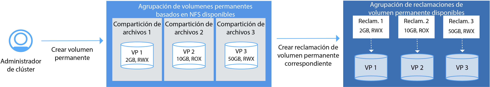

---

copyright:
  years: 2014, 2017
lastupdated: "2017-08-21"

---

{:new_window: target="_blank"}
{:shortdesc: .shortdesc}
{:screen: .screen}
{:pre: .pre}
{:codeblock: .codeblock}
{:table: .aria-labeledby="caption"}
{:codeblock: .codeblock}
{:tip: .tip} 
{:download: .download}


# Configuración de clústeres
{: #cs_cluster}

Diseñe la configuración de su clúster para maximizar su disponibilidad y capacidad.
{:shortdesc}

Antes de empezar, revise las opciones para [configuraciones de clústeres de alta disponibilidad](cs_planning.html#cs_planning_cluster_config).

](https://console.bluemix.net/docs/api/content/containers/images/cs_cluster_ha_roadmap.png)

## Creación de clústeres con la GUI
{: #cs_cluster_ui}

Un clúster de Kubernetes es un conjunto de nodos trabajadores organizados en una red. La finalidad del clúster es definir un conjunto de recursos, nodos, redes y dispositivos de almacenamiento que mantengan la alta disponibilidad de las aplicaciones. Para poder desplegar una app, debe crear un clúster y establecer las definiciones de los nodos trabajadores en dicho clúster.{:shortdesc}

Para usuarios dedicados de {{site.data.keyword.Bluemix_notm}}, consulte en su lugar [Creación de clústeres de Kubernetes desde la GUI en {{site.data.keyword.Bluemix_notm}} dedicado (Beta cerrada)](#creating_cli_dedicated). 

Para crear un clúster:
1.  En el catálogo, seleccione **Contenedores** y pulse **Clúster de Kubernetes**.

2.  Para **Tipo de clúster**, seleccione **Estándar**. Con un clúster estándar, obtiene características como por ejemplo varios nodos trabajadores un entorno de alta disponibilidad.
3.  Escriba un **Nombre de clúster**.
4.  Seleccione la **Versión de Kubernetes** que va utilizar en los nodos trabajadores. 
5.  Seleccione la {{site.data.keyword.Bluemix_notm}} **Ubicación** en la que desea desplegar el clúster. Las ubicaciones disponibles dependen de la región de {{site.data.keyword.Bluemix_notm}} en la que haya iniciado la sesión.
Para obtener el mejor rendimiento, seleccione la región que esté físicamente más cercana a su ubicación. Si selecciona una ubicación que se encuentra fuera de su país, tenga en cuenta que es posible que se requiera autorización legal para poder almacenar datos físicamente en un país extranjero. La región {{site.data.keyword.Bluemix_notm}} determina el registro del contenedor que puede utilizar y el servicio {{site.data.keyword.Bluemix_notm}} que tiene disponibles.
6.  Seleccione un **Tipo de máquina**. El tipo de máquina define la cantidad de memoria y CPU virtual que se configura en cada nodo trabajador y que está disponible para todos los contenedores que despliegue en los nodos.
    -   El tipo de máquina micro indica la opción más pequeña.
    -   El tipo de máquina equilibrado tiene la misma cantidad de memoria asignada a cada CPU, lo que optimiza el rendimiento.

7.  Elija el **Número de nodos trabajadores** que necesita. Seleccione 3 para conseguir una alta disponibilidad del clúster.
8.  Seleccione una **VLAN privada** desde su cuenta de {{site.data.keyword.BluSoftlayer_full}}. Una VLAN privada sirve para la comunicación entre los nodos trabajadores. Puede utilizar la misma VLAN privada para varios clústeres.
9. Seleccione una **VLAN pública** desde su cuenta de {{site.data.keyword.BluSoftlayer_notm}}. Una VLAN pública sirve para la comunicación entre los nodos trabajadores y el nodo Kubernetes maestro gestionado por IBM. Puede utilizar la misma VLAN pública para varios clústeres. Si decide no seleccionar una VLAN pública, debe configurar una solución alternativa.
10. Para **Hardware**, seleccione **Dedicado** o **Compartido**. **Compartido** es una opción suficiente para la mayoría de las situaciones.
    -   **Dedicado**: garantiza el aislamiento completo de sus recursos físicos de los de otros clientes de IBM.
    -   **Compartido**: permite a IBM almacenar sus recursos físicos en el mismo hardware que otros clientes de IBM.
11. Pulse **Crear clúster**. Se abren los detalles del clúster, pero los nodos trabajadores del clúster tardar unos minutos en suministrarse. En el separador **Nodos trabajadores** puede ver el progreso del despliegue de los nodos trabajadores. Cuando los nodos trabajadores están listos, el estado pasa a **Ready**.

    **Nota:** A cada nodo trabajador se la asigna un ID exclusivo y un nombre de dominio que no se debe cambiar de forma manual después de haber creado el clúster.
Si se cambia el nombre de dominio o el ID se impide que el maestro de Kubernetes gestione el clúster.


**¿Qué es lo siguiente?**

Cuando el clúster esté activo y en ejecución, puede realizar las siguientes tareas:

-   [Instalar las CLI para empezar a trabajar con el clúster.](cs_cli_install.html#cs_cli_install)
-   [Desplegar una app en el clúster.](cs_apps.html#cs_apps_cli)
-   [Configure su propio registro privado en {{site.data.keyword.Bluemix_notm}}
para almacenar y compartir imágenes de Docker con otros usuarios. ](/docs/services/Registry/index.html)

### Creación de clústeres desde la GUI en {{site.data.keyword.Bluemix_notm}} dedicado (Beta cerrada)
{: #creating_ui_dedicated}

1.  Inicie una sesión en la consola de {{site.data.keyword.Bluemix_notm}} público ([https://console.bluemix.net ](https://console.bluemix.net)) con su ID de IBM.

2.  Desde el menú de la cuenta, seleccione su cuenta de {{site.data.keyword.Bluemix_notm}} dedicado. La consola se actualiza con los servicios y la información de su instancia de {{site.data.keyword.Bluemix_notm}} dedicado.
3.  En el catálogo, seleccione **Contenedores** y pulse **Clúster de Kubernetes**.
4.  Escriba un **Nombre de clúster**.
5.  Seleccione la **Versión de Kubernetes** que va utilizar en los nodos trabajadores. 
6.  Seleccione un **Tipo de máquina**. El tipo de máquina define la cantidad de memoria y CPU virtual que se configura en cada nodo trabajador y que está disponible para todos los contenedores que despliegue en los nodos.
    -   El tipo de máquina micro indica la opción más pequeña.
    -   El tipo de máquina equilibrado tiene la misma cantidad de memoria asignada a cada CPU, lo que optimiza el rendimiento.
7.  Elija el **Número de nodos trabajadores** que necesita. Seleccione 3 para garantizar una alta disponibilidad del clúster.
8.  Pulse **Crear clúster**. Se abren los detalles del clúster, pero los nodos trabajadores del clúster tardar unos minutos en suministrarse. En el separador **Nodos trabajadores** puede ver el progreso del despliegue de los nodos trabajadores. Cuando los nodos trabajadores están listos, el estado pasa a **Ready**.

**¿Qué es lo siguiente?**

Cuando el clúster esté activo y en ejecución, puede realizar las siguientes tareas:

-   [Instalar las CLI para empezar a trabajar con el clúster.](cs_cli_install.html#cs_cli_install)
-   [Desplegar una app en el clúster.](cs_apps.html#cs_apps_cli)
-   [Configure su propio registro privado en {{site.data.keyword.Bluemix_notm}}
para almacenar y compartir imágenes de Docker con otros usuarios. ](/docs/services/Registry/index.html)

## Creación de clústeres con la CLI
{: #cs_cluster_cli}

Un clúster es un conjunto de nodos trabajadores organizados en una red. La finalidad del clúster es definir un conjunto de recursos, nodos, redes y dispositivos de almacenamiento que mantengan la alta disponibilidad de las aplicaciones. Para poder desplegar una app, debe crear un clúster y establecer las definiciones de los nodos trabajadores en dicho clúster.{:shortdesc}

Para usuarios dedicados de {{site.data.keyword.Bluemix_notm}}, consulte en su lugar [Creación de clústeres de Kubernetes desde la CLI en {{site.data.keyword.Bluemix_notm}} dedicado (Beta cerrada)](#creating_cli_dedicated). 

Para crear un clúster:
1.  Instale la CLI de {{site.data.keyword.Bluemix_notm}} y el plug-in de [{{site.data.keyword.containershort_notm}}](cs_cli_install.html#cs_cli_install).
2.  Inicie la sesión en la CLI de {{site.data.keyword.Bluemix_notm}}. Escriba
sus credenciales de {{site.data.keyword.Bluemix_notm}} cuando se le solicite.

    ```
    bx login
    ```
    {: pre}

      Para especificar una región de {{site.data.keyword.Bluemix_notm}} concreta, incluya el punto final de la API. Si tiene imágenes de Docker privadas almacenadas en el registro de contenedor de una región {{site.data.keyword.Bluemix_notm}} concreta o instancias de servicio {{site.data.keyword.Bluemix_notm}} que ya ha creado, inicie la sesión en esta región para acceder a las imágenes y servicios de {{site.data.keyword.Bluemix_notm}}.

      La región de {{site.data.keyword.Bluemix_notm}} en la que inicie la sesión también determina la región donde puede crear los clústeres de Kubernetes, incluidos los centros de datos disponibles. Si no especifica ninguna región, la sesión se iniciará automáticamente en la región más cercana. 

       -  EE.UU. Sur

           ```
           bx login -a api.ng.bluemix.net
           ```
           {: pre}
     
       -  Sídney

           ```
           bx login -a api.au-syd.bluemix.net
           ```
           {: pre}

       -  Alemania

           ```
           bx login -a api.eu-de.bluemix.net
           ```
           {: pre}

       -  Reino Unido

           ```
           bx login -a api.eu-gb.bluemix.net
           ```
           {: pre}

      **Nota:** Si tiene un ID federado, utilice `bx login --sso` para iniciar
la sesión en la CLI de {{site.data.keyword.Bluemix_notm}}. Especifique su nombre de usuario y utilice el URL proporcionado en la salida de la CLI para recuperar el código de acceso de un solo uso. Sabe tiene un ID federado cuando el inicio de sesión falla sin el `--sso` y se lleva a cabo correctamente con la opción `--sso`.

3.  Si tiene asignados varias cuentas, organizaciones y espacios de {{site.data.keyword.Bluemix_notm}}, seleccione la
cuenta donde desea crear el clúster de Kubernetes. Los clústeres son específicos de una cuenta y
organización, pero son independientes de un espacio de {{site.data.keyword.Bluemix_notm}}. Por lo tanto, si tiene acceso a varios
espacios de su organización, puede seleccionar cualquiera de ellos de la lista.
4.  Opcional: Si desea crear o acceder a clústeres de Kubernetes en una región distinta de la región de {{site.data.keyword.Bluemix_notm}} seleccionada anteriormente, especifique esta región. Por ejemplo, supongamos que desea iniciar una sesión en otra región de {{site.data.keyword.containershort_notm}} por las siguientes razones:

    -   Ha creado servicios de {{site.data.keyword.Bluemix_notm}} o imágenes de Docker privadas en una región y desea utilizarlos con {{site.data.keyword.containershort_notm}} en otra región.
    -   Desea acceder a un clúster de una región distinta de la región de {{site.data.keyword.Bluemix_notm}} predeterminada en la que ha iniciado la sesión. 
    
    Elija entre los siguientes puntos finales de API:

    -   EE.UU. Sur:

        ```
        bx cs init --host https://us-south.containers.bluemix.net
        ```
        {: pre}

    -   UK-Sur: 

        ```
        bx cs init --host https://uk-south.containers.bluemix.net
        ```
        {: pre}

    -   UE-Central:

        ```
        bx cs init --host https://eu-central.containers.bluemix.net
        ```
        {: pre}

    -   AP Sur:

        ```
        bx cs init --host https://ap-south.containers.bluemix.net
        ```
        {: pre}
    
6.  Cree un clúster.
    1.  Revise las ubicaciones que están disponibles. Las ubicaciones que se muestran dependen de la región de {{site.data.keyword.containershort_notm}} en la que ha iniciado la sesión.


        ```
        bx cs locations
        ```
        {: pre}

        La salida de la CLI se parecerá a la siguiente:

        -   EE.UU. Sur:

            ```
            dal10
            dal12
            ```
            {: screen}

        -   UK-Sur: 

            ```
            lon02
            lon04
            ```
            {: screen}

        -   UE-Central:

            ```
            ams03
            fra02
            ```
            {: screen}

        -   AP Sur

            ```
            syd01
            syd02
            ```
            {: screen}

    2.  Elija una ubicación y revise los tipos de máquinas disponibles en dicha ubicación. El tipo de máquina especifica los recursos de cálculo virtuales que están disponibles para cada nodo trabajador.

        ```
        bx cs machine-types <location>
        ```
        {: pre}

        ```
        Getting machine types list...
        OK
        Machine Types
        Name         Cores   Memory   Network Speed   OS             Storage   Server Type
        u1c.2x4      2       4GB      1000Mbps        UBUNTU_16_64   100GB     virtual
        b1c.4x16     4       16GB     1000Mbps        UBUNTU_16_64   100GB     virtual
        b1c.16x64    16      64GB     1000Mbps        UBUNTU_16_64   100GB     virtual
        b1c.32x128   32      128GB    1000Mbps        UBUNTU_16_64   100GB     virtual
        b1c.56x242   56      242GB    1000Mbps        UBUNTU_16_64   100GB     virtual
        ```
        {: screen}

    3.  Compruebe si ya existe una VLAN pública y privada en {{site.data.keyword.BluSoftlayer_notm}} para esta cuenta.

        ```
        bx cs vlans <location>
        ```
        {: pre}

        ```
        ID        Name                Number   Type      Router
        1519999   vlan   1355     private   bcr02a.dal10
        1519898   vlan   1357     private   bcr02a.dal10
        1518787   vlan   1252     public   fcr02a.dal10
        1518888   vlan   1254     public    fcr02a.dal10
        ```
        {: screen}

        Si ya existe una VLAN pública y privada, anote los direccionadores correspondientes. Los direccionadores VLAN privados siempre
empiezan por `bcr` (back-end router, direccionador de fondo) y los direccionadores VLAN públicos siempre
empiezan por `fcr` (direccionador frontal). La combinación de números y letras que hay tras estos prefijos debe coincidir para poder utilizar dichas VLAN al crear un clúster. En la salida de ejemplo, se puede utilizar cualquier VLAN privada
con cualquier VLAN pública porque todos los direccionadores incluyen `02a.dal10`.

    4.  Ejecute el mandato `cluster-create`. Puede elegir entre un clúster lite, que incluye un nodo trabajador configurado con 2 vCPU y 4 GB
de memoria, o un clúster estándar, que puede incluir tantos nodos trabajadores como desee en la cuenta de {{site.data.keyword.BluSoftlayer_notm}}. Cuando se crea un clúster estándar, de forma predeterminada, el hardware del nodo trabajador se comparte entre varios clientes de IBM y se factura por horas de uso. </b>Ejemplo para un clúster estándar: 

        ```
        bx cs cluster-create --location dal10; --public-vlan <public_vlan_id> --private-vlan <private_vlan_id> --machine-type u1c.2x4 --workers 3 --name <cluster_name>
        ```
        {: pre}

        Ejemplo para un clúster lite: 

        ```
        bx cs cluster-create --name my_cluster
        ```
        {: pre}

        <table>
        <caption>Tabla 1. Visión general de los componentes de este mandato</caption>
        <thead>
        <th colspan=2> Componentes de este mandato</th>
        </thead>
        <tbody>
        <tr>
        <td><code>cluster-create</code></td>
        <td>El mandato para crear un clúster en la organización de {{site.data.keyword.Bluemix_notm}}.</td> 
        </tr>
        <tr>
        <td><code>--location <em>&lt;location&gt;</em></code></td>
        <td>Sustituya <em>&lt;location&gt;</em> por el ID de ubicación de {{site.data.keyword.Bluemix_notm}} donde desea crear el clúster. Las ubicaciones disponibles dependen de la región de {{site.data.keyword.containershort_notm}} en la que haya iniciado la sesión. Las ubicaciones disponibles son las siguientes:<ul><li>EE.UU. Sur<ul><li>dal10 [Dallas]</li><li>dal12 [Dallas]</li></ul></li><li>UK-Sur<ul><li>lon02 [Londres]</li><li>lon04 [Londres]</li></ul></li><li>UE-Central<ul><li>ams03 [Amsterdam]</li><li>ra02 [Frankfurt]</li></ul></li><li>AP Sur<ul><li>syd01 [Sidney]</li><li>syd04 [Sidney]</li></ul></li></ul></td> 
        </tr>
        <tr>
        <td><code>--machine-type <em>&lt;machine_type&gt;</em></code></td>
        <td>Si está creando un clúster estándar, elija un tipo de máquina. El tipo de máquina especifica los recursos de cálculo virtuales que están disponibles para cada nodo trabajador. Consulte el apartado sobre [Comparación entre los clústeres lite y estándar para {{site.data.keyword.containershort_notm}}](cs_planning.html#cs_planning_cluster_type) para obtener más información. Para los clústeres de tipo lite, no tiene que definir el tipo de máquina.</td> 
        </tr>
        <tr>
        <td><code>--public-vlan <em>&lt;public_vlan_id&gt;</em></code></td>
        <td><ul><li>Para los clústeres de tipo lite, no tiene que definir una VLAN pública. El clúster lite se conecta automáticamente a una VLAN pública propiedad de IBM. </li><li>Para un clúster estándar, si ya tiene una VLAN pública configurada en su cuenta de {{site.data.keyword.BluSoftlayer_notm}} para esta ubicación, escriba el ID de la VLAN pública. De lo contrario, no tiene que especificar esta opción porque {{site.data.keyword.containershort_notm}} crea automáticamente una VLAN pública. <br/><br/><strong>Nota</strong>: Las VLAN pública y privada que especifique con el mandato create deben coincidir. Los direccionadores VLAN privados siempre
empiezan por <code>bcr</code> (back-end router, direccionador de fondo) y los direccionadores VLAN públicos siempre
empiezan por <code>fcr</code> (direccionador frontal). La combinación de números y letras que hay tras estos prefijos debe coincidir para poder utilizar dichas VLAN al crear un clúster. No utilice VLAN públicas y privadas que no coincidan para crear un clúster.</li></ul></td> 
        </tr>
        <tr>
        <td><code>--private-vlan <em>&lt;private_vlan_id&gt;</em></code></td>
        <td><ul><li>Para los clústeres de tipo lite, no tiene que definir una VLAN privada. El clúster lite se conecta automáticamente a una VLAN privada propiedad de IBM. </li><li>Para un clúster estándar, si ya tiene una VLAN privada configurada en su cuenta de {{site.data.keyword.BluSoftlayer_notm}} para esta ubicación, escriba el ID de la VLAN privada. De lo contrario, no tiene que especificar esta opción porque {{site.data.keyword.containershort_notm}} crea automáticamente una VLAN privada. <br/><br/><strong>Nota</strong>: Las VLAN pública y privada que especifique con el mandato create deben coincidir. Los direccionadores VLAN privados siempre
empiezan por <code>bcr</code> (back-end router, direccionador de fondo) y los direccionadores VLAN públicos siempre
empiezan por <code>fcr</code> (direccionador frontal). La combinación de números y letras que hay tras estos prefijos debe coincidir para poder utilizar dichas VLAN al crear un clúster. No utilice VLAN públicas y privadas que no coincidan para crear un clúster.</li></ul></td> 
        </tr>
        <tr>
        <td><code>--name <em>&lt;name&gt;</em></code></td>
        <td>Sustituya <em>&lt;name&gt;</em> por el nombre del clúster.</td> 
        </tr>
        <tr>
        <td><code>--workers <em>&lt;number&gt;</em></code></td>
        <td>El número de nodos trabajadores que desea incluir en el clúster. Si no se especifica la opción <code>--workers</code>, se crea 1 nodo trabajador.</td> 
        </tr>
        </tbody></table>

7.  Verifique que ha solicitado la creación del clúster.

    ```
    bx cs clusters
    ```
    {: pre}

    **Nota:** Puede llevar hasta 15 minutos la ordenación de las máquinas del nodo trabajador y la configuración y suministro del clúster
en su cuenta. 

    Una vez completado el suministro del clúster, el estado del clúster pasa a ser **deployed**.

    ```
    Name         ID                                   State      Created          Workers
    my_cluster   paf97e8843e29941b49c598f516de72101   deployed   20170201162433   1
    ```
    {: screen}

8.  Compruebe el estado de los nodos trabajadores.

    ```
    bx cs workers <cluster>
    ```
    {: pre}

    Cuando los nodos trabajadores están listos, el estado pasa a **normal** y el estado es **Ready**. Cuando el estado del nodo sea **Preparado**, podrá acceder al clúster.

    **Nota:** A cada nodo trabajador se la asigna un ID exclusivo y un nombre de dominio que no se debe cambiar de forma manual después de haber creado el clúster.
Si se cambia el nombre de dominio o el ID se impide que el maestro de Kubernetes gestione el clúster.

    ```
    ID                                                  Public IP        Private IP     Machine Type   State      Status
    prod-dal10-pa8dfcc5223804439c87489886dbbc9c07-w1   169.47.223.113   10.171.42.93   free           normal    Ready
    ```
    {: screen}

9. Defina el clúster que ha creado como contexto para esta sesión. Siga estos pasos de configuración cada vez que de trabaje con el clúster.
    1.  Obtenga el mandato para establecer la variable de entorno y descargar los archivos de configuración de Kubernetes.

        ```
        bx cs cluster-config <cluster_name_or_id>
        ```
        {: pre}

        Cuando termine la descarga de los archivos de configuración, se muestra un mandato que puede utilizar para establecer la vía de acceso al archivo de configuración de
Kubernetes como variable de entorno.

        Ejemplo para OS X:

        ```
        export KUBECONFIG=/Users/<user_name>/.bluemix/plugins/container-service/clusters/<cluster_name>/kube-config-prod-dal10-<cluster_name>.yml
        ```
        {: screen}

    2.  Copie y pegue el mandato que se muestra en el terminal para definir la variable de entorno `KUBECONFIG`.
    3.  Compruebe que la variable de entorno `KUBECONFIG` se haya establecido correctamente.

        Ejemplo para OS X:

        ```
        echo $KUBECONFIG
        ```
        {: pre}

        Salida:

        ```
        /Users/<user_name>/.bluemix/plugins/container-service/clusters/<cluster_name>/kube-config-prod-dal10-<cluster_name>.yml
        
        ```
        {: screen}

10. Inicie el panel de control de Kubernetes con el puerto predeterminado 8001.
    1.  Establezca el proxy con el número de puerto predeterminado.

        ```
        kubectl proxy
        ```
        {: pre}

        ```
        Starting to serve on 127.0.0.1:8001
        ```
        {: screen}

    2.  Abra el siguiente URL en un navegador web para ver el panel de control de Kubernetes.

        ```
        http://localhost:8001/ui
        ```
        {: codeblock}


**¿Qué es lo siguiente?**

-   [Desplegar una app en el clúster.](cs_apps.html#cs_apps_cli)
-   [Gestionar el clúster con la línea de mandatos de `kubectl`. ](https://kubernetes.io/docs/user-guide/kubectl/)
-   [Configure su propio registro privado en {{site.data.keyword.Bluemix_notm}}
para almacenar y compartir imágenes de Docker con otros usuarios. ](/docs/services/Registry/index.html)

### Creación de clústeres desde la CLI en {{site.data.keyword.Bluemix_notm}} dedicado (Beta cerrada)
{: #creating_cli_dedicated}

1.  Instale la CLI de {{site.data.keyword.Bluemix_notm}} y el plug-in de [{{site.data.keyword.containershort_notm}}](cs_cli_install.html#cs_cli_install).
2.  Inicie una sesión en el punto final público para {{site.data.keyword.containershort_notm}}. Especifique sus credenciales de {{site.data.keyword.Bluemix_notm}} y seleccione la cuenta de {{site.data.keyword.Bluemix_notm}} dedicado cuando se le solicite.

    ```
    bx login -a api.<region>.bluemix.net
    ```
    {: pre}

    **Nota:** Si tiene un ID federado, utilice `bx login --sso` para iniciar
la sesión en la CLI de {{site.data.keyword.Bluemix_notm}}. Especifique su nombre de usuario y utilice el URL proporcionado en la salida de la CLI para recuperar el código de acceso de un solo uso. Sabe tiene un ID federado cuando el inicio de sesión falla sin el `--sso` y se lleva a cabo correctamente con la opción `--sso`.

3.  Cree un clúster con el mandato `cluster-create`. Cuando se crea un clúster estándar, el hardware del nodo trabajador se factura por horas de uso.

    Ejemplo

    ```
    bx cs cluster-create --machine-type <machine-type> --workers <number> --name <cluster_name>
    ```
    {: pre}
    
    <table>
    <caption>Tabla 2. Visión general de los componentes de este mandato</caption>
    <thead>
    <th colspan=2> Componentes de este mandato</th>
    </thead>
    <tbody>
    <tr>
    <td><code>cluster-create</code></td>
    <td>El mandato para crear un clúster en la organización de {{site.data.keyword.Bluemix_notm}}.</td> 
    </tr>
    <tr>
    <td><code>--location <em>&lt;location&gt;</em></code></td>
    <td>Sustituya &lt;location&gt; por el ID de ubicación de {{site.data.keyword.Bluemix_notm}} donde desea crear el clúster. Las ubicaciones disponibles dependen de la región de {{site.data.keyword.containershort_notm}} en la que haya iniciado la sesión. Las ubicaciones disponibles son las siguientes:<ul><li>EE.UU. Sur<ul><li>dal10 [Dallas]</li><li>dal12 [Dallas]</li></ul></li><li>UK-Sur<ul><li>lon02 [Londres]</li><li>lon04 [Londres]</li></ul></li><li>UE-Central<ul><li>ams03 [Amsterdam]</li><li>ra02 [Frankfurt]</li></ul></li><li>AP Sur<ul><li>syd01 [Sidney]</li><li>syd04 [Sidney]</li></ul></li></ul></td> 
    </tr>
    <tr>
    <td><code>--machine-type <em>&lt;machine_type&gt;</em></code></td>
    <td>Si está creando un clúster estándar, elija un tipo de máquina. El tipo de máquina especifica los recursos de cálculo virtuales que están disponibles para cada nodo trabajador. Consulte el apartado sobre [Comparación entre los clústeres lite y estándar para {{site.data.keyword.containershort_notm}}](cs_planning.html#cs_planning_cluster_type) para obtener más información. Para los clústeres de tipo lite, no tiene que definir el tipo de máquina.</td> 
    </tr>
    <tr>
    <td><code>--name <em>&lt;name&gt;</em></code></td>
    <td>Sustituya <em>&lt;name&gt;</em> por el nombre del clúster.</td> 
    </tr>
    <tr>
    <td><code>--workers <em>&lt;number&gt;</em></code></td>
    <td>El número de nodos trabajadores que desea incluir en el clúster. Si no se especifica la opción <code>--workers</code>, se crea 1 nodo trabajador.</td> 
    </tr>
    </tbody></table>

4.  Verifique que ha solicitado la creación del clúster.

    ```
    bx cs clusters
    ```
    {: pre}

    **Nota:** Puede llevar hasta 15 minutos la ordenación de las máquinas del nodo trabajador y la configuración y suministro del clúster
en su cuenta. 

    Una vez completado el suministro del clúster, el estado del clúster pasa a ser **deployed**.

    ```
    Name         ID                                   State      Created          Workers
    my_cluster   paf97e8843e29941b49c598f516de72101   deployed   20170201162433   1
    ```
    {: screen}

5.  Compruebe el estado de los nodos trabajadores.

    ```
    bx cs workers <cluster>
    ```
    {: pre}

    Cuando los nodos trabajadores están listos, el estado pasa a **normal** y el estado es **Ready**. Cuando el estado del nodo sea **Preparado**, podrá acceder al clúster.

    ```
    ID                                                  Public IP        Private IP     Machine Type   State      Status
    prod-dal10-pa8dfcc5223804439c87489886dbbc9c07-w1   169.47.223.113   10.171.42.93   free           normal    Ready
    ```
    {: screen}

6.  Defina el clúster que ha creado como contexto para esta sesión. Siga estos pasos de configuración cada vez que de trabaje con el clúster.

    1.  Obtenga el mandato para establecer la variable de entorno y descargar los archivos de configuración de Kubernetes.

        ```
        bx cs cluster-config <cluster_name_or_id>
        ```
        {: pre}

        Cuando termine la descarga de los archivos de configuración, se muestra un mandato que puede utilizar para establecer la vía de acceso al archivo de configuración de
Kubernetes como variable de entorno.

        Ejemplo para OS X:

        ```
        export KUBECONFIG=/Users/<user_name>/.bluemix/plugins/container-service/clusters/<cluster_name>/kube-config-prod-dal10-<cluster_name>.yml
        ```
        {: screen}

    2.  Copie y pegue el mandato que se muestra en el terminal para definir la variable de entorno `KUBECONFIG`.
    3.  Compruebe que la variable de entorno `KUBECONFIG` se haya establecido correctamente.

        Ejemplo para OS X:

        ```
        echo $KUBECONFIG
        ```
        {: pre}

        Salida:

        ```
        /Users/<user_name>/.bluemix/plugins/container-service/clusters/<cluster_name>/kube-config-prod-dal10-<cluster_name>.yml
        
        ```
        {: screen}

7.  Acceda al panel de control de Kubernetes con el puerto predeterminado 8001.
    1.  Establezca el proxy con el número de puerto predeterminado.

        ```
        kubectl proxy
        ```
        {: pre}

        ```
        Starting to serve on 127.0.0.1:8001
        ```
        {: screen}

    2.  Abra el siguiente URL en un navegador web para ver el panel de control de Kubernetes.

        ```
        http://localhost:8001/ui
        ```
        {: codeblock}


**¿Qué es lo siguiente?**

-   [Desplegar una app en el clúster.](cs_apps.html#cs_apps_cli)
-   [Gestionar el clúster con la línea de mandatos de `kubectl`. ](https://kubernetes.io/docs/user-guide/kubectl/)
-   [Configure su propio registro privado en {{site.data.keyword.Bluemix_notm}}
para almacenar y compartir imágenes de Docker con otros usuarios. ](/docs/services/Registry/index.html)

## Utilización de registros de imagen privada y pública
{: #cs_apps_images}

Una imagen de Docker es la base para cada contenedor que pueda crear. Se crea una imagen a partir de Dockerfile, que es un archivo que contiene instrucciones para crear la imagen. Un Dockerfile puede hacer referencia a artefactos de compilación en sus instrucciones que se almacenan por separado, como por ejemplo una app, la configuración de la app y sus dependencias. Las imágenes normalmente se almacenan en un registro que puede ser tanto de acceso público (registro público) como estar configurado con acceso limitado para un pequeño grupo de usuarios (registro privado).
{:shortdesc}

Revise las opciones siguientes para encontrar información sobre cómo configurar un registro de imágenes y cómo utilizar una imagen del registro.

-   [Acceso a un espacio de nombres de {{site.data.keyword.registryshort_notm}} para trabajar con imágenes proporcionadas con IBM y con sus propias imágenes privadas de Docker](#bx_registry_default). 
-   [Acceso a imágenes públicas desde Docker Hub](#dockerhub).
-   [Acceso a imágenes privadas almacenadas en otros registros privados](#private_registry).

### Acceso a un espacio de nombres de {{site.data.keyword.registryshort_notm}} para trabajar con imágenes proporcionadas con IBM y con sus propias imágenes privadas de Docker
{: #bx_registry_default}

Puede desplegar contenedores en su clúster desde una imagen pública proporcionada por IBM o desde una imagen privada almacenada en el espacio de nombres de {{site.data.keyword.registryshort_notm}}.

Antes de empezar:

-   [Configure un espacio de nombres en {{site.data.keyword.registryshort_notm}} en {{site.data.keyword.Bluemix_notm}} público o {{site.data.keyword.Bluemix_notm}} dedicado y envíe por push imágenes a este espacio de nombres](/docs/services/Registry/registry_setup_cli_namespace.html#registry_namespace_add).
-   [Cree un clúster](#cs_cluster_cli).
-   [Defina su clúster como destino de la CLI](cs_cli_install.html#cs_cli_configure).

Cuando crea una agrupación, se crea automáticamente una señal de registro sin caducidad para el clúster. Esta señal se utiliza para autorizar el acceso de solo lectura a cualquier espacio de nombres que configure en {{site.data.keyword.registryshort_notm}}, de modo que pueda trabajar con imágenes públicas proporcionadas por IBM y con sus propias imágenes privadas de Docker. Las señales se deben guardar en `imagePullSecret` de Kubernetes para que resulten accesibles para un clúster de Kubernetes cuando se despliega una app contenerizada. Cuando se crea el clúster, {{site.data.keyword.containershort_notm}} almacena automáticamente esta señal en un `imagePullSecret` de Kubernetes. Este `imagePullSecret` se añade al espacio de nombres predeterminado de Kubernetes, a la lista predeterminada de secretos
de ServiceAccount correspondiente a dicho espacio de nombres y al espacio de nombres kube-system.

**Nota:** Con esta configuración inicial, puede desplegar contenedores desde cualquier imagen disponible en un espacio de nombres de la cuenta de {{site.data.keyword.Bluemix_notm}} en el espacio de nombres **default** del clúster. Si desea desplegar un contenedor en otros espacios de nombres del clúster, o si desea utilizar una imagen almacenada en otra región de {{site.data.keyword.Bluemix_notm}} o en otra cuenta de {{site.data.keyword.Bluemix_notm}}, debe [crear su propio imagePullSecret para el clúster](#bx_registry_other).

Para desplegar un contenedor en el espacio de nombres **default** del clúster, cree un script de configuración de despliegue. 

1.  Abra el editor que prefiera y cree un script de configuración de despliegue llamado <em>mydeployment.yaml</em>.
2.  Defina el despliegue y la imagen que desee utilizar del espacio de nombres de {{site.data.keyword.registryshort_notm}}.

    Para utilizar una imagen privada de un espacio de nombres de {{site.data.keyword.registryshort_notm}}:

    ```
    apiVersion: extensions/v1beta1
    kind: Deployment
    metadata:
      name: ibmliberty-deployment
    spec:
      replicas: 3
      template:
        metadata:
          labels:
            app: ibmliberty
        spec:
          containers:
          - name: ibmliberty
            image: registry.<region>.bluemix.net/<namespace>/<my_image>:<tag>
    ```
    {: codeblock}

    **Sugerencia:** Para recuperar la información del espacio de nombres, ejecute `bx cr namespace-list`.

3.  Cree el despliegue en el clúster.

    ```
    kubectl apply -f mydeployment.yaml
    ```
    {: pre}

    **Sugerencia:** También puede desplegar un script de configuración existente, como por ejemplo una de las imágenes públicas proporcionadas por IBM. En este ejemplo se utiliza la imagen **ibmliberty** de la región EE.UU.-Sur.

    ```
    kubectl apply -f https://raw.githubusercontent.com/IBM-{{site.data.keyword.Bluemix_notm}}/kube-samples/master/deploy-apps-clusters/deploy-ibmliberty.yaml
    ```
    {: pre}

### Despliegue de imágenes en otros espacios de nombres de Kubernetes o acceso a imágenes de otras regiones y cuentas de {{site.data.keyword.Bluemix_notm}}
{: #bx_registry_other}

Puede desplegar contenedores en otros espacios de nombres de Kubernetes, utilizar imágenes almacenadas en otras regiones o cuentas de {{site.data.keyword.Bluemix_notm}} o utilizar imágenes almacenadas en {{site.data.keyword.Bluemix_notm}} dedicado creando su propio imagePullSecret.


Antes de empezar:

1.  [Configure un espacio de nombres en {{site.data.keyword.registryshort_notm}} en {{site.data.keyword.Bluemix_notm}} público o {{site.data.keyword.Bluemix_notm}} dedicado y envíe por push imágenes a este espacio de nombres.](/docs/services/Registry/registry_setup_cli_namespace.html#registry_namespace_add).
2.  [Cree un clúster](#cs_cluster_cli).
3.  [Defina su clúster como destino de la CLI](cs_cli_install.html#cs_cli_configure).

Para crear su propio imagePullSecret:

**Nota:** Los ImagePullSecrets solo son válidos para los espacios de nombres de Kubernetes para los que se han creado. Repita estos pasos para cada espacio de nombres en el que desee desplegar contenedores de una imagen privada.

1.  Si aún no tiene una señal, [cree una señal para el registro al que desea acceder.](/docs/services/Registry/registry_tokens.html#registry_tokens_create)
2.  Obtenga una lista de las señales disponibles en la cuenta de {{site.data.keyword.Bluemix_notm}}.

    ```
    bx cr token-list
    ```
    {: pre}

3.  Anote el ID de la señal que desea utilizar. 
4.  Recupere el valor de la señal. Sustituya <token_id>
por el ID de la señal que ha recuperado en el paso anterior.

    ```
    bx cr token-get <token_id>
    ```
    {: pre}

    El valor de la señal se muestra en el campo **Token** de la salida de la CLI.

5.  Cree el secreto de Kubernetes para almacenar la información de la señal.

    ```
    kubectl --namespace <kubernetes_namespace> create secret docker-registry <secret_name>  --docker-server=<registry_url> --docker-username=token --docker-password=<token_value> --docker-email=<docker_email>
    ```
    {: pre}
    
    <table>
    <caption>Tabla 3. Visión general de los componentes de este mandato</caption>
    <thead>
    <th colspan=2> Componentes de este mandato</th>
    </thead>
    <tbody>
    <tr>
    <td><code>--namespace <em>&lt;kubernetes_namespace&gt;</em></code></td>
    <td>Obligatorio. El espacio de nombres de Kubernetes del clúster en el que desea utilizar el secreto y desplegar los contenedores. Ejecute <code>kubectl get namespaces</code> para obtener una lista de todos los espacios de nombres del clúster.</td> 
    </tr>
    <tr>
    <td><code><em>&lt;secret_name&gt;</em></code></td>
    <td>Obligatorio. El nombre que desea utilizar para su imagePullSecret.</td> 
    </tr>
    <tr>
    <td><code>--docker-server <em>&lt;registry_url&gt;</em></code></td>
    <td>Obligatorio. El URL del registro de imágenes en el que está configurado el espacio de nombres.<ul><li>Para los espacios definidos EE.UU.-Sur en registry.ng.bluemix.net  </li><li>Para los espacios definidos en UK-Sur registry.eu-gb.bluemix.net </li><li>Para los espacios de nombres definidos en UE-Central (Frankfurt) registry.eu-de.bluemix.net  </li><li>Para los espacios de nombres definidos en Australia (Sidney) registry.au-syd.bluemix.net  </li><li>Para los espacios definidos en {{site.data.keyword.Bluemix_notm}} dedicado registry.<em>&lt;dedicated_domain&gt;</em></li></ul></td> 
    </tr>
    <tr>
    <td><code>--docker-username <em>&lt;docker_username&gt;</em></code></td>
    <td>Obligatorio. El nombre de usuario para iniciar una sesión en su registro privado.</td> 
    </tr>
    <tr>
    <td><code>--docker-password <em>&lt;token_value&gt;</em></code></td>
    <td>Obligatorio. El valor de la señal de registro que ha recuperado anteriormente.</td> 
    </tr>
    <tr>
    <td><code>--docker-email <em>&lt;docker-email&gt;</em></code></td>
    <td>Obligatorio. Si tiene una, especifique la dirección de correo electrónico de Docker. Si no tiene una, especifique una dirección de correo electrónico ficticia, como por ejemplo a@b.c. Este correo electrónico es obligatorio para crear un secreto de Kubernetes, pero no se utiliza después de la creación.</td> 
    </tr>
    </tbody></table>

6.  Verifique que el secreto se haya creado correctamente. Sustituya
<em>&lt;kubernetes_namespace&gt;</em> por el nombre del espacio de nombres en el que
ha creado imagePullSecret.

    ```
    kubectl get secrets --namespace <kubernetes_namespace>
    ```
    {: pre}

7.  Cree un pod que haga referencia a imagePullSecret.
    1.  Abra el editor que prefiera y cree un script de configuración de pod llamado mypod.yaml. 
    2.  Defina el pod y el imagePullSecret que desea utilizar para acceder al registro privado de {{site.data.keyword.Bluemix_notm}}. Para utilizar una imagen privada de un espacio de nombres:

        ```
        apiVersion: v1
        kind: Pod
        metadata:
          name: <pod_name>
        spec:
          containers:
            - name: <container_name>
              image: registry.<region>.bluemix.net/<my_namespace>/<my_image>:<tag>
          imagePullSecrets:
            - name: <secret_name>
        ```
        {: codeblock}

        <table>
        <caption>Tabla 4. Visión general de los componentes del archivo YAML</caption>
        <thead>
        <th colspan=2>Visión general de los componentes del archivo YAML</th>
        </thead>
        <tbody>
        <tr>
        <td><code><em>&lt;container_name&gt;</em></code></td>
        <td>El nombre del contenedor que desea desplegar en el clúster.</td> 
        </tr>
        <tr>
        <td><code><em>&lt;secret_name&gt;</em></code></td>
        <td>El espacio de nombres donde se almacena la imagen. Para obtener una lista de los espacios de nombres disponibles, ejecute `bx cr namespace-list`.</td> 
        </tr>
        <tr>
        <td><code><em>&lt;my_namespace&gt;</em></code></td>
        <td>El espacio de nombres donde se almacena la imagen. Para obtener una lista de los espacios de nombres disponibles, ejecute `bx cr namespace-list`.</td> 
        </tr>
        <tr>
        <td><code><em>&lt;my_image&gt;</em></code></td>
        <td>El nombre del imagen que desea utilizar. Para ver una lista de las imágenes disponibles en una cuenta de {{site.data.keyword.Bluemix_notm}}, ejecute `bx cr image-list`.</td> 
        </tr>
        <tr>
        <td><code><em>&lt;tag&gt;</em></code></td>
        <td>La versión de la imagen que desea utilizar. Si no se especifica ninguna etiqueta, se utiliza la imagen etiquetada como <strong>la más reciente (latest)</strong>.</td> 
        </tr>
        <tr>
        <td><code><em>&lt;secret_name&gt;</em></code></td>
        <td>El nombre del imagePullSecret que ha creado anteriormente.</td> 
        </tr>
        </tbody></table>

   3.  Guarde los cambios.
   4.  Cree el despliegue en el clúster.

        ```
        kubectl apply -f mypod.yaml
        ```
        {: pre}


### Acceso a imágenes públicas desde Docker Hub
{: #dockerhub}

Puede utilizar cualquier imagen pública almacenada en Docker Hub para desplegar un contenedor en el clúster sin configuración adicional. Cree un script de configuración de despliegue o despliegue uno existente. 

Antes de empezar:

1.  [Cree un clúster](#cs_cluster_cli).
2.  [Defina su clúster como destino de la CLI](cs_cli_install.html#cs_cli_configure).

Cree un script de configuración de despliegue.

1.  Abra el editor que prefiera y cree un script de configuración de despliegue llamado mydeployment.yaml. 
2.  Defina el despliegue y la imagen pública de Docker Hub que desea utilizar. En el siguiente script de configuración se utiliza la imagen pública NGINX que está disponible en Docker Hub.


    ```
    apiVersion: extensions/v1beta1
    kind: Deployment
    metadata:
      name: nginx-deployment
    spec:
      replicas: 3
      template:
        metadata:
          labels:
            app: nginx
        spec:
          containers:
          - name: nginx
            image: nginx
    ```
    {: codeblock}

3.  Cree el despliegue en el clúster.

    ```
    kubectl apply -f mydeployment.yaml
    ```
    {: pre}

    **Sugerencia:** Como alternativa, puede desplegar un script de configuración existente. En el ejemplo siguiente se utiliza la misa imagen NGINX pública, pero no se aplica directamente al clúster.

    ```
    kubectl apply -f https://raw.githubusercontent.com/IBM-{{site.data.keyword.Bluemix_notm}}/kube-samples/master/deploy-apps-clusters/deploy-nginx.yaml
    ```
    {: pre}


### Acceso a imágenes privadas almacenadas en otros registros privados
{: #private_registry}

Si ya tiene un registro privado que desea utilizar, debe almacenar las credenciales del registro en un imagePullSecret de Kubernetes y hacer referencia a dicho secreto en el script de configuración.

Antes de empezar:

1.  [Cree un clúster](#cs_cluster_cli).
2.  [Defina su clúster como destino de la CLI](cs_cli_install.html#cs_cli_configure).

Para crear un imagePullSecret, siga estos pasos.

**Nota:** Los ImagePullSecrets son válidos para los espacios de nombres de Kubernetes para los que se han creado. Repita estos pasos para cada espacio de nombres en el que desea desplegar contenedores desde una imagen de un registro privado de {{site.data.keyword.Bluemix_notm}}.

1.  Cree el secreto de Kubernetes para almacenar las credenciales del registro privado.

    ```
    kubectl --namespace <kubernetes_namespace> create secret docker-registry <secret_name>  --docker-server=<registry_url> --docker-username=<docker_username> --docker-password=<docker_password> --docker-email=<docker_email>
    ```
    {: pre}
    
    <table>
    <caption>Tabla 5. Visión general de los componentes de este mandato</caption>
    <thead>
    <th colspan=2> Componentes de este mandato</th>
    </thead>
    <tbody>
    <tr>
    <td><code>--namespace <em>&lt;kubernetes_namespace&gt;</em></code></td>
    <td>Obligatorio. El espacio de nombres de Kubernetes del clúster en el que desea utilizar el secreto y desplegar los contenedores. Ejecute <code>kubectl get namespaces</code> para obtener una lista de todos los espacios de nombres del clúster.</td> 
    </tr>
    <tr>
    <td><code><em>&lt;secret_name&gt;</em></code></td>
    <td>Obligatorio. El nombre que desea utilizar para su imagePullSecret.</td> 
    </tr>
    <tr>
    <td><code>--docker-server <em>&lt;registry_url&gt;</em></code></td>
    <td>Obligatorio. El URL al registro en el que se están almacenadas sus imágenes privadas.</td> 
    </tr>
    <tr>
    <td><code>--docker-username <em>&lt;docker_username&gt;</em></code></td>
    <td>Obligatorio. El nombre de usuario para iniciar una sesión en su registro privado.</td> 
    </tr>
    <tr>
    <td><code>--docker-password <em>&lt;token_value&gt;</em></code></td>
    <td>Obligatorio. El valor de la señal de registro que ha recuperado anteriormente.</td> 
    </tr>
    <tr>
    <td><code>--docker-email <em>&lt;docker-email&gt;</em></code></td>
    <td>Obligatorio. Si tiene una, especifique la dirección de correo electrónico de Docker. Si no tiene una, especifique una dirección de correo electrónico ficticia, como por ejemplo a@b.c. Este correo electrónico es obligatorio para crear un secreto de Kubernetes, pero no se utiliza después de la creación.</td> 
    </tr>
    </tbody></table>

2.  Verifique que el secreto se haya creado correctamente. Sustituya
<em>&lt;kubernetes_namespace&gt;</em> por el nombre del espacio de nombres en el que
ha creado imagePullSecret.

    ```
    kubectl get secrets --namespace <kubernetes_namespace>
    ```
    {: pre}

3.  Cree un pod que haga referencia a imagePullSecret.
    1.  Abra el editor que prefiera y cree un script de configuración de pod llamado mypod.yaml. 
    2.  Defina el pod y el imagePullSecret que desea utilizar para acceder al registro privado de {{site.data.keyword.Bluemix_notm}}. Para utilizar una imagen privada de su registro privado:

        ```
        apiVersion: v1
        kind: Pod
        metadata:
          name: <pod_name>
        spec:
          containers:
            - name: <container_name>
              image: <my_image>:<tag>
          imagePullSecrets:
            - name: <secret_name>
        ```
        {: codeblock}

        <table>
        <caption>Tabla 6. Visión general de los componentes del archivo YAML</caption>
        <thead>
        <th colspan=2>Visión general de los componentes del archivo YAML</th>
        </thead>
        <tbody>
        <tr>
        <td><code><em>&lt;pod_name&gt;</em></code></td>
        <td>El nombre del pod que desea crear.</td> 
        </tr>
        <tr>
        <td><code><em>&lt;container_name&gt;</em></code></td>
        <td>El nombre del contenedor que desea desplegar en el clúster.</td> 
        </tr>
        <tr>
        <td><code><em>&lt;my_image&gt;</em></code></td>
        <td>La vía de acceso completa a la imagen del registro privado que desea utilizar.</td> 
        </tr>
        <tr>
        <td><code><em>&lt;tag&gt;</em></code></td>
        <td>La versión de la imagen que desea utilizar. Si no se especifica ninguna etiqueta, se utiliza la imagen etiquetada como <strong>la más reciente (latest)</strong>.</td> 
        </tr>
        <tr>
        <td><code><em>&lt;secret_name&gt;</em></code></td>
        <td>El nombre del imagePullSecret que ha creado anteriormente.</td> 
        </tr>
        </tbody></table>

  3.  Guarde los cambios.
  4.  Cree el despliegue en el clúster.

        ```
        kubectl apply -f mypod.yaml
        ```
        {: pre}


## Adición de servicios de {{site.data.keyword.Bluemix_notm}} a clústeres
{: #cs_cluster_service}

Añada una instancia de servicio de {{site.data.keyword.Bluemix_notm}} existente a un clúster para permitir a los usuarios del clúster acceder y utilizar el servicio de {{site.data.keyword.Bluemix_notm}} cuando desplieguen una app en el clúster.
{:shortdesc}

Antes de empezar:

-   Defina su clúster como [destino de la CLI](cs_cli_install.html#cs_cli_configure).
-   [Solicite una instancia del servicio {{site.data.keyword.Bluemix_notm}}](/docs/services/reqnsi.html#req_instance) en el espacio para añadirlo al clúster. 
-   Para usuarios dedicados de {{site.data.keyword.Bluemix_notm}}, consulte en su lugar [Adición de servicios de {{site.data.keyword.Bluemix_notm}} a clústeres en {{site.data.keyword.Bluemix_notm}} dedicado (Beta cerrada)](#binding_dedicated). 

**Nota:** Solo puede añadir servicios de {{site.data.keyword.Bluemix_notm}} que den soporte a claves de servicio (consulte la sección [Habilitación de apps externas para que utilicen servicios de {{site.data.keyword.Bluemix_notm}}](/docs/services/reqnsi.html#req_instance)).

Para añadir un servicio:
2.  Obtenga una lista de los servicios existentes en el espacio de {{site.data.keyword.Bluemix_notm}}.

    ```
    bx service list
    ```
    {: pre}

    Ejemplo de salida de CLI:

    ```
    name                      service           plan    bound apps   last operation
    <service_instance_name>   <service_name>    spark                create succeeded
    ```
    {: screen}

3.  Anote el **nombre** de la instancia de servicio que desea añadir al clúster.
4.  Identifique el espacio de nombres del clúster que desea utilizar para añadir el servicio. Puede elegir entre las siguientes opciones.
    -   Obtenga una lista de los espacios de nombres existentes y elija el espacio de nombres que desea utilizar.

        ```
        kubectl get namespaces
        ```
        {: pre}

    -   Cree un espacio de nombres nuevo en el clúster.

        ```
        kubectl create namespace <namespace_name>
        ```
        {: pre}

5.  Añada el servicio al clúster.

    ```
    bx cs cluster-service-bind <cluster_name_or_id> <namespace> <service_instance_name>
    ```
    {: pre}

    Cuando el servicio se haya añadido correctamente al clúster, se crea un secreto de clúster que contiene las credenciales de la instancia de servicio. Ejemplo de salida de CLI:

    ```
    bx cs cluster-service-bind mycluster mynamespace cleardb
    Binding service instance to namespace...
    OK
    Namespace: mynamespace
    Secret name:     binding-<service_instance_name>
    ```
    {: screen}

6.  Verifique que el secreto se ha creado en el espacio de nombres del clúster.

    ```
    kubectl get secrets --namespace=<namespace>
    ```
    {: pre}


Para utilizar el servicio en un pod desplegado en el clúster, los usuarios del clúster pueden acceder a las credenciales de servicio del servicio de {{site.data.keyword.Bluemix_notm}} mediante el [montaje del secreto de Kubernetes como volumen secreto en un pod](cs_apps.html#cs_apps_service).

### Adición de servicios de {{site.data.keyword.Bluemix_notm}} a clústeres en {{site.data.keyword.Bluemix_notm}} dedicado (Beta cerrada)
{: #binding_dedicated}

Antes de empezar, [solicite una instancia del servicio de {{site.data.keyword.Bluemix_notm}}](/docs/services/reqnsi.html#req_instance) en el espacio para añadirla al clúster. 

1.  Inicie una sesión en el entorno de {{site.data.keyword.Bluemix_notm}} dedicado donde se creó la instancia de servicio.

    ```
    bx login -a api.<dedicated_domain>
    ```
    {: pre}

2.  Obtenga una lista de los servicios existentes en el espacio de {{site.data.keyword.Bluemix_notm}}.

    ```
    bx service list
    ```
    {: pre}

    Ejemplo de salida de CLI:

    ```
    name                      service           plan    bound apps   last operation
    <service_instance_name>   <service_name>    spark                create succeeded
    ```
    {: screen}

3.  Cree una clave de credenciales de servicio que contenga la información confidencial sobre el servicio como, por ejemplo, el nombre de usuario, la contraseña y el URL.

    ```
    bx service key-create <service_name> <service_key_name>
    ```
    {: pre}

4.  Utilice la clave de credenciales de servicio para crear el archivo JSON en su sistema para que incluya la información confidencial sobre el servicio.

    ```
    bx service key-show <service_name> <service_key_name>| sed -n '/{/,/}/'p >> /filepath/<dedicated-service-key>.json
    ```
    {: pre}

5.  Inicie una sesión en el punto final público para {{site.data.keyword.containershort_notm}} y apunte en su CLI al clúster en su entorno {{site.data.keyword.Bluemix_notm}} dedicado.
    1.  Inicie una sesión en la cuenta utilizando el punto final público para {{site.data.keyword.containershort_notm}}.
Especifique sus credenciales de {{site.data.keyword.Bluemix_notm}} y seleccione la cuenta de {{site.data.keyword.Bluemix_notm}} dedicado cuando se le solicite.

        ```
        bx login -a api.ng.bluemix.net
        ```
        {: pre}

        **Nota:** Si tiene un ID federado, utilice `bx login --sso` para iniciar
la sesión en la CLI de {{site.data.keyword.Bluemix_notm}}. Especifique su nombre de usuario y utilice el URL proporcionado en la salida de la CLI para recuperar el código de acceso de un solo uso. Sabe tiene un ID federado cuando el inicio de sesión falla sin el `--sso` y se lleva a cabo correctamente con la opción `--sso`.

    2.  Obtenga una lista de los clústeres disponibles e identifique el clúster de destino en su CLI.

        ```
        bx cs clusters
        ```
        {: pre}

    3.  Obtenga el mandato para establecer la variable de entorno y descargar los archivos de configuración de Kubernetes.

        ```
        bx cs cluster-config <cluster_name_or_id>
        ```
        {: pre}

        Cuando termine la descarga de los archivos de configuración, se muestra un mandato que puede utilizar para establecer la vía de acceso al archivo de configuración de
Kubernetes como variable de entorno.

        Ejemplo para OS X:

        ```
        export KUBECONFIG=/Users/<user_name>/.bluemix/plugins/container-service/clusters/<cluster_name>/kube-config-prod-dal10-<cluster_name>.yml
        ```
        {: screen}

    4.  Copie y pegue el mandato que se muestra en el terminal para definir la variable de entorno `KUBECONFIG`.
6.  Cree un secreto de Kubernetes desde el archivo JSON de credenciales de servicio.

    ```
    kubectl create secret generic <secret_name> --from-file=/filepath/<dedicated-service-key>.json
    ```
    {: pre}

7.  Repita estos pasos para cada servicio de {{site.data.keyword.Bluemix_notm}} que desee utilizar.

El servicio de {{site.data.keyword.Bluemix_notm}} se enlaza al clúster y se puede utilizar en cualquier pod desplegado en dicho clúster. Para utilizar un servicio en un pod, los usuarios del clúster pueden [montar el secreto de Kubernetes como un volumen secreto para el pod](cs_apps.html#cs_apps_service) para acceder a las credenciales de servicio para el servicio de {{site.data.keyword.Bluemix_notm}}.


## Gestión de acceso a clústeres
{: #cs_cluster_user}

Puede otorgar acceso a su clúster a otros usuarios, para que puedan acceder al clúster, gestionar el clúster y desplegar apps en el clúster.
{:shortdesc}

Cada usuario que trabaje con {{site.data.keyword.containershort_notm}} debe tener asignado un rol de usuario específico del servicio en Identity and Access Management que determina las acciones que dicho usuario puede realizar. Identity and Access Management diferencia entre los siguientes permisos de acceso.

-   Políticas de acceso de {{site.data.keyword.containershort_notm}}

    Las políticas de acceso determinan las acciones de gestión de clúster que puede llevar a cabo en un clúster, como por ejemplo crear o eliminar clústeres y añadir o eliminar nodos trabajadores adicionales.

<!-- If you want to prevent a user from deploying apps to a cluster or creating other Kubernetes resources, you must create RBAC policies for the cluster. -->

-   Roles de Cloud Foundry

    Cada usuario debe tener asignado un rol de usuario de Cloud Foundry. Este rol determina las acciones que el usuario puede llevar a cabo en la cuenta de {{site.data.keyword.Bluemix_notm}}, como por ejemplo invitar a otros usuarios o ver el uso de la cuota. Para revisar los permisos de cada rol, consulte el tema sobre [Roles de Cloud Foundry](/docs/iam/users_roles.html#cfroles).

-   Roles de RBAC

    A cada usuario al que se asigne una política de acceso de {{site.data.keyword.containershort_notm}} se le asigna automáticamente un rol de RBAC. Los roles de RBAC determinan las acciones que puede realizar sobre los recursos de Kubernetes dentro del clúster. Los roles de RBAC se configuran solo para el espacio de nombres predeterminado. El administrador del clúster puede añadir roles de RBAC para otros espacios de nombres del clúster. Consulte [Utilización de la autorización RBAC ](https://kubernetes.io/docs/admin/authorization/rbac/#api-overview) en la documentación de Kubernetes para obtener más información. 


Puede elegir entre las siguientes opciones para continuar:

-   [Ver las políticas de acceso y los permisos necesarios para trabajar con clústeres](#access_ov).
-   [Ver su política de acceso actual](#view_access).
-   [Cambiar la política de acceso de un usuario existente](#change_access).
-   [Añadir usuarios adicionales a la cuenta de {{site.data.keyword.Bluemix_notm}}](#add_users).

### Visión general de las políticas de acceso y permisos necesarios de {{site.data.keyword.containershort_notm}}
{: #access_ov}

Revise las políticas de acceso y los permisos que puede otorgar a los usuarios de la cuenta de {{site.data.keyword.Bluemix_notm}}.

|Política de acceso|Permisos de gestión de clúster|Permisos sobre recursos de Kubernetes|
|-------------|------------------------------|-------------------------------|
|<ul><li>Rol: Administrador</li><li>Instancias de servicio: todas las instancias de servicio actuales</li></ul>|<ul><li>Crear un clúster lite o estándar</li><li>Establecer credenciales para una cuenta de {{site.data.keyword.Bluemix_notm}} para acceder al portafolio de {{site.data.keyword.BluSoftlayer_notm}}</li><li>Eliminar un clúster</li><li>Asignar y cambiar políticas de acceso de {{site.data.keyword.containershort_notm}} para otros usuarios existentes en esta cuenta.</li></ul><br/>Este rol hereda los permisos de los roles Editor, Operador y Visor para todos los clústeres de esta cuenta.|<ul><li>Rol de RBAC: cluster-admin</li><li>Acceso de lectura/escritura a los recursos en cada espacio de nombres</li><li>Crear roles dentro de un espacio de nombres</li></ul>|
|<ul><li>Rol: Administrador</li><li>Instancias de servicio: un ID de clúster específico</li></ul>|<ul><li>Eliminar un clúster específico.</li></ul><br/>Este rol hereda los permisos de los roles Editor, Operador y Visor para el clúster seleccionado.|<ul><li>Rol de RBAC: cluster-admin</li><li>Acceso de lectura/escritura a los recursos en cada espacio de nombres</li><li>Crear roles dentro de un espacio de nombres</li><li>Acceso al panel de control de Kubernetes</li></ul>|
|<ul><li>Rol: Operador</li><li>Instancias de servicio: todas las instancias de servicio actuales / un ID de clúster específico</li></ul>|<ul><li>Añadir nodos trabajadores adicionales a un clúster</li><li>Eliminar nodos trabajadores de un clúster</li><li>Rearrancar un nodo trabajador</li><li>Volver a cargar un nodo trabajador</li><li>Añadir una subred a un clúster</li></ul>|<ul><li>Rol de RBAC: administrador</li><li>Acceso de lectura/escritura a recursos dentro del espacio de nombres predeterminado pero no para el espacio de nombres en sí</li><li>Crear roles dentro de un espacio de nombres</li></ul>|
|<ul><li>Rol: Editor</li><li>Instancias de servicio: todas las instancias de servicio actuales / un ID de clúster específico</li></ul>|<ul><li>Enlazar un servicio de {{site.data.keyword.Bluemix_notm}} a un clúster.</li><li>Desenlazar un servicio de {{site.data.keyword.Bluemix_notm}} a un clúster.</li><li>Crear un webhook.</li></ul><br/>Utilice este rol para los desarrolladores de apps.|<ul><li>Rol de RBAC: editar</li><li>Acceso de lectura/escritura a los recursos internos del espacio de nombres predeterminado</li></ul>|
|<ul><li>Rol: Visor</li><li>Instancias de servicio: todas las instancias de servicio actuales / un ID de clúster específico</li></ul>|<ul><li>Listar un clúster</li><li>Ver los detalles de un clúster</li></ul>|<ul><li>Rol de RBAC: ver</li><li>Acceso de lectura a los recursos internos del espacio de nombres predeterminado</li><li>Sin acceso de lectura a los secretos de Kubernetes</li></ul>|
|<ul><li>Rol de la organización de Cloud Foundry: Gestor</li></ul>|<ul><li>Añadir usuarios adicionales a una cuenta de {{site.data.keyword.Bluemix_notm}}</li></ul>||
|<ul><li>Rol del espacio de Cloud Foundry: Desarrollador</li></ul>|<ul><li>Crear instancias del servicio de {{site.data.keyword.Bluemix_notm}}</li><li>Vincular instancias de servicio de {{site.data.keyword.Bluemix_notm}} a clústeres</li></ul>||
{: caption="Tabla 7. Visión general de las políticas de acceso y permisos necesarios de IBM Bluemix Container Service" caption-side="top"}

### Verificación de la política de acceso de {{site.data.keyword.containershort_notm}}
{: #view_access}

Puede revisar y verificar su política de acceso asignada para {{site.data.keyword.containershort_notm}}. La política de acceso determina las acciones de gestión de clústeres que puede llevar a cabo.

1.  Seleccione la cuenta de {{site.data.keyword.Bluemix_notm}} cuya política de acceso de {{site.data.keyword.containershort_notm}} desea verificar.
2.  En la barra de menús, pulse **Gestionar** > **Seguridad** > **Identidad y acceso**. La ventana **Usuarios** muestra una lista de usuarios con sus direcciones de correo electrónico y el estado actual para la cuenta seleccionada.
3.  Seleccione el usuario cuya política de acceso desea comprobar.
4.  En la sección **Políticas de servicio**, revise la política de acceso del usuario. Para ver información detallada sobre las acciones que puede realizar con este rol, consulte [Visión general de las políticas de acceso y permisos de {{site.data.keyword.containershort_notm}} necesarios](#access_ov).
5.  Opcional: [Cambie la política de acceso actual](#change_access).

    **Nota:** Sólo los usuarios que tienen asignada una política de acceso de servicio de Administrador para todos los recursos de {{site.data.keyword.containershort_notm}} pueden cambiar la política de acceso de un usuario existente. Para añadir más usuarios a una cuenta de {{site.data.keyword.Bluemix_notm}}, debe tener el rol de Gestor de Cloud Foundry sobre la cuenta. Para buscar el ID del propietario de una cuenta de {{site.data.keyword.Bluemix_notm}}, ejecute `bx iam accounts` y busque el **ID de usuario propietario**.


### Cambio de la política de acceso de {{site.data.keyword.containershort_notm}} de un usuario existente
{: #change_access}

Puede cambiar la política de acceso de un usuario existente para otorgar permisos de gestión de clústeres sobre un clúster de la cuenta de {{site.data.keyword.Bluemix_notm}}.

Antes de empezar, [verifique que se le ha asignado la política de acceso de Administrador](#view_access) para todos los recursos de {{site.data.keyword.containershort_notm}}.

1.  Seleccione la cuenta de {{site.data.keyword.Bluemix_notm}} cuya política de acceso de {{site.data.keyword.containershort_notm}} desea cambiar para un usuario existente.
2.  En la barra de menús, pulse **Gestionar** > **Seguridad** > **Identidad y acceso**. La ventana **Usuarios** muestra una lista de usuarios con sus direcciones de correo electrónico y el estado actual para la cuenta seleccionada.
3.  Busque el usuario cuya política de acceso desea cambiar. Si no encuentra el usuario que está buscando, [invite a dicho usuario a la cuenta de {{site.data.keyword.Bluemix_notm}}](#add_users).
4.  En el separador **Acciones**, pulse **Asignar política**.
5.  En la lista desplegable **Servicio**, seleccione **{{site.data.keyword.containershort_notm}}**.
6.  En la lista desplegable **Roles**, seleccione la política de acceso que desea asignar. Si se selecciona un rol sin ninguna limitación sobre una región o clúster específico, se aplica automáticamente esta política de acceso a todos los clústeres creados en esta cuenta. Si desea limitar el acceso a una determinada región o clúster, selecciónelos en la lista desplegable **Instancia de servicio** y **Región**. Para ver una lista de las acciones admitidas por política de acceso, consulte [Visión general de las políticas de acceso y permisos de {{site.data.keyword.containershort_notm}} necesarios](#access_ov). Para encontrar el ID de un clúster específico, ejecute ` bx cs clusters`. 
7.  Pulse **Asignar política** para guardar los cambios.

### Adición de usuarios a una cuenta de {{site.data.keyword.Bluemix_notm}}
{: #add_users}

Puede añadir usuarios adicionales a una cuenta de {{site.data.keyword.Bluemix_notm}} para otorgarles acceso a sus clústeres.

Antes de empezar, verifique que se le ha asignado el rol de Gestor de Cloud Foundry para una cuenta de {{site.data.keyword.Bluemix_notm}}.

1.  Seleccione la cuenta de {{site.data.keyword.Bluemix_notm}} a la que desea añadir usuarios.
2.  En la barra de menús, pulse **Gestionar** > **Seguridad** > **Identidad y acceso**. La ventana Usuarios muestra una lista de usuarios con sus direcciones de correo electrónico y el estado actual para la cuenta seleccionada.
3.  Pulse **Invitar a usuarios**.
4.  En **Dirección de correo electrónico o ID de IBM existente**, especifique la dirección de correo electrónico del usuario que desea añadir a la cuenta de {{site.data.keyword.Bluemix_notm}}.
5.  En la sección **Acceso**, amplíe **Servicios habilitados de Identity and Access**.
6.  En la lista desplegable **Servicios**, seleccione **{{site.data.keyword.containershort_notm}}**.
7.  En la lista desplegable **Roles**, seleccione la política de acceso que desea asignar. Si se selecciona un rol sin ninguna limitación sobre una región o clúster específico, se aplica automáticamente esta política de acceso a todos los clústeres creados en esta cuenta. Si desea limitar el acceso a una determinada región o clúster, selecciónelos en la lista desplegable **Instancia de servicio** y **Región**. Para ver una lista de las acciones admitidas por política de acceso, consulte [Visión general de las políticas de acceso y permisos de {{site.data.keyword.containershort_notm}} necesarios](#access_ov). Para encontrar el ID de un clúster específico, ejecute ` bx cs clusters`. 
8.  Expanda la sección **Acceso a Cloud Foundry** y seleccione la organización de {{site.data.keyword.Bluemix_notm}} en la lista desplegable **Organización** a la que desea añadir el usuario.
9.  En la lista desplegable **Roles del espacio**, seleccione cualquier rol. Los clústeres de Kubernetes son independientes de los espacios de {{site.data.keyword.Bluemix_notm}}. Para permitir que este usuario pueda añadir usuarios adicionales a una cuenta de {{site.data.keyword.Bluemix_notm}}, debe asignar al usuario un **Rol de organización** de Cloud Foundry. Sin embargo, solo puede asignar roles de organización de Cloud Foundry en un paso posterior.
10. Pulse **Invitar a usuarios**.
11. Opcional: En la visión general de **Usuarios**, en el separador **Acciones**, seleccione **Gestionar usuario**. 
12. Opcional: En la sección **Roles de Cloud Foundry**, busque el rol de organización de Cloud Foundry que se ha otorgado al usuario que ha añadido en los pasos anteriores.
13. Opcional: En el separador **Acciones**, seleccione **Editar rol de organización**.
14. Opcional: En la lista desplegable **Roles de la organización**, seleccione **Gestor**. 
15. Opcional: Pulse **Guardar rol**. 

## Adición de subredes a clústeres
{: #cs_cluster_subnet}

Cambie la agrupación de las direcciones IP públicas portátiles disponibles añadiendo subredes a su clúster.
{:shortdesc}

En {{site.data.keyword.containershort_notm}}, tiene la posibilidad de añadir direcciones IP portátiles y estables para los servicios de Kubernetes añadiendo subredes al clúster. Cuando se crea un clúster estándar, {{site.data.keyword.containershort_notm}} automáticamente suministran una subred pública portátil y 5 direcciones IP. Las direcciones IP públicas portátiles son estáticas y no cambian cuando se elimina un nodo trabajador o incluso el clúster.

Una de las direcciones IP públicas portátiles se utiliza para el [controlador de Ingress](cs_apps.html#cs_apps_public_ingress), que puede utilizar para exponer varias apps en el clúster utilizando una ruta pública. Las 4 direcciones IP públicas portátiles restantes se pueden utilizar para exponer apps individuales al público mediante la [creación de un servicio equilibrador de carga](cs_apps.html#cs_apps_public_load_balancer).

**Nota:** Las direcciones IP públicas portátiles se facturan mensualmente. Si decide retirar las direcciones IP públicas portátiles una vez suministrado el clúster, tendrá que pagar el cargo mensual, aunque solo las haya utilizado un breve periodo de tiempo.

### Solicitud de subredes adicionales para el clúster
{: #add_subnet}

Puede añadir direcciones IP públicas portátiles estables al clúster asignándole subredes.

Los usuarios de {{site.data.keyword.Bluemix_notm}} dedicado, en lugar de utilizar esta tarea, deben [abrir una incidencia de soporte](/docs/support/index.html#contacting-support) para crear la subred y, a continuación, utilizar el mandato [`bx cs cluster-subnet-add`](cs_cli_reference.html#cs_cluster_subnet_add) para añadirla al clúster.


Antes de empezar, asegúrese de que puede acceder al portafolio de {{site.data.keyword.BluSoftlayer_notm}} a través de la GUI de {{site.data.keyword.Bluemix_notm}}. Para acceder al portafolio, debe configurar o utilizar una cuenta de {{site.data.keyword.Bluemix_notm}} existente de pago según uso.

1.  En el catálogo, en la sección **Infraestructura**, seleccione **Red**.
2.  Seleccione **Subred/IP** y pulse **Crear**.
3.  En el menú desplegable **Seleccionar el tipo de subred que se va a añadir a esta cuenta**, seleccione **Pública portátil**.
4.  Seleccione el número de direcciones IP que desea añadir desde la subred portátil.

    **Nota:** Cuando añade direcciones IP pública portátiles para la subred, se utilizan 3 direcciones IP para establecer conexión por red clúster-interna, de modo que no puede utilizarlas para el controlador de Ingress o para crear un servicio equilibrador de carga. Por ejemplo, si solicita 8 direcciones IP públicas portátiles, puede utilizar 5 de ellas para exponer sus apps al público.

5.  Seleccione la VLAN pública a la que desea direccionar las direcciones IP públicas portátiles. Debe seleccionar la VLAN pública a la que está conectado el nodo trabajador existente. Revise la VLAN pública para los nodos trabajadores.

    ```
    bx cs worker-get <worker_id>
    ```
    {: pre}

6.  Complete el cuestionario y pulse **Efectuar pedido**.

    **Nota:** Las direcciones IP públicas portátiles se facturan mensualmente. Si decide retirar las direcciones IP públicas portátiles una vez creadas, debe pagar igualmente el cargo mensual, aunque solo las haya utilizado una parte del mes.
<!-- removed conref to test bx login -->
7.  Una vez suministrada la subred, póngala a disposición del clúster de Kubernetes.
    1.  Desde el panel de control Infraestructura, seleccione la subred que ha creado y anote el ID de la subred.
    2.  Inicie la sesión en la CLI de {{site.data.keyword.Bluemix_notm}}. 

        ```
        bx login
        ```
        {: pre}

        Para utilizar una región de {{site.data.keyword.Bluemix_notm}} específica, elija uno de los siguientes puntos finales de API:


       -  EE.UU. Sur

           ```
           bx login -a api.ng.bluemix.net
           ```
           {: pre}
     
       -  Sídney

           ```
           bx login -a api.au-syd.bluemix.net
           ```
           {: pre}

       -  Alemania

           ```
           bx login -a api.eu-de.bluemix.net
           ```
           {: pre}

       -  Reino Unido

           ```
           bx login -a api.eu-gb.bluemix.net
           ```
           {: pre}

    3.  Obtenga una lista de todos los clústeres de su cuenta y anote el ID del clúster en el que desea que esté disponible la subred.

        ```
        bx cs clusters
        ```
        {: pre}

    4.  Añada la subred al clúster. Cuando pone una subred a disponibilidad de un clúster, se crea automáticamente una correlación de configuración de Kubernetes que incluye todas las direcciones IP públicas portátiles disponibles que puede utilizar. Si no existe un controlador de Ingress para el clúster, se utiliza automáticamente una dirección IP pública portátil para crearlo. El resto de las direcciones IP públicas portátiles se pueden utilizar para crear servicios equilibradores de carga para las apps.

        ```
        bx cs cluster-subnet-add <cluster name or id> <subnet id>
        ```
        {: pre}

8.  Compruebe que la subred se haya añadido correctamente al clúster. El ID de clúster se lista en la columna **Bound Cluster**.

    ```
    bx cs subnets
    ```
    {: pre}

### Adición de subredes existentes y personalizadas a clústeres de Kubernetes
{: #custom_subnet}

Existe la posibilidad de añadir subredes públicas portátiles existentes a su clúster de Kubernetes.

Antes de empezar, seleccione su clúster como [destino de la CLI](cs_cli_install.html#cs_cli_configure). 

Si tiene una subred existente en su portafolio de {{site.data.keyword.BluSoftlayer_notm}} con reglas de cortafuegos personalizadas o con direcciones IP disponibles que desea utilizar, cree un clúster sin subredes y haga que su subred existente esté disponible para el clúster al suministrar dicho clúster.

1.  Identifique la subred que desea utilizar. Anote el ID de la subred y el ID de la VLAN. En este ejemplo, el ID de subred es 807861 y el ID de la VLAN es 1901230.

    ```
    bx cs subnets
    ```
    {: pre}

    ```
    Getting subnet list...
    OK
    ID        Network                                      Gateway                                   VLAN ID   Type      Bound Cluster
    553242    203.0.113.0/24                               10.87.15.00                               1565280   private
    807861    192.0.2.0/24                                 10.121.167.180                            1901230   public

    ```
    {: screen}

2.  Confirme la ubicación en la que se encuentra la VLAN. En este ejemplo, la ubicación es dal10.

    ```
    bx cs vlans dal10
    ```
    {: pre}

    ```
    Getting VLAN list...
    OK
    ID        Name                  Number   Type      Router
    1900403   vlan                    1391     private   bcr01a.dal10
    1901230   vlan                    1180     public   fcr02a.dal10
    ```
    {: screen}

3.  Cree un clúster utilizando el ID de VLAN y la ubicación que ha identificado. Incluya el distintivo `--no-subnet` para evitar que de forma automática se creen una nueva subred IP pública portátil.

    ```
    bx cs cluster-create --location dal10 --machine-type u1c.2x4 --no-subnet --public-vlan 1901230 --private-vlan 1900403 --workers 3 --name my_cluster
    ```
    {: pre}

4.  Verifique que ha solicitado la creación del clúster.

    ```
    bx cs clusters
    ```
    {: pre}

    **Nota:** Puede llevar hasta 15 minutos la ordenación de las máquinas del nodo trabajador y la configuración y suministro del clúster
en su cuenta. 

    Una vez completado el suministro del clúster, el estado del clúster pasa a ser **deployed**.

    ```
    Name         ID                                   State      Created          Workers
    my_cluster   paf97e8843e29941b49c598f516de72101   deployed   20170201162433   3
    ```
    {: screen}

5.  Compruebe el estado de los nodos trabajadores.

    ```
    bx cs workers <cluster>
    ```
    {: pre}

    Cuando los nodos trabajadores están listos, el estado pasa a **normal** y el estado es **Ready**. Cuando el estado del nodo sea **Preparado**, podrá acceder al clúster.

    ```
    ID                                                  Public IP        Private IP     Machine Type   State      Status
    prod-dal10-pa8dfcc5223804439c87489886dbbc9c07-w1   169.47.223.113   10.171.42.93   free           normal    Ready
    ```
    {: screen}

6.  Añada la subred al clúster especificando el ID de subred. Cuando pone una subred a disponibilidad de un clúster, se crea automáticamente una correlación de configuración de Kubernetes que incluye todas las direcciones IP públicas portátiles disponibles que puede utilizar. Si no existe un controlador de Ingress para el clúster, se utiliza automáticamente una dirección IP pública portátil para crearlo. El resto de las direcciones IP públicas portátiles se pueden utilizar para crear servicios equilibradores de carga para las apps.

    ```
    bx cs cluster-subnet-add mycluster 807861
    ```
    {: pre}


## Utilización de recursos compartidos de archivos de NFS existentes en clústeres
{: #cs_cluster_volume_create}

Si ya tiene recursos compartidos de archivos NFS existentes en su cuenta de {{site.data.keyword.BluSoftlayer_notm}} que desea utilizar con
Kubernetes, puede hacerlo creando volúmenes permanentes en el recurso compartido existente de archivos NFS. Un volumen permanente es una parte del hardware real que sirve como recurso de clúster de Kubernetes y que puede ser consumido por el usuario del clúster.
{:shortdesc}

Antes de empezar, asegúrese de que tiene un recurso compartido de archivos NFS existentes que puede utilizar para crear el volumen permanente.

[](https://console.bluemix.net/docs/api/content/containers/images/cs_cluster_pv_pvc.png)

Kubernetes diferencia entre volúmenes permanentes, que representan el hardware real, y reclamaciones de volumen permanente, que son solicitudes de almacenamiento, generalmente iniciadas por el usuario del clúster. Si desea habilitar los recursos compartidos de archivos NFS existentes para utilizarlos con Kubernetes, debe crear persistentes volúmenes permanentes con un determinado tamaño y modalidad de acceso y crear una reclamación de volumen permanente que coincida con la especificación de volumen permanente. Si el volumen permanente y la reclamación de volumen permanente coinciden, se enlazan. El usuario del clúster solo puede utilizar reclamaciones de volumen permanente enlazadas para montar el volumen en un pod. Este proceso se conoce como suministro estático de almacenamiento permanente.

**Nota:** El suministro estático de almacenamiento permanente sólo se aplica a recursos compartidos de archivos NFS existentes. Si no tiene recursos compartidos de archivos NFS existentes, los usuarios del clúster puedan utilizar el proceso de [suministro dinámico](cs_apps.html#cs_apps_volume_claim) para añadir volúmenes permanente.

Para crear un volumen permanente y una reclamación de volumen permanente coincidente, siga estos pasos:

1.  En la cuenta de {{site.data.keyword.BluSoftlayer_notm}}, busque el ID y la vía de acceso del recurso compartido de archivos NFS en el que desea crear el objeto de volumen permanente.
    1.  Inicie una sesión en su cuenta de {{site.data.keyword.BluSoftlayer_notm}}.
    2.  Pulse **Almacenamiento**.
    3.  Pulse **Almacenamiento de archivos** y anote el ID y la vía de acceso del recurso compartido de archivos NFS que desea utilizar.
2.  Abra el editor de texto que desee.
3.  Cree un script de configuración de almacenamiento para el volumen permanente.

    ```
    apiVersion: v1
    kind: PersistentVolume
    metadata:
     name: mypv
    spec:
     capacity:
       storage: "20Gi"
     accessModes:
       - ReadWriteMany
     nfs:
       server: "nfslon0410b-fz.service.softlayer.com"
       path: "/IBM01SEV8491247_0908"
    ```
    {: codeblock}

    <table>
    <caption>Tabla 8. Visión general de los componentes del archivo YAML</caption>
    <thead>
    <th colspan=2>Visión general de los componentes del archivo YAML</th>
    </thead>
    <tbody>
    <tr>
    <td><code>name</code></td>
    <td>Especifique el nombre del objeto de volumen permanente que crear.</td> 
    </tr>
    <tr>
    <td><code>storage</code></td>
    <td>Especifique el tamaño de almacenamiento del recurso compartido de archivos NFS existente. El tamaño de almacenamiento se debe especificar en gigabytes, por ejemplo, 20Gi (20 GB) o 1000Gi (1 TB), y el tamaño debe coincidir con el tamaño del recurso compartido de archivos existente.</td> 
    </tr>
    <tr>
    <td><code>accessMode</code></td>
    <td>Las modalidades de acceso definen el modo de montar la reclamación de volumen permanente en un nodo trabajador.<ul><li>ReadWriteOnce (RWO): el volumen permanente se puede montar en pods únicamente en un solo nodo trabajador. Los pods que se montan en este volumen permanente pueden leer el volumen y grabar en el mismo.</li><li>ReadOnlyMany (ROX): el volumen permanente se puede montar en pods albergados en varios nodos trabajadores. Los pods que se montan en este volumen permanente solo pueden leer el volumen.</li><li>ReadWriteMany (RWX): el volumen permanente se puede montar en pods albergados en varios nodos trabajadores. Los pods que se montan en este volumen permanente pueden leer el volumen y grabar en el mismo.</li></ul></td> 
    </tr>
    <tr>
    <td><code>server</code></td>
    <td>Escriba el ID del servidor de recursos compartidos de archivos NFS.</td> 
    </tr>
    <tr>
    <td><code>path</code></td>
    <td>Especifique la vía de acceso al recurso compartido de archivos NFS en el que desea crear el objeto de volumen permanente.</td> 
    </tr>
    </tbody></table>

4.  Cree el objeto de volumen permanente en el clúster.

    ```
    kubectl apply -f <yaml_path>
    ```
    {: pre}

    Ejemplo

    ```
    kubectl apply -f deploy/kube-config/pv.yaml
    ```
    {: pre}

5.  Compruebe que el volumen permanente se haya creado.

    ```
    kubectl get pv
    ```
    {: pre}

6.  Cree otro script de configuración para crear la reclamación de volumen permanente. Para que la reclamación de volumen permanente coincida con el objeto de volumen permanente que ha creado anteriormente, debe elegir el mismo valor para `storage` y `accessMode`. El campo `storage-class` debe estar vacío. Si alguno de estos campos no coincide con el volumen permanente, se crea automáticamente un nuevo volumen permanente.

    ```
    kind: PersistentVolumeClaim
    apiVersion: v1
    metadata:
     name: mypvc
     annotations:
       volume.beta.kubernetes.io/storage-class: ""
    spec:
     accessModes:
       - ReadWriteMany
     resources:
       requests:
         storage: "20Gi"
    ```
    {: codeblock}

7.  Cree la reclamación de volumen permanente.

    ```
    kubectl apply -f deploy/kube-config/mypvc.yaml
    ```
    {: pre}

8.  Compruebe que la reclamación de volumen permanente se haya creado y vinculado al objeto de volumen permanente. Este proceso puede tardar unos minutos.

    ```
    kubectl describe pvc mypvc
    ```
    {: pre}

    La salida es parecida a la siguiente.

    ```
    Name: mypvc
    Namespace: default
    StorageClass: ""
    Status: Bound
    Volume: pvc-0d787071-3a67-11e7-aafc-eef80dd2dea2
    Labels: <none>
    Capacity: 20Gi
    Access Modes: RWX
    Events:
      FirstSeen LastSeen Count From        SubObjectPath Type Reason Message
      --------- -------- ----- ----        ------------- -------- ------ -------
      3m 3m 1 {ibm.io/ibmc-file 31898035-3011-11e7-a6a4-7a08779efd33 } Normal Provisioning External provisioner is provisioning volume for claim "default/my-persistent-volume-claim"
      3m 1m  10 {persistentvolume-controller } Normal ExternalProvisioning cannot find provisioner "ibm.io/ibmc-file", expecting that a volume for the claim is provisioned either manually or via external software
      1m 1m 1 {ibm.io/ibmc-file 31898035-3011-11e7-a6a4-7a08779efd33 } Normal ProvisioningSucceeded Successfully provisioned volume pvc-0d787071-3a67-11e7-aafc-eef80dd2dea2
    ```
    {: screen}


Ha creado correctamente un objeto de volumen permanente y lo ha enlazado a una reclamación de volumen permanente. Ahora los usuarios del clúster pueden [montar la reclamación de volumen permanente](cs_apps.html#cs_apps_volume_mount) en su pod y empezar a leer el objeto de volumen permanente y a grabar en el mismo.

## Visualización de recursos de un clúster de Kubernetes
{: #cs_weavescope}

Weave Scope proporciona un diagrama visual de los recursos de un clúster de Kubernetes, incluidos servicios, pods, contenedores, procesos, nodos, etc. Weave Scope ofrece métricas interactivas correspondientes a CPU y memoria y también herramientas para realizar seguimientos y ejecuciones en un contenedor.{:shortdesc}

Antes de empezar:

-   Recuerde no exponer la información del clúster en Internet público. Siga estos pasos para desplegar de forma segura Weave Scope y para acceder al mismo localmente desde un navegador web.
-   Si aún no tiene uno, [cree un clúster estándar](#cs_cluster_ui). Weave Scope puede consumir mucha CPU, especialmente la app. Ejecute Weave Scope con clústeres de pago grandes, no con clústeres de tipo lite.
-   [Defina su clúster como destino de la CLI](cs_cli_install.html#cs_cli_configure) para ejecutar mandatos `kubectl`.


Para utilizar Weave Scope con una clúster:
2.  Despliegue una de los archivos de configuración de permisos RBAC del clúster.

    Para habilitar los permisos de lectura/escritura:

    ```
    kubectl apply -f "https://raw.githubusercontent.com/IBM-{{site.data.keyword.Bluemix_notm}}/kube-samples/master/weave-scope/weave-scope-rbac.yaml"
    ```
    {: pre}

    Para habilitar los permisos de solo lectura:

    ```
    kubectl apply -f "https://raw.githubusercontent.com/IBM-{{site.data.keyword.Bluemix_notm}}/kube-samples/master/weave-scope/weave-scope-rbac-readonly.yaml"
    ```
    {: pre}

    Salida:

    ```
    clusterrole "weave-scope-mgr" created
    clusterrolebinding "weave-scope-mgr-role-binding" created
    ```
    {: screen}

3.  Despliegue el servicio Weave Acope, al que puede acceder de forma privada con la dirección IP del clúster.

    <pre class="pre">
    <code>kubectl apply --namespace kube-system -f "https://cloud.weave.works/k8s/scope.yaml?k8s-version=$(kubectl version | base64 | tr -d '&bsol;n')"</code>
    </pre>

    Salida:

    ```
    serviceaccount "weave-scope" created
    deployment "weave-scope-app" created
    service "weave-scope-app" created
    daemonset "weave-scope-agent" created
    ```
    {: screen}

4.  Ejecute un mandato de reenvío de puerto para que aparezca el servicio en el sistema. Ahora que Weave Scope se ha configurado con el clúster, para acceder a él la próxima vez puede ejecutar este mandato de reenvío de puerto sin realizar de nuevo los pasos de configuración anteriores.

    ```
    kubectl port-forward -n kube-system "$(kubectl get -n kube-system pod --selector=weave-scope-component=app -o jsonpath='{.items..metadata.name}')" 4040
    ```
    {: pre}

    Salida:

    ```
    Forwarding from 127.0.0.1:4040 -> 4040
    Forwarding from [::1]:4040 -> 4040
    Handling connection for 4040
    ```
    {: screen}

5.  Abra el navegador web en `http://localhost:4040`. Elija ver los diagramas de topología o las tablas de los recursos de Kubernetes del clúster.

      


[Más información sobre las características de Weave Scope ](https://www.weave.works/docs/scope/latest/features/).

## Eliminación de clústeres
{: #cs_cluster_remove}

Cuando termine con un clúster, puede eliminarlo para que el clúster deje de consumir recursos.
{:shortdesc}

Los clústeres de tipo lite y estándar creados con una cuenta estándar o {{site.data.keyword.Bluemix_notm}} de Pago según uso los deben eliminar los usuarios de forma manual cuando ya no sean necesarios.
Los clústeres Lite que se crean con la cuenta de pruebas gratuita se eliminan de forma automática cuando finaliza el periodo de prueba gratuito.

Cuando suprime un clúster, también suprime los recursos del clúster, incluidos contenedores, pods, servicios vinculados y secretos. Si no suprime su almacenamiento cuando suprima el clúster, podrá hacerlo a través del panel de control de {{site.data.keyword.BluSoftlayer_notm}} en la interfaz gráfica de usuario de {{site.data.keyword.Bluemix_notm}}. Debido al ciclo de facturación mensual, una reclamación de volumen permanente no se puede suprimir el último día del mes. Si suprime la reclamación de volumen permanente el último día del mes, la supresión permanece pendiente hasta el principio del siguiente mes.

**Aviso** No se crean copias de seguridad del clúster ni de los datos del almacén permanente. La supresión de un clúster es permanente y no se puede deshacer.

-   Desde la interfaz gráfica de usuario de {{site.data.keyword.Bluemix_notm}}
    1.  Seleccione el clúster y pulse **Suprimir** en el menú **Más acciones...**.
-   Desde la CLI de {{site.data.keyword.Bluemix_notm}}
    1.  Liste los clústeres disponibles.

        ```
        bx cs clusters
        ```
        {: pre}

    2.  Suprima el clúster.

        ```
        bx cs cluster-rm my_cluster
        ```
        {: pre}

    3.  Siga las indicaciones y decidir si desea suprimir los recursos del clúster.

Cuando elimina un clúster, las subredes privadas y públicas portátiles no se eliminan automáticamente. Las subredes se utilizan para asignar direcciones IP públicas portátiles a los servicios de equilibrio de carga o el controlador de Ingress. Puede elegir entre suprimir manualmente las subredes o reutilizarlas en un clúster nuevo.

