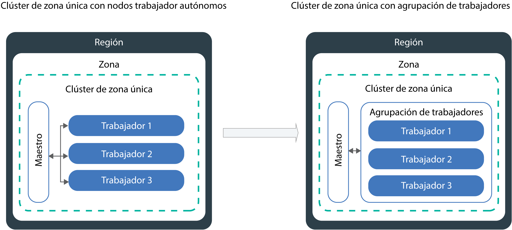

---

copyright:
  years: 2014, 2019
lastupdated: "2019-06-12"

keywords: kubernetes, iks

subcollection: containers

---

{:new_window: target="_blank"}
{:shortdesc: .shortdesc}
{:screen: .screen}
{:pre: .pre}
{:table: .aria-labeledby="caption"}
{:codeblock: .codeblock}
{:tip: .tip}
{:note: .note}
{:important: .important}
{:deprecated: .deprecated}
{:download: .download}
{:preview: .preview}


# Actualización de clústeres, nodos trabajadores y componentes de clúster
{: #update}

Puede instalar actualizaciones para mantener actualizados los clústeres de Kubernetes en {{site.data.keyword.containerlong}}.
{:shortdesc}

## Actualización del maestro de Kubernetes
{: #master}

Periódicamente, Kubernetes publica [actualizaciones de parche, mayores o menores](/docs/containers?topic=containers-cs_versions#version_types). Las actualizaciones pueden afectar a la versión del servidor de API de Kubernetes o a otros componentes del maestro de Kubernetes. IBM actualiza la versión del parche, pero usted debe actualizar las versiones principales y secundarias del nodo maestro.
{:shortdesc}

**¿Cómo sé cuándo debo actualizar el nodo maestro?**</br>
Se le notificará en la CLI y consola de {{site.data.keyword.Bluemix_notm}} cuando haya actualizaciones disponibles; también puede consultar nuestra página de [versiones soportadas](/docs/containers?topic=containers-cs_versions).

**¿A cuántas versiones anteriores a la más reciente da soporte el nodo maestro?**</br>
Por lo general, IBM da soporte a tres versiones de Kubernetes a la vez. Puede actualizar el servidor de API de Kubernetes que esté a no más de dos versiones anteriores a su versión actual.

Por ejemplo, si el servidor de API de Kubernetes actual es de la versión 1.11 y desea actualizar a la 1.14, primero debe actualizar a la versión 1.12.

Si el clúster ejecuta una versión de Kubernetes no soportada, siga las [instrucciones de archivado de la versión](/docs/containers?topic=containers-cs_versions#k8s_version_archive). Para evitar obtener un estado no soportado y un impacto operativo, mantenga el clúster actualizado.

**¿Pueden mis nodos trabajadores ejecutar una versión posterior a la del nodo maestro?**</br>
Los nodos trabajadores no pueden ejecutar una versión de Kubernetes `major.minor` posterior que la del maestro. En primer lugar, [actualice el nodo maestro](#update_master) a la versión más reciente de Kubernetes. Luego [actualice los nodos trabajadores](#worker_node) del clúster.

Los nodos trabajadores pueden ejecutar versiones posteriores del parche que el maestro, como versiones de parches específicas de los nodos trabajadores para las actualizaciones de seguridad.

**¿Cómo se aplican las actualizaciones de parches?**</br>
De forma predeterminada, las actualizaciones de parches para el nodo maestro se aplican automáticamente durante el curso de varios días, por lo que una versión de parche maestro podría aparecer como disponible antes de que se aplique a su nodo maestro. La automatización de actualizaciones también pasa por alto los clústeres que están en un estado no saludable o que tienen operaciones actualmente en curso. Ocasionalmente, IBM podría inhabilitar las actualizaciones automáticas para un fixpack maestro específico, como un parche que solo sea necesario si se actualiza un nodo maestro de una versión menor a otra. En cualquiera de estos casos, puede [comprobar el registro de cambios de las versiones](/docs/containers?topic=containers-changelog) para ver el impacto potencial y utilizar el [mandato](/docs/containers?topic=containers-cli-plugin-kubernetes-service-cli#cs_cluster_update) `ibmcloud ks cluster-update` de forma segura por su cuenta sin tener que esperar a que se aplique la automatización de actualizaciones.

A diferencia de lo que sucede con el nodo maestro, debe actualizar los nodos trabajadores para cada versión de parche.

**¿Qué sucede durante la actualización del nodo maestro?**</br>
En los clústeres que ejecutan Kubernetes versión 1.11 o posteriores, el maestro está altamente disponible con tres pods de maestro de réplica. Los pods del maestro tienen una actualización continua, durante la cual solo hay un pod que no está disponible al mismo tiempo. Dos instancias están activas y en ejecución para que pueda acceder y cambiar el clúster durante la actualización. Sus nodos trabajadores, apps y recursos continúan en ejecución.

Para clústeres que ejecutan versiones anteriores de Kubernetes, cuando actualice el servidor de API de Kubernetes, el servidor de API estará inactivo durante unos 5 o 10 minutos. Durante la actualización, no puede acceder ni cambiar el clúster. Sin embargo, los nodos trabajadores, las apps y los recursos que los usuarios del clúster han desplegado no se modifican y continúan ejecutándose.

**¿Puedo retrotraer la actualización?**</br>
No, no puede retrotraer un clúster a una versión anterior después de que se lleve a cabo el proceso de actualización. Asegúrese de utilizar un clúster de prueba y siga las instrucciones para abordar posibles problemas antes de actualizar el nodo maestro de producción.

**¿Qué proceso puedo seguir para actualizar el nodo maestro?**</br>
El diagrama siguiente muestra el proceso que puede realizar para actualizar el maestro.


Figura 1. Diagrama del proceso de actualización del maestro de Kubernetes

{: #update_master}
Antes de comenzar, asegúrese de tener el [rol de plataforma **Operador** o **Administrador** de {{site.data.keyword.Bluemix_notm}} IAM](/docs/containers?topic=containers-users#platform).

Para actualizar la versión _principal_ o _secundaria_ del nodo maestro de Kubernetes:

1.  Revise los [cambios de Kubernetes](/docs/containers?topic=containers-cs_versions) y realice las actualizaciones marcadas como _Actualizar antes que maestro_.

2.  Actualice el servidor de API de Kubernetes y los componentes maestros de Kubernetes asociados mediante la [consola de {{site.data.keyword.Bluemix_notm}}](https://cloud.ibm.com/login) o mediante la ejecución del [mandato](/docs/containers?topic=containers-cli-plugin-kubernetes-service-cli#cs_cluster_update) de CLI `ibmcloud ks cluster-update`.

3.  Espere unos minutos y luego confirme que la actualización se ha completado. Revise la versión del servidor de API de Kubernetes en el panel de control de {{site.data.keyword.Bluemix_notm}} o ejecutando `ibmcloud ks clusters`.

4.  Instale la versión de [`kubectl cli`](/docs/containers?topic=containers-cs_cli_install#kubectl) que coincida con la versión del servidor de API de Kubernetes API que se ejecuta en el maestro de Kubernetes. [Kubernetes no da soporte a las ](https://kubernetes.io/docs/setup/version-skew-policy/) versiones de cliente de `kubectl` que difieran en dos o más versiones con respecto a la versión del servidor (n +/- 2).

Cuando finalice la actualización del servidor de API de Kubernetes, puede actualizar los nodos trabajadores.

<br />


## Actualización de nodos trabajadores
{: #worker_node}

Ha recibido una notificación para actualizar los nodos trabajadores. ¿Qué significa esto? Como las actualizaciones y parches de seguridad se han aplicado para el servidor de API de Kubernetes y otros componentes del maestro de Kubernetes, debe asegurarse de que los nodos trabajadores permanecen sincronizados.
{: shortdesc}

**¿Qué sucede con mis apps durante una actualización?**</br>
Si ejecuta apps como parte de un despliegue en nodos trabajadores que actualiza, las apps se replanifican en otros nodos trabajadores del clúster. Estos nodos trabajadores pueden estar en otra agrupación de nodos trabajadores o, o si tiene nodos trabajadores autónomos, es posible que las apps se planifiquen en nodos trabajadores autónomos. Para evitar el tiempo de inactividad de la app, debe asegurarse de que tiene suficiente capacidad en el clúster para gestionar la carga de trabajo.

**¿Cómo puedo controlar el número de nodos trabajadores que están inactivos a la vez durante la actualización?**</br>
Si necesita que todos los nodos trabajadores estén en ejecución, tenga en cuenta la posibilidad de [redimensionar la agrupación de nodos trabajadores](/docs/containers?topic=containers-cli-plugin-kubernetes-service-cli#cs_worker_pool_resize) o de [añadir nodos trabajadores autónomos](/docs/containers?topic=containers-cli-plugin-kubernetes-service-cli#cs_worker_add) para disponer de más nodos trabajadores. Puede eliminar los nodos trabajadores adicionales después de que se haya completado la actualización.

Además, puede crear un mapa de configuración de Kubernetes que especifique el número máximo de nodos trabajadores que pueden estar inactivos a la vez durante la actualización. Los nodos trabajadores se identifican mediante etiquetas de nodo trabajador. Puede utilizar las etiquetas proporcionadas por IBM o las etiquetas personalizadas que haya añadido al nodo trabajador.

**¿Qué pasa si decido no definir un mapa de configuración?**</br>
Cuando no se ha definido un mapa de configuración, se utiliza el predeterminado. De forma predeterminada, como máximo el 20 % de todos los nodos trabajadores de cada clúster pueden no estar disponibles durante el proceso de actualización.

**Antes de empezar**:
- [Inicie una sesión en su cuenta. Si procede, apunte al grupo de recursos adecuado. Establezca el contexto para el clúster.](/docs/containers?topic=containers-cs_cli_install#cs_cli_configure)
- [Actualice el nodo maestro de Kubernetes](#master). La versión de Kubernetes del nodo trabajador no puede ser superior a la a la versión del servidor de API de Kubernetes que se ejecuta en el maestro de Kubernetes.
- Realice los cambios marcados con _Después de actualizar el nodo maestro_ del apartado sobre [Cambios en Kubernetes](/docs/containers?topic=containers-cs_versions).
- Si desea aplicar una actualización de parche, consulte el [registro de cambios de versión de Kubernetes](/docs/containers?topic=containers-changelog#changelog).
- Asegúrese de tener el [rol de plataforma **Operador** o **Administrador** de {{site.data.keyword.Bluemix_notm}} IAM](/docs/containers?topic=containers-users#platform). </br>

Las actualizaciones a los nodos trabajadores pueden hacer que las apps y los servicios estén un tiempo inactivos. Se crea de nuevo la imagen de la máquina del nodo trabajador y se suprimen los datos si no se [almacenan fuera del pod](/docs/containers?topic=containers-storage_planning#persistent_storage_overview).
{: important}

{: #worker-up-configmap}
**Para crear un mapa de configuración y actualizar nodos trabajadores**:

1.  Obtenga una lista de los nodos trabajadores disponibles y anote su dirección IP privada.

    ```
    ibmcloud ks workers --cluster <cluster_name_or_ID>
    ```
    {: pre}

2. Vea las etiquetas de un nodo trabajador. Encontrará las etiquetas de los nodos trabajadores en la sección **Labels** de la información de salida de la CLI. Cada etiqueta consta de un `NodeSelectorKey` y un `NodeSelectorValue`.
   ```
   kubectl describe node <private_worker_IP>
   ```
   {: pre}

   Salida de ejemplo:
   ```
   Name:               10.184.58.3
   Roles:              <none>
   Labels:             arch=amd64
                    beta.kubernetes.io/arch=amd64
                    beta.kubernetes.io/os=linux
                    failure-domain.beta.kubernetes.io/region=us-south
                    failure-domain.beta.kubernetes.io/zone=dal12
                    ibm-cloud.kubernetes.io/encrypted-docker-data=true
                    ibm-cloud.kubernetes.io/iaas-provider=softlayer
                    ibm-cloud.kubernetes.io/machine-type=u3c.2x4.encrypted
                    kubernetes.io/hostname=10.123.45.3
                    privateVLAN=2299001
                    publicVLAN=2299012
   Annotations:        node.alpha.kubernetes.io/ttl=0
                    volumes.kubernetes.io/controller-managed-attach-detach=true
   CreationTimestamp:  Tue, 03 Apr 2018 15:26:17 -0400
   Taints:             <none>
   Unschedulable:      false
   ```
   {: screen}

3. Cree un mapa de configuración y defina las reglas de no disponibilidad para los nodos trabajadores. En el siguiente ejemplo se muestran cuatro configuraciones: `zonecheck.json`, `regioncheck.json`, `defaultcheck.json` y una plantilla de comprobación. Puede utilizar estas comprobaciones de ejemplo para definir reglas para nodos trabajadores en una zona específica (`zonecheck.json`), región (`regioncheck.json`) o para todos los nodos trabajadores que no coinciden con ninguna de las comprobaciones que ha definido en el mapa de configuración (`defaultcheck.json`). Utilice la plantilla de comprobación para crear su propia comprobación. Para cada comprobación, para identificar un nodo trabajador, debe elegir una de las etiquetas de nodo trabajador que ha recuperado en el paso anterior.  

   Para cada comprobación, solo puede seleccionar un valor para <code>NodeSelectorKey</code> y <code>NodeSelectorValue</code>. Si desea establecer reglas para más de una región, zona u otras etiquetas de nodo trabajador, cree una nueva comprobación. Puede definir hasta 10 comprobaciones en un mapa de configuración. Si añade más comprobaciones, se pasan por alto.
   {: note}

   Ejemplo:
   ```
   apiVersion: v1
    kind: ConfigMap
    metadata:
      name: ibm-cluster-update-configuration
      namespace: kube-system
    data:
     drain_timeout_seconds: "120"
     zonecheck.json: |
       {
        "MaxUnavailablePercentage": 30,
        "NodeSelectorKey": "failure-domain.beta.kubernetes.io/zone",
        "NodeSelectorValue": "dal13"
      }
    regioncheck.json: |
       {
        "MaxUnavailablePercentage": 20,
        "NodeSelectorKey": "failure-domain.beta.kubernetes.io/region",
        "NodeSelectorValue": "us-south"
      }
    defaultcheck.json: |
       {
        "MaxUnavailablePercentage": 20
      }
    <check_name>: |
      {
        "MaxUnavailablePercentage": <value_in_percentage>,
        "NodeSelectorKey": "<node_selector_key>",
        "NodeSelectorValue": "<node_selector_value>"
      }
   ```
   {: codeblock}

   <table summary="La primera fila de la tabla abarca ambas columnas. El resto de las filas se deben leer de izquierda a derecha, con el parámetro en la columna uno y la descripción correspondiente en la columna dos. ">
   <caption>Componentes de ConfigMap</caption>
    <thead>
      <th colspan=2> Descripción de los componentes </th>
    </thead>
    <tbody>
      <tr>
        <td><code>drain_timeout_seconds</code></td>
        <td> Opcional: el tiempo de espera en segundos para se espera a que finalice el [drenaje ](https://kubernetes.io/docs/tasks/administer-cluster/safely-drain-node/). El drenaje de un nodo trabajador elimina de forma segura todos los pods existentes del nodo trabajador y replanifica los pods en otros nodos trabajadores del clúster. Los valores aceptados son enteros comprendidos entre 1 y 180. El valor predeterminado es 30.</td>
      </tr>
      <tr>
        <td><code>zonecheck.json</code></br><code>regioncheck.json</code></td>
        <td>Dos comprobaciones que definen una regla para un conjunto de nodos trabajadores que puede identificar con los valores <code>NodeSelectorKey</code> y <code>NodeSelectorValue</code> especificados. <code>zonecheck.json</code> identifica los nodos trabajadores en función de su etiqueta de zona, y <code>regioncheck.json</code> utiliza la etiqueta de región que se añade a cada nodo trabajador durante el suministro. En el ejemplo, el 30% de todos los nodos trabajadores que tienen <code>dal13</code> como etiqueta de zona y el 20% de todos los nodos trabajadores de <code>us-south</code> pueden no estar disponibles durante la actualización.</td>
      </tr>
      <tr>
        <td><code>defaultcheck.json</code></td>
        <td>Si no crea un mapa de configuración o si el mapa se configura incorrectamente, se aplica el valor predeterminado de Kubernetes. De forma predeterminada, solo el 20% de los nodos trabajadores del clúster pueden no estar disponibles a la vez. Puede modificar el valor predeterminado añadiendo la comprobación predeterminada al mapa de configuración. En el ejemplo, cada nodo trabajador que no esté especificado en las comprobaciones de zona y región (<code>dal13</code> o <code>us-south</code>) pueden no estar disponibles durante la actualización. </td>
      </tr>
      <tr>
        <td><code>MaxUnavailablePercentage</code></td>
        <td>El número máximo de nodos que pueden no estar disponibles para una clave de etiqueta y un valor especificados, especificado como un porcentaje. Un nodo trabajador no está disponible cuando está en proceso de despliegue, de recarga o de suministro. Los nodos trabajadores en cola están bloqueados para actualizarse si se supera cualquier porcentaje no disponible máximo definido. </td>
      </tr>
      <tr>
        <td><code>NodeSelectorKey</code></td>
        <td>La clave de etiqueta del nodo trabajador para el que desea definir una regla. Puede establecer reglas para las etiquetas predeterminadas proporcionadas por IBM, así como para las etiquetas de nodos trabajadores que haya creado. <ul><li>Si desea añadir una regla para los nodos trabajadores pertenecientes a una agrupación de nodos trabajadores, puede utilizar la etiqueta <code>ibm-cloud.kubernetes.io/machine-type</code>. </li><li> Si tiene más de una agrupación de nodos trabajadores con el mismo tipo de máquina, utilice una etiqueta personalizada. </li></ul></td>
      </tr>
      <tr>
        <td><code>NodeSelectorValue</code></td>
        <td>El valor de etiqueta que debe tener el nodo trabajador para que se tenga en cuenta para la regla que defina. </td>
      </tr>
    </tbody>
   </table>

4. Cree el mapa de configuración en el clúster.
   ```
   kubectl apply -f <filepath/configmap.yaml>
   ```
   {: pre}

5.  Verifique que se ha creado el mapa de configuración.
    ```
    kubectl get configmap --namespace kube-system
    ```
    {: pre}

6.  Actualice los nodos trabajadores.

    ```
    ibmcloud ks worker-update --cluster <cluster_name_or_ID> --workers <worker_node1_ID> <worker_node2_ID>
    ```
    {: pre}

7. Opcional: compruebe los sucesos que desencadena el mapa de configuración y los errores de validación que se produzcan. Los sucesos se pueden revisar en la sección **Events** de la información de salida de la CLI.
   ```
   kubectl describe -n kube-system cm ibm-cluster-update-configuration
   ```
   {: pre}

8. Confirme que la actualización se ha completado revisando la versión de Kubernetes de los nodos trabajadores.  
   ```
   kubectl get nodes
   ```
   {: pre}

9. Verifique que no tiene nodos trabajadores duplicados. En algunos casos, es posible que los clústeres antiguos muestren nodos trabajadores duplicados con el estado **`NotReady`** después de una actualización. Para eliminar los duplicados, consulte [resolución de problemas](/docs/containers?topic=containers-cs_troubleshoot_clusters#cs_duplicate_nodes).

Pasos siguientes:
-   Repita el proceso de actualización con otras agrupaciones de nodos trabajadores.
-   Informe a los desarrolladores que trabajan en el clúster para que actualicen su CLI de `kubectl` a la versión del maestro de Kubernetes.
-   Si el panel de control de Kubernetes no muestra los gráficos de utilización, [suprima el pod `kube-dashboard`](/docs/containers?topic=containers-cs_troubleshoot_health#cs_dashboard_graphs).


### Actualización de nodos trabajadores en la consola
{: #worker_up_console}

Después de configurar el mapa de configuración por primera vez, puede actualizar posteriormente los nodos trabajadores mediante la consola de {{site.data.keyword.Bluemix_notm}}.
{: shortdesc}

Antes de empezar:
*   [Configure un mapa de configuración](#worker_node) para controlar cómo se actualizan los nodos trabajadores.
*   [Actualice el nodo maestro de Kubernetes](#master). La versión de Kubernetes del nodo trabajador no puede ser superior a la a la versión del servidor de API de Kubernetes que se ejecuta en el maestro de Kubernetes.
*   Realice los cambios marcados con _Después de actualizar el nodo maestro_ del apartado sobre [Cambios en Kubernetes](/docs/containers?topic=containers-cs_versions).
*   Si desea aplicar una actualización de parche, consulte el [registro de cambios de versión de Kubernetes](/docs/containers?topic=containers-changelog#changelog).
*   Asegúrese de tener el [rol de plataforma **Operador** o **Administrador** de {{site.data.keyword.Bluemix_notm}} IAM](/docs/containers?topic=containers-users#platform). </br>

Las actualizaciones a los nodos trabajadores pueden hacer que las apps y los servicios estén un tiempo inactivos. Se crea de nuevo la imagen de la máquina del nodo trabajador y se suprimen los datos si no se [almacenan fuera del pod](/docs/containers?topic=containers-storage_planning#persistent_storage_overview).
{: important}

Para actualizar nodos trabajadores desde la consola:
1.  En el menú de la [consola de {{site.data.keyword.Bluemix_notm}}](https://cloud.ibm.com/), pulse **Kubernetes**.
2.  En la página **Clústeres**, pulse el clúster.
3.  En el separador **Nodos trabajadores**, marque el recuadro de selección de cada nodo trabajador que desee actualizar. Se muestra una barra de acciones sobre la fila de cabecera de la tabla.
4.  En la barra de acciones, pulse **Actualizar Kubernetes**.

<br />


## Actualización de los tipos de máquina
{: #machine_type}

Puede actualizar los tipos de máquina que utilizan los nodos trabajadores añadiendo nuevos nodos trabajadores y eliminando los antiguos. Por ejemplo si en su clúster hay tipos de nodo trabajador `x1c` o el más antiguo Ubuntu 16 `x2c`, cree nodos trabajadores Ubuntu 18 que utilicen tipos de máquina con `x3c` en el nombre.
{: shortdesc}

Antes de empezar:
- [Inicie una sesión en su cuenta. Si procede, apunte al grupo de recursos adecuado. Establezca el contexto para el clúster.](/docs/containers?topic=containers-cs_cli_install#cs_cli_configure)
- Si almacena datos en su nodo trabajador, los datos se suprimen si no los [almacena fuera del nodo trabajador](/docs/containers?topic=containers-storage_planning#persistent_storage_overview).
- Asegúrese de tener el [rol de plataforma **Operador** o **Administrador** de {{site.data.keyword.Bluemix_notm}} IAM](/docs/containers?topic=containers-users#platform).

Para actualizar tipos de máquina:

1. Obtenga una lista de los nodos trabajadores disponibles y anote su dirección IP privada.
   - **Para los nodos trabajadores de una agrupación de nodos trabajadores**:
     1. Obtenga una lista de los nodos trabajadores del clúster.
        ```
        ibmcloud ks worker-pools --cluster <cluster_name_or_ID>
        ```
        {: pre}

     2. Obtenga una lista de los nodos trabajadores de la agrupación de nodos trabajadores.
        ```
        ibmcloud ks workers --cluster <cluster_name_or_ID> --worker-pool <pool_name>
        ```
        {: pre}

     3. Obtenga los detalles de un nodo trabajador y anote la zona, el ID de VLAN privado y el ID de VLAN público.
        ```
        ibmcloud ks worker-get --cluster <cluster_name_or_ID> --worker <worker_ID>
        ```
        {: pre}

   - **En desuso: para nodos trabajadores autónomos**:
     1. Obtenga una lista de los nodos trabajadores disponibles.
        ```
        ibmcloud ks workers --cluster <cluster_name_or_ID>
        ```
        {: pre}

     2. Obtenga los detalles de un nodo trabajador y anote la zona, el ID de VLAN privado y el ID de VLAN público.
        ```
        ibmcloud ks worker-get --cluster <cluster_name_or_ID> --worker <worker_ID>
        ```
        {: pre}

2. Obtenga una lista de los tipos de máquina de la zona.
   ```
   ibmcloud ks machine-types <zone>
   ```
   {: pre}

3. Cree un nodo trabajador con el nuevo tipo de máquina.
   - **Para los nodos trabajadores de una agrupación de nodos trabajadores**:
     1. Cree una agrupación de nodos trabajadores con el número de nodos trabajadores que desea sustituir.
        ```
        ibmcloud ks worker-pool-create --name <pool_name> --cluster <cluster_name_or_ID> --machine-type <machine_type> --size-per-zone <number_of_workers_per_zone>
        ```
        {: pre}

     2. Verifique que la agrupación de nodos trabajadores se ha creado.
        ```
        ibmcloud ks worker-pools --cluster <cluster_name_or_ID>
        ```
        {: pre}

     3. Añada la zona a la agrupación de nodos trabajadores que ha recuperado anteriormente. Cuando se añade una zona, los nodos trabajadores definidos en la agrupación de nodos trabajadores se suministran en la zona y se tienen en cuenta para la futura planificación de la carga de trabajo. Si desea distribuir los nodos trabajadores en varias zonas, elija una [zona con soporte multizona](/docs/containers?topic=containers-regions-and-zones#zones).
        ```
        ibmcloud ks zone-add --zone <zone> --cluster <cluster_name_or_ID> --worker-pools <pool_name> --private-vlan <private_VLAN_ID> --public-vlan <public_VLAN_ID>
        ```
        {: pre}

   - **En desuso: para nodos trabajadores autónomos**:
       ```
       ibmcloud ks worker-add --cluster <cluster_name> --machine-type <machine_type> --workers <number_of_worker_nodes> --private-vlan <private_VLAN_ID> --public-vlan <public_VLAN_ID>
       ```
       {: pre}

4. Espere a que se desplieguen los nodos trabajadores.
   ```
   ibmcloud ks workers --cluster <cluster_name_or_ID>
   ```
   {: pre}

   Cuando el estado del nodo trabajador pase a ser **Normal**, significa que el despliegue ha finalizado.

5. Elimine el nodo trabajador antiguo. **Nota**: Si va a eliminar un tipo de máquina que se factura mensualmente (como las nativas), se le facturará todo el mes.
   - **Para los nodos trabajadores de una agrupación de nodos trabajadores**:
     1. Elimine la agrupación de nodos trabajadores con el tipo de máquina antiguo. Al eliminar una agrupación de nodos trabajadores se eliminan todos los nodos trabajadores de la agrupación en todas las zonas. Este proceso puede tardar algunos minutos en completarse.
        ```
        ibmcloud ks worker-pool-rm --worker-pool <pool_name> --cluster <cluster_name_or_ID>
        ```
        {: pre}

     2. Verifique que la agrupación de nodos trabajadores se ha eliminado.
        ```
        ibmcloud ks worker-pools --cluster <cluster_name_or_ID>
        ```
        {: pre}

   - **En desuso: para nodos trabajadores autónomos**:
      ```
      ibmcloud ks worker-rm --cluster <cluster_name> --worker <worker_node>
      ```
      {: pre}

6. Verifique que los nodos trabajadores se han eliminado del clúster.
   ```
   ibmcloud ks workers --cluster <cluster_name_or_ID>
   ```
   {: pre}

7. Repita estos pasos para actualizar otras agrupaciones de nodos trabajadores o nodos trabajadores autónomos a distintos tipos de máquina.

## Actualización de los componentes de un clúster
{: #components}

El clúster de {{site.data.keyword.containerlong_notm}} se suministra con componentes, como Fluentd para registro, que se instalan automáticamente cuando se suministra el clúster. De forma predeterminada, IBM actualiza automáticamente estos componentes. No obstante, puede inhabilitar las actualizaciones automáticas de algunos componentes y actualizarlos manualmente de forma independiente de los nodos maestro y trabajador.
{: shortdesc}

**¿Qué componentes predeterminados puedo actualizar por separado del clúster?**</br>
Opcionalmente, puede inhabilitar las actualizaciones automáticas para los componentes siguientes:
* [Fluentd para registro](#logging-up)
* [Equilibrador de carga de aplicación (ALB) de Ingress](#alb)

**¿Hay componentes que no puedo actualizar de forma independiente al clúster?**</br>

Sí. El clúster se despliega con los siguientes componentes gestionados y recursos asociados que no se pueden cambiar, excepto para escalar pods o editar mapas de configuración para obtener determinados beneficios en el rendimiento. Si intenta modificar uno de estos componentes de despliegue, se restauran sus valores originales con un intervalo regular.

* `coredns`
* `coredns-autoscaler`
* `heapster`
* `ibm-file-plugin`
* `ibm-storage-watcher`
* `ibm-keepalived-watcher`
* `kube-dns-amd64`
* `kube-dns-autoscaler`
* `kubernetes-dashboard`
* `metrics-server`
* `vpn`

Puede ver estos recursos utilizando la etiqueta `addonmanager.kubernetes.io/mode: Reconcile`. Por ejemplo:

```
kubectl get deployments --all-namespaces -l addonmanager.kubernetes.io/mode=Reconcile
```
{: pre}

**¿Puedo instalar otros plugins o complementos aparte de los componentes predeterminados?**</br>
Sí. {{site.data.keyword.containerlong_notm}} proporciona otros plugins y complementos entre los que puede elegir para añadir funciones al clúster. Por ejemplo, quizás desee [utilizar diagramas de Helm](/docs/containers?topic=containers-helm#public_helm_install) para instalar el [complemento de almacenamiento en bloque](/docs/containers?topic=containers-block_storage#install_block) o [strongSwan VPN](/docs/containers?topic=containers-vpn#vpn-setup). O bien, es posible que desee habilitar complementos gestionados por IBM en el clúster, como por ejemplo [Istio](/docs/containers?topic=containers-istio) o [Knative](/docs/containers?topic=containers-serverless-apps-knative). Debe actualizar estos diagramas de Helm y complementos por separado, siguiendo las instrucciones de los archivos readme de los diagramas de Helm o siguiendo los pasos para [actualizar complementos gestionados](/docs/containers?topic=containers-managed-addons#updating-managed-add-ons).

### Gestión de actualizaciones automáticas para Fluentd
{: #logging-up}

Para modificar las configuraciones de registro o de filtro, debe tener la versión más reciente del complemento Fluentd. De forma predeterminada, las actualizaciones automáticas del componente están habilitadas.
{: shortdesc}

Puede gestionar las actualizaciones automáticas del componente Fluentd de las maneras siguientes. **Nota**: Para ejecutar los mandatos siguientes, debe tener el [rol de plataforma **Administrador** de {{site.data.keyword.Bluemix_notm}} IAM](/docs/containers?topic=containers-users#platform) para el clúster.

* Compruebe si las actualizaciones automáticas están habilitadas mediante el [mandato](/docs/containers?topic=containers-cli-plugin-kubernetes-service-cli#cs_log_autoupdate_get) `ibmcloud ks logging-autoupdate-get --cluster <cluster_name_or_ID>`.
* Inhabilite las actualizaciones mediante el [mandato](/docs/containers?topic=containers-cli-plugin-kubernetes-service-cli#cs_log_autoupdate_disable) `ibmcloud ks logging-autoupdate-disable`.
* Si las actualizaciones automáticas están inhabilitadas pero tiene que modificar la configuración, tiene dos opciones:
    * Activar las actualizaciones automáticas para sus pods Fluentd.
        ```
        ibmcloud ks logging-autoupdate-enable --cluster <cluster_name_or_ID>
        ```
        {: pre}
    * Forzar una actualización única cuando utilice un mandato de registro que incluya la opción `--force-update`. **Nota**: los pods se actualizan a la última versión del componente Fluentd, pero Fluentd no se actualiza automáticamente.
        Mandato de ejemplo:

        ```
        ibmcloud ks logging-config-update --cluster <cluster_name_or_ID> --id <log_config_ID> --type <log_type> --force-update
        ```
        {: pre}

### Gestión de actualizaciones automáticas para los ALB de Ingress
{: #alb}

Controle cuándo se actualiza el componente de equilibrador de carga de aplicación (ALB) de Ingress.
{: shortdesc}

Cuando se actualiza el componente ALB de Ingress, se actualizan los contenedores
`nginx-ingress` e `ingress-auth` en todos los pods de ALB a la versión de compilación más reciente. De forma predeterminada, las actualizaciones automáticas de los ALB están habilitadas. Las actualizaciones se realizan de forma continua, de manera que los ALB de Ingress no experimenten ningún tiempo de inactividad.

Si inhabilita las actualizaciones automáticas, será responsable de actualizar los ALB. Cuando existan actualizaciones disponibles, se le notificará en la CLI cuando ejecute los mandatos `ibmcloud ks albs` o `alb-autoupdate-get`.

Cuando actualice la versión principal o menor de Kubernetes del clúster, IBM realizará automáticamente los cambios necesarios en el mapa de configuración de Ingress, pero no cambiará la versión de compilación de los ALB de Ingress. Deberá comprobar la compatibilidad de las versiones más recientes de Kubernetes y las imágenes de los ALB de Ingress.
{: note}

Antes de empezar:

1. Verifique que los ALB están en ejecución.
    ```
    ibmcloud ks albs
    ```
    {: pre}

2. Compruebe el estado de las actualizaciones automáticas del componente ALB de Ingress.
    ```
    ibmcloud ks alb-autoupdate-get --cluster <cluster_name_or_ID>
    ```
    {: pre}

    Salida de ejemplo cuando las actualizaciones automáticas están habilitadas:
    ```
    Retrieving automatic update status of application load balancer (ALB) pods in cluster mycluster...
    OK
    Automatic updates of the ALB pods are enabled in cluster mycluster
    ALBs are at the latest version in cluster mycluster
    ```
    {: screen}

    Salida de ejemplo cuando las actualizaciones automáticas están inhabilitadas:
    ```
    Retrieving automatic update status of application load balancer (ALB) pods in cluster mycluster...
    OK
    Automatic updates of the ALB pods are disabled in cluster mycluster
    ALBs are not at the latest version in cluster mycluster. To view the current version, run 'ibmcloud ks albs'.
    ```
    {: screen}

3. Verifique la versión de **compilación** actual de los pods de ALB.
    ```
    ibmcloud ks albs --cluster <cluster_name_or_ID>
    ```
    {: pre}

    Salida de ejemplo:
    ```
    ALB ID                                            Enabled   Status     Type      ALB IP          Zone    Build                           ALB VLAN ID
    private-crdf253b6025d64944ab99ed63bb4567b6-alb2   false     disabled   private   10.xxx.xx.xxx   dal10   ingress:411/ingress-auth:315*   2234947
    public-crdf253b6025d64944ab99ed63bb4567b6-alb2    true      enabled    public    169.xx.xxx.xxx  dal10   ingress:411/ingress-auth:315*   2234945

    * Hay una actualización disponible para los pods de ALB. Revise los cambios potencialmente disruptivos de la versión más reciente antes de actualizar: https://cloud.ibm.com/docs/containers?topic=containers-update#alb
    ```
    {: screen}

Puede gestionar las actualizaciones automáticas del componente ALB de Ingress de las maneras siguientes. **Nota**: para ejecutar los mandatos siguientes, debe tener el [rol de plataforma **Editor** o **Administrador** de {{site.data.keyword.Bluemix_notm}} IAM](/docs/containers?topic=containers-users#platform) para el clúster.
* Inhabilite las actualizaciones automáticas.
    ```
    ibmcloud ks alb-autoupdate-disable --cluster <cluster_name_or_ID>
    ```
    {: pre}
* Actualice manualmente los ALB de Ingress.
    1. Si hay una actualización disponible y desea actualizar los ALB, compruebe primero el
[registro de cambios de la versión más reciente del componente ALB de Ingress](/docs/containers?topic=containers-cluster-add-ons-changelog#alb_changelog) para verificar cualquier cambio potencialmente disruptivo.
    2. Fuerce una actualización de una sola vez de los pods de ALB. Todos los pods de ALB del clúster se actualizan a la versión de compilación más reciente. No puede actualizar un ALB individual ni elegir a qué versión de compilación actualizar los ALB. Las actualizaciones automáticas siguen estando inhabilitadas.
        ```
        ibmcloud ks alb-update --cluster <cluster_name_or_ID>
        ```
        {: pre}
* Si los pods de ALB se han actualizado recientemente, pero una configuración personalizada de los ALB se ve afectada por la última compilación, puede retrotraer la actualización a la versión de compilación que ejecutaban los pods de ALB anteriormente. **Nota**: después de retrotraer una actualización, se inhabilitan las actualizaciones automáticas para los pods de ALB.
    ```
    ibmcloud ks alb-rollback --cluster <cluster_name_or_ID>
    ```
    {: pre}
* Vuelva a habilitar las actualizaciones automáticas. Siempre que la siguiente compilación esté disponible, los pods de ALB se actualizan automáticamente a la compilación más reciente.
    ```
    ibmcloud ks alb-autoupdate-enable --cluster <cluster_name_or_ID>
    ```
    {: pre}

<br />


## Actualización de complementos gestionados
{: #addons}

Los complementos gestionados de {{site.data.keyword.containerlong_notm}} son una forma sencilla de mejorar el clúster con prestaciones de código abierto, como por ejemplo, Istio o Knative. La versión de la herramienta de código abierto que añade al clúster se prueba en IBM y se aprueba para ser utilizada en {{site.data.keyword.containerlong_notm}}. Para actualizar los complementos gestionados que ha habilitado en el clúster a las últimas versiones, consulte [Actualización de complementos gestionados](/docs/containers?topic=containers-managed-addons#updating-managed-add-ons).

## Actualización de nodos trabajadores autónomos a agrupaciones de nodos trabajadores
{: #standalone_to_workerpool}

Con la introducción de clústeres multizona, los nodos trabajadores con la misma configuración, como el tipo de máquina, se agrupan en agrupaciones de nodos trabajadores. Cuando crea un nuevo clúster, se crea automáticamente una agrupación de nodos trabajadores denominada `default`.
{: shortdesc}

Puede utilizar agrupaciones de nodos trabajadores para distribuir los nodos trabajadores de forma uniforme entre zonas y crear un clúster equilibrado. Los clústeres equilibrados están más disponibles y son resistentes a errores. Si un nodo trabajador se elimina de una zona, puede reequilibrar la agrupación de nodos trabajadores y suministrar automáticamente nuevos nodos trabajadores a dicha zona. Las agrupaciones de nodos trabajadores también se utilizan para instalar actualizaciones de la versión de Kubernetes en todos los nodos trabajadores.  

Si ha creado clústeres antes de que los clústeres multizona estén disponibles, los nodos trabajadores siguen siendo autónomos y no se agrupan automáticamente en agrupaciones de nodos trabajadores. Debe actualizar estos clústeres para que utilicen agrupaciones de nodos trabajadores. Si no se actualiza, no puede cambiar el clúster de una sola zona por un clúster multizona.
{: important}

Examine la imagen siguiente para ver cómo cambia la configuración del clúster cuando se pasa de nodos trabajadores autónomos a agrupaciones de nodos trabajadores.



Antes de empezar:
- Asegúrese de tener el [rol de plataforma **Operador** o **Administrador** de {{site.data.keyword.Bluemix_notm}} IAM](/docs/containers?topic=containers-users#platform) para el clúster.
- [Inicie una sesión en su cuenta. Si procede, apunte al grupo de recursos adecuado. Establezca el contexto para el clúster.](/docs/containers?topic=containers-cs_cli_install#cs_cli_configure)

Para actualizar los nodos trabajadores autónomos a las agrupaciones de nodos trabajadores:

1. Obtenga una lista de los nodos trabajadores autónomos existentes en el clúster y anote su **ID**, **Tipo de máquina** e **IP privada**.
   ```
   ibmcloud ks workers --cluster <cluster_name_or_ID>
   ```
   {: pre}

2. Cree una agrupación de nodos trabajadores con el tipo de máquina y el número de nodos trabajadores que desea añadir a la agrupación.
   ```
   ibmcloud ks worker-pool-create --name <pool_name> --cluster <cluster_name_or_ID> --machine-type <machine_type> --size-per-zone <number_of_workers_per_zone>
   ```
   {: pre}

3. Obtenga una lista de las zonas disponibles y decida dónde desea suministrar los nodos trabajadores en la agrupación de nodos trabajadores. Para ver la zona en la que se han suministrado los nodos trabajadores autónomos, ejecute `ibmcloud ks cluster-get --cluster <cluster_name_or_ID>`. Si desea distribuir los nodos trabajadores en varias zonas, elija una [zona con soporte multizona](/docs/containers?topic=containers-regions-and-zones#zones).
   ```
   ibmcloud ks zones
   ```
   {: pre}

4. Obtenga una lista de las VLAN disponibles para la zona que ha elegido en el paso anterior. Si aún no tiene una VLAN en dicha zona, la VLAN se crea automáticamente cuando añade la zona a la agrupación de nodos trabajadores.
   ```
   ibmcloud ks vlans --zone <zone>
   ```
   {: pre}

5. Añada la zona a la agrupación de nodos trabajadores. Cuando se añade una zona a una agrupación de nodos trabajadores, los nodos trabajadores definidos en la agrupación de nodos trabajadores se suministran en la zona y se tienen en cuenta para la futura planificación de la carga de trabajo. {{site.data.keyword.containerlong}} añade automáticamente a cada nodo trabajador la etiqueta `failure-domain.beta.kubernetes.io/region` correspondiente a la región y la etiqueta `failure-domain.beta.kubernetes.io/zone` correspondiente a la zona. El planificador de Kubernetes utiliza estas etiquetas para distribuir los pods entre zonas de la misma región.
   1. **Para añadir una zona a una agrupación de nodos trabajadores**: sustituya `<pool_name>` por el nombre de la agrupación de nodos trabajadores, y especifique en los campos de ID de clúster, zona y VLAN la información que ha recuperado previamente. Si no tiene una VLAN privada y pública en dicha zona, no especifique esta opción. Se crean automáticamente una VLAN privada y pública.

      Si desea utilizar distintas VLAN para distintas agrupaciones de nodos trabajadores, repita este mandato para cada VLAN y sus agrupaciones de nodos trabajadores correspondientes. Los nuevos nodos trabajadores se añaden a las VLAN que especifique, pero las VLAN de los nodos trabajadores existentes no se modifican.
      ```
      ibmcloud ks zone-add --zone <zone> --cluster <cluster_name_or_ID> --worker-pools <pool_name> --private-vlan <private_VLAN_ID> --public-vlan <public_VLAN_ID>
      ```
      {: pre}

   2. **Para añadir la zona a varias agrupaciones de nodos trabajadores**: añada varias agrupaciones de nodos trabajadores al mandato `ibmcloud ks zone-add`. Para añadir varias agrupaciones de trabajadores a una zona, debe tener una VLAN privada y pública existente en dicha zona. Si no tiene una VLAN pública y privada en dicha zona, considere la posibilidad de añadir primero la zona a una agrupación de nodos trabajadores para que se cree una VLAN pública y una VLAN privada. A continuación, puede añadir la zona a otras agrupaciones de nodos trabajadores. </br></br>Es importante que los nodos trabajadores de todas las agrupaciones de nodos trabajadores se suministran en todas las zonas para asegurarse de que el clúster está equilibrado entre zonas. Si desea utilizar distintas VLAN para distintas agrupaciones de nodos trabajadores, repita este mandato con la VLAN que desea utilizar para la agrupación de nodos trabajadores. Si tiene varias VLAN para un clúster, varias subredes en la misma VLAN o un clúster multizona, debe habilitar la [función de direccionador virtual (VRF)](/docs/infrastructure/direct-link?topic=direct-link-overview-of-virtual-routing-and-forwarding-vrf-on-ibm-cloud#overview-of-virtual-routing-and-forwarding-vrf-on-ibm-cloud) para la cuenta de infraestructura de IBM Cloud (SoftLayer) para que los nodos trabajadores puedan comunicarse entre sí en la red privada. Para habilitar VRF, [póngase en contacto con el representante de su cuenta de la infraestructura de IBM Cloud (SoftLayer)](/docs/infrastructure/direct-link?topic=direct-link-overview-of-virtual-routing-and-forwarding-vrf-on-ibm-cloud#how-you-can-initiate-the-conversion). Si no puede o no desea habilitar VRF, habilite la [distribución de VLAN](/docs/infrastructure/vlans?topic=vlans-vlan-spanning#vlan-spanning). Para llevar a cabo esta acción, necesita el [permiso de la infraestructura](/docs/containers?topic=containers-users#infra_access) **Red > Gestionar distribución de VLAN de red** o bien puede solicitar al propietario de la cuenta que lo habilite. Para comprobar si la distribución de VLAN ya está habilitada, utilice el [mandato](/docs/containers?topic=containers-cli-plugin-kubernetes-service-cli#cs_vlan_spanning_get) `ibmcloud ks vlan-spanning-get --region <region>`.
      ```
      ibmcloud ks zone-add --zone <zone> --cluster <cluster_name_or_ID> --worker-pools <pool_name1,pool_name2,pool_name3> --private-vlan <private_VLAN_ID> --public-vlan <public_VLAN_ID>
      ```
      {: pre}

   3. **Para añadir varias zonas a las agrupaciones de nodos trabajadores**: repita el mandato `ibmcloud ks zone-add` con una zona distinta y especifique las agrupaciones de nodos trabajadores que desea suministrar en dicha zona. Al añadir más zonas al clúster, el clúster pasa de ser un clúster de una sola zona a ser un [clúster multizona](/docs/containers?topic=containers-ha_clusters#multizone).

6. Espere a que se desplieguen los nodos trabajadores en cada zona.
   ```
   ibmcloud ks workers --cluster <cluster_name_or_ID>
   ```
   {: pre}
   Cuando el estado del nodo trabajador sea **Normal**, significa que el despliegue ha finalizado.

7. Elimine los nodos trabajadores autónomos. Si tiene varios nodos trabajadores autónomos, elimínelos de uno en uno.
   1. Obtenga una lista de los nodos trabajadores del clúster y compare la dirección IP privada de este mandato con la dirección IP privada que ha recuperado al principio para encontrar los nodos trabajadores autónomos.
      ```
      kubectl get nodes
      ```
      {: pre}
   2. Marque el nodo trabajador como no programable en un proceso que se conoce como acordonamiento. Cuando se acordona un nodo trabajador, deja de estar disponible para programar pods en el futuro. Utilice el valor `name` que se devuelve en el mandato `kubectl get nodes`.
      ```
      kubectl cordon <worker_name>
      ```
      {: pre}
   3. Verifique que la planificación de pods está inhabilitada en el nodo trabajador.
      ```
      kubectl get nodes
      ```
      {: pre}
      La planificación de pods está inhabilitada en el nodo trabajador si el estado es **`SchedulingDisabled`**.
   4. Fuerce la eliminación de los pods del nodo trabajador autónomo y vuelva a programarlos en los demás nodos trabajadores autónomos del clúster y nodos trabajadores de la agrupación de nodos trabajadores.
      ```
      kubectl drain <worker_name> --ignore-daemonsets
      ```
      {: pre}
      Este proceso puede tardar unos minutos.

   5. Elimine el nodo trabajador autónomo. Utilice el ID del nodo trabajador que ha recuperado con el mandato `ibmcloud ks workers --cluster <cluster_name_or_ID>`.
      ```
      ibmcloud ks worker-rm --cluster <cluster_name_or_ID> --worker <worker_ID>
      ```
      {: pre}
   6. Repita estos pasos hasta que se hayan eliminado todos los nodos trabajadores autónomos.


**¿Qué es lo siguiente?** </br>
Ahora que ha actualizado el clúster para que utilice agrupaciones de nodos trabajadores, puede mejorar la disponibilidad añadiendo más zonas al clúster. Al añadir más zonas al clúster, el clúster pasa de ser un clúster de una sola zona a ser un [clúster multizona](/docs/containers?topic=containers-ha_clusters#ha_clusters). Cuando cambie el clúster de una sola zona a un clúster multizona, el dominio de Ingress pasa de `<cluster_name>.<region>.containers.mybluemix.net` a `<cluster_name>.<region_or_zone>.containers.appdomain.cloud`. El dominio de Ingress existente sigue siendo válido y se puede utilizar para enviar solicitudes a sus apps.

<br />

