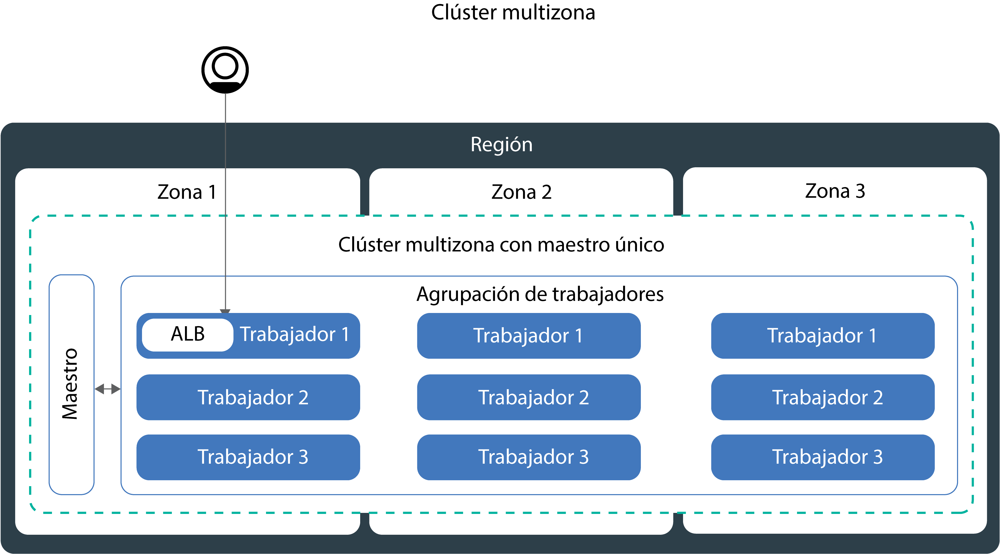

---

copyright:
  years: 2014, 2018
lastupdated: "2018-08-06"

---

{:new_window: target="_blank"}
{:shortdesc: .shortdesc}
{:screen: .screen}
{:pre: .pre}
{:table: .aria-labeledby="caption"}
{:codeblock: .codeblock}
{:tip: .tip}
{:download: .download}


# Configuración de clústeres
{: #clusters}

Diseñe la configuración del clúster de Kubernetes para maximizar la disponibilidad del contenedor y la capacidad del clúster con {{site.data.keyword.containerlong}}. ¿Aún se está familiarizando? Pruebe la [guía de aprendizaje para la creación de un clúster de Kubernetes](cs_tutorials.html#cs_cluster_tutorial).
{:shortdesc}

## Creación de clústeres multizona en {{site.data.keyword.containershort_notm}}
{: #multizone}

Con {{site.data.keyword.containerlong}}, puede crear clústeres multizona. Si distribuye sus apps entre varios nodos trabajadores y zonas mediante una agrupación de nodos trabajadores, es menos probable que los usuarios experimenten un tiempo de inactividad del sistema. Características incorporadas como, por ejemplo, el aislamiento y el equilibrio de carga, incrementan la resiliencia frente a posibles anomalías de zona con hosts, redes o apps. Si caen los recursos de una zona, las cargas de trabajo del clúster siguen funcionando en las otras zonas.
{: shortdesc}

### Un momento, ¿de qué trata todo esto de las zonas y las agrupaciones? ¿Qué ha cambiado?
{: #mz_changed}

Las **zonas**, antes denominadas ubicaciones, son centros de datos en los que puede crear recursos de IBM Cloud.

Ahora los clústeres tienen una característica llamada **agrupación de nodos trabajadores**, que es una colección de nodos trabajadores que comparten alguna característica, como por ejemplo tipo de máquina, CPU y memoria. Utilice los nuevos mandatos `ibmcloud ks worker-pool` para realizar cambios en el clúster, como por ejemplo para añadir zonas, añadir nodos trabajadores o actualizar nodos trabajadores.

La configuración de clúster anterior de nodos trabajadores estándares recibe soporte, pero ha quedado en desuso. Asegúrese de [añadir una agrupación de nodos trabajadores al clúster](cs_clusters.html#add_pool) y luego de [migrar al uso de agrupaciones de nodos trabajadores](cs_cluster_update.html#standalone_to_workerpool) para organizar los nodos trabajadores en lugar de los nodos trabajadores autónomos.

### ¿Qué necesito saber antes de empezar?
{: #general_reqs}

Primero debe preparar algunos elementos administrativos para asegurarse de que los clústeres multizona están listos para las cargas de trabajo.

<dl>
<dt>VLAN necesarias</dt>
  <dd><p>Cuando añade una zona a una agrupación de nodos trabajadores, debe definir una VLAN privada y una pública a la que se conectan los nodos trabajadores.</p><ul><li>Para comprobar si tiene VLAN existentes en esa zona que puede utilizar, ejecute ` ibmcloud ks vlans <zone>`. Anote los ID de VLAN y utilícelos cuando añada una zona a una agrupación de nodos trabajadores. </li>
  <li>Si no tiene VLAN en dicha zona, se crea automáticamente una VLAN privada y una VLAN pública. No tiene que especificar una VLAN privada y una VLAN pública. </li></ul>
  </dd>
<dt>Habilite la expansión de VLAN o VRF</dt>
  <dd><p>Los nodos trabajadores deben comunicarse entre sí en la red privada entre zonas. Dispone de dos opciones:</p>
  <ol><li>[Habilitar la expansión de VLAN](/docs/infrastructure/vlans/vlan-spanning.html#vlan-spanning) en la cuenta de la infraestructura de IBM Cloud (SoftLayer). Para habilitar la expansión de VLAN, debe tener el [permiso de la infraestructura](/docs/iam/infrastructureaccess.html#infrapermission) <strong>Red > Gestionar expansión de VLAN de red</strong> o bien puede solicitar al propietario de la cuenta que la habilite.</li>
  <li>O utilizar una cuenta de la infraestructura de IBM Cloud (SoftLayer) habilitada para la función de direccionador virtual (VRF). Para obtener una cuenta de VRF, póngase en contacto con el equipo de soporte de la infraestructura de IBM Cloud (SoftLayer).</li></ol></dd>
<dt>Prepare volúmenes persistentes existentes</dt>
  <dd><p>Los volúmenes persistentes solo se pueden utilizar en la zona en la que se encuentra el dispositivo de almacenamiento real. Para evitar errores de app inesperados en un clúster multizona, debe aplicar las etiquetas de región y de zona a los volúmenes persistentes existentes. Estas etiquetas ayudan a kube-scheduler a determinar dónde se debe planificar una app que utiliza un volumen persistente. Ejecute el mandato siguiente y sustituya <code>&lt;mycluster&gt;</code> por el nombre del clúster:</p>
  <pre class="pre"><code>bash <(curl -Ls https://raw.githubusercontent.com/IBM-Cloud/kube-samples/master/file-pv-labels/apply_pv_labels.sh) <mycluster></code></pre></dd>
<dt>Solo están disponibles clústeres de una sola zona para las instancias de {{site.data.keyword.Bluemix_dedicated_notm}}.</dt>
    <dd>Con {{site.data.keyword.Bluemix_dedicated_notm}}, solo puede crear [clústeres de una sola zona](cs_clusters.html#single_zone). La zona disponible se ha definido previamente al configurar el entorno {{site.data.keyword.Bluemix_dedicated_notm}}. De forma predeterminada, un clúster de una sola zona se configura con una agrupación de nodos trabajadores denominada `default`. La agrupación de nodos trabajadores agrupa los nodos trabajadores con la misma configuración, como por ejemplo el tipo de máquina, que ha definido durante la creación del clúster. Puede añadir más nodos trabajadores a su clúster [cambiando el tamaño de una agrupación de nodos trabajadores existente](cs_clusters.html#resize_pool) o [añadiendo una nueva agrupación de nodos trabajadores](cs_clusters.html#add_pool). Cuando añada una agrupación de nodos trabajadores, debe añadir la zona disponible a la agrupación de nodos trabajadores para que los nodos trabajadores se puedan desplegar en la zona. Sin embargo, no puede añadir otras zonas a las agrupaciones de nodos trabajadores.</dd>
</dl>

### Estoy listo para crear un clúster multizona. ¿Por dónde empiezo?
{: #mz_gs}

Empiece hoy mismo en la [consola de {{site.data.keyword.containershort_notm}}](https://console.bluemix.net/containers-kubernetes/clusters) pulsando **Crear clúster**.

Puede crear un clúster en una de las [ciudades multizona](cs_regions.html#zones):
* Dallas en la región EE.UU. sur: dal10, dal12, dal13
* Washington DC en la región EE.UU. este: wdc04, wdc06, wdc07
* Frankfurt en la región UE central: fra02, fra04, fra05
* Londres en la región Reino Unido sur: lon02, lon04, lon06

**Añada zonas a un clúster existente**:

Si tiene un clúster en una ciudad multizona, puede añadir una agrupación de nodos trabajadores al clúster y luego añadir una zona a dicha agrupación de nodos trabajadores utilizando la GUI o la CLI. Para ver la lista completa de los pasos a seguir, consulte [Actualización de nodos trabajadores autónomos a agrupaciones de nodos trabajadores](cs_cluster_update.html#standalone_to_workerpool).

### ¿Cómo va a cambiar la forma en que gestiono actualmente mis clústeres?
{: #mz_new_ways}

Con la introducción de las agrupaciones de nodos trabajadores, puede utilizar un nuevo conjunto de API y mandatos para gestionar el clúster. Puede ver estos nuevos mandatos en la [página de documentación de la CLI](cs_cli_reference.html#cs_cli_reference) o en el terminal ejecutando `ibmcloud ks help`.

En la tabla siguiente se comparan los métodos antiguos y los nuevos para unas cuantas acciones comunes de gestión de clústeres.
<table summary="En la tabla se muestra la descripción de la nueva forma de ejecutar mandatos multizona. Las filas se leen de izquierda a derecha; la descripción está en la columna una, el método antiguo en la dos y el nuevo método multizona en la tres. ">
<caption>Nuevos métodos para mandatos de la agrupación de nodos trabajadores multizona.</caption>
  <thead>
  <th>Descripción</th>
  <th>Nodos trabajadores autónomos antiguos</th>
  <th>Nuevas agrupaciones de nodos trabajadores multizona</th>
  </thead>
  <tbody>
    <tr>
    <td>Añadir nodos trabajadores al clúster.</td>
    <td><strong>En desuso</strong>: <code>ibmcloud ks worker-add</code> para añadir nodos trabajadores autónomos.</td>
    <td><ul><li>Para tipos de máquina distintos de los de la agrupación existente, cree una nueva agrupación de nodos trabajadores: [mandato](cs_cli_reference.html#cs_worker_pool_create) <code>ibmcloud ks worker-pool-create</code>.</li>
    <li>Para añadir nodos trabajadores a una agrupación existente, cambie el número de nodos por zona en la agrupación: [mandato](cs_cli_reference.html#cs_worker_pool_resize) <code>ibmcloud ks worker-pool-resize</code>.</li></ul></td>
    </tr>
    <tr>
    <td>Eliminar nodos trabajadores del clúster.</td>
    <td><code>ibmcloud ks worker-rm</code>, que aún se puede utilizar para suprimir del clúster un nodo trabajador problemático.</td>
    <td><ul><li>Si la agrupación de nodos trabajadores no está equilibrada, por ejemplo después de eliminar un nodo trabajador, vuélvala a equilibrar: [mandato](cs_cli_reference.html#cs_rebalance) <code>ibmcloud ks worker-pool-rebalance</code>.</li>
    <li>Para reducir el número de nodos trabajadores de una agrupación, cambie el número por zona (el valor mínimo es 1): [mandato](cs_cli_reference.html#cs_worker_pool_resize) <code>ibmcloud ks worker-pool-resize</code>.</li></ul></td>
    </tr>
    <tr>
    <td>Utilizar una nueva VLAN para los nodos trabajadores.</td>
    <td><strong>En desuso</strong>: añada un nuevo nodo trabajador que utilice la nueva VLAN privada o pública: <code>ibmcloud ks worker-add</code>.</td>
    <td>Establecer la agrupación de nodos trabajadores que modo que utilice una VLAN pública o privada distinta de la que se utilizaba anteriormente: [mandato](cs_cli_reference.html#cs_zone_network_set) <code>ibmcloud ks zone-network-set</code>.</td>
    </tr>
  </tbody>
  </table>

### ¿Cómo puedo obtener más información sobre los clústeres multizona?
{: #learn_more}

Toda la documentación se ha actualizado para reflejar la nueva característica multizona. En concreto, es probable que esté interesado en los siguientes los temas que han cambiado con la introducción de los clústeres multizona:
* [Configuración de clústeres de alta disponibilidad](#ha_clusters)
* [Planificación de despliegues de apps de alta disponibilidad](cs_app.html#highly_available_apps)
* [Exposición de apps con LoadBalancers para clústeres multizona](cs_loadbalancer.html#multi_zone_config)
* [Exposición de apps con Ingress](cs_ingress.html#ingress)
* Para el almacenamiento persistente de alta disponibilidad, utilice un servicio de nube, como por ejemplo [{{site.data.keyword.cloudant_short_notm}}](/docs/services/Cloudant/getting-started.html#getting-started-with-cloudant) o [{{site.data.keyword.cos_full_notm}}](/docs/services/cloud-object-storage/about-cos.html#about-ibm-cloud-object-storage).

## Configuración de clústeres de alta disponibilidad
{: #ha_clusters}
Diseñe su clúster estándar de modo que obtenga la máxima disponibilidad y capacidad de su app con {{site.data.keyword.containerlong}}.

Si distribuye sus apps entre varios nodos trabajadores, zonas y clústeres, es menos probable que los usuarios experimenten un tiempo de inactividad del sistema. Características incorporadas como, por ejemplo, el aislamiento y el equilibrio de carga, incrementan la resiliencia con relación a posibles anomalías con hosts, redes o apps.

Revise estas configuraciones potenciales de clústeres que están ordenadas por grados de disponibilidad en orden ascendente.


1. Un [clúster de una sola zona](#single_zone) con varios nodos trabajadores en una agrupación de nodos trabajadores.
2. Un [clúster multizona](#multi_zone) que abarca varios nodos trabajadores en varias zonas dentro de una región.
3. [Varios clústeres](#multiple_clusters) configurados entre zonas o regiones conectadas mediante un equilibrador de carga global.

### Clúster de una sola zona
{: #single_zone}

Para mejorar la disponibilidad de la app y permitir la migración tras error en el caso de que un nodo trabajador no esté disponible en el clúster, añada nodos trabajadores adicionales al clúster de una sola zona.
{: shortdesc}


De forma predeterminada, un clúster de una sola zona se configura con una agrupación de nodos trabajadores denominada `default`. La agrupación de nodos trabajadores agrupa los nodos trabajadores con la misma configuración, como por ejemplo el tipo de máquina, que ha definido durante la creación del clúster. Puede añadir más nodos trabajadores a su clúster [cambiando el tamaño de una agrupación de nodos trabajadores existente](#resize_pool) o [añadiendo una nueva agrupación de nodos trabajadores](#add_pool).

Cuando se añaden nodos trabajadores, las instancias de la app se pueden distribuir entre varios nodos trabajadores. Si un nodo trabajador queda inactivo, las instancias de la app de los nodos trabajadores disponibles continúan ejecutándose. Kubernetes vuelve a planificar automáticamente los pods de los nodos trabajadores no disponibles para garantizar el rendimiento y la capacidad de la app. Para asegurarse de que los pods están uniformemente distribuidos entre los nodos trabajadores, implemente la [afinidad de pod](https://kubernetes.io/docs/concepts/configuration/assign-pod-node/#inter-pod-affinity-and-anti-affinity-beta-feature).

**¿Puedo convertir un clúster de una sola zona en un clúster multizona?**
A veces. Si el clúster de una sola zona se encuentra en una [ciudad metropolitana multizona](cs_regions.html#zones), puede convertir el clúster de una sola zona en un clúster multizona. Para convertir a un clúster multizona, [añada una zona](#add_zone) a la agrupación de nodos trabajadores del clúster. Si tiene varias agrupaciones de nodos trabajadores, añada la zona a todas las agrupaciones de forma que los nodos trabajadores permanezcan equilibrados en todo el clúster.

**¿Tengo que utilizar clústeres multizona?**
No. Puede crear tantos clústeres de una sola zona como desee. De hecho, quizás prefiera clústeres de una sola zona para facilitar la gestión o si el clúster debe residir en una [ciudad de una sola zona](cs_regions.html#zones) específica.

### Clúster multizona
{: #multi_zone}

Para proteger el clúster frente a una anomalía en una sola zona, puede distribuir el clúster entre zonas dentro de una región.
{: shortdesc}



Puede añadir zonas adicionales al clúster para replicar los nodos trabajadores de las agrupaciones de nodos trabajadores entre varias zonas dentro de una región. Los clústeres multizona se han diseñado para planificar uniformemente los pods entre nodos trabajadores y zonas a fin de garantizar su disponibilidad y la recuperación de errores. Si los nodos trabajadores no se distribuyen uniformemente entre las zonas o si no hay suficiente capacidad en una de las zonas, es posible que el planificador de Kubernetes no planifique todos los pods solicitados. Como resultado, los pods podrían pasar a estar en estado **Pendiente** hasta que haya suficiente capacidad disponible. Si desea cambiar el comportamiento predeterminado para que el planificador de Kubernetes distribuya los pods entre zonas con una mejor distribución, utilice la [política de afinidad de pod](https://kubernetes.io/docs/concepts/configuration/assign-pod-node/#inter-pod-affinity-and-anti-affinity-beta-feature) `preferredDuringSchedulingIgnoredDuringExecution`.

**¿Por qué necesito nodos trabajadores en 3 zonas?** </br>
La distribución de la carga de trabajo entre 3 zonas garantiza una alta disponibilidad para la app en el caso de que una o dos zonas no estén disponibles, pero también hace que la configuración del clúster sea más rentable. ¿Por qué?, se preguntará. Este es un ejemplo.

Supongamos que necesita un nodo trabajador con 6 núcleos para manejar la carga de trabajo de su app. Para aumentar la disponibilidad del clúster, tiene las siguientes opciones:

- **Duplicar los recursos en otra zona: ** esta opción le deja con 2 nodos trabajadores, cada uno con 6 núcleos en cada zona, lo que suma un total de 12 núcleos. </br>
- **Distribuir los recursos en 3 zonas:** con esta opción, despliega 3 núcleos por zona, lo que le deja con una capacidad total de 9 núcleos. Para manejar la carga de trabajo, siempre debe haber dos zonas activas. Si una zona no está disponible, las otras dos zonas pueden gestionar la carga de trabajo. Si dos zonas no están disponibles, los 3 núcleos restantes están activos para gestionar la carga de trabajo. El hecho de desplegar 3 núcleos por zona significa máquinas más pequeñas y, por lo tanto, menor coste.</br>

**¿Cómo puedo aumentar la disponibilidad de mi nodo maestro de Kubernetes?** </br>
Un clúster multizona se configura con un solo nodo maestro de Kubernetes que se suministra en la misma área metropolitana que los nodos trabajadores. Por ejemplo, si los nodos trabajadores están en una o varias de las zonas `dal10`, `dal12` o `dal13`, el nodo maestro se encuentra en la ciudad metropolitana de Dallas.

**¿Qué sucede si el nodo maestro de Kubernetes deja de estar disponible?** </br>
No puede acceder ni cambiar el clúster mientras el nodo maestro de Kubernetes no está disponible. Sin embargo, los nodos trabajadores, las apps y los recursos que haya desplegado no se ven modificados y siguen ejecutándose. Para proteger el clúster frente a un error del nodo maestro de Kubernetes o en regiones en las que no hay clústeres multizona disponibles, puede [configurar varios clústeres y conectarlos con un equilibrador de carga global](#multiple_clusters).

**¿Cómo puedo permitir que mis usuarios accedan a mi app desde Internet pública?**</br>
Puede exponer sus apps utilizando un equilibrador de carga de aplicación (ALB) de Ingress o un servicio equilibrador de carga. De forma predeterminada, los ALB públicos se crean y se habilitan automáticamente en cada zona del clúster. También se crea y se habilita automáticamente un equilibrador de carga multizona (MZLB) para el clúster. El comprobador de estado de MZLB comprueba los ALB de cada zona del clúster y mantiene actualizados los resultados de la búsqueda DNS en función de estas comprobaciones de estado. Para obtener más información, consulte [servicios de Ingress](cs_ingress.html#planning) de alta disponibilidad.

Los servicios del equilibrador de carga se configuran en una sola zona. Las solicitudes de entrada a la app se direccionan desde esa zona a todas las instancias de la app de otras zonas. Si esta zona deja de estar disponible, es posible que no se pueda acceder a la app desde Internet. Puede configurar servicios de equilibrador de carga adicionales en otras zonas como ayuda frente a un error de una sola zona. Para obtener más información, consulte [servicios del equilibrador de carga](cs_loadbalancer.html#multi_zone_config) de alta disponibilidad.

**He creado mi clúster multizona. ¿Por qué sigue habiendo una sola zona? ¿Cómo se añaden zonas a mi clúster?**</br>
Si [crea el clúster multizona con la CLI](#clusters_cli), el clúster se crea, pero debe añadir zonas a la agrupación de nodos trabajadores para completar el proceso. Para abarcar varias zonas, el clúster debe estar en una [ciudad metropolitana multizona](cs_regions.html#zones). Para añadir una zona al clúster y distribuir los nodos trabajadores entre las zonas, consulte [Adición de una zona a un clúster](#add_zone).

### Varios clústeres conectados con un equilibrador de carga global
{: #multiple_clusters}

Para proteger la app frente a un error del nodo maestro de Kubernetes y para las regiones en las que no están disponibles los clústeres multizona, puede crear varios clústeres en diferentes zonas de una región y conectarlos con un equilibrador de carga global.
{: shortdesc}


Para equilibrar la carga de trabajo entre varios clústeres, debe configurar un equilibrador de carga global y añadir las direcciones IP de los equilibradores de carga de aplicación (ALB) o los servicios del equilibrador de carga a su dominio. Al añadir estas direcciones IP, puede direccionar el tráfico de entrada entre los clústeres. Para que el equilibrador de carga global detecte si uno de los clústeres deja de estar disponible, tenga en cuenta la posibilidad de añadir una comprobación de estado basada en ping a cada dirección IP. Cuando se configura esta comprobación, el proveedor de DNS ejecuta ping de forma regular sobre las direcciones IP que ha añadido a su dominio. Si una dirección IP deja de estar disponible, el tráfico ya no se envía a esta dirección IP. Sin embargo, Kubernetes no reinicia automáticamente los pods del clúster no disponible en los nodos trabajadores de los clústeres disponibles. Si desea que Kubernetes reinicie automáticamente los pods en los clústeres disponibles, tenga en cuenta la posibilidad de configurar un [clúster multizona](#multi_zone).

**¿Por qué necesito 3 clústeres en 3 zonas?** </br>
De forma similar a cómo se utilizan [3 zonas en clústeres multizona](#multi_zone), puede proporcionar más disponibilidad a su app si configura 3 clústeres entre zonas. También puede reducir los costes ya que necesitará máquinas más pequeñas para gestionar la carga de trabajo.

**¿Qué pasa si deseo configurar varios clústeres entre regiones?** </br>
Puede configurar varios clústeres en distintas regiones de una geolocalización (como EE.UU. sur y EE.UU. este) o entre geolocalizaciones (como, por ejemplo, EE.UU. sur y UE central). Ambas configuraciones ofrecen el mismo nivel de disponibilidad para la app, pero también añaden complejidad cuando se trata de compartición de datos y replicación de datos. En la mayoría de los casos, resulta suficiente permanecer dentro de la misma geolocalización. Pero, si tiene usuarios en todo el mundo, es posible que sea mejor configurar un clúster donde se encuentren los usuarios, de forma que los usuarios no experimentan tiempos de espera largos cuando envían una solicitud a la app.

**Para configurar un equilibrador de carga global para varios clústeres:**

1. [Cree clústeres](cs_clusters.html#clusters) en varias zonas o regiones.
2. Habilite la [expansión de VLAN](/docs/infrastructure/vlans/vlan-spanning.html#vlan-spanning) para su cuenta de la infraestructura de IBM Cloud (SoftLayer) para que los nodos trabajadores se puedan comunicar entre sí en la red privada. Para llevar a cabo esta acción, necesita el [permiso de la infraestructura](cs_users.html#infra_access) **Red > Gestionar expansión de VLAN de la red**, o bien puede solicitar al propietario de la cuenta que lo habilite. Como alternativa a la expansión de VLAN, puede utilizar una función de direccionador virtual (VRF) si está habilitada en la cuenta de la infraestructura de IBM Cloud (SoftLayer).
3. En cada clúster, exponga la app utilizando un [equilibrador de carga de aplicación (ALB)](cs_ingress.html#ingress_expose_public) o un [servicio equilibrador de carga](cs_loadbalancer.html#config).
4. Para cada clúster, obtenga una lista de las direcciones IP públicas correspondientes a los ALB o a los servicios equilibradores de carga.
   - Para obtener una lista de la dirección IP de todos los ALB públicos habilitados en el clúster:
     ```
     ibmcloud ks albs --cluster <cluster_name_or_id>
     ```
     {: pre}

   - Para obtener una lista de las direcciones IP del servicio equilibrador de carga:
     ```
     kubectl describe service <myservice>
     ```
     {: pre}

     La dirección IP de **Load Balancer Ingress** es la dirección IP portátil asignada al servicio equilibrador de carga.
4. Configure un equilibrador de carga global utilizando {{site.data.keyword.Bluemix_notm}} Internet Services (CIS) o configure su propio equilibrador de carga global.
    * Para utilizar un equilibrador de carga global de CIS:
        1. Configure el servicio siguiendo los pasos 1 - 4 del apartado [Iniciación a {{site.data.keyword.Bluemix_notm}} Internet Services (CIS)](/docs/infrastructure/cis/getting-started.html#getting-started-with-ibm-cloud-internet-services-cis-).
            * Los pasos 1-3 le guían por el proceso de suministro de la instancia de servicio, de adición del dominio de la app y de configuración de los servidores de nombres.
            * El paso 4 le guía a través del proceso de creación de registros DNS. Cree un registro DNS para cada ALB o dirección IP del equilibrador de carga que haya recopilado. Estos registros DNS correlacionan el dominio de la app con todos los ALB del clúster o los equilibradores de carga y garantizan que las solicitudes destinadas al dominio de la app se reenvían a los clústeres en un ciclo en rueda.
        2. [Añada comprobaciones de estado](/docs/infrastructure/cis/glb-setup.html#add-a-health-check) para los ALB o equilibradores de carga. Puede utilizar la misma comprobación de estado para los ALB o los equilibradores de carga de todos los clústeres, o bien puede crear comprobaciones de estado específicas que se utilizarán para clústeres específicos.
        3. [Añada una agrupación de origen](/docs/infrastructure/cis/glb-setup.html#add-a-pool) para cada clúster añadiendo el ALB o las direcciones IP del equilibrador de carga del clúster. Por ejemplo, si tiene 3 clústeres y cada uno de ellos tiene 2 ALB, cree 3 agrupaciones de origen que tengan 2 direcciones IP de ALB. Añada una comprobación de estado a cada agrupación de origen que cree.
        4. [Añada un equilibrador de carga global](/docs/infrastructure/cis/glb-setup.html#set-up-and-configure-your-load-balancers).
    * Para utilizar su propio equilibrador de carga global:
        1. Configure el dominio de modo que direccione el tráfico de entrada a los servicios ALB o de equilibrador de carga añadiendo las direcciones IP de todos los ALB públicos habilitados y de los servicios del equilibrador de carga a su dominio.
        2. Para cada dirección IP, habilite una comprobación de estado basada en ping para que el proveedor de DNS pueda detectar direcciones IP en mal estado. Si se detecta una dirección IP en mal estado, el tráfico deja de direccionarse a dicha dirección IP.

## Planificación de la configuración de nodos trabajadores
{: #planning_worker_nodes}

Un clúster de Kubernetes está formado por nodos trabajadores agrupados en agrupaciones de nodos trabajadores y se supervisa y se gestiona de forma centralizada desde el nodo maestro de Kubernetes. Los administradores del clúster deciden cómo configurar el clúster de nodos trabajadores para garantizar que los usuarios del clúster disponen de todos los recursos para desplegar y ejecutar las apps en el clúster.
{:shortdesc}

Cuando se crea un clúster estándar, se solicitan los nodos trabajadores de la misma configuración en la infraestructura de IBM Cloud (SoftLayer) en su nombre y se añaden a la agrupación predeterminada de nodos trabajadores del clúster. A cada nodo trabajador se la asigna un ID exclusivo y un nombre de dominio que no se debe cambiar después de haber creado el clúster.

Puede elegir entre servidores virtuales o físicos (nativos). En función del nivel de aislamiento de hardware que elija, los nodos trabajadores virtuales se pueden configurar como nodos compartidos o dedicados. También puede elegir si desea que los nodos trabajadores se conecten a una VLAN pública y a una VLAN privada, o sólo a una VLAN privada. Cada nodo trabajador se suministra con un tipo de máquina específico que determina el número de vCPU, la memoria y el espacio en disco que están disponibles para los contenedores que se despliegan en el nodo trabajador. Kubernetes limita el número máximo de nodos trabajadores que puede tener en un clúster. Consulte el apartado sobre [nodo trabajador y cuotas de pod ](https://kubernetes.io/docs/setup/cluster-large/) para obtener más información.

### Agrupaciones de nodos trabajadores
{: #worker_pools}

Cada clúster se configura con una agrupación de nodos trabajadores predeterminada agrupa los nodos trabajadores con la misma configuración que ha definido durante la creación del clúster, como por ejemplo tipo de máquina. Si suministra un clúster desde la interfaz de usuario, puede seleccionar varias zonas a la vez. Los clústeres que se crean desde la CLI se suministran inicialmente con una agrupación de nodos trabajadores en una sola zona. Puede añadir más zonas a la agrupación de nodos trabajadores después de que se suministre el clúster para replicar los nodos trabajadores de forma uniforme entre las zonas. Por ejemplo, si añade una segunda zona a una agrupación de nodos trabajadores consistente en 3 nodos trabajadores, se suministran 3 nodos trabajadores en la segunda zona, lo que le deja con un total de 6 nodos trabajadores.

Para habilitar la comunicación en la red privada entre nodos trabajadores de distintas zonas, debe habilitar la [expansión de VLAN](/docs/infrastructure/vlans/vlan-spanning.html#vlan-spanning). Para añadir distintos tipos de máquina al clúster, [cree otra agrupación de nodos trabajadores](cs_cli_reference.html#cs_worker_pool_create).

### Hardware de los nodos trabajadores
{: #shared_dedicated_node}

Cuando se crea un clúster estándar en {{site.data.keyword.Bluemix_notm}}, se selecciona entre suministrar los nodos trabajadores como máquinas físicas (nativas) o como máquinas virtuales que se ejecutan en hardware físico. Cuando se crea un clúster gratuito, el nodo trabajador se suministra automáticamente como nodo compartido virtual en la cuenta de infraestructura de IBM Cloud (SoftLayer).
{:shortdesc}


Revise la información siguiente para decidir qué tipo de agrupaciones de trabajadores desea. A medida que planifique, considere el [umbral mínimo de límite de memoria para los nodos trabajadores](#resource_limit_node) del 10% de la capacidad total de memoria.

<dl>
<dt>¿Por qué debería utilizar máquinas física (nativas)?</dt>
<dd><p><strong>Más recursos de cálculo</strong>: Puede suministrar el nodo trabajador como un servidor físico de arrendatario único, también denominado servidor nativo. Los servidores nativos ofrecen acceso directo a los recursos físicos en la máquina, como la memoria o la CPU. Esta configuración elimina el hipervisor de máquina virtual que asigna recursos físicos a máquinas virtuales que se ejecutan en el host. En su lugar, todos los recursos de una máquina nativa están dedicados exclusivamente al trabajador, por lo que no es necesario preocuparse por "vecinos ruidosos" que compartan recursos o ralenticen el rendimiento. Los tipos de máquina física tienen más almacenamiento local que virtual, y algunos tienen RAID para realizar copias de seguridad de datos locales.</p>
<p><strong>Facturación mensual</strong>: los servidores nativos son más caros que los servidores virtuales, y son más apropiados para apps de alto rendimiento que necesitan más recursos y control de host. Los servidores nativos se facturan de forma mensual. Si cancela un servidor nativo antes de fin de mes, se le facturará a finales de ese mes. La realización de pedidos de servidores nativos, y su cancelación, es un proceso manual que se realiza a través de su cuenta (SoftLayer) de la infraestructura de IBM Cloud. Puede ser necesario más de un día laborable para completar la tramitación.</p>
<p><strong>Opción para habilitar Trusted Compute</strong>: Habilite Trusted Compute para protegerse ante la manipulación indebida de nodos trabajadores. Si no habilita la confianza durante la creación del clúster pero desea hacerlo posteriormente, puede utilizar el [mandato](cs_cli_reference.html#cs_cluster_feature_enable) `ibmcloud ks feature-enable`. Una vez que habilita la confianza, no puede inhabilitarla posteriormente. Puede crear un nuevo clúster sin confianza. Para obtener más información sobre cómo funciona la confianza durante el proceso de inicio del nodo, consulte [{{site.data.keyword.containershort_notm}} con Trusted Compute](cs_secure.html#trusted_compute). Trusted Compute está disponible en los clústeres donde se ejecuta Kubernetes versión 1.9 o posterior y poseen determinados tipos de máquina nativos. Cuando ejecute el [mandato](cs_cli_reference.html#cs_machine_types) `ibmcloud ks machine-types <zone>`, en el campo **Trustable** puede ver qué máquinas dan soporte a la confianza. Por ejemplo, los distintos tipos de GPU `mgXc` no dan soporte a Trusted Compute.</p></dd>
<dt>¿Por qué debería utilizar máquinas virtuales?</dt>
<dd><p>Las máquinas virtuales ofrecen una mayor flexibilidad, unos tiempos de suministro más reducidos y proporcionan más características automáticas de escalabilidad que las máquinas nativas, a un precio más reducido. Utilice máquinas virtuales en los casos de uso con un propósito más general como, por ejemplo, en entornos de desarrollo y pruebas, entornos de transferencia y producción, microservicios y apps empresariales. Sin embargo, deberá encontrar un compromiso con su rendimiento. Si necesita un alto rendimiento de cálculo con cargas de trabajo intensivas de RAM, datos o GPU, utilice máquinas nativas.</p>
<p><strong>Decida entre la tenencia múltiple o única</strong>: Cuando se crea un clúster virtual estándar, debe seleccionar si desea que el hardware subyacente se comparta entre varios clientes de {{site.data.keyword.IBM_notm}} (tenencia múltiple) o se le dedique a usted exclusivamente (tenencia única).</p>
<p>En una configuración de tenencia múltiple, los recursos físicos, como CPU y memoria, se comparten entre todas las máquinas virtuales desplegadas en el mismo hardware físico. Para asegurarse de que cada máquina virtual se pueda ejecutar de forma independiente, un supervisor de máquina virtual, también conocido como hipervisor, segmenta los recursos físicos en entidades aisladas y los asigna como recursos dedicados a una máquina virtual (aislamiento de hipervisor).</p>
<p>En una configuración de tenencia única, se dedican al usuario todos los recursos físicos. Puede desplegar varios nodos trabajadores como máquinas virtuales en el mismo host físico. De forma similar a la configuración de tenencia múltiple,
el hipervisor asegura que cada nodo trabajador recibe su parte compartida de los recursos físicos disponibles.</p>
<p>Los nodos compartidos suelen resultar más económicos que los nodos dedicados porque los costes del hardware subyacente se comparten entre varios clientes. Sin embargo, cuando decida entre nodos compartidos y dedicados, debe ponerse en contacto con el departamento legal y ver el nivel de aislamiento y de conformidad de la infraestructura que necesita el entorno de app.</p>
<p><strong>Tipos de máquinas virtuales `u2c` o `b2c`</strong>: Estas máquinas utilizan el disco local en lugar de la red de área de almacenamiento (SAN) por motivos de fiabilidad. Entre las ventajas de fiabilidad se incluyen un mejor rendimiento al serializar bytes en el disco local y una reducción de la degradación del sistema de archivos debido a anomalías de la red. Estos tipos de máquina contienen 25 GB de almacenamiento en disco local primario para el sistema de archivos del sistema operativo y 100 GB de almacenamiento en disco local secundario para datos como, por ejemplo, el tiempo de ejecución de contenedor y el kubelet.</p>
<p><strong>¿Qué hago si tengo tipos de máquina `u1c` o `b1c` en desuso?</strong> Para empezar a utilizar los tipos de máquina `u2c` y `b2c`, [actualice los tipos de máquina añadiendo nodos trabajadores](cs_cluster_update.html#machine_type).</p></dd>
<dt>¿Qué tipos de máquina virtual y física puedo elegir?</dt>
<dd><p>¡Muchos! Seleccione el tipo de máquina mejor se adecue a su caso de uso. Recuerde que una agrupación de trabajadores está formada por máquinas del mismo tipo. Si desea una combinación de varios tipos de máquina en el clúster, cree agrupaciones de trabajadores separadas para cada tipo.</p>
<p>Los tipos de máquina varían por zona. Para ver los tipos de máquinas disponibles en su zona, ejecute `ibmcloud ks machine-types <zone_name>`.</p>
<p><table>
<caption>Tipos de máquina físicos (nativos) y virtuales en {{site.data.keyword.containershort_notm}}.</caption>
<thead>
<th>Nombre y caso de uso</th>
<th>Núcleos / Memoria</th>
<th>Disco primario / secundario</th>
<th>Velocidad de red</th>
</thead>
<tbody>
<tr>
<td><strong>Virtual, u2c.2x4</strong>: Utilice esta máquina virtual con el tamaño más reducido para realizar pruebas rápidas, pruebas de conceptos y ejecutar otras cargas ligeras.</td>
<td>2 / 4 GB</td>
<td>25 GB / 100 GB</td>
<td>1000 Mbps</td>
</tr>
<tr>
<td><strong>Virtual, b2c.4x16</strong>: Seleccione esta máquina virtual equilibrada para realizar pruebas y desarrollo, y para otras cargas de trabajo ligeras.</td>
<td>4 / 16 GB</td>
<td>25 GB / 100 GB</td>
<td>1000 Mbps</td>
</tr>
<tr>
<td><strong>Virtual, b2c.16x64</strong>: Seleccione esta máquina virtual equilibrada para cargas de trabajo de tamaño medio.</td></td>
<td>16 / 64 GB</td>
<td>25 GB / 100 GB</td>
<td>1000 Mbps</td>
</tr>
<tr>
<td><strong>Virtual, b2c.32x128</strong>: Seleccione esta máquina virtual equilibrada para cargas de trabajo de tamaño medio a grande, por ejemplo, como base de datos y sitio web dinámico con muchos usuarios simultáneos.</td></td>
<td>32 / 128 GB</td>
<td>25 GB / 100 GB</td>
<td>1000 Mbps</td>
</tr>
<tr>
<td><strong>Virtual, b2c.56x242</strong>: Seleccione esta máquina virtual equilibrada para cargas de trabajo grandes, por ejemplo, como base de datos y para varias apps con muchos usuarios simultáneos.</td></td>
<td>56 / 242 GB</td>
<td>25 GB / 100 GB</td>
<td>1000 Mbps</td>
</tr>
<tr>
<td><strong>Máquina nativa gran capacidad de memoria, mr1c.28x512</strong>: Maximice la RAM disponible para sus nodos trabajadores.</td>
<td>28 / 512 GB</td>
<td>2 TB SATA / 960 GB SSD</td>
<td>10000 Mbps</td>
</tr>
<tr>
<td><strong>Máquina nativas con GPU, mg1c.16x128</strong>: Elija este tipo para cargas de trabajo matemáticas intensivas, por ejemplo, para la computación de alto rendimiento, el aprendizaje máquina u otras aplicaciones 3D. Este tipo tiene una tarjeta física Tesla K80 con dos unidades de proceso gráfico (GPU) por tarjeta (2 GPU).</td>
<td>16 / 128 GB</td>
<td>2 TB SATA / 960 GB SSD</td>
<td>10000 Mbps</td>
</tr>
<tr>
<td><strong>Máquina nativas con GPU, mg1c.28x256</strong>: Elija este tipo para cargas de trabajo matemáticas intensivas, por ejemplo, para la computación de alto rendimiento, el aprendizaje máquina u otras aplicaciones 3D. Este tipo tiene 2 tarjetas físicas Tesla K80 con 2 GPU por tarjeta, para hacer un total de 4 GPU.</td>
<td>28 / 256 GB</td>
<td>2 TB SATA / 960 GB SSD</td>
<td>10000 Mbps</td>
</tr>
<tr>
<td><strong>Máquina nativa intensiva para datos, md1c.16x64.4x4tb</strong>: Para una cantidad significativa de almacenamiento local, incluido RAID para respaldar datos que se almacenan locamente en la máquina. Casos de uso de ejemplo: sistemas de archivos distribuidos, bases de datos grandes y cargas de trabajo analíticas de Big Data.</td>
<td>16 / 64 GB</td>
<td>2x2 TB RAID1 / 4x4 TB SATA RAID10</td>
<td>10000 Mbps</td>
</tr>
<tr>
<td><strong>Máquina nativa intensiva para datos, md1c.28x512.4x4tb</strong>: Para una cantidad significativa de almacenamiento local, incluido RAID para respaldar datos que se almacenan locamente en la máquina. Casos de uso de ejemplo: sistemas de archivos distribuidos, bases de datos grandes y cargas de trabajo analíticas de Big Data.</td>
<td>28 / 512 GB</td>
<td>2x2 TB RAID1 / 4x4 TB SATA RAID10</td>
<td>10000 Mbps</td>
</tr>
<tr>
<td><strong>Máquina nativa equilibrada, mb1c.4x32</strong>: Para cargas de trabajo equilibradas que requieren más recursos de computación que los ofrecidos por las máquinas virtuales.</td>
<td>4 / 32 GB</td>
<td>2 TB SATA / 2 TB SATA</td>
<td>10000 Mbps</td>
</tr>
<tr>
<td><strong>Máquina nativa equilibrada, mb1c.16x64</strong>: Para cargas de trabajo equilibradas que requieren más recursos de computación que los ofrecidos por las máquinas virtuales.</td>
<td>16 / 64 GB</td>
<td>2 TB SATA / 960 GB SSD</td>
<td>10000 Mbps</td>
</tr>
</tbody>
</table>
</p>
</dd>
</dl>


Puede desplegar clústeres mediante la [interfaz de usuario de la consola](#clusters_ui) o la [CLI](#clusters_cli).

### Conexión VLAN para nodos trabajadores
{: #worker_vlan_connection}

Cuando crea un clúster, cada clúster se conecta automáticamente a una VLAN de su cuenta de infraestructura de IBM Cloud (SoftLayer).
{:shortdesc}

Una VLAN configura un grupo de nodos trabajadores y pods como si estuvieran conectadas a la misma conexión física.
* La VLAN pública se suministra de forma automática con dos subredes. La subred pública primaria determina la dirección IP pública que se asigna a un nodo trabajador durante la creación del clúster y la subred pública portátil proporciona direcciones IP pública para los servicios de red de equilibrador de carga e Ingress.
* La VLAN privada también se suministra de forma automática con dos subredes. La subred privada primaria determina la dirección IP privada que se asigna a un nodo trabajador durante la creación del clúster y la subred privada portátil proporciona direcciones IP privada para los servicios de red de equilibrador de carga e Ingress.

Para los clústeres gratuitos, los nodos trabajadores del clúster se conectan de forma predeterminada a una VLAN pública y VLAN privada propiedad de IBM durante la creación del clúster.

Con clústeres estándares, la primera vez que crea un clúster en una zona, se suministra automáticamente con una VLAN pública y una VLAN privada. Para los demás clústeres que cree en la zona, deberá elegir las VLAN que desee utilizar. Puede conectar los nodos trabajadores tanto a una VLAN pública y a la VLAN privada, o solo a la VLAN privada. Si desea conectar sus nodos trabajadores únicamente a una VLAN privada, utilice el ID de una VLAN privada existente o [cree una VLAN privada](/docs/cli/reference/softlayer/index.html#sl_vlan_create) y utilice el ID durante la creación del clúster. Si los nodos trabajadores únicamente se configuran con una VLAN privada, debe configurar una solución alternativa para la conectividad de red como, por ejemplo con un [Virtual Router Appliance](cs_vpn.html#vyatta), de forma que los nodos trabajadores se puedan comunicar con el maestro.

**Nota**: Si tiene varias VLAN para un clúster o varias subredes en la misma VLAN, debe activar la expansión de VLAN para que los nodos trabajadores puedan comunicarse entre sí en la red privada. Para obtener instrucciones, consulte [Habilitar o inhabilitar la expansión de VLAN](/docs/infrastructure/vlans/vlan-spanning.html#vlan-spanning).

### Límites de memoria de nodos trabajadores
{: #resource_limit_node}

{{site.data.keyword.containershort_notm}} establece un límite de memoria en cada nodo trabajador. Cuando los pods que se ejecutan en el nodo trabajador superan este límite de memoria, se eliminan los pods. En Kubernetes, este límite se llama [umbral de desalojo de hardware ](https://kubernetes.io/docs/tasks/administer-cluster/out-of-resource/#hard-eviction-thresholds).
{:shortdesc}

Si los pods se eliminan con frecuencia, añada más nodos trabajadores al clúster o establezca [límites de recurso ](https://kubernetes.io/docs/concepts/configuration/manage-compute-resources-container/#resource-requests-and-limits-of-pod-and-container) a los pods.

**Cada máquina tiene un umbral mínimo que equivale a 10% de su capacidad total de memoria**. Cuando hay menos memoria disponible en el nodo trabajador que el umbral mínimo permitido, Kubernetes elimina inmediatamente el pod. El pod vuelve a planificar el nodo trabajador si hay uno disponible. Por ejemplo, si tiene una máquina virtual `b2c.4x16`, su capacidad total de memoria es de 16 GB. Si hay menos de 1600 MB (10%) de memoria disponible, no se pueden planificar nuevos pods en este nodo trabajador de forma que se planificarán en otro nodo trabajador. Si no hay más nodos trabajadores disponibles, los nuevos pods quedarán sin planificar.

Para revisar cuánta memoria se utiliza en el nodo trabajador, ejecute [kubectl top node ](https://kubernetes.io/docs/reference/kubectl/overview/#top).

### Recuperación automática para los nodos trabajadores
`Docker`, `kubelet`, `kube-proxy` y `calico` con componentes críticos que deben ser funcionales para tener un nodo trabajador de Kubernetes en buen estado. Con el tiempo, estos componentes se pueden estropear dejando así el nodo trabajador en estado fuera de servicio. Los nodos trabajadores averiados reducen la capacidad total del clúster y pueden provocar tiempo de inactividad en la app.

Puede [configurar comprobaciones de estado del nodo trabajador y habilitar la recuperación automática](cs_health.html#autorecovery). Si la recuperación automática detecta un nodo trabajador erróneo basado en las comprobaciones configuradas, desencadena una acción correctiva, como una recarga del sistema operativo, en el nodo trabajador. Para obtener más información sobre cómo funciona la recuperación automática, consulte el [blog sobre recuperación automática ](https://www.ibm.com/blogs/bluemix/2017/12/autorecovery-utilizes-consistent-hashing-high-availability/).

<br />


## Creación de clústeres con la GUI
{: #clusters_ui}

La finalidad del clúster de Kubernetes es definir un conjunto de recursos, nodos, redes y dispositivos de almacenamiento que mantengan la alta disponibilidad de las apps. Para poder desplegar una app, debe crear un clúster y establecer las definiciones de los nodos trabajadores en dicho clúster.
{:shortdesc}

**Antes de empezar**

Debe tener una [cuenta de {{site.data.keyword.Bluemix_notm}}](https://console.bluemix.net/registration/) de prueba, pago según uso o de suscripción.

Para personalizar completamente su clúster y añadir, entre otras características, la versión de API, la zona o el aislamiento de hardware, cree un clúster estándar.
{: tip}

**Para crear un clúster gratuito**

Puede utilizar 1 clúster gratuito para familiarizarse con el funcionamiento de {{site.data.keyword.containershort_notm}}. Con los clústeres gratuitos puede aprender la terminología, completar una guía de aprendizaje y familiarizarse con el sistema antes de dar el salto a los clústeres estándares de nivel de producción. No se preocupe, sigue disponiendo de un clúster gratuito, aunque tenga una cuenta de Pago según uso o de Suscripción. **Nota**: los clústeres gratuitos tienen un período de vida de 21 días. Transcurrido este periodo, el clúster caduca y el clúster y sus datos se suprimen. {{site.data.keyword.Bluemix_notm}} no hace copia de seguridad de los datos suprimidos y no se pueden restaurar. Asegúrese de realizar una copia de seguridad de los datos importantes.

1. En el catálogo, seleccione **{{site.data.keyword.containershort_notm}}**.

2. Seleccione una región en la que desea desplegar el clúster.

3. Seleccione el plan de clúster **Gratuito**.

4. Asigne un nombre al clúster. El nombre debe empezar por una letra, puede contener letras, números, guiones (-) y debe tener 35 caracteres como máximo. El nombre del clúster y la región en la que el clúster se despliega forman el nombre de dominio completo para el subdominio de Ingress. Para garantizar que el subdominio de Ingress es exclusivo dentro de una región, el nombre del clúster podría ser truncado y añadírsele un valor aleatorio dentro del nombre de dominio de Ingress.


5. Pulse **Crear clúster**. De forma predeterminada, se crea una agrupación de nodos trabajadores con un nodo trabajador. Verá el progreso del despliegue del nodo trabajador en el separador **Nodos trabajadores**. Cuando finalice el despliegue, podrá ver que el clúster está listo en el separador **Visión general**.

    Si se cambia el nombre de dominio o el ID exclusivo asignado durante la creación, se impide que el nodo maestro de Kubernetes gestione el clúster.
    {: tip}

</br>

**Para crear un clúster estándar**

1. En el catálogo, seleccione **{{site.data.keyword.containershort_notm}}**.

2. Seleccione una región en la que desea desplegar el clúster. Para obtener el mejor rendimiento, seleccione la región físicamente más cercana. Tenga en cuenta que, si selecciona una zona que está fuera de su país, es posible que necesite autorización legal para que se puedan almacenar datos.

3. Seleccione el plan de clúster **Estándar**. Con un clúster estándar, obtiene acceso a características como, por ejemplo, varios nodos trabajadores para obtener un entorno de alta disponibilidad.

4. Especifique los detalles de la zona.

    1. Seleccione la disponibilidad **Una sola zona** o **Multizona**. En un clúster multizona, el nodo maestro se despliega en una zona con soporte multizona y los recursos del clúster se distribuyen entre varias zonas. Las opciones pueden verse limitadas por región.

    2. Seleccione las zonas específicas en las que desea alojar el clúster. Debe seleccionar al menos 1 zona, pero puede seleccionar tantas como desee. Si selecciona más de 1 zona, los nodos trabajadores se distribuyen entre las zonas que elija, lo que le proporciona una mayor disponibilidad. Si selecciona solo 1 zona, puede [añadir zonas a su clúster](#add_zone) después de crearlo.

    3. Seleccione una VLAN pública (opcional) y una VLAN privada (obligatorio) en la cuenta de la infraestructura de IBM Cloud (SoftLayer). Los nodos trabajadores se comunican entre sí a través de la VLAN privada. Para comunicarse con el nodo maestro de Kubernetes, debe configurar la conectividad pública para el nodo trabajador.  Si no tiene una VLAN pública o privada en esta zona, déjelo en blanco. Se crea automáticamente una VLAN privada y una pública. Si ya tiene VLAN y no especifica una VLAN pública, tenga en cuenta la posibilidad de configurar un cortafuegos, como por ejemplo [Virtual Router Appliance](/docs/infrastructure/virtual-router-appliance/about.html#about). Puede utilizar la misma VLAN para varios clústeres. Para habilitar la comunicación en la red privada entre nodos trabajadores de distintas zonas, debe habilitar la [expansión de VLAN](/docs/infrastructure/vlans/vlan-spanning.html#vlan-spanning).
        **Nota**: Si los nodos trabajadores únicamente se configuran con una VLAN privada, debe configurar una solución alternativa para la conectividad de red.

5. Configure la agrupación de nodos trabajadores predeterminada. Las agrupaciones de nodos trabajadores son grupos de nodos trabajadores que comparten la misma configuración. Siempre puede añadir más agrupaciones de nodos trabajadores a su clúster posteriormente.

    1. Seleccione un tipo de aislamiento de hardware. La opción virtual se factura por hora, y la nativa se factura mensualmente.

        - **Virtual - Dedicado**: Los nodos trabajadores están alojados en una infraestructura que está dedicada a su cuenta. Sus recursos físicos están completamente aislados.

        - **Virtual - Compartido**: Los recursos de infraestructura, como por ejemplo el hipervisor y el hardware físico, están compartidos entre usted y otros clientes de IBM, pero cada nodo trabajador es accesible sólo por usted. Aunque esta opción es menos costosa y suficiente en la mayoría de los casos, es posible que desee verificar los requisitos de rendimiento e infraestructura con las políticas de la empresa.

        - **Nativo**: Los servidores nativos se facturan de forma mensual y su suministro se realiza mediante interacción manual con la infraestructura de IBM Cloud (SoftLayer), por lo que puede tardar más de un día laborable en realizarse. Los servidores nativos son más apropiados para aplicaciones de alto rendimiento que necesitan más recursos y control de host. Para clústeres que ejecutan la versión 1.9 o posterior de Kubernetes, también puede optar por habilitar [Trusted Compute](cs_secure.html#trusted_compute) para verificar que los nodos trabajadores no se manipulan de forma indebida. Trusted Compute está disponible para determinados tipos de máquinas nativas. Por ejemplo, los distintos tipos de GPU `mgXc` no dan soporte a Trusted Compute. Si no habilita la confianza durante la creación del clúster pero desea hacerlo posteriormente, puede utilizar el [mandato](cs_cli_reference.html#cs_cluster_feature_enable) `ibmcloud ks feature-enable`. Una vez que habilita la confianza, no puede inhabilitarla posteriormente.

        Asegúrese de que desea suministrar una máquina nativa. Puesto que se factura mensualmente, si cancela la operación inmediatamente tras realizar un pedido por error, se le cobrará el mes completo.
        {:tip}

    2. Seleccione un tipo de máquina. El tipo de máquina define la cantidad de memoria, espacio de disco y CPU virtual que se configura en cada nodo trabajador y que está disponible para todos los contenedores. Los tipos de máquinas nativas y virtuales varían según la zona en la que se despliega el clúster. Después de crear el clúster, puede añadir distintos tipos de máquina añadiendo un nodo trabajador o una agrupación al clúster.

    3. Especifique el número de nodos trabajadores que necesita en el clúster. El número de nodos trabajadores que especifique se replica entre el número de zonas que ha seleccionado. Esto significa que si tiene 2 zonas y selecciona 3 nodos trabajadores, se suministran 6 nodos y en cada zona residen 3 nodos.

6. Dele un nombre exclusivo al clúster. **Nota**: si se cambia el nombre de dominio o el ID exclusivo asignado durante la creación, se impide que el nodo maestro de Kubernetes gestione el clúster.

7. Elija la versión del servidor de API de Kubernetes para el nodo maestro del clúster.

8. Pulse **Crear clúster**. Se crea una agrupación de nodos trabajadores con el número de nodos trabajadores que ha especificado. Verá el progreso del despliegue del nodo trabajador en el separador **Nodos trabajadores**. Cuando finalice el despliegue, podrá ver que el clúster está listo en el separador **Visión general**.

**¿Qué es lo siguiente?**

Cuando el clúster esté activo y en ejecución, puede realizar las siguientes tareas:

-   Distribuya los nodos trabajadores entre varias zonas [añadiendo una zona al clúster](#add_zone).
-   [Instalar las CLI para empezar a trabajar con el clúster.](cs_cli_install.html#cs_cli_install)
-   [Desplegar una app en el clúster.](cs_app.html#app_cli)
-   [Configure su propio registro privado en {{site.data.keyword.Bluemix_notm}} para almacenar y compartir imágenes de Docker con otros usuarios. ](/docs/services/Registry/index.html)
- Si tiene varias VLAN para un clúster o varias subredes en la misma VLAN, debe [activar la expansión de VLAN](/docs/infrastructure/vlans/vlan-spanning.html#vlan-spanning) para que los nodos trabajadores puedan comunicarse entre sí en la red privada.
- Si tiene un cortafuegos, es posible que tenga que [abrir los puertos necesarios](cs_firewall.html#firewall) para utilizar los mandatos `ibmcloud`, `kubectl` o `calicotl`, para permitir el tráfico de salida desde el clúster o para permitir el tráfico de entrada para los servicios de red.
-  Clústeres con Kubernetes versión 1.10 o posterior: controle quién puede crear pods en el clúster con [políticas de seguridad de pod](cs_psp.html).

<br />


## Creación de clústeres con la CLI
{: #clusters_cli}

La finalidad del clúster de Kubernetes es definir un conjunto de recursos, nodos, redes y dispositivos de almacenamiento que mantengan la alta disponibilidad de las apps. Para poder desplegar una app, debe crear un clúster y establecer las definiciones de los nodos trabajadores en dicho clúster.
{:shortdesc}

Antes de empezar:
- Debe poseer una [cuenta de {{site.data.keyword.Bluemix_notm}}](https://console.bluemix.net/registration/) de pago según uso o de suscripción configurada para el [acceso al portafolio (SoftlLayer) de la infraestructura de IBM Cloud](cs_troubleshoot_clusters.html#cs_credentials). Puede crear un clúster gratuito para probar algunas de las funcionalidades durante 30 días, o crear clústeres estándares totalmente personalizables con el aislamiento de hardware que elija.
- [Asegúrese de que tiene los permisos necesarios mínimos en la infraestructura de IBM Cloud (SoftLayer) para suministrar un clúster estándar](cs_users.html#infra_access).
- Instale la CLI de {{site.data.keyword.Bluemix_notm}} y el plug-in de [{{site.data.keyword.containershort_notm}}](cs_cli_install.html#cs_cli_install).
- Si tiene varias VLAN para un clúster o varias subredes en la misma VLAN, debe [activar la expansión de VLAN](/docs/infrastructure/vlans/vlan-spanning.html#vlan-spanning) para que los nodos trabajadores puedan comunicarse entre sí en la red privada.

Para crear un clúster:

1.  Inicie la sesión en la CLI de {{site.data.keyword.Bluemix_notm}}.

    1.  Inicie una sesión y escriba sus credenciales de {{site.data.keyword.Bluemix_notm}} cuando se le solicite.

        ```
        ibmcloud login
        ```
        {: pre}

        **Nota:** si tiene un ID federado, utilice `ibmcloud login --sso` para iniciar la sesión en la CLI de {{site.data.keyword.Bluemix_notm}}. Especifique su nombre de usuario y utilice el URL proporcionado en la salida de la CLI para recuperar el código de acceso de un solo uso. Sabe tiene un ID federado cuando el inicio de sesión falla sin el `--sso` y se lleva a cabo correctamente con la opción `--sso`.

    2. Si tiene varias cuentas de {{site.data.keyword.Bluemix_notm}}, seleccione la cuenta donde desea crear el clúster de Kubernetes.

    3.  Si desea crear o acceder a clústeres de Kubernetes en una región distinta de la región de {{site.data.keyword.Bluemix_notm}} seleccionada anteriormente, ejecute `ibmcloud ks region-set`.

3.  Cree un clúster.

    1.  **Clústeres estándares**: revise las zonas que están disponibles. Las zonas que se muestran dependen de la región de {{site.data.keyword.containershort_notm}} en la que ha iniciado la sesión.

        **Nota**: para distribuir el clúster entre zonas, debe crear el clúster en una [zona con soporte multizona](cs_regions.html#zones).

        ```
        ibmcloud ks zones
        ```
        {: pre}

    2.  **Clústeres estándares**: Elija una zona y revise los tipos de máquinas disponibles en dicha zona. El tipo de máquina especifica los hosts de cálculo físicos o virtuales que están disponibles para cada nodo trabajador.

        -  Consulte el campo **Tipo de servidor** para elegir máquinas virtuales o físicas (nativas).
        -  **Virtual**: Las máquinas virtuales se facturan por horas y se suministran en hardware compartido o dedicado.
        -  **Físico**: Los servidores nativos se facturan de forma mensual y su suministro se realiza mediante interacción manual con la infraestructura de IBM Cloud (SoftLayer), por lo que puede tardar más de un día laborable en realizarse. Los servidores nativos son más apropiados para aplicaciones de alto rendimiento que necesitan más recursos y control de host.
        - **Máquinas físicas con Trusted Compute**: Para clústeres nativos que ejecutan la versión 1.9 o posterior de Kubernetes, también puede optar por habilitar [Trusted Compute](cs_secure.html#trusted_compute) para verificar que los nodos trabajadores nativos no se manipulan de forma indebida. Trusted Compute está disponible para determinados tipos de máquinas nativas. Por ejemplo, los distintos tipos de GPU `mgXc` no dan soporte a Trusted Compute. Si no habilita la confianza durante la creación del clúster pero desea hacerlo posteriormente, puede utilizar el [mandato](cs_cli_reference.html#cs_cluster_feature_enable) `ibmcloud ks feature-enable`. Una vez que habilita la confianza, no puede inhabilitarla posteriormente.
        -  **Tipos de máquina**: para decidir qué tipo de máquina desplegar, revise el núcleo, la memoria y las combinaciones de almacenamiento del [hardware del nodo trabajador disponible](#shared_dedicated_node). Después de crear el clúster, puede añadir distintos tipos de máquina física o virtual mediante la [adición de una agrupación de nodos trabajadores](#add_pool).

           Asegúrese de que desea suministrar una máquina nativa. Puesto que se factura mensualmente, si cancela la operación inmediatamente tras realizar un pedido por error, se le cobrará el mes completo.
           {:tip}

        ```
        ibmcloud ks machine-types <zone>
        ```
        {: pre}

    3.  **Clústeres estándares**: Compruebe si ya existe una VLAN pública y privada en la infraestructura de IBM Cloud (SoftLayer) para esta cuenta.

        ```
        ibmcloud ks vlans <zone>
        ```
        {: pre}

        ```
        ID        Name                Number   Type      Router
        1519999   vlan   1355     private   bcr02a.dal10
        1519898   vlan   1357     private   bcr02a.dal10
        1518787   vlan   1252     public   fcr02a.dal10
        1518888   vlan   1254     public    fcr02a.dal10
        ```
        {: screen}

        Si ya existen una VLAN pública y privada, anote los direccionadores correspondientes. Los direccionadores de VLAN privadas siempre
empiezan por <code>bcr</code> (back-end router, direccionador de fondo) y los direccionadores de VLAN públicas siempre
empiezan por <code>fcr</code> (direccionador frontal). Al crear un clúster especificando las VLAN privadas y públicas, deben coincidir el número y la combinación de letras después de dichos prefijos. En la salida de ejemplo, se puede utilizar cualquier VLAN privada con cualquier VLAN pública porque todos los direccionadores incluyen `02a.dal10`.

        Los nodos trabajadores los debe conectar a una VLAN privada y, opcionalmente, puede conectarlos a una VLAN pública. **Nota**: Si los nodos trabajadores únicamente se configuran con una VLAN privada, debe configurar una solución alternativa para la conectividad de red.

    4.  **Clústeres estándares y gratuitos**: Ejecute el mandato `cluster-create`. Puede elegir un clúster gratuito, que incluye un nodo trabajador configurado con 2 vCPU y 4 GB de memoria que se suprime de forma automática después de 30 días. Cuando se crea un clúster estándar, de forma predeterminada, los discos del nodo trabajador están cifrados, su hardware se comparte entre varios clientes de IBM y se factura por horas de uso. </br>Ejemplo para un clúster estándar. Especifique las opciones del clúster:

        ```
        ibmcloud ks cluster-create --zone dal10 --machine-type b2c.4x16 --hardware <shared_or_dedicated> --public-vlan <public_VLAN_ID> --private-vlan <private_VLAN_ID> --workers 3 --name <cluster_name> --kube-version <major.minor.patch> [--disable-disk-encrypt][--trusted]
        ```
        {: pre}

        Ejemplo para un clúster gratuito. Especifique el nombre del clúster:

        ```
        ibmcloud ks cluster-create --name my_cluster
        ```
        {: pre}

        <table>
        <caption>Componentes de cluster-create</caption>
        <thead>
        <th colspan=2> Descripción de los componentes de este mandato</th>
        </thead>
        <tbody>
        <tr>
        <td><code>cluster-create</code></td>
        <td>El mandato para crear un clúster en la organización de {{site.data.keyword.Bluemix_notm}}.</td>
        </tr>
        <tr>
        <td><code>--zone <em>&lt;zone&gt;</em></code></td>
        <td>**Clústeres estándares**: Sustituya <em>&lt;zone&gt;</em> por el ID de zona de {{site.data.keyword.Bluemix_notm}} donde desea crear el clúster. Las zonas disponibles dependen de la región de {{site.data.keyword.containershort_notm}} en la que ha iniciado la sesión.<br></br>**Nota**: los nodos trabajadores de clúster se despliegan en esta zona. Para distribuir el clúster entre zonas, debe crear el clúster en una [zona con soporte multizona](cs_regions.html#zones). Después de que se haya creado el clúster, puede [añadir una zona al clúster](#add_zone).</td>
        </tr>
        <tr>
        <td><code>--machine-type <em>&lt;machine_type&gt;</em></code></td>
        <td>**Clústeres estándares**: Elija un tipo de máquina. Puede desplegar los nodos trabajadores como máquinas virtuales en hardware dedicado o compartido, o como máquinas físicas en servidores nativos. Los tipos de máquinas físicas y virtuales varían según la zona en la que se despliega el clúster. Para obtener más información, consulte la documentación del [mandato](cs_cli_reference.html#cs_machine_types) `ibmcloud ks machine-type`. Para los clústeres gratuitos, no tiene que definir el tipo de máquina.</td>
        </tr>
        <tr>
        <td><code>--hardware <em>&lt;shared_or_dedicated&gt;</em></code></td>
        <td>**Clústeres estándares, sólo virtuales**: El nivel de aislamiento del hardware del nodo trabajador. Utilice el valor dedicated para tener recursos físicos disponibles dedicados solo a usted, o shared para permitir que los recursos físicos se compartan con otros clientes de IBM. El valor predeterminado es shared. Este valor es opcional para clústeres estándares y no está disponible para clústeres gratuitos.</td>
        </tr>
        <tr>
        <td><code>--public-vlan <em>&lt;public_vlan_id&gt;</em></code></td>
        <td><ul>
          <li>**Clústeres gratuitos**: No tiene que definir una VLAN pública. El clúster gratuito se conecta automáticamente a una VLAN pública propiedad de IBM.</li>
          <li>**Clústeres estándares**: Si ya tiene una VLAN pública configurada en su cuenta de infraestructura de IBM Cloud (SoftLayer) para esta zona, escriba el ID de la VLAN pública. Si desea conectar los nodos trabajadores solo a una VLAN privada, no especifique esta opción. **Nota**: Si los nodos trabajadores únicamente se configuran con una VLAN privada, debe configurar una solución alternativa para la conectividad de red.<br/><br/>
          <strong>Nota</strong>: Los direccionadores de VLAN privadas siempre empiezan por <code>bcr</code> (back-end router, direccionador de fondo) y los direccionadores de VLAN públicas siempre empiezan por <code>fcr</code> (direccionador frontal). Al crear un clúster especificando las VLAN privadas y públicas, deben coincidir el número y la combinación de letras después de dichos prefijos.</li>
        </ul></td>
        </tr>
        <tr>
        <td><code>--private-vlan <em>&lt;private_vlan_id&gt;</em></code></td>
        <td><ul><li>**Clústeres gratuitos**: No tiene que definir una VLAN privada. El clúster gratuito se conecta automáticamente a una VLAN privada propiedad de IBM.</li><li>**Clústeres estándares**: Si ya tiene una VLAN privada configurada en su cuenta de infraestructura de IBM Cloud (SoftLayer) para esta zona, escriba el ID de la VLAN privada. Si no tiene una VLAN privada en la ubicación, no especifique esta opción. {{site.data.keyword.containershort_notm}} crea automáticamente una VLAN privada.<br/><br/><strong>Nota</strong>: Los direccionadores de VLAN privadas siempre empiezan por <code>bcr</code> (back-end router, direccionador de fondo) y los direccionadores de VLAN públicas siempre empiezan por <code>fcr</code> (direccionador frontal). Al crear un clúster especificando las VLAN privadas y públicas, deben coincidir el número y la combinación de letras después de dichos prefijos.</li></ul></td>
        </tr>
        <tr>
        <td><code>--name <em>&lt;name&gt;</em></code></td>
        <td>**Clústeres estándares y gratuitos**: Sustituya <em>&lt;name&gt;</em> por el nombre del clúster. El nombre debe empezar por una letra, puede contener letras, números, guiones (-) y debe tener 35 caracteres como máximo. El nombre del clúster y la región en la que el clúster se despliega forman el nombre de dominio completo para el subdominio de Ingress. Para garantizar que el subdominio de Ingress es exclusivo dentro de una región, el nombre del clúster podría ser truncado y añadírsele un valor aleatorio dentro del nombre de dominio de Ingress.
</td>
        </tr>
        <tr>
        <td><code>--workers <em>&lt;number&gt;</em></code></td>
        <td>**Clústeres estándares**: El número de nodos trabajadores que desea incluir en el clúster. Si no se especifica la opción <code>--workers</code>, se crea 1 nodo trabajador.</td>
        </tr>
        <tr>
          <td><code>--kube-version <em>&lt;major.minor.patch&gt;</em></code></td>
          <td>**Clústeres estándares**: La versión de Kubernetes del nodo maestro del clúster. Este valor es opcional. Cuando no se especifica la versión, el clúster se crea con el valor predeterminado de las versiones de Kubernetes soportadas. Para ver todas las versiones disponibles, ejecute <code>ibmcloud ks kube-versions</code>.
</td>
        </tr>
        <tr>
        <td><code>--disable-disk-encrypt</code></td>
        <td>**Clústeres estándares y gratuitos**: Los nodos trabajadores tienen cifrado de disco de forma predeterminada; [más información](cs_secure.html#encrypted_disk). Si desea inhabilitar el cifrado, incluya esta opción.</td>
        </tr>
        <tr>
        <td><code>--trusted</code></td>
        <td>**Clústeres nativos estándares**: Habilite [Trusted Compute](cs_secure.html#trusted_compute) para verificar que los nodos trabajadores nativos no se manipulan de forma indebida. Trusted Compute está disponible para determinados tipos de máquinas nativas. Por ejemplo, los distintos tipos de GPU `mgXc` no dan soporte a Trusted Compute. Si no habilita la confianza durante la creación del clúster pero desea hacerlo posteriormente, puede utilizar el [mandato](cs_cli_reference.html#cs_cluster_feature_enable) `ibmcloud ks feature-enable`. Una vez que habilita la confianza, no puede inhabilitarla posteriormente.</td>
        </tr>
        </tbody></table>

4.  Verifique que ha solicitado la creación del clúster.

    ```
    ibmcloud ks clusters
    ```
    {: pre}

    **Nota:** Para máquinas virtuales, se puede tardar varios minutos en pedir las máquinas de nodo trabajador y en configurar y suministrar el clúster en la cuenta. El suministro de las máquinas físicas nativas se realiza mediante interacción manual con la infraestructura de IBM Cloud (SoftLayer), por lo que puede tardar más de un día laborable en realizarse.

    Una vez completado el suministro del clúster, el estado del clúster pasa a ser **deployed**.

    ```
    Name         ID                                   State      Created          Workers   Zone   Version
    my_cluster   paf97e8843e29941b49c598f516de72101   deployed   20170201162433   1         mil01      1.10.5
    ```
    {: screen}

5.  Compruebe el estado de los nodos trabajadores.

    ```
    ibmcloud ks workers <cluster_name_or_ID>
    ```
    {: pre}

    Cuando los nodos trabajadores están listos, el estado pasa a **normal** y el estado es **Ready**. Cuando el estado del nodo sea **Preparado**, podrá acceder al clúster.

    **Nota:** A cada nodo trabajador se la asigna un ID exclusivo y un nombre de dominio que no se debe cambiar de forma manual después de haber creado el clúster. Si se cambia el nombre de dominio o el ID se impide que el maestro de Kubernetes gestione el clúster.

    ```
    ID                                                 Public IP       Private IP      Machine Type   State    Status   Zone   Version
    kube-mil01-paf97e8843e29941b49c598f516de72101-w1   169.xx.xxx.xxx  10.xxx.xx.xxx   free           normal   Ready    mil01      1.10.5
    ```
    {: screen}

6.  Defina el clúster que ha creado como contexto para esta sesión. Siga estos pasos de configuración cada vez que de trabaje con el clúster.
    1.  Obtenga el mandato para establecer la variable de entorno y descargar los archivos de configuración de Kubernetes.

        ```
        ibmcloud ks cluster-config <cluster_name_or_ID>
        ```
        {: pre}

        Cuando termine la descarga de los archivos de configuración, se muestra un mandato que puede utilizar para establecer la vía de acceso al archivo de configuración de
Kubernetes como variable de entorno.

        Ejemplo para OS X:

        ```
        export KUBECONFIG=/Users/<user_name>/.bluemix/plugins/container-service/clusters/mycluster/kube-config-prod-dal10-mycluster.yml
        ```
        {: screen}

    2.  Copie y pegue el mandato que se muestra en el terminal para definir la variable de entorno `KUBECONFIG`.
    3.  Compruebe que la variable de entorno `KUBECONFIG` se haya establecido correctamente.

        Ejemplo para OS X:

        ```
        echo $KUBECONFIG
        ```
        {: pre}

        Salida:

        ```
        /Users/<user_name>/.bluemix/plugins/container-service/clusters/mycluster/kube-config-prod-dal10-mycluster.yml

        ```
        {: screen}

7.  Inicie el panel de control de Kubernetes con el puerto predeterminado `8001`.
    1.  Establezca el proxy con el número de puerto predeterminado.

        ```
        kubectl proxy
        ```
        {: pre}

        ```
        Starting to serve on 127.0.0.1:8001
        ```
        {: screen}

    2.  Abra el siguiente URL en un navegador web para ver el panel de control de Kubernetes.

        ```
        http://localhost:8001/ui
        ```
        {: codeblock}


**¿Qué es lo siguiente?**

-   Distribuya los nodos trabajadores entre varias zonas [añadiendo una zona al clúster](#add_zone).
-   [Desplegar una app en el clúster.](cs_app.html#app_cli)
-   [Gestionar el clúster con la línea de mandatos de `kubectl`. ](https://kubernetes.io/docs/reference/kubectl/overview/)
-   [Configure su propio registro privado en {{site.data.keyword.Bluemix_notm}} para almacenar y compartir imágenes de Docker con otros usuarios. ](/docs/services/Registry/index.html)
- Si tiene un cortafuegos, es posible que tenga que [abrir los puertos necesarios](cs_firewall.html#firewall) para utilizar los mandatos `ibmcloud`, `kubectl` o `calicotl`, para permitir el tráfico de salida desde el clúster o para permitir el tráfico de entrada para los servicios de red.
-  Clústeres con Kubernetes versión 1.10 o posterior: controle quién puede crear pods en el clúster con [políticas de seguridad de pod](cs_psp.html).

<br />


## Adición de nodos trabajadores y de zonas a clústeres
{: #add_workers}

Para aumentar la disponibilidad de las apps, puede añadir nodos trabajadores a una zona existente o a varias zonas existentes en el clúster. Para ayudar a proteger las apps frente a anomalías de zona, puede añadir zonas al clúster.
{:shortdesc}

Cuando se crea un clúster, los nodos trabajadores se suministran en una agrupación de nodos trabajadores. Después de la creación del clúster, puede añadir más nodos trabajadores a una agrupación cambiando el tamaño de la agrupación o añadiendo más agrupaciones de nodos trabajadores. De forma predeterminada, la agrupación de nodos trabajadores existe en una zona. Los clústeres que tienen una agrupación de nodos trabajadores en una sola zona se denominan clústeres de una sola zona. Cuando se añaden más zonas al clúster, la agrupación de nodos trabajadores existe entre las zonas. Los clústeres que tienen una agrupación de trabajadores distribuida entre más de una zona se denominan clústeres multizona.

Si tiene un clúster multizona, mantenga equilibrados los recursos de los nodos trabajadores. Asegúrese de que todas las agrupaciones de nodos trabajadores estén distribuidas entre las mismas zonas y añada o elimine nodos trabajadores cambiando el tamaño de las agrupaciones en lugar de añadir nodos individuales.
{: tip}

En las secciones siguientes se muestra cómo:
  * [Añadir nodos trabajadores cambiando el tamaño de una agrupación de nodos trabajadores existente en el clúster](#resize_pool)
  * [Añadir nodos trabajadores añadiendo al clúster una agrupación de nodos trabajadores](#add_pool)
  * [Añadir una zona al clúster y replicar los nodos trabajadores de las agrupaciones de nodos trabajadores entre varias zonas](#add_zone)
  * [En desuso: añada al clúster un nodo trabajador autónomo](#standalone)


### Adición de nodos trabajadores mediante el redimensionando de una agrupación de nodos trabajadores existente
{: #resize_pool}

Puede añadir o reducir el número de nodos trabajadores del clúster redimensionando una agrupación de nodos trabajadores existente, independientemente de si la agrupación de nodos trabajadores está en una zona o está distribuida entre varias zonas.
{: shortdesc}

Por ejemplo, supongamos que tiene un clúster con una agrupación de nodos trabajadores que tiene tres nodos trabajadores por zona.
* Si el clúster está en una sola zona y existe en `dal10`, la agrupación de nodos trabajadores tiene tres nodos trabajadores en `dal10`. El clúster tiene un total de tres nodos trabajadores.
* Si el clúster es multizona y existe en `dal10` y en `dal12`, la agrupación de nodos trabajadores tiene tres nodos trabajadores en `dal10` y tres nodos trabajadores en `dal12`. El clúster tiene un total de seis nodos trabajadores.

Para las agrupaciones de nodos trabajadores nativas, tenga en cuenta que la facturación es mensual. El redimensionamiento de la agrupación afectará a sus costes mensuales.
{: tip}

Para redimensionar la agrupación de nodos trabajadores, cambie el número de nodos trabajadores que la agrupación de nodos trabajadores despliega en cada zona:

1. Obtenga el nombre de la agrupación de nodos trabajadores que desea redimensionar.
    ```
    ibmcloud ks worker-pools --cluster <cluster_name_or_ID>
    ```
    {: pre}

2. Redimensione la agrupación de nodos trabajadores designando el número de nodos trabajadores que desea desplegar en cada zona. El valor mínimo es 1.
    ```
    ibmcloud ks worker-pool-resize --cluster <cluster_name_or_ID> --worker-pool <pool_name>  --size-per-zone <number_of_workers_per_zone>
    ```
    {: pre}

3. Verifique que se ha cambiado el tamaño de la agrupación de nodos trabajadores.
    ```
    ibmcloud ks workers <cluster_name_or_ID> --worker-pool <pool_name>
    ```
    {: pre}

    Salida de ejemplo correspondiente a una agrupación de nodos trabajadores que está en dos zonas, `dal10` y `dal12`, y que se redimensiona a dos nodos trabajadores por zona:
    ```
    ID                                                 Public IP        Private IP      Machine Type      State    Status  Zone    Version
    kube-dal10-crb20b637238ea471f8d4a8b881aae4962-w7   169.xx.xxx.xxx   10.xxx.xx.xxx   b2c.4x16          normal   Ready   dal10   1.8.6_1504
    kube-dal10-crb20b637238ea471f8d4a8b881aae4962-w8   169.xx.xxx.xxx   10.xxx.xx.xxx   b2c.4x16          normal   Ready   dal10   1.8.6_1504
    kube-dal12-crb20b637238ea471f8d4a8b881aae4962-w9   169.xx.xxx.xxx   10.xxx.xx.xxx   b2c.4x16          normal   Ready   dal12   1.8.6_1504
    kube-dal12-crb20b637238ea471f8d4a8b881aae4962-w10  169.xx.xxx.xxx   10.xxx.xx.xxx   b2c.4x16          normal   Ready   dal12   1.8.6_1504
    ```
    {: screen}

### Adición de nodos trabajadores mediante la creación de una nueva agrupación de nodos trabajadores
{: #add_pool}

Puede añadir nodos trabajadores a un clúster creando una nueva agrupación de nodos trabajadores.
{:shortdesc}

1. Obtenga una lista de las zonas disponibles y elija la zona en la que desea desplegar los nodos trabajadores en la agrupación de nodos trabajadores. Si tiene intención de distribuir los nodos trabajadores entre varias zonas, elija una [zona con soporte multizona](cs_regions.html#zones).
   ```
   ibmcloud ks zones
   ```
   {: pre}

2. Para cada zona, obtenga una lista de las VLAN privadas y públicas disponibles. Anote las VLAN privadas y públicas que desea utilizar. Si no tiene una VLAN privada o pública, la VLAN se crea automáticamente cuando añade una zona a la agrupación de nodos trabajadores.
   ```
   ibmcloud ks vlans <zone>
   ```
   {: pre}

3. Cree una agrupación de nodos trabajadores. Para ver las opciones de tipo de máquina, consulte la documentación del [mandato `machine-types`](cs_cli_reference.html#cs_machine_types).
   ```
   ibmcloud ks worker-pool-create --name <pool_name> --cluster <cluster_name_or_ID> --machine-type <machine_type> --size-per-zone <number_of_workers_per_zone>
   ```
   {: pre}

4. Verifique que la agrupación de nodos trabajadores se ha creado.
   ```
   ibmcloud ks worker-pools --cluster <cluster_name_or_ID>
   ```
   {: pre}

5. De forma predeterminada, la adición de una agrupación de nodos trabajadores crea una agrupación sin zonas. Para desplegar nodos trabajadores en una zona, debe añadir zonas a la agrupación de nodos trabajadores. Si desea distribuir los nodos trabajadores en varias zonas, repita este mandato con otra zona con soporte multizona.  
   ```
   ibmcloud ks zone-add --zone <zone> --cluster <cluster_name_or_ID> --worker-pools <pool_name> --private-vlan <private_VLAN_ID> --public-vlan <public_VLAN_ID>
   ```
   {: pre}

6. Verifique que los nodos trabajadores se suministran en la zona que ha añadido.
   ```
   ibmcloud ks workers <cluster_name_or_ID> --worker-pool <pool_name>
   ```
   {: pre}

   Salida de ejemplo:
   ```
   ID                                                 Public IP        Private IP      Machine Type      State    Status  Zone    Version
   kube-dal10-crb20b637238ea471f8d4a8b881aae4962-w7   169.xx.xxx.xxx   10.xxx.xx.xxx   b2c.4x16          normal   Ready   dal10   1.8.6_1504
   kube-dal10-crb20b637238ea471f8d4a8b881aae4962-w8   169.xx.xxx.xxx   10.xxx.xx.xxx   b2c.4x16          normal   Ready   dal10   1.8.6_1504
   ```
   {: screen}

### Adición de nodos trabajadores mediante la adición de una zona a una agrupación de nodos trabajadores
{: #add_zone}

Puede distribuir el clúster entre varias zonas dentro de una región mediante la adición de una zona a su agrupación de nodos trabajadores existente.
{:shortdesc}

Cuando se añade una zona a una agrupación de nodos trabajadores, los nodos trabajadores definidos en la agrupación de nodos trabajadores se suministran en la nueva zona y se tienen en cuenta para la futura planificación de la carga de trabajo. {{site.data.keyword.containerlong_notm}} añade automáticamente a cada nodo trabajador la etiqueta `failure-domain.beta.kubernetes.io/region` correspondiente a la región y la etiqueta `failure-domain.beta.kubernetes.io/zone` correspondiente a la zona. El planificador de Kubernetes utiliza estas etiquetas para distribuir los pods entre zonas de la misma región.

**Nota**: si tiene varias agrupaciones de nodos trabajadores en el clúster, añada la zona a todas ellas para que los nodos trabajadores se distribuya uniformemente en el clúster.

Antes de empezar:
*  Para añadir una zona a la agrupación de nodos trabajadores, la agrupación de nodos trabajadores debe estar en una [zona con soporte multizona](cs_regions.html#zones). Si la agrupación de nodos trabajadores no está en una zona con soporte multizona, tenga en cuenta la posibilidad de [crear una nueva agrupación de nodos trabajadores](#add_pool).
*  Habilite la [expansión de VLAN](/docs/infrastructure/vlans/vlan-spanning.html#vlan-spanning) para su cuenta de la infraestructura de IBM Cloud (SoftLayer) para que los nodos trabajadores se puedan comunicar entre sí en la red privada. Para llevar a cabo esta acción, necesita el [permiso de la infraestructura](cs_users.html#infra_access) **Red > Gestionar expansión de VLAN de la red**, o bien puede solicitar al propietario de la cuenta que lo habilite. Como alternativa a la expansión de VLAN, puede utilizar una función de direccionador virtual (VRF) si está habilitada en la cuenta de la infraestructura de IBM Cloud (SoftLayer).

Para añadir una zona con nodos trabajadores a la agrupación de nodos trabajadores:

1. Obtenga una lista de las zonas disponibles y elija la zona que desea añadir a la agrupación de nodos trabajadores. La zona que elija debe ser una zona con soporte multizona.
   ```
   ibmcloud ks zones
   ```
   {: pre}

2. Obtenga una lista de las VLAN de dicha zona. Si no tiene una VLAN privada o pública, la VLAN se crea automáticamente cuando añade una zona a la agrupación de nodos trabajadores.
   ```
   ibmcloud ks vlans <zone>
   ```
   {: pre}

3. Obtenga una lista de las agrupaciones de nodos trabajadores de su clúster y anote sus nombres.
   ```
   ibmcloud ks worker-pools --cluster <cluster_name_or_ID>
   ```
   {: pre}

4. Añada la zona a la agrupación de nodos trabajadores. Si tiene varias agrupaciones de nodos trabajadores, añada la zona a todas las agrupaciones de nodos trabajadores de forma que el clúster quede equilibrado en todas las zonas. Sustituya `<pool1_id_or_name,pool2_id_or_name,...>` por los nombres de todas sus agrupaciones de nodos trabajadores en una lista separada por comas. </br>**Nota:** debe existir una VLAN privada y pública para que pueda añadir una zona a varias agrupaciones de nodos trabajadores. Si no tiene una VLAN privada y pública en dicha zona, añada primero la zona a una agrupación de nodos trabajadores para que se cree una VLAN privada y pública. A continuación, puede añadir la zona a otras agrupaciones de nodos trabajadores especificando la VLAN privada y pública que se ha creado automáticamente.

   Si desea utilizar distintas VLAN para distintas agrupaciones de nodos trabajadores, repita este mandato para cada VLAN y sus agrupaciones de nodos trabajadores correspondientes. Los nuevos nodos trabajadores se añaden a las VLAN que especifique, pero las VLAN de los nodos trabajadores existentes no se modifican.
   {: tip}
   ```
   ibmcloud ks zone-add --zone <zone> --cluster <cluster_name_or_ID> --worker-pools <pool1_name,pool2_name,...> --private-vlan <private_VLAN_ID> --public-vlan <public_VLAN_ID>
   ```
   {: pre}

5. Verifique que la zona se ha añadido al clúster. Busque la zona añadidos en el campo **Worker zones** de la información de salida. Observe que el número total de nodos trabajadores del campo **Workers** ha aumentado ya que se han suministrado nuevos nodos trabajadores en la zona que se ha añadido.
    ```
    ibmcloud ks cluster-get <cluster_name_or_ID>
    ```
    {: pre}

    Salida de ejemplo:
    ```
    Name:               mycluster
    ID:                 a20a637238aa471f8d4a8b881aaa4988
    State:              normal
    Created:            2018-04-19T01:49:22+0000
    Master zone:    us-south
    Worker zones:       dal10,dal12
    Master URL:         https://169.xx.xxx.xxx:21111
    Ingress subdomain:  ...
    Ingress secret:     ...
    Workers:            6
    Version:            1.8.6_1504
    ```
    {: screen}  

### En desuso: Adición de nodos trabajadores autónomos
{: #standalone}

Si tiene un clúster que se ha creado antes de la introducción de las agrupaciones de nodos trabajadores, puede utilizar los mandatos en desuso para añadir nodos trabajadores autónomos.
{: shortdesc}

**Nota:** si tiene un clúster que se ha creado después de que se hayan incorporado las agrupaciones de nodos trabajadores, no puede añadir nodos trabajadores autónomos. En su lugar, puede [crear una agrupación de nodos trabajadores](#add_pool), [redimensionar la agrupación de nodos trabajadores existente](#resize_pool) o [añadir una zona a una agrupación de nodos trabajadores](#add_zone) para añadir nodos trabajadores al clúster.

1. Obtenga una lista de las zonas disponibles y elija la zona en la desea añadir nodos trabajadores.
   ```
   ibmcloud ks zones
   ```
   {: pre}

2. Obtenga una lista de las VLAN disponibles en dicha zona y anote sus ID.
   ```
   ibmcloud ks vlans <zone>
   ```
   {: pre}

3. Obtenga una lista de los tipos de máquina de dicha zona.
   ```
   ibmcloud ks machine-types <zone>
   ```
   {: pre}

4. Añada nodos trabajadores autónomos al clúster.
   ```
   ibmcloud ks worker-add --cluster <cluster_name_or_ID> --number <number_of_worker_nodes> --public-vlan <public_VLAN_ID> --private-vlan <private_VLAN_ID> --machine-type <machine_type> --hardware <shared_or_dedicated>
   ```
   {: pre}

5. Verifique que los nodos trabajadores se han creado.
   ```
   ibmcloud ks workers <cluster_name_or_ID>
   ```
   {: pre}


## Visualización de estados de clúster
{: #states}

Revise el estado de un clúster de Kubernetes para obtener información sobre la disponibilidad y la capacidad del clúster, y posibles problemas que puedan haberse producido.
{:shortdesc}

Para ver información sobre un clúster específico, como sus zonas, el URL maestro, el subdominio de Ingress, la versión, el propietario y el panel de control de supervisión, utilice el [mandato](cs_cli_reference.html#cs_cluster_get) `ibmcloud ks cluster-get <cluster_name_or_ID>`. Incluya el distintivo `--showResources` para ver más recursos de clúster, como complementos para pods de almacenamiento o VLAN de subred para IP públicas y privadas.

Puede ver el estado actual del clúster ejecutando el mandato `ibmcloud ks clusters` y localizando el campo **State**. Para resolver el clúster y los nodos de trabajador, consulte [Resolución de problemas de clústeres](cs_troubleshoot.html#debug_clusters).

<table summary="Cada fila de la tabla se debe leer de izquierda a derecha, con el estado del clúster en la columna uno y una descripción en la columna dos.">
<caption>Estados de clúster</caption>
   <thead>
   <th>Estado del clúster</th>
   <th>Descripción</th>
   </thead>
   <tbody>
<tr>
   <td>Terminado anormalmente</td>
   <td>El usuario ha solicitado la supresión del clúster antes de desplegar el maestro de Kubernetes. Una vez realizada la supresión del clúster, el clúster se elimina del panel de control. Si el clúster está bloqueado en este estado durante mucho tiempo, abra una [incidencia de soporte de {{site.data.keyword.Bluemix_notm}}](cs_troubleshoot.html#ts_getting_help).</td>
   </tr>
 <tr>
     <td>Crítico</td>
     <td>No se puede acceder al maestro de Kubernetes o todos los nodos trabajadores del clúster están inactivos. </td>
    </tr>
   <tr>
     <td>Error al suprimir</td>
     <td>No se puede suprimir el maestro de Kubernetes o al menos un nodo trabajador.  </td>
   </tr>
   <tr>
     <td>Suprimido</td>
     <td>El clúster se ha suprimido pero todavía no se ha eliminado del panel de control. Si el clúster está bloqueado en este estado durante mucho tiempo, abra una [incidencia de soporte de {{site.data.keyword.Bluemix_notm}}](cs_troubleshoot.html#ts_getting_help). </td>
   </tr>
   <tr>
   <td>Suprimiendo</td>
   <td>El clúster se está suprimiendo y la infraestructura del clúster se está desmontando. No puede acceder al clúster.  </td>
   </tr>
   <tr>
     <td>Error al desplegar</td>
     <td>El despliegue del maestro de Kubernetes no se ha podido realizar. No puede resolver este estado. Póngase en contacto con el soporte de IBM Cloud abriendo una [incidencia de soporte de {{site.data.keyword.Bluemix_notm}}](cs_troubleshoot.html#ts_getting_help).</td>
   </tr>
     <tr>
       <td>Despliegue</td>
       <td>El maestro de Kubernetes no está completamente desplegado. No puede acceder a su clúster. Espere hasta que el clúster se haya desplegado por completo para revisar el estado del clúster.</td>
      </tr>
      <tr>
       <td>Normal</td>
       <td>Todos los nodos trabajadores de un clúster están activos y en ejecución. Puede acceder al clúster y desplegar apps en el clúster. Este estado se considera correcto y no requiere ninguna acción por su parte. **Nota**: Aunque los nodos trabajadores podrían poseer un estado normal, otros recursos de infraestructura como, por ejemplo la [red](cs_troubleshoot_network.html) y el [almacenamiento](cs_troubleshoot_storage.html), podrían requerir su atención.</td>
    </tr>
      <tr>
       <td>Pendiente</td>
       <td>El maestro de Kubernetes está desplegado. Los nodos trabajadores se están suministrando y aún no están disponibles en el clúster. Puede acceder al clúster, pero no puede desplegar apps en el clúster.  </td>
     </tr>
   <tr>
     <td>Solicitado</td>
     <td>Se ha enviado una solicitud para crear el clúster y pedir la infraestructura para el maestro de Kubernetes y los nodos trabajadores. Cuando se inicia el despliegue del clúster, el estado del clúster cambia a <code>Desplegando</code>. Si el clúster está bloqueado en el estado <code>Solicitado</code> durante mucho tiempo, abra una [incidencia de soporte de {{site.data.keyword.Bluemix_notm}}](cs_troubleshoot.html#ts_getting_help). </td>
   </tr>
   <tr>
     <td>Actualizando</td>
     <td>El servidor de API de Kubernetes que se ejecuta en el maestro de Kubernetes está siendo actualizado a una versión nueva de API de Kubernetes. Durante la actualización, no puede acceder ni cambiar el clúster. Los nodos trabajadores, apps y recursos que el usuario despliega no se modifican y continúan en ejecución. Espere a que la actualización se complete para revisar el estado del clúster. </td>
   </tr>
    <tr>
       <td>Aviso</td>
       <td>Al menos un nodo trabajador del clúster no está disponible, pero los otros nodos trabajadores están disponibles y pueden asumir la carga de trabajo. </td>
    </tr>
   </tbody>
 </table>


<br />


## Eliminación de clústeres
{: #remove}

Los clústeres gratuitos y estándares que se crean con una cuenta Pago según uso se deben eliminar de forma manual cuando dejan de necesitarse para que dejen de consumir recursos.
{:shortdesc}

**Aviso:**
  - No se crean copias de seguridad del clúster ni de los datos del almacén permanente. La supresión de un clúster o del almacenamiento permanente es irreversible y no se puede deshacer.
  - Cuando se elimina un clúster, también se eliminan todas las subredes suministradas de forma automática al crear el clúster con el mandato `ibmcloud ks cluster-subnet-create`. Sin embargo, si ha añadido de forma manual subredes existentes al clúster con el mandato `ibmcloud ks cluster-subnet-add`, estas subredes no se eliminan de su cuenta (SoftLayer) de la infraestructura IBM Cloud y podrá reutilizarlas en otros clústeres.

Antes de empezar:
* Anote el ID de clúster. Podría necesitar el ID de clúster para investigar y eliminar recursos (Softlayer) de la infraestructura IBM Cloud que no se suprimen de forma automática al suprimir su clúster.
* Si desea suprimir los datos en el almacenamiento persistente, [debe comprender las opciones de supresión](cs_storage_remove.html#cleanup).

Para eliminar un clúster:

-   Desde la interfaz gráfica de usuario de {{site.data.keyword.Bluemix_notm}}
    1.  Seleccione el clúster y pulse **Suprimir** en el menú **Más acciones...**.

-   Desde la CLI de {{site.data.keyword.Bluemix_notm}}
    1.  Liste los clústeres disponibles.

        ```
        ibmcloud ks clusters
        ```
        {: pre}

    2.  Suprima el clúster.

        ```
        ibmcloud ks cluster-rm <cluster_name_or_ID>
        ```
        {: pre}

    3.  Siga las indicaciones y decidir si desea suprimir los recursos del clúster (contenedores, pods, servicios enlazados, almacenamiento o secretos).
      - **Almacenamiento persistente**: El almacenamiento persistente proporciona alta disponibilidad a los datos. Si ha creado una reclamación de volumen persistente utilizando una [compartición de archivo existente](cs_storage_file.html#existing_file), no puede suprimir la compartición de archivo al suprimir el clúster. Suprima manualmente la compartición de archivo desde el portafolio de infraestructura de IBM Cloud (SoftLayer).

          **Nota**: Debido al ciclo de facturación mensual, una reclamación de volumen permanente no se puede suprimir el último día del mes. Si suprime la reclamación de volumen permanente el último día del mes, la supresión permanece pendiente hasta el principio del siguiente mes.

Pasos siguientes:
- Después de que deje de aparecer en la lista de clústeres disponibles, al ejecutar el mandato `ibmcloud ks clusters`, podrá reutilizar el nombre de un clúster eliminado.
- Para mantener las subredes, puede [reutilizarlas en un nuevo clúster](cs_subnets.html#custom) o suprimirlas de forma manual más tarde de su portafolio (SoftLayer) de la infraestructura IBM Cloud.
- Si conserva el almacenamiento persistente, puede [suprimir el almacenamiento](cs_storage_remove.html#cleanup) más tarde a través el panel de control (SoftLayer) de la infraestructura IBM Cloud en la interfaz gráfica de usuario de {{site.data.keyword.Bluemix_notm}}.
