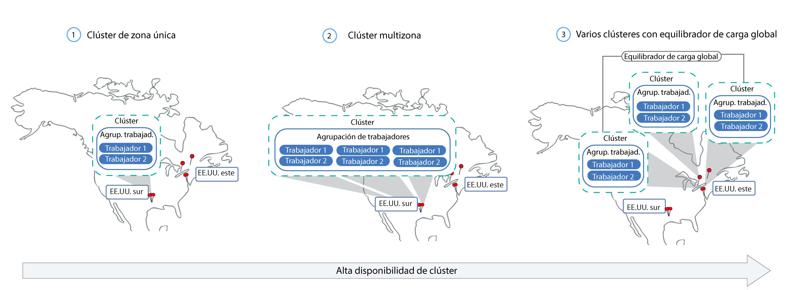

---

copyright:
  years: 2014, 2019
lastupdated: "2019-04-18"

keywords: kubernetes, iks, multi az, multi-az, szr, mzr

subcollection: containers

---

{:new_window: target="_blank"}
{:shortdesc: .shortdesc}
{:screen: .screen}
{:pre: .pre}
{:table: .aria-labeledby="caption"}
{:codeblock: .codeblock}
{:tip: .tip}
{:note: .note}
{:important: .important}
{:deprecated: .deprecated}
{:download: .download}


# Planificación de la configuración del clúster y del nodo trabajador
{: #plan_clusters}
Diseñe su clúster estándar de modo que obtenga la máxima disponibilidad y capacidad de su app con {{site.data.keyword.containerlong}}.
{: shortdesc}

## Clústeres de alta disponibilidad
{: #ha_clusters}

Si distribuye sus apps entre varios nodos trabajadores, zonas y clústeres, es menos probable que los usuarios experimenten un tiempo de inactividad del sistema. Características incorporadas como, por ejemplo, el aislamiento y el equilibrio de carga, incrementan la resiliencia con relación a posibles anomalías con hosts, redes o apps.
{: shortdesc}

Revise estas configuraciones potenciales de clústeres que están ordenadas por grados de disponibilidad en orden ascendente.



1. Un [clúster de una sola zona](#single_zone) con varios nodos trabajadores en una agrupación de nodos trabajadores.
2. Un [clúster multizona](#multizone) que abarca varios nodos trabajadores en varias zonas dentro de una región.
3. [Varios clústeres](#multiple_clusters) configurados entre zonas o regiones conectadas mediante un equilibrador de carga global.

## Clúster de una sola zona
{: #single_zone}

Para mejorar la disponibilidad de la app y permitir la migración tras error en el caso de que un nodo trabajador no esté disponible en el clúster, añada nodos trabajadores adicionales al clúster de una sola zona.
{: shortdesc}


De forma predeterminada, un clúster de una sola zona se configura con una agrupación de nodos trabajadores denominada `default`. La agrupación de nodos trabajadores agrupa los nodos trabajadores con la misma configuración, como por ejemplo el tipo de máquina, que ha definido durante la creación del clúster. Puede añadir más nodos trabajadores a su clúster [cambiando el tamaño de una agrupación de nodos trabajadores existente](/docs/containers?topic=containers-clusters#resize_pool) o [añadiendo una nueva agrupación de nodos trabajadores](/docs/containers?topic=containers-clusters#add_pool).

Cuando se añaden nodos trabajadores, las instancias de la app se pueden distribuir entre varios nodos trabajadores. Si un nodo trabajador queda inactivo, las instancias de la app de los nodos trabajadores disponibles continúan ejecutándose. Kubernetes vuelve a planificar automáticamente los pods de los nodos trabajadores no disponibles para garantizar el rendimiento y la capacidad de la app. Para asegurarse de que los pods están uniformemente distribuidos entre los nodos trabajadores, implemente la [afinidad de pod](https://kubernetes.io/docs/concepts/configuration/assign-pod-node/#inter-pod-affinity-and-anti-affinity-beta-feature).

**¿Puedo convertir un clúster de una sola zona en un clúster multizona?**</br>
Si el clúster se encuentra en una de las [ubicaciones metropolitanas multizona soportadas](/docs/containers?topic=containers-regions-and-zones#zones), sí. Consulte [Actualización de nodos trabajadores autónomos a agrupaciones de nodos trabajadores](/docs/containers?topic=containers-update#standalone_to_workerpool).


**¿Tengo que utilizar clústeres multizona?**</br>
No. Puede crear tantos clústeres de una sola zona como desee. De hecho, quizás prefiera clústeres de una sola zona para facilitar la gestión o si el clúster debe residir en una [ciudad de una sola zona](/docs/containers?topic=containers-regions-and-zones#zones) específica.

**¿Puedo tener un maestro de alta disponibilidad en una sola zona?**</br>
Sí. En una única zona, el maestro está altamente disponible e incluye réplicas en hosts físicos independientes para que el servidor de API de Kubernetes, etcd, el planificador y el gestor de controladores puedan protegerse frente a una interrupción como, por ejemplo, la actualización del maestro. Para protegerse frente a un error zonal, puede:
* [Crear un clúster en una zona con capacidad multizona](/docs/containers?topic=containers-plan_clusters#multizone), donde el maestro se disperse en zonas.
* [Crear varios clústeres](#multiple_clusters) y conectarlos con un equilibrador de carga global.

## Clúster multizona
{: #multizone}

Con {{site.data.keyword.containerlong_notm}}, puede crear clústeres multizona. Si distribuye sus apps entre varios nodos trabajadores y zonas mediante una agrupación de nodos trabajadores, es menos probable que los usuarios experimenten un tiempo de inactividad del sistema. Características incorporadas como, por ejemplo, el equilibrio de carga, incrementan la resiliencia frente a posibles anomalías de zona con hosts, redes o apps. Si caen los recursos de una zona, las cargas de trabajo del clúster siguen funcionando en las otras zonas.
{: shortdesc}

**¿Qué es una agrupación de nodos trabajadores?**</br>
Una agrupación de nodos trabajadores es una colección de nodos trabajadores que comparten alguna característica, como por ejemplo tipo de máquina, CPU y memoria. Cuando se crea un clúster, se crea automáticamente una agrupación de nodos trabajadores predeterminada. Para propagar los nodos trabajadores de la agrupación entre zonas, añadir nodos trabajadores a la agrupación o actualizar nodos trabajadores, puede utilizar los nuevos mandatos `ibmcloud ks worker-pool`.

**¿Puedo seguir utilizando nodos trabajadores autónomos?**</br>
La configuración de clúster anterior de nodos trabajadores estándares recibe soporte, pero ha quedado en desuso. Asegúrese de [añadir una agrupación de nodos trabajadores al clúster](/docs/containers?topic=containers-clusters#add_pool) y, a continuación,
[utilizar agrupaciones de trabajadores](/docs/containers?topic=containers-update#standalone_to_workerpool) para organizar los nodos trabajadores en lugar de los nodos trabajadores autónomos.

**¿Puedo convertir un clúster de una sola zona en un clúster multizona?**</br>
Si el clúster se encuentra en una de las [ubicaciones metropolitanas multizona soportadas](/docs/containers?topic=containers-regions-and-zones#zones), sí. Consulte [Actualización de nodos trabajadores autónomos a agrupaciones de nodos trabajadores](/docs/containers?topic=containers-update#standalone_to_workerpool).


### Más información sobre la configuración del clúster multizona
{: #mz_setup}


Puede añadir zonas adicionales al clúster para replicar los nodos trabajadores de las agrupaciones de nodos trabajadores entre varias zonas dentro de una región. Los clústeres multizona se han diseñado para planificar uniformemente los pods entre nodos trabajadores y zonas a fin de garantizar su disponibilidad y la recuperación de errores. Si los nodos trabajadores no se distribuyen uniformemente entre las zonas o si la capacidad es insuficiente en una de las zonas, es posible que el planificador de Kubernetes no planifique todos los pods solicitados. Como resultado, los pods podrían pasar a estar en estado **Pendiente** hasta que haya suficiente capacidad disponible. Si desea cambiar el comportamiento predeterminado para que el planificador de Kubernetes distribuya los pods entre zonas con una mejor distribución, utilice la [política de afinidad de pod](https://kubernetes.io/docs/concepts/configuration/assign-pod-node/#inter-pod-affinity-and-anti-affinity-beta-feature) `preferredDuringSchedulingIgnoredDuringExecution`.

**¿Por qué necesito nodos trabajadores en 3 zonas?** </br>
La distribución de la carga de trabajo entre 3 zonas garantiza una alta disponibilidad para la app en el caso de que una o dos zonas no estén disponibles, pero también hace que la configuración del clúster sea más rentable. ¿Por qué?, se preguntará. Este es un ejemplo.

Supongamos que necesita un nodo trabajador con 6 núcleos para manejar la carga de trabajo de su app. Para aumentar la disponibilidad del clúster, tiene las siguientes opciones:

- **Duplicar los recursos en otra zona:** esta opción le deja con 2 nodos trabajadores, cada uno con 6 núcleos en cada zona, lo que suma un total de 12 núcleos. </br>
- **Distribuir los recursos en 3 zonas:** con esta opción, despliega 3 núcleos por zona, lo que le deja con una capacidad total de 9 núcleos. Para manejar la carga de trabajo, siempre debe haber dos zonas activas. Si una zona no está disponible, las otras dos zonas pueden gestionar la carga de trabajo. Si dos zonas no están disponibles, los 3 núcleos restantes están activos para gestionar la carga de trabajo. El hecho de desplegar 3 núcleos por zona significa máquinas más pequeñas y, por lo tanto, menor coste.</br>

**¿Cómo se configura mi nodo maestro de Kubernetes?** </br>
Cuando se crea un clúster en una [ubicación metropolitana multizona](/docs/containers?topic=containers-regions-and-zones#zones), se despliega automáticamente un maestro de Kubernetes de alta disponibilidad y se distribuyen tres réplicas por las zonas de la ubicación metropolitana. Por ejemplo, si el clúster está en las zonas `dal10`, `dal12` o `dal13`, las réplicas del nodo maestro de Kubernetes se distribuyen en cada zona de la ciudad metropolitana multizona de Dallas.

**¿Qué sucede si el nodo maestro de Kubernetes deja de estar disponible?** </br>
El [nodo maestro de Kubernetes](/docs/containers?topic=containers-ibm-cloud-kubernetes-service-technology#architecture) es el componente principal que mantiene el clúster en funcionamiento. El nodo maestro almacena los recursos de clúster y sus configuraciones en la base de datos etcd, que sirve como único punto fiable para el clúster. El servidor de API de Kubernetes es el punto de entrada principal para todas las solicitudes de gestión del clúster procedentes de los nodos trabajadores destinadas al nodo maestro, o cuando desea interactuar con los recursos de clúster.<br><br>Si se produce un fallo del nodo maestro, las cargas de trabajo siguen ejecutándose en los nodos trabajadores, pero no se pueden utilizar mandatos `kubectl` para trabajar con los recursos del clúster o ver el estado del clúster hasta que el servidor de API de Kubernetes del nodo maestro vuelve a estar activo. Si un pod cae durante la interrupción del nodo maestro, el pod no se puede volver a planificar hasta que el nodo trabajador pueda volver a acceder al servidor de API de Kubernetes.<br><br>Durante una interrupción del nodo maestro, todavía puede ejecutar mandatos `ibmcloud ks` en la API de {{site.data.keyword.containerlong_notm}} para trabajar con los recursos de la infraestructura, como nodos trabajadores o VLAN. Si cambia la configuración actual del clúster añadiendo o eliminando nodos trabajadores en el clúster, los cambios no se producen hasta que el nodo maestro vuelve a estar activo.

No reinicie o rearranque un nodo trabajador durante una interrupción del nodo maestro. Esta acción elimina los pods del nodo trabajador. Puesto que el servidor de API de Kubernetes no está disponible, los pods no se pueden volver a programar en otros nodos trabajadores del clúster.
{: important}


Para proteger el clúster frente a un error del nodo maestro de Kubernetes o en regiones en las que no hay clústeres multizona disponibles, puede [configurar varios clústeres y conectarlos con un equilibrador de carga global](#multiple_clusters).

**¿Tengo que hacer algo para que el nodo maestro se pueda comunicar con los trabajadores entre zonas?**</br>
Sí. Si tiene varias VLAN para un clúster, varias subredes en la misma VLAN o un clúster multizona, debe habilitar la [función de direccionador virtual (VRF)](/docs/infrastructure/direct-link?topic=direct-link-overview-of-virtual-routing-and-forwarding-vrf-on-ibm-cloud#overview-of-virtual-routing-and-forwarding-vrf-on-ibm-cloud) para la cuenta de infraestructura de IBM Cloud (SoftLayer) para que los nodos trabajadores puedan comunicarse entre sí en la red privada. Para habilitar VRF, [póngase en contacto con el representante de su cuenta de la infraestructura de IBM Cloud (SoftLayer)](/docs/infrastructure/direct-link?topic=direct-link-overview-of-virtual-routing-and-forwarding-vrf-on-ibm-cloud#how-you-can-initiate-the-conversion). Si no puede o no desea habilitar VRF, habilite la [expansión de VLAN](/docs/infrastructure/vlans?topic=vlans-vlan-spanning#vlan-spanning). Para llevar a cabo esta acción, necesita el [permiso de la infraestructura](/docs/containers?topic=containers-users#infra_access) **Red > Gestionar expansión de VLAN de red** o bien puede solicitar al propietario de la cuenta que lo habilite. Para comprobar si la expansión de VLAN ya está habilitada, utilice el [mandato](/docs/containers?topic=containers-cs_cli_reference#cs_vlan_spanning_get) `ibmcloud ks vlan-spanning-get`.

**¿Cómo puedo permitir que mis usuarios accedan a mi app desde Internet pública?**</br>
Puede exponer sus apps utilizando un equilibrador de carga de aplicación (ALB) de Ingress o un servicio equilibrador de carga.

- **Equilibrador de carga de aplicación (ALB) de Ingress** de forma predeterminada, los ALB públicos se crean y se habilitan automáticamente en cada zona del clúster. También se crea y se despliega automáticamente un equilibrador de carga multizona (MZLB) de Cloudflare para el clúster, de forma que exista 1 MZLB para cada región. El MZLB coloca las direcciones IP de los ALB detrás del mismo nombre de host y habilita las comprobaciones de estado en estas direcciones IP para determinar si están disponibles o no. Por ejemplo, si tiene nodos trabajadores en 3 zonas en la región EE. UU. este, el nombre de host `yourcluster.us-east.containers.appdomain.cloud` tiene 3 direcciones IP de ALB. El estado de MZLB comprueba la IP de ALB pública en cada zona de una región y mantiene actualizados los resultados de la búsqueda de DNS en función de estas comprobaciones de estado. Para obtener más información, consulte [Componentes y arquitectura de Ingress](/docs/containers?topic=containers-ingress#planning).

- **Servicios de equilibrador de carga:** los servicios del equilibrador de carga se configuran en una sola zona. Las solicitudes de entrada a la app se direccionan desde esa zona a todas las instancias de la app de otras zonas. Si esta zona deja de estar disponible, es posible que no se pueda acceder a la app desde Internet. Puede configurar servicios de equilibrador de carga adicionales en otras zonas como ayuda frente a un error de una sola zona. Para obtener más información, consulte [servicios del equilibrador de carga](/docs/containers?topic=containers-loadbalancer#multi_zone_config) de alta disponibilidad.

**¿Puedo configurar el almacenamiento persistente para mi clúster multizona?**</br>
Para el almacenamiento persistente de alta disponibilidad, utilice un servicio de nube, como por ejemplo [{{site.data.keyword.cloudant_short_notm}}](/docs/services/Cloudant?topic=cloudant-getting-started#getting-started) o [{{site.data.keyword.cos_full_notm}}](/docs/services/cloud-object-storage?topic=cloud-object-storage-about#about). También puede probar una solución de almacenamiento definido por software (SDS), como por ejemplo [Portworx](/docs/containers?topic=containers-portworx#portworx), que utiliza [máquinas SDS](#sds). Para obtener más información, consulte [Comparación entre opciones de almacenamiento persistente para clústeres multizona](/docs/containers?topic=containers-storage_planning#persistent_storage_overview).

El archivo NFS y el almacenamiento en bloque no se puede compartir entre zonas. Los volúmenes persistentes solo se pueden utilizar en la zona en la que se encuentra el dispositivo de almacenamiento real. Si tiene un archivo NFS o un almacenamiento en bloque existente en el clúster que desea seguir utilizando, debe aplicar las etiquetas de región y zona a los volúmenes persistentes existentes. Estas etiquetas ayudan a kube-scheduler a determinar dónde se debe planificar una app que utiliza un volumen persistente. Ejecute el mandato siguiente y sustituya `<mycluster>` por el nombre del clúster.

```
bash <(curl -Ls https://raw.githubusercontent.com/IBM-Cloud/kube-samples/master/file-pv-labels/apply_pv_labels.sh) <mycluster>
```
{: pre}

**He creado mi clúster multizona. ¿Por qué sigue habiendo una sola zona? ¿Cómo se añaden zonas a mi clúster?**</br>
Si [crea el clúster multizona con la CLI](/docs/containers?topic=containers-clusters#clusters_cli), el clúster se crea, pero debe añadir zonas a la agrupación de nodos trabajadores para completar el proceso. Para abarcar varias zonas, el clúster debe estar en una [ubicación metropolitana multizona](/docs/containers?topic=containers-regions-and-zones#zones). Para añadir una zona al clúster y distribuir los nodos trabajadores entre las zonas, consulte [Adición de una zona a un clúster](/docs/containers?topic=containers-clusters#add_zone).

### ¿Cómo va a cambiar la forma en la que gestiono actualmente mis clústeres?
{: #mz_new_ways}

Con la introducción de las agrupaciones de nodos trabajadores, puede utilizar un nuevo conjunto de API y mandatos para gestionar el clúster. Puede ver estos nuevos mandatos en la [página de documentación de la CLI](/docs/containers?topic=containers-cs_cli_reference#cs_cli_reference) o en el terminal ejecutando `ibmcloud ks help`.
{: shortdesc}

En la tabla siguiente se comparan los métodos antiguos y los nuevos para unas cuantas acciones comunes de gestión de clústeres.
<table summary="En la tabla se muestra la descripción de la nueva forma de ejecutar mandatos multizona. Las filas se leen de izquierda a derecha; la descripción está en la columna uno, el método antiguo en la dos y el nuevo método multizona en la tres.">
<caption>Nuevos métodos para mandatos de la agrupación de nodos trabajadores multizona.</caption>
  <thead>
  <th>Descripción</th>
  <th>Nodos trabajadores autónomos antiguos</th>
  <th>Nuevas agrupaciones de nodos trabajadores multizona</th>
  </thead>
  <tbody>
    <tr>
    <td>Añadir nodos trabajadores al clúster.</td>
    <td><p class="deprecated"><code>ibmcloud ks worker-add</code> para añadir nodos trabajadores autónomos.</p></td>
    <td><ul><li>Para añadir tipos de máquina distintos de la agrupación existente, cree una nueva agrupación de nodos trabajadores: [mandato](/docs/containers?topic=containers-cs_cli_reference#cs_worker_pool_create) <code>ibmcloud ks worker-pool-create</code>.</li>
    <li>Para añadir nodos trabajadores a una agrupación existente, cambie el número de nodos por zona en la agrupación: [mandato](/docs/containers?topic=containers-cs_cli_reference#cs_worker_pool_resize) <code>ibmcloud ks worker-pool-resize</code>.</li></ul></td>
    </tr>
    <tr>
    <td>Eliminar nodos trabajadores del clúster.</td>
    <td><code>ibmcloud ks worker-rm</code>, que aún se puede utilizar para suprimir del clúster un nodo trabajador problemático.</td>
    <td><ul><li>Si la agrupación de nodos trabajadores no está equilibrada, por ejemplo después de eliminar un nodo trabajador, vuélvala a equilibrar: [mandato](/docs/containers?topic=containers-cs_cli_reference#cs_rebalance) <code>ibmcloud ks worker-pool-rebalance</code>.</li>
    <li>Para reducir el número de nodos trabajadores de una agrupación, cambie el número por zona (el valor mínimo es 1): [mandato](/docs/containers?topic=containers-cs_cli_reference#cs_worker_pool_resize) <code>ibmcloud ks worker-pool-resize</code>.</li></ul></td>
    </tr>
    <tr>
    <td>Utilizar una nueva VLAN para los nodos trabajadores.</td>
    <td><p class="deprecated">Añada un nuevo nodo trabajador que utilice la nueva VLAN privada o pública: <code>ibmcloud ks worker-add</code>.</p></td>
    <td>Establecer la agrupación de nodos trabajadores que modo que utilice una VLAN pública o privada distinta de la que se utilizaba anteriormente: [mandato](/docs/containers?topic=containers-cs_cli_reference#cs_zone_network_set) <code>ibmcloud ks zone-network-set</code>.</td>
    </tr>
  </tbody>
  </table>

## Varios clústeres conectados con un equilibrador de carga global
{: #multiple_clusters}

Para proteger la app frente a un error del nodo maestro de Kubernetes y para las regiones en las que no están disponibles los clústeres multizona, puede crear varios clústeres en diferentes zonas de una región y conectarlos con un equilibrador de carga global.
{: shortdesc}


Para equilibrar la carga de trabajo entre varios clústeres, debe configurar un equilibrador de carga global y añadir las direcciones IP de los equilibradores de carga de aplicación (ALB) o los servicios del equilibrador de carga a su dominio. Al añadir estas direcciones IP, puede direccionar el tráfico de entrada entre los clústeres. Para que el equilibrador de carga global detecte si uno de los clústeres deja de estar disponible, tenga en cuenta la posibilidad de añadir una comprobación de estado basada en ping a cada dirección IP. Cuando se configura esta comprobación, el proveedor de DNS ejecuta ping de forma regular sobre las direcciones IP que ha añadido a su dominio. Si una dirección IP deja de estar disponible, el tráfico ya no se envía a esta dirección IP. Sin embargo, Kubernetes no reinicia automáticamente los pods del clúster no disponible en los nodos trabajadores de los clústeres disponibles. Si desea que Kubernetes reinicie automáticamente los pods en los clústeres disponibles, tenga en cuenta la posibilidad de configurar un [clúster multizona](#multizone).

**¿Por qué necesito 3 clústeres en 3 zonas?** </br>
De forma similar a cómo se utilizan [3 zonas en clústeres multizona](#multizone), puede proporcionar más disponibilidad a su app si configura 3 clústeres entre zonas. También puede reducir los costes ya que necesitará máquinas más pequeñas para gestionar la carga de trabajo.

**¿Qué pasa si deseo configurar varios clústeres entre regiones?** </br>
Puede configurar varios clústeres en distintas regiones de una geolocalización (como EE. UU. sur y EE. UU. este) o entre geolocalizaciones (como, por ejemplo, EE. UU. sur y UE central). Ambas configuraciones ofrecen el mismo nivel de disponibilidad para la app, pero también añaden complejidad cuando se trata de compartición de datos y réplica de datos. En la mayoría de los casos, resulta suficiente permanecer dentro de la misma geolocalización. Pero, si tiene usuarios en todo el mundo, es posible que sea mejor configurar un clúster donde se encuentren los usuarios, de forma que los usuarios no experimentan tiempos de espera largos cuando envían una solicitud a la app.

**Para configurar un equilibrador de carga global para varios clústeres:**

1. [Cree clústeres](/docs/containers?topic=containers-clusters#clusters) en varias zonas o regiones.
2. Si tiene varias VLAN para un clúster, varias subredes en la misma VLAN o un clúster multizona, debe habilitar la [función de direccionador virtual (VRF)](/docs/infrastructure/direct-link?topic=direct-link-overview-of-virtual-routing-and-forwarding-vrf-on-ibm-cloud#overview-of-virtual-routing-and-forwarding-vrf-on-ibm-cloud) para la cuenta de infraestructura de IBM Cloud (SoftLayer) para que los nodos trabajadores puedan comunicarse entre sí en la red privada. Para habilitar VRF, [póngase en contacto con el representante de su cuenta de la infraestructura de IBM Cloud (SoftLayer)](/docs/infrastructure/direct-link?topic=direct-link-overview-of-virtual-routing-and-forwarding-vrf-on-ibm-cloud#how-you-can-initiate-the-conversion). Si no puede o no desea habilitar VRF, habilite la [expansión de VLAN](/docs/infrastructure/vlans?topic=vlans-vlan-spanning#vlan-spanning). Para llevar a cabo esta acción, necesita el [permiso de la infraestructura](/docs/containers?topic=containers-users#infra_access) **Red > Gestionar expansión de VLAN de red** o bien puede solicitar al propietario de la cuenta que lo habilite. Para comprobar si la expansión de VLAN ya está habilitada, utilice el [mandato](/docs/containers?topic=containers-cs_cli_reference#cs_vlan_spanning_get) `ibmcloud ks vlan-spanning-get`.
3. En cada clúster, exponga la app utilizando un [equilibrador de carga de aplicación (ALB)](/docs/containers?topic=containers-ingress#ingress_expose_public) o un [servicio equilibrador de carga](/docs/containers?topic=containers-loadbalancer).
4. Para cada clúster, obtenga una lista de las direcciones IP públicas correspondientes a los ALB o a los servicios equilibradores de carga.
   - Para obtener una lista de la dirección IP de todos los ALB públicos habilitados en el clúster:
     ```
     ibmcloud ks albs --cluster <cluster_name_or_id>
     ```
     {: pre}

   - Para obtener una lista de las direcciones IP del servicio equilibrador de carga:
     ```
     kubectl describe service <myservice>
     ```
     {: pre}

     La dirección IP de **Load Balancer Ingress** es la dirección IP portátil asignada al servicio equilibrador de carga.

4.  Configure un equilibrador de carga global utilizando {{site.data.keyword.Bluemix_notm}} Internet Services (CIS) o configure su propio equilibrador de carga global.

    **Para utilizar un equilibrador de carga global de CIS**:
    1.  Configure el servicio siguiendo los pasos 1 - 5 del apartado [Iniciación a {{site.data.keyword.Bluemix_notm}} Internet Services (CIS)](/docs/infrastructure/cis?topic=cis-getting-started#getting-started). Estos pasos le guían por el proceso de suministro de la instancia de servicio, de adición del dominio de la app, de configuración de los servidores de nombres y de creación de registros de DNS. Cree un registro DNS para cada ALB o dirección IP del equilibrador de carga que haya recopilado. Estos registros DNS correlacionan el dominio de la app con todos los ALB del clúster o los equilibradores de carga y garantizan que las solicitudes destinadas al dominio de la app se reenvían a los clústeres en un ciclo en rueda.
    2. [Añada comprobaciones de estado](/docs/infrastructure/cis?topic=cis-set-up-and-configure-your-load-balancers#add-a-health-check) para los ALB o equilibradores de carga. Puede utilizar la misma comprobación de estado para los ALB o los equilibradores de carga de todos los clústeres, o bien puede crear comprobaciones de estado específicas que se utilizarán para clústeres específicos.
    3. [Añada una agrupación de origen](/docs/infrastructure/cis?topic=cis-set-up-and-configure-your-load-balancers#add-a-pool) para cada clúster añadiendo el ALB o las direcciones IP del equilibrador de carga del clúster. Por ejemplo, si tiene 3 clústeres y cada uno de ellos tiene 2 ALB, cree 3 agrupaciones de origen que tengan 2 direcciones IP de ALB. Añada una comprobación de estado a cada agrupación de origen que cree.
    4. [Añada un equilibrador de carga global](/docs/infrastructure/cis?topic=cis-set-up-and-configure-your-load-balancers#set-up-and-configure-your-load-balancers).

    **Para utilizar su propio equilibrador de carga global**:
    1. Configure el dominio de modo que direccione el tráfico de entrada a los servicios ALB o de equilibrador de carga añadiendo las direcciones IP de todos los ALB públicos habilitados y de los servicios del equilibrador de carga a su dominio.
    2. Para cada dirección IP, habilite una comprobación de estado basada en ping para que el proveedor de DNS pueda detectar direcciones IP en mal estado. Si se detecta una dirección IP en mal estado, el tráfico deja de direccionarse a dicha dirección IP.

## Clústeres privados
{: #private_clusters}

De forma predeterminada, {{site.data.keyword.containerlong_notm}} configura el clúster con acceso a una VLAN privada y a una VLAN pública. La VLAN privada determina la dirección IP privada que se asigna a cada nodo trabajador, lo que proporciona a cada nodo trabajador una interfaz de red privada. La VLAN pública permite que los nodos trabajadores se conecten de forma automática y segura con el maestro.
{: shortdesc}

Sin embargo, es posible que desee crear una VLAN privada o un clúster de punto final de servicio privado para los requisitos de seguridad o de conformidad. Las opciones para crear un clúster privado dependen del tipo de cuenta de infraestructura de IBM Cloud (SoftLayer) que tenga y de la configuración de VLAN pública y privada que desee. Para obtener más información sobre cada una de las configuraciones siguientes, consulte [Planificación de la red de clúster](/docs/containers?topic=containers-cs_network_ov).

¿Tiene un clúster existente que desea convertir en solo privado? Para ver cómo puede añadir agrupaciones de nodos trabajadores o modificar agrupaciones de nodos trabajadores existentes con las nuevas VLAN, consulte [Cambio de las conexiones de VLAN de nodos trabajadores](/docs/containers?topic=containers-cs_network_cluster#change-vlans).
{: note}

**Cuenta habilitada para VRF, nodo maestro de Kubernetes privado, nodos trabajadores en VLAN tanto pública como privada**</br>
En clústeres que ejecutan Kubernetes versión 1.11 o posteriores, puede configurar la red de clúster para que utilice puntos finales de servicio públicos y privados. Después de habilitar el punto final de servicio privado, el nodo maestro de Kubernetes y los nodos trabajadores siempre se comunican sobre la VLAN privada a través del punto final de servicio privado. Aunque habilite el punto final de servicio público para el clúster, la comunicación entre el maestro de Kubernetes y los nodos trabajadores permanece en la VLAN privada. Después de habilitar el punto final de servicio privado, no puede inhabilitarlo. Puede conservar el punto final de servicio público para el acceso seguro al nodo maestro de Kubernetes a través de Internet, por ejemplo para ejecutar mandatos `kubectl`, o puede inhabilitar el punto final de servicio público para un clúster solo de punto final de servicio privado.

**Cuenta no VRF o habilitada para VRF, nodos maestro y trabajadores de Kubernetes solo en VLAN privada**</br>
Si configura los nodos trabajadores solo en una VLAN privada, los nodos trabajadores no pueden exponer automáticamente sus servicios de app en la red pública, y en una cuenta no VRF tampoco se puede conectar con el nodo maestro. Debe configurar un dispositivo de pasarela para proporcionar conectividad de red entre los nodos trabajadores y el maestro.

Para cuentas que no VRF: Si crea el clúster con VLAN tanto pública como privada, no podrá eliminar posteriormente las VLAN públicas de dicho clúster. La eliminación de todas las VLAN públicas de un clúster hace que varios componentes del clúster dejen de funcionar. Cree en su lugar un nuevo clúster sin la VLAN pública.
{: note}

**Cuenta no VRF, nodo maestro y nodos trabajadores de Kubernetes en VLAN tanto pública como privada**</br>
En la mayoría de los casos, la configuración del clúster puede incluir nodos trabajadores en VLAN tanto públicas como privadas. A continuación, puede bloquear el clúster bloqueando el tráfico de VLAN pública con políticas de Calico y restringiendo el tráfico a determinados nodos de extremo.

## Agrupaciones de nodos trabajadores y nodos trabajadores
{: #planning_worker_nodes}

Un clúster de Kubernetes está formado por nodos trabajadores agrupados en agrupaciones de nodos trabajadores y se supervisa y se gestiona de forma centralizada desde el nodo maestro de Kubernetes. Los administradores del clúster deciden cómo configurar el clúster de nodos trabajadores para garantizar que los usuarios del clúster disponen de todos los recursos para desplegar y ejecutar las apps en el clúster.
{:shortdesc}

Cuando se crea un clúster estándar, se solicitan los nodos trabajadores de las mismas especificaciones de memoria, CPU y espacio de disco (tipo) en la infraestructura de IBM Cloud (SoftLayer) en su nombre y se añaden a la agrupación predeterminada de nodos trabajadores del clúster. A cada nodo trabajador se la asigna un ID exclusivo y un nombre de dominio que no se debe cambiar después de haber creado el clúster. Puede elegir entre servidores virtuales o físicos (nativos). En función del nivel de aislamiento de hardware que elija, los nodos trabajadores virtuales se pueden configurar como nodos compartidos o dedicados. Para añadir distintos tipos al clúster, [cree otra agrupación de nodos trabajadores](/docs/containers?topic=containers-cs_cli_reference#cs_worker_pool_create).

Kubernetes limita el número máximo de nodos trabajadores que puede tener en un clúster. Consulte el apartado sobre [nodo trabajador y cuotas de pod ](https://kubernetes.io/docs/setup/cluster-large/) para obtener más información.


¿Desea asegurarse de que siempre tiene suficientes nodos trabajadores para cubrir la carga de trabajo? Pruebe nuestro [programa de escalado automático de clústeres](/docs/containers?topic=containers-ca#ca).
{: tip}

<br />


## Hardware disponible para los nodos trabajadores
{: #shared_dedicated_node}

Cuando se crea un clúster estándar en {{site.data.keyword.Bluemix_notm}}, se selecciona si las agrupaciones de trabajadores constan de nodos trabajadores que son máquinas físicas (nativas) o máquinas virtuales que se ejecutan en hardware físico. También se selecciona el tipo de nodo trabajador, la combinación de memoria, la CPU y otras especificaciones de la máquina, como el almacenamiento de disco.
{:shortdesc}


Si desea más de un tipo de nodo trabajador, debe crear una agrupación de trabajadores para cada tipo. No puede cambiar el tamaño de los nodos trabajadores existentes para tener recursos diferentes, como por ejemplo CPU o memoria. Cuando se crea un clúster gratuito, el nodo trabajador se suministra automáticamente como nodo compartido virtual en la cuenta de infraestructura de IBM Cloud (SoftLayer). En clústeres estándares, puede elegir el tipo de máquina que funcione mejor para su carga de trabajo. A medida que lo planifique, tenga en cuenta las
[reservas de recursos de nodos trabajadores](#resource_limit_node) en la capacidad total de CPU y memoria.

Puede desplegar clústeres mediante la [interfaz de usuario de la consola](/docs/containers?topic=containers-clusters#clusters_ui) o la [CLI](/docs/containers?topic=containers-clusters#clusters_cli).

Seleccione una de las opciones siguientes para decidir el tipo de agrupación de trabajadores que desea.
* [Máquinas virtuales](#vm)
* [Máquinas físicas (nativas)](#bm)
* [Máquinas de almacenamiento definido por software (SDS)](#sds)

### Máquinas virtuales
{: #vm}

Las máquinas virtuales ofrecen una mayor flexibilidad, unos tiempos de suministro más reducidos y proporcionan más características automáticas de escalabilidad que las máquinas nativas, a un precio más reducido. Utilice máquinas virtuales en los casos de uso con un propósito más general como, por ejemplo, en entornos de desarrollo y pruebas, entornos de transferencia y producción, microservicios y apps empresariales. Sin embargo, deberá encontrar un compromiso con su rendimiento. Si necesita un alto rendimiento de cálculo con cargas de trabajo intensivas de RAM, datos o GPU, utilice [máquinas nativas](#bm).
{: shortdesc}

**¿Quiero utilizar hardware compartido o dedicado?**</br>
Cuando se crea un clúster virtual estándar, debe seleccionar si desea que el hardware subyacente se comparta entre varios clientes de {{site.data.keyword.IBM_notm}} (tenencia múltiple) o se le dedique a usted exclusivamente (tenencia única).

* **En una configuración de hardware compartido multiarrendatario**: los recursos físicos, como la CPU y la memoria, se comparten en todas las máquinas virtuales desplegadas en el mismo hardware físico. Para asegurarse de que cada máquina virtual se pueda ejecutar de forma independiente, un supervisor de máquina virtual, también conocido como hipervisor, segmenta los recursos físicos en entidades aisladas y los asigna como recursos dedicados a una máquina virtual (aislamiento de hipervisor).
* **En una configuración de hardware de único arrendatario**: todos los recursos físicos están dedicados únicamente a usted. Puede desplegar varios nodos trabajadores como máquinas virtuales en el mismo host físico. De forma similar a la configuración de tenencia múltiple,
el hipervisor asegura que cada nodo trabajador recibe su parte compartida de los recursos físicos disponibles.

Los nodos compartidos suelen resultar más económicos que los nodos dedicados porque los costes del hardware subyacente se comparten entre varios clientes. Sin embargo, cuando decida entre nodos compartidos y dedicados, debe ponerse en contacto con el departamento legal y ver el nivel de aislamiento y de conformidad de la infraestructura que necesita el entorno de app.

Algunos tipos solo están disponibles para un tipo de configuración de arrendamiento. Por ejemplo, las máquinas virtuales `m3c`
solo están disponibles como configuración de arrendamiento `compartido`.
{: note}

**¿Cuáles son las características generales de las máquinas virtuales?**</br>
Las máquinas virtuales utilizan el disco local en lugar de la red de área de almacenamiento (SAN) por motivos de fiabilidad. Entre las ventajas de fiabilidad se incluyen un mejor rendimiento al serializar bytes en el disco local y una reducción de la degradación del sistema de archivos debido a anomalías de la red. Todas las máquinas virtuales se suministran con velocidad de red de 1000 Mbps, 25 GB de almacenamiento en disco local primario para el sistema de archivos del sistema operativo y 100 GB de almacenamiento en disco local secundario para datos como, por ejemplo, el tiempo de ejecución de contenedor y `kubelet`. El almacenamiento local en el nodo trabajador solo es para el proceso a corto plazo y los discos primario y secundario se limpian cuando se actualiza o se vuelve a cargar el nodo trabajador. Para ver las soluciones de almacenamiento persistente, consulte [Planificación de almacenamiento persistente altamente disponible](/docs/containers?topic=containers-storage_planning#storage_planning).

**¿Qué hago si tengo tipos de máquina más antiguos?**</br>
Si en su clúster hay tipos de nodo trabajador en desuso, como `x1c` o el más antiguo `x2c` de Ubuntu 16, puede [actualizar el clúster para que tenga nodos trabajadores `x3c` de Ubuntu 18 ](/docs/containers?topic=containers-update#machine_type).

**¿Qué tipos de máquina virtual están disponibles?**</br>
Los tipos de nodos trabajadores varían según la zona. En la tabla siguiente se incluye la versión más reciente de un tipo, como por ejemplo los nodos trabajadores `x3c` de Ubuntu 18, en lugar de los tipos de nodo trabajador más antiguos, `x2c` de Ubuntu 16. Para ver los tipos de máquinas disponibles en su zona, ejecute `ibmcloud ks machine-types <zone>`. También puede consultar los tipos de máquina [nativa](#bm) o [SDS](#sds) disponibles.

{: #vm-table}
<table>
<caption>Tipos de máquina virtual disponibles en {{site.data.keyword.containerlong_notm}}.</caption>
<thead>
<th>Nombre y caso de uso</th>
<th>Núcleos / Memoria</th>
<th>Disco primario / secundario</th>
<th>Velocidad de red</th>
</thead>
<tbody>
<tr>
<td><strong>Virtual, u3c.2x4</strong>: Utilice esta máquina virtual con el tamaño más reducido para realizar pruebas rápidas, pruebas de conceptos y ejecutar otras cargas ligeras.</td>
<td>2 / 4 GB</td>
<td>25 GB / 100 GB</td>
<td>1000 Mbps</td>
</tr>
<tr>
<td><strong>Virtual, b3c.4x16</strong>: Seleccione esta máquina virtual equilibrada para realizar pruebas y desarrollo, y para otras cargas de trabajo ligeras.</td>
<td>4 / 16 GB</td>
<td>25 GB / 100 GB</td>
<td>1000 Mbps</td>
</tr>
<tr>
<td><strong>Virtual, b3c.16x64</strong>: Seleccione esta máquina virtual equilibrada para cargas de trabajo de tamaño medio.</td></td>
<td>16 / 64 GB</td>
<td>25 GB / 100 GB</td>
<td>1000 Mbps</td>
</tr>
<tr>
<td><strong>Virtual, b3c.32x128</strong>: Seleccione esta máquina virtual equilibrada para cargas de trabajo de tamaño medio a grande, por ejemplo, como base de datos y sitio web dinámico con muchos usuarios simultáneos.</td>
<td>32 / 128 GB</td>
<td>25 GB / 100 GB</td>
<td>1000 Mbps</td>
</tr>
<tr>
<td><strong>Virtual, b3c.56x242</strong>: Seleccione esta máquina virtual equilibrada para cargas de trabajo grandes, por ejemplo, como base de datos y para varias apps con muchos usuarios simultáneos.</td>
<td>56 / 242 GB</td>
<td>25 GB / 100 GB</td>
<td>1000 Mbps</td>
</tr>
<tr>
<td><strong>Virtual, c3c.16x16</strong>: Utilice este tipo cuando desee un equilibrio uniforme de recursos de cálculo del nodo trabajador para cargas de trabajo ligeras.</td>
<td>16 / 16 GB</td>
<td>25 GB / 100 GB</td>
<td>1000 Mbps</td>
</tr><tr>
<td><strong>Virtual, c3c.16x32</strong>: Utilice este tipo cuando desee una proporción de 1:2 entre recursos de CPU y de memoria del nodo trabajador para cargas de trabajo de tamaño medio.</td>
<td>16 / 32 GB</td>
<td>25 GB / 100 GB</td>
<td>1000 Mbps</td>
</tr><tr>
<td><strong>Virtual, c3c.32x32</strong>: Utilice este tipo cuando desee un equilibrio uniforme de recursos de cálculo del nodo trabajador para cargas de trabajo de tamaño medio.</td>
<td>32 / 32 GB</td>
<td>25 GB / 100 GB</td>
<td>1000 Mbps</td>
</tr><tr>
<td><strong>Virtual, c3c.32x64</strong>: Utilice este tipo cuando desee una proporción de 1:2 entre recursos de CPU y de memoria del nodo trabajador para cargas de trabajo de tamaño medio.</td>
<td>32 / 64 GB</td>
<td>25 GB / 100 GB</td>
<td>1000 Mbps</td>
</tr>
<tr>
<td><strong>Virtual, m3c.8x64</strong>: Utilice este tipo cuando desee una proporción de 1:8 de recursos de CPU y memoria para cargas de trabajo entre ligeras y medianas que necesitan más memoria, como por ejemplo bases de datos como {{site.data.keyword.Db2_on_Cloud_short}}. Solo está disponible en Dallas y como arrendamiento de `hardware compartido`.</td>
<td>8 / 64 GB</td>
<td>25 GB / 100 GB</td>
<td>1000 Mbps</td>
</tr><tr>
<td><strong>Virtual, m3c.16x128</strong>: Utilice este tipo cuando desee una proporción de 1:8 de recursos de CPU y memoria para cargas de trabajo medianas que necesitan más memoria, como por ejemplo bases de datos como {{site.data.keyword.Db2_on_Cloud_short}}. Solo está disponible en Dallas y como arrendamiento de `hardware compartido`.</td>
<td>16 / 128 GB</td>
<td>25 GB / 100 GB</td>
<td>1000 Mbps</td>
</tr><tr>
<td><strong>Virtual, m3c.30x240</strong>: Utilice este tipo cuando desee una proporción de 1:8 de recursos de CPU y memoria para cargas de trabajo entre medianas y grandes que necesitan más memoria, como por ejemplo bases de datos como {{site.data.keyword.Db2_on_Cloud_short}}. Solo está disponible en Dallas y como arrendamiento de `hardware compartido`.</td>
<td>30 / 240 GB</td>
<td>25 GB / 100 GB</td>
<td>1000 Mbps</td>
</tr><tr>
<td><strong>Virtual, m3c.48x384</strong>: Utilice este tipo cuando desee una proporción de 1:8 de recursos de CPU y memoria para cargas de trabajo entre medianas y grandes que necesitan más memoria, como por ejemplo bases de datos como {{site.data.keyword.Db2_on_Cloud_short}}. Solo está disponible como arrendamiento de `--hardware shared`.</td>
<td>48 / 384 GB</td>
<td>25 GB / 100 GB</td>
<td>1000 Mbps</td>
</tr><tr>
<td><strong>Virtual, m3c.56x448</strong>: Utilice este tipo cuando desee una proporción de 1:8 de recursos de CPU y memoria para cargas de trabajo de gran tamaño que necesitan más memoria, como por ejemplo bases de datos como {{site.data.keyword.Db2_on_Cloud_short}}. Solo está disponible como arrendamiento de `--hardware shared`.</td>
<td>56 / 448 GB</td>
<td>25 GB / 100 GB</td>
<td>1000 Mbps</td>
</tr><tr>
<td><strong>Virtual, m3c.64x512</strong>: Utilice este tipo cuando desee una proporción de 1:8 de recursos de CPU y memoria para cargas de trabajo de gran tamaño que necesitan más memoria, como por ejemplo bases de datos como {{site.data.keyword.Db2_on_Cloud_short}}. Solo está disponible como arrendamiento de `--hardware shared`.</td>
<td>64 / 512 GB</td>
<td>25 GB / 100 GB</td>
<td>1000 Mbps</td>
</tr>
</tbody>
</table>

### Máquinas físicas (nativas)
{: #bm}

Puede suministrar el nodo trabajador como un servidor físico de arrendatario único, también conocido como nativo.
{: shortdesc}

**¿En qué se diferencian las máquinas nativas de las máquinas virtuales?**</br>
Los servidores nativos ofrecen acceso directo a los recursos físicos en la máquina, como la memoria o la CPU. Esta configuración elimina el hipervisor de máquina virtual que asigna recursos físicos a máquinas virtuales que se ejecutan en el host. En su lugar, todos los recursos de una máquina nativa están dedicados exclusivamente al trabajador, por lo que no es necesario preocuparse por "vecinos ruidosos" que compartan recursos o ralenticen el rendimiento. Los tipos de máquina física tienen más almacenamiento local que virtual, y algunos tienen RAID para aumentar la disponibilidad de los datos. El almacenamiento local en el nodo trabajador solo es para el proceso a corto plazo y los discos primario y secundario se limpian cuando se actualiza o se vuelve a cargar el nodo trabajador. Para ver las soluciones de almacenamiento persistente, consulte [Planificación de almacenamiento persistente altamente disponible](/docs/containers?topic=containers-storage_planning#storage_planning).

**Además de mejores especificaciones para el rendimiento, ¿puedo conseguir algo con las máquinas nativas que no pueda con las máquinas virtuales?**</br>
Sí. Con las máquinas nativas, puede optar por habilitar Trusted Compute para verificar que los nodos trabajadores no se manipulan de forma indebida. Si no habilita la confianza durante la creación del clúster pero la desea posteriormente, puede utilizar el [mandato](/docs/containers?topic=containers-cs_cli_reference#cs_cluster_feature_enable) `ibmcloud ks feature-enable`. Una vez que habilita la confianza, no puede inhabilitarla posteriormente. Puede crear un nuevo clúster sin confianza. Para obtener más información sobre cómo funciona la confianza durante el proceso de inicio del nodo, consulte [{{site.data.keyword.containerlong_notm}} con Trusted Compute](/docs/containers?topic=containers-security#trusted_compute). Trusted Compute está disponible para determinados tipos de máquinas nativas. Cuando ejecute el [mandato](/docs/containers?topic=containers-cs_cli_reference#cs_machine_types) `ibmcloud ks machine-types <zone>`, en el campo **Trustable** puede ver qué máquinas dan soporte a la confianza. Por ejemplo, los distintos tipos de GPU `mgXc` no dan soporte a Trusted Compute.

Además de Trusted Compute, también puede aprovechar {{site.data.keyword.datashield_full}} (Beta). {{site.data.keyword.datashield_short}} se integra con la tecnología Intel® Software Guard Extensions (SGX) y la tecnología Fortanix® para que el código de carga de trabajo del contenedor de {{site.data.keyword.Bluemix_notm}} esté protegido mientras se utiliza. El código de la app y los datos se ejecutan en enclaves de CPU, que son áreas de confianza de la memoria en el nodo trabajador que protegen aspectos críticos de la app, lo que ayuda a mantener la confidencialidad del código y de los datos y evita su modificación. Si usted o su empresa necesitan mantener la confidencialidad de los datos debido a políticas internas, regulaciones gubernamentales o requisitos de conformidad del sector, esta solución podría ayudarle a moverse a la nube. Los casos prácticos incluyen instituciones financieras y sanitarias,
o países con políticas centrales que requieren soluciones de nube local.

**La opción nativa suena genial. ¿Qué me impide solicitarla en este momento?**</br>
Los servidores nativos son más caros que los servidores virtuales, y son más apropiados para apps de alto rendimiento que necesitan más recursos y control de host.

Los servidores nativos se facturan mensualmente. Si cancela un servidor nativo antes de fin de mes, se le facturará a finales de ese mes. Después de solicitar o de cancelar un servidor nativo, el proceso se completa manualmente en la cuenta de la infraestructura de IBM Cloud (SoftLayer). Por lo tanto, puede ser necesario más de un día laborable para completar la tramitación.
{: important}

**¿Qué tipos de servidores nativos puedo solicitar?**</br>
Los tipos de nodos trabajadores varían según la zona. En la tabla siguiente se incluye la versión más reciente de un tipo, como por ejemplo los nodos trabajadores `x3c` de Ubuntu 18, en lugar de los tipos de nodo trabajador más antiguos, `x2c` de Ubuntu 16. Para ver los tipos de máquinas disponibles en su zona, ejecute `ibmcloud ks machine-types <zone>`. También puede consultar los tipos de máquina [virtual](#vm) o [SDS](#sds).

Las máquinas nativas están optimizadas para distintos casos de uso como, por ejemplo, las cargas de trabajo intensivas de memoria RAM, datos o GPU.

Elija un tipo de máquina con la configuración de almacenamiento correcta para dar soporte a la carga de trabajo. Algunos tipos tienen una combinación de las siguientes configuraciones de disco y almacenamiento. Por ejemplo, algunos tipos tener un disco primario SATA con un disco secundario SSD sin formato.

* **SATA**: un dispositivo de almacenamiento en disco giratorio magnético que se suele utilizar para el disco primario del nodo trabajador que almacena el sistema de archivos del sistema operativo.
* **SSD**: un dispositivo de almacenamiento de unidad de estado sólido para los datos de alto rendimiento.
* **Sin formato**: el dispositivo de almacenamiento no está formateado, con la capacidad completa disponible para su uso.
* **RAID**: el dispositivo de almacenamiento tiene datos distribuidos para redundancia y rendimiento que varían en función del nivel de RAID. Como tal, la capacidad de disco que está disponible para su uso varía.


{: #bm-table}
<table>
<caption>Tipos de máquina nativa disponibles en {{site.data.keyword.containerlong_notm}}.</caption>
<thead>
<th>Nombre y caso de uso</th>
<th>Núcleos / Memoria</th>
<th>Disco primario / secundario</th>
<th>Velocidad de red</th>
</thead>
<tbody>
<tr>
<td><strong>Máquina nativa gran capacidad de memoria, mr3c.28x512</strong>: Maximice la RAM disponible para sus nodos trabajadores.</td>
<td>28 / 512 GB</td>
<td>2 TB SATA / 960 GB SSD</td>
<td>10000 Mbps</td>
</tr>
<tr>
<td><strong>Máquina nativas con GPU, mg3c.16x128</strong>: Elija este tipo para cargas de trabajo matemáticas intensivas, por ejemplo, para la computación de alto rendimiento, el aprendizaje máquina u otras aplicaciones 3D. Este tipo tiene una tarjeta física Tesla K80 con dos unidades de proceso gráfico (GPU) por tarjeta (2 GPU).</td>
<td>16 / 128 GB</td>
<td>2 TB SATA / 960 GB SSD</td>
<td>10000 Mbps</td>
</tr>
<tr>
<td><strong>Máquina nativas con GPU, mg3c.28x256</strong>: Elija este tipo para cargas de trabajo matemáticas intensivas, por ejemplo, para la computación de alto rendimiento, el aprendizaje máquina u otras aplicaciones 3D. Este tipo tiene 2 tarjetas físicas Tesla K80 con 2 GPU por tarjeta, para hacer un total de 4 GPU.</td>
<td>28 / 256 GB</td>
<td>2 TB SATA / 960 GB SSD</td>
<td>10000 Mbps</td>
</tr>
<tr>
<td><strong>Nativo con mucho uso de datos, md3c.16x64.4x4tb</strong>: Utilice este tipo para una cantidad significativa de almacenamiento en disco local, incluido RAID para aumentar la disponibilidad de los datos, para cargas de trabajo como sistemas de archivos distribuidos, bases de datos grandes y analítica de big data.</td>
<td>16 / 64 GB</td>
<td>2x2 TB RAID1 / 4x4 TB SATA RAID10</td>
<td>10000 Mbps</td>
</tr>
<tr>
<td><strong>Nativo con mucho uso de datos, md3c.28x512.4x4tb</strong>: utilice este tipo para una cantidad significativa de almacenamiento en disco local, incluido RAID para aumentar la disponibilidad de los datos, para cargas de trabajo como sistemas de archivos distribuidos, bases de datos grandes y analítica de big data.</td>
<td>28 / 512 GB</td>
<td>2x2 TB RAID1 / 4x4 TB SATA RAID10</td>
<td>10000 Mbps</td>
</tr>
<tr>
<td><strong>Máquina nativa equilibrada, mb3c.4x32</strong>: Utilice este tipo para cargas de trabajo equilibradas que requieran más recursos de computación que los ofrecidos por las máquinas virtuales. Este tipo también se puede habilitar con Intel® Software Guard Extensions (SGX) para que pueda utilizar <a href="/docs/services/data-shield?topic=data-shield-getting-started#getting-started" target="_blank">{{site.data.keyword.datashield_short}} (Beta)</a> para cifrar la memoria de datos.</td>
<td>4 / 32 GB</td>
<td>2 TB SATA / 2 TB SATA</td>
<td>10000 Mbps</td>
</tr>
<tr>
<td><strong>Máquina nativa equilibrada, mb3c.16x64</strong>: Utilice este tipo para cargas de trabajo equilibradas que requieran más recursos de computación que los ofrecidos por las máquinas virtuales.</td>
<td>16 / 64 GB</td>
<td>2 TB SATA / 960 GB SSD</td>
<td>10000 Mbps</td>
</tr>
<tr>
</tbody>
</table>

### Máquinas de almacenamiento definido por software (SDS)
{: #sds}

Los tipos de almacenamiento definido por software (SDS) son máquinas físicas que se suministran con discos adicionales sin formato para el almacenamiento local físico. A diferencia del disco local primario y secundario, estos discos sin formato no se limpian durante la actualización o la recarga de un nodo trabajador. Debido a que los datos se coubican con el nodo de cálculo, las máquinas SDS son adecuadas para cargas de trabajo de alto rendimiento.
{: shortdesc}

**¿Cuándo debo utilizar los tipos de SDS?**</br>
Normalmente, se utilizan máquinas SDS en los casos siguientes:
*  Si utiliza un complemento SDS, como por ejemplo [Portworx](/docs/containers?topic=containers-portworx#portworx), en el clúster, utilice una máquina SDS.
*  Si la app es un [StatefulSet ](https://kubernetes.io/docs/concepts/workloads/controllers/statefulset/) que requiere almacenamiento local, puede utilizar máquinas SDS y suministrar [volúmenes persistentes locales de Kubernetes (beta) ](https://kubernetes.io/blog/2018/04/13/local-persistent-volumes-beta/).
*  Es posible que tenga apps personalizadas que requieran almacenamiento local adicional en bruto.

Para ver más soluciones de almacenamiento, consulte [Planificación de almacenamiento persistente altamente disponible](/docs/containers?topic=containers-storage_planning#storage_planning).

**¿Qué tipos de SDS puedo solicitar?**</br>
Los tipos de nodos trabajadores varían según la zona. En la tabla siguiente se incluye la versión más reciente de un tipo, como por ejemplo los nodos trabajadores `x3c` de Ubuntu 18, en lugar de los tipos de nodo trabajador más antiguos, `x2c` de Ubuntu 16. Para ver los tipos de máquinas disponibles en su zona, ejecute `ibmcloud ks machine-types <zone>`. También puede consultar los tipos de máquina [nativa](#bm) o [virtual](#vm) disponibles.

Elija un tipo de máquina con la configuración de almacenamiento correcta para dar soporte a la carga de trabajo. Algunos tipos tienen una combinación de las siguientes configuraciones de disco y almacenamiento. Por ejemplo, algunos tipos tener un disco primario SATA con un disco secundario SSD sin formato.

* **SATA**: un dispositivo de almacenamiento en disco giratorio magnético que se suele utilizar para el disco primario del nodo trabajador que almacena el sistema de archivos del sistema operativo.
* **SSD**: un dispositivo de almacenamiento de unidad de estado sólido para los datos de alto rendimiento.
* **Sin formato**: el dispositivo de almacenamiento no está formateado, con la capacidad completa disponible para su uso.
* **RAID**: el dispositivo de almacenamiento tiene datos distribuidos para redundancia y rendimiento que varían en función del nivel de RAID. Como tal, la capacidad de disco que está disponible para su uso varía.


{: #sds-table}
<table>
<caption>Tipos de máquina SDS disponibles en {{site.data.keyword.containerlong_notm}}.</caption>
<thead>
<th>Nombre y caso de uso</th>
<th>Núcleos / Memoria</th>
<th>Disco primario / secundario</th>
<th>Discos sin formato adicionales</th>
<th>Velocidad de red</th>
</thead>
<tbody>
<tr>
<td><strong>Nativo con SDS, ms3c.4x32.1.9tb.ssd</strong>: Si necesita almacenamiento local adicional para rendimiento, utilice este tipo con mucha actividad de disco que admite almacenamiento definido por software (SDS).</td>
<td>4 / 32 GB</td>
<td>2 TB SATA / 960 GB SSD</td>
<td>1,9 TB de SSD sin formato (vía de acceso del dispositivo: `/dev/sdc`)</td>
<td>10000 Mbps</td>
</tr>
<tr>
<td><strong>Nativo con SDS, ms3c.16x64.1.9tb.ssd</strong>: Si necesita almacenamiento local adicional para rendimiento, utilice este tipo con mucha actividad de disco que admite almacenamiento definido por software (SDS).</td>
<td>16 / 64 GB</td>
<td>2 TB SATA / 960 GB SSD</td>
<td>1,9 TB de SSD sin formato (vía de acceso del dispositivo: `/dev/sdc`)</td>
<td>10000 Mbps</td>
</tr>
<tr>
<td><strong>Nativo con SDS, ms3c.28x256.3.8tb.ssd</strong>: Si necesita almacenamiento local adicional para rendimiento, utilice este tipo con mucha actividad de disco que admite almacenamiento definido por software (SDS).</td>
<td>28 / 256 GB</td>
<td>SATA de 2 TB / SSD de 1,9 TB</td>
<td>3,8 TB de SSD sin formato (vía de acceso del dispositivo: `/dev/sdc`)</td>
<td>10000 Mbps</td>
</tr>
<tr>
<td><strong>Nativo con SDS, ms3c.28x512.4x3.8tb.ssd</strong>: Si necesita almacenamiento local adicional para rendimiento, utilice este tipo con mucha actividad de disco que admite almacenamiento definido por software (SDS).</td>
<td>28 / 512 GB</td>
<td>SATA de 2 TB / SSD de 1,9 TB</td>
<td>4 discos, 3,8 TB de SSD sin formato (vías de acceso de dispositivo: `/dev/sdc`, `/dev/sdd`, `/dev/sde`, `/dev/sdf`)</td>
<td>10000 Mbps</td>
</tr>
</tbody>
</table>

## Reservas de recursos del nodo trabajador
{: #resource_limit_node}

{{site.data.keyword.containerlong_notm}} establece reservas de recursos de cálculo que limitan los recursos de cálculo disponibles en cada nodo trabajador. Los recursos de memoria y de CPU reservados no los pueden utilizar los pods del nodo trabajador, y reducen los recursos asignables en cada nodo trabajador. Al desplegar inicialmente los pods, si el nodo trabajador no tiene suficientes recursos asignables, el despliegue falla. Además, si los pods superan el límite de recursos del nodo trabajador, se desalojan los pods. En Kubernetes, este límite se llama [umbral de desalojo de hardware ](https://kubernetes.io/docs/tasks/administer-cluster/out-of-resource/#hard-eviction-thresholds).
{:shortdesc}

Si hay menos CPU o memoria disponible que las reservas del nodo trabajador, Kubernetes comienza a desalojar pods para restaurar recursos de cálculo suficientes. Los pods se vuelven a planificar en otro nodo trabajador si hay uno disponible. Si los pods se desalojan con frecuencia, añada más nodos trabajadores al clúster o establezca [límites de recurso ](https://kubernetes.io/docs/concepts/configuration/manage-compute-resources-container/#resource-requests-and-limits-of-pod-and-container) a los pods.

Los recursos que se reservan en el nodo trabajador dependen de la cantidad de CPU y memoria con la que se suministra el nodo trabajador. {{site.data.keyword.containerlong_notm}} define niveles de memoria y CPU tal como se muestra en las tablas siguientes. Si el nodo trabajador viene con recursos de cálculo en varios niveles, se reserva un porcentaje de los recursos de CPU y memoria para cada nivel.

Para revisar cuántos recursos de cálculo se utilizan actualmente en el nodo trabajador, ejecute [`kubectl top node` ](https://kubernetes.io/docs/reference/kubectl/overview/#top).
{: tip}

<table summary="Esta tabla muestra las reservas de memoria de nodo trabajador por nivel.">
<caption>Reservas de memoria de nodo trabajador por nivel.</caption>
<thead>
<tr>
  <th>Nivel de memoria</th>
  <th>% o cantidad reservada</th>
  <th>Ejemplo de nodo trabajador `b3c.4x16` (16 GB)</th>
  <th>Ejemplo de nodo trabajador `mg1c.28x256` (256 GB)</th>
</tr>
</thead>
<tbody>
<tr>
  <td>Primeros 4 GB (0-4 GB)</td>
  <td>25% de memoria</td>
  <td>1 GB</td>
  <td>1 GB</td>
</tr>
<tr>
  <td>Siguientes 4 GB (5-8 GB)</td>
  <td>20% de memoria</td>
  <td>0.8 GB</td>
  <td>0.8 GB</td>
</tr>
<tr>
  <td>Siguientes 8 GB (9-16 GB)</td>
  <td>10% de memoria</td>
  <td>0.8 GB</td>
  <td>0.8 GB</td>
</tr>
<tr>
  <td>Siguientes 112 GB (17-128 GB)</td>
  <td>6% de memoria</td>
  <td>N/D</td>
  <td>6,72 GB</td>
</tr>
<tr>
  <td>GB restantes (129 GB+)</td>
  <td>2% de memoria</td>
  <td>N/D</td>
  <td>2,54 GB</td>
</tr>
<tr>
  <td>Reserva adicional para el [desalojo de `kubelet`
](https://kubernetes.io/docs/tasks/administer-cluster/out-of-resource/)</td>
  <td>100 MB</td>
  <td>100 MB (cantidad fija)</td>
  <td>100 MB (cantidad fija)</td>
</tr>
<tr>
  <td>**Total reservado**</td>
  <td>**(varía)**</td>
  <td>**2,7 GB de 16 GB totales**</td>
  <td>**11,96 GB de 256 GB totales**</td>
</tr>
</tbody>
</table>

<table summary="Esta tabla muestra las reservas de CPU de nodo trabajador por nivel.">
<caption>Reservas de CPU de nodo trabajador por nivel.</caption>
<thead>
<tr>
  <th>Nivel de CPU</th>
  <th>% reservado</th>
  <th>Ejemplo de nodo trabajador `b3c.4x16` (4 núcleos)</th>
  <th>Ejemplo de nodo trabajador `mg1c.28x256` (28 núcleos)</th>
</tr>
</thead>
<tbody>
<tr>
  <td>Primer núcleo (Núcleo 1)</td>
  <td>6% núcleos</td>
  <td>0,06 núcleos</td>
  <td>0,06 núcleos</td>
</tr>
<tr>
  <td>Siguientes 2 núcleos (Núcleos 2-3)</td>
  <td>1% núcleos</td>
  <td>0,02 núcleos</td>
  <td>0,02 núcleos</td>
</tr>
<tr>
  <td>Siguientes 2 núcleos (Núcleos 4-5)</td>
  <td>0,5% núcleos</td>
  <td>0,005 núcleos</td>
  <td>0,01 núcleos</td>
</tr>
<tr>
  <td>Núcleos restantes (Núcleos 6+)</td>
  <td>0,25% núcleos</td>
  <td>N/D</td>
  <td>0,0575 núcleos</td>
</tr>
<tr>
  <td>**Total reservado**</td>
  <td>**(varía)**</td>
  <td>**0,085 núcleos de 4 núcleos totales**</td>
  <td>**0,1475 núcleos de 28 núcleos totales**</td>
</tr>
</tbody>
</table>

## Recuperación automática para los nodos trabajadores
{: #planning_autorecovery}

Los componentes críticos, como `containerd`, `kubelet`, `kube-proxy` y `calico`, deben ser funcionales para tener un nodo trabajador de Kubernetes en buen estado. Con el tiempo, estos componentes se pueden estropear dejando así el nodo trabajador en estado fuera de servicio. Los nodos trabajadores averiados reducen la capacidad total del clúster y pueden provocar tiempo de inactividad en la app.
{:shortdesc}

Puede [configurar comprobaciones de estado del nodo trabajador y habilitar la recuperación automática](/docs/containers?topic=containers-health#autorecovery). Si la recuperación automática detecta un nodo trabajador erróneo basado en las comprobaciones configuradas, desencadena una acción correctiva, como una recarga del sistema operativo, en el nodo trabajador. Para obtener más información sobre cómo funciona la recuperación automática, consulte el [blog sobre recuperación automática ](https://www.ibm.com/blogs/bluemix/2017/12/autorecovery-utilizes-consistent-hashing-high-availability/).

<br />

