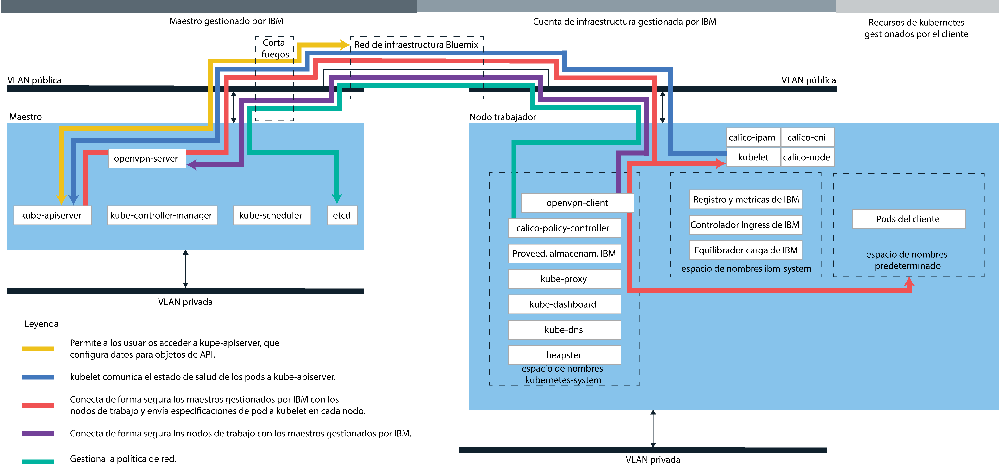

---

copyright:
  years: 2014, 2018
lastupdated: "2018-03-15"

---

{:new_window: target="_blank"}
{:shortdesc: .shortdesc}
{:screen: .screen}
{:pre: .pre}
{:table: .aria-labeledby="caption"}
{:codeblock: .codeblock}
{:tip: .tip}
{:download: .download}

# Iniciación a los clústeres en {{site.data.keyword.Bluemix_dedicated_notm}}
{: #dedicated}

Si tiene una cuenta de {{site.data.keyword.Bluemix_dedicated}} para utilizar {{site.data.keyword.containerlong}}, puede desplegar los clústeres de Kubernetes en un entorno de nube dedicado (`https://<my-dedicated-cloud-instance>.bluemix.net`) y conectarse a servicios de {{site.data.keyword.Bluemix}} preseleccionados que también se ejecuten allí.
{:shortdesc}

Si no tiene cuenta de {{site.data.keyword.Bluemix_dedicated_notm}}, puede [empezar a trabajar con {{site.data.keyword.containershort_notm}}](container_index.html#container_index) en una cuenta pública de {{site.data.keyword.Bluemix_notm}}.

## Acerca del entorno de nube dedicada
{: #dedicated_environment}

Con una cuenta de {{site.data.keyword.Bluemix_dedicated_notm}}, los recursos físicos disponibles se dedican únicamente a su clúster y no se comparten con otros clústeres de otros clientes de {{site.data.keyword.IBM_notm}}. Podría elegir configurar un entorno {{site.data.keyword.Bluemix_dedicated_notm}} cuando desee aislamiento para el clúster y también precise dicho aislamiento para otros servicios de {{site.data.keyword.Bluemix_notm}} que utilice. Si no tiene una cuenta dedicada, puede [crear clústeres con hardware dedicado en {{site.data.keyword.Bluemix_notm}} público](cs_clusters.html#clusters_ui).

Con {{site.data.keyword.Bluemix_dedicated_notm}}, puede crear clústeres desde el catálogo en la consola dedicada o mediante la CLI de {{site.data.keyword.containershort_notm}}. Cuando se utiliza la consola dedicada, se inicia sesión en la cuenta dedicada y en la pública simultáneamente con el IBMid. Este inicio de sesión doble le permite acceder a los clústeres públicos utilizando la consola dedicada. Cuando se utiliza la CLI, se inicia sesión utilizando el punto final dedicado (`api.<my-dedicated-cloud-instance>.bluemix.net.`) y se define como destino el punto final de la API de {{site.data.keyword.containershort_notm}} de la región pública que está asociada con el entorno dedicado.

Las diferencias más importantes entre {{site.data.keyword.Bluemix_notm}} público y dedicado son las siguientes.

*   En {{site.data.keyword.Bluemix_dedicated_notm}}, {{site.data.keyword.IBM_notm}} posee y gestiona la cuenta de infraestructura de IBM Cloud (SoftLayer) en la que se despliegan los nodos trabajadores, las VLAN y las subredes. En {{site.data.keyword.Bluemix_notm}} público, usted es el propietario de la cuenta de infraestructura de IBM Cloud (SoftLayer).
*   En {{site.data.keyword.Bluemix_dedicated_notm}}, las especificaciones de las VLAN y las subredes en la cuenta de infraestructura de IBM Cloud (SoftLayer) gestionada por {{site.data.keyword.IBM_notm}} se determinan cuando el entorno dedicado está habilitado. En {{site.data.keyword.Bluemix_notm}} público, las especificaciones de VLAN y subredes se determinan cuando se crea el clúster.

### Diferencias en la gestión de clústeres entre entornos de nube
{: #dedicated_env_differences}

|Área|{{site.data.keyword.Bluemix_notm}} público|{{site.data.keyword.Bluemix_dedicated_notm}}|
|--|--------------|--------------------------------|
|Creación del clúster|Cree un clúster gratuito o especifique los siguientes detalles para un clúster estándar:<ul><li>Tipo de clúster</li><li>Nombre</li><li>Ubicación</li><li>Tipo de máquina</li><li>Número de nodos trabajadores</li><li>VLAN pública</li><li>VLAN privada</li><li>Hardware</li></ul>|Especifique los siguientes detalles para un clúster estándar:<ul><li>Nombre</li><li>Versión de Kubernetes</li><li>Tipo de máquina</li><li>Número de nodos trabajadores</li></ul><p>**Nota:** Los valores de hardware y VLAN se definen de forma previa durante la creación del entorno de {{site.data.keyword.Bluemix_notm}}.</p>|
|Propiedad y hardware del clúster|En los clústeres estándares, el hardware se puede compartir con otros clientes de {{site.data.keyword.IBM_notm}} o puede estar dedicado a usted únicamente. Las VLAN privadas y públicas las posee y gestiona cada usuario en su cuenta de infraestructura de IBM Cloud (SoftLayer).|En los clústeres del entorno de {{site.data.keyword.Bluemix_dedicated_notm}}, el hardware es siempre dedicado. Las VLAN privadas y públicas las posee y gestiona IBM en nombre del usuario. La ubicación se define de forma previa para el entorno de {{site.data.keyword.Bluemix_notm}}.|
|Redes de Ingress y de equilibrio de carga|Durante el suministro del clúster estándar, se llevan a cabo de forma automática las siguientes acciones.<ul><li>Se vinculan una subred portátil pública y una subred portátil privada al clúster y se asignan a su cuenta de infraestructura de IBM Cloud (SoftLayer).</li><li>Se utiliza una dirección IP pública portátil para un equilibrador de carga de aplicación de alta disponibilidad y se asigna una ruta pública exclusiva en el formato &lt;cluster_name&gt;.containers.mybluemix.net. Puede utilizar esta ruta para exponer varias apps al público. Se utiliza dirección IP privada portátil para un equilibrador de carga de aplicación privado.</li><li>Se asignan cuatro direcciones IP públicas portátiles y cuatro direcciones IP privadas portátiles al clúster que se pueden utilizar para exponer apps mediante servicios del equilibrador de carga. Se pueden solicitar subredes adicionales a través de su cuenta de infraestructura de IBM Cloud (SoftLayer).</li></ul>|Cuando se crea una cuenta para el entorno Dedicado, se toma la decisión de conectividad sobre cómo se desea exponer los servicios del clúster y acceder a ellos. Si desea utilizar los rangos de IP de su propia empresa (IP gestionadas por el usuario), debe proporcionarlos cuando [configure un entorno de {{site.data.keyword.Bluemix_dedicated_notm}}](/docs/dedicated/index.html#setupdedicated). <ul><li>De forma predeterminada, no se vincula ninguna subred portátil pública a los clústeres que crea en su cuenta dedicada. En su lugar, tiene la flexibilidad de elegir el modelo de conectividad que mejor se adapte a su empresa.</li><li>Después de crear el clúster, elija el tipo de subredes que desea enlazar y utilizar con el clúster para la conectividad de Ingress o del equilibrador de carga.<ul><li>Para las subredes portátiles públicas o privadas, puede [añadir subredes a los clústeres](cs_subnets.html#subnets)</li><li>Para las direcciones IP gestionadas por el usuario que ha proporcionado a IBM en la incorporación dedicada, puede [añadir subredes gestionadas por el usuario a los clústeres](#dedicated_byoip_subnets).</li></ul></li><li>Después de enlazar una subred a su clúster, se crea el equilibrador de carga de aplicación de Ingress. Se crea una ruta de Ingress pública solo si utiliza una subred pública portátil.</li></ul>|
|Redes de NodePort|Exponga un puerto público en el nodo trabajador y utilice la dirección IP pública del nodo trabajador para acceder de forma pública al servicio en el clúster.|Todas las direcciones IP públicas de los nodos trabajadores están bloqueados por un cortafuegos. Sin embargo, para los servicios de {{site.data.keyword.Bluemix_notm}} que se añadan al clúster, se puede acceder al puerto del nodo mediante una dirección IP pública o una dirección IP privada.|
|Almacén persistente|Utiliza el [suministro dinámico](cs_storage.html#create) o el [suministro estático](cs_storage.html#existing) de volúmenes.|Utiliza el [suministro dinámico](cs_storage.html#create) de volúmenes. [Abra una incidencia de soporte](/docs/get-support/howtogetsupport.html#getting-customer-support) para solicitar una copia de seguridad y una restauración de los volúmenes y para realizar otras funciones de almacenamiento.</li></ul>|
|URL de registro de imágenes en {{site.data.keyword.registryshort_notm}}|<ul><li>EE.UU. Sur y EE.UU. Este: <code>registry.ng bluemix.net</code></li><li>UK Sur: <code>registry.eu-gb.bluemix.net</code></li><li>UE Central (Frankfurt): <code>registry.eu-de.bluemix.net</code></li><li>Australia (Sidney): <code>registry.au-syd.bluemix.net</code></li></ul>|<ul><li>Para los nuevos espacios de nombres, utilice los mismos registros basados en regiones que los definidos para el entorno de {{site.data.keyword.Bluemix_notm}} público.</li><li>Para los espacios de nombres que se configuraron para contenedores escalables y únicos en {{site.data.keyword.Bluemix_dedicated_notm}}, utilice <code>registry.&lt;dedicated_domain&gt;</code></li></ul>|
|Acceso al registro|Consulte las opciones del apartado sobre [Utilización de registros de imágenes privadas y públicas con {{site.data.keyword.containershort_notm}}](cs_images.html).|<ul><li>Para los espacios de nombres nuevos, consulte las opciones del apartado sobre [Utilización de registros de imágenes privadas y públicas con {{site.data.keyword.containershort_notm}}](cs_images.html).</li><li>Para espacios de nombres que se configuraron para grupos escalables y únicos, se [utiliza una señal para crear un secreto de Kubernetes](cs_dedicated_tokens.html#cs_dedicated_tokens) para la autenticación.</li></ul>|
{: caption="Diferencias entre las características de {{site.data.keyword.Bluemix_notm}} público y {{site.data.keyword.Bluemix_dedicated_notm}}" caption-side="top"}

<br />


### Arquitectura del servicio
{: #dedicated_ov_architecture}

Cada nodo trabajador está configurado con un motor Docker gestionado por {{site.data.keyword.IBM_notm}}, distintos recursos de cálculo, sistema de red y servicio de volúmenes.
{:shortdesc}

Las características integradas de seguridad proporcionan aislamiento, funciones de gestión de recursos y conformidad con la seguridad de los nodos trabajadores. El nodo trabajador se comunica con el maestro mediante certificados TLS seguros y conexión openVPN.


*Arquitectura de Kubernetes y sistema de red en {{site.data.keyword.Bluemix_dedicated_notm}}*



<br />


## Configuración de {{site.data.keyword.containershort_notm}} en Dedicado
{: #dedicated_setup}

Cada entorno de {{site.data.keyword.Bluemix_dedicated_notm}} tiene una cuenta corporativa pública y propiedad del cliente en {{site.data.keyword.Bluemix_notm}}. Para que los usuarios en el entorno dedicado creen clústeres, el administrador debe añadir a los usuarios a una cuenta corporativa pública.
{:shortdesc}

Antes de empezar:
  * [Configure un entorno de {{site.data.keyword.Bluemix_dedicated_notm}}](/docs/dedicated/index.html#setupdedicated).
  * Si el sistema local o la red corporativa controla puntos finales de Internet público mediante proxies o cortafuegos, debe [abrir los puertos y direcciones IP necesarios en el cortafuegos](cs_firewall.html#firewall).
  * [Descargue la CLI de Cloud Foundy ](https://github.com/cloudfoundry/cli/releases) y [añada el plug-in de CLI de administración de IBM Cloud](/docs/cli/plugins/bluemix_admin/index.html#adding-the-ibm-cloud-admin-cli-plug-in).

Para permitir a los usuarios de {{site.data.keyword.Bluemix_dedicated_notm}} acceder a clústeres:

1.  El propietario de la cuenta pública de {{site.data.keyword.Bluemix_notm}} debe generar una clave de API.
    1.  Inicie una sesión en el punto final de la instancia de {{site.data.keyword.Bluemix_dedicated_notm}}. Especifique las credenciales de {{site.data.keyword.Bluemix_notm}} del propietario de la cuenta pública y seleccione su cuenta cuando se le solicite.

        ```
        bx login -a api.<my-dedicated-cloud-instance>.<region>.bluemix.net
        ```
        {: pre}

        **Nota:** si tiene un ID federado, utilice `bx login -a api.<my-dedicated-cloud-instance>.<region>.bluemix.net --sso` para iniciar sesión en la CLI de {{site.data.keyword.Bluemix_notm}}. Especifique su nombre de usuario y utilice el URL proporcionado en la salida de la CLI para recuperar el código de acceso de un solo uso. Sabe si tiene un ID federado cuando el inicio de sesión falla sin `--sso` y se lleva a cabo correctamente con la opción `--sso`.

    2.  Genere una clave de API para invitar a los usuarios a la cuenta pública. Anote el valor de la clave de API, que el administrador de la cuenta dedicada utilizará en el paso siguiente.

        ```
        bx iam api-key-create <key_name> -d "Key to invite users to <dedicated_account_name>"
        ```
        {: pre}

    3.  Anote el GUID de la organización de cuenta pública a la que desea invitar a los usuarios, que el administrador de la cuenta dedicada utilizará en el siguiente paso.

        ```
        bx account orgs
        ```
        {: pre}

2.  El propietario de la cuenta de {{site.data.keyword.Bluemix_dedicated_notm}} puede invitar a uno o varios usuarios a su cuenta pública.
    1.  Inicie una sesión en el punto final de la instancia de {{site.data.keyword.Bluemix_dedicated_notm}}. Especifique las credenciales de {{site.data.keyword.Bluemix_notm}} del propietario de la cuenta dedicada y seleccione su cuenta cuando se le solicite.

        ```
        bx login -a api.<my-dedicated-cloud-instance>.<region>.bluemix.net
        ```
        {: pre}

        **Nota:** si tiene un ID federado, utilice `bx login -a api.<my-dedicated-cloud-instance>.<region>.bluemix.net --sso` para iniciar sesión en la CLI de {{site.data.keyword.Bluemix_notm}}. Especifique su nombre de usuario y utilice el URL proporcionado en la salida de la CLI para recuperar el código de acceso de un solo uso. Sabe si tiene un ID federado cuando el inicio de sesión falla sin `--sso` y se lleva a cabo correctamente con la opción `--sso`.

    2.  Invite a los usuarios a la cuenta pública.
        * Para invitar a un solo usuario:

            ```
            bx cf bluemix-admin invite-users-to-public -userid=<user_email> -apikey=<public_api_key> -public_org_id=<public_org_id>
            ```
            {: pre}

            Sustituya <em>&lt;user_IBMid&gt;</em> con el correo electrónico del usuario al que desea invitar, <em>&lt;public_api_key&gt;</em> con la clave de API generada en el paso anterior y <em>&lt;public_org_id&gt;</em> con el GUID de la organización de la cuenta pública. Consulte [Invitación de un usuario de IBM Cloud dedicado](/docs/cli/plugins/bluemix_admin/index.html#admin_dedicated_invite_public) para obtener más información sobre este mandato.

        * Para invitar a todos los usuarios de una organización de cuenta dedicada:

            ```
            bx cf bluemix-admin invite-users-to-public -organization=<dedicated_org_id> -apikey=<public_api_key> -public_org_id=<public_org_id>
            ```

            Sustituya <em>&lt;dedicated_org_id&gt;</em> con el ID de la organización de cuenta dedicada, <em>&lt;public_api_key&gt;</em> con la clave de API generada en el paso anterior y <em>&lt;public_org_id&gt;</em> con el GUID de la organización de la cuenta pública. Consulte [Invitación de un usuario de IBM Cloud dedicado](/docs/cli/plugins/bluemix_admin/index.html#admin_dedicated_invite_public) para obtener más información sobre este mandato.

    3.  Si existe un IBMid para un usuario, el usuario se añade automáticamente a la organización especificada en la cuenta pública. Si no existe IBMid para un usuario, se envía una invitación a la dirección de correo electrónico del usuario. Una vez que el usuario acepta la invitación, se crea un IBMid para el usuario y el usuario se añade a la organización especificada en la cuenta pública.

    4.  Verifique que los usuarios se han añadido a la cuenta.

        ```
        bx cf bluemix-admin invite-users-status -apikey=<public_api_key>
        ```
        {: pre}

        Los usuarios invitados que tienen IBMid tendrán el estado `ACTIVE`. Los usuarios invitados que no tienen IBMid tendrán el estado `PENDING` o `ACTIVE`, en función de si ya han aceptado la invitación a la cuenta o no.

3.  Si un usuario necesita privilegios de creación de clústeres, debe otorgarle el rol de Administrador.

    1.  En la barra de menús de la consola pública, pulse **Gestionar > Seguridad > Identidad y acceso** y pulse **Usuarios**.

    2.  En la fila del usuario al que desea asignarle acceso, seleccione el menú **Acciones** y, a continuación, pulse **Asignar acceso**.

    3.  Seleccione **Asignar acceso a recursos**.

    4.  En la lista **Servicios**, seleccione **IBM Cloud Container Service**.

    5.  En la lista **Región**, seleccione **Todas las regiones actuales** o una región específica, si se le solicita.

    6. En **Seleccionar roles**, seleccione Administrador.

    7. Pulse **Asignar**.

4.  Los usuarios ya pueden iniciar sesión en el punto final de la cuenta dedicada para empezar a crear clústeres.

    1.  Inicie una sesión en el punto final de la instancia de {{site.data.keyword.Bluemix_dedicated_notm}}. Escriba el IBMid cuando se lo soliciten.

        ```
        bx login -a api.<my-dedicated-cloud-instance>.<region>.bluemix.net
        ```
        {: pre}

        **Nota:** si tiene un ID federado, utilice `bx login -a api.<my-dedicated-cloud-instance>.<region>.bluemix.net --sso` para iniciar sesión en la CLI de {{site.data.keyword.Bluemix_notm}}. Especifique su nombre de usuario y utilice el URL proporcionado en la salida de la CLI para recuperar el código de acceso de un solo uso. Sabe si tiene un ID federado cuando el inicio de sesión falla sin `--sso` y se lleva a cabo correctamente con la opción `--sso`.

    2.  Si inicia sesión por primera vez, proporcione su ID de usuario dedicado y su contraseña cuando se le solicite. De esta forma, se autentica la cuenta dedicada y se enlazan la cuenta dedicada y la pública. Cada vez que inicie sesión después de esta primera vez, sólo utilizará el IBMid. Para obtener más información, consulte [Conexión de un ID dedicado a su IBMid público](/docs/cli/connect_dedicated_id.html#connect_dedicated_id).

        **Nota**: debe iniciar sesión en su cuenta dedicada y en su cuenta pública para crear clústeres. Si solo desea iniciar sesión en la cuenta dedicada, utilice el distintivo `--no-iam` al iniciar sesión en el punto final dedicado.

    3.  Para crear o acceder a clústeres en el entorno dedicado, debe establecer la región asociada con ese entorno.

        ```
        bx cs region-set
        ```
        {: pre}

5.  Si desea desenlazar sus cuentas, puede desconectar el IBMid del ID de usuario dedicado. Para obtener más información, consulte [Desconectar el ID dedicado del IBMid público](/docs/cli/connect_dedicated_id.html#disconnect-your-dedicated-id-from-the-public-ibmid).

    ```
    bx iam dedicated-id-disconnect
    ```
    {: pre}

<br />


## Creación de clústeres
{: #dedicated_administering}

Diseñe la configuración de su clúster de {{site.data.keyword.Bluemix_dedicated_notm}} para maximizar su disponibilidad y capacidad.
{:shortdesc}

### Creación de clústeres con la GUI
{: #dedicated_creating_ui}

1.  Abra la consola dedicada: `https://<my-dedicated-cloud-instance>.bluemix.net`.
2. Marque el recuadro de selección **Iniciar sesión también en {{site.data.keyword.Bluemix_notm}} público** y pulse **Iniciar sesión**.
3. Siga las indicaciones para iniciar sesión con el IBMid. Si es la primera vez que inicia sesión en la cuenta dedicada, siga las indicaciones para iniciar sesión en {{site.data.keyword.Bluemix_dedicated_notm}}.
4.  En el catálogo, seleccione **Contenedores** y pulse **Clúster de Kubernetes**.
5.  Escriba un **Nombre de clúster**. El nombre debe empezar por una letra, puede contener letras, números, y -, y debe tener 35 caracteres o menos. Tenga en cuenta que el subdominio de Ingress asignado por {{site.data.keyword.IBM_notm}} se deriva del nombre del clúster. El nombre de clúster y el subdominio de Ingress juntos forman el nombre de dominio completo, que debe ser exclusivo dentro de una región y tener 63 caracteres o menos. Para cumplir con estos requisitos, el nombre del clúster se puede truncar o se pueden asignar valores de carácter aleatorios al subdominio.
6.  Seleccione un **Tipo de máquina**. El tipo de máquina define la cantidad de memoria y CPU virtual que se configura en cada nodo trabajador. Esta memoria y CPU virtual están disponibles para todos los contenedores que despliegue en los nodos.
    -   El tipo de máquina micro indica la opción más pequeña.
    -   Un tipo de máquina equilibrado tiene la misma cantidad de memoria asignada a cada CPU, lo que optimiza el rendimiento.
7.  Elija el **Número de nodos trabajadores** que necesita. Seleccione `3` para garantizar una alta disponibilidad del clúster.
8.  Pulse **Crear clúster**. Se abren los detalles del clúster, pero los nodos trabajadores del clúster tardar unos minutos en suministrarse. En el separador **Nodos trabajadores** puede ver el progreso del despliegue de los nodos trabajadores. Cuando los nodos trabajadores están listos, el estado pasa a **Ready**.

### Creación de clústeres con la CLI
{: #dedicated_creating_cli}

1.  Instale la CLI de {{site.data.keyword.Bluemix_notm}} y el plug-in de [{{site.data.keyword.containershort_notm}}](cs_cli_install.html#cs_cli_install).
2.  Inicie una sesión en el punto final de la instancia de {{site.data.keyword.Bluemix_dedicated_notm}}. Especifique sus credenciales de {{site.data.keyword.Bluemix_notm}} y seleccione la cuenta cuando se le solicite.

    ```
    bx login -a api.<my-dedicated-cloud-instance>.<region>.bluemix.net
    ```
    {: pre}

    **Nota:** si tiene un ID federado, utilice `bx login -a api.<my-dedicated-cloud-instance>.<region>.bluemix.net --sso` para iniciar sesión en la CLI de {{site.data.keyword.Bluemix_notm}}. Especifique su nombre de usuario y utilice el URL proporcionado en la salida de la CLI para recuperar el código de acceso de un solo uso. Sabe si tiene un ID federado cuando el inicio de sesión falla sin `--sso` y se lleva a cabo correctamente con la opción `--sso`.

3.  Para definir una región como destino, ejecute `bx cs region-set`.

4.  Cree un clúster con el mandato `cluster-create`. Cuando se crea un clúster estándar, el hardware del nodo trabajador se factura por horas de uso.

    Ejemplo:

    ```
    bx cs cluster-create --location <location> --machine-type <machine-type> --name <cluster_name> --workers <number>
    ```
    {: pre}

    <table>
    <caption>Descripción de los componentes de este mandato</caption>
    <thead>
    <th colspan=2> Descripción de los componentes de este mandato</th>
    </thead>
    <tbody>
    <tr>
    <td><code>cluster-create</code></td>
    <td>El mandato para crear un clúster en la organización de {{site.data.keyword.Bluemix_notm}}.</td>
    </tr>
    <tr>
    <td><code>--location <em>&lt;location&gt;</em></code></td>
    <td>Sustituya &lt;location&gt; por el ID de ubicación de {{site.data.keyword.Bluemix_notm}} que el entorno dedicado está configurado para utilizar.</td>
    </tr>
    <tr>
    <td><code>--machine-type <em>&lt;machine_type&gt;</em></code></td>
    <td>Si está creando un clúster estándar, elija un tipo de máquina. El tipo de máquina especifica los recursos de cálculo virtuales que están disponibles para cada nodo trabajador. Consulte el apartado sobre [Comparación entre los clústeres gratuitos y estándares para {{site.data.keyword.containershort_notm}}](cs_why.html#cluster_types) para obtener más información. Para los clústeres gratuitos, no tiene que definir el tipo de máquina.</td>
    </tr>
    <tr>
    <td><code>--name <em>&lt;name&gt;</em></code></td>
    <td>Sustituya <em>&lt;name&gt;</em> por el nombre del clúster. El nombre debe empezar por una letra, puede contener letras, números, y -, y debe tener 35 caracteres o menos. Tenga en cuenta que el subdominio de Ingress asignado por {{site.data.keyword.IBM_notm}} se deriva del nombre del clúster. El nombre de clúster y el subdominio de Ingress juntos forman el nombre de dominio completo, que debe ser exclusivo dentro de una región y tener 63 caracteres o menos. Para cumplir con estos requisitos, el nombre del clúster se puede truncar o se pueden asignar valores de carácter aleatorios al subdominio.</td>
    </tr>
    <tr>
    <td><code>--workers <em>&lt;number&gt;</em></code></td>
    <td>El número de nodos trabajadores que desea incluir en el clúster. Si no se especifica la opción <code>--workers</code>, se crea un nodo trabajador.</td>
    </tr>
    </tbody></table>

5.  Verifique que ha solicitado la creación del clúster.

    ```
    bx cs clusters
    ```
    {: pre}

    **Nota:** Se puede tardar hasta 15 minutos en pedir las máquinas de nodo trabajador y en configurar y suministrar el clúster en la cuenta.

    Una vez completado el suministro del clúster, el estado del clúster pasa a ser **deployed**.

    ```
    Name         ID                                   State      Created          Workers   Location   Version
    my_cluster   paf97e8843e29941b49c598f516de72101   deployed   20170201162433   1         dal10      1.8.8
    ```
    {: screen}

6.  Compruebe el estado de los nodos trabajadores.

    ```
    bx cs workers <cluster>
    ```
    {: pre}

    Cuando los nodos trabajadores están listos, el estado pasa a **normal** y el estado es **Ready**. Cuando el estado del nodo sea **Preparado**, podrá acceder al clúster.

    ```
    ID                                                  Public IP        Private IP     Machine Type   State      Status   Location   Version
    prod-dal10-pa8dfcc5223804439c87489886dbbc9c07-w1    169.47.223.113   10.171.42.93   free           normal     Ready    dal10      1.8.8
    ```
    {: screen}

7.  Defina el clúster que ha creado como contexto para esta sesión. Siga estos pasos de configuración cada vez que de trabaje con el clúster.

    1.  Obtenga el mandato para establecer la variable de entorno y descargar los archivos de configuración de Kubernetes.

        ```
        bx cs cluster-config <cluster_name_or_id>
        ```
        {: pre}

        Cuando termine la descarga de los archivos de configuración, se muestra un mandato que puede utilizar para establecer la vía de acceso al archivo de configuración de
Kubernetes como variable de entorno.

        Ejemplo para OS X:

        ```
        export KUBECONFIG=/Users/<user_name>/.bluemix/plugins/container-service/clusters/<cluster_name>/kube-config-prod-dal10-<cluster_name>.yml
        ```
        {: screen}

    2.  Copie y pegue el mandato que se muestra en el terminal para definir la variable de entorno `KUBECONFIG`.
    3.  Compruebe que la variable de entorno `KUBECONFIG` se haya establecido correctamente.

        Ejemplo para OS X:

        ```
        echo $KUBECONFIG
        ```
        {: pre}

        Salida:

        ```
        /Users/<user_name>/.bluemix/plugins/container-service/clusters/<cluster_name>/kube-config-prod-dal10-<cluster_name>.yml

        ```
        {: screen}

8.  Acceda al panel de control de Kubernetes con el puerto predeterminado 8001.
    1.  Establezca el proxy con el número de puerto predeterminado.

        ```
        kubectl proxy
        ```
        {: pre}

        ```
        Starting to serve on 127.0.0.1:8001
        ```
        {: screen}

    2.  Abra el siguiente URL en un navegador web para ver el panel de control de Kubernetes.

        ```
        http://localhost:8001/ui
        ```
        {: codeblock}

### Utilización de registros de imagen privada y pública
{: #dedicated_images}

Para los espacios de nombres nuevos, consulte las opciones del apartado sobre [Utilización de registros de imágenes privadas y públicas con {{site.data.keyword.containershort_notm}}](cs_images.html). Para espacios de nombres que se configuraron para grupos escalables y únicos, se [utiliza una señal para crear un secreto de Kubernetes](cs_dedicated_tokens.html#cs_dedicated_tokens) para la autenticación.

### Adición de subredes a clústeres
{: #dedicated_cluster_subnet}

Cambie la agrupación de las direcciones IP públicas portátiles disponibles añadiendo subredes a su clúster. Para obtener más información, consulte [Adición de subredes a clústeres](cs_subnets.html#subnets). Revise las diferencias siguientes para añadir subredes a clústeres dedicados.

#### Adición de más subredes y direcciones IP gestionadas por el usuario a los clústeres de Kubernetes
{: #dedicated_byoip_subnets}

Proporcione más subredes propias desde una red local que desee utilizar para acceder a {{site.data.keyword.containershort_notm}}. Puede añadir direcciones IP privadas desde dichas subredes a servicios de Ingress y del equilibrador de carga en el clúster de Kubernetes. Las subredes gestionadas por el usuario se configuran de dos maneras, según el formato de la subred que desee utilizar.

Requisitos:
- Las subredes gestionadas por el usuario solo se pueden añadir a VLAN privadas.
- El límite de longitud del prefijo de subred es de /24 a /30. Por ejemplo, `203.0.113.0/24` especifica 253 direcciones IP privadas que se pueden utilizar, mientras que `203.0.113.0/30` especifica 1 dirección IP privada que se puede utilizar.
- La primera dirección IP de la subred se debe utilizar como pasarela para la subred.

Antes de empezar: configure el direccionamiento del tráfico de red de entrada y de salida de la red de empresa a la red de {{site.data.keyword.Bluemix_dedicated_notm}} que utilizará la subred gestionada por el usuario.

1. Para utilizar su propia subred, [abra una incidencia de soporte](/docs/get-support/howtogetsupport.html#getting-customer-support) y proporcione la lista de CIDR de subred que desea utilizar.
    **Nota**: la forma en la que se gestionan los equilibradores de carga y los ALB para la conectividad de cuenta interna y local varía según el formato del CIDR de subred. Consulte el paso final para ver las diferencias de configuración.

2. Una vez que {{site.data.keyword.IBM_notm}} suministre las subredes gestionadas por el usuario, ponga la subred a disposición del clúster de Kubernetes.

    ```
    bx cs cluster-user-subnet-add <cluster_name> <subnet_CIDR> <private_VLAN>
    ```
    {: pre}
    Sustituya <em>&lt;cluster_name&gt;</em> con el nombre o el ID del clúster, <em>&lt;subnet_CIDR&gt;</em> con uno de los CIDR de subred que ha proporcionado en la incidencia de soporte y <em>&lt;private_VLAN&gt;</em> con un ID de VLAN privada. Encontrará el ID de la VLAN privada disponible ejecutando `bx cs vlans`.

3. Compruebe que las subredes se hayan añadido al clúster. El campo **User-managed** de las subredes proporcionadas por el usuario es _true_.

    ```
    bx cs cluster-get --showResources <cluster_name>
    ```
    {: pre}

    ```
    VLANs
    VLAN ID   Subnet CIDR         Public       User-managed
    1555503   192.0.2.0/24        true         false
    1555505   198.51.100.0/24     false        false
    1555505   203.0.113.0/24      false        true
    ```
    {: screen}

4. Opcional: [Habilite el direccionamiento entre subredes en la misma VLAN](cs_subnets.html#vlan-spanning).

5. Para configurar la conectividad de cuenta interna y local, elija una de estas opciones:
  - Si ha utilizado un rango de direcciones IP privadas 10.x.x.x para la subred, utilice IP válidas de ese rango para configurar la conectividad de cuenta interna y local con Ingress y un equilibrador de carga. Para obtener más información, consulte [Configuración del acceso a una app](cs_network_planning.html#planning).
  - Si no ha utilizado un rango de direcciones IP privadas 10.x.x.x para la subred, utilice IP válidas de ese rango para configurar la conectividad local con Ingress y un equilibrador de carga. Para obtener más información, consulte [Configuración del acceso a una app](cs_network_planning.html#planning). No obstante, debe utilizar una subred privada portátil de infraestructura de IBM Cloud (SoftLayer) para configurar la conectividad de cuenta interna entre el clúster y otros servicios basados en Cloud Foundry. Puede crear una subred privada portátil con el mandato [`bx cs cluster-subnet-add`](cs_cli_reference.html#cs_cluster_subnet_add). En este caso, el clúster tiene una subred gestionada por el usuario para la conectividad local y una subred privada portátil de infraestructura de IBM Cloud (SoftLayer) para la conectividad de cuenta interna.

### Otras configuraciones de clúster
{: #dedicated_other}

Revise las siguientes opciones de otras configuraciones de clúster:
  * [Gestión de acceso a clústeres](cs_users.html#managing)
  * [Actualización del maestro de Kubernetes](cs_cluster_update.html#master)
  * [Actualización de nodos trabajadores](cs_cluster_update.html#worker_node)
  * [Configuración del registro de clúster](cs_health.html#logging)
      * **Nota**: La habilitación de registro no está soportada desde el punto final dedicado. Debe iniciar sesión en el punto final de {{site.data.keyword.cloud_notm}} público y definir como objetivo el espacio y la organización públicos para permitir el reenvío de registros.
  * [Configuración de la supervisión del clúster](cs_health.html#monitoring)
      * **Nota**: existe un clúster `ibm-monitoring` dentro de cada cuenta de {{site.data.keyword.Bluemix_dedicated_notm}}. Este clúster supervisa continuamente el estado de {{site.data.keyword.containerlong_notm}} en el entorno dedicado, comprobando la estabilidad y la conectividad del entorno. No elimine este clúster del entorno.
  * [Visualización de recursos de un clúster de Kubernetes](cs_integrations.html#weavescope)
  * [Eliminación de clústeres](cs_clusters.html#remove)

<br />


## Despliegue de apps en clústeres
{: #dedicated_apps}

Puede utilizar las técnicas de Kubernetes para desplegar apps en clústeres de {{site.data.keyword.Bluemix_dedicated_notm}} y asegurarse de que sus apps estén siempre activas y en funcionamiento.
{:shortdesc}

Para desplegar apps en clústeres, siga las instrucciones para [desplegar apps en clústeres públicos de {{site.data.keyword.Bluemix_notm}}](cs_app.html#app). Revise las siguientes diferencias para clústeres de {{site.data.keyword.Bluemix_dedicated_notm}}.

### Cómo permitir el acceso público a apps
{: #dedicated_apps_public}

Para entornos de {{site.data.keyword.Bluemix_dedicated_notm}}, las direcciones IP públicas principales están bloqueadas por un cortafuegos. Para hacer que una app esté disponible a nivel público, utilice un [servicio LoadBalancer](#dedicated_apps_public_load_balancer) o [Ingress](#dedicated_apps_public_ingress) en lugar de un servicio NodePort. Si necesita acceder a un servicio LoadBalancer o Ingress que cuenta con direcciones IP públicas portátiles, proporcione una lista blanca de cortafuegos de empresa a IBM en el momento de la incorporación del servicio.

#### Configuración del acceso a una app utilizando el tipo de servicio LoadBalancer
{: #dedicated_apps_public_load_balancer}

Si desea utilizar direcciones IP públicas para el equilibrador de carga, asegúrese de que se ha proporcionado una lista blanca de cortafuegos de empresa a IBM, o [abra una incidencia de soporte](/docs/get-support/howtogetsupport.html#getting-customer-support) para configurar la lista blanca del cortafuegos. A continuación, siga los pasos de [Configuración del acceso a una app utilizando el tipo de servicio LoadBalancer](cs_loadbalancer.html#config).

#### Configuración del acceso público a una app utilizando Ingress
{: #dedicated_apps_public_ingress}

Si desea utilizar direcciones IP públicas para el equilibrador de carga de aplicación, asegúrese de que se ha proporcionado una lista blanca de cortafuegos de empresa a IBM, o [abra una incidencia de soporte](/docs/get-support/howtogetsupport.html#getting-customer-support) para configurar la lista blanca del cortafuegos. A continuación, siga los pasos de [Configuración del acceso a una app utilizando Ingress](cs_ingress.html#configure_alb).

### Creación de almacenamiento permanente
{: #dedicated_apps_volume_claim}

Para revisar las opciones para crear almacenamiento persistente, consulte [Almacenamiento de datos permanentes](cs_storage.html#planning). Para solicitar una copia de seguridad de los volúmenes, una restauración y otras funciones de almacenamiento, debe [abrir una incidencia de soporte](/docs/get-support/howtogetsupport.html#getting-customer-support).
