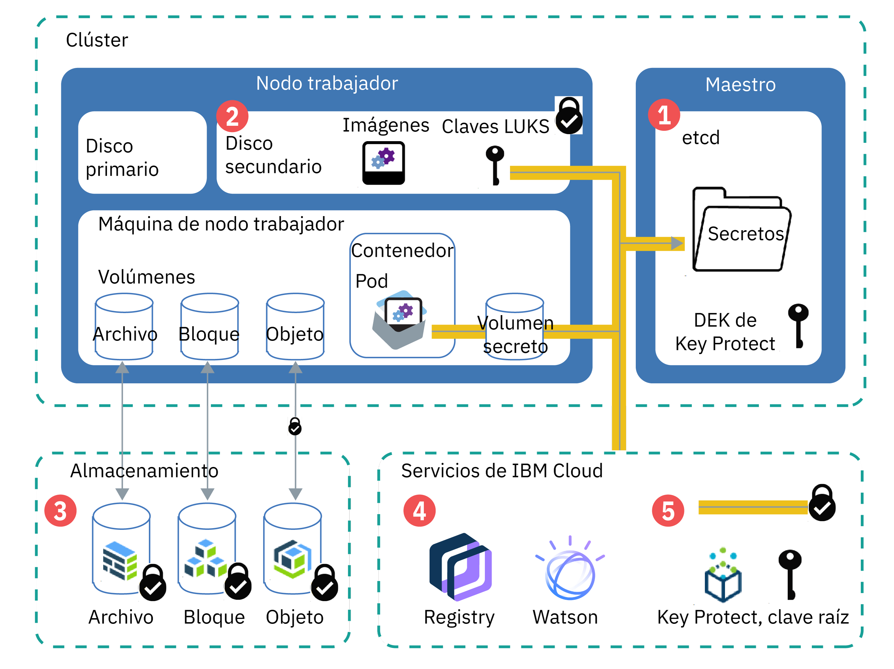

---

copyright:
  years: 2014, 2019
lastupdated: "2019-05-31"

keywords: kubernetes, iks

subcollection: containers

---

{:new_window: target="_blank"}
{:shortdesc: .shortdesc}
{:screen: .screen}
{:pre: .pre}
{:table: .aria-labeledby="caption"}
{:codeblock: .codeblock}
{:tip: .tip}
{:note: .note}
{:important: .important}
{:deprecated: .deprecated}
{:download: .download}
{:preview: .preview}


# Protección de la información confidencial del clúster
{: #encryption}

Proteja la información confidencial del clúster para garantizar la integridad de los datos y evitar que los datos se expongan a usuarios no autorizados.
{: shortdesc}

Puede crear datos confidenciales en distintos niveles del clúster que requieran una protección adecuada.
- **Nivel de clúster:** los datos de configuración del clúster se almacenan en el componente etcd del maestro de Kubernetes. Los datos de etcd se almacenan en el disco local del maestro de Kubernetes y se realiza una copia de seguridad en
{{site.data.keyword.cos_full_notm}}. Los datos se cifran durante el tránsito a {{site.data.keyword.cos_full_notm}} y en reposo. Puede optar por habilitar el cifrado de los datos de etcd en el disco local del maestro de Kubernetes mediante la [habilitación del cifrado de {{site.data.keyword.keymanagementservicelong_notm}}](/docs/containers?topic=containers-encryption#encryption) para el clúster. Los datos de etcd para clústeres que ejecutan una versión anterior de Kubernetes, de los que se hace una copia de seguridad diaria, se almacenan en un disco cifrado gestionado por IBM.
- **Nivel de app:** Cuando despliegue la app, no almacene información confidencial, como credenciales o claves, en el archivo de configuración de YAML, mapas de configuración o scripts. Utilice en su lugar [secretos de Kubernetes ](https://kubernetes.io/docs/concepts/configuration/secret/). También puede [cifrar datos en secretos de Kubernetes](#keyprotect) para evitar que usuarios no autorizados accedan a la información confidencial del clúster.

Para obtener más información sobre cómo proteger el clúster, consulte [Seguridad para {{site.data.keyword.containerlong_notm}}](/docs/containers?topic=containers-security#security).



_Figura: visión general del cifrado de datos en un clúster_

1.  **etcd**: etcd es el componente del maestro que almacena los datos de los recursos de Kubernetes, como los secretos y archivos `.yaml` de configuración de objetos. Los datos de etcd se almacenan en el disco local del maestro de Kubernetes y se realiza una copia de seguridad en
{{site.data.keyword.cos_full_notm}}. Los datos se cifran durante el tránsito a {{site.data.keyword.cos_full_notm}} y en reposo. Puede optar por habilitar el cifrado de los datos de etcd en el disco local del maestro de Kubernetes mediante la [habilitación del cifrado de {{site.data.keyword.keymanagementservicelong_notm}}](#keyprotect) para el clúster. Los datos de etcd de los clústeres que ejecutan una versión anterior de Kubernetes, de los que se hace una copia de seguridad diaria, se almacenan en un disco cifrado gestionado por IBM. Cuando los datos de etcd se envían a un pod, los datos se cifran mediante TLS para garantizar la protección y la integridad de los datos.
2.  **Disco secundario del nodo trabajador**: el disco secundario del nodo trabajador es donde se almacenan el sistema de archivos del contenedor y las imágenes extraídas localmente. El disco se cifra con AES de 256 bits con una clave de cifrado LUKS que es exclusiva para el nodo trabajador y se almacena como un secreto en etcd, gestionado por IBM. Al volver a cargar o actualizar los nodos trabajadores, se rotan las claves LUKS.
3.  **Almacenamiento**: puede elegir almacenar los datos mediante la [configuración de almacenamiento persistente de archivos, bloques u objetos](/docs/containers?topic=containers-storage_planning#persistent_storage_overview). Las instancias de almacenamiento de la infraestructura de IBM Cloud (SoftLayer) guardan los datos en discos cifrados, por lo que los datos en reposo se cifran. Además, si opta por el almacenamiento de objetos, también se cifrarán los datos en tránsito.
4.  **Servicios de {{site.data.keyword.Bluemix_notm}}**: puede [integrar servicios de {{site.data.keyword.Bluemix_notm}}](/docs/containers?topic=containers-service-binding#bind-services), como {{site.data.keyword.registryshort_notm}} o {{site.data.keyword.watson}}, con el clúster. Las credenciales del servicio se almacenan en un secreto que se guarda en etcd, al que puede acceder la app montando el secreto como un volumen o especificando el secreto como una variable de entorno en [el despliegue](/docs/containers?topic=containers-app#secret).
5.  **{{site.data.keyword.keymanagementserviceshort}}**: cuando [habilita {{site.data.keyword.keymanagementserviceshort}}](#keyprotect) en el clúster, se almacena una clave de cifrado de datos (DEK) empaquetada en etcd. La DEK cifra los secretos del clúster, incluyendo las credenciales de servicio y la clave LUKS. Debido a que la clave raíz está en la instancia de {{site.data.keyword.keymanagementserviceshort}}, controlará el acceso a sus secretos cifrados. Las claves de {{site.data.keyword.keymanagementserviceshort}} están protegidas por módulos de seguridad de hardware basados en la nube certificados por FIPS 140-2 Nivel 2 que protegen contra el robo de información. Para obtener más información sobre cómo funciona el cifrado de {{site.data.keyword.keymanagementserviceshort}}, consulte [Cifrado de sobre](/docs/services/key-protect/concepts?topic=key-protect-envelope-encryption#envelope-encryption).

## Cuándo utilizar secretos
{: #secrets}

Los secretos de Kubernetes constituyen una forma segura de almacenar información confidencial, como nombres de usuario, contraseñas o claves. Si necesita que la información confidencial se cifre, [habilite {{site.data.keyword.keymanagementserviceshort}}](#keyprotect) para cifrar los secretos. Para obtener más información sobre lo que puede almacenar en secretos, consulte la [documentación de Kubernetes ](https://kubernetes.io/docs/concepts/configuration/secret/).
{:shortdesc}

Revise las siguientes tareas que requieren secretos.

### Adición de un servicio a un clúster
{: #secrets_service}

Cuando enlaza un servicio a un clúster, no tiene que crear un secreto para almacenar las credenciales de servicio. El secreto se crea automáticamente. Para obtener más información, consulte [Adición de servicios de {{site.data.keyword.Bluemix_notm}} a clústeres](/docs/containers?topic=containers-service-binding#bind-services).
{: shortdesc}

### Cifrado del tráfico destinado a sus apps con secretos de TLS
{: #secrets_tls}

El ALB equilibra carga de tráfico de red HTTP para las apps en su clúster. Para equilibrar también la carga de conexiones HTTPS entrantes, puede configurar el ALB para descifrar el tráfico de red y reenviar las solicitudes descifradas a las apps expuestas en su clúster. Para obtener más información, consulte la [documentación sobre la configuración de Ingress](/docs/containers?topic=containers-ingress#public_inside_3).
{: shortdesc}

Además, si tiene apps que requieren el protocolo HTTPS y necesitan que el tráfico permanezca cifrado, puede utilizar secretos de autenticación mutua o unidireccional con la anotación `ssl-services`. Para obtener más información, consulte la [documentación sobre anotaciones de Ingress](/docs/containers?topic=containers-ingress_annotation#ssl-services).

### Acceso a su registro con las credenciales almacenadas en un secreto de extracción de imágenes de Kubernetes
{: #imagepullsecret}

Cuando crea un clúster, los secretos correspondientes a sus credenciales de {{site.data.keyword.registrylong}} se crean automáticamente en el espacio de nombres `default` de Kubernetes. Sin embargo, debe [crear su propio secreto de extracción de imágenes para el clúster](/docs/containers?topic=containers-images#other) si
desea desplegar un contenedor en las situaciones siguientes.
* Desde una imagen del registro de {{site.data.keyword.registryshort_notm}} en un espacio de nombres de Kubernetes que no sea `default`.
* Desde una imagen del registro de {{site.data.keyword.registryshort_notm}} almacenado en otra región de {{site.data.keyword.Bluemix_notm}} o cuenta de {{site.data.keyword.Bluemix_notm}}.
* Desde una imagen almacenada en un registro privado externo.

<br />


## Cifrado de los secretos y el disco local del maestro de Kubernetes mediante {{site.data.keyword.keymanagementserviceshort}} (beta)
{: #keyprotect}

Puede proteger el componente etcd del maestro de Kubernetes y los secretos de Kubernetes mediante [{{site.data.keyword.keymanagementservicefull}} ](/docs/services/key-protect?topic=key-protect-getting-started-tutorial) como [proveedor de servicios de gestión de claves (KMS) de Kubernetes ](https://kubernetes.io/docs/tasks/administer-cluster/kms-provider/) en su clúster. El proveedor de KMS es una característica alfa de Kubernetes versión 1.11, que hace que la integración de {{site.data.keyword.keymanagementserviceshort}} sea un release beta en {{site.data.keyword.containerlong_notm}}.
{: shortdesc}

De forma predeterminada, la configuración del clúster y los secretos de Kubernetes se almacenan en el componente etcd del maestro de Kubernetes gestionado por IBM. Los nodos trabajadores también tienen discos secundarios cifrados mediante claves LUKS gestionadas por IBM que se almacenan como secretos en etcd. Los datos de etcd se almacenan en el disco local del maestro de Kubernetes y se realiza una copia de seguridad en
{{site.data.keyword.cos_full_notm}}. Los datos se cifran durante el tránsito a {{site.data.keyword.cos_full_notm}} y en reposo. No obstante, los datos del componente etcd en el disco local del maestro de Kubernetes no se cifran de forma automática hasta que habilite el cifrado de
{{site.data.keyword.keymanagementserviceshort}} para el clúster. Los datos de etcd para clústeres que ejecutan una versión anterior de Kubernetes, de los que se hace una copia de seguridad diaria, se almacenan en un disco cifrado gestionado por IBM.

Cuando habilita {{site.data.keyword.keymanagementserviceshort}} en el clúster, se utiliza su propia clave raíz para cifrar los datos en etcd, incluidos los secretos de LUKS. Puede obtener más control sobre los datos confidenciales mediante el cifrado de secretos con la clave raíz. El uso de su propio cifrado añade una capa de seguridad a los datos de etcd y los secretos de Kubernetes y le proporciona un mayor control sobre quién puede acceder a la información confidencial del clúster. Si alguna vez necesita eliminar de forma irreversible el acceso a etcd o a sus secretos, puede eliminar la clave raíz.

No suprima las claves raíz de la instancia de {{site.data.keyword.keymanagementserviceshort}}. No suprima claves aunque rote claves para utilizar una clave nueva. No se puede acceder ni eliminar los datos en etcd ni los datos de los secretos del clúster si se suprime una clave raíz.
{: important}

Antes de empezar:
* [Inicie una sesión en su cuenta. Si procede, apunte al grupo de recursos adecuado. Establezca el contexto para el clúster.](/docs/containers?topic=containers-cs_cli_install#cs_cli_configure)
* Compruebe que el clúster ejecuta Kubernetes versión 1.11.3_1521 o posterior ejecutando `ibmcloud ks cluster-get --cluster <cluster_name_or_ID>` y comprobando el campo **Version**.
* Asegúrese de que tiene el [rol de plataforma **Administrador** de {{site.data.keyword.Bluemix_notm}} IAM](/docs/containers?topic=containers-users#platform) para el clúster.
* Asegúrese de que la clave de API establecida para la región en la que está el clúster está autorizada para utilizar la protección por clave. Para comprobar el propietario de la clave de API cuyas credenciales están almacenadas para la región, ejecute `ibmcloud ks api-key-info --cluster <cluster_name_or_ID>`.

Para habilitar {{site.data.keyword.keymanagementserviceshort}} o para actualizar la instancia o clave raíz que cifra los secretos del clúster:

1.  [Cree una instancia de {{site.data.keyword.keymanagementserviceshort}}](/docs/services/key-protect?topic=key-protect-provision#provision).

2.  Obtenga el ID de la instancia de servicio.

    ```
    ibmcloud resource service-instance <kp_instance_name> | grep GUID
    ```
    {: pre}

3.  [Cree una clave raíz](/docs/services/key-protect?topic=key-protect-create-root-keys#create-root-keys). De forma predeterminada, la clave raíz se crea sin fecha de caducidad.

    ¿Necesita establecer una fecha de caducidad para cumplir con las políticas de seguridad internas? [Cree la clave raíz mediante la API](/docs/services/key-protect?topic=key-protect-create-root-keys#create-root-key-api) e incluya el parámetro `expirationDate`. **Importante**: antes de que caduque la clave raíz, debe repetir estos pasos para actualizar el clúster de modo que utilice la nueva clave raíz. De lo contrario, no podrá descifrar sus secretos.
    {: tip}

4.  Anote el [**ID** de la clave raíz](/docs/services/key-protect?topic=key-protect-view-keys#view-keys-gui).

5.  Obtenga el [punto final de {{site.data.keyword.keymanagementserviceshort}}](/docs/services/key-protect?topic=key-protect-regions#service-endpoints) de la instancia.

6.  Obtenga el nombre del clúster para el que desea habilitar {{site.data.keyword.keymanagementserviceshort}}.

    ```
    ibmcloud ks clusters
    ```
    {: pre}

7.  Habilite {{site.data.keyword.keymanagementserviceshort}} en el clúster. Especifique los distintivos con la información que ha recuperado anteriormente. El proceso de habilitación puede tardar un rato en completarse.

    ```
    ibmcloud ks key-protect-enable --cluster <cluster_name_or_ID> --key-protect-url <kp_endpoint> --key-protect-instance <kp_instance_ID> --crk <kp_root_key_ID>
    ```
    {: pre}

8.  Durante la habilitación, es posible que no pueda acceder al nodo maestro de Kubernetes, como en el caso de actualización de configuraciones de YAML para despliegues. En la salida del mandato siguiente, compruebe que el campo **Master Status** tiene el valor **Ready**.
    ```
    ibmcloud ks cluster-get --cluster <cluster_name_or_ID>
    ```
    {: pre}

    Salida de ejemplo cuando la habilitación está en curso:
    ```
    Name:                   <cluster_name>   
    ID:                     <cluster_ID>   
    ...
    Master Status:          Key Protect feature enablement in progress.  
    ```
    {: screen}

    Salida de ejemplo cuando el nodo maestro está listo:
    ```
    Name:                   <cluster_name>   
    ID:                     <cluster_ID>   
    ...
    Master Status:          Ready (1 min ago)   
    ```
    {: screen}

    Después de habilitar {{site.data.keyword.keymanagementserviceshort}} en el clúster, los datos de `etcd`, los secretos existentes y los nuevos que se creen en el clúster se cifran automáticamente mediante la clave raíz de {{site.data.keyword.keymanagementserviceshort}}.

9.  Opcional: para rotar la clave, repita estos pasos con un ID de clave raíz nuevo. La nueva clave raíz se añade a la configuración del clúster junto con la clave de raíz anterior de forma que los datos cifrados existentes siguen estando protegidos.

No suprima las claves raíz de la instancia de {{site.data.keyword.keymanagementserviceshort}}. No suprima claves aunque rote claves para utilizar una clave nueva. No se puede acceder ni eliminar los datos en etcd ni los datos de los secretos del clúster si se suprime una clave raíz.
{: important}


## Cifrado de datos mediante el uso de IBM Cloud Data Shield (Beta)
{: #datashield}

{{site.data.keyword.datashield_short}} se integra con la tecnología Intel® Software Guard Extensions (SGX) y la tecnología Fortanix® para que el código de carga de trabajo del contenedor de {{site.data.keyword.Bluemix_notm}} esté protegido mientras se utiliza. El código de la app y los datos se ejecutan en enclaves de CPU, que son áreas de confianza de la memoria en el nodo trabajador que protegen aspectos críticos de la app, lo que ayuda a mantener la confidencialidad del código y de los datos y evita su modificación.
{: shortdesc}

Cuando se trata de proteger los datos, el cifrado es uno de los controles más populares y eficaces. Sin embargo, los datos se deben cifrar en cada paso de su ciclo de vida. Los datos pasan por tres fases durante su ciclo de vida: datos en reposo, datos en movimiento y datos en uso. Los datos en reposo y en movimiento se suelen utilizar para proteger los datos cuando se almacenan y cuando se transportan. Un paso más con respecto a esta protección consiste en cifrar los datos que se utilizan.

Si usted o su empresa necesitan mantener la confidencialidad de los datos debido a políticas internas, regulaciones gubernamentales o requisitos de conformidad del sector, esta solución podría ayudarle a moverse a la nube. Las soluciones de ejemplo incluyen instituciones financieras y sanitarias,
o países con políticas centrales que requieren soluciones de nube local.

Para empezar, suministre un clúster de nodos trabajadores nativos habilitado para SGX con el tipo de máquina mb2c.4x32 y consulte la [documentación de {{site.data.keyword.datashield_short}}.](/docs/services/data-shield?topic=data-shield-getting-started#getting-started).
