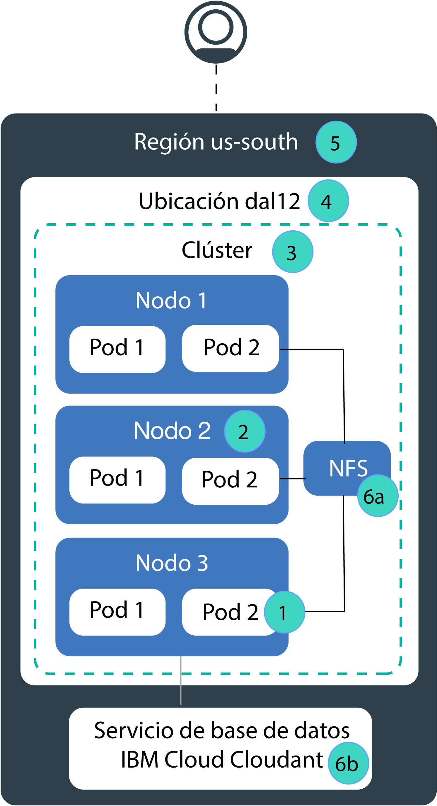

---

copyright:
  years: 2014, 2019
lastupdated: "2019-06-05"

keywords: kubernetes, iks, disaster recovery, dr, ha, hadr

subcollection: containers

---

{:new_window: target="_blank"}
{:shortdesc: .shortdesc}
{:screen: .screen}
{:pre: .pre}
{:table: .aria-labeledby="caption"}
{:codeblock: .codeblock}
{:tip: .tip}
{:note: .note}
{:important: .important}
{:deprecated: .deprecated}
{:download: .download}
{:preview: .preview}

# Alta disponibilidad para {{site.data.keyword.containerlong_notm}}
{: #ha}

Utilice las características incorporadas de Kubernetes y {{site.data.keyword.containerlong}} para aumentar la alta disponibilidad del clúster y proteger la app contra el tiempo de inactividad cuando falle un componente del clúster.
{: shortdesc}

La alta disponibilidad es una disciplina fundamental en una infraestructura de TI para mantener las apps en funcionamiento, incluso cuando se produce un error de sitio parcial o completo. El objetivo principal de la alta disponibilidad es eliminar posibles puntos de anomalía en una infraestructura de TI. Por ejemplo, puede prepararse por si falla un sistema añadiendo redundancia y estableciendo mecanismos de migración tras error.

Puede conseguir una alta disponibilidad en diferentes niveles en la infraestructura de TI y en diferentes componentes del clúster. El nivel de disponibilidad adecuado para cada usuario depende de varios factores, como los requisitos empresariales, los acuerdos de nivel de servicio que se tengan con los clientes y el dinero que se desee gastar.

## Visión general de posibles puntos de anomalía en {{site.data.keyword.containerlong_notm}}
{: #fault_domains}

La arquitectura y la infraestructura de {{site.data.keyword.containerlong_notm}} están diseñadas para garantizar la fiabilidad, la baja latencia de procesamiento y el tiempo máximo de actividad del servicio. Sin embargo, se pueden producir errores. Según el servicio que aloje en {{site.data.keyword.Bluemix_notm}}, es posible que no pueda tolerar errores, aunque solo duren unos minutos.
{: shortdesc}

{{site.data.keyword.containerlong_notm}} proporciona varios enfoques para añadir más disponibilidad al clúster añadiendo redundancia y antiafinidad. Revise la imagen siguiente para obtener más información sobre los posibles puntos de anomalía y sobre cómo eliminarlos.

<dl>
<dt> 1. Anomalía de contenedor o de pod.</dt>
  <dd>
Los contenedores y pods son, por diseño, efímeros y pueden fallar inesperadamente. Por ejemplo, un contenedor o pod puede colgarse si se produce un error en la app. Para que la app tenga alta disponibilidad, debe asegurarse de que tiene suficientes instancias de la app para manejar la carga de trabajo, además de instancias adicionales en caso de error. Idealmente, estas instancias se distribuyen entre varios nodos trabajadores para proteger la app ante un error del nodo trabajador.

  
Consulte [Despliegue de apps de alta disponibilidad](/docs/containers?topic=containers-app#highly_available_apps).
</dd>
<dt> 2. Anomalía de un nodo trabajador.</dt>
  <dd>
Un nodo trabajador es una máquina virtual que se ejecuta sobre un hardware físico. Los errores de nodo trabajador incluyen interrupciones de hardware, como alimentación, refrigeración o redes, y los problemas de la propia máquina virtual. Para estar preparado ante un error de nodo trabajador, puede configurar varios nodos trabajadores en el clúster.

No se garantiza que los nodos trabajadores de una zona se alojen en hosts de cálculo físicos independientes. Por ejemplo, puede tener un clúster con 3 nodos trabajadores, pero que los 3 nodos trabajadores se hayan creado en el mismo host de cálculo físico en la zona de IBM. Si este host de cálculo físico pasa a estar inactivo, todos los nodos trabajadores estarán inactivos. Para protegerse frente a esta anomalía, debe [configurar un clúster multizona o crear varios clústeres de una sola zona](/docs/containers?topic=containers-ha_clusters#ha_clusters) en diferentes zonas.

  
Consulte [Creación de clústeres con varios nodos trabajadores.](/docs/containers?topic=containers-cli-plugin-kubernetes-service-cli#cs_cluster_create)
</dd>
<dt> 3. Anomalía de clúster.</dt>
  <dd>
El [nodo maestro de Kubernetes](/docs/containers?topic=containers-ibm-cloud-kubernetes-service-technology#architecture) es el componente principal que mantiene el clúster en funcionamiento. El nodo maestro almacena los recursos de clúster y sus configuraciones en la base de datos etcd, que sirve como único punto fiable para el clúster. El servidor de API de Kubernetes es el punto de entrada principal para todas las solicitudes de gestión del clúster procedentes de los nodos trabajadores destinadas al nodo maestro, o cuando desea interactuar con los recursos de clúster.  Si se produce un fallo del nodo maestro, las cargas de trabajo siguen ejecutándose en los nodos trabajadores, pero no se pueden utilizar mandatos `kubectl` para trabajar con los recursos del clúster o ver el estado del clúster hasta que el servidor de API de Kubernetes del nodo maestro vuelve a estar activo. Si un pod cae durante la interrupción del nodo maestro, el pod no se puede volver a planificar hasta que el nodo trabajador pueda volver a acceder al servidor de API de Kubernetes.  Durante una interrupción del nodo maestro, todavía puede ejecutar mandatos `ibmcloud ks` en la API de {{site.data.keyword.containerlong_notm}} para trabajar con los recursos de la infraestructura, como nodos trabajadores o VLAN. Si cambia la configuración actual del clúster añadiendo o eliminando nodos trabajadores en el clúster, los cambios no se producen hasta que el nodo maestro vuelve a estar activo.

No reinicie o rearranque un nodo trabajador durante una interrupción del nodo maestro. Esta acción elimina los pods del nodo trabajador. Puesto que el servidor de API de Kubernetes no está disponible, los pods no se pueden volver a programar en otros nodos trabajadores del clúster.
{: important}
 Los clústeres maestros tienen alta disponibilidad e incluyen réplicas para que el servidor de API de Kubernetes, etcd, el planificador y el gestor de controladores en hosts independientes puedan protegerse frente a interrupciones como, por ejemplo, una actualización del maestro.

Para proteger el maestro de clúster de un fallo zonal, puede: <ul><li>Cree un clúster en una [ubicación metropolitana multizona](/docs/containers?topic=containers-regions-and-zones#zones), que distribuye el maestro entre las zonas.</li><li>Configurar un segundo clúster en otra zona.</li></ul>

  
Consulte [Configuración de clústeres de alta disponibilidad.](/docs/containers?topic=containers-ha_clusters#ha_clusters)
</dd>
<dt> 4. Anomalía de una zona.</dt>
  <dd>
Los errores de zona afectan a todos los hosts de cálculo físico y al almacenamiento NFS. Los errores pueden ser interrupciones de alimentación, refrigeración, red o almacenamiento, y desastres naturales, como inundaciones, terremotos y huracanes. Para estar protegido ante un error de zona, debe tener clústeres en dos zonas diferentes en las que equilibre la carga un equilibrador de carga externo.

  
Consulte [Configuración de clústeres de alta disponibilidad](/docs/containers?topic=containers-ha_clusters#ha_clusters).
</dd>    
<dt> 5. Anomalía de una región.</dt>
  <dd>
Cada región está configurada con un equilibrador de carga de alta disponibilidad al que se puede acceder desde el punto final de la API específico de la región. El equilibrador de carga direcciona solicitudes de entrada y salida a los clústeres en las zonas regionales. La probabilidad de que se produzca un error global de región es baja. Sin embargo, para estar preparado ante este error, puede configurar varios clústeres en diferentes regiones y conectarlos mediante un equilibrador de carga externo. En caso de que falle toda una región, el clúster de la otra región puede asumir la carga de trabajo.

Un clúster de varias regiones requiere varios recursos de nube y, en función de la app, puede ser complejo y costoso. Compruebe si necesita una configuración de varias regiones o si podría tolerar una interrupción potencial del servicio. Si desea configurar un clúster de varias regiones, asegúrese de que la app y los datos se pueden alojar en otra región, y que la app admite la réplica de datos globales.

  
Consulte [Configuración de clústeres de alta disponibilidad](/docs/containers?topic=containers-ha_clusters#ha_clusters).
</dd>   
<dt> 6a, 6b. Anomalía del almacenamiento.</dt>
  <dd>
En una app con estado, los datos desempeñan un papel importante para mantener la app en funcionamiento. Asegúrese de que los datos son de alta disponibilidad, de forma que pueda recuperarse de un error potencial. En {{site.data.keyword.containerlong_notm}} puede elegir entre varias opciones para conservar los datos. Por ejemplo, puede suministrar almacenamiento NFS utilizando volúmenes persistentes nativos de Kubernetes, o almacenar los datos utilizando un servicio de base de datos de {{site.data.keyword.Bluemix_notm}}.

  
Consulte [Planificación de datos de alta disponibilidad](/docs/containers?topic=containers-storage_planning#persistent_storage_overview).
</dd>
</dl>
