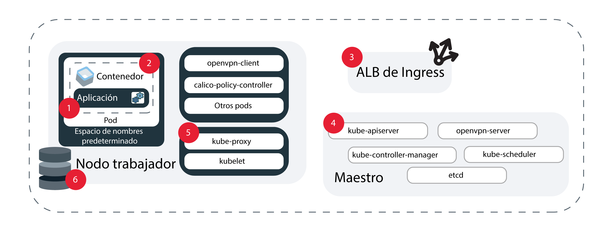

---

copyright:
  years: 2014, 2019
lastupdated: "2019-06-11"

keywords: kubernetes, iks, logmet, logs, metrics

subcollection: containers

---

{:new_window: target="_blank"}
{:shortdesc: .shortdesc}
{:screen: .screen}
{:pre: .pre}
{:table: .aria-labeledby="caption"}
{:codeblock: .codeblock}
{:tip: .tip}
{:note: .note}
{:important: .important}
{:deprecated: .deprecated}
{:download: .download}
{:preview: .preview}


# Registro y supervisión
{: #health}

Configure el registro y la supervisión en {{site.data.keyword.containerlong}} para ayudarle a resolver los problemas y mejorar el estado y el rendimiento de las apps y los clústeres de Kubernetes.
{: shortdesc}

La supervisión y el registro continuos son la clave para detectar ataques en el clúster y para resolver problemas a medida que surjan. Mediante la supervisión continua del clúster, puede comprender mejor la capacidad del clúster y la disponibilidad de los recursos que están disponibles para la app. Con esta perspectiva, puede prepararse para proteger sus apps frente a un tiempo de inactividad. **Nota**: Para
configurar el registro y la supervisión, debe utilizar un clúster estándar en {{site.data.keyword.containerlong_notm}}.

## Elección de una solución de registro
{: #logging_overview}

De forma predeterminada, los registros se generan y se escriben localmente para todos los componentes siguientes de clúster de {{site.data.keyword.containerlong_notm}}: nodos trabajadores, contenedores, aplicaciones, almacenamiento persistente, equilibrador de carga de aplicación de Ingress, API de Kubernetes y espacio de nombres `kube-system`. Hay varias soluciones de registro disponibles para recopilar, reenviar y ver estos registros.
{: shortdesc}

Puede elegir la solución de registro en función de los componentes de clúster para los que se deben recopilar registros. Una implementación común consiste en elegir el servicio de registro que prefiera en función de sus posibilidades de análisis y de interfaz, como por ejemplo {{site.data.keyword.loganalysisfull}}, {{site.data.keyword.la_full}} o un servicio de terceros. A continuación, puede utilizar {{site.data.keyword.cloudaccesstrailfull}} para auditar la actividad de usuario en el clúster y hacer copia de seguridad de los registros maestros del clúster en {{site.data.keyword.cos_full}}. **Nota**: Para configurar el registro, debe tener un clúster estándar de Kubernetes.

<dl>

<dt>{{site.data.keyword.la_full_notm}}</dt>
<dd>Para gestionar los registros del contenedor del pod, despliegue LogDNA como servicio de terceros en el clúster. Para utilizar {{site.data.keyword.la_full_notm}}, debe desplegar un agente de registro en cada nodo trabajador del clúster. Este agente recopila los registros con la extensión `*.log` y los archivos sin extensión almacenados en el directorio `/var/log` de su pod desde todos los espacios de nombres, incluido `kube-system`. A continuación, el agente reenvía los registros al servicio {{site.data.keyword.la_full_notm}}. Para obtener más información sobre el servicio, consulte la documentación de [{{site.data.keyword.la_full_notm}}](/docs/services/Log-Analysis-with-LogDNA?topic=LogDNA-about). Para empezar, consulte
[Gestión de registros de clúster de Kubernetes con {{site.data.keyword.loganalysisfull_notm}} con LogDNA](/docs/services/Log-Analysis-with-LogDNA/tutorials?topic=LogDNA-kube#kube).
</dd>

<dt>Fluentd con {{site.data.keyword.loganalysisfull_notm}}</dt>
<dd><p class="deprecated">Anteriormente, podía crear una configuración de registro de modo que se enviaran los registros recopilados por el componente de clúster Fluentd a {{site.data.keyword.loganalysisfull_notm}}. A partir del 30 de abril de 2019, ya no se pueden suministrar nuevas instancias de {{site.data.keyword.loganalysisshort_notm}}, y se han suprimido todas las instancias del plan Lite. Se da soporte a las instancias existentes del plan premium hasta el 30 de septiembre de 2019. Para seguir recopilando registros para el clúster, debe configurar {{site.data.keyword.la_full_notm}} o cambiar la configuración de modo que reenvíe los registros a un servidor externo.</p>
</dd>

<dt>Fluentd con un servidor externo</dt>
<dd>Para recopilar, reenviar y ver registros correspondientes a un componente del clúster, puede crear una configuración de registro mediante Fluentd. Cuando se crea una configuración de registro, el componente del clúster [Fluentd ](https://www.fluentd.org/) recopila registros de las vías de acceso para un origen especificado. Luego Fluentd puede reenviar estos registros a un servidor externo que acepte un protocolo syslog. Para empezar, consulte
[Visión general del reenvío de registros de clúster y de app a syslog](#logging).
</dd>

<dt>{{site.data.keyword.cloudaccesstrailfull_notm}}</dt>
<dd>Para supervisar la actividad administrativa iniciada por el usuario que se realiza en el clúster, puede recopilar y reenviar registros de auditoría a {{site.data.keyword.cloudaccesstrailfull_notm}}. Los clústeres generan dos tipos de sucesos de {{site.data.keyword.cloudaccesstrailshort}}.
<ul><li>Los sucesos de gestión del clúster se generan automáticamente y se reenvían a {{site.data.keyword.cloudaccesstrailshort}}.</li>
<li>Los sucesos de auditoría de servidor de API de Kubernetes se generan automáticamente, pero debe [crear una configuración de registro](#api_forward) para que Fluentd pueda reenviar estos registros a {{site.data.keyword.cloudaccesstrailshort}}.</li></ul>
Para obtener más información sobre los tipos de sucesos de {{site.data.keyword.containerlong_notm}} de los que puede realizar un seguimiento, consulte [sucesos de Activity Tracker](/docs/containers?topic=containers-at_events). Para obtener más información sobre el servicio, consulte la documentación de [Activity Tracker](/docs/services/cloud-activity-tracker?topic=cloud-activity-tracker-getting-started).
<p class="note">{{site.data.keyword.containerlong_notm}} no está configurado actualmente para que utilice {{site.data.keyword.at_full}}. Para gestionar los sucesos de gestión de clústeres y los registros de auditoría de API de Kubernetes, siga utilizando {{site.data.keyword.cloudaccesstrailfull_notm}} con LogAnalysis.</p>
</dd>

<dt>{{site.data.keyword.cos_full_notm}}</dt>
<dd>Para recopilar, reenviar y ver registros para el nodo maestro de Kubernetes del clúster, puede tomar una instantánea de los registros maestros en cualquier punto en el tiempo para recopilarlos en un grupo de {{site.data.keyword.cos_full_notm}}. La instantánea incluye todo lo que se envía a través del servidor de API, como la planificación del pod, los despliegues o las políticas RBAC. Para empezar, consulte [Recopilación de registros maestros](#collect_master).</dd>

<dt>Servicios de terceros</dt>
<dd>Si tiene requisitos especiales, puede configurar su propia solución de registro. Consulte los servicios de registro de terceros que puede añadir a su clúster en el apartado sobre [Integraciones de registro y de supervisión](/docs/containers?topic=containers-supported_integrations#health_services). Puede recopilar registros de contenedor desde la vía de acceso `/var/log/pods/`.</dd>

</dl>

<br />


## Reenvío de registros de clúster y de app a {{site.data.keyword.la_full_notm}}
{: #logdna}

Para gestionar los registros del contenedor del pod, despliegue LogDNA como servicio de terceros en el clúster.
{: shortdesc}

Para utilizar {{site.data.keyword.la_full_notm}}, debe desplegar un agente de registro en cada nodo trabajador del clúster. Este agente recopila los registros con la extensión `*.log` y los archivos sin extensión almacenados en el directorio `/var/log` de su pod desde todos los espacios de nombres, incluido `kube-system`. A continuación, el agente reenvía los registros al servicio {{site.data.keyword.la_full_notm}}. Para obtener más información sobre el servicio, consulte la documentación de [{{site.data.keyword.la_full_notm}}](/docs/services/Log-Analysis-with-LogDNA?topic=LogDNA-about). Para empezar, consulte
[Gestión de registros de clúster de Kubernetes con {{site.data.keyword.loganalysisfull_notm}} con LogDNA](/docs/services/Log-Analysis-with-LogDNA/tutorials?topic=LogDNA-kube#kube).

<br />


## En desuso: Reenvío de registros de clúster, app y auditoría de API de Kubernetes a {{site.data.keyword.loganalysisfull_notm}}
{: #loga}

Anteriormente, podía crear una configuración de registro de modo que se enviaran los registros recopilados por el componente de clúster Fluentd a {{site.data.keyword.loganalysisfull_notm}}. Desde el 30 de abril de 2019, {{site.data.keyword.loganalysisfull_notm}} está en desuso. No se pueden suministrar nuevas instancias de {{site.data.keyword.loganalysisshort_notm}}, y se han suprimido todas las instancias del plan Lite. Se da soporte a las instancias existentes del plan premium hasta el 30 de septiembre de 2019.
{: deprecated}

Para seguir recopilando registros para el clúster, tiene las siguientes opciones:
* Configurar {{site.data.keyword.la_full_notm}}. Para obtener más información, consulte [Transición a {{site.data.keyword.la_full_notm}}](/docs/services/CloudLogAnalysis?topic=cloudloganalysis-transition).
* [Cambiar la configuración de modo que los registros se reenvíen a un servidor externo](#configuring).

Para obtener más información sobre las instancias de {{site.data.keyword.loganalysisshort_notm}} existentes, consulte la [documentación de {{site.data.keyword.loganalysisshort_notm}}](/docs/services/CloudLogAnalysis?topic=cloudloganalysis-containers_kube_other_logs).

<br />


## Reenvío de registros de clúster, app y auditoría de API de Kubernetes a un servidor externo
{: #configuring}

Configure el reenvío de registros para los clústeres estándares de {{site.data.keyword.containerlong_notm}} a un servidor externo.
{: shortdesc}

### Visión general del reenvío de registros a un servidor externo
{: #logging}

De forma predeterminada, los registros se recopilan mediante el complemento [Fluentd ](https://www.fluentd.org/) en el clúster. Cuando se crea una configuración de registro para un origen en el clúster, como por ejemplo un contenedor, los registros que Fluentd recopila de las vías de acceso de dicho origen se reenvían a un servidor externo. El tráfico entre el origen y el servicio de registro del puerto de ingestión está cifrado.
{: shortdesc}

**¿Para qué códigos fuente puedo configurar el reenvío de registros?**

En la imagen siguiente puede ver la ubicación de los códigos fuente para los que puede configurar el registro.



1. `worker`: información específica de la configuración de la infraestructura que tiene para el nodo trabajador. Los registros de nodo trabajador se capturan en syslog y contienen sucesos del sistema operativo. En `auth.log` encontrará información sobre las solicitudes de autenticación que se realizan en el sistema operativo.</br>**Vías de acceso**:
    * `/var/log/syslog`
    * `/var/log/auth.log`

2. `container`: información que registra un contenedor en ejecución. </br>**Paths**: todo lo que se escribe en `STDOUT` o `STDERR`.

3. `application`: información sobre los sucesos que se producen a nivel de aplicación. Puede ser la notificación de que se ha producido un suceso, como un inicio de sesión correcto, un aviso sobre almacenamiento u otras operaciones que se puedan realizar a nivel de app.</br>**Vías de acceso**: puede definir las vías de acceso a las que se reenvían los registros. Sin embargo, para que se puedan enviar los registros, se debe utilizar una vía de acceso absoluta en la configuración de registro o, de lo contrario, no se podrán leer los registros. Si la vía de acceso está montada en su nodo trabajador, podría haber creado un enlace simbólico. Ejemplo: si la vía de acceso especificada es `/usr/local/spark/work/app-0546/0/stderr` pero los registros realmente van a `/usr/local/spark-1.0-hadoop-1.2/work/app-0546/0/stderr`, los registros no se pueden leer.

4. `storage`: información sobre el almacenamiento persistente configurado en el clúster. Los registros de almacenamiento le pueden ayudar a configurar alertas y paneles de control de determinación de problemas como parte de los releases de producción y conducto de DevOps. **Nota**: las vías de acceso
`/var/log/kubelet.log` y `/var/log/syslog` también contienen registros de almacenamiento, pero los registros de estas vías de acceso se recopilan mediante los orígenes de registro `kubernetes` y `worker`.</br>**Vías de acceso**:
    * `/var/log/ibmc-s3fs.log`
    * `/var/log/ibmc-block.log`

  **Pods**:
    * `portworx-***`
    * `ibmcloud-block-storage-attacher-***`
    * `ibmcloud-block-storage-driver-***`
    * `ibmcloud-block-storage-plugin-***`
    * `ibmcloud-object-storage-plugin-***`

5. `kubernetes`: información de kubelet, kube-proxy y otros sucesos de Kubernetes que se producen en el espacio de nombres kube-system del nodo trabajador.</br>**Vías de acceso**:
    * `/var/log/kubelet.log`
    * `/var/log/kube-proxy.log`
    * `/var/log/event-exporter/1..log`

6. `kube-audit`: información sobre las acciones relacionadas con el clúster que se envía al servidor de API de Kubernetes, que incluye la hora, el usuario y el recurso afectado.

7. `ingress`: información sobre el tráfico de red que entra en un clúster a través del ALB de Ingress .</br>**Vías de acceso**:
    * `/var/log/alb/ids/*.log`
    * `/var/log/alb/ids/*.err`
    * `/var/log/alb/customerlogs/*.log`
    * `/var/log/alb/customerlogs/*.err`

</br>

**¿Qué opciones de configuración tengo?**

En la tabla siguiente se muestran las distintas opciones que tiene para configurar el registro y sus descripciones.

<table>
<caption> Visión general de las opciones de configuración del registro</caption>
  <thead>
    <th>Opción</th>
    <th>Descripción</th>
  </thead>
  <tbody>
    <tr>
      <td><code><em>&lt;cluster_name_or_ID&gt;</em></code></td>
      <td>El nombre o ID del clúster.</td>
    </tr>
    <tr>
      <td><code><em>--log_source</em></code></td>
      <td>El origen desde el que desea reenviar los registros. Los valores aceptados son <code>container</code>, <code>application</code>, <code>worker</code>, <code>kubernetes</code>, <code>ingress</code>, <code>storage</code> y <code>kube-audit</code>. Este argumento da soporte a una lista de orígenes de registro separados por comas a los que aplicar la configuración. Si no especifica un origen de registro, las configuraciones de registro se crean para los orígenes de registro <code>container</code> e <code>ingress</code>.</td>
    </tr>
    <tr>
      <td><code><em>--type syslog</em></code></td>
      <td>El valor <code>syslog</code> reenvía los registros a un servidor externo.</p>
      </dd></td>
    </tr>
    <tr>
      <td><code><em>--namespace</em></code></td>
      <td>Opcional: el espacio de nombres de Kubernetes desde el que desea reenviar los registros. El reenvío de registros no recibe soporte para los espacios de nombres de Kubernetes <code>ibm-system</code> y <code>kube-system</code>. Este valor sólo es válido para el origen de registro <code>container</code>. Si no especifica un espacio de nombres, todos los espacios de nombres del clúster utilizarán esta configuración.</td>
    </tr>
    <tr>
      <td><code><em>--hostname</em></code></td>
      <td><p>Para {{site.data.keyword.loganalysisshort_notm}}, utilice el [URL de ingesta](/docs/services/CloudLogAnalysis?topic=cloudloganalysis-log_ingestion#log_ingestion_urls). Si no especifica un URL de ingesta, se utiliza el punto final de la región en la que ha creado el clúster.</p>
      <p>Para syslog, especifique el nombre de host o la dirección IP del servicio del recopilador de registros.</p></td>
    </tr>
    <tr>
      <td><code><em>--port</em></code></td>
      <td>El puerto de ingesta. Si no especifica un puerto, se utiliza el puerto estándar, <code>9091</code>.
      <p>Para syslog, especifique el puerto del servicio del recopilador de registros. Si no especifica un puerto, se utiliza el puerto estándar, <code>514</code>.</td>
    </tr>
    <tr>
      <td><code><em>--app-containers</em></code></td>
      <td>Opcional: para reenviar registros de apps, puede especificar el nombre del contenedor que contiene la app. Puede especificar más de un contenedor mediante una lista separada por comas. Si no se especifica ningún contenedor, se reenvían los registros de todos los contenedores que contienen las vías de acceso indicadas.</td>
    </tr>
    <tr>
      <td><code><em>--app-paths</em></code></td>
      <td>Vía de acceso en el contenedor en la que las apps crearán los registros. Para reenviar registros con el tipo de origen <code>application</code>, debe proporcionar una vía de acceso. Para especificar más de una vía de acceso, utilice una lista separada por comas. Ejemplo: <code>/var/log/myApp1/*,/var/log/myApp2/*</code></td>
    </tr>
    <tr>
      <td><code><em>--syslog-protocol</em></code></td>
      <td>Cuando el tipo de registro es <code>syslog</code>, el protocolo de la capa de transporte. Puede utilizar los siguientes protocolos: `udp`, `tls` o `tcp`. Cuando se reenvía a un servidor syslog con el protocolo <code>udp</code>, se truncan los registros por encima de 1 KB.</td>
    </tr>
    <tr>
      <td><code><em>--ca-cert</em></code></td>
      <td>Obligatorio: cuando el tipo de registro es <code>syslog</code> y el protocolo es <code>tls</code>, el nombre de secreto de Kubernetes que contiene el certificado de la entidad emisora de certificados.</td>
    </tr>
    <tr>
      <td><code><em>--verify-mode</em></code></td>
      <td>Cuando el tipo de registro es <code>syslog</code> y el protocolo es <code>tls</code>, la modalidad de verificación. Los valores soportados son <code>verify-peer</code> y el valor predeterminado <code>verify-none</code>.</td>
    </tr>
    <tr>
      <td><code><em>--skip-validation</em></code></td>
      <td>Opcional: omite la validación de los nombres de espacio y organización cuando se especifican. Al omitir la validación, disminuye el tiempo de proceso, pero si la configuración de registro no es válida, los registros no se reenviarán correctamente.</td>
    </tr>
  </tbody>
</table>

**¿Soy el responsable de mantener actualizado Fluentd?**

Para modificar las configuraciones de registro o de filtro, debe tener la versión más reciente del componente Fluentd. De forma predeterminada, las actualizaciones automáticas del complemento están habilitadas. Para inhabilitar las actualizaciones automáticas, consulte [Actualización de complementos de clúster: Fluentd para registro](/docs/containers?topic=containers-update#logging-up).

**¿Puedo reenviar algunos registros, pero no otros, desde un origen de mi clúster?**

Sí. Por ejemplo, si tiene un pod con muchas conversaciones, quizás desee evitar que los registros procedentes de dicho pod ocupen espacio de almacenamiento de registros, pero permitir que se reenvíen los registros de otros pods. Para evitar que se reenvíen los registros procedentes de un determinado pod, consulte [Filtrado de registros](#filter-logs).

<br />


### Reenvío de registros de clúster y de app
{: #enable-forwarding}

Cree una configuración para el registro de clúster y de app. Puede diferenciar entre las diferentes opciones de registro mediante distintivos.
{: shortdesc}

**Reenvío de registros a su propio servidor a través de los protocolos `udp` o `tcp`**

1. Asegúrese de tener el [rol de plataforma **Editor** o **Administrador** de {{site.data.keyword.Bluemix_notm}} IAM](/docs/containers?topic=containers-users#platform).

2. Para el clúster en el que se encuentra el origen de registro: [Inicie la sesión en la cuenta. Si procede, apunte al grupo de recursos adecuado. Establezca el contexto para el clúster.](/docs/containers?topic=containers-cs_cli_install#cs_cli_configure)

3. Configure un servidor que acepte un protocolo syslog de una de estas 2 maneras:
  * Puede configurar y gestionar su propio servidor o dejar que lo gestione un proveedor. Si un proveedor gestiona el servidor, obtenga el punto final de registro del proveedor de registro.

  * Puede ejecutar syslog desde un contenedor. Por ejemplo, puede utilizar este archivo [deployment .yaml ](https://github.com/IBM-Cloud/kube-samples/blob/master/deploy-apps-clusters/deploy-syslog-from-kube.yaml) para obtener una imagen pública de Docker que ejecute un contenedor en su clúster. La imagen publica el puerto `514` en la dirección IP del clúster público y utiliza esta dirección IP del clúster público para configurar el host de syslog.

  Puede ver los registros como JSON válido eliminando prefijos syslog. Para ello, añada el siguiente código al principio del archivo <code>etc/rsyslog.conf</code> en el que se ejecuta el servidor de rsyslog: <code>$template customFormat,"%msg%\n"</br>$ActionFileDefaultTemplate customFormat</code>
  {: tip}

4. Cree una configuración de reenvío de registro.
    ```
    ibmcloud ks logging-config-create --cluster <cluster_name_or_ID> --logsource <log_source> --namespace <kubernetes_namespace> --hostname <log_server_hostname_or_IP> --port <log_server_port> --type syslog --app-containers <containers> --app-paths <paths_to_logs> --syslog-protocol <protocol> --skip-validation
    ```
    {: pre}

</br></br>

**Reenvío de registros a su propio servidor a través del protocolo `tls`**

Los pasos siguientes son instrucciones generales. Antes de utilizar el contenedor en un entorno de producción, asegúrese de que se cumplen todos los requisitos de seguridad que necesite.
{: tip}

1. Asegúrese de que tiene los siguientes [roles de {{site.data.keyword.Bluemix_notm}} IAM](/docs/containers?topic=containers-users#platform):
    * Rol de plataforma **Editor** o **Administrador** para el clúster
    * Rol de servicio de **Escritor** o de **Gestor** para el espacio de nombres `kube-system`

2. Para el clúster en el que se encuentra el origen de registro: [Inicie la sesión en la cuenta. Si procede, apunte al grupo de recursos adecuado. Establezca el contexto para el clúster.](/docs/containers?topic=containers-cs_cli_install#cs_cli_configure)

3. Configure un servidor que acepte un protocolo syslog de una de estas 2 maneras:
  * Puede configurar y gestionar su propio servidor o dejar que lo gestione un proveedor. Si un proveedor gestiona el servidor, obtenga el punto final de registro del proveedor de registro.

  * Puede ejecutar syslog desde un contenedor. Por ejemplo, puede utilizar este archivo [deployment .yaml ](https://github.com/IBM-Cloud/kube-samples/blob/master/deploy-apps-clusters/deploy-syslog-from-kube.yaml) para obtener una imagen pública de Docker que ejecute un contenedor en su clúster. La imagen publica el puerto `514` en la dirección IP del clúster público y utiliza esta dirección IP del clúster público para configurar el host de syslog. Debe inyectar la entidad emisora de certificados relevante y los certificados del lado del servidor y actualizar `syslog.conf` para habilitar `tls` en el servidor.

4. Guarde el certificado de la autoridad emisora de certificados en un archivo llamado `ca-cert`. Debe tener exactamente este nombre.

5. Cree un secreto en el espacio de nombres `kube-system` para el archivo `ca-cert`. Cuando cree la configuración de registro, utilice el nombre secreto para el distintivo `--ca-cert`.
    ```
    kubectl -n kube-system create secret generic --from-file=ca-cert
    ```
    {: pre}

6. Cree una configuración de reenvío de registro.
    ```
    ibmcloud ks logging-config-create --cluster <cluster name or id> --logsource <log source> --type syslog --syslog-protocol tls --hostname <ip address of syslog server> --port <port for syslog server, 514 is default> --ca-cert <secret name> --verify-mode <defaults to verify-none>
    ```
    {: pre}

### Reenvío de registros de auditoría de API de Kubernetes
{: #audit_enable}

Para auditar cualquier suceso que se pasa a través del servidor de API de Kubernetes, puede crear una configuración que reenvíe los sucesos a un servidor externo.
{: shortdesc}

Para obtener más información sobre los registros de auditoría de Kubernetes, consulte el <a href="https://kubernetes.io/docs/tasks/debug-application-cluster/audit/" target="blank">tema sobre auditoría </a> en la documentación de Kubernetes.

* Actualmente, se utiliza una política de auditoría predeterminada para todos los clústeres con esta configuración de registro.
* Actualmente no se da soporte a filtros.
* Sólo puede haber una configuración `kube-audit` por clúster, sin embargo, es posible reenviar los registros a {{site.data.keyword.cloudaccesstrailshort}} y a un servidor externo creando un webhook y una configuración de registro.
* Debe tener el [rol de plataforma **Administrador** de {{site.data.keyword.Bluemix_notm}} IAM](/docs/containers?topic=containers-users#platform) para el clúster.

**Antes de empezar**

1. Configure un servidor de registro remoto donde puede reenviar los registros. Por ejemplo, puede [utilizar Logstash con Kubernetes ](https://kubernetes.io/docs/tasks/debug-application-cluster/audit/#use-logstash-to-collect-and-distribute-audit-events-from-webhook-backend) para recopilar sucesos de auditoría.

2. Para el clúster del que desea recopilar registros de auditoría de servidor de API: [Inicie la sesión en la cuenta. Si procede, apunte al grupo de recursos adecuado. Establezca el contexto para el clúster.](/docs/containers?topic=containers-cs_cli_install#cs_cli_configure)

Para reenviar registros de auditoría de API de Kubernetes:

1. Configuración del webhook. Si no proporciona ninguna información en los distintivos, se utiliza una configuración predeterminada.

    ```
    ibmcloud ks apiserver-config-set audit-webhook <cluster_name_or_ID> --remoteServer <server_URL_or_IP> --caCert <CA_cert_path> --clientCert <client_cert_path> --clientKey <client_key_path>
    ```
    {: pre}

  <table>
  <caption>Descripción de los componentes de este mandato</caption>
    <thead>
      <th colspan=2> Descripción de los componentes de este mandato</th>
    </thead>
    <tbody>
      <tr>
        <td><code><em>&lt;cluster_name_or_ID&gt;</em></code></td>
        <td>El nombre o ID del clúster.</td>
      </tr>
      <tr>
        <td><code><em>&lt;server_URL&gt;</em></code></td>
        <td>La dirección IP o el URL del servicio de registro remoto al que desea enviar registros. Los certificados se ignoran si se proporciona un URL de servidor no seguro.</td>
      </tr>
      <tr>
        <td><code><em>&lt;CA_cert_path&gt;</em></code></td>
        <td>La vía de acceso de archivo del certificado de CA que se utiliza para verificar el servicio de registro remoto.</td>
      </tr>
      <tr>
        <td><code><em>&lt;client_cert_path&gt;</em></code></td>
        <td>La vía de acceso de archivo del certificado de cliente que se utiliza para autenticarse en el servicio de registro remoto.</td>
      </tr>
      <tr>
        <td><code><em>&lt;client_key_path&gt;</em></code></td>
        <td>La vía de acceso de archivo de la clave de cliente correspondiente que se utiliza para conectarse al servicio de registro remoto.</td>
      </tr>
    </tbody>
  </table>

2. Verifique que el reenvío de registros se ha habilitado consultando el URL del servicio de registro remoto.

    ```
    ibmcloud ks apiserver-config-get audit-webhook <cluster_name_or_ID>
    ```
    {: pre}

    Salida de ejemplo:
    ```
    OK
    Server:			https://8.8.8.8
    ```
    {: screen}

3. Aplique la actualización de configuración reiniciando el maestro de Kubernetes.

    ```
    ibmcloud ks apiserver-refresh --cluster <cluster_name_or_ID>
    ```
    {: pre}

4. Opcional: si desea detener el reenvío de registros de auditoría, puede inhabilitar su configuración.
    1. Para el clúster del que desea dejar de recopilar registros de auditoría de servidor de API: [Inicie la sesión en la cuenta. Si procede, apunte al grupo de recursos adecuado. Establezca el contexto para el clúster.](/docs/containers?topic=containers-cs_cli_install#cs_cli_configure)
    2. Inhabilite la configuración del programa de fondo del webhook para el servidor de API del clúster.

        ```
        ibmcloud ks apiserver-config-unset audit-webhook <cluster_name_or_ID>
        ```
        {: pre}

    3. Aplique la actualización de configuración reiniciando el maestro de Kubernetes.

        ```
        ibmcloud ks apiserver-refresh --cluster <cluster_name_or_ID>
        ```
        {: pre}

### Filtrado de los registros que se reenvían
{: #filter-logs}

Puede elegir qué registros se deben reenviar al servidor externo filtrando registros específicos durante un periodo de tiempo. Puede diferenciar entre las diferentes opciones de filtrado mediante distintivos.
{: shortdesc}

<table>
<caption>Visión general de las opciones para el filtrado de registros</caption>
  <thead>
    <th colspan=2> Visión general de las opciones de filtrado de registros</th>
  </thead>
  <tbody>
    <tr>
      <td>&lt;cluster_name_or_ID&gt;</td>
      <td>Obligatorio: nombre o ID de clúster cuyos registros desea filtrar.</td>
    </tr>
    <tr>
      <td><code>&lt;log_type&gt;</code></td>
      <td>Tipo de registro al que aplicar el filtro. Actualmente se da soporte a <code>all</code>, <code>container</code> y <code>host</code>.</td>
    </tr>
    <tr>
      <td><code>&lt;configs&gt;</code></td>
      <td>Opcional: una lista separada por comas de los ID de configuración de registro. Si no se proporciona, el filtro se aplica a todas las configuraciones de registro de clúster que se pasan al filtro. Puede ver las configuraciones de registro que coinciden con el filtro utilizando la opción <code>--show-matching-configs</code>.</td>
    </tr>
    <tr>
      <td><code>&lt;kubernetes_namespace&gt;</code></td>
      <td>Opcional: el espacio de nombres de Kubernetes desde el que desea reenviar los registros. Este distintivo sólo se aplica cuando se utiliza el tipo de registro de <code>container</code>.</td>
    </tr>
    <tr>
      <td><code>&lt;container_name&gt;</code></td>
      <td>Opcional: nombre del contenedor desde el que desea filtrar registros.</td>
    </tr>
    <tr>
      <td><code>&lt;logging_level&gt;</code></td>
      <td>Opcional: filtra los registros en el nivel especificado y en los inferiores. Valores aceptables en su orden canónico son <code>fatal</code>, <code>error</code>, <code>warn/warning</code>, <code>info</code>, <code>debug</code> y <code>trace</code>. Por ejemplo, si filtra registros al nivel <code>info</code>, también se filtran los niveles <code>debug</code> y <code>trace</code>. **Nota**: Puede utilizar este distintivo sólo cuando los mensajes de registro están en formato JSON y contienen un campo de nivel. Para visualizar los mensajes en JSON, añada el distintivo <code>--json</code> al mandato.</td>
    </tr>
    <tr>
      <td><code>&lt;message&gt;</code></td>
      <td>Opcional: filtra los registros que contienen un mensaje concreto que se escribe como una expresión regular.</td>
    </tr>
    <tr>
      <td><code>&lt;filter_ID&gt;</code></td>
      <td>Opcional: el ID del filtro de registro.</td>
    </tr>
    <tr>
      <td><code>--show-matching-configs</code></td>
      <td>Opcional: muestra las configuraciones de registro que se aplican a cada filtro.</td>
    </tr>
    <tr>
      <td><code>--all</code></td>
      <td>Opcional: suprimir todos filtros de reenvío de registro.</td>
    </tr>
  </tbody>
</table>

1. Crear un filtro de registro.
  ```
  ibmcloud ks logging-filter-create --cluster <cluster_name_or_ID> --type <log_type> --logging-configs <configs> --namespace <kubernetes_namespace> --container <container_name> --level <logging_level> --regex-message <message>
  ```
  {: pre}

2. Visualice el filtro de registro que ha creado.

  ```
  ibmcloud ks logging-filter-get --cluster <cluster_name_or_ID> --id <filter_ID> --show-matching-configs
  ```
  {: pre}

3. Actualice el filtro de registro que ha creado.
  ```
  ibmcloud ks logging-filter-update --cluster <cluster_name_or_ID> --id <filter_ID> --type <server_type> --logging-configs <configs> --namespace <kubernetes_namespace --container <container_name> --level <logging_level> --regex-message <message>
  ```
  {: pre}

4. Suprima un filtro de registro que ha creado.

  ```
  ibmcloud ks logging-filter-rm --cluster <cluster_name_or_ID> --id <filter_ID> [--all]
  ```
  {: pre}

### Verificación, actualización y supresión del reenvío de registros
{: #verifying-log-forwarding}

**Verificación**</br>
Puede verificar que la configuración es correcta de una de estas 2 maneras:

* Para obtener una lista de todas las configuraciones de registro en un clúster:
  ```
  ibmcloud ks logging-config-get --cluster <cluster_name_or_ID>
  ```
  {: pre}

* Para obtener una lista de las configuraciones de registro para un tipo de origen de registro:
  ```
  ibmcloud ks logging-config-get --cluster <cluster_name_or_ID> --logsource <source>
  ```
  {: pre}

**Actualización**</br>
Puede actualizar una configuración de registro que ya ha creado:
```
ibmcloud ks logging-config-update --cluster <cluster_name_or_ID> --id <log_config_id> --namespace <namespace> --type <server_type> --syslog-protocol <protocol> --logsource <source> --hostname <hostname_or_ingestion_URL> --port <port> --space <cluster_space> --org <cluster_org> --app-containers <containers> --app-paths <paths_to_logs>
```
{: pre}

**Supresión**</br>
Puede detener el reenvío de registros de una o de todas las configuraciones de registro de un clúster:

* Para suprimir una configuración de registro:
  ```
  ibmcloud ks logging-config-rm --cluster <cluster_name_or_ID> --id <log_config_ID>
  ```
  {: pre}

* Para suprimir todas las configuraciones de registro:
  ```
  ibmcloud ks logging-config-rm --cluster <my_cluster> --all
  ```
  {: pre}

<br />


## Reenvío de registros de auditoría de API de Kubernetes a {{site.data.keyword.cloudaccesstrailfull_notm}}
{: #api_forward}

Kubernetes audita de forma automática los sucesos que pasan a través del servidor de API de Kubernetes. Puede reenviar los sucesos a {{site.data.keyword.cloudaccesstrailfull_notm}}.
{: shortdesc}

Para obtener más información sobre los registros de auditoría de Kubernetes, consulte el <a href="https://kubernetes.io/docs/tasks/debug-application-cluster/audit/" target="blank">tema sobre auditoría </a> en la documentación de Kubernetes.

* Actualmente, se utiliza una política de auditoría predeterminada para todos los clústeres con esta configuración de registro.
* Actualmente no se da soporte a filtros.
* Sólo puede haber una configuración `kube-audit` por clúster, sin embargo, es posible reenviar los registros a {{site.data.keyword.cloudaccesstrailshort}} y a un servidor externo creando un webhook y una configuración de registro.
* Debe tener el [rol de plataforma **Administrador** de {{site.data.keyword.Bluemix_notm}} IAM](/docs/containers?topic=containers-users#platform) para el clúster.

{{site.data.keyword.containerlong_notm}} no está configurado actualmente para que utilice {{site.data.keyword.at_full}}. Para gestionar los registros de auditoría de API de Kubernetes, siga utilizando {{site.data.keyword.cloudaccesstrailfull_notm}} con LogAnalysis.
{: note}

**Antes de empezar**

1. Verifique los permisos. Si ha especificado un espacio al crear el clúster, tanto el propietario de la cuenta como el propietario de claves de {{site.data.keyword.containerlong_notm}} necesitan permisos de gestor, desarrollador o auditor en ese espacio.

2. Para el clúster del que desea recopilar registros de auditoría de servidor de API: [Inicie la sesión en la cuenta. Si procede, apunte al grupo de recursos adecuado. Establezca el contexto para el clúster.](/docs/containers?topic=containers-cs_cli_install#cs_cli_configure)

**Reenvío de registros**

1. Crear una configuración de registro.

    ```
    ibmcloud ks logging-config-create --cluster <cluster_name_or_ID> --logsource kube-audit --space <cluster_space> --org <cluster_org> --hostname <ingestion_URL> --type ibm
    ```
    {: pre}

    Ejemplo de mandato y su salida:

    ```
    ibmcloud ks logging-config-create --cluster myCluster --logsource kube-audit
    Creating logging configuration for kube-audit logs in cluster myCluster...
    OK
    Id                                     Source      Namespace   Host                                   Port     Org    Space   Server Type   Protocol  Application Containers   Paths
    14ca6a0c-5bc8-499a-b1bd-cedcf40ab850   kube-audit    -         ingest-au-syd.logging.bluemix.net✣    9091✣     -       -         ibm          -              -                  -

    ✣ Indicates the default endpoint for the {{site.data.keyword.loganalysisshort_notm}} service.

    ```
    {: screen}

    <table>
    <caption>Descripción de los componentes de este mandato</caption>
      <thead>
        <th colspan=2> Descripción de los componentes de este mandato</th>
      </thead>
      <tbody>
        <tr>
          <td><code><em>&lt;cluster_name_or_ID&gt;</em></code></td>
          <td>El nombre o ID del clúster.</td>
        </tr>
        <tr>
          <td><code><em>&lt;ingestion_URL&gt;</em></code></td>
          <td>El punto final al que desea reenviar los registros. Si no especifica un [URL de ingesta](/docs/services/CloudLogAnalysis?topic=cloudloganalysis-log_ingestion#log_ingestion_urls), se utiliza el punto final de la región en la que ha creado el clúster.</td>
        </tr>
        <tr>
          <td><code><em>&lt;cluster_space&gt;</em></code></td>
          <td>Opcional: el nombre del espacio de Cloud Foundry al que desea enviar registros. Al reenviar registros a {{site.data.keyword.loganalysisshort_notm}}, el espacio y la organización se especifican en el punto de ingesta. Si no especifica un espacio, los registros se envían al nivel de cuenta.</td>
        </tr>
        <tr>
          <td><code><em>&lt;cluster_org&gt;</em></code></td>
          <td>El nombre de la organización de Cloud Foundry en la que está el espacio. Este valor es necesario si ha especificado un espacio.</td>
        </tr>
      </tbody>
    </table>

2. Visualizar la configuración de registro para verificar que se ha implementado según lo previsto.

    ```
    ibmcloud ks logging-config-get --cluster <cluster_name_or_ID>
    ```
    {: pre}

    Ejemplo de mandato y su salida:
    ```
    ibmcloud ks logging-config-get --cluster myCluster
    Retrieving cluster myCluster logging configurations...
    OK
    Id                                     Source        Namespace   Host                                 Port    Org   Space   Server Type  Protocol  Application Containers   Paths
    a550d2ba-6a02-4d4d-83ef-68f7a113325c   container     *           ingest-au-syd.logging.bluemix.net✣  9091✣   -     -         ibm           -          -              -
    14ca6a0c-5bc8-499a-b1bd-cedcf40ab850   kube-audit    -           ingest-au-syd.logging.bluemix.net✣  9091✣   -     -         ibm           -          -              -       
    ```
    {: screen}

3. Para ver los sucesos de auditoría de API de Kubernetes que reenvía:
  1. Inicie sesión en su cuenta de {{site.data.keyword.Bluemix_notm}}.
  2. Desde el catálogo, suministre una instancia del servicio {{site.data.keyword.cloudaccesstrailshort}} en la misma cuenta que la instancia de {{site.data.keyword.containerlong_notm}}.
  3. En el separador **Gestión** del panel de control de {{site.data.keyword.cloudaccesstrailshort}}, seleccione la cuenta o el dominio de espacio.
    * **Registros de cuenta**: los sucesos de gestión de clúster y los sucesos de auditoría de servidor de API de Kubernetes están disponibles en el **dominio de cuenta** para la región de {{site.data.keyword.Bluemix_notm}} donde se generan los sucesos.
    * **Registros de espacio**: si ha especificado un espacio al configurar el registro en el paso 2, estos sucesos están disponibles en el **dominio de espacio** asociado al espacio de Cloud Foundry donde se ha suministrado el servicio {{site.data.keyword.cloudaccesstrailshort}}.
  4. Pulse **Ver en Kibana**.
  5. Establezca el intervalo de tiempo para el que desea ver los registros. El valor predeterminado es 24 horas.
  6. Para reducir la búsqueda, puede pulsar el icono de edición correspondiente a `ActivityTracker_Account_Search_in_24h` y añadir campos en la columna **Campos disponibles**.

  Para permitir que otros usuarios vean sucesos de cuenta y espacio, consulte [Concesión de permisos para ver sucesos de cuentas](/docs/services/cloud-activity-tracker/how-to?topic=cloud-activity-tracker-grant_permissions#grant_permissions).
  {: tip}

<br />


## Recopilación de registros maestros en un grupo de {{site.data.keyword.cos_full_notm}}
{: #collect_master}

Con {{site.data.keyword.containerlong_notm}}, puede tomar una instantánea de los registros maestros en cualquier punto en el tiempo para recopilarlos en un grupo de {{site.data.keyword.cos_full_notm}}. La instantánea incluye todo lo que se envía a través del servidor de API, como la planificación del pod, los despliegues o las políticas RBAC.
{: shortdesc}

Debido a que los registros del servidor de API de Kubernetes se transmiten automáticamente, también se suprimen automáticamente para hacer espacio para los nuevos registros que entran. Al mantener una instantánea de los registros en un momento del tiempo específico, puede resolver mejor los problemas, ver las diferencias de uso y encontrar patrones que le ayuden a mantener aplicaciones más seguras.

**Antes de empezar**

* [Suministre una instancia](/docs/services/cloud-object-storage/basics?topic=cloud-object-storage-gs-dev) de {{site.data.keyword.cos_short}} desde el catálogo de {{site.data.keyword.Bluemix_notm}}.
* Asegúrese de que tiene el [rol de plataforma **Administrador** de {{site.data.keyword.Bluemix_notm}} IAM](/docs/containers?topic=containers-users#platform) para el clúster.

**Creación de una instantánea**

1. Cree un grupo de Object Storage mediante la consola de {{site.data.keyword.Bluemix_notm}} siguiendo [esta guía de aprendizaje de iniciación](/docs/services/cloud-object-storage?topic=cloud-object-storage-getting-started#gs-create-buckets).

2. Genere [credenciales de servicio de HMAC](/docs/services/cloud-object-storage/iam?topic=cloud-object-storage-service-credentials) en el grupo que ha creado.
  1. En el separador **Credenciales de servicio** del panel de control de {{site.data.keyword.cos_short}}, pulse **Nueva credencial**.
  2. Otorgue a las credenciales HMAC el rol de servicio `Escritor`.
  3. En el campo **Añadir parámetros de configuración en línea**, especifique `{"HMAC":true}`.

3. A través de la CLI, realice una solicitud de una instantánea de los registros maestros.

  ```
  ibmcloud ks logging-collect --cluster <cluster name or ID> --cos-bucket <COS_bucket_name> --cos-endpoint <location_of_COS_bucket> --hmac-key-id <HMAC_access_key_ID> --hmac-key <HMAC_access_key>
  ```
  {: pre}

  <table>
  <caption>Descripción de los componentes de este mandato</caption>
    <thead>
      <th colspan=2> Descripción de los componentes de este mandato</th>
    </thead>
    <tbody>
      <tr>
        <td><code>--cluster <em>&lt;cluster_name_or_ID&gt;</em></code></td>
        <td>El nombre o ID del clúster.</td>
      </tr>
      <tr>
        <td><code>--cos-bucket <em>&lt;COS_bucket_name&gt;</em></code></td>
        <td>El nombre del grupo de {{site.data.keyword.cos_short}} en el que desea almacenar los registros.</td>
      </tr>
      <tr>
        <td><code>--cos-endpoint <em>&lt;location_of_COS_bucket&gt;</em></code></td>
        <td>El punto final de {{site.data.keyword.cos_short}} regional, entre regiones o de un solo centro de datos para el grupo en el que está almacenando los registros. Para ver los puntos finales disponibles, consulte [Puntos finales y ubicaciones de almacenamiento](/docs/services/cloud-object-storage/basics?topic=cloud-object-storage-endpoints) en la documentación de {{site.data.keyword.cos_short}}.</td>
      </tr>
      <tr>
        <td><code>--hmac-key-id <em>&lt;HMAC_access_key_ID&gt;</em></code></td>
        <td>El ID exclusivo de las credenciales de HMAC para la instancia de {{site.data.keyword.cos_short}}.</td>
      </tr>
      <tr>
        <td><code>--hmac-key <em>&lt;HMAC_access_key&gt;</em></code></td>
        <td>La clave de HMAC para la instancia de {{site.data.keyword.cos_short}}.</td>
      </tr>
    </tbody>
  </table>

  Mandato y respuesta de ejemplo:

  ```
  ibmcloud ks logging-collect --cluster mycluster --cos-bucket mybucket --cos-endpoint s3-api.us-geo.objectstorage.softlayer.net --hmac-key-id e2e7f5c9fo0144563c418dlhi3545m86 --hmac-key c485b9b9fo4376722f692b63743e65e1705301ab051em96j
  There is no specified log type. The default master will be used.
  Submitting log collection request for master logs for cluster mycluster...
  OK
  The log collection request was successfully submitted. To view the status of the request run ibmcloud ks logging-collect-status mycluster.
  ```
  {: screen}

4. Compruebe el estado de la solicitud. La instantánea puede tardar un rato en completarse, pero puede ver si la solicitud se ha completado correctamente o no. Puede buscar el nombre del archivo que contiene los registros maestros en la respuesta y utilizar la consola de {{site.data.keyword.Bluemix_notm}} para descargar el archivo.

  ```
  ibmcloud ks logging-collect-status --cluster <cluster_name_or_ID>
  ```
  {: pre}

  Salida de ejemplo:

  ```
  ibmcloud ks logging-collect-status --cluster mycluster
  Getting the status of the last log collection request for cluster mycluster...
  OK
  State     Start Time             Error   Log URLs
  success   2018-09-18 16:49 PDT   - s3-api.us-geo.objectstorage.softlayer.net/mybucket/master-0-0862ae70a9ae6c19845ba3pc0a2a6o56-1297318756.tgz
  s3-api.us-geo.objectstorage.softlayer.net/mybucket/master-1-0862ae70a9ae6c19845ba3pc0a2a6o56-1297318756.tgz
  s3-api.us-geo.objectstorage.softlayer.net/mybucket/master-2-0862ae70a9ae6c19845ba3pc0a2a6o56-1297318756.tgz
  ```
  {: screen}

<br />


## Elección de una solución de supervisión
{: #view_metrics}

Las métricas le ayudan a supervisar el estado y el rendimiento de sus clústeres. Puede utilizar las funciones estándares de tiempo de ejecución de contenedor y Kubernetes para supervisar el estado de sus clústeres y apps. **Nota**: La supervisión se soporta solo para los clústeres estándares.
{:shortdesc}

**¿Supervisa IBM mi clúster?**

IBM supervisa continuamente cada nodo maestro de Kubernetes. {{site.data.keyword.containerlong_notm}} explora automáticamente cada nodo en el que se ha desplegado el nodo maestro de Kubernetes en busca de vulnerabilidades y arreglos de seguridad específicos de Kubernetes y del sistema operativo. Si se encuentran vulnerabilidades, {{site.data.keyword.containerlong_notm}} aplica automáticamente los arreglos y soluciona las vulnerabilidades en nombre del usuario para asegurarse de la protección del nodo maestro. El usuario es el responsable de supervisar y analizar los registros correspondientes al resto de componentes del clúster.

Para evitar conflictos cuando servicios de métricas, asegúrese de que los clústeres de los grupos de recursos y regiones tienen nombres exclusivos.
{: tip}

<dl>
  <dt>{{site.data.keyword.mon_full_notm}}</dt>
    <dd>Obtenga visibilidad operativa sobre el rendimiento y el estado de las apps mediante el despliegue de Sysdig como servicio de terceros en sus nodos trabajadores para reenviar métricas a {{site.data.keyword.monitoringlong}}. Para obtener más información, consulte
[Análisis de métricas para una app desplegada en un clúster de Kubernetes](/docs/services/Monitoring-with-Sysdig/tutorials?topic=Sysdig-kubernetes_cluster#kubernetes_cluster).</dd>

  <dt>Panel de control de Kubernetes</dt>
    <dd>El panel de control de Kubernetes es una interfaz web administrativa que puede utilizar para revisar el estado de los nodos trabajadores, buscar recursos de Kubernetes, desplegar apps contenerizadas y resolver problemas de apps con la información de registro y supervisión. Para obtener más información sobre cómo acceder al panel de control de Kubernetes, consulte [Inicio del panel de control de Kubernetes para {{site.data.keyword.containerlong_notm}}](/docs/containers?topic=containers-app#cli_dashboard).</dd>

  <dt>En desuso: panel de control Métricas de la página de visión general del clúster de la consola de {{site.data.keyword.Bluemix_notm}} y salida de <code>ibmcloud ks cluster-get</code></dt>
    <dd>{{site.data.keyword.containerlong_notm}} proporciona información sobre el estado y la capacidad del clúster y sobre el uso de los recursos del clúster. Puede utilizar esta consola para escalar los clústeres, trabajar con el almacenamiento persistente y añadir funciones adicionales al clúster mediante el enlace de servicios de {{site.data.keyword.Bluemix_notm}}. Para ver las métricas, vaya al panel de control de **Kubernetes** > **Clústeres**, seleccione un clúster y pulse el enlace **Métricas**.
  <p class="deprecated">El enlace con el panel de control de métricas de la página de visión general del clúster de la consola de {{site.data.keyword.Bluemix_notm}} y de la salida de `ibmcloud ks cluster-get` está en desuso. Los clústeres creados después del 3 de mayo de 2019 no se crean con el enlace al panel de control de métricas. Los clústeres creados hasta el 3 de mayo de 2019 siguen teniendo el enlace con el panel de control de métricas.</p></dd>

  <dt>{{site.data.keyword.monitoringlong_notm}}</dt>
    <dd><p>En el caso de los clústeres estándares, las métricas se encuentran en el espacio de {{site.data.keyword.Bluemix_notm}} al que se inició sesión cuando se creó el clúster de Kubernetes. Si ha especificado un espacio de {{site.data.keyword.Bluemix_notm}} al crear el clúster, entonces las métricas están ubicados en el espacio en cuestión. Las métricas de contenedor se recopilan automáticamente para todos los contenedores desplegados en un clúster. Estas métricas se envían y se ponen a disponibilidad mediante Grafana. Para obtener más información sobre las métricas, consulte el tema sobre [Supervisión de {{site.data.keyword.containerlong_notm}}](/docs/services/cloud-monitoring/containers?topic=cloud-monitoring-monitoring_bmx_containers_ov#monitoring_bmx_containers_ov).</p>
    <p>Para acceder al panel de control de Grafana, vaya a uno de los siguientes URL y seleccione la cuenta o espacio de {{site.data.keyword.Bluemix_notm}} en la que ha creado el clúster.</p>
    <table summary="La primera fila de la tabla abarca ambas columnas. El resto de las filas deben leerse de izquierda a derecha, con la zona de servidor en la columna una y las direcciones IP coincidentes en la columna dos.">
      <caption>Direcciones IP para abrir para el tráfico de supervisión</caption>
            <thead>
            <th>Región de {{site.data.keyword.containerlong_notm}}</th>
            <th>Dirección de supervisión</th>
            <th>Subredes de supervisión</th>
            </thead>
          <tbody>
            <tr>
             <td>UE central</td>
             <td><code>metrics.eu-de.bluemix.net</code></td>
             <td><code>158.177.65.80/30</code></td>
            </tr>
            <tr>
             <td>RU sur</td>
             <td><code>metrics.eu-gb.bluemix.net</code></td>
             <td><code>169.50.196.136/29</code></td>
            </tr>
            <tr>
              <td>EE. UU. este, EE. UU. sur, AP norte, AP sur</td>
              <td><code>metrics.ng.bluemix.net</code></td>
              <td><code>169.47.204.128/29</code></td>
             </tr>
            </tbody>
          </table> </dd>
</dl>

### Otras herramientas de supervisión de estado
{: #health_tools}

Puede configurar otras herramientas para disponer de funciones adicionales.
<dl>
  <dt>Prometheus</dt>
    <dd>Prometheus es una herramienta de supervisión, registro y generación de alertas diseñada para Kubernetes. La herramienta recupera información detallada acerca del clúster, los nodos trabajadores y el estado de despliegue basado en la información de registro de Kubernetes. Para obtener más información sobre la configuración, consulte las [instrucciones de CoreOS ](https://github.com/coreos/prometheus-operator/tree/master/contrib/kube-prometheus).</dd>
</dl>

<br />


## Visualización de estados de clúster
{: #states}

Revise el estado de un clúster de Kubernetes para obtener información sobre la disponibilidad y la capacidad del clúster, y posibles problemas que puedan producirse.
{:shortdesc}

Para ver información sobre un clúster específico, como por ejemplo sus zonas, los URL de punto final de servicio, el subdominio de Ingress, la versión y el propietario, utilice el [mandato](/docs/containers?topic=containers-cli-plugin-kubernetes-service-cli#cs_cluster_get) `ibmcloud ks cluster-get --cluster <cluster_name_or_ID>`. Incluya el distintivo `--showResources` para ver más recursos de clúster, como complementos para pods de almacenamiento o VLAN de subred para IP públicas y privadas.

Puede revisar información sobre el clúster global, el nodo maestro gestionado por IBM y los nodos trabajadores. Para resolver el clúster y los nodos trabajadores, consulte [Resolución de problemas de clústeres](/docs/containers?topic=containers-cs_troubleshoot#debug_clusters).

### Estados de clúster
{: #states_cluster}

Puede ver el estado actual del clúster ejecutando el mandato `ibmcloud ks clusters` y localizando el campo **State**. 
{: shortdesc}

<table summary="Cada fila de la tabla se debe leer de izquierda a derecha, con el estado del clúster en la columna uno y una descripción en la columna dos.">
<caption>Estados de clúster</caption>
   <thead>
   <th>Estado del clúster</th>
   <th>Descripción</th>
   </thead>
   <tbody>
<tr>
   <td>`Terminado anormalmente`</td>
   <td>El usuario ha solicitado la supresión del clúster antes de desplegar el maestro de Kubernetes. Una vez realizada la supresión del clúster, el clúster se elimina del panel de control. Si el clúster está bloqueado en este estado durante mucho tiempo, abra un [caso de soporte de {{site.data.keyword.Bluemix_notm}}](/docs/containers?topic=containers-cs_troubleshoot#ts_getting_help).</td>
   </tr>
 <tr>
     <td>`Crítico`</td>
     <td>No se puede acceder al maestro de Kubernetes o todos los nodos trabajadores del clúster están inactivos. </td>
    </tr>
   <tr>
     <td>`Error al suprimir`</td>
     <td>No se puede suprimir el maestro de Kubernetes o al menos un nodo trabajador.  </td>
   </tr>
   <tr>
     <td>`Suprimido`</td>
     <td>El clúster se ha suprimido pero todavía no se ha eliminado del panel de control. Si el clúster está bloqueado en este estado durante mucho tiempo, abra un [caso de soporte de {{site.data.keyword.Bluemix_notm}}](/docs/containers?topic=containers-cs_troubleshoot#ts_getting_help). </td>
   </tr>
   <tr>
   <td>`Suprimiendo`</td>
   <td>El clúster se está suprimiendo y la infraestructura del clúster se está desmontando. No puede acceder al clúster.  </td>
   </tr>
   <tr>
     <td>`Error al desplegar`</td>
     <td>El despliegue del maestro de Kubernetes no se ha podido realizar. No puede resolver este estado. Póngase en contacto con el equipo de soporte de IBM Cloud abriendo un [caso de soporte de {{site.data.keyword.Bluemix_notm}}](/docs/containers?topic=containers-cs_troubleshoot#ts_getting_help).</td>
   </tr>
     <tr>
       <td>`Despliegue`</td>
       <td>El maestro de Kubernetes no está completamente desplegado. No puede acceder a su clúster. Espere hasta que el clúster se haya desplegado por completo para revisar el estado del clúster.</td>
      </tr>
      <tr>
       <td>`Normal`</td>
       <td>Todos los nodos trabajadores de un clúster están activos y en ejecución. Puede acceder al clúster y desplegar apps en el clúster. Este estado se considera correcto y no requiere ninguna acción por su parte.<p class="note">Aunque los nodos trabajadores podrían poseer un estado normal, otros recursos de infraestructura como, por ejemplo la [red](/docs/containers?topic=containers-cs_troubleshoot_network) y el [almacenamiento](/docs/containers?topic=containers-cs_troubleshoot_storage), podrían requerir su atención. Si acaba de crear el clúster, algunas partes del clúster que utilizan otros servicios como, por ejemplo, secretos de Ingress o secretos de obtención de imágenes de registro, podrían estar aún en proceso.</p></td>
    </tr>
      <tr>
       <td>`Pendiente`</td>
       <td>El maestro de Kubernetes está desplegado. Los nodos trabajadores se están suministrando y aún no están disponibles en el clúster. Puede acceder al clúster, pero no puede desplegar apps en el clúster.  </td>
     </tr>
   <tr>
     <td>`Solicitado`</td>
     <td>Se ha enviado una solicitud para crear el clúster y pedir la infraestructura para el maestro de Kubernetes y los nodos trabajadores. Cuando se inicia el despliegue del clúster, el estado del clúster cambia a <code>Desplegando</code>. Si el clúster está bloqueado en el estado <code>Solicitado</code> durante mucho tiempo, abra un [caso de soporte de {{site.data.keyword.Bluemix_notm}}](/docs/containers?topic=containers-cs_troubleshoot#ts_getting_help). </td>
   </tr>
   <tr>
     <td>`Actualizando`</td>
     <td>El servidor de API de Kubernetes que se ejecuta en el maestro de Kubernetes está siendo actualizado a una versión nueva de API de Kubernetes. Durante la actualización, no puede acceder ni cambiar el clúster. Los nodos trabajadores, apps y recursos que el usuario despliega no se modifican y continúan en ejecución. Espere a que la actualización se complete para revisar el estado del clúster. </td>
   </tr>
   <tr>
    <td>`No soportado`</td>
    <td>La [versión de Kubernetes](/docs/containers?topic=containers-cs_versions#cs_versions) que ejecuta el clúster ya no recibe soporte. El estado del clúster ya no se supervisa ni se notifica de forma activa. Además, no puede añadir ni volver a cargar nodos trabajadores. Para seguir recibiendo actualizaciones de seguridad importantes y soporte, debe actualizar el clúster. Consulte las [acciones de preparación para actualizar una versión](/docs/containers?topic=containers-cs_versions#prep-up) y luego [actualice el clúster](/docs/containers?topic=containers-update#update) a una versión de Kubernetes soportada.<br><br><p class="note">Los clústeres que están tres o más versiones por detrás de la versión soportada más antigua no se pueden actualizar. Para evitar esta situación, puede actualizar el clúster a una versión de Kubernetes inferior a tres por delante de la versión actual, como por ejemplo 1.12 a 1.14. Además, si el clúster ejecuta la versión 1.5, 1.7 o 1.8, la versión está demasiado lejos para que se pueda actualizar. Debe [crear un clúster](/docs/containers?topic=containers-clusters#clusters) y [desplegar las apps](/docs/containers?topic=containers-app#app) en el clúster.</p></td>
   </tr>
    <tr>
       <td>`Aviso`</td>
       <td>Al menos un nodo trabajador del clúster no está disponible, pero los otros nodos trabajadores están disponibles y pueden asumir la carga de trabajo. </td>
    </tr>
   </tbody>
 </table>


### Estados del nodo maestro
{: #states_master}

{{site.data.keyword.containerlong_notm}} incluye un nodo maestro gestionado por IBM con réplicas de alta disponibilidad, actualizaciones automáticas de parches de seguridad y automatización en el lugar para realizar una recuperación en caso de que se produzca un incidente. Puede comprobar los distintos tipos de estado (Health, Status y State) del nodo maestro del clúster con el mandato `ibmcloud ks cluster-get --cluster <cluster_name_or_ID>`.
{: shortdesc} 

**Estado (Health) del nodo maestro**<br>
El valor **Master Health** refleja el estado de los componentes del nodo maestro y le notifica si algo requiere su atención. Este tipo de estado puede tener uno de estos valores:
*   `error`: el nodo maestro no está operativo. Se notifica automáticamente a IBM, que emprende acciones para solucionar este problema. Puede seguir supervisando el estado hasta que el nodo maestro tenga el estado `normal`.
*   `normal`: el nodo maestro está operativo y en buen estado. No es necesaria ninguna acción.
*   `unavailable`: es posible que no se pueda acceder al nodo maestro, lo que significa que algunas acciones, como el redimensionamiento de una agrupación de nodos trabajadores, no estén disponibles temporalmente. Se notifica automáticamente a IBM, que emprende acciones para solucionar este problema. Puede seguir supervisando el estado hasta que el nodo maestro tenga el estado `normal`. 
*   `unsupported`: el nodo maestro ejecuta una versión de Kubernetes que no recibe soporte. Debe [actualizar el clúster](/docs/containers?topic=containers-update) para que el nodo maestro vuelva a estar en el estado `normal`.

**Estados del nodo maestro (Status y State)**<br>
El valor **Master Status** ofrece información detallada sobre la operación del estado del nodo maestro que está en curso. El estado incluye una indicación de fecha y hora que indica cuánto tiempo el nodo maestro ha estado en el mismo estado, como por ejemplo `Ready (1 month ago)`. El valor **Master State** refleja el ciclo de vida de posibles operaciones que se pueden realizar en el nodo maestro, como desplegar, actualizar y suprimir. Cada estado se describe en la tabla siguiente.

<table summary="Las filas de la tabla se deben leer de izquierda a derecha, con el estado del nodo maestro en la columna uno y una descripción en la columna dos.">
<caption>Estados del nodo maestro</caption>
   <thead>
   <th>Estado del nodo maestro</th>
   <th>Descripción</th>
   </thead>
   <tbody>
<tr>
   <td>`deployed`</td>
   <td>El nodo maestro se ha desplegado correctamente. Compruebe el estado para verificar que el nodo maestro está `preparado` o para ver si hay una actualización disponible.</td>
   </tr>
 <tr>
     <td>`deploying`</td>
     <td>El nodo maestro se está desplegando en este momento. Espere a que el estado sea `deployed` antes de trabajar con el clúster, por ejemplo para añadir nodos trabajadores.</td>
    </tr>
   <tr>
     <td>`deploy_failed`</td>
     <td>No se ha podido desplegar el nodo maestro. Se notifica al equipo de soporte de IBM, que trabaja para resolver el problema. Consulte el campo **Master Status** para obtener más información o bien espere a que el estado sea `deployed`.</td>
   </tr>
   <tr>
   <td>`deleting`</td>
   <td>El nodo maestro está suprimiendo actualmente porque ha suprimido el clúster. No puede deshacer una supresión. Después de que se suprima el clúster, ya no puede comprobar el estado del nodo maestro porque el clúster se habrá eliminado por completo.</td>
   </tr>
     <tr>
       <td>`delete_failed`</td>
       <td>No se ha podido suprimir el nodo maestro. Se notifica al equipo de soporte de IBM, que trabaja para resolver el problema. No puede resolver el problema intentando suprimir de nuevo el clúster. Compruebe en su lugar el campo **Master Status** para obtener más información, o espere a que se suprima el clúster.</td>
      </tr>
      <tr>
       <td>`updating`</td>
       <td>El nodo maestro está actualizando su versión de Kubernetes. La actualización puede ser una actualización de parche que se aplica automáticamente o una versión menor o principal que ha aplicado mediante una actualización del clúster. Durante la actualización, el nodo maestro de alta disponibilidad puede seguir procesando solicitudes, y las cargas de trabajo y los nodos trabajadores de la app continúan ejecutándose. Una vez completada la actualización del nodo maestro, puede [actualizar los nodos trabajadores](/docs/containers?topic=containers-update#worker_node).<br><br>
       Si la actualización no se ejecuta correctamente, el nodo maestro vuelve al estado `deployed` y continúa ejecutando la versión anterior. Se notifica al equipo de soporte de IBM, que trabaja para resolver el problema. Puede comprobar si la actualización ha fallado en el campo **Master Status**.</td>
    </tr>
   </tbody>
 </table>


### Estados de nodo trabajador
{: #states_workers}

Puede ver el estado del nodo trabajador actual con el mandato `ibmcloud ks trabajadores --cluster <cluster_name_or_ID` y localizando los campos **State** y **Status**.
{: shortdesc}

<table summary="Cada fila de la tabla se debe leer de izquierda a derecha, con el estado del clúster en la columna uno y una descripción en la columna dos.">
<caption>Estados de nodo trabajador</caption>
  <thead>
  <th>Estado del nodo trabajador</th>
  <th>Descripción</th>
  </thead>
  <tbody>
<tr>
    <td>`Crítico`</td>
    <td>Un nodo trabajador puede entrar en estado Crítico por muchas razones: <ul><li>Rearrancar el nodo trabajador sin acordonarlo ni drenarlo. Rearrancar un nodo trabajador puede provocar que se corrompan los datos en <code>containerd</code>, <code>kubelet</code>, <code>kube-proxy</code> y <code>calico</code>. </li>
    <li>Los pods que se despliegan en el nodo trabajador no utilizan límites de recursos para [memoria ](https://kubernetes.io/docs/tasks/configure-pod-container/assign-memory-resource/) y [CPU ](https://kubernetes.io/docs/tasks/configure-pod-container/assign-cpu-resource/). Sin límites de recursos, los pods pueden consumir todos los recursos disponibles y no dejar recursos para que se ejecuten otros pods en este nodo trabajador. Esta sobrecarga de trabajo provoca que el nodo trabajador falle. </li>
    <li><code>containerd</code>, <code>kubelet</code> o <code>calico</code> entraron en un estado irrecuperable después de ejecutar cientos o miles de contenedores a lo largo del tiempo. </li>
    <li>Tener configurado un Virtual Router Appliance para el nodo trabajador que se quede inactivo y se interrumpa así la comunicación entre el nodo trabajador y el maestro de Kubernetes. </li><li> Problemas de red en {{site.data.keyword.containerlong_notm}} o en la infraestructura de IBM Cloud (SoftLayer) que provoquen que falle la comunicación entre el nodo trabajador y el maestro de Kubernetes.</li>
    <li>Que el nodo trabajador agote su capacidad. Compruebe el campo <strong>Status</strong> del nodo trabajador para ver si es <strong>Out of disk</strong> u <strong>Out of memory</strong>. Si el nodo trabajador se ha quedado sin capacidad, considere reducir la carga de trabajo del nodo trabajador o añadir un nodo trabajador al clúster para ayudar a equilibrar la carga de trabajo.</li>
    <li>El dispositivo se ha apagado desde la [lista de recursos de la consola de {{site.data.keyword.Bluemix_notm}} ](https://cloud.ibm.com/resources). Abra la lista de recursos y busque el ID de nodo trabajador en la lista **Dispositivos**. En el menú de acciones, pulse **Encender**.</li></ul>
    En muchos casos, el problema se resuelve al [recargar](/docs/containers?topic=containers-cli-plugin-kubernetes-service-cli#cs_worker_reload) el nodo trabajador. Cuando recarga su nodo trabajador, se aplica la última [versión de parche](/docs/containers?topic=containers-cs_versions#version_types) al nodo trabajador. La versión mayor y la versión menor no cambian. Antes de recargar el nodo trabajador, acordone y drene el nodo trabajador para que los pods existentes finalicen correctamente y se vuelvan a programar en los demás nodos trabajadores. </br></br> Si la recarga del nodo trabajador no resuelve el problema, vaya al siguiente paso para continuar la resolución de problemas del nodo trabajador. </br></br><strong>Sugerencia:</strong> Puede [configurar comprobaciones de estado del nodo trabajador y habilitar la recuperación automática](/docs/containers?topic=containers-health#autorecovery). Si la recuperación automática detecta un nodo trabajador erróneo basado en las comprobaciones configuradas, desencadena una acción correctiva, como una recarga del sistema operativo, en el nodo trabajador. Para obtener más información sobre cómo funciona la recuperación automática, consulte el [blog sobre recuperación automática ](https://www.ibm.com/blogs/bluemix/2017/12/autorecovery-utilizes-consistent-hashing-high-availability/).
    </td>
   </tr>
   <tr>
   <td>`Desplegado`</td>
   <td>Las actualizaciones se han desplegado correctamente en el nodo trabajador. Después de desplegar las actualizaciones, {{site.data.keyword.containerlong_notm}} inicia una comprobación de estado en el nodo trabajador. Después de que la comprobación de estado sea correcta, el nodo trabajador pasa a un estado <code>Normal</code>. Los nodos trabajadores con un estado <code>Desplegado</code> normalmente están preparados para recibir cargas de trabajo, lo que puede comprobar ejecutando <code>kubectl get nodes</code> y confirmando que el estado es <code>Normal</code>. </td>
   </tr>
    <tr>
      <td>`Despliegue`</td>
      <td>Cuando se actualiza la versión de Kubernetes del nodo trabajador, el nodo trabajador se vuelve a desplegar para instalar las actualizaciones. Si vuelve a cargar o rearrancar el nodo trabajador, el nodo trabajador se vuelve a desplegar para instalar automáticamente la última versión del parche. Si el nodo trabajador queda bloqueado en este estado durante mucho tiempo, continúe en el paso siguiente para ver si se ha producido un problema durante la recarga. </td>
   </tr>
      <tr>
      <td>`Normal`</td>
      <td>El nodo trabajador se ha suministrado por completo y está listo para ser utilizado en el clúster. Este estado se considera correcto y no requiere ninguna acción por parte del usuario. **Nota**: Aunque los nodos trabajadores podrían poseer un estado normal, otros recursos de infraestructura como, por ejemplo la [red](/docs/containers?topic=containers-cs_troubleshoot_network) y el [almacenamiento](/docs/containers?topic=containers-cs_troubleshoot_storage), podrían requerir su atención.</td>
   </tr>
 <tr>
      <td>`Suministro`</td>
      <td>El nodo trabajador se está suministrando y aún no está disponible en el clúster. Puede supervisar el proceso de suministro en la columna <strong>Estado</strong> de la salida de la CLI. Si el nodo trabajador queda bloqueado en este estado durante mucho tiempo, continúe en el paso siguiente para ver si se ha producido un problema durante el suministro.</td>
    </tr>
    <tr>
      <td>`Provision_failed`</td>
      <td>El nodo trabajador no se ha podido suministrar. Continúe en el paso siguiente para ver los detalles del error.</td>
    </tr>
 <tr>
      <td>`Recarga`</td>
      <td>El nodo trabajador se está recargando y no está disponible en el clúster. Puede supervisar el proceso de recarga en la columna <strong>Estado</strong> de la salida de la CLI. Si el nodo trabajador queda bloqueado en este estado durante mucho tiempo, continúe en el paso siguiente para ver si se ha producido un problema durante la recarga.</td>
     </tr>
     <tr>
      <td>`Reloading_failed`</td>
      <td>El nodo trabajador no se ha podido recargar. Continúe en el paso siguiente para ver los detalles del error.</td>
    </tr>
    <tr>
      <td>`Reload_pending`</td>
      <td>Se ha enviado una solicitud para recargar o actualizar la versión de Kubernetes del nodo trabajador. Cuando el nodo trabajador se está recargando, el estado cambia a <code>Recarga</code>. </td>
    </tr>
    <tr>
     <td>`Desconocido`</td>
     <td>No se puede acceder al maestro de Kubernetes por uno de estos motivos:<ul><li>Ha solicitado una actualización del maestro de Kubernetes. El estado del nodo trabajador no se puede recuperar durante la actualización. Si el nodo trabajador sigue en este estado durante un periodo de tiempo prolongado incluso después de que se haya actualizado correctamente el maestro de Kubernetes, intente [recargar](/docs/containers?topic=containers-cli-plugin-kubernetes-service-cli#cs_worker_reload) el nodo trabajador.</li><li>Es posible que tenga otro cortafuegos que está protegiendo sus nodos trabajadores o que haya modificado los valores del cortafuegos recientemente. {{site.data.keyword.containerlong_notm}} requiere que determinadas direcciones IP y puertos estén abiertos para permitir la comunicación entre el nodo trabajador y el maestro de Kubernetes y viceversa. Para obtener más información, consulte [El cortafuegos impide que los nodos trabajadores se conecten](/docs/containers?topic=containers-cs_troubleshoot_clusters#cs_firewall).</li><li>El maestro de Kubernetes está inactivo. Para ponerse en contacto con el equipo de soporte de {{site.data.keyword.Bluemix_notm}}, abra un [caso de soporte de {{site.data.keyword.Bluemix_notm}}](/docs/containers?topic=containers-cs_troubleshoot#ts_getting_help).</li></ul></td>
</tr>
   <tr>
      <td>`Aviso`</td>
      <td>El nodo trabajador está a punto de alcanzar el límite de memoria o de espacio de disco. Puede reducir la carga de trabajo del nodo trabajador o añadir un nodo trabajador al clúster para ayudar a equilibrar la carga de trabajo.</td>
</tr>
  </tbody>
</table>


## Configuración de la supervisión de estado de los nodos trabajadores con recuperación automática
{: #autorecovery}

El sistema de recuperación automática utiliza varias comprobaciones para consultar el estado de salud del nodo trabajador de la consulta. Si la recuperación automática detecta un nodo trabajador erróneo basado en las comprobaciones configuradas, desencadena una acción correctiva, como una recarga del sistema operativo, en el nodo trabajador. Solo se aplica una acción correctiva por nodo trabajador cada vez. El nodo trabajador debe completar correctamente la acción correctiva antes de otro nodo trabajador empiece otra acción correctiva. Para obtener más información, consulte esta [publicación del blog sobre recuperación automática ](https://www.ibm.com/blogs/bluemix/2017/12/autorecovery-utilizes-consistent-hashing-high-availability/).
{: shortdesc}

La recuperación automática requiere que al menos haya un nodo en buen estado que funcione correctamente. Configure la recuperación automática solo con las comprobaciones activas en los clústeres con dos o varios nodos trabajadores.
{: note}

Antes de empezar:
- Asegúrese de que tiene los siguientes [roles de {{site.data.keyword.Bluemix_notm}} IAM](/docs/containers?topic=containers-users#platform):
    - Rol de plataforma de **Administrador** sobre el clúster
    - Rol de servicio de **Escritor** o de **Gestor** para el espacio de nombres `kube-system`
- [Inicie una sesión en su cuenta. Si procede, apunte al grupo de recursos adecuado. Establezca el contexto para el clúster.](/docs/containers?topic=containers-cs_cli_install#cs_cli_configure)

Para configurar la característica Autorecovery:

1.  [Siga las instrucciones](/docs/containers?topic=containers-helm#public_helm_install) para instalar el cliente de Helm en la máquina local, instale el servidor Helm (tiller) con una cuenta de servicio y añada el repositorio de Helm de {{site.data.keyword.Bluemix_notm}}.

2.  Verifique que el tiller se ha instalado con una cuenta de servicio.
    ```
    kubectl get serviceaccount -n kube-system | grep tiller
    ```
    {: pre}

    Salida de ejemplo:
    ```
    NAME                                 SECRETS   AGE
    tiller                               1         2m
    ```
    {: screen}

3. Cree un archivo de mapa de configuración que defina las comprobaciones en formato JSON. Por ejemplo, el siguiente archivo YAML define tres comprobaciones: una comprobación HTTP y dos comprobaciones de servidor API de Kubernetes. Consulte las tablas después del archivo YAML de ejemplo para obtener información sobre los tres tipos de comprobaciones e información sobre los componentes individuales de las comprobaciones.
</br>
   **Sugerencia:** Defina cada comprobación como una clave exclusiva en la sección `data` del mapa de configuración.

   ```
   kind: ConfigMap
   apiVersion: v1
   metadata:
     name: ibm-worker-recovery-checks
     namespace: kube-system
   data:
     checknode.json: |
       {
         "Check":"KUBEAPI",
          "Resource":"NODE",
          "FailureThreshold":3,
          "CorrectiveAction":"RELOAD",
          "CooloffSeconds":1800,
          "IntervalSeconds":180,
          "TimeoutSeconds":10,
          "Enabled":true
        }
      checkpod.json: |
        {
         "Check":"KUBEAPI",
         "Resource":"POD",
         "PodFailureThresholdPercent":50,
         "FailureThreshold":3,
         "CorrectiveAction":"RELOAD",
         "CooloffSeconds":1800,
         "IntervalSeconds":180,
         "TimeoutSeconds":10,
         "Enabled":true
       }
     checkhttp.json: |
       {
         "Check":"HTTP",
         "FailureThreshold":3,
         "CorrectiveAction":"REBOOT",
         "CooloffSeconds":1800,
         "IntervalSeconds":180,
         "TimeoutSeconds":10,
         "Port":80,
         "ExpectedStatus":200,
         "Route":"/myhealth",
         "Enabled":false
       }
   ```
   {:codeblock}

   <table summary="Descripción de los componentes del mapa de configuración">
   <caption>Descripción de los componentes del mapa de configuración</caption>
   <thead>
   <th colspan=2>Descripción de los componentes del mapa de configuración</th>
   </thead>
   <tbody>
   <tr>
   <td><code>name</code></td>
   <td>El nombre de configuración <code>ibm-worker-recovery-checks</code> es una constante y no se puede cambiar.</td>
   </tr>
   <tr>
   <td><code>namespace</code></td>
   <td>El espacio de nombre <code>kube-system</code> es una constante y no se puede cambiar.</td>
   </tr>
   <tr>
   <td><code>checknode.json</code></td>
   <td>Define una comprobación de nodo de API de Kubernetes que comprueba si cada nodo trabajador está en estado <code>Listo</code>. La comprobación de un nodo trabajador específico considera que hay un fallo si dicho nodo no está en estado <code>Listo</code>. La comprobación del YAML de ejemplo se ejecuta cada 3 minutos. Si falla tres veces consecutivas, se recarga el nodo trabajador. Esta acción equivale a ejecutar <code>ibmcloud ks worker-reload</code>.<br></br>La comprobación de nodo está habilitada hasta que se establezca el campo <b>Habilitado</b> en <code>false</code> o se elimine la comprobación.</td>
   </tr>
   <tr>
   <td><code>checkpod.json</code></td>
   <td>
   Define una comprobación de pod de API de Kubernetes que comprueba el porcentaje total de pods <code>NotReady</code> en un nodo trabajador en relación con el número total de pods que se asignan a dicho nodo trabajador. La comprobación de un nodo trabajador específico cuenta como fallo si el porcentaje total de pods <code>NotReady</code> es superior al definido en <code>PodFailureThresholdPercent</code>. La comprobación del YAML de ejemplo se ejecuta cada 3 minutos. Si falla tres veces consecutivas, se recarga el nodo trabajador. Esta acción equivale a ejecutar <code>ibmcloud ks worker-reload</code>. Por ejemplo, el valor predeterminado de <code>PodFailureThresholdPercent</code> es 50%. Si el porcentaje de pods <code>NotReady</code> es mayor del 50% tres veces consecutivas, se recargará el nodo trabajador. <br></br>De forma predeterminada, se comprueban los pods en todos los espacios de nombres. Para restringir la selección sólo a los pods en un espacio de nombres especificado, añada el campo <code>Namespace</code> a la selección. La comprobación de pod está habilitada hasta que se establezca el campo <b>Habilitado</b> en <code>false</code> o se elimine la comprobación.
   </td>
   </tr>
   <tr>
   <td><code>checkhttp.json</code></td>
   <td>Define una comprobación HTTP que comprueba si un servidor HTTP que se ejecuta en el nodo trabajador tiene un estado saludable. Para utilizar esta comprobación debe desplegar un servidor HTTP en cada nodo trabajador en su clúster utilizando un [conjunto de daemons ](https://kubernetes.io/docs/concepts/workloads/controllers/daemonset/). Debe implementar una comprobación de estado que esté disponible en la vía de acceso <code>/myhealth</code> y que pueda verificar si su servidor HTTP está en buen estado. Puede definir otras vías cambiando el parámetro <code>Route</code>. Si el servidor HTTP posee un estado saludable, debe devolver el código de respuesta HTTP que esté definido en <code>ExpectedStatus</code>. El servidor HTTP debe configurarse para aparecer en la lista de direcciones IP privadas del nodo trabajador. Ejecute <code>kubectl get nodes</code> para obtener las direcciones IP privadas.<br></br>
   Por ejemplo, considere dos nodos en un clúster que tienen las direcciones IP privadas 10.10.10.1 y 10.10.10.2. En este ejemplo, se comprueban dos rutas para la respuesta 200 HTTP: <code>http://10.10.10.1:80/myhealth</code> y <code>http://10.10.10.2:80/myhealth</code>.
   La comprobación del YAML de ejemplo se ejecuta cada 3 minutos. Si falla tres veces consecutivas, se rearranca el nodo trabajador. Esta acción equivale a ejecutar <code>ibmcloud ks worker-reboot</code>.<br></br>La comprobación HTTP está inhabilitada hasta que se establece el campo <b>Habilitado</b> en <code>true</code>.</td>
   </tr>
   </tbody>
   </table>

   <table summary="Componentes individuales de las comprobaciones">
   <caption>Componentes individuales de las comprobaciones</caption>
   <thead>
   <th colspan=2>Componentes individuales de las comprobaciones </th>
   </thead>
   <tbody>
   <tr>
   <td><code>Check</code></td>
   <td>Introduzca el tipo de comprobación que desee que utilice la recuperación automática. <ul><li><code>HTTP</code>: La recuperación automática llama a los servidores HTTP que se ejecutan en cada nodo para determinar si los nodos se están ejecutando correctamente.</li><li><code>KUBEAPI</code>: La recuperación automática llama al servidor de API de Kubernetes y lee los datos del estado de salud notificado por los nodos trabajadores.</li></ul></td>
   </tr>
   <tr>
   <td><code>Resource</code></td>
   <td>Cuando el tipo de comprobación es <code>KUBEAPI</code>, especifique el tipo de recurso que desee que compruebe la recuperación automática. Los valores aceptados son <code>NODE</code> o <code>POD</code>.</td>
   </tr>
   <tr>
   <td><code>FailureThreshold</code></td>
   <td>Especifique el umbral para el número de comprobaciones consecutivas fallidas. Cuando se alcance el umbral, la recuperación automática desencadenará la acción correctiva especificada. Por ejemplo, si el valor es 3 y la recuperación automática falla una comprobación configurada tres veces consecutivas, la recuperación automática desencadena la acción correctiva asociada con la comprobación.</td>
   </tr>
   <tr>
   <td><code>PodFailureThresholdPercent</code></td>
   <td>Cuando el tipo de recurso sea <code>POD</code>, especifique el umbral del porcentaje de pods en un nodo trabajador que puede encontrarse en estado [<strong><code>NotReady </code></strong> ](https://kubernetes.io/docs/tasks/configure-pod-container/configure-liveness-readiness-probes/#define-readiness-probes). Este porcentaje se basa en el número total de pods que están programados para un nodo trabajador. Cuando una comprobación determina que el porcentaje de pods erróneos es superior al umbral, cuenta un error.</td>
   </tr>
   <tr>
   <td><code>CorrectiveAction</code></td>
   <td>Especifique que se ejecute la acción cuando se alcance el umbral de errores. Una acción correctiva solo se ejecuta cuando no se repara ningún otro trabajador y cuando el nodo trabajador no está en un período de calma tras una acción anterior. <ul><li><code>REBOOT</code>: Reinicia el nodo trabajador.</li><li><code>RELOAD</code>: Vuelve a cargar las configuraciones necesarias del nodo trabajador desde un SO limpio.</li></ul></td>
   </tr>
   <tr>
   <td><code>CooloffSeconds</code></td>
   <td>Especifique el número de segundos que debe esperar la recuperación automática para un nodo que ya ha emitido una acción correctiva. El período de calma empieza a la hora en que se emite la acción correctiva.</td>
   </tr>
   <tr>
   <td><code>IntervalSeconds</code></td>
   <td>Especifique el número de segundos entre comprobaciones consecutivas. Por ejemplo, si el valor es 180, la recuperación automática ejecuta la comprobación en cada nodo cada 3 minutos.</td>
   </tr>
   <tr>
   <td><code>TimeoutSeconds</code></td>
   <td>Especifique el número máximo de segundos que tarda una llamada de comprobación a la base de datos antes de que la recuperación automática finalice la operación de llamada. El valor <code>TimeoutSeconds</code> debe ser inferior al valor de <code>IntervalSeconds</code>.</td>
   </tr>
   <tr>
   <td><code>Port</code></td>
   <td>Cuando el tipo de comprobación sea <code>HTTP</code>, especifique el puerto con el que se debe vincular el servidor HTTP en los nodos trabajadores. Este puerto debe estar expuesto a la IP de cada nodo trabajador en el clúster. La recuperación automática requiere un número de puerto en todos los nodos para la comprobación de servidores. Utilice [conjuntos de daemons ](https://kubernetes.io/docs/concepts/workloads/controllers/daemonset/)cuando despliegue un servidor personalizado en un clúster.</td>
   </tr>
   <tr>
   <td><code>ExpectedStatus</code></td>
   <td>Cuando el tipo de comprobación sea <code>HTTP</code>, especifique el estado del servidor HTTP que espera que se devuelva desde la comprobación. Por ejemplo, un valor de 200 indica que espera una respuesta <code>OK</code> del servidor.</td>
   </tr>
   <tr>
   <td><code>Route</code></td>
   <td>Cuando el tipo de comprobación es <code>HTTP</code>, especifique la vía de acceso solicitada desde el servidor HTTP. Este valor suele ser la vía de acceso de las métricas del servidor que se ejecuta en todos los nodos trabajadores.</td>
   </tr>
   <tr>
   <td><code>Enabled</code></td>
   <td>Especifique <code>true</code> para habilitar la comprobación o <code>false</code> para inhabilitar la comprobación.</td>
   </tr>
   <tr>
   <td><code>Espacio de nombres</code></td>
   <td> Opcional: para restringir <code>checkpod.json</code> para comprobar únicamente pods en un espacio de nombres, añada el campo <code>Namespace</code> y especifique el espacio de nombres.</td>
   </tr>
   </tbody>
   </table>

4. Cree el mapa de configuración en el clúster.
    ```
    kubectl apply -f ibm-worker-recovery-checks.yaml
    ```
    {: pre}

5. Verifique haber creado el mapa de configuración con el nombre `ibm-worker-recovery-checks` en el espacio de nombre `kube-system` con las comprobaciones adecuadas.
    ```
    kubectl -n kube-system get cm ibm-worker-recovery-checks -o yaml
    ```
    {: pre}

6. Desplegar Autorecovery en su clúster instalando el diagrama Helm `ibm-worker-recovery`.
    ```
    helm install --name ibm-worker-recovery iks-charts/ibm-worker-recovery  --namespace kube-system
    ```
    {: pre}

7. Pasados unos minutos, podrá comprobar la sección `Sucesos` en la salida del siguiente mandato para ver la actividad en el despliegue de la recuperación automática.
    ```
    kubectl -n kube-system describe deployment ibm-worker-recovery
    ```
    {: pre}

8. Si no ve actividad en el despliegue Autorecovery, puede comprobar el despliegue de Helm ejecutando las pruebas que se incluyen en la definición del diagrama Autorecovery.
    ```
    helm test ibm-worker-recovery
    ```
    {: pre}
