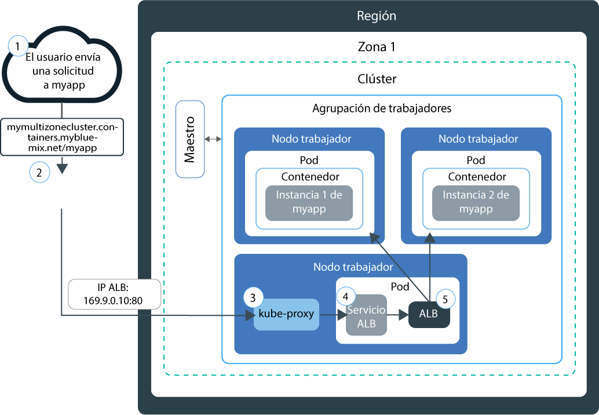
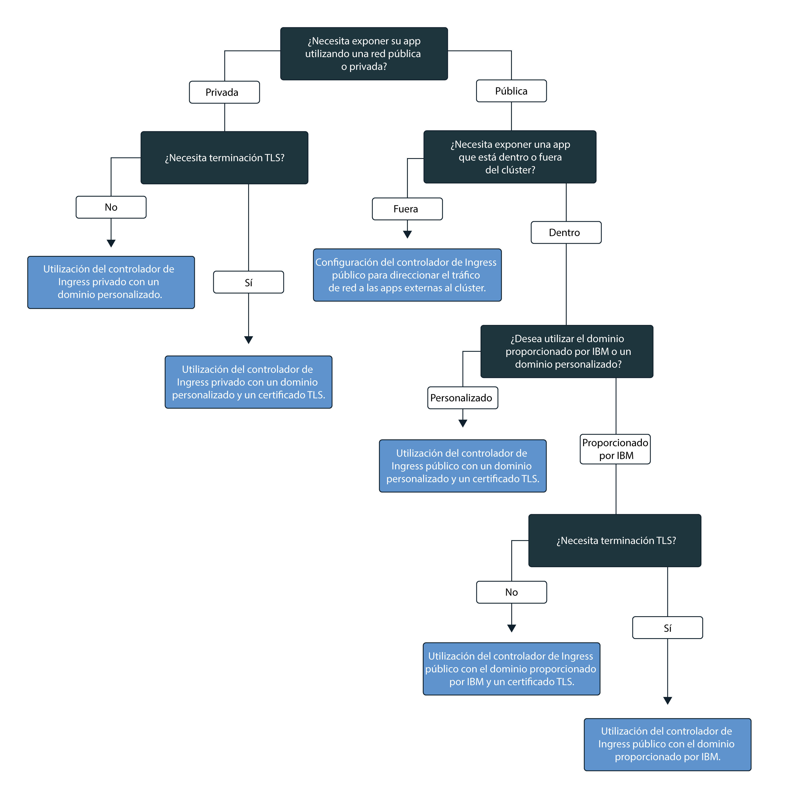

---

copyright:
  years: 2014, 2018
lastupdated: "2018-03-16"

---

{:new_window: target="_blank"}
{:shortdesc: .shortdesc}
{:screen: .screen}
{:pre: .pre}
{:table: .aria-labeledby="caption"}
{:codeblock: .codeblock}
{:tip: .tip}
{:download: .download}


# Configuración de servicios Ingress
{: #ingress}

Exponga varias apps en el clúster de Kubernetes creando recursos Ingress gestionados por el equilibrador de carga de aplicación proporcionado por IBM en {{site.data.keyword.containerlong}}.
{:shortdesc}

## Planificación del trabajo en red con servicios Ingress
{: #planning}

Con Ingress puede exponer varios servicios en el clúster y ponerlos a disponibilidad pública mediante el uso de un solo punto de entrada público.
{:shortdesc}

En lugar de crear un servicio equilibrador de carga para cada app que desea exponer al público, Ingress proporciona una ruta pública exclusiva para reenviar solicitudes públicas a apps dentro y fuera del clúster en función de sus vías de acceso individuales. Ingress consta de dos componentes principales: el equilibrador de carga de aplicación y el recurso de Ingress.

El equilibrador de carga de aplicación (ALB) es un equilibrador de carga externo que escucha solicitudes de servicio de entrada HTTP o HTTPS, TCP o UDP y reenvía las solicitudes al pod de app adecuado. Cuando se crea un clúster estándar, {{site.data.keyword.containershort_notm}} crea automáticamente un ALB altamente disponible para el clúster y le asigna una ruta pública exclusiva. La ruta pública se enlaza a una dirección IP pública portátil que se suministra a la cuenta de infraestructura de IBM Cloud (SoftLayer) durante la creación del clúster. También se crea automáticamente un ALB privado predeterminado, pero no se habilita automáticamente.

Para exponer una app mediante Ingress, debe crear un servicio Kubernetes para la app y registrar este servicio con el ALB mediante la definición de un recurso de Ingress. El recurso de Ingress especifica la vía de acceso que se añade a la ruta pública para formar un URL exclusivo para la app expuesta, como por ejemplo `mycluster.us-south.containers.mybluemix.net/myapp`, y define las reglas sobre cómo direccionar las solicitudes de entrada para una app.

El siguiente diagrama muestra cómo se dirige la comunicación de Ingress desde Internet a una app:



1. Un usuario envía una solicitud a la app accediendo al URL de la app. Este URL es el URL público para la app expuesta con la vía de acceso del recurso de Ingress añadido a él, como por ejemplo `mycluster.us-south.containers.mybluemix.net/myapp`.

2. Un servicio del sistema DNS que actúa como equilibrador de carga global resuelve el URL a la dirección IP pública portátil del ALB público predeterminado en el clúster.

3. `kube-proxy` direcciona la solicitud al servicio ALB de Kubernetes para la app.

4. El servicio de Kubernetes direcciona la solicitud al ALB.

5. El ALB comprueba si existe una regla de direccionamiento para la vía de acceso `myapp` en el clúster. Si se encuentra una regla coincidente, la solicitud se reenvía al pod en el que se ha desplegado la app, de acuerdo con las reglas que ha definido en el recurso de Ingress. Si se despliegan varias instancias de app en el clúster, el ALB equilibra la carga de las solicitudes entre los pods de app.


**Nota:** Ingress únicamente está disponible para los clústeres estándares y necesita de al menos dos nodos trabajadores en el clúster para asegurar la alta disponibilidad. Para configurar un servicio Ingress se necesita una [política de acceso de administrador](cs_users.html#access_policies). Verifique su [política de acceso](cs_users.html#infra_access) actual.

Para seleccionar la mejor configuración de Ingress, puede seguir este árbol de decisiones:


<map name="ingress_map" id="ingress_map">
<area href="/docs/containers/cs_ingress.html#private_ingress_no_tls" alt="Exponer privadamente apps utilizando un dominio personalizado sin TLS" shape="rect" coords="25, 246, 187, 294"/>
<area href="/docs/containers/cs_ingress.html#private_ingress_tls" alt="Exponer privadamente apps utilizando un dominio personalizado con TLS" shape="rect" coords="161, 337, 309, 385"/>
<area href="/docs/containers/cs_ingress.html#external_endpoint" alt="Exposición pública de apps que están fuera de su clúster utilizando el dominio proporcionado por IBM o uno personalizado con TLS" shape="rect" coords="313, 229, 466, 282"/>
<area href="/docs/containers/cs_ingress.html#custom_domain_cert" alt="Exposición pública de apps utilizando un dominio personalizado con TLS" shape="rect" coords="365, 415, 518, 468"/>
<area href="/docs/containers/cs_ingress.html#ibm_domain" alt="Exposición pública de apps utilizando el dominio proporcionado por IBM sin TLS" shape="rect" coords="414, 629, 569, 679"/>
<area href="/docs/containers/cs_ingress.html#ibm_domain_cert" alt="Exposición pública de apps utilizando el dominio proporcionado por IBM con TLS" shape="rect" coords="563, 711, 716, 764"/>
</map>

<br />


## Exposición de apps al público
{: #ingress_expose_public}

Cuando se crea un clúster estándar, se habilita automáticamente un equilibrador de carga de aplicación (ALB) proporcionado por IBM y se le asigna una dirección IP pública portátil y una ruta pública.
{:shortdesc}

A cada app que se expone al público por medio de Ingress que se le asigna una vía de acceso exclusiva que se añade a la ruta pública, para que pueda utilizar un URL exclusivo para acceder a una app de forma pública en el clúster. Para exponer la app al público, puede configurar Ingress para los siguientes casos.

-   [Exponer públicamente apps utilizando el dominio proporcionado por IBM sin TLS](#ibm_domain)
-   [Exponer públicamente apps utilizando el dominio proporcionado por IBM con TLS](#ibm_domain_cert)
-   [Exponer públicamente apps utilizando un dominio personalizado con TLS](#custom_domain_cert)
-   [Exponer públicamente apps que están fuera de su clúster utilizando el dominio proporcionado por IBM o uno personalizado con TLS](#external_endpoint)

### Exponer públicamente apps utilizando el dominio proporcionado por IBM sin TLS
{: #ibm_domain}

Puede configurar el ALB para equilibrar la carga del tráfico de red HTTP entrante a las apps del clúster y utilizar el dominio proporcionado por IBM para acceder a las apps desde Internet.
{:shortdesc}

Antes de empezar:

-   Si aún no tiene uno, [cree un clúster estándar](cs_clusters.html#clusters_ui).
-   [Defina su clúster como destino de la CLI](cs_cli_install.html#cs_cli_configure) para ejecutar mandatos `kubectl`.

Para exponer una app mediante el dominio proporcionado por IBM:

1.  [Despliegue la app en el clúster](cs_app.html#app_cli). Cuando despliegue la app en el clúster, se crean uno o más pods que ejecutan la app en un contenedor. Asegúrese de añadir una etiqueta a su despliegue en la sección de metadatos del archivo de configuración. Esta etiqueta es necesaria para identificar todos los pods en los que se está ejecutando la app, de modo que puedan incluirse en el equilibrio de carga de Ingress.
2.  Cree un servicio Kubernetes para poder exponer la app. El ALB puede incluir la app en el equilibrio de carga de Ingress sólo si la app se expone mediante un servicio Kubernetes dentro del clúster.
    1.  Abra el editor que prefiera y cree un archivo de configuración de servicio llamado, por ejemplo, `myservice.yaml`.
    2.  Defina un servicio para la app que desea exponer al público.

        ```
        apiVersion: v1
        kind: Service
        metadata:
          name: <myservice>
        spec:
          selector:
            <selectorkey>: <selectorvalue>
          ports:
           - protocol: TCP
             port: 8080
        ```
        {: codeblock}

        <table>
        <caption>Visión general de los componentes de archivo del servicio ALB</caption>
        <thead>
        <th colspan=2> Visión general de los componentes del archivo YAML</th>
        </thead>
        <tbody>
        <tr>
        <td><code>name</code></td>
        <td>Sustituya <em>&lt;myservice&gt;</em> por el nombre del servicio ALB.</td>
        </tr>
        <tr>
        <td><code>selector</code></td>
        <td>Especifique el par de clave de etiqueta (<em>&lt;selectorkey&gt;</em>) y valor (<em>&lt;selectorvalue&gt;</em>) que desee utilizar para establecer como destino los pods en los que se ejecuta la app. Por ejemplo, si utiliza el siguiente selector <code>app: code</code>, todos los pods que tengan esta etiqueta en sus metadatos se incluirán en el equilibrio de la carga. Especifique la misma etiqueta que ha utilizado al desplegar la app del clúster. </td>
         </tr>
         <tr>
         <td><code>port</code></td>
         <td>El puerto que en el que está a la escucha el servicio.</td>
         </tr>
         </tbody></table>
    3.  Guarde los cambios.
    4.  Cree el servicio en el clúster.

        ```
        kubectl apply -f myservice.yaml
        ```
        {: pre}
    5.  Repita estos pasos para cada app que desee exponer al público.
3.  Obtenga los detalles del clúster para ver el dominio proporcionado por IBM. Sustituya _&lt;mycluster&gt;_ por el nombre del clúster en el que está desplegada la app que desea exponer al público.

    ```
    bx cs cluster-get <mycluster>
    ```
    {: pre}

    La salida de la CLI se parecerá a la siguiente.

    ```
    Retrieving cluster <mycluster>...
    OK
    Name:    <mycluster>
    ID:    b9c6b00dc0aa487f97123440b4895f2d
    State:    normal
    Created:  2017-04-26T19:47:08+0000
    Location: dal10
    Master URL:  https://169.57.40.165:1931
    Ingress subdomain:  <ibmdomain>
    Ingress secret:  <ibmtlssecret>
    Workers:  3
    Version: 1.8.8
    ```
    {: screen}

    Puede ver el dominio proporcionado por IBM en el campo **Subdominio de Ingress**.
4.  Cree un recurso de Ingress. Los recursos de Ingress definen las reglas de direccionamiento para el servicio Kubernetes que ha creado para la app y el ALB los utiliza para direccionar el tráfico de red de entrada al servicio. Debe utilizar un recurso de Ingress para definir las reglas de direccionamiento para varias apps si cada app se expone a través de un servicio Kubernetes dentro del clúster.
    1.  Abra el editor que prefiera y cree un archivo de configuración de Ingress llamado, por ejemplo, `myingress.yaml`.
    2.  Defina un recurso de Ingress en el archivo de configuración que utilice el dominio proporcionado por IBM para direccionar el tráfico de entrada de red al servicio que ha creado anteriormente.

        ```
        apiVersion: extensions/v1beta1
        kind: Ingress
        metadata:
          name: <myingressname>
        spec:
          rules:
          - host: <ibmdomain>
            http:
              paths:
              - path: /<myservicepath1>
                backend:
                  serviceName: <myservice1>
                  servicePort: 80
              - path: /<myservicepath2>
                backend:
                  serviceName: <myservice2>
                  servicePort: 80
        ```
        {: codeblock}

        <table>
        <caption>Visión general de los componentes del archivo de recursos de Ingress</caption>
        <thead>
        <th colspan=2> Visión general de los componentes del archivo YAML</th>
        </thead>
        <tbody>
        <tr>
        <td><code>name</code></td>
        <td>Sustituya <em>&lt;myingressname&gt;</em> por el nombre del recurso de Ingress.</td>
        </tr>
        <tr>
        <td><code>host</code></td>
        <td>Sustituya <em>&lt;ibmdomain&gt;</em> por el nombre del <strong>Subdominio de Ingress</strong> proporcionado por IBM en el paso anterior.

        </br></br>
        <strong>Nota:</strong> No utilice * para el host ni deje la propiedad host vacía para evitar errores durante la creación de Ingress.</td>
        </tr>
        <tr>
        <td><code>path</code></td>
        <td>Sustituya <em>&lt;myservicepath1&gt;</em> con una única barra o con la vía de acceso exclusiva en la que su app está a la escucha, de forma que el tráfico de la red se pueda reenviar a la app.

        </br>
        Para cada servicio de Kubernetes, defina una vía de acceso individual que se añade al dominio que IBM proporciona para crear una vía de acceso exclusiva a su app como, por ejemplo, <code>ingress_domain/myservicepath1</code>. Cuando especifica esta ruta en un navegador web, el tráfico de la red se direcciona al ALB. El ALB busca el servicio asociado y envía el tráfico de red al servicio y a los pods en los que la app está en ejecución utilizando la misma vía de acceso. Se debe configurar a la app para que escuche en esta vía de servicio con el propósito de recibir el tráfico de red entrante.

        </br></br>
        Muchas apps no escuchan en una vía de acceso específica, sino que utilizan la vía de acceso raíz y un puerto específico. En este caso, defina la vía de acceso raíz como <code>/</code> y no especifique una vía de acceso individual para la app.
        </br>
        Ejemplos: <ul><li>Para <code>http://ingress_host_name/</code>, escriba <code>/</code> como vía de acceso.</li><li>Para <code>http://ingress_host_name/myservicepath</code>, escriba <code>/myservicepath</code> como vía de acceso.</li></ul>
        </br>
        <strong>Sugerencia:</strong> Para configurar Ingress para que escuche en una vía de acceso que sea distinta a la vía de acceso en la que escucha la app, utilice la [anotación de reescritura](cs_annotations.html#rewrite-path) para establecer la ruta adecuada para su app.</td>
        </tr>
        <tr>
        <td><code>serviceName</code></td>
        <td>Sustituya <em>&lt;myservice1&gt;</em> por el nombre del servicio que ha utilizado al crear el servicio de Kubernetes para la app.</td>
        </tr>
        <tr>
        <td><code>servicePort</code></td>
        <td>El puerto en el que el servicio está a la escucha. Utilice el mismo puerto que ha definido al crear el servicio de Kubernetes para la app.</td>
        </tr>
        </tbody></table>

    3.  Cree el recurso de Ingress para el clúster.

        ```
        kubectl apply -f myingress.yaml
        ```
        {: pre}

5.  Verifique que el recurso de Ingress se haya creado correctamente. Sustituya _&lt;myingressname&gt;_ por el nombre del recurso de Ingress que ha creado anteriormente.

    ```
    kubectl describe ingress <myingressname>
    ```
    {: pre}

    1. Si los mensajes en los sucesos describen un error en la configuración del recurso, cambie los valores en el archivo de recursos y aplique de nuevo el archivo del recurso.

6.  En un navegador web, escriba el URL del servicio de la app al que va a acceder.

    ```
    http://<ibmdomain>/<myservicepath1>
    ```
    {: codeblock}

<br />


### Exponer públicamente apps utilizando el dominio proporcionado por IBM con TLS
{: #ibm_domain_cert}

Puede configurar el ALB de Ingress de modo que gestione las conexiones TLS de entrada para las apps, descifre el tráfico de red utilizando el certificado TLS proporcionado por IBM y reenvíe la solicitud descifrada a las apps expuestas en el clúster.
{:shortdesc}

Antes de empezar:

-   Si aún no tiene uno, [cree un clúster estándar](cs_clusters.html#clusters_ui).
-   [Defina su clúster como destino de la CLI](cs_cli_install.html#cs_cli_configure) para ejecutar mandatos `kubectl`.

Para exponer una app mediante el dominio proporcionado por IBM con TLS:

1.  [Despliegue la app en el clúster](cs_app.html#app_cli). Asegúrese de añadir una etiqueta a su despliegue en la sección de metadatos del archivo de configuración. Esta etiqueta identifica todos los pods en los que se está ejecutando la app, de modo que puedan incluirse en el equilibrio de carga de Ingress.
2.  Cree un servicio Kubernetes para poder exponer la app. El ALB puede incluir la app en el equilibrio de carga de Ingress sólo si la app se expone mediante un servicio Kubernetes dentro del clúster.
    1.  Abra el editor que prefiera y cree un archivo de configuración de servicio llamado, por ejemplo, `myservice.yaml`.
    2.  Defina un servicio ALB para la app que desea exponer al público.

        ```
        apiVersion: v1
        kind: Service
        metadata:
          name: <myservice>
        spec:
          selector:
            <selectorkey>: <selectorvalue>
          ports:
           - protocol: TCP
             port: 8080
        ```
        {: codeblock}

        <table>
        <caption>Visión general de los componentes de archivo del servicio ALB</caption>
        <thead>
        <th colspan=2> Visión general de los componentes del archivo YAML</th>
        </thead>
        <tbody>
        <tr>
        <td><code>name</code></td>
        <td>Sustituya <em>&lt;myservice&gt;</em> por el nombre del servicio ALB.</td>
        </tr>
        <tr>
        <td><code>selector</code></td>
        <td>Especifique el par de clave de etiqueta (<em>&lt;selectorkey&gt;</em>) y valor (<em>&lt;selectorvalue&gt;</em>) que desee utilizar para establecer como destino los pods en los que se ejecuta la app. Por ejemplo, si utiliza el siguiente selector <code>app: code</code>, todos los pods que tengan esta etiqueta en sus metadatos se incluirán en el equilibrio de la carga. Especifique la misma etiqueta que ha utilizado al desplegar la app del clúster. </td>
         </tr>
         <tr>
         <td><code>port</code></td>
         <td>El puerto que en el que está a la escucha el servicio.</td>
         </tr>
         </tbody></table>

    3.  Guarde los cambios.
    4.  Cree el servicio en el clúster.

        ```
        kubectl apply -f myservice.yaml
        ```
        {: pre}

    5.  Repita estos pasos para cada app que desee exponer al público.

3.  Visualice el dominio proporcionado por IBM y el certificado TLS. Sustituya _&lt;mycluster&gt;_ por el nombre del clúster en el que está desplegada la app.

    ```
    bx cs cluster-get <mycluster>
    ```
    {: pre}

    La salida de la CLI se parecerá a la siguiente.

    ```
    bx cs cluster-get <mycluster>
    Retrieving cluster <mycluster>...
    OK
    Name:    <mycluster>
    ID:    b9c6b00dc0aa487f97123440b4895f2d
    State:    normal
    Created:  2017-04-26T19:47:08+0000
    Location: dal10
    Master URL:  https://169.57.40.165:1931
    Ingress subdomain:  <ibmdomain>
    Ingress secret:  <ibmtlssecret>
    Workers:  3
    Version: 1.8.8
    ```
    {: screen}

    Puede ver el dominio proporcionado por IBM en el campo **Subdominio de Ingress** y el certificado proporcionado por IBM en el campo **Secreto de Ingress**.

4.  Cree un recurso de Ingress. Los recursos de Ingress definen las reglas de direccionamiento para el servicio Kubernetes que ha creado para la app y el ALB los utiliza para direccionar el tráfico de red de entrada al servicio. Debe utilizar un recurso de Ingress para definir las reglas de direccionamiento para varias apps si cada app se expone a través de un servicio Kubernetes dentro del clúster.
    1.  Abra el editor que prefiera y cree un archivo de configuración de Ingress llamado, por ejemplo, `myingress.yaml`.
    2.  Defina un recurso de Ingress en el archivo de configuración que utilice el dominio proporcionado por IBM para direccionar el tráfico de entrada de red a los servicios y el certificado proporcionado por IBM para gestionar automáticamente la terminación TLS. Para cada servicio, puede definir una vía de acceso individual que se añade al dominio proporcionado por IBM para crear una vía de acceso exclusiva a la app, por ejemplo `https://ingress_domain/myapp`. Cuando especifica esta ruta en un navegador web, el tráfico de la red se direcciona al ALB. El ALB consulta el servicio asociado y envía el tráfico de red de entrada al servicio, y luego a los pods en los que se ejecuta la app.

        **Nota:** La app debe estar a la escucha en la vía de acceso que ha definido en el recurso Ingress. De lo contrario, el tráfico de red no se puede reenviar a la app. La mayoría de las apps no escuchan en una vía de acceso específica, sino que utilizan la vía de acceso raíz y un puerto específico. En este caso, defina la vía de acceso raíz como `/` y no especifique una vía de acceso individual para la app.

        ```
        apiVersion: extensions/v1beta1
        kind: Ingress
        metadata:
          name: <myingressname>
        spec:
          tls:
          - hosts:
            - <ibmdomain>
            secretName: <ibmtlssecret>
          rules:
          - host: <ibmdomain>
            http:
              paths:
              - path: /<myservicepath1>
                backend:
                  serviceName: <myservice1>
                  servicePort: 80
              - path: /<myservicepath2>
                backend:
                  serviceName: <myservice2>
                  servicePort: 80
        ```
        {: codeblock}

        <table>
        <caption>Visión general de los componentes del archivo de recursos de Ingress</caption>
        <thead>
        <th colspan=2> Visión general de los componentes del archivo YAML</th>
        </thead>
        <tbody>
        <tr>
        <td><code>name</code></td>
        <td>Sustituya <em>&lt;myingressname&gt;</em> por el nombre del recurso de Ingress.</td>
        </tr>
        <tr>
        <td><code>tls/hosts</code></td>
        <td>Sustituya <em>&lt;ibmdomain&gt;</em> por el nombre del <strong>Subdominio de Ingress</strong> proporcionado por IBM en el paso anterior. Este dominio está configurado para la terminación TLS.

        </br></br>
        <strong>Nota:</strong> No utilice &ast; para el host ni deje la propiedad host vacía para evitar errores durante la creación de Ingress.</td>
        </tr>
        <tr>
        <td><code>tls/secretName</code></td>
        <td>Sustituya <em>&lt;ibmtlssecret&gt;</em> por el nombre del <strong>secreto de Ingress</strong> proporcionado por IBM en el paso anterior. Este certificado gestiona la terminación de TLS.
        </tr>
        <tr>
        <td><code>host</code></td>
        <td>Sustituya <em>&lt;ibmdomain&gt;</em> por el nombre del <strong>Subdominio de Ingress</strong> proporcionado por IBM en el paso anterior. Este dominio está configurado para la terminación TLS.

        </br></br>
        <strong>Nota:</strong> No utilice &ast; para el host ni deje la propiedad host vacía para evitar errores durante la creación de Ingress.</td>
        </tr>
        <tr>
        <td><code>path</code></td>
        <td>Sustituya <em>&lt;myservicepath1&gt;</em> con una única barra o con la vía de acceso exclusiva en la que su app está a la escucha, de forma que el tráfico de la red se pueda reenviar a la app.

        </br>
        Para cada servicio de Kubernetes, defina una vía de acceso individual que se añade al dominio que IBM proporciona para crear una vía de acceso exclusiva a su app como, por ejemplo, <code>ingress_domain/myservicepath1</code>. Cuando especifica esta ruta en un navegador web, el tráfico de la red se direcciona al ALB. El ALB busca el servicio asociado y envía el tráfico de red al servicio y a los pods en los que la app está en ejecución utilizando la misma vía de acceso. Se debe configurar a la app para que escuche en esta vía de servicio con el propósito de recibir el tráfico de red entrante.

        </br>
        Muchas apps no escuchan en una vía de acceso específica, sino que utilizan la vía de acceso raíz y un puerto específico. En este caso, defina la vía de acceso raíz como <code>/</code> y no especifique una vía de acceso individual para la app.

        </br>
        Ejemplos: <ul><li>Para <code>http://ingress_host_name/</code>, escriba <code>/</code> como vía de acceso.</li><li>Para <code>http://ingress_host_name/myservicepath</code>, escriba <code>/myservicepath</code> como vía de acceso.</li></ul>
        <strong>Sugerencia:</strong> Para configurar Ingress para que escuche en una vía de acceso que sea distinta a la vía de acceso en la que escucha la app, utilice la [anotación de reescritura](cs_annotations.html#rewrite-path) para establecer la ruta adecuada para su app.</td>
        </tr>
        <tr>
        <td><code>serviceName</code></td>
        <td>Sustituya <em>&lt;myservice1&gt;</em> por el nombre del servicio que ha utilizado al crear el servicio de Kubernetes para la app.</td>
        </tr>
        <tr>
        <td><code>servicePort</code></td>
        <td>El puerto en el que el servicio está a la escucha. Utilice el mismo puerto que ha definido al crear el servicio de Kubernetes para la app.</td>
        </tr>
        </tbody></table>

    3.  Cree el recurso de Ingress para el clúster.

        ```
        kubectl apply -f myingress.yaml
        ```
        {: pre}

5.  Verifique que el recurso de Ingress se haya creado correctamente. Sustituya _&lt;myingressname&gt;_ por el nombre del recurso de Ingress que ha creado anteriormente.

    ```
    kubectl describe ingress <myingressname>
    ```
    {: pre}

    1. Si los mensajes en los sucesos describen un error en la configuración del recurso, cambie los valores en el archivo de recursos y aplique de nuevo el archivo del recurso.

6.  En un navegador web, escriba el URL del servicio de la app al que va a acceder.

    ```
    https://<ibmdomain>/<myservicepath1>
    ```
    {: codeblock}

<br />


### Exponer públicamente apps utilizando un dominio personalizado con TLS
{: #custom_domain_cert}

Puede configurar el ALB para que direccione el tráfico de red de entrada a las apps del clúster y utilice su propio certificado TLS para gestionar la terminación de TLS, utilizando el dominio personalizado en lugar del proporcionado por IBM.
{:shortdesc}

Antes de empezar:

-   Si aún no tiene uno, [cree un clúster estándar](cs_clusters.html#clusters_ui).
-   [Defina su clúster como destino de la CLI](cs_cli_install.html#cs_cli_configure) para ejecutar mandatos `kubectl`.

Para exponer una app mediante un dominio personalizado con TLS:

1.  Cree un dominio personalizado. Para crear un dominio personalizado, póngase en contacto con el proveedor de DNS (Domain Name Service) o con [{{site.data.keyword.Bluemix_notm}} ](/docs/infrastructure/dns/getting-started.html#getting-started-with-dns) para registrar su dominio personalizado.
2.  Configure el dominio de modo que direccione el tráfico de red de entrada al ALB proporcionado por IBM. Puede elegir entre las siguientes opciones:
    -   Defina un alias para el dominio personalizado especificando el dominio proporcionado por IBM como CNAME (Registro de nombre canónico). Para encontrar el dominio de Ingress proporcionado por IBM, ejecute `bx cs cluster-get <mycluster>` y busque el campo **Subdominio de Ingress**.
    -   Correlacione el dominio personalizado con la dirección IP pública portátil del ALB proporcionado por IBM añadiendo la dirección IP como registro. Para buscar la dirección IP pública portátil del ALB, ejecute `bx cs alb-get <public_alb_ID>`.
3.  Importe o cree un certificado TLS y un secreto de clave:
    * Si hay un certificado TLS almacenado en {{site.data.keyword.cloudcerts_long_notm}} que desea utilizar, puede importar su secreto asociado a su clúster ejecutando el siguiente mandato:

      ```
      bx cs alb-cert-deploy --secret-name <secret_name> --cluster <cluster_name_or_ID> --cert-crn <certificate_crn>
      ```
      {: pre}

    * Si no tiene un certificado TLS listo, siga estos pasos:
        1. Cree un certificado TLS y una clave para el dominio que estén codificados en formato PEM.
        2. Cree un secreto que utilice su certificado TLS y clave. Sustituya <em>&lt;mytlssecret&gt;</em> con un nombre para su secreto de Kubernetes, <em>&lt;tls_key_filepath&gt;</em> con la vía de acceso a su archivo de claves TLS personalizado y <em>&lt;tls_cert_filepath&gt;</em> con la vía de acceso al archivo de certificado TLS personalizado.

            ```
            kubectl create secret tls <mytlssecret> --key <tls_key_filepath> --cert <tls_cert_filepath>
            ```
            {: pre}

4.  [Despliegue la app en el clúster](cs_app.html#app_cli). Cuando despliegue la app en el clúster, se crean uno o más pods que ejecutan la app en un contenedor. Asegúrese de añadir una etiqueta a su despliegue en la sección de metadatos del archivo de configuración. Esta etiqueta es necesaria para identificar todos los pods en los que se está ejecutando la app, de modo que puedan incluirse en el equilibrio de carga de Ingress.

5.  Cree un servicio Kubernetes para poder exponer la app. El ALB puede incluir la app en el equilibrio de carga de Ingress sólo si la app se expone mediante un servicio Kubernetes dentro del clúster.

    1.  Abra el editor que prefiera y cree un archivo de configuración de servicio llamado, por ejemplo, `myservice.yaml`.
    2.  Defina un servicio ALB para la app que desea exponer al público.

        ```
        apiVersion: v1
        kind: Service
        metadata:
          name: <myservice>
        spec:
          selector:
            <selectorkey>: <selectorvalue>
          ports:
           - protocol: TCP
             port: 8080
        ```
       {: codeblock}

        <table>
        <caption>Visión general de los componentes de archivo del servicio ALB</caption>
        <thead>
        <th colspan=2> Visión general de los componentes del archivo YAML</th>
        </thead>
        <tbody>
        <tr>
        <td><code>name</code></td>
        <td>Sustituya <em>&lt;myservice1&gt;</em> por el nombre del servicio ALB.</td>
        </tr>
        <tr>
        <td><code>selector</code></td>
        <td>Especifique el par de clave de etiqueta (<em>&lt;selectorkey&gt;</em>) y valor (<em>&lt;selectorvalue&gt;</em>) que desee utilizar para establecer como destino los pods en los que se ejecuta la app. Por ejemplo, si utiliza el siguiente selector <code>app: code</code>, todos los pods que tengan esta etiqueta en sus metadatos se incluirán en el equilibrio de la carga. Especifique la misma etiqueta que ha utilizado al desplegar la app del clúster. </td>
         </tr>
         <td><code>port</code></td>
         <td>El puerto que en el que está a la escucha el servicio.</td>
         </tbody></table>

    3.  Guarde los cambios.
    4.  Cree el servicio en el clúster.

        ```
        kubectl apply -f myservice.yaml
        ```
        {: pre}

    5.  Repita estos pasos para cada app que desee exponer al público.
6.  Cree un recurso de Ingress. Los recursos de Ingress definen las reglas de direccionamiento para el servicio Kubernetes que ha creado para la app y el ALB los utiliza para direccionar el tráfico de red de entrada al servicio. Debe utilizar un recurso de Ingress para definir las reglas de direccionamiento para varias apps si cada app se expone a través de un servicio Kubernetes dentro del clúster.
    1.  Abra el editor que prefiera y cree un archivo de configuración de Ingress llamado, por ejemplo, `myingress.yaml`.
    2.  Defina un recurso de Ingress en el archivo de configuración que utilice el dominio personalizado para direccionar el tráfico de entrada de red a los servicios y el certificado personalizado para gestionar la terminación TLS. Por cada servicio, puede definir una vía de acceso individual que se añade a su dominio personalizado para crear una vía de acceso exclusiva para la app; como por ejemplo `https://mydomain/myapp`. Cuando especifica esta ruta en un navegador web, el tráfico de la red se direcciona al ALB. El ALB consulta el servicio asociado y envía el tráfico de red de entrada al servicio, y luego a los pods en los que se ejecuta la app.

        La app debe estar a la escucha en la vía de acceso que ha definido en el recurso de Ingress. De lo contrario, el tráfico de red no se puede reenviar a la app. La mayoría de las apps no escuchan en una vía de acceso específica, sino que utilizan la vía de acceso raíz y un puerto específico. En este caso, defina la vía de acceso raíz como `/` y no especifique una vía de acceso individual para la app.

        ```
        apiVersion: extensions/v1beta1
        kind: Ingress
        metadata:
          name: <myingressname>
        spec:
          tls:
          - hosts:
            - <mycustomdomain>
            secretName: <mytlssecret>
          rules:
          - host: <mycustomdomain>
            http:
              paths:
              - path: /<myservicepath1>
                backend:
                  serviceName: <myservice1>
                  servicePort: 80
              - path: /<myservicepath2>
                backend:
                  serviceName: <myservice2>
                  servicePort: 80
        ```
        {: codeblock}

        <table>
        <caption>Visión general de los componentes del archivo de recursos de Ingress</caption>
        <thead>
        <th colspan=2> Visión general de los componentes del archivo YAML</th>
        </thead>
        <tbody>
        <tr>
        <td><code>name</code></td>
        <td>Sustituya <em>&lt;myingressname&gt;</em> por el nombre del recurso de Ingress.</td>
        </tr>
        <tr>
        <td><code>tls/hosts</code></td>
        <td>Sustituya <em>&lt;mycustomdomain&gt;</em> por el dominio personalizado que desea configurar para la terminación de TLS.

        </br></br>
        <strong>Nota:</strong> No utilice &ast; para el host ni deje la propiedad host vacía para evitar errores durante la creación de Ingress.</td>
        </tr>
        <tr>
        <td><code>tls/secretName</code></td>
        <td>Sustituya <em>&lt;mytlssecret&gt;</em> por el nombre del secreto que ha creado anteriormente y que contiene el certificado TLS personalizado y la clave. Si ha importado un certificado de {{site.data.keyword.cloudcerts_short}}, puede ejecutar <code>bx cs alb-cert-get --cluster <cluster_name_or_ID> --cert-crn <certificate_crn></code> para ver los secretos que están asociados con un certificado TLS.
        </tr>
        <tr>
        <td><code>host</code></td>
        <td>Sustituya <em>&lt;mycustomdomain&gt;</em> por el dominio personalizado que desea configurar para la terminación de TLS.

        </br></br>
        <strong>Nota:</strong> No utilice &ast; para el host ni deje la propiedad host vacía para evitar errores durante la creación de Ingress.
        </td>
        </tr>
        <tr>
        <td><code>path</code></td>
        <td>Sustituya <em>&lt;myservicepath1&gt;</em> con una única barra o con la vía de acceso exclusiva en la que su app está a la escucha, de forma que el tráfico de la red se pueda reenviar a la app.

        </br>
        Para cada servicio de Kubernetes, defina una vía de acceso individual que se añade al dominio que IBM proporciona para crear una vía de acceso exclusiva a su app como, por ejemplo, <code>ingress_domain/myservicepath1</code>. Cuando especifica esta ruta en un navegador web, el tráfico de la red se direcciona al ALB. El ALB busca el servicio asociado y envía el tráfico de red al servicio y a los pods en los que la app está en ejecución utilizando la misma vía de acceso. Se debe configurar a la app para que escuche en esta vía de servicio con el propósito de recibir el tráfico de red entrante.

        </br>
        Muchas apps no escuchan en una vía de acceso específica, sino que utilizan la vía de acceso raíz y un puerto específico. En este caso, defina la vía de acceso raíz como <code>/</code> y no especifique una vía de acceso individual para la app.

        </br></br>
        Ejemplos: <ul><li>Para <code>https://mycustomdomain/</code>, escriba <code>/</code> como vía de acceso.</li><li>Para <code>https://mycustomdomain/myservicepath</code>, escriba <code>/myservicepath</code> como vía de acceso.</li></ul>
        <strong>Sugerencia:</strong> Para configurar Ingress para que escuche en una vía de acceso que sea distinta a la vía de acceso en la que escucha la app, utilice la [anotación de reescritura](cs_annotations.html#rewrite-path) para establecer la ruta adecuada para su app.
        </td>
        </tr>
        <tr>
        <td><code>serviceName</code></td>
        <td>Sustituya <em>&lt;myservice1&gt;</em> por el nombre del servicio que ha utilizado al crear el servicio de Kubernetes para la app.</td>
        </tr>
        <tr>
        <td><code>servicePort</code></td>
        <td>El puerto en el que el servicio está a la escucha. Utilice el mismo puerto que ha definido al crear el servicio de Kubernetes para la app.</td>
        </tr>
        </tbody></table>

    3.  Guarde los cambios.
    4.  Cree el recurso de Ingress para el clúster.

        ```
        kubectl apply -f myingress.yaml
        ```
        {: pre}

7.  Verifique que el recurso de Ingress se haya creado correctamente. Sustituya _&lt;myingressname&gt;_ por el nombre del recurso de Ingress que ha creado anteriormente.

    ```
    kubectl describe ingress <myingressname>
    ```
    {: pre}

    1. Si los mensajes en los sucesos describen un error en la configuración del recurso, cambie los valores en el archivo de recursos y aplique de nuevo el archivo del recurso.

8.  Acceda a la app desde Internet.
    1.  Abra el navegador web preferido.
    2.  Escriba el URL del servicio de la app al que desea acceder.

        ```
        https://<mycustomdomain>/<myservicepath1>
        ```
        {: codeblock}

<br />


### Exponer públicamente apps que están fuera de su clúster utilizando el dominio proporcionado por IBM o uno personalizado con TLS
{: #external_endpoint}

Puede configurar el ALB para incluir las apps que se encuentran fuera del clúster. Las solicitudes entrantes en el dominio personalizado o proporcionado por IBM se reenvían automáticamente a la app externa.
{:shortdesc}

Antes de empezar:

-   Si aún no tiene uno, [cree un clúster estándar](cs_clusters.html#clusters_ui).
-   [Defina su clúster como destino de la CLI](cs_cli_install.html#cs_cli_configure) para ejecutar mandatos `kubectl`.
-   Asegúrese de que se pueda acceder a la app externa que desea incluir en el equilibrio de la carga del clúster mediante una dirección IP pública.

Puede direccionar el tráfico de red de entrada del dominio proporcionado por IBM a apps situadas fuera del clúster. Si desea utilizar en su lugar un dominio personalizado y terminación de TLS, sustituya el dominio proporcionado por IBM y el certificado de TLS por su [dominio personalizado y certificado TLS](#custom_domain_cert)dominio personalizado y certificado TLS.

1.  Cree un servicio de Kubernetes para el clúster que enviará las solicitudes entrantes a un punto final externo que habrá creado.
    1.  Abra el editor que prefiera y cree un archivo de configuración de servicio llamado, por ejemplo, `myexternalservice.yaml`.
    2.  Defina el servicio ALB.

        ```
        apiVersion: v1
        kind: Service
        metadata:
          name: <myservicename>
        spec:
          ports:
           - protocol: TCP
             port: 8080
        ```
        {: codeblock}

        <table>
        <caption>Visión general de los componentes de archivo del servicio ALB</caption>
        <thead>
        <th colspan=2> Visión general de los componentes del archivo YAML</th>
        </thead>
        <tbody>
        <tr>
        <td><code>metadata/name</code></td>
        <td>Sustituya <em>&lt;myservicename&gt;</em> por el nombre del servicio.</td>
        </tr>
        <tr>
        <td><code>port</code></td>
        <td>El puerto que en el que está a la escucha el servicio.</td>
        </tr></tbody></table>

    3.  Guarde los cambios.
    4.  Cree el servicio de Kubernetes para el clúster.

        ```
        kubectl apply -f myexternalservice.yaml
        ```
        {: pre}

2.  Configure un punto final de Kubernetes que defina la ubicación externa de la app que desea incluir en el equilibrio de la carga del clúster.
    1.  Abra el editor que prefiera y cree un archivo de configuración de punto final llamado, por ejemplo, `myexternalendpoint.yaml`.
    2.  Defina el punto final externo. Incluya todas las direcciones IP públicas y puertos que puede utilizar para acceder a la app externa.

        ```
        kind: Endpoints
        apiVersion: v1
        metadata:
          name: <myservicename>
        subsets:
          - addresses:
              - ip: <externalIP1>
              - ip: <externalIP2>
            ports:
              - port: <externalport>
        ```
        {: codeblock}

        <table>
        <thead>
        <th colspan=2> Visión general de los componentes del archivo YAML</th>
        </thead>
        <tbody>
        <tr>
        <td><code>name</code></td>
        <td>Sustituya <em>&lt;myendpointname&gt;</em> por el nombre del servicio de Kubernetes que ha creado anteriormente.</td>
        </tr>
        <tr>
        <td><code>ip</code></td>
        <td>Sustituya <em>&lt;externalIP&gt;</em> por las direcciones IP públicas que desea conectar con la app externa.</td>
         </tr>
         <td><code>port</code></td>
         <td>Sustituya <em>&lt;externalport&gt;</em> por el puerto en el que escucha la app externa.</td>
         </tbody></table>

    3.  Guarde los cambios.
    4.  Cree el punto final de Kubernetes para el clúster.

        ```
        kubectl apply -f myexternalendpoint.yaml
        ```
        {: pre}

3.  Visualice el dominio proporcionado por IBM y el certificado TLS. Sustituya _&lt;mycluster&gt;_ por el nombre del clúster en el que está desplegada la app.

    ```
    bx cs cluster-get <mycluster>
    ```
    {: pre}

    La salida de la CLI se parecerá a la siguiente.

    ```
    Retrieving cluster <mycluster>...
    OK
    Name:    <mycluster>
    ID:    b9c6b00dc0aa487f97123440b4895f2d
    State:    normal
    Created:  2017-04-26T19:47:08+0000
    Location: dal10
    Master URL:  https://169.57.40.165:1931
    Ingress subdomain:  <ibmdomain>
    Ingress secret:  <ibmtlssecret>
    Workers:  3
    Version: 1.8.8
    ```
    {: screen}

    Puede ver el dominio proporcionado por IBM en el campo **Subdominio de Ingress** y el certificado proporcionado por IBM en el campo **Secreto de Ingress**.

4.  Cree un recurso de Ingress. Los recursos de Ingress definen las reglas de direccionamiento para el servicio Kubernetes que ha creado para la app y el ALB los utiliza para direccionar el tráfico de red de entrada al servicio. Puede utilizar un recurso de Ingress para definir las reglas de direccionamiento para varias apps externas siempre que cada app esté expuesta con su punto final externo mediante un servicio Kubernetes dentro del clúster.
    1.  Abra el editor que prefiera y cree un archivo de configuración de Ingress llamado, por ejemplo, `myexternalingress.yaml`.
    2.  Defina un recurso de Ingress en el archivo de configuración que utilice el dominio proporcionado por IBM y el certificado TLS para direccionar el tráfico de entrada de red a la app externa utilizando el punto final externo que ha definido anteriormente. Para cada servicio, puede definir una vía de acceso individual que se añade al dominio proporcionado por IBM o al dominio personalizado para crear una vía de acceso exclusiva a la app, por ejemplo `https://ingress_domain/myapp`. Cuando especifica esta ruta en un navegador web, el tráfico de la red se direcciona al ALB. El ALB consulta el servicio asociado y envía el tráfico de red de entrada al servicio, y luego a la app externa.

        La app debe estar a la escucha en la vía de acceso que ha definido en el recurso de Ingress. De lo contrario, el tráfico de red no se puede reenviar a la app. La mayoría de las apps no escuchan en una vía de acceso específica, sino que utilizan la vía de acceso raíz y un puerto específico. En este caso, defina la vía de acceso raíz como / y no especifique una vía de acceso individual para la app.

        ```
        apiVersion: extensions/v1beta1
        kind: Ingress
        metadata:
          name: <myingressname>
        spec:
          tls:
          - hosts:
            - <ibmdomain>
            secretName: <ibmtlssecret>
          rules:
          - host: <ibmdomain>
            http:
              paths:
              - path: /<myexternalservicepath1>
                backend:
                  serviceName: <myservice1>
                  servicePort: 80
              - path: /<myexternalservicepath2>
                backend:
                  serviceName: <myexternalservice2>
                  servicePort: 80
        ```
        {: codeblock}

        <table>
        <caption>Visión general de los componentes del archivo de recursos de Ingress</caption>
        <thead>
        <th colspan=2> Visión general de los componentes del archivo YAML</th>
        </thead>
        <tbody>
        <tr>
        <td><code>name</code></td>
        <td>Sustituya <em>&lt;myingressname&gt;</em> por el nombre del recurso de Ingress.</td>
        </tr>
        <tr>
        <td><code>tls/hosts</code></td>
        <td>Sustituya <em>&lt;ibmdomain&gt;</em> por el nombre del <strong>Subdominio de Ingress</strong> proporcionado por IBM en el paso anterior. Este dominio está configurado para la terminación TLS.

        </br></br>
        <strong>Nota:</strong> No utilice &ast; para el host ni deje la propiedad host vacía para evitar errores durante la creación de Ingress.</td>
        </tr>
        <tr>
        <td><code>tls/secretName</code></td>
        <td>Sustituya <em>&lt;ibmtlssecret&gt;</em> por el <strong>secreto de Ingress</strong> proporcionado por IBM en el paso anterior. Este certificado gestiona la terminación de TLS.</td>
        </tr>
        <tr>
        <td><code>rules/host</code></td>
        <td>Sustituya <em>&lt;ibmdomain&gt;</em> por el nombre del <strong>Subdominio de Ingress</strong> proporcionado por IBM en el paso anterior. Este dominio está configurado para la terminación TLS.

        </br></br>
        <strong>Nota:</strong> No utilice &ast; para el host ni deje la propiedad host vacía para evitar errores durante la creación de Ingress.</td>
        </tr>
        <tr>
        <td><code>path</code></td>
        <td>Sustituya <em>&lt;myexternalservicepath&gt;</em> con una única barra o con la vía de acceso exclusiva en la que su app externa está a la escucha, de forma que el tráfico de la red se pueda reenviar a la app.

        </br>
        Por cada servicio de Kubernetes, puede definir una vía de acceso individual que se añade a su dominio para crear una vía de acceso exclusiva a la app, por ejemplo <code>https://ibmdomain/myservicepath1</code>. Cuando especifica esta ruta en un navegador web, el tráfico de la red se direcciona al ALB. El ALB busca el servicio asociado y envía el tráfico de red a la app externa utilizando la misma vía de acceso. Se debe configurar a la app para que escuche en esta vía de servicio con el propósito de recibir el tráfico de red entrante.

        </br></br>
        Muchas apps no escuchan en una vía de acceso específica, sino que utilizan la vía de acceso raíz y un puerto específico. En este caso, defina la vía de acceso raíz como <code>/</code> y no especifique una vía de acceso individual para la app.

        </br></br>
        <strong>Sugerencia:</strong> Para configurar Ingress para que escuche en una vía de acceso que sea distinta a la vía de acceso en la que escucha la app, utilice la [anotación de reescritura](cs_annotations.html#rewrite-path) para establecer la ruta adecuada para su app.</td>
        </tr>
        <tr>
        <td><code>serviceName</code></td>
        <td>Sustituya <em>&lt;myexternalservice&gt;</em> por el nombre del servicio que ha utilizado al crear el servicio de Kubernetes para la app externa.</td>
        </tr>
        <tr>
        <td><code>servicePort</code></td>
        <td>El puerto en el que el servicio está a la escucha.</td>
        </tr>
        </tbody></table>

    3.  Guarde los cambios.
    4.  Cree el recurso de Ingress para el clúster.

        ```
        kubectl apply -f myexternalingress.yaml
        ```
        {: pre}

5.  Verifique que el recurso de Ingress se haya creado correctamente. Sustituya _&lt;myingressname&gt;_ por el nombre del recurso de Ingress que ha creado anteriormente.

    ```
    kubectl describe ingress <myingressname>
    ```
    {: pre}

    1. Si los mensajes en los sucesos describen un error en la configuración del recurso, cambie los valores en el archivo de recursos y aplique de nuevo el archivo del recurso.

6.  Acceda a la app externa.
    1.  Abra el navegador web preferido.
    2.  Escriba el URL para acceder a la app externa.

        ```
        https://<ibmdomain>/<myexternalservicepath>
        ```
        {: codeblock}

<br />


## Exposición de apps a una red privada
{: #ingress_expose_private}

Cuando se crea un clúster estándar, se crea un equilibrador de carga de aplicación (ALB) proporcionado por IBM y se le asigna una dirección IP privada portátil y una ruta privada. Sin embargo, el ALB privado predeterminado no se habilita automáticamente. Para exponer la app a redes privadas, primero [habilite el equilibrador de carga de aplicación privado predeterminado](#private_ingress).
{:shortdesc}

A continuación, puede configurar Ingress para los siguientes casos.
-   [Exponer privadamente apps utilizando un dominio personalizado sin TLS](#private_ingress_no_tls)
-   [Exponer privadamente apps utilizando un dominio personalizado con TLS](#private_ingress_tls)

### Habilitación del equilibrador de carga de aplicación privado predeterminado
{: #private_ingress}

Para poder utilizar el ALB privado predeterminado, se debe habilitar con la dirección IP privada portátil proporcionada por IBM o con su propia dirección IP privada portátil.
{:shortdesc}

**Nota**: si ha utilizado el distintivo `--no-subnet` al crear el clúster, debe añadir una subred privada portátil o una subred gestionada por el usuario para poder habilitar el ALB privado. Para obtener más información, consulte [Solicitud de más subredes para el clúster](cs_subnets.html#request).

Antes de empezar:

-   Si aún no tiene uno, [cree un clúster estándar](cs_clusters.html#clusters_ui).
-   Defina su clúster como [destino de la CLI](cs_cli_install.html#cs_cli_configure).

Para habilitar el ALB privado utilizando la dirección IP privada portátil asignada previamente y proporcionada por IBM:

1. Obtenga una lista de los ALB disponibles en el clúster para obtener el ID del ALB privado. Sustituya <em>&lt;cluser_name&gt;</em> por el nombre del clúster en el que está desplegada la app que desea exponer.

    ```
    bx cs albs --cluster <my_cluster>
    ```
    {: pre}

    El campo **Status** del ALB privado es _disabled_.
    ```
    ALB ID                                            Enabled   Status     Type      ALB IP
    private-cr6d779503319d419ea3b4ab171d12c3b8-alb1   false     disabled   private   -
    public-cr6d779503319d419ea3b4ab171d12c3b8-alb1    true      enabled    public    169.46.63.150
    ```
    {: screen}

2. Habilite el ALB privado. Sustituya <em>&lt;private_ALB_ID&gt;</em> por el ID del ALB privado de la salida del paso anterior.

   ```
   bx cs alb-configure --albID <private_ALB_ID> --enable
   ```
   {: pre}


Para habilitar el ALB privado utilizando la dirección IP privada portátil:

1. Configure la subred gestionada por el usuario de la dirección IP seleccionada para direccionar el tráfico en la VLAN privada del clúster. Sustituya <em>&lt;cluster_name&gt;</em> por el nombre o ID del clúster en el que está desplegada la app que desea exponer, <em>&lt;subnet_CIDR&gt;</em> por el CIDR de la subred gestionada por el usuario y <em>&lt;private_VLAN&gt;</em> por el ID de la VLAN privada. Encontrará el ID de la VLAN privada disponible ejecutando `bx cs vlans`.

   ```
   bx cs cluster-user-subnet-add <cluster_name> <subnet_CIDR> <private_VLAN>
   ```
   {: pre}

2. Obtenga una lista de los ALB disponibles en el clúster para obtener el ID del ALB privado.

    ```
    bx cs albs --cluster <my_cluster>
    ```
    {: pre}

    El campo **Status** del ALB privado es _disabled_.
    ```
    ALB ID                                            Enabled   Status     Type      ALB IP
    private-cr6d779503319d419ea3b4ab171d12c3b8-alb1   false     disabled   private   -
    public-cr6d779503319d419ea3b4ab171d12c3b8-alb1    true      enabled    public    169.46.63.150
    ```
    {: screen}

3. Habilite el ALB privado. Sustituya <em>&lt;private_ALB_ID&gt;</em> por el ID del ALB privado de la salida del paso anterior y <em>&lt;user_ip&gt;</em> por la dirección IP de la subred gestionada por el usuario que desea utilizar.

   ```
   bx cs alb-configure --albID <private_ALB_ID> --enable --user-ip <user_ip>
   ```
   {: pre}

<br />


### Exponer privadamente apps utilizando un dominio personalizado sin TLS
{: #private_ingress_no_tls}

Puede configurar el ALB privado para que direccione el tráfico de red entrante a las apps del clúster utilizando un dominio personalizado.
{:shortdesc}

Antes de empezar, [habilite el equilibrador de carga de aplicación privado](#private_ingress).

Para exponer una app de forma privada utilizando un dominio personalizado sin TLS:

1.  Cree un dominio personalizado. Para crear un dominio personalizado, póngase en contacto con el proveedor de DNS (Domain Name Service) o con [{{site.data.keyword.Bluemix_notm}} ](/docs/infrastructure/dns/getting-started.html#getting-started-with-dns) para registrar su dominio personalizado.

2.  Correlacione el dominio personalizado con la dirección IP privada portátil del ALB privado proporcionado por IBM añadiendo la dirección IP como registro. Para buscar la dirección IP privada portátil del ALB privado, ejecute `bx cs albs --cluster <cluster_name>`.

3.  [Despliegue la app en el clúster](cs_app.html#app_cli). Cuando despliegue la app en el clúster, se crean uno o más pods que ejecutan la app en un contenedor. Asegúrese de añadir una etiqueta a su despliegue en la sección de metadatos del archivo de configuración. Esta etiqueta identifica todos los pods en los que se está ejecutando la app, de modo que puedan incluirse en el equilibrio de carga de Ingress.

4.  Cree un servicio Kubernetes para poder exponer la app. El ALB privado puede incluir la app en el equilibrio de carga de Ingress sólo si la app se expone mediante un servicio Kubernetes dentro del clúster.

    1.  Abra el editor que prefiera y cree un archivo de configuración de servicio llamado, por ejemplo, `myservice.yaml`.
    2.  Defina un servicio ALB para la app que desea exponer al público.

        ```
        apiVersion: v1
        kind: Service
        metadata:
          name: <myservice>
        spec:
          selector:
            <selectorkey>: <selectorvalue>
          ports:
           - protocol: TCP
             port: 8080
        ```
       {: codeblock}

        <table>
        <caption>Visión general de los componentes de archivo del servicio ALB</caption>
        <thead>
        <th colspan=2> Visión general de los componentes del archivo YAML</th>
        </thead>
        <tbody>
        <tr>
        <td><code>name</code></td>
        <td>Sustituya <em>&lt;myservice1&gt;</em> por el nombre del servicio ALB.</td>
        </tr>
        <tr>
        <td><code>selector</code></td>
        <td>Especifique el par de clave de etiqueta (<em>&lt;selectorkey&gt;</em>) y valor (<em>&lt;selectorvalue&gt;</em>) que desee utilizar para establecer como destino los pods en los que se ejecuta la app. Por ejemplo, si utiliza el siguiente selector <code>app: code</code>, todos los pods que tengan esta etiqueta en sus metadatos se incluirán en el equilibrio de la carga. Especifique la misma etiqueta que ha utilizado al desplegar la app del clúster. </td>
         </tr>
         <td><code>port</code></td>
         <td>El puerto que en el que está a la escucha el servicio.</td>
         </tbody></table>

    3.  Guarde los cambios.
    4.  Cree el servicio de Kubernetes en el clúster.

        ```
        kubectl apply -f myservice.yaml
        ```
        {: pre}

    5.  Repita estos pasos para cada app que desee exponer a la red privada.
7.  Cree un recurso de Ingress. Los recursos de Ingress definen las reglas de direccionamiento para el servicio Kubernetes que ha creado para la app y el ALB los utiliza para direccionar el tráfico de red de entrada al servicio. Debe utilizar un recurso de Ingress para definir las reglas de direccionamiento para varias apps si cada app se expone a través de un servicio Kubernetes dentro del clúster.
    1.  Abra el editor que prefiera y cree un archivo de configuración de Ingress llamado, por ejemplo, `myingress.yaml`.
    2.  Defina un recurso de Ingress en el archivo de configuración que utilice el dominio personalizado para direccionar el tráfico de entrada de red a los servicios. Por cada servicio, puede definir una vía de acceso individual que se añade a su dominio personalizado para crear una vía de acceso exclusiva para la app, como por ejemplo `https://mydomain/myapp`. Cuando especifica esta ruta en un navegador web, el tráfico de la red se direcciona al ALB. El ALB consulta el servicio asociado y envía el tráfico de red de entrada al servicio, y luego a los pods en los que se ejecuta la app.

        La app debe estar a la escucha en la vía de acceso que ha definido en el recurso de Ingress. De lo contrario, el tráfico de red no se puede reenviar a la app. La mayoría de las apps no escuchan en una vía de acceso específica, sino que utilizan la vía de acceso raíz y un puerto específico. En este caso, defina la vía de acceso raíz como `/` y no especifique una vía de acceso individual para la app.

        ```
        apiVersion: extensions/v1beta1
        kind: Ingress
        metadata:
          name: <myingressname>
          annotations:
            ingress.bluemix.net/ALB-ID: "<private_ALB_ID>"
        spec:
          rules:
          - host: <mycustomdomain>
            http:
              paths:
              - path: /<myservicepath1>
                backend:
                  serviceName: <myservice1>
                  servicePort: 80
              - path: /<myservicepath2>
                backend:
                  serviceName: <myservice2>
                  servicePort: 80
        ```
        {: codeblock}

        <table>
        <caption>Visión general de los componentes del archivo de recursos de Ingress</caption>
        <thead>
        <th colspan=2> Visión general de los componentes del archivo YAML</th>
        </thead>
        <tbody>
        <tr>
        <td><code>name</code></td>
        <td>Sustituya <em>&lt;myingressname&gt;</em> por el nombre del recurso de Ingress.</td>
        </tr>
        <tr>
        <td><code>ingress.bluemix.net/ALB-ID</code></td>
        <td>Sustituya <em>&lt;private_ALB_ID&gt;</em> por el ID del ALB privado. Ejecute <code>bx cs albs --cluster <my_cluster></code> para buscar el ID de ALB. Para obtener más información sobre esta anotación de Ingress, consulte [Direccionamiento del equilibrador de carga de aplicación privado](cs_annotations.html#alb-id).</td>
        </tr>
        <td><code>host</code></td>
        <td>Sustituya <em>&lt;mycustomdomain&gt;</em> por dominio personalizado.

        </br></br>
        <strong>Nota:</strong> No utilice &ast; para el host ni deje la propiedad host vacía para evitar errores durante la creación de Ingress.
        </td>
        </tr>
        <tr>
        <td><code>path</code></td>
        <td>Sustituya <em>&lt;myservicepath1&gt;</em> con una única barra o con la vía de acceso exclusiva en la que su app está a la escucha, de forma que el tráfico de la red se pueda reenviar a la app.

        </br>
        Para cada servicio de Kubernetes, defina una vía de acceso individual que se añade al dominio personalizado para crear una vía de acceso exclusiva a su app como, por ejemplo, <code>custom_domain/myservicepath1</code>. Cuando especifica esta ruta en un navegador web, el tráfico de la red se direcciona al ALB. El ALB busca el servicio asociado y envía el tráfico de red al servicio y a los pods en los que la app está en ejecución utilizando la misma vía de acceso. Se debe configurar a la app para que escuche en esta vía de servicio con el propósito de recibir el tráfico de red entrante.

        </br>
        Muchas apps no escuchan en una vía de acceso específica, sino que utilizan la vía de acceso raíz y un puerto específico. En este caso, defina la vía de acceso raíz como <code>/</code> y no especifique una vía de acceso individual para la app.

        </br></br>
        Ejemplos: <ul><li>Para <code>https://mycustomdomain/</code>, escriba <code>/</code> como vía de acceso.</li><li>Para <code>https://mycustomdomain/myservicepath</code>, escriba <code>/myservicepath</code> como vía de acceso.</li></ul>
        <strong>Sugerencia:</strong> Para configurar Ingress para que escuche en una vía de acceso que sea distinta a la vía de acceso en la que escucha la app, utilice la [anotación de reescritura](cs_annotations.html#rewrite-path) para establecer la ruta adecuada para su app.
        </td>
        </tr>
        <tr>
        <td><code>serviceName</code></td>
        <td>Sustituya <em>&lt;myservice1&gt;</em> por el nombre del servicio que ha utilizado al crear el servicio de Kubernetes para la app.</td>
        </tr>
        <tr>
        <td><code>servicePort</code></td>
        <td>El puerto en el que el servicio está a la escucha. Utilice el mismo puerto que ha definido al crear el servicio de Kubernetes para la app.</td>
        </tr>
        </tbody></table>

    3.  Guarde los cambios.
    4.  Cree el recurso de Ingress para el clúster.

        ```
        kubectl apply -f myingress.yaml
        ```
        {: pre}

8.  Verifique que el recurso de Ingress se haya creado correctamente. Sustituya _&lt;myingressname&gt;_ por el nombre del recurso de Ingress que ha creado anteriormente.

    ```
    kubectl describe ingress <myingressname>
    ```
    {: pre}

    1. Si los mensajes en los sucesos describen un error en la configuración del recurso, cambie los valores en el archivo de recursos y aplique de nuevo el archivo del recurso.

9.  Acceda a la app desde Internet.
    1.  Abra el navegador web preferido.
    2.  Escriba el URL del servicio de la app al que desea acceder.

        ```
        http://<mycustomdomain>/<myservicepath1>
        ```
        {: codeblock}

<br />


### Exponer privadamente apps utilizando un dominio personalizado con TLS
{: #private_ingress_tls}

Puede utilizar ALB privados para direccionar el tráfico de red entrante a las apps del clúster. Además, utilice su propio certificado TLS para gestionar la terminación de TLS utilizando el dominio personalizado.
{:shortdesc}

Antes de empezar, [habilite el equilibrador de carga de aplicación privado predeterminado](#private_ingress).

Para exponer una app de forma privada utilizando un dominio personalizado con TLS:

1.  Cree un dominio personalizado. Para crear un dominio personalizado, póngase en contacto con el proveedor de DNS (Domain Name Service) o con [{{site.data.keyword.Bluemix_notm}} ](/docs/infrastructure/dns/getting-started.html#getting-started-with-dns) para registrar su dominio personalizado.

2.  Correlacione el dominio personalizado con la dirección IP privada portátil del ALB privado proporcionado por IBM añadiendo la dirección IP como registro. Para buscar la dirección IP privada portátil del ALB privado, ejecute `bx cs albs --cluster <cluster_name>`.

3.  Importe o cree un certificado TLS y un secreto de clave:
    * Si hay un certificado TLS almacenado en {{site.data.keyword.cloudcerts_long_notm}} que desea utilizar, puede importar su secreto asociado a su clúster ejecutando `bx cs alb-cert-deploy --secret-name <secret_name> --cluster <cluster_name_or_ID> --cert-crn <certificate_crn>`.
    * Si no tiene un certificado TLS listo, siga estos pasos:
        1. Cree un certificado TLS y una clave para el dominio que estén codificados en formato PEM.
        2. Cree un secreto que utilice su certificado TLS y clave. Sustituya <em>&lt;mytlssecret&gt;</em> con un nombre para su secreto de Kubernetes, <em>&lt;tls_key_filepath&gt;</em> con la vía de acceso a su archivo de claves TLS personalizado y <em>&lt;tls_cert_filepath&gt;</em> con la vía de acceso al archivo de certificado TLS personalizado.

            ```
            kubectl create secret tls <mytlssecret> --key <tls_key_filepath> --cert <tls_cert_filepath>
            ```
            {: pre}

4.  [Despliegue la app en el clúster](cs_app.html#app_cli). Cuando despliegue la app en el clúster, se crean uno o más pods que ejecutan la app en un contenedor. Asegúrese de añadir una etiqueta a su despliegue en la sección de metadatos del archivo de configuración. Esta etiqueta es necesaria para identificar todos los pods en los que se está ejecutando la app, de modo que puedan incluirse en el equilibrio de carga de Ingress.

5.  Cree un servicio Kubernetes para poder exponer la app. El ALB privado puede incluir la app en el equilibrio de carga de Ingress sólo si la app se expone mediante un servicio Kubernetes dentro del clúster.

    1.  Abra el editor que prefiera y cree un archivo de configuración de servicio llamado, por ejemplo, `myservice.yaml`.
    2.  Defina un servicio equilibrador de carga de aplicación para la app que desea exponer al público.

        ```
        apiVersion: v1
        kind: Service
        metadata:
          name: <myservice>
        spec:
          selector:
            <selectorkey>: <selectorvalue>
          ports:
           - protocol: TCP
             port: 8080
        ```
       {: codeblock}

        <table>
        <caption>Visión general de los componentes de archivo del servicio ALB</caption>
        <thead>
        <th colspan=2> Visión general de los componentes del archivo YAML</th>
        </thead>
        <tbody>
        <tr>
        <td><code>name</code></td>
        <td>Sustituya <em>&lt;myservice1&gt;</em> por el nombre del servicio ALB.</td>
        </tr>
        <tr>
        <td><code>selector</code></td>
        <td>Especifique el par de clave de etiqueta (<em>&lt;selectorkey&gt;</em>) y valor (<em>&lt;selectorvalue&gt;</em>) que desee utilizar para establecer como destino los pods en los que se ejecuta la app. Por ejemplo, si utiliza el siguiente selector <code>app: code</code>, todos los pods que tengan esta etiqueta en sus metadatos se incluirán en el equilibrio de la carga. Especifique la misma etiqueta que ha utilizado al desplegar la app del clúster. </td>
         </tr>
         <td><code>port</code></td>
         <td>El puerto que en el que está a la escucha el servicio.</td>
         </tbody></table>

    3.  Guarde los cambios.
    4.  Cree el servicio en el clúster.

        ```
        kubectl apply -f myservice.yaml
        ```
        {: pre}

    5.  Repita estos pasos para cada app que desee exponer en la red privada.
6.  Cree un recurso de Ingress. Los recursos de Ingress definen las reglas de direccionamiento para el servicio Kubernetes que ha creado para la app y el ALB los utiliza para direccionar el tráfico de red de entrada al servicio. Debe utilizar un recurso de Ingress para definir las reglas de direccionamiento para varias apps si cada app se expone a través de un servicio Kubernetes dentro del clúster.
    1.  Abra el editor que prefiera y cree un archivo de configuración de Ingress llamado, por ejemplo, `myingress.yaml`.
    2.  Defina un recurso de Ingress en el archivo de configuración que utilice el dominio personalizado para direccionar el tráfico de entrada de red a los servicios y el certificado personalizado para gestionar la terminación TLS. Por cada servicio, puede definir una vía de acceso individual que se añade a su dominio personalizado para crear una vía de acceso exclusiva para la app, como por ejemplo `https://mydomain/myapp`. Cuando especifica esta ruta en un navegador web, el tráfico de la red se direcciona al ALB. El ALB consulta el servicio asociado y envía el tráfico de red de entrada al servicio, y luego a los pods en los que se ejecuta la app.

        **Nota:** La app debe estar a la escucha en la vía de acceso que ha definido en el recurso Ingress. De lo contrario, el tráfico de red no se puede reenviar a la app. La mayoría de las apps no escuchan en una vía de acceso específica, sino que utilizan la vía de acceso raíz y un puerto específico. En este caso, defina la vía de acceso raíz como `/` y no especifique una vía de acceso individual para la app.

        ```
        apiVersion: extensions/v1beta1
        kind: Ingress
        metadata:
          name: <myingressname>
          annotations:
            ingress.bluemix.net/ALB-ID: "<private_ALB_ID>"
        spec:
          tls:
          - hosts:
            - <mycustomdomain>
            secretName: <mytlssecret>
          rules:
          - host: <mycustomdomain>
            http:
              paths:
              - path: /<myservicepath1>
                backend:
                  serviceName: <myservice1>
                  servicePort: 80
              - path: /<myservicepath2>
                backend:
                  serviceName: <myservice2>
                  servicePort: 80
         ```
         {: codeblock}

         <table>
        <caption>Visión general de los componentes del archivo de recursos de Ingress</caption>
        <thead>
        <th colspan=2> Visión general de los componentes del archivo YAML</th>
        </thead>
        <tbody>
        <tr>
        <td><code>name</code></td>
        <td>Sustituya <em>&lt;myingressname&gt;</em> por el nombre del recurso de Ingress.</td>
        </tr>
        <tr>
        <td><code>ingress.bluemix.net/ALB-ID</code></td>
        <td>Sustituya <em>&lt;private_ALB_ID&gt;</em> por el ID del ALB privado. Ejecute <code>bx cs albs --cluster <my_cluster></code> para buscar el ID de ALB. Para obtener más información sobre esta anotación de Ingress, consulte [Direccionamiento del equilibrador de carga de aplicación privado (ALB-ID)](cs_annotations.html#alb-id).</td>
        </tr>
        <tr>
        <td><code>tls/hosts</code></td>
        <td>Sustituya <em>&lt;mycustomdomain&gt;</em> por el dominio personalizado que desea configurar para la terminación de TLS.

        </br></br>
        <strong>Nota:</strong> No utilice &ast; para el host ni deje la propiedad host vacía para evitar errores durante la creación de Ingress.</td>
        </tr>
        <tr>
        <td><code>tls/secretName</code></td>
        <td>Sustituya <em>&lt;mytlssecret&gt;</em> por el nombre del secreto que ha creado anteriormente y que contiene el certificado TLS personalizado y la clave. Si ha importado un certificado de {{site.data.keyword.cloudcerts_short}}, puede ejecutar <code>bx cs alb-cert-get --cluster <cluster_name_or_ID> --cert-crn <certificate_crn></code> para ver los secretos que están asociados con un certificado TLS.
        </tr>
        <tr>
        <td><code>host</code></td>
        <td>Sustituya <em>&lt;mycustomdomain&gt;</em> por dominio personalizado que desee configurar para la terminación TLS.

        </br></br>
        <strong>Nota:</strong> No utilice &ast; para el host ni deje la propiedad host vacía para evitar errores durante la creación de Ingress.
        </td>
        </tr>
        <tr>
        <td><code>path</code></td>
        <td>Sustituya <em>&lt;myservicepath1&gt;</em> con una única barra o con la vía de acceso exclusiva en la que su app está a la escucha, de forma que el tráfico de la red se pueda reenviar a la app.

        </br>
        Para cada servicio de Kubernetes, defina una vía de acceso individual que se añade al dominio que IBM proporciona para crear una vía de acceso exclusiva a su app como, por ejemplo, <code>ingress_domain/myservicepath1</code>. Cuando especifica esta ruta en un navegador web, el tráfico de la red se direcciona al ALB. El ALB busca el servicio asociado y envía el tráfico de red al servicio y a los pods en los que la app está en ejecución utilizando la misma vía de acceso. Se debe configurar a la app para que escuche en esta vía de servicio con el propósito de recibir el tráfico de red entrante.

        </br>
        Muchas apps no escuchan en una vía de acceso específica, sino que utilizan la vía de acceso raíz y un puerto específico. En este caso, defina la vía de acceso raíz como <code>/</code> y no especifique una vía de acceso individual para la app.

        </br></br>
        Ejemplos: <ul><li>Para <code>https://mycustomdomain/</code>, escriba <code>/</code> como vía de acceso.</li><li>Para <code>https://mycustomdomain/myservicepath</code>, escriba <code>/myservicepath</code> como vía de acceso.</li></ul>
        <strong>Sugerencia:</strong> Para configurar Ingress para que escuche en una vía de acceso que sea distinta a la vía de acceso en la que escucha la app, utilice la [anotación de reescritura](cs_annotations.html#rewrite-path) para establecer la ruta adecuada para su app.
        </td>
        </tr>
        <tr>
        <td><code>serviceName</code></td>
        <td>Sustituya <em>&lt;myservice1&gt;</em> por el nombre del servicio que ha utilizado al crear el servicio de Kubernetes para la app.</td>
        </tr>
        <tr>
        <td><code>servicePort</code></td>
        <td>El puerto en el que el servicio está a la escucha. Utilice el mismo puerto que ha definido al crear el servicio de Kubernetes para la app.</td>
        </tr>
         </tbody></table>

    3.  Guarde los cambios.
    4.  Cree el recurso de Ingress para el clúster.

        ```
        kubectl apply -f myingress.yaml
        ```
        {: pre}

7.  Verifique que el recurso de Ingress se haya creado correctamente. Sustituya _&lt;myingressname&gt;_ por el nombre del recurso de Ingress que ha creado anteriormente.

    ```
    kubectl describe ingress <myingressname>
    ```
    {: pre}

    1. Si los mensajes en los sucesos describen un error en la configuración del recurso, cambie los valores en el archivo de recursos y aplique de nuevo el archivo del recurso.

8.  Acceda a la app desde Internet.
    1.  Abra el navegador web preferido.
    2.  Escriba el URL del servicio de la app al que desea acceder.

        ```
        https://<mycustomdomain>/<myservicepath1>
        ```
        {: codeblock}

Para obtener una guía completa sobre cómo proteger la comunicación entre microservicios en los clústeres utilizando el ALB privado con TLS, consulte [esta publicación de blog ]](https://medium.com/ibm-cloud/secure-microservice-to-microservice-communication-across-kubernetes-clusters-using-a-private-ecbe2a8d4fe2).

<br />


## Configuraciones opcionales del equilibrador de carga de aplicación
{: #configure_alb}

También puede configurar un equilibrador de carga de aplicación con las opciones siguientes.

-   [Apertura de puertos en el equilibrador de carga de aplicación de Ingress](#opening_ingress_ports)
-   [Configuración de protocolos SSL y cifrados SSL a nivel HTTP](#ssl_protocols_ciphers)
-   [Personalización de su equilibrador de carga de aplicación con anotaciones](cs_annotations.html)
{: #ingress_annotation}


### Apertura de puertos en el equilibrador de carga de aplicación de Ingress
{: #opening_ingress_ports}

De forma predeterminada, sólo los puertos 80 y 443 están expuestos en el ALB de Ingress. Para exponer otros puertos, puede editar el recurso del mapa de configuración `ibm-cloud-provider-ingress-cm`.
{:shortdesc}

1.  Cree una versión local del archivo de configuración del recurso del mapa de configuración `ibm-cloud-provider-ingress-cm`. Añada una sección <code>data</code> y especifique los puertos públicos 80, 443 y otros puertos que desee añadir al archivo del mapa de configuración separados por punto y coma (;).

 Nota: al especificar los puertos, 80 y 443 se deben incluir para conservarlos abiertos. Los puertos que no se especifiquen, permanecerán cerrados.

 ```
 apiVersion: v1
 data:
   public-ports: "80;443;<port3>"
 kind: ConfigMap
 metadata:
   name: ibm-cloud-provider-ingress-cm
   namespace: kube-system
 ```
 {: codeblock}

 Ejemplo:
 ```
 apiVersion: v1
 data:
   public-ports: "80;443;9443"
 kind: ConfigMap
 metadata:
   name: ibm-cloud-provider-ingress-cm
   namespace: kube-system
 ```

2. Aplique el archivo de configuración.

 ```
 kubectl apply -f <path/to/configmap.yaml>
 ```
 {: pre}

3. Verifique que el archivo de configuración se ha aplicado.

 ```
 kubectl describe cm ibm-cloud-provider-ingress-cm -n kube-system
 ```
 {: pre}

 Salida:
 ```
 Name:        ibm-cloud-provider-ingress-cm
 Namespace:    kube-system
 Labels:        <none>
 Annotations:    <none>

 Data
 ====

  public-ports: "80;443;<port3>"
 ```
 {: codeblock}

Para obtener más información sobre los recursos del mapa de configuración, consulte la [documentación de Kubernetes](https://kubernetes-v1-4.github.io/docs/user-guide/configmap/).

### Configuración de protocolos SSL y cifrados SSL a nivel HTTP
{: #ssl_protocols_ciphers}

Habilite los protocolos SSL y cifrados a nivel HTTP global editando el mapa de configuración `ibm-cloud-provider-ingress-cm`.
{:shortdesc}


**Nota**: Cuando se especifican los protocolos habilitados para todos los hosts, los parámetros TLSv1.1 y TLSv1.2 (1.1.13, 1.0.12) solo funcionan cuando se utiliza OpenSSL 1.0.1 o superior. El parámetro TLSv1.3 (1.13.0) sólo funciona cuando se utiliza OpenSSL 1.1.1 creado con soporte de TLSv1.3.

Para editar el mapa de configuración para habilitar los cifrados y los protocolos SSL:

1. Cree y abra una versión local del archivo de configuración del recurso del mapa de configuración ibm-cloud-provider-ingress-cm.

    ```
    kubectl edit cm ibm-cloud-provider-ingress-cm -n kube-system
    ```
    {: pre}

2. Añada los cifrados y los protocolos SSL. Dé formato a los cifrados de acuerdo con [el formato de lista de cifrado de la biblioteca de OpenSSL ](https://www.openssl.org/docs/man1.0.2/apps/ciphers.html).

   ```
   apiVersion: v1
 data:
   ssl-protocols: "TLSv1 TLSv1.1 TLSv1.2"
   ssl-ciphers: "HIGH:!aNULL:!MD5"
 kind: ConfigMap
 metadata:
   name: ibm-cloud-provider-ingress-cm
   namespace: kube-system
   ```
   {: codeblock}

2. Aplique el archivo de configuración.

   ```
   kubectl apply -f <path/to/configmap.yaml>
   ```
   {: pre}

3. Verifique que el archivo de configuración se ha aplicado.

   ```
   kubectl describe cm ibm-cloud-provider-ingress-cm -n kube-system
   ```
   {: pre}

   Salida:
   ```
   Name:        ibm-cloud-provider-ingress-cm
 Namespace:    kube-system
 Labels:        <none>
 Annotations:    <none>

   Data
 ====

    ssl-protocols: "TLSv1 TLSv1.1 TLSv1.2"
  ssl-ciphers: "HIGH:!aNULL:!MD5"
   ```
   {: screen}
