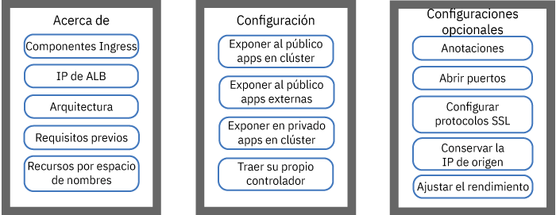
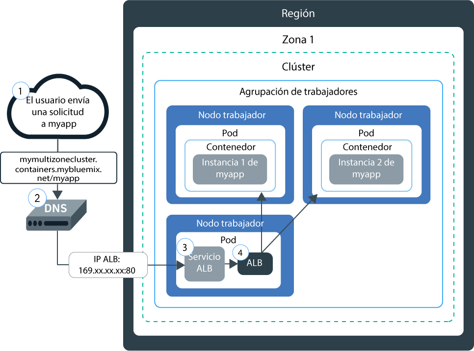
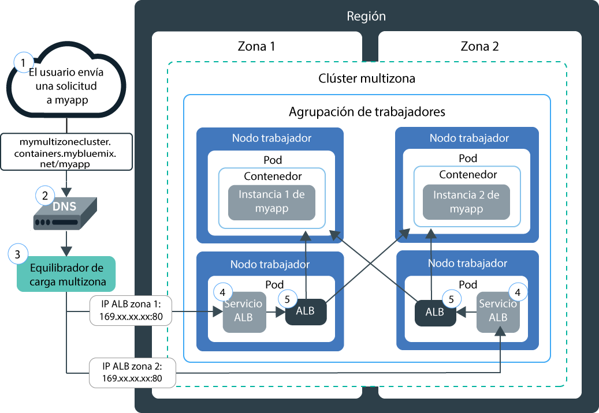
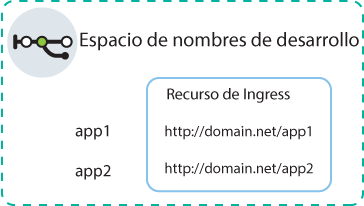
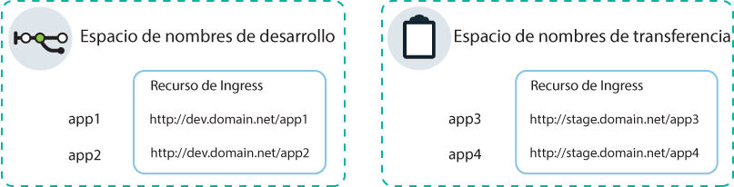
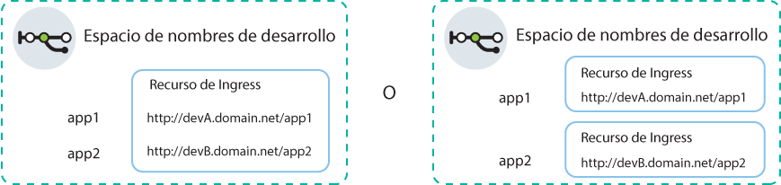

---

copyright:
  years: 2014, 2019
lastupdated: "2019-06-12"

keywords: kubernetes, iks, nginx, ingress controller

subcollection: containers

---

{:new_window: target="_blank"}
{:shortdesc: .shortdesc}
{:screen: .screen}
{:pre: .pre}
{:table: .aria-labeledby="caption"}
{:codeblock: .codeblock}
{:tip: .tip}
{:note: .note}
{:important: .important}
{:deprecated: .deprecated}
{:download: .download}
{:preview: .preview}


# Equilibrio de carga HTTPS con equilibradores de carga de aplicación (ALB) de Ingress
{: #ingress}

Exponga varias apps en el clúster de Kubernetes creando recursos Ingress gestionados por el equilibrador de carga de aplicación proporcionado por IBM en {{site.data.keyword.containerlong}}.
{:shortdesc}



<map name="image-map">
    <area target="" alt="Componentes de Ingress" title="Componentes de Ingress" href="#ingress_components" coords="28,42,172,69" shape="rect">
    <area target="" alt="IP de ALB" title="IP de ALB" href="#ips" coords="27,79,171,104" shape="rect">
    <area target="" alt="Arquitectura" title="Arquitectura" href="#architecture-single" coords="31,114,171,140" shape="rect">
    <area target="" alt="Requisitos previos" title="Requisitos previos" href="#config_prereqs" coords="28,151,171,176" shape="rect">
    <area target="" alt="Planificación de la red para espacios de nombres múltiples o individuales" title="Planificación de la red para espacios de nombres múltiples o individuales" href="#multiple_namespaces" coords="31,191,172,229" shape="rect">
    <area target="" alt="Exposición de apps que están dentro de su clúster al público" title="Exposición de apps que están dentro de su clúster al público" href="#ingress_expose_public" coords="275,43,418,78" shape="rect">
    <area target="" alt="Exposición de apps que están fuera de su clúster al público" title="Exposición de apps que están fuera de su clúster al público" href="#external_endpoint" coords="275,94,419,128" shape="rect">
    <area target="" alt="Exposición de apps en una red privada" title="Exposición de apps en una red privada" href="#ingress_expose_private" coords="277,141,418,177" shape="rect">
    <area target="" alt="Cómo traer su propio controlador Ingress" title="Cómo traer su propio controlador Ingress" href="#user_managed" coords="278,192,416,228" shape="rect">
    <area target="" alt="Personalización de un recurso de Ingress con anotaciones" title="Personalización de un recurso de Ingress con anotaciones" href="#annotations" coords="523,44,670,73" shape="rect">
    <area target="" alt="Apertura de puertos en el ALB de Ingress" title="Apertura de puertos en el ALB de Ingress" href="#opening_ingress_ports" coords="521,83,669,105" shape="rect">
    <area target="" alt="Configuración de protocolos SSL y cifrados SSL a nivel HTTP" title="Configuración de protocolos SSL y cifrados SSL a nivel HTTP" href="#ssl_protocols_ciphers" coords="523,116,669,158" shape="rect">
    <area target="" alt="Conservación de la dirección IP de origen" title="Conservación de la dirección IP de origen" href="#preserve_source_ip" coords="522,167,671,202" shape="rect">
    <area target="" alt="Ajuste del rendimiento de ALB" title="Ajuste del rendimiento de ALB" href="#perf_tuning" coords="524,213,669,237" shape="rect">
</map>

## Archivos YAML de ejemplo
{: #sample_ingress}

Utilice estos archivos YAML de ejemplo para comenzar a especificar rápidamente su recurso de Ingress.
{: shortdesc}

**Recurso de Ingress para exponer una app públicamente**</br>

¿Ya ha llevado a cabo los siguientes pasos?
- Desplegar una app
- Crear un servicio de app
- Seleccione un nombre de dominio y un secreto de TLS

Puede utilizar el siguiente archivo YAML de despliegue para crear un recurso de Ingress:

```
apiVersion: extensions/v1beta1
kind: Ingress
metadata:
  name: myingressresource
spec:
  tls:
  - hosts:
    - <domain>
    secretName: <tls_secret_name>
  rules:
  - host: <domain>
    http:
      paths:
      - path: /<app1_path>
        backend:
          serviceName: <app1_service>
          servicePort: 80
      - path: /<app2_path>
        backend:
          serviceName: <app2_service>
          servicePort: 80
```
{: codeblock}

</br>

**Recurso de Ingress para exponer una app de forma privada**</br>

¿Ya ha llevado a cabo los siguientes pasos?
- Habilitar un ALB privado
- Desplegar una app
- Crear un servicio de app
- Registrar un nombre de dominio personalizado y un secreto de TLS

Puede utilizar el siguiente archivo YAML de despliegue para crear un recurso de Ingress:

```
apiVersion: extensions/v1beta1
kind: Ingress
metadata:
  name: myingressresource
  annotations:
    ingress.bluemix.net/ALB-ID: "<private_ALB_ID_1>;<private_ALB_ID_2>"
spec:
  tls:
  - hosts:
    - <domain>
    secretName: <tls_secret_name>
  rules:
  - host: <domain>
    http:
      paths:
      - path: /<app1_path>
        backend:
          serviceName: <app1_service>
          servicePort: 80
      - path: /<app2_path>
        backend:
          serviceName: <app2_service>
          servicePort: 80
```
{: codeblock}

<br />


## ¿Qué es Ingress?
{: #planning}

Ingress es un servicio de Kubernetes que equilibra cargas de trabajo de tráfico de red en el clúster reenviando solicitudes públicas o privadas a sus apps. Puede utilizar Ingress para exponer varios servicios de app a la red privada o pública mediante una única ruta privada o pública.
{:shortdesc}

### ¿Qué se suministra con Ingress?
{: #ingress_components}

Ingress consta de tres componentes:
<dl>
<dt>Recurso de Ingress</dt>
<dd>Para exponer una app mediante Ingress, debe crear un servicio Kubernetes para la app y registrar este servicio con Ingress mediante la definición de un recurso de Ingress. El recurso de Ingress es un recurso de Kubernetes que define las reglas sobre cómo direccionar solicitudes de entrada para las apps. El recurso de Ingress también especifica la vía de acceso a los servicios de app, que se añaden a la ruta pública para formar un URL de app exclusivo, como por ejemplo `mycluster.us-south.containers.appdomain.cloud/myapp1`.<p class="note">Desde el 24 de mayo de 2018, el formato de subdominio de Ingress ha cambiado para nuevos clústeres. El nombre de región o de zona incluido en el nuevo formato de subdominio se genera en función de la zona en la que se ha creado el clúster. Si tiene dependencias de ejecución secuencial sobre nombres de dominio de app coherentes, puede utilizar su propio dominio personalizado en lugar del subdominio de Ingress que proporciona IBM.<ul><li>A todos los clústeres creados después del 24 de mayo 2018 se les asigna un subdominio en el nuevo formato, <code>&lt;cluster_name&gt;.&lt;region_or_zone&gt;.containers.appdomain.cloud</code>.</li><li>Los clústeres de una sola zona creados antes del 24 de mayo de 2018 continúan utilizando el subdominio asignado en el formato antiguo, <code>&lt;cluster_name&gt;.&lt;region&gt;.containers.mybluemix.net</code>.</li><li>Si cambia un clúster de una sola zona creado antes del 24 de mayo de 2018 por uno multizona mediante la [adición de una zona al clúster](/docs/containers?topic=containers-add_workers#add_zone) por primera vez, el clúster sigue utilizando el subdominio asignado en el formato antiguo, <code>&lt;cluster_name&gt;.&lt;region&gt;.containers.mybluemix.net</code>, y también se le asigna un subdominio en el nuevo formato, <code>&lt;cluster_name&gt;.&lt;region_or_zone&gt;.containers.appdomain.cloud</code>. Se puede utilizar cualquiera de los subdominios.</li></ul></p>**Clústeres multizona**: el recurso Ingress es global y solo se necesita un recurso Ingress por espacio de nombres para un clúster multizona.</dd>
<dt>Equilibrador de carga de aplicación (ALB)</dt>
<dd>El equilibrador de carga de aplicación (ALB) es un equilibrador de carga externo que escucha solicitudes del servicio HTTP, HTTPS o TCP de entrada. Luego el ALB reenvía las solicitudes al pod de app adecuado de acuerdo con las reglas definidas en el recurso Ingress. Cuando se crea un clúster estándar, {{site.data.keyword.containerlong_notm}} crea automáticamente un ALB altamente disponible para el clúster y le asigna una ruta pública exclusiva. La ruta pública se enlaza a una dirección IP pública portátil que se suministra a la cuenta de infraestructura de IBM Cloud (SoftLayer) durante la creación del clúster. También se crea automáticamente un ALB privado predeterminado, pero no se habilita automáticamente.<br></br>**Clústeres multizona**: cuando añade una zona al clúster, se añade una subred pública portátil y se crea automáticamente un nuevo ALB público y se habilita en la subred de dicha zona. Todos los ALB públicos predeterminados del clúster comparten una ruta pública, pero tienen direcciones IP diferentes. También se crea automáticamente un ALB privado predeterminado en cada zona, pero no se habilita automáticamente.</dd>
<dt>Equilibrador de carga multizona (MZLB)</dt>
<dd><p>**Clústeres multizona**: cuando se crea un clúster multizona o se [añade una zona a un clúster de una sola zona](/docs/containers?topic=containers-add_workers#add_zone), se crea y se despliega automáticamente un equilibrador de carga multizona (MZLB) de Cloudflare, de forma que exista 1 MZLB para cada región. El MZLB coloca las direcciones IP de los ALB detrás del mismo subdominio y habilita las comprobaciones de estado en estas direcciones IP para determinar si están disponibles o no. Por ejemplo, si tiene nodos trabajadores en 3 zonas en la región EE. UU. este, el subdominio `yourcluster.us-east.containers.appdomain.cloud` tiene 3 direcciones IP de ALB. El estado de MZLB comprueba la IP de ALB pública en cada zona de una región y mantiene actualizados los resultados de la búsqueda de DNS en función de estas comprobaciones de estado. Por ejemplo, si los ALB tienen las direcciones IP `1.1.1.1`, `2.2.2.2` y `3.3.3.3`, una operación normal de búsqueda de DNS del subdominio Ingress devuelve las 3 IP; el cliente accede a 1 de ellas de forma aleatoria. Si el ALB con la dirección IP `3.3.3.3` deja de estar disponible por cualquier motivo, por ejemplo debido a una anomalía de zona, la comprobación de estado de dicha zona falla, el MZLB elimina la IP fallida del subdominio y la búsqueda de DNS devuelve sólo las IP de ALB `1.1.1.1` y `2.2.2.2` en buen estado. El subdominio tiene un tiempo de duración (TTL) de 30 segundos, de modo que, pasados 30 segundos, las nuevas apps cliente solo pueden acceder a una de las IP de ALB disponibles en buen estado.</p><p>En casos excepcionales, algunos solucionadores de DNS o apps cliente pueden continuar utilizando la IP de ALB en mal estado después del TTL de 30 segundos. Estas apps cliente pueden experimentar un tiempo de carga más largo hasta que la app cliente abandona la IP `3.3.3.3` e intenta conectarse a `1.1.1.1` o `2.2.2.2`. En función del navegador del cliente o de los valores de la app cliente, el retraso puede oscilar entre unos pocos segundos y un tiempo de espera TCP completo.</p>
<p>MZLB solo equilibra la carga de los ALB públicos que utilizan los subdominios Ingress proporcionados por IBM. Si solo utiliza ALB privados, debe comprobar manualmente el estado de los ALB y actualizar los resultados de la búsqueda de DNS. Si utiliza ALB públicos que utilizan un dominio personalizado, puede incluir los ALB en el equilibrio de carga de MZLB creando un CNAME en la entrada DNS para reenviar las solicitudes desde el dominio personalizado al subdominio de Ingress proporcionado por IBM para el clúster.</p>
<p class="note">Si utiliza las políticas de red pre-DNAT de Calico para bloquear todo el tráfico entrante a los servicios de Ingress, también debe colocar en la lista blanca las <a href="https://www.cloudflare.com/ips/">IP IPv4 de Cloudflare </a> que se utilizan para comprobar el estado de sus ALB. Para ver los pasos a seguir para crear una política pre-DNAT de Calico para colocar estas IP en la lista blanca, consulte la Lección 3 de la <a href="/docs/containers?topic=containers-policy_tutorial#lesson3">guía de aprendizaje de la política de red de Calico</a>.</p></dd>
</dl>

### ¿Cómo se asignan las IP a los ALB de Ingress?
{: #ips}

Cuando se crea un clúster estándar, {{site.data.keyword.containerlong_notm}} suministra automáticamente una subred pública portátil y una subred privada portátil. De forma predeterminada, el clúster utiliza automáticamente:
* 1 dirección IP pública portátil de la subred pública portátil correspondiente al ALB de Ingress público predeterminado.
* 1 dirección IP privada portátil de la subred privada portátil correspondiente al ALB de Ingress privado predeterminado.
{: shortdesc}

Si tiene un clúster multizona, se crea automáticamente un ALB público predeterminado y un ALB privado predeterminado en cada zona. Las direcciones IP de los ALB públicos predeterminados están todas detrás del mismo subdominio proporcionado por IBM para el clúster.

Las direcciones IP públicas y privadas portátiles son IP flotantes estáticas y no cambian cuando se elimina un nodo trabajador. Si se elimina el nodo trabajador, un daemon `Keepalived` que supervisa constantemente la IP vuelve a planificar automáticamente los pods de ALB que estaban en ese nodo trabajador en otro nodo trabajador de dicha zona. Los pods de ALB reprogramados mantienen la misma dirección IP estática. Durante la vida del clúster, la dirección IP de ALB en cada zona no cambia. Si elimina una zona de un clúster, la dirección IP del ALB para dicha zona se elimina.

Para ver las IP asignadas a los ALB, puede ejecutar el mandato siguiente.
```
ibmcloud ks albs --cluster <cluster_name_or_id>
```
{: pre}

Para obtener más información sobre lo que ocurre con las IP de ALB en el caso de que se produzca una anomalía en una zona, consulte la definición del [componente equilibrador de carga multizona](#ingress_components).


### ¿Cómo llega a mi app una solicitud con Ingress en un clúster de una sola zona?
{: #architecture-single}


En el siguiente diagrama se muestra cómo Ingress dirige la comunicación procedente de internet a una app en un clúster de una sola zona:



1. Un usuario envía una solicitud a la app accediendo al URL de la app. Este URL es el URL público para la app expuesta al que se añade la vía de acceso al recurso de Ingress como, por ejemplo, `mycluster.us-south.containers.appdomain.cloud/myapp`.

2. Un servicio del sistema DNS resuelve el subdominio en el URL como la dirección IP pública portátil del equilibrador de carga que expone el ALB en el clúster.

3. En función de la dirección IP resulta, el cliente envía la solicitud al servicio equilibrador de carga que expone el ALB.

4. El servicio equilibrador de carga direcciona la solicitud al ALB.

5. El ALB comprueba si existe una regla de direccionamiento para la vía de acceso `myapp` en el clúster. Si se encuentra una regla coincidente, la solicitud se reenvía al pod en el que se ha desplegado la app, de acuerdo con las reglas que ha definido en el recurso de Ingress. La dirección IP de origen del paquete se cambia por la dirección IP pública del nodo trabajador donde el pod de app está en ejecución. Si se despliegan varias instancias de app en el clúster, el ALB equilibra la carga de las solicitudes entre los pods de app.

### ¿Cómo llega a mi app una solicitud con Ingress en un clúster multizona?
{: #architecture-multi}

En el siguiente diagrama se muestra cómo Ingress dirige la comunicación procedente de internet a una app en un clúster multizona:



1. Un usuario envía una solicitud a la app accediendo al URL de la app. Este URL es el URL público para la app expuesta al que se añade la vía de acceso al recurso de Ingress como, por ejemplo, `mycluster.us-south.containers.appdomain.cloud/myapp`.

2. Un servicio del sistema DNS, que actúa como el equilibrador de carga global, resuelve el subdominio en el URL como una dirección IP que MZLB ha detectado que está en buen estado. MZLB comprueba continuamente las direcciones IP públicas portátiles de los servicios del equilibrador de carga que exponen ALB públicos en cada zona del clúster. Las direcciones IP se resuelven en un ciclo en rueda, lo que garantiza que las solicitudes se equilibran equitativamente entre los ALB en buen estado de varias zonas.

3. El cliente envía la solicitud a la dirección IP del servicio equilibrador de carga que expone un ALB.

4. El servicio equilibrador de carga direcciona la solicitud al ALB.

5. El ALB comprueba si existe una regla de direccionamiento para la vía de acceso `myapp` en el clúster. Si se encuentra una regla coincidente, la solicitud se reenvía al pod en el que se ha desplegado la app, de acuerdo con las reglas que ha definido en el recurso de Ingress. La dirección IP de origen del paquete se cambia a la dirección IP pública del nodo trabajador donde el pod de app está en ejecución. Si se despliegan varias instancias de app en el clúster, el ALB equilibra la carga de las solicitudes entre los pods de app de todas las zonas.

<br />


## Requisitos previos
{: #config_prereqs}

Antes de empezar a trabajar con Ingress, revise los siguientes requisitos previos.
{:shortdesc}

**Requisitos previos para todas las configuraciones de Ingress:**
- Ingress únicamente está disponible para los clústeres estándares y necesita al menos dos nodos trabajadores por zona para garantizar la alta disponibilidad y que se aplican actualizaciones periódicas. Si solo tiene un nodo trabajador en una zona, el ALB no puede recibir actualizaciones automáticas. Cuando se despliegan actualizaciones automáticas en los pods de ALB, el pod se vuelve a cargar. Sin embargo, los pods de ALB tienen reglas antiafinidad para garantizar que solo hay un pod planificado para en cada nodo trabajador para alta disponibilidad. Puesto que solo hay un pod de ALB en un nodo trabajador, el pod no se reinicia para que el tráfico no se interrumpa. El pod ALB se actualiza a la última versión solo cuando se suprime suprimir el pod anterior para que se pueda planificar el nuevo pod actualizado.
- Para configurar Ingress se necesitan los siguientes [roles de {{site.data.keyword.Bluemix_notm}} IAM](/docs/containers?topic=containers-users#platform):
    - Rol de plataforma de **Administrador** sobre el clúster
    - Rol de servicio de **Gestor** sobre todos los espacios de nombres

**Requisitos previos para el uso de Ingress en clústeres multizona:**:
 - Si restringe el tráfico de red a los [nodos trabajadores de extremo](/docs/containers?topic=containers-edge), debe haber al menos 2 nodos trabajadores de extremo en cada zona para conseguir una alta disponibilidad de los pods Ingress. [Cree una agrupación de nodos trabajadores de extremo](/docs/containers?topic=containers-add_workers#add_pool) que abarque todas las zonas del clúster y tenga como mínimo 2 nodos trabajadores por zona.
 - Si tiene varias VLAN para un clúster, varias subredes en la misma VLAN o un clúster multizona, debe habilitar la [función de direccionador virtual (VRF)](/docs/infrastructure/direct-link?topic=direct-link-overview-of-virtual-routing-and-forwarding-vrf-on-ibm-cloud#overview-of-virtual-routing-and-forwarding-vrf-on-ibm-cloud) para la cuenta de infraestructura de IBM Cloud (SoftLayer) para que los nodos trabajadores puedan comunicarse entre sí en la red privada. Para habilitar VRF, [póngase en contacto con el representante de su cuenta de la infraestructura de IBM Cloud (SoftLayer)](/docs/infrastructure/direct-link?topic=direct-link-overview-of-virtual-routing-and-forwarding-vrf-on-ibm-cloud#how-you-can-initiate-the-conversion). Si no puede o no desea habilitar VRF, habilite la [distribución de VLAN](/docs/infrastructure/vlans?topic=vlans-vlan-spanning#vlan-spanning). Para llevar a cabo esta acción, necesita el [permiso de la infraestructura](/docs/containers?topic=containers-users#infra_access) **Red > Gestionar distribución de VLAN de red** o bien puede solicitar al propietario de la cuenta que lo habilite. Para comprobar si la distribución de VLAN ya está habilitada, utilice el [mandato](/docs/containers?topic=containers-cli-plugin-kubernetes-service-cli#cs_vlan_spanning_get) `ibmcloud ks vlan-spanning-get --region <region>`.
 - Si una zona falla, es posible que vea anomalías intermitentes en las solicitudes al ALB Ingress en dicha zona.

<br />


## Planificación de red para espacios de nombres múltiples o individuales
{: #multiple_namespaces}

Se necesita un recurso Ingress por espacio de nombres donde tenga apps que desee exponer.
{:shortdesc}

### Todas las apps están en un espacio de nombres
{: #one-ns}

Si las apps en el clúster están en el mismo espacio de nombres, se necesita un recurso de Ingress para definir las reglas de direccionamiento para las apps allí expuestas. Por ejemplo, si los servicios en un espacio de nombres de desarrollo exponen las apps `app1` y `app2`, puede crear un recurso de Ingress en el espacio de nombres. El recurso especifica `domain.net` como host y registra las vías que cada app escucha con `domain.net`.
{: shortdesc}



### Las apps están en varios espacios de nombres
{: #multi-ns}

Si las apps en el clúster están en distintos espacios de nombres, se debe crear un recurso por espacio de nombres para definir reglas para las apps allí expuestas.
{: shortdesc}

Sin embargo, puede definir un nombre de host en un solo recurso. No puede definir el mismo nombre de host en varios recursos. Para registrar varios recursos de Ingress con el mismo nombre de host, debe utilizar un dominio comodín. Cuando se registra un dominio comodín como `*.domain.net`, varios subdominios se pueden resolver en el mismo host. A continuación, puede crear un recurso de Ingress en cada espacio de nombres y especificar un subdominio diferente en cada recurso de Ingress.

Por ejemplo, considere el escenario siguiente:
* Tiene dos versiones de la misma app, `app1` y `app3`, para fines de prueba.
* Despliega las apps en dos espacios de nombres diferentes dentro del mismo clúster: `app1` en el espacio de nombres de desarrollo y `app3` en el espacio de nombres de transferencia.

Para utilizar el mismo ALB de clúster para gestionar el tráfico a estas apps, puede crear los siguientes servicios y recursos:
* Un servicio Kubernetes en el espacio de nombres de desarrollo para exponer `app1`.
* Un recurso de Ingress en el espacio de nombres de desarrollo que especifica el host como `dev.domain.net`.
* Un servicio Kubernetes en el espacio de nombres de transferencia para exponer `app3`.
* Un recurso de Ingress en el espacio de nombres de transferencia que especifica el host como `stage.domain.net`.
</br>


Ahora, ambos URL se resuelven al mismo dominio y, por lo tanto, el mismo ALB da servicio a ambos URL. Sin embargo, puesto que el recurso en el espacio de nombres de transferencia está registrado con el subdominio `stage`, el ALB de Ingress direcciona correctamente las solicitudes desde el URL `stage.domain.net/app3` únicamente a `app3`.

{: #wildcard_tls}
El comodín de subdominio de Ingress que IBM proporciona, `*.<cluster_name>.<region>.containers.appdomain.cloud`, está registrado de forma predeterminada para su clúster. El certificado TLS proporcionado por IBM es un certificado comodín y se puede utilizar para el subdominio comodín. Si desea utilizar un dominio personalizado, debe registrar el dominio personalizado como un dominio comodín como, por ejemplo, `*.custom_domain.net`. Para utilizar TLS, debe obtener un certificado comodín.
{: note}

### Varios dominios dentro del mismo espacio de nombres
{: #multi-domains}

En un espacio de nombres individual, puede utilizar un dominio para acceder a todas las apps en el espacio de nombres. Si desea utilizar diferentes dominios para las apps dentro de un espacio de nombres individual, utilice un dominio comodín. Cuando se registra un dominio comodín como `*.mycluster.us-south.containers.appdomain.cloud`, varios subdominios se resuelven todos ellos al mismo host. A continuación, puede utilizar un recurso para especificar varios hosts de subdominio dentro de dicho recurso. Como alternativa, puede crear varios recursos de Ingress en el espacio de nombres y especificar un subdominio diferente en cada recurso de Ingress.
{: shortdesc}



El comodín de subdominio de Ingress que IBM proporciona, `*.<cluster_name>.<region>.containers.appdomain.cloud`, está registrado de forma predeterminada para su clúster. El certificado TLS proporcionado por IBM es un certificado comodín y se puede utilizar para el subdominio comodín. Si desea utilizar un dominio personalizado, debe registrar el dominio personalizado como un dominio comodín como, por ejemplo, `*.custom_domain.net`. Para utilizar TLS, debe obtener un certificado comodín.
{: note}

<br />


## Exposición de apps que están dentro de su clúster al público
{: #ingress_expose_public}

Exponga apps que están dentro de su clúster al público utilizando el ALB de Ingress público.
{:shortdesc}

Antes de empezar:

* Revise los [requisitos previos](#config_prereqs) de Ingress.
* [Inicie una sesión en su cuenta. Si procede, apunte al grupo de recursos adecuado. Establezca el contexto para el clúster.](/docs/containers?topic=containers-cs_cli_install#cs_cli_configure)

### Paso 1: Desplegar apps y crear servicios de app
{: #public_inside_1}

Empiece desplegando sus apps y crear servicios de Kubernetes para exponerlos.
{: shortdesc}

1.  [Despliegue la app en el clúster](/docs/containers?topic=containers-app#app_cli). Asegúrese de añadir una etiqueta a su despliegue en la sección de metadatos del archivo de configuración como, por ejemplo, `app: code`. Esta etiqueta es necesaria para identificar todos los pods en los que se está ejecutando la app, de modo que puedan incluirse dichos pods en el equilibrio de carga de Ingress.

2.   Cree un servicio de Kubernetes para cada app que desee exponer. El servicio de Kubernetes debe exponer la app para incluirla en el ALB de clúster en el equilibrio de carga de Ingress.
      1.  Abra el editor que prefiera y cree un archivo de configuración de servicio llamado, por ejemplo, `myappservice.yaml`.
      2.  Defina un servicio para la app que el ALB expondrá.

          ```
          apiVersion: v1
          kind: Service
          metadata:
            name: myappservice
          spec:
            selector:
              <selector_key>: <selector_value>
            ports:
             - protocol: TCP
               port: 8080
          ```
          {: codeblock}

          <table>
          <thead>
          <th colspan=2> Componentes del archivo YAML del servicio del ALB</th>
          </thead>
          <tbody>
          <tr>
          <td><code>selector</code></td>
          <td>Especifique el par de clave de etiqueta (<em>&lt;selector_key&gt;</em>) y valor (<em>&lt;selector_value&gt;</em>) que desee utilizar para establecer como destino los pods en los que se ejecuta la app. Para especificar e incluir sus pods en el equilibrio de carga del servicio, asegúrese de que <em>&lt;selector_key&gt;</em> y <em>&lt;selector_value&gt;</em> coinciden con el par de clave/valor en la sección <code>spec.template.metadata.labels</code> de su archivo YAML de despliegue.</td>
           </tr>
           <tr>
           <td><code>port</code></td>
           <td>El puerto que en el que está a la escucha el servicio.</td>
           </tr>
           </tbody></table>
      3.  Guarde los cambios.
      4.  Cree el servicio en el clúster. Si las apps están desplegadas en varios espacios de nombres en el clúster, asegúrese de que el servicio se despliega en el mismo espacio de nombres que la app que desea exponer.

          ```
          kubectl apply -f myappservice.yaml [-n <namespace>]
          ```
          {: pre}
      5.  Repita estos pasos para cada app que desee exponer.


### Paso 2: Seleccionar un dominio de app
{: #public_inside_2}

Cuando configure el ALB público, elija el dominio en el que sus apps serán accesibles.
{: shortdesc}

Puede utilizar el dominio proporcionado por IBM, como por ejemplo `mycluster-12345.us-south.containers.appdomain.cloud/myapp`, para acceder a su app desde Internet. Para utilizar en su lugar un dominio personalizado, puede configurar un registro CNAME para correlacionar su dominio personalizado con el dominio proporcionado por IBM o puede configurar un registro A con su proveedor de DNS utilizando la dirección IP pública del ALB.

**Para utilizar el dominio de Ingress proporcionado por IBM:**

Obtenga el dominio proporcionado por IBM. Sustituya `<cluster_name_or_ID>` por el nombre del clúster en el que se ha desplegado la app.
```
ibmcloud ks cluster-get --cluster <cluster_name_or_ID> | grep Ingress
```
{: pre}

Salida de ejemplo:
```
Ingress Subdomain:      mycluster-12345.us-south.containers.appdomain.cloud
Ingress Secret:         <tls_secret>
```
{: screen}

**Para utilizar un dominio personalizado:**
1.    Cree un dominio personalizado. Para registrar un dominio personalizado, póngase en contacto con su proveedor de DNS (Domain Name Service) o con [{{site.data.keyword.Bluemix_notm}} DNS](/docs/infrastructure/dns?topic=dns-getting-started).
      * Si las apps que desea que Ingress exponga se encuentran en diferentes espacios de nombres en un clúster, registre el dominio personalizado como un dominio comodín como, por ejemplo, `*.custom_domain.net`.

2.  Configure el dominio de modo que direccione el tráfico de red de entrada al ALB proporcionado por IBM. Puede elegir entre las siguientes opciones:
    -   Defina un alias para el dominio personalizado especificando el dominio proporcionado por IBM como CNAME (Registro de nombre canónico). Para encontrar el dominio de Ingress proporcionado por IBM, ejecute `ibmcloud ks cluster-get --cluster <cluster_name>` y busque el campo **Subdominio de Ingress**. Se prefiere el uso de un CNAME porque IBM proporciona comprobaciones de estado automáticas en el subdominio de IBM y elimina cualquier IP anómala de la respuesta de DNS.
    -   Correlacione el dominio personalizado con la dirección IP pública portátil del ALB proporcionado por IBM añadiendo la dirección IP como registro. Para localizar la dirección IP pública portátil del ALB, ejecute `ibmcloud ks alb-get --albID <public_alb_ID>`.

### Paso 3: Seleccionar terminación TLS
{: #public_inside_3}

Después de elegir el dominio de la app, elija si desea utilizar o no la terminación TLS.
{: shortdesc}

El ALB equilibra carga de tráfico de red HTTP para las apps en su clúster. Para equilibrar también la carga de conexiones HTTPS entrantes, puede configurar el ALB para descifrar el tráfico de red y reenviar las solicitudes descifradas a las apps expuestas en su clúster.

* Si utiliza el subdominio de Ingress proporcionado por IBM, puede utilizar el certificado TLS proporcionado por IBM. Los certificados TLS proporcionados por IBM están firmados por LetsEncrypt y están gestionados por completo por IBM. Los certificados caducan cada 90 días y se renuevan automáticamente 37 días antes de que caduquen. Para obtener información sobre la certificación de TLS comodín, consulte [esta nota](#wildcard_tls).
* Si utiliza un dominio personalizado, puede utilizar su propio certificado TLS para gestionar la terminación TLS. En primer lugar, el ALB comprueba si hay un secreto en el espacio de nombres en el que se encuentra la app, luego en `default` y, finalmente, en `ibm-cert-store`. Si tiene apps en un solo espacio de nombres, puede importar o crear un secreto TLS para el certificado en ese mismo espacio de nombres. Si tiene apps en varios espacios de nombres, importe o cree un secreto TLS para el certificado en el espacio de nombres `default` de forma que el ALB pueda acceder y utilizar el certificado en cada espacio de nombres. En los recursos de Ingress que defina para cada espacio de nombres, especifique el nombre del secreto que se encuentra en el espacio de nombres predeterminado. Para obtener información sobre la certificación de TLS comodín, consulte [esta nota](#wildcard_tls). **Nota**: los certificados TLS que contienen claves precompartidas (TLS-PSK) no están soportados.

**Si utiliza el dominio Ingress proporcionado por IBM:**

Obtenga el secreto TLS proporcionado por IBM para el clúster.
```
ibmcloud ks cluster-get --cluster <cluster_name_or_ID> | grep Ingress
```
{: pre}

Salida de ejemplo:
```
Ingress Subdomain:      mycluster-12345.us-south.containers.appdomain.cloud
Ingress Secret:         <tls_secret>
```
{: screen}
</br>

**Si utiliza un dominio personalizado:**

Si hay un certificado TLS almacenado en {{site.data.keyword.cloudcerts_long_notm}} que desea utilizar, puede importar su secreto asociado a su clúster ejecutando el siguiente mandato:

```
ibmcloud ks alb-cert-deploy --secret-name <secret_name> --cluster <cluster_name_or_ID> --cert-crn <certificate_crn>
```
{: pre}

Asegúrese de que no crea el secreto con el mismo nombre que el secreto de Ingress proporcionado por IBM. Puede obtener el nombre del secreto de Ingress proporcionado por IBM con el mandato `ibmcloud ks cluster-get --cluster <cluster_name_or_ID> | grep Ingress`.
{: note}

Cuando importa un certificado con este mandato, el secreto de certificado se crea en un espacio de nombres denominado `ibm-cert-store`. A continuación, se crea una referencia a este secreto en el espacio de nombres `default`, al que puede acceder cualquier recurso de Ingress en cualquier espacio de nombres. Cuando el ALB está procesando solicitudes, sigue esta referencia para seleccionar y utilizar el secreto de certificado del espacio de nombres `ibm-cert-store`.

</br>

Si no tiene un certificado TLS listo, siga estos pasos:
1. Genere un certificado de la autoridad de certificados (CA) y una clave de su proveedor de certificados. Si tiene su propio dominio, compre un certificado TLS oficial para el mismo. Asegúrese de que el [CN ](https://support.dnsimple.com/articles/what-is-common-name/) sea distinto para cada certificado.
2. Convierta el cert y la clave a base 64.
   1. Codifique el cert y la clave en la base 64 y guarde el valor codificado en base 64 en un nuevo archivo.
      ```
      openssl base64 -in tls.key -out tls.key.base64
      ```
      {: pre}

   2. Vea el valor codificado en base 64 para el cert y la clave.
      ```
      cat tls.key.base64
      ```
      {: pre}

3. Cree un archivo YAML secreto utilizando el certificado y la clave.
     ```
     apiVersion: v1
     kind: Secret
     metadata:
       name: ssl-my-test
     type: Opaque
     data:
       tls.crt: <client_certificate>
       tls.key: <client_key>
     ```
     {: codeblock}

4. Cree el certificado como un secreto de Kubernetes.
     ```
     kubectl create -f ssl-my-test
     ```
     {: pre}
     Asegúrese de que no crea el secreto con el mismo nombre que el secreto de Ingress proporcionado por IBM. Puede obtener el nombre del secreto de Ingress proporcionado por IBM con el mandato `ibmcloud ks cluster-get --cluster <cluster_name_or_ID> | grep Ingress`.
     {: note}


### Paso 4: Crear el recurso de Ingress
{: #public_inside_4}

Los recursos de Ingress definen las reglas de direccionamiento que los ALB utilizan para direccionar el tráfico a su servicio de app.
{: shortdesc}

Si el clúster tiene varios espacios de nombres donde se exponen las apps, se necesita un recurso de Ingress por espacio de nombres. Sin embargo, cada espacio de nombres debe utilizar un host diferente. Debe registrar un dominio comodín y especificar un subdominio diferente en cada recurso. Para obtener más información, consulte [Planificación de redes para uno o varios espacios de nombres](#multiple_namespaces).
{: note}

1. Abra el editor que prefiera y cree un archivo de configuración de Ingress llamado, por ejemplo, `myingressresource.yaml`.

2. Defina un recurso de Ingress en el archivo de configuración que utilice el dominio proporcionado por IBM o su dominio personalizado para direccionar el tráfico de entrada de red a los servicios que ha creado anteriormente.

    YAML de ejemplo que no utiliza TLS:
    ```
    apiVersion: extensions/v1beta1
    kind: Ingress
    metadata:
      name: myingressresource
    spec:
      rules:
      - host: <domain>
        http:
          paths:
          - path: /<app1_path>
            backend:
              serviceName: <app1_service>
              servicePort: 80
          - path: /<app2_path>
            backend:
              serviceName: <app2_service>
              servicePort: 80
    ```
    {: codeblock}

    YAML de ejemplo que utiliza TLS:
    ```
    apiVersion: extensions/v1beta1
    kind: Ingress
    metadata:
      name: myingressresource
    spec:
      tls:
      - hosts:
        - <domain>
        secretName: <tls_secret_name>
      rules:
      - host: <domain>
        http:
          paths:
          - path: /<app1_path>
            backend:
              serviceName: <app1_service>
              servicePort: 80
          - path: /<app2_path>
            backend:
              serviceName: <app2_service>
              servicePort: 80
    ```
    {: codeblock}

    <table>
    <thead>
    <th colspan=2> Visión general de los componentes del archivo YAML</th>
    </thead>
    <tbody>
    <tr>
    <td><code>tls.hosts</code></td>
    <td>Para utilizar TLS, sustituya <em>&lt;domain&gt;</em> con el subdominio de Ingress proporcionado por IBM o su dominio personalizado.

    </br></br>
    <strong>Nota:</strong><ul><li>Si sus apps están expuestas por los servicios en diferentes espacios de nombres en un clúster, añada un subdominio comodín al principio del dominio como, por ejemplo, `subdomain1.custom_domain.net` o `subdomain1.mycluster.us-south.containers.appdomain.cloud`. Utilice un subdominio exclusivo para cada recurso que cree en el clúster.</li><li>No utilice &ast; para el host ni deje la propiedad host vacía para evitar errores durante la creación de Ingress.</li></ul></td>
    </tr>
    <tr>
    <td><code>tls.secretName</code></td>
    <td><ul><li>Si utiliza el dominio de Ingress proporcionado por IBM, sustituya <em>&lt;tls_secret_name&gt;</em> por el nombre del secreto de Ingress proporcionado por IBM.</li><li>Si utiliza un dominio personalizado, sustituya <em>&lt;tls_secret_name&gt;</em> por el secreto que ha creado anteriormente que aloja la clave y el certificado TLS personalizados. Si ha importado un certificado de {{site.data.keyword.cloudcerts_short}}, puede ejecutar <code>ibmcloud ks alb-cert-get --cluster <cluster_name_or_ID> --cert-crn <certificate_crn></code> para ver los secretos que están asociados con un certificado TLS.</li><ul><td>
    </tr>
    <tr>
    <td><code>host</code></td>
    <td>Sustituya <em>&lt;domain&gt;</em> con el subdominio de Ingress proporcionado por IBM o su dominio personalizado.

    </br></br>
    <strong>Nota:</strong><ul><li>Si sus apps están expuestas por los servicios en diferentes espacios de nombres en un clúster, añada un subdominio comodín al principio del dominio como, por ejemplo, `subdomain1.custom_domain.net` o `subdomain1.mycluster.us-south.containers.appdomain.cloud`. Utilice un subdominio exclusivo para cada recurso que cree en el clúster.</li><li>No utilice &ast; para el host ni deje la propiedad host vacía para evitar errores durante la creación de Ingress.</li></ul></td>
    </tr>
    <tr>
    <td><code>path</code></td>
    <td>Sustituya <em>&lt;app_path&gt;</em> con una barra inclinada o con la vía de acceso en la que su app está a la escucha. La vía de acceso se añade al dominio personalizado o proporcionado por IBM para crear una ruta exclusiva a su app. Cuando especifica esta ruta en un navegador web, el tráfico de la red se direcciona al ALB. El ALB consulta el servicio asociado y envía el tráfico de red al servicio. A continuación, el servicio reenvía el tráfico a los pods en los que la app está en ejecución.
    </br></br>
    Muchas apps no escuchan en una vía de acceso específica, sino que utilizan la vía de acceso raíz y un puerto específico. En este caso, defina la vía de acceso raíz como <code>/</code> y no especifique una vía de acceso individual para la app. Ejemplos: <ul><li>Para <code>http://domain/</code>, especifique <code>/</code> como la vía de acceso.</li><li>Para <code>http://domain/app1_path</code>, especifique <code>/app1_path</code> como la vía de acceso.</li></ul>
    </br>
    <strong>Sugerencia:</strong> Para configurar Ingress para que escuche en una vía de acceso que sea distinta a la vía de acceso en la que escucha la app, utilice la [anotación de reescritura](/docs/containers?topic=containers-ingress_annotation#rewrite-path).</td>
    </tr>
    <tr>
    <td><code>serviceName</code></td>
    <td>Sustituya <em>&lt;app1_service&gt;</em> y <em>&lt;app2_service&gt;</em> y así sucesivamente con el nombre de los servicios que ha creado para exponer sus apps. Si sus apps están expuestas por los servicios en diferentes espacios de nombres en el clúster, incluya únicamente los servicios de app que se encuentran en el mismo espacio de nombres. Debe crear un recurso de Ingress para cada espacio de nombres donde tiene las apps que desea exponer.</td>
    </tr>
    <tr>
    <td><code>servicePort</code></td>
    <td>El puerto en el que el servicio está a la escucha. Utilice el mismo puerto que ha definido al crear el servicio de Kubernetes para la app.</td>
    </tr>
    </tbody></table>

3.  Cree el recurso de Ingress para el clúster. Asegúrese de que el recurso se despliega en el mismo espacio de nombres que los servicios de apps que ha especificado en el recurso.

    ```
    kubectl apply -f myingressresource.yaml -n <namespace>
    ```
    {: pre}
4.   Verifique que el recurso de Ingress se haya creado correctamente.

      ```
      kubectl describe ingress myingressresource
      ```
      {: pre}

      1. Si los mensajes en los sucesos describen un error en la configuración del recurso, cambie los valores en el archivo de recursos y aplique de nuevo el archivo del recurso.


El recurso de Ingress se crea en el mismo espacio de nombres que los servicios de las apps. Sus apps en este espacio de nombres se registran con el ALB de Ingress del clúster.

### Paso 5: Acceder a la app desde Internet
{: #public_inside_5}

En un navegador web, escriba el URL del servicio de la app al que va a acceder.
{: shortdesc}

```
https://<domain>/<app1_path>
```
{: codeblock}

Si tiene varias apps expuestas, acceda a dichas apps cambiando la vía de acceso que se añade al final del URL.

```
https://<domain>/<app2_path>
```
{: codeblock}

Si utiliza un dominio comodín para exponer apps en diferentes espacios de nombres, acceda a dichas apps con sus propios subdominios.

```
http://<subdomain1>.<domain>/<app1_path>
```
{: codeblock}

```
http://<subdomain2>.<domain>/<app1_path>
```
{: codeblock}


¿Tiene problemas para conectarse a su app a través de Ingress? Intente [depurar Ingress](/docs/containers?topic=containers-cs_troubleshoot_debug_ingress).
{: tip}

<br />


## Exposición de apps que están fuera de su clúster al público
{: #external_endpoint}

Exponga apps que están fuera de su clúster al público incluyéndolas en el equilibrio de carga del ALB de Ingress público. Las solicitudes públicas entrantes en el dominio personalizado o proporcionado por IBM se reenvían automáticamente a la app externa.
{: shortdesc}

Antes de empezar:

* Revise los [requisitos previos](#config_prereqs) de Ingress.
* Asegúrese de que se pueda acceder a la app externa que desea incluir en el equilibrio de la carga del clúster mediante una dirección IP pública.
* [Inicie una sesión en su cuenta. Si procede, apunte al grupo de recursos adecuado. Establezca el contexto para el clúster.](/docs/containers?topic=containers-cs_cli_install#cs_cli_configure)

Para exponer apps que están fuera de su clúster al público:

1.  Cree un servicio de Kubernetes para el clúster que enviará las solicitudes entrantes a un punto final externo que habrá creado.
    1.  Abra el editor que prefiera y cree un archivo de configuración de servicio llamado, por ejemplo, `myexternalservice.yaml`.
    2.  Defina un servicio para la app que el ALB expondrá.

        ```
        apiVersion: v1
        kind: Service
        metadata:
          name: myexternalservice
        spec:
          ports:
           - protocol: TCP
             port: 8080
        ```
        {: codeblock}

        <table>
        <caption>Visión general de los componentes de archivo del servicio ALB</caption>
        <thead>
        <th colspan=2> Visión general de los componentes del archivo YAML</th>
        </thead>
        <tbody>
        <tr>
        <td><code>metadata.name</code></td>
        <td>Sustituya <em><code>&lt;myexternalservice&gt;</code></em> por el nombre del servicio.<p>Obtenga más información sobre cómo [proteger su información personal](/docs/containers?topic=containers-security#pi) cuando se trabaja recursos de Kubernetes.</p></td>
        </tr>
        <tr>
        <td><code>port</code></td>
        <td>El puerto que en el que está a la escucha el servicio.</td>
        </tr></tbody></table>

    3.  Guarde los cambios.
    4.  Cree el servicio de Kubernetes para el clúster.

        ```
        kubectl apply -f myexternalservice.yaml
        ```
        {: pre}
2.  Configure un punto final de Kubernetes que defina la ubicación externa de la app que desea incluir en el equilibrio de la carga del clúster.
    1.  Abra el editor que prefiera y cree un archivo de configuración de punto final llamado, por ejemplo, `myexternalendpoint.yaml`.
    2.  Defina el punto final externo. Incluya todas las direcciones IP públicas y puertos que puede utilizar para acceder a la app externa.

        ```
        kind: Endpoints
        apiVersion: v1
        metadata:
          name: myexternalendpoint
        subsets:
          - addresses:
              - ip: <external_IP1>
              - ip: <external_IP2>
            ports:
              - port: <external_port>
        ```
        {: codeblock}

        <table>
        <thead>
        <th colspan=2> Visión general de los componentes del archivo YAML</th>
        </thead>
        <tbody>
        <tr>
        <td><code>name</code></td>
        <td>Sustituya <em><code>&lt;myexternalendpoint&gt;</code></em> por el nombre del servicio de Kubernetes que ha creado anteriormente.</td>
        </tr>
        <tr>
        <td><code>ip</code></td>
        <td>Sustituya <em>&lt;external_IP&gt;</em> por las direcciones IP públicas que desea conectar con la app externa.</td>
         </tr>
         <td><code>port</code></td>
         <td>Sustituya <em>&lt;external_port&gt;</em> por el puerto en el que escucha la app externa.</td>
         </tbody></table>

    3.  Guarde los cambios.
    4.  Cree el punto final de Kubernetes para el clúster.

        ```
        kubectl apply -f myexternalendpoint.yaml
        ```
        {: pre}

3. Continúe con los pasos de "Exposición de apps que están dentro de su clúster al público", [Paso 2: Seleccionar un dominio de app](#public_inside_2).

<br />


## Exposición de apps de una red privada
{: #ingress_expose_private}

Exposición de apps para una red privada utilizando el ALB de Ingress privado.
{:shortdesc}

Para utilizar un ALB privado, primero debe habilitar el ALB privado. Puesto que a los clústeres de solo VLAN privada no se les asigna un subdominio de Ingress proporcionado por IBM, no se crea ningún secreto de Ingress durante la configuración del clúster. Para exponer las apps a la red privada, debe registrar el ALB con un dominio personalizado y, opcionalmente, importar su propio certificado TLS.

Antes de empezar:
* Revise los [requisitos previos](#config_prereqs) de Ingress.
* Revise las opciones para planificar el acceso privado a las apps cuando los nodos trabajadores estén conectados a [una VLAN pública y una privada](/docs/containers?topic=containers-cs_network_planning#private_both_vlans) o [solo a una VLAN privada](/docs/containers?topic=containers-cs_network_planning#plan_private_vlan).
    * Si los nodos trabajadores están conectados únicamente a una VLAN privada, debe configurar un [servicio DNS que esté disponible en la red privada ](https://kubernetes.io/docs/tasks/administer-cluster/dns-custom-nameservers/).

### Paso 1: Desplegar apps y crear servicios de app
{: #private_1}

Empiece desplegando sus apps y crear servicios de Kubernetes para exponerlos.
{: shortdesc}

1.  [Despliegue la app en el clúster](/docs/containers?topic=containers-app#app_cli). Asegúrese de añadir una etiqueta a su despliegue en la sección de metadatos del archivo de configuración como, por ejemplo, `app: code`. Esta etiqueta es necesaria para identificar todos los pods en los que se está ejecutando la app, de modo que puedan incluirse dichos pods en el equilibrio de carga de Ingress.

2.   Cree un servicio de Kubernetes para cada app que desee exponer. El servicio de Kubernetes debe exponer la app para incluirla en el ALB de clúster en el equilibrio de carga de Ingress.
      1.  Abra el editor que prefiera y cree un archivo de configuración de servicio llamado, por ejemplo, `myappservice.yaml`.
      2.  Defina un servicio para la app que el ALB expondrá.

          ```
          apiVersion: v1
          kind: Service
          metadata:
            name: myappservice
          spec:
            selector:
              <selector_key>: <selector_value>
            ports:
             - protocol: TCP
               port: 8080
          ```
          {: codeblock}

          <table>
          <thead>
          <th colspan=2> Componentes del archivo YAML del servicio del ALB</th>
          </thead>
          <tbody>
          <tr>
          <td><code>selector</code></td>
          <td>Especifique el par de clave de etiqueta (<em>&lt;selector_key&gt;</em>) y valor (<em>&lt;selector_value&gt;</em>) que desee utilizar para establecer como destino los pods en los que se ejecuta la app. Para especificar e incluir sus pods en el equilibrio de carga del servicio, asegúrese de que <em>&lt;selector_key&gt;</em> y <em>&lt;selector_value&gt;</em> coinciden con el par de clave/valor en la sección <code>spec.template.metadata.labels</code> de su archivo YAML de despliegue.</td>
           </tr>
           <tr>
           <td><code>port</code></td>
           <td>El puerto que en el que está a la escucha el servicio.</td>
           </tr>
           </tbody></table>
      3.  Guarde los cambios.
      4.  Cree el servicio en el clúster. Si las apps están desplegadas en varios espacios de nombres en el clúster, asegúrese de que el servicio se despliega en el mismo espacio de nombres que la app que desea exponer.

          ```
          kubectl apply -f myappservice.yaml [-n <namespace>]
          ```
          {: pre}
      5.  Repita estos pasos para cada app que desee exponer.


### Paso 2: Habilitar el ALB privado predeterminado
{: #private_ingress}

Cuando se crea un clúster estándar, se crea un equilibrador de carga de aplicación (ALB) privado proporcionado por IBM en cada zona y se le asigna una dirección IP privada portátil y una ruta privada. Sin embargo, el ALB privado predeterminado de cada zona no se habilita automáticamente. Para utilizar el ALB privado predeterminado para el equilibrio de carga del tráfico de red privado para sus apps, primero debe habilitarlo con la dirección IP privada portátil proporcionada por IBM o con su propia dirección IP privada portátil.
{:shortdesc}

Si ha utilizado el distintivo `--no-subnet` al crear el clúster, debe añadir una subred privada portátil o una subred gestionada por el usuario para poder habilitar el ALB privado. Para obtener más información, consulte [Solicitud de más subredes para el clúster](/docs/containers?topic=containers-subnets#request).
{: note}

**Para habilitar un ALB privado utilizando la dirección IP privada portátil asignada previamente y proporcionada por IBM:**

1. Obtenga el ID del ALB privado predeterminado que desea habilitar. Sustituya <em>&lt;cluster_name&gt;</em> por el nombre del clúster en el que está desplegada la app que desea exponer.

    ```
    ibmcloud ks albs --cluster <cluster_name>
    ```
    {: pre}

    El campo **Status** de los ALB privados tiene el valor _disabled_.
    ```
    ALB ID                                            Enabled   Status     Type      ALB IP          Zone    Build                          ALB VLAN ID
    private-crdf253b6025d64944ab99ed63bb4567b6-alb1   false     disabled   private   -               dal10   ingress:411/ingress-auth:315   2234947
    public-crdf253b6025d64944ab99ed63bb4567b6-alb1    true      enabled    public    169.xx.xxx.xxx  dal10   ingress:411/ingress-auth:315   2234945
    ```
    {: screen}
    En los clústeres multizona, el sufijo numerado del ID del ALB indica el orden en el que se ha añadido el ALB.
    * Por ejemplo, el sufijo `-alb1` en el ALB `private-cr6d779503319d419aa3b4ab171d12c3b8-alb1` indica que fue el primer ALB privado predeterminado que se ha creado. Existe en la zona en la que ha creado el clúster. En el ejemplo anterior, el clúster se ha creado en `dal10`.
    * El sufijo `-alb2` del ALB `private-crb2f60e9735254ac8b20b9c1e38b649a5-alb2` indica que fue el segundo ALB privado predeterminado que se ha creado. Existe en la segunda zona que ha añadido al clúster. En el ejemplo anterior, la segunda zona es `dal12`.

2. Habilite el ALB privado. Sustituya <em>&lt;private_ALB_ID&gt;</em> por el ID del ALB privado de la salida del paso anterior.

   ```
   ibmcloud ks alb-configure --albID <private_ALB_ID> --enable
   ```
   {: pre}

3. **Clústeres multizona**: para obtener una alta disponibilidad, repita los pasos anteriores para el ALB privado en cada zona.

<br>
**Para habilitar el ALB privado utilizando la dirección IP privada portátil:**

1. Configure la subred gestionada por el usuario de la dirección IP seleccionada para direccionar el tráfico en la VLAN privada del clúster.

   ```
   ibmcloud ks cluster-user-subnet-add --cluster <cluster_name> --subnet-cidr <subnet_CIDR> --private-vlan <private_VLAN>
   ```
   {: pre}

   <table>
   <thead>
   <th colspan=2> Componentes de mandatos</th>
   </thead>
   <tbody>
   <tr>
   <td><code>&lt;cluster_name&gt;</code></td>
   <td>El nombre o el ID del clúster en el que se despliega la app que desea exponer.</td>
   </tr>
   <tr>
   <td><code>&lt;subnet_CIDR&gt;</code></td>
   <td>El CIDR de la subred gestionada por el usuario.</td>
   </tr>
   <tr>
   <td><code>&lt;private_VLAN_ID&gt;</code></td>
   <td>Un ID de VLAN privada disponible. Encontrará el ID de la VLAN privada disponible ejecutando `ibmcloud ks vlans`.</td>
   </tr>
   </tbody></table>

2. Obtenga una lista de los ALB disponibles en el clúster para obtener el ID del ALB privado.

    ```
    ibmcloud ks albs --cluster <cluster_name>
    ```
    {: pre}

    El campo **Status** del ALB privado es _disabled_.
    ```
    ALB ID                                            Enabled   Status     Type      ALB IP          Zone    Build                          ALB VLAN ID
    private-crdf253b6025d64944ab99ed63bb4567b6-alb1   false     disabled   private   -               dal10   ingress:411/ingress-auth:315   2234947
    public-crdf253b6025d64944ab99ed63bb4567b6-alb1    true      enabled    public    169.xx.xxx.xxx  dal10   ingress:411/ingress-auth:315   2234945
    ```
    {: screen}

3. Habilite el ALB privado. Sustituya <em>&lt;private_ALB_ID&gt;</em> por el ID del ALB privado de la salida del paso anterior y <em>&lt;user_IP&gt;</em> por la dirección IP de la subred gestionada por el usuario que desea utilizar.

   ```
   ibmcloud ks alb-configure --albID <private_ALB_ID> --enable --user-ip <user_IP>
   ```
   {: pre}

4. **Clústeres multizona**: para obtener una alta disponibilidad, repita los pasos anteriores para el ALB privado en cada zona.

### Paso 3: Correlacionar el dominio personalizado
{: #private_3}

A los clústeres de solo VLAN privada no se les asigna un subdominio de Ingress proporcionado por IBM. Cuando configure el ALB privado, exponga las apps utilizando un dominio personalizado.
{: shortdesc}

**Clústeres de solo VLAN privada:**

1. Si los nodos trabajadores están conectados únicamente a una VLAN privada, debe configurar su propio [servicio DNS que esté disponible en su red privada ](https://kubernetes.io/docs/tasks/administer-cluster/dns-custom-nameservers/).
2. Cree un dominio personalizado a través del proveedor de DNS. Si las apps que desea que Ingress exponga se encuentran en distintos espacios de nombres en un clúster, registre el dominio personalizado como un dominio comodín, como por ejemplo *.custom_domain.net`.
3. Con el servicio DNS privado, correlacione el dominio personalizado con las direcciones IP privadas portátiles de los ALB añadiendo las direcciones IP como registros A. Para localizar las direcciones IP privadas portátiles de los ALB, ejecute `ibmcloud ks alb-get --albID <private_alb_ID>` para cada ALB.

**Clústeres de VLAN privada y pública:**

1.    Cree un dominio personalizado. Para registrar un dominio personalizado, póngase en contacto con su proveedor de DNS (Domain Name Service) o con [{{site.data.keyword.Bluemix_notm}} DNS](/docs/infrastructure/dns?topic=dns-getting-started).
      * Si las apps que desea que Ingress exponga se encuentran en diferentes espacios de nombres en un clúster, registre el dominio personalizado como un dominio comodín como, por ejemplo, `*.custom_domain.net`.

2.  Correlacione el dominio personalizado con las direcciones IP privadas portátiles de los ALB añadiendo las direcciones IP como registros A. Para localizar las direcciones IP privadas portátiles de los ALB, ejecute `ibmcloud ks alb-get --albID <private_alb_ID>` para cada ALB.

### Paso 4: Seleccionar terminación TLS
{: #private_4}

Después de correlacionar el dominio personalizado, elija si desea utilizar o no la terminación TLS.
{: shortdesc}

El ALB equilibra carga de tráfico de red HTTP para las apps en su clúster. Para equilibrar también la carga de conexiones HTTPS entrantes, puede configurar el ALB para descifrar el tráfico de red y reenviar las solicitudes descifradas a las apps expuestas en su clúster.

Puesto que a los clústeres de solo VLAN privada no se les asigna un dominio de Ingress proporcionado por IBM, no se crea ningún secreto de Ingress durante la configuración del clúster. Puede utilizar su propio certificado TLS para gestionar la terminación TLS.  En primer lugar, el ALB comprueba si hay un secreto en el espacio de nombres en el que se encuentra la app, luego en `default` y, finalmente, en `ibm-cert-store`. Si tiene apps en un solo espacio de nombres, puede importar o crear un secreto TLS para el certificado en ese mismo espacio de nombres. Si tiene apps en varios espacios de nombres, importe o cree un secreto TLS para el certificado en el espacio de nombres `default` de forma que el ALB pueda acceder y utilizar el certificado en cada espacio de nombres. En los recursos de Ingress que defina para cada espacio de nombres, especifique el nombre del secreto que se encuentra en el espacio de nombres predeterminado. Para obtener información sobre la certificación de TLS comodín, consulte [esta nota](#wildcard_tls). **Nota**: los certificados TLS que contienen claves precompartidas (TLS-PSK) no están soportados.

Si hay un certificado TLS almacenado en {{site.data.keyword.cloudcerts_long_notm}} que desea utilizar, puede importar su secreto asociado a su clúster ejecutando el siguiente mandato:

```
ibmcloud ks alb-cert-deploy --secret-name <secret_name> --cluster <cluster_name_or_ID> --cert-crn <certificate_crn>
```
{: pre}

Cuando importa un certificado con este mandato, el secreto de certificado se crea en un espacio de nombres denominado `ibm-cert-store`. A continuación, se crea una referencia a este secreto en el espacio de nombres `default`, al que puede acceder cualquier recurso de Ingress en cualquier espacio de nombres. Cuando el ALB está procesando solicitudes, sigue esta referencia para seleccionar y utilizar el secreto de certificado del espacio de nombres `ibm-cert-store`.

### Paso 5: Crear el recurso de Ingress
{: #private_5}

Los recursos de Ingress definen las reglas de direccionamiento que los ALB utilizan para direccionar el tráfico a su servicio de app.
{: shortdesc}

Si el clúster tiene varios espacios de nombres donde se exponen las apps, se necesita un recurso de Ingress por espacio de nombres. Sin embargo, cada espacio de nombres debe utilizar un host diferente. Debe registrar un dominio comodín y especificar un subdominio diferente en cada recurso. Para obtener más información, consulte [Planificación de redes para uno o varios espacios de nombres](#multiple_namespaces).
{: note}

1. Abra el editor que prefiera y cree un archivo de configuración de Ingress llamado, por ejemplo, `myingressresource.yaml`.

2.  Defina un recurso de Ingress en el archivo de configuración que utilice su dominio personalizado para direccionar el tráfico de entrada de red a los servicios que ha creado anteriormente.

    YAML de ejemplo que no utiliza TLS:
    ```
    apiVersion: extensions/v1beta1
    kind: Ingress
    metadata:
      name: myingressresource
      annotations:
        ingress.bluemix.net/ALB-ID: "<private_ALB_ID_1>;<private_ALB_ID_2>"
    spec:
      rules:
      - host: <domain>
        http:
          paths:
          - path: /<app1_path>
            backend:
              serviceName: <app1_service>
              servicePort: 80
          - path: /<app2_path>
            backend:
              serviceName: <app2_service>
              servicePort: 80
    ```
    {: codeblock}

    YAML de ejemplo que utiliza TLS:
    ```
    apiVersion: extensions/v1beta1
    kind: Ingress
    metadata:
      name: myingressresource
      annotations:
        ingress.bluemix.net/ALB-ID: "<private_ALB_ID_1>;<private_ALB_ID_2>"
    spec:
      tls:
      - hosts:
        - <domain>
        secretName: <tls_secret_name>
      rules:
      - host: <domain>
        http:
          paths:
          - path: /<app1_path>
            backend:
              serviceName: <app1_service>
              servicePort: 80
          - path: /<app2_path>
            backend:
              serviceName: <app2_service>
              servicePort: 80
    ```
    {: codeblock}

    <table>
    <thead>
    <th colspan=2> Visión general de los componentes del archivo YAML</th>
    </thead>
    <tbody>
    <tr>
    <td><code>ingress.bluemix.net/ALB-ID</code></td>
    <td>Sustituya <em>&lt;private_ALB_ID&gt;</em> por el ID del ALB privado. Si tiene un clúster multizona y ha habilitado varios ALB privados, incluya el ID de cada ALB. Ejecute <code>ibmcloud ks albs --cluster <my_cluster></code> para buscar los ID de ALB. Para obtener más información sobre esta anotación de Ingress, consulte [Direccionamiento del equilibrador de carga de aplicación privado](/docs/containers?topic=containers-ingress_annotation#alb-id).</td>
    </tr>
    <tr>
    <td><code>tls.hosts</code></td>
    <td>Para utilizar TLS, sustituya <em>&lt;domain&gt;</em> por su dominio personalizado.</br></br><strong>Nota:</strong><ul><li>Si sus apps están expuestas por los servicios en diferentes espacios de nombres en un clúster, añada un subdominio comodín al principio del dominio como, por ejemplo, `subdomain1.custom_domain.net`. Utilice un subdominio exclusivo para cada recurso que cree en el clúster.</li><li>No utilice &ast; para el host ni deje la propiedad host vacía para evitar errores durante la creación de Ingress.</li></ul></td>
    </tr>
    <tr>
    <td><code>tls.secretName</code></td>
    <td>Sustituya <em>&lt;tls_secret_name&gt;</em> por el nombre del secreto que ha creado anteriormente y que contiene el certificado TLS personalizado y la clave. Si ha importado un certificado de {{site.data.keyword.cloudcerts_short}}, puede ejecutar <code>ibmcloud ks alb-cert-get --cluster <cluster_name_or_ID> --cert-crn <certificate_crn></code> para ver los secretos que están asociados con un certificado TLS.
    </tr>
    <tr>
    <td><code>host</code></td>
    <td>Sustituya <em>&lt;domain&gt;</em> por su dominio personalizado.
    </br></br>
    <strong>Nota:</strong><ul><li>Si sus apps están expuestas por los servicios en diferentes espacios de nombres en un clúster, añada un subdominio comodín al principio del dominio como, por ejemplo, `subdomain1.custom_domain.net`. Utilice un subdominio exclusivo para cada recurso que cree en el clúster.</li><li>No utilice &ast; para el host ni deje la propiedad host vacía para evitar errores durante la creación de Ingress.</li></ul></td>
    </td>
    </tr>
    <tr>
    <td><code>path</code></td>
    <td>Sustituya <em>&lt;app_path&gt;</em> con una barra inclinada o con la vía de acceso en la que su app está a la escucha. La vía de acceso se añade al dominio personalizado para crear una ruta exclusiva a su app. Cuando especifica esta ruta en un navegador web, el tráfico de la red se direcciona al ALB. El ALB consulta el servicio asociado y envía el tráfico de red al servicio. A continuación, el servicio reenvía el tráfico a los pods en los que la app está en ejecución.
    </br></br>
    Muchas apps no escuchan en una vía de acceso específica, sino que utilizan la vía de acceso raíz y un puerto específico. En este caso, defina la vía de acceso raíz como <code>/</code> y no especifique una vía de acceso individual para la app. Ejemplos: <ul><li>Para <code>http://domain/</code>, especifique <code>/</code> como la vía de acceso.</li><li>Para <code>http://domain/app1_path</code>, especifique <code>/app1_path</code> como la vía de acceso.</li></ul>
    </br>
    <strong>Sugerencia:</strong> Para configurar Ingress para que escuche en una vía de acceso que sea distinta a la vía de acceso en la que escucha la app, utilice la [anotación de reescritura](/docs/containers?topic=containers-ingress_annotation#rewrite-path).</td>
    </tr>
    <tr>
    <td><code>serviceName</code></td>
    <td>Sustituya <em>&lt;app1_service&gt;</em> y <em>&lt;app2_service&gt;</em> y así sucesivamente con el nombre de los servicios que ha creado para exponer sus apps. Si sus apps están expuestas por los servicios en diferentes espacios de nombres en el clúster, incluya únicamente los servicios de app que se encuentran en el mismo espacio de nombres. Debe crear un recurso de Ingress para cada espacio de nombres donde tiene las apps que desea exponer.</td>
    </tr>
    <tr>
    <td><code>servicePort</code></td>
    <td>El puerto en el que el servicio está a la escucha. Utilice el mismo puerto que ha definido al crear el servicio de Kubernetes para la app.</td>
    </tr>
    </tbody></table>

3.  Cree el recurso de Ingress para el clúster. Asegúrese de que el recurso se despliega en el mismo espacio de nombres que los servicios de apps que ha especificado en el recurso.

    ```
    kubectl apply -f myingressresource.yaml -n <namespace>
    ```
    {: pre}
4.   Verifique que el recurso de Ingress se haya creado correctamente.

      ```
      kubectl describe ingress myingressresource
      ```
      {: pre}

      1. Si los mensajes en los sucesos describen un error en la configuración del recurso, cambie los valores en el archivo de recursos y aplique de nuevo el archivo del recurso.


El recurso de Ingress se crea en el mismo espacio de nombres que los servicios de las apps. Sus apps en este espacio de nombres se registran con el ALB de Ingress del clúster.

### Paso 6: Acceder a la app desde su red privada
{: #private_6}

1. Para poder acceder a la app, asegúrese de que puede acceder a un servicio DNS.
  * VLAN públicas y privadas: para utilizar un proveedor de DNS externo, debe [configurar nodos de extremo con acceso público](/docs/containers?topic=containers-edge#edge) y [configurar un dispositivo Virtual Router Appliance ](https://www.ibm.com/blogs/bluemix/2017/07/kubernetes-and-bluemix-container-based-workloads-part4/).
  * Solo VLAN privadas: debe configurar un [servicio DNS que esté disponible en la red privada ](https://kubernetes.io/docs/tasks/administer-cluster/dns-custom-nameservers/).

2. Desde dentro de su cortafuegos de la red privada, especifique el URL del servicio de app en un navegador web.

```
https://<domain>/<app1_path>
```
{: codeblock}

Si tiene varias apps expuestas, acceda a dichas apps cambiando la vía de acceso que se añade al final del URL.

```
https://<domain>/<app2_path>
```
{: codeblock}

Si utiliza un dominio comodín para exponer apps en diferentes espacios de nombres, acceda a dichas apps con sus propios subdominios.

```
http://<subdomain1>.<domain>/<app1_path>
```
{: codeblock}

```
http://<subdomain2>.<domain>/<app1_path>
```
{: codeblock}


Para obtener una guía completa sobre cómo proteger la comunicación entre microservicios en los clústeres utilizando el ALB privado con TLS, consulte [este artículo del este blog ](https://medium.com/ibm-cloud/secure-microservice-to-microservice-communication-across-kubernetes-clusters-using-a-private-ecbe2a8d4fe2).
{: tip}

<br />


## Personalización de un recurso Ingress con anotaciones
{: #annotations}

Para añadir prestaciones al equilibrador de carga de aplicación (ALB) de Ingress, añada anotaciones específicas de IBM como metadatos en un recurso Ingress.
{: shortdesc}

Empiece con algunas de las anotaciones más utilizadas.
* [redirect-to-https](/docs/containers?topic=containers-ingress_annotation#redirect-to-https): convierte las solicitudes de cliente HTTP no seguras en HTTPS.
* [rewrite-path](/docs/containers?topic=containers-ingress_annotation#rewrite-path): se direcciona el tráfico de red entrante a una vía de acceso distinta de aquella en la que escucha la app de fondo.
* [ssl-services](/docs/containers?topic=containers-ingress_annotation#ssl-services): utilice TLS para cifrar el tráfico dirigido a las apps ascendentes que requieren HTTPS.
* [appid-auth](/docs/containers?topic=containers-ingress_annotation#appid-auth): Utilice {{site.data.keyword.appid_full_notm}} para autenticarse con la aplicación.
* [client-max-body-size](/docs/containers?topic=containers-ingress_annotation#client-max-body-size): defina el tamaño máximo del cuerpo que puede enviar el cliente como parte de una solicitud.

Solo reciben soporte las anotaciones con el formato `ingress.bluemix.net/<annotation>`. Para ver la lista completa de las anotaciones admitidas, consulte [Personalización de Ingress con anotaciones](/docs/containers?topic=containers-ingress_annotation). Las anotaciones en el formato `ingress.kubernetes.io/<annotation>`, `kubernetes.io/<annotation>` y `nginx.ingress.kubernetes.io/<annotation>` no reciben soporte.
{: note}

<br />


## Apertura de puertos en el ALB de Ingress
{: #opening_ingress_ports}

De forma predeterminada, sólo los puertos 80 y 443 están expuestos en el ALB de Ingress. Para exponer otros puertos, puede editar el recurso del mapa de configuración `ibm-cloud-provider-ingress-cm`.
{:shortdesc}

1. Edite el archivo de configuración del recurso del mapa de configuración `ibm-cloud-provider-ingress-cm`.

    ```
    kubectl edit cm ibm-cloud-provider-ingress-cm -n kube-system
    ```
    {: pre}

2. Añada una sección <code>data</code> y especifique los puertos públicos `80`, `443`, y cualquier otro puerto que desee exponer de forma separada mediante un punto y coma (;).

    De forma predeterminada, los puertos 80 y 443 están abiertos. Si desea mantener los puertos 80 y 443 abiertos, también debe incluirlos, además de cualquier otro puerto que especifique en el campo `public-ports`. Los puertos que no se especifiquen, permanecerán cerrados. Si ha habilitado un ALB privado, también debe especificar los puertos que desea mantener abiertos en el campo `private-ports`.
    {: important}

    ```
    apiVersion: v1
    data:
      public-ports: "80;443;<port3>"
      private-ports: "80;443;<port4>"
    kind: ConfigMap
    metadata:
      name: ibm-cloud-provider-ingress-cm
      namespace: kube-system
    ```
    {: codeblock}

    Ejemplo que mantiene abiertos los puertos `80`, `443` y `9443`:
    ```
    apiVersion: v1
 data:
   public-ports: "80;443;9443"
 kind: ConfigMap
 metadata:
   name: ibm-cloud-provider-ingress-cm
   namespace: kube-system
    ```
    {: screen}

3. Guarde el archivo de configuración.

4. Verifique que se hayan aplicado los cambios del mapa de configuración.
  ```
  kubectl get cm ibm-cloud-provider-ingress-cm -n kube-system -o yaml
  ```
  {: pre}

5. Opcional:
  * Acceda a una app mediante un puerto TCP no estándar que ha abierto mediante la anotación [`tcp-ports`](/docs/containers?topic=containers-ingress_annotation#tcp-ports).
  * Cambie los puertos predeterminados para el tráfico de red HTTP (puerto 80) y HTTPS (puerto 443) por un puerto que ha abierto mediante la anotación [`custom-port`](/docs/containers?topic=containers-ingress_annotation#custom-port).

Para obtener más información sobre los recursos del mapa de configuración, consulte la [documentación de Kubernetes](https://kubernetes.io/docs/tasks/configure-pod-container/configure-pod-configmap/).

<br />


## Conservación de la dirección IP de origen
{: #preserve_source_ip}

De forma predeterminada, la dirección IP de origen de la solicitud de cliente no se conserva. Cuando una solicitud de cliente para su app se envía a su clúster, la solicitud se direcciona a un pod para el servicio de equilibrador de carga que expone el ALB. Si no existen pods de app en el mismo nodo trabajador que el pod del servicio equilibrador de carga, el equilibrador de carga reenvía las solicitudes a un pod de app en un nodo trabajador diferente. La dirección IP de origen del paquete se cambia a la dirección IP pública del nodo trabajador donde el pod de app está en ejecución.
{: shortdesc}

Para conservar la dirección IP de origen original de la solicitud de cliente, puede [habilitar la conservación de IP de origen ](https://kubernetes.io/docs/tutorials/services/source-ip/#source-ip-for-services-with-typeloadbalancer). Conservar la dirección IP del cliente es útil, por ejemplo, cuando los servidores de apps tienen que aplicar políticas de control de acceso y seguridad.

Si [inhabilita un ALB](/docs/containers?topic=containers-cli-plugin-kubernetes-service-cli#cs_alb_configure), cualquier cambio de IP de origen que realice en el servicio del equilibrador de carga que exponga el ALB se perderá. Cuando vuelva a habilitar el ALB, debe volver a habilitar la IP de origen.
{: note}

Para habilitar la conservación de IP de origen, edite el servicio del equilibrador de carga que expone un ALB de Ingress:

1. Habilite la conservación de IP de origen para un único ALB o para todos los ALB del clúster.
    * Para configurar la conservación de IP de origen para un solo ALB:
        1. Obtenga el ID del ALB para el que desea habilitar la IP de origen. Los servicios de ALB tienen un formato parecido a `public-cr18e61e63c6e94b658596ca93d087eed9-alb1` para ALB público o a `private-cr18e61e63c6e94b658596ca93d087eed9-alb1` para ALB privado.
            ```
            kubectl get svc -n kube-system | grep alb
            ```
            {: pre}

        2. Abra el archivo YAML para el servicio de equilibrador de carga que expone el ALB.
            ```
            kubectl edit svc <ALB_ID> -n kube-system
            ```
            {: pre}

        3. En **`spec`**, cambie el valor de **`externalTrafficPolicy`**, `Cluster`, por `Local`.

        4. Guarde y cierre el archivo de configuración. La salida se parece a la siguiente:

            ```
            service "public-cr18e61e63c6e94b658596ca93d087eed9-alb1" edited
            ```
            {: screen}
    * Para configurar la conservación de IP para todos los ALB públicos del clúster, ejecute el siguiente mandato:
        ```
        kubectl get svc -n kube-system | grep alb | awk '{print $1}' | grep "^public" | while read alb; do kubectl patch svc $alb -n kube-system -p '{"spec":{"externalTrafficPolicy":"Local"}}'; done
        ```
        {: pre}

        Salida de ejemplo:
        ```
        "public-cr18e61e63c6e94b658596ca93d087eed9-alb1", "public-cr17e61e63c6e94b658596ca92d087eed9-alb2" patched
        ```
        {: screen}

    * Para configurar la conservación de IP para todos los ALB privados del clúster, ejecute el siguiente mandato:
        ```
        kubectl get svc -n kube-system | grep alb | awk '{print $1}' | grep "^private" | while read alb; do kubectl patch svc $alb -n kube-system -p '{"spec":{"externalTrafficPolicy":"Local"}}'; done
        ```
        {: pre}

        Salida de ejemplo:
        ```
        "private-cr18e61e63c6e94b658596ca93d087eed9-alb1", "private-cr17e61e63c6e94b658596ca92d087eed9-alb2" patched
        ```
        {: screen}

2. Verifique que la IP de origen se conserva en los registros de los pods del ALB.
    1. Obtenga el ID de un pod correspondiente al ALB que ha modificado.
        ```
        kubectl get pods -n kube-system | grep alb
        ```
        {: pre}

    2. Abra los registros correspondientes a dicho pod ALB. Verifique que la dirección IP correspondiente al campo `client` es la dirección IP de la solicitud del cliente en lugar de la dirección IP del servicio del equilibrador de carga.
        ```
        kubectl logs <ALB_pod_ID> nginx-ingress -n kube-system
        ```
        {: pre}

3. Ahora, cuando busque las cabeceras de las solicitudes enviadas a la app de programa de fondo, puede ver la dirección IP del cliente en la cabecera `x-forwarded-for`.

4. Si ya no desea conservar la IP de origen, puede revertir los cambios que ha realizado en el servicio.
    * Para revertir la conservación de IP de origen para los ALB públicos:
        ```
        kubectl get svc -n kube-system | grep alb | awk '{print $1}' | grep "^public" | while read alb; do kubectl patch svc $alb -n kube-system -p '{"spec":{"externalTrafficPolicy":"Cluster"}}'; done
        ```
        {: pre}
    * Para revertir la conservación de IP de origen para los ALB privados:
        ```
        kubectl get svc -n kube-system | grep alb | awk '{print $1}' | grep "^private" | while read alb; do kubectl patch svc $alb -n kube-system -p '{"spec":{"externalTrafficPolicy":"Cluster"}}'; done
        ```
        {: pre}

<br />


## Configuración de protocolos SSL y cifrados SSL a nivel HTTP
{: #ssl_protocols_ciphers}

Habilite los protocolos SSL y cifrados a nivel HTTP global editando el mapa de configuración `ibm-cloud-provider-ingress-cm`.
{:shortdesc}

Para cumplir con la directriz del Consejo de Estándares de Seguridad de PCI, el servicio de Ingress inhabilita TLS 1.0 y 1.1 de forma predeterminada con la siguiente actualización de versión de los pods de Ingress ALB del 23 de enero de 2019. La actualización despliega automáticamente todos los clústeres {{site.data.keyword.containerlong_notm}} que no han optado por ejecutar las actualizaciones automáticas de ALB. Si los clientes que se conectan a las apps dan soporte a TLS 1.2, no se requiere ninguna acción. Si aún tiene clientes anteriores que necesitan soporte de TLS 1.0 o 1.1, debe habilitar manualmente las versiones de TLS necesarias. Siga los pasos de esta sección para cambiar el valor predeterminado a fin de utilizar en los protocolos TLS 1.1 o 1.0. Para obtener más información sobre cómo ver las versiones de TLS que utilizan los clientes para acceder a las apps, consulte esta [publicación del blog de {{site.data.keyword.Bluemix_notm}}](https://www.ibm.com/blogs/bluemix/2018/11/ibm-cloud-kubernetes-service-alb-update-tls-1-0-and-1-1-disabled-by-default/).
{: important}

Cuando se especifican los protocolos habilitados para todos los hosts, los parámetros TLSv1.1 y TLSv1.2 (1.1.13, 1.0.12) solo funcionan cuando se utiliza OpenSSL 1.0.1 o superior. El parámetro TLSv1.3 (1.13.0) sólo funciona cuando se utiliza OpenSSL 1.1.1 creado con soporte de TLSv1.3.
{: note}

Para editar el mapa de configuración para habilitar los cifrados y los protocolos SSL:

1. Edite el archivo de configuración del recurso del mapa de configuración `ibm-cloud-provider-ingress-cm`.

    ```
    kubectl edit cm ibm-cloud-provider-ingress-cm -n kube-system
    ```
    {: pre}

2. Añada los cifrados y los protocolos SSL. Dé formato a los cifrados de acuerdo con [el formato de lista de cifrado de la biblioteca de OpenSSL ](https://www.openssl.org/docs/man1.0.2/apps/ciphers.html).

   ```
   apiVersion: v1
 data:
   ssl-protocols: "TLSv1 TLSv1.1 TLSv1.2"
   ssl-ciphers: "HIGH:!aNULL:!MD5"
 kind: ConfigMap
 metadata:
   name: ibm-cloud-provider-ingress-cm
   namespace: kube-system
   ```
   {: codeblock}

3. Guarde el archivo de configuración.

4. Verifique que se hayan aplicado los cambios del mapa de configuración.

   ```
   kubectl get cm ibm-cloud-provider-ingress-cm -n kube-system -o yaml
   ```
   {: pre}

<br />


## Ajuste del rendimiento de ALB
{: #perf_tuning}

Para optimizar el rendimiento de los ALB de Ingress, puede cambiar los valores predeterminados de acuerdo con sus necesidades.
{: shortdesc}


### Escalado de ALB
{: #scale_albs}

Cuando se crea un clúster estándar, se crea un ALB público y un privado en cada zona en la que hay nodos trabajadores. Cada ALB puede manejar 32.768 conexiones por segundo. Sin embargo, si tiene que procesar más de 32.768 conexiones por segundo, puede ampliar sus ALB mediante la creación de más ALB.
{: shortdesc}

Por ejemplo, si tiene nodos trabajadores en `dal10`, hay un ALB predeterminado en `dal10`. Este ALB público predeterminado se despliega como dos pods en dos nodos trabajadores de dicha zona. Sin embargo, para manejar más conexiones por segundo, desea aumentar el número de ALB en `dal10`. Puede crear un segundo ALB público en `dal10`. Este ALB también se despliega como dos pods en dos nodos trabajadores en `dal10`. Todos los ALB públicos del clúster comparten el mismo subdominio Ingress asignado por IBM, por lo que la dirección IP del nuevo ALB se añade automáticamente al subdominio de Ingress. No es necesario que cambie los archivos de recursos de Ingress.

También puede ampliar sus ALB en más zonas. Cuando se crea un clúster multizona, se crea un ALB público predeterminado en cada zona en la que hay nodos trabajadores. Sin embargo, los ALB públicos predeterminados solo se crean en un máximo de 3 zonas. Si, por ejemplo, más adelante elimina una de estas 3 zonas originales y añade nodos trabajadores en otra zona, no se crea un ALB público predeterminado en dicha zona nueva. Puede crear manualmente un ALB para que procese las conexiones en esta zona nueva.
{: tip}

1. En cada zona en la que tenga nodos trabajadores, cree un ALB.
  ```
  ibmcloud ks alb-create --cluster <cluster_name_or_ID> --type <public_or_private> --zone <zone> --vlan <VLAN_ID> [--user-ip <IP_address>]
  ```
  {: pre}

  <table>
  <caption>Descripción de los componentes de este mandato</caption>
  <thead>
  <th colspan=2> Descripción de los componentes de este mandato</th>
  </thead>
  <tbody>
  <tr>
  <td><code>--cluster &lt;cluster_name_or_ID&gt;</code></td>
  <td>El nombre o ID del clúster.</td>
  </tr>
  <tr>
  <td><code>--type &lt;public_or_private&gt;</code></td>
  <td>El tipo de ALB: <code>public</code> o <code>private</code>.</td>
  </tr>
  <tr>
  <td><code>--zone &lt;zone&gt;</code></td>
  <td>La zona en la que desea crear el ALB.</td>
  </tr>
  <tr>
  <td><code>--vlan &lt;VLAN_ID&gt;</code></td>
  <td>Esta VLAN debe coincidir con el <code>tipo</code>, público o privado, del ALB y debe estar en la misma <code>zona</code> que el ALB que desea crear. Para ver las VLAN disponibles para una zona, ejecute <code>ibmcloud ks worker-get --cluster &lt;cluster_name_or_ID&gt; --worker &lt;worker_id&gt;</code> y anote el ID de la VLAN pública o privada.</td>
  </tr>
  <tr>
  <td><code>--user-ip &lt;IP_address&gt;</code></td>
  <td>Opcional: una dirección IP que se asignará al ALB. Esta IP debe estar en la <code>vlan</code> que ha especificado y debe estar en la misma <code>zona</code> que el ALB que desea crear. Para obtener más información, consulte [Visualización de las direcciones IP públicas portátiles disponibles](/docs/containers?topic=containers-subnets#managing_ips).</td>
  </tr>
  </tbody>
  </table>

2. Verifique que los ALB que ha creado en cada zona tienen el **Status** `enabled` y que se ha asignado una **IP de ALB**.
    ```
    ibmcloud ks albs --cluster <cluster_name_or_ID>
    ```
    {: pre}

    Ejemplo de salida para un clúster en el que se crean ALB públicos con los ID `public-crdf253b6025d64944ab99ed63bb4567b6-alb3` y `public-crdf253b6025d64944ab99ed63bb4567b6-alb4` en `dal10` y `dal12`:
    ```
    ALB ID                                            Enabled   Status     Type      ALB IP          Zone    Build                          ALB VLAN ID
    private-crdf253b6025d64944ab99ed63bb4567b6-alb1   false     disabled   private   -               dal12   ingress:411/ingress-auth:315   2294021
    private-crdf253b6025d64944ab99ed63bb4567b6-alb2   false     disabled   private   -               dal10   ingress:411/ingress-auth:315   2234947
    public-crdf253b6025d64944ab99ed63bb4567b6-alb1    true      enabled    public    169.48.228.78   dal12   ingress:411/ingress-auth:315   2294019
    public-crdf253b6025d64944ab99ed63bb4567b6-alb2    true      enabled    public    169.46.17.6     dal10   ingress:411/ingress-auth:315   2234945
    public-crdf253b6025d64944ab99ed63bb4567b6-alb3    true      enabled    public    169.49.28.09    dal12   ingress:411/ingress-auth:315   2294019
    public-crdf253b6025d64944ab99ed63bb4567b6-alb4    true      enabled    public    169.50.35.62    dal10   ingress:411/ingress-auth:315   2234945
    ```
    {: screen}

3. Opcional para los ALB públicos: utilizando las IP de los nuevos ALB, verifique que los nuevos ALB aparecen en la lista bajo el subdominio Ingress proporcionado por IBM para el clúster. Para encontrar este subdominio, ejecute `ibmcloud ks cluster-get --cluster <cluster_name_or_ID>`.
  ```
  nslookup <Ingress_subdomain>
  ```
  {: pre}

  Salida de ejemplo:
  ```
  Non-authoritative answer:
  Name:    mycluster.us-south.containers.appdomain.cloud
  Addresses:  169.48.228.78
            169.46.17.6
            169.49.28.09
            169.50.35.62
  ```
  {: screen}

4. Si más adelante decide reducir sus ALB, puede inhabilitar un ALB. Por ejemplo, es posible que desee inhabilitar un ALB para utilizar menos recursos de cálculo en los nodos trabajadores. El ALB se inhabilita y no direcciona tráfico en el clúster. Puede volver a habilitar un ALB en cualquier momento con el mandato `ibmcloud ks alb-configure --albID <ALB_ID> --enable`.
    ```
    ibmcloud ks alb-configure --albID <ALB_ID> --disable
    ```
    {: pre}


### Habilitación del almacenamiento intermedio de registro y el tiempo de espera excedido de vaciado
{: #access-log}

De forma predeterminada, el ALB de Ingress registra cada solicitud a medida que llega. Si tiene un entorno que se utiliza mucho, registrar cada solicitud a medida que llega puede aumentar enormemente la utilización de E/S de disco. Para evitar la E/S de disco continua, puede habilitar el almacenamiento intermedio de registro y el tiempo de espera de vaciado para el ALB editando el mapa de configuración `ibm-cloud-provider-ingress-cm` de Ingress. Cuando se habilita el almacenamiento intermedio, en lugar de llevar a cabo una operación de escritura independiente para cada entrada de registro, el ALB almacena una serie de entradas en el almacenamiento intermedio y las escribe en el archivo de forma conjunta en una sola operación.
{: shortdesc}

1. Cree y edite el archivo de configuración del recurso del mapa de configuración `ibm-cloud-provider-ingress-cm`.

    ```
    kubectl edit cm ibm-cloud-provider-ingress-cm -n kube-system
    ```
    {: pre}

2. Edite el mapa de configuración.
    1. Habilite el almacenamiento intermedio de registro añadiendo el campo `access-log-buffering` y configurándolo en `"true"`.

    2. Establezca el umbral en el que el ALB debe escribir el contenido del almacenamiento intermedio en el registro.
        * Intervalo de tiempo: añada el campo `flush-interval` y defínalo en la frecuencia con la que el ALB debe escribir en el registro. Por ejemplo, si se utiliza el valor predeterminado de `5m`, el ALB escribe el contenido del almacenamiento intermedio en el registro una vez cada 5 minutos.
        * Tamaño de almacenamiento intermedio: añada el campo `buffer-size` y establézcalo en la cantidad de memoria de registro que se puede retener en el almacenamiento intermedio antes de que el ALB escriba el contenido del almacenamiento intermedio en el registro. Por ejemplo, si se utiliza el valor predeterminado de `100KB`, el ALB escribe el contenido del almacenamiento intermedio en el registro cada vez que el almacenamiento intermedio alcanza 100 kb de contenido de registro.
        * Intervalo de tiempo o tamaño de almacenamiento intermedio: cuando se establecen los valores tanto de `flush-interval` como de `buffer-size`, el ALB escribe el contenido del almacenamiento intermedio en el registro basándose en el parámetro de umbral que se cumpla primero.

    ```
    apiVersion: v1
    kind: ConfigMap
    data:
      access-log-buffering: "true"
      flush-interval: "5m"
      buffer-size: "100KB"
    metadata:
      name: ibm-cloud-provider-ingress-cm
      ...
    ```
   {: codeblock}

3. Guarde el archivo de configuración.

4. Verifique que el ALB está configurado con los cambios de registro de acceso.

   ```
   kubectl logs -n kube-system <ALB_ID> -c nginx-ingress
   ```
   {: pre}

### Cambio del número o la duración de las conexiones de estado activo
{: #keepalive_time}

Las conexiones de estado activo pueden tener un gran impacto en el rendimiento al reducir el uso de CPU y de red necesario para abrir y cerrar conexiones. Para optimizar el rendimiento de los ALB, puede cambiar el número máximo de conexiones de estado activo entre el ALB y el cliente y el tiempo que pueden durar las conexiones de estado activo.
{: shortdesc}

1. Edite el archivo de configuración del recurso del mapa de configuración `ibm-cloud-provider-ingress-cm`.

    ```
    kubectl edit cm ibm-cloud-provider-ingress-cm -n kube-system
    ```
    {: pre}

2. Cambie los valores de `keep-alive-requests` y `keep-alive`.
    * `keep-alive-requests`: el número de conexiones de cliente de estado activo que pueden permanecer abiertas en el ALB de Ingress. El valor predeterminado es `4096`.
    * `keep-alive`: el tiempo de espera, en segundos, durante el cual la conexión del cliente en estado activo permanece abierta para el ALB de Ingress. El valor predeterminado es `8s`.
   ```
   apiVersion: v1
   data:
     keep-alive-requests: "4096"
     keep-alive: "8s"
   kind: ConfigMap
   metadata:
     name: ibm-cloud-provider-ingress-cm
     namespace: kube-system
   ```
   {: codeblock}

3. Guarde el archivo de configuración.

4. Verifique que se hayan aplicado los cambios del mapa de configuración.

   ```
   kubectl get cm ibm-cloud-provider-ingress-cm -n kube-system -o yaml
   ```
   {: pre}


### Cambio del proceso de conexiones pendientes
{: #backlog}

Puede reducir el valor de proceso predeterminado para el número de conexiones pendientes que pueden esperar en la cola del servidor.
{: shortdesc}

En el mapa de configuración de Ingress `ibm-cloud-provider-ingress-cm`, el campo `backlog` establece el número máximo de conexiones pendientes que pueden esperar en la cola del servidor. De forma predeterminada, `backlog` se establece en `32768`. Puede modificar el valor predeterminado editando el mapa de configuración de Ingress.

1. Edite el archivo de configuración del recurso del mapa de configuración `ibm-cloud-provider-ingress-cm`.

    ```
    kubectl edit cm ibm-cloud-provider-ingress-cm -n kube-system
    ```
    {: pre}

2. Cambie el valor de `backlog` de `32768` por un valor menor. El valor debe ser igual o inferior a 32768.

   ```
   apiVersion: v1
   data:
     backlog: "32768"
   kind: ConfigMap
   metadata:
     name: ibm-cloud-provider-ingress-cm
     namespace: kube-system
   ```
   {: codeblock}

3. Guarde el archivo de configuración.

4. Verifique que se hayan aplicado los cambios del mapa de configuración.

   ```
   kubectl get cm ibm-cloud-provider-ingress-cm -n kube-system -o yaml
   ```
   {: pre}


### Ajuste del rendimiento de kernel
{: #ingress_kernel}

Para optimizar el rendimiento de los ALB de Ingress, también puede [cambiar los parámetros `sysctl` del kernel de Linux en los nodos trabajadores](/docs/containers?topic=containers-kernel). Los nodos trabajadores se suministran automáticamente con un ajuste de kernel optimizado, por lo que sólo cambian estos valores si tiene requisitos de optimización de rendimiento específicos.
{: shortdesc}

<br />


## Cómo mover los ALB a través de VLAN
{: #migrate-alb-vlan}

Cuando [cambie las conexiones de VLAN de nodo trabajador](/docs/containers?topic=containers-cs_network_cluster#change-vlans), los nodos trabajadores se conectan a la nueva VLAN y se les asignan nuevas direcciones IP públicas o privadas. Sin embargo, los ALB no se pueden migrar automáticamente a la nueva VLAN porque se les asigna una dirección IP pública o privada portátil estable desde una subred que pertenezca a la VLAN antigua. Cuando los nodos trabajadores y los ALB están conectados a diferentes VLAN, los ALB no pueden reenviar el tráfico de red de entrada a los pods de la app a los nodos trabajadores. Para mover los ALB a otra VLAN, debe crear un ALB en la nueva VLAN e inhabilitar el ALB en la VLAN antigua.
{: shortdesc}

Tenga en cuenta que todos los ALB públicos del clúster comparten el mismo subdominio Ingress asignado por IBM. Cuando se crean nuevos ALB, no es necesario cambiar los archivos de recursos de Ingress.

1. Obtenga la nueva VLAN pública o privada a la que ha cambiado las conexiones de nodo trabajador en cada zona.
  1. Obtenga los detalles de un nodo trabajador en una zona.
    ```
    ibmcloud ks worker-get --cluster <cluster_name_or_ID> --worker <worker_id>
    ```
    {: pre}

  2. En la salida, anote el **ID** de la VLAN pública o privada.
    * Para crear ALB públicos, anote el ID de VLAN pública.
    * Para crear ALB privados, anote el ID de VLAN privada.

  3. Repita los pasos **a** y **b** para un nodo trabajador en cada zona, de modo que tenga los ID de la nueva VLAN pública o privada en cada zona.

2. En cada zona, cree un ALB en la nueva VLAN.
  ```
  ibmcloud ks alb-create --cluster <cluster_name_or_ID> --type <public_or_private> --zone <zone> --vlan <VLAN_ID> [--user-ip <IP_address>]
  ```
  {: pre}

  <table>
  <caption>Descripción de los componentes de este mandato</caption>
  <thead>
  <th colspan=2> Descripción de los componentes de este mandato</th>
  </thead>
  <tbody>
  <tr>
  <td><code>--cluster &lt;cluster_name_or_ID&gt;</code></td>
  <td>El nombre o ID del clúster.</td>
  </tr>
  <tr>
  <td><code>--type &lt;public_or_private&gt;</code></td>
  <td>El tipo de ALB: <code>public</code> o <code>private</code>.</td>
  </tr>
  <tr>
  <td><code>--zone &lt;zone&gt;</code></td>
  <td>La zona en la que desea crear el ALB.</td>
  </tr>
  <tr>
  <td><code>--vlan &lt;VLAN_ID&gt;</code></td>
  <td>Esta VLAN debe coincidir con el <code>tipo</code>, público o privado, del ALB y debe estar en la misma <code>zona</code> que el ALB que desea crear.</td>
  </tr>
  <tr>
  <td><code>--user-ip &lt;IP_address&gt;</code></td>
  <td>Opcional: una dirección IP que se asignará al ALB. Esta IP debe estar en la <code>vlan</code> que ha especificado y debe estar en la misma <code>zona</code> que el ALB que desea crear. Para obtener más información, consulte [Visualización de las direcciones IP públicas portátiles disponibles](/docs/containers?topic=containers-subnets#managing_ips).</td>
  </tr>
  </tbody>
  </table>

3. Verifique que los ALB que ha creado en las nuevas VLAN cada zona tienen el **Status** `enabled` y que se ha asignado una dirección **IP de ALB**.
    ```
    ibmcloud ks albs --cluster <cluster_name_or_ID>
    ```
    {: pre}

    Ejemplo de salida para un clúster en el que se crean nuevos ALB públicos en la VLAN `2294030` en `dal12` y `2234940` en `dal10`:
    ```
    ALB ID                                            Enabled   Status     Type      ALB IP          Zone    Build                          ALB VLAN ID
    private-crdf253b6025d64944ab99ed63bb4567b6-alb1   false     disabled   private   -               dal12   ingress:411/ingress-auth:315   2294021
    private-crdf253b6025d64944ab99ed63bb4567b6-alb2   false     disabled   private   -               dal10   ingress:411/ingress-auth:315   2234947
    public-crdf253b6025d64944ab99ed63bb4567b6-alb1    true      enabled    public    169.48.228.78   dal12   ingress:411/ingress-auth:315   2294019
    public-crdf253b6025d64944ab99ed63bb4567b6-alb2    true      enabled    public    169.46.17.6     dal10   ingress:411/ingress-auth:315   2234945
    public-crdf253b6025d64944ab99ed63bb4567b6-alb3    true      enabled    public    169.49.28.09    dal12   ingress:411/ingress-auth:315   2294030
    public-crdf253b6025d64944ab99ed63bb4567b6-alb4    true      enabled    public    169.50.35.62    dal10   ingress:411/ingress-auth:315   2234940
    ```
    {: screen}

4. Inhabilite cada ALB que esté conectado a las VLAN antiguas.
  ```
  ibmcloud ks alb-configure --albID <old_ALB_ID> --disable
  ```
  {: pre}

5. Verifique que cada ALB que esté conectado a las VLAN antiguas tenga el **Status** `disabled`. Solo los ALB que están conectados a las nuevas VLAN reciben el tráfico de red entrante y se comunican con los pods de la app.
    ```
    ibmcloud ks albs --cluster <cluster_name_or_ID>
    ```
    {: pre}

    Ejemplo de salida para un clúster en el que los ALB públicos predeterminados en la VLAN `2294019` en `dal12` y `2234945` en `dal10` están inhabilitados:
    ```
    ALB ID                                            Enabled   Status     Type      ALB IP          Zone    Build
    private-crdf253b6025d64944ab99ed63bb4567b6-alb1   false     disabled   private   -               dal12   ingress:411/ingress-auth:315   2294021
    private-crdf253b6025d64944ab99ed63bb4567b6-alb2   false     disabled   private   -               dal10   ingress:411/ingress-auth:315   2234947
    public-crdf253b6025d64944ab99ed63bb4567b6-alb1    false     disabled   public    169.48.228.78   dal12   ingress:411/ingress-auth:315   2294019
    public-crdf253b6025d64944ab99ed63bb4567b6-alb2    false     disabled   public    169.46.17.6     dal10   ingress:411/ingress-auth:315   2234945
    public-crdf253b6025d64944ab99ed63bb4567b6-alb3    true      enabled    public    169.49.28.09    dal12   ingress:411/ingress-auth:315   2294030
    public-crdf253b6025d64944ab99ed63bb4567b6-alb4    true      enabled    public    169.50.35.62    dal10   ingress:411/ingress-auth:315   2234940
    ```
    {: screen}

7. Opcional para los ALB públicos: verifique que las IP de los nuevos ALB aparecen en la lista bajo el subdominio de Ingress proporcionado por IBM para el clúster. Para encontrar este subdominio, ejecute `ibmcloud ks cluster-get --cluster <cluster_name_or_ID>`.
  ```
  nslookup <Ingress_subdomain>
  ```
  {: pre}

  Salida de ejemplo:
  ```
  Non-authoritative answer:
  Name:    mycluster.us-south.containers.appdomain.cloud
  Addresses:  169.49.28.09
            169.50.35.62
  ```
  {: screen}

<br />


## Cómo traer su propio controlador Ingress
{: #user_managed}

Traiga su propio controlador Ingress para que se ejecute en {{site.data.keyword.Bluemix_notm}} y aproveche un nombre de host y un certificado TLS proporcionados por IBM.
{: shortdesc}

Los equilibradores de carga de aplicación (ALB) proporcionados por IBM se basan en controladores NGINX que puede configurar utilizando [anotaciones de {{site.data.keyword.Bluemix_notm}} personalizadas](/docs/containers?topic=containers-ingress_annotation). En función de lo que necesite la app, es posible que desee configurar su propio controlador de Ingress personalizado. Cuando trae su propio controlador de Ingress en lugar de utilizar el ALB de Ingress proporcionado por IBM, es responsable de suministrar la imagen del controlador, de mantener el controlador, de actualizar el controlador y de aplicar las actualizaciones relacionadas con la seguridad para mantener el controlador de Ingress protegido frente a posibles vulnerabilidades. **Nota**: Solo se admite traer su propio controlador Ingress para proporcionar acceso externo público a sus apps y no se admite para proporcionar acceso externo privado.

Tiene 2 opciones para traer su propio controlador de Ingress:
* [Cree un equilibrador de carga de red (NLB) para exponer el despliegue del controlador de Ingress personalizado y, a continuación, cree un nombre de host para la dirección IP del NLB](#user_managed_nlb). {{site.data.keyword.Bluemix_notm}} proporciona el nombre de host y se ocupa de la generación y mantenimiento del certificado SSL de comodín para el nombre de host. Para obtener más información sobre los nombres de host de DNS de NLB proporcionados por IBM, consulte [Registro de un nombre de host NLB](/docs/containers?topic=containers-loadbalancer#loadbalancer_hostname).
* [Inhabilite el despliegue de ALB proporcionado por IBM y utilice el servicio equilibrador de carga que ha expuesto el ALB y el registro de DNS para el subdominio de Ingress proporcionado por IBM](#user_managed_alb). Esta opción le permite aprovechar el subdominio de Ingress y el certificado TLS que ya están asignados a su clúster.

### Exposición del controlador de Ingress mediante la creación de un NLB y un nombre de host
{: #user_managed_nlb}

Cree un equilibrador de carga de red (NLB) para exponer el despliegue del controlador de Ingress personalizado y, a continuación, cree un nombre de host para la dirección IP del NLB.
{: shortdesc}

1. Prepare el archivo de configuración para el controlador de Ingress. Por ejemplo, puede utilizar el [controlador de Ingress de la comunidad NGINX genérico de la nube ](https://github.com/kubernetes/ingress-nginx/tree/master/deploy/cloud-generic). Si utiliza el controlador de la comunidad, edite el archivo `kustomization.yaml` siguiendo estos pasos.
  1. Sustituya `namespace: ingress-nginx` por `namespace: kube-system`.
  2. En la sección `commonLabels`, sustituya las etiquetas `app.kubernetes.io/name: ingress-nginx` y `app.kubernetes.io/part-of: ingress-nginx` por una etiqueta `app: ingress-nginx`.

2. Despliegue su propio controlador de Ingress. Por ejemplo, para utilizar el controlador de Ingress de la comunidad NGINX genérica de la nube, ejecute el mandato siguiente.
    ```
    kubectl apply --kustomize . -n kube-system
    ```
    {: pre}

3. Defina un equilibrador de carga para exponer el despliegue de Ingress personalizado.
    ```
    apiVersion: v1
    kind: Service
    metadata:
      name: my-lb-svc
    spec:
      type: LoadBalancer
      selector:
        app: ingress-nginx
      ports:
       - protocol: TCP
           port: 8080
        externalTrafficPolicy: Local
    ```
    {: codeblock}

4. Cree el servicio en el clúster.
    ```
    kubectl apply -f my-lb-svc.yaml
    ```
    {: pre}

5. Obtenga la dirección **EXTERNAL-IP** del equilibrador de carga.
    ```
    kubectl get svc my-lb-svc -n kube-system
    ```
    {: pre}

    En la siguiente información de salida de ejemplo, la **EXTERNAL-IP** es `168.1.1.1`.
    ```
    NAME         TYPE           CLUSTER-IP       EXTERNAL-IP      PORT(S)            AGE
    my-lb-svc    LoadBalancer   172.21.xxx.xxx   168.1.1.1        80:30104/TCP       2m
    ```
    {: screen}

6. Registre la dirección IP del equilibrador de carga mediante la creación de un nombre de host DNS.
    ```
    ibmcloud ks nlb-dns-create --cluster <cluster_name_or_id> --ip <LB_IP>
    ```
    {: pre}

7. Verifique que se ha creado el nombre de host.
  ```
  ibmcloud ks nlb-dnss --cluster <cluster_name_or_id>
  ```
  {: pre}

  Salida de ejemplo:
  ```
  Hostname                                                                                IP(s)              Health Monitor   SSL Cert Status           SSL Cert Secret Name
  mycluster-a1b2cdef345678g9hi012j3kl4567890-0001.us-south.containers.appdomain.cloud     ["168.1.1.1"]      None             created                   <certificate>
  ```
  {: screen}

8. Opcional: [habilite comprobaciones de estado en un nombre de host mediante la creación de un supervisor de estado](/docs/containers?topic=containers-loadbalancer#loadbalancer_hostname_monitor).

9. Despliegue cualquier otro recurso que necesite el controlador de Ingress personalizado, como por ejemplo el mapa de configuración.

10. Cree recursos de Ingress para sus apps. Puede utilizar la documentación de Kubernetes para crear [un archivo de recursos de Ingress ](https://kubernetes.io/docs/concepts/services-networking/ingress/) y para utilizar [anotaciones ](https://kubernetes.github.io/ingress-nginx/user-guide/nginx-configuration/annotations/).
  <p class="tip">Si continúa utilizando los ALB proporcionados por IBM de forma simultánea con el controlador de Ingress personalizado en un clúster, puede crear recursos de Ingress independientes para los ALB y para el controlador personalizado. En el [recurso de Ingress que cree para aplicarlo solo a los ALB de IBM](/docs/containers?topic=containers-ingress#ingress_expose_public), añada la anotación <code>kubernetes.io/ingress.class: "iks-nginx"</code>.</p>

11. Acceda a la app utilizando el nombre de host del equilibrador de carga que ha encontrado en el paso 7 y la vía de acceso en la que escucha la app que ha especificado en el archivo de recursos de Ingress.
  ```
  https://<load_blanacer_host_name>/<app_path>
  ```
  {: codeblock}

### Exposición del controlador de Ingress mediante el equilibrador de carga existente y el subdominio Ingress
{: #user_managed_alb}

Inhabilite el despliegue de ALB proporcionado por IBM y utilice el servicio equilibrador de carga que ha expuesto el ALB y el registro de DNS para el subdominio de Ingress proporcionado por IBM.
{: shortdesc}

1. Obtenga el ID del ALB público predeterminado. El ALB público tiene un formato parecido a `public-cr18e61e63c6e94b658596ca93d087eed9-alb1`.
    ```
    kubectl get svc -n kube-system | grep alb
    ```
    {: pre}

2. Inhabilite el ALB público predeterminado. El distintivo `--disable-deployment` inhabilita el despliegue del ALB proporcionado por IBM, pero no elimina el registro de DNS para el subdominio de Ingress proporcionado por IBM ni el servicio del equilibrador de carga que se utiliza para exponer el controlador de Ingress.
    ```
    ibmcloud ks alb-configure --albID <ALB_ID> --disable-deployment
    ```
    {: pre}

3. Prepare el archivo de configuración para el controlador de Ingress. Por ejemplo, puede utilizar el [controlador de Ingress de la comunidad NGINX genérico de la nube ](https://github.com/kubernetes/ingress-nginx/tree/master/deploy/cloud-generic). Si utiliza el controlador de la comunidad, edite el archivo `kustomization.yaml` siguiendo estos pasos.
  1. Sustituya `namespace: ingress-nginx` por `namespace: kube-system`.
  2. En la sección `commonLabels`, sustituya las etiquetas `app.kubernetes.io/name: ingress-nginx` y `app.kubernetes.io/part-of: ingress-nginx` por una etiqueta `app: ingress-nginx`.
  3. En la variable `SERVICE_NAME`, sustituya `name: ingress-nginx` por `name: <ALB_ID>`. Por ejemplo, el ID de ALB del paso 1 podría parecerse al siguiente: `name: public-cr18e61e63c6e94b658596ca93d087eed9-alb1`.

4. Despliegue su propio controlador de Ingress. Por ejemplo, para utilizar el controlador de Ingress de la comunidad NGINX genérica de la nube, ejecute el mandato siguiente. **Importante**: para seguir utilizando el servicio del equilibrador de carga exponiendo el controlador y el subdominio de Ingress proporcionado por IBM, el controlador debe estar desplegado en el espacio de nombres `kube-system`.
    ```
    kubectl apply --kustomize . -n kube-system
    ```
    {: pre}

5. Obtenga la etiqueta del despliegue personalizado de Ingress.
    ```
    kubectl get deploy <ingress-controller-name> -n kube-system --show-labels
    ```
    {: pre}

    En la siguiente salida de ejemplo, el valor de la etiqueta es `ingress-nginx`:
    ```
    NAME                       DESIRED   CURRENT   UP-TO-DATE   AVAILABLE   AGE       LABELS
    nginx-ingress-controller   1         1         1            1           1m        app=ingress-nginx
    ```
    {: screen}

6. Utilizando el ID de ALB que ha obtenido en el paso 1, abra el servicio del equilibrador de carga que expone el ALB de IBM.
    ```
    kubectl edit svc <ALB_ID> -n kube-system
    ```
    {: pre}

7. Actualice el servicio del equilibrador de carga de modo que apunte al despliegue de Ingress personalizado. En `spec/selector`, elimine el ID de ALB de la etiqueta `app` y añada la etiqueta correspondiente a su propio controlador de Ingress que ha obtenido en el paso 5.
    ```
    apiVersion: v1
    kind: Service
    metadata:
      ...
    spec:
      clusterIP: 172.21.xxx.xxx
      externalTrafficPolicy: Cluster
      loadBalancerIP: 169.xx.xxx.xxx
      ports:
      - name: http
        nodePort: 31070
        port: 80
        protocol: TCP
        targetPort: 80
      - name: https
        nodePort: 31854
        port: 443
        protocol: TCP
        targetPort: 443
      selector:
        app: <custom_controller_label>
      ...
    ```
    {: codeblock}
    1. Opcional: de forma predeterminada, el servicio del equilibrador de carga permite el tráfico en los puertos 80 y 443. Si el controlador de Ingress personalizado necesita otro conjunto de puertos, añada dichos puertos a la sección `ports`.

8. Guarde y cierre el archivo de configuración. La salida se parece a la siguiente:
    ```
    service "public-cr18e61e63c6e94b658596ca93d087eed9-alb1" edited
    ```
    {: screen}

9. Verifique que ahora el campo `Selector` del ALB apunta a su controlador.
    ```
    kubectl describe svc <ALB_ID> -n kube-system
    ```
    {: pre}

    Salida de ejemplo:
    ```
    Name:                     public-cre58bff97659a4f41bc927362d5a8ee7a-alb1
    Namespace:                kube-system
    Labels:                   app=public-cre58bff97659a4f41bc927362d5a8ee7a-alb1
    Annotations:              service.kubernetes.io/ibm-ingress-controller-public=169.xx.xxx.xxx
                              service.kubernetes.io/ibm-load-balancer-cloud-provider-zone=wdc07
    Selector:                 app=ingress-nginx
    Type:                     LoadBalancer
    IP:                       172.21.xxx.xxx
    IP:                       169.xx.xxx.xxx
    LoadBalancer Ingress:     169.xx.xxx.xxx
    Port:                     port-443  443/TCP
    TargetPort:               443/TCP
    NodePort:                 port-443  30087/TCP
    Endpoints:                172.30.xxx.xxx:443
    Port:                     port-80  80/TCP
    TargetPort:               80/TCP
    NodePort:                 port-80  31865/TCP
    Endpoints:                172.30.xxx.xxx:80
    Session Affinity:         None
    External Traffic Policy:  Cluster
    Events:                   <none>
    ```
    {: screen}

10. Despliegue cualquier otro recurso que necesite el controlador de Ingress personalizado, como por ejemplo el mapa de configuración.

11. Si tiene un clúster multizona, repita estos pasos para cada ALB.

12. Si tiene un clúster multizona, debe configurar una comprobación de estado. El punto final de comprobación de estado de DNS de Cloudflare, `albhealth.<clustername>.<region>.containers.appdomain.com`, espera una respuesta `200` con un cuerpo `healthy` en la respuesta. Si no hay ninguna comprobación de estado configurada de modo que devuelva `200` y `healthy`, la comprobación de estado elimina las direcciones IP de ALB de la agrupación de DNS. Puede editar el recurso de comprobación de estado existente o puede crear uno propio.
  * Para editar el recurso de comprobación de estado existente:
      1. Abra el recurso `alb-health`.
        ```
        kubectl edit ingress alb-health --namespace kube-system
        ```
        {: pre}
      2. En la sección `metadata.annotations`, cambie el nombre de la anotación `ingress.bluemix.net/server-snippets` por la anotación a la que da soporte el controlador. Por ejemplo, podría utilizar la anotación `nginx.ingress.kubernetes.io/server-snippet`. No cambie el contenido del fragmento de código del servidor.
      3. Guarde y cierre el archivo. Los cambios se aplican automáticamente.
  * Para crear su propio recurso de comprobación de estado, asegúrese de que se devuelve el siguiente fragmento de código a Cloudflare:
    ```
    { return 200 'healthy'; add_header Content-Type text/plain; }
    ```
    {: codeblock}

13. Cree recursos de Ingress para sus apps siguiendo los pasos del apartado [Exposición de apps que están dentro de su clúster al público](#ingress_expose_public).

Ahora el controlador de Ingress personalizado expone sus apps. Para restaurar el despliegue de ALB proporcionado por IBM, vuelva a habilitar el ALB. El ALB se vuelve a desplegar y el servicio del equilibrador de carga se vuelve a configurar automáticamente para que apunte al ALB.

```
ibmcloud ks alb-configure --albID <alb ID> --enable
```
{: pre}
