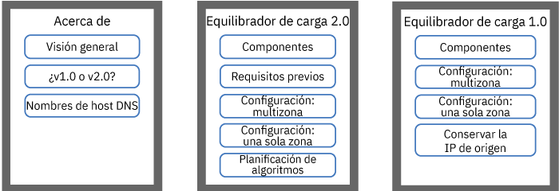
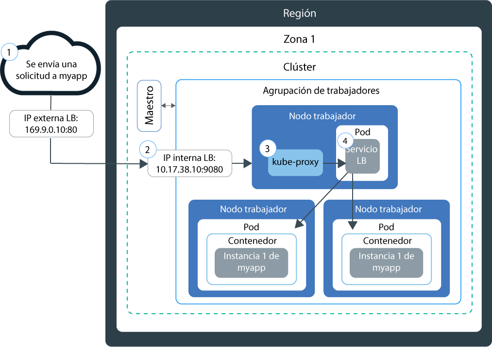
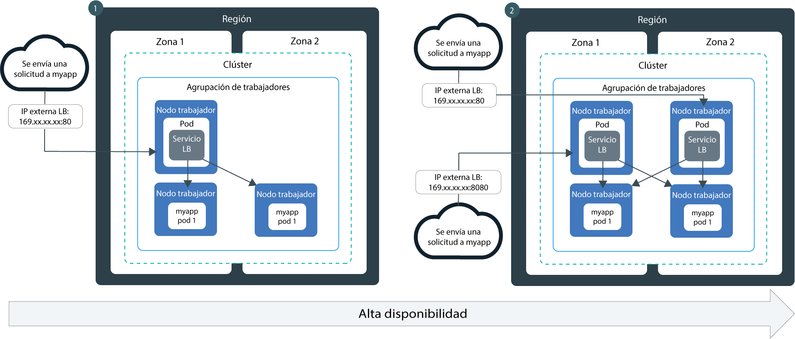
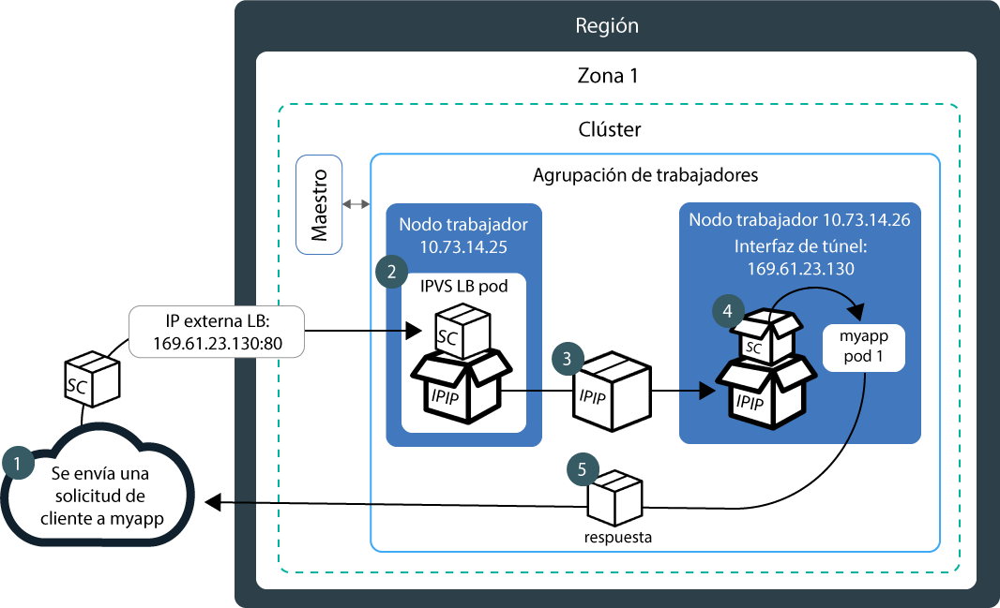
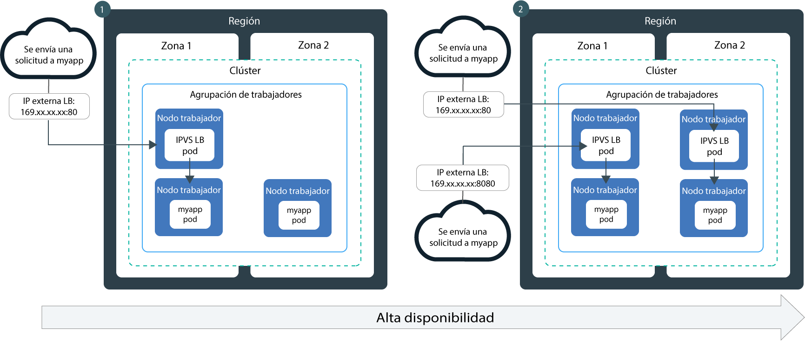

---

copyright:
  years: 2014, 2019
lastupdated: "2019-06-05"

keywords: kubernetes, iks, lb2.0, nlb, health check

subcollection: containers

---

{:new_window: target="_blank"}
{:shortdesc: .shortdesc}
{:screen: .screen}
{:pre: .pre}
{:table: .aria-labeledby="caption"}
{:codeblock: .codeblock}
{:tip: .tip}
{:note: .note}
{:important: .important}
{:deprecated: .deprecated}
{:download: .download}
{:preview: .preview}


# Equilibrio de carga básico y de DSR con equilibradores de carga de red (NLB)
{: #loadbalancer}

Exponga un puerto y utilice una dirección IP portátil para que un equilibrador de carga de red (NLB) capa 4 acceda a la app contenerizada.
{:shortdesc}

Seleccione una de las opciones siguientes para empezar:


<map name="image-map">
    <area target="" alt="Visión general" title="Visión general" href="#lb_overview" coords="35,44,175,72" shape="rect">
    <area target="" alt="Comparación entre equilibradores de carga de la versión 1.0 y de la versión 2.0" title="Comparación entre equilibradores de carga de la versión 1.0 y de la versión 2.0" href="#comparison" coords="34,83,173,108" shape="rect">
    <area target="" alt="Registrar un nombre de host de equilibrador de carga" title="Registrar un nombre de host de equilibrador de carga" href="#loadbalancer_hostname" coords="33,119,174,146" shape="rect">
    <area target="" alt="v2.0: Componentes y arquitectura (Beta)" title="v2.0: Componentes y arquitectura (Beta)" href="#planning_ipvs" coords="273,45,420,72" shape="rect">
    <area target="" alt="v2.0: Requisitos previos" title="v2.0: Requisitos previos" href="#ipvs_provision" coords="277,85,417,108" shape="rect">
    <area target="" alt="v2.0: Configuración de un equilibrador de carga 2.0 en un clúster multizona" title="v2.0: Configuración de un equilibrador de carga 2.0 en un clúster multizona" href="#ipvs_multi_zone_config" coords="276,122,417,147" shape="rect">
    <area target="" alt="v2.0: Configuración de un equilibrador de carga 2.0 en un clúster de una sola zona" title="v2.0: Configuración de un equilibrador de carga 2.0 en un clúster de una sola zona" href="#ipvs_single_zone_config" coords="277,156,419,184" shape="rect">
    <area target="" alt="v2.0: Planificación de algoritmos" title="v2.0: Planificación de algoritmos" href="#scheduling" coords="276,196,419,220" shape="rect">
    <area target="" alt="v1.0: Componentes y arquitectura" title="v1.0: Componentes y arquitectura" href="#v1_planning" coords="519,47,668,74" shape="rect">
    <area target="" alt="v1.0: Configuración de un equilibrador de carga 1.0 en un clúster multizona" title="v1.0: Configuración de un equilibrador de carga 1.0 en un clúster multizona" href="#multi_zone_config" coords="520,85,667,110" shape="rect">
    <area target="" alt="v1.0: Configuración de un equilibrador de carga 1.0 en un clúster de una sola zona" title="v1.0: Configuración de un equilibrador de carga 1.0 en un clúster de una sola zona" href="#lb_config" coords="520,122,667,146" shape="rect">
    <area target="" alt="v1.0: Habilitación de la conservación de la IP de origen" title="v1.0: Habilitación de la conservación de la IP de origen" href="#node_affinity_tolerations" coords="519,157,667,194" shape="rect">
</map>
</br>

Para empezar rápidamente, puede ejecutar el mandato siguiente para crear un equilibrador de carga 1.0:
```
kubectl expose deploy my-app --port=80 --target-port=8080 --type=LoadBalancer --name my-lb-svc
```
{: pre}

## Visión general
{: #lb_overview}

Cuando se crea un clúster estándar, {{site.data.keyword.containerlong}} suministra automáticamente una subred pública portátil y una subred privada portátil.
{: shortdesc}

* La subred pública portable proporciona 5 direcciones IP utilizables. Una dirección IP pública portable la utiliza el [ALB de Ingress público](/docs/containers?topic=containers-ingress) predeterminado. Las 4 direcciones IP públicas portables restantes se pueden utilizar para exponer apps individuales en Internet mediante la creación de servicios de equilibrador de carga de red, o NLB, público.
* La subred privada portable proporciona 5 direcciones IP utilizables. Una dirección IP privada portable la utiliza el [ALB de Ingress privado](/docs/containers?topic=containers-ingress#private_ingress) predeterminado. Las 4 direcciones IP privadas portátiles restantes se pueden utilizar para exponer apps individuales en una red privada mediante la creación de servicios de equilibrador de carga, o NLB, privado.

Las direcciones IP públicas y privadas portátiles son IP flotantes estáticas y no cambian cuando se elimina un nodo trabajador. Si se elimina el nodo trabajador en el que se encuentra la dirección IP del NLB, un daemon Keepalived que supervisa constantemente la IP mueve automáticamente la IP a otro nodo trabajador. Puede asignar cualquier puerto al NLB. El NLB sirve como punto de entrada externo para las solicitudes entrantes para la app. Para acceder al NLB desde Internet, puede utilizar la dirección IP pública del equilibrador de carga y el puerto asignado con el formato `<IP_address>:<port>`. También puede crear entradas de DNS para los NLB registrando las direcciones IP de NLB con nombres de host.

Al exponer una app con un servicio de NLB, la app pasa también a estar disponible automáticamente a través de los NodePorts del servicio. Los [NodePorts](/docs/containers?topic=containers-nodeport) son accesibles en cada dirección IP pública y privada de cada nodo trabajador dentro del clúster. Para bloquear el tráfico a los NodePorts mientras utiliza un NLB, consulte [Control del tráfico de entrada a los servicios de equilibrador de carga de red (NLB) o de NodePort](/docs/containers?topic=containers-network_policies#block_ingress).

<br />


## Comparación entre el equilibrio de carga básico y DSR en los NLB de la versión 1.0 y 2.0
{: #comparison}

Cuando crea un NLB, puede elegir un NLB de la versión 1.0, que realiza un equilibrio de carga básico, o la versión 2.0 NLB, que realiza un equilibrio de carga DSR (retorno directo al servidor). Tenga en cuenta que los NLB de la versión 2.0 están en fase beta.
{: shortdesc}

**¿En qué se parecen los NLB de la versión 1.0 y la versión 2.0?**

Los NLB de las versiones 1.0 y 2.0 son los dos equilibradores de carga de capa 4 que viven únicamente en el espacio del kernel de Linux. Ambas versiones se ejecutan dentro del clúster y utilizan recursos de nodos trabajadores. Por lo tanto, la capacidad disponible de los NLB siempre está dedicada a su clúster. Además, ninguna de las dos versiones de NLB finaliza la conexión. En su lugar, reenvían las conexiones a un pod de app.

**¿En qué se diferencian los NLB de la versión 1.0 y la versión 2.0?**

Cuando un cliente envía una solicitud a la app, el NLB direcciona los paquetes de solicitud a la dirección IP del nodo trabajador donde existe un pod de app. Los NLB de la versión 1.0 utilizan NAT (conversión de direcciones de red) para reescribir la dirección IP de origen del paquete de solicitud a la IP del nodo trabajador donde existe un pod de equilibrador de carga. Cuando el nodo trabajador devuelve el paquete de respuesta de app, utiliza dicha IP del nodo trabajador donde existe el NLB. A continuación, el NLB debe enviar el paquete de respuesta al cliente. Para evitar que se reescriba la dirección IP, puede [habilitar la conservación de IP de origen](#node_affinity_tolerations). No obstante, la conservación de IP de origen requiere que los pods de equilibrador de carga y los pods de app se ejecuten en el mismo trabajador para que la solicitud no tenga que reenviarse a otro trabajador. Debe añadir tolerancias y afinidad de nodos a los pods de app. Para obtener más información sobre el equilibrio de carga básico con los NLB de la versión 1.0, consulte [v1.0: Componentes y arquitectura del equilibrio de carga básico](#v1_planning).

A diferencia de los NLB de la versión 1.0, los NLB de la versión 2.0 no utilizan NAT al reenviar solicitudes a pods de app en otros trabajadores. Cuando un NLB 2.0 direcciona una solicitud de cliente, utiliza IP sobre IP (IPIP) para encapsular el paquete de solicitud original en otro paquete nuevo. Este paquete IPIP de encapsulado tiene una IP de origen del nodo trabajador donde se encuentra el pod de equilibrador de carga, lo que permite que el paquete de solicitud original pueda conservar la IP de cliente como su dirección IP de origen. A continuación, el nodo trabajador utiliza el retorno directo de servidor (DSR) para enviar el paquete de respuesta de la app a la IP de cliente. El paquete de respuesta se salta el NLB y se envía directamente al cliente, disminuyendo la cantidad de tráfico que debe gestionar el NLB. Para obtener más información sobre el equilibrio de carga DSR con los NLB de la versión 2.0, consulte [v2.0: Componentes y arquitectura de equilibrio de carga DSR](#planning_ipvs).

<br />


## v1.0: Componentes y arquitectura del equilibrio de carga básico
{: #v1_planning}

El equilibrador de carga de red (NLB) 1.0 de TCP/UDP utiliza Iptables, una característica del kernel de Linux, para equilibrar la carga de las solicitudes en los pods de una app.
{: shortdesc}

### Flujo del tráfico en un clúster de una sola zona
{: #v1_single}

En el siguiente diagrama se muestra cómo un NLB 1.0 dirige la comunicación procedente de internet a una app en un clúster de una sola zona.
{: shortdesc}



1. Una solicitud enviada a la app utiliza la dirección IP pública del NLB y el puerto asignado en el nodo trabajador.

2. La solicitud se reenvía automáticamente al puerto y a la dirección IP de clúster interna del servicio NLB. Solo se puede acceder a la dirección IP de clúster interna dentro del clúster.

3. `kube-proxy` direcciona la solicitud al servicio NLB de la app.

4. La solicitud se reenvía a la dirección IP privada del pod de la app. La dirección IP de origen del paquete de la solicitud se cambia por la dirección IP pública del nodo trabajador en el que se ejecuta el pod de la app. Si se despliegan varias instancias de app en el clúster, el NLB direcciona las solicitudes entre los pods de app.

### Flujo del tráfico en un clúster multizona
{: #v1_multi}

En el siguiente diagrama se muestra cómo un equilibrador de carga de red (NLB) 1.0 dirige la comunicación procedente de internet a una app en un clúster multizona.
{: shortdesc}



De forma predeterminada, cada NLB 1.0 se configura solo en una zona. Para conseguir una alta disponibilidad, debe desplegar un NLB 1.0 en cada una de las zonas donde tenga instancias de la app. Los NLB de las distintas zonas gestionan las solicitudes en un ciclo en rueda. Además, cada NLB direcciona las solicitudes a las instancias de la app en su propia zona y a las instancias de la app en otras zonas.

<br />


## v1.0: Configuración de un NLB 1.0 en un clúster multizona
{: #multi_zone_config}

**Antes de empezar**:
* Para crear equilibradores de carga de red (NLB) públicos en varias zonas, al menos una VLAN pública debe tener subredes portátiles disponibles en cada zona. Para crear NLB privados en varias zonas, al menos una VLAN privada debe tener subredes portátiles disponibles en cada zona. Puede añadir subredes siguiendo los pasos que se indican en [Configuración de subredes para clústeres](/docs/containers?topic=containers-subnets).
* Si restringe el tráfico de red a los nodos trabajadores de extremo, asegúrese de que haya al menos 2 [nodos trabajadores de extremo](/docs/containers?topic=containers-edge#edge) habilitados en cada zona para que los NLB se desplieguen de forma uniforme.
* Habilite la [distribución de VLAN](/docs/infrastructure/vlans?topic=vlans-vlan-spanning#vlan-spanning) para la cuenta de infraestructura de IBM Cloud (SoftLayer) para que los nodos trabajadores puedan comunicarse entre sí en la red privada. Para llevar a cabo esta acción, necesita el [permiso de la infraestructura](/docs/containers?topic=containers-users#infra_access) **Red > Gestionar distribución de VLAN de red** o bien puede solicitar al propietario de la cuenta que lo habilite. Para comprobar si la distribución de VLAN ya está habilitada, utilice el [mandato](/docs/containers?topic=containers-cli-plugin-kubernetes-service-cli#cs_vlan_spanning_get) `ibmcloud ks vlan-spanning-get --region <region>`.
* Asegúrese de que tiene el [rol de servicio **Escritor** o **Gestor** de {{site.data.keyword.Bluemix_notm}} IAM](/docs/containers?topic=containers-users#platform) sobre el espacio de nombres `default`.


Para configurar un servicio de NLB 1.0 en un clúster multizona:
1.  [Despliegue la app en el clúster](/docs/containers?topic=containers-app#app_cli). Asegúrese de añadir una etiqueta a su despliegue en la sección de metadatos del archivo de configuración. Esta etiqueta es necesaria para identificar todos los pods en los que se está ejecutando la app, de modo que puedan incluirse en el equilibrio de carga.

2.  Cree un servicio equilibrador de carga para la app que desea exponer en internet público o en una red privada.
  1. Cree un archivo de configuración de servicio llamado, por ejemplo, `myloadbalancer.yaml`.
  2. Defina un servicio equilibrador de carga para la app que desee exponer. Puede especificar una zona, una VLAN y una dirección IP.

      ```
      apiVersion: v1
      kind: Service
      metadata:
        name: myloadbalancer
        annotations:
          service.kubernetes.io/ibm-load-balancer-cloud-provider-ip-type: <public_or_private>
          service.kubernetes.io/ibm-load-balancer-cloud-provider-zone: "<zone>"
          service.kubernetes.io/ibm-load-balancer-cloud-provider-vlan: "<vlan_id>"
      spec:
        type: LoadBalancer
        selector:
          <selector_key>: <selector_value>
        ports:
         - protocol: TCP
             port: 8080
          loadBalancerIP: <IP_address>
      ```
      {: codeblock}

      <table>
      <caption>Visión general de los componentes del archivo YAML</caption>
      <thead>
      <th colspan=2> Visión general de los componentes del archivo YAML</th>
      </thead>
      <tbody>
      <tr>
        <td><code>service.kubernetes.io/ibm-load-balancer-cloud-provider-ip-type:</code>
        <td>Anotación para especificar un equilibrador de carga <code>privado</code> o <code>público</code>.</td>
      </tr>
      <tr>
        <td><code>service.kubernetes.io/ibm-load-balancer-cloud-provider-zone:</code>
        <td>Anotación para especificar la zona en la que se despliega el servicio de equilibrador de carga. Para ver las zonas, ejecute <code>ibmcloud ks zones</code>.</td>
      </tr>
      <tr>
        <td>`service.kubernetes.io/ibm-load-balancer-cloud-provider-vlan:`
        <td>Anotación para especificar una VLAN en la que se despliega el servicio de equilibrador de carga. Para ver las VLAN, ejecute <code>ibmcloud ks --zone <zone></code>.</td>
      </tr>
      <tr>
        <td><code>selector</code></td>
        <td>La clave de etiqueta (<em>&lt;selector_key&gt;</em>) y el valor (<em>&lt;selector_value&gt;</em>) que ha utilizado en la sección <code>spec.template.metadata.labels</code> del archivo YAML de despliegue de apps.</td>
      </tr>
      <tr>
        <td><code>port</code></td>
        <td>El puerto que en el que está a la escucha el servicio.</td>
      </tr>
      <tr>
        <td><code>loadBalancerIP</code></td>
        <td>Opcional: Para crear un equilibrador de carga privado o para utilizar una dirección IP portátil específica para un equilibrador de carga público, especifique la dirección IP que desea utilizar. La dirección IP debe estar en la VLAN y en la zona que especifique en las anotaciones. Si no especifica ninguna dirección IP:<ul><li>Si el clúster está en una VLAN pública, se utiliza una dirección IP pública portátil. La mayoría de los clústeres están en una VLAN pública.</li><li>Si el clúster solo está en una VLAN privada, se utiliza una dirección IP privada portátil.</li></ul></td>
      </tr>
      </tbody></table>

      Archivo de configuración de ejemplo para crear un servicio de NLB privado 1.0 que utiliza una dirección IP especificada en la VLAN privada `2234945` en `dal12`:

      ```
      apiVersion: v1
      kind: Service
      metadata:
        name: myloadbalancer
        annotations:
          service.kubernetes.io/ibm-load-balancer-cloud-provider-ip-type: private
          service.kubernetes.io/ibm-load-balancer-cloud-provider-zone: "dal12"
          service.kubernetes.io/ibm-load-balancer-cloud-provider-vlan: "2234945"
      spec:
        type: LoadBalancer
        selector:
          app: nginx
        ports:
         - protocol: TCP
           port: 8080
        loadBalancerIP: 172.21.xxx.xxx
      ```
      {: codeblock}

  3. Opcional: Puede hacer que el servicio de NLB solo esté disponible para un rango limitado de direcciones IP especificando las IP en el campo `spec.loadBalancerSourceRanges`. `loadBalancerSourceRanges` se implementa mediante `kube-proxy`
en el clúster a través de reglas de Iptables en los nodos trabajadores. Para obtener más información, consulte la [documentación de Kubernetes ](https://kubernetes.io/docs/tasks/access-application-cluster/configure-cloud-provider-firewall/).

  4. Cree el servicio en el clúster.

      ```
      kubectl apply -f myloadbalancer.yaml
      ```
      {: pre}

3. Verifique que el servicio de NLB se haya creado correctamente. Pueden transcurrir unos minutos hasta que el servicio se cree correctamente y la app esté disponible.

    ```
    kubectl describe service myloadbalancer
    ```
    {: pre}

    Ejemplo de salida de CLI:

    ```
    Name:                   myloadbalancer
    Namespace:              default
    Labels:                 <none>
    Selector:               app=liberty
    Type:                   LoadBalancer
    Zone:                   dal10
    IP:                     172.21.xxx.xxx
    LoadBalancer Ingress:   169.xx.xxx.xxx
    Port:                   <unset> 8080/TCP
    NodePort:               <unset> 32040/TCP
    Endpoints:              172.30.xxx.xxx:8080
    Session Affinity:       None
    Events:
      FirstSeen	LastSeen	Count	From			SubObjectPath	Type	 Reason			          Message
      ---------	--------	-----	----			-------------	----	 ------			          -------
      10s		    10s		    1	    {service-controller }	  Normal CreatingLoadBalancer	Creating load balancer
      10s		    10s		    1	    {service-controller }		Normal CreatedLoadBalancer	Created load balancer
    ```
    {: screen}

    La dirección IP de **LoadBalancer Ingress** es la dirección IP portátil asignada al servicio de NLB.

4.  Si ha creado un NLB público, acceda a la app desde Internet.
    1.  Abra el navegador web preferido.
    2.  Especifique la dirección IP pública portátil y el puerto del NLB.

        ```
        http://169.xx.xxx.xxx:8080
        ```
        {: codeblock}    

5. Repita los pasos del 2 al 4 para añadir un NLB de la versión 1.0 en cada zona.    

6. Si elige [habilitar la conservación de IP de origen para un NLB 1.0](#node_affinity_tolerations), asegúrese de que los pods de app estén planificados en los nodos trabajadores de extremo mediante la [adición de afinidad de nodo de extremo a los pods de app](#lb_edge_nodes). Los pods de app se deben planificar en los nodos de extremo para recibir solicitudes entrantes.

7. Opcional: un servicio de equilibrador de carga también hace que la app esté disponible a través de los NodePorts del servicio. Se puede acceder a los [NodePorts](/docs/containers?topic=containers-nodeport) en cada dirección IP pública o privada de cada nodo del clúster. Para bloquear el tráfico a los NodePorts mientras utiliza un servicio de NLB, consulte [Control del tráfico de entrada a los servicios de equilibrador de carga de red (NLB) o de NodePort](/docs/containers?topic=containers-network_policies#block_ingress).

A continuación, puede [registrar un nombre de host de NLB](#loadbalancer_hostname).

<br />


## v1.0: Configuración de un NLB 1.0 en un clúster de una sola zona
{: #lb_config}

**Antes de empezar**:
* Debe tener una dirección IP pública o privada portátil disponible para asignarla al servicio equilibrador de carga de red (NLB). Para obtener más información, consulte [Configuración de subredes para clústeres](/docs/containers?topic=containers-subnets).
* Asegúrese de que tiene el [rol de servicio **Escritor** o **Gestor** de {{site.data.keyword.Bluemix_notm}} IAM](/docs/containers?topic=containers-users#platform) sobre el espacio de nombres `default`.

Para crear un servicio de NLB 1.0 en un clúster de una sola zona:

1.  [Despliegue la app en el clúster](/docs/containers?topic=containers-app#app_cli). Asegúrese de añadir una etiqueta a su despliegue en la sección de metadatos del archivo de configuración. Esta etiqueta es necesaria para identificar todos los pods en los que se está ejecutando la app, de modo que puedan incluirse en el equilibrio de carga.
2.  Cree un servicio equilibrador de carga para la app que desea exponer en internet público o en una red privada.
    1.  Cree un archivo de configuración de servicio llamado, por ejemplo, `myloadbalancer.yaml`.

    2.  Defina un servicio equilibrador de carga para la app que desee exponer.
        ```
        apiVersion: v1
        kind: Service
        metadata:
          name: myloadbalancer
          annotations:
            service.kubernetes.io/ibm-load-balancer-cloud-provider-ip-type: <public_or_private>
            service.kubernetes.io/ibm-load-balancer-cloud-provider-vlan: "<vlan_id>"
        spec:
          type: LoadBalancer
          selector:
            <selector_key>: <selector_value>
          ports:
           - protocol: TCP
           port: 8080
        loadBalancerIP: <IP_address>
        externalTrafficPolicy: Local
        ```
        {: codeblock}

        <table>
        <caption>Visión general de los componentes del archivo YAML</caption>
        <thead>
        <th colspan=2> Visión general de los componentes del archivo YAML</th>
        </thead>
        <tbody>
        <tr>
          <td>`service.kubernetes.io/ibm-load-balancer-cloud-provider-ip-type:`
          <td>Anotación para especificar un equilibrador de carga <code>privado</code> o <code>público</code>.</td>
        </tr>
        <tr>
          <td>`service.kubernetes.io/ibm-load-balancer-cloud-provider-vlan:`
          <td>Anotación para especificar una VLAN en la que se despliega el servicio de equilibrador de carga. Para ver las VLAN, ejecute <code>ibmcloud ks --zone <zone></code>.</td>
        </tr>
        <tr>
          <td><code>selector</code></td>
          <td>La clave de etiqueta (<em>&lt;selector_key&gt;</em>) y el valor (<em>&lt;selector_value&gt;</em>) que ha utilizado en la sección <code>spec.template.metadata.labels</code> del archivo YAML de despliegue de apps.</td>
        </tr>
        <tr>
          <td><code>port</code></td>
          <td>El puerto que en el que está a la escucha el servicio.</td>
        </tr>
        <tr>
          <td><code>loadBalancerIP</code></td>
          <td>Opcional: Para crear un equilibrador de carga privado o para utilizar una dirección IP portátil específica para un equilibrador de carga público, especifique la dirección IP que desea utilizar. La dirección IP debe estar en la VLAN que especifique en las anotaciones. Si no especifica ninguna dirección IP:<ul><li>Si el clúster está en una VLAN pública, se utiliza una dirección IP pública portátil. La mayoría de los clústeres están en una VLAN pública.</li><li>Si el clúster solo está en una VLAN privada, se utiliza una dirección IP privada portátil.</li></ul></td>
        </tr>
        </tbody></table>

        Archivo de configuración de ejemplo para crear un servicio de NLB 1.0 privado que utiliza una dirección IP especificada en la VLAN privada `2234945`:

        ```
        apiVersion: v1
        kind: Service
        metadata:
          name: myloadbalancer
          annotations:
            service.kubernetes.io/ibm-load-balancer-cloud-provider-ip-type: private
            service.kubernetes.io/ibm-load-balancer-cloud-provider-vlan: "2234945"
        spec:
          type: LoadBalancer
          selector:
            app: nginx
          ports:
           - protocol: TCP
             port: 8080
          loadBalancerIP: 172.21.xxx.xxx
        ```
        {: codeblock}

    3. Opcional: Puede hacer que el servicio de NLB solo esté disponible para un rango limitado de direcciones IP especificando las IP en el campo `spec.loadBalancerSourceRanges`. `loadBalancerSourceRanges` se implementa mediante `kube-proxy`
en el clúster a través de reglas de Iptables en los nodos trabajadores. Para obtener más información, consulte la [documentación de Kubernetes ](https://kubernetes.io/docs/tasks/access-application-cluster/configure-cloud-provider-firewall/).

    4.  Cree el servicio en el clúster.

        ```
        kubectl apply -f myloadbalancer.yaml
        ```
        {: pre}

3.  Verifique que el servicio de NLB se haya creado correctamente. Pueden transcurrir unos minutos hasta que el servicio se cree correctamente y la app esté disponible.

    ```
    kubectl describe service myloadbalancer
    ```
    {: pre}

    Ejemplo de salida de CLI:

    ```
    Name:                   myloadbalancer
    Namespace:              default
    Labels:                 <none>
    Selector:               app=liberty
    Type:                   LoadBalancer
    Location:               dal10
    IP:                     172.21.xxx.xxx
    LoadBalancer Ingress:   169.xx.xxx.xxx
    Port:                   <unset> 8080/TCP
    NodePort:               <unset> 32040/TCP
    Endpoints:              172.30.xxx.xxx:8080
    Session Affinity:       None
    Events:
      FirstSeen	LastSeen	Count	From			SubObjectPath	Type	 Reason			          Message
      ---------	--------	-----	----			-------------	----	 ------			          -------
      10s		    10s		    1	    {service-controller }	  Normal CreatingLoadBalancer	Creating load balancer
      10s		    10s		    1	    {service-controller }		Normal CreatedLoadBalancer	Created load balancer
    ```
    {: screen}

    La dirección IP de **LoadBalancer Ingress** es la dirección IP portátil asignada al servicio de NLB.

4.  Si ha creado un NLB público, acceda a la app desde Internet.
    1.  Abra el navegador web preferido.
    2.  Especifique la dirección IP pública portátil y el puerto del NLB.

        ```
        http://169.xx.xxx.xxx:8080
        ```
        {: codeblock}

5. Si elige [habilitar la conservación de IP de origen para un NLB 1.0](#node_affinity_tolerations), asegúrese de que los pods de app estén planificados en los nodos trabajadores de extremo mediante la [adición de afinidad de nodo de extremo a los pods de app](#lb_edge_nodes). Los pods de app se deben planificar en los nodos de extremo para recibir solicitudes entrantes.

6. Opcional: un servicio de equilibrador de carga también hace que la app esté disponible a través de los NodePorts del servicio. Se puede acceder a los [NodePorts](/docs/containers?topic=containers-nodeport) en cada dirección IP pública o privada de cada nodo del clúster. Para bloquear el tráfico a los NodePorts mientras utiliza un servicio de NLB, consulte [Control del tráfico de entrada a los servicios de equilibrador de carga de red (NLB) o de NodePort](/docs/containers?topic=containers-network_policies#block_ingress).

A continuación, puede [registrar un nombre de host de NLB](#loadbalancer_hostname).

<br />


## v1.0: Habilitación de la conservación de IP de origen
{: #node_affinity_tolerations}

Esta característica es únicamente para los equilibradores de carga de red (NLB) de la versión 1.0. La dirección IP de origen de las solicitudes de cliente se conserva de forma predeterminada en los NLB versión 2.0.
{: note}

Cuando se envía al clúster una solicitud de cliente para la app, un pod del servicio de equilibrador de carga recibe la solicitud. Si no existen pods de app en el mismo nodo trabajador que el pod del servicio equilibrador de carga, el NLB reenvía las solicitudes a un pod de app en un nodo trabajador diferente. La dirección IP de origen del paquete se cambia a la dirección IP pública del nodo trabajador donde el servicio equilibrador de carga está en ejecución.
{: shortdesc}

Para conservar la dirección IP de origen original de la solicitud del cliente, puede [habilitar la dirección IP de origen ](https://kubernetes.io/docs/tasks/access-application-cluster/create-external-load-balancer/#preserving-the-client-source-ip) para servicios de equilibrio de carga. La conexión TCP continúa hasta los pods de la app para que la app pueda ver la dirección IP de origen real del iniciador. Conservar la dirección IP del cliente es útil, por ejemplo, cuando los servidores de apps tienen que aplicar políticas de control de acceso y seguridad.

Después de habilitar la dirección IP de origen, los pods de servicio de equilibrador de carga deben reenviar las solicitudes a los pods de app que se desplieguen únicamente en el mismo nodo trabajador. Generalmente, los pods del servicio equilibrador de carga también se despliegan en los nodos trabajadores donde se despliegan los pods de app. Sin embargo, existen algunas situaciones donde los pods de equilibrador de carga y los pods de app podrían no planificarse en los mismos nodos trabajadores:

* Tiene nodos extremos antagónicos de forma que únicamente los pods de servicio equilibrador de carga se puedan desplegar en ellos. No se permite desplegar pods de app en dichos nodos.
* El clúster está conectado a varias VLAN públicas o privadas, y sus pods de app podrían desplegarse en nodos trabajadores que están conectados únicamente a una VLAN. Pods de servicio de equilibrador de carga podrían no desplegarse en dichos nodos trabajadores porque la dirección de IP del NLB estuviese conectado a VLAN distintas de las de los nodos trabajadores.

Para forzar el despliegue de una app en los nodos trabajadores específicos en los que también se puedan desplegar los pods de servicio de equilibrador de carga, debe añadir tolerancias y reglas de afinidad al despliegue de dichas app.

### Adición de tolerancias y reglas de afinidad de nodo extremo
{: #lb_edge_nodes}

Cuando [etiqueta nodos trabajadores como nodos extremos](/docs/containers?topic=containers-edge#edge_nodes) y también [define como antagónicos los nodos extremos](/docs/containers?topic=containers-edge#edge_workloads), los pods de servicio equilibrador de carga solo de desplegarán en aquellos nodos extremos, y los pods de app no se podrán desplegar en los nodos extremos. Cuando la dirección IP de origen está habilitada para el servicio de NLB, los pods del equilibrador de carga en los nodos extremos no podrán reenviar solicitudes entrantes a sus pods de app en otros nodos trabajadores.
{:shortdesc}

Para forzar el despliegue de pods de app en nodos extremos, añada una [regla de afinidad ](https://kubernetes.io/docs/concepts/configuration/assign-pod-node/#node-affinity-beta-feature) de nodo extremo y una [tolerancia ](https://kubernetes.io/docs/concepts/configuration/taint-and-toleration/#concepts) a su despliegue de app.

Ejemplo de YAML de despliegue con afinidad y tolerancia de nodo extremo:

```
apiVersion: apps/v1
kind: Deployment
metadata:
  name: with-node-affinity
spec:
  selector:
    matchLabels:
      <label_name>: <label_value>
  template:
    spec:
      affinity:
        nodeAffinity:
          requiredDuringSchedulingIgnoredDuringExecution:
            nodeSelectorTerms:
            - matchExpressions:
              - key: dedicated
                operator: In
                values:
                - edge
      tolerations:
        - key: dedicated
          value: edge
...
```
{: codeblock}

Tanto la sección **affinity** como la sección **tolerations** tienen `dedicated` como `key` y `edge` como `value`.

### Adición de reglas de afinidad para múltiples VLAN privadas o públicas
{: #edge_nodes_multiple_vlans}

Cuando el clúster está conectado a varias VLAN públicas o privadas, sus pods de app podrían desplegarse en nodos trabajadores que están conectados únicamente a una VLAN. Si la dirección de IP del NLB está conectada a una VLAN diferente de la de estos nodos trabajadores, los pods de servicio de equilibrador de carga no se desplegarán en dichos nodos trabajadores.
{:shortdesc}

Cuando la dirección IP de origen esté habilitada, planifique pods de app en nodos trabajadores que estén en la misma VLAN que la dirección IP del NLB añadiendo una regla de afinidad al despliegue de la app.

Antes de empezar: [Inicie la sesión en su cuenta. Si procede, apunte al grupo de recursos adecuado. Establezca el contexto para el clúster.](/docs/containers?topic=containers-cs_cli_install#cs_cli_configure)

1. Obtenga la dirección IP del servicio de NLB. Busque la dirección IP en el campo **LoadBalancer Ingress**.
    ```
    kubectl describe service <loadbalancer_service_name>
    ```
    {: pre}

2. Recupere el ID de VLAN al que se conecta el servicio de NLB.

    1. Obtenga una lista de VLAN públicas portátiles para su clúster.
        ```
        ibmcloud ks cluster-get --cluster <cluster_name_or_ID> --showResources
        ```
        {: pre}

        Salida de ejemplo:
        ```
        ...

        Subnet VLANs
        VLAN ID   Subnet CIDR       Public   User-managed
        2234947   10.xxx.xx.xxx/29  false    false
        2234945   169.36.5.xxx/29   true     false
        ```
        {: screen}

    2. En la salida bajo **Subnet VLANs**, busque el CIDR de subred que coincida con la dirección IP del NLB que recuperó con anterioridad y anote el ID de VLAN.

        Por ejemplo, si la dirección IP del servicio de NLB es `169.36.5.xxx`, la subred coincidente en la salida del ejemplo del paso anterior es `169.36.5.xxx/29`. El ID de VLAN al que se conecta la subred es `2234945`.

3. [Añada una regla de afinidad ](https://kubernetes.io/docs/concepts/configuration/assign-pod-node/#node-affinity-beta-feature) para el despliegue de app para el ID de VLAN que anotó en el paso anterior.

    Por ejemplo, si tiene varias VLAN pero desea que sus pods de app se desplieguen en nodos trabajadores únicamente en la VLAN pública `2234945`:

    ```
    apiVersion: apps/v1
    kind: Deployment
    metadata:
      name: with-node-affinity
    spec:
      selector:
        matchLabels:
          <label_name>: <label_value>
      template:
        spec:
          affinity:
            nodeAffinity:
              requiredDuringSchedulingIgnoredDuringExecution:
                nodeSelectorTerms:
                - matchExpressions:
                  - key: publicVLAN
                    operator: In
                    values:
                    - "2234945"
    ...
    ```
    {: codeblock}

    En el YAML de ejemplo, la sección **affinity** tiene `publicVLAN` como `key` y `"2234945"` como `value`.

4. Aplique el archivo de configuración de despliegue actualizado.
    ```
    kubectl apply -f with-node-affinity.yaml
    ```
    {: pre}

5. Verifique que los pods de app desplegados en los nodos trabajadores se conectan a la VLAN designada.

    1. Obtenga una lista de pods en el clúster. Sustituya `<selector>` por la etiqueta que utilizó para la app.
        ```
        kubectl get pods -o wide app=<selector>
        ```
        {: pre}

        Salida de ejemplo:
        ```
        NAME                   READY     STATUS              RESTARTS   AGE       IP               NODE
        cf-py-d7b7d94db-vp8pq  1/1       Running             0          15d       172.30.xxx.xxx   10.176.48.78
        ```
        {: screen}

    2. En la salida, identifique un pod para su app. Observe el ID **NODE** del nodo trabajador en el que se encuentra el pod.

        En la salida de ejemplo del paso anterior, el pod de app `cf-py-d7b7d94db-vp8pq` se encuentra en el nodo trabajador `10.176.48.78`.

    3. Obtener los detalles del nodo trabajador.

        ```
        kubectl describe node <worker_node_ID>
        ```
        {: pre}

        Salida de ejemplo:

        ```
        Name:                   10.xxx.xx.xxx
        Role:
        Labels:                 arch=amd64
                                beta.kubernetes.io/arch=amd64
                                beta.kubernetes.io/os=linux
                                failure-domain.beta.kubernetes.io/region=us-south
                                failure-domain.beta.kubernetes.io/zone=dal10
                                ibm-cloud.kubernetes.io/encrypted-docker-data=true
                                kubernetes.io/hostname=10.xxx.xx.xxx
                                privateVLAN=2234945
                                publicVLAN=2234967
        ...
        ```
        {: screen}

    4. En la sección **Labels** de la salida, verifique que la VLAN privada o pública es la VLAN es que haya designado en los pasos anteriores.

<br />


## v2.0: Componentes y arquitectura (beta)
{: #planning_ipvs}

Las prestaciones del equilibrador de carga de red (NLB) 2.0 están en fase beta. Para utilizar un NLB 2.0, debe
[actualizar los nodos maestro y trabajadores del clúster](/docs/containers?topic=containers-update) a Kubernetes versión 1.12 o posterior.
{: note}

El NLB 2.0 es un equilibrador de carga de capa 4 que utiliza el servidor virtual IP (IPVS) del kernel de Linux. El NLB 2.0 admite TCP y UDP, se ejecuta delante de varios nodos trabajadores y utiliza el tunelado de IP sobre IP (IPIP) para distribuir el tráfico que llega a una dirección IP individual del equilibrador de carga en dichos nodos trabajadores.

¿Desea obtener más información sobre los patrones de despliegue de equilibrio de carga que están disponibles en {{site.data.keyword.containerlong_notm}}? Consulte esta [publicación del blog ](https://www.ibm.com/blogs/bluemix/2018/10/ibm-cloud-kubernetes-service-deployment-patterns-for-maximizing-throughput-and-availability/).
{: tip}

### Flujo del tráfico en un clúster de una sola zona
{: #ipvs_single}

En el siguiente diagrama se muestra cómo un NLB 2.0 dirige la comunicación procedente de internet a una app en un clúster de una sola zona.
{: shortdesc}



1. Una solicitud de cliente enviada a la app utiliza la dirección IP pública del NLB y el puerto asignado en el nodo trabajador. En este ejemplo, el NLB tiene una dirección IP virtual de 169.61.23.130, que se encuentra actualmente en el trabajador 10.73.14.25.

2. El NLB encapsula el paquete de solicitud de cliente (etiquetado como "SC" en la imagen) dentro de un paquete IPIP (etiquetado como "IPIP"). El paquete de solicitud de cliente mantiene la IP de cliente como su dirección IP de origen. El paquete de encapsulado IPIP utiliza la IP 10.73.14.25 del trabajador como su dirección IP de origen.

3. El NLB direcciona el paquete IPIP a un trabajador en el que se encuentre un pod de app, 10.73.14.26. Si se despliegan varias instancias de app en el clúster, el NLB direcciona las solicitudes entre los trabajadores donde se hayan desplegado pods de app.

4. El trabajador 10.73.14.26 desempaqueta el paquete de encapsulado IPIP y, a continuación, desempaqueta el paquete de solicitud de cliente. El paquete de solicitud de cliente se reenvía al pod de app en ese nodo trabajador.

5. A continuación, el trabajador 10.73.14.26 utiliza la dirección IP de origen del paquete de solicitud original, la IP de cliente, para devolver el paquete de respuesta del pod de app directamente al cliente.

### Flujo del tráfico en un clúster multizona
{: #ipvs_multi}

El flujo de tráfico a través de un clúster multizona sigue el mismo camino que el
[tráfico a través de un clúster de una sola zona](#ipvs_single). En un clúster multizona, el NLB direcciona las solicitudes a las instancias de la app en su propia zona y a las instancias de la app en otras zonas. El diagrama siguiente muestra cómo los NLB versión 2.0 de cada zona dirigen el tráfico de Internet a una app en un clúster multizona.
{: shortdesc}



De forma predeterminada, cada NLB versión 2.0 se configura solo en una zona. Puede conseguir una mayor disponibilidad desplegando un NLB versión 2.0 en cada una de las zonas donde tenga instancias de la app.

<br />


## v2.0: Requisitos previos
{: #ipvs_provision}

No puede actualizar un NLB existente de la versión 1.0 a la 2.0. Debe crear un NLB 2.0 nuevo. Tenga en cuenta que puede ejecutar NLB versión 1.0 y versión 2.0 simultáneamente en un clúster.
{: shortdesc}

Antes de crear un NLB 2.0, debe completar los pasos de requisito previo siguientes.

1. [Actualice los nodos maestro y trabajadores del clúster](/docs/containers?topic=containers-update) a Kubernetes versión 1.12 o posterior.

2. Para permitir que el NLB 2.0 pueda reenviar solicitudes a pods de app en varias zonas, abra un caso de soporte para solicitar más capacidad para sus VLAN. Este valor de configuración no causa interrupciones ni paradas en la red.
    1. Inicie una sesión en la [consola de {{site.data.keyword.Bluemix_notm}}](https://cloud.ibm.com/).
    2. En la barra de menús, pulse **Soporte**, pulse el separador **Gestionar casos** y pulse **Crear un caso nuevo**.
    3. En los campos del caso, especifique lo siguiente:
       * Para el tipo de soporte, seleccione **Técnico**.
       * Para la categoría, seleccione **Distribución de VLAN**.
       * Para el asunto, especifique **Pregunta de red de VLAN pública.**
    4. Añada la información siguiente a la descripción: "Configurar la red para permitir la agregación de capacidad en las VLAN públicas asociadas con mi cuenta". La incidencia de referencia de esta solicitud es: https://control.softlayer.com/support/tickets/63859145". Tenga en cuenta que, si desea permitir el aumento de capacidad en determinadas VLAN, como por ejemplo las VLAN públicas solo de un clúster, puede especificar los ID de estas VLAN en la descripción.
    5. Pulse **Enviar**.

3. Habilite una [función de direccionador virtual (VRF)](/docs/infrastructure/direct-link?topic=direct-link-overview-of-virtual-routing-and-forwarding-vrf-on-ibm-cloud#overview-of-virtual-routing-and-forwarding-vrf-on-ibm-cloud) para la cuenta de infraestructura de IBM Cloud (SoftLayer). Para habilitar VRF, [póngase en contacto con el representante de su cuenta de la infraestructura de IBM Cloud (SoftLayer)](/docs/infrastructure/direct-link?topic=direct-link-overview-of-virtual-routing-and-forwarding-vrf-on-ibm-cloud#how-you-can-initiate-the-conversion). Si no puede o no desea habilitar VRF, habilite la [distribución de VLAN](/docs/infrastructure/vlans?topic=vlans-vlan-spanning#vlan-spanning). Cuando hay una VRF o una distribución de VLAN habilitada, el NLB 2.0 puede direccionar paquetes a varias subredes de la cuenta.

4. Si utiliza [políticas de red pre-DNAT de Calico](/docs/containers?topic=containers-network_policies#block_ingress) para gestionar el tráfico con la dirección IP de un NLB 2.0, debe añadir los campos `applyOnForward: true` y `doNotTrack: true` y eliminar `preDNAT: true` de la sección `spec` en las políticas. `applyOnForward: true` garantiza que la política de Calico se aplica al tráfico cuando se encapsula y se reenvía. `doNotTrack: true` garantiza que los nodos trabajadores pueden utilizar DSR para devolver un paquete de respuesta directamente al cliente sin necesidad de que se realice el seguimiento de la conexión. Por ejemplo, si utiliza una política de Calico para incluir en una lista blanca el tráfico de únicamente algunas direcciones IP específicas con la dirección IP del NLB, la política tendrá un aspecto similar al siguiente:
    ```
    apiVersion: projectcalico.org/v3
    kind: GlobalNetworkPolicy
    metadata:
      name: whitelist
    spec:
      applyOnForward: true
      doNotTrack: true
      ingress:
      - action: Allow
        destination:
          nets:
          - <loadbalancer_IP>/32
          ports:
          - 80
        protocol: TCP
        source:
          nets:
          - <client_address>/32
      selector: ibm.role=='worker_public'
      order: 500
      types:
      - Ingress
    ```
    {: screen}

A continuación, puede seguir los pasos de [Configuración de un NLB 2.0 en un clúster multizona](#ipvs_multi_zone_config) o [en un clúster de una sola zona](#ipvs_single_zone_config).

<br />


## v2.0: Configuración de un NLB 2.0 en un clúster multizona
{: #ipvs_multi_zone_config}

**Antes de empezar**:

* **Importante**: complete los [requisitos previos de NLB 2.0](#ipvs_provision).
* Para crear NLB públicos en varias zonas, al menos una VLAN pública debe tener subredes portátiles disponibles en cada zona. Para crear NLB privados en varias zonas, al menos una VLAN privada debe tener subredes portátiles disponibles en cada zona. Puede añadir subredes siguiendo los pasos que se indican en [Configuración de subredes para clústeres](/docs/containers?topic=containers-subnets).
* Si restringe el tráfico de red a los nodos trabajadores de extremo, asegúrese de que haya al menos 2 [nodos trabajadores de extremo](/docs/containers?topic=containers-edge#edge) habilitados en cada zona para que los NLB se desplieguen de forma uniforme.
* Asegúrese de que tiene el [rol de servicio **Escritor** o **Gestor** de {{site.data.keyword.Bluemix_notm}} IAM](/docs/containers?topic=containers-users#platform) sobre el espacio de nombres `default`.


Para configurar un NLB 2.0 en un clúster multizona:
1.  [Despliegue la app en el clúster](/docs/containers?topic=containers-app#app_cli). Asegúrese de añadir una etiqueta a su despliegue en la sección de metadatos del archivo de configuración. Esta etiqueta es necesaria para identificar todos los pods en los que se está ejecutando la app, de modo que puedan incluirse en el equilibrio de carga.

2.  Cree un servicio equilibrador de carga para la app que desea exponer en internet público o en una red privada.
  1. Cree un archivo de configuración de servicio llamado, por ejemplo, `myloadbalancer.yaml`.
  2. Defina un servicio equilibrador de carga para la app que desee exponer. Puede especificar una zona, una VLAN y una dirección IP.

      ```
      apiVersion: v1
      kind: Service
      metadata:
        name: myloadbalancer
        annotations:
          service.kubernetes.io/ibm-load-balancer-cloud-provider-ip-type: <public_or_private>
          service.kubernetes.io/ibm-load-balancer-cloud-provider-zone: "<zone>"
          service.kubernetes.io/ibm-load-balancer-cloud-provider-vlan: "<vlan_id>"
          service.kubernetes.io/ibm-load-balancer-cloud-provider-enable-features: "ipvs"
          service.kubernetes.io/ibm-load-balancer-cloud-provider-scheduler: "<algorithm>"
      spec:
        type: LoadBalancer
        selector:
          <selector_key>: <selector_value>
        ports:
         - protocol: TCP
           port: 8080
        loadBalancerIP: <IP_address>
        externalTrafficPolicy: Local
      ```
      {: codeblock}

      <table>
      <caption>Visión general de los componentes del archivo YAML</caption>
      <thead>
      <th colspan=2> Visión general de los componentes del archivo YAML</th>
      </thead>
      <tbody>
      <tr>
        <td><code>service.kubernetes.io/ibm-load-balancer-cloud-provider-ip-type:</code>
        <td>Anotación para especificar un equilibrador de carga <code>privado</code> o <code>público</code>.</td>
      </tr>
      <tr>
        <td><code>service.kubernetes.io/ibm-load-balancer-cloud-provider-zone:</code>
        <td>Anotación para especificar la zona en la que se despliega el servicio de equilibrador de carga. Para ver las zonas, ejecute <code>ibmcloud ks zones</code>.</td>
      </tr>
      <tr>
        <td>`service.kubernetes.io/ibm-load-balancer-cloud-provider-vlan:`
        <td>Anotación para especificar una VLAN en la que se despliega el servicio de equilibrador de carga. Para ver las VLAN, ejecute <code>ibmcloud ks --zone <zone></code>.</td>
      </tr>
      <tr>
        <td><code>service.kubernetes.io/ibm-load-balancer-cloud-provider-enable-features: "ipvs"</code>
        <td>Anotación para especificar un equilibrador de carga de la versión 2.0.</td>
      </tr>
      <tr>
        <td><code>service.kubernetes.io/ibm-load-balancer-cloud-provider-scheduler:</code>
        <td>Opcional: Anotación para especificar el algoritmo de planificación. Los valores aceptados son <code>"rr"</code> para Round Robin (valor predeterminado) o <code>"sh"</code> para Source Hashing. Para obtener más información, consulte [2.0: Planificación de algoritmos](#scheduling).</td>
      </tr>
      <tr>
        <td><code>selector</code></td>
        <td>La clave de etiqueta (<em>&lt;selector_key&gt;</em>) y el valor (<em>&lt;selector_value&gt;</em>) que ha utilizado en la sección <code>spec.template.metadata.labels</code> del archivo YAML de despliegue de apps.</td>
      </tr>
      <tr>
        <td><code>port</code></td>
        <td>El puerto que en el que está a la escucha el servicio.</td>
      </tr>
      <tr>
        <td><code>loadBalancerIP</code></td>
        <td>Opcional: Para crear un NLB privado o para utilizar una dirección IP portátil específica para un NLB público, especifique la dirección IP que desea utilizar. La dirección IP debe estar en la zona y en la VLAN que especifique en las anotaciones. Si no especifica ninguna dirección IP:<ul><li>Si el clúster está en una VLAN pública, se utiliza una dirección IP pública portátil. La mayoría de los clústeres están en una VLAN pública.</li><li>Si el clúster solo está en una VLAN privada, se utiliza una dirección IP privada portátil.</li></ul></td>
      </tr>
      <tr>
        <td><code>externalTrafficPolicy: Local</code></td>
        <td>Se establece en <code>Local</code>.</td>
      </tr>
      </tbody></table>

      Archivo de configuración de ejemplo para crear un servicio de NLB 2.0 en
`dal12` que utiliza el algoritmo de planificación Round Robin:

      ```
      apiVersion: v1
      kind: Service
      metadata:
        name: myloadbalancer
        annotations:
          service.kubernetes.io/ibm-load-balancer-cloud-provider-zone: "dal12"
          service.kubernetes.io/ibm-load-balancer-cloud-provider-enable-features: "ipvs"
          service.kubernetes.io/ibm-load-balancer-cloud-provider-scheduler: "rr"
      spec:
        type: LoadBalancer
        selector:
          app: nginx
        ports:
         - protocol: TCP
           port: 8080
        externalTrafficPolicy: Local
      ```
      {: codeblock}

  3. Opcional: Puede hacer que el servicio de NLB solo esté disponible para un rango limitado de direcciones IP especificando las IP en el campo `spec.loadBalancerSourceRanges`.  `loadBalancerSourceRanges` se implementa mediante `kube-proxy`
en el clúster a través de reglas de Iptables en los nodos trabajadores. Para obtener más información, consulte la [documentación de Kubernetes ](https://kubernetes.io/docs/tasks/access-application-cluster/configure-cloud-provider-firewall/).

  4. Cree el servicio en el clúster.

      ```
      kubectl apply -f myloadbalancer.yaml
      ```
      {: pre}

3. Verifique que el servicio de NLB se haya creado correctamente. Pueden transcurrir unos minutos hasta que el servicio de NLB se cree correctamente y la app esté disponible.

    ```
    kubectl describe service myloadbalancer
    ```
    {: pre}

    Ejemplo de salida de CLI:

    ```
    Name:                   myloadbalancer
    Namespace:              default
    Labels:                 <none>
    Selector:               app=liberty
    Type:                   LoadBalancer
    Zone:                   dal10
    IP:                     172.21.xxx.xxx
    LoadBalancer Ingress:   169.xx.xxx.xxx
    Port:                   <unset> 8080/TCP
    NodePort:               <unset> 32040/TCP
    Endpoints:              172.30.xxx.xxx:8080
    Session Affinity:       None
    Events:
      FirstSeen	LastSeen	Count	From			SubObjectPath	Type	 Reason			          Message
      ---------	--------	-----	----			-------------	----	 ------			          -------
      10s		    10s		    1	    {service-controller }	  Normal CreatingLoadBalancer	Creating load balancer
      10s		    10s		    1	    {service-controller }		Normal CreatedLoadBalancer	Created load balancer
    ```
    {: screen}

    La dirección IP de **LoadBalancer Ingress** es la dirección IP portátil asignada al servicio de NLB.

4.  Si ha creado un NLB público, acceda a la app desde Internet.
    1.  Abra el navegador web preferido.
    2.  Especifique la dirección IP pública portátil y el puerto del NLB.

        ```
        http://169.xx.xxx.xxx:8080
        ```
        {: codeblock}

5. Para lograr una alta disponibilidad, repita los pasos del 2 al 4 para añadir un NLB 2.0 en cada una de las zonas donde tenga instancias de la app.

6. Opcional: un servicio de NLB también hace que la app esté disponible a través de los NodePorts del servicio. Se puede acceder a los [NodePorts](/docs/containers?topic=containers-nodeport) en cada dirección IP pública o privada de cada nodo del clúster. Para bloquear el tráfico a los NodePorts mientras utiliza un servicio de NLB, consulte [Control del tráfico de entrada a los servicios de equilibrador de carga de red (NLB) o de NodePort](/docs/containers?topic=containers-network_policies#block_ingress).

A continuación, puede [registrar un nombre de host de NLB](#loadbalancer_hostname).

<br />


## v2.0: Configuración de un NLB 2.0 en un clúster de una sola zona
{: #ipvs_single_zone_config}

**Antes de empezar**:

* **Importante**: complete los [requisitos previos de NLB 2.0](#ipvs_provision).
* Debe tener una dirección IP pública o privada portátil disponible para asignarla al servicio de NLB. Para obtener más información, consulte [Configuración de subredes para clústeres](/docs/containers?topic=containers-subnets).
* Asegúrese de que tiene el [rol de servicio **Escritor** o **Gestor** de {{site.data.keyword.Bluemix_notm}} IAM](/docs/containers?topic=containers-users#platform) sobre el espacio de nombres `default`.

Para crear un servicio de NLB 2.0 en un clúster de una sola zona:

1.  [Despliegue la app en el clúster](/docs/containers?topic=containers-app#app_cli). Asegúrese de añadir una etiqueta a su despliegue en la sección de metadatos del archivo de configuración. Esta etiqueta es necesaria para identificar todos los pods en los que se está ejecutando la app, de modo que puedan incluirse en el equilibrio de carga.
2.  Cree un servicio equilibrador de carga para la app que desea exponer en internet público o en una red privada.
    1.  Cree un archivo de configuración de servicio llamado, por ejemplo, `myloadbalancer.yaml`.

    2.  Defina un servicio de equilibrador de carga 2.0 para la app que desee exponer.
        ```
        apiVersion: v1
        kind: Service
        metadata:
          name: myloadbalancer
          annotations:
            service.kubernetes.io/ibm-load-balancer-cloud-provider-ip-type: <public_or_private>
            service.kubernetes.io/ibm-load-balancer-cloud-provider-vlan: "<vlan_id>"
            service.kubernetes.io/ibm-load-balancer-cloud-provider-enable-features: "ipvs"
            service.kubernetes.io/ibm-load-balancer-cloud-provider-scheduler: "<algorithm>"
        spec:
          type: LoadBalancer
          selector:
            <selector_key>: <selector_value>
          ports:
           - protocol: TCP
           port: 8080
        loadBalancerIP: <IP_address>
        externalTrafficPolicy: Local
        ```
        {: codeblock}

        <table>
        <caption>Visión general de los componentes del archivo YAML</caption>
        <thead>
        <th colspan=2> Visión general de los componentes del archivo YAML</th>
        </thead>
        <tbody>
        <tr>
          <td>`service.kubernetes.io/ibm-load-balancer-cloud-provider-ip-type:`
          <td>Anotación para especificar un equilibrador de carga <code>privado</code> o <code>público</code>.</td>
        </tr>
        <tr>
          <td>`service.kubernetes.io/ibm-load-balancer-cloud-provider-vlan:`
          <td>Opcional: Anotación para especificar una VLAN en la que se despliega el servicio de equilibrador de carga. Para ver las VLAN, ejecute <code>ibmcloud ks --zone <zone></code>.</td>
        </tr>
        <tr>
          <td><code>service.kubernetes.io/ibm-load-balancer-cloud-provider-enable-features: "ipvs"</code>
          <td>Anotación para especificar un equilibrador de carga 2.0.</td>
        </tr>
        <tr>
          <td><code>service.kubernetes.io/ibm-load-balancer-cloud-provider-scheduler:</code>
          <td>Opcional: anotación para especificar un algoritmo de planificación. Los valores aceptados son <code>"rr"</code> para Round Robin (valor predeterminado) o <code>"sh"</code> para Source Hashing. Para obtener más información, consulte [2.0: Planificación de algoritmos](#scheduling).</td>
        </tr>
        <tr>
          <td><code>selector</code></td>
          <td>La clave de etiqueta (<em>&lt;selector_key&gt;</em>) y el valor (<em>&lt;selector_value&gt;</em>) que ha utilizado en la sección <code>spec.template.metadata.labels</code> del archivo YAML de despliegue de apps.</td>
        </tr>
        <tr>
          <td><code>port</code></td>
          <td>El puerto que en el que está a la escucha el servicio.</td>
        </tr>
        <tr>
          <td><code>loadBalancerIP</code></td>
          <td>Opcional: Para crear un NLB privado o para utilizar una dirección IP portátil específica para un NLB público, especifique la dirección IP que desea utilizar. La dirección IP debe estar en la VLAN que especifique en las anotaciones. Si no especifica ninguna dirección IP:<ul><li>Si el clúster está en una VLAN pública, se utiliza una dirección IP pública portátil. La mayoría de los clústeres están en una VLAN pública.</li><li>Si el clúster solo está en una VLAN privada, se utiliza una dirección IP privada portátil.</li></ul></td>
        </tr>
        <tr>
          <td><code>externalTrafficPolicy: Local</code></td>
          <td>Se establece en <code>Local</code>.</td>
        </tr>
        </tbody></table>

    3.  Opcional: Puede hacer que el servicio de NLB solo esté disponible para un rango limitado de direcciones IP especificando las IP en el campo `spec.loadBalancerSourceRanges`. `loadBalancerSourceRanges` se implementa mediante `kube-proxy`
en el clúster a través de reglas de Iptables en los nodos trabajadores. Para obtener más información, consulte la [documentación de Kubernetes ](https://kubernetes.io/docs/tasks/access-application-cluster/configure-cloud-provider-firewall/).

    4.  Cree el servicio en el clúster.

        ```
        kubectl apply -f myloadbalancer.yaml
        ```
        {: pre}

3.  Verifique que el servicio de NLB se haya creado correctamente. Pueden transcurrir unos minutos hasta que el servicio se cree correctamente y la app esté disponible.

    ```
    kubectl describe service myloadbalancer
    ```
    {: pre}

    Ejemplo de salida de CLI:

    ```
    Name:                   myloadbalancer
    Namespace:              default
    Labels:                 <none>
    Selector:               app=liberty
    Type:                   LoadBalancer
    Location:               dal10
    IP:                     172.21.xxx.xxx
    LoadBalancer Ingress:   169.xx.xxx.xxx
    Port:                   <unset> 8080/TCP
    NodePort:               <unset> 32040/TCP
    Endpoints:              172.30.xxx.xxx:8080
    Session Affinity:       None
    Events:
      FirstSeen	LastSeen	Count	From			SubObjectPath	Type	 Reason			          Message
      ---------	--------	-----	----			-------------	----	 ------			          -------
      10s		    10s		    1	    {service-controller }	  Normal CreatingLoadBalancer	Creating load balancer
      10s		    10s		    1	    {service-controller }		Normal CreatedLoadBalancer	Created load balancer
    ```
    {: screen}

    La dirección IP de **LoadBalancer Ingress** es la dirección IP portátil asignada al servicio de NLB.

4.  Si ha creado un NLB público, acceda a la app desde Internet.
    1.  Abra el navegador web preferido.
    2.  Especifique la dirección IP pública portátil y el puerto del NLB.

        ```
        http://169.xx.xxx.xxx:8080
        ```
        {: codeblock}

5. Opcional: un servicio de NLB también hace que la app esté disponible a través de los NodePorts del servicio. Se puede acceder a los [NodePorts](/docs/containers?topic=containers-nodeport) en cada dirección IP pública o privada de cada nodo del clúster. Para bloquear el tráfico a los NodePorts mientras utiliza un servicio de NLB, consulte [Control del tráfico de entrada a los servicios de equilibrador de carga de red (NLB) o de NodePort](/docs/containers?topic=containers-network_policies#block_ingress).

A continuación, puede [registrar un nombre de host de NLB](#loadbalancer_hostname).

<br />


## v2.0: Algoritmos de planificación
{: #scheduling}

Los algoritmos de planificación determinan el modo en que un NLB 2.0 asigna conexiones de red a los pods de app. A medida que llegan solicitudes de cliente al clúster, el NLB direcciona los paquetes de solicitud a los nodos trabajadores basándose en el algoritmo de planificación. Para utilizar un algoritmo de planificación, especifique su nombre abreviado de Keepalived en la anotación del planificador del archivo de configuración del servicio del NLB:
`service.kubernetes.io/ibm-load-balancer-cloud-provider-scheduler: "rr"`. Compruebe las listas siguientes para ver qué algoritmos de planificación se admiten en {{site.data.keyword.containerlong_notm}}. Si no especifica ningún algoritmo de planificación, se utilizará el algoritmo de rotación (Round Robin) de forma predeterminada. Para obtener más información, consulte la [documentación de Keepalived ](http://www.Keepalived.org/doc/scheduling_algorithms.html).
{: shortdesc}

### Algoritmos de planificación soportados
{: #scheduling_supported}

<dl>
<dt>Round Robin (<code>rr</code>)</dt>
<dd>El NLB recorre de forma cíclica la lista de pods de app al direccionar conexiones a los nodos trabajadores, tratando cada pod de app de manera equitativa. Round Robin es el algoritmo de planificación predeterminado para los NLB versión 2.0.</dd>
<dt>Source Hashing (<code>sh</code>)</dt>
<dd>El NLB genera una clave hash basándose en la dirección IP de origen del paquete de solicitud de cliente. A continuación, el NLB busca la clave hash en una tabla hash asignada estáticamente y direcciona la solicitud al pod de app que gestiona los hashes de ese rango. Este algoritmo garantiza que las solicitudes de un cliente concreto se dirijan siempre al mismo pod de app.</br>**Nota**: Kubernetes utiliza reglas de Iptables, lo que hace que las solicitudes se envíen a un pod aleatorio en el trabajador. Para utilizar este algoritmo de planificación, debe asegurarse de que no hay más de un pod de la app desplegado por cada nodo trabajador. Por ejemplo, si cada pod tiene la etiqueta <code>run=&lt;app_name&gt;</code>, añada la regla antiafinidad siguiente a la sección <code>spec</code> del despliegue de la app:</br>
<pre class="codeblock">
<code>
    spec:
      affinity:
        podAntiAffinity:
          preferredDuringSchedulingIgnoredDuringExecution:
          - weight: 100
        podAffinityTerm:
          labelSelector:
            matchExpressions:
                - key: run
                  operator: In
                  values:
                  - <APP_NAME>
              topologyKey: kubernetes.io/hostname</code></pre>

Puede encontrar el ejemplo completo en
[este blog de patrones de despliegue de IBM Cloud ](https://www.ibm.com/blogs/bluemix/2018/10/ibm-cloud-kubernetes-service-deployment-patterns-4-multi-zone-cluster-app-exposed-via-loadbalancer-aggregating-whole-region-capacity/).</dd>
</dl>

### Algoritmos de planificación sin soporte
{: #scheduling_unsupported}

<dl>
<dt>Destination Hashing (<code>dh</code>)</dt>
<dd>El destino del paquete, que es la dirección IP y el puerto del NLB, se utiliza para determinar qué nodo trabajador gestiona la solicitud de entrada. No obstante, la dirección IP y el puerto de los NLB de {{site.data.keyword.containerlong_notm}} no cambian. El NLB está obligado a mantener la solicitud dentro del mismo nodo trabajador en el que se encuentra, por lo que únicamente los pods de app de un trabajador gestionan todas las solicitudes entrantes.</dd>
<dt>Algoritmos de recuento de conexiones dinámico</dt>
<dd>Los algoritmos siguientes dependen del recuento dinámico de conexiones entre los clientes y los NLB. No obstante, debido a que el retorno directo de servicio (DSR) evita que los pods del NLB 2.0 se incluyan en la vía del paquete de retorno, los NLB no realizan el seguimiento de las conexiones establecidas.<ul>
<li>Least Connection (<code>lc</code>)</li>
<li>Locality-Based Least Connection (<code>lblc</code>)</li>
<li>Locality-Based Least Connection with Replication (<code>lblcr</code>)</li>
<li>Never Queue (<code>nq</code>)</li>
<li>Shortest Expected Delay (<code>seq</code>)</li></ul></dd>
<dt>Algoritmos de pod con ponderación</dt>
<dd>Los algoritmos siguientes dependen de pods de app ponderados. No obstante, en {{site.data.keyword.containerlong_notm}}, todos los pods de app tienen el mismo peso asignado para el equilibrio de carga.<ul>
<li>Weighted Least Connection (<code>wlc</code>)</li>
<li>Weighted Round Robin (<code>wrr</code>)</li></ul></dd></dl>

<br />


## Registro de un nombre de host de NLB
{: #loadbalancer_hostname}

Una vez haya configurado los equilibradores de carga de red (NLB), puede crear entradas de DNS para las IP de NLB creando nombres de host. También puede configurar los supervisores de TCP/HTTP (S) para comprobar el estado de las direcciones IP de NLB detrás de cada nombre de host.
{: shortdesc}

<dl>
<dt>Nombre de host</dt>
<dd>Cuando se crea un NLB público en un clúster de una sola zona o multizona, se puede exponer la app a Internet creando un nombre de host para la dirección IP del NLB. Además, {{site.data.keyword.Bluemix_notm}} se ocupa de la generación y mantenimiento del certificado SSL de comodín para el nombre de host.
<p>En clústeres multizona, se puede crear un nombre de host y, en cada zona, añadir la dirección IP de NLB a esa entrada de DNS de nombre de host. Por ejemplo, si ha desplegado varios NLB para su app en 3 zonas en US-South, puede crear el nombre de host `mycluster-a1b2cdef345678g9hi012j3kl4567890-0001.us-south.containers.appdomain.cloud` para las 3 direcciones IP de NLB. Cuando un usuario accede al nombre de host de su app, el cliente accede a una de estas direcciones IP al azar y la solicitud se envía a ese NLB.</p>
Tenga en cuenta que actualmente no puede crear nombres de host para NLB privados.</dd>
<dt>Supervisor de comprobación de estado</dt>
<dd>Habilite las comprobaciones de estado en las direcciones IP de NLB detrás de un nombre de host para determinar si están disponibles o no. Cuando se habilita un supervisor para el nombre de host, el supervisor de estado comprueba cada IP de NLB y mantiene actualizados los resultados de búsqueda de DNS en base a estas comprobaciones de estado. Por ejemplo, si los NLB tienen las direcciones IP `1.1.1.1`, `2.2.2.2` y `3.3.3.3`, una operación normal de búsqueda de DNS devuelve las 3 IP y el cliente accede a 1 de ellas de forma aleatoria. Si el NLB con la dirección IP `3.3.3.3` deja de estar disponible por cualquier motivo, por ejemplo debido a una anomalía de zona, la comprobación de estado de esa IP falla, el supervisor elimina la IP fallida del nombre de host y la búsqueda de DNS devuelve sólo las IP en buen estado, `1.1.1.1` y `2.2.2.2`.</dd>
</dl>

Puede ver todos los nombres de host que están registrados para las IP de NLB en el clúster, ejecutando el mandato siguiente.
```
ibmcloud ks nlb-dnss --cluster <cluster_name_or_id>
```
{: pre}

</br>

### Registro de las IP de NLB en un nombre de host DNS
{: #loadbalancer_hostname_dns}

Exponga la app a la Internet pública creando un nombre de host para la dirección IP del equilibrador de carga de red (NLB).
{: shortdesc}

Antes de empezar:
* Revise las consideraciones y limitaciones siguientes.
  * Puede crear nombres de host para NLB públicos versión 1.0 y 2.0.
  * Actualmente no puede crear nombres de host para NLB privados.
  * Puede registrar hasta 128 nombres de host. Este límite se puede aumentar a petición abriendo un [caso de soporte](/docs/get-support?topic=get-support-getting-customer-support).
* [Cree un NLB para la app en un clúster de una sola zona](#lb_config) o [cree NLB en cada zona de un clúster multizona](#multi_zone_config).

Para crear un nombre de host para una o varias direcciones IP de NLB:

1. Obtenga la dirección **EXTERNAL-IP** para su NLB. Si tiene NLB en cada zona de un clúster multizona que expone una app, obtenga los IP para cada NLB.
  ```
  kubectl get svc
  ```
  {: pre}

  En la siguiente salida de ejemplo, las **EXTERNAL-IP** de NLB son `168.2.4.5` y `88.2.4.5`.
  ```
  NAME             TYPE           CLUSTER-IP       EXTERNAL-IP       PORT(S)                AGE
  lb-myapp-dal10   LoadBalancer   172.21.xxx.xxx   168.2.4.5         1883:30303/TCP         6d
  lb-myapp-dal12   LoadBalancer   172.21.xxx.xxx   88.2.4.5          1883:31303/TCP         6d
  ```
  {: screen}

2. Registre la IP creando un nombre de host DNS. Recuerde que inicialmente puede crear el nombre de host con una sola dirección IP.
  ```
  ibmcloud ks nlb-dns-create --cluster <cluster_name_or_id> --ip <NLB_IP>
  ```
  {: pre}

3. Verifique que se ha creado el nombre de host.
  ```
  ibmcloud ks nlb-dnss --cluster <cluster_name_or_id>
  ```
  {: pre}

  Salida de ejemplo:
  ```
  Hostname                                                                                IP(s)              Health Monitor   SSL Cert Status           SSL Cert Secret Name
  mycluster-a1b2cdef345678g9hi012j3kl4567890-0001.us-south.containers.appdomain.cloud     ["168.2.4.5"]      None             created                   <certificate>
  ```
  {: screen}

4. Si tiene NLB en cada zona de un clúster multizona que expone una app, añada las IP de los otros NLB al nombre de host. Tenga en cuenta que debe ejecutar el siguiente mandato para cada dirección IP que desee añadir.
  ```
  ibmcloud ks nlb-dns-add --cluster <cluster_name_or_id> --ip <IP_address> --nlb-host <host_name>
  ```
  {: pre}

5. Opcional: verifique que las IP están registradas con el nombre de host ejecutando `host` o `ns lookup`.
  Mandato de ejemplo:
  ```
  host mycluster-a1b2cdef345678g9hi012j3kl4567890-0001.us-south.containers.appdomain.cloud
  ```
  {: pre}

  Salida de ejemplo:
  ```
  mycluster-a1b2cdef345678g9hi012j3kl4567890-0001.us-south.containers.appdomain.cloud has address 88.2.4.5  
  mycluster-a1b2cdef345678g9hi012j3kl4567890-0001.us-south.containers.appdomain.cloud has address 168.2.4.5
  ```
  {: screen}

6. En un navegador web, escriba el URL para acceder a la app a través del nombre de host que ha creado.

A continuación, puede [habilitar comprobaciones de estado en el nombre de host mediante la creación de un supervisor de estado](#loadbalancer_hostname_monitor).

</br>

### Formato del nombre de host
{: #loadbalancer_hostname_format}

Los nombres de host para los NLB siguen el formato `<cluster_name>-<globally_unique_account_HASH>-0001.<region>.containers.appdomain.cloud`.
{: shortdesc}

Por ejemplo un nombre de host que haya creado para un NLB podría ser así: `mycluster-a1b2cdef345678g9hi012j3kl4567890-0001.us-south.containers.appdomain.cloud`. En la tabla siguiente se describe cada componente del nombre de host.

<table>
<thead>
<th colspan=2> Formato del nombre de host de LB</th>
</thead>
<tbody>
<tr>
<td><code>&lt;cluster_name&gt;</code></td>
<td>El nombre del clúster.
<ul><li>Si el nombre del clúster tiene 26 caracteres o menos, se incluye todo el nombre de clúster y no se modifica: <code>myclustername</code>.</li>
<li>Si el nombre del clúster tiene 26 caracteres o más y es exclusivo en esta región, sólo se utilizan los primeros 24 caracteres del nombre de clúster: <code>myveryverylongclusternam</code>.</li>
<li>Si el nombre del clúster tiene 26 caracteres o más y existe otro clúster con el mismo nombre en esta región, sólo se utilizan los primeros 17 caracteres del nombre de clúster y se añade un guión con 6 caracteres aleatorios: <code>myveryverylongclu-ABC123</code>.</li></ul>
</td>
</tr>
<tr>
<td><code>&lt;globally_unique_account_HASH&gt;</code></td>
<td>Se crea un HASH globalmente exclusivo para su cuenta de {{site.data.keyword.Bluemix_notm}}. Todos los nombres de host que cree para NLB en clústeres de su cuenta utilizan este HASH globalmente exclusivo.</td>
</tr>
<tr>
<td><code>0001</code></td>
<td>
El primer y segundo caracteres, <code>00</code>, indican un nombre de host público. Los caracteres tercero y cuarto, como por ejemplo <code>01</code> u otro número, actúan de contador para cada nombre de host que cree.</td>
</tr>
<tr>
<td><code>&lt;region&gt;</code></td>
<td>La región donde se ha creado el clúster.</td>
</tr>
<tr>
<td><code>containers.appdomain.cloud</code></td>
<td>El subdominio de los nombres de host de {{site.data.keyword.containerlong_notm}}.</td>
</tr>
</tbody>
</table>

</br>

### Habilitar comprobaciones de estado en un nombre de host creando un supervisor de estado.
{: #loadbalancer_hostname_monitor}

Habilite las comprobaciones de estado en las direcciones IP de NLB detrás de un nombre de host para determinar si están disponibles o no.
{: shortdesc}

Antes de empezar, [registre las IP de NLB en un nombre de host de DNS](#loadbalancer_hostname_dns).

1. Obtenga el nombre del nombre de host. En la salida, observe que el host tiene el **Estado** de supervisor `Unconfigured`.
  ```
  ibmcloud ks nlb-dns-monitor-ls --cluster <cluster_name_or_id>
  ```
  {: pre}

  Salida de ejemplo:
  ```
  Hostname                                                                                   Status         Type    Port   Path
  mycluster-a1b2cdef345678g9hi012j3kl4567890-0001.us-south.containers.appdomain.cloud        Unconfigured   N/A     0      N/A
  ```
  {: screen}

2. Cree un supervisor de comprobación de estado para el nombre de host. Si no incluye un parámetro de configuración, se utiliza el valor predeterminado.
  ```
  ibmcloud ks nlb-dns-monitor-configure --cluster <cluster_name_or_id> --nlb-host <host_name> --enable --desc <description> --type <type> --method <method> --path <path> --timeout <timeout> --retries <retries> --interval <interval> --port <port> --expected-body <expected-body> --expected-codes <expected-codes> --follows-redirects <true> --allows-insecure <true>
  ```
  {: pre}

  <table>
  <caption>Descripción de los componentes de este mandato</caption>
  <thead>
  <th colspan=2> Descripción de los componentes de este mandato</th>
  </thead>
  <tbody>
  <tr>
  <td><code>--cluster &lt;cluster_name_or_ID&gt;</code></td>
  <td>Obligatorio: El nombre o el ID del clúster en el que está registrado el nombre de host.</td>
  </tr>
  <tr>
  <td><code>--nlb-host &lt;host_name&gt;</code></td>
  <td>Obligatorio: El nombre de host para el que desea habilitar un supervisor de comprobación de estado.</td>
  </tr>
  <tr>
  <td><code>--enable</code></td>
  <td>Obligatorio: Habilitar el supervisor de comprobación de estado para el nombre de host.</td>
  </tr>
  <tr>
  <td><code>--description &lt;description&gt;</code></td>
  <td>Una descripción del monitor de estado.</td>
  </tr>
  <tr>
  <td><code>--type &lt;type&gt;</code></td>
  <td>El protocolo a utilizar para la comprobación de estado: <code>HTTP</code>, <code>HTTPS</code> o <code>TCP</code>. Valor predeterminado: <code>HTTP</code></td>
  </tr>
  <tr>
  <td><code>--method &lt;method&gt;</code></td>
  <td>El método a utilizar para la comprobación de estado. Valor predeterminado para <code>type</code> <code>HTTP</code> y <code>HTTPS</code>: <code>GET</code>. Valor predeterminado para <code>type</code> <code>TCP</code>: <code>connection_established</code></td>
  </tr>
  <tr>
  <td><code>--path &lt;path&gt;</code></td>
  <td>Cuando <code>type</code> es <code>HTTPS</code>: La vía de acceso del punto final contra el que se realizará la comprobación de estado. Valor predeterminado: <code>/</code></td>
  </tr>
  <tr>
  <td><code>--timeout &lt;timeout&gt;</code></td>
  <td>El tiempo de espera, en segundos, antes de considerar la IP en mal estado. Valor predeterminado: <code>5</code></td>
  </tr>
  <tr>
  <td><code>--retries &lt;retries&gt;</code></td>
  <td>Cuando se excede el tiempo de espera, el número de reintentos ´llevarán a cabo antes de considerar la IP en mal estado. Los reintentos se realizan inmediatamente. Valor predeterminado: <code>2</code></td>
  </tr>
  <tr>
  <td><code>--interval &lt;interval&gt;</code></td>
  <td>El intervalo, en segundos, entre cada comprobación de estado. Los intervalos cortos pueden mejorar el tiempo de migración tras error, pero aumentar la carga en los IP. Valor predeterminado: <code>60</code></td>
  </tr>
  <tr>
  <td><code>--port &lt;port&gt;</code></td>
  <td>El número de puerto al que conectar para la comprobación de estado. Cuando <code>type</code> es <code>TCP</code>, este parámetro es obligatorio. Cuando <code>type</code> es <code>HTTP</code> o <code>HTTPS</code>, sólo es necesario definir el puerto si se utiliza un puerto distinto de 80 para HTTP o de 443 para HTTPS. Valor predeterminado para TCP: <code>0</code>. Valor predeterminado para HTTP: <code>80</code>. Valor predeterminado para HTTPS: <code>443</code>.</td>
  </tr>
  <tr>
  <td><code>--expected-body &lt;expected-body&gt;</code></td>
  <td>Cuando <code>type</code> es <code>HTTP</code> o <code>HTTPS</code>: una subserie no sensible a las mayúsculas y minúsculas que la comprobación de estado busca en el cuerpo de la respuesta. Si no se encuentra esta serie, se considera que la IP está en mal estado.</td>
  </tr>
  <tr>
  <td><code>--expected-codes &lt;expected-codes&gt;</code></td>
  <td>Cuando <code>type</code> es <code>HTTP</code> o <code>HTTPS</code>: códigos HTTP que la comprobación de estado busca en la respuesta. Si no se encuentra el código HTTP, se considera que la IP está en mal estado. Valor predeterminado: <code>2xx</code></td>
  </tr>
  <tr>
  <td><code>--allows-insecure &lt;true&gt;</code></td>
  <td>Cuando <code>type</code> es <code>HTTP</code> o <code>HTTPS</code>: se establece en <code>true</code> para no validar el certificado.</td>
  </tr>
  <tr>
  <td><code>--follows-redirects &lt;true&gt;</code></td>
  <td>Cuando <code>type</code> es <code>HTTP</code> o <code>HTTPS</code>: se establece en <code>true</code> para seguir cualquier redirección que devuelva la IP.</td>
  </tr>
  </tbody>
  </table>

  Mandato de ejemplo:
  ```
  ibmcloud ks nlb-dns-monitor-configure --cluster mycluster --nlb-host mycluster-a1b2cdef345678g9hi012j3kl4567890-0001.us-south.containers.appdomain.cloud --enable --desc "Login page monitor" --type HTTPS --method GET --path / --timeout 5 --retries 2 --interval 60 --expected-body "healthy" --expected-codes 2xx --follows-redirects true
  ```
  {: pre}

3. Verifique que el monitor de comprobación de estado esté configurado con los valores correctos.
  ```
  ibmcloud ks nlb-dns-monitor-get --cluster <cluster_name_or_id> --nlb-host <host_name>
  ```
  {: pre}

  Salida de ejemplo:
  ```
  <placeholder - still want to test this one>
  ```
  {: screen}

4. Visualice el estado de comprobación de estado de las IP de NLB que están detrás del nombre de host.
  ```
  ibmcloud ks nlb-dns-monitor-status --cluster <cluster_name_or_id> --nlb-host <host_name>
  ```
  {: pre}

  Salida de ejemplo:
  ```
  Hostname                                                                                IP          Health Monitor   H.Monitor Status
  mycluster-a1b2cdef345678g9hi012j3kl4567890-0001.us-south.containers.appdomain.cloud     168.2.4.5   Enabled          Healthy
  mycluster-a1b2cdef345678g9hi012j3kl4567890-0001.us-south.containers.appdomain.cloud     88.2.4.5    Enabled          Healthy
  ```
  {: screen}

</br>

### Actualización y eliminación de IP y supervisores de los nombres de host
{: #loadbalancer_hostname_delete}

Puede añadir y eliminar direcciones IP de NLB de los nombres de host que ha generado. También puede inhabilitar y habilitar supervisores de comprobación de estado para los nombres de host según sea necesario.
{: shortdesc}

**IP de NLB**

Si posteriormente añade más NLB en otras zonas del clúster para exponer la misma app, puede añadir las IP de NLB al nombre de host existente. Tenga en cuenta que debe ejecutar el siguiente mandato para cada dirección IP que desee añadir.
```
ibmcloud ks nlb-dns-add --cluster <cluster_name_or_id> --ip <IP_address> --nlb-host <host_name>
```
{: pre}

También puede eliminar las direcciones IP de los NLB que ya no desee que estén registradas en un nombre de host. Tenga en cuenta que debe ejecutar el siguiente mandato para cada dirección IP que desee eliminar. Si elimina todas las IP de un nombre de host, el nombre de host sigue existiendo, pero no hay ninguna IP asociada al mismo.
```
ibmcloud ks nlb-dns-rm --cluster <cluster_name_or_id> --ip <ip1,ip2> --nlb-host <host_name>
```
{: pre}

</br>

**Supervisores de comprobación de estado**

Si tiene que cambiar la configuración del supervisor de estado, puede cambiar los valores específicos. Incluya sólo los distintivos para los valores que desee cambiar.
```
ibmcloud ks nlb-dns-monitor-configure --cluster <cluster_name_or_id> --nlb-host <host_name> --desc <description> --type <type> --method <method> --path <path> --timeout <timeout> --retries <retries> --interval <interval> --port <port> --expected-body <expected-body> --expected-codes <expected-codes> --follows-redirects <true> --allows-insecure <true>
```
{: pre}

Puede inhabilitar el supervisor de comprobación de estado para un nombre de host en cualquier momento ejecutando el mandato siguiente:
```
ibmcloud ks nlb-dns-monitor-disable --cluster <cluster_name_or_id> --nlb-host <host_name>
```
{: pre}

Para volver a habilitar un supervisor para un nombre de host, ejecute el mandato siguiente:
```
ibmcloud ks nlb-dns-monitor-enable --cluster <cluster_name_or_id> --nlb-host <host_name>
```
{: pre}
