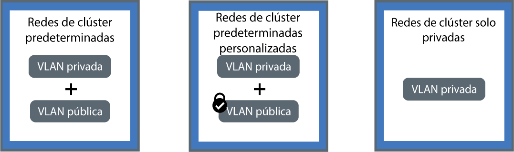

---

copyright:
  years: 2014, 2018
lastupdated: "2018-10-25"

---

{:new_window: target="_blank"}
{:shortdesc: .shortdesc}
{:screen: .screen}
{:pre: .pre}
{:table: .aria-labeledby="caption"}
{:codeblock: .codeblock}
{:tip: .tip}
{:download: .download}

# Planificación de las redes privadas y en clúster
{: #planning}

Planifique una configuración de red para el clúster de {{site.data.keyword.containerlong}}.
{: shortdesc}

## Descripción de las redes en clúster
{: #in-cluster}

A todas las pods que se despliegan en un nodo trabajador se les asigna una dirección IP privada en el rango 172.30.0.0/16 y se direccionan únicamente entre nodos trabajadores. Para evitar conflictos, no utilice este rango de IP en ningún otro nodo que se vaya a comunicar con los nodos trabajadores. Los nodos trabajadores y los pods pueden comunicarse de forma segura a través de la red privada utilizando direcciones IP privadas. Sin embargo, cuando un pod se cuelga o cuando es necesario volver a crear un nodo trabajador, se signa una nueva dirección IP privada.

De forma predetermina, es difícil realizar un seguimiento de direcciones IP privadas que cambian para las apps que deben ofrecer una alta disponibilidad. En su lugar, puede utilizar las características incorporadas de descubrimiento de servicios de Kubernetes para exponer las apps como servicios IP del clúster en la red privada. Un servicio de Kubernetes agrupa un conjunto de pods y proporciona una conexión de red a estos pods. Esta conexión proporciona conectividad a otros servicios del clúster sin exponer la dirección IP privada real de cada pod. A los servicios se les asigna una dirección IP interna del clúster a la que solo se puede acceder dentro del clúster.
* Clústeres antiguos: en los clústeres creados antes de febrero de 2018 en la zona dal13 o antes de octubre de 2017 en cualquier otra zona, se asigna a los servicios una IP de entre las 254 IP del rango 10.10.10.0/24. Si ha alcanzado el límite de 254 servicios y necesita más servicios, debe crear un nuevo clúster.
* Clústeres nuevos: en los clústeres creados después de febrero de 2018 en la zona dal13 o después de octubre de 2017 en cualquier otra zona, a los servicios se les asigna una IP de entre una de las 65.000 IP del rango 172.21.0.0/16.

Para evitar conflictos, no utilice este rango de IP en ningún otro nodo que se vaya a comunicar con los nodos trabajadores. También se crea una entrada de búsqueda de DNS para el servicio y se almacena en el componente `kube-dns` del clúster. La entrada DNS contiene el nombre del servicio, el espacio de nombres en el que se ha creado el servicio y el enlace a la dirección IP asignada interna del clúster.

Para acceder a un pod detrás de un servicio de clúster, la app puede utilizar la dirección IP interna del clúster o puede enviar una solicitud utilizando el nombre del servicio. Cuando se utiliza el nombre del servicio, el nombre se busca en el componente `kube-dns`
y se direcciona a la dirección IP del clúster del servicio. Cuando llega una solicitud al servicio, el servicio reenvía las solicitudes a los pods, independientemente de las direcciones IP internas de clúster de los pods y del nodo trabajador en el que estén desplegadas.

 

## Descripción de las conexiones VLAN y las interfaces de red
{: #interfaces}

{{site.data.keyword.containerlong_notm}} proporciona VLAN de infraestructura de IBM Cloud (SoftLayer) que garantizan un rendimiento de red de calidad y el aislamiento de red de los nodos trabajadores. Una VLAN configura un grupo de nodos trabajadores y pods como si estuvieran conectadas a la misma conexión física. Las VLAN están dedicadas a su
cuenta de {{site.data.keyword.Bluemix_notm}} y no se comparten entre los clientes de IBM.

De forma predeterminada, todos los clústeres están conectados a una VLAN privada. La VLAN privada determina la dirección IP privada que se asigna a cada nodo trabajador. Los trabajadores tienen una interfaz de red privada y son accesibles a través de la red privada. Cuando se crea un clúster que también está conectado a una VLAN pública, el clúster también tiene una interfaz de red pública. La VLAN pública permite que los nodos trabajadores se conecten de forma automática y segura con el maestro. Para obtener más información sobre las VLAN predeterminadas para el clúster, consulte [VLAN, subredes y direcciones IP predeterminadas para clústeres](cs_subnets.html#default_vlans_subnets).

Las configuraciones de red de clúster se pueden definir mediante las interfaces de red del clúster:

* **Redes de clúster predeterminadas**: un clúster con una interfaz de red privada y pública
* **Redes de clúster predeterminadas personalizadas**: un clúster con una interfaz de red privada y pública y políticas de red de Calico para bloquear el tráfico público entrante
* **Redes de clúster solo privadas**: un clúster con solo una interfaz de red privada

Pulse una de las configuraciones siguientes para planificar las redes para el clúster:

<map name="home_map" id="home_map">
<area href="#both_vlans" alt="Planificación de redes de clúster predeterminadas" title="Planificación de redes de clúster predeterminadas" shape="rect" coords="-7, -8, 149, 211" />
<area href="#both_vlans_private" alt="Planificación de redes de clúster predeterminadas personalizadas" title="Planificación de redes de clúster predeterminadas personalizadas" shape="rect" coords="196, -1, 362, 210" />
<area href="#private_vlan" alt="Planificación de redes de clúster solo privadas" title="Planificación de redes de clúster solo privadas" shape="rect" coords="409, -10, 572, 218" />
</map>

 

## Planificación de redes de clúster predeterminadas
{: #both_vlans}

De forma predeterminada, {{site.data.keyword.containerlong_notm}} configura el clúster con acceso a una VLAN pública y a una VLAN privada.
{:shortdesc}

**¿Qué obtiene mi clúster con esta configuración?**
* Una dirección IP pública para cada nodo trabajador, que proporciona a los nodos trabajadores una interfaz de red pública
* Una dirección IP privada para cada nodo trabajador, que proporciona a los nodos trabajadores una interfaz de red privada
* Una conexión OpenVPN automática y segura entre todos los nodos trabajadores y el maestro

**¿Para qué puedo utilizar esta configuración?**

* Tiene una app que debe ser accesible para el Internet público en un clúster de una sola zona.
* Tiene una app que debe ser accesible para el Internet público en un clúster multizona. Puesto que debe habilitar la [expansión de VLAN](cs_subnets.html#subnet-routing) para crear un clúster multizona, el clúster se puede comunicar con otros sistemas que están conectados a cualquier VLAN privada en la misma cuenta de IBM Cloud. **Nota**: para aislar el clúster multizona en la red privada, utilice las [políticas de red de Calico](cs_network_policy.html#isolate_workers).

**¿Cuáles son mis opciones para gestionar el acceso público y privado a mi clúster?**
 En las secciones siguientes se describen las funciones de {{site.data.keyword.containerlong_notm}} que puede utilizar para configurar las redes para clústeres conectados a una VLAN pública y una VLAN privada.

### Exponga sus apps con servicios de red
{: #both_vlans_services}

La interfaz de red pública de los nodos trabajadores está protegida por [valores predefinidos de política de red de Calico](cs_network_policy.html#default_policy) que se configuran en cada nodo trabajador durante la creación del clúster. De forma predeterminada, todo el tráfico de red de salida está permitido para todos los nodos trabajadores. El tráfico de red de entrada está bloqueado, excepto en algunos puertos. Estos puertos están abiertos para que IBM pueda supervisar el tráfico de red e instalar automáticamente actualizaciones de seguridad para el maestro de Kubernetes.

Si desea exponer sus apps al público o a una red privada, puede crear servicios de NodePort, LoadBalancer o Ingress públicos o privados. Para obtener más información sobre cada servicio, consulte [Elección de un servicio de NodePort, LoadBalancer o Ingress](cs_network_planning.html#external).

### Opcional: aísle las cargas de trabajo de red en nodos trabajadores de extremo
{: #both_vlans_edge}

Los nodos trabajadores de extremo pueden mejorar la seguridad de su clúster al permitir el acceso externo a un número inferior de nodos trabajadores y aislar la carga de trabajo en red. Para asegurarse de que Ingress y los pods de equilibrador de carga se despliegan solo en los nodos trabajadores especificados, [etiquete los nodos trabajadores como nodos de extremo](cs_edge.html#edge_nodes). Para evitar también que se ejecuten otras cargas de trabajo en los nodos de extremo, [marque los nodos de extremo](cs_edge.html#edge_workloads).

### Opcional: Conéctese a una red local o a IBM Cloud Private utilizando la VPN de strongSwan
{: #both_vlans_vpn}

Para conectar de forma segura sus nodos trabajadores y apps a una red local, puede configurar un [servicio VPN strongSwan IPSec ](https://www.strongswan.org/about.html). El servicio VPN IPSec de strongSwan proporciona un canal de comunicaciones de extremo a extremo seguro sobre Internet que está basado en la suite de protocolos
Internet Protocol Security (IPSec) estándar del sector.
* Para configurar una conexión segura entre el clúster y una red local, [configure y despliegue el servicio VPN IPSec strongSwan](cs_vpn.html#vpn-setup) directamente en un pod del clúster.
* Para configurar una conexión segura entre el clúster y una instancia privada de IBM Cloud, consulte [Conexión de la nube pública y privada con la VPN de strongSwan](cs_hybrid.html#hybrid_vpn).

 

## Planificación de redes de clúster predeterminadas personalizadas
{: #both_vlans_private}

De forma predeterminada, {{site.data.keyword.containerlong_notm}} configura el clúster con acceso a una VLAN pública y a una VLAN privada. Sin embargo, puede personalizar la configuración de red predeterminada utilizando políticas de red para bloquear el acceso público.
{:shortdesc}

**¿Qué obtiene mi clúster con esta configuración?**
* Una dirección IP pública para cada nodo trabajador, que proporciona a los nodos trabajadores una interfaz de red pública
* Una dirección IP privada para cada nodo trabajador, que proporciona a los nodos trabajadores una interfaz de red privada
* Una conexión OpenVPN automática y segura entre todos los nodos trabajadores y el maestro

**¿Para qué puedo utilizar esta configuración?**

* Tiene una app en un clúster de una sola zona. Desea exponer la app solo a los pods dentro del clúster o en otros clústeres que están conectados a la misma VLAN privada.
* Tiene una app en un clúster multizona. Desea exponer la app solo a los pods dentro del clúster o en otros clústeres que están conectados a las mismas VLAN privadas que el clúster. Sin embargo, como la [expansión de VLAN](cs_subnets.html#subnet-routing) debe estar habilitada para los clústeres multizona, otros sistemas conectados a cualquier VLAN privada en la misma cuenta de IBM Cloud pueden acceder al clúster. Desea aislar su clúster multizona de otros sistemas.

**¿Cuáles son mis opciones para gestionar el acceso público y privado a mi clúster?** En las secciones siguientes se describen las funciones de {{site.data.keyword.containerlong_notm}} que puede utilizar para configurar las redes solo privadas y bloquear las redes públicas para clústeres conectados a una VLAN pública y una VLAN privada.

### Exponga sus apps con servicios de red privados y proteja su clúster del acceso público con las políticas de red de Calico
{: #both_vlans_private_services}

La interfaz de red pública de los nodos trabajadores está protegida por [valores predefinidos de política de red de Calico](cs_network_policy.html#default_policy) que se configuran en cada nodo trabajador durante la creación del clúster. De forma predeterminada, todo el tráfico de red de salida está permitido para todos los nodos trabajadores. El tráfico de red de entrada está bloqueado, excepto en algunos puertos. Estos puertos están abiertos para que IBM pueda supervisar el tráfico de red e instalar automáticamente actualizaciones de seguridad para el maestro de Kubernetes.

Si desea exponer sus apps sólo a través de una red privada, puede crear servicios de NodePort, LoadBalancer o Ingress privados. Para obtener más información sobre la planificación de redes externas privadas, consulte [Planificación del sistema de red externo privado para una configuración de VLAN pública y privada](cs_network_planning.html#private_both_vlans).

Sin embargo, las políticas de red de Calico predeterminadas también permiten el tráfico de red pública entrante desde Internet a estos servicios. Puede crear políticas de Calico para bloquear todo el tráfico público a los servicios. Por ejemplo, un servicio NodePort abre un puerto en un nodo trabajador sobre la dirección IP privada y pública del nodo trabajador. Un servicio de equilibrador de carga con una dirección IP privada portátil abre un NodePort público en cada nodo trabajador. Debe crear una [política de red preDNAT de Calico](cs_network_policy.html#block_ingress) para bloquear los NodePorts públicos.

Como ejemplo, supongamos que ha creado un servicio de equilibrador de carga privado. También ha creado una política de preDNAT de Calico para evitar que el tráfico público llegue a los NodePorts públicos abiertos por el equilibrador de carga. A este equilibrador de carga privado se puede acceder mediante:
* [Cualquier pod en ese mismo clúster](#in-cluster)
* Cualquier pod en cualquier clúster que esté conectado a la misma VLAN privada
* Si tiene la [expansión de VLAN habilitada](cs_subnets.html#subnet-routing), cualquier sistema que esté conectado a cualquiera de las VLAN privadas en la misma cuenta de IBM Cloud
* Si no está en la cuenta de IBM Cloud pero sí detrás del cortafuegos de la empresa, cualquier sistema a través de una conexión VPN con la subred en la que se encuentra la IP del equilibrador de carga
* Si está en una cuenta de IBM Cloud distinta, cualquier sistema a través de una conexión VPN con la subred en la que se encuentra la IP del equilibrador de carga

### Aislar el clúster en la red privada
{: #isolate}

Si tiene un clúster multizona, varias VLAN para un clúster de una sola zona o varias subredes en la misma VLAN, debe [habilitar la expansión de VLAN](/docs/infrastructure/vlans/vlan-spanning.html#vlan-spanning) para que los nodos trabajadores puedan comunicarse entre sí en la red privada. Sin embargo, cuando la expansión de VLAN está habilitada, cualquier sistema que esté conectado a cualquiera de las VLAN privadas en la misma cuenta de IBM Cloud puede acceder a los trabajadores. Puede aislar el clúster multizona de otros sistemas de la red privada utilizando [Políticas de red de Calico](cs_network_policy.html#isolate_workers). Estas políticas también permiten la entrada y la salida de los rangos de IP y puertos privados que ha abierto en el cortafuegos privado.

### Opcional: aísle las cargas de trabajo de red en nodos trabajadores de extremo
{: #both_vlans_private_edge}

Los nodos trabajadores de extremo pueden mejorar la seguridad de su clúster al permitir el acceso externo a un número inferior de nodos trabajadores y aislar la carga de trabajo en red. Para asegurarse de que Ingress y los pods de equilibrador de carga se despliegan solo en los nodos trabajadores especificados, [etiquete los nodos trabajadores como nodos de extremo](cs_edge.html#edge_nodes). Para evitar también que se ejecuten otras cargas de trabajo en los nodos de extremo, [marque los nodos de extremo](cs_edge.html#edge_workloads).

A continuación, utilice una [política de red preDNAT de Calico](cs_network_policy.html#block_ingress) para bloquear el tráfico a los NodePorts públicos de los clústeres que se ejecutan en nodos trabajadores de extremo. El bloqueo de los puertos de los nodos garantiza que los nodos trabajadores de extremo sean los únicos nodos trabajadores que manejen el tráfico entrante.

### Opcional: Conéctese a una red local o a IBM Cloud Private utilizando la VPN de strongSwan
{: #both_vlans_private_vpn}

Para conectar de forma segura sus nodos trabajadores y apps a una red local, puede configurar un [servicio VPN strongSwan IPSec ](https://www.strongswan.org/about.html). El servicio VPN IPSec de strongSwan proporciona un canal de comunicaciones de extremo a extremo seguro sobre Internet que está basado en la suite de protocolos
Internet Protocol Security (IPSec) estándar del sector.
* Para configurar una conexión segura entre el clúster y una red local, [configure y despliegue el servicio VPN IPSec strongSwan](cs_vpn.html#vpn-setup) directamente en un pod del clúster.
* Para configurar una conexión segura entre el clúster y una instancia privada de IBM Cloud, consulte [Conexión de la nube pública y privada con la VPN de strongSwan](cs_hybrid.html#hybrid_vpn).

 

## Planificación de redes de clúster solo privadas
{: #private_vlan}

Puede optar por [crear un clúster solo de VLAN privada](cs_clusters.html#clusters_cli) incluyendo el distintivo `--private-only` en la CLI. Cuando los nodos trabajadores están conectados únicamente a una VLAN privada, los nodos trabajadores no se pueden conectar automáticamente al nodo maestro. Debe utilizar un dispositivo de pasarela para conectar los nodos trabajadores con el nodo maestro. También puede utilizar el dispositivo de pasarela como cortafuegos para proteger el clúster del acceso no deseado.
{:shortdesc}

**¿Qué obtiene mi clúster con esta configuración?**
* Una dirección IP privada para cada nodo trabajador, que proporciona a los nodos trabajadores una interfaz de red privada

**¿Qué no obtiene mi clúster con esta configuración?**
* Una dirección IP pública para cada nodo trabajador, que proporciona a los nodos trabajadores una interfaz de red pública. El clúster nunca está disponible para el público.
* Una conexión automática entre todos los nodos trabajadores y el maestro. Debe proporcionar esta conexión [configurando un dispositivo de pasarela](#private_vlan_gateway).

**¿Para qué puedo utilizar esta configuración?**
 Tiene requisitos de seguridad específicos o necesita crear reglas de direccionamiento y políticas de red personalizadas para ofrecer seguridad de red dedicada. **Nota**: el uso de un dispositivo de pasarela genera costes por separado. Para obtener detalles, consulte la [documentación](/docs/infrastructure/fortigate-10g/explore-firewalls.html).

**¿Cuáles son mis opciones para gestionar el acceso público y privado a mi clúster?**
 En las secciones siguientes se describen las funciones de {{site.data.keyword.containerlong_notm}} que puede utilizar para configurar las redes para clústeres conectados únicamente a una VLAN privada.

### Configure un dispositivo de pasarela
{: #private_vlan_gateway}

Si los nodos trabajadores únicamente se configuran con una VLAN privada, debe configurar una solución alternativa para la conectividad de red entre los nodos trabajadores y el maestro. Puede configurar un cortafuegos con políticas de red personalizadas para proporcionar seguridad de red dedicada para el clúster estándar y para detectar y solucionar problemas de intrusión en la red. Por ejemplo, puede configurar un [dispositivo direccionador virtual](/docs/infrastructure/virtual-router-appliance/about.html) o un [dispositivo de seguridad Fortigate](/docs/infrastructure/fortigate-10g/about.html) para que actúe como cortafuegos y bloquee el tráfico no deseado. Si configura un cortafuegos, también debe [abrir los puertos y direcciones IP necesarios](cs_firewall.html#firewall_outbound) para cada región para que los nodos maestro y trabajador se puedan comunicar.

**Nota**: si tiene un dispositivo direccionador existente y luego añade un clúster, las nuevas subredes portátiles que se soliciten para el clúster no se configuran en el dispositivo direccionador. Para poder utilizar los servicios de red, debe habilitar el direccionamiento entre las subredes de la misma VLAN mediante la [habilitación de la expansión de VLAN](cs_subnets.html#vra-routing).

Para comprobar si la expansión de VLAN ya está habilitada, utilice el [mandato](cs_cli_reference.html#cs_vlan_spanning_get) `ibmcloud ks vlan-spanning-get`.
{: tip}

### Exponga sus apps con servicios de red privados
{: #private_vlan_services}

Para hacer que solo se pueda acceder a la app desde una red privada, puede utilizar los servicios privados NodePort, LoadBalancer o Ingress. Puesto que los nodos trabajadores no están conectados a una VLAN pública, no se direcciona ningún tráfico público a estos servicios. También debe [abrir las direcciones IP y los puertos necesarios](cs_firewall.html#firewall_inbound) para permitir el tráfico de entrada a estos servicios.

Para obtener más información sobre cada servicio, consulte [Elección de un servicio de NodePort, LoadBalancer o Ingress](cs_network_planning.html#external).

### Opcional: conéctese a una base de datos local utilizando el dispositivo de pasarela
{: #private_vlan_vpn}

Para conectar de forma segura sus nodos trabajadores y apps a una red local, puede configurar una pasarela VPN. Puede utilizar el VRA o el FSA que ha configurado anteriormente para configurar también un punto final VPN IPSec. Para configurar un VRA, consulte [Configuración de la conectividad de VPN con un VRA](cs_vpn.html#vyatta).
