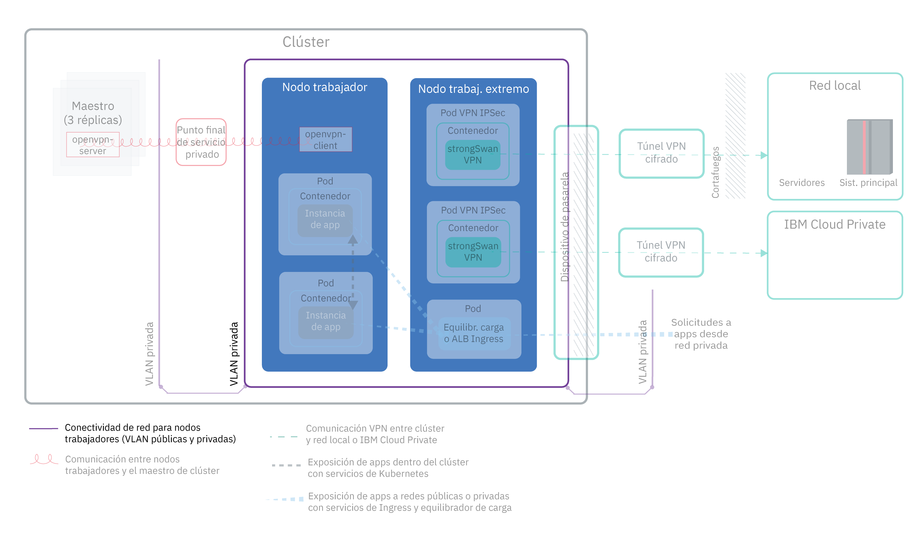
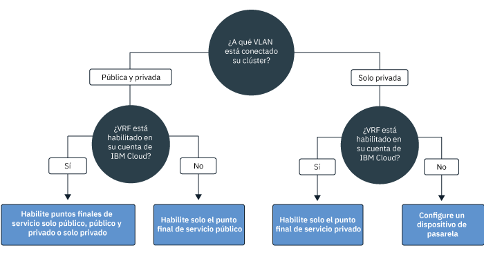
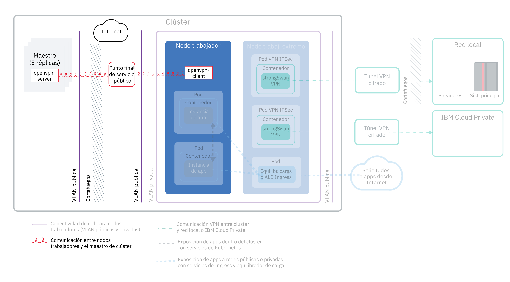
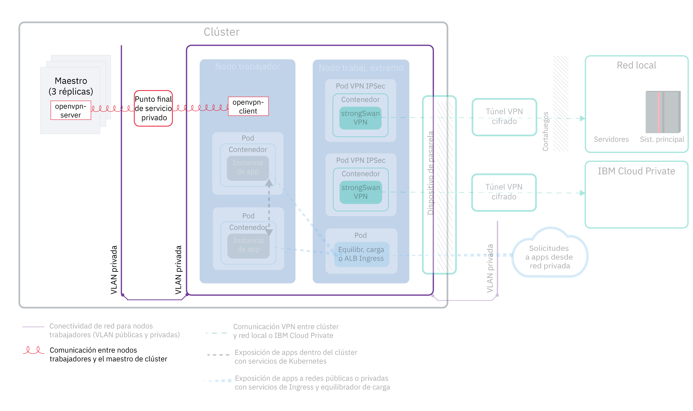
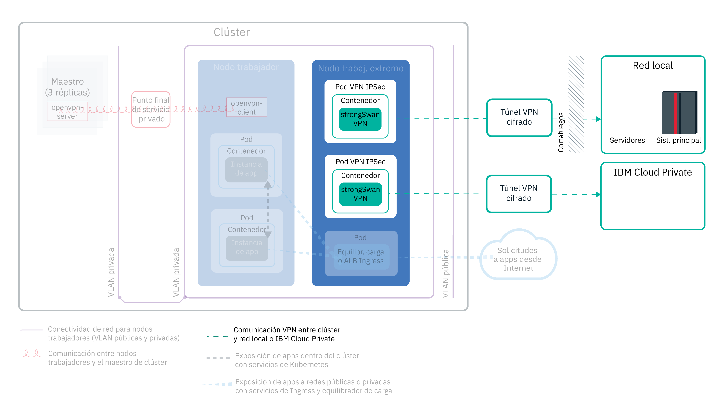
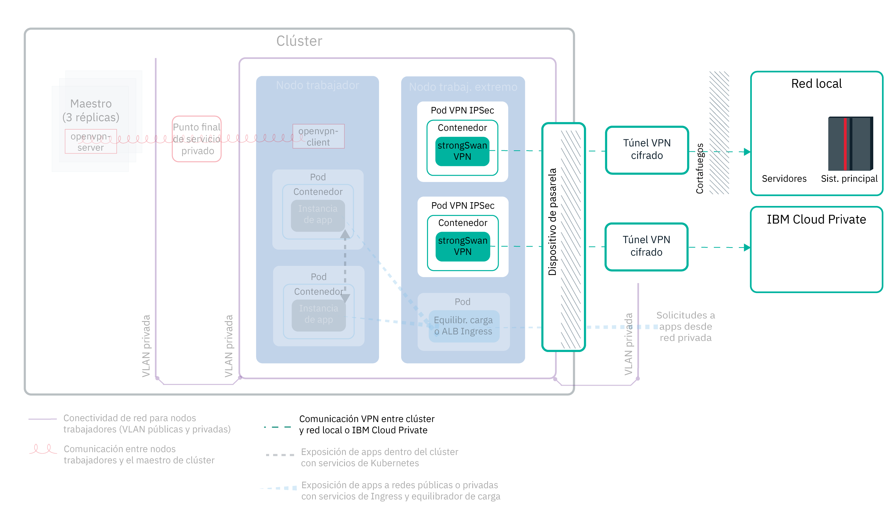

---

copyright:
  years: 2014, 2019
lastupdated: "2019-04-15"

---

{:new_window: target="_blank"}
{:shortdesc: .shortdesc}
{:screen: .screen}
{:pre: .pre}
{:table: .aria-labeledby="caption"}
{:codeblock: .codeblock}
{:tip: .tip}
{:note: .note}
{:important: .important}
{:deprecated: .deprecated}
{:download: .download}

# Planificación de la red de clúster
{: #cs_network_ov}

Planifique una configuración de red para el clúster de {{site.data.keyword.containerlong}}.
{: shortdesc}

Esta página le ayuda a crear la configuración de red del clúster. ¿Está buscando información sobre cómo configurar la red para su app? Consulte [Planificación para exponer las apps con redes internas y externas del clúster](/docs/containers?topic=containers-cs_network_planning).
{: tip}

## Visión general de los conceptos básicos de la red de {{site.data.keyword.containerlong_notm}}
{: #cs_network_ov_basics}

Antes de empezar a configurar la red de clúster, es importante conocer los conceptos básicos de la red en clústeres de {{site.data.keyword.containerlong_notm}}.
{: shortdesc}

### ¿Qué componentes del clúster deben comunicarse entre sí?
{: #cs_network_ov_basics_components}

Cuando cree el clúster, debe elegir una configuración de red de modo que ciertos componentes del clúster se puedan comunicar entre sí.
{: shortdesc}

* Todos los nodos trabajadores deben estar conectados a una VLAN para poder comunicarse entre sí y con el maestro de Kubernetes. Para elegir las VLAN, consulte [Planificación de la comunicación entre un nodo trabajador y otro](#cs_network_ov_worker).
* Se debe permitir la comunicación entre varias VLAN privadas para permitir que los trabajadores se conecten entre sí y con el maestro. Para habilitar una función de direccionador virtual (VRF) o una distribución de VLAN, consulte [¿Cómo
se configuran las VLAN y las subredes para garantizar la segmentación de red?](#cs_network_ov_basics_segmentation).
* Los nodos trabajadores se pueden comunicar con el maestro de Kubernetes de forma segura sobre la red pública o sobre la red privada. Para elegir el canal de comunicación entre nodo maestro y trabajador, consulte [Planificación de la comunicación entre un nodo maestro y un nodo trabajador](#cs_network_ov_master).

### ¿Cómo funciona la red en {{site.data.keyword.containerlong_notm}}?
{: #cs_network_ov_basics_vlans}

{{site.data.keyword.containerlong_notm}} utiliza VLAN, subredes y direcciones IP para la conectividad de red de los componentes del clúster.
{: shortdesc}

**¿Qué son las VLAN? ¿Qué tipos de VLAN ofrece {{site.data.keyword.containerlong_notm}}?** 

Cuando se crea un clúster, los nodos trabajadores del clúster se conectan automáticamente a una VLAN. Una VLAN configura un grupo de nodos trabajadores y pods como si estuvieran conectadas a la misma conexión física y ofrece un canal para la conectividad entre los nodos trabajadores y los pods.
{: shortdesc}

<dl>
<dt>VLAN para clústeres gratuitos</dt>
<dd>En los clústeres gratuitos, los nodos trabajadores del clúster se conectan de forma predeterminada a una VLAN pública y VLAN privada propiedad de IBM. Puesto que IBM controla las VLAN, las subredes y las direcciones IP, no puede crear clústeres multizona ni añadir subredes a un clúster, y solo puede utilizar servicios NodePort para exponer la app.</dd>
<dt>VLAN para clústeres estándares</dt>
<dd>En los clústeres estándares, la primera vez que crea un clúster en una zona, se suministra automáticamente una VLAN pública y una VLAN privada en dicha zona en su cuenta de infraestructura de IBM Cloud (SoftLayer). Para los demás clústeres que cree en dicha zona, debe especificar el par de VLAN que desee utilizar en la zona. Puede reutilizar las mismas VLAN pública y privada que se han creado porque varios clústeres pueden compartir las VLAN. 
 Puede conectar los nodos trabajadores tanto a una VLAN pública y a la VLAN privada, o solo a la VLAN privada. Si desea conectar sus nodos trabajadores únicamente a una VLAN privada, utilice el ID de una VLAN privada existente o [cree una VLAN privada](/docs/cli/reference/ibmcloud?topic=cloud-cli-manage-classic-vlans#sl_vlan_create) y utilice el ID durante la creación del clúster.</dd></dl>

Para ver las VLAN que se suministran en cada zona para su cuenta, ejecute `ibmcloud ks vlans --zone <zone>.` Para ver las VLAN en las que se ha suministrado un clúster, ejecute `ibmcloud ks cluster-get --cluster <cluster_name_or_ID> --showResources` y busque el campo **Subdominio de Ingress**.

La infraestructura de IBM Cloud (SoftLayer) gestiona las VLAN que se suministran automáticamente cuando crea el primer clúster en una zona. Si deja que una VLAN quede sin utilizar, por ejemplo eliminando todos los nodos trabajadores de una VLAN, la infraestructura de IBM Cloud (SoftLayer) reclama la VLAN. Después, si necesita una nueva VLAN, [póngase en contacto con el equipo de soporte de {{site.data.keyword.Bluemix_notm}}](/docs/infrastructure/vlans?topic=vlans-ordering-premium-vlans#ordering-premium-vlans).

**¿Cómo afecta a mi clúster la elección de las VLAN?** 

La elección de las conexiones de VLAN determina cómo se pueden comunicar entre sí el nodo maestro de Kubernetes y los nodos trabajadores en el clúster. Para obtener más información, consulte [Planificación de la comunicación entre nodos trabajadores y el maestro de Kubernetes](/docs/containers?topic=containers-cs_network_ov#cs_network_ov_master).

Su elección de conexiones de VLAN también determina la conectividad de red para sus apps. Para obtener más información, consulte [Planificación para exponer las apps con redes internas y externas del clúster](/docs/containers?topic=containers-cs_network_planning).

### ¿Qué son las subredes? ¿Qué tipos de subredes ofrece {{site.data.keyword.containerlong_notm}}?
{: #cs_network_ov_basics_subnets}

Además de los nodos trabajadores y los pods, las subredes también se suministran automáticamente en las VLAN. Las subredes proporcionan conectividad de red a los componentes del clúster mediante la asignación de direcciones IP a los mismos.
{: shortdesc}

Las subredes siguientes se suministran automáticamente en las VLAN públicas y privadas predeterminadas:

**Subredes VLAN públicas**
* La subred pública primaria determina las direcciones IP públicas que se asignan a los nodos trabajadores durante la creación del clúster. Varios clústeres en la misma VLAN pueden compartir una subred pública primaria.
* La subred pública portátil está enlazada a un solo clúster y proporciona al clúster 8 direcciones IP públicas. 3 IP están reservadas para las funciones de la infraestructura IBM Cloud (SoftLayer). El ALB de Ingress público predeterminado utiliza 1 IP y se pueden utilizar 4 IP para crear servicios de equilibrador de carga de red pública (NLB). Las IP públicas portátiles son direcciones IP fijas y permanentes, que se pueden utilizar para acceder a los NLB por internet. Si necesita más de 4 IP para los NLB, consulte [Adición de direcciones IP portátiles](/docs/containers?topic=containers-subnets#adding_ips).

**Subredes VLAN privadas**
* La subred privada primaria determina las direcciones IP privadas que se asignan a los nodos trabajadores durante la creación del clúster. Varios clústeres en la misma VLAN pueden compartir una subred privada primaria.
* La subred privada portátil está enlazada a un solo clúster y proporciona al clúster 8 direcciones IP privadas. 3 IP están reservadas para las funciones de la infraestructura IBM Cloud (SoftLayer). El ALB de Ingress privado predeterminado utiliza 1 IP y se pueden utilizar 4 IP para crear servicios de equilibrador de carga de red privada (NLB). Las IP privadas portátiles son direcciones IP fijas y permanentes, que se pueden utilizar para acceder a los NLB por una red privada. Si necesita más de 4 IP para los NLB privados, consulte [Adición de direcciones IP portátiles](/docs/containers?topic=containers-subnets#adding_ips).

Para ver todas las subredes que se suministran en su cuenta, ejecute `ibmcloud ks subnets`. Para ver las subredes privadas portátiles y públicas portátiles que están enlazadas a un clúster, ejecute `ibmcloud ks cluster-get --cluster <cluster_name_or_ID> --showResources` y busque la sección **Subnet VLANs**.

En {{site.data.keyword.containerlong_notm}}, las VLAN tienen un límite de 40 subredes. Si alcanza este límite, compruebe en primer lugar si puede [reutilizar subredes en la VLAN para crear nuevos clústeres](/docs/containers?topic=containers-subnets#subnets_custom). Si necesita una nueva VLAN, [póngase en contacto con el equipo de soporte de {{site.data.keyword.Bluemix_notm}}](/docs/infrastructure/vlans?topic=vlans-ordering-premium-vlans#ordering-premium-vlans) para solicitar una. A continuación, [cree un clúster](/docs/containers?topic=containers-cs_cli_reference#cs_cluster_create) que utilice esta nueva VLAN.
{: note}

### ¿Cómo se configuran las VLAN y las subredes para garantizar la segmentación de red?
{: #cs_network_ov_basics_segmentation}

La segmentación de red describe el enfoque para dividir una red en varias subredes. Las apps que se ejecutan en una subred no pueden ver ni acceder a las apps de otra subred. Para obtener más información sobre las opciones de segmentación de red y sobre cómo se relacionan con las VLAN, consulte [este tema sobre la seguridad del clúster](/docs/containers?topic=containers-security#network_segmentation).
{: shortdesc}

Sin embargo, en varias situaciones, los componentes del clúster deben poder comunicarse entre varias VLAN privadas. Por ejemplo, si desea crear un clúster multizona, si tiene varias VLAN para un clúster o si tiene varias subredes en la misma VLAN, los nodos trabajadores de distintas subredes de la misma VLAN o de distintas VLAN no se pueden comunicar automáticamente entre sí. Debe habilitar una función de direccionador virtual (VRF) o una distribución de VLAN para la cuenta de infraestructura de IBM Cloud (SoftLayer).

**¿Qué son las funciones de direccionador virtual (VRF) y la distribución de VLAN?** 

<dl>
<dt>[Función de direccionador virtual (VRF)](/docs/infrastructure/direct-link?topic=direct-link-overview-of-virtual-routing-and-forwarding-vrf-on-ibm-cloud#overview-of-virtual-routing-and-forwarding-vrf-on-ibm-cloud)</dt>
<dd>Una VRF permite que todas las VLAN y subredes de la cuenta de la infraestructura se comuniquen entre sí. Además, se necesita una VRF para permitir que los trabajadores y el maestro se comuniquen a través del punto final de servicio privado. Para habilitar VRF, [póngase en contacto con el representante de su cuenta de la infraestructura de IBM Cloud (SoftLayer)](/docs/infrastructure/direct-link?topic=direct-link-overview-of-virtual-routing-and-forwarding-vrf-on-ibm-cloud#how-you-can-initiate-the-conversion). Tenga en cuenta que VRF elimina la opción de distribución de VLAN para la cuenta, ya que todas las VLAN pueden comunicarse a menos que configure un dispositivo de pasarela para gestionar el tráfico.</dd>
<dt>[Distribución de VLAN](/docs/infrastructure/vlans?topic=vlans-vlan-spanning#vlan-spanning)</dt>
<dd>Si no puede o no desea habilitar VRF, habilite la distribución de VLAN. Para llevar a cabo esta acción, necesita el [permiso de la infraestructura](/docs/containers?topic=containers-users#infra_access) **Red > Gestionar distribución de VLAN de red** o bien puede solicitar al propietario de la cuenta que lo habilite. Para comprobar si la distribución de VLAN ya está habilitada, utilice el [mandato](/docs/containers?topic=containers-cs_cli_reference#cs_vlan_spanning_get) `ibmcloud ks vlan-spanning-get`. Tenga en cuenta que no puede habilitar el punto final de servicio privado si elige habilitar la distribución de VLAN en lugar de una VRF.</dd>
</dl>

**¿Cómo afecta VRF o la distribución de VLAN a la segmentación de red?** 

Cuando se habilita la VRF o la distribución de VLAN, cualquier sistema que esté conectado a cualquiera de las VLAN privadas de la misma cuenta de {{site.data.keyword.Bluemix_notm}} se puede comunicar con los nodos trabajadores. Puede aislar el clúster de otros sistemas de la red privada aplicando [Políticas de red privada de Calico](/docs/containers?topic=containers-network_policies#isolate_workers). {{site.data.keyword.containerlong_notm}} también es compatible con todas las [ofertas de cortafuegos de infraestructura de IBM Cloud (SoftLayer) ](https://www.ibm.com/cloud-computing/bluemix/network-security). Puede configurar un cortafuegos, como por ejemplo un [dispositivo de direccionamiento virtual](/docs/infrastructure/virtual-router-appliance?topic=virtual-router-appliance-about-the-vra), con políticas de red personalizadas para proporcionar seguridad de red dedicada para el clúster estándar y para detectar y solucionar problemas de intrusión en la red.

 

## Planificación de la comunicación entre un nodo trabajador y otro
{: #cs_network_ov_worker}

Todos los nodos trabajadores deben estar conectados a una VLAN para poder tener una interfaz de red. Esta interfaz de red permite a cada nodo trabajador enviar y recibir información a otros nodos trabajadores.
{: shortdesc}

### ¿Cuáles son mis opciones para la conectividad de VLAN de nodo trabajador?
{: #cs_network_ov_worker_options}

Cuando crea el clúster, puede conectar los nodos trabajadores a una VLAN pública y a una VLAN privada, o solo a una VLAN privada.
{: shortdesc}

**¿Por qué puedo conectar mi clúster a una VLAN pública y privada?** 

En la mayoría de los casos, conseguir flexibilidad de red mediante la creación de un clúster que esté conectado tanto a una VLAN pública como a una VLAN privada. Por ejemplo:
* Tiene una app que debe ser accesible para internet público.
* Tiene una app que solo desea exponer a los pods dentro del clúster o en otros clústeres que están conectados a la misma VLAN privada. Hay varias opciones para proteger la app desde la interfaz pública, como por ejemplo utilizar políticas de red de Calico o aislar la carga de trabajo de red externa a los nodos trabajadores de extremo.

En la imagen siguiente se muestra la conectividad de red para nodos trabajadores que están conectados a una VLAN pública y privada.

<figure>
  <figcaption>Conectividad de red para nodos trabajadores que están conectados a una VLAN pública y privada</figcaption> </figure>

Si desea crear un clúster multizona, si tiene varias VLAN para un clúster o si tiene varias subredes en la misma VLAN, los nodos trabajadores de distintas subredes de la misma VLAN o de distintas VLAN no se pueden comunicar automáticamente entre sí. Debe habilitar [VRF o distribución de VLAN](#cs_network_ov_basics_segmentation) para la cuenta de la infraestructura de IBM Cloud (SoftLayer). Elija VRF para habilitar el [punto final de servicio privado para la comunicación entre nodo maestro y trabajador](#cs_network_ov_master_private). Si no puede o no desea habilitar VRF, habilite la distribución de VLAN.

**¿Por qué debo conectar mi clúster solo a una VLAN privada?** 

Cree un clúster solo de VLAN privada si tiene requisitos de seguridad específicos o si tiene que crear políticas de red y reglas de direccionamiento personalizadas para proporcionar seguridad de red dedicada.
{: shortdesc}

En la imagen siguiente se muestra la conectividad de red para nodos trabajadores que están conectados solo a una VLAN privada.

<figure>
  <figcaption>Conectividad de red para nodos trabajadores en una configuración de red privada</figcaption> </figure>

Si desea crear un clúster multizona, si tiene varias VLAN para un clúster o si tiene varias subredes en la misma VLAN, los nodos trabajadores de distintas subredes de la misma VLAN o de distintas VLAN no se pueden comunicar automáticamente entre sí. Debe habilitar [VRF o distribución de VLAN](#cs_network_ov_basics_segmentation) para la cuenta de la infraestructura de IBM Cloud (SoftLayer). Elija VRF para habilitar el [punto final de servicio privado para la comunicación entre nodo maestro y trabajador](#cs_network_ov_master_private). Si no puede o no desea habilitar VRF, debe habilitar la distribución de VLAN y también configurar un dispositivo de pasarela para la comunicación entre nodo maestro y trabajador.

### Ya he realizado mi elección en cuanto a conexiones de VLAN. ¿Cómo las configuro?
{: #cs_network_ov_worker_setup}

Puede seguir los pasos del apartado sobre [Configuración de red de clúster con una VLAN pública y una VLAN privada](/docs/containers?topic=containers-cs_network_cluster#both_vlans) o [Configuración de red de clúster solo con una VLAN privada](/docs/containers?topic=containers-cs_network_cluster#setup_private_vlan).
{: shortdesc}

### ¿Puedo cambiar mi decisión sobre VLAN más adelante? ¿Las direcciones IP de mi nodo trabajador cambian?
{: #cs_network_ov_worker_change}

Puede cambiar la configuración de la VLAN modificando las agrupaciones de nodos trabajadores del clúster. Para obtener más información, consulte [Cambio de las conexiones de VLAN de nodo trabajador](/docs/containers?topic=containers-cs_network_cluster#change-vlans).
{: shortdesc}

A su nodo trabajador se le asigna una dirección IP en las VLAN públicas o privadas que utiliza el clúster. Una vez que se ha suministrado el nodo trabajador, las direcciones IP no cambian. Por ejemplo, las direcciones IP de nodo trabajador persisten en las operaciones `reload`, `reboot` y `update`. Además, la dirección IP privada del nodo trabajador se utiliza para la identidad del nodo trabajador en la mayoría de los mandatos `kubectl`. Si cambia las VLAN que utiliza la agrupación de trabajadores, los nuevos nodos trabajadores que se suministran en esa agrupación utilizan las nuevas VLAN para sus direcciones IP. Las direcciones IP de los nodos trabajadores existentes no cambian, pero, si lo desea, puede eliminar los nodos trabajadores que utilizan las VLAN antiguas.

 

## Planificación de la comunicación entre un nodo maestro y un nodo trabajador
{: #cs_network_ov_master}

Cuando crea el clúster, debe elegir cómo se comunican los nodos trabajadores y el maestro de Kubernetes para planificar las configuraciones de clúster.
{: shortdesc}

Se debe configurar un canal de comunicación para que el nodo maestro de Kubernetes pueda gestionar los nodos trabajadores. Esta configuración de comunicación depende de cómo se configure la conectividad de VLAN. Es posible que pueda permitir que los nodos trabajadores y el maestro de Kubernetes se comuniquen habilitando solo puntos finales de servicio público, público y privado, o solo de servicio privado. Para determinar si puede utilizar puntos finales de servicio, siga este árbol de decisiones.

<map name="dt-image-map" id="dt-image-map">
  <area alt="Red predeterminada con puntos finales de servicio público, público y privado o privado" title="Red predeterminada con puntos finales de servicio público, público y privado o privado" href="#cs_network_ov_master_both" coords="0,296,195,354" shape="rect" />
  <area alt="Red predeterminada solo con un punto final de servicio público" title="Red predeterminada solo con un punto final de servicio público" href="#cs_network_ov_master_public" coords="220,295,353,352" shape="rect" />
  <area alt="Red privada solo con un punto final de servicio privado" title="Red privada solo con un punto final de servicio privado" href="#cs_network_ov_master_private" coords="393,294,524,356" shape="rect" />
  <area alt="Red privada con un dispositivo de pasarela" title="Red privada con un dispositivo de pasarela" href="#cs_network_ov_master_gateway" coords="579,294,697,354" shape="rect" />
</map>

Consulte las secciones siguientes para obtener más información sobre cada configuración.

### Solo punto final de servicio público
{: #cs_network_ov_master_public}

Si los nodos trabajadores se han configurado con una VLAN privada y pública, los nodos trabajadores se pueden conectar automáticamente al maestro sobre la red pública a través del punto final de servicio público. No se necesita una VRF en la cuenta de {{site.data.keyword.Bluemix_notm}}.
{: shortdesc}

En la imagen siguiente se muestra la comunicación entre los nodos trabajadores y el maestro de Kubernetes a través de un punto final de servicio público.

<figure>
 
 <figcaption>Comunicación entre nodos trabajadores y el nodo maestro de Kubernetes a través de un punto final de servicio público</figcaption>
</figure>

**Comunicación entre nodos trabajadores y maestro** 
La comunicación se establece de forma segura sobre la red pública a través del punto final de servicio público. Los nodos trabajadores se comunican de forma segura con el nodo maestro a través de certificados TLS y el maestro se comunica con los nodos trabajadores a través de una conexión OpenVPN.

**Acceso al nodo maestro** 
Si no es así, los usuarios autorizados del clúster pueden acceder de forma pública al nodo maestro a través del punto final de servicio público. Los usuarios del clúster pueden acceder de forma segura al nodo maestro de Kubernetes sobre internet, por ejemplo para ejecutar mandatos `kubectl`.

Para configurar el punto final de servicio público solo durante o después de la creación del clúster, siga los pasos de [Configuración del punto final de servicio público](/docs/containers?topic=containers-cs_network_cluster#set-up-public-se).

### Solo punto final de servicio privado
{: #cs_network_ov_master_private}

Para que solo se pueda acceder al nodo maestro de forma privada, puede habilitar el punto final de servicio privado en los clústeres que ejecutan Kubernetes versión 1.11 o posteriores. Se necesita una VRF en la cuenta de {{site.data.keyword.Bluemix_notm}}. Si el clúster solo está conectado a una VLAN privada, un punto final de servicio privado evita la necesidad de disponer de un dispositivo de pasarela para conectar de forma segura con el nodo maestro.
{: shortdesc}

En la imagen siguiente se muestra la comunicación entre los nodos trabajadores y el maestro de Kubernetes a través de un punto final de servicio privado.

<figure>
 
 <figcaption>Comunicación entre nodos trabajadores y el maestro de Kubernetes a través de un punto final de servicio privado</figcaption>
</figure>

**Comunicación entre nodos trabajadores y maestro** 
La comunicación se establece sobre la red privada a través del punto final de servicio privado.

**Acceso al nodo maestro** 
Los usuarios del clúster deben estar en la red privada de {{site.data.keyword.Bluemix_notm}} o deben conectarse a la red privada a través de una conexión VPN para poder acceder al nodo maestro.

Para configurar el punto final de servicio privado solo durante o después de la creación del clúster, siga los pasos de [Configuración del punto final de servicio privado](/docs/containers?topic=containers-cs_network_cluster#set-up-private-se).

### Puntos finales de servicio público y privado
{: #cs_network_ov_master_both}

Para que los usuarios del clúster puedan acceder al maestro de forma pública o privada, puede habilitar los puntos finales de servicio públicos y privados en los clústeres que ejecutan Kubernetes versión 1.11 o posteriores. Se necesita una VRF en la cuenta de {{site.data.keyword.Bluemix_notm}}.
{: shortdesc}

**Comunicación entre nodos trabajadores y maestro** 
La comunicación se establece tanto sobre la red privada a través del punto final de servicio privado como sobre la red pública a través del punto final de servicio público. Direccionando la mitad del tráfico de trabajador a maestro por el punto final público y la otra mitad por el punto final privado, la comunicación de maestro a trabajador está protegida de posibles interrupciones en la red pública o privada.

**Acceso al nodo maestro** 
Se puede acceder al maestro de forma privada a través del punto final de servicio privado si los usuarios autorizados del clúster están en la red privada de {{site.data.keyword.Bluemix_notm}} o están conectados a la red privada a través de una conexión VPN. Si no es así, los usuarios autorizados del clúster pueden acceder de forma pública al nodo maestro a través del punto final de servicio público.

Para configurar los puntos finales de servicio público y privado durante la creación del clúster, siga los pasos del apartado [Configuración del punto final de servicio privado](/docs/containers?topic=containers-cs_network_cluster#set-up-private-se). Después de crear el clúster, puede habilitar el punto final de servicio [público](/docs/containers?topic=containers-cs_network_cluster#set-up-public-se) o [privado](/docs/containers?topic=containers-cs_network_cluster#set-up-private-se) individualmente.

### Red privada con un dispositivo de pasarela
{: #cs_network_ov_master_gateway}

Si los nodos trabajadores solo están configurados con una VLAN privada y VRF no está habilitada en la cuenta de {{site.data.keyword.Bluemix_notm}}, debe configurar una solución alternativa para la conectividad de red entre los nodos trabajadores y el maestro. Puede configurar un cortafuegos con políticas de red personalizadas para proporcionar seguridad de red dedicada para el clúster estándar y para detectar y solucionar problemas de intrusión en la red. Por ejemplo, puede configurar un [dispositivo direccionador virtual](/docs/infrastructure/virtual-router-appliance?topic=virtual-router-appliance-about-the-vra) o un [dispositivo de seguridad Fortigate](/docs/services/vmwaresolutions/services?topic=vmware-solutions-fsa_considerations) para que actúe como cortafuegos y bloquee el tráfico no deseado. Si configura un cortafuegos, también debe [abrir los puertos y direcciones IP necesarios](/docs/containers?topic=containers-firewall#firewall_outbound) para cada región para que los nodos maestro y trabajador se puedan comunicar.
{: shortdesc}

Si tiene un dispositivo direccionador existente y luego añade un clúster, las nuevas subredes portátiles que se soliciten para el clúster no se configuran en el dispositivo direccionador. Para poder utilizar los servicios de red, debe habilitar el direccionamiento entre las subredes de la misma VLAN [habilitando la distribución de VLAN](/docs/containers?topic=containers-subnets#vra-routing).
{: important}

## Planificación del clúster en la red local o con comunicación de {{site.data.keyword.icpfull_notm}}
{: #cs_network_ov_vpn}

Para conectar de forma segura sus nodos trabajadores y apps a una red local o a {{site.data.keyword.icpfull_notm}}, configure un servicio de conexión VPN strongSwan en el clúster.
{: shortdesc}

### Configuración de una conexión VPN para una configuración de VLAN pública y privada
{: #cs_network_ov_vpn_public}

<figure>
 
 <figcaption>Comunicación VPN entre un clúster y una red local o {{site.data.keyword.icpfull_notm}} en una configuración de red predeterminada</figcaption> </figure>

Para conectar de forma segura sus nodos trabajadores y apps a una red local, puede configurar un [servicio VPN strongSwan IPSec ](https://www.strongswan.org/about.html) directamente en el clúster. El servicio VPN IPSec de strongSwan proporciona un canal de comunicaciones de extremo a extremo seguro sobre Internet que está basado en la suite de protocolos
Internet Protocol Security (IPSec) estándar del sector.
* Para configurar una conexión segura entre el clúster y una red local, [configure y despliegue el servicio VPN IPSec strongSwan](/docs/containers?topic=containers-vpn#vpn-setup) directamente en un pod del clúster.
* Para configurar una conexión segura entre el clúster y una instancia de {{site.data.keyword.icpfull_notm}}, consulte [Conexión de la nube pública y privada con la VPN de strongSwan](/docs/containers?topic=containers-hybrid_iks_icp#hybrid_vpn).

### Configuración de una conexión VPN para una configuración de VLAN solo privada
{: #cs_network_ov_vpn_private}

Si el clúster solo está conectado a una VLAN privada, debe configurar un punto final de VPN IPSec Ven un dispositivo de pasarela VRA (Vyatta) o FSA. A continuación, puede [configurar y desplegar el servicio VPN IPSec strongSwan](/docs/containers?topic=containers-vpn#vpn-setup) en el clúster para que utilice el punto final de VPN en la pasarela. Si no desea utilizar strongSwan, puede [configurar la conectividad de VPN directamente con VRA](/docs/containers?topic=containers-vpn#vyatta).
{: shortdesc}

<figure>
 
 <figcaption>Comunicación VPN entre un clúster y una red privada o {{site.data.keyword.icpfull_notm}} a través de un dispositivo de pasarela en una configuración de red privada</figcaption>
</figure>

