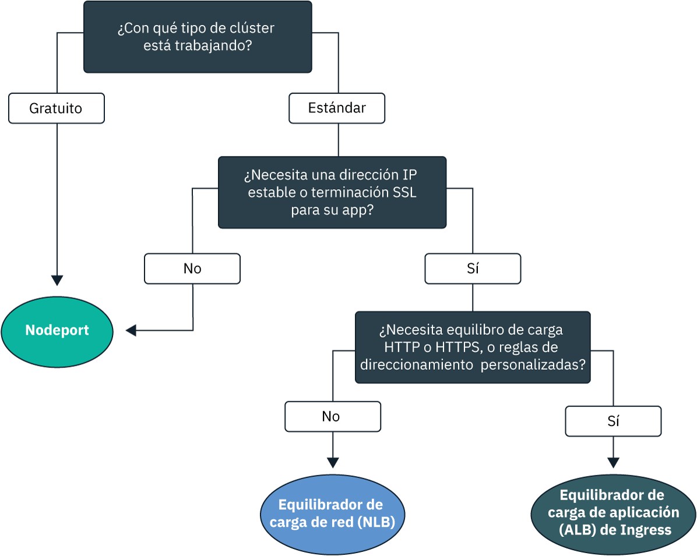
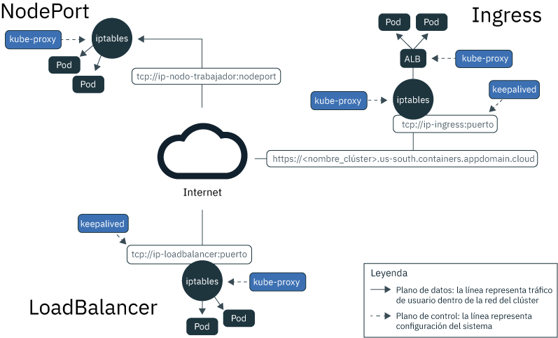

---

copyright:
  years: 2014, 2019
lastupdated: "2019-06-05"

keywords: kubernetes, iks

subcollection: containers

---

{:new_window: target="_blank"}
{:shortdesc: .shortdesc}
{:screen: .screen}
{:pre: .pre}
{:table: .aria-labeledby="caption"}
{:codeblock: .codeblock}
{:tip: .tip}
{:note: .note}
{:important: .important}
{:deprecated: .deprecated}
{:download: .download}
{:preview: .preview}

# Planificación de redes internas y externas del clúster para las apps
{: #cs_network_planning}

Con {{site.data.keyword.containerlong}}, puede gestionar redes internas y externas del clúster haciendo que se pueda acceder a las apps de forma pública o privada.
{: shortdesc}

Para comenzar a trabajar rápidamente con las redes de apps, siga este árbol de decisiones y pulse en una opción para ver sus documentos de configuración.

<map name="networking_map" id="networking_map">
<area target="" href="/docs/containers?topic=containers-nodeport" alt="Servicio NodePort" coords="52,254,78,260,93,270,101,285,92,302,72,314,49,318,19,309,0,281,18,263" shape="poly">
<area target="" href="/docs/containers?topic=containers-loadbalancer" alt="Servicio de equilibrador de carga de red (NLB)" coords="288,405,324,414,348,434,350,455,327,471,295,477,246,471,222,446,237,417" shape="poly">
<area target="" href="/docs/containers?topic=containers-ingress" alt="Servicio de equilibrador de carga de aplicación (ALB) de Ingress" coords="532,405,568,410,593,427,600,448,582,468,554,477,508,476,467,463,454,441,474,419" shape="poly">
</map>

## Equilibrio de carga para apps mediante el descubrimiento de servicios de Kubernetes
{: #in-cluster}

El descubrimiento de servicios de Kubernetes proporciona apps con conexión de red utilizando servicios de red y un proxy de Kubernetes local.
{: shortdesc}

**Servicios** 
A todas las pods que se despliegan en un nodo trabajador se les asigna una dirección IP privada dentro del rango 172.30.0.0/16 y se direccionan únicamente entre nodos trabajadores. Para evitar conflictos, no utilice este rango de IP en ningún otro nodo que se vaya a comunicar con los nodos trabajadores. Los nodos trabajadores y los pods pueden comunicarse de forma segura a través de la red privada utilizando direcciones IP privadas. Sin embargo, cuando un pod se cuelga o cuando es necesario volver a crear un nodo trabajador, se signa una nueva dirección IP privada.

En lugar de intentar realizar un seguimiento de direcciones IP privadas cambiantes para las apps que deben ofrecer una alta disponibilidad, puede utilizar funciones integradas de descubrimiento de servicios de Kubernetes para exponer las apps como servicios. Un servicio de Kubernetes agrupa un conjunto de pods y proporciona una conexión de red a estos pods. El servicio selecciona los pods de destino a los que direcciona el tráfico a través de etiquetas.

Un servicio proporciona conectividad entre los pods de app y los demás servicios del clúster sin exponer la dirección IP privada real de cada pod. A los servicios se les asigna una dirección IP interna, la `clusterIP`, a la que solo se puede acceder dentro del clúster. Esta dirección IP está vinculada al servicio durante toda su vida útil y no cambia mientras existe el servicio.
* Clústeres más recientes: en los clústeres creados después de febrero de 2018 en la zona dal13 o después de octubre de 2017 en cualquier otra zona, a los servicios se les asigna una IP de las 65.000 dentro del rango 172.21.0.0/16.
* Clústeres más antiguos: en los clústeres creados antes de febrero de 2018 en la zona dal13 o antes de octubre de 2017 en cualquier otra zona, se asigna a los servicios una IP de las 254 dentro del rango 10.10.10.0/24. Si ha alcanzado el límite de 254 servicios y necesita más servicios, debe crear un nuevo clúster.

Para evitar conflictos, no utilice este rango de IP en ningún otro nodo que se vaya a comunicar con los nodos trabajadores. También se crea una entrada de búsqueda de DNS para el servicio y se almacena en el componente `kube-dns` del clúster. La entrada DNS contiene el nombre del servicio, el espacio de nombres en el que se ha creado el servicio y el enlace a la dirección IP asignada interna del clúster.

**`kube-proxy`** 
Para proporcionar equilibrio de carga básico de todo el tráfico de red TCP y UDP para servicios, se ejecuta un proxy de red de Kubernetes local, `kube-proxy`, como daemon en cada nodo trabajador del espacio de nombres `kube-system`. `kube-proxy` utiliza reglas de Iptables, una característica del kernel de Linux, para dirigir las solicitudes al pod detrás de un servicio de igual forma, independientemente de las direcciones IP de dentro del clúster de los pods' y del nodo trabajador donde se despliegan.

Por ejemplo, las apps de dentro del clúster pueden acceder a un pod detrás de un servicio de clúster utilizando la IP interna del clúster del servicio o enviando una solicitud al nombre del servicio. Cuando se utiliza el nombre del servicio, `kube-proxy` busca el nombre en el proveedor de DNS del clúster y direcciona la solicitud a la dirección IP interna del clúster del servicio.

Si utiliza un servicio que proporciona tanto una dirección IP de clúster interna como una dirección IP externa, los clientes que están fuera del clúster pueden enviar solicitudes a la dirección IP externa pública o privada del servicio. `kube-proxy` reenvía las solicitudes a la dirección IP del servicio en clúster y equilibra la carga entre los pods de la app que hay detrás del servicio.

En la imagen siguiente se muestra cómo Kubernetes reenvía el tráfico de red pública a través de `kube-proxy` y de los servicios NodePort, LoadBalancer o Ingress en {{site.data.keyword.containerlong_notm}}.

<figure>
 
 <figcaption>Cómo Kubernetes reenvía el tráfico de red pública a través de los servicios NodePort, LoadBalancer e Ingress en {{site.data.keyword.containerlong_notm}}</figcaption>
</figure>

 

## Tipos de servicio de Kubernetes
{: #external}

Kubernetes da soporte a cuatro tipos básicos de servicios de red: `ClusterIP`, `NodePort`, `LoadBalancer` e `Ingress`. Los servicios de `ClusterIP` hacen que sus apps sean accesibles internamente para permitir la comunicación entre los pods de su clúster. Los servicios de `NodePort`, `LoadBalancer` e `Ingress` hacen que las apps sean accesibles externamente desde el Internet público o desde una red privada.
{: shortdesc}

<dl>
<dt>[ClusterIP](https://kubernetes.io/docs/concepts/services-networking/service/#defining-a-service)</dt>
<dd>Sólo puede exponer apps como servicios de IP de clúster en la red privada. Un servicio `clusterIP` proporciona una dirección IP interna del clúster que es accesible por otros pods y servicios sólo dentro del clúster. No se crea ninguna dirección IP externa para la app. Para acceder a un pod detrás de un servicio de clúster, las otras apps del clúster pueden utilizar la dirección IP interna del clúster o enviar una solicitud utilizando el nombre del servicio. Cuando llega una solicitud al servicio, el servicio reenvía las solicitudes a los pods, independientemente de las direcciones IP internas de clúster de los pods y del nodo trabajador en el que estén desplegadas. Tenga en cuenta que si no especifica un `type` en el archivo de configuración YAML de un servicio, se crea el tipo `ClusterIP` de forma predeterminada.</dd>

<dt>[NodePort](/docs/containers?topic=containers-nodeport)</dt>
<dd>Cuando expone apps con un servicio NodePort, se asigna un NodePort dentro del rango 30000 - 32767 y una dirección IP de clúster interna al servicio. Para acceder al servicio desde fuera del clúster, se utiliza la dirección IP pública o privada de cualquier nodo trabajador y el NodePort con el formato <code>&lt;IP_address&gt;:&lt;nodeport&gt;</code>. No obstante, las direcciones IP públicas y privadas del nodo trabajador no son permanentes. Cuando un nodo trabajador se elimina o se vuelve a crear, se le asigna una nueva dirección IP pública. Los NodePorts son ideales para probar el acceso público o privado o para proporcionar acceso sólo por un breve período de tiempo.</dd>

<dt>[LoadBalancer (NLB)](/docs/containers?topic=containers-loadbalancer)</dt>
<dd>Cada clúster estándar se suministra con cuatro direcciones IP públicas portátiles y cuatro privadas portátiles que puede utilizar para crear un equilibrador de carga de red (NLB) TCP/UDP de capa 4 para la app. Puede personalizar el NLB exponiendo cualquier puerto que necesite la app. Las direcciones IP públicas y privadas portátiles que están asignadas al NLB son permanentes y no cambian cuando se vuelve a crear un nodo trabajador en el clúster. Puede crear un nombre de host para la app que registre las direcciones IP de NLB pública con una entrada de DNS. También puede habilitar los supervisores de comprobación de estado en las IP de NLB para cada nombre de host.</dd>

<dt>[Ingress (ALB)](/docs/containers?topic=containers-ingress)</dt>
<dd>Exponga varias apps en un clúster mediante la creación de un equilibrador de carga de aplicación (ALB) HTTP, HTTPS o TCP de capa 7. El ALB utiliza un punto de entrada único público o privado protegido y un subdominio de Ingress para direccionar las solicitudes entrantes a sus apps. Puede utilizar una ruta para exponer varias apps en el clúster como servicios. Ingress consta de tres componentes:<ul>
  <li>El recurso de Ingress define las reglas sobre cómo direccionar y equilibrar la carga de las solicitudes de entrada para una app.</li>
  <li>El ALB está a la escucha de solicitudes entrantes de servicio HTTP, HTTPS o TCP. Reenvía las solicitudes a través de los pods de las apps con base a las reglas que se definen en el recurso Ingress.</li>
  <li>El equilibrador de carga multizona (MZLB) gestiona todas las solicitudes de entrada a las apps y equilibra la carga de las solicitudes entre los ALB de diversas zonas. También habilita las comprobaciones de estado en la dirección IP de ALB en cada zona.</li></ul></dd>
</dl>

 
En la tabla siguiente se comparan las características de cada tipo de servicio de red.

|Características|ClusterIP|NodePort|LoadBalancer (NLB)|Ingress (ALB)|
|---------------|---------|--------|------------|-------|
|Clústeres gratuitos||| | |
|Clústeres estándares|||||
|Accesible externamente| ||||
|IP externa estable| | |||
|Nombre de host externo| | |||
|Terminación de SSL| | |||
|Equilibrio de carga HTTP(S)| | | ||
|Reglas de direccionamiento personalizadas| | | ||
|Varias apps por servicio| | | ||
{: caption="Características de los tipos de servicio de red de Kubernetes" caption-side="top"}

Para elegir un patrón de despliegue del equilibrio de carga basado en uno o más de estos servicios de red, consulte [Elección de un patrón de despliegue para el equilibrio de carga externo público](#pattern_public) o [Elección de un patrón de despliegue para el equilibrio de carga externo privado](#private_access).

 

## Planificación del equilibrio de carga externo público
{: #public_access}

Exponer públicamente una app del clúster en internet.
{: shortdesc}

Cuando crea un clúster de Kubernetes en {{site.data.keyword.containerlong_notm}}, puede conectar el clúster a una VLAN pública. La VLAN pública determina la dirección IP pública que se asigna a cada nodo trabajador, lo que proporciona a cada nodo trabajador una interfaz de red pública. Los servicios de red públicos se conectan a esta interfaz de red pública proporcionando a su app una dirección IP pública y, opcionalmente, un URL público. Cuando se expone públicamente una app, cualquiera que tenga la dirección IP pública del servicio o el URL que haya establecido para la app puede enviar una solicitud a la app. Por este motivo, exponga las menos apps posibles. Exponga una app al público sólo cuando esté preparado para aceptar tráfico procedente de clientes o usuarios web externos.

La interfaz de red pública de los nodos trabajadores está protegida por [valores predefinidos de política de red de Calico](/docs/containers?topic=containers-network_policies#default_policy) que se configuran en cada nodo trabajador durante la creación del clúster. De forma predeterminada, todo el tráfico de red de salida está permitido para todos los nodos trabajadores. El tráfico de red de entrada está bloqueado, excepto en algunos puertos. Estos puertos están abiertos para que IBM pueda supervisar el tráfico de red e instalar automáticamente actualizaciones de seguridad para el maestro de Kubernetes, de modo que se puedan establecer conexiones con los servicios NodePort, LoadBalancer e Ingress. Para obtener más información sobre estas políticas, incluido cómo modificarlas, consulte [Políticas de red](/docs/containers?topic=containers-network_policies#network_policies).

Para hacer que una app esté disponible públicamente en internet, elija un patrón de despliegue de equilibrio de carga para la app para crear un servicio público de NodePort, LoadBalancer o Ingress.

### Elegir un patrón de despliegue para el equilibrio de carga externo público
{: #pattern_public}

En el momento de exponer una app con un servicio de red, dispone de distintas opciones de patrones de despliegue. Para empezar rápidamente, siga el árbol de decisiones para elegir un patrón de despliegue. Para obtener más información sobre cada patrón de despliegue, por qué utilizarlo y cómo configurarlo, consulte la tabla que se muestra después del árbol de decisiones. Para obtener información básica acerca de los servicios de red que utilizan estos patrones de despliegue, consulte [Tipos de servicio de Kubernetes](#external).
{: shortdesc}

<figure>
  
  <figcaption>Utilice este árbol de decisiones para elegir el mejor patrón de despliegue de red para su app. Consulte la tabla siguiente para obtener información sobre cada patrón de despliegue </figcaption>
</figure>

<table summary="En esta tabla se muestra, de izquierda a derecha el nombre, las características, casos de uso y pasos para el despliegue de patrones de despliegue de red pública.">
<caption>Características de los patrones de despliegue de red pública en el servicio Kubernetes de IBM Cloud</caption>
<col width="10%">
<col width="25%">
<col width="25%">
<thead>
<th>Nombre</th>
<th>Método de equilibrio de carga</th>
<th>Caso de uso</th>
<th>Implementación</th>
</thead>
<tbody>
<tr>
<td>NodePort</td>
<td>Puerto en un nodo trabajador que expone la app en la dirección IP pública del trabajador</td>
<td>Probar el acceso público a una app o proporcionar acceso solo durante un breve período de tiempo.</td>
<td>[Crear un servicio NodePort público](/docs/containers?topic=containers-nodeport#nodeport_config).</td>
</tr><tr>
<td>NLB v1.0 (+ nombre de host)</td>
<td>Equilibrio de carga básico que expone la app con una dirección IP o un nombre de host</td>
<td>Exponer rápidamente una app al público con una dirección IP o un nombre de host que admita terminación SSL.</td>
<td><ol><li>Crear un equilibrador de carga de red pública (NLB) 1.0 en un clúster [de una sola zona](/docs/containers?topic=containers-loadbalancer#lb_config) o [multizona](/docs/containers?topic=containers-loadbalancer#multi_zone_config).</li><li>Opcionalmente, [registrar](/docs/containers?topic=containers-loadbalancer#loadbalancer_hostname) un nombre de host y comprobaciones de estado.</li></ol></td>
</tr><tr>
<td>NLB v2.0 (+ nombre de host)</td>
<td>Equilibrio de carga de DSR que expone la app con una dirección IP o un nombre de host</td>
<td>Exponer una app que pueda recibir altos niveles de tráfico al público con una dirección IP o un nombre de host que admita terminación SSL.</td>
<td><ol><li>Completar los [requisitos previos](/docs/containers?topic=containers-loadbalancer#ipvs_provision).</li><li>Crear un NLB 2.0 público en un clúster [de una sola zona](/docs/containers?topic=containers-loadbalancer#ipvs_single_zone_config) o [multizona](/docs/containers?topic=containers-loadbalancer#ipvs_multi_zone_config).</li><li>Opcionalmente, [registrar](/docs/containers?topic=containers-loadbalancer#loadbalancer_hostname) un nombre de host y comprobaciones de estado.</li></ol></td>
</tr><tr>
<td>Istio + nombre de host NLB</td>
<td>Equilibrio de carga básico que expone la app con un nombre de host y utiliza reglas de direccionamiento de Istio</td>
<td>Implementar reglas postdireccionamiento de Istio, como por ejemplo reglas para versiones distintas de un microservicio de app y exponer una app gestionada por Istio con un nombre de host público.</li></ol></td>
<td><ol><li>Instalar el [complemento gestionado de Istio](/docs/containers?topic=containers-istio#istio_install).</li><li>Incluir la app en el [red de servicios de Istio](/docs/containers?topic=containers-istio#istio_sidecar).</li><li>Registrar el equilibrador de carga de Istio predeterminado con [un nombre de host](/docs/containers?topic=containers-istio#istio_expose_link).</li></ol></td>
</tr><tr>
<td>ALB de Ingress</td>
<td>Equilibrio de carga HTTPS que expone la app con un nombre de host y utiliza reglas de direccionamiento personalizadas</td>
<td>Implementar reglas de direccionamiento personalizadas y terminación de SSL para varias apps.</td>
<td><ol><li>Crear un [servicio de Ingress](/docs/containers?topic=containers-ingress#ingress_expose_public) para el ALB público.</li><li>Personalizar las reglas de direccionamiento de ALB con [anotaciones](/docs/containers?topic=containers-ingress_annotation).</li></ol></td>
</tr><tr>
<td>Traiga su propio controlador de Ingress + nombre de host ALB</td>
<td>Equilibrio de carga HTTPS con un controlador de Ingress personalizado que expone la app con el nombre de host de ALB proporcionado por IBM y utiliza reglas de direccionamiento personalizadas</td>
<td>Implementar reglas de direccionamiento personalizadas u otros requisitos específicos para el ajuste personalizado para varias apps.</td>
<td>[Desplegar el controlador de Ingress y optimizar el nombre de host de ALB proporcionado por IBM](/docs/containers?topic=containers-ingress#user_managed).</td>
</tr>
</tbody>
</table>

¿Desea todavía más información sobre los patrones de despliegue de equilibrio de carga disponibles en {{site.data.keyword.containerlong_notm}}? Consulte esta [publicación del blog ](https://www.ibm.com/blogs/bluemix/2018/10/ibm-cloud-kubernetes-service-deployment-patterns-for-maximizing-throughput-and-availability/).
{: tip}

 

## Planificación del equilibrio de carga externo privado
{: #private_access}

Exponer de forma privada una app del clúster solo en la red privada.
{: shortdesc}

Al desplegar una app en un clúster de Kubernetes en {{site.data.keyword.containerlong_notm}}, puede que desee que la app sea accesible sólo para usuarios y servicios que se encuentren en la misma red privada que el clúster. El equilibrio de carga privado es ideal para hacer que la app esté disponible para las solicitudes desde fuera del clúster sin exponer la app al público en general. También puede utilizar el equilibrio de carga privado para probar el acceso, el direccionamiento de solicitudes y otras configuraciones para la app antes de exponer su app al público con los servicios de red públicos.

Como ejemplo, supongamos que ha creado un NLB privado para la app. A este NLB privado se puede acceder mediante:
* Cualquier pod en ese mismo clúster.
* Cualquier pod en cualquier clúster de la misma cuenta de {{site.data.keyword.Bluemix_notm}}.
* Si tiene habilitado [VRF o la distribución de VLAN](/docs/containers?topic=containers-subnets#basics_segmentation), cualquier sistema que esté conectado a cualquiera de las VLAN privadas de la misma cuenta de {{site.data.keyword.Bluemix_notm}}.
* Si no está en la cuenta de {{site.data.keyword.Bluemix_notm}} sino todavía detrás del cortafuegos de la empresa, cualquier sistema a través de una conexión VPN a la subred donde se encuentra la IP del NLB.
* Si está en una cuenta de {{site.data.keyword.Bluemix_notm}} distinta, cualquier sistema a través de una conexión VPN a la subred donde se encuentra la IP del NLB.

Para hacer que una app esté disponible sólo a través de una red privada, elija un patrón de despliegue de equilibrio de carga en base a la configuración de VLAN del clúster:
* [Configuración de VLAN pública y privada](#private_both_vlans)
* [Configuración de VLAN sólo privada](#plan_private_vlan)

### Configuración del equilibrio de carga privado en una configuración de VLAN pública y privada
{: #private_both_vlans}

Cuando los nodos trabajadores están conectados tanto a una VLAN pública como a una privada, puede hacer que solo se pueda acceder a la app desde una red privada, creando los servicios privados NodePort, LoadBalancer o Ingress. A continuación, puede crear políticas de Calico para bloquear el tráfico público a los servicios.
{: shortdesc}

La interfaz de red pública de los nodos trabajadores está protegida por [valores predefinidos de política de red de Calico](/docs/containers?topic=containers-network_policies#default_policy) que se configuran en cada nodo trabajador durante la creación del clúster. De forma predeterminada, todo el tráfico de red de salida está permitido para todos los nodos trabajadores. El tráfico de red de entrada está bloqueado, excepto en algunos puertos. Estos puertos están abiertos para que IBM pueda supervisar el tráfico de red e instalar automáticamente actualizaciones de seguridad para el maestro de Kubernetes, de modo que se puedan establecer conexiones con los servicios NodePort, LoadBalancer e Ingress.

Puesto que las políticas predeterminadas de red de Calico permiten el tráfico público de entrada a estos servicios, puede crear políticas de Calico para bloquear todo el tráfico público a los servicios. Por ejemplo, un servicio NodePort abre un puerto en un nodo trabajador sobre la dirección IP privada y pública del nodo trabajador. Un servicio de NLB con una dirección IP privada portátil abre un NodePort público en cada nodo trabajador. Debe crear una [política de red preDNAT de Calico](/docs/containers?topic=containers-network_policies#block_ingress) para bloquear los NodePorts públicos.

Consulte los siguientes patrones de despliegue de equilibrio de carga para red privada:

|Nombre|Método de equilibrio de carga|Caso de uso|Implementación|
|----|---------------------|--------|--------------|
|NodePort|Puerto en un nodo trabajador que expone la app en la dirección IP privada del trabajador|Probar el acceso privado a una app o proporcionar acceso solo durante un breve período de tiempo.|<ol><li>[Crear un servicio NodePort](/docs/containers?topic=containers-nodeport).</li><li>Un servicio NodePort abre un puerto en un nodo trabajador sobre la dirección IP privada y pública del nodo trabajador. Debe utilizar una [política de red preDNAT de Calico](/docs/containers?topic=containers-network_policies#block_ingress) para bloquear el tráfico a los NodePorts públicos.</li></ol>|
|NLB v1.0|Equilibrio de carga básico que expone la app con una dirección IP privada|Exponer rápidamente una app a una red privada con una dirección IP privada.|<ol><li>[Crear un servicio de NLB privado](/docs/containers?topic=containers-loadbalancer).</li><li>Un NLB con una dirección IP privada portátil sigue teniendo un nodo público abierto en cada nodo trabajador. Crear una [política de red preDNAT de Calico](/docs/containers?topic=containers-network_policies#block_ingress) para bloquear el tráfico a los NodePorts públicos.</li></ol>|
|NLB v2.0|Equilibrio de carga de DSR que expone la app con una dirección IP privada|Exponer una app que pueda recibir altos niveles de tráfico a una red privada con una dirección IP.|<ol><li>[Crear un servicio de NLB privado](/docs/containers?topic=containers-loadbalancer).</li><li>Un NLB con una dirección IP privada portátil sigue teniendo un nodo público abierto en cada nodo trabajador. Crear una [política de red preDNAT de Calico](/docs/containers?topic=containers-network_policies#block_ingress) para bloquear el tráfico a los NodePorts públicos.</li></ol>|
|ALB de Ingress|Equilibrio de carga HTTPS que expone la app con un nombre de host y utiliza reglas de direccionamiento personalizadas|Implementar reglas de direccionamiento personalizadas y terminación de SSL para varias apps.|<ol><li>[Inhabilitar el ALB público.](/docs/containers?topic=containers-cli-plugin-kubernetes-service-cli#cs_alb_configure)</li><li>[Habilitar el ALB privado y crear un recurso Ingress](/docs/containers?topic=containers-ingress#ingress_expose_private).</li><li>Personalizar las reglas de direccionamiento de ALB con [anotaciones](/docs/containers?topic=containers-ingress_annotation).</li></ol>|
{: caption="Características de los patrones de despliegue de red para una configuración de VLAN pública y privada" caption-side="top"}

 

### Configuración de equilibrio de carga privado para una configuración de VLAN sólo privada
{: #plan_private_vlan}

Cuando los nodos trabajadores están conectados solo a una VLAN privada, puede hacer que solo se pueda acceder a la app externamente desde una red privada, creando los servicios privados NodePort, LoadBalancer o Ingress.
{: shortdesc}

Si el clúster solo está conectado a una VLAN privada y permite que los nodos maestro y trabajador se comuniquen a través de un punto final de servicio solo privado, no puede exponer automáticamente las apps a una red privada. Debe configurar un dispositivo de pasarela, como por ejemplo un [VRA (Vyatta)](/docs/infrastructure/virtual-router-appliance?topic=virtual-router-appliance-about-the-vra) o un [FSA](/docs/services/vmwaresolutions/services?topic=vmware-solutions-fsa_considerations), para que actúe como cortafuegos y bloquee o permita el tráfico. Puesto que los nodos trabajadores no están conectados a una VLAN pública, no se direcciona ningún tráfico público a los servicios NodePort, LoadBalancer o Ingress. Sin embargo, debe abrir los puertos y direcciones IP necesarios en el cortafuegos del dispositivo de pasarela para permitir el tráfico de entrada a estos servicios.

Consulte los siguientes patrones de despliegue de equilibrio de carga para red privada:

|Nombre|Método de equilibrio de carga|Caso de uso|Implementación|
|----|---------------------|--------|--------------|
|NodePort|Puerto en un nodo trabajador que expone la app en la dirección IP privada del trabajador|Probar el acceso privado a una app o proporcionar acceso solo durante un breve período de tiempo.|<ol><li>[Crear un servicio NodePort](/docs/containers?topic=containers-nodeport).</li><li>En el cortafuegos privado, abra el puerto que ha configurado cuando ha desplegado el servicio a las direcciones IP privadas para permitir el tráfico a todos los nodos trabajadores. Para encontrar el puerto, ejecute `kubectl get svc`. El puerto está en el rango 20000-32000.</li></ol>|
|NLB v1.0|Equilibrio de carga básico que expone la app con una dirección IP privada|Exponer rápidamente una app a una red privada con una dirección IP privada.|<ol><li>[Crear un servicio de NLB privado](/docs/containers?topic=containers-loadbalancer).</li><li>En el cortafuegos privado, abra el puerto que ha configurado cuando ha desplegado el servicio a la dirección IP privada del NLB.</li></ol>|
|NLB v2.0|Equilibrio de carga de DSR que expone la app con una dirección IP privada|Exponer una app que pueda recibir altos niveles de tráfico a una red privada con una dirección IP.|<ol><li>[Crear un servicio de NLB privado](/docs/containers?topic=containers-loadbalancer).</li><li>En el cortafuegos privado, abra el puerto que ha configurado cuando ha desplegado el servicio a la dirección IP privada del NLB.</li></ol>|
|ALB de Ingress|Equilibrio de carga HTTPS que expone la app con un nombre de host y utiliza reglas de direccionamiento personalizadas|Implementar reglas de direccionamiento personalizadas y terminación de SSL para varias apps.|<ol><li>Configurar un [servicio DNS que esté disponible en la red privada ](https://kubernetes.io/docs/tasks/administer-cluster/dns-custom-nameservers/).</li><li>[Habilitar el ALB privado y crear un recurso Ingress](/docs/containers?topic=containers-ingress#private_ingress).</li><li>En el cortafuegos privado, abra el puerto 80 para HTTP o el puerto 443 para HTTPS a la dirección IP correspondiente al ALB privado.</li><li>Personalizar las reglas de direccionamiento de ALB con [anotaciones](/docs/containers?topic=containers-ingress_annotation).</li></ol>|
{: caption="Características de los patrones de despliegue de red para una configuración de VLAN sólo privada" caption-side="top"}
