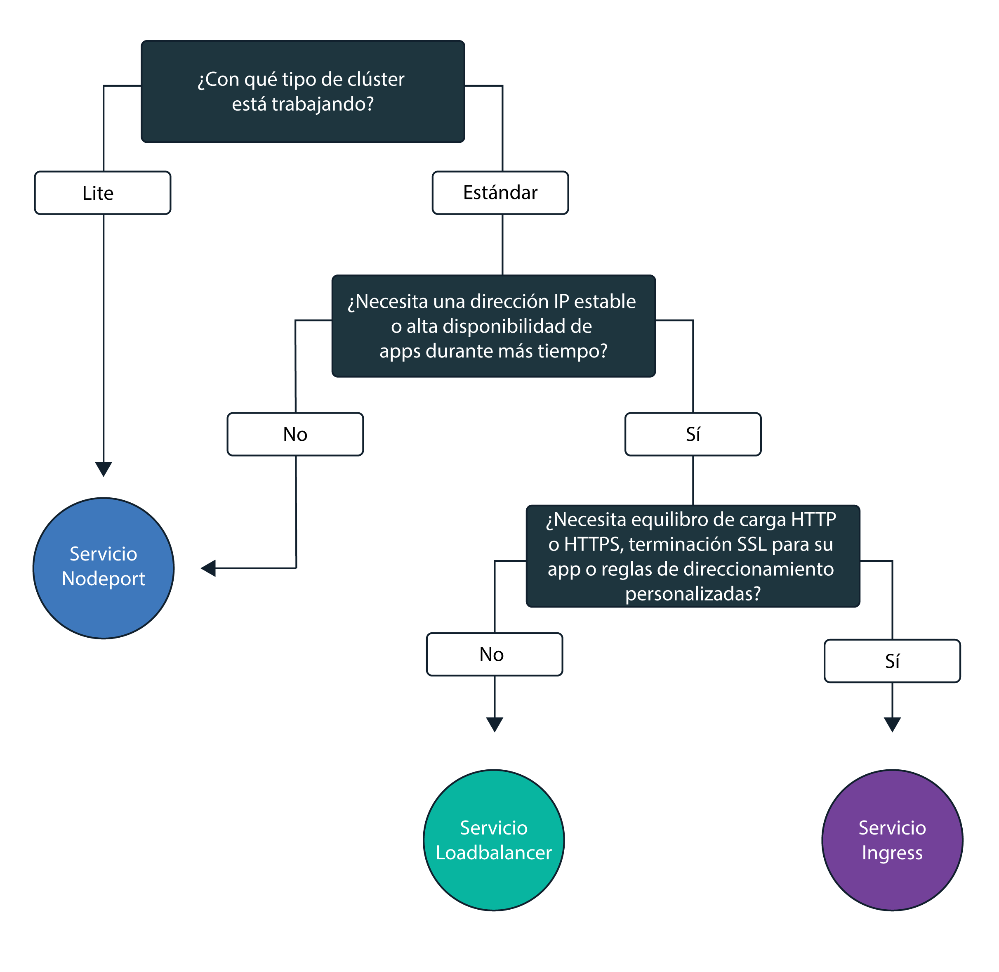
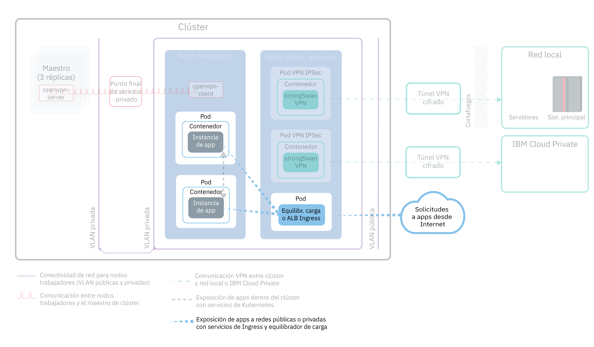
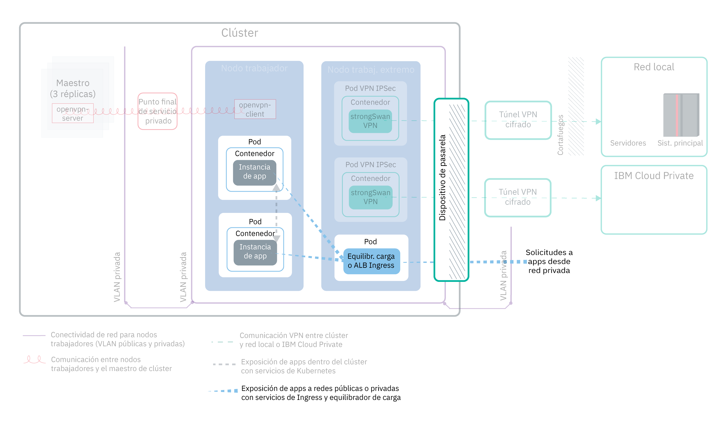

---

copyright:
  years: 2014, 2019
lastupdated: "2019-03-21"

keywords: kubernetes, iks

subcollection: containers

---

{:new_window: target="_blank"}
{:shortdesc: .shortdesc}
{:screen: .screen}
{:pre: .pre}
{:table: .aria-labeledby="caption"}
{:codeblock: .codeblock}
{:tip: .tip}
{:note: .note}
{:important: .important}
{:deprecated: .deprecated}
{:download: .download}

# Planificación de la exposición de apps con red interna y externa del clúster
{: #cs_network_planning}

Con {{site.data.keyword.containerlong}}, puede gestionar redes internas y externas del clúster haciendo que se pueda acceder a las apps de forma pública o privada.
{: shortdesc}

Esta página le ayuda a planificar la red interna y externa del para las apps. Para obtener información sobre cómo configurar la red del clúster, consulte [Configuración de la red del clúster](/docs/containers?topic=containers-cs_network_cluster).
{: tip}

## Exposición de apps al tráfico interno del clúster mediante servicios de Kubernetes
{: #in-cluster}

Cree servicios de descubrimiento de Kubernetes para permitir la comunicación entre los pods del clúster.
{: shortdesc}

<figure>
  <figcaption>Exposición de apps dentro del clúster con servicios de Kubernetes</figcaption>
</figure>

A todas las pods que se despliegan en un nodo trabajador se les asigna una dirección IP privada en el rango 172.30.0.0/16 y se direccionan únicamente entre nodos trabajadores. Para evitar conflictos, no utilice este rango de IP en ningún otro nodo que se vaya a comunicar con los nodos trabajadores. Los nodos trabajadores y los pods pueden comunicarse de forma segura a través de la red privada utilizando direcciones IP privadas. Sin embargo, cuando un pod se cuelga o cuando es necesario volver a crear un nodo trabajador, se signa una nueva dirección IP privada.

De forma predetermina, es difícil realizar un seguimiento de direcciones IP privadas que cambian para las apps que deben ofrecer una alta disponibilidad. En su lugar, puede utilizar las características incorporadas de descubrimiento de servicios de Kubernetes para exponer las apps como servicios IP del clúster en la red privada. Un servicio de Kubernetes agrupa un conjunto de pods y proporciona una conexión de red a estos pods. Esta conexión proporciona conectividad a otros servicios del clúster sin exponer la dirección IP privada real de cada pod. A los servicios se les asigna una dirección IP interna del clúster a la que solo se puede acceder dentro del clúster.
* Clústeres antiguos: en los clústeres creados antes de febrero de 2018 en la zona dal13 o antes de octubre de 2017 en cualquier otra zona, se asigna a los servicios una IP de entre las 254 IP del rango 10.10.10.0/24. Si ha alcanzado el límite de 254 servicios y necesita más servicios, debe crear un nuevo clúster.
* Clústeres nuevos: en los clústeres creados después de febrero de 2018 en la zona dal13 o después de octubre de 2017 en cualquier otra zona, a los servicios se les asigna una IP de entre una de las 65.000 IP del rango 172.21.0.0/16.

Para evitar conflictos, no utilice este rango de IP en ningún otro nodo que se vaya a comunicar con los nodos trabajadores. También se crea una entrada de búsqueda de DNS para el servicio y se almacena en el componente `kube-dns` del clúster. La entrada DNS contiene el nombre del servicio, el espacio de nombres en el que se ha creado el servicio y el enlace a la dirección IP asignada interna del clúster.

Para acceder a un pod detrás de un servicio de clúster, la app puede utilizar la dirección IP interna del clúster o puede enviar una solicitud utilizando el nombre del servicio. Cuando se utiliza el nombre del servicio, el nombre se busca en el componente `kube-dns`
y se direcciona a la dirección IP del clúster del servicio. Cuando llega una solicitud al servicio, el servicio reenvía las solicitudes a los pods, independientemente de las direcciones IP internas de clúster de los pods y del nodo trabajador en el que estén desplegadas.

 

## Elección de un servicio NodePort, LoadBalancer o Ingress para exponer apps al tráfico externo al clúster
{: #external}

Para permitir que se pueda acceder a las apps externamente desde internet público o desde una red privada, {{site.data.keyword.containerlong_notm}} da soporte a tres servicios de red.
{:shortdesc}

**[Servicio NodePort](/docs/containers?topic=containers-nodeport)** (clústeres gratuitos y estándares)
* Exponga un puerto en cada nodo trabajador y utilice la dirección IP pública o privada de cualquier nodo trabajador para acceder al servicio en el clúster.
* Iptables es una característica de kernel de Linux que equilibra la carga de las solicitudes en los pods de la app y proporciona un direccionamiento de red de alto rendimiento y control de acceso de red.
* Las direcciones IP públicas y privadas del nodo trabajador no son permanentes. Cuando un nodo trabajador se elimina o se vuelve a crear, se le asigna una nueva dirección IP pública.
* El servicio NodePort es una muy buena opción para probar el acceso público o privado. También se puede utilizar si se necesita acceso público o privado solo durante un breve periodo de tiempo.

**[Servicio LoadBalancer](/docs/containers?topic=containers-loadbalancer)** (solo clústeres estándares)
* Cada clúster estándar se suministra con cuatro direcciones IP públicas portátiles y cuatro direcciones IP privadas portátiles que puede utilizar para crear un equilibrador de carga TCP/UDP externo para la app. Puede personalizar el equilibrador de carga exponiendo cualquier puerto que necesite la app.
* Iptables es una característica de kernel de Linux que equilibra la carga de las solicitudes en los pods de la app y proporciona un direccionamiento de red de alto rendimiento y control de acceso de red.
* Las direcciones IP públicas y privadas portátiles que están asignadas al equilibrador de carga son permanentes y no cambian cuando se vuelve a crear un nodo trabajador en el clúster.
* Puede crear un nombre de host para la app que registre las direcciones IP del equilibrador de carga público con una entrada de DNS. También puede habilitar los supervisores de comprobación de estado en las IP del equilibrador de carga para cada nombre de host.

**[Ingress](/docs/containers?topic=containers-ingress)** (solo clústeres estándares)
* Exponga varias apps en un clúster mediante la creación de un equilibrador de carga de aplicación (ALB) HTTP, HTTPS o TCP. El ALB utiliza un punto de entrada único público o privado protegido y un subdominio de Ingress para direccionar las solicitudes entrantes a sus apps.
* Puede utilizar una ruta para exponer varias apps en el clúster como servicios.
* Ingress consta de tres componentes:
  * El recurso de Ingress define las reglas sobre cómo direccionar y equilibrar la carga de las solicitudes de entrada para una app.
  * El ALB está a la escucha de solicitudes entrantes de servicio HTTP, HTTPS o TCP. Reenvía las solicitudes a través de los pods de las apps con base a las reglas que se definen en el recurso Ingress.
  * El equilibrador de carga multizona (MZLB) gestiona todas las solicitudes de entrada a las apps y equilibra la carga de las solicitudes entre los ALB de diversas zonas. También habilita las comprobaciones de estado en la dirección IP de ALB en cada zona.
* Utilice Ingress si tiene que implementar su propio ALB con reglas de direccionamiento personalizadas y con terminación SSL si es necesario para sus apps.

Para elegir el mejor servicio de red para la app, puede seguir este árbol de decisiones y pulsar una de las opciones para empezar.

<map name="networking_map" id="networking_map">
<area href="/docs/containers?topic=containers-nodeport" alt="Servicio NodePort" shape="circle" coords="52, 283, 45"/>
<area href="/docs/containers?topic=containers-loadbalancer" alt="servicio LoadBalancer" shape="circle" coords="247, 419, 44"/>
<area href="/docs/containers?topic=containers-ingress" alt="Servicio Ingress" shape="circle" coords="445, 420, 45"/>
</map>

¿Desea obtener más información sobre los patrones de despliegue de equilibrio de carga que están disponibles en {{site.data.keyword.containerlong_notm}}? Consulte esta [publicación del blog ](https://www.ibm.com/blogs/bluemix/2018/10/ibm-cloud-kubernetes-service-deployment-patterns-for-maximizing-throughput-and-availability/).
{: tip}

 

## Planificación del sistema de red externo público para una configuración de VLAN pública y privada
{: #public_access}

Cuando crea un clúster de Kubernetes en {{site.data.keyword.containerlong_notm}}, puede conectar el clúster a una VLAN pública. La VLAN pública determina la dirección IP pública que se asigna a cada nodo trabajador, lo que proporciona a cada nodo trabajador una interfaz de red pública.
{:shortdesc}

<figure>
  <figcaption>Exposición de apps a una red pública en una configuración de red predeterminada</figcaption> </figure>

La interfaz de red pública de los nodos trabajadores está protegida por [valores predefinidos de política de red de Calico](/docs/containers?topic=containers-network_policies#default_policy) que se configuran en cada nodo trabajador durante la creación del clúster.

De forma predeterminada, todo el tráfico de red de salida está permitido para todos los nodos trabajadores. El tráfico de red de entrada está bloqueado, excepto en algunos puertos. Estos puertos están abiertos para que IBM pueda supervisar el tráfico de red e instalar automáticamente actualizaciones de seguridad para el maestro de Kubernetes, de modo que se puedan establecer conexiones con los servicios NodePort, LoadBalancer e Ingress. Para obtener más información sobre estas políticas, incluido cómo modificarlas, consulte [Políticas de red](/docs/containers?topic=containers-network_policies#network_policies).

Para que una app esté disponible a nivel público en Internet, puede crear un servicio NodePort, LoadBalancer o Ingress. Para comparar cada servicio, consulte [Elección de un servicio NodePort, LoadBalancer o Ingress](#external).

En el diagrama se muestra cómo Kubernetes reenvía el tráfico de red pública en {{site.data.keyword.containerlong_notm}}.

 

## Planificación del sistema de red externo privado para una configuración de VLAN pública y privada
{: #private_both_vlans}

Cuando los nodos trabajadores están conectados tanto a una VLAN pública como a una privada, puede hacer que solo se pueda acceder a la app desde una red privada, creando los servicios privados NodePort, LoadBalancer o Ingress. A continuación, puede crear políticas de Calico para bloquear el tráfico público a los servicios.
{: shortdesc}

La interfaz de red pública de los nodos trabajadores está protegida por [valores predefinidos de política de red de Calico](/docs/containers?topic=containers-network_policies#default_policy) que se configuran en cada nodo trabajador durante la creación del clúster. De forma predeterminada, todo el tráfico de red de salida está permitido para todos los nodos trabajadores. El tráfico de red de entrada está bloqueado, excepto en algunos puertos. Estos puertos están abiertos para que IBM pueda supervisar el tráfico de red e instalar automáticamente actualizaciones de seguridad para el maestro de Kubernetes, de modo que se puedan establecer conexiones con los servicios NodePort, LoadBalancer e Ingress.

Si desea exponer sus apps sólo a través de una red privada, puede crear servicios de NodePort, LoadBalancer o Ingress privados.

**NodePort**
* [Cree un servicio NodePort](/docs/containers?topic=containers-nodeport). Además de la dirección IP pública, está disponible un servicio NodePort en la dirección IP privada de un nodo trabajador.
* Un servicio NodePort abre un puerto en un nodo trabajador sobre la dirección IP privada y pública del nodo trabajador. Debe utilizar una [política de red de Calico](/docs/containers?topic=containers-network_policies#block_ingress) para bloquear los NodePorts públicos.

**LoadBalancer**
* [Cree un servicio LoadBalancer privado](/docs/containers?topic=containers-loadbalancer).
* Un servicio de equilibrador de carga con una dirección IP privada portátil sigue teniendo un nodo público abierto en cada nodo trabajador. Debe utilizar una [política de red preDNAT de Calico](/docs/containers?topic=containers-network_policies#block_ingress) para bloquear los puertos del nodo público que contiene.

**Ingress**
* Cuando se crea un clúster, se crea automáticamente un equilibrador de carga de aplicación (ALB) Ingress privado. Puesto que el ALB público está habilitado y el ALB privado está inhabilitado de forma predeterminada, debe [inhabilitar el ALB público](/docs/containers?topic=containers-cs_cli_reference#cs_alb_configure) y [habilitar el ALB privado](/docs/containers?topic=containers-ingress#private_ingress).
* A continuación, [cree un servicio Ingress privado](/docs/containers?topic=containers-ingress#ingress_expose_private).

Puesto que las políticas predeterminadas de red de Calico permiten el tráfico público de entrada a estos servicios, puede crear políticas de Calico para bloquear todo el tráfico público a los servicios. Por ejemplo, un servicio NodePort abre un puerto en un nodo trabajador sobre la dirección IP privada y pública del nodo trabajador. Un servicio de equilibrador de carga con una dirección IP privada portátil abre un NodePort público en cada nodo trabajador. Debe crear una [política de red preDNAT de Calico](/docs/containers?topic=containers-network_policies#block_ingress) para bloquear los NodePorts públicos.

Como ejemplo, supongamos que ha creado un servicio de equilibrador de carga privado. También ha creado una política de preDNAT de Calico para evitar que el tráfico público llegue a los NodePorts públicos abiertos por el equilibrador de carga. A este equilibrador de carga privado se puede acceder mediante:
* Cualquier pod en ese mismo clúster
* Cualquier pod en cualquier clúster de la misma cuenta de {{site.data.keyword.Bluemix_notm}}
* Si tiene la [expansión de VLAN habilitada](/docs/containers?topic=containers-subnets#subnet-routing), cualquier sistema que esté conectado a cualquiera de las VLAN privadas en la misma cuenta de {{site.data.keyword.Bluemix_notm}}
* Si no está en la cuenta de {{site.data.keyword.Bluemix_notm}} pero sí detrás del cortafuegos de la empresa, cualquier sistema a través de una conexión VPN con la subred en la que se encuentra la IP del equilibrador de carga
* Si está en una cuenta de {{site.data.keyword.Bluemix_notm}} distinta, cualquier sistema a través de una conexión VPN con la subred en la que se encuentra la IP del equilibrador de carga.

 

## Planificación del sistema de red externo privado para una configuración solo de VLAN privada
{: #plan_private_vlan}

Cuando los nodos trabajadores están conectados únicamente a una VLAN privada y permite que los nodos maestro y trabajador se comuniquen a través de [un dispositivo de pasarela](/docs/containers?topic=containers-cs_network_ov#cs_network_ov_master_gateway), puede hacer que se pueda acceder a la app solo desde una red privada creando los servicios privados NodePort, LoadBalancer o Ingress.
{: shortdesc}

<figure>
  <figcaption>Exposición de apps a una red privada en una configuración de red privada</figcaption> </figure>

Puesto que los nodos trabajadores no están conectados a una VLAN pública, no se direcciona ningún tráfico público a estos servicios. También debe [abrir las direcciones IP y los puertos necesarios](/docs/containers?topic=containers-firewall#firewall_inbound) en el cortafuegos del dispositivo de pasarela para permitir el tráfico de entrada a estos servicios.

**NodePort**:
* [Cree un servicio NodePort privado](/docs/containers?topic=containers-nodeport). El servicio está disponible sobre la dirección IP privada de un nodo trabajador.
* En el cortafuegos privado, abra el puerto que ha configurado cuando ha desplegado el servicio a las direcciones IP privadas para permitir el tráfico a todos los nodos trabajadores. Para encontrar el puerto, ejecute `kubectl get svc`. El puerto está en el rango 20000-32000.

**LoadBalancer**
* [Cree un servicio LoadBalancer privado](/docs/containers?topic=containers-loadbalancer). Si el clúster solo está disponible en una VLAN privada, se utiliza una de las cuatro direcciones IP privadas portátiles disponibles.
* En el cortafuegos privado, abra el puerto que ha configurado cuando ha desplegado el servicio a la dirección IP privada del servicio de equilibrador de carga.

**Ingress**:
* Debe configurar un [servicio DNS que esté disponible en la red privada ](https://kubernetes.io/docs/tasks/administer-cluster/dns-custom-nameservers/).
* Cuando crea un clúster, se crea automáticamente un equilibrador de carga de aplicación (ALB) Ingress privado, pero no se habilita de forma predeterminada. Debe [habilitar el ALB privado](/docs/containers?topic=containers-ingress#private_ingress).
* A continuación, [cree un servicio Ingress privado](/docs/containers?topic=containers-ingress#ingress_expose_private).
* En el cortafuegos privado, abra el puerto 80 para HTTP o el puerto 443 para HTTPS a la dirección IP correspondiente al ALB privado.

Si el clúster solo está conectado a una VLAN privada y permite que los nodos maestro y trabajador se comuniquen a través de un punto final de servicio solo privado, no puede exponer las apps a una red privada. Debe configurar un dispositivo de pasarela, como por ejemplo un [VRA](/docs/infrastructure/virtual-router-appliance?topic=virtual-router-appliance-about-the-vra) o un [FSA](/docs/services/vmwaresolutions/services?topic=vmware-solutions-fsa_considerations), para que actúe como cortafuegos y bloquee el tráfico no deseado. Si no desea configurar un dispositivo de pasarela, puede [crear una agrupación de nodos trabajadores](/docs/containers?topic=containers-clusters#add_pool) que esté conectada a las VLAN pública y privada. A continuación, puede etiquetar estos nodos trabajadores como nodos de extremo y utilizar políticas de Calico para bloquear todo el tráfico público no deseado. Para obtener más información, consulte [Aislamiento de cargas de trabajo de red en nodos trabajadores de extremo](/docs/containers?topic=containers-cs_network_planning#both_vlans_private_edge).
{: note}

 

## Opcional: Aislamiento de las cargas de trabajo de red en nodos trabajadores de extremo
{: #both_vlans_private_edge}

Los nodos trabajadores de extremo pueden mejorar la seguridad de su clúster al permitir el acceso externo a un número inferior de nodos trabajadores y aislar la carga de trabajo en red. Para asegurarse de que Ingress y los pods de equilibrador de carga se despliegan solo en los nodos trabajadores especificados, [etiquete los nodos trabajadores como nodos de extremo](/docs/containers?topic=containers-edge#edge_nodes). Para evitar también que se ejecuten otras cargas de trabajo en los nodos de extremo, [marque los nodos de extremo](/docs/containers?topic=containers-edge#edge_workloads).
{: shortdesc}

Si el clúster está conectado a una VLAN pública pero desea bloquear el tráfico a los NodePorts públicos en los nodos trabajadores de extremo, también puede utilizar una [política de red preDNAT de Calico](/docs/containers?topic=containers-network_policies#block_ingress). El bloqueo de los puertos de los nodos garantiza que los nodos trabajadores de extremo sean los únicos nodos trabajadores que manejen el tráfico entrante.

## Opcional: Aislamiento del clúster en la red privada
{: #isolate}

Si tiene un clúster multizona, varias VLAN para un clúster de una sola zona o varias subredes en la misma VLAN, debe [habilitar la expansión de VLAN](/docs/infrastructure/vlans?topic=vlans-vlan-spanning#vlan-spanning) o [VRF](/docs/infrastructure/direct-link?topic=direct-link-overview-of-virtual-routing-and-forwarding-vrf-on-ibm-cloud#customer-vrf-overview)
para que los nodos trabajadores puedan comunicarse entre sí en la red privada. Sin embargo, cuando la expansión de VLAN o VRF están habilitados, cualquier sistema que esté conectado a cualquiera de las VLAN privadas en la misma cuenta de IBM Cloud puede acceder a los trabajadores. Puede aislar el clúster multizona de otros sistemas de la red privada utilizando [Políticas de red de Calico](/docs/containers?topic=containers-network_policies#isolate_workers). Estas políticas también permiten la entrada y la salida de los rangos de IP y puertos privados que ha abierto en el cortafuegos privado.
{: shortdesc}
