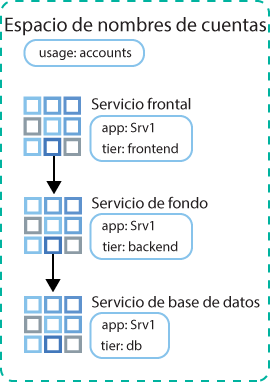
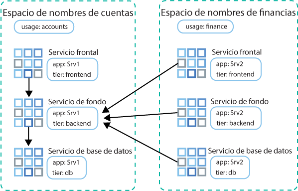

---

copyright:
  years: 2014, 2019
lastupdated: "2019-06-11"

keywords: kubernetes, iks

subcollection: containers

---

{:new_window: target="_blank"}
{:shortdesc: .shortdesc}
{:screen: .screen}
{:pre: .pre}
{:table: .aria-labeledby="caption"}
{:codeblock: .codeblock}
{:tip: .tip}
{:note: .note}
{:important: .important}
{:deprecated: .deprecated}
{:download: .download}
{:preview: .preview}


# Control del tráfico con políticas de red
{: #network_policies}

Cada clúster de Kubernetes está configurado con un plugin de red que se denomina Calico. Las políticas de red predeterminadas se configuran para proteger la interfaz de red pública de cada nodo trabajador en {{site.data.keyword.containerlong}}.
{: shortdesc}

Si tiene requisitos de seguridad exclusivos o si tiene un clúster multizona con distribución de VLAN habilitada, puede utilizar Calico y Kubernetes para crear políticas de red para un clúster. Con las políticas de red de Kubernetes, puede especificar el tráfico de red que desea permitir o bloquear de y desde un pod en un clúster. Para establecer políticas de red más avanzadas como, por ejemplo, para el bloqueo de tráfico entrante (ingress) para los servicios de equilibrador de carga de red (NLB), utilice políticas de red de Calico.

<ul>
  <li>
  [Políticas de red de Kubernetes ](https://kubernetes.io/docs/concepts/services-networking/network-policies/): Estas políticas especifican la forma en la que los pods se pueden comunicar con otros pods y con los puntos finales externos. A partir de Kubernetes versión 1.8, se puede permitir tanto el tráfico de red entrante como saliente con base al protocolo, el puerto y las direcciones IP de origen y destino. El tráfico también se puede filtrar basándose en las etiquetas de espacio de nombres y pod. Las políticas de red de Kubernetes se aplican mediante mandatos `kubectl` o con API de Kubernetes. Cuando se aplican estas políticas, se convierten de forma automática en políticas de red de Calico. Calico impone estas políticas.
  </li>
  <li>
  [Políticas de red de Calico ](https://docs.projectcalico.org/v3.3/getting-started/bare-metal/policy/): estas políticas constituyen un superconjunto de las políticas de red de
Kubernetes y se aplican mediante mandatos `calicoctl`. Las políticas de Calico añaden las características siguientes.
    <ul>
    <li>Permitir o bloquear el tráfico de red en las interfaces de red especificadas, independientemente del CIDR o dirección IP de origen o destino del pod Kubernetes.</li>
    <li>Permitir o bloquear el tráfico de red para pods entre espacios de nombres.</li>
    <li>[Bloquear el tráfico de entrada (ingress) a los servicios LoadBalancer o NodePort de Kubernetes](#block_ingress).</li>
    </ul>
  </li>
  </ul>

Calico impone estas políticas, incluidas las políticas de Kubernetes que se convierten automáticamente en políticas de Calico, configurando reglas iptables de Linux en los nodos trabajadores de Kubernetes. Las reglas iptables sirven como cortafuegos para el nodo trabajador para definir las características que debe cumplir el tráfico de red para que se reenvíe al recurso de destino.

Para utilizar los servicios de equilibrador de carga de red (NLB) y equilibrador de carga de aplicación (ALB) de Ingress, utilice las políticas Calico y Kubernetes para gestionar el tráfico de red dentro y fuera del clúster. No utilice [grupos de seguridad](/docs/infrastructure/security-groups?topic=security-groups-about-ibm-security-groups#about-ibm-security-groups) de la infraestructura de IBM Cloud (SoftLayer). Los grupos de seguridad de la infraestructura de IBM Cloud (SoftLayer) se aplican a la interfaz de red de un solo servidor virtual para filtrar el tráfico en el nivel de hipervisor. Sin embargo, los grupos de seguridad no dan soporte al protocolo VRRP, que {{site.data.keyword.containerlong_notm}} utiliza para gestionar las direcciones IP de ALB y NLB. Si no dispone del protocolo VRRP para gestionar la IP, los servicios de ALB y NLB no funcionan correctamente.
{: tip}

<br />


## Políticas de red de Kubernetes y Calico predeterminadas
{: #default_policy}

Cuando se crea un clúster con una VLAN pública, se crea de forma automática un recurso `HostEndpoint` con la etiqueta `ibm.role: worker_public` para cada nodo trabajador y su interfaz de red pública. Para proteger la interfaz de red pública de un nodo trabajador, las políticas predeterminadas de Calico se aplican a todos los puntos finales de host con la etiqueta `ibm.role: worker_public`.
{:shortdesc}

Las políticas predeterminadas de host de Calico permiten todo el tráfico de red saliente y permiten el tráfico entrante a componentes específicos del clúster como, por ejemplo, servicios de Ingress, LoadBalancer y NodePort de Kubernetes. Se bloquea el resto del tráfico de red entrante desde internet a los nodos trabajadores que no se especifica en las políticas predeterminadas. Las políticas predeterminadas no afectan al trafico entre pods.

Revise las siguientes políticas de host de Calico predeterminadas que se aplican automáticamente a su clúster.

No elimine las políticas que se aplican a un punto final de host a menos que conozca en profundidad la política. Asegúrese de que no necesita tráfico que la política está permitiendo.
{: important}

 <table summary="La primera fila de la tabla abarca ambas columnas. Lea el resto de las filas de izquierda a derecha, con la zona de servidor en la columna uno y direcciones IP para que coincidan en la columna dos.">
 <caption>Políticas predeterminadas de host de Calico para cada clúster</caption>
  <thead>
  <th colspan=2> Políticas predeterminadas de host de Calico para cada clúster</th>
  </thead>
  <tbody>
    <tr>
      <td><code>allow-all-outbound</code></td>
      <td>Permite todo el tráfico de salida.</td>
    </tr>
    <tr>
      <td><code>allow-bigfix-port</code></td>
      <td>Permite el tráfico entrante en el puerto 52311 a la app BigFix para permitir las actualizaciones necesarias del nodo trabajador.</td>
    </tr>
    <tr>
      <td><code>allow-icmp</code></td>
      <td>Permite paquetes ICMP de entrada (pings).</td>
     </tr>
    <tr>
      <td><code>allow-node-port-dnat</code></td>
      <td>Permite el tráfico de entrada de servicios de equilibrador de carga de red (NLB), de equilibrador de carga de aplicación (ALB) de Ingress y de NodePort a los pods que exponen dichos servicios. <strong>Nota</strong>: No necesita especificar los puertos expuestos porque Kubernetes utiliza DNAT (Destination Network Address Translation) para reenviar las solicitudes de servicio a los pods correctos. El reenvío se realiza antes de que se apliquen las políticas de punto final de host en Iptables.</td>
   </tr>
   <tr>
      <td><code>allow-sys-mgmt</code></td>
      <td>Permite conexiones entrantes para sistemas de infraestructura de IBM Cloud (SoftLayer) específicos que se utilizan para gestionar los nodos trabajadores.</td>
   </tr>
   <tr>
    <td><code>allow-vrrp</code></td>
    <td>Permite paquetes VRRP, que se utilizan para supervisar y mover direcciones IP virtuales entre los nodos trabajadores.</td>
   </tr>
  </tbody>
</table>

También se crea una política predeterminada de Kubernetes que limita el acceso al Panel de control de Kubernetes. Las políticas de Kubernetes no se aplican al punto final de host sino que, por el contrario, al pod `kube-dashboard`. Esta política se aplica a clústeres conectados únicamente a VLAN privadas y a clústeres conectados a una VLAN privada y pública.

<table>
<caption>Políticas predeterminadas de Kubernetes para cada clúster</caption>
<thead>
<th colspan=2> Políticas predeterminadas de Kubernetes para cada clúster</th>
</thead>
<tbody>
 <tr>
  <td><code>kubernetes-dashboard</code></td>
  <td>Proporcionado en el espacio de nombres <code>kube-system</code>: Bloquea el acceso de todos los pods al Panel de control de Kubernetes. Esta política no afecta el acceso al panel de control desde la consola de {{site.data.keyword.Bluemix_notm}} o utilizando <code>kubectl proxy</code>. Si un pod necesita acceder al panel de control, despliegue el pod en un espacio de nombres que tenga la etiqueta <code>kubernetes-dashboard-policy: allow</code>.</td>
 </tr>
</tbody>
</table>

<br />


## Instalación y configuración de la CLI de Calico
{: #cli_install}

Instale y configure la CLI de Calico para ver, gestionar y añadir políticas de Calico.
{:shortdesc}

1. [Inicie una sesión en su cuenta. Si procede, apunte al grupo de recursos adecuado. Establezca el contexto para el clúster.](/docs/containers?topic=containers-cs_cli_install#cs_cli_configure) Incluya las opciones `--admin` y `--network`
con el mandato `ibmcloud ks cluster-config`. `--admin` descarga las claves para acceder a su portafolio de infraestructura y ejecutar mandatos de Calico en los nodos trabajadores. `--network` descarga el archivo de configuración de Calico para ejecutar todos los mandatos de Calico.

  ```
  ibmcloud ks cluster-config --cluster <cluster_name_or_ID> --admin --network
  ```
  {: pre}

3. Para usuarios de OS X y Linux, siga los pasos siguientes:
    1. Cree el directorio `/etc/calico`.
        ```
        sudo mkdir /etc/calico
        ```
        {: pre}

    2. Mueva el archivo de configuración de Calico que ha descargado previamente al directorio.
        ```
        sudo mv /Users/<user>/.bluemix/plugins/container-service/clusters/<cluster_name>-admin/calicoctl.cfg /etc/calico
        ```
        {: pre}

4. [Descargue la CLI de Calico ](https://github.com/projectcalico/calicoctl/releases).

    Si está utilizando OS X, descargue la versión `-darwin-amd64`. Si utiliza Windows, instale la CLI de Calico en el mismo directorio que la CLI de {{site.data.keyword.Bluemix_notm}}. Esta configuración le ahorra algunos cambios en la vía de acceso a archivo cuando ejecute mandatos posteriormente. Asegúrese de guardar el archivo como `calicoctl.exe`.
    {: tip}

5. Para usuarios de OS X y Linux, siga los pasos siguientes:
    1. Mueva el archivo ejecutable al directorio _/usr/local/bin_.
        - Linux:

          ```
          mv filepath/calicoctl /usr/local/bin/calicoctl
          ```
          {: pre}

        - OS
X:

          ```
          mv filepath/calicoctl-darwin-amd64 /usr/local/bin/calicoctl
          ```
          {: pre}

    2. Convierta en ejecutable el archivo.

        ```
        chmod +x /usr/local/bin/calicoctl
        ```
        {: pre}

6. Si las políticas de red corporativas utilizan cortafuegos o proxies para impedir el acceso desde su sistema local a puntos finales públicos, [permita el acceso TCP a mandatos de Calico](/docs/containers?topic=containers-firewall#firewall).

7. Compruebe que la configuración de Calico funciona correctamente.

    - Linux y OS X:

      ```
      calicoctl get nodes
      ```
      {: pre}

    - Windows: Utilice el distintivo `--config` para apuntar al archivo de configuración de red que ha obtenido en el paso 1. Incluya este distintivo cada vez que ejecute un mandato `calicoctl`.

      ```
      calicoctl get nodes --config=filepath/calicoctl.cfg
      ```
      {: pre}

      Salida:

      ```
      NAME
              kube-dal10-crc21191ee3997497ca90c8173bbdaf560-w1.cloud.ibm
              kube-dal10-crc21191ee3997497ca90c8173bbdaf560-w2.cloud.ibm
              kube-dal10-crc21191ee3997497ca90c8173bbdaf560-w3.cloud.ibm
      ```
      {: screen}

<br />


## Visualización de políticas de red
{: #view_policies}

Consulte los detalles de políticas de red añadidas y predeterminadas que se aplican a su clúster.
{:shortdesc}

Antes de empezar:
1. [Instale y configure la CLI de Calico.](#cli_install)
2. [Inicie una sesión en su cuenta. Si procede, apunte al grupo de recursos adecuado. Establezca el contexto para el clúster.](/docs/containers?topic=containers-cs_cli_install#cs_cli_configure) Incluya las opciones `--admin` y `--network`
con el mandato `ibmcloud ks cluster-config`. `--admin` descarga las claves para acceder a su portafolio de infraestructura y ejecutar mandatos de Calico en los nodos trabajadores. `--network` descarga el archivo de configuración de Calico para ejecutar todos los mandatos de Calico.

  ```
  ibmcloud ks cluster-config --cluster <cluster_name_or_ID> --admin --network
  ```
  {: pre}

**Para ver las políticas de red de clústeres**:

Los usuarios de Linux y Mac no tienen que incluir el distintivo `--config=filepath/calicoctl.cfg` en los mandatos `calicoctl`.
{: tip}

1. Consultar el punto final del host de Calico.

    ```
    calicoctl get hostendpoint -o yaml --config=filepath/calicoctl.cfg
    ```
    {: pre}

2. Consultar todas las políticas de red de Calico y de Kubernetes que se han creado para el clúster. Esta lista incluye políticas que quizás no se apliquen todavía a ningún pod o host. Para que una política de red se pueda imponer, se debe encontrar un recurso de Kubernetes que coincida con el selector definido en la política de red de Calico.

    El objeto del ámbito de las [Políticas de red ](https://docs.projectcalico.org/v3.3/reference/calicoctl/resources/networkpolicy) son espacios de nombres específicos:
    ```
    calicoctl get NetworkPolicy --all-namespaces -o wide --config=filepath/calicoctl.cfg
    ```
    {:pre}

    El objeto del ámbito de las [Políticas de red globales ](https://docs.projectcalico.org/v3.3/reference/calicoctl/resources/globalnetworkpolicy) no son espacios de nombres específicos:
    ```
    calicoctl get GlobalNetworkPolicy -o wide --config=filepath/calicoctl.cfg
    ```
    {: pre}

3. Consultar los detalles correspondientes a una política de red.

    ```
    calicoctl get NetworkPolicy -o yaml <policy_name> --namespace <policy_namespace> --config=filepath/calicoctl.cfg
    ```
    {: pre}

4. Visualizar los detalles de todas las políticas de red globales del clúster.

    ```
    calicoctl get GlobalNetworkPolicy -o yaml --config=filepath/calicoctl.cfg
    ```
    {: pre}

<br />


## Adición de políticas de red
{: #adding_network_policies}

En la mayoría de los casos, no es necesario modificar las políticas predeterminadas. Sólo en escenarios avanzados se pueden requerir cambios. Si debe realizar cambios, cree sus propias políticas de red.
{:shortdesc}

Para crear políticas de red de Kubernetes, consulte la [Documentación de políticas de red de Kubernetes ](https://kubernetes.io/docs/concepts/services-networking/network-policies/).

Siga estos pasos para crear políticas de Calico.

1. [Instale y configure la CLI de Calico.](#cli_install)
2. [Inicie una sesión en su cuenta. Si procede, apunte al grupo de recursos adecuado. Establezca el contexto para el clúster.](/docs/containers?topic=containers-cs_cli_install#cs_cli_configure) Incluya las opciones `--admin` y `--network`
con el mandato `ibmcloud ks cluster-config`. `--admin` descarga las claves para acceder a su portafolio de infraestructura y ejecutar mandatos de Calico en los nodos trabajadores. `--network` descarga el archivo de configuración de Calico para ejecutar todos los mandatos de Calico.

  ```
  ibmcloud ks cluster-config --cluster <cluster_name_or_ID> --admin --network
  ```
  {: pre}

3. Defina su [política de red ](https://docs.projectcalico.org/v3.3/reference/calicoctl/resources/networkpolicy) o [política de red global ](https://docs.projectcalico.org/v3.3/reference/calicoctl/resources/globalnetworkpolicy) de Calico creando un script de configuración (`.yaml`) con sintaxis de política de Calico v3. Estos archivos de configuración incluyen los selectores que describen los pods, espacios de nombres o hosts a los que se aplican estas políticas. Consulte estas [políticas de Calico de ejemplo ](http://docs.projectcalico.org/v3.3/getting-started/kubernetes/tutorials/advanced-policy) como ayuda para crear la suya propia.

4. Aplique las políticas al clúster.
    - Linux y OS X:

      ```
      calicoctl apply -f policy.yaml
      ```
      {: pre}

    - Windows:

      ```
      calicoctl apply -f filepath/policy.yaml --config=filepath/calicoctl.cfg
      ```
      {: pre}

<br />


## Control del tráfico entrante a los servicios de NLB o NodePort
{: #block_ingress}

[De forma predeterminada](#default_policy), los servicios NodePort y LoadBalancer de Kubernetes están diseñados para hacer que las apps estén disponibles en las interfaces de clúster privadas y pública. Sin embargo, puede utilizar políticas de Calico para bloquear el tráfico de entrada a los servicios en función del origen o el destino del tráfico.
{:shortdesc}

Las políticas predeterminadas de Kubernetes y Calico son difíciles de aplicar para proteger los servicios NodePort y LoadBalancer de Kubernetes debido a las reglas Iptables de DNAT que se generan para estos servicios. Sin embargo, las políticas pre-DNAT impiden que el tráfico especificado llegue a sus apps porque generan y aplican reglas Iptables antes de que Kubernetes utilice DNAT normal para reenviar el tráfico a los pods.

Algunos usos comunes de las políticas de red pre-DNAT de Calico:

  - Bloquear el tráfico a puertos de nodo públicos de un servicio de equilibrador de carga de red (NLB) privado: un servicio de NLB hace que la app esté disponible en la dirección IP y el puerto del NLB y hace que la app está disponible en los puertos del nodo del servicio. Se puede acceder a los puertos de nodo en cada dirección IP (pública y privada) para cada nodo del clúster.
  - Bloquear el tráfico a los puertos de nodo públicos en clústeres que ejecutan [nodos trabajadores de extremo](/docs/containers?topic=containers-edge#edge): el bloqueo de los puertos de los nodos garantiza que los nodos trabajadores de extremo sean los únicos nodos trabajadores que manejen el tráfico entrante.
  - Bloquear el tráfico procedente de determinadas direcciones IP de origen o CIDR (lista negra)
  - Permitir solo el tráfico procedente de determinadas direcciones IP de origen o CIDR (lista blanca), y bloquear todo el otro tráfico

Para ver cómo colocar direcciones IP en una lista blanca o en una lista negra, consulte la [guía de aprendizaje sobre cómo utilizar políticas de red de Calico para bloquear el tráfico](/docs/containers?topic=containers-policy_tutorial#policy_tutorial). Para ver más ejemplos de políticas de red de Calico que controlan el tráfico procedente y destinado a su clúster, puede consultar la [demostración de política inicial ](https://docs.projectcalico.org/v3.3/getting-started/kubernetes/tutorials/stars-policy/) y la [política de red avanzada ](https://docs.projectcalico.org/v3.3/getting-started/kubernetes/tutorials/advanced-policy).
{: tip}

Antes de empezar:
1. [Instale y configure la CLI de Calico.](#cli_install)
2. [Inicie una sesión en su cuenta. Si procede, apunte al grupo de recursos adecuado. Establezca el contexto para el clúster.](/docs/containers?topic=containers-cs_cli_install#cs_cli_configure) Incluya las opciones `--admin` y `--network`
con el mandato `ibmcloud ks cluster-config`. `--admin` descarga las claves para acceder a su portafolio de infraestructura y ejecutar mandatos de Calico en los nodos trabajadores. `--network` descarga el archivo de configuración de Calico para ejecutar todos los mandatos de Calico.

  ```
  ibmcloud ks cluster-config --cluster <cluster_name_or_ID> --admin --network
  ```
  {: pre}

Para crear una política pre-DNAT:

1. Defina una política de red pre-DNAT de Calico para el acceso de ingress (tráfico entrante) a los servicios de Kubernetes.
    * Utilice la [sintaxis de política de Calico v3](https://docs.projectcalico.org/v3.3/reference/calicoctl/resources/networkpolicy).
    * Si gestiona el tráfico destinado a un [NLB 2.0](/docs/containers?topic=containers-loadbalancer#planning_ipvs), debe incluir los campos `applyOnForward: true` y `doNotTrack: true` en la sección `spec` de la política.

        Ejemplo de recurso que bloquea todos los puertos de nodo:

        ```
        apiVersion: projectcalico.org/v3
        kind: GlobalNetworkPolicy
        metadata:
          name: deny-nodeports
        spec:
          applyOnForward: true
          preDNAT: true
          ingress:
          - action: Deny
            destination:
              ports:
              - 30000:32767
            protocol: TCP
            source: {}
          - action: Deny
            destination:
              ports:
              - 30000:32767
        protocol: UDP
        source: {}
      selector: ibm.role=='worker_public'
      order: 1100
      types:
          - Ingress
        ```
        {: codeblock}

        Un recurso de ejemplo que coloca en la lista blanca solo el tráfico procedente de un CIDR de origen especificado a un NLB 2.0:

        ```
        apiVersion: projectcalico.org/v3
    kind: GlobalNetworkPolicy
    metadata:
      name: whitelist
    spec:
      applyOnForward: true
      doNotTrack: true
      ingress:
          - action: Allow
        destination:
          nets:
              - <loadbalancer_IP>/32
          ports:
              - 80
        protocol: TCP
        source:
          nets:
              - <client_address>/32
      selector: ibm.role=='worker_public'
      order: 500
      types:
          - Ingress
        ```
        {: codeblock}

        Un recurso de ejemplo que coloca en la lista blanca solo el tráfico procedente de un CIDR de origen especificado a un NLB 1.0:

        ```
        apiVersion: projectcalico.org/v3
        kind: GlobalNetworkPolicy
        metadata:
          name: whitelist
        spec:
          applyOnForward: true
          preDNAT: true
          ingress:
          - action: Allow
        destination:
          nets:
              - <loadbalancer_IP>/32
          ports:
              - 80
        protocol: TCP
        source:
          nets:
              - <client_address>/32
      selector: ibm.role=='worker_public'
      order: 500
      types:
          - Ingress
        ```
        {: codeblock}

2. Aplique la política de red preDNAT de Calico. La aplicación de los cambios en la política al clúster tarda alrededor de 1 minuto.

  - Linux y OS X:

    ```
    calicoctl apply -f deny-nodeports.yaml
    ```
    {: pre}

  - Windows:

    ```
    calicoctl apply -f filepath/deny-nodeports.yaml --config=filepath/calicoctl.cfg
    ```
    {: pre}

3. Opcional: en los clústeres multizona, un comprobador de estado de equilibrador de carga multizona (MZLB) comprueba los equilibradores de carga de aplicación (ALB) de Ingress de cada zona del clúster y mantiene actualizados los resultados de la búsqueda DNS en función de estas comprobaciones de estado. Si utiliza políticas pre-DNAT para bloquear todo el tráfico de entrada a los servicios Ingress, también debe colocar en la lista blanca las [IP IPv4 de Cloudflare ](https://www.cloudflare.com/ips/) que se utilizan para comprobar el estado de los ALB. Para ver los pasos a seguir para crear una política pre-DNAT de Calico para colocar estas IP en la lista blanca, consulte la Lección 3 de la [guía de aprendizaje de la política de red de Calico](/docs/containers?topic=containers-policy_tutorial#lesson3).

## Aislamiento del clúster en la red privada
{: #isolate_workers}

Si tiene un clúster multizona, varias VLAN para un clúster de una sola zona o varias subredes en la misma VLAN, debe habilitar la distribución de VLAN para que los nodos trabajadores puedan comunicarse entre sí en la red privada. Sin embargo, cuando se habilita la VRF o la distribución de VLAN, cualquier sistema que esté conectado a cualquiera de las VLAN privadas de la misma cuenta de {{site.data.keyword.Bluemix_notm}} se puede comunicar con los nodos trabajadores.
{: shortdesc}

Puede aislar el clúster de otros sistemas de la red privada aplicando [políticas de red privada de Calico ](https://github.com/IBM-Cloud/kube-samples/tree/master/calico-policies/private-network-isolation). Este conjunto de políticas de Calico y puntos finales de host aísla el tráfico de red privada de un clúster de otros recursos de la red privada de la cuenta.

Las políticas se dirigen a la interfaz privada de nodo trabajador (eth0) y a la red de pod de un clúster.

**Nodos trabajadores**

* La salida de interfaz privada solo se permite para las IP de pod, los nodos trabajadores de este clúster, y el puerto de UPD/TCP 53 para el acceso DNS, el puerto 2049 para la comunicación con servidores de archivos DNS y los puertos 443 y 3260 para la comunicación con el almacenamiento en bloque.
* La entrada de interfaz privada solo se permite desde los trabajadores del clúster y solo a DNS, kubelet, ICMP y VRRP.

**Pods**

* Toda la entrada a los pods se permite desde los trabajadores del clúster.
* La salida de los pods está restringida solo a IP públicas, DNS, kubelet y otros pods del clúster.

Antes de empezar:
1. [Instale y configure la CLI de Calico.](#cli_install)
2. [Inicie una sesión en su cuenta. Si procede, apunte al grupo de recursos adecuado. Establezca el contexto para el clúster.](/docs/containers?topic=containers-cs_cli_install#cs_cli_configure) Incluya las opciones `--admin` y `--network`
con el mandato `ibmcloud ks cluster-config`. `--admin` descarga las claves para acceder a su portafolio de infraestructura y ejecutar mandatos de Calico en los nodos trabajadores. `--network` descarga el archivo de configuración de Calico para ejecutar todos los mandatos de Calico.

  ```
  ibmcloud ks cluster-config --cluster <cluster_name_or_ID> --admin --network
  ```
  {: pre}

Para aislar el clúster en la red privada mediante políticas de Calico:

1. Clone el repositorio `IBM-Cloud/kube-samples`.
    ```
    git clone https://github.com/IBM-Cloud/kube-samples.git
    ```
    {: pre}

2. Vaya al directorio de política privada para la versión de Calico con la que es compatible la versión del clúster.
   ```
   cd <filepath>/IBM-Cloud/kube-samples/calico-policies/private-network-isolation/calico-v3
   ```
   {: pre}

3. Configure una política para el punto final de host privado.
    1. Abra la política `generic-privatehostendpoint.yaml`.
    2. Sustituya `<worker_name>` por el nombre de un nodo trabajador. **Importante**: algunos nodos trabajadores deben seguir una estructura de denominación distinta para las políticas de Calico. Debe utilizar el nombre de un nodo trabajador en el formato que devuelve el mandato siguiente.
      ```
      calicoctl get nodes --config==filepath/calicoctl.cfg
      ```
      {: pre}
    3. Sustituya `<worker-node-private-ip>` por la dirección IP privada para el nodo trabajador. Para ver las IP privadas de los nodos trabajadores, ejecute `ibmcloud ks workers --cluster <my_cluster>`.
    4. Repita este paso en una sección nueva para cada nodo trabajador del clúster. **Nota**: cada vez que añade un nodo trabajador a un clúster, debe actualizar el archivo de puntos finales de host con las nuevas entradas.

4. Aplique todas las políticas al clúster.
    - Linux y OS X:

      ```
      calicoctl apply -f allow-all-workers-private.yaml
      calicoctl apply -f allow-ibm-ports-private.yaml
      calicoctl apply -f allow-egress-pods.yaml
      calicoctl apply -f allow-icmp-private.yaml
      calicoctl apply -f allow-vrrp-private.yaml
      calicoctl apply -f generic-privatehostendpoint.yaml
      ```
      {: pre}

    - Windows:

      ```
      calicoctl apply -f allow-all-workers-private.yaml --config=filepath/calicoctl.cfg
      calicoctl apply -f allow-ibm-ports-private.yaml --config=filepath/calicoctl.cfg
      calicoctl apply -f allow-egress-pods.yaml --config=filepath/calicoctl.cfg
      calicoctl apply -f allow-icmp-private.yaml --config=filepath/calicoctl.cfg
      calicoctl apply -f allow-vrrp-private.yaml --config=filepath/calicoctl.cfg
      calicoctl apply -f generic-privatehostendpoint.yaml --config=filepath/calicoctl.cfg
      ```
      {: pre}

## Control del tráfico entre pods
{: #isolate_services}

Las políticas de Kubernetes protegen los pods frente al tráfico de red interno. Puede crear políticas de red de Kubernetes sencillas para aislar los microservicios de la app entre sí dentro de un espacio de nombres o entre espacios de nombres.
{: shortdesc}

Para obtener información sobre el modo en que las políticas de red de Kubernetes controlan el tráfico entre pods y para ver más políticas de ejemplo, consulte la [documentación de Kubernetes ](https://kubernetes.io/docs/concepts/services-networking/network-policies/).
{: tip}

### Aislamiento de los servicios de app dentro de un espacio de nombres
{: #services_one_ns}

En el caso de ejemplo siguiente se muestra cómo gestionar el tráfico entre los microservicios de una app dentro de un espacio de nombres.

Un equipo del departamento de cuentas despliega varios servicios de app en un espacio de nombres, pero necesitan aislamiento para permitir únicamente la comunicación necesaria entre los microservicios a través de la red pública. Para la app `Srv1`, el equipo tiene servicios frontal, de fondo y de base de datos. Etiquetan cada servicio con una etiqueta `app: Srv1` y con la etiqueta `tier: frontend`, `tier: backend` o `tier: db`.



El equipo del departamento de cuentas desea permitir el tráfico procedente de un programa frontal y destinado al programa de fondo, y desde el programa de fondo a la base de datos. Utilizan etiquetas en sus políticas de red para designar los flujos de tráfico que se permiten entre los microservicios.

En primer lugar, crean una política de red de Kubernetes que permite el tráfico entre el programa frontal y el de fondo:

```
kind: NetworkPolicy
apiVersion: networking.k8s.io/v1
metadata:
  name: backend-allow
spec:
  podSelector:
    matchLabels:
      app: Srv1
      tier: backend
  ingress:
  - from:
    - podSelector:
        matchLabels:
          app: Srv1
          Tier: frontend
```
{: codeblock}

En la sección `spec.podSelector.matchLabels` se muestran las etiquetas correspondientes al servicio de fondo Srv1 de modo que la política solo se aplique _a_ dichos pods. En la sección `spec.ingress.from.podSelector.matchLabels` se muestran las etiquetas correspondientes al servicio frontal Srv1 para que solo se permita el servicio ingress _desde_ dichos pods.

A continuación, crean una política de red de Kubernetes similar que permite el tráfico entre el programa de fondo y la base de datos:

```
kind: NetworkPolicy
apiVersion: networking.k8s.io/v1
metadata:
  name: db-allow
spec:
  podSelector:
    matchLabels:
      app: Srv1
      tier: db
  ingress:
  - from:
    - podSelector:
        matchLabels:
          app: Srv1
          Tier: backend
  ```
  {: codeblock}

En la sección `spec.podSelector.matchLabels` se muestran las etiquetas correspondientes al servicio de base de datos Srv1 de modo que la política solo se aplique _a_ dichos pods. En la sección `spec.ingress.from.podSelector.matchLabels` se muestran las etiquetas correspondientes al servicio de fondo Srv1 para que solo se permita el servicio ingress _desde_ dichos pods.

Ahora el tráfico puede fluir desea el programa frontal y destinado al programa de fondo, y desde el programa de fondo a la base de datos. La base de datos puede responder al programa de fondo y el programa de fondo puede responder al programa frontal, pero no se pueden establecer conexiones de tráfico inversas.

### Aislamiento de servicios de app entre espacios de nombres
{: #services_across_ns}

En el caso de ejemplo siguiente se muestra cómo gestionar el tráfico entre los microservicios de una app entre varios espacios de nombres.

Los servicios que son propiedad de distintos subequipos tienen que comunicarse, pero los servicios están desplegados en distintos espacios de nombres dentro del mismo clúster. El equipo de cuentas despliega servicios frontales, de fondo y de base de datos para la app Srv1 en el espacio de nombres de cuentas. El equipo de finanzas despliega servicios frontales, de fondo y de base de datos para la app Srv2 en el espacio de nombres de finanzas. Ambos equipos etiquetan cada servicio con una etiqueta `app: Srv1` o `app: Srv2` y con la etiqueta `tier: frontend`, `tier: backend` o `tier: db`. También etiquetan los espacios de nombres con la etiqueta `usage: accounts` o `usage: finance`.



El equipo de finanzas Srv2 necesita realizar una llamada a la información procedente del programa de fondo Srv1 del equipo de cuentas. Por lo tanto, el equipo de cuentas crea una política de red de Kubernetes que utiliza etiquetas para permitir todo el tráfico procedente del espacio de nombres de finanzas en el programa de fondo Srv1 en el espacio de nombres de cuentas. El equipo también especifica el puerto 3111 para aislar el acceso solo a través de dicho puerto.

```
kind: NetworkPolicy
apiVersion: networking.k8s.io/v1
metadata:
  Namespace: accounts
  name: accounts-allow
spec:
  podSelector:
    matchLabels:
      app: Srv1
      Tier: backend
  ingress:
  - from:
    - NamespaceSelector:
        matchLabels:
          usage: finance
      ports:
        port: 3111
```
{: codeblock}

En la sección `spec.podSelector.matchLabels` se muestran las etiquetas correspondientes al servicio de fondo Srv1 de modo que la política solo se aplique _a_ dichos pods. La sección `spec.ingress.from.NamespaceSelector.matchLabels` muestra la etiqueta correspondiente al espacio de nombres de finanzas para que solo se permita ingress _desde_ los servicios de dicho espacio de nombres.

Ahora el tráfico puede fluir entre los microservicios financieros y el programa de fondo de cuentas Srv1. El programa de fondo Srv1 de cuentas puede responder a los microservicios de finanzas, pero no puede establecer una conexión de tráfico inversa.

En este ejemplo, se permite todo el tráfico procedente de todos los microservicios del espacio de nombres de finanzas. No puede permitir el tráfico procedente de pods específicos de una app a otro espacio de nombres porque `podSelector` y `namespaceSelector` no se pueden combinar.

<br />


## Registro de tráfico denegado
{: #log_denied}

Para registrar las solicitudes de tráfico denegadas a determinados pods del clúster, puede crear una política de red de registro de Calico.
{: shortdesc}

Cuando se configuran políticas de red para limitar el tráfico a los pods de app, las solicitudes de tráfico que no están permitidas por estas políticas se deniegan y se descartan. En algunos casos, quizá desee más información sobre las solicitudes de tráfico denegadas. Por ejemplo, es posible que observe algún tráfico poco habitual que una de las políticas de red deniega continuamente. Para supervisar la amenaza de seguridad potencial, puede configurar el registro para que registre todas las veces que la política deniega un intento de acción en pods de app determinados.

En esta sección se muestra cómo registrar el tráfico denegado por una política de red de Kubernetes. Para registrar el tráfico denegado por una política de red de Calico, consulte la [Lección 5 de la guía de aprendizaje de la política de red de Calico](/docs/containers?topic=containers-policy_tutorial#lesson5).
{: tip}

Antes de empezar:
1. [Instale y configure la CLI de Calico.](#cli_install)
2. [Defina el clúster como destino de la CLI de Kubernetes](/docs/containers?topic=containers-cs_cli_install#cs_cli_configure). Incluya la opción `--admin` con el mandato `ibmcloud ks cluster-config`, que se utiliza para descargar los certificados y los archivos de permiso. Esta descarga también incluye las claves para acceder a su portafolio de infraestructura y ejecutar mandatos de Calico en los nodos trabajadores.
    ```
    ibmcloud ks cluster-config --cluster <cluster_name> --admin
    ```
    {: pre}

Para registrar el tráfico denegado:

1. Cree o utilice una política de red de Kubernetes existente que bloquee o limite el tráfico entrante.
  1. Cree una política de red de Kubernetes. Por ejemplo, para controlar el tráfico entre pods, puede utilizar la siguiente política de Kubernetes de ejemplo denominada `access-nginx`, que limita el acceso a una app NGINX. El tráfico de entrada a pods etiquetados como "run=nginx" solo se permite desde pods con la etiqueta "run=access". El resto del tráfico entrante a los pods de app "run = nginx" está bloqueado.
    ```
    kind: NetworkPolicy
    apiVersion: networking.k8s.io/v1
    metadata:
      name: access-nginx
    spec:
      podSelector:
        matchLabels:
          run: nginx
      ingress:
        - from:
          - podSelector:
              matchLabels:
                run: access
    ```
    {: codeblock}

  2. Aplique la política.
    ```
    kubectl apply -f <policy_name>.yaml
    ```
    {: pre}

  3. La política de Kubernetes se convierte automáticamente en una NetworkPolicy de Calico para que Calico pueda aplicarla como reglas de Iptables. Revise la sintaxis de la política de Calico creada automáticamente y copie el valor del campo `spec.selector`.
    ```
    calicoctl get policy -o yaml <policy_name> --config=<filepath>/calicoctl.cfg
    ```
    {: pre}

    Por ejemplo, una vez que se aplica la política de Kubernetes y se convierte a una NetworkPolicy de Calico, la política `access-nginx` tiene la siguiente sintaxis de Calico v3. El campo `spec.selector` tiene el valor `projectcalico.org/orchestrator == 'k8s' && run == 'nginx'`.
    ```
    apiVersion: projectcalico.org/v3
    kind: NetworkPolicy
    metadata:
      name: access-nginx
    spec:
      ingress:
      - action: Allow
        destination: {}
        source:
          selector: projectcalico.org/orchestrator == 'k8s' && run == 'access'
      order: 1000
      selector: projectcalico.org/orchestrator == 'k8s' && run == 'nginx'
      types:
      - Ingress
    ```
    {: screen}

2. Para registrar todo el tráfico que ha denegado la política que ha creado en el paso anterior, cree una NetworkPolicy de Calico denominada `log-denied-packets`. Por ejemplo, la política de registro siguiente utiliza el mismo selector de pod que la política de Kubernetes de ejemplo `access-nginx` que se describe en el paso 1, que añade esta política a la cadena de reglas de Iptables de Calico. Al utilizar un número de orden superior, por ejemplo `3000`, puede asegurarse de que esta regla se añada al final de la cadena de reglas de Iptables. Cualquier paquete de solicitud del pod etiquetado como `run=access` que coincida con la regla de política `access-nginx` será aceptado por los pods etiquetados como `run=nginx`. Sin embargo, cuando los paquetes de cualquier otro origen intentan coincidir con la regla de política `access-nginx` de orden inferior, son denegados. Estos paquetes intentan entonces coincidir con la regla de política `log-denied-packets`. `log-denied-packets` registra todos los paquetes que le llegan, de modo que solo se registran los paquetes que han denegado los pods etiquetados como `run=nginx`. Una vez registrados los intentos de los paquetes, se descartan los paquetes.
  ```
  apiVersion: projectcalico.org/v3
  kind: NetworkPolicy
  metadata:
    name: log-denied-packets
  spec:
    types:
    - Ingress
    ingress:
    - action: Log
      destination: {}
      source: {}
    selector: projectcalico.org/orchestrator == 'k8s' && run == 'nginx'
    order: 3000
  ```
  {: codeblock}

  <table>
  <caption>Descripción de los componentes de YAML de política de registro</caption>
  <thead>
  <th colspan=2> Descripción de los componentes de YAML de política de registro</th>
  </thead>
  <tbody>
  <tr>
   <td><code>types</code></td>
   <td>Esta política de <code>Ingress</code> se aplica a todas las solicitudes de tráfico entrantes. El valor <code>Ingress</code> es un término general para todo el tráfico de entrada, y no hace referencia solo al tráfico procedente del ALB de IBM Ingress.</td>
  </tr>
   <tr>
    <td><code>ingress</code></td>
    <td><ul><li><code>action</code>: la acción <code>Log</code> escribe una entrada de registro para cualquier solicitud que coincida con esta política en la vía de acceso `/var/log/syslog` en el nodo trabajador.</li><li><code>destination</code>: no se ha especificado ningún destino porque el <code>selector</code> aplica esta política a todos los pods con una etiqueta determinada.</li><li><code>source</code>: esta política se aplica a las solicitudes procedentes de cualquier origen.</li></ul></td>
   </tr>
   <tr>
    <td><code>selector</code></td>
    <td>Sustituya &lt;selector&gt; con el mismo selector en el campo `spec.selector` que ha utilizado en la política del paso 1. Por ejemplo, mediante el selector <code>selector: projectcalico.org/orchestrator == 'k8s' && run == 'nginx'</code>, la regla de esta política se añade a la misma cadena de Iptables que la regla de política de red de Kubernetes de ejemplo <code>access-nginx</code> del paso 1. Esta política se aplica únicamente al tráfico de red entrante a pods que utilizan la misma etiqueta de selector.</td>
   </tr>
   <tr>
    <td><code>order</code></td>
    <td>Las políticas de Calico tienen un orden que determina cuándo se aplican a los paquetes de solicitud entrantes. Las políticas con un orden más bajo, como por ejemplo <code>1000</code>, se aplican primero. Las políticas con un orden más alto se aplican después de las políticas de orden más bajo. Por ejemplo, una política con un orden muy alto, como <code>3000</code>, se aplica de forma efectiva después de aplicar todas las políticas de orden inferior.</br></br>Los paquetes de solicitud entrantes pasan por la cadena de reglas de Iptables e intentan coincidir con las reglas de las políticas de orden inferior en primer lugar. Si un paquete coincide con alguna regla, se acepta. Sin embargo, si un paquete no coincide con ninguna regla, llega a la última regla de la cadena de reglas de Iptables con el orden más alto. Para asegurarse de que se trata de la última política de la cadena, utilice un orden mucho más alto, como <code>3000</code>, que la política que ha creado en el paso 1.</td>
   </tr>
  </tbody>
  </table>

3. Aplique la política.
  ```
  calicoctl apply -f log-denied-packets.yaml --config=<filepath>/calicoctl.cfg
  ```
  {: pre}

4. Puede generar entradas de registro enviando solicitudes que no están permitidas por la política que ha creado en el paso 1. Por ejemplo, intente hacer ping al pod que está protegido por la política de red desde un pod o una dirección IP que no esté permitida.

5. Busque entradas de registro escritas en la vía de acceso `/var/log/syslog`. Tenga en cuenta que las direcciones IP de DST (destino) o SRC (origen) en la entrada de registro pueden ser distintas de lo esperado debido a los proxies, a la conversión de direcciones de red (NAT) y a otros procesos de red. La entrada de registro se parecerá a lo siguiente.
  ```
  Sep 5 14:34:40 <worker_hostname> kernel: [158271.044316] calico-packet: IN=eth1 OUT= MAC=08:00:27:d5:4e:57:0a:00:27:00:00:00:08:00 SRC=192.XXX.XX.X DST=192.XXX.XX.XX LEN=60 TOS=0x00 PREC=0x00 TTL=64 ID=52866 DF PROTO=TCP SPT=42962 DPT=22 WINDOW=29200 RES=0x00 SYN URGP=0
  ```
  {: screen}

6. Opcional: [Reenvíe los registros](/docs/containers?topic=containers-health#configuring) de `/var/log/syslog` a un servidor syslog externo.
