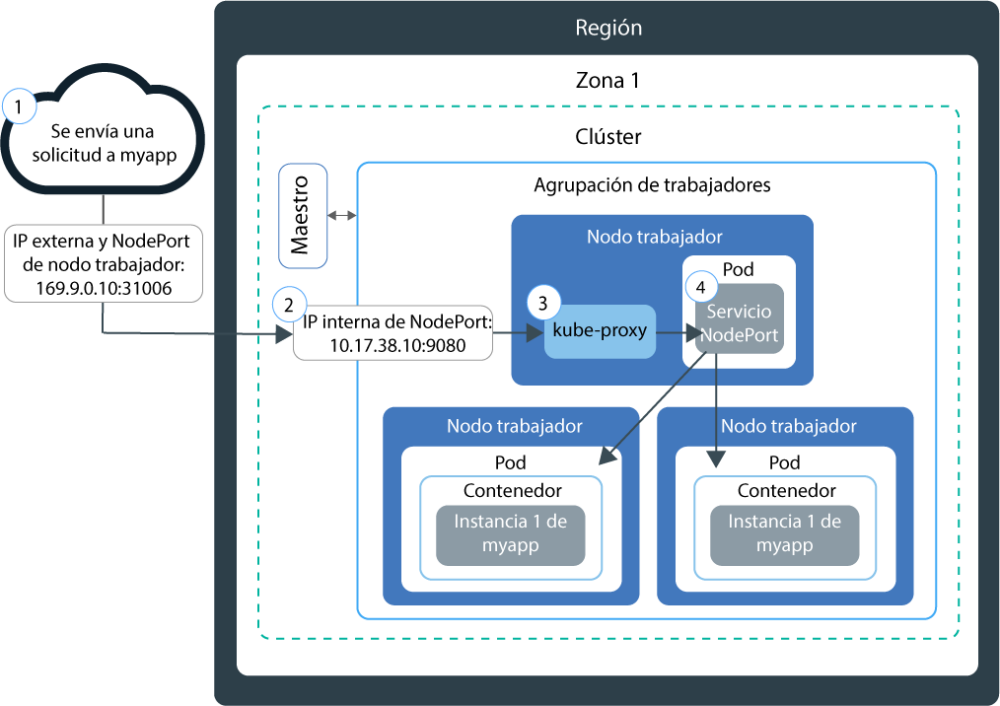

---

copyright:
  years: 2014, 2018
lastupdated: "2018-03-16"

---

{:new_window: target="_blank"}
{:shortdesc: .shortdesc}
{:screen: .screen}
{:pre: .pre}
{:table: .aria-labeledby="caption"}
{:codeblock: .codeblock}
{:tip: .tip}
{:download: .download}


# Configuración de servicios NodePort
{: #nodeport}

Puede poner la app contenerizada a disponibilidad pública en Internet utilizando la dirección IP pública de cualquier nodo trabajador de un clúster de Kubernetes y exponiendo un puerto de nodo. Utilice esta opción para pruebas de {{site.data.keyword.containerlong}} y para acceso público de corto plazo.
{:shortdesc}

## Planificación del trabajo en red externo con servicios NodePort
{: #planning}

Exponga un puerto público en el nodo trabajador y utilice la dirección IP pública del nodo trabajador para acceder de forma pública al servicio en el clúster desde Internet.
{:shortdesc}

Cuando expone una app creando un servicio de Kubernetes de tipo NodePort, se asigna al servicio
un NodePort comprendido entre 30000 y 32767 y una dirección IP de clúster interno. El servicio NodePort sirve como punto de entrada externo para las solicitudes entrantes para la app. El NodePort asignado se expone de forma pública en los valores kubeproxy de cada nodo trabajador del clúster. Cada nodo trabajador empieza a escuchar en el NodePort asignado para detectar solicitudes entrantes para el servicio. Para acceder al servicio desde Internet, puede utilizar la dirección IP pública de cualquier nodo trabajador asignado durante la creación del clúster y el NodePort en el formato `<ip_address>:<nodeport>`. Además de la dirección IP pública, está disponible un servicio NodePort en la dirección IP privada de un nodo trabajador.

El siguiente diagrama muestra cómo se dirige la comunicación desde Internet a una app cuando se configura un servicio NodePort:



1. Se envía una solicitud a la app mediante la dirección IP pública del nodo trabajador y el NodePort del nodo trabajador.

2. La solicitud se reenvía automáticamente al puerto y a la dirección IP del clúster interno del servicio NodePort. Solo se puede acceder a la dirección IP del clúster interno dentro del clúster.

3. `kube-proxy` direcciona la solicitud al servicio NodePort de Kubernetes para la app.

4. La solicitud se reenvía a la dirección IP privada del pod en el que se ha desplegado la app. Si se despliegan varias instancias de app en el clúster, el servicio NodePort direcciona las solicitudes entre los pods de app.

**Nota:** La dirección IP pública del nodo trabajador no es permanente. Cuando un nodo trabajador se elimina o se vuelve a crear, se le asigna una nueva dirección IP pública. Puede utilizar el servicio NodePort para probar el acceso público para la app o cuando se necesita acceso público solo durante un breve periodo de tiempo. Si necesita una dirección IP pública estable y más disponibilidad para el servicio, exponga la app utilizando un [servicio LoadBalancer](cs_loadbalancer.html#planning) o [Ingress](cs_ingress.html#planning).

<br />


## Configuración del acceso público a una app utilizando el servicio NodePort
{: #config}

Puede exponer la app como servicio de Kubernetes de tipo NodePort para clústeres gratuitos o estándares.
{:shortdesc}

Si todavía no tiene una app lista, puede utilizar una app de ejemplo de Kubernetes denominada [Guestbook ](https://github.com/kubernetes/kubernetes/blob/master/examples/guestbook/all-in-one/guestbook-all-in-one.yaml).

1.  En el archivo de configuración de la app, defina una sección de [servicio ](https://kubernetes.io/docs/concepts/services-networking/service/). **Nota**: Para el ejemplo Guestbook, ya existe una sección de servicio frontal en el archivo de configuración. Para que la app Guestbook esté disponible externamente, añada el tipo de NodePort y un NodePort comprendido entre 30000 y 32767 a la sección de servicio frontal.

    Ejemplo:

    ```
    apiVersion: v1
    kind: Service
    metadata:
      name: <my-nodeport-service>
      labels:
        run: <my-demo>
    spec:
      selector:
        run: <my-demo>
      type: NodePort
      ports:
       - port: <8081>
         # nodePort: <31514>

    ```
    {: codeblock}

    <table>
    <caption>Descripción de los componentes de este archivo YAML</caption>
    <thead>
    <th colspan=2> Descripción de los componentes de la sección del servicio NodePort</th>
    </thead>
    <tbody>
    <tr>
    <td><code>name</code></td>
    <td>Sustituya <code><em>&lt;my-nodeport-service&gt;</em></code> por el nombre del servicio NodePort.</td>
    </tr>
    <tr>
    <td><code> run</code></td>
    <td>Sustituya <code><em>&lt;my-demo&gt;</em></code> por el nombre de su despliegue.</td>
    </tr>
    <tr>
    <td><code>port</code></td>
    <td>Sustituya <code><em>&lt;8081&gt;</em></code> por el puerto en el que escucha el servicio. </td>
     </tr>
     <tr>
     <td><code>nodePort</code></td>
     <td>Opcional: Sustituya <code><em>&lt;31514 &gt;</em></code> por un NodePort comprendido entre 30000 y 32767. No especifique un NodePort que ya estén siendo utilizado por otro servicio. Si no se asigna ningún NodePort, se asignará automáticamente uno aleatorio.<br><br>Si desea especificar un NodePort y desea ver qué NodePorts ya se están utilizando, ejecute el siguiente mandato: <pre class="pre"><code>kubectl get svc</code></pre>Los NodePorts en uso aparecerán bajo el campo **Puertos**.</td>
     </tr>
     </tbody></table>

2.  Guarde el archivo de configuración actualizado.

3.  Repita estos pasos para crear un servicio NodePort para cada app que desea exponer a Internet.

**Qué es lo siguiente:**

Cuando se despliegue la app, puede utilizar la dirección IP pública de cualquier nodo trabajador y el NodePort para formar el URL público para acceder a la app en un navegador.

1.  Obtener la dirección IP pública para un nodo trabajador del clúster.

    ```
    bx cs workers <cluster_name>
    ```
    {: pre}

    Salida:

    ```
    ID                                                Public IP   Private IP    Size     State    Status
    prod-dal10-pa215dcf5bbc0844a990fa6b0fcdbff286-w1  192.0.2.23  10.100.10.10  u2c.2x4  normal   Ready
    prod-dal10-pa215dcf5bbc0844a990fa6b0fcdbff286-w2  192.0.2.27  10.100.10.15  u2c.2x4  normal   Ready
    ```
    {: screen}

2.  Si se ha asignado un NodePort aleatorio, averigüe cuál se ha asignado.

    ```
    kubectl describe service <service_name>
    ```
    {: pre}

    Salida:

    ```
    Name:                   <service_name>
    Namespace:              default
    Labels:                 run=<deployment_name>
    Selector:               run=<deployment_name>
    Type:                   NodePort
    IP:                     10.10.10.8
    Port:                   <unset> 8080/TCP
    NodePort:               <unset> 30872/TCP
    Endpoints:              172.30.171.87:8080
    Session Affinity:       None
    No events.
    ```
    {: screen}

    En este ejemplo, el NodePort es `30872`.

3.  Forme el URL con el NodePort y las direcciones IP públicas del nodo trabajador. Ejemplo: `http://192.0.2.23:30872`
