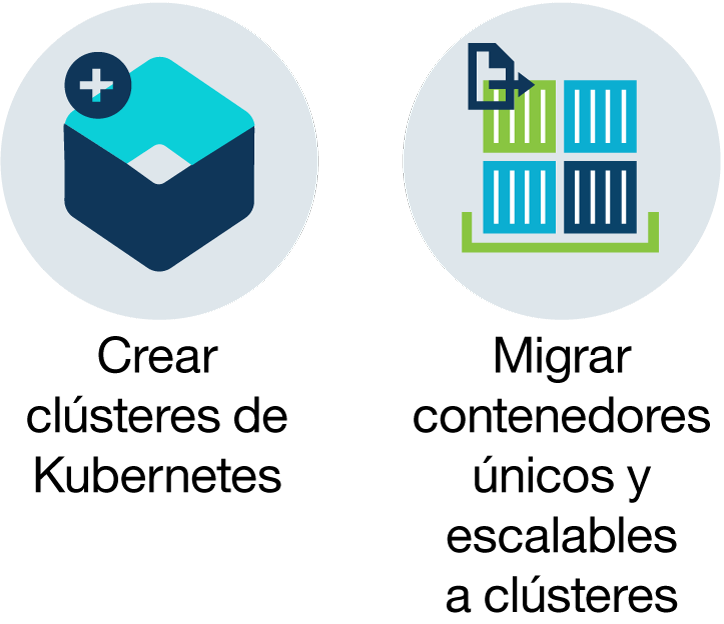
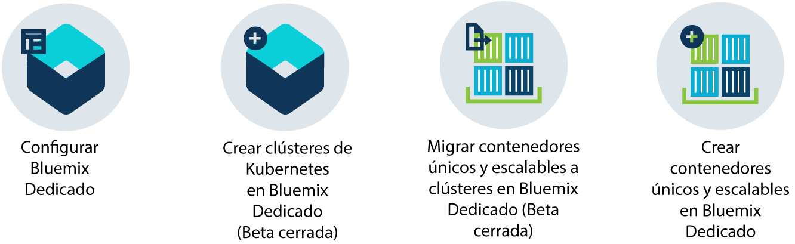

---

copyright:
  years: 2014, 2017
lastupdated: "2017-11-02"

---

{:new_window: target="_blank"}
{:shortdesc: .shortdesc}
{:screen: .screen}
{:pre: .pre}
{:table: .aria-labeledby="caption"}
{:codeblock: .codeblock}
{:tip: .tip}
{:download: .download}

# Acerca de {{site.data.keyword.containerlong_notm}}
{: #cs_ov}

{{site.data.keyword.containershort}} combina Docker y
Kubernetes para ofrecer herramientas potentes, una interfaz intuitiva para el usuario y funciones integradas de seguridad e identificación para automatizar el despliegue, operación, escalado y supervisión de apps contenerizadas sobre un clúster de hosts de cálculo independientes.
{:shortdesc}

 

## Contenedores de Docker
{: #cs_ov_docker}

Docker es un proyecto de código abierto que sacó al mercado dotCloud en 2013. Basado en las funciones de la tecnología existente de contenedores de Linux (LXC), Docker se convirtió en una plataforma de software que se puede utilizar para crear, probar, desplegar y adaptar apps rápidamente. Docker incluye software en unidades estandarizadas denominadas contenedores que incluyen todos los elementos que una app necesita para ejecutarse.
{:shortdesc}

Revise estos temas para ver los conceptos básicos sobre Docker.

<dl>
<dt>Contenedor</dt>
<dd>Un contenedor es una manera estándar de empaquetar una app y todas sus dependencias, de modo que la app se pueden traspasar entre entornos y se pueda ejecutar sin cambios. A diferencia de las máquinas virtuales, los contenedores no virtualizan un dispositivo, su sistema operativo y el hardware subyacente. El contenedor solo contiene código de la app, tiempo de ejecución, herramientas del sistema, bibliotecas y valores. Los contenedores se ejecutan como procesos aislados en el sistema hosts y comparten el sistema operativo del host y sus recursos de hardware. Este enfoque hace que el contenedor sea más ligero, portable y eficiente que una máquina virtual.</dd>
<dt>Imagen</dt>
<dd>Cada contenedor se basa en una imagen de Docker y se considera una instancia de una imagen. Se crea una imagen a partir de Dockerfile, que es un archivo que contiene instrucciones para crear la imagen y crear artefactos, como una app, la configuración de la app y sus dependencias.</dd>
<dt>Registro</dt>
<dd>Un registro de imagen es un lugar en el que puede almacenar, recuperar y compartir imágenes de Docker. Las imágenes que se almacenan en un registro pueden estar disponibles a nivel público (registro público) o puede resultar accesibles solo para un pequeño grupo de usuarios (registro privado). {{site.data.keyword.containershort_notm}} ofrece imágenes públicas, como ibmliberty, que puede utilizar para crear su primera app contenerizada. Cuando se trate de aplicaciones de empresa, utilice un registro privado como el que se proporciona en {{site.data.keyword.Bluemix_notm}} para evitar que usuarios no autorizados utilicen y modifiquen sus imágenes.

  
Para desplegar un contenedor a partir de una imagen, debe asegurarse de que la imagen esté almacenada en un registro de imágenes público o privado. </dd>
</dl>

### Principales ventajas de utilizar contenedores
{: #container_benefits}

<dl>
<dt>Los contenedores son ágiles</dt>
<dd>Los contenedores simplifican la administración del sistema proporcionando entornos estándares para equipos de desarrollo y producción. El tiempo de ejecución ligero del motor permite un escalado rápido según los cambios que haya. Ayudan a eliminar la complejidad al gestionar varias plataformas de sistemas operativos e infraestructuras subyacentes. Los contenedores le ayudan a desplegar y ejecutar apps rápidamente, de forma segura y en cualquier infraestructura.</dd>
<dt>Los contenedores son pequeños</dt>
<dd>Puede incluir más contenedores en el espacio que necesitaría una sola máquina virtual.</dd>
<dt>Los contenedores son portátiles</dt>
<dd>Cree una imagen para otro contenedor utilizando otra imagen como base. Deje que otra persona haga la mayor parte del trabajo en una imagen y modifíquela para su uso. También puede migrar rápidamente el código de la app desde un entorno de transferencia a un entorno de producción. El proceso de migración puede automatizarse con herramientas de entrega continua.</dd>
</dl>

 

## Aspectos básicos de Kubernetes
{: #kubernetes_basics}

Kubernetes fue desarrollado por Google como parte del proyecto Borg y entregado a la comunidad de código abierto en 2014. Kubernetes combina más de 15 años de investigación por parte de Google en la ejecución de una infraestructura contenerizada con cargas de trabajo de producción, contribuciones de código abierto y herramientas de gestión de contenedores Docker para ofrecer una plataforma de app aislada y segura que resulte portable, ampliable y con resolución automática de problemas en caso de que se produzcan anomalías.
{:shortdesc}

Obtenga información sobre los aspectos básicos del funcionamiento de Kubernetes con un poco de terminología como se muestra en el siguiente diagrama.

<dl>
<dt>Cuenta</dt>
<dd>Su cuenta se refiere a su cuenta de {{site.data.keyword.Bluemix_notm}}.</dd>

<dt>Clúster</dt>
<dd>Un clúster de Kubernetes consta de una o varias máquinas virtuales que se denominan nodos trabajadores. Cada noto trabajador representa un host donde puede desplegar, ejecutar y gestionar apps contenerizadas. Los nodos trabajadores se gestionan mediante un Kubernetes maestro que controla y supervisa de forma centralizada todos los recursos de Kubernetes del clúster. Cuando se despliega una app contenerizada,
el Kubernetes maestro decide dónde desplegar la app, teniendo en cuenta los requisitos del despliegue y la capacidad disponible del clúster.</dd>

<dt>Servicio</dt>
<dd>Un servicio de Kubernetes agrupa un conjunto de pods y proporciona conexión de red a estos pods sin exponer la dirección IP privada real de cada pod. Puede utilizar un servicio para poner la app a disponibilidad dentro de su clúster o en Internet público.
  
Para obtener más información sobre terminología de Kubernetes, <a href="cs_tutorials.html#cs_cluster_tutorial" target="_blank">consulte la Guía de aprendizaje</a>.</dd>

<dt>Despliegue</dt>
<dd>Un despliegue es un recurso de Kubernetes en el que se especifican los contenedores y otra información necesaria para ejecutar la app, como por ejemplo almacenamiento permanente, servicios o anotaciones. Puede documentar un despliegue en un archivo YAML de configuración y luego aplicarlo al clúster. El Kubernetes maestro configura el recurso y despliega los contenedores en pods en los nodos trabajadores con capacidad disponible.  
Defina estrategias para la app que incluyan el número de pods que desea añadir durante una actualización continuada y el número de pods que pueden no estar disponibles al mismo tiempo. Cuando lleva a cabo una actualización continuada, el despliegue comprueba si la actualización funciona y detiene la implantación cuando se detectan anomalías.</dd>

<dt>Pod</dt>
<dd>Cada app contenerizada que se despliega en un clúster de Kubernetes se despliega, ejecuta y gestiona mediante un pod. Los pods representan las unidades desplegables de tamaño reducido de un clúster de Kubernetes y se utilizan para agrupar contenedores que se deben tratar como una sola unidad. En la mayoría de los casos, un contenedor se despliega en su propio pod. Sin embargo, una app puede requerir un contenedor y otros contenedores ayudantes para desplegarse en un pod, de manera que dichos contenedores puedan resolverse mediante la misma dirección IP privada.</dd>

<dt>App</dt>
<dd>Una app hace referencia a una app completa o al componente de una app. Puede desplegar componentes de su app en pods o nodos trabajadores independientes.</dd>

</dl>

 

## Ventajas de utilizar clústeres
{: #cs_ov_benefits}

Los clústeres se despliegan en máquinas virtuales compartidas o dedicadas que proporcionan funciones de Kubernetes y otras ofrecidas por {{site.data.keyword.IBM_notm}}.
{:shortdesc}

|Ventaja|Descripción|
|-------|-----------|
|Clústeres de Kubernetes de un solo arrendatario con funciones de aislamiento de la infraestructura de cálculo, red y almacenamiento|<ul><li>Cree su propia infraestructura personalizada que se ajuste a los requisitos de su empresa y del entorno de desarrollo.</li><li>Suministre un nodo de Kubernetes maestro dedicado y seguro, nodos trabajadores, redes virtuales y almacenamiento utilizando los recursos que proporciona la infraestructura de IBM Cloud (SoftLayer). </li><li>Almacene datos permanentes, comparta datos entre pods de Kubernetes y restaure datos cuando lo necesite con el servicio de volúmenes seguro e integrado.</li><li>Kubernetes maestro completamente gestionado que {{site.data.keyword.IBM_notm}} supervisa y actualiza continuamente para mantener el clúster disponible.</li><li>Aproveche el soporte de todas las API nativas de Kubernetes.</li></ul>|
|Conformidad de seguridad de imágenes con Vulnerability Advisor|<ul><li>Configure su propio registro seguro de imágenes privadas de Docker donde todas las imágenes se almacenan y se comparten entre todos los usuarios de la organización.</li><li>Aproveche la exploración automática de imágenes en su registro de {{site.data.keyword.Bluemix_notm}} privado.</li><li>Revise recomendaciones específicas del sistema operativo utilizado en la imagen para solucionar vulnerabilidades potenciales.</li></ul>|
|Escalado automático de apps|<ul><li>Defina políticas personalizadas para escalar sus apps al alza o a la baja en función del consumo de CPU y de memoria.</li></ul>|
|Supervisión continua del estado del clúster|<ul><li>Utilice el panel de control del clúster para ver y gestionar rápidamente el estado del clúster, de los nodos trabajadores y de los despliegues de contenedores.</li><li>Busque métricas detalladas sobre consumo mediante {{site.data.keyword.monitoringlong}}
y expanda rápidamente su clúster para ajustarlo a las cargas de trabajo.</li><li>Revise la información de registro mediante {{site.data.keyword.loganalysislong}} para ver las actividades detalladas del clúster.</li></ul>|
|Recuperación automática de contenedores erróneos|<ul><li>Comprobación continua del estado de los contenedores desplegados en un nodo trabajador.</li><li>Recreación automática de contenedores en caso de que se produzcan anomalías.</li></ul>|
|Descubrimiento de servicios y gestión de servicios|<ul><li>Registre de forma centralizada servicios de apps para que estén disponibles para otras apps del clúster sin tener que exponerlos de forma pública.</li><li>Descubra servicios registrados sin realizar un seguimiento de direcciones IP o ID de contenedor modificados y aproveche el direccionamiento automático a las instancias disponibles.</li></ul>|
|Exposición segura de servicios al público|<ul><li>Redes privadas con soporte completo de equilibrador de carga y de Ingress para poner las apps a disponibilidad pública y equilibrar las cargas de trabajo entre varios nodos trabajadores sin tener que realizar un seguimiento de las modificaciones de direcciones IP dentro del clúster.</li><li>Elija entre una dirección IP pública, una ruta proporcionada por {{site.data.keyword.IBM_notm}} o su propio dominio personalizado para acceder a servicios del clúster desde Internet.</li></ul>|
|Integración de servicios de {{site.data.keyword.Bluemix_notm}}|<ul><li>Añada funciones adicionales a la app a través de la integración de servicios de {{site.data.keyword.Bluemix_notm}}, como por ejemplo API de Watson, Blockchain, servicios de datos o Internet de Cosas, y ayude a los usuarios del clúster a simplificar el desarrollo de apps y el proceso de gestión de contenedores.</li></ul>|
{: caption="Tabla 1. Ventajas de utilizar clústeres con {{site.data.keyword.containerlong_notm}}" caption-side="top"}

 

## Entornos de nube
{: #cs_ov_environments}

Tiene la posibilidad de elegir el entorno de nube de {{site.data.keyword.Bluemix_notm}} en el que desplegar clústeres y contenedores.
{:shortdesc}

### {{site.data.keyword.Bluemix_notm}} Público
{: #public_environment}

Despliegue clústeres en el entorno de nube público ([https://console.bluemix.net ](https://console.bluemix.net)) y conéctese al servicio que desee en el catálogo de {{site.data.keyword.Bluemix_notm}}.

Con los clústeres en el entorno de {{site.data.keyword.Bluemix_notm}} Público, puede elegir el nivel de aislamiento de hardware para los nodos trabajadores de su clúster. Utilice hardware dedicado para sus recursos físicos para que estén dedicados y disponibles únicamente para su clúster, o comparta el hardware para permitir compartir los recursos físicos con clústeres de otros clientes de {{site.data.keyword.IBM_notm}}. Podría querer elegir un clúster dedicado en el entorno de {{site.data.keyword.Bluemix_notm}} Público cuando desee un clúster aislado y no necesitar este aislamiento para otros servicios de {{site.data.keyword.Bluemix_notm}} que utilice.

Pulse en una de las siguientes opciones para empezar:

    <map name="public_options" id="public_options">
    <area href="container_index.html#clusters" alt="Iniciación a clústeres de Kubernetes en {{site.data.keyword.Bluemix_notm}}
" title="Iniciación a clústeres de Kubernetes en {{site.data.keyword.Bluemix_notm}}
" shape="rect" coords="-5, -6, 123, 154" />
    <area href="cs_classic.html#cs_classic" alt="Ejecución de contenedores únicos y escalables en {{site.data.keyword.containershort_notm}}" title="ejecución de contenedores únicos y escalables en {{site.data.keyword.containershort_notm}}" shape="rect" coords="181, -5, 320, 161" />
    </map>

### {{site.data.keyword.Bluemix_dedicated_notm}}
{: #dedicated_environment}

Despliegue clústeres (Beta cerrada) o contenedores escalables y únicos en un entorno de nube dedicado (`https://<my-dedicated-cloud-instance>.bluemix.net`) y conéctese a servicios de {{site.data.keyword.Bluemix_notm}} preseleccionados que también se ejecuten allí.

Los clústeres con {{site.data.keyword.Bluemix_dedicated_notm}} son equivalentes a los clústeres que se crean con hardware dedicado en {{site.data.keyword.Bluemix_notm}} Público. Los recursos físicos disponibles se dedican únicamente a su clúster y no se comparten con otros clústeres de otros clientes de {{site.data.keyword.IBM_notm}}. Tanto para el entorno Público como para el entorno Dedicado, se utiliza el punto final de API para crear los clústeres. A continuación se indican las diferencias más significativas con {{site.data.keyword.Bluemix_notm}} Dedicado.

*   {{site.data.keyword.IBM_notm}} posee y gestiona la cuenta de infraestructura de IBM Cloud (SoftLayer) en la que se despliegan los nodos trabajadores, las VLAN y las subredes, en lugar pertenecer al usuario.

*   Las especificaciones para estas subredes y VLAN vienen determinadas cuando se crea el entorno Dedicado y no cuando se crea el clúster.

Podría elegir configurar un entorno {{site.data.keyword.Bluemix_dedicated_notm}} cuando desee aislamiento para el clúster y también precise dicho aislamiento para otros servicios de {{site.data.keyword.Bluemix_notm}} que utilice.

Pulse en una de las siguientes opciones para empezar:

    <map name="dedicated_options" id="dedicated_options">
    <area href="#setup_dedicated" alt="Configuración de {{site.data.keyword.containershort_notm}} en {{site.data.keyword.Bluemix_dedicated_notm}} (Beta cerrada)" title="Configuración de {{site.data.keyword.containershort_notm}} en {{site.data.keyword.Bluemix_dedicated_notm}} (Beta cerrada)" shape="rect" coords="-5, -15, 100, 153" />
    <area href="container_index.html#dedicated" alt="Iniciación a los clústeres de Kubernetes en {{site.data.keyword.Bluemix_notm}} Dedicado (Beta cerrada)" title="Iniciación a los clústeres de Kubernetes en {{site.data.keyword.Bluemix_dedicated_notm}} (Beta cerrado)" shape="rect" coords="153, -10, 276, 182" />
    <area href="cs_classic.html#cs_classic" alt="Ejecución de contenedores únicos y escalables en {{site.data.keyword.containershort_notm}}" title="Ejecución de contenedores únicos y escalables en {{site.data.keyword.containershort_notm}}" shape="rect" coords="317, -11, 436, 188" />
    <area href="container_ha.html#container_group_ui" alt="Ejecución de servicios a largo plazo como grupos de contenedores desde la GUI de {{site.data.keyword.Bluemix_notm}}" title="Ejecución de servicios a largo plazo como grupos de contenedores desde la GUI de {{site.data.keyword.Bluemix_notm}}" shape="rect" coords="485, -1, 600, 173" />
    </map>

### Diferencias en la gestión de clústeres entre entornos de nube
{: #env_differences}

|Área|{{site.data.keyword.Bluemix_notm}} Público|{{site.data.keyword.Bluemix_dedicated_notm}} (Beta cerrada)|
|--|--------------|--------------------------------|
|Creación del clúster|Se crea un clúster Lite o se especifican los siguientes detalles para un clúster estándar:<ul><li>Tipo de clúster</li><li>Nombre</li><li>Ubicación</li><li>Tipo de máquina</li><li>Número de nodos trabajadores</li><li>VLAN pública</li><li>VLAN privada</li><li>Hardware</li></ul>|Se especifican los siguientes detalles para un clúster estándar:<ul><li>Nombre</li><li>Versión de Kubernetes</li><li>Tipo de máquina</li><li>Número de nodos trabajadores</li></ul>
**Nota:** Los valores de hardware y VLAN se definen de forma previa durante la creación del entorno de {{site.data.keyword.Bluemix_notm}}.
|
|Propiedad y hardware del clúster|En los clústeres estándares, el hardware se puede compartir con otros clientes de {{site.data.keyword.IBM_notm}} o puede estar dedicado a usted únicamente. Las VLAN privadas y públicas las posee y gestiona cada usuario en su cuenta de infraestructura de IBM Cloud (SoftLayer).
|En los clústeres del entorno de {{site.data.keyword.Bluemix_dedicated_notm}}, el hardware es siempre dedicado.
Las VLAN privadas y públicas las posee y gestiona IBM en nombre del usuario. La ubicación se define de forma previa para el entorno de {{site.data.keyword.Bluemix_notm}}.|
|Enlace de servicios con un clúster|Utilice el mandato [bx cs cluster-service-bind](cs_cluster.html#cs_cluster_service) para vincular un secreto de Kubernetes al clúster.|Cree un [archivo de clave de JSON](cs_cluster.html#binding_dedicated) para las credenciales del servicio y, a continuación, cree un secreto Kubernetes a partir de dicho archivo para enlazarlas al clúster.|
|Redes de Ingress y de equilibrio de carga|Durante el suministro del clúster estándar, se llevan a cabo de forma automática las siguientes acciones.<ul><li>Se vincula una subred portátil pública al clúster y se asigna a su cuenta de infraestructura de IBM Cloud (SoftLayer). </li><li>Se utiliza una dirección IP pública portátil para un controlador Ingress de alta disponibilidad y se asigna una ruta pública exclusiva en el formato &lt;cluster_name&gt;.containers.mybluemix.net. Puede utilizar esta ruta para exponer varias apps al público.</li><li>Se asignan cuatro
direcciones IP públicas portátiles al clúster que se pueden utilizar para exponer apps al público mediante servicios del equilibrador de carga. Se pueden solicitar subredes adicionales a través de su cuenta de infraestructura de IBM Cloud (SoftLayer). </li></ul>|Cuando se crea una cuenta para el entorno Dedicado, se toman las siguientes decisiones:<ul><li>El número de subredes que se desean</li><li>El tipo de subredes que se desean, de equilibrio de carga o de Ingress. {{site.data.keyword.IBM_notm}} crea las subredes y realiza las tareas de gestión de red en nombre del usuario. Dependiendo de sus selecciones, se podría crear un controlador Ingress y asignarle una ruta pública. Es posible solicitar subredes adicionales [abriendo una incidencia de soporte](/docs/support/index.html#contacting-support) para crear una subred y, a continuación, utilizar el mandato [`bx cs cluster-subnet-add`](cs_cli_reference.html#cs_cluster_subnet_add) para añadirlas al clúster.|
|Redes de NodePort|Exponga un puerto público en el nodo trabajador y utilice la dirección IP pública del nodo trabajador para acceder de forma pública al servicio en el clúster.|Todas las direcciones IP públicas de los nodos trabajadores están bloqueados por un cortafuegos. Sin embargo, para los servicios de {{site.data.keyword.Bluemix_notm}} que se añadan al clúster, se puede acceder al puerto del nodo mediante una dirección IP pública o una dirección IP privada.|
|Almacén persistente|Utiliza el [suministro dinámico](cs_apps.html#cs_apps_volume_claim) o el [suministro estático](cs_cluster.html#cs_cluster_volume_create) de volúmenes.|Utiliza el [suministro dinámico](cs_apps.html) de volúmenes.</li></ul>|
|URL de registro de imágenes en {{site.data.keyword.registryshort_notm}}|<ul><li>EE.UU. Sur y EE.UU. Este: <code>registry.ng bluemix.net</code></li><li>UK Sur: <code>registry.eu-gb.bluemix.net</code></li><li>UE Central (Frankfurt): <code>registry.eu-de.bluemix.net</code></li><li>Australia (Sidney): <code>registry.au-syd.bluemix.net</code></li></ul>|<ul><li>Para los nuevos espacios de nombres, utiliza los mismos registros basados en regiones que los definidos para el entorno de {{site.data.keyword.Bluemix_notm}} Público.</li><li>Para los espacios de nombres que se configuraron para contenedores escalables y únicos en {{site.data.keyword.Bluemix_dedicated_notm}}, utilice <code>registry.&lt;dedicated_domain&gt;</code></li></ul>|
|Acceso al registro|Consulte las opciones del apartado sobre [Utilización de registros de imágenes privadas y públicas con {{site.data.keyword.containershort_notm}}](cs_cluster.html#cs_apps_images).|<ul><li>Para los espacios de nombres nuevos, consulte las opciones del apartado sobre [Utilización de registros de imágenes privadas y públicas con {{site.data.keyword.containershort_notm}}](cs_cluster.html#cs_apps_images).</li><li>Para espacios de nombres que se configuraron para grupos escalables y únicos, se [utiliza una señal para crear un secreto de Kubernetes](cs_dedicated_tokens.html#cs_dedicated_tokens) para la autenticación.</li></ul>|
{: caption="Tabla 2. Diferencias entre las características de {{site.data.keyword.Bluemix_notm}} Público y {{site.data.keyword.Bluemix_dedicated_notm}}" caption-side="top"}

### Configuración de {{site.data.keyword.containershort_notm}} en {{site.data.keyword.Bluemix_dedicated_notm}} (Beta cerrada)
{: #setup_dedicated}

Los administradores deben añadir el ID de administrador de IBM y los usuarios de su organización al entorno Dedicado.

Antes de empezar, [configure un entorno de {{site.data.keyword.Bluemix_dedicated_notm}} ](/docs/dedicated/index.html#setupdedicated).

Para configurar su entorno Dedicado para utilizar clústeres:

1.  Añada al entorno el ID de administrador de IBM proporcionado.
    1.  Seleccione su cuenta de {{site.data.keyword.Bluemix_dedicated_notm}}.
    2.  Desde la barra de menús, pulse **Gestionar>Seguridad>Identidad y acceso**. La ventana Usuarios muestra una lista de usuarios con sus direcciones de correo electrónico y el estado de la cuenta seleccionada.
    3.  Pulse **Invitar a usuarios**.
    4.  En **Dirección de correo electrónico o ID de IBM existente**,
especifique la siguiente dirección de correo electrónico:
`cfsdl@us.ibm.com`.
    5.  En la sección **Acceso**, amplíe **Servicios habilitados de Identity and Access**.
    6.  En la lista desplegable **Servicios**, seleccione **{{site.data.keyword.containershort_notm}}**.
    7.  Desde la lista desplegable de **Roles**, seleccione **Administrador**.
    8.  Pulse **Invitar a usuarios**.
2.  [Cree los ID de IBM para los usuarios finales de la cuenta de {{site.data.keyword.Bluemix_notm}}. ](https://www.ibm.com/account/us-en/signup/register.html)
3.  [Añada los usuarios del paso anterior a su cuenta de {{site.data.keyword.Bluemix_notm}}.](cs_cluster.html#add_users)
4.  Acceda a su cuenta de {{site.data.keyword.Bluemix_dedicated_notm}} Dedicado a través de la consola pública y empiece a crear clústeres.

    1.  Inicie una sesión en la consola de {{site.data.keyword.Bluemix_notm}} Público ([https://console.bluemix.net ](https://console.bluemix.net)) con su ID de IBM.
    2.  Desde el menú de la cuenta, seleccione su cuenta de {{site.data.keyword.Bluemix_dedicated_notm}}.
La consola se actualiza con los servicios y la información de su instancia de {{site.data.keyword.Bluemix_dedicated_notm}}.
    3.  Desde el catálogo de su instancia de {{site.data.keyword.Bluemix_dedicated_notm}}, seleccione **Contenedores** y pulse **Clúster de Kubernetes**.
Para obtener más información sobre cómo crear un clúster, consulte [Creación de clústeres de Kubernetes desde la GUI en {{site.data.keyword.Bluemix_dedicated_notm}} (Beta cerrada)](cs_cluster.html#creating_ui_dedicated).
5. Si el sistema local o la red corporativa controla puntos finales de Internet público mediante proxies o cortafuegos, consulte [Apertura de los puertos y direcciones IP necesarios en el cortafuegos](cs_security.html#opening_ports) para obtener más información sobre cómo permitir el tráfico de salida.

 

## Arquitectura del servicio
{: #cs_ov_architecture}

Cada nodo trabajador está configurado con un motor Docker gestionado por {{site.data.keyword.IBM_notm}}, distintos recursos de cálculo, sistema de red y servicio de volúmenes, así como características integradas de seguridad que proporciona identificación, funciones de gestión de recursos y conformidad con la seguridad de los nodos trabajadores. El nodo trabajador se comunica con el nodo maestro mediante certificados TLS seguros y conexión openVPN.
{:shortdesc}

*Figura 1. Arquitectura de Kubernetes y sistema de red en {{site.data.keyword.containershort_notm}}*

En el diagrama se describe las tareas de mantenimiento de las que se ocupa el usuario y de las que se ocupa IBM. Para obtener más información sobre las tareas de mantenimiento, consulte [Responsabilidades de gestión de clústeres](cs_planning.html#responsibilities).

### {{site.data.keyword.Bluemix_dedicated_notm}}
{: #dedicated_architecture}

*Figura 2. Arquitectura de Kubernetes y sistema de red en {{site.data.keyword.Bluemix_dedicated_notm}}*

 

## Abuso en los contenedores
{: #cs_terms}

Los clientes no puede utilizar {{site.data.keyword.containershort_notm}} de forma inapropiada.
{:shortdesc}

Entre los usos no apropiados se incluye:

*   Cualquier actividad ilegal
*   Distribuir o ejecutar malware
*   Provocar cualquier daño a {{site.data.keyword.containershort_notm}} o interferir a cualquier usuario con la utilización de {{site.data.keyword.containershort_notm}}
*   Provocar daños o interferir la utilización de otros usuarios con cualquier otro sistema o servicio
*   Acceder de forma no autorizada a los servicios o sistemas
*   Realizar modificaciones no autorizadas de los servicios o sistemas
*   Incumplir los derechos de terceros

Consulte [Términos de los servicios en la nube](/docs/navigation/notices.html#terms) para obtener una visión general de los términos uso.
