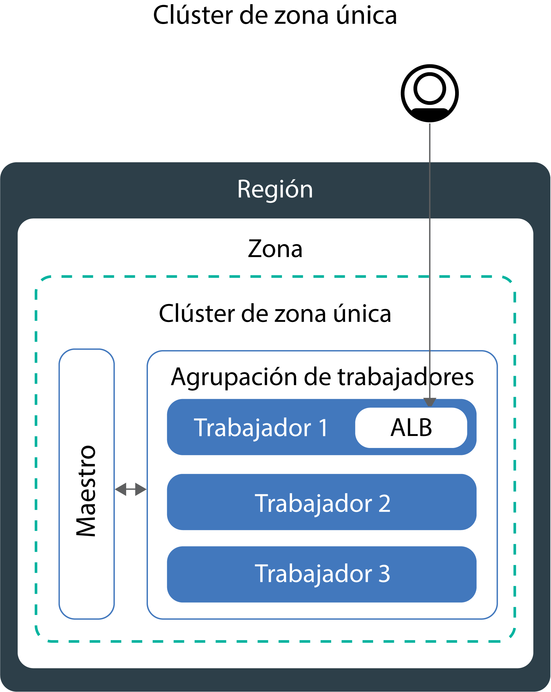
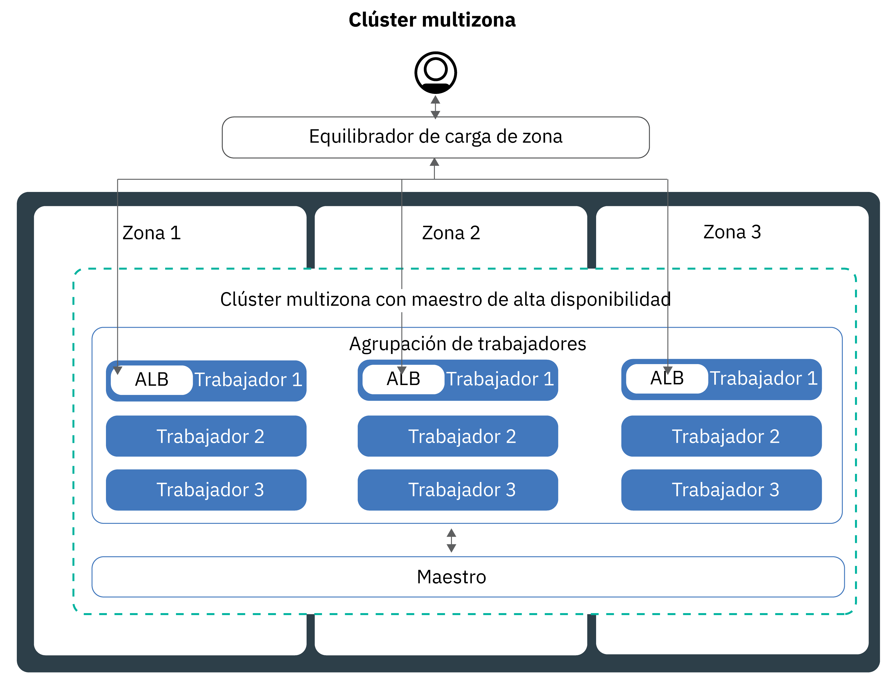
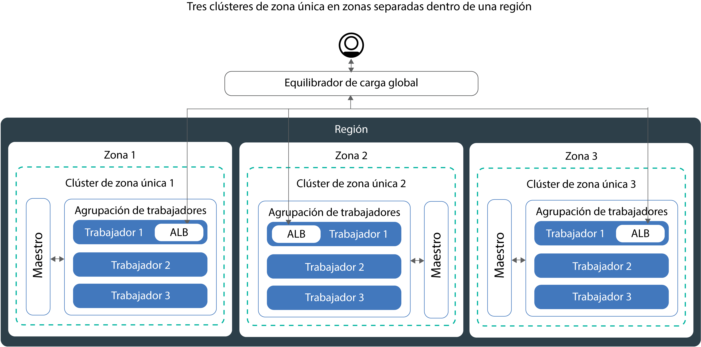

---

copyright:
  years: 2014, 2019
lastupdated: "2019-06-11"

keywords: kubernetes, iks, multi az, multi-az, szr, mzr

subcollection: containers

---

{:new_window: target="_blank"}
{:shortdesc: .shortdesc}
{:screen: .screen}
{:pre: .pre}
{:table: .aria-labeledby="caption"}
{:codeblock: .codeblock}
{:tip: .tip}
{:note: .note}
{:important: .important}
{:deprecated: .deprecated}
{:download: .download}
{:preview: .preview}


# Planificación del clúster para obtener una alta disponibilidad
{: #ha_clusters}

Diseñe su clúster estándar de modo que obtenga la máxima disponibilidad y capacidad de su app con {{site.data.keyword.containerlong}}.
{: shortdesc}

Si distribuye sus apps entre varios nodos trabajadores, zonas y clústeres, es menos probable que los usuarios experimenten un tiempo de inactividad del sistema. Características incorporadas como, por ejemplo, el aislamiento y el equilibrio de carga, incrementan la resiliencia con relación a posibles anomalías con hosts, redes o apps. Revise estas configuraciones potenciales de clústeres que están ordenadas por grados de disponibilidad en orden ascendente.


1. Un [clúster de una sola zona](#single_zone) con varios nodos trabajadores en una agrupación de nodos trabajadores.
2. Un [clúster multizona](#multizone) que abarca varios nodos trabajadores en varias zonas dentro de una región.
3. **Clústeres conectados únicamente a VLAN pública y privada**: [Varios clústeres](#multiple_clusters) configurados entre zonas o regiones conectadas mediante un equilibrador de carga global.

## Clúster de una sola zona
{: #single_zone}

Para mejorar la disponibilidad de la app y permitir la migración tras error en el caso de que un nodo trabajador no esté disponible en el clúster, añada nodos trabajadores adicionales al clúster de una sola zona.
{: shortdesc}



De forma predeterminada, un clúster de una sola zona se configura con una agrupación de nodos trabajadores denominada `default`. La agrupación de nodos trabajadores agrupa los nodos trabajadores con la misma configuración, como por ejemplo el tipo de máquina, que ha definido durante la creación del clúster. Puede añadir más nodos trabajadores a su clúster [cambiando el tamaño de una agrupación de nodos trabajadores existente](/docs/containers?topic=containers-add_workers#resize_pool) o [añadiendo una nueva agrupación de nodos trabajadores](/docs/containers?topic=containers-add_workers#add_pool).

Cuando se añaden nodos trabajadores, las instancias de la app se pueden distribuir entre varios nodos trabajadores. Si un nodo trabajador queda inactivo, las instancias de la app de los nodos trabajadores disponibles continúan ejecutándose. Kubernetes vuelve a planificar automáticamente los pods de los nodos trabajadores no disponibles para garantizar el rendimiento y la capacidad de la app. Para asegurarse de que los pods están uniformemente distribuidos entre los nodos trabajadores, implemente la [afinidad de pod](https://kubernetes.io/docs/concepts/configuration/assign-pod-node/#inter-pod-affinity-and-anti-affinity-beta-feature).

**¿Puedo convertir un clúster de una sola zona en un clúster multizona?**</br>
Si el clúster se encuentra en una de las [ubicaciones metropolitanas multizona soportadas](/docs/containers?topic=containers-regions-and-zones#zones), sí. Consulte [Actualización de nodos trabajadores autónomos a agrupaciones de nodos trabajadores](/docs/containers?topic=containers-update#standalone_to_workerpool).


**¿Tengo que utilizar clústeres multizona?**</br>
No. Puede crear tantos clústeres de una sola zona como desee. De hecho, quizás prefiera clústeres de una sola zona para facilitar la gestión o si el clúster debe residir en una [ciudad de una sola zona](/docs/containers?topic=containers-regions-and-zones#zones) específica.

**¿Puedo tener un maestro de alta disponibilidad en una sola zona?**</br>
Sí. En una única zona, el maestro está altamente disponible e incluye réplicas en hosts físicos independientes para que el servidor de API de Kubernetes, etcd, el planificador y el gestor de controladores puedan protegerse frente a una interrupción como, por ejemplo, la actualización del maestro. Para protegerse frente a un error zonal, puede:
* [Crear un clúster en una zona con capacidad multizona](#multizone), donde el maestro se disperse en zonas.
* [Crear varios clústeres conectados a VLAN pública y privada](#multiple_clusters) y conectarlos con un equilibrador de carga global.

## Clúster multizona
{: #multizone}

Con {{site.data.keyword.containerlong_notm}}, puede crear clústeres multizona. Si distribuye sus apps entre varios nodos trabajadores y zonas mediante una agrupación de nodos trabajadores, es menos probable que los usuarios experimenten un tiempo de inactividad del sistema. Características incorporadas como, por ejemplo, el equilibrio de carga, incrementan la resiliencia frente a posibles anomalías de zona con hosts, redes o apps. Si caen los recursos de una zona, las cargas de trabajo del clúster siguen funcionando en las otras zonas.
{: shortdesc}

**¿Qué es una agrupación de nodos trabajadores?**</br>
Una agrupación de nodos trabajadores es una colección de nodos trabajadores que comparten alguna característica, como por ejemplo tipo de máquina, CPU y memoria. Cuando se crea un clúster, se crea automáticamente una agrupación de nodos trabajadores predeterminada. Para propagar los nodos trabajadores de la agrupación entre zonas, añadir nodos trabajadores a la agrupación o actualizar nodos trabajadores, puede utilizar los nuevos mandatos `ibmcloud ks worker-pool`.

**¿Puedo seguir utilizando nodos trabajadores autónomos?**</br>
La configuración de clúster anterior de nodos trabajadores estándares recibe soporte, pero ha quedado en desuso. Asegúrese de [añadir una agrupación de nodos trabajadores al clúster](/docs/containers?topic=containers-planning_worker_nodes#add_pool) y, a continuación,
[utilizar agrupaciones de trabajadores](/docs/containers?topic=containers-update#standalone_to_workerpool) para organizar los nodos trabajadores en lugar de los nodos trabajadores autónomos.

**¿Puedo convertir un clúster de una sola zona en un clúster multizona?**</br>
Si el clúster se encuentra en una de las [ubicaciones metropolitanas multizona soportadas](/docs/containers?topic=containers-regions-and-zones#zones), sí. Consulte [Actualización de nodos trabajadores autónomos a agrupaciones de nodos trabajadores](/docs/containers?topic=containers-update#standalone_to_workerpool).


### Más información sobre la configuración del clúster multizona
{: #mz_setup}



Puede añadir zonas adicionales al clúster para replicar los nodos trabajadores de las agrupaciones de nodos trabajadores entre varias zonas dentro de una región. Los clústeres multizona se han diseñado para planificar uniformemente los pods entre nodos trabajadores y zonas a fin de garantizar su disponibilidad y la recuperación de errores. Si los nodos trabajadores no se distribuyen uniformemente entre las zonas o si la capacidad es insuficiente en una de las zonas, es posible que el planificador de Kubernetes no planifique todos los pods solicitados. Como resultado, los pods podrían pasar a estar en estado **Pendiente** hasta que haya suficiente capacidad disponible. Si desea cambiar el comportamiento predeterminado para que el planificador de Kubernetes distribuya los pods entre zonas con una mejor distribución, utilice la [política de afinidad de pod](https://kubernetes.io/docs/concepts/configuration/assign-pod-node/#inter-pod-affinity-and-anti-affinity-beta-feature) `preferredDuringSchedulingIgnoredDuringExecution`.

**¿Por qué necesito worker clústeres en tres zonas?** </br>
La distribución de la carga de trabajo entre tres zonas garantiza una alta disponibilidad para la app en el caso de que una o dos zonas no estén disponibles, pero también hace que la configuración del clúster sea más rentable. ¿Por qué?, se preguntará. Este es un ejemplo.

Supongamos que necesita un nodo trabajador con seis núcleos para manejar la carga de trabajo de su app. Para aumentar la disponibilidad del clúster, tiene las siguientes opciones:

- **Duplicar los recursos en otra zona:** esta opción le deja con dos nodos trabajadores, cada uno con seis núcleos en cada zona, lo que suma un total de 12 núcleos. </br>
- **Distribuir los recursos en tres zonas:** con esta opción, despliega tres núcleos por zona, lo que le deja con una capacidad total de nueve núcleos. Para manejar la carga de trabajo, siempre debe haber dos zonas activas. Si una zona no está disponible, las otras dos zonas pueden gestionar la carga de trabajo. Si dos zonas no están disponibles, los tres núcleos restantes están activos para gestionar la carga de trabajo. El hecho de desplegar tres núcleos por zona significa máquinas más pequeñas y, por lo tanto, menor coste.</br>

**¿Cómo se configura mi nodo maestro de Kubernetes?** </br>
Cuando se crea un clúster en una [ubicación metropolitana multizona](/docs/containers?topic=containers-regions-and-zones#zones), se despliega automáticamente un maestro de Kubernetes de alta disponibilidad y se distribuyen tres réplicas por las zonas de la ubicación metropolitana. Por ejemplo, si el clúster está en las zonas `dal10`, `dal12` o `dal13`, las réplicas del nodo maestro de Kubernetes se distribuyen en cada zona de la ciudad metropolitana multizona de Dallas.

**¿Qué sucede si el nodo maestro de Kubernetes deja de estar disponible?** </br>
El [nodo maestro de Kubernetes](/docs/containers?topic=containers-ibm-cloud-kubernetes-service-technology#architecture) es el componente principal que mantiene el clúster en funcionamiento. El nodo maestro almacena los recursos de clúster y sus configuraciones en la base de datos etcd, que sirve como único punto fiable para el clúster. El servidor de API de Kubernetes es el punto de entrada principal para todas las solicitudes de gestión del clúster procedentes de los nodos trabajadores destinadas al nodo maestro, o cuando desea interactuar con los recursos de clúster.<br><br>Si se produce un fallo del nodo maestro, las cargas de trabajo siguen ejecutándose en los nodos trabajadores, pero no se pueden utilizar mandatos `kubectl` para trabajar con los recursos del clúster o ver el estado del clúster hasta que el servidor de API de Kubernetes del nodo maestro vuelve a estar activo. Si un pod cae durante la interrupción del nodo maestro, el pod no se puede volver a planificar hasta que el nodo trabajador pueda volver a acceder al servidor de API de Kubernetes.<br><br>Durante una interrupción del nodo maestro, todavía puede ejecutar mandatos `ibmcloud ks` en la API de {{site.data.keyword.containerlong_notm}} para trabajar con los recursos de la infraestructura, como nodos trabajadores o VLAN. Si cambia la configuración actual del clúster añadiendo o eliminando nodos trabajadores en el clúster, los cambios no se producen hasta que el nodo maestro vuelve a estar activo.

No reinicie o rearranque un nodo trabajador durante una interrupción del nodo maestro. Esta acción elimina los pods del nodo trabajador. Puesto que el servidor de API de Kubernetes no está disponible, los pods no se pueden volver a programar en otros nodos trabajadores del clúster.
{: important}


Para proteger el clúster frente a un error del nodo maestro de Kubernetes o en regiones en las que no hay clústeres multizona disponibles, puede [configurar varios clústeres conectados a VLAN pública y privada y conectarlos con un equilibrador de carga global](#multiple_clusters).

**¿Tengo que hacer algo para que el nodo maestro se pueda comunicar con los trabajadores entre zonas?**</br>
Sí. Si tiene varias VLAN para un clúster, varias subredes en la misma VLAN o un clúster multizona, debe habilitar la [función de direccionador virtual (VRF)](/docs/infrastructure/direct-link?topic=direct-link-overview-of-virtual-routing-and-forwarding-vrf-on-ibm-cloud#overview-of-virtual-routing-and-forwarding-vrf-on-ibm-cloud) para la cuenta de infraestructura de IBM Cloud (SoftLayer) para que los nodos trabajadores puedan comunicarse entre sí en la red privada. Para habilitar VRF, [póngase en contacto con el representante de su cuenta de la infraestructura de IBM Cloud (SoftLayer)](/docs/infrastructure/direct-link?topic=direct-link-overview-of-virtual-routing-and-forwarding-vrf-on-ibm-cloud#how-you-can-initiate-the-conversion). Si no puede o no desea habilitar VRF, habilite la [distribución de VLAN](/docs/infrastructure/vlans?topic=vlans-vlan-spanning#vlan-spanning). Para llevar a cabo esta acción, necesita el [permiso de la infraestructura](/docs/containers?topic=containers-users#infra_access) **Red > Gestionar distribución de VLAN de red** o bien puede solicitar al propietario de la cuenta que lo habilite. Para comprobar si la distribución de VLAN ya está habilitada, utilice el [mandato](/docs/containers?topic=containers-cli-plugin-kubernetes-service-cli#cs_vlan_spanning_get) `ibmcloud ks vlan-spanning-get --region <region>`.

**¿Cómo puedo permitir que mis usuarios accedan a mi app desde Internet pública?**</br>
Puede exponer sus apps utilizando un equilibrador de carga de aplicación (ALB) de Ingress o un servicio equilibrador de carga.

- **Equilibrador de carga de aplicación (ALB) de Ingress** de forma predeterminada, los ALB públicos se crean y se habilitan automáticamente en cada zona del clúster. También se crea y se despliega automáticamente un equilibrador de carga multizona (MZLB) de Cloudflare para el clúster, de forma que exista 1 MZLB para cada región. El MZLB coloca las direcciones IP de los ALB detrás del mismo nombre de host y habilita las comprobaciones de estado en estas direcciones IP para determinar si están disponibles o no. Por ejemplo, si tiene nodos trabajadores en 3 zonas en la región EE. UU. este, el nombre de host `yourcluster.us-east.containers.appdomain.cloud` tiene 3 direcciones IP de ALB. El estado de MZLB comprueba la IP de ALB pública en cada zona de una región y mantiene actualizados los resultados de la búsqueda de DNS en función de estas comprobaciones de estado. Para obtener más información, consulte [Componentes y arquitectura de Ingress](/docs/containers?topic=containers-ingress#planning).

- **Servicios de equilibrador de carga:** los servicios del equilibrador de carga se configuran en una sola zona. Las solicitudes de entrada a la app se direccionan desde esa zona a todas las instancias de la app de otras zonas. Si esta zona deja de estar disponible, es posible que no se pueda acceder a la app desde Internet. Puede configurar servicios de equilibrador de carga adicionales en otras zonas como ayuda frente a un error de una sola zona. Para obtener más información, consulte [servicios del equilibrador de carga](/docs/containers?topic=containers-loadbalancer#multi_zone_config) de alta disponibilidad.

**¿Puedo configurar el almacenamiento persistente para mi clúster multizona?**</br>
Para el almacenamiento persistente de alta disponibilidad, utilice un servicio de nube, como por ejemplo [{{site.data.keyword.cloudant_short_notm}}](/docs/services/Cloudant?topic=cloudant-getting-started#getting-started) o [{{site.data.keyword.cos_full_notm}}](/docs/services/cloud-object-storage?topic=cloud-object-storage-about). También puede probar una solución de almacenamiento definido por software (SDS), como por ejemplo [Portworx](/docs/containers?topic=containers-portworx#portworx), que utiliza [máquinas SDS](/docs/containers?topic=containers-planning_worker_nodes#sds). Para obtener más información, consulte [Comparación entre opciones de almacenamiento persistente para clústeres multizona](/docs/containers?topic=containers-storage_planning#persistent_storage_overview).

El archivo NFS y el almacenamiento en bloque no se pueden compartir entre zonas. Los volúmenes persistentes solo se pueden utilizar en la zona en la que se encuentra el dispositivo de almacenamiento real. Si tiene un archivo NFS o un almacenamiento en bloque existente en el clúster que desea seguir utilizando, debe aplicar las etiquetas de región y zona a los volúmenes persistentes existentes. Estas etiquetas ayudan a kube-scheduler a determinar dónde se debe planificar una app que utiliza un volumen persistente. Ejecute el mandato siguiente y sustituya `<mycluster>` por el nombre del clúster.

```
bash <(curl -Ls https://raw.githubusercontent.com/IBM-Cloud/kube-samples/master/file-pv-labels/apply_pv_labels.sh) <mycluster>
```
{: pre}

**He creado mi clúster multizona. ¿Por qué sigue habiendo una sola zona? ¿Cómo se añaden zonas a mi clúster?**</br>
Si [crea el clúster multizona con la CLI](/docs/containers?topic=containers-clusters#clusters_ui), el clúster se crea, pero debe añadir zonas a la agrupación de nodos trabajadores para completar el proceso. Para abarcar varias zonas, el clúster debe estar en una [ubicación metropolitana multizona](/docs/containers?topic=containers-regions-and-zones#zones). Para añadir una zona al clúster y distribuir los nodos trabajadores entre las zonas, consulte [Adición de una zona a un clúster](/docs/containers?topic=containers-add_workers#add_zone).

### ¿Cómo va a cambiar la forma en la que gestiono actualmente mis clústeres?
{: #mz_new_ways}

Con la introducción de las agrupaciones de nodos trabajadores, puede utilizar un nuevo conjunto de API y mandatos para gestionar el clúster. Puede ver estos nuevos mandatos en la [página de documentación de la CLI](/docs/containers?topic=containers-cli-plugin-kubernetes-service-cli) o en el terminal ejecutando `ibmcloud ks help`.
{: shortdesc}

En la tabla siguiente se comparan los métodos antiguos y los nuevos para unas cuantas acciones comunes de gestión de clústeres.
<table summary="En la tabla se muestra la descripción de la nueva forma de ejecutar mandatos multizona. Las filas se leen de izquierda a derecha; la descripción está en la columna uno, el método antiguo en la dos y el nuevo método multizona en la tres.">
<caption>Nuevos métodos para mandatos de la agrupación de nodos trabajadores multizona.</caption>
  <thead>
  <th>Descripción</th>
  <th>Nodos trabajadores autónomos antiguos</th>
  <th>Nuevas agrupaciones de nodos trabajadores multizona</th>
  </thead>
  <tbody>
    <tr>
    <td>Añadir nodos trabajadores al clúster.</td>
    <td><p class="deprecated"><code>ibmcloud ks worker-add</code> para añadir nodos trabajadores autónomos.</p></td>
    <td><ul><li>Para añadir tipos de máquina distintos de la agrupación existente, cree una nueva agrupación de nodos trabajadores: [command](/docs/containers?topic=containers-cli-plugin-kubernetes-service-cli#cs_worker_pool_create) <code>ibmcloud ks worker-pool-create</code>.</li>
    <li>Para añadir nodos trabajadores a una agrupación existente, cambie el número de nodos por zona en la agrupación: [mandato](/docs/containers?topic=containers-cli-plugin-kubernetes-service-cli#cs_worker_pool_resize) <code>ibmcloud ks worker-pool-resize</code>.</li></ul></td>
    </tr>
    <tr>
    <td>Eliminar nodos trabajadores del clúster.</td>
    <td><code>ibmcloud ks worker-rm</code>, que aún se puede utilizar para suprimir del clúster un nodo trabajador problemático.</td>
    <td><ul><li>Si la agrupación de nodos trabajadores no está equilibrada, por ejemplo después de eliminar un nodo trabajador, vuélvala a equilibrar: [mandato](/docs/containers?topic=containers-cli-plugin-kubernetes-service-cli#cs_rebalance) <code>ibmcloud ks worker-pool-rebalance</code>.</li>
    <li>Para reducir el número de nodos trabajadores de una agrupación, cambie el número por zona (valor mínimo de `1`): [mandato](/docs/containers?topic=containers-cli-plugin-kubernetes-service-cli#cs_worker_pool_resize) <code>ibmcloud ks worker-pool-resize</code>.</li></ul></td>
    </tr>
    <tr>
    <td>Utilizar una nueva VLAN para los nodos trabajadores.</td>
    <td><p class="deprecated">Añada un nuevo nodo trabajador que utilice la nueva VLAN privada o pública: <code>ibmcloud ks worker-add</code>.</p></td>
    <td>Establecer la agrupación de nodos trabajadores que modo que utilice una VLAN pública o privada distinta de la que se utilizaba anteriormente: [mandato](/docs/containers?topic=containers-cli-plugin-kubernetes-service-cli#cs_zone_network_set) <code>ibmcloud ks zone-network-set</code>.</td>
    </tr>
  </tbody>
  </table>

## Varios clústeres públicos conectados con un equilibrador de carga global
{: #multiple_clusters}

Para proteger la app frente a un error del nodo maestro de Kubernetes y para las regiones en las que no están disponibles los clústeres multizona, puede crear varios clústeres en diferentes zonas de una región y conectarlos con un equilibrador de carga global.
{: shortdesc}

Para conectar varios clústeres con un equilibrador de carga global, los clústeres deben estar conectados a las VLAN pública y privada.
{: note}



Para equilibrar la carga de trabajo entre varios clústeres, debe configurar un equilibrador de carga global y añadir las direcciones IP públicas de los equilibradores de carga de aplicación (ALB) o los servicios del equilibrador de carga a su dominio. Al añadir estas direcciones IP, puede direccionar el tráfico de entrada entre los clústeres. Para que el equilibrador de carga global detecte si uno de los clústeres deja de estar disponible, tenga en cuenta la posibilidad de añadir una comprobación de estado basada en ping a cada dirección IP. Cuando se configura esta comprobación, el proveedor de DNS ejecuta ping de forma regular sobre las direcciones IP que ha añadido a su dominio. Si una dirección IP deja de estar disponible, el tráfico ya no se envía a esta dirección IP. Sin embargo, Kubernetes no reinicia automáticamente los pods del clúster no disponible en los nodos trabajadores de los clústeres disponibles. Si desea que Kubernetes reinicie automáticamente los pods en los clústeres disponibles, tenga en cuenta la posibilidad de configurar un [clúster multizona](#multizone).

**¿Por qué necesito 3 clústeres en tres zonas?** </br>
De forma similar a cómo se utilizan [3 zonas en clústeres multizona](#multizone), puede proporcionar más disponibilidad a su app si configura tres clústeres entre zonas. También puede reducir los costes ya que necesitará máquinas más pequeñas para gestionar la carga de trabajo.

**¿Qué pasa si deseo configurar varios clústeres entre regiones?** </br>
Puede configurar varios clústeres en distintas regiones de una geolocalización (como EE. UU. sur y EE. UU. este) o entre geolocalizaciones (como, por ejemplo, EE. UU. sur y UE central). Ambas configuraciones ofrecen el mismo nivel de disponibilidad para la app, pero también añaden complejidad cuando se trata de compartición de datos y réplica de datos. En la mayoría de los casos, resulta suficiente permanecer dentro de la misma geolocalización. Pero, si tiene usuarios en todo el mundo, es posible que sea mejor configurar un clúster donde se encuentren los usuarios, de forma que los usuarios no experimentan tiempos de espera largos cuando envían una solicitud a la app.

**Para configurar un equilibrador de carga global para varios clústeres:**

1. [Cree clústeres](/docs/containers?topic=containers-clusters#clusters) en varias zonas o regiones.
2. Si tiene varias VLAN para un clúster, varias subredes en la misma VLAN o un clúster multizona, debe habilitar la [función de direccionador virtual (VRF)](/docs/infrastructure/direct-link?topic=direct-link-overview-of-virtual-routing-and-forwarding-vrf-on-ibm-cloud#overview-of-virtual-routing-and-forwarding-vrf-on-ibm-cloud) para la cuenta de infraestructura de IBM Cloud (SoftLayer) para que los nodos trabajadores puedan comunicarse entre sí en la red privada. Para habilitar VRF, [póngase en contacto con el representante de su cuenta de la infraestructura de IBM Cloud (SoftLayer)](/docs/infrastructure/direct-link?topic=direct-link-overview-of-virtual-routing-and-forwarding-vrf-on-ibm-cloud#how-you-can-initiate-the-conversion). Si no puede o no desea habilitar VRF, habilite la [distribución de VLAN](/docs/infrastructure/vlans?topic=vlans-vlan-spanning#vlan-spanning). Para llevar a cabo esta acción, necesita el [permiso de la infraestructura](/docs/containers?topic=containers-users#infra_access) **Red > Gestionar distribución de VLAN de red** o bien puede solicitar al propietario de la cuenta que lo habilite. Para comprobar si la distribución de VLAN ya está habilitada, utilice el [mandato](/docs/containers?topic=containers-cli-plugin-kubernetes-service-cli#cs_vlan_spanning_get) `ibmcloud ks vlan-spanning-get --region <region>`.
3. En cada clúster, exponga la app utilizando un [equilibrador de carga de aplicación (ALB)](/docs/containers?topic=containers-ingress#ingress_expose_public) o un [servicio equilibrador de carga](/docs/containers?topic=containers-loadbalancer).
4. Para cada clúster, obtenga una lista de las direcciones IP públicas correspondientes a los ALB o a los servicios equilibradores de carga.
   - Para obtener una lista de la dirección IP de todos los ALB públicos habilitados en el clúster:
     ```
     ibmcloud ks albs --cluster <cluster_name_or_id>
     ```
     {: pre}

   - Para obtener una lista de las direcciones IP del servicio equilibrador de carga:
     ```
     kubectl describe service <myservice>
     ```
     {: pre}

     La dirección IP de **Load Balancer Ingress** es la dirección IP portátil asignada al servicio equilibrador de carga.

4.  Configure un equilibrador de carga global utilizando {{site.data.keyword.Bluemix_notm}} Internet Services (CIS) o configure su propio equilibrador de carga global.

    **Para utilizar un equilibrador de carga global de CIS**:
    1.  Configure el servicio siguiendo los pasos 1 - 5 del apartado [Iniciación a {{site.data.keyword.Bluemix_notm}} Internet Services (CIS)](/docs/infrastructure/cis?topic=cis-getting-started#getting-started). Estos pasos le guían por el proceso de suministro de la instancia de servicio, de adición del dominio de la app, de configuración de los servidores de nombres y de creación de registros de DNS. Cree un registro DNS para cada ALB o dirección IP del equilibrador de carga que haya recopilado. Estos registros DNS correlacionan el dominio de la app con todos los ALB del clúster o los equilibradores de carga y garantizan que las solicitudes destinadas al dominio de la app se reenvían a los clústeres en un ciclo en rueda.
    2. [Añada comprobaciones de estado](/docs/infrastructure/cis?topic=cis-set-up-and-configure-your-load-balancers#add-a-health-check) para los ALB o equilibradores de carga. Puede utilizar la misma comprobación de estado para los ALB o los equilibradores de carga de todos los clústeres, o bien puede crear comprobaciones de estado específicas que se utilizarán para clústeres específicos.
    3. [Añada una agrupación de origen](/docs/infrastructure/cis?topic=cis-set-up-and-configure-your-load-balancers#add-a-pool) para cada clúster añadiendo el ALB o las direcciones IP del equilibrador de carga del clúster. Por ejemplo, si tiene 3 clústeres y cada uno de ellos tiene dos ALB, cree tres agrupaciones de origen que tengan dos direcciones IP de ALB. Añada una comprobación de estado a cada agrupación de origen que cree.
    4. [Añada un equilibrador de carga global](/docs/infrastructure/cis?topic=cis-set-up-and-configure-your-load-balancers#set-up-and-configure-your-load-balancers).

    **Para utilizar su propio equilibrador de carga global**:
    1. Configure el dominio de modo que direccione el tráfico de entrada a los servicios ALB o de equilibrador de carga añadiendo las direcciones IP de todos los ALB públicos habilitados y de los servicios del equilibrador de carga a su dominio.
    2. Para cada dirección IP, habilite una comprobación de estado basada en ping para que el proveedor de DNS pueda detectar direcciones IP en mal estado. Si se detecta una dirección IP en mal estado, el tráfico deja de direccionarse a dicha dirección IP.
