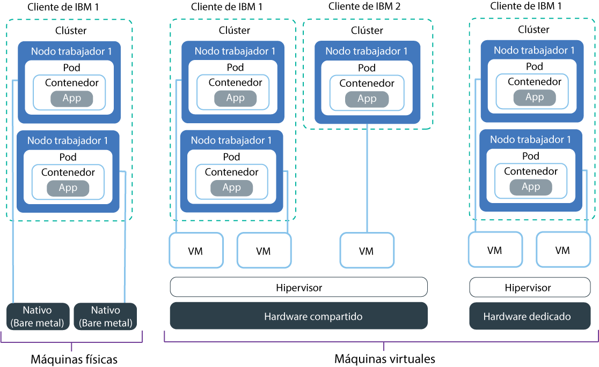

---

copyright:
  years: 2014, 2019
lastupdated: "2019-06-11"

keywords: kubernetes, iks, multi az, multi-az, szr, mzr

subcollection: containers

---

{:new_window: target="_blank"}
{:shortdesc: .shortdesc}
{:screen: .screen}
{:pre: .pre}
{:table: .aria-labeledby="caption"}
{:codeblock: .codeblock}
{:tip: .tip}
{:note: .note}
{:important: .important}
{:deprecated: .deprecated}
{:download: .download}
{:preview: .preview}

# Planificación de la configuración del nodo trabajador
{: #planning_worker_nodes}

Un clúster de Kubernetes está formado por nodos trabajadores agrupados en agrupaciones de nodos trabajadores y se supervisa y se gestiona de forma centralizada desde el nodo maestro de Kubernetes. Los administradores del clúster deciden cómo configurar el clúster de nodos trabajadores para garantizar que los usuarios del clúster disponen de todos los recursos para desplegar y ejecutar las apps en el clúster.
{:shortdesc}

Cuando se crea un clúster estándar, se solicitan los nodos trabajadores de las mismas especificaciones de memoria, CPU y espacio de disco (tipo) en la infraestructura de IBM Cloud (SoftLayer) en su nombre y se añaden a la agrupación predeterminada de nodos trabajadores del clúster. A cada nodo trabajador se la asigna un ID exclusivo y un nombre de dominio que no se debe cambiar después de haber creado el clúster. Puede elegir entre servidores virtuales o físicos (nativos). En función del nivel de aislamiento de hardware que elija, los nodos trabajadores virtuales se pueden configurar como nodos compartidos o dedicados. Para añadir distintos tipos al clúster, [cree otra agrupación de nodos trabajadores](/docs/containers?topic=containers-cli-plugin-kubernetes-service-cli#cs_worker_pool_create).

Kubernetes limita el número máximo de nodos trabajadores que puede tener en un clúster. Consulte el apartado sobre [nodo trabajador y cuotas de pod ](https://kubernetes.io/docs/setup/cluster-large/) para obtener más información.

¿Desea asegurarse de que siempre tiene suficientes nodos trabajadores para cubrir la carga de trabajo? Pruebe nuestro [programa de escalado automático de clústeres](/docs/containers?topic=containers-ca#ca).
{: tip}

 

## Hardware disponible para los nodos trabajadores
{: #shared_dedicated_node}

Cuando se crea un clúster estándar en {{site.data.keyword.Bluemix_notm}}, se selecciona si las agrupaciones de trabajadores constan de nodos trabajadores que son máquinas físicas (nativas) o máquinas virtuales que se ejecutan en hardware físico. También se selecciona el tipo de nodo trabajador, la combinación de memoria, la CPU y otras especificaciones de la máquina, como el almacenamiento de disco.
{:shortdesc}

Si desea más de un tipo de nodo trabajador, debe crear una agrupación de trabajadores para cada tipo. No puede cambiar el tamaño de los nodos trabajadores existentes para tener recursos diferentes, como por ejemplo CPU o memoria. Cuando se crea un clúster gratuito, el nodo trabajador se suministra automáticamente como nodo compartido virtual en la cuenta de infraestructura de IBM Cloud (SoftLayer). En clústeres estándares, puede elegir el tipo de máquina que funcione mejor para su carga de trabajo. A medida que lo planifique, tenga en cuenta las
[reservas de recursos de nodos trabajadores](#resource_limit_node) en la capacidad total de CPU y memoria.

Seleccione una de las opciones siguientes para decidir el tipo de agrupación de trabajadores que desea.
* [Máquinas virtuales](#vm)
* [Máquinas físicas (nativas)](#bm)
* [Máquinas de almacenamiento definido por software (SDS)](#sds)

## Máquinas virtuales
{: #vm}

Las máquinas virtuales ofrecen una mayor flexibilidad, unos tiempos de suministro más reducidos y proporcionan más características automáticas de escalabilidad que las máquinas nativas, a un precio más reducido. Puede utilizar máquinas virtuales en la mayoría de los casos prácticos de finalidad general como, por ejemplo, en entornos de desarrollo y pruebas, entornos de transferencia y producción, microservicios y apps empresariales. Sin embargo, deberá encontrar un compromiso con su rendimiento. Si necesita un alto rendimiento de cálculo con cargas de trabajo intensivas de RAM, datos o GPU, utilice [máquinas nativas](#bm).
{: shortdesc}

**¿Quiero utilizar hardware compartido o dedicado?** 
Cuando se crea un clúster virtual estándar, debe seleccionar si desea que el hardware subyacente se comparta entre varios clientes de {{site.data.keyword.IBM_notm}} (tenencia múltiple) o se le dedique a usted exclusivamente (tenencia única).

* **En una configuración de hardware compartido multiarrendatario**: los recursos físicos, como la CPU y la memoria, se comparten en todas las máquinas virtuales desplegadas en el mismo hardware físico. Para asegurarse de que cada máquina virtual se pueda ejecutar de forma independiente, un supervisor de máquina virtual, también conocido como hipervisor, segmenta los recursos físicos en entidades aisladas y los asigna como recursos dedicados a una máquina virtual (aislamiento de hipervisor).
* **En una configuración de hardware de único arrendatario**: todos los recursos físicos están dedicados únicamente a usted. Puede desplegar varios nodos trabajadores como máquinas virtuales en el mismo host físico. De forma similar a la configuración de tenencia múltiple,
el hipervisor asegura que cada nodo trabajador recibe su parte compartida de los recursos físicos disponibles.

Los nodos compartidos suelen resultar más económicos que los nodos dedicados porque los costes del hardware subyacente se comparten entre varios clientes. Sin embargo, cuando decida entre nodos compartidos y dedicados, debe ponerse en contacto con el departamento legal y ver el nivel de aislamiento y de conformidad de la infraestructura que necesita el entorno de app.

Algunos tipos solo están disponibles para un tipo de configuración de arrendamiento. Por ejemplo, las máquinas virtuales `m3c`
solo están disponibles como configuración de arrendamiento `compartido`.
{: note}

**¿Cuáles son las características generales de las máquinas virtuales?** 
Las máquinas virtuales utilizan el disco local en lugar de la red de área de almacenamiento (SAN) por motivos de fiabilidad. Entre las ventajas de fiabilidad se incluyen un mejor rendimiento al serializar bytes en el disco local y una reducción de la degradación del sistema de archivos debido a anomalías de la red. Todas las máquinas virtuales se suministran con velocidad de red de 1000 Mbps, 25 GB de almacenamiento en disco local primario para el sistema de archivos del sistema operativo y 100 GB de almacenamiento en disco local secundario para datos como, por ejemplo, el tiempo de ejecución de contenedor y `kubelet`. El almacenamiento local en el nodo trabajador solo es para el proceso a corto plazo y los discos primario y secundario se limpian cuando se actualiza o se vuelve a cargar el nodo trabajador. Para ver las soluciones de almacenamiento persistente, consulte [Planificación de almacenamiento persistente altamente disponible](/docs/containers?topic=containers-storage_planning#storage_planning).

**¿Qué hago si tengo tipos de máquina más antiguos?** 
Si en su clúster hay tipos de nodo trabajador en desuso, como `x1c` o el más antiguo `x2c` de Ubuntu 16, puede [actualizar el clúster para que tenga nodos trabajadores `x3c` de Ubuntu 18](/docs/containers?topic=containers-update#machine_type).

**¿Qué tipos de máquina virtual están disponibles?** 
Los tipos de nodos trabajadores varían según la zona. En la tabla siguiente se incluye la versión más reciente de un tipo, como por ejemplo los nodos trabajadores `x3c` de Ubuntu 18, en lugar de los tipos de nodo trabajador más antiguos, `x2c` de Ubuntu 16. Para ver los tipos de máquinas disponibles en su zona, ejecute `ibmcloud ks machine-types <zone>`. También puede consultar los tipos de máquina [nativa](#bm) o [SDS](#sds) disponibles.

{: #vm-table}
<table>
<caption>Tipos de máquina virtual disponibles en {{site.data.keyword.containerlong_notm}}.</caption>
<thead>
<th>Nombre y caso de uso</th>
<th>Núcleos / Memoria</th>
<th>Disco primario / secundario</th>
<th>Velocidad de red</th>
</thead>
<tbody>
<tr>
<td><strong>Virtual, u3c.2x4</strong>: Utilice esta máquina virtual con el tamaño más reducido para realizar pruebas rápidas, pruebas de conceptos y ejecutar otras cargas ligeras.</td>
<td>2 / 4 GB</td>
<td>25 GB / 100 GB</td>
<td>1000 Mbps</td>
</tr>
<tr>
<td><strong>Virtual, b3c.4x16</strong>: Seleccione esta máquina virtual equilibrada para realizar pruebas y desarrollo, y para otras cargas de trabajo ligeras.</td>
<td>4 / 16 GB</td>
<td>25 GB / 100 GB</td>
<td>1000 Mbps</td>
</tr>
<tr>
<td><strong>Virtual, b3c.16x64</strong>: Seleccione esta máquina virtual equilibrada para cargas de trabajo de tamaño medio.</td></td>
<td>16 / 64 GB</td>
<td>25 GB / 100 GB</td>
<td>1000 Mbps</td>
</tr>
<tr>
<td><strong>Virtual, b3c.32x128</strong>: Seleccione esta máquina virtual equilibrada para cargas de trabajo de tamaño medio a grande, por ejemplo, como base de datos y sitio web dinámico con muchos usuarios simultáneos.</td>
<td>32 / 128 GB</td>
<td>25 GB / 100 GB</td>
<td>1000 Mbps</td>
</tr>
<tr>
<td><strong>Virtual, c3c.16x16</strong>: Utilice este tipo cuando desee un equilibrio uniforme de recursos de cálculo del nodo trabajador para cargas de trabajo ligeras.</td>
<td>16 / 16 GB</td>
<td>25 GB / 100 GB</td>
<td>1000 Mbps</td>
</tr><tr>
<td><strong>Virtual, c3c.16x32</strong>: Utilice este tipo cuando desee una proporción de 1:2 entre recursos de CPU y de memoria del nodo trabajador para cargas de trabajo de tamaño medio.</td>
<td>16 / 32 GB</td>
<td>25 GB / 100 GB</td>
<td>1000 Mbps</td>
</tr><tr>
<td><strong>Virtual, c3c.32x32</strong>: Utilice este tipo cuando desee un equilibrio uniforme de recursos de cálculo del nodo trabajador para cargas de trabajo de tamaño medio.</td>
<td>32 / 32 GB</td>
<td>25 GB / 100 GB</td>
<td>1000 Mbps</td>
</tr><tr>
<td><strong>Virtual, c3c.32x64</strong>: Utilice este tipo cuando desee una proporción de 1:2 entre recursos de CPU y de memoria del nodo trabajador para cargas de trabajo de tamaño medio.</td>
<td>32 / 64 GB</td>
<td>25 GB / 100 GB</td>
<td>1000 Mbps</td>
</tr>
<tr>
<td><strong>Virtual, m3c.8x64</strong>: Utilice este tipo cuando desee una proporción de 1:8 de recursos de CPU y memoria para cargas de trabajo entre ligeras y medianas que necesitan más memoria, como las bases de datos de tipo {{site.data.keyword.Db2_on_Cloud_short}}. Solo está disponible en Dallas y como arrendamiento de hardware compartido (`--hardware shared`).</td>
<td>8 / 64 GB</td>
<td>25 GB / 100 GB</td>
<td>1000 Mbps</td>
</tr><tr>
<td><strong>Virtual, m3c.16x128</strong>: Utilice este tipo cuando desee una proporción de 1:8 de recursos de CPU y memoria para cargas de trabajo medianas que necesitan más memoria, como las bases de datos de tipo {{site.data.keyword.Db2_on_Cloud_short}}. Solo está disponible en Dallas y como arrendamiento de hardware compartido (`--hardware shared`).</td>
<td>16 / 128 GB</td>
<td>25 GB / 100 GB</td>
<td>1000 Mbps</td>
</tr><tr>
<td><strong>Virtual, m3c.30x240</strong>: Utilice este tipo cuando desee una proporción de 1:8 de recursos de CPU y memoria para cargas de trabajo entre medianas y grandes que necesitan más memoria, como las bases de datos de tipo {{site.data.keyword.Db2_on_Cloud_short}}. Solo está disponible en Dallas y como arrendamiento de hardware compartido (`--hardware shared`).</td>
<td>30 / 240 GB</td>
<td>25 GB / 100 GB</td>
<td>1000 Mbps</td>
</tr>
<tr>
<td><strong>Virtual, z1.2x4</strong>: Utilice este tipo cuando desee que se cree un nodo trabajador en contenedores Hyper Protect en IBM Z Systems.</td>
<td>2 / 4 GB</td>
<td>25 GB / 100 GB</td>
<td>1000 Mbps</td>
</tr>
</tbody>
</table>

## Máquinas físicas (nativas)
{: #bm}

Puede suministrar el nodo trabajador como un servidor físico de arrendatario único, también conocido como nativo.
{: shortdesc}

**¿En qué se diferencian las máquinas nativas de las máquinas virtuales?** 
Los servidores nativos ofrecen acceso directo a los recursos físicos en la máquina, como la memoria o la CPU. Esta configuración elimina el hipervisor de máquina virtual que asigna recursos físicos a máquinas virtuales que se ejecutan en el host. En su lugar, todos los recursos de una máquina nativa están dedicados exclusivamente al trabajador, por lo que no es necesario preocuparse por "vecinos ruidosos" que compartan recursos o ralenticen el rendimiento. Los tipos de máquina física tienen más almacenamiento local que virtual, y algunos tienen RAID para aumentar la disponibilidad de los datos. El almacenamiento local en el nodo trabajador solo es para el proceso a corto plazo y los discos primario y secundario se limpian cuando se actualiza o se vuelve a cargar el nodo trabajador. Para ver las soluciones de almacenamiento persistente, consulte [Planificación de almacenamiento persistente altamente disponible](/docs/containers?topic=containers-storage_planning#storage_planning).

**Además de mejores especificaciones para el rendimiento, ¿puedo conseguir algo con las máquinas nativas que no pueda con las máquinas virtuales?** 
Sí. Con las máquinas nativas, puede optar por habilitar Trusted Compute para verificar que los nodos trabajadores no se manipulan de forma indebida. Si no habilita la confianza al crear el clúster pero la desea posteriormente, puede utilizar el [mandato](/docs/containers?topic=containers-cli-plugin-kubernetes-service-cli#cs_cluster_feature_enable) `ibmcloud ks feature-enable`. Una vez que habilita la confianza, no puede inhabilitarla posteriormente. Puede crear un nuevo clúster sin confianza. Para obtener más información sobre cómo funciona la confianza durante el proceso de inicio del nodo, consulte [{{site.data.keyword.containerlong_notm}} con Trusted Compute](/docs/containers?topic=containers-security#trusted_compute). Trusted Compute está disponible para determinados tipos de máquinas nativas. Cuando ejecute el [mandato](/docs/containers?topic=containers-cli-plugin-kubernetes-service-cli#cs_machine_types) `ibmcloud ks machine-types <zone>`, puede ver las máquinas que dan soporte a la confianza en el campo **Trustable**. Por ejemplo, los distintos tipos de GPU `mgXc` no dan soporte a Trusted Compute.

Además de Trusted Compute, también puede aprovechar {{site.data.keyword.datashield_full}} (Beta). {{site.data.keyword.datashield_short}} se integra con la tecnología Intel® Software Guard Extensions (SGX) y la tecnología Fortanix® para que el código de carga de trabajo del contenedor de {{site.data.keyword.Bluemix_notm}} esté protegido mientras se utiliza. El código de la app y los datos se ejecutan en enclaves de CPU, que son áreas de confianza de la memoria en el nodo trabajador que protegen aspectos críticos de la app, lo que ayuda a mantener la confidencialidad del código y de los datos y evita su modificación. Si usted o su empresa necesitan mantener la confidencialidad de los datos debido a políticas internas, regulaciones gubernamentales o requisitos de conformidad del sector, esta solución podría ayudarle a moverse a la nube. Los casos prácticos incluyen instituciones financieras y sanitarias,
o países con políticas centrales que requieren soluciones de nube local.

**La opción nativa suena genial. ¿Qué me impide solicitarla en este momento?** 
Los servidores nativos son más caros que los servidores virtuales, y son más apropiados para apps de alto rendimiento que necesitan más recursos y control de host.

Los servidores nativos se facturan mensualmente. Si cancela un servidor nativo antes de fin de mes, se le facturará a finales de ese mes. Después de solicitar o de cancelar un servidor nativo, el proceso se completa manualmente en la cuenta de la infraestructura de IBM Cloud (SoftLayer). Por lo tanto, puede ser necesario más de un día laborable para completar la tramitación.
{: important}

**¿Qué tipos de servidores nativos puedo solicitar?** 
Los tipos de nodos trabajadores varían según la zona. En la tabla siguiente se incluye la versión más reciente de un tipo, como por ejemplo los nodos trabajadores `x3c` de Ubuntu 18, en lugar de los tipos de nodo trabajador más antiguos, `x2c` de Ubuntu 16. Para ver los tipos de máquinas disponibles en su zona, ejecute `ibmcloud ks machine-types <zone>`. También puede consultar los tipos de máquina [virtual](#vm) o [SDS](#sds).

Las máquinas nativas están optimizadas para distintos casos de uso como, por ejemplo, las cargas de trabajo intensivas de memoria RAM, datos o GPU.

Elija un tipo de máquina con la configuración de almacenamiento correcta para dar soporte a la carga de trabajo. Algunos tipos tienen una combinación de las siguientes configuraciones de disco y almacenamiento. Por ejemplo, algunos tipos tener un disco primario SATA con un disco secundario SSD sin formato.

* **SATA**: un dispositivo de almacenamiento en disco giratorio magnético que se suele utilizar para el disco primario del nodo trabajador que almacena el sistema de archivos del sistema operativo.
* **SSD**: un dispositivo de almacenamiento de unidad de estado sólido para los datos de alto rendimiento.
* **Sin formato**: el dispositivo de almacenamiento no está formateado, con la capacidad completa disponible para su uso.
* **RAID**: el dispositivo de almacenamiento tiene datos distribuidos para redundancia y rendimiento que varían en función del nivel de RAID. Como tal, la capacidad de disco que está disponible para su uso varía.

{: #bm-table}
<table>
<caption>Tipos de máquina nativa disponibles en {{site.data.keyword.containerlong_notm}}.</caption>
<thead>
<th>Nombre y caso de uso</th>
<th>Núcleos / Memoria</th>
<th>Disco primario / secundario</th>
<th>Velocidad de red</th>
</thead>
<tbody>
<tr>
<td><strong>Máquina nativa gran capacidad de memoria, mr3c.28x512</strong>: Maximice la RAM disponible para sus nodos trabajadores.</td>
<td>28 / 512 GB</td>
<td>2 TB SATA / 960 GB SSD</td>
<td>10000 Mbps</td>
</tr>
<tr>
<td><strong>Máquina nativas con GPU, mg3c.16x128</strong>: Elija este tipo para cargas de trabajo matemáticas intensivas, por ejemplo, para el cálculo de alto rendimiento, el aprendizaje automático u otras aplicaciones 3D. Este tipo tiene una tarjeta física Tesla K80 con dos unidades de proceso gráfico (GPU) por tarjeta, lo que supone un total de dos GPU.</td>
<td>16 / 128 GB</td>
<td>2 TB SATA / 960 GB SSD</td>
<td>10000 Mbps</td>
</tr>
<tr>
<td><strong>Máquina nativas con GPU, mg3c.28x256</strong>: Elija este tipo para cargas de trabajo matemáticas intensivas, por ejemplo, para el cálculo de alto rendimiento, el aprendizaje automático u otras aplicaciones 3D. Este tipo tiene dos tarjetas físicas Tesla K80 con dos GPU por tarjeta, lo que supone un total de cuatro GPU.</td>
<td>28 / 256 GB</td>
<td>2 TB SATA / 960 GB SSD</td>
<td>10000 Mbps</td>
</tr>
<tr>
<td><strong>Nativo con mucho uso de datos, md3c.16x64.4x4tb</strong>: Utilice este tipo para una cantidad significativa de almacenamiento en disco local, incluido RAID para aumentar la disponibilidad de los datos, para cargas de trabajo como sistemas de archivos distribuidos, bases de datos grandes y analítica de big data.</td>
<td>16 / 64 GB</td>
<td>2x2 TB RAID1 / 4x4 TB SATA RAID10</td>
<td>10000 Mbps</td>
</tr>
<tr>
<td><strong>Nativo con mucho uso de datos, md3c.28x512.4x4tb</strong>: utilice este tipo para una cantidad significativa de almacenamiento en disco local, incluido RAID para aumentar la disponibilidad de los datos, para cargas de trabajo como sistemas de archivos distribuidos, bases de datos grandes y analítica de big data.</td>
<td>28 / 512 GB</td>
<td>2x2 TB RAID1 / 4x4 TB SATA RAID10</td>
<td>10000 Mbps</td>
</tr>
<tr>
<td><strong>Máquina nativa equilibrada, mb3c.4x32</strong>: Utilice este tipo para cargas de trabajo equilibradas que requieran más recursos de computación que los ofrecidos por las máquinas virtuales. Este tipo también se puede habilitar con Intel® Software Guard Extensions (SGX) para que pueda utilizar <a href="/docs/services/data-shield?topic=data-shield-getting-started#getting-started" target="_blank">{{site.data.keyword.datashield_short}} (Beta)</a> para cifrar la memoria de datos.</td>
<td>4 / 32 GB</td>
<td>2 TB SATA / 2 TB SATA</td>
<td>10000 Mbps</td>
</tr>
<tr>
<td><strong>Máquina nativa equilibrada, mb3c.16x64</strong>: Utilice este tipo para cargas de trabajo equilibradas que requieran más recursos de computación que los ofrecidos por las máquinas virtuales.</td>
<td>16 / 64 GB</td>
<td>2 TB SATA / 960 GB SSD</td>
<td>10000 Mbps</td>
</tr>
<tr>
</tbody>
</table>

## Máquinas de almacenamiento definido por software (SDS)
{: #sds}

Los tipos de almacenamiento definido por software (SDS) son máquinas físicas que se suministran con discos adicionales sin formato para el almacenamiento local físico. A diferencia del disco local primario y secundario, estos discos sin formato no se limpian durante la actualización o la recarga de un nodo trabajador. Debido a que los datos se coubican con el nodo de cálculo, las máquinas SDS son adecuadas para cargas de trabajo de alto rendimiento.
{: shortdesc}

**¿Cuándo debo utilizar los tipos de SDS?** 
Normalmente, se utilizan máquinas SDS en los casos siguientes:
*  Si utiliza un complemento SDS, como por ejemplo [Portworx](/docs/containers?topic=containers-portworx#portworx), en el clúster, utilice una máquina SDS.
*  Si la app es un [StatefulSet ](https://kubernetes.io/docs/concepts/workloads/controllers/statefulset/) que requiere almacenamiento local, puede utilizar máquinas SDS y suministrar [volúmenes persistentes locales de Kubernetes (beta) ](https://kubernetes.io/blog/2018/04/13/local-persistent-volumes-beta/).
*  Es posible que tenga apps personalizadas que requieran almacenamiento local adicional en bruto.

Para ver más soluciones de almacenamiento, consulte [Planificación de almacenamiento persistente altamente disponible](/docs/containers?topic=containers-storage_planning#storage_planning).

**¿Qué tipos de SDS puedo solicitar?** 
Los tipos de nodos trabajadores varían según la zona. En la tabla siguiente se incluye la versión más reciente de un tipo, como por ejemplo los nodos trabajadores `x3c` de Ubuntu 18, en lugar de los tipos de nodo trabajador más antiguos, `x2c` de Ubuntu 16. Para ver los tipos de máquinas disponibles en su zona, ejecute `ibmcloud ks machine-types <zone>`. También puede consultar los tipos de máquina [nativa](#bm) o [virtual](#vm) disponibles.

Elija un tipo de máquina con la configuración de almacenamiento correcta para dar soporte a la carga de trabajo. Algunos tipos tienen una combinación de las siguientes configuraciones de disco y almacenamiento. Por ejemplo, algunos tipos tener un disco primario SATA con un disco secundario SSD sin formato.

* **SATA**: un dispositivo de almacenamiento en disco giratorio magnético que se suele utilizar para el disco primario del nodo trabajador que almacena el sistema de archivos del sistema operativo.
* **SSD**: un dispositivo de almacenamiento de unidad de estado sólido para los datos de alto rendimiento.
* **Sin formato**: el dispositivo de almacenamiento no está formateado, con la capacidad completa disponible para su uso.
* **RAID**: el dispositivo de almacenamiento tiene datos distribuidos para redundancia y rendimiento que varían en función del nivel de RAID. Como tal, la capacidad de disco que está disponible para su uso varía.

{: #sds-table}
<table>
<caption>Tipos de máquina SDS disponibles en {{site.data.keyword.containerlong_notm}}.</caption>
<thead>
<th>Nombre y caso de uso</th>
<th>Núcleos / Memoria</th>
<th>Disco primario / secundario</th>
<th>Discos sin formato adicionales</th>
<th>Velocidad de red</th>
</thead>
<tbody>
<tr>
<td><strong>Nativo con SDS, ms3c.4x32.1.9tb.ssd</strong>: Si necesita almacenamiento local adicional para rendimiento, utilice este tipo con mucha actividad de disco que admite almacenamiento definido por software (SDS).</td>
<td>4 / 32 GB</td>
<td>2 TB SATA / 960 GB SSD</td>
<td>1,9 TB Raw SSD (vía de acceso al dispositivo: `/dev/sdc`)</td>
<td>10000 Mbps</td>
</tr>
<tr>
<td><strong>Nativo con SDS, ms3c.16x64.1.9tb.ssd</strong>: Si necesita almacenamiento local adicional para rendimiento, utilice este tipo con mucha actividad de disco que admite almacenamiento definido por software (SDS).</td>
<td>16 / 64 GB</td>
<td>2 TB SATA / 960 GB SSD</td>
<td>1,9 TB Raw SSD (vía de acceso al dispositivo: `/dev/sdc`)</td>
<td>10000 Mbps</td>
</tr>
<tr>
<td><strong>Nativo con SDS, ms3c.28x256.3.8tb.ssd</strong>: Si necesita almacenamiento local adicional para rendimiento, utilice este tipo con mucha actividad de disco que admite almacenamiento definido por software (SDS).</td>
<td>28 / 256 GB</td>
<td>2 TB SATA / 1,9 TB SSD</td>
<td>3,8 TB Raw SSD (vía de acceso al dispositivo: `/dev/sdc`)</td>
<td>10000 Mbps</td>
</tr>
<tr>
<td><strong>Nativo con SDS, ms3c.28x512.4x3.8tb.ssd</strong>: Si necesita almacenamiento local adicional para rendimiento, utilice este tipo con mucha actividad de disco que admite almacenamiento definido por software (SDS).</td>
<td>28 / 512 GB</td>
<td>2 TB SATA / 1,9 TB SSD</td>
<td>4 discos, 3,8 TB de SSD sin formato (vías de acceso de dispositivo: `/dev/sdc`, `/dev/sdd`, `/dev/sde`, `/dev/sdf`)</td>
<td>10000 Mbps</td>
</tr>
</tbody>
</table>

## Reservas de recursos del nodo trabajador
{: #resource_limit_node}

{{site.data.keyword.containerlong_notm}} establece reservas de recursos de cálculo que limitan los recursos de cálculo disponibles en cada nodo trabajador. Los recursos de memoria y de CPU reservados no los pueden utilizar los pods del nodo trabajador, y reducen los recursos asignables en cada nodo trabajador. Al desplegar inicialmente los pods, si el nodo trabajador no tiene suficientes recursos asignables, el despliegue falla. Además, si los pods superan el límite de recursos del nodo trabajador, se desalojan los pods. En Kubernetes, este límite se llama [umbral de desalojo de hardware ](https://kubernetes.io/docs/tasks/administer-cluster/out-of-resource/#hard-eviction-thresholds).
{:shortdesc}

Si hay menos CPU o memoria disponible que las reservas del nodo trabajador, Kubernetes comienza a desalojar pods para restaurar recursos de cálculo suficientes. Los pods se vuelven a planificar en otro nodo trabajador si hay uno disponible. Si los pods se desalojan con frecuencia, añada más nodos trabajadores al clúster o establezca [límites de recurso ](https://kubernetes.io/docs/concepts/configuration/manage-compute-resources-container/#resource-requests-and-limits-of-pod-and-container) a los pods.

Los recursos que se reservan en el nodo trabajador dependen de la cantidad de CPU y memoria con la que se suministra el nodo trabajador. {{site.data.keyword.containerlong_notm}} define niveles de memoria y CPU tal como se muestra en las tablas siguientes. Si el nodo trabajador viene con recursos de cálculo en varios niveles, se reserva un porcentaje de los recursos de CPU y memoria para cada nivel.

Para revisar cuántos recursos de cálculo se utilizan actualmente en el nodo trabajador, ejecute [`kubectl top node` ](https://kubernetes.io/docs/reference/kubectl/overview/#top).
{: tip}

<table summary="Esta tabla muestra las reservas de memoria de nodo trabajador por nivel.">
<caption>Reservas de memoria de nodo trabajador por nivel.</caption>
<thead>
<tr>
  <th>Nivel de memoria</th>
  <th>% o cantidad reservada</th>
  <th>Ejemplo de nodo trabajador `b3c.4x16` (16 GB)</th>
  <th>Ejemplo de nodo trabajador `mg1c.28x256` (256 GB)</th>
</tr>
</thead>
<tbody>
<tr>
  <td>Primeros 4 GB (0-4 GB)</td>
  <td>25 % de memoria</td>
  <td>1 GB</td>
  <td>1 GB</td>
</tr>
<tr>
  <td>Siguientes 4 GB (5-8 GB)</td>
  <td>20 % de memoria</td>
  <td>0,8 GB</td>
  <td>0,8 GB</td>
</tr>
<tr>
  <td>Siguientes 8 GB (9-16 GB)</td>
  <td>10 % de memoria</td>
  <td>0,8 GB</td>
  <td>0,8 GB</td>
</tr>
<tr>
  <td>Siguientes 112 GB (17-128 GB)</td>
  <td>6 % de memoria</td>
  <td>N/D</td>
  <td>6,72 GB</td>
</tr>
<tr>
  <td>Resto de GB (129 GB+)</td>
  <td>2 % de memoria</td>
  <td>N/D</td>
  <td>2,54 GB</td>
</tr>
<tr>
  <td>Reserva adicional para el [desalojo de `kubelet`
](https://kubernetes.io/docs/tasks/administer-cluster/out-of-resource/)</td>
  <td>100 MB</td>
  <td>100 MB (cantidad fija)</td>
  <td>100 MB (cantidad fija)</td>
</tr>
<tr>
  <td>**Total reservado**</td>
  <td>**(varía)**</td>
  <td>**2,7 GB de 16 GB totales**</td>
  <td>**11,96 GB de 256 GB totales**</td>
</tr>
</tbody>
</table>

<table summary="Esta tabla muestra las reservas de CPU de nodo trabajador por nivel.">
<caption>Reservas de CPU de nodo trabajador por nivel.</caption>
<thead>
<tr>
  <th>Nivel de CPU</th>
  <th>% reservado</th>
  <th>Ejemplo de nodo trabajador `b3c.4x16` (4 núcleos)</th>
  <th>Ejemplo de nodo trabajador `mg1c.28x256` (28 núcleos)</th>
</tr>
</thead>
<tbody>
<tr>
  <td>Primer núcleo (Núcleo 1)</td>
  <td>6% núcleos</td>
  <td>0,06 núcleos</td>
  <td>0,06 núcleos</td>
</tr>
<tr>
  <td>Siguientes 2 núcleos (Núcleos 2-3)</td>
  <td>1% núcleos</td>
  <td>0,02 núcleos</td>
  <td>0,02 núcleos</td>
</tr>
<tr>
  <td>Siguientes 2 núcleos (Núcleos 4-5)</td>
  <td>0,5% núcleos</td>
  <td>0,005 núcleos</td>
  <td>0,01 núcleos</td>
</tr>
<tr>
  <td>Núcleos restantes (Núcleos 6+)</td>
  <td>0,25% núcleos</td>
  <td>N/D</td>
  <td>0,0575 núcleos</td>
</tr>
<tr>
  <td>**Total reservado**</td>
  <td>**(varía)**</td>
  <td>**0,085 núcleos de 4 núcleos totales**</td>
  <td>**0,1475 núcleos de 28 núcleos totales**</td>
</tr>
</tbody>
</table>
