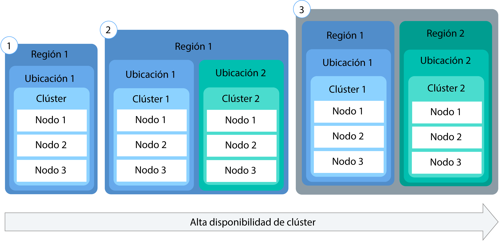
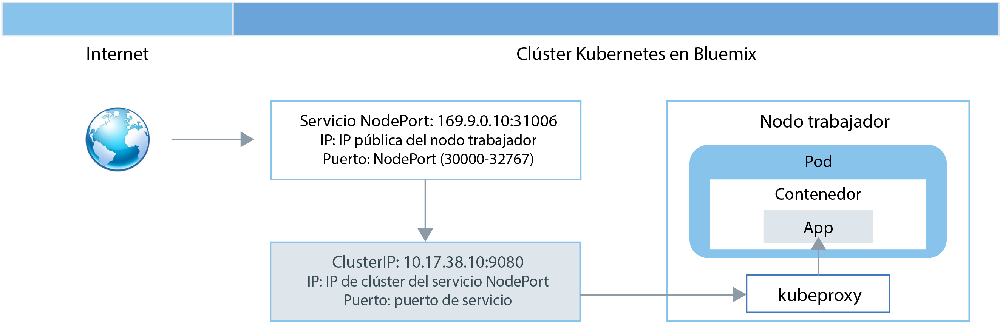
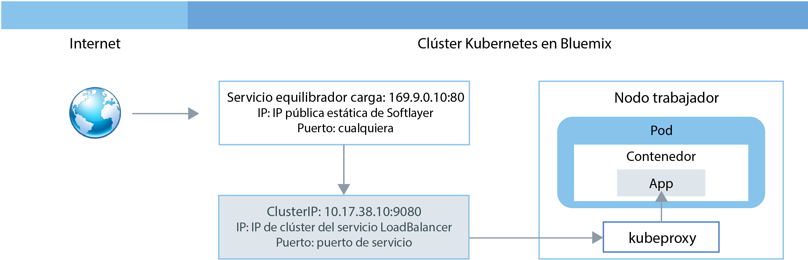
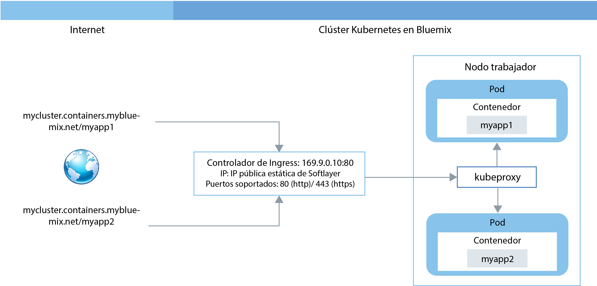
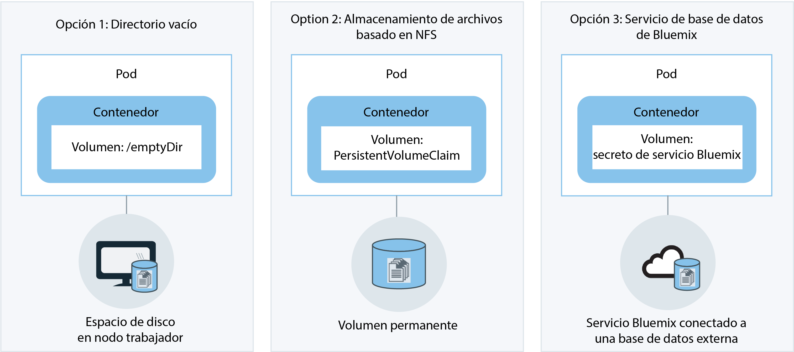

---

copyright:
  years: 2014, 2017
lastupdated: "2017-10-24"

---

{:new_window: target="_blank"}
{:shortdesc: .shortdesc}
{:screen: .screen}
{:pre: .pre}
{:table: .aria-labeledby="caption"}
{:codeblock: .codeblock}
{:tip: .tip}
{:download: .download}


# Planificación de clústeres y apps
{: #cs_planning}

{{site.data.keyword.containershort_notm}} ofrece varias opciones para configurar y personalizar el clúster de Kubernetes para que se ajuste a los requisitos funcionales y no funcionales de su organización. Algunas de estas configuraciones no se pueden modificar una vez que se ha creado un clúster. Conocer estas configuraciones de antemano puede ayudarle a garantizar que todos los recursos, como por ejemplo la memoria, el espacio de disco y las direcciones IP, estén disponibles para el equipo de desarrollo.
{:shortdesc}

<br />


## Comparación entre clústeres de tipo lite y estándar
{: #cs_planning_cluster_type}

Puede crear un clúster lite para familiarizarse y probar las prestaciones de Kubernetes o puede crear un clúster estándar para empezar a implementar las apps con todas las funciones de Kubernetes.
{:shortdesc}

|Características|Clústeres lite|Clústeres estándares|
|---------------|-------------|-----------------|
|[Disponible en {{site.data.keyword.Bluemix_notm}} Público](cs_ov.html#public_environment)|||
|[Red privada dentro de un clúster](#cs_planning_private_network)|||
|[Acceso a app pública por parte de un servicio NodePort](#cs_nodeport)|||
|[Gestión de accesos de usuario](cs_cluster.html#cs_cluster_user)|||
|[Acceso a servicios de {{site.data.keyword.Bluemix_notm}} desde el clúster y las apps](cs_cluster.html#cs_cluster_service)|||
|[Espacio de disco en nodo trabajador para almacenamiento](#cs_planning_apps_storage)|||
|[Almacenamiento permanente basado en archivo NFS con volúmenes](#cs_planning_apps_storage)| ||
|[Acceso a app pública o privada por parte de un servicio de equilibrador de carga](#cs_loadbalancer)| ||
|[Acceso a app pública por parte de un servicio Ingress](#cs_ingress)| ||
|[Direcciones IP públicas portátiles](cs_apps.html#cs_cluster_ip_subnet)| ||
|[Disponible en {{site.data.keyword.Bluemix_notm}} Dedicado (Beta cerrada)](cs_ov.html#dedicated_environment)| ||
{: caption="Tabla 1. Diferencias entre clústeres lite y estándares" caption-side="top"}

<br />


## Configuración de un clúster
{: #cs_planning_cluster_config}

Utilice clústeres estándares para incrementar la disponibilidad de las apps. Si distribuye su configuración entre varios clústeres y nodos trabajadores, es menos probable que los usuarios experimenten un tiempo de inactividad del sistema. Características incorporadas como, por ejemplo, el aislamiento y el equilibrio de carga, incrementan la resiliencia con relación a posibles anomalías con hosts, redes o apps.
{:shortdesc}

Revise estas configuraciones potenciales de clústeres que están ordenadas por grados de disponibilidad en orden ascendente:

[](https://console.bluemix.net/docs/api/content/containers/images/cs_cluster_ha_roadmap.png)

1.  Un clúster con varios nodos trabajadores
2.  Dos clústeres que se ejecutan en distintas ubicaciones de la misma región, cada uno con varios nodos trabajadores
3.  Dos clústeres que se ejecutan en distintas regiones, cada uno con varios nodos trabajadores

Obtenga más información sobre cómo puede utilizar estas técnicas para incrementar la disponibilidad de su clúster:

<dl>
<dt>Incluya suficientes nodos trabajadores para distribuirlos entre instancias de app</dt>
<dd>Para obtener una alta disponibilidad, permita que los desarrolladores de apps distribuyan sus contenedores entre varios nodos trabajadores por clúster. Tres nodos trabajadores permiten que se produzca un tiempo de inactividad de un nodo trabajador sin que se interrumpa el uso de la app. Puede especificar el número de nodos trabajadores que desea incluir al crear un clúster desde la GUI de [{{site.data.keyword.Bluemix_notm}} o desde la ](cs_cluster.html#cs_cluster_ui) [CLI](cs_cluster.html#cs_cluster_cli). Kubernetes limita el número máximo de nodos trabajadores que puede tener en un clúster. Consulte el apartado sobre [nodo trabajador y cuotas de pod ](https://kubernetes.io/docs/admin/cluster-large/) para obtener más información.
<pre class="codeblock">
<code>bx cs cluster-create --location &lt;dal10&gt; --workers 3 --public-vlan &lt;my_public_vlan_id&gt; --private-vlan &lt;my_private_vlan_id&gt; --machine-type &lt;u1c.2x4&gt; --name &lt;my_cluster&gt;</code>
</pre>
</dd>
<dt>Distribuya las apps entre clústeres</dt>
<dd>Cree varios clústeres, cada uno con varios nodos trabajadores. Si se produce una interrupción en un clúster, los usuarios pueden acceder a una app que también está desplegada en otro clúster.
<p>Clúster
1:</p>
<pre class="codeblock">
<code>bx cs cluster-create --location &lt;dal10&gt; --workers 3 --public-vlan &lt;my_public_vlan_id&gt; --private-vlan &lt;my_private_vlan_id&gt; --machine-type &lt;u1c.2x4&gt; --name &lt;my_cluster1&gt;</code>
</pre>
<p>Clúster
2:</p>
<pre class="codeblock">
<code>bx cs cluster-create --location &lt;dal12&gt; --workers 3 --public-vlan &lt;my_public_vlan_id&gt; --private-vlan &lt;my_private_vlan_id&gt; --machine-type &lt;u1c.2x4&gt;  --name &lt;my_cluster2&gt;</code>
</pre>
</dd>
<dt>Distribuya las apps entre clústeres de distintas regiones</dt>
<dd>Si distribuye las aplicaciones entre clústeres de distintas regiones, permite que se equilibre la carga
en función de la región en la que se encuentra el usuario. Si el clúster, el hardware, o incluso toda la ubicación de una región pasa a estar inactivo, el tráfico se redirecciona al contenedor desplegado en otro centro de datos.
<p><strong>Importante:</strong> Después de configurar el dominio personalizado, puede utilizar estos mandatos para crear los clústeres.</p>
<p>Ubicación
1:</p>
<pre class="codeblock">
<code>bx cs cluster-create --location &lt;dal10&gt; --workers 3 --public-vlan &lt;my_public_vlan_id&gt; --private-vlan &lt;my_private_vlan_id&gt; --machine-type &lt;u1c.2x4&gt; --name &lt;my_cluster1&gt;</code>
</pre>
<p>Ubicación 2:</p>
<pre class="codeblock">
<code>bx cs cluster-create --location &lt;ams03&gt; --workers 3 --public-vlan &lt;my_public_vlan_id&gt; --private-vlan &lt;my_private_vlan_id&gt; --machine-type &lt;u1c.2x4&gt; --name &lt;my_cluster2&gt;</code>
</pre>
</dd>
</dl>

<br />


## Configuración de nodos trabajadores
{: #cs_planning_worker_nodes}

Un clúster de Kubernetes está formado por nodos trabajadores virtuales y está supervisado y gestionado de forma centralizada desde el maestro de Kubernetes. Los administradores del clúster deben decidir cómo configurar el clúster de nodos trabajadores para garantizar que los usuarios del clúster disponen de todos los recursos para desplegar y ejecutar las apps en el clúster.
{:shortdesc}

Cuando se crea un clúster estándar, los nodos trabajadores se ordenan en IBM Bluemix Infrastructure (SoftLayer) en su nombre y se configuran en {{site.data.keyword.Bluemix_notm}}. A cada nodo trabajador se la asigna un ID exclusivo y un nombre de dominio que no se debe cambiar después de haber creado el clúster. En función del nivel de aislamiento de hardware que elija, los nodos trabajadores se puede configurar como nodos compartidos o dedicados. Cada nodo trabajador se suministra con un tipo de máquina específico que determina el número de vCPU, la memoria y el espacio en disco que están disponibles para los contenedores que se despliegan en el nodo trabajador. Kubernetes limita el número máximo de nodos trabajadores que puede tener en un clúster. Consulte el apartado sobre [nodo trabajador y cuotas de pod ](https://kubernetes.io/docs/admin/cluster-large/) para obtener más información.


### Hardware de los nodos trabajadores
{: #shared_dedicated_node}

Cada nodo trabajador se configura como una máquina virtual en el hardware físico. Cuando se crea un clúster estándar en {{site.data.keyword.Bluemix_notm}} Público, debe seleccionar si desea que el hardware subyacente se comparta entre varios clientes de {{site.data.keyword.IBM_notm}} (tenencia múltiple) o se le dedique a usted exclusivamente (tenencia única).
{:shortdesc}

En una configuración de tenencia múltiple, los recursos físicos, como CPU y memoria, se comparten entre todas las máquinas virtuales desplegadas en el mismo hardware físico. Para asegurarse de que cada máquina virtual se pueda ejecutar de forma independiente, un supervisor de máquina virtual, también conocido como hipervisor, segmenta los recursos físicos en entidades aisladas y los asigna como recursos dedicados a una máquina virtual (aislamiento de hipervisor).

En una configuración de tenencia única, se dedican al usuario todos los recursos físicos. Puede desplegar varios nodos trabajadores como máquinas virtuales en el mismo host físico. De forma similar a la configuración de tenencia múltiple,
el hipervisor asegura que cada nodo trabajador recibe su parte compartida de los recursos físicos disponibles.

Los nodos compartidos suelen resultar más económicos que los nodos dedicados porque los costes del hardware subyacente se comparten entre varios clientes. Sin embargo, cuando decida entre nodos compartidos y dedicados, debe ponerse en contacto con el departamento legal y ver el nivel de aislamiento y de conformidad de la infraestructura que necesita el entorno de app.

Cuando se crea un clúster lite, el nodo trabajador se suministra automáticamente como nodo compartido en la cuenta de IBM Bluemix Infrastructure (SoftLayer) de {{site.data.keyword.IBM_notm}}. 

Cuando crea un clúster en {{site.data.keyword.Bluemix_notm}} Dedicado, únicamente se utiliza una configuración de tenencia única de forma que todos los recursos físicos se dedican únicamente al usuario de la cuenta. Se despliegan varios nodos trabajadores como máquinas virtuales en el mismo host físico.

<br />


## Responsabilidades de la gestión de clústeres
{: #responsibilities}

Revise las responsabilidades que comparte con IBM para gestionar sus clústeres. Para revisar las responsabilidades de los clústeres que se gestionan en entornos de {{site.data.keyword.Bluemix_notm}} Dedicado, consulte [Diferencias en la gestión de clústeres entre los entornos de nube](cs_ov.html#env_differences). {:shortdesc}

**IBM es responsable de:**

- Desplegar el maestro, los nodos trabajadores y los componentes de gestión dentro del clúster, como el controlador de Ingress, en el momento de la creación del clúster
- Gestionar las actualizaciones, supervisión y recuperación del Kubernetes maestro para el clúster
- Supervisar la salud de los nodos trabajadores y proporcionar automatización para la actualización y recuperación de los nodos trabajadores
- Realizar tareas de automatización sobre su cuenta de la infraestructura, incluida la adición de nodos trabajadores, la eliminación de nodos trabajadores y la creación de una subred predeterminada
- Gestionar, actualizar y recuperar los componentes operativos dentro del clúster, como por ejemplo el controlador de Ingress y el plug-in de almacenamiento
- Suministrar volúmenes de almacenamiento cuando lo soliciten las reclamaciones de volumen permanente 
- Proporcionar valores de seguridad en todos los nodos trabajadores

<br />
**El usuario es responsable de:**

- [Desplegar y gestionar los recursos de Kubernetes, como pods, servicios y despliegues, dentro del clúster](cs_apps.html#cs_apps_cli)
- [Aprovechar la capacidad del servicio y de Kubernetes para garantizar la alta disponibilidad de las apps](cs_planning.html#highly_available_apps)
- [Añadir o eliminar capacidad mediante la CLI para añadir o eliminar nodos trabajadores](cs_cli_reference.html#cs_worker_add)
- [Crear VLAN públicas y privadas en IBM Bluemix Infrastructure (SoftLayer) para el aislamiento de la red del clúster ](https://knowledgelayer.softlayer.com/topic/vlans)
- [Garantizar que todos los nodos trabajadores tienen conectividad de red con el URL maestro de Kubernetes](cs_security.html#opening_ports) <p>**Nota**: Si un trabajador tiene VLAN tanto públicas como privadas, se configura la conectividad de red. Si el nodo trabajador solo tiene una VLAN privada configurada, se necesita vyatta para proporcionar conectividad de red.</p>
- [Determinar cuándo se deben actualizar los nodos kube-apiserver y los trabajadores cuando hay disponibles actualizaciones de versión mayores o menores de Kubernetes](cs_cluster.html#cs_cluster_update)
- [Emprender la acción adecuada para recuperar los nodos trabajadores con problemas mediante la ejecución de mandatos `kubectl`, como `cordon` o `drain`, y la ejecución de mandatos `bx cs`, como `reboot`, `reload` o `delete`](cs_cli_reference.html#cs_worker_reboot)
- [Añadir o eliminar subredes adicionales en IBM Bluemix Infrastructure (SoftLayer) cuando sea necesario](cs_cluster.html#cs_cluster_subnet)
- [Hacer copia de seguridad y restaurar datos en el almacenamiento permanente en IBM Bluemix Infrastructure (SoftLayer) ](../services/RegistryImages/ibm-backup-restore/index.html#ibmbackup_restore_starter)

<br />


## Despliegues
{: #highly_available_apps}

Cuanto más ampliamente distribuya la configuración entre varios nodos trabajadores y clústeres, menor será la probabilidad de que los usuarios experimenten tiempo de inactividad con la app.
{:shortdesc}

Revise estas configuraciones potenciales de app que están ordenadas con grados de disponibilidad en aumento:

[](../api/content/containers/images/cs_app_ha_roadmap.png)

1.  Un despliegue con n+2 pods gestionados por un conjunto de réplicas.
2.  Un despliegue con n+2 pods gestionados por un conjunto de réplicas y distribuidos en varios nodos (antiafinidad) en la misma ubicación.
3.  Un despliegue con n+2 pods gestionados por un conjunto de réplicas y distribuidos en varios nodos (antiafinidad) en distintas ubicaciones.
4.  Un despliegue con n+2 pods gestionados por un conjunto de réplicas y distribuidos en varios nodos (antiafinidad) en distintas regiones.

Obtenga más información sobre las técnicas para aumentar la disponibilidad de su app:

<dl>
<dt>Utilice despliegues y conjuntos de réplicas para desplegar la app y sus dependencias</dt>
<dd>Un despliegue es un recurso de Kubernetes que puede utilizar para declarar todos los componentes de su app y sus dependencias. Si describe cada componente en lugar de escribir todos los pasos necesarios y el orden con el que se crean, puede concentrarse en cómo debe quedar la app cuando se ejecute.
</br></br>
Si despliega más de un pod, se crea automáticamente un conjunto de réplicas que supervisa los pods y garantiza que el número deseado de pods están activos y en ejecución en todo momento. Cuando un pod pasa a estar inactivo, el conjunto de réplicas sustituye el pod que no responde por uno nuevo.
</br></br>
Puede utilizar un despliegue para definir estrategias para la app que incluyan el número de pods que desea añadir durante una actualización continuada y el número de pods que pueden no estar disponibles al mismo tiempo. Cuando lleva a cabo una actualización continuada, el despliegue comprueba si la revisión funciona o no y detiene la implantación cuando se detectan anomalías.
</br></br>
Los despliegues también proporcionan la posibilidad de desplegar simultáneamente varias revisiones con diferentes distintivos, por lo que puede, por ejemplo, probar un despliegue antes de decidir si se debe enviar a producción.
</br></br>
Cada despliegue realiza un seguimiento de las revisiones que se han desplegado. Puede utilizar este historial de revisiones para retrotraerse a una versión anterior cuando detecta que las actualizaciones no funcionan como esperaba.</dd>
<dt>Incluya suficientes réplicas para la carga de trabajo de la app, más dos</dt>
<dd>Para que la app esté aún más disponible y resulte más resistente frente a errores, considere la posibilidad de incluir más réplicas que el mínimo para gestionar la carga de trabajo prevista. Las réplicas adicionales pueden gestionar la carga de trabajo en el caso de que un pod se cuelgue y el conjunto de réplicas aún no haya recuperado el pod inactivo. Para la protección frente a dos anomalías simultáneas, incluya dos réplicas adicionales. Esta configuración es un patrón de tipo N+2, donde N es el número de réplicas necesario para gestionar la carga de trabajo entrante y +2 significa dos réplicas adicionales. Puede tener tantos pods como desee en un clúster, siempre que el clúster tenga suficiente espacio para ellos.</dd>
<dt>Distribuya los pods entre varios nodos (antiafinidad)</dt>
<dd>Cuando se crea un despliegue, cada pod se puede desplegar en el mismo nodo trabajador. Esta configuración en la que los pods residen en el mismo nodo trabajador se conoce
como afinidad o coubicación. Para proteger la app ante un error del nodo trabajador, puede hacer que el despliegue distribuya los pods entre varios nodos trabajadores mediante la opción <strong>podAntiAffinity</strong>. Esta opción solo está disponible para los clústeres estándares.

</br></br>
<strong>Nota:</strong> El siguiente archivo YAML hace que cada pod se despliegue en un nodo trabajador diferente. Cuando tenga más réplicas definidas que nodos trabajadores disponibles en el clúster, solo se despliega el número de réplicas que cumpla el requisito antiafinidad. Las réplicas adicionales permanecen en estado pendiente hasta que se añaden al clúster nodos trabajadores adicionales.

<pre class="codeblock">
<code>apiVersion: extensions/v1beta1
kind: Deployment
metadata:
  name: wasliberty
spec:
  replicas: 3
  template:
    metadata:
      labels:
        app: wasliberty
    spec:
      affinity:
        podAntiAffinity:
          preferredDuringSchedulingIgnoredDuringExecution:
          - weight: 100
            podAffinityTerm:
              labelSelector:
                matchExpressions:
                - key: app
                  operator: In
                  values:
                  - wasliberty
              topologyKey: kubernetes.io/hostname
      containers:
      - name: wasliberty
        image: registry.&lt;region&gt;.bluemix.net/ibmliberty
        ports:
        - containerPort: 9080
---
apiVersion: v1
kind: Service
metadata:
  name: wasliberty
  labels:
    app: wasliberty
spec:
  ports:
    # el puerto en el que debe servir este servicio
  - port: 9080
  selector:
    app: wasliberty
  type: NodePort</code></pre>

</dd>
<dt>Distribuya los pods entre varias ubicaciones o regiones</dt>
<dd>Para proteger la app ante un error de la ubicación o de la región, puede crear un segundo clúster en otra ubicación o región y utilizar el archivo YAML de despliegue para desplegar un conjunto de réplicas duplicado para la app. Mediante la adición de una ruta compartida y un equilibrador de la carga frente a los clústeres, puede distribuir la carga de trabajo entre las ubicaciones y regiones. Para obtener más información sobre cómo compartir una ruta entre clústeres, consulte <a href="https://console.bluemix.net/docs/containers/cs_cluster.html#cs_cluster" target="_blank">Alta disponibilidad de clústeres</a>.

Para obtener más información, revise las opciones correspondientes a <a href="https://console.bluemix.net/docs/containers/cs_planning.html#cs_planning_cluster_config" target="_blank">despliegues de alta disponibilidad</a>.</dd>
</dl>


### Despliegue de una app mínima
{: #minimal_app_deployment}

Un despliegue básico de app en un clúster lite o estándar puede incluir los siguientes componentes.
{:shortdesc}

<a href="../api/content/containers/images/cs_app_tutorial_components1.png"></a>

Ejemplo de archivo de configuración para una app mínima.
```
apiVersion: extensions/v1beta1
kind: Deployment
metadata:
  name: ibmliberty
spec:
  replicas: 1
  template:
    metadata:
      labels:
        app: ibmliberty
    spec:
      containers:
      - name: ibmliberty
        image: registry.<region>.bluemix.net/ibmliberty:latest
---
apiVersion: v1
kind: Service
metadata:
  name: ibmliberty-service
  labels:
    app: ibmliberty
spec:
  selector:
    run: ibmliberty
  type: NodePort
  ports:
   - protocol: TCP
     port: 9080
```
{: codeblock}

<br />


## Gestión de redes privadas
{: #cs_planning_private_network}

Una comunicación de red privada segura entre nodos trabajadores y pods se consigue con redes de área local virtuales privadas, también denominadas VLAN privadas. Una VLAN configura un grupo de nodos trabajadores y pods como si estuvieran conectadas a la misma conexión física.
{:shortdesc}

Cuando crea un clúster, cada clúster se conecta automáticamente a una VLAN privada. La VLAN privada determina la dirección IP privada que se asigna a un nodo trabajador durante la creación del clúster.

|Tipo de clúster|Gestor de la VLAN privada del clúster|
|------------|-------------------------------------------|
|Clústeres lite en {{site.data.keyword.Bluemix_notm}} Público|{{site.data.keyword.IBM_notm}}|
|Clústeres estándares en {{site.data.keyword.Bluemix_notm}} Público|En la cuenta de IBM Bluemix Infrastructure (SoftLayer)<p>**Sugerencia:** Para tener acceso a todas las VLAN de la cuenta, active el protocolo [VLAN Spanning ](https://knowledgelayer.softlayer.com/procedure/enable-or-disable-vlan-spanning).</p>|
|Clústeres estándares en {{site.data.keyword.Bluemix_notm}} Dedicado|{{site.data.keyword.IBM_notm}}|
{: caption="Tabla 2. Responsabilidades de la gestión de VLAN privada" caption-side="top"}

También se asigna una dirección IP privada a todos los pods desplegados en un nodo trabajador. Se asigna a los pods
una IP del rango de direcciones privadas 172.30.0.0/16 y se direccionan solo entre nodos trabajadores. Para evitar conflictos, no utilice este rango de IP en ningún otro nodo que se vaya a comunicar con los nodos trabajadores. Los nodos trabajadores y los pods pueden comunicarse de forma segura a través de la red privada utilizando direcciones IP privadas. Sin embargo, cuando un pod se cuelga o cuando es necesario volver a crear un nodo trabajador, se signa una nueva dirección IP privada.

Puesto que resulta difícil realizar un seguimiento de direcciones IP privadas cambiantes para las apps que deben ofrecer una alta disponibilidad, puede utilizar las funciones integradas de descubrimiento de servicios de Kubernetes y exponer las apps como servicios de IP de clúster en la red privada del clúster. Un servicio de Kubernetes agrupa un conjunto de pods y proporciona conexión de red a estos pods para otros servicios del clúster sin exponer la dirección IP privada real de cada pod. Cuando se crea un servicio de IP de clúster, se le asigna una dirección IP privada del rango de direcciones privadas 10.10.10.0/24. Al igual que sucede con el rango de direcciones privadas de pod, no utilice este rango de IP en ningún otro nodo que se vaya a comunicar con los nodos trabajadores. Solo se puede acceder a esta dirección IP dentro del clúster. No puede acceder a esta dirección IP desde Internet. Al mismo tiempo, se crea una entrada de búsqueda DNS para el servicio, que se guarda en el componente kube-dns del clúster. La entrada DNS contiene el nombre del servicio, el espacio de nombres en el que se ha creado el servicio y el enlace a la dirección IP privada asignada del clúster.

Si una app del clúster tiene que acceder a un pod situado tras un servicio de IP de clúster, puede utilizar la dirección IP privada del clúster asignada al servicio o puede enviar una solicitud utilizando el nombre del servicio. Si utiliza el nombre del servicio, se busca el nombre en el componente
kube-dns y se direcciona a la dirección IP privada del clúster del servicio. Cuando llega una solicitud al servicio, este asegura que todas las solicitudes se envían a los pods, independientemente de sus direcciones IP privadas y del nodo trabajador en el que estén desplegadas.

Para obtener más información sobre cómo crear un servicio de tipo IP de clúster, consulte [Servicios de Kubernetes ](https://kubernetes.io/docs/concepts/services-networking/service/#publishing-services---service-types).

<br />


## Gestión de redes públicas
{: #cs_planning_public_network}

Cuando crea un clúster, cada clúster debe estar conectado a una VLAN pública. La VLAN pública determina la dirección IP pública que se asigna a un nodo trabajador durante la creación del clúster.
{:shortdesc}

La interfaz de red pública para los nodos trabajadores tanto en clústeres lite como estándares está protegido por las políticas de red de Calico. Estas políticas bloqueas la mayor parte del tráfico de entrada de forma predeterminada, incluido SSH. Sin embargo, se permite el tráfico de entrada que se necesita para que Kubernetes funcione, así como las conexiones con los servicios NodePort, Loadbalancer e Ingress. Para obtener más información sobre estas políticas, incluido cómo modificarlas, consulte [Políticas de red](cs_security.html#cs_security_network_policies).

|Tipo de clúster|Gestor de la VLAN pública del clúster|
|------------|------------------------------------------|
|Clústeres lite en {{site.data.keyword.Bluemix_notm}} Público|{{site.data.keyword.IBM_notm}}|
|Clústeres estándares en {{site.data.keyword.Bluemix_notm}} Público|En la cuenta de IBM Bluemix Infrastructure (SoftLayer)|
|Clústeres estándares en {{site.data.keyword.Bluemix_notm}} Dedicado|{{site.data.keyword.IBM_notm}}|
{: caption="Tabla 3. Responsabilidades de la gestión de VLAN" caption-side="top"}

Dependiendo de si ha creado un clúster lite o estándar, puede elegir entre las opciones siguientes para exponer una app al público.

-   [Servicio NodePort](#cs_nodeport) (clústeres de tipo lite y estándar)
-   [Servicio LoadBalancer](#cs_loadbalancer) (solo clústeres estándares)
-   [Ingress](#cs_ingress) (solo clústeres estándares)


### Exposición de una app a Internet mediante un servicio NodePort
{: #cs_nodeport}

Exponga un puerto público en el nodo trabajador y utilice la dirección IP pública del nodo trabajador para acceder de forma pública al servicio en el clúster.
{:shortdesc}

[](https://console.bluemix.net/docs/api/content/containers/images/cs_nodeport.png)

Cuando expone una app creando un servicio de Kubernetes de tipo NodePort, se asigna al servicio
un NodePort comprendido entre 30000 y 32767 y una dirección IP de clúster interno. El servicio NodePort sirve como punto de entrada externo para las solicitudes entrantes para la app. El NodePort asignado se expone de forma pública en los valores kubeproxy de cada nodo trabajador del clúster. Cada nodo trabajador empieza a escuchar en el NodePort asignado para detectar solicitudes entrantes para el servicio. Para acceder al servicio desde Internet, puede utilizar la dirección IP pública de cualquier nodo trabajador asignado durante la creación del clúster y el NodePort en el formato `<ip_address>:<nodeport>`. Además de la dirección IP pública, está disponible un servicio NodePort en la dirección IP privada de un nodo trabajador.

Cuando llega una solicitud al servicio NodePort, se reenvía automáticamente a la IP del clúster interno del servicio y se transfiere desde el componente kubeproxy
a la dirección IP privada del pod en el que se ha desplegado la app. Solo se puede acceder a la IP del clúster dentro del clúster. Si tiene varias réplicas de la app que se ejecutan en distintos pods, el componente kubeproxy equilibra la carga de las solicitudes entrantes entre todas las réplicas.

**Nota:** La dirección IP pública del nodo trabajador no es permanente. Cuando un nodo trabajador se elimina o se vuelve a crear, se le asigna una nueva dirección IP pública. Puede utilizar el servicio NodePort para probar el acceso público para la app o cuando se necesita acceso público solo durante un breve periodo de tiempo. Si necesita una dirección IP pública estable y más disponibilidad para el servicio, exponga la app utilizando un [servicio LoadBalancer](#cs_loadbalancer) o [Ingress](#cs_ingress). 

Para obtener más información sobre cómo crear un servicio de tipo NodePort con {{site.data.keyword.containershort_notm}}, [Configuración del acceso público a una app mediante el tipo de servicio NodePort](cs_apps.html#cs_apps_public_nodeport).


### Exposición de una app a Internet mediante un servicio LoadBalancer
{: #cs_loadbalancer}

Exponga un puerto y utilice la dirección IP pública o privada para que el equilibrador de carga acceda a la app. 

[](https://console.bluemix.net/docs/api/content/containers/images/cs_loadbalancer.png)

Cuando se crea un clúster estándar, {{site.data.keyword.containershort_notm}} solicita automáticamente cinco direcciones IP públicas portátiles y las suministra a la cuenta de IBM Bluemix Infrastructure (SoftLayer) durante la creación de un clúster. Dos de las direcciones IP portables, una pública y una privada, se utilizan para el [controlador de Ingress](#cs_ingress). Se pueden utilizar cuatro
direcciones IP públicas portables para exponer apps al público mediante la creación de un servicio LoadBalancer.

Cuando se crea un servicio LoadBalancer de Kubernetes en un clúster en una VLAN pública, se crea un equilibrador de carga externo. Una de los cuatro direcciones IP públicas disponibles se asigna al equilibrador de carga. Si no hay ninguna dirección IP pública portátil disponible, la creación del servicio LoadBalancer falla. El servicio LoadBalancer sirve como punto de entrada externo para las solicitudes entrantes para la app. A diferencia de los servicios NodePort, puede asignar cualquier puerto al equilibrador de carga y no está vinculado a ningún rango de puertos determinado. La dirección IP pública portátil asignada al servicio LoadBalancer es permanente y no cambia cuando se elimina o se vuelve a crear un nodo trabajador.
Por lo tanto, el servicio LoadBalancer está más disponible que el servicio NodePort. Para acceder al servicio LoadBalancer desde Internet, utilice la dirección IP pública del equilibrador de carga y el puerto asignado en el formato `<ip_address>:<port>`.

Cuando llega una solicitud al servicio LoadBalancer, se reenvía automáticamente a la dirección IP del clúster interno asignada al servicio LoadBalancer durante la creación del servicio. Solo se puede acceder a la dirección IP del clúster dentro del clúster. Desde la dirección IP del clúster, las solicitudes entrantes se reenvían al componente `kube-proxy` del nodo trabajador. A continuación, las solicitudes se reenvían a la dirección IP privada del pod en el que se ha desplegado la app. Si tiene varias réplicas de la app que se ejecutan en pods diferentes, el componente `kube-proxy` equilibra la carga de las solicitudes entrantes entre todas las réplicas.

Si utiliza un servicio LoadBalancer, también hay un puerto de nodo disponible en cada dirección IP de cualquier nodo trabajador. Para bloquear el acceso al puerto del nodo mientras está utilizando un servicio LoadBalancer, consulte [Bloqueo del tráfico de entrada](cs_security.html#cs_block_ingress).

Las opciones para las direcciones IP cuando se crea un servicio LoadBalancer son las siguientes:

- Si el clúster está en una VLAN pública, se utiliza una dirección IP pública portátil. 
- Si el clúster solo está disponible en una VLAN privada, se utiliza dirección IP privada portátil. 
- Puede solicitar una dirección IP privada o pública portátil para un servicio LoadBalancer añadiendo una anotación al archivo de configuración: `service.kubernetes.io/ibm-load-balancer-cloud-provider-ip-type: <public_or_private>`.

Para obtener más información sobre cómo crear un servicio LoadBalancer con {{site.data.keyword.containershort_notm}}, [Configuración del acceso público a una app mediante el tipo de servicio LoadBalancer](cs_apps.html#cs_apps_public_load_balancer).

### Exponga una app en Internet con Ingress
{: #cs_ingress}

Ingress le permite exponer varios servicios en el clúster y ponerlos a disponibilidad pública mediante el uso de un solo punto de entrada público.

[](https://console.bluemix.net/docs/api/content/containers/images/cs_ingress.png)

En lugar de crear un servicio equilibrador de carga para cada app que desea exponer al público, Ingress proporciona una ruta pública exclusiva que le permite reenviar solicitudes públicas a apps dentro y fuera del clúster en función de sus vías de acceso individuales. Ingress consta de dos componentes principales. El recurso de Ingress define las reglas sobre cómo direccionar solicitudes de entrada para una app. Todos los recursos de Ingress deben estar registrados con el controlador de Ingress que escucha solicitudes de entrada de servicio HTTP o HTTPS y reenvía las solicitudes según las reglas definidas para cada recurso de Ingress.

Cuando se crea un clúster estándar, {{site.data.keyword.containershort_notm}} crea automáticamente un controlador de Ingress altamente disponible para el clúster y le asigna una ruta pública exclusiva con el formato `<cluster_name>.<region>.containers.mybluemix.net`. La ruta pública se enlaza a una dirección IP pública portátil que se suministra a la cuenta de IBM Bluemix Infrastructure (SoftLayer) durante la creación del clúster. 

Para exponer una app mediante Ingress, debe crear un servicio Kubernetes para la app y registrar este servicio con el controlador de Ingress mediante la definición de un recurso de Ingress. El recurso de Ingress especifica la vía de acceso que desee agregar a la ruta pública para formar un URL exclusivo para la app expuesta, como por ejemplo: `mycluster.us-south.containers.mybluemix.net/myapp`. Cuando especifica esta ruta en el navegador web, la solicitud se envía a la dirección IP pública portátil vinculada del controlador de Ingress. El controlador de Ingress comprueba si existe una regla de direccionamiento para la vía de acceso `myapp` en el clúster `mycluster`. Si se encuentra una regla coincidente, la solicitud que incluye la vía de acceso individual se reenvía al pod en el que se ha desplegado la app, teniendo en cuenta las reglas que se han definido en el objeto del recurso de Ingress original. Para que la app procese las solicitudes de entrada, asegúrese de que la app esté a la escucha en la vía de acceso individual que ha definido en el recurso de Ingress.

Puede configurar el controlador de Ingress de modo que gestione el tráfico de entrada de red para las apps en los siguientes casos:

-   Se utiliza el dominio proporcionado por IBM sin terminación TLS
-   Se utiliza el dominio proporcionado por IBM y un certificado TLS con terminación TLS
-   Se utiliza un dominio personalizado y un certificado TLS para realizar la terminación TLS
-   Se utiliza un dominio personalizado o proporcionado por IBM y certificados TLS para acceder a las apps externas al clúster
-   Se añaden posibilidades al controlador de Ingress mediante anotaciones

Para obtener más información sobre cómo utilizar Ingress con {{site.data.keyword.containershort_notm}}, consulte [Configuración del acceso público a una app mediante el controlador de Ingress](cs_apps.html#cs_apps_public_ingress).

<br />


## Gestión de accesos de usuario
{: #cs_planning_cluster_user}

Puede otorgar acceso a un clúster para a otros usuarios de la organización para garantizar que solo los usuarios autorizados puedan trabajar con el clúster y desplegar apps en el mismo.
{:shortdesc}

Para obtener más información, consulte [Gestión de usuarios y acceso a un clúster en {{site.data.keyword.containershort_notm}}](cs_cluster.html#cs_cluster_user).

<br />


## Registros de imágenes
{: #cs_planning_images}

Una imagen de Docker es la base para cada contenedor que pueda crear. Se crea una imagen a partir de Dockerfile, que es un archivo que contiene instrucciones para crear la imagen. Un Dockerfile puede hacer referencia a artefactos de compilación en sus instrucciones que se almacenan por separado, como por ejemplo una app, la configuración de la app y sus dependencias.
{:shortdesc}

Las imágenes normalmente se almacenan en un registro que puede ser tanto de acceso público (registro público) como estar configurado con acceso limitado para un pequeño grupo de usuarios (registro privado). Los registros públicos, como por ejemplo Docker Hub, se pueden utilizar para empezar a trabajar con Docker y Kubernetes para crear la primera app contenerizada de un clúster. Pero, cuando se trate de aplicaciones de empresa, utilice un registro privado, como el que se suministra en {{site.data.keyword.registryshort_notm}}, para proteger sus imágenes frente a un posible uso y modificación por parte de usuarios no autorizados. El administrador del clúster debe configurar los registros privados para asegurarse de que las credenciales para acceder al registro privado están disponibles para los usuarios del clúster.

Puede utilizar varios registros con {{site.data.keyword.containershort_notm}} para desplegar apps en el clúster.

|Registro|Descripción|Ventaja|
|--------|-----------|-------|
|[{{site.data.keyword.registryshort_notm}}](/docs/services/Registry/index.html)|Con esta opción, puede configurar su propio repositorio seguro de imágenes de Docker en {{site.data.keyword.registryshort_notm}} donde puede almacenar y compartir de forma segura imágenes entre los usuarios del clúster.|<ul><li>Gestione el acceso a las imágenes de la cuenta.</li><li>Utilice las apps de ejemplo y las imágenes proporcionadas por {{site.data.keyword.IBM_notm}}, como {{site.data.keyword.IBM_notm}} Liberty, como imagen padre y añádales su propio código de app.</li><li>Exploración automática de imágenes en busca de vulnerabilidades potenciales por parte de Vulnerability Advisor, que incluyen recomendaciones específicas del sistema operativo para solucionarlas.</li></ul>|
|Cualquier otro registro privado|Para conectar cualquier registro privado existente a su clúster, cree un [imagePullSecret ](https://kubernetes.io/docs/concepts/containers/images/). El secreto se utiliza para guardar el URL del registro y las credenciales de forma segura en un secreto de Kubernetes.|<ul><li>Utilice registros privados existentes independientemente de su origen (Docker Hub, registros propiedad de la organización u otros registros privados de Cloud).</li></ul>|
|Public Docker Hub|Utilice esta opción para utilizar directamente las imágenes públicas existentes de Docker Hub cuando no sea necesario realizar cambios en Dockerfile. <p>**Nota:** Tenga en cuenta que es posible que esta opción no se ajuste a los requisitos de seguridad de su organización, como la gestión de accesos, la exploración de vulnerabilidades o la privacidad de las apps.</p>|<ul><li>No se requiere configuración adicional para el clúster.</li><li>Incluye diversas aplicaciones de código abierto.</li></ul>|
{: caption="Tabla 4. Opciones de registro de imágenes público y privado" caption-side="top"}

Después de configurar el registro de imágenes, los usuarios del clúster pueden utilizar las imágenes de sus despliegues de apps en el clúster.

Para obtener más información sobre cómo acceder a un registro público o privado y utilizar una imagen para crear su contenedor, consulte [Utilización de registros de imágenes privados y públicos con {{site.data.keyword.containershort_notm}}](cs_cluster.html#cs_apps_images).

<br />


## Almacenamiento de datos permanentes
{: #cs_planning_apps_storage}

Un contenedor es efímero por diseño. Sin embargo, puede elegir entre varias opciones para conservar los datos en caso de migración tras error de un contenedor y para compartir datos entre contenedores.
{:shortdesc}

[](https://console.bluemix.net/docs/api/content/containers/images/cs_planning_apps_storage.png)

|Opción|Descripción|
|------|-----------|
|Opción 1: utilice `/emptyDir` para conservar los datos utilizando el espacio de disco disponible en el nodo trabajador<p>Esta característica está disponible para clústeres lite y estándares.</p>|Con esta opción, puede crear un volumen vacío en el espacio de disco del nodo trabajador asignado a un pod. El contenedor de dicho pod puede leer y grabar en ese volumen. Puesto que el volumen se asigna a un determinado pod, los datos no se pueden compartir con otros pods de un conjunto de réplicas.<p>Un volumen `/emptyDir` y sus datos se eliminan cuando el pod asignado se suprime de forma permanente del nodo trabajador.</p><p>**Nota:** Si el contenedor contenido en el pod se cuelga, los datos del volumen siguen estando disponibles en el nodo trabajador.</p><p>Para obtener más información, consulte [Volúmenes de Kubernetes](https://kubernetes.io/docs/concepts/storage/volumes/).</p>|
|Opción 2: cree reclamaciones de volumen permanente para proporcionar almacenamiento permanente basado en NFS para el despliegue<p>Esta característica solo está disponible para clústeres estándares.</p>|Con esta opción, tiene almacenamiento permanente de datos de la app y del contenedor mediante un número ilimitado de archivos NFS compartidos y volúmenes permanentes. Puede crear una [reclamación de volumen permanente](cs_apps.html) para iniciar una solicitud de almacenamiento de archivos basado en NFS. {{site.data.keyword.containershort_notm}} proporciona clases de almacenamiento predefinidas que definen el rango de tamaños del almacenamiento, IOPS y los permisos de lectura y escritura para el volumen. Puede elegir entre clases de almacenamiento cuando cree la reclamación de volumen permanente. Después de enviar una reclamación de volumen permanente, {{site.data.keyword.containershort_notm}} suministra de forma dinámica un volumen permanente alojado en almacenamiento de archivos basado en NFS.[ Puede montar la reclamación de volumen permanente](cs_apps.html#cs_apps_volume_claim) como un volumen en su pod para permitir que el contenedor del pod lea el volumen y grabe en el mismo. Los volúmenes permanentes se pueden compartir con pods del mismo conjunto de réplicas o con otros pods del mismo clúster.<p>Cuando un contenedor se cuelga o un pod se retira de un nodo trabajador, los datos no se eliminan y pueden acceder a los mismos otros pods que monten el volumen. Las reclamaciones de volúmenes permanentes se guardan en almacén permanente pero no tienen copias de seguridad. Si requiere una copia de seguridad de los datos, debe crear una copia de seguridad manual.</p><p>**Nota:** El almacenamiento compartido de archivos NFS permanentes se factura mensualmente. Si suministra almacenamiento permanente para el clúster y lo retira de inmediato, tendrá que pagar el cargo mensual del almacenamiento permanente, aunque solo lo haya utilizado un breve periodo de tiempo.</p>|
|Opción 3: enlace un servicio de base de datos de {{site.data.keyword.Bluemix_notm}}
al pod<p>Esta característica está disponible para clústeres lite y estándares.</p>|Con esta opción puede conservar y acceder a los datos utilizando el servicio de nube de la base de datos de {{site.data.keyword.Bluemix_notm}}. Cuando enlaza el servicio {{site.data.keyword.Bluemix_notm}} a un espacio de nombres del clúster, se crea un secreto
de Kubernetes. El secreto de Kubernetes contiene información confidencial sobre el servicio, como por ejemplo el URL del servicio y su nombre de usuario y contraseña. Puede montar el secreto como un volumen secreto en el pod y acceder al servicio mediante las credenciales del secreto. Si monta el volumen secreto en otros pods, también puede compartir datos entre pods.<p>Cuando un contenedor se cuelga o un pod se retira de un nodo trabajador, los datos no se eliminan y pueden acceder a los mismos otros pods que monten el volumen secreto.</p><p>La mayoría de servicios de base de datos de {{site.data.keyword.Bluemix_notm}} proporcionan espacio en disco para una cantidad de datos pequeña sin coste, para así poder probar sus características.</p><p>Para obtener más información sobre cómo enlazar un servicio de {{site.data.keyword.Bluemix_notm}} a un pod, consulte [Adición de servicios de {{site.data.keyword.Bluemix_notm}} correspondientes a apps en {{site.data.keyword.containershort_notm}}](cs_apps.html#cs_apps_service).</p>|
{: caption="Tabla 5. Opciones de almacén permanente para despliegues en clústeres de Kubernetes" caption-side="top"}

<br />


## Herramientas de supervisión
{: #cs_planning_health}

Puede utilizar las funciones estándares de Kubernetes y Docker para supervisar el estado de sus clústeres y apps. Para encontrar los registros para solucionar problemas de clústeres y apps, consulte [Configuración del registro de clúster](cs_cluster.html#cs_logging).{:shortdesc}

<dl>
<dt>Página de detalles del clúster en {{site.data.keyword.Bluemix_notm}}</dt>
<dd>{{site.data.keyword.containershort_notm}} proporciona información sobre el estado y la capacidad del clúster y sobre el uso de los recursos del clúster. Puede utilizar esta
GUI para escalar los clústeres, trabajar con el almacenamiento permanente y añadir funciones adicionales al clúster mediante la vinculación de servicios de {{site.data.keyword.Bluemix_notm}}. Para ver la página de detalles de un clúster, vaya al **Panel de control de {{site.data.keyword.Bluemix_notm}}** y seleccione un clúster.</dd>
<dt>Panel de control de Kubernetes</dt>
<dd>El panel de control de Kubernetes es una interfaz web administrativa que puede utilizar para revisar el estado de los nodos trabajadores, buscar recursos de Kubernetes, desplegar apps contenerizadas y resolver problemas de apps en función de la información de registro y supervisión. Para obtener más información sobre cómo acceder al panel de control de Kubernetes, consulte [Inicio del panel de control de Kubernetes para {{site.data.keyword.containershort_notm}}](cs_apps.html#cs_cli_dashboard).</dd>
<dt>{{site.data.keyword.monitoringlong_notm}}</dt>
<dd>En el caso de los clústeres estándares, las métricas se encuentran en el espacio de {{site.data.keyword.Bluemix_notm}} al que se inició sesión cuando se creó el clúster de Kubernetes.Las métricas de contenedor se recopilan automáticamente para todos los contenedores desplegados en un clúster. Estas métricas se envían y se ponen a disponibilidad mediante Grafana. Para obtener más información sobre las métricas, consulte el tema sobre [Supervisión de {{site.data.keyword.containershort_notm}}](/docs/services/cloud-monitoring/containers/analyzing_metrics_bmx_ui.html#analyzing_metrics_bmx_ui).<p>Para acceder al panel de control de Grafana, vaya a uno de los siguientes URL y seleccione la organización de {{site.data.keyword.Bluemix_notm}} y el espacio en el que ha creado el clúster.<ul><li>EE.UU. Sur y EE.UU. este: https://metrics.ng.bluemix.net</li><li>UK-Sur: https://metrics.eu-gb.bluemix.net</li><li>UE-Central: https://metrics.eu-de.bluemix.net</li></ul></p></dd></dl>

### Otras herramientas de supervisión de estado
{: #cs_planning_health_tools}

Puede configurar otras herramientas para disponer de funciones adicionales de registro y supervisión.
<dl>
<dt>Prometheus</dt>
<dd>Prometheus es una herramienta de supervisión, registro y generación de alertas de código abierto específicamente diseñada para Kubernetes para recuperar información detallada acerca del clúster, los nodos trabajadores y el estado de despliegue basado en la información de registro de Kubernetes. Para obtener información sobre la configuración, consulte [Integración de servicios con {{site.data.keyword.containershort_notm}}](#cs_planning_integrations).</dd>
</dl>

<br />


## Integraciones
{: #cs_planning_integrations}

Puede utilizar diversos servicios externos y servicios del catálogo de {{site.data.keyword.Bluemix_notm}} con un clúster estándar en {{site.data.keyword.containershort_notm}}.
{:shortdesc}

<table summary="Resumen de las características de accesibilidad">
<caption>Tabla 6. Opciones de integración para clústeres y apps en Kubernetes</caption>
<thead>
<tr>
<th>Servicio</th>
<th>Descripción</th>
</tr>
</thead>
<tbody>
<tr>
<td>Blockchain</td>
<td>Despliegue un entorno de desarrollo disponible a nivel público para IBM Blockchain en un clúster de Kubernetes en {{site.data.keyword.containerlong_notm}}. Utilice este entorno para desarrollar y personalizar su propia red de encadenamiento de bloques (blockchain) para desplegar apps que comparten un libro mayor inalterable para registrar el historial de las transacciones. Para obtener más información, consulte <a href="https://ibm-blockchain.github.io" target="_blank">Desarrollo en una plataforma
IBM Blockchain de recinto de pruebas de nube </a>. </td>
</tr>
<tr>
<td>Entrega continua</td>
<td>Automatice las compilaciones de las apps y los despliegues de los contenedores en clústeres de Kubernetes
utilizando a cadena de herramientas. Para obtener información sobre la configuración, consulte el blog sobre <a href="https://developer.ibm.com/recipes/tutorials/deploy-kubernetes-pods-to-the-bluemix-container-service-using-devops-pipelines/" target="_blank">Despliegue de pods de Kubernetes en {{site.data.keyword.containerlong_notm}} mediante conductos DevOps </a>. </td>
</tr>
<tr>
<td>Helm</td>
<td> <a href="https://helm.sh/" target="_blank">Helm </a> es un gestor de paquetes de Kubernetes. Puede crear Helm Charts para definir, instalar y actualizar aplicaciones Kubernetes complejas que se ejecuten en clústeres de {{site.data.keyword.containerlong_notm}}. Obtenga más información sobre cómo <a href="https://developer.ibm.com/recipes/tutorials/increase-deployment-velocity-with-kubernetes-helm-charts/" target="_blank">aumentar la velocidad del despliegue con Kubernetes Helm Charts </a>. </td>
</tr>
<tr>
<td>Istio</td>
<td>Istio es un servicio de código fuente abierto que ofrece a los desarrolladores una forma de conectarse, proteger, gestionar y supervisar una red de microservicios, también conocida como malla de servicios, en plataformas de orquestación de nube como Kubernetes. Istio proporciona la posibilidad de gestionar el tráfico de la red, equilibrar la carga entre los microservicios, aplicar políticas de acceso y verificar la identidad en la malla de servicios. Para instalar Istio en el clúster de Kubernetes en {{site.data.keyword.containershort_notm}}, consulte el <a href="https://istio.io/docs/tasks/installing-istio.html" target="_blank">tema de instalación</a> en la documentación de Istio. Para ver un trayecto de ejemplo del desarrollador sobre cómo utilizar Istio con Kubernetes, consulte <a href="https://developer.ibm.com/code/journey/manage-microservices-traffic-using-istio/" target="_blank">Gestionar el tráfico de microservicios mediante Istio </a>.</td>
</tr>
<tr>
<td>Prometheus</td>
<td>Prometheus es una herramienta de supervisión, registro y generación de alertas de código abierto específicamente diseñada para Kubernetes para recuperar información detallada acerca del clúster, los nodos trabajadores y el estado de despliegue basado en la información de registro de Kubernetes. Se recopila información sobre CPU, memoria, E/S y actividad de red
de todos los contenedores en ejecución de un clúster, que se puede utilizar en consultas personalizadas o en alertas para supervisar el rendimiento y las cargas de trabajo del clúster.
<p>Para utilizar Prometheus:</p>
<ol>
<li>Para instalar Prometheus, siga <a href="https://github.com/coreos/prometheus-operator/tree/master/contrib/kube-prometheus" target="_blank">las instrucciones de CoreOS </a>.
<ol>
<li>Cuando ejecute el mandato de exportación, utilice el espacio de nombres kube-system. <p><code>export NAMESPACE=kube-system hack/cluster-monitoring/deploy</code></p></li>
</ol>
</li>
<li>Después de desplegar Prometheus en el clúster, edite el código fuente de datos de Prometheus en Grafana para que haga referencia a <code>prometheus.kube-system:30900</code>.</li>
</ol>
</td>
</tr>
<tr>
<td>Weave Scope</td>
<td>Weave Scope proporciona un diagrama visual de los recursos de un clúster de Kubernetes, incluidos servicios, pods, contenedores, procesos, nodos, etc. Weave Scope ofrece métricas interactivas correspondientes a CPU y memoria y también herramientas para realizar seguimientos y ejecuciones en un contenedor.<p>Para obtener más información, consulte [Visualización de recursos de clúster de Kubernetes con Weave Scope y {{site.data.keyword.containershort_notm}}](cs_cluster.html#cs_weavescope).</p></li></ol>
</td>
</tr>
</tbody>
</table>

<br />


## Acceda al portafolio de IBM Bluemix Infrastructure (SoftLayer)
{: #cs_planning_unify_accounts}

Para crear un clúster de Kubernetes estándar, debe tener acceso al portafolio de IBM Bluemix Infrastructure (SoftLayer).
Este acceso es necesario para solicitar recursos de infraestructura de pago como, por ejemplo, nodos trabajadores, direcciones de IP públicas o almacenamiento persistente para su clúster.
{:shortdesc}

Las cuentas de {{site.data.keyword.Bluemix_notm}} de Pago según uso que se crearon después de que se habilitase el enlace de cuentas automático ya están configuradas con acceso al portafolio de IBM Bluemix Infrastructure (SoftLayer), por lo que es posible comprar recursos de infraestructura para su clúster sin ninguna otra configuración adicional.

Los usuarios con otros tipos de cuenta de {{site.data.keyword.Bluemix_notm}} o los usuarios con cuentas existentes de IBM Bluemix Infrastructure (SoftLayer) no enlazadas a su cuenta de {{site.data.keyword.Bluemix_notm}}, primero deben configurar sus cuentas para crear clústeres estándares.

Revise la siguiente tabla para encontrar las opciones disponibles para cada tipo de cuenta.

|Tipo de cuenta|Descripción|Opciones disponibles para crear un clúster estándar|
|------------|-----------|----------------------------------------------|
|Cuentas de prueba gratuita|Las cuentas de prueba gratuitas no pueden acceder al portafolio de IBM Bluemix Infrastructure (SoftLayer).<p>Si tiene una cuenta existente de IBM Bluemix Infrastructure (SoftLayer), puede enlazarla a su cuenta de prueba gratuita.</p>|<ul><li>Opción 1: [Actualice su cuenta de prueba gratuita a una cuenta de {{site.data.keyword.Bluemix_notm}} de Pago según uso](/docs/pricing/billable.html#upgradetopayg) que está configurada para acceder al portafolio de IBM Bluemix Infrastructure (SoftLayer). </li><li>Opción 2: [Enlace su cuenta de prueba gratuita a una cuenta existente de IBM Bluemix Infrastructure (SoftLayer).](/docs/pricing/linking_accounts.html#unifyingaccounts). <p>Después de enlazar ambas cuentas, la cuenta de prueba gratuita se actualiza de forma automática como una cuenta de Pago según uso. Cuando se enlazan sus cuentas, se le facturará a través de {{site.data.keyword.Bluemix_notm}} tanto para los recursos de {{site.data.keyword.Bluemix_notm}} como para los recursos de IBM Bluemix Infrastructure (SoftLayer). </p><p>**Nota:** La cuenta de IBM Bluemix Infrastructure (SoftLayer) que enlaza se debe configurar con permisos de superusuario. </p></li></ul>|
|Cuenta antiguas de Pago según uso|Las cuentas de Pago según uso que se crearon antes de que estuviese disponible el enlace de cuentas automático, no tenían acceso al portafolio de IBM Bluemix Infrastructure (SoftLayer). <p>Si tiene una cuenta existente de IBM Bluemix Infrastructure (SoftLayer), no puede enlazarla a una cuenta antigua de Pago según uso.</p>|<ul><li>Opción 1: [Crear una nueva cuenta de Pago según uso](/docs/pricing/billable.html#billable) que esté configurada para acceder al portafolio de IBM Bluemix Infrastructure (SoftLayer). Cuando elige esta opción, tendrá dos cuentas y dos facturaciones distintas para {{site.data.keyword.Bluemix_notm}}.<p>Si desea continuar utilizando su cuenta antigua de Pago según uso para crear clústeres estándares, debe utilizar su nueva cuenta de Pago según uso para generar una clave de API para acceder al portafolio de IBM Bluemix Infrastructure (SoftLayer). A continuación, debe configurar la clave de la API para su cuenta antigua de Pago según uso. Para obtener más información, consulte [Generación de una clave de API para cuentas antiguas de Suscripción y Pago según uso](#old_account). Tenga en cuenta que los recursos de IBM Bluemix Infrastructure (SoftLayer) se facturarán a través de su nueva cuenta de Pago según uso. </p></li><li>Opción 2: Si ya tiene una cuenta de IBM Bluemix Infrastructure (SoftLayer) existente que desea utilizar, puede [configurar sus credenciales](cs_cli_reference.html#cs_credentials_set) para su cuenta de {{site.data.keyword.Bluemix_notm}}.<p>**Nota:** La cuenta de IBM Bluemix Infrastructure (SoftLayer) que utiliza con su cuenta de {{site.data.keyword.Bluemix_notm}} se debe configurar con permisos de superusuario. </p></li></ul>|
|Cuentas de Suscripción|Las cuentas de Suscripción no se configuran con acceso al portafolio de IBM Bluemix Infrastructure (SoftLayer). |<ul><li>Opción 1: [Crear una nueva cuenta de Pago según uso](/docs/pricing/billable.html#billable) que esté configurada para acceder al portafolio de IBM Bluemix Infrastructure (SoftLayer). Cuando elige esta opción, tendrá dos cuentas y dos facturaciones distintas para {{site.data.keyword.Bluemix_notm}}.<p>Si desea continuar utilizando su cuenta de Suscripción para crear clústeres estándares, debe utilizar su nueva cuenta de Pago según uso para generar una clave de API para acceder al portafolio de IBM Bluemix Infrastructure (SoftLayer). A continuación, debe configurar la clave de la API para su cuenta de Suscripción. Para obtener más información, consulte [Generación de una clave de API para cuentas antiguas de Suscripción y Pago según uso](#old_account). Tenga en cuenta que los recursos de IBM Bluemix Infrastructure (SoftLayer) se facturarán a través de su nueva cuenta de Pago según uso. </p></li><li>Opción 2: Si ya tiene una cuenta de IBM Bluemix Infrastructure (SoftLayer) existente que desea utilizar, puede [configurar sus credenciales](cs_cli_reference.html#cs_credentials_set) para su cuenta de {{site.data.keyword.Bluemix_notm}}.<p>**Nota:** La cuenta de IBM Bluemix Infrastructure (SoftLayer) que utiliza con su cuenta de {{site.data.keyword.Bluemix_notm}} se debe configurar con permisos de superusuario. </p></li></ul>|
|Cuentas de IBM Bluemix Infrastructure (SoftLayer), no cuenta de {{site.data.keyword.Bluemix_notm}}|Para crear un clúster estándar, debe tener una cuenta de {{site.data.keyword.Bluemix_notm}}.|<ul><li>Opción 1: [Crear una nueva cuenta de Pago según uso](/docs/pricing/billable.html#billable) que esté configurada para acceder al portafolio de IBM Bluemix Infrastructure (SoftLayer). Cuando elige esta opción, se crea en su nombre una nueva cuenta de IBM Bluemix Infrastructure (SoftLayer). Tiene dos cuentas y facturaciones separadas de IBM Bluemix Infrastructure (SoftLayer). </li><li>Opción 2: [Cree una cuenta de prueba gratuita](/docs/pricing/free.html#pricing) y [enlácela a su cuenta de IBM Bluemix Infrastructure (SoftLayer) existente](/docs/pricing/linking_accounts.html#unifyingaccounts). Después de enlazar ambas cuentas, la cuenta de prueba gratuita se actualiza de forma automática como una cuenta de Pago según uso. Cuando se enlazan sus cuentas, se le facturará a través de {{site.data.keyword.Bluemix_notm}} tanto para los recursos de {{site.data.keyword.Bluemix_notm}} como para los recursos de IBM Bluemix Infrastructure (SoftLayer). <p>**Nota:** La cuenta de IBM Bluemix Infrastructure (SoftLayer) que enlaza se debe configurar con permisos de superusuario. </p></li></ul>|
{: caption="Tabla 7. Opciones disponibles para crear clústeres estándares con cuentas que no están enlazadas a una cuenta de IBM Bluemix Infrastructure (SoftLayer) " caption-side="top"}


### Generación de una clave API de IBM Bluemix Infrastructure (SoftLayer) para utilizar con cuentas de {{site.data.keyword.Bluemix_notm}}
{: #old_account}

Si desea continuar utilizando su cuenta antigua de Suscripción o de Pago según uso para crear clústeres estándares, debe generar una clave de API con la nueva cuenta de Pago según uso y establecer la clave de API para su cuenta antigua.
{:shortdesc}

Antes de continuar, cree una cuenta de {{site.data.keyword.Bluemix_notm}} de Pago según uso que está automáticamente configurada para acceder al portafolio de IBM Bluemix Infrastructure (SoftLayer). 

1.  Inicie una sesión en el portal de [IBM Bluemix Infrastructure (SoftLayer) ](https://control.softlayer.com/) con el {{site.data.keyword.ibmid}} y la contraseña que ha creado para su cuenta de pago según uso. 
2.  Seleccione **Cuenta** y, a continuación, **Usuarios**.
3.  Pulse **Generar** para generar una clave de API de IBM Bluemix Infrastructure (SoftLayer) para su cuenta de Pago según uso.
4.  Copia la clave de la API.
5.  Desde la interfaz de línea de mandatos, inicie una sesión en {{site.data.keyword.Bluemix_notm}}
utilizando el {{site.data.keyword.ibmid}} y la contraseña de su cuenta antigua de Pago según uso o Suscripción.

  ```
  bx login
  ```
  {: pre}

6.  Establezca la clave de API que generó con anterioridad para acceder al portafolio de IBM Bluemix Infrastructure (SoftLayer).
Sustituya `<API_KEY>` por la clave de API y `<USERNAME>` por el {{site.data.keyword.ibmid}} de la nueva cuenta de pago según uso.

  ```
  bx cs credentials-set --infrastructure-api-key <API_KEY> --infrastructure-username <USERNAME>
  ```
  {: pre}

7.  Empiece [creando clústeres estándares](cs_cluster.html#cs_cluster_cli).

**Nota:** Para revisar la clave de la API después de generarla, siga el paso 1 y el paso 2 y, a continuación, en la sección de **Clave de API**, pulse **Ver** para ver la clave de API para su ID de usuario.
