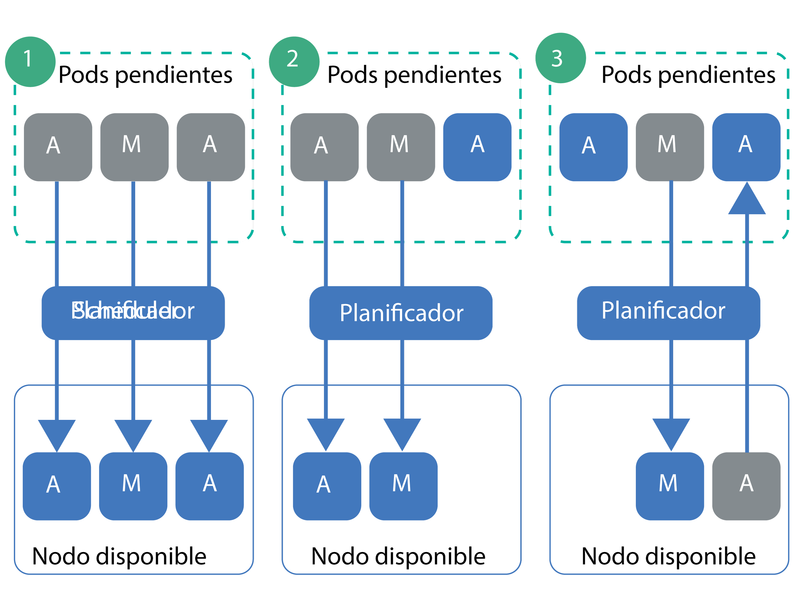

---

copyright:
  years: 2014, 2019
lastupdated: "2019-05-31"

keywords: kubernetes, iks

subcollection: containers

---

{:new_window: target="_blank"}
{:shortdesc: .shortdesc}
{:screen: .screen}
{:pre: .pre}
{:table: .aria-labeledby="caption"}
{:codeblock: .codeblock}
{:tip: .tip}
{:note: .note}
{:important: .important}
{:deprecated: .deprecated}
{:download: .download}
{:preview: .preview}


# Configuración de la prioridad de pod
{: #pod_priority}

Con la evitación y la prioridad de pod de Kubernetes, puede configurar las clases de prioridad para indicar la prioridad relativa de un pod. El planificador de Kubernetes tiene en cuenta la prioridad de un pod e incluso puede evitar (eliminar) pods con menor prioridad para hacer espacio en un nodo trabajador para pods de prioridad más alta. Los clústeres de {{site.data.keyword.containerlong}} que ejecutan Kubernetes versión 1.11.2 o posterior dan soporte al controlador de admisión `Priority` que aplica estas clases.
{: shortdesc}

**¿Por qué debo definir una prioridad de pod?**</br>
Como administrador del clúster, desea controlar qué pods son más importantes para la carga de trabajo del clúster. Las clases de prioridad pueden ayudarle a controlar las decisiones del planificador de Kubernetes para favorecer los pods de prioridad más alta sobre los pods de prioridad más baja. El planificador puede incluso evitar (eliminar) pods de prioridad más baja que se estén ejecutando, para que se puedan planificar pods pendientes de prioridad más alta.

Al establecer la prioridad de pod, puede evitar que las cargas de trabajo de prioridad más baja afecten a las cargas de trabajo críticas para el clúster, especialmente en los casos en los que el clúster empieza a alcanzar su capacidad de recursos.

Asegúrese de que ha [configurado correctamente el acceso de usuario](/docs/containers?topic=containers-users#users) al clúster y, si procede, [las políticas de seguridad de pod](/docs/containers?topic=containers-psp#psp). El acceso y las políticas de seguridad de pod pueden ayudar a evitar que usuarios no fiables desplieguen pods de alta prioridad que evitan que otros pods se planifiquen.
{: tip}

{: #priority_scheduling}
**¿Cómo funcionan los trabajos de planificación y evitación?**</br>
En general, los pods pendientes que tienen una prioridad más alta se planifican antes que los pods con prioridad más baja. Si no dispone de suficientes recursos en los nodos trabajadores, el planificador puede evitar (eliminar) pods para liberar recursos suficientes para que se planifiquen los pods de prioridad más alta. La evitación también se ve afectada por los periodos de terminación ordenada, los presupuestos de interrupción de pod y la afinidad de los nodos trabajadores.

Si no especifica una prioridad para el despliegue de pod, el valor predeterminado se establece en la clase de prioridad que se establece como `globalDefault`. Si no dispone de una clase de prioridad `globalDefault`, la prioridad predeterminada para todos los pods es cero (`0`). De forma predeterminada, {{site.data.keyword.containerlong_notm}} no establece un valor `globalDefault`, por lo que la prioridad predeterminada de pod es cero.

Para entender cómo la prioridad de pod y el planificador trabajan juntos, tenga en cuenta los casos de ejemplo de la figura siguiente. Debe colocar los pods priorizados en nodos trabajadores con recursos disponibles. De lo contrario, los pods de prioridad alta del clúster pueden quedar pendientes, al mismo tiempo que se eliminan pods existentes, como en el caso de ejemplo 3.

_Figura: casos de ejemplo de prioridad de pod_


1.  Tres pods con prioridad alta, media y baja están pendientes de planificación. El planificador encuentra un nodo trabajador disponible con espacio para los 3 pods, y los planifica en orden de prioridad, con el pod de prioridad más alto planificado primero.
2.  Tres pods con prioridad alta, media y baja están pendientes de planificación. El planificador encuentra un nodo trabajador disponible, pero el nodo trabajador sólo tiene recursos suficientes para admitir los pods de prioridad alta y media. El pod de prioridad baja no está planificado y se queda pendiente.
3.  Dos pods con prioridad alta y media están pendientes de planificación. Existe un tercer pod con una prioridad baja en un nodo trabajador disponible. Sin embargo, el nodo trabajador no tiene recursos suficientes para planificar ninguno de los pods pendientes. El planificador evita, o elimina, el pod de baja prioridad, que devuelve el pod a un estado pendiente. A continuación, el planificador intenta planificar el pod de prioridad alta. Sin embargo, el nodo trabajador no tiene suficientes recursos para planificar el pod de prioridad alta y, en su lugar, el planificador planifica el pod de prioridad media.

**Para obtener más información**: consulte la documentación de Kubernetes sobre [la evitación y la prioridad de pod ](https://kubernetes.io/docs/concepts/configuration/pod-priority-preemption/).

**¿Puedo inhabilitar el controlador de admisión de prioridad de pod?**</br>
No. Si no desea utilizar la prioridad de pod, no establezca un valor `globalDefault` ni incluya una clase de prioridad en los despliegues de pod. Cada pod se establece de forma predeterminada en cero, excepto los pods críticos del clúster que IBM despliega con las [clases de prioridad predeterminadas](#default_priority_class). Puesto que la prioridad de pod es relativa, esta configuración básica garantiza que se prioricen los pods críticos del clúster para los recursos, y planifica cualquier otro pod siguiendo las políticas de planificación existentes que tiene aplicadas.

**¿Cómo afectan las cuotas de recursos a la prioridad de pod?**</br>
Puede utilizar la prioridad de pod junto con las cuotas de recursos, incluyendo
[ámbitos de cuota ](https://kubernetes.io/docs/concepts/policy/resource-quotas/#quota-scopes) para clústeres que ejecutan Kubernetes 1.12 o posterior. Con ámbitos de cuotas, puede configurar las cuotas de recursos para que tengan en cuenta la prioridad de pod. Los pods de mayor prioridad pueden llegar a consumir recursos del sistema que están limitados por la cuota de recursos antes que los pods de menor prioridad.

## Clases de prioridad predeterminadas
{: #default_priority_class}

Los clústeres de {{site.data.keyword.containerlong_notm}} vienen con algunas clases de prioridad de forma predeterminada.
{: shortdesc}

No modifique las clases predeterminadas, que se utilizan para gestionar correctamente el clúster. Puede utilizar estas clases en los despliegues de apps o [crear sus propias clases de prioridad](#create_priority_class).
{: important}

En la tabla siguiente se describen las clases de prioridad que se encuentran en el clúster de forma predeterminada y para qué se utilizan.

| Nombre | Establecida por | Valor de prioridad | Finalidad |
|---|---|---|
| `system-node-critical` | Kubernetes | 2000001000 | Determinados pods que se despliegan en el espacio de nombres `kube-system` cuando se crea el clúster utilizan esta clase de prioridad para proteger la funcionalidad crítica de los nodos trabajadores, como los pods de redes, almacenamiento, registro, supervisión y métricas. |
| `system-cluster-critical` | Kubernetes | 2000000000 | Determinados pods que se despliegan en el espacio de nombres `kube-system` cuando se crea el clúster utilizan esta clase de prioridad para proteger la funcionalidad crítica de los clústeres, como los pods de redes, almacenamiento, registro, supervisión y métricas. |
| `ibm-app-cluster-critical` | IBM | 900000000 | Determinados pods que se despliegan en el espacio de nombres `ibm-system` cuando se crea el clúster utilizan esta clase de prioridad para proteger la funcionalidad crítica de las apps, como los pods de equilibrador de carga. |
{: caption="Clases de prioridad predeterminadas que no debe modificar" caption-side="top"}

Puede comprobar qué pods utilizan las clases de prioridad ejecutando el mandato siguiente.

```
kubectl get pods --all-namespaces -o custom-columns=NAME:.metadata.name,PRIORITY:.spec.priorityClassName
```
{: pre}

## Creación de una clase de prioridad
{: #create_priority_class}

Para establecer la prioridad de pod, tiene que utilizar una clase de prioridad.
{: shortdesc}

Antes de empezar:
* [Inicie una sesión en su cuenta. Si procede, apunte al grupo de recursos adecuado. Establezca el contexto para el clúster.](/docs/containers?topic=containers-cs_cli_install#cs_cli_configure)
* Asegúrese de que tiene el [rol de servicio **Escritor** o **Gestor** de {{site.data.keyword.Bluemix_notm}} IAM](/docs/containers?topic=containers-users#platform) sobre el espacio de nombres `default`.
* [Cree](/docs/containers?topic=containers-clusters#clusters_ui) o [actualice](/docs/containers?topic=containers-update#update) su clúster a Kubernetes versión 1.11 o posterior.

Para utilizar una clase de prioridad:

1.  Opcional: utilice una clase de prioridad existente como plantilla para la nueva clase.

    1.  Obtenga una lista de las clases de prioridad existentes.

        ```
        kubectl get priorityclasses
        ```
        {: pre}

    2.  Elija la clase de prioridad que desea copiar y cree un archivo YAML local.

        ```
        kubectl get priorityclass <priority_class> -o yaml > Downloads/priorityclass.yaml
        ```
        {: pre}

2.  Cree el archivo YAML de clase de prioridad.

    ```yaml
    apiVersion: scheduling.k8s.io/v1alpha1
    kind: PriorityClass
    metadata:
      name: <priority_class_name>
    value: <1000000>
    globalDefault: <false>
    description: "Use this class for XYZ service pods only."
    ```
    {: codeblock}

    <table>
    <caption>Visión general de los componentes del archivo YAML</caption>
    <thead>
    <th colspan=2> Visión general de los componentes del archivo YAML</th>
    </thead>
    <tbody>
    <tr>
    <td><code>metadata.name</code></td>
    <td>Obligatorio: el nombre de la clase de prioridad que desea crear.</td>
    </tr>
    <tr>
    <td><code>value</code></td>
    <td>Obligatorio: especifique un número entero inferior o igual a 1000 millones (1000000000). Cuanto mayor sea el valor, más alta es la prioridad. Los valores son relativos a los valores de otras clases de prioridad del clúster. Reserve los números muy altos para los pods críticos del sistema que no desea que sean evitados (eliminados). </br></br>Por ejemplo, el rango de valores de las [clases de prioridad crítica de clúster predeterminadas](#default_priority_class) oscila es 900000000-2000001000, de modo que debe especificar un valor inferior a estos números para las clases de prioridad nuevas para que nada tenga una prioridad más alta que estos pods.</td>
    </tr>
    <tr>
    <td><code>globalDefault</code></td>
    <td>Opcional: establezca el campo en `true` para convertir esta clase de prioridad en el valor predeterminado global que se aplica a cada pod planificado sin un valor de `priorityClassName`. Solo se puede establecer una clase de prioridad en el clúster como valor predeterminado global. Si no hay ningún valor predeterminado global, los pods sin valor especificado en `priorityClassName` tendrán una prioridad cero (`0`).</br></br>
    Las [clases de prioridad predeterminadas](#default_priority_class) no establecen ningún `globalDefault`. Si ha creado otras clases de prioridad en el clúster, puede comprobar que no establecen ningún valor `globalDefault` ejecutando `kubectl describe priorityclass <name>`.</td>
    </tr>
    <tr>
    <td><code>description</code></td>
    <td>Opcional: indique a los usuarios para qué se utiliza esta clase de prioridad. Encierre la serie entre comillas (`""`).</td>
    </tr></tbody></table>

3.  Cree la clase de prioridad en el clúster.

    ```
    kubectl apply -f filepath/priorityclass.yaml
    ```
    {: pre}

4.  Verifique que se ha creado la clase de prioridad.

    ```
    kubectl get priorityclasses
    ```
    {: pre}

¡Estupendo! Ha creado una clase de prioridad. Comunique a su equipo la información de la prioridad de prioridad y qué clase de prioridad, si corresponde, deben utilizar en sus despliegues de pod.  

## Asignación de prioridad a los pods
{: #prioritize}

Asigne una clase de prioridad a su especificación de pod para establecer la prioridad del pod dentro del clúster de {{site.data.keyword.containerlong_notm}}. Si sus pods existían antes de que las clases de prioridad estuvieran disponibles con Kubernetes versión 1.11, debe editar los archivos YAML de pod para asignar una prioridad a los pods.
{: shortdesc}

Antes de empezar:
* [Inicie una sesión en su cuenta. Si procede, apunte al grupo de recursos adecuado. Establezca el contexto para el clúster.](/docs/containers?topic=containers-cs_cli_install#cs_cli_configure)
* Asegúrese de que tiene el [rol de servicio **Escritor** o **Gestor** de {{site.data.keyword.Bluemix_notm}} IAM](/docs/containers?topic=containers-users#platform) sobre el espacio de nombres en el que desea desplegar los pods.
* [Cree](/docs/containers?topic=containers-clusters#clusters_ui) o [actualice](/docs/containers?topic=containers-update#update) su clúster a Kubernetes versión 1.11 o posterior.
* [Comprenda cómo funciona la planificación de prioridad](#priority_scheduling), ya que la prioridad puede evitar los pods existentes y afectar a la forma en que se consumen los recursos del clúster.

Para asignar prioridad a los pods:

1.  Compruebe la importancia de otros pods desplegados para poder seleccionar la clase de prioridad adecuada para los pods en relación con los que ya se han desplegado.

    1.  Consulte las clases de prioridad que utilizan otros pods en el espacio de nombres.

        ```
        kubectl get pods -n <namespace> -o custom-columns=NAME:.metadata.name,PRIORITY:.spec.priorityClassName
        ```
        {: pre}

    2.  Obtenga los detalles de la clase de prioridad y anote el número del **valor**. Los pods con números más altos se priorizan antes que los pods con números más bajos. Repita este paso para todas las clases de prioridad que desee revisar.

        ```
        kubectl describe priorityclass <priorityclass_name>
        ```
        {: pre}

2.  Obtenga la clase de prioridad que desea utilizar, o bien [cree su propia clase de prioridad](#create_priority_class).

    ```
    kubectl get priorityclasses
    ```
    {: pre}

3.  En la especificación de pod, añada el campo `priorityClassName` con el nombre de la clase de prioridad que ha recuperado en el paso anterior.

    ```yaml
    apiVersion: apps/v1
    kind: Deployment
    metadata:
      name: ibmliberty
    spec:
      replicas: 1
      selector:
        matchLabels:
          app: ibmliberty
      template:
        metadata:
          labels:
            app: ibmliberty
        spec:
          containers:
          - name: ibmliberty
            image: icr.io/ibmliberty:latest
            ports:
            - containerPort: 9080
          priorityClassName: <priorityclass_name>
    ```
    {: codeblock}

4.  Cree los pods priorizados en el espacio de nombres en el que desea desplegarlos.

    ```
    kubectl apply -f filepath/pod-deployment.yaml
    ```
    {: pre}
