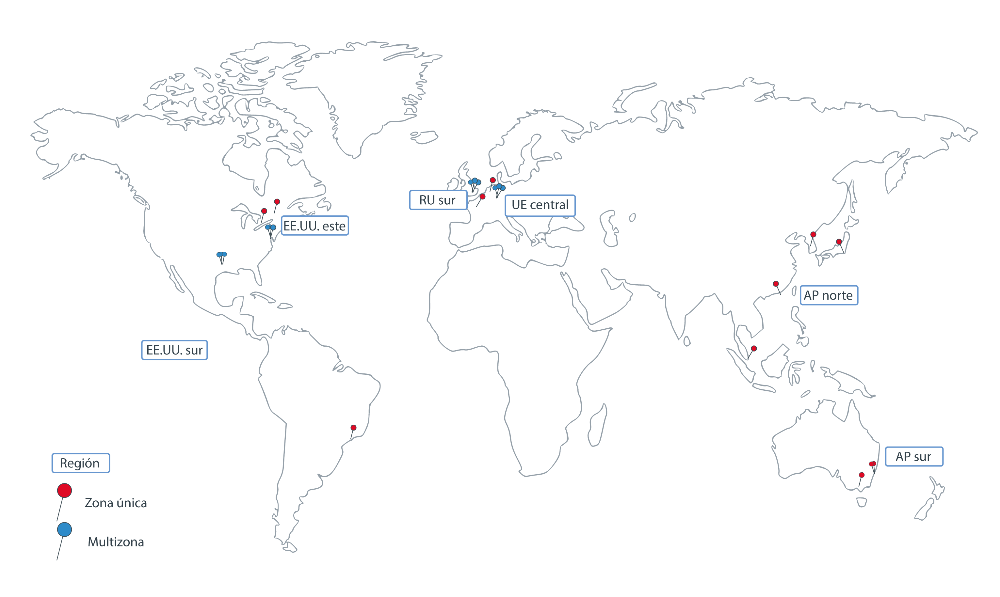

---

copyright:
  years: 2014, 2019
lastupdated: "2019-03-21"

keywords: kubernetes, iks 

subcollection: containers

---

{:new_window: target="_blank"}
{:shortdesc: .shortdesc}
{:screen: .screen}
{:pre: .pre}
{:table: .aria-labeledby="caption"}
{:codeblock: .codeblock}
{:tip: .tip}
{:note: .note}
{:important: .important}
{:deprecated: .deprecated}
{:download: .download}


# Regiones y zonas
{: #regions-and-zones}

Una región es una ubicación geográfica específica en la que puede desplegar apps, servicios y otros recursos de {{site.data.keyword.Bluemix}}. Las [regiones de {{site.data.keyword.Bluemix_notm}}](#bluemix_regions) difieren de las [regiones de {{site.data.keyword.containerlong}}](#container_regions). Las regiones constan de una o más zonas, que son centros de datos físicos que alojan los recursos de cálculo, de red, de almacenamiento y los recursos relacionados con refrigeración y alimentación que alojan los servicios y las aplicaciones. Las zonas están aisladas unas de otras, lo que garantiza que no haya un punto único de error compartido.
{:shortdesc}



_Regiones y zonas de {{site.data.keyword.containerlong_notm}}_

{{site.data.keyword.Bluemix_notm}} está ubicado en todo el mundo. Los servicios de {{site.data.keyword.Bluemix_notm}} pueden estar disponibles a nivel global o dentro de una región específica. Cuando se crea un clúster de Kubernetes en {{site.data.keyword.containerlong_notm}}, sus recursos permanecen en la región en la que se despliega el clúster.

Puede crear clústeres estándar en cada región de {{site.data.keyword.containerlong_notm}} soportada. Los clústeres gratuitos solo están disponibles en determinadas regiones.
{: note}

| Región de {{site.data.keyword.containerlong_notm}} | Ubicación de {{site.data.keyword.Bluemix_notm}} correspondiente |
| --- | --- |
| AP norte (solo clústeres estándares) | Tokio |
| AP sur | Sídney |
| UE central | Frankfurt |
| RU sur | Londres |
| EE. UU. este (solo clústeres estándares) | Washington DC |
| EE. UU. sur | Dallas |
{: caption="Regiones admitidas del servicio de Kubernetes y ubicaciones correspondientes de IBM Cloud." caption-side="top"}

<br />


## Ubicaciones en {{site.data.keyword.Bluemix_notm}}
{: #bluemix_regions}

Puede organizar sus recursos entre servicios de {{site.data.keyword.Bluemix_notm}} utilizando ubicaciones de
{{site.data.keyword.Bluemix_notm}}, también conocidas como regiones. Por ejemplo, puede crear un clúster de Kubernetes utilizando una imagen de Docker privada almacenada en {{site.data.keyword.registryshort_notm}} de la misma ubicación.
{:shortdesc}

Puede especificar una región de {{site.data.keyword.Bluemix_notm}} cuando inicie una sesión en el punto final de API global. Para ver una lista de las regiones disponibles, ejecute `ibmcloud regions`. Para comprobar la ubicación de {{site.data.keyword.Bluemix_notm}} en la que está actualmente, ejecute `ibmcloud target` y revise el campo **Región**. Si no especifica una región, se le solicita que seleccione una.

Por ejemplo, para iniciar una sesión en el punto final de API global en la región Dallas (`us-south`):
```
ibmcloud login -a https://cloud.ibm.com -r us-south
```
{: pre}

Para iniciar una sesión en el punto final de API global y seleccionar una región:
```
ibmcloud login -a https://cloud.ibm.com
```
{: pre}

Salida de ejemplo:
```
Punto final de API: cloud.ibm.com

Obtener un código de un solo uso de https://identity-2.eu-central.iam.cloud.ibm.com/identity/passcode para continuar.
¿Abrir URL en el navegador predeterminado? [S/n]> s
Código de un solo uso >
Autenticando...
Correcto

Seleccione una cuenta:
1. MyAccount (00a11aa1a11aa11a1111a1111aaa11aa) <-> 1234567
2. TeamAccount (2bb222bb2b22222bbb2b2222bb2bb222) <-> 7654321
Escriba un número> 2
Cuenta de destino TeamAccount (2bb222bb2b22222bbb2b2222bb2bb222) <-> 7654321


Grupo de recursos de destino predeterminado

Seleccione una región (o pulse intro para omitir):
1. au-syd
2. jp-tok
3. eu-de
4. eu-gb
5. us-south
6. us-east
Escriba un número> 5
Región de destino us-south

                      
Punto final de API: https://cloud.ibm.com
Región:             us-south
Usuario:            first.last@email.com
Cuenta:             TeamAccount (2bb222bb2b22222bbb2b2222bb2bb222) <-> 7654321
Grupo de recursos:  default
Punto final API CF:
Org:
Espacio:

...
```
{: screen}

<br />


## Regiones en {{site.data.keyword.containerlong_notm}}
{: #container_regions}

Mediante regiones de {{site.data.keyword.containerlong_notm}}, puede crear o acceder a clústeres de Kubernetes de una región distinta de la región de {{site.data.keyword.Bluemix_notm}} en la que ha iniciado la sesión. Los puntos finales de regiones de {{site.data.keyword.containerlong_notm}} hacen referencia específicamente a {{site.data.keyword.containerlong_notm}}, no a {{site.data.keyword.Bluemix_notm}} en general.
{:shortdesc}

Puede crear clústeres estándar en cada región de {{site.data.keyword.containerlong_notm}} soportada. Los clústeres gratuitos solo están disponibles en determinadas regiones.
{: note}

Regiones de {{site.data.keyword.containerlong_notm}} soportadas:
  * AP norte (solo clústeres estándares)
  * AP sur
  * UE central
  * RU sur
  * EE. UU. este (solo clústeres estándares)
  * EE. UU. sur

Puede acceder a {{site.data.keyword.containerlong_notm}} a través de un punto final global: `https://containers.cloud.ibm.com/v1`.
* Para comprobar la región de {{site.data.keyword.containerlong_notm}} en la que está actualmente, ejecute `ibmcloud ks region`.
* Para recuperar una lista de regiones disponibles y sus puntos finales, ejecute `ibmcloud ks regions`.

Para utilizar la API con el punto final global, en todas las solicitudes, pase el nombre de región en una cabecera `X-Region`.
{: tip}

### Inicio de sesión en otra región de {{site.data.keyword.containerlong_notm}}
{: #container_login_endpoints}

Puede cambiar las regiones utilizando la CLI de {{site.data.keyword.containerlong_notm}}.
{:shortdesc}

Supongamos que desea iniciar una sesión en otra región de {{site.data.keyword.containerlong_notm}} por las siguientes razones:
  * Ha creado servicios de {{site.data.keyword.Bluemix_notm}} o imágenes de Docker privadas en una región y desea utilizarlos con {{site.data.keyword.containerlong_notm}} en otra región.
  * Desea acceder a un clúster de una región distinta de la región de {{site.data.keyword.Bluemix_notm}} predeterminada en la que ha iniciado la sesión.

Para cambiar regiones rápidamente, ejecute [`ibmcloud ks region-set`](/docs/containers?topic=containers-cs_cli_reference#cs_region-set).

### Utilización de mandatos de API de {{site.data.keyword.containerlong_notm}}
{: #containers_api}

Para interactuar con la API de {{site.data.keyword.containerlong_notm}}, especifique el tipo de mandato y añada `/v1/command` al punto final global.
{:shortdesc}

Ejemplo de API `GET /clusters`:
  ```
  GET https://containers.cloud.ibm.com/v1/clusters
  ```
  {: codeblock}

</br>

Para utilizar la API con el punto final global, en todas las solicitudes, pase el nombre de región en una cabecera `X-Region`. Para ver una lista de las regiones disponibles, ejecute `ibmcloud ks regions`.
{: tip}

Para ver la documentación sobre los mandatos de API, consulte [https://containers.cloud.ibm.com/swagger-api/](https://containers.cloud.ibm.com/swagger-api/).

## Zonas en {{site.data.keyword.containerlong_notm}}
{: #zones}

Las zonas son centros de datos físicos que están disponibles dentro de una región de {{site.data.keyword.Bluemix_notm}}. Las regiones son una herramienta conceptual para organizar zonas y pueden incluir zonas (centros de datos) en diferentes países. La tabla siguiente muestra las zonas disponibles por región.
{:shortdesc}

* **Ciudad metropolitana multizona**: Si crea un clúster en una ciudad metropolitana multizona **excepto Sídney (AP sur)**, las réplicas del maestro de Kubernetes de alta disponibilidad se distribuyen automáticamente entre las zonas. Tiene la opción de distribuir los nodos trabajadores entre zonas para proteger las apps de una anomalía de una zona.
* **Ciudad de una sola zona**: Si crea un clúster en una ciudad de una sola zona, puede crear varios nodos trabajadores, pero no puede distribuirlos entre zonas. El maestro de alta disponibilidad incluye tres réplicas en hosts independientes, pero no se dispersan en zonas.

<table summary="En la tabla se muestran las zonas disponibles por regiones. Las filas se leen de izquierda a derecha; la región está en la columna uno, las ciudades metropolitanas multizona en la dos y las ciudades de una sola zona en la tres.">
<caption>Ciudades de una sola zona y multizona disponibles por región.</caption>
  <thead>
  <th>Región</th>
  <th>Ciudad metropolitana multizona</th>
  <th>Ciudad de una sola zona</th>
  </thead>
  <tbody>
    <tr>
      <td>AP norte</td>
      <td>Tokio: tok02, tok04, tok05</td>
      <td><p>Chennai: che01</p>
      <p>Hong Kong R.A.E. de la RPC: hkg02</p>
      <p>Seúl: seo01</p>
      <p>Singapur: sng01</p></td>
    </tr>
    <tr>
      <td>AP sur</td>
      <td>Sídney: syd01, syd04, syd05</td>
      <td>Melbourne: mel01</td>
    </tr>
    <tr>
      <td>UE central</td>
      <td>Frankfurt: fra02, fra04, fra05</td>
      <td><p>Amsterdam: ams03</p>
      <p>Milán: mil01</p>
      <p>Oslo: osl01</p>
      <p>París: par01</p>
      </td>
    </tr>
    <tr>
      <td>RU sur</td>
      <td>Londres: lon04, lon05`*`, lon06</td>
      <td></td>
    </tr>
    <tr>
      <td>EE. UU. este</td>
      <td>Washington DC: wdc04, wdc06, wdc07</td>
      <td><p>Montreal: mon01</p>
      <p>Toronto: tor01</p></td>
    </tr>
    <tr>
      <td>EE. UU. sur</td>
      <td>Dallas: dal10, dal12, dal13</td>
      <td><p>México: mex01</p><p>San José: sjc03, sjc04</p><p>São Paulo: sao01</p></td>
    </tr>
  </tbody>
</table>

`*` lon05 sustituye a lon02. Los clústeres nuevos deben utilizar lon05, y únicamente lon05 admite que los maestros de alta disponibilidad se dispersen en zonas.
{: note}

### Clústeres de una sola zona
{: #regions_single_zone}

En un clúster de una sola zona, los recursos del clúster permanecen en la zona en la que se ha desplegado el clúster. La imagen siguiente muestra la relación de componentes de un clúster de una sola zona dentro de una región de ejemplo de EE. UU. este:


_Cómo saber dónde están los recursos de un clúster de una sola zona._

1.  Los recursos del clúster, incluidos los nodos maestro y trabajadores, están en la misma ubicación en la que se ha desplegado el clúster. Al iniciar acciones de orquestación del contenedor local, como por ejemplo mandatos `kubectl`, la información se intercambia entre los nodos maestro y trabajador dentro de la misma zona.

2.  Si ha configurado otros recursos de clúster, como almacenamiento, redes, de cálculo o apps que se ejecutan en pods, los recursos y sus datos permanecen en la zona en la que ha desplegado el clúster.

3.  Cuando inicia acciones de gestión de clústeres, como el uso de mandatos `ibmcloud ks`, se direcciona información básica sobre el clúster (como el nombre, el ID, el usuario, el mandato) a través de un punto final regional.

### Clústeres multizona
{: #regions_multizone}

En un clúster multizona, el nodo maestro se despliega en una zona con soporte multizona y los recursos del clúster se distribuyen entre varias zonas.

1.  Los nodos trabajadores se dispersan en varias zonas de una región para proporcionar más disponibilidad para el clúster. El nodo maestro permanece en la misma zona con capacidad multizona en la que ha desplegado el clúster. Al iniciar acciones de orquestación del contenedor local, como por ejemplo mandatos `kubectl`, la información se intercambia entre los nodos maestro y trabajador a través de un punto final regional.

2.  Otros recursos de clúster, como almacenamiento, redes, de cálculo o apps que se ejecutan en pods, varían en su forma de desplegarse en zonas del clúster multizona. Para obtener más información, revise estos temas:
    * Configuración de [almacenamiento de archivos](/docs/containers?topic=containers-file_storage#add_file) y [almacenamiento en bloque](/docs/containers?topic=containers-block_storage#add_block) en clústeres multizona
    * [Habilitación de acceso público o privado a una app mediante un servicio LoadBalancer en un clúster multizona](/docs/containers?topic=containers-loadbalancer#multi_zone_config)
    * [Gestión de tráfico de red utilizando Ingress](/docs/containers?topic=containers-ingress#planning)
    * [Cómo aumentar la disponibilidad de la app](/docs/containers?topic=containers-app#increase_availability)

3.  Cuando inicia acciones de gestión de clústeres, como el uso de [mandatos `ibmcloud ks`](/docs/containers?topic=containers-cs_cli_reference#cs_cli_reference), se direcciona información básica sobre el clúster (como el nombre, el ID, el usuario, el mandato) a través de un punto final regional.


