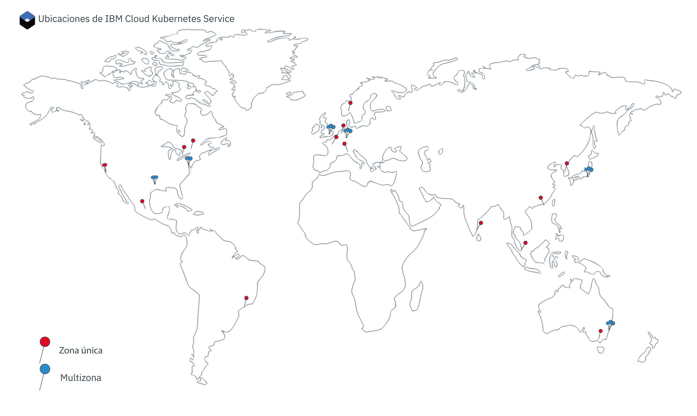

---

copyright:
  years: 2014, 2019
lastupdated: "2019-06-06"

keywords: kubernetes, iks

subcollection: containers

---

{:new_window: target="_blank"}
{:shortdesc: .shortdesc}
{:screen: .screen}
{:pre: .pre}
{:table: .aria-labeledby="caption"}
{:codeblock: .codeblock}
{:tip: .tip}
{:note: .note}
{:important: .important}
{:deprecated: .deprecated}
{:download: .download}
{:preview: .preview}

# Ubicaciones
{: #regions-and-zones}

Puede desplegar clústeres de {{site.data.keyword.containerlong}} en todo el mundo. Cuando se crea un clúster de Kubernetes, sus recursos permanecen en la ubicación en la que se despliega el clúster. Puede acceder a {{site.data.keyword.containerlong_notm}} a través de un punto final de API global para trabajar con el clúster.
{:shortdesc}



_Ubicaciones de {{site.data.keyword.containerlong_notm}}_

Los recursos de {{site.data.keyword.Bluemix_notm}} se solían organizar en regiones a las que se accedía a través de [puntos finales específicos de la región](#bluemix_regions). Utilice en su lugar el [punto final global](#endpoint).
{: deprecated}

## Ubicaciones de {{site.data.keyword.containerlong_notm}}
{: #locations}

Los recursos de {{site.data.keyword.Bluemix_notm}} se organizan en una jerarquía de ubicaciones geográficas. {{site.data.keyword.containerlong_notm}} está disponible en un subconjunto de estas ubicaciones, que incluyen las seis regiones con capacidad multizona de todo el mundo. Los clústeres gratuitos solo están disponibles en determinadas ubicaciones. Otros servicios de {{site.data.keyword.Bluemix_notm}} podrían estar disponibles a nivel global o dentro de una ubicación específica.
{: shortdesc}

### Ubicaciones disponibles
{: #available-locations}

Para ver una lista de las ubicaciones de {{site.data.keyword.containerlong_notm}} disponibles, utilice el mandato `ibmcloud ks supported-locations`.
{: shortdesc}

La imagen siguiente sirve como ejemplo para explicar cómo se organizan las ubicaciones de {{site.data.keyword.containerlong_notm}}.


<table summary="En la tabla se muestra la organización de las ubicaciones de {{site.data.keyword.containerlong_notm}}. Las filas se leen de izquierda a derecha, con el tipo de ubicación en la columna uno, un ejemplo del tipo en la columna dos y la descripción en la columna tres.">
<caption>Organización de las ubicaciones de {{site.data.keyword.containerlong_notm}}.</caption>
  <thead>
  <th>Tipo</th>
  <th>Ejemplo</th>
  <th>Descripción</th>
  </thead>
  <tbody>
    <tr>
      <td>Geografía</td>
      <td>América del Norte (`na`)</td>
      <td>Agrupación organizativa que se basa en continentes geográficos.</td>
    </tr>
    <tr>
      <td>País</td>
      <td>Canadá (`ca`)</td>
      <td>El país de la ubicación dentro de la geografía.</td>
    </tr>
    <tr>
      <td>Área metropolitana</td>
      <td>Ciudad de México (`mex-cty`), Dallas (`dal`)</td>
      <td>El nombre de una ciudad en la que se encuentran 1 o más centros de datos (zonas). Un área metropolitana puede ser multizona y puede tener centros de datos con capacidad multizona, como Dallas, o puede tener solo centros de datos de una sola zona, como por ejemplo Ciudad de México. Si crea un clúster en un área metropolitana con capacidad multizona, los nodos maestros y trabajadores de Kubernetes se pueden distribuir entre zonas para obtener una alta disponibilidad.</td>
    </tr>
    <tr>
      <td>Centro de datos (zona)</td>
      <td>Dallas 12 (`dal12`)</td>
      <td>Ubicación física de la infraestructura de cálculo, de red y de almacenamiento y el sistema de refrigeración y alimentación relacionado que alojan los servicios y las aplicaciones de la nube. Los clústeres se pueden distribuir entre centros de datos, o zonas, en una arquitectura multizona para obtener una alta disponibilidad. Las zonas están aisladas unas de otras, lo que garantiza que no haya un punto único de error compartido.</td>
    </tr>
  </tbody>
  </table>

### Ubicaciones de una sola zona y multizona en {{site.data.keyword.containerlong_notm}}
{: #zones}

En las tablas siguientes se muestran las ubicaciones individuales y multizona disponibles en {{site.data.keyword.containerlong_notm}}. Tenga en cuenta que, en determinadas áreas metropolitanas, puede suministrar un clúster como una sola zona o un clúster multizona. Además, los clústeres gratuitos solo están disponibles en determinadas geografías como solo clústeres de una sola zona con un nodo trabajador.
{: shortdesc}

* **Multizona**: si crea un clúster en una ubicación metropolitana multizona, las réplicas del nodo maestro de Kubernetes de alta disponibilidad se distribuyen automáticamente entre las zonas. Tiene la opción de distribuir los nodos trabajadores entre zonas para proteger las apps de una anomalía de una zona.
* **Una sola zona**: si crea un clúster en una ubicación de un solo centro de datos, puede crear varios nodos trabajadores, pero no puede distribuirlos entre zonas. El maestro de alta disponibilidad incluye tres réplicas en hosts independientes, pero no se dispersan en zonas.

Para determinar rápidamente si una zona tiene capacidad multizona, puede ejecutar `ibmcloud ks supported-locations` y mirar el valor de la columna `Multizone Metro`.
{: tip}


Los recursos de {{site.data.keyword.Bluemix_notm}} se solían organizar en regiones a las que se accedía a través de [puntos finales específicos de la región](#bluemix_regions). Las tablas muestran las regiones anteriores con fines informativos. Puede utilizar el [punto final global](#endpoint) para avanzar hacia una arquitectura menos regional.
{: deprecated}

**Ubicaciones de áreas metropolitanas multizona**

<table summary="La tabla muestra las ubicaciones de áreas metropolitanas multizona disponibles en {{site.data.keyword.containerlong_notm}}. Las filas se leen de izquierda a derecha. La columna uno es la geografía en la que se encuentra la ubicación, la columna dos es el país de la ubicación, la columna tres es el área metropolitana de la ubicación, la columna cuatro es el centro de datos, la columna cinco es la región en desuso en la que estaba organizada la ubicación.">
<caption>Ubicaciones de áreas metropolitanas multizona disponibles en {{site.data.keyword.containerlong_notm}}.</caption>
  <thead>
  <th>Geografía</th>
  <th>País</th>
  <th>Área metropolitana</th>
  <th>Centro de datos</th>
  <th>Región en desuso</th>
  </thead>
  <tbody>
    <tr>
      <td>Asia Pacífico</td>
      <td>Australia</td>
      <td>Sídney</td>
      <td>syd01, syd04, syd05</td>
      <td>AP sur (`ap-south`, `au-syd`)</td>
    </tr>
    <tr>
      <td>Asia Pacífico</td>
      <td>Japón</td>
      <td>Tokio</td>
      <td>tok02, tok04, tok05</td>
      <td>AP norte (`ap-north`, `jp-tok`)</td>
    </tr>
    <tr>
      <td>Europa</td>
      <td>Alemania</td>
      <td>Frankfurt</td>
      <td>fra02, fra04, fra05</td>
      <td>UE central (`eu-central`, `eu-de`)</td>
    </tr>
    <tr>
      <td>Europa</td>
      <td>Reino Unido</td>
      <td>Londres</td>
      <td>lon04, lon05`*`, lon06</td>
      <td>Reino Unido sur (`uk-south`, `eu-gb`)</td>
    </tr>
    <tr>
      <td>América del Norte</td>
      <td>Estados Unidos</td>
      <td>Dallas</td>
      <td>dal10, dal12, dal13</td>
      <td>EE. UU. sur (`us-south`)</td>
    </tr>
    <tr>
      <td>América del Norte</td>
      <td>Estados Unidos</td>
      <td>Washington, D.C.</td>
      <td>wdc04, wdc06, wdc07</td>
      <td>EE. UU. este (`us-east`)</td>
    </tr>
  </tbody>
  </table>

**Ubicaciones de centros de datos de una sola zona**

<table summary="La tabla muestra las ubicaciones de centros de datos de una sola zona disponibles en {{site.data.keyword.containerlong_notm}}. Las filas se leen de izquierda a derecha. La columna uno es la geografía en la que se encuentra la ubicación, la columna dos es el país de la ubicación, la columna tres es el área metropolitana de la ubicación, la columna cuatro es el centro de datos y la columna cinco es la región en desuso en la que estaba organizada la ubicación.">
<caption>Ubicaciones de una sola zona disponibles en {{site.data.keyword.containerlong_notm}}.</caption>
  <thead>
  <th>Geografía</th>
  <th>País</th>
  <th>Área metropolitana</th>
  <th>Centro de datos</th>
  <th>Región en desuso</th>
  </thead>
  <tbody>
    <tr>
      <td>Asia Pacífico</td>
      <td>Australia</td>
      <td>Melbourne</td>
      <td>mel01</td>
      <td>AP sur (`ap-south`, `au-syd`)</td>
    </tr>
    <tr>
      <td>Asia Pacífico</td>
      <td>Australia</td>
      <td>Sídney</td>
      <td>syd01, syd04, syd05</td>
      <td>AP sur (`ap-south`, `au-syd`)</td>
    </tr>
    <tr>
      <td>Asia Pacífico</td>
      <td>China</td>
      <td>Hong Kong<br>Región administrativa especial de RPC</td>
      <td>hkg02</td>
      <td>AP norte (`ap-north`, `jp-tok`)</td>
    </tr>
    <tr>
      <td>Asia Pacífico</td>
      <td>India</td>
      <td>Chennai</td>
      <td>che01</td>
      <td>AP norte (`ap-north`, `jp-tok`)</td>
    </tr>
    <tr>
      <td>Asia Pacífico</td>
      <td>Japón</td>
      <td>Tokio</td>
      <td>tok02, tok04, tok05</td>
      <td>AP norte (`ap-north`, `jp-tok`)</td>
    </tr>
    <tr>
      <td>Asia Pacífico</td>
      <td>Corea</td>
      <td>Seúl</td>
      <td>seo01</td>
      <td>AP norte (`ap-north`, `jp-tok`)</td>
    </tr>
    <tr>
      <td>Asia Pacífico</td>
      <td>Singapur</td>
      <td>Singapur</td>
      <td>sng01</td>
      <td>AP norte (`ap-north`, `jp-tok`)</td>
    </tr>
    <tr>
      <td>Europa</td>
      <td>Francia</td>
      <td>París</td>
      <td>par01</td>
      <td>UE central (`eu-central`, `eu-de`)</td>
    </tr>
    <tr>
      <td>Europa</td>
      <td>Alemania</td>
      <td>Frankfurt</td>
      <td>fra02, fra04, fra05</td>
      <td>UE central (`eu-central`, `eu-de`)</td>
    </tr>
    <tr>
      <td>Europa</td>
      <td>Italia</td>
      <td>Milán</td>
      <td>mil01</td>
      <td>UE central (`eu-central`, `eu-de`)</td>
    </tr>
    <tr>
      <td>Europa</td>
      <td>Países Bajos</td>
      <td>Amsterdam</td>
      <td>ams03</td>
      <td>UE central (`eu-central`, `eu-de`)</td>
    </tr>
    <tr>
      <td>Europa</td>
      <td>Noruega</td>
      <td>Oslo</td>
      <td>osl</td>
      <td>UE central (`eu-central`, `eu-de`)</td>
    </tr>
    <tr>
      <td>Europa</td>
      <td>Reino Unido</td>
      <td>Londres</td>
      <td>lon02`*`, lon04, lon05`*`, lon06</td>
      <td>Reino Unido sur (`uk-south`, `eu-gb`)</td>
    </tr>
    <tr>
      <td>América del Norte</td>
      <td>Canadá</td>
      <td>Montreal</td>
      <td>mon01</td>
      <td>EE. UU. este (`us-east`)</td>
    </tr>
    <tr>
      <td>América del Norte</td>
      <td>Canadá</td>
      <td>Toronto</td>
      <td>tor01</td>
      <td>EE. UU. este (`us-east`)</td>
    </tr>
    <tr>
      <td>América del Norte</td>
      <td>México</td>
      <td>Ciudad de México</td>
      <td>mex01</td>
      <td>EE. UU. sur (`us-south`)</td>
    </tr>
    <tr>
      <td>América del Norte</td>
      <td>Estados Unidos</td>
      <td>Dallas</td>
      <td>dal10, dal12, dal13</td>
      <td>EE. UU. sur (`us-south`)</td>
    </tr>
    <tr>
      <td>América del Norte</td>
      <td>Estados Unidos</td>
      <td>San José</td>
      <td>sjc03, sjc04</td>
      <td>EE. UU. sur (`us-south`)</td>
    </tr>
    <tr>
      <td>América del Norte</td>
      <td>Estados Unidos</td>
      <td>Washington, D.C.</td>
      <td>wdc04, wdc06, wdc07</td>
      <td>EE. UU. este (`us-east`)</td>
    </tr>
    <tr>
      <td>América del Sur</td>
      <td>Brasil</td>
      <td>São Paulo</td>
      <td>sao01</td>
      <td>EE. UU. sur (`us-south`)</td>
    </tr>
  </tbody>
  </table>

`*` lon05 sustituye a lon02. Los clústeres nuevos deben utilizar lon05, y únicamente lon05 admite que los maestros de alta disponibilidad se dispersen en zonas.
{: note}

### Clústeres de una sola zona
{: #regions_single_zone}

En un clúster de una sola zona, los recursos del clúster permanecen en la zona en la que se ha desplegado el clúster. En la imagen siguiente se resalta la relación de los componentes de clúster de una sola zona con un ejemplo de la ubicación de Toronto, Canadá `tor01`.
{: shortdesc}


_Cómo saber dónde están los recursos de un clúster de una sola zona._

1.  Los recursos del clúster, incluidos los nodos maestro y trabajadores, están en el mismo centro de datos en el que se ha desplegado el clúster. Al iniciar acciones de orquestación del contenedor local, como por ejemplo mandatos `kubectl`, la información se intercambia entre los nodos maestro y trabajador dentro de la misma zona.

2.  Si ha configurado otros recursos de clúster, como almacenamiento, redes, de cálculo o apps que se ejecutan en pods, los recursos y sus datos permanecen en la zona en la que ha desplegado el clúster.

3.  Cuando inicia acciones de gestión de clústeres, como el uso de mandatos `ibmcloud ks`, se direcciona información básica sobre el clúster (como el nombre, el ID, el usuario, el mandato) a través de un punto final regional mediante el punto final global. Los puntos finales regionales se encuentran en la región metropolitana multizona más cercana. En este ejemplo, la región metropolitana es Washington, D.C.

### Clústeres multizona
{: #regions_multizone}

En un clúster multizona, los recursos del clúster se distribuyen entre varias zonas.
{: shortdesc}

1.  Los nodos trabajadores se distribuyen en varias zonas de la ubicación del área metropolitana para proporcionar más disponibilidad para el clúster. Las réplicas del nodo maestro de Kubernetes también se distribuyen entre zonas. Al iniciar acciones de orquestación del contenedor local, como por ejemplo mandatos `kubectl`, la información se intercambia entre los nodos maestro y trabajador a través de un punto final global.

2.  Otros recursos de clúster, como almacenamiento, redes, de cálculo o apps que se ejecutan en pods, varían en su forma de desplegarse en zonas del clúster multizona. Para obtener más información, revise estos temas:
    *   Configuración de [almacenamiento de archivos](/docs/containers?topic=containers-file_storage#add_file) y de [almacenamiento en bloque](/docs/containers?topic=containers-block_storage#add_block) en clústeres multizona, o [elección de una solución de almacenamiento persistente multizona](/docs/containers?topic=containers-storage_planning#persistent_storage_overview).
    *   [Habilitación del acceso público o privado a una app mediante un servicio de equilibrador de carga de red (NLB) en un clúster multizona](/docs/containers?topic=containers-loadbalancer#multi_zone_config).
    *   [Gestión del tráfico de red mediante Ingress](/docs/containers?topic=containers-ingress#planning).
    *   [Cómo aumentar la disponibilidad de la app](/docs/containers?topic=containers-app#increase_availability).

3.  Cuando inicia acciones de gestión de clústeres, como por ejemplo [mandatos `ibmcloud ks`](/docs/containers?topic=containers-cli-plugin-kubernetes-service-cli), la información básica sobre el clúster (como el nombre, el ID, el usuario, el mandato) se direcciona a través del punto final global.

### Clústeres gratuitos
{: #regions_free}

Los clústeres gratuitos están limitados a ubicaciones específicas.
{: shortdesc}

**Creación de un clúster gratuito en la CLI**: antes de crear un clúster gratuito, debe elegir como destino una región ejecutando `ibmcloud ks region-set`. El clúster se crea en un área metropolitana dentro de la región que ha elegido como destino: el área metropolitana de Sídney en `ap-south`, el área metropolitana de Frankfurt en `eu-central`, el área metropolitana de Londres en `uk-south` o el área metropolitana de Dallas en `us-south`. Tenga en cuenta que no puede especificar una zona dentro del área metropolitana.

**Creación de un clúster gratuito en la consola de {{site.data.keyword.Bluemix_notm}}**: si utiliza la consola, puede seleccionar una geografía y una ubicación de área metropolitana en la zona geográfica. Puede seleccionar el área metropolitana de Dallas en América del Norte, las áreas metropolitanas de Frankfurt o Londres en Europa o el área metropolitana de Sídney en Asia Pacífico. El clúster se crea en una zona del área metropolitana que elija.

<br />


## Acceso al punto final global
{: #endpoint}

Puede organizar sus recursos entre servicios de {{site.data.keyword.Bluemix_notm}} mediante ubicaciones de
{{site.data.keyword.Bluemix_notm}} (antes denominadas regiones). Por ejemplo, puede crear un clúster de Kubernetes utilizando una imagen de Docker privada almacenada en {{site.data.keyword.registryshort_notm}} de la misma ubicación. Para acceder a estos recursos, puede utilizar los puntos finales globales y filtrar por ubicación.
{:shortdesc}

### Inicio de sesión en {{site.data.keyword.Bluemix_notm}}
{: #login-ic}

Cuando inicia una sesión en la línea de mandatos de {{site.data.keyword.Bluemix_notm}} (`ibmcloud`), se le solicita que seleccione una región. Sin embargo, esta región no afecta al punto final del plugin de {{site.data.keyword.containerlong_notm}} (`ibmcloud ks`), que todavía utiliza el punto final global. Tenga en cuenta que tiene que elegir como destino el grupo de recursos en el que se encuentra el clúster si no está en el grupo de recursos predeterminado.
{: shortdesc}

Para iniciar una sesión en el punto final de API global de {{site.data.keyword.Bluemix_notm}} y elegir como destino el grupo de recursos en el que se encuentra el clúster:
```
ibmcloud login -a https://cloud.ibm.com -g <nondefault_resource_group_name>
```
{: pre}

### Inicio de sesión en {{site.data.keyword.containerlong_notm}}
{: #login-iks}

Cuando inicia sesión en {{site.data.keyword.Bluemix_notm}}, puede acceder a {{site.data.keyword.containershort_notm}}. Para ayudarle a empezar, compruebe los recursos siguientes para utilizar la CLI y la API de {{site.data.keyword.containerlong_notm}}.
{: shortdesc}

**CLI de {{site.data.keyword.containerlong_notm}}**:
* [Configure la CLI de modo que utilice el plugin `ibmcloud ks`](/docs/containers?topic=containers-cs_cli_install#cs_cli_install).
* [Configure la CLI de modo que se conecte a un determinado clúster y ejecute mandatos `kubectl`](/docs/containers?topic=containers-cs_cli_install#cs_cli_configure).

De forma predeterminada, la sesión se inicia en el punto final de {{site.data.keyword.containerlong_notm}} global, `https://containers.cloud.ibm.com`.

Si utiliza la nueva funcionalidad global en la CLI de {{site.data.keyword.containerlong_notm}}, tenga en cuenta los cambios siguientes con respecto a la funcionalidad antigua basada en región.

* Listado de recursos:
  * Cuando obtiene una lista de recursos, por ejemplo con los mandatos `ibmcloud ks clusters`, `ibmcloud ks subnets` o `ibmcloud ks zones`, se devuelven recursos de todas las ubicaciones. Para filtrar los recursos por una ubicación específica, determinados mandatos incluyen un distintivo `--locations`. Por ejemplo, si filtra los clústeres para la zona metropolitana `dal`, se devuelven clústeres multizona de dicha zona metropolitana y los clústeres de una sola zona de los centros de datos (zonas) de dicha zona metropolitana. Si filtra clústeres para el centro de datos `dal10` (zona), se devuelven los clústeres multizona que tienen un nodo de trabajador en dicha zona y los clústeres de una sola zona de dicha zona. Tenga en cuenta que puede pasar una ubicación o una lista de ubicaciones separadas por comas.
    Ejemplo para filtrar por ubicación:
    ```
    ibmcloud ks clusters --locations dal
    ```
    {: pre}
  * Los otros mandatos no devuelven recursos en todas las ubicaciones. Para ejecutar los mandatos `credential-set/unset/get`, `api-key-reset` y `vlan-spanning-get`, debe especificar una región en `--region`.

* Cómo trabajar con recursos:
  * Cuando utilice el punto final global, puede trabajar con recursos a los que tiene permisos de acceso en cualquier ubicación, incluso si ha establecido una región ejecutando `ibmcloud ks region-set` y el recurso con el que desea trabajar se encuentra en otra región.
  * Si tiene clústeres con el mismo nombre en distintas regiones, puede utilizar el ID de clúster cuando ejecute mandatos o establezca una región con el mandato `ibmcloud ks region-set` y utilice el nombre del clúster cuando ejecute mandatos.

* Funcionalidad anterior:
  * Si necesita obtener una lista y trabajar con recursos de una sola región, puede utilizar el [mandato](/docs/containers?topic=containers-cli-plugin-kubernetes-service-cli#cs_init) `ibmcloud ks init` para elegir como destino un punto final regional en lugar de un punto final global.
    Ejemplo para definir como destino el punto final de la región sur de Estados Unidos:
    ```
    ibmcloud ks init --host https://us-south.containers.cloud.ibm.com
    ```
    {: pre}
  * Para utilizar la funcionalidad global, puede utilizar de nuevo el mandato `ibmcloud ks init` para elegir como destino el punto final global. Ejemplo para volver a definir como destino el punto final global:
    ```
    ibmcloud ks init --host https://containers.cloud.ibm.com
    ```
    {: pre}

</br></br>
**API de {{site.data.keyword.containerlong_notm}}**:
* [Iniciación a la API](/docs/containers?topic=containers-cs_cli_install#cs_api).
* [Visualización de la documentación sobre los mandatos de API](https://containers.cloud.ibm.com/global/swagger-global-api/).
* Generación de un cliente de la API para que se utilice en la automatización mediante la API [`swagger.json`](https://containers.cloud.ibm.com/global/swagger-global-api/swagger.json).

Para interactuar con la API de {{site.data.keyword.containerlong_notm}} global, escriba el tipo de mandato y añada `global/v1/command` al punto final.

Ejemplo de API global `GET /clusters`:
```
GET https://containers.cloud.ibm.com/global/v1/clusters
```
{: codeblock}

</br>

Si tiene que especificar una región en una llamada de API, elimine el parámetro `/global` de la vía de acceso y pase el nombre de la región en la cabecera `X-Region`. Para ver una lista de las regiones disponibles, ejecute `ibmcloud ks regions`.

<br />


## En desuso: estructura anterior de zonas y regiones de {{site.data.keyword.Bluemix_notm}}
{: #bluemix_regions}

Anteriormente, los recursos de {{site.data.keyword.Bluemix_notm}} se organizaban en regiones. Las regiones son una herramienta conceptual para organizar zonas y pueden incluir zonas (centros de datos) en diferentes países y geografías. En la tabla siguiente se establece una correlación entre las regiones de {{site.data.keyword.Bluemix_notm}}, las regiones de {{site.data.keyword.containerlong_notm}} y las zonas de {{site.data.keyword.containerlong_notm}} anteriores. Las zonas con capacidad multizona están en negrita.
{: shortdesc}

Los puntos finales específicos de la región están en desuso. Utilice en su lugar el [punto final global](#endpoint). Si debe utilizar puntos finales regionales, [establezca la variable de entorno `IKS_BETA_VERSION` en el plugin de {{site.data.keyword.containerlong_notm}} en `0.2`](/docs/containers-cli-plugin?topic=containers-cli-plugin-kubernetes-service-cli#cs_beta).
{: deprecated}

| Región de {{site.data.keyword.containerlong_notm}} | Regiones de {{site.data.keyword.Bluemix_notm}} correspondientes | Zonas disponibles en la región |
| --- | --- | --- |
| AP norte (solo clústeres estándares) | Tokio | che01, hkg02, seo01, sng01, **tok02, tok04, tok05** |
| AP sur | Sídney | mel01, **syd01, syd04, syd05** |
| UE central | Frankfurt | ams03, **fra02, fra04, fra05**, mil01, osl01, par01 |
| RU sur | Londres | lon02, **lon04, lon05, lon06** |
| EE. UU. este (solo clústeres estándares) | Washington DC | mon01, tor01, **wdc04, wdc06, wdc07** |
| EE. UU. sur | Dallas | **dal10, dal12, dal13**, mex01, sjc03, sjc04, sao01 |
{: caption="Regiones de {{site.data.keyword.containershort_notm}} y {{site.data.keyword.Bluemix_notm}} correspondientes, con zonas. Las zonas con capacidad multizona están en negrita." caption-side="top"}

Mediante regiones de {{site.data.keyword.containerlong_notm}}, puede crear o acceder a clústeres de Kubernetes de una región distinta de la región de {{site.data.keyword.Bluemix_notm}} en la que ha iniciado la sesión. Los puntos finales de regiones de {{site.data.keyword.containerlong_notm}} hacen referencia específicamente a {{site.data.keyword.containerlong_notm}}, no a {{site.data.keyword.Bluemix_notm}} en general.

Supongamos que desea iniciar una sesión en otra región de {{site.data.keyword.containerlong_notm}} por las siguientes razones:
  * Ha creado servicios de {{site.data.keyword.Bluemix_notm}} o imágenes de Docker privadas en una región y desea utilizarlos con {{site.data.keyword.containerlong_notm}} en otra región.
  * Desea acceder a un clúster de una región distinta de la región de {{site.data.keyword.Bluemix_notm}} predeterminada en la que ha iniciado la sesión.

Para cambiar rápidamente de región, utilice el [mandato](/docs/containers?topic=containers-cli-plugin-kubernetes-service-cli#cs_region-set) `ibmcloud ks region-set`.
