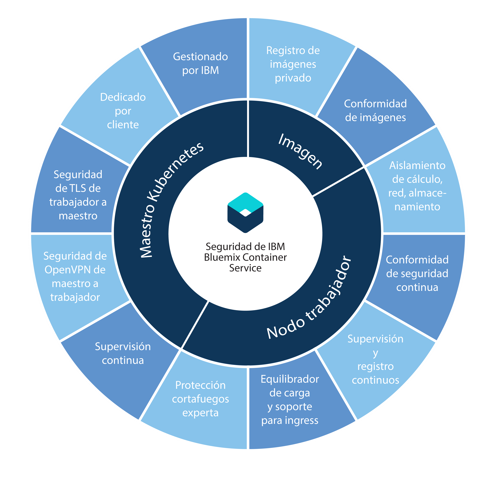

---

copyright:
  years: 2014, 2017
lastupdated: "2017-12-13"

---

{:new_window: target="_blank"}
{:shortdesc: .shortdesc}
{:screen: .screen}
{:pre: .pre}
{:table: .aria-labeledby="caption"}
{:codeblock: .codeblock}
{:tip: .tip}
{:download: .download}


# Seguridad para {{site.data.keyword.containerlong_notm}}
{: #cs_security}

Puede utilizar características integradas de seguridad para análisis de riesgos y protección de la seguridad. Estas características le ayudan a proteger la infraestructura del clúster y las comunicaciones en la red, a aislar sus recursos de cálculo y a garantizar la conformidad de la seguridad de los componentes de la infraestructura y de los despliegues de contenedores.
{: shortdesc}

## Seguridad por componente de clúster
{: #cs_security_cluster}

Cada clúster de {{site.data.keyword.containerlong_notm}} tiene características de seguridad incorporadas en sus nodos [maestro](#cs_security_master) y de [trabajador](#cs_security_worker). Si tiene un cortafuegos, si necesita acceder el equilibrio de carga desde fuera del clúster o si desea ejecutar mandatos `kubectl` desde el sistema local cuando las políticas de red corporativas impiden el acceso a los puntos finales de Internet pública, [abra los puertos en el cortafuegos](#opening_ports). Si desea conectar apps del clúster a una red local o a otras apps externas al clúster, [configure la conectividad de VPN](#vpn).
{: shortdesc}

En el siguiente diagrama, puede ver características de seguridad agrupadas por maestro de Kubernetes, nodos trabajadores e imágenes de contenedor.




  <table summary="La primera fila de la tabla abarca ambas columnas. El resto de las filas se deben leer de izquierda a derecha; la ubicación del servidor está en la columna uno y las direcciones IP correspondientes en la columna dos.">
  <caption>Tabla 1. Características de seguridad</caption>
  <thead>
  <th colspan=2> Valores integrados de seguridad de clústeres de {{site.data.keyword.containershort_notm}}</th>
  </thead>
  <tbody>
    <tr>
      <td>Kubernetes maestro</td>
      <td>IBM gestiona el nodo Kubernetes maestro de cada clúster, que ofrece una alta disponibilidad. Incluye valores de seguridad de {{site.data.keyword.containershort_notm}} que garantizan la conformidad de seguridad y la comunicación segura entre los nodos trabajadores. IBM realiza las actualizaciones según sea necesario. El Kubernetes maestro dedicado controla y supervisa de forma centralizada todos los recursos de Kubernetes del clúster. Basándose en los requisitos de despliegue y la capacidad del clúster, el Kubernetes maestro planifica automáticamente las apps contenerizadas para desplegar en nodos trabajadores disponibles. Para obtener más información, consulte [Seguridad del nodo Kubernetes maestro](#cs_security_master).</td>
    </tr>
    <tr>
      <td>Nodo trabajador</td>
      <td>Los contenedores se despliegan en nodos trabajadores que están dedicados a un clúster y que garantizan las funciones de cálculo, red y aislamiento del almacenamiento para los clientes de IBM. {{site.data.keyword.containershort_notm}} proporciona funciones integradas de seguridad para mantener la seguridad de los nodos trabajadores en la red privada y pública y garantizan la conformidad de seguridad de los nodos trabajadores. Para obtener más información, consulte [Seguridad de los nodos trabajadores](#cs_security_worker). Además, puede añadir [políticas de red Calico](#cs_security_network_policies) para especificar el tráfico de red que desee permitir o bloquear de y desde un pod a un nodo trabajador. </td>
     </tr>
     <tr>
      <td>Imágenes</td>
      <td>Como administrador del clúster, puede configurar un repositorio seguro propio de imágenes de Docker en {{site.data.keyword.registryshort_notm}} donde puede almacenar y compartir imágenes de Docker entre los usuarios del clúster. Para garantizar despliegues de contenedor seguros, Vulnerability Advisor explora cada imagen del registro privado. Vulnerability Advisor es un componente de {{site.data.keyword.registryshort_notm}} que realiza exploraciones en busca de vulnerabilidades, realiza recomendaciones sobre seguridad y ofrece instrucciones para solucionar las vulnerabilidades. Para obtener más información, consulte [Seguridad de imágenes en {{site.data.keyword.containershort_notm}}](#cs_security_deployment).</td>
    </tr>
  </tbody>
</table>

### Kubernetes maestro
{: #cs_security_master}

Revise las funciones integradas de seguridad de Kubernetes maestro para proteger el Kubernetes maestro y para asegurar la comunicación de red del clúster.
{: shortdesc}

<dl>
  <dt>Kubernetes maestro totalmente gestionado y dedicado</dt>
    <dd>Cada clúster de Kubernetes de {{site.data.keyword.containershort_notm}} está controlado por un Kubernetes maestro gestionado por IBM en una cuenta de infraestructura de IBM Cloud (SoftLayer) propiedad de IBM. El nodo Kubernetes maestro se configura con los siguientes componentes dedicados que no se comparten con otros clientes de IBM.
    <ul><li>Almacén de datos etcd: almacena todos los recursos de Kubernetes de un clúster, como por ejemplo servicios, despliegues y pods. ConfigMaps y secretos de Kubernetes son datos de app que se almacenan como pares de clave y valor para que los pueda utilizar una app que se ejecuta en un pod. Los datos de etcd se almacenan en un disco cifrado gestionado por IBM y se cifra mediante TLS cuando se envían a un pod para garantizar la protección y la integridad de los datos.</li>
    <li>kube-apiserver: sirve como punto de entrada principal para todas las solicitudes procedentes del nodo trabajador destinadas al nodo Kubernetes maestro. kube-apiserver valida y procesa las solicitudes y puede leer y escribir en el almacén de datos
etcd.</li>
    <li>kube-scheduler: decide dónde desplegar los pods, teniendo en cuenta los requisitos de capacidad y de rendimiento, las restricciones de política de hardware y de software, las especificaciones anti afinidad y los requisitos de carga de trabajo. Si no se encuentra ningún nodo trabajador que se ajuste a los requisitos, el pod no se despliega en el clúster.</li>
    <li>kube-controller-manager: responsable de supervisar los conjuntos de réplicas y de crear los pods correspondientes para alcanzar el estado deseado.</li>
    <li>OpenVPN: componente específico de {{site.data.keyword.containershort_notm}} que proporciona conectividad de red segura para
la comunicación entre el nodo Kubernetes maestro y el nodo trabajador.</li></ul></dd>
  <dt>Conectividad de red protegida por TLS para toda la comunicación entre el nodo trabajador y Kubernetes maestro</dt>
    <dd>Para proteger la comunicación de red con el nodo Kubernetes maestro, {{site.data.keyword.containershort_notm}} genera certificados TLS que cifran la comunicación entre los componentes
kube-apiserver y almacén de datos etcd para cada clúster. Estos certificados nunca se comparten entre clústeres ni entre componentes de Kubernetes maestro.</dd>
  <dt>Conectividad de red protegida por OpenVPN para la comunicación entre el nodo Kubernetes maestro y el nodo trabajador</dt>
    <dd>Aunque Kubernetes protege la comunicación entre el nodo Kubernetes maestro y los nodos trabajadores mediante el protocolo `https`, no se proporciona autenticación en el nodo trabajador de forma predeterminada. Para proteger esta comunicación, {{site.data.keyword.containershort_notm}} configura automáticamente una conexión OpenVPN entre el nodo Kubernetes maestro y el nodo trabajador cuando se crea el clúster.</dd>
  <dt>Supervisión continua de red de Kubernetes maestro</dt>
    <dd>IBM supervisa continuamente cada nodo Kubernetes maestro para controlar y solucionar los ataques de tipo denegación de servicio (DOS) a nivel de proceso.</dd>
  <dt>Conformidad con la seguridad del nodo Kubernetes maestro</dt>
    <dd>{{site.data.keyword.containershort_notm}} explora automáticamente cada nodo en el que se ha desplegado el nodo Kubernetes maestro en busca de vulnerabilidades y arreglos de seguridad específicos de Kubernetes y del sistema operativo que se tengan que aplicar para garantizar la protección del nodo maestro. Si se encuentran vulnerabilidades, {{site.data.keyword.containershort_notm}} aplica automáticamente los arreglos y soluciona las vulnerabilidades en nombre del usuario.</dd>
</dl>

<br />


### Nodos trabajadores
{: #cs_security_worker}

Revise las características de seguridad integradas del nodo trabajador para proteger el entorno de nodo trabajador y para garantizar el aislamiento de recursos, red y almacenamiento.
{: shortdesc}

<dl>
  <dt>Aislamiento de la infraestructura de cálculo, red y almacenamiento</dt>
    <dd>Cuando crea un clúster, se suministran máquinas virtuales como nodos trabajadores en la cuenta de infraestructura de IBM Cloud (SoftLayer) del cliente o en la cuenta dedicada de infraestructura de IBM Cloud (SoftLayer) por IBM. Los nodos trabajadores están dedicados a un clúster y no albergan cargas de trabajo de otros clústeres.</br> Cada cuenta de {{site.data.keyword.Bluemix_notm}} se configura con una VLAN de infraestructura de IBM Cloud (SoftLayer) para garantizar el rendimiento y el aislamiento de red de calidad en los nodos trabajadores. </br>Para conservar los datos en el clúster, puede suministrar almacenamiento de archivos dedicado basado en NFS de infraestructura de IBM Cloud(SoftLayer) y aprovechar las características integradas de seguridad de datos de dicha plataforma.</dd>
  <dt>Configuración protegida de nodo trabajador</dt>
    <dd>Cada nodo trabajador se configura con un sistema operativo Ubuntu que el usuario no puede modificar. Para proteger el sistema operativo de los nodos trabajadores frente a ataques potenciales, cada noto trabajador se configura con valores avanzados de cortafuegos que imponen las reglas de iptable de Linux.</br> Todos los contenedores que se ejecutan en Kubernetes están protegidos por valores predefinidos de política de red de Calico configurados en cada nodo trabajador durante la creación del clúster. Esta configuración garantiza una comunicación de red segura entre nodos trabajadores y pods. Para restringir aún más las acciones que puede realizar un contenedor sobre el nodo trabajador, los usuarios pueden optar por configurar [políticas AppArmor](https://kubernetes.io/docs/tutorials/clusters/apparmor/) en los nodos trabajadores.</br> El acceso SSH está inhabilitado en el nodo trabajador. Si desea instalar más características en el nodo trabajador, puede utilizar [conjuntos de daemons de Kubernetes](https://kubernetes.io/docs/concepts/workloads/controllers/daemonset) para todo lo que desee ejecutar en cada nodo trabajador o [trabajos de Kubernetes](https://kubernetes.io/docs/concepts/workloads/controllers/jobs-run-to-completion/) para cualquier acción única que deba ejecutar.</dd>
  <dt>Conformidad de seguridad de nodos trabajadores de Kubernetes</dt>
    <dd>IBM trabaja con equipos de asesoramiento de seguridad interna y externa para abordar las vulnerabilidades potenciales de conformidad de seguridad. IBM mantiene acceso a los nodos trabajadores para desplegar actualizaciones y parches de seguridad en el sistema operativo.</br> <b>Importante</b>: Rearranque los nodos trabajadores de forma regular para garantizar la instalación de las actualizaciones y parches de seguridad que se despliegan automáticamente en el sistema operativo. IBM no rearranca los nodos trabajadores.</dd>
  <dt>Disco cifrado</dt>
  <dd>De forma predeterminada, {{site.data.keyword.containershort_notm}} proporciona dos particiones locales SSD de datos cifrados para todos los nodos de trabajador cuando se suministra. La primera partición no está cifrada, y la segunda partición, montada en _/var/lib/docker_, está desbloqueada cuando se suministra mediante claves de cifrado LUKS. Cada trabajador de cada clúster de Kubernetes tiene su propia clave de cifrado LUKS, que gestiona {{site.data.keyword.containershort_notm}}. Cuando se crea un clúster o se añade un nodo de trabajador a un clúster existente, las claves se extraen de forma segura y luego se descartan una vez desbloqueado el disco cifrado.
  <p><b>Nota</b>: el cifrado puede afectar al rendimiento de E/S del disco. Para las cargas de trabajo que requieren E/S de disco de alto rendimiento, pruebe un clúster con cifrado habilitado e inhabilitado para decidir mejor si desactiva el cifrado.</p>
  </dd>
  <dt>Soporte para cortafuegos de red de infraestructura de IBM Cloud (SoftLayer)</dt>
    <dd>{{site.data.keyword.containershort_notm}} es compatible con todas las [ofertas de cortafuegos de infraestructura de IBM Cloud (SoftLayer) ](https://www.ibm.com/cloud-computing/bluemix/network-security). En {{site.data.keyword.Bluemix_notm}} Público, puede configurar un cortafuegos con políticas de red personalizadas para proporcionar seguridad de red dedicada para el clúster y para detectar y solucionar problemas de intrusión en la red. Por ejemplo, puede optar por configurar [Vyatta ](https://knowledgelayer.softlayer.com/topic/vyatta-1) para que actúe como cortafuegos y bloquee el tráfico no deseado. Si configura un cortafuegos, [también debe abrir los puertos y direcciones IP necesarios](#opening_ports) para cada región para que los nodos maestro y trabajador se puedan comunicar.</dd>
  <dt>Conserve la privacidad de los servicios o exponga servicios y apps a Internet pública de forma selectiva</dt>
    <dd>Puede conservar la privacidad de sus servicios y apps y aprovechar las características seguridad integradas que se describen en este tema para garantizar una comunicación segura entre nodos trabajadores y pods. Para exponer servicios y apps a Internet pública, puede aprovechar el soporte de Ingress y del equilibrador de carga para poner los servicios a disponibilidad pública de forma segura.</dd>
  <dt>Conecte de forma segura sus nodos trabajadores y apps a un centro de datos local</dt>
  <dd>Para conectar los nodos de trabajador y las apps a un centro de datos local, puede configurar un punto final de VPN IPSec con un servicio Strongswan o con un dispositivo Vyatta Gateway o un dispositivo Fortigate.<br><ul><li><b>Servicio VPN IPSec de Strongswan</b>: puede configurar un [servicio VPN IPSec de Strongswan ](https://www.strongswan.org/) que se conecte de forma segura al clúster de Kubernetes con una red local. El servicio VPN IPSec de Strongswan proporciona un canal de comunicaciones de extremo a extremo seguro sobre internet que está basado en la suite de protocolos
Internet Protocol Security (IPsec) estándar del sector. Para configurar una conexión segura entre el clúster y una red local, debe tener instalados una pasarela VPN IPsec o un servidor de infraestructura de IBM Cloud (SoftLayer) en el centro de datos local. A continuación, puede [configurar y desplegar el servicio VPN IPSec de Strongswan](cs_security.html#vpn) en un pod de Kubernetes.</li><li><b>Dispositivo Vyatta Gateway o Fortigate</b>: si tiene un clúster grande, puede elegir configurar un dispositivo Vyatta Gateway o Fortigate o para configurar un punto final de VPN IPSec. Para obtener más información, consulte esta publicación de blog sobre [Conexión de un clúster con un centro de datos local ](https://www.ibm.com/blogs/bluemix/2017/07/kubernetes-and-bluemix-container-based-workloads-part4/).</li></ul></dd>
  <dt>Supervisión y registro continuos de actividad de clúster</dt>
    <dd>Para los clústeres estándares, todos los sucesos relacionados con clústeres, como la adición de un nodo trabajador, el progreso de una actualización continuada o la información sobre uso de capacidad se pueden registrar y supervisar mediante {{site.data.keyword.containershort_notm}} y enviar a {{site.data.keyword.loganalysislong_notm}} y {{site.data.keyword.monitoringlong_notm}}. Para obtener información sobre cómo configurar el registro y la supervisión, consulte [Configuración del registro de clúster](https://console.bluemix.net/docs/containers/cs_cluster.html#cs_logging) y [Configuración de la supervisión del clúster](https://console.bluemix.net/docs/containers/cs_cluster.html#cs_monitoring).</dd>
</dl>

### Imágenes
{: #cs_security_deployment}

Gestione la seguridad y la integridad de sus imágenes con características integradas de seguridad.
{: shortdesc}

<dl>
<dt>Repositorio de imágenes privadas seguras de Docker en {{site.data.keyword.registryshort_notm}}</dt>
<dd>Puede configurar su propio repositorio de imágenes de Docker en un registro privado de imágenes multiarrendatario, de alta disponibilidad y escalable alojado y gestionado por IBM para crear, almacenar de forma segura y compartir imágenes de Docker con todos los usuarios del clúster.</dd>

<dt>Conformidad con la seguridad de imágenes</dt>
<dd>Cuando se utiliza {{site.data.keyword.registryshort_notm}}, puede aprovechar la exploración de seguridad integrada que proporciona Vulnerability Advisor. Cada imagen que se publica en el espacio de nombres se explora automáticamente para detectar vulnerabilidades especificadas en una base de datos de problemas conocidos de CentOS, Debian, Red Hat y Ubuntu. Si se encuentran vulnerabilidades, Vulnerability Advisor proporciona instrucciones sobre cómo resolverlas para garantizar la integridad y la seguridad.</dd>
</dl>

Para ver la valoración de vulnerabilidades de las imágenes, [revise la documentación de Vulnerability Advisor](/docs/services/va/va_index.html#va_registry_cli).

<br />


## Apertura de los puertos y direcciones IP necesarios en el cortafuegos
{: #opening_ports}

Revise estas situaciones en las que puede tener que abrir puertos específicos y direcciones IP en el cortafuegos:
* [Para ejecutar mandatos `bx` ](#firewall_bx)desde el sistema local cuando las políticas de red corporativas impiden el acceso a los puntos finales de internet pública mediante proxies o cortafuegos.
* [Para ejecutar mandatos `kubectl` ](#firewall_kubectl)desde el sistema local cuando las políticas de red corporativas impiden el acceso a los puntos finales de internet pública mediante proxies o cortafuegos.
* [Para ejecutar mandatos `calicoctl` ](#firewall_calicoctl)desde el sistema local cuando las políticas de red corporativas impiden el acceso a los puntos finales de internet pública mediante proxies o cortafuegos.
* [Para permitir la comunicación entre el Kubernetes maestro y los nodos trabajadores](#firewall_outbound) cuando hay un cortafuegos configurado para los nodos trabajadores o los valores del cortafuegos están personalizados en su cuenta de infraestructura de IBM Cloud (SoftLayer).
* [Para acceder al servicio NodePort, LoadBalancer o Ingress desde fuera del clúster](#firewall_inbound).

### Ejecución de mandatos `bx cs` desde detrás de un cortafuegos
{: #firewall_bx}

Si las políticas de red corporativas impiden el acceso desde el sistema local a los puntos finales públicos mediante proxies o cortafuegos, para ejecutar mandatos `bx cs` debe permitir el acceso TCP para {{site.data.keyword.containerlong_notm}}.

1. Permita el acceso a `containers.bluemix.net` en el puerto 443.
2. Compruebe la conexión. Si el acceso está configurado correctamente, los envíos se visualizan en la salida.
   ```
   curl https://containers.bluemix.net/v1/
   ```
   {: pre}

   Salida de ejemplo:
   ```
                                     )___(
                              _______/__/_
                     ___     /===========|   ___
    ____       __   [\\\]___/____________|__[///]   __
    \   \_____[\\]__/___________________________\__[//]___
     \                                                    |
      \                                                  /
   ~~~~~~~~~~~~~~~~~~~~~~~~~~~~~~~~~~~~~~~~~~~~~~~~~~~~~~~~~~~~~~

   ```
   {: screen}

### Ejecución de mandatos `kubectl` desde detrás de un cortafuegos
{: #firewall_kubectl}

Si las políticas de red corporativas impiden el acceso desde el sistema local a los puntos finales públicos mediante proxies o cortafuegos, para ejecutar mandatos `kubectl` debe permitir el acceso TCP para el clúster.

Cuando se crea un clúster, el puerto del URL maestro se asigna aleatoriamente entre 20000 y 32767. Puede elegir abrir el rango de puerto 20000-32767 para cualquier clúster que se pueda crear o permitir el acceso a un clúster existente específico.

Antes de empezar, permita el acceso para [ejecutar mandatos `bx cs`](#firewall_bx).

Para permitir el acceso a un clúster específico:

1. Inicie la sesión en la CLI de {{site.data.keyword.Bluemix_notm}}. Escriba sus credenciales de {{site.data.keyword.Bluemix_notm}} cuando se le solicite. Si tiene una cuenta federada, incluya la opción `--sso`.

    ```
    bx login [--sso]
    ```
    {: pre}

2. Seleccione la región en la que está el clúster.

   ```
   bx cs region-set
   ```
   {: pre}

3. Obtenga el nombre del clúster.

   ```
   bx cs clusters
   ```
   {: pre}

4. Recupere el **URL maestro** del clúster.

   ```
   bx cs cluster-get <cluster_name_or_id>
   ```
   {: pre}

   Salida de ejemplo:
   ```
   ...
   Master URL:		https://169.46.7.238:31142
   ...
   ```
   {: screen}

5. Permitir el acceso al **URL maestro** en el puerto, como en el puerto `31142` en el ejemplo anterior.

6. Compruebe la conexión.

   ```
   curl --insecure <master_URL>/version
   ```
   {: pre}

   Mandato de ejemplo:
   ```
   curl --insecure https://169.46.7.238:31142/version
   ```
   {: pre}

   Salida de ejemplo:
   ```
   {
     "major": "1",
     "minor": "7+",
     "gitVersion": "v1.7.4-2+eb9172c211dc41",
     "gitCommit": "eb9172c211dc4108341c0fd5340ee5200f0ec534",
     "gitTreeState": "clean",
     "buildDate": "2017-11-16T08:13:08Z",
     "goVersion": "go1.8.3",
     "compiler": "gc",
     "platform": "linux/amd64"
   }
   ```
   {: screen}

7. Opcional: repita estos pasos para cada clúster que necesite exponer.

### Ejecución de mandatos `calicoctl` desde detrás de un cortafuegos
{: #firewall_calicoctl}

Si las políticas de red corporativas impiden el acceso desde el sistema local a los puntos finales públicos mediante proxies o cortafuegos, para ejecutar mandatos `calicoctl` debe permitir el acceso TCP para los mandatos Calico.

Antes de empezar, permita el acceso para ejecutar mandatos [`bx`](#firewall_bx) y mandatos [`kubectl`](#firewall_kubectl).

1. Recupere la dirección IP del URL maestro que ha utilizado para permitir los mandatos [`kubectl`](#firewall_kubectl).

2. Obtenga el puerto para ETCD.

  ```
  kubectl get cm -n kube-system calico-config -o yaml | grep etcd_endpoints
  ```
  {: pre}

3. Permita el acceso para las políticas de Calico mediante la dirección IP del URL maestro y el puerto ETCD.

### Cómo permitir al clúster acceder a recursos de infraestructura y otros servicios
{: #firewall_outbound}

  1.  Anote la dirección IP pública de todos los nodos trabajadores del clúster.

      ```
      bx cs workers <cluster_name_or_id>
      ```
      {: pre}

  2.  Permita el tráfico de red de salida del origen _<each_worker_node_publicIP>_ al rango de puertos TCP/UDP de destino 20000-32767 y al puerto 443, y a las siguientes direcciones IP y grupos de red. Si tiene un cortafuegos corporativo que impide a la máquina local acceder a puntos finales de Internet pública, realice este paso para los nodos de trabajador de origen y para la máquina local.
      - **Importante**: También debe permitir el tráfico de salida al puerto 443 y a todas las ubicaciones entre una región y otra para equilibrar la carga durante el proceso de arranque. Por ejemplo, si el clúster está en EE.UU. sur, debe permitir el tráfico procedente desde el puerto 443 a las direcciones IP para todas las ubicaciones (dal10, dal12 y dal13).
      <p>
  <table summary="La primera fila de la tabla abarca ambas columnas. El resto de las filas se deben leer de izquierda a derecha; la ubicación del servidor está en la columna uno y las direcciones IP correspondientes en la columna dos. ">
      <thead>
      <th>Región</th>
      <th>Ubicación</th>
      <th>dirección IP</th>
      </thead>
    <tbody>
      <tr>
        <td>AP Norte</td>
        <td>hkg02<br>tok02</td>
        <td><code>169.56.132.234</code><br><code>161.202.126.210</code></td>
       </tr>
      <tr>
         <td>AP Sur</td>
         <td>mel01<br>syd01<br>syd04</td>
         <td><code>168.1.97.67</code><br><code>168.1.8.195</code><br><code>130.198.64.19, 130.198.66.34</code></td>
      </tr>
      <tr>
         <td>UE Central</td>
         <td>ams03<br>fra02<br>mil01<br>par01</td>
         <td><code>169.50.169.106, 169.50.154.194</code><br><code>169.50.56.170, 169.50.56.174</code><br><code>159.122.190.98</code><br><code>159.8.86.149, 159.8.98.170</code></td>
        </tr>
      <tr>
        <td>UK Sur</td>
        <td>lon02<br>lon04</td>
        <td><code>159.122.242.78</code><br><code>158.175.65.170, 158.175.74.170, 158.175.76.2</code></td>
      </tr>
      <tr>
        <td>EE.UU. este</td>
         <td>tor01<br>wdc06<br>wdc07</td>
         <td><code>169.53.167.50</code><br><code>169.60.73.142</code><br><code>169.61.83.62</code></td>
      </tr>
      <tr>
        <td>EE.UU. Sur</td>
        <td>dal10<br>dal12<br>dal13</td>
        <td><code>169.47.234.18, 169.46.7.234</code><br><code>169.47.70.10</code><br><code>169.60.128.2</code></td>
      </tr>
      </tbody>
    </table>
</p>

  3.  Permita el tráfico de red de salida de los nodos trabajadores a {{site.data.keyword.registrylong_notm}}:
      - `TCP port 443 FROM <each_worker_node_publicIP> TO <registry_publicIP>`
      - Sustituya <em>&lt;registry_publicIP&gt;</em> por todas las direcciones de las regiones de registro a las que desea permitir el tráfico:
        <p>
<table summary="La primera fila de la tabla abarca ambas columnas. El resto de las filas se deben leer de izquierda a derecha; la ubicación del servidor está en la columna uno y las direcciones IP correspondientes en la columna dos. ">
      <thead>
        <th>Región del contenedor</th>
        <th>Dirección de registro</th>
        <th>Dirección IP de registro</th>
      </thead>
      <tbody>
        <tr>
          <td>AP Norte, AP Sur</td>
          <td>registry.au-syd.bluemix.net</td>
          <td><code>168.1.45.160/27</code></br><code>168.1.139.32/27</code></td>
        </tr>
        <tr>
          <td>UE Central</td>
          <td>registry.eu-de.bluemix.net</td>
          <td><code>169.50.56.144/28</code></br><code>159.8.73.80/28</code></td>
         </tr>
         <tr>
          <td>UK Sur</td>
          <td>registry.eu-gb.bluemix.net</td>
          <td><code>159.8.188.160/27</code></br><code>169.50.153.64/27</code></td>
         </tr>
         <tr>
          <td>EE.UU. Este, EE.UU. Sur</td>
          <td>registry.ng.bluemix.net</td>
          <td><code>169.55.39.112/28</code></br><code>169.46.9.0/27</code></br><code>169.55.211.0/27</code></td>
         </tr>
        </tbody>
      </table>
</p>

  4.  Opcional: Permita el tráfico de red de salida de los nodos trabajadores a {{site.data.keyword.monitoringlong_notm}} y a los servicios {{site.data.keyword.loganalysislong_notm}}:
      - `TCP port 443, port 9095 FROM <each_worker_node_publicIP> TO <monitoring_publicIP>`
      - Sustituya <em>&lt;monitoring_publicIP&gt;</em> por todas las direcciones de las regiones de supervisión a las que desea permitir el tráfico:
        <p><table summary="La primera fila de la tabla abarca ambas columnas. El resto de las filas se deben leer de izquierda a derecha; la ubicación del servidor está en la columna uno y las direcciones IP correspondientes en la columna dos. ">
        <thead>
        <th>Región del contenedor</th>
        <th>Dirección de supervisión</th>
        <th>Direcciones IP de supervisión</th>
        </thead>
      <tbody>
        <tr>
         <td>UE Central</td>
         <td>metrics.eu-de.bluemix.net</td>
         <td><code>159.122.78.136/29</code></td>
        </tr>
        <tr>
         <td>UK Sur</td>
         <td>metrics.eu-gb.bluemix.net</td>
         <td><code>169.50.196.136/29</code></td>
        </tr>
        <tr>
          <td>EE.UU. Este, EE.UU. Sur, AP Norte</td>
          <td>metrics.ng.bluemix.net</td>
          <td><code>169.47.204.128/29</code></td>
         </tr>
         
        </tbody>
      </table>
</p>
      - `TCP port 443, port 9091 FROM <each_worker_node_publicIP> TO <logging_publicIP>`
      - Sustituya <em>&lt;logging_publicIP&gt;</em> por todas las direcciones de las regiones de registro a las que desea permitir el tráfico:
        <p><table summary="La primera fila de la tabla abarca ambas columnas. El resto de las filas se deben leer de izquierda a derecha; la ubicación del servidor está en la columna uno y las direcciones IP correspondientes en la columna dos. ">
        <thead>
        <th>Región del contenedor</th>
        <th>Dirección de registro</th>
        <th>Direcciones IP de registro</th>
        </thead>
        <tbody>
          <tr>
            <td>EE.UU. Este, EE.UU. Sur</td>
            <td>ingest.logging.ng.bluemix.net</td>
            <td><code>169.48.79.236</code><br><code>169.46.186.113</code></td>
           </tr>
          <tr>
           <td>UE Central, UK Sur</td>
           <td>ingest-eu-fra.logging.bluemix.net</td>
           <td><code>158.177.88.43</code><br><code>159.122.87.107</code></td>
          </tr>
          <tr>
           <td>AP Sur, AP Norte</td>
           <td>ingest-au-syd.logging.bluemix.net</td>
           <td><code>130.198.76.125</code><br><code>168.1.209.20</code></td>
          </tr>
         </tbody>
       </table>
</p>

  5. Para cortafuegos privados, permita los rangos de direcciones IP privadas adecuadas de infraestructura de IBM Cloud (SoftLayer). Consulte [este enlace](https://knowledgelayer.softlayer.com/faq/what-ip-ranges-do-i-allow-through-firewall) a partir de la sección **Red de fondo (privada)**.
      - Añada todas las [ubicaciones dentro de las regiones](cs_regions.html#locations) que está utilizando.
      - Tenga en cuenta que debe añadir la ubicación dal01 (centro de datos).
      - Abra los puertos 80 y 443 para permitir el proceso de arranque del clúster.

  6. Para crear reclamaciones de volumen permanente para el almacenamiento de datos, permita el acceso de salida mediante el cortafuegos para las [direcciones IP de infraestructura de IBM Cloud (SoftLayer) ](https://knowledgelayer.softlayer.com/faq/what-ip-ranges-do-i-allow-through-firewall) de la ubicación (centro de datos) en la que está el clúster.
      - Para encontrar la ubicación (del centro de datos) del clúster, ejecute `bx cs clusters`.
      - Permita el acceso al rango de IP para la **red (pública) frontal** y la **red (privada) de fondo**.
      - Tenga en cuenta que debe añadir la ubicación dal01 (centro de datos) para la **red (privada) de fondo**.

### Acceso a servicios NodePort, de equilibrador de carga e Ingress desde fuera del clúster
{: #firewall_inbound}

Puede permitir el acceso a servicios NodePort, de equilibrador de carga e Ingress.

<dl>
  <dt>Servicio NodePort</dt>
  <dd>Abra el puerto que ha configurado cuando ha desplegado el servicio a las direcciones IP públicas para permitir el tráfico a todos los nodos de trabajador. Para encontrar el puerto, ejecute `kubectl get svc`. El puerto está en el rango 20000-32000.<dd>
  <dt>Servicio LoadBalancer</dt>
  <dd>Abra el puerto que ha configurado cuando ha desplegado el servicio a la dirección IP pública del servicio de equilibrador de carga.</dd>
  <dt>Ingress</dt>
  <dd>Abra el puerto 80 para HTTP o el puerto 443 para HTTPS a la dirección IP del equilibrador de carga de aplicación de Ingress.</dd>
</dl>

<br />


## Configuración de la conectividad de VPN con el diagrama de Helm del servicio VPN IPSec de Strongswan
{: #vpn}

La conectividad de VPN permite conectar de forma segura apps en un clúster de Kubernetes a una red local. También puede conectar apps que son externas al clúster a una app que se ejecuta dentro del clúster. Para configurar la conectividad de VPN, puede utilizar un diagrama de Helm para configurar y desplegar el [servicio VPN IPSec de Strongswan ](https://www.strongswan.org/) dentro de un pod de Kubernetes. Todo el tráfico de VPN se direcciona a través de este pod. Para obtener más información sobre los mandatos Helm utilizados para establecer el diagrama de Strongswan, consulte la [documentación de Helm ](https://docs.helm.sh/helm/).

Antes de empezar:

- [Cree un clúster estándar.](cs_cluster.html#cs_cluster_cli)
- [Si utiliza un clúster existente, actualícelo a la versión 1.7.4 o posterior.](cs_cluster.html#cs_cluster_update)
- El clúster debe tener disponible al menos una dirección IP del equilibrador de carga público.
- [Defina el clúster como destino de la CLI de Kubernetes](cs_cli_install.html#cs_cli_configure).

Para configurar la conectividad de VPN con Strongswan:

1. Si todavía no está habilitado, instale e inicialice Helm para el clúster.

    1. [Instale la CLI de Helm ](https://docs.helm.sh/using_helm/#installing-helm).

    2. Inicialice Helm e instale `tiller`.

        ```
        helm init
        ```
        {: pre}

    3. Verifique que el pod `tiller-deploy` tiene el estado `Running` en el clúster.

        ```
        kubectl get pods -n kube-system -l app=helm
        ```
        {: pre}

        Salida de ejemplo:

        ```
        NAME                            READY     STATUS    RESTARTS   AGE
        tiller-deploy-352283156-nzbcm   1/1       Running   0          10m
        ```
        {: screen}

    4. Añada el repositorio de Helm de {{site.data.keyword.containershort_notm}} a la instancia de Helm.

        ```
        helm repo add bluemix  https://registry.bluemix.net/helm
        ```
        {: pre}

    5. Verifique que el diagrama de Strongswan aparece en el repositorio de Helm.

        ```
        helm search bluemix
        ```
        {: pre}

2. Guarde los valores de configuración predeterminados para el diagrama de Helm de Strongswan en un archivo YAML local.

    ```
    helm inspect values bluemix/strongswan > config.yaml
    ```
    {: pre}

3. Abra el archivo `config.yaml` y realice los cambios siguientes a los valores predeterminados según la configuración de VPN que desee. Si una propiedad tiene opciones establecidas para los valores, se lista en los comentarios encima de cada propiedad en el archivo. **Importante**: si no necesita cambiar una propiedad, coméntela colocando un signo `#` delante de ella.

    <table>
    <caption>Tabla 2. Visión general de los componentes del archivo YAML</caption>
    <thead>
    <th colspan=2> Visión general de los componentes del archivo YAML</th>
    </thead>
    <tbody>
    <tr>
    <td><code>overRideIpsecConf</code></td>
    <td>Si ya tiene un archivo <code>ipsec.conf</code> que desea utilizar, elimine las llaves (<code>{}</code>) y añada el contenido del archivo después de esta propiedad. El contenido del archivo debe especificarse con un sangrado. **Nota:** si utiliza su propio archivo, los valores de las secciones <code>segip</code>, <code>local</code> y <code>remote</code> no se utilizan.</td>
    </tr>
    <tr>
    <td><code>overRideIpsecSecrets</code></td>
    <td>Si ya tiene un archivo <code>ipsec.secrets</code> que desea utilizar, elimine las llaves (<code>{}</code>) y añada el contenido del archivo después de esta propiedad. El contenido del archivo debe especificarse con un sangrado. **Nota:** si utiliza su propio archivo, los valores de la sección <code>preshared</code> no se utilizan.</td>
    </tr>
    <tr>
    <td><code>ipsec.keyexchange</code></td>
    <td>Si el punto final de túnel VPN local no admite <code>ikev2</code> como protocolo para inicializar la conexión, cambie este valor a <code>ikev1</code>.</td>
    </tr>
    <tr>
    <td><code>ipsec.esp</code></td>
    <td>Cambie este valor a la lista de algoritmos de autenticación/cifrado de ESP que el punto final de túnel VPN local utiliza para la conexión.</td>
    </tr>
    <tr>
    <td><code>ipsec.ike</code></td>
    <td>Cambie este valor a la lista de algoritmos de autenticación/cifrado de IKE/ISAKMP SA que el punto final de túnel VPN local utiliza para la conexión.</td>
    </tr>
    <tr>
    <td><code>ipsec.auto</code></td>
    <td>Si desea que el clúster inicie la conexión VPN, cambie este valor a <code>start</code>.</td>
    </tr>
    <tr>
    <td><code>local.subnet</code></td>
    <td>Cambie este valor a la lista de CIDR de subred del clúster que se debe exponer a través de la conexión VPN a la red local. Esta lista puede incluir las subredes siguientes: <ul><li>El CIDR de subred del pod de Kubernetes: <code>172.30.0.0/16</code></li><li>El CIDR de subred del servicio de Kubernetes: <code>172.21.0.0/16</code></li><li>Si tiene aplicaciones expuestas por un servicio NodePort en la red privada, el CIDR de subred privada del nodo de trabajador. Para encontrar este valor, ejecute <code>bx cs subnets | grep <xxx.yyy.zzz></code>, donde &lt;xxx.yyy.zzz&gt; son los 3 primeros octetos de la dirección IP privada del nodo de trabajador.</li><li>Si tiene aplicaciones expuestas por los servicios de LoadBalancer en la red privada, el CIDR de subred privada o gestionada por el usuario del clúster. Para encontrar estos valores, ejecute <code>bx cs cluster-get <cluster name> --showResources</code>. En la sección <b>VLANS</b>, busque CIDR que tengan los valores <b>Public</b> o <code>false</code>.</li></ul></td>
    </tr>
    <tr>
    <td><code>local.id</code></td>
    <td>Cambie este valor al identificador de serie para el lado del clúster de Kubernetes local que el punto final de túnel VPN utiliza para la conexión.</td>
    </tr>
    <tr>
    <td><code>remote.gateway</code></td>
    <td>Cambie este valor a la dirección IP pública de la pasarela VPN local.</td>
    </tr>
    <td><code>remote.subnet</code></td>
    <td>Cambie este valor a la lista de CIDR de subred privada local a la que pueden acceder los clústeres de Kubernetes.</td>
    </tr>
    <tr>
    <td><code>remote.id</code></td>
    <td>Cambie este valor al identificador de serie para el lado local remoto que el punto final de túnel VPN utiliza para la conexión.</td>
    </tr>
    <tr>
    <td><code>preshared.secret</code></td>
    <td>Cambie este valor a la clave secreta compartida previamente que la pasarela de punto final de túnel VPN local utiliza para la conexión.</td>
    </tr>
    </tbody></table>

4. Guarde el archivo `config.yaml` actualizado.

5. Instale el diagrama de Helm en el clúster con el archivo `config.yaml` actualizado. Las propiedades actualizadas se almacenan en una correlación de configuración para el diagrama.

    ```
    helm install -f config.yaml --namespace=kube-system --name=vpn bluemix/strongswan
    ```
    {: pre}

6. Compruebe el estado de despliegue del diagrama. Cuando el diagrama está listo, el campo **STATUS**, situado cerca de la parte superior de la salida, tiene el valor `DEPLOYED`.

    ```
    helm status vpn
    ```
    {: pre}

7. Una vez desplegado el diagrama, verifique que se han utilizado los valores actualizados del archivo `config.yaml`.

    ```
    helm get values vpn
    ```
    {: pre}

8. Pruebe la conectividad VPN nueva.
    1. Si la VPN de la pasarela local no está activa, inicie la VPN.

    2. Establezca la variable de entorno `STRONGSWAN_POD`.

        ```
        export STRONGSWAN_POD=$(kubectl get pod -n kube-system -l app=strongswan,release=vpn -o jsonpath='{ .items[0].metadata.name }')
        ```
        {: pre}

    3. Compruebe el estado de la VPN. Un estado `ESTABLISHED` significa que la conexión VPN se ha realizado correctamente.

        ```
        kubectl exec -n kube-system  $STRONGSWAN_POD -- ipsec status
        ```
        {: pre}

        Salida de ejemplo:
        ```
        Security Associations (1 up, 0 connecting):
            k8s-conn[1]: ESTABLISHED 17 minutes ago, 172.30.244.42[ibm-cloud]...192.168.253.253[on-prem]
            k8s-conn{2}:  INSTALLED, TUNNEL, reqid 12, ESP in UDP SPIs: c78cb6b1_i c5d0d1c3_o
            k8s-conn{2}:   172.21.0.0/16 172.30.0.0/16 === 10.91.152.128/26
        ```
        {: screen}

        **Nota**:
          - Es muy probable que la VPN no tenga el estado `ESTABLISHED` la primera vez que utilice este diagrama de Helm. Puede que necesite comprobar los valores de punto final de VPN local y volver al paso 3 para cambiar el archivo `config.yaml` varias veces antes de que la conexión sea correcta.
          - Si el pod de VPN está en estado `ERROR` o sigue bloqueándose y reiniciándose, puede que se deba a la validación de parámetro de los valores de `ipsec.conf` en la correlación de configuración del diagrama. Para saber si este es el caso, compruebe los errores de validación en los registros del pod de Strongswan ejecutando `kubectl logs -n kube-system $STRONGSWAN_POD`. Si hay errores de validación, ejecute `helm delete --purge vpn`, vuelva al paso 3 para arreglar los valores incorrectos en el archivo `config.yaml` y repita los pasos 4 a 8. Si el clúster tiene un número elevado de nodos de trabajador, también puede utilizar `helm upgrade` para aplicar los cambios más rápidamente en lugar de ejecutar `helm delete` y `helm install`.

    4. Una vez que la VPN tenga el estado `ESTABLISHED`, pruebe la conexión con `ping`. El ejemplo siguiente envía un ping desde el pod de VPN en el clúster de Kubernetes a la dirección IP privada de la pasarela VPN local. Asegúrese de estén especificados los valores de `remote.subnet` y `local.subnet` correctos en el archivo de configuración y de que la lista de subredes local incluya la dirección IP de origen desde la que envía el ping.

        ```
        kubectl exec -n kube-system  $STRONGSWAN_POD -- ping -c 3  <on-prem_gateway_private_IP>
        ```
        {: pre}

Para inhabilitar la VPN IPSec del servicio de Strongswan:

1. Suprima el diagrama de Helm.

    ```
    helm delete --purge vpn
    ```
    {: pre}

<br />


## Políticas de red
{: #cs_security_network_policies}

Cada clúster de Kubernetes está configurado con un plugin de red que se denomina Calico. Las políticas de red predeterminadas se configuran para proteger la interfaz de red pública de cada nodo trabajador. Puede utilizar Calico y las funciones nativas de Kubernetes para configurar más políticas de red para un clúster cuando tenga requisitos de seguridad exclusivos. Estas políticas de red especifican el tráfico de red que desea permitir o bloquear de entrada y de salida de un pod de un clúster.
{: shortdesc}

Puede elegir entre Calico y las funciones nativas de Kubernetes para crear políticas de red para el clúster. Puede utilizar las políticas de red de Kubernetes para empezar, pero utilice las políticas de red de Calico para obtener funciones más potentes.

<ul>
  <li>[Políticas de red de Kubernetes ](https://kubernetes.io/docs/concepts/services-networking/network-policies/): se ofrecen algunas opciones básicas, como por ejemplo la especificación de los pods que se pueden comunicar entre sí. El tráfico de red de entrada se puede permitir o bloquear para un protocolo y un puerto. El tráfico se puede filtrar en función de las etiquetas y de los espacios de nombres de Kubernetes del pod que intenta establecer la conexión con otros pods.</br>Estas políticas se pueden aplicar utilizando mandatos `kubectl` o la API de Kubernetes. Cuando se aplican estas políticas, se convierten en políticas de red de Calico y Calico impone estas políticas.</li>
  <li>[Políticas de red de Calico ](http://docs.projectcalico.org/v2.4/getting-started/kubernetes/tutorials/advanced-policy): estas políticas constituyen un superconjunto de las políticas de red de
Kubernetes y mejoran las funciones nativas de Kubernetes con las siguientes características.</li>
    <ul><ul><li>Permitir o bloquear el tráfico de red en las interfaces de red especificadas, no sólo el tráfico de pod de Kubernetes.</li>
    <li>Permitir o bloquear el tráfico de red de entrada (ingress) y de salida (egress).</li>
    <li>[Bloquear el tráfico de entrada (ingress) a los servicios LoadBalancer o NodePort Kubernetes](#cs_block_ingress).</li>
    <li>Permitir o bloquear el tráfico que se basa en una dirección IP de origen o de destino o en CIDR.</li></ul></ul></br>

Estas políticas se aplican mediante mandatos `calicoctl`. Calico impone estas políticas, incluidas las políticas de Kubernetes que se convierten en políticas de Calico, configurando reglas iptables de Linux en los nodos trabajadores de Kubernetes. Las reglas iptables sirven como cortafuegos para el nodo trabajador para definir las características que debe cumplir el tráfico de red para que se reenvíe al recurso de destino.</ul>


### Configuración de la política predeterminada
{: #concept_nq1_2rn_4z}

Cuando se crea un clúster, se configuran automáticamente políticas de red predeterminadas para la interfaz de red pública de cada nodo trabajador a fin de limitar el tráfico entrante de Internet público para un nodo trabajador. Estas políticas no afectan al tráfico entre pods y se configuran para permitir el acceso a nodeport de Kubernetes, al equilibrador de carga y a los servicios de Ingress.

Las políticas predeterminadas no se aplican directamente a los pods; se aplican a la interfaz de red pública de un nodo trabajador utilizando un punto final de host de Calico. Cuando se crea un punto final de host en Calico, todo el tráfico de entrada y de salida de la interfaz de red del nodo trabajador se bloquea, a no ser que una política permita dicho tráfico.

**Importante:** No elimine las políticas que se aplican a un punto final de host a menos que conozca en profundidad la política y sepa con seguridad que no necesita el tráfico que permite dicha política.


 <table summary="La primera fila de la tabla abarca ambas columnas. El resto de las filas se deben leer de izquierda a derecha; la ubicación del servidor está en la columna uno y las direcciones IP correspondientes en la columna dos. ">
 <caption>Tabla 3. Políticas predeterminadas para cada clúster</caption>
  <thead>
  <th colspan=2> Políticas predeterminadas que se establecen para cada clúster</th>
  </thead>
  <tbody>
    <tr>
      <td><code>allow-all-outbound</code></td>
      <td>Permite todo el tráfico de salida.</td>
    </tr>
    <tr>
      <td><code>allow-bixfix-port</code></td>
      <td>Permite el tráfico entrante en el puerto 52311 a la app bigfix para permitir las actualizaciones necesarias del nodo trabajador.</td>
    </tr>
    <tr>
      <td><code>allow-icmp</code></td>
      <td>Permite paquetes icmp de entrada (pings).</td>
     </tr>
    <tr>
      <td><code>allow-node-port-dnat</code></td>
      <td>Permite el tráfico de entrada de nodeport, equilibrador de carga y servicio ingress en los pods que exponen dichos servicios. Tenga en cuenta que el puerto en el que exponen estos servicios en la interfaz pública no se tiene que especificar, ya que Kubernetes utiliza la conversión de direcciones de red de destino (DNAT) para reenviar estas solicitudes de servicio a los pods adecuados. El reenvío se realiza antes de que se apliquen las políticas de punto final de host en iptables.</td>
   </tr>
   <tr>
      <td><code>allow-sys-mgmt</code></td>
      <td>Permite conexiones entrantes para sistemas de infraestructura de IBM Cloud (SoftLayer) específicos que se utilizan para gestionar los nodos trabajadores.</td>
   </tr>
   <tr>
    <td><code>allow-vrrp</code></td>
    <td>Permite paquetes vrrp, que se utilizan para supervisar y mover direcciones IP virtuales entre los nodos trabajadores.</td>
   </tr>
  </tbody>
</table>


### Adición de políticas de red
{: #adding_network_policies}

En la mayoría de los casos, no es necesario modificar las políticas predeterminadas. Sólo en escenarios avanzados se pueden requerir cambios. Si debe realizar cambios, instale la CLI de Calico y cree sus propias políticas de red

Antes de empezar:

1.  [Instale las CLI de {{site.data.keyword.containershort_notm}} y de Kubernetes.](cs_cli_install.html#cs_cli_install)
2.  [Cree un clúster lite o estándar.](cs_cluster.html#cs_cluster_ui)
3.  [Defina el clúster como destino de la CLI de Kubernetes](cs_cli_install.html#cs_cli_configure). Incluya la opción `--admin` con el mandato `bx cs cluster-config`, que se utiliza para descargar los certificados y los archivos de permiso. Esta descarga también incluye las claves para el rol de superusuario, que necesita para ejecutar mandatos Calico.

  ```
  bx cs cluster-config <cluster_name> --admin
  ```
  {: pre}

  **Nota**: CLI Calico versión 1.6.1 recibe soporte.

Para añadir políticas de red:
1.  Instale la CLI de Calico.
    1.  [Descargue la CLI de Calico ](https://github.com/projectcalico/calicoctl/releases/tag/v1.6.1).

        **Sugerencia:** Si utiliza Windows, instale la CLI de Calico en el mismo directorio que la CLI de {{site.data.keyword.Bluemix_notm}}. Esta configuración le ahorra algunos cambios en filepath cuando ejecute mandatos posteriormente.

    2.  Para usuarios de OSX y Linux, siga los pasos siguientes:
        1.  Mueva el archivo ejecutable al directorio /usr/local/bin.
            -   Linux:

              ```
              mv /<path_to_file>/calicoctl /usr/local/bin/calicoctl
              ```
              {: pre}

            -   OS
X:

              ```
              mv /<path_to_file>/calicoctl-darwin-amd64 /usr/local/bin/calicoctl
              ```
              {: pre}

        2.  Convierta el archivo en ejecutable.

            ```
            chmod +x /usr/local/bin/calicoctl
            ```
            {: pre}

    3.  Compruebe que los mandatos `calico` se han ejecutado correctamente comprobando la versión del cliente de la CLI de Calico.

        ```
        calicoctl version
        ```
        {: pre}

2.  Configure la CLI de Calico.

    1.  Para Linux y OS X, cree el directorio `/etc/calico`. Para Windows, se puede utilizar cualquier directorio.

      ```
      sudo mkdir -p /etc/calico/
      ```
      {: pre}

    2.  Cree un archivo `calicoctl.cfg`.
        -   Linux y OS X:

          ```
          sudo vi /etc/calico/calicoctl.cfg
          ```
          {: pre}

        -   Windows: Cree el archivo con un editor de texto.

    3.  Escriba la siguiente información en el archivo <code>calicoctl.cfg</code>.

        ```
        apiVersion: v1
      kind: calicoApiConfig
      metadata:
      spec:
          etcdEndpoints: <ETCD_URL>
          etcdKeyFile: <CERTS_DIR>/admin-key.pem
          etcdCertFile: <CERTS_DIR>/admin.pem
          etcdCACertFile: <CERTS_DIR>/<ca-*pem_file>
        ```
        {: codeblock}

        1.  Recupere `<ETCD_URL>`. Si este mandato falla con un error `calico-config not found`, consulte este [tema de resolución de problemas](cs_troubleshoot.html#cs_calico_fails).

          -   Linux y OS X:

              ```
              kubectl get cm -n kube-system calico-config -o yaml | grep "etcd_endpoints:" | awk '{ print $2 }'
              ```
              {: pre}

          -   Ejemplo de salida:

              ```
              https://169.1.1.1:30001
              ```
              {: screen}

          -   Windows:
            <ol>
            <li>Obtener los valores de configuración de calico del mapa de configuración. </br><pre class="codeblock"><code>kubectl get cm -n kube-system calico-config -o yaml</code></pre></br>
            <li>En la sección `data`, localice el valor etcd_endpoints. Ejemplo: <code>https://169.1.1.1:30001</code>
            </ol>

        2.  Recupere `<CERTS_DIR>`, el directorio en el que se han descargado los certificados de Kubernetes.

            -   Linux y OS X:

              ```
              dirname $KUBECONFIG
              ```
              {: pre}

                Ejemplo de salida:

              ```
              /home/sysadmin/.bluemix/plugins/container-service/clusters/<cluster_name>-admin/
              ```
              {: screen}

            -   Windows:

              ```
              ECHO %KUBECONFIG%
              ```
              {: pre}

                Ejemplo de salida:

              ```
              C:/Users/<user>/.bluemix/plugins/container-service/<cluster_name>-admin/kube-config-prod-<location>-<cluster_name>.yml
              ```
              {: screen}

            **Nota**: Para obtener la vía de acceso del directorio, elimine el nombre de archivo `kube-config-prod-<location>-<cluster_name>.yml` del final de la salida.

        3.  Recupere el valor <code>ca-*pem_file<code>.

            -   Linux y OS X:

              ```
              ls `dirname $KUBECONFIG` | grep "ca-"
              ```
              {: pre}

            -   Windows:
              <ol><li>Abra el directorio que ha recuperado en el último paso.</br><pre class="codeblock"><code>C:\Users\<user>\.bluemix\plugins\container-service\&lt;cluster_name&gt;-admin\</code></pre>
              <li> Localice el archivo <code>ca-*pem_file</code>.</ol>

        4.  Compruebe que la configuración de Calico funciona correctamente.

            -   Linux y OS X:

              ```
              calicoctl get nodes
              ```
              {: pre}

            -   Windows:

              ```
              calicoctl get nodes --config=<path_to_>/calicoctl.cfg
              ```
              {: pre}

              Salida:

              ```
              NAME
              kube-dal10-crc21191ee3997497ca90c8173bbdaf560-w1.cloud.ibm
              kube-dal10-crc21191ee3997497ca90c8173bbdaf560-w2.cloud.ibm
              kube-dal10-crc21191ee3997497ca90c8173bbdaf560-w3.cloud.ibm
              ```
              {: screen}

3.  Examine las políticas de red existentes.

    -   Consultar el punto final del host de Calico.

      ```
      calicoctl get hostendpoint -o yaml
      ```
      {: pre}

    -   Consultar todas las políticas de red de Calico y de Kubernetes que se han creado para el clúster. Esta lista incluye políticas que quizás no se apliquen todavía a ningún pod o host. Para que una política de red se pueda imponer, debe encontrar un recurso de Kubernetes que coincida con el selector que se ha definido en la política de red de Calico.

      ```
      calicoctl get policy -o wide
      ```
      {: pre}

    -   Consultar los detalles correspondientes a una política de red.

      ```
      calicoctl get policy -o yaml <policy_name>
      ```
      {: pre}

    -   Consultar los detalles de todas las políticas de red para el clúster.

      ```
      calicoctl get policy -o yaml
      ```
      {: pre}

4.  Cree las políticas de red de Calico de modo que permitan o bloqueen el tráfico.

    1.  Para definir su [política de red de Calico](http://docs.projectcalico.org/v2.1/reference/calicoctl/resources/policy), cree un script de configuración(.yaml). Estos archivos de configuración incluyen los selectores que describen los pods, espacios de nombres o hosts a los que se aplican estas políticas. Consulte estas [políticas de Calico de ejemplo ](http://docs.projectcalico.org/v2.0/getting-started/kubernetes/tutorials/advanced-policy) como ayuda para crear la suya propia.

    2.  Aplique las políticas al clúster.
        -   Linux y OS X:

          ```
          calicoctl apply -f <policy_file_name.yaml>
          ```
          {: pre}

        -   Windows:

          ```
          calicoctl apply -f <path_to_>/<policy_file_name.yaml> --config=<path_to_>/calicoctl.cfg
          ```
          {: pre}

### Bloquear el tráfico de entrada a los servicios LoadBalancer o NodePort.
{: #cs_block_ingress}

De forma predeterminada, los servicios `NodePort` y `LoadBalancer` de Kubernetes están diseñados para hacer que su app esté disponible en todas las interfaces del clúster públicas y privadas. Sin embargo, puede bloquear el tráfico de entrada a los servicios en función del origen o el destino del tráfico. Para bloquear el tráfico, cree políticas de red `preDNAT` de Calico.

Un servicio LoadBalancer de Kubernetes es también un servicio NodePort. Un servicio LoadBalancer hace que la app está disponible en la dirección IP y puerto del equilibrador de carga y hace que la app está disponible en los puertos del nodo del servicio. Se puede acceder a los puertos del nodo en cada dirección IP (pública y privada) para cada nodo del clúster.

El administrador del clúster puede utilizar el bloque de políticas de red `preDNAT` de Calico:

  - Tráfico destinado a servicios NodePort. Se permite el tráfico destinado a los servicios LoadBalancer.
  - Tráfico que se basa en una dirección de origen o CIDR.

Algunos usos comunes de las políticas de red `preDNAT` de Calico:

  - Bloquear el tráfico a puertos de nodos públicos de un servicio LoadBalancer privado.
  - Bloquear el tráfico a puertos de nodos públicos en clústeres que ejecuten [nodos trabajadores de extremo](#cs_edge). El bloqueo de puertos de nodos garantiza que los nodos trabajadores de extremo sean los únicos nodos trabajadores que manejen el tráfico entrante.

Las políticas de red `preDNAT` resultan útiles porque las políticas predeterminadas de Kubernetes y Calico son difíciles de aplicar para proteger los servicios NodePort y LoadBalancer de Kubernetes debido a las reglas iptables de DNAT que se generan para estos servicios.

Las políticas de red `preDNAT` de Calico generan reglas iptables basadas en un [recurso de política de red de Calico
](https://docs.projectcalico.org/v2.4/reference/calicoctl/resources/policy).

1. Defina una política de red `preDNAT` de Calico para el acceso de ingress a los servicios de Kubernetes.

  Ejemplo que bloquea todos los puertos de nodo:

  ```
  apiVersion: v1
  kind: policy
  metadata:
    name: deny-kube-node-port-services
  spec:
    preDNAT: true
    selector: ibm.role in { 'worker_public', 'master_public' }
    ingress:
    - action: deny
      protocol: tcp
      destination:
        ports:
        - 30000:32767
    - action: deny
      protocol: udp
      destination:
        ports:
        - 30000:32767
  ```
  {: codeblock}

2. Aplique la política de red preDNAT de Calico. La aplicación de los cambios en la política al clúster tarda alrededor de 1 minuto.

  ```
  calicoctl apply -f deny-kube-node-port-services.yaml
  ```
  {: pre}

<br />


## Restricción del tráfico de red para los nodos trabajadores de extremo
{: #cs_edge}

Añada la etiqueta `dedicated=edge` a dos o más nodos trabajadores en el clúster para garantizar que Ingress y los equilibradores de carga están desplegados solo en los nodos trabajadores.

Los nodos trabajadores de extremo pueden mejorar la seguridad de su clúster al permitir el acceso externo a un número inferior de nodos trabajadores y aislar la carga de trabajo en red. Cuando estos nodos trabajadores se marcan solo para trabajo en red, las demás cargas de trabajo no pueden consumir la CPU ni la memoria del nodo trabajador ni interferir con la red.

Antes de empezar:

- [Cree un clúster estándar.](cs_cluster.html#cs_cluster_cli)
- Asegúrese de que el clúster tiene al menos una VLAN pública. Los nodos trabajadores de extremo no están disponibles para clústeres solo con VLAN privadas.
- [Defina el clúster como destino de la CLI de Kubernetes](cs_cli_install.html#cs_cli_configure).


1. Obtenga una lista de todos los nodos trabajadores del clúster. Utilice la dirección IP privada de la columna **NAME** para identificar los nodos. Seleccione al menos dos nodos trabajadores para que sean nodos trabajadores de extremo. Utilizar dos o más nodos trabajadores mejora la disponibilidad de los recursos de red.

  ```
  kubectl get nodes -L publicVLAN,privateVLAN,dedicated
  ```
  {: pre}

2. Añada a los nodos trabajadores la etiqueta `dedicated=edge`. Cuando un nodo se ha marcado con `dedicated=edge`, todos los Ingress y equilibradores de carga posteriores se despliegan en un nodo trabajador de extremo.

  ```
  kubectl label nodes <node_name> <node_name2> dedicated=edge
  ```
  {: pre}

3. Recupere todos los servicios del equilibrador de carga existente en el clúster.

  ```
  kubectl get services --all-namespaces -o jsonpath='{range .items[*]}kubectl get service -n {.metadata.namespace} {.metadata.name} -o yaml | kubectl apply -f - :{.spec.type},{end}' | tr "," "\n" | grep "LoadBalancer" | cut -d':' -f1
  ```
  {: pre}

  Salida:

  ```
  kubectl get service -n <namespace> <name> -o yaml | kubectl apply -f
  ```
  {: screen}

4. Con la salida del paso anterior, copie y pegue cada línea `kubectl get service`. Este mandato vuelve a desplegar el equilibrador de carga en un nodo trabajador de extremo. Solo es necesario volver a desplegar los equilibradores de carga públicos.

  Salida:

  ```
  service "<name>" configured
  ```
  {: screen}

Se ha añadido a los nodos trabajadores la etiqueta `dedicated=edge` y se han vuelto a desplegar todos los equilibradores de carga existentes e Ingress en los nodos trabajadores de extremo. A continuación, evite que el resto de [cargas de trabajo se ejecuten en los nodos trabajadores de extremo](#cs_edge_workloads) y [bloquee el tráfico entrante en los puertos de nodo de los nodos trabajadores](#cs_block_ingress).

### Restricción de la ejecución de cargas de trabajo en los nodos trabajadores de extremo
{: #cs_edge_workloads}

Una de las ventajas de los nodos trabajadores de extremo es que se puede especificar que solo ejecuten servicios de red. Mediante la tolerancia `dedicated=edge` se conseguirá que todos los servicios de equilibradores de carga y de Ingress se desplieguen solo en los nodos trabajadores etiquetados. Sin embargo, para evitar que se ejecuten otras cargas de trabajo en los nodos trabajadores de extremo y consuman recursos de los nodos trabajadores, se deben utilizar [corrupciones de Kubernetes ](https://kubernetes.io/docs/concepts/configuration/taint-and-toleration/).

1. Obtenga una lista de todos los nodos trabajadores con la etiqueta `edge`.

  ```
  kubectl get nodes -L publicVLAN,privateVLAN,dedicated -l dedicated=edge
  ```
  {: pre}

2. Aplique una corrupción a cada nodo trabajador que impida que los pods se ejecuten en el nodo trabajador y que elimine los pods que no tengan la etiqueta `edge` del nodo trabajador. Los pods que se eliminen se volverán a desplegar en los demás nodos trabajadores con capacidad.

  ```
  kubectl taint node <node_name> dedicated=edge:NoSchedule dedicated=edge:NoExecute
  ```

Ahora, solo se desplegarán en los nodos trabajadores de extremo los pods con la tolerancia `dedicated=edge`.
