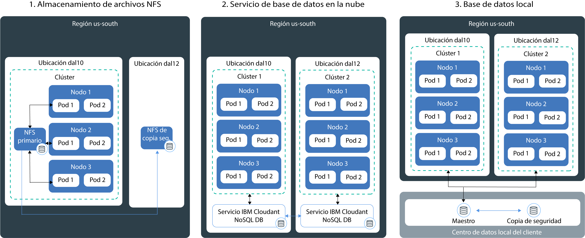

---

copyright:
  years: 2014, 2018
lastupdated: "2018-03-15"

---

{:new_window: target="_blank"}
{:shortdesc: .shortdesc}
{:screen: .screen}
{:pre: .pre}
{:table: .aria-labeledby="caption"}
{:codeblock: .codeblock}
{:tip: .tip}
{:download: .download}


# Guardado de datos en el clúster
{: #storage}
Puede conservar los datos en {{site.data.keyword.containerlong}} para compartir datos entre instancias de app y evitar que se pierdan si falla un componente del clúster de Kubernetes.

## Planificación de almacenamiento altamente disponible
{: #planning}

En {{site.data.keyword.containerlong_notm}}, puede elegir entre varias opciones para almacenar los datos de la app y compartirlos entre los distintos pods de su clúster. Sin embargo, no todas las opciones de almacenamiento ofrecen el mismo nivel de persistencia y disponibilidad en las situaciones en las que falla un componente en el clúster o todo el sitio.
{: shortdesc}

### Opciones de almacenamiento de datos no persistente
{: #non_persistent}

Puede utilizar las opciones de almacenamiento no persistente si no es necesario que sus datos se almacenen permanentemente, de modo que pueda recuperarlos después de que un componente del clúster falle, o si los datos no tienen que compartirse entre distintas instancias de la app. Las opciones de almacenamiento no persistente también se pueden utilizar para realizar pruebas de unidad de los componentes de la app o probar nuevas características.
{: shortdesc}

La siguiente imagen muestra las opciones de datos no persistentes disponibles en {{site.data.keyword.containerlong_notm}}. Estas opciones están disponibles para clústeres gratuitos y estándares.
<p>
</p>

<table summary="La tabla muestra las opciones de almacenamiento no persistente. Las filas se leen de izquierda a derecha, con el número de la opción en la columna uno, el título de la opción en la columna dos y una descripción en la columna tres." style="width: 100%">
<caption>Tabla. Opciones de almacenamiento no persistente</caption>
  <thead>
  <th>Opción</th>
  <th>Descripción</th>
  </thead>
  <tbody>
    <tr>
      <td>1. Dentro del contenedor o pod</td>
      <td>Los contenedores y pods son, por diseño, efímeros y pueden fallar inesperadamente. Sin embargo, puede escribir datos en el sistema de archivos local del contenedor para almacenar datos en todo el ciclo de vida del contenedor. Los datos dentro de un contenedor no se pueden compartir con otros contenedores o pods y se pierden cuando el contenedor se cuelga o se elimina. Para obtener más información, consulte [Almacenamiento de datos en un contenedor](https://docs.docker.com/storage/).</td>
    </tr>
  <tr>
    <td>2. En el nodo trabajador</td>
    <td>Cada nodo trabajador se configura con el almacenamiento primario y secundario determinado que está determinado por el tipo de máquina que seleccione para el nodo trabajador. El almacenamiento primario se utiliza para almacenar datos del sistema operativo y se puede acceder a él mediante un [volumen <code>hostPath</code> de Kubernetes ](https://kubernetes.io/docs/concepts/storage/volumes/#hostpath). El almacenamiento secundario se utiliza para almacenar datos en <code>/var/lib/docker</code>, el directorio en el que se escriben todos los datos del contenedor. Puede acceder al almacenamiento secundario mediante un [volumen <code>emptyDir</code> de Kubernetes ](https://kubernetes.io/docs/concepts/storage/volumes/#emptydir)<br/><br/>Mientras que los volúmenes <code>hostPath</code> se utilizan para montar archivos del sistema de archivos del nodo trabajador en el pod, <code>emptyDir</code> crea un directorio vacío que se asigna a un pod del clúster. Todos los contenedores de dicho pod pueden leer y grabar en ese volumen. Puesto que el volumen se asigna a un determinado pod, los datos no se pueden compartir con otros pods de un conjunto de réplicas.<br/><br/><p>Un volumen <code>hostPath</code> o <code>emptyDir</code> y sus datos se eliminan cuando: <ul><li>El nodo trabajador se suprime.</li><li>El nodo trabajador se vuelve a cargar o actualizar.</li><li>El clúster se suprime.</li><li>La cuenta de {{site.data.keyword.Bluemix_notm}} alcanza un estado suspendido. </li></ul></p><p>Además, los datos de un volumen <code>emptyDir</code> se eliminan cuando: <ul><li>El pod asignado se suprime de forma permanente del nodo trabajador.</li><li>El pod asignado se planifica en otro nodo trabajador.</li></ul></p><p><strong>Nota:</strong> Si el contenedor contenido en el pod se cuelga, los datos del volumen siguen estando disponibles en el nodo trabajador.</p></td>
    </tr>
    </tbody>
    </table>

### Opciones de almacenamiento de datos persistentes de alta disponibilidad
{: persistent}

El principal desafío al crear apps de estado altamente disponible es conservar los datos en varias instancias de la app en múltiples ubicaciones, y mantener los datos sincronizados todo el tiempo. Para los datos de alta disponibilidad, quiere asegurarse de contar con una base de datos maestra con múltiples instancias distribuidas en varios centros de datos o incluso regiones, y que los datos en dicha base de datos maestra se repliquen continuamente. Todas las instancias en el clúster deben leer y escribir en esta base de datos maestra. En caso de que una instancia de la maestra esté inactiva, las otras instancias pueden asumir la carga de trabajo, para que no se produzca una parada en sus apps.
{: shortdesc}

La imagen siguiente muestra las opciones que tiene en {{site.data.keyword.containerlong_notm}} para hacer que sus datos estén altamente disponibles en un clúster estándar. La opción más adecuada depende de los siguientes factores:
  * **El tipo de app que tenga:** Por ejemplo, puede tener una app que deba almacenar los datos en archivos en lugar de en una base de datos.
  * **Requisitos legales sobre dónde almacenar y direccionar los datos:** Por ejemplo, puede verse obligado a almacenar y direccionar los datos solo en los Estados Unidos y no poder utilizar un servicio ubicado en Europa.
  * **Opciones de copia de seguridad y restauración:** Todas las opciones de almacenamiento incluyen prestaciones de copia de seguridad y restauración de datos. Compruebe que las opciones disponibles de copia de seguridad y restauración cumplan los requisitos de su plan de recuperación tras desastre, como la frecuencia de las copias o la capacidad de almacenar datos fuera de su centro de datos primario.
  * **Réplica global:** Para alta disponibilidad, puede que quiera configurar múltiples instancias de almacenamiento que se distribuyan y repliquen en centros de datos de todo el mundo.

<br/>


<table summary="La tabla muestra las opciones de almacenamiento persistente. Las filas se leen de izquierda a derecha, con el número de la opción en la columna uno, el título de la opción en la columna dos y una descripción en la columna tres.">
<caption>Tabla. Opciones de almacén persistente</caption>
  <thead>
  <th>Opción</th>
  <th>Descripción</th>
  </thead>
  <tbody>
  <tr>
  <td>1. Almacenamiento de archivos NFS</td>
  <td>Con esta opción, puede conservar datos de la app y contenedores utilizando volúmenes permanentes de Kubernetes. Los volúmenes se alojan en el [almacenamiento de archivos basados en NFS de Resistencia y Rendimiento ](https://www.ibm.com/cloud/file-storage/details), que puede utilizarse para apps que almacenan datos en archivos en lugar de en una base de datos. El almacenamiento de archivos se cifra en REST.<p>{{site.data.keyword.containershort_notm}} proporciona clases de almacenamiento predefinidas que definen el rango de tamaños del almacenamiento, IOPS, la política de supresión y los permisos de lectura y escritura para el volumen. Para iniciar una solicitud de almacenamiento de archivos basados en NFS, debe crear una [reclamación de volumen permanente (PVC)](cs_storage.html#create). Después de enviar una PVC, {{site.data.keyword.containershort_notm}} suministra de forma dinámica un volumen permanente alojado en almacenamiento de archivos basado en NFS. [Puede montar la PVC](cs_storage.html#app_volume_mount) como un volumen en su despliegue para permitir que los contenedores lean el volumen y graben en el mismo. </p><p>Los volúmenes permanentes se suministran en el centro de datos donde esté ubicado el nodo trabajador. Puede compartir datos entre el mismo conjunto de réplicas o con otros despliegues en el mismo clúster. No puede compartir datos entre clústeres cuando están ubicados en distintos centros de datos o regiones. </p><p>De forma predeterminada, no se realiza copia de seguridad automática del almacenamiento NFS. Puede configurar una copia de seguridad periódica para el clúster utilizando los [mecanismos de copia de seguridad y restauración establecidos](cs_storage.html#backup_restore). Cuando un contenedor se cuelga o un pod se retira de un nodo trabajador, los datos no se eliminan y pueden acceder a los mismos otros despliegues que monten el volumen. </p><p><strong>Nota:</strong> El almacenamiento compartido de archivos NFS permanentes se factura mensualmente. Si suministra almacenamiento permanente para el clúster y lo retira de inmediato, paga igualmente el cargo mensual del almacenamiento permanente, aunque solo lo haya utilizado un breve periodo de tiempo.</p></td>
  </tr>
  <tr>
    <td>2. Servicio de base de datos en la nube</td>
    <td>Con esta opción, puede conservar datos utilizando un {{site.data.keyword.Bluemix_notm}} servicio en la nube de base de datos, como [IBM Cloudant NoSQL DB](/docs/services/Cloudant/getting-started.html#getting-started-with-cloudant). Se puede acceder a los datos que se almacenan con esta opción desde clústeres, ubicaciones y regiones. <p> Puede optar por configurar una sola instancia de base de datos a la que tengan acceso todas las apps, o [configurar varias instancias en varios centros de datos y réplica](/docs/services/Cloudant/guides/active-active.html#configuring-cloudant-nosql-db-for-cross-region-disaster-recovery) entre las instancias para aumentar la disponibilidad. En la base de datos IBM Cloudant NoSQL, la copia de seguridad de los datos no se realiza automáticamente. Puede utilizar los [mecanismos de copia de seguridad y restauración](/docs/services/Cloudant/guides/backup-cookbook.html#cloudant-nosql-db-backup-and-recovery) para proteger los datos de un fallo del sitio.</p> <p> Para utilizar un servicio en el clúster, debe [enlazar el servicio de {{site.data.keyword.Bluemix_notm}}](cs_integrations.html#adding_app) a un espacio de nombre en el clúster. Cuando enlaza el servicio al clúster, se crea un secreto de Kubernetes. El secreto de Kubernetes contiene información confidencial sobre el servicio, como por ejemplo el URL del servicio y su nombre de usuario y contraseña. Puede montar el secreto como un volumen secreto en el pod y acceder al servicio mediante las credenciales del secreto. Si monta el volumen secreto en otros pods, también puede compartir datos entre pods. Cuando un contenedor se cuelga o un pod se retira de un nodo trabajador, los datos no se eliminan y pueden acceder a los mismos otros pods que monten el volumen secreto. <p>La mayoría de los servicios de base de datos de {{site.data.keyword.Bluemix_notm}} proporcionan espacio en disco para una cantidad de datos pequeña sin coste, para así poder probar sus características.</p></td>
  </tr>
  <tr>
    <td>3. Base de datos local</td>
    <td>Si debe almacenar sus datos en local por motivos legales, puede [configurar una conexión de VPN](cs_vpn.html#vpn) a su base de datos local y utilizar los mecanismos existentes de almacenamiento, copia de seguridad y réplica en su centro de datos.</td>
  </tr>
  </tbody>
  </table>

{: caption="Tabla. Opciones de almacén permanente para despliegues en clústeres de Kubernetes" caption-side="top"}

<br />


## Utilización de recursos compartidos de archivos de NFS existentes en clústeres
{: #existing}

Si ya tiene recursos compartidos de archivos NFS existentes en su cuenta de infraestructura de IBM Cloud (SoftLayer) que desea utilizar con Kubernetes, puede hacerlo creando un volumen permanente (PV) en el almacenamiento existente.
{:shortdesc}

Un volumen permanente (PV) es un recurso de Kubernetes que representa un dispositivo de almacenamiento real que se suministra en un centro de datos. En los volúmenes permanentes se resumen los detalles de cómo IBM Cloud Storage suministra un tipo de almacenamiento específico. Para montar un PV en el clúster, debe solicitar almacenamiento persistente para el pod creando una reclamación de volumen permanente (PVC). En el siguiente diagrama se ilustra la relación entre los PV y las PVC.


 Tal como se muestra en el diagrama, para habilitar los recursos compartidos de archivos NFS existentes para utilizarlos con Kubernetes, debe crear PV con un determinado tamaño y modalidad de acceso y crear una PVC que coincida con la especificación de PV. Si el PV y la PVC coinciden, se enlazan. El usuario del clúster solo puede utilizar PVC enlazadas para montar el volumen en un despliegue. Este proceso se conoce como suministro estático de almacenamiento permanente.

Antes de empezar, asegúrese de que tiene un recurso compartido de archivos NFS existentes que puede utilizar para crear el PV. Por ejemplo, si anteriormente ha [creado una PVC con una política de clase de almacenamiento `retain`](#create), puede utilizar los datos retenidos en la compartición de archivos NFS existente para esta nueva PVC.

**Nota:** El suministro estático de almacenamiento permanente sólo se aplica a recursos compartidos de archivos NFS existentes. Si no tiene recursos compartidos de archivos NFS existentes, los usuarios del clúster puedan utilizar el proceso de [suministro dinámico](cs_storage.html#create) para añadir PV.

Para crear un PV y una PVC coincidentes, siga estos pasos.

1.  En la cuenta de infraestructura de IBM Cloud (SoftLayer), busque el ID y la vía de acceso del recurso compartido de archivos NFS en el que desea crear el objeto de PV. Además, autorice el almacenamiento de archivos para las subredes del clúster. Esta autorización proporciona al clúster acceso al almacenamiento.
    1.  Inicie sesión en la cuenta de infraestructura de IBM Cloud (SoftLayer).
    2.  Pulse **Almacenamiento**.
    3.  Pulse **Almacenamiento de archivos** y, en el menú **Acciones**, seleccione **Autorizar host**.
    4.  Seleccione **Subredes**.
    5.  En la lista desplegable, seleccione la subred VLAN privada a la que está conectado el nodo trabajador. Para encontrar la subred del nodo trabajador, ejecute `bx cs workers <cluster_name>` y compare la `IP privada` del nodo trabajador con la subred que ha encontrado en la lista desplegable.
    6.  Pulse **Enviar**.
    6.  Pulse el nombre del almacenamiento de archivos.
    7.  Anote el campo **Punto de montaje**. El campo se muestra como `<server>:/<path>`.
2.  Cree un archivo de configuración de almacenamiento para el PV. Incluya el servidor y la vía de acceso del campo **Punto de montaje** del almacenamiento de archivos.

    ```
    apiVersion: v1
    kind: PersistentVolume
    metadata:
     name: mypv
    spec:
     capacity:
       storage: "20Gi"
     accessModes:
       - ReadWriteMany
     nfs:
       server: "nfslon0410b-fz.service.networklayer.com"
       path: "/IBM01SEV8491247_0908/data01"
    ```
    {: codeblock}

    <table>
    <caption>Tabla. Visión general de los componentes del archivo YAML</caption>
    <thead>
    <th colspan=2> Visión general de los componentes del archivo YAML</th>
    </thead>
    <tbody>
    <tr>
    <td><code>name</code></td>
    <td>Especifique el nombre del objeto de PV que crear.</td>
    </tr>
    <tr>
    <td><code>spec/capacity/storage</code></td>
    <td>Especifique el tamaño de almacenamiento del recurso compartido de archivos NFS existente. El tamaño de almacenamiento se debe especificar en gigabytes, por ejemplo, 20Gi (20 GB) o 1000Gi (1 TB), y el tamaño debe coincidir con el tamaño del recurso compartido de archivos existente.</td>
    </tr>
    <tr>
    <td><code>accessMode</code></td>
    <td>Las modalidades de acceso definen el modo de montar la PVC en un nodo trabajador.<ul><li>ReadWriteOnce (RWO): el PV se puede montar en despliegues únicamente en un solo nodo trabajador. Los contenedores en despliegues que se montan en este PV pueden leer el volumen y grabar en el mismo.</li><li>ReadOnlyMany (ROX): el PV se puede montar en despliegues albergados en varios nodos trabajadores. Los despliegues que se montan en este PV solo pueden leer el volumen.</li><li>ReadWriteMany (RWX): el PV se puede montar en despliegues albergados en varios nodos trabajadores. Los despliegues que se montan en este PV pueden leer el volumen y grabar en el mismo.</li></ul></td>
    </tr>
    <tr>
    <td><code>spec/nfs/server</code></td>
    <td>Escriba el ID del servidor de recursos compartidos de archivos NFS.</td>
    </tr>
    <tr>
    <td><code>path</code></td>
    <td>Especifique la vía de acceso al recurso compartido de archivos NFS en el que desea crear el objeto de PV.</td>
    </tr>
    </tbody></table>

3.  Cree el objeto de PV en el clúster.

    ```
    kubectl apply -f <yaml_path>
    ```
    {: pre}

    Ejemplo

    ```
    kubectl apply -f deploy/kube-config/pv.yaml
    ```
    {: pre}

4.  Verifique que se ha creado el PV.

    ```
    kubectl get pv
    ```
    {: pre}

5.  Cree otro archivo de configuración para crear la PVC. Para que la PVC coincida con el objeto de PV que ha creado anteriormente, debe elegir el mismo valor para `storage` y `accessMode`. El campo `storage-class` debe estar vacío. Si alguno de estos campos no coincide con el PV, se crea automáticamente un nuevo PV.

    ```
    kind: PersistentVolumeClaim
    apiVersion: v1
    metadata:
     name: mypvc
     annotations:
       volume.beta.kubernetes.io/storage-class: ""
    spec:
     accessModes:
       - ReadWriteMany
     resources:
       requests:
         storage: "20Gi"
    ```
    {: codeblock}

6.  Cree la PVC.

    ```
    kubectl apply -f deploy/kube-config/mypvc.yaml
    ```
    {: pre}

7.  Verifique que la PVC se ha creado y se ha vinculado al objeto de PV. Este proceso puede tardar unos minutos.

    ```
    kubectl describe pvc mypvc
    ```
    {: pre}

    La salida es parecida a la siguiente.

    ```
    Name: mypvc
    Namespace: default
    StorageClass: ""
    Status: Bound
    Volume: pvc-0d787071-3a67-11e7-aafc-eef80dd2dea2
    Labels: <none>
    Capacity: 20Gi
    Access Modes: RWX
    Events:
      FirstSeen LastSeen Count From        SubObjectPath Type Reason Message
      --------- -------- ----- ----        ------------- -------- ------ -------
      3m 3m 1 {ibm.io/ibmc-file 31898035-3011-11e7-a6a4-7a08779efd33 } Normal Provisioning External provisioner is provisioning volume for claim "default/my-persistent-volume-claim"
      3m 1m  10 {persistentvolume-controller } Normal ExternalProvisioning cannot find provisioner "ibm.io/ibmc-file", expecting that a volume for the claim is provisioned either manually or via external software
      1m 1m 1 {ibm.io/ibmc-file 31898035-3011-11e7-a6a4-7a08779efd33 } Normal ProvisioningSucceeded Successfully provisioned volume pvc-0d787071-3a67-11e7-aafc-eef80dd2dea2
    ```
    {: screen}


Ha creado correctamente un objeto de PV y lo ha enlazado a una PVC. Ahora los usuarios del clúster pueden [montar la PVC](#app_volume_mount) en sus despliegues y empezar a leer el objeto de PV y a grabar en el mismo.

<br />


## Adición de almacenamiento de archivos NFS a apps
{: #create}

Cree una reclamación de volumen permanente (PVC) para suministrar almacenamiento de archivos NFS al clúster. Luego monte esta reclamación en un volumen permanente (PV) para asegurarse de que los datos estén disponibles aunque los pods se cuelguen o se cierren.
{:shortdesc}

IBM coloca el almacén de archivos NFS que contiene el PV en un clúster para ofrecer una alta disponibilidad de los datos. Las clases de almacenamiento describen los tipos de ofertas de almacenamiento disponibles y definen aspectos como la política de retención de datos, el tamaño en gigabytes e IOPS, cuando se crea el PV.


**Antes de empezar**: si tiene un cortafuegos, [permita el acceso de salida](cs_firewall.html#pvc) para los rangos de IP de la infraestructura de IBM Cloud (SoftLayer) de las ubicaciones (centros de datos) en las que están en los clústeres, de modo que pueda crear PVC.

Para añadir almacenamiento persistente:

1.  Revise las clases de almacenamiento disponibles. {{site.data.keyword.containerlong}} ofrece clases de almacenamiento predefinidas de almacenamiento de archivos NFS para que el administrador del clúster no tenga que crear ninguna clase de almacenamiento. La clase de almacenamiento `ibmc-file-bronze` es la misma que la clase de almacenamiento `default`.

    ```
    kubectl get storageclasses
    ```
    {: pre}

    ```
    $ kubectl get storageclasses
    NAME                         TYPE
    default                      ibm.io/ibmc-file
    ibmc-file-bronze (default)   ibm.io/ibmc-file
    ibmc-file-custom             ibm.io/ibmc-file
    ibmc-file-gold               ibm.io/ibmc-file
    ibmc-file-retain-bronze      ibm.io/ibmc-file
    ibmc-file-retain-custom      ibm.io/ibmc-file
    ibmc-file-retain-gold        ibm.io/ibmc-file
    ibmc-file-retain-silver      ibm.io/ibmc-file
    ibmc-file-silver             ibm.io/ibmc-file
    ```
    {: screen}

    **Sugerencia:** Si desea cambiar la clase de almacenamiento predeterminada, ejecute `kubectl patch storageclass <storageclass> -p '{"metadata": {"annotations":{"storageclass.kubernetes.io/is-default-class":"true"}}}'` y sustituya `<storageclass>` con el nombre de la clase de almacenamiento.

2.  Decida si desea conservar los datos y la compartición de archivos NFS después de suprimir la PVC.
    - Si desea conservar los datos, seleccione la clase de almacenamiento `retain`. Cuando se suprime la PVC, se elimina el PV, pero el archivo NFS y los datos siguen existiendo en la cuenta de infraestructura de IBM Cloud (SoftLayer). Posteriormente, para acceder a estos datos en el clúster, cree una PVC y un PV coincidentes que hagan referencia al [archivo NFS](#existing) existente.
    - Si desea que los datos y la compartición de archivos NFS se supriman cuando suprima la PVC, elija una clase de almacenamiento sin `retain`.

3.  **Si utiliza las clases de almacenamiento bronce, plata y oro**: obtendrá [Almacenamiento resistente ](https://knowledgelayer.softlayer.com/topic/endurance-storage), que define las IOPS por GB para cada clase. Sin embargo, puede determinar la IOPS total eligiendo un tamaño dentro del rango disponible. Puede seleccionar cualquier número entero de gigabytes dentro del rango de tamaños permitido (como 20 Gi, 256 Gi, 11854 Gi). Por ejemplo, si selecciona un tamaño de compartición de archivos de 1000Gi en la clase de almacenamiento de plata de 4 IOPS por GB, el volumen tendrá un total de 4000 IOPS. Cuantos más IOPS tenga el PV, más rápido se procesarán las operaciones de entrada y salida. La tabla siguiente describe las IOPS por gigabyte y rango de tamaño para cada clase de almacenamiento.

    <table>
         <caption>Tabla de IOPS y rangos de tamaño de clase de almacenamiento por gigabyte</caption>
         <thead>
         <th>Clase de almacenamiento</th>
         <th>IOPS por gigabyte</th>
         <th>Rango de tamaño en gigabytes</th>
         </thead>
         <tbody>
         <tr>
         <td>Bronce (predeterminada)</td>
         <td>2 IOPS/GB</td>
         <td>20-12000 Gi</td>
         </tr>
         <tr>
         <td>Plata</td>
         <td>4 IOPS/GB</td>
         <td>20-12000 Gi</td>
         </tr>
         <tr>
         <td>Oro</td>
         <td>10 IOPS/GB</td>
         <td>20-4000 Gi</td>
         </tr>
         </tbody></table>

    <p>**Mandato de ejemplo para mostrar los detalles de una clase de almacenamiento**:</p>

    <pre class="pre">kubectl describe storageclasses ibmc-file-silver</pre>

4.  **Si elige la clase de almacenamiento personalizada**: obtendrá [Almacenamiento de rendimiento ](https://knowledgelayer.softlayer.com/topic/performance-storage) y tendrá más control sobre la elección de la combinación de IOPS y el tamaño. Por ejemplo, si selecciona un tamaño de 40Gi para el PVC, puede elegir un IOPS que sea múltiplo de 100 que esté comprendido entre 100 y 2000 IOPS. La tabla siguiente muestra los rangos de IOPS entre los que puede elegir en función del tamaño que seleccione.

    <table>
         <caption>Tabla de IOPS y rangos de tamaño de clase de almacenamiento personalizados</caption>
         <thead>
         <th>Rango de tamaño en gigabytes</th>
         <th>Rango de IOPS en múltiplos de 100</th>
         </thead>
         <tbody>
         <tr>
         <td>20-39 Gi</td>
         <td>100-1000 IOPS</td>
         </tr>
         <tr>
         <td>40-79 Gi</td>
         <td>100-2000 IOPS</td>
         </tr>
         <tr>
         <td>80-99 Gi</td>
         <td>100-4000 IOPS</td>
         </tr>
         <tr>
         <td>100-499 Gi</td>
         <td>100-6000 IOPS</td>
         </tr>
         <tr>
         <td>500-999 Gi</td>
         <td>100-10000 IOPS</td>
         </tr>
         <tr>
         <td>1000-1999 Gi</td>
         <td>100-20000 IOPS</td>
         </tr>
         <tr>
         <td>2000-2999 Gi</td>
         <td>200-40000 IOPS</td>
         </tr>
         <tr>
         <td>3000-3999 Gi</td>
         <td>200-48000 IOPS</td>
         </tr>
         <tr>
         <td>4000-7999 Gi</td>
         <td>300-48000 IOPS</td>
         </tr>
         <tr>
         <td>8000-9999 Gi</td>
         <td>500-48000 IOPS</td>
         </tr>
         <tr>
         <td>10000-12000 Gi</td>
         <td>1000-48000 IOPS</td>
         </tr>
         </tbody></table>

    <p>**Mandato de ejemplo para mostrar los detalles de una clase de almacenamiento personalizada**:</p>

    <pre class="pre">kubectl describe storageclasses ibmc-file-retain-custom</pre>

5.  Decida si desea que se le facture por horas o meses. De forma predeterminada, se le facturará mensualmente.

6.  Cree un archivo de configuración para definir su PVC y guarde la configuración como archivo `.yaml`.

    -  **Ejemplo de clases de almacenamiento bronce, plata y oro**:
       El siguiente archivo `.yaml` crea una reclamación que se denomina `mypvc` de la clase de almacenamiento `"ibmc-file-silver"`, que se factura con el valor `"hourly"`, con un tamaño de gigabyte de `24Gi`. 

       ```
       apiVersion: v1
       kind: PersistentVolumeClaim
       metadata:
         name: mypvc
         annotations:
           volume.beta.kubernetes.io/storage-class: "ibmc-file-silver"
         labels:
           billingType: "hourly"
       spec:
         accessModes:
           - ReadWriteMany
         resources:
           requests:
             storage: 24Gi
        ```
        {: codeblock}

    -  **Ejemplo de clases de almacenamiento personalizadas**:
       El siguiente archivo `.yaml` crea una reclamación que se denomina `mypvc` de la clase de almacenamiento `ibmc-file-retain-custom`, que se factura con el valor predeterminado `"monthly"`, con un tamaño de gigabyte de `45Gi` y un valor de IOPS de `"300"`.

       ```
       apiVersion: v1
       kind: PersistentVolumeClaim
       metadata:
         name: mypvc
         annotations:
           volume.beta.kubernetes.io/storage-class: "ibmc-file-retain-custom"
         labels:
           billingType: "monthly"
       spec:
         accessModes:
           - ReadWriteMany
         resources:
           requests:
             storage: 45Gi
             iops: "300"
        ```
        {: codeblock}

        <table>
	      <caption>Tabla. Visión general de los componentes del archivo YAML</caption>
        <thead>
        <th colspan=2> Visión general de los componentes del archivo YAML</th>
        </thead>
        <tbody>
        <tr>
        <td><code>metadata/name</code></td>
        <td>Escriba el nombre de la PVC.</td>
        </tr>
        <tr>
        <td><code>metadata/annotations</code></td>
        <td>Especifique la clase de almacenamiento para el PV:
          <ul>
          <li>ibmc-file-bronze / ibmc-file-retain-bronze : 2 IOPS por GB.</li>
          <li>ibmc-file-silver / ibmc-file-retain-silver: 4 IOPS por GB.</li>
          <li>ibmc-file-gold / ibmc-file-retain-gold: 10 IOPS por GB.</li>
          <li>ibmc-file-custom / ibmc-file-retain-custom: Varios valores de IOPS disponibles.</li></ul>
          <p>Si no especifica ninguna clase de almacenamiento, el PV se crea en la clase de almacenamiento predeterminada.</p><p>**Sugerencia:** Si desea cambiar la clase de almacenamiento predeterminada, ejecute <code>kubectl patch storageclass &lt;storageclass&gt; -p '{"metadata": {"annotations":{"storageclass.kubernetes.io/is-default-class":"true"}}}'</code> y sustituya <code>&lt;storageclass&gt;</code> con el nombre de la clase de almacenamiento.</p></td>
        </tr>
        <tr>
          <td><code>metadata/labels/billingType</code></td>
          <td>Especifique la frecuencia con la que desea que se calcule la factura de almacenamiento, los valores son "monthly" o "hourly". El valor predeterminado es "monthly".</td>
        </tr>
        <tr>
        <td><code>spec/resources/requests/storage</code></td>
        <td>Indique el tamaño del almacenamiento de archivos, en gigabytes (Gi). Elija un número entero dentro del rango de tamaños permitido. </br></br><strong>Nota: </strong> Una vez suministrado el almacenamiento, no puede cambiar el tamaño de la compartición de archivos NFS. Asegúrese de especificar un tamaño que coincida con la cantidad de datos que desea almacenar. </td>
        </tr>
        <tr>
        <td><code>spec/resources/requests/iops</code></td>
        <td>Esta opción solo es para clases de almacenamiento personalizadas (`ibmc-file-custom / ibmc-file-retain-custom`). Especifique el IOPS total para el almacenamiento seleccionando un múltiplo de 100 dentro del rango permitido. Para ver todas las opciones, ejecute `kubectl describe storageclasses <storageclass>`. Si elige un IOPS distinto del que aparece en la lista, el IOPS se redondea.</td>
        </tr>
        </tbody></table>

7.  Cree la PVC.

    ```
    kubectl apply -f <local_file_path>
    ```
    {: pre}

8.  Verifique que la PVC se ha creado y se ha vinculado al PV. Este proceso puede tardar unos minutos.

    ```
    kubectl describe pvc mypvc
    ```
    {: pre}

    Salida de ejemplo:

    ```
    Name: mypvc
    Namespace: default
    StorageClass: ""
    Status:  Bound
    Volume:  pvc-0d787071-3a67-11e7-aafc-eef80dd2dea2
    Labels:  <none>
    Capacity: 20Gi
    Access Modes: RWX
    Events:
      FirstSeen LastSeen Count From        SubObjectPath Type  Reason   Message
      --------- -------- ----- ----        ------------- -------- ------   -------
      3m  3m  1 {ibm.io/ibmc-file 31898035-3011-11e7-a6a4-7a08779efd33 }   Normal  Provisioning  External provisioner is provisioning volume for claim "default/my-persistent-volume-claim"
      3m  1m  10 {persistentvolume-controller }       Normal  ExternalProvisioning cannot find provisioner "ibm.io/ibmc-file", expecting that a volume for the claim is provisioned either manually or via external software
      1m  1m  1 {ibm.io/ibmc-file 31898035-3011-11e7-a6a4-7a08779efd33 }   Normal  ProvisioningSucceeded Successfully provisioned volume pvc-0d787071-3a67-11e7-aafc-eef80dd2dea2

    ```
    {: screen}

9.  {: #app_volume_mount}Para montar la PVC en el despliegue, cree un archivo `.yaml` de configuración.

    ```
    apiVersion: apps/v1beta1
    kind: Deployment
    metadata:
      name: <deployment_name>
      labels:
        app: <deployment_label>
    spec:
      selector:
        matchLabels:
          app: <app_name>
      template:
        metadata:
          labels:
            app: <app_name>
        spec:
          containers:
          - image: <image_name>
            name: <container_name>
            volumeMounts:
            - name: <volume_name>
              mountPath: /<file_path>
          volumes:
          - name: <volume_name>
            persistentVolumeClaim:
              claimName: <pvc_name>
    ```
    {: codeblock}

    <table>
    <caption>Tabla. Visión general de los componentes del archivo YAML</caption>
    <thead>
    <th colspan=2> Visión general de los componentes del archivo YAML</th>
    </thead>
    <tbody>
        <tr>
    <td><code>metadata/labels/app</code></td>
    <td>Una etiqueta para el despliegue.</td>
      </tr>
      <tr>
        <td><code>spec/selector/matchLabels/app</code> <br/> <code>spec/template/metadata/labels/app</code></td>
        <td>Una etiqueta para la app.</td>
      </tr>
    <tr>
    <td><code>template/metadata/labels/app</code></td>
    <td>Una etiqueta para el despliegue.</td>
      </tr>
    <tr>
    <td><code>spec/containers/image</code></td>
    <td>El nombre del imagen que desea utilizar. Para ver una lista de todas las imágenes disponibles en su cuenta de {{site.data.keyword.registryshort_notm}}, ejecute `bx cr image-list`.</td>
    </tr>
    <tr>
    <td><code>spec/containers/name</code></td>
    <td>El nombre del contenedor que desea desplegar en el clúster.</td>
    </tr>
    <tr>
    <td><code>spec/containers/volumeMounts/mountPath</code></td>
    <td>La vía de acceso absoluta del directorio en el que el que está montado el volumen dentro del contenedor.</td>
    </tr>
    <tr>
    <td><code>spec/containers/volumeMounts/name</code></td>
    <td>El nombre del volumen que va a montar en el pod.</td>
    </tr>
    <tr>
    <td><code>volumes/name</code></td>
    <td>El nombre del volumen que va a montar en el pod. Normalmente, este nombre es el mismo que <code>volumeMounts/name</code>.</td>
    </tr>
    <tr>
    <td><code>volumes/persistentVolumeClaim/claimName</code></td>
    <td>El nombre de la PVC que desea utilizar como volumen. Cuando monta el volumen en el pod, Kubernetes identifica el PV enlazado a la PVC y permite al usuario realizar operaciones de lectura y escritura en el PV.</td>
    </tr>
    </tbody></table>

10.  Cree el despliegue y monte la PVC.
     ```
     kubectl apply -f <local_yaml_path>
     ```
     {: pre}

11.  Verifique que el volumen se ha montado correctamente.

     ```
     kubectl describe deployment <deployment_name>
     ```
     {: pre}

     El punto de montaje se muestra en el campo **Volume Mounts** y el volumen se muestra en el campo **Volumes**.

     ```
      Volume Mounts:
          /var/run/secrets/kubernetes.io/serviceaccount from default-token-tqp61 (ro)
          /volumemount from myvol (rw)
     ...
     Volumes:
      myvol:
        Type: PersistentVolumeClaim (a reference to a PersistentVolumeClaim in the same namespace)
        ClaimName: mypvc
        ReadOnly: false
     ```
     {: screen}

<br />


## Configuración de soluciones de copia de seguridad y restauración de comparticiones de archivo NFS
{: #backup_restore}

Las comparticiones de archivo se suministran en la misma ubicación (centro de datos) que el clúster y las agrupa {{site.data.keyword.IBM_notm}} para proporcionar una alta disponibilidad. Sin embargo, no se realizan copias de seguridad de las comparticiones de archivo automáticamente, y pueden no ser accesibles si falla toda la ubicación. Para evitar que los datos que se pierdan o se dañen, puede configurar copias de seguridad periódicas de comparticiones de archivos NFS que puede utilizar para restaurar los datos cuando sea necesario.
{: shortdesc}

Consulte las opciones siguientes de copia de seguridad y restauración para las comparticiones de archivo NFS:

<dl>
  <dt>Configurar instantáneas periódicas de la compartición de archivos NFS</dt>
  <dd>Puede configurar [instantáneas periódicas](/docs/infrastructure/FileStorage/snapshots.html#working-with-snapshots) de la compartición de archivos NFS, que es una imagen de sólo lectura de una compartición de archivos NFS que captura el estado del volumen en un punto en el tiempo. Las instantáneas se almacenan en la misma compartición de archivos en la misma ubicación. Puede restaurar datos desde una instantánea si un usuario elimina accidentalmente datos importantes del volumen.</dd>
  <dt>Replicar instantáneas a una compartición de archivos NFS en otra ubicación (centro de datos)</dt>
 <dd>Para proteger los datos ante un error de ubicación, puede [replicar instantáneas](/docs/infrastructure/FileStorage/replication.html#working-with-replication) a una compartición de archivos NFS que esté configurada en otra ubicación. Los datos se pueden replicar desde la compartición de archivos NFS primaria a la compartición de archivos NFS de copia de seguridad únicamente. No puede montar una compartición de archivos NFS replicada en un clúster. Si la compartición de archivos NFS falla, puede definir manualmente que la compartición de archivos NFS de copia de seguridad sea la primaria. A continuación, puede montarla en el clúster. Una vez restaurada la compartición de archivos NFS primaria, puede restaurar los datos de la compartición de archivos NFS de copia seguridad.</dd>
  <dt>Realizar una copia de seguridad de los datos en Object Storage</dt>
  <dd>Puede utilizar la [**imagen ibm-backup-restore**](/docs/services/RegistryImages/ibm-backup-restore/index.html#ibmbackup_restore_starter) para utilizar un pod de copia de seguridad y restauración en el clúster. Este pod contiene un script para ejecutar una copia de seguridad puntual o periódico para cualquier reclamación de volumen permanente (PVC) en el clúster. Los datos se almacenan en la instancia de {{site.data.keyword.objectstoragefull}} que ha configurado en una ubicación. Para aumentar la alta disponibilidad de los datos y proteger la app ante un error de ubicación, configure una segunda instancia de {{site.data.keyword.objectstoragefull}} y replique los datos en las ubicaciones. Si necesita restaurar datos desde la instancia de {{site.data.keyword.objectstoragefull}}, utilice el script de restauración que se proporciona con la imagen.</dd>
  </dl>

## Adición de acceso de usuario no root al almacenamiento de archivos NFS
{: #nonroot}

De forma predeterminada, los usuarios no root no tienen permiso de escritura sobre la vía de acceso de montaje del volumen para el almacenamiento respaldado por NFS. Algunas imágenes comunes, como por ejemplo Jenkins y Nexus3, especifican un usuario no root que posee la vía de acceso de montaje en Dockerfile. Cuando se crea un contenedor desde este Dockerfile, la creación del contenedor falla debido a permisos insuficientes del usuario no root en la vía de acceso de montaje. Para otorgar permiso de escritura, puede modificar el Dockerfile para añadir temporalmente el usuario no root al grupo de usuarios root antes de cambiar los permisos de la vía de acceso de montaje, o utilizar un contenedor de inicialización.
{:shortdesc}

Si utiliza un diagrama de Helm para desplegar una imagen con un usuario no root que desea que tenga permisos de escritura en la compartición de archivos NFS, edite primero el despliegue de Helm para utilizar un contenedor de inicialización.
{:tip}


Cuando se incluye un [contenedor de inicialización ](https://kubernetes.io/docs/concepts/workloads/pods/init-containers/) en el despliegue, puede dar a un usuario no root especificado en el Dockerfile permisos de escritura para la vía de acceso de montaje del volumen dentro del contenedor que apunta a la compartición de archivos NFS. El contenedor de inicialización de inicia antes que el contenedor de la app. El contenedor de inicialización crea la vía de acceso de montaje del volumen dentro del contenedor, cambia la propiedad de la vía de acceso de montaje al usuario (no root) correcto y se cierra. A continuación, se inicia el contenedor de la app, que incluye el usuario no root que debe escribir en la vía de acceso de montaje. Dado que la vía de acceso ya es propiedad del usuario no root, la escritura en la vía de acceso de montaje se realiza correctamente. Si no desea utilizar un contenedor de inicialización, puede modificar el Dockerfile para añadir acceso de usuario no root al almacenamiento de archivos NFS.

Antes de empezar, seleccione su clúster como [destino de la CLI](cs_cli_install.html#cs_cli_configure).

1.  Abra el Dockerfile para la app y obtenga el ID de usuario (UID) y el ID de grupo (GID) del usuario al que desea dar permiso de escritura en la vía de acceso de montaje del volumen. En el ejemplo de un Dockerfile de Jenkins, la información es la siguiente:
    - UID: `1000`
    - GID: `1000`

    **Ejemplo**:

    ```
    FROM openjdk:8-jdk

    RUN apt-get update && apt-get install -y git curl && rm -rf /var/lib/apt/lists/*

    ARG user=jenkins
    ARG group=jenkins
    ARG uid=1000
    ARG gid=1000
    ARG http_port=8080
    ARG agent_port=50000

    ENV JENKINS_HOME /var/jenkins_home
    ENV JENKINS_SLAVE_AGENT_PORT ${agent_port}
    ...
    ```
    {:screen}

2.  Añade almacenamiento persistente a la app creando una reclamación de volumen permanente (PVC). En este ejemplo se utiliza la clase de almacenamiento `ibmc-file-bronze`. Para revisar las clases de almacenamiento disponibles, ejecute `kubectl get storageclasses`.

    ```
    apiVersion: v1
    kind: PersistentVolumeClaim
    metadata:
      name: mypvc
      annotations:
        volume.beta.kubernetes.io/storage-class: "ibmc-file-bronze"
    spec:
      accessModes:
        - ReadWriteMany
      resources:
        requests:
          storage: 20Gi
    ```
    {: codeblock}

3.  Cree la PVC.

    ```
    kubectl apply -f <local_file_path>
    ```
    {: pre}

4.  En el archivo `.yaml` de despliegue, añada el contenedor de inicialización. Incluya el UID y el GID que ha recuperado anteriormente.

    ```
    initContainers:
    - name: initContainer # Or you can replace with any name
      image: alpine:latest
      command: ["/bin/sh", "-c"]
      args:
        - chown <UID>:<GID> /mount; # Replace UID and GID with values from the Dockerfile
      volumeMounts:
      - name: volume # Or you can replace with any name
        mountPath: /mount # Must match the mount path in the args line
    ```
    {: codeblock}

    **Ejemplo** para un despliegue de Jenkins:

    ```
    apiVersion: apps/v1
    kind: Deployment
    metadata:
      name: my_pod
    spec:
      replicas: 1
      template:
        metadata:
          labels:
            app: jenkins
        spec:
          containers:
          - name: jenkins
            image: jenkins
            volumeMounts:
            - mountPath: /var/jenkins_home
              name: volume
          volumes:
          - name: volume
            persistentVolumeClaim:
              claimName: mypvc
          initContainers:
          - name: permissionsfix
            image: alpine:latest
            command: ["/bin/sh", "-c"]
            args:
              - chown 1000:1000 /mount;
            volumeMounts:
            - name: volume
              mountPath: /mount
    ```
    {: codeblock}

5.  Cree el pod y monte la PVC en el pod.

    ```
    kubectl apply -f <local_yaml_path>
    ```
    {: pre}

6. Verifique que el volumen se ha montado correctamente en el pod. Anote el nombre de pod y la vía de acceso de **Containers/Mounts**.

    ```
    kubectl describe pod <my_pod>
    ```
    {: pre}

    **Salida de ejemplo**:

    ```
    Name:		    mypod-123456789
    Namespace:	default
    ...
    Init Containers:
    ...
    Mounts:
      /mount from volume (rw)
      /var/run/secrets/kubernetes.io/serviceaccount from default-token-cp9f0 (ro)
    ...
    Containers:
      jenkins:
        Container ID:
        Image:		jenkins
        Image ID:
        Port:		  <none>
        State:		Waiting
          Reason:		PodInitializing
        Ready:		False
        Restart Count:	0
        Environment:	<none>
        Mounts:
          /var/jenkins_home from volume (rw)
          /var/run/secrets/kubernetes.io/serviceaccount from default-token-cp9f0 (ro)
    ...
    Volumes:
      myvol:
        Type: PersistentVolumeClaim (a reference to a PersistentVolumeClaim in the same namespace)
        ClaimName: mypvc
        ReadOnly: false

    ```
    {: screen}

7.  Inicie la sesión en el pod utilizando el nombre de pod que ha anotado anteriormente.

    ```
    kubectl exec -it <my_pod-123456789> /bin/bash
    ```
    {: pre}

8. Verifique los permisos de la vía de acceso de montaje del contenedor. En el ejemplo, la vía de acceso de montaje es `/var/jenkins_home`.

    ```
    ls -ln /var/jenkins_home
    ```
    {: pre}

    **Salida de ejemplo**:

    ```
    jenkins@mypod-123456789:/$ ls -ln /var/jenkins_home
    total 12
    -rw-r--r-- 1 1000 1000  102 Mar  9 19:58 copy_reference_file.log
    drwxr-xr-x 2 1000 1000 4096 Mar  9 19:58 init.groovy.d
    drwxr-xr-x 9 1000 1000 4096 Mar  9 20:16 war
    ```
    {: screen}

    Esta salida muestra que el GID y el UID del Dockerfile (en este ejemplo, `1000` y `1000`) poseen la vía de acceso de montaje dentro del contenedor.


