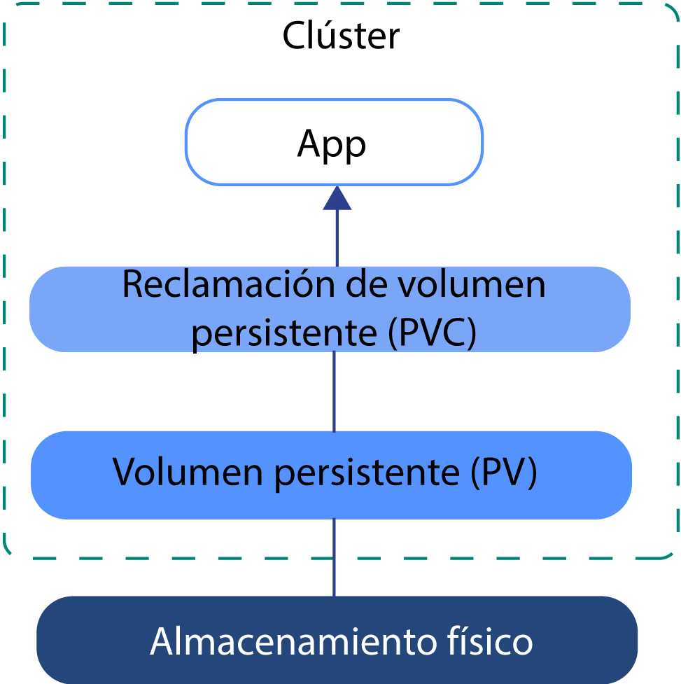
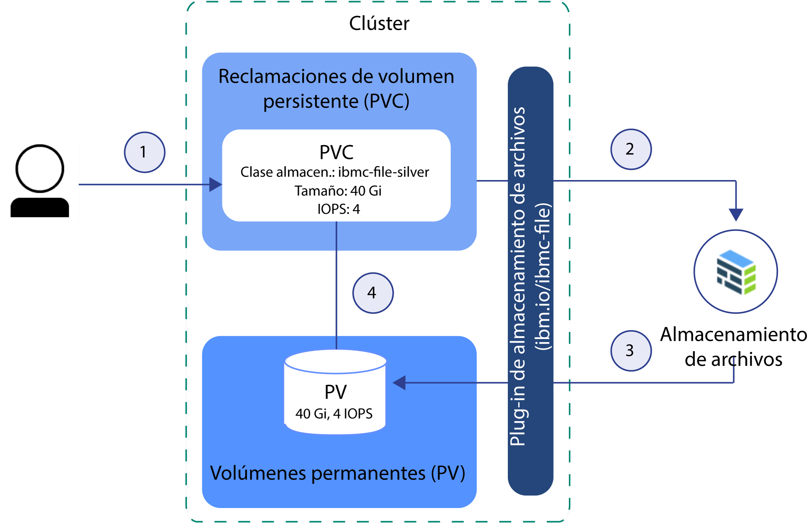
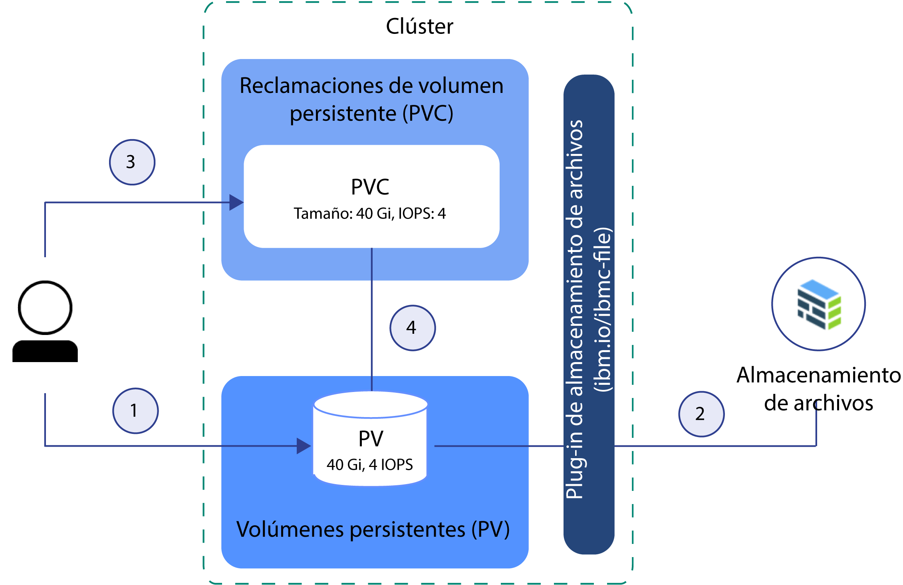

---

copyright:
  years: 2014, 2019
lastupdated: "2019-05-31"

keywords: kubernetes, iks

subcollection: containers

---

{:new_window: target="_blank"}
{:shortdesc: .shortdesc}
{:screen: .screen}
{:pre: .pre}
{:table: .aria-labeledby="caption"} 
{:codeblock: .codeblock}
{:tip: .tip}
{:note: .note}
{:important: .important}
{:deprecated: .deprecated}
{:download: .download}
{:preview: .preview}


# Conceptos básicos del almacenamiento de Kubernetes
{: #kube_concepts}

## Volúmenes persistentes y reclamaciones de volumen persistente
{: #pvc_pv}

Antes de empezar a suministrar almacenamiento, es importante comprender los conceptos volumen persistente y reclamación de volumen persistente de Kubernetes y cómo trabajan conjuntamente en un clúster.
{: shortdesc}

En la imagen siguiente se muestran los componentes de almacenamiento en un clúster de Kubernetes.



- **Clúster**:</br> De forma predeterminada, cada clúster se configura con un plugin para [suministrar almacenamiento de archivos](/docs/containers?topic=containers-file_storage#add_file). Puede optar por instalar otros complementos, como por ejemplo el de [almacenamiento en bloque](/docs/containers?topic=containers-block_storage). Para utilizar el almacenamiento en un clúster, debe crear una reclamación de volumen persistente, un volumen persistente y una instancia de almacenamiento físico. Cuando suprima el clúster, tiene la opción de suprimir las instancias de almacenamiento relacionadas.
- **App**:</br> Para leer su instancia de almacenamiento y escribir en la misma, debe montar la reclamación de volumen persistente (PVC) en la app. Los distintos tipos de almacenamiento tienen distintas reglas de lectura y escritura. Por ejemplo, puede montar varios pods en la misma PVC para el almacenamiento de archivos. El almacenamiento en bloque se suministra con una modalidad de acceso RWO (ReadWriteOnce), de forma que solo puede montar el almacenamiento en un pod.
- **Reclamación de volumen persistente (PVC)**: </br> Una PVC es la solicitud para suministrar almacenamiento persistente con un tipo y una configuración específicos. Para especificar el tipo de almacenamiento persistente que desea, utilice [clases de almacenamiento de Kubernetes](#storageclasses). El administrador del clúster puede definir clases de almacenamiento, o puede elegir entre una de las clases de almacenamiento predefinidas de {{site.data.keyword.containerlong_notm}}. Cuando cree una PVC, la solicitud se envía al proveedor de almacenamiento de {{site.data.keyword.Bluemix}}. En función de la configuración que se haya definido en la clase de almacenamiento, el dispositivo de almacenamiento físico se solicita y se suministra en la cuenta de infraestructura de IBM Cloud (SoftLayer). Si la configuración solicitada no existe, el almacenamiento no se crea.
- **Volumen persistente (PV)**: </br> Un PV es una instancia de almacenamiento virtual que se añade como volumen al clúster. El PV apunta a un dispositivo de almacenamiento físico en la cuenta de infraestructura de IBM Cloud (SoftLayer) y resume la API que se utiliza para comunicar con el dispositivo de almacenamiento. Para montar un PV en una app, debe tener una PVC coincidente. Los PV montados aparecen como una carpeta dentro del sistema de archivos del contenedor.
- **Almacenamiento físico**: </br> Una instancia de almacenamiento físico que puede utilizar para conservar los datos. Entre los ejemplos de almacenamiento físico en {{site.data.keyword.Bluemix_notm}} se incluyen [Almacenamiento de archivos](/docs/containers?topic=containers-file_storage#file_storage), [Almacenamiento en bloque](/docs/containers?topic=containers-block_storage#block_storage), [Almacenamiento de objetos](/docs/containers?topic=containers-object_storage#object_storage) y almacenamiento de nodos trabajadores que puede utilizar como almacenamiento de SDS con [Portworx](/docs/containers?topic=containers-portworx#portworx). {{site.data.keyword.Bluemix_notm}} proporciona alta disponibilidad para las instancias de almacenamiento físico. Sin embargo, los datos que se almacenan en una instancia de almacenamiento físico no se copian automáticamente. En función del tipo de almacenamiento que utilice, existen distintos métodos para configurar soluciones de copia de seguridad y restauración.

Para obtener más información sobre cómo crear y utilizar las PVC, los PV y el dispositivo de almacenamiento físico, consulte:
- [Suministro dinámico](#dynamic_provisioning)
- [Suministro estático](#static_provisioning)

## Suministro dinámico
{: #dynamic_provisioning}

Utilice el suministro dinámico si desea dar a los desarrolladores la libertad de suministrar almacenamiento cuando lo necesiten.
{: shortdesc}

**¿Cómo funciona?**</br>

El suministro dinámico es una característica nativa de Kubernetes y que permite a un desarrollador del clúster solicitar almacenamiento con un tipo y configuración predefinidos sin conocer todos los detalles sobre cómo suministrar el dispositivo de almacenamiento físico. Para resumir los detalles del tipo de almacenamiento específico, el administrador del clúster debe crear [clases de almacenamiento](#storageclasses) que puede utilizar el desarrollador o puede utilizar las clases de almacenamiento que se suministran con los plugins de almacenamiento de {{site.data.keyword.Bluemix}}.

Para solicitar el almacenamiento, debe crear una PVC. La PVC determina la especificación del almacenamiento que desea suministrar. Después de crear la PVC, el dispositivo de almacenamiento y el PV se crean automáticamente.  

En la imagen siguiente se muestra cómo se suministra dinámicamente el almacenamiento de archivos en un clúster. Este flujo de ejemplo funciona de forma similar con otros tipos de almacenamiento, como por ejemplo el almacenamiento en bloque.

**Flujo de ejemplo para el suministro dinámico de almacenamiento de archivos con la clase de almacenamiento plata (silver) predefinida**



1. El usuario crea una reclamación de volumen persistente (PVC) que especifica el tipo de almacenamiento, la clase de almacenamiento, el tamaño en gigabytes, el número de IOPS y el tipo de facturación. La clase de almacenamiento determina el tipo de almacenamiento que se suministra y los rangos permitidos para tamaño e IOPS. La creación de una PVC en un clúster activa automáticamente el plugin de almacenamiento para el tipo de almacenamiento solicitado para suministrar almacenamiento con la especificación determinada.
2. El dispositivo de almacenamiento se solicita automáticamente y se suministra a la cuenta de infraestructura de IBM Cloud (SoftLayer). Comienza el ciclo de facturación para el dispositivo de almacenamiento.
3. El plugin de almacenamiento crea automáticamente un volumen persistente (PV) en el clúster, un dispositivo de almacenamiento virtual que apunta al dispositivo de almacenamiento real en la cuenta de infraestructura de IBM Cloud (SoftLayer).
4. La PVC y el PV se conectan automáticamente entre sí. El estado de la PVC y del y PV pasa a ser `Bound`. Ahora puede utilizar la PVC para montar el almacenamiento persistente en la app. Si suprime la PVC, también se suprimirán el PV y la instancia de almacenamiento relacionada. </br>

**¿Cuándo se utiliza el suministro dinámico?**</br>

Revise los siguientes casos de uso comunes para el suministro dinámico:
1. **Suministrar almacenamiento cuando sea necesario:** en lugar de proporcionar de antemano almacenamiento persistente a los desarrolladores y pagar por el almacenamiento que no se utiliza, puede dar a los desarrolladores la libertad de suministrar almacenamiento cuando lo necesiten. Para determinar el tipo de almacenamiento que puede suministrar el desarrollador, puede definir [clases de almacenamiento](#storageclasses).
2. **Automatizar la creación de PVC, PV y dispositivo de almacenamiento:** desea suministrar y retirar almacenamiento automáticamente sin la intervención manual de un administrador del clúster.
3. **Crear y suprimir almacenamiento con frecuencia:** tiene una app o ha configurado un canal de distribución continuo que crea y elimina almacenamiento persistente de forma regular. El almacenamiento persistentes que se suministra dinámicamente con una clase de almacenamiento que no es de retención se puede eliminar suprimiendo la PVC.

Para obtener más información sobre cómo suministrar dinámicamente almacenamiento persistente, consulte:
- [Almacenamiento de archivos](/docs/containers?topic=containers-file_storage#add_file)
- [Almacenamiento en bloque](/docs/containers?topic=containers-block_storage#add_block)

## Suministro estático
{: #static_provisioning}

Si tiene un dispositivo de almacenamiento persistente existente en la cuenta de infraestructura de IBM Cloud (SoftLayer), puede utilizar el suministro estático para poner la instancia de almacenamiento a disponibilidad del clúster.
{: shortdesc}

**¿Cómo funciona?**</br>

El suministro estático es una característica nativa de Kubernetes y que permite a los administradores del clúster poner los dispositivos de almacenamiento existentes a disposición de un clúster. Como administrador del clúster, debe conocer los detalles del dispositivo de almacenamiento, sus configuraciones soportadas y las opciones de montaje.  

Para que el almacenamiento existente esté disponible para un usuario del clúster, debe crear manualmente el dispositivo de almacenamiento, un PV y una PVC.  

En la imagen siguiente se muestra cómo suministrar almacenamiento de archivos de forma estática en un clúster. Este flujo de ejemplo funciona de forma similar con otros tipos de almacenamiento, como por ejemplo el almacenamiento en bloque.

**Flujo de ejemplo para el suministro estático de almacenamiento de archivos**



1. El administrador de clúster recopila todos los detalles sobre el dispositivo de almacenamiento existente y crea un volumen persistente (PV) en el clúster.
2. Basándose en los detalles de almacenamiento del PV, el plugin de almacenamiento conecta el PV con el dispositivo de almacenamiento en la cuenta de infraestructura de IBM Cloud (SoftLayer).
3. El administrador del clúster o un desarrollador crea una PVC. Puesto que el PV y el dispositivo de almacenamiento ya existen, no se especifica ninguna clase de almacenamiento en la PVC.
4. Después de crear la PVC, el plugin de almacenamiento intenta combinar la PVC con un PV existente. La PVC y el PV coinciden cuando se utilizan los mismos valores para tamaño, IOPS y modalidad de acceso en la PVC y en el PV. Cuando la PVC y el PV coinciden, el estado de la PVC y del PV pasa a ser `Bound`. Ahora puede utilizar la PVC para montar el almacenamiento persistente en la app. Cuando se suprime la PVC, el PV y la instancia de almacenamiento físico no se eliminan. Debe eliminar por separado la PVC, el PV y la instancia de almacenamiento físico.  </br>

**¿Cuándo se utiliza el suministro estático?**</br>

Revise los siguientes casos de uso comunes para el suministro estático de almacenamiento persistente:
1. **Poner datos retenidos a disponibilidad del clúster:** El almacenamiento persistente se ha suministrado con una clase de almacenamiento de retención utilizando el suministro dinámico. Ha eliminado la PVC, pero el PV, el almacenamiento físico de la infraestructura de IBM Cloud (SoftLayer) y los datos siguen existiendo. Desea acceder a los datos retenidos desde una app del clúster.
2. **Utilizar un dispositivo de almacenamiento existente:** Ha suministrado almacenamiento persistente directamente en la cuenta de infraestructura de IBM Cloud (SoftLayer) y desea utilizar este dispositivo de almacenamiento en el clúster.
3. **Compartir almacenamiento persistente entre clústeres de la misma zona:** Ha suministrado almacenamiento persistente para el clúster. Para compartir la misma instancia de almacenamiento persistente con otros clústeres de la misma zona, debe crear manualmente el PV y la PVC coincidente en el otro clúster. **Nota:** El uso compartido de almacenamiento persistente entre clústeres solo está disponible si el clúster y la instancia de almacenamiento se encuentran en la misma zona.
4. **Compartir almacenamiento persistente entre espacios de nombres del mismo clúster:** Ha suministrado almacenamiento persistente en un espacio de nombres del clúster. Desea utilizar la misma instancia de almacenamiento para un pod de la app desplegado en otro espacio de nombres del clúster.

Para obtener más información sobre cómo suministrar almacenamiento de forma estática, consulte:
- [Almacenamiento de archivos](/docs/containers?topic=containers-file_storage#file_predefined_storageclass)
- [Almacenamiento en bloque](/docs/containers?topic=containers-block_storage#block_predefined_storageclass)

## Clases de almacenamiento
{: #storageclasses}

Para suministrar de forma dinámica almacenamiento persistente, debe definir el tipo y la configuración del almacenamiento que desee.
{: shortdesc}

Se utiliza una [clase de almacenamiento de Kubernetes ](https://kubernetes.io/docs/concepts/storage/storage-classes/) para identificar la plataforma de almacenamiento subyacente que recibe soporte en {{site.data.keyword.Bluemix_notm}} para que no tenga que conocer todos los detalles sobre los tamaños soportados, IOPS o políticas de retención para suministrar correctamente almacenamiento persistente en un clúster. {{site.data.keyword.containerlong_notm}} proporciona clases de almacenamiento predefinidas para cada tipo de almacenamiento soportado. Cada clase de almacenamiento está diseñada para resumen el nivel de almacenamiento soportado al mismo tiempo que le ofrece la opción de decidir sobre tamaño, IOPS y política de retención que desea.

Para ver las especificaciones de clase de almacenamiento predefinidas, consulte:
- [Almacenamiento de archivos](/docs/containers?topic=containers-file_storage#file_storageclass_reference)
- [Almacenamiento en bloque](/docs/containers?topic=containers-block_storage#block_storageclass_reference)

¿No encuentra lo que está buscando? También puede crear su propia clase de almacenamiento personalizada para suministrar el tipo de almacenamiento que desee.
{: tip}

### Personalización de una clase de almacenamiento
{: #customized_storageclass}

Si no puede utilizar una de las clases de almacenamiento proporcionadas, puede crear su propia clase de almacenamiento personalizada. Es posible que desee personalizar una clase de almacenamiento para especificar configuraciones como la zona, el tipo de sistema de archivos, el tipo de servicio o la opción de [modalidad de enlace de volumen ](https://kubernetes.io/docs/concepts/storage/storage-classes/#volume-binding-mode) (solo almacenamiento en bloque).
{: shortdesc}

1. Cree una clase de almacenamiento personalizada. Puede empezar utilizando una de las clases de almacenamiento predefinidas, o bien consultar las clases de almacenamiento personalizadas de ejemplo.
   - Clases de almacenamiento predefinidas:
     - [Almacenamiento de archivos](/docs/containers?topic=containers-file_storage#file_storageclass_reference)
     - [Almacenamiento en bloque](/docs/containers?topic=containers-block_storage#block_storageclass_reference)
   - Clases de almacenamiento personalizadas de ejemplo:
     - [Almacenamiento de archivos](/docs/containers?topic=containers-file_storage#file_custom_storageclass)
     - [Almacenamiento en bloque](/docs/containers?topic=containers-block_storage#block_custom_storageclass)

2. Cree la clase de almacenamiento personalizada.
   ```
   kubectl apply -f <local_file_path>
   ```
   {: pre}

3.  Verifique que la clase de almacenamiento personalizada se ha creado.
    ```
    kubectl get storageclasses                                                        
    ```
    {: pre}

4. Cree una reclamación de volumen persistente (PVC) para suministrar dinámicamente almacenamiento con la clase de almacenamiento personalizada.
   - [Almacenamiento de archivos](/docs/containers?topic=containers-file_storage#add_file)
   - [Almacenamiento en bloque](/docs/containers?topic=containers-block_storage#add_block)

5. Verifique que la PVC se ha creado y se ha vinculado a un volumen persistente (PV). Este proceso puede tardar algunos minutos en completarse.
   ```
   kubectl get pvc
   ```
   {: pre}

### Cambio o actualización a otra clase de almacenamiento
{: #update_storageclass}

Cuando suministra dinámicamente almacenamiento persistente utilizando una clase de almacenamiento, suministra almacenamiento persistente con una configuración específica. No puede cambiar el nombre de la clase de almacenamiento ni el tipo de almacenamiento que haya proporcionado. No obstante, tiene la opción de escalar el almacenamiento tal como se indica en la tabla siguiente.
{: shortdesc}

<table>
<caption>Visión general de las opciones de escalado para las soluciones de almacenamiento de {{site.data.keyword.containerlong_notm}}</caption>
<thead>
<th>Solución de almacenamiento</th>
<th>Opciones de escalado</th>
</thead>
<tbody>
<tr>
<td>Almacenamiento de archivos</td>
<td>Puede aumentar el tamaño de almacenamiento y las IOPS asignadas [modificando el volumen existente](/docs/containers?topic=containers-file_storage#file_change_storage_configuration). </td>
</tr>
<tr>
<td>Almacenamiento en bloque</td>
<td>Puede aumentar el tamaño de almacenamiento y las IOPS asignadas [modificando el volumen existente](/docs/containers?topic=containers-block_storage#block_change_storage_configuration). </td>
</tr>
<tr>
<td>Almacenamiento de objetos</td>
<td>El volumen escala automáticamente el tamaño y se facturará según el consumo real. Sin embargo, no puede cambiar los atributos de rendimiento del volumen, ya que están definidos en la clase de almacenamiento que ha utilizado para crear el grupo en {{site.data.keyword.cos_full_notm}}. Para cambiar a una clase de almacenamiento distinta, debe proporcionar un nuevo grupo utilizando la clase de almacenamiento que desee. A continuación, copie los datos del antiguo grupo al nuevo. </td>
</tr>
</tbody>
</table>


## Preparación del almacenamiento existente para el uso multizona con etiquetas de Kubernetes
{: #storage_multizone}

Si ha actualizado el clúster de una sola zona a un clúster multizona y tenía volúmenes persistentes (PV) existentes, añada las etiquetas de zona y región de Kubernetes a los PV. Las etiquetas garantizan que los pods que montan este almacenamiento se despliegan en la zona en la que existe el almacenamiento persistente.
{:shortdesc}

Estos pasos solo son necesarios si tenía PV existentes creados antes de que las prestaciones multizona estuvieran disponibles. Los PV creados después de que multizona estuviera disponible ya incluyen la región de Kubernetes y la etiqueta de zona.
{: note}

Utilice un script para buscar todos los PV del clúster y aplique las etiquetas de Kubernetes `failure-domain.beta.kubernetes.io/region` y `failure-domain.beta.kubernetes.io/zone`. Si el PV ya tiene las etiquetas, el script no sobrescribe los valores existentes.

Antes de empezar:
- [Defina el clúster como destino de la CLI de Kubernetes](/docs/containers?topic=containers-cs_cli_install#cs_cli_configure).
- Si tiene varias VLAN para un clúster, varias subredes en la misma VLAN o un clúster multizona, debe habilitar la [función de direccionador virtual (VRF)](/docs/infrastructure/direct-link?topic=direct-link-overview-of-virtual-routing-and-forwarding-vrf-on-ibm-cloud#overview-of-virtual-routing-and-forwarding-vrf-on-ibm-cloud) para la cuenta de infraestructura de IBM Cloud (SoftLayer) para que los nodos trabajadores puedan comunicarse entre sí en la red privada. Para habilitar VRF, [póngase en contacto con el representante de su cuenta de la infraestructura de IBM Cloud (SoftLayer)](/docs/infrastructure/direct-link?topic=direct-link-overview-of-virtual-routing-and-forwarding-vrf-on-ibm-cloud#how-you-can-initiate-the-conversion). Si no puede o no desea habilitar VRF, habilite la [distribución de VLAN](/docs/infrastructure/vlans?topic=vlans-vlan-spanning#vlan-spanning). Para llevar a cabo esta acción, necesita el [permiso de la infraestructura](/docs/containers?topic=containers-users#infra_access) **Red > Gestionar distribución de VLAN de red** o bien puede solicitar al propietario de la cuenta que lo habilite. Para comprobar si la distribución de VLAN ya está habilitada, utilice el [mandato](/docs/containers?topic=containers-cs_cli_reference#cs_vlan_spanning_get) `ibmcloud ks vlan-spanning-get --region <region>`.

Para actualizar los PV existentes:

1.  Aplique las etiquetas multizona a sus PV mediante la ejecución del script.  Sustituya <mycluster> por el nombre del clúster. Cuando se le solicite, confirme la actualización de sus PV.

    ```
    bash <(curl -Ls https://raw.githubusercontent.com/IBM-Cloud/kube-samples/master/file-pv-labels/apply_pv_labels.sh) <mycluster>
    ```
    {: pre}

    **Salida de ejemplo**:

    ```
    Retrieving cluster storage...
    OK

    Name:			mycluster
    ID:			  myclusterID1234
    State:			normal
    ...
    Addons
    Name                   Enabled
    storage-watcher-pod    true
    basic-ingress-v2       true
    customer-storage-pod   true
    us-south
    kube-config-dal10-storage.yml
    storage.yml
    dal10\n
    The persistent volumes which do not have region and zone labels will be updated with REGION=
    us-south and ZONE=dal10. Are you sure to continue (y/n)?y
    persistentvolume "pvc-ID-123456" labeled
    persistentvolume "pvc-ID-789101" labeled
    ['failure-domain.beta.kubernetes.io/region' already has a value (us-south), and --overwrite is false, 'failure-domain.beta.kubernetes.io/zone' already has a value (dal10), and --overwrite is false]
    ['failure-domain.beta.kubernetes.io/region' already has a value (us-south), and --overwrite is false, 'failure-domain.beta.kubernetes.io/zone' already has a value (dal10), and --overwrite is false]
    \nSuccessfully applied labels to persistent volumes which did not have region and zone labels.
    ```
    {: screen}

2.  Verifique que las etiquetas se han aplicado a sus PV.

    1.  Busque en la salida del mandato anterior los ID de los PV que se han etiquetado.

        ```
        persistentvolume "pvc-ID-123456" labeled
        persistentvolume "pvc-ID-789101" labeled
        ```
        {: screen}

    2.  Revise las etiquetas de región y de zona de sus PV.

        ```
        kubectl describe pv pvc-ID-123456
        ```
        {: pre}

        **Salida de ejemplo**:
        ```
        Name:		pvc-ID-123456
        Labels:		CapacityGb=4
        		Datacenter=dal10
            ...
        		failure-domain.beta.kubernetes.io/region=us-south
        		failure-domain.beta.kubernetes.io/zone=dal10
            ...
        ```
        {: screen}

**¿Qué es lo siguiente?**

Ahora que ha etiquetado las PV existentes, puede montar el PV en el clúster multizona. Consulte los siguientes enlaces para obtener más información.
- Utilice [almacenamiento de archivos NFS existente](/docs/containers?topic=containers-file_storage#existing_file)
- Utilice [almacenamiento en bloque existente](/docs/containers?topic=containers-block_storage#existing_block)
