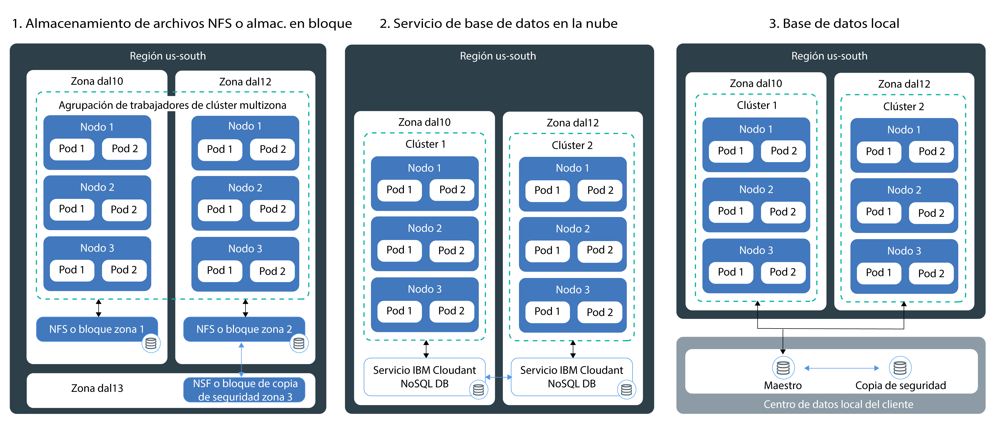

---

copyright:
  years: 2014, 2018
lastupdated: "2018-08-06"

---

{:new_window: target="_blank"}
{:shortdesc: .shortdesc}
{:screen: .screen}
{:pre: .pre}
{:table: .aria-labeledby="caption"}
{:codeblock: .codeblock}
{:tip: .tip}
{:download: .download}

# Planificación de almacenamiento persistente altamente disponible
{: #storage_planning}

## Opciones de almacenamiento de datos no persistente
{: #non_persistent}

Puede utilizar las opciones de almacenamiento no persistente si no es necesario que sus datos se almacenen permanentemente o si los datos no tienen que compartirse entre distintas instancias de la app. Las opciones de almacenamiento no persistente también se pueden utilizar para realizar pruebas de unidad de los componentes de la app o probar nuevas características.
{: shortdesc}

La siguiente imagen muestra las opciones de datos no persistentes disponibles en {{site.data.keyword.containerlong_notm}}. Estas opciones están disponibles para clústeres gratuitos y estándares.

<table summary="La tabla muestra opciones de almacenamiento no persistente. Las filas se deben leer de izquierda a derecha, con el número de la opción en la primera columna, el título de la opción en la segunda columna y una descripción en la tercera columna. " style="width: 100%">
<caption>Opciones de almacenamiento no persistente</caption>
  <thead>
  <th>Opción</th>
  <th>Descripción</th>
  </thead>
  <tbody>
    <tr>
      <td>1. Dentro del contenedor o pod</td>
      <td>Los contenedores y pods son, por diseño, efímeros y pueden fallar inesperadamente. Sin embargo, puede escribir datos en el sistema de archivos local del contenedor para almacenar datos en todo el ciclo de vida del contenedor. Los datos dentro de un contenedor no se pueden compartir con otros contenedores o pods y se pierden cuando el contenedor se cuelga o se elimina. Para obtener más información, consulte [Almacenamiento de datos en un contenedor](https://docs.docker.com/storage/).</td>
    </tr>
  <tr>
    <td>2. En el nodo trabajador</td>
    <td>Cada nodo trabajador se configura con el almacenamiento primario y secundario determinado que está determinado por el tipo de máquina que seleccione para el nodo trabajador. El almacenamiento primario se utiliza para almacenar datos del sistema operativo y se puede acceder a él mediante un [volumen <code>hostPath</code> de Kubernetes ](https://kubernetes.io/docs/concepts/storage/volumes/#hostpath). El almacenamiento secundario se utiliza para almacenar datos del `kubelet` y del motor de tiempo de ejecución del contenedor. Puede acceder al almacenamiento secundario mediante un [volumen <code>emptyDir</code> de Kubernetes ](https://kubernetes.io/docs/concepts/storage/volumes/#emptydir)  Mientras que los volúmenes <code>hostPath</code> se utilizan para montar archivos del sistema de archivos del nodo trabajador en el pod, <code>emptyDir</code> crea un directorio vacío que se asigna a un pod del clúster. Todos los contenedores de dicho pod pueden leer y grabar en ese volumen. Puesto que el volumen se asigna a un determinado pod, los datos no se pueden compartir con otros pods de un conjunto de réplicas.  
Un volumen <code>hostPath</code> o <code>emptyDir</code> y sus datos se eliminan cuando: <ul><li>El nodo trabajador se suprime.</li><li>El nodo trabajador se vuelve a cargar o actualizar.</li><li>El clúster se suprime.</li><li>La cuenta de {{site.data.keyword.Bluemix_notm}} alcanza un estado suspendido. </li></ul>

Además, los datos de un volumen <code>emptyDir</code> se eliminan cuando: <ul><li>El pod asignado se suprime de forma permanente del nodo trabajador.</li><li>El pod asignado se planifica en otro nodo trabajador.</li></ul>

<strong>Nota:</strong> Si el contenedor contenido en el pod se cuelga, los datos del volumen siguen estando disponibles en el nodo trabajador.
</td>
    </tr>
    </tbody>
    </table>

## Opciones de almacenamiento de datos persistentes de alta disponibilidad
{: #persistent}

El principal desafío al crear apps de estado altamente disponible es conservar los datos en varias instancias de la app en múltiples zonas y mantener siempre los datos sincronizados. Para los datos de alta disponibilidad, quiere asegurarse de contar con una base de datos maestra con múltiples instancias distribuidas en varios centros de datos o incluso regiones. Esta base de datos maestra se debe replicar de forma continua para mantener un único origen fiable. Todas las instancias en el clúster deben leer y escribir en esta base de datos maestra. En caso de que una instancia de la maestra esté inactiva, las otras instancias presuponen la carga de trabajo para que no se produzca una parada en sus apps.
{: shortdesc}

La imagen siguiente muestra las opciones que tiene en {{site.data.keyword.containerlong_notm}} para hacer que sus datos estén altamente disponibles en un clúster estándar. La opción más adecuada depende de los siguientes factores:
  * **El tipo de app que tenga:** Por ejemplo, puede tener una app que deba almacenar los datos en archivos en lugar de en una base de datos.
  * **Requisitos legales sobre dónde almacenar y direccionar los datos:** Por ejemplo, puede verse obligado a almacenar y direccionar los datos solo en los Estados Unidos y no poder utilizar un servicio ubicado en Europa.
  * **Opciones de copia de seguridad y restauración:** Todas las opciones de almacenamiento incluyen prestaciones de copia de seguridad y restauración de datos. Compruebe que las opciones disponibles de copia de seguridad y restauración cumplan los requisitos de su plan de recuperación tras desastre, como la frecuencia de las copias o la capacidad de almacenar datos fuera de su centro de datos primario.
  * **Réplica global:** Para alta disponibilidad, puede que quiera configurar múltiples instancias de almacenamiento que se distribuyan y repliquen en centros de datos de todo el mundo.

 

<table summary="En la tabla se muestran las opciones de almacenamiento persistente. Las filas se leen de izquierda a derecha, con el número de la opción en la columna uno, el título de la opción en la columna dos y una descripción en la columna tres." style="width: 100%">
<caption>Opciones de almacén persistente</caption>
  <thead>
  <th>Opción</th>
  <th>Descripción</th>
  </thead>
  <tbody>
  <tr>
  <td>1. NFS o almacenamiento en bloque</td>
  <td>Con esta opción, puede conservar datos persistentes de la app y de contenedores en la misma zona utilizando volúmenes persistentes de Kubernetes.   <strong>¿Cómo puedo suministrar almacenamiento de archivos o bloques?</strong> Para suministrar almacenamiento de archivos y almacenamiento en bloque en un clúster, [utilice volúmenes persistentes (PV) y reclamaciones de volumen persistente (PVC)](cs_storage_basics.html#pvc_pv). Los PVC y los PV son conceptos de Kubernetes que sintetizan la API para suministrar el dispositivo físico de almacenamiento de archivo o en bloque. Puede crear PVC y PV mediante un suministro [dinámico](cs_storage_basics.html#dynamic_provisioning) o [estático](cs_storage_basics.html#static_provisioning).   <strong>¿Puedo utilizar almacenamiento de archivos o en bloque en un clúster multizona?</strong>  Los dispositivos de almacenamiento de archivos o en bloque son específicos de una zona y no se pueden compartir entre zonas o regiones. Para utilizar este tipo de almacenamiento en un clúster, debe tener al menos un nodo trabajador en la misma zona que el almacenamiento.   Si [suministra de forma dinámica](cs_storage_basics.html#dynamic_provisioning) almacenamiento de archivos o en bloque en un clúster que abarca varias zonas, el almacenamiento solo se suministra en 1 zona que se selecciona mediante una iteración cíclica. Para suministrar almacenamiento persistente en todas las zonas de un clúster multizona, repita los pasos para suministrar almacenamiento dinámico para cada zona. Por ejemplo, si el clúster abarca las zonas `dal10`, `dal12` y `dal13`, la primera vez que suministre dinámicamente el almacenamiento persistente puede suministrar el almacenamiento en `dal10`. Cree otros dos PVC para cubrir las zonas `dal12` y `dal13`.   <strong>¿Qué pasa si deseo compartir datos entre zonas?</strong> Si desea compartir datos entre zonas, utilice un servicio de base de datos en la nube, como [{{site.data.keyword.cloudant_short_notm}}](/docs/services/Cloudant/getting-started.html#getting-started-with-cloudant) o [{{site.data.keyword.cos_full_notm}}](/docs/services/cloud-object-storage/about-cos.html#about-ibm-cloud-object-storage). </td>
  </tr>
  <tr id="cloud-db-service">
    <td>2. Servicio de base de datos en la nube</td>
    <td>Con esta opción, puede conservar datos persistentes utilizando un servicio de base de datos de {{site.data.keyword.Bluemix_notm}}, como [IBM Cloudant NoSQL DB](/docs/services/Cloudant/getting-started.html#getting-started-with-cloudant).   <strong>¿Puedo utilizar un servicio de base de datos en la nube para mi clúster multizona?</strong> Con un servicio de base de datos en la nube, los datos se almacenan fuera del clúster en la instancia de servicio especificada. La instancia de servicio se suministra en una zona. Sin embargo, cada instancia de servicio se suministra con una interfaz externa que puede utilizar para acceder a los datos. Cuando se utiliza un servicio de base de datos para un clúster multizona, puede compartir datos entre clústeres, zonas y regiones. Para aumentar la disponibilidad de la instancia de servicio, puede optar por configurar varias instancias entre zonas y replicar entre las instancias para una mayor disponibilidad.   <strong>¿Cómo puedo añadir un servicio de base de datos en la nube a mi clúster?</strong> Para utilizar un servicio en el clúster, debe [enlazar el servicio de {{site.data.keyword.Bluemix_notm}}](cs_integrations.html#adding_app) a un espacio de nombre en el clúster. Cuando enlaza el servicio al clúster, se crea un secreto de Kubernetes. El secreto de Kubernetes contiene información confidencial sobre el servicio, como por ejemplo el URL del servicio y su nombre de usuario y contraseña. Puede montar el secreto como un volumen secreto en el pod y acceder al servicio mediante las credenciales del secreto. Si monta el volumen secreto en otros pods, también puede compartir datos entre pods. Cuando un contenedor se cuelga o un pod se retira de un nodo trabajador, los datos no se eliminan y pueden acceder a los mismos otros pods que monten el volumen secreto.   La mayoría de los servicios de base de datos de {{site.data.keyword.Bluemix_notm}} proporcionan espacio en disco para una cantidad de datos pequeña sin coste, para así poder probar sus características.
</td>
  </tr>
  <tr>
    <td>3. Base de datos local</td>
    <td>Si debe almacenar sus datos en local por motivos legales, puede [configurar una conexión de VPN](cs_vpn.html#vpn) a su base de datos local y utilizar los mecanismos existentes de almacenamiento, copia de seguridad y réplica en su centro de datos.</td>
  </tr>
  </tbody>
  </table>

{: caption="Tabla. Opciones de almacén persistente para despliegues en clústeres de Kubernetes" caption-side="top"}
