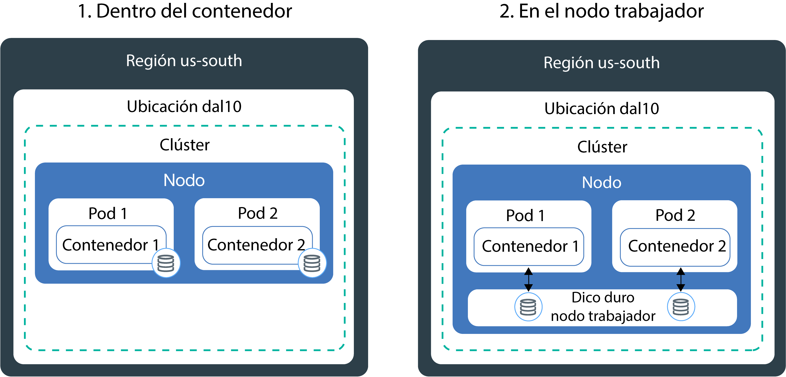
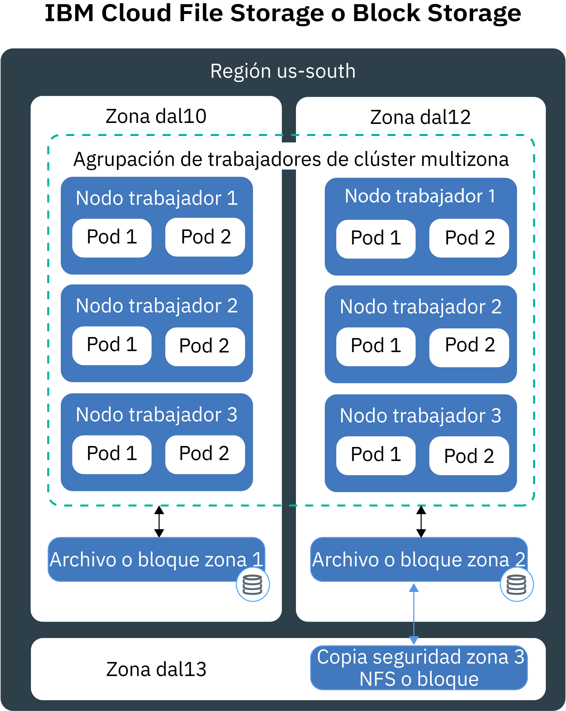
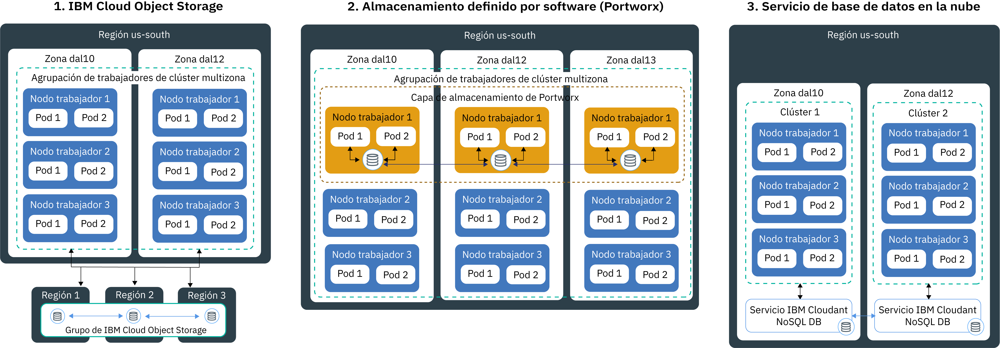

---

copyright:
  years: 2014, 2019
lastupdated: "2019-06-11"

keywords: kubernetes, iks

subcollection: containers

---

{:new_window: target="_blank"}
{:shortdesc: .shortdesc}
{:screen: .screen}
{:pre: .pre}
{:table: .aria-labeledby="caption"}
{:codeblock: .codeblock}
{:tip: .tip}
{:note: .note}
{:important: .important}
{:deprecated: .deprecated}
{:download: .download}
{:preview: .preview}

# Planificación de almacenamiento persistente altamente disponible
{: #storage_planning}

## Elección de una solución de almacenamiento
{: #choose_storage_solution}

Antes de decidir qué tipo de almacenamiento es la solución adecuada para usted, debe conocer los requisitos de la app, el tipo de datos que desea almacenar y la frecuencia con la que desea acceder a estos datos.
{: shortdesc}

1. Decida si sus datos deben estar permanentemente almacenados o si se pueden eliminar en un momento determinado.
   - **Almacenamiento persistente:** los datos deben seguir disponibles aunque se eliminen el contenedor, el nodo trabajador o el clúster. Utilice el almacenamiento persistente en los siguientes casos de ejemplo:
       - Apps con estado
       - Datos de actividad principal
       - Datos que deben estar disponibles debido a requisitos legales, como por ejemplo un periodo de retención definido
       - Auditoría
       - Datos a los que se debe acceder y compartir en varias instancias de app
   - **Almacenamiento no persistente:** los datos se pueden eliminar cuando el contenedor, el nodo trabajador o el clúster se eliminan. El almacenamiento no persistente se suele utilizar para la información de registro, como registros del sistema o registros de contenedor, pruebas de desarrollo o cuando se desea acceder a datos desde el sistema de archivos del host. Para consultar la descripción general de las opciones de almacenamiento no persistente disponibles, consulte [Comparación entre opciones de almacenamiento no persistente](#non_persistent_overview).

2. Si debe guardar sus datos de forma permanente, analice si la app requiere un tipo específico de almacenamiento. Cuando se utiliza una app existente, la app puede estar diseñada para almacenar datos de una de las siguientes formas:  
   - **En un sistema de archivos:** los datos de pueden almacenar como archivo en un directorio. Por ejemplo, puede almacenar este archivo en el disco duro local. Algunas apps requieren que los datos se almacenen en un sistema de archivos específico, como por ejemplo `nfs` o `ext4`, para optimizar el almacén de datos y alcanzar los objetivos de rendimiento.
   - **En una base de datos:** los datos se deben almacenar en una base de datos que sigue un esquema específico. Algunas apps incluyen una interfaz de base de datos que puede utilizar para almacenar los datos. Por ejemplo, WordPress está optimizada para almacenar datos en una base de datos MySQL. En estos casos, el tipo de almacenamiento se selecciona por usted.

3. Si la app no tiene limitación en el tipo de almacenamiento que debe utilizar, determine el tipo de datos que desea almacenar.
   - **Datos estructurados:** datos que se pueden almacenar en una base de datos relacional donde tiene una tabla con columnas y filas. Los datos de las tablas se pueden conectar utilizando claves, y normalmente es fácil acceder debido al modelo de datos predefinido. Por ejemplo, números de teléfono, números de cuenta, números de seguridad social o códigos postales.
   - **Datos semiestructurados:** datos que no caben en una base de datos relacional, pero que incluyen algunas propiedades organizativas que se pueden utilizar para leer y analizar estos datos con más facilidad. Por ejemplo, archivos de lenguaje de códigos, como CSV, XML o JSON.  
   - **Datos no estructurados:** datos que no siguen un patrón organizativo y que es tan complejo que no puede almacenarlos en una base de datos relacional con modelos de datos predefinidos. Para acceder a estos datos, necesita herramientas y software avanzados. Por ejemplo, mensajes de correo electrónico, vídeos, fotos, archivos de audio, presentaciones, datos de los medios de comunicación sociales o páginas web.

   Si tiene datos estructurados y no estructurados, intente almacenar cada tipo de datos por separado en una solución de almacenamiento que se ha diseñado para este tipo de datos. El uso de una solución de almacenamiento adecuada para el tipo de datos facilita el acceso a los datos y aporta ventajas de rendimiento, escalabilidad, durabilidad y coherencia.
   {: tip}

4. Analice cómo desea acceder a los datos. Las soluciones de almacenamiento suelen estar diseñadas y optimizadas para admitir operaciones de lectura o escritura.  
   - **Sólo lectura:** los datos son de sólo lectura. No desea escribir ni cambiar los datos.
   - **Lectura y escritura:** desea leer, escribir y cambiar los datos. Para los datos que se leen y se escriben, es importante saber si las operaciones presentan mucha actividad de lectura, mucha actividad de escritura o una actividad equilibrada.

4. Determine la frecuencia a la que se accede a los datos. Conocer la frecuencia del acceso a datos permite saber el rendimiento que se necesita para el almacenamiento. Por ejemplo, los datos a los que se accede con frecuencia suelen residir en el almacenamiento rápido.
   - **Datos calientes:** datos a los que se accede con frecuencia. Las apps web o móviles son ejemplos habituales de este caso.
   - **Datos fríos o templados:** datos a los que se accede con poca frecuencia, como una vez al mes o menos. El archivado, la retención de datos a corto plazo o la recuperación tras desastre son ejemplos habituales de este caso.
   - **Datos fríos:** datos a los que se accede con muy poca frecuencia o nunca. Los archivados, las copias de seguridad a largo plazo o los datos históricos son ejemplos habituales de este caso.
   - **Datos bloqueados:** datos a los que no se accede y que se deben conservar por razones legales.

   Si no puede predecir la frecuencia o si la frecuencia no permite un patrón estricto, determine si las cargas de trabajo son de lectura pesada, de escritura pesada o equilibradas. A continuación, busque la opción de almacenamiento que se ajuste a su carga de trabajo e investigue qué nivel de almacenamiento le proporciona la flexibilidad que necesita. Por ejemplo, {{site.data.keyword.cos_full_notm}} proporciona una clase de almacenamiento `flexible` que tiene en cuenta la frecuencia con la que se accede a los datos en un mes y se basa en esta medida para optimizar la facturación mensual.
   {: tip}

5. Investigue si los datos se deben compartir entre varias instancias de app, zonas o regiones.
   - **Acceso en varios pods:** si utiliza volúmenes persistentes de Kubernetes para acceder al almacenamiento, puede determinar el número de pods que pueden montar el volumen al mismo tiempo. Hay algunas soluciones de almacenamiento, como el almacenamiento en bloque, a las que solo puede acceder un pod al mismo tiempo. Con otras soluciones de almacenamiento, puede compartir el volumen entre varios pods.
   - **Acceso en varias zonas y regiones:** puede que necesite que los datos sean accesibles desde varias zonas o regiones. Algunas soluciones de almacenamiento, como el almacenamiento de archivos y en bloque, son específicas del centro de datos y no se pueden compartir entre varias zonas en una configuración de clúster multizona.

   Si desea hacer que sus datos sean accesibles a través de zonas y regiones, asegúrese de consultar a su departamento legal para verificar que los datos se puedan almacenar en varias zonas o en otro país.
   {: note}

6. Conozca otras características de almacenamiento que afectan a su elección.
   - **Coherencia:** la garantía de que una operación de lectura devuelva la última versión de un archivo. Las soluciones de almacenamiento pueden proporcionar una `coherencia potente` cuando se garantiza que siempre se recibirá la última versión de un archivo, o una `coherencia eventual` cuando puede que la operación de lectura no devuelva la última versión. La coherencia eventual se suele dar en sistemas distribuidos geográficamente, donde una operación de escritura primero se debe replicar en todas las instancias.
   - **Rendimiento:** el tiempo que se tarda en completar una operación de lectura o escritura.
   - **Durabilidad:** la garantía de que una operación de escritura que se confirme en el almacenamiento sobreviva permanentemente y no se dañe ni se pierda, aunque se escriban gigabytes o terabytes de datos en el almacenamiento de una sola vez.
   - **Resiliencia:** la capacidad de recuperarse de una interrupción y continuar con las operaciones, aunque haya fallado un componente de hardware o de software. Por ejemplo, el almacenamiento físico experimenta una interrupción de alimentación, un corte de red o queda destruido durante una catástrofe natural.
   - **Disponibilidad:** la capacidad de proporcionar acceso a los datos, incluso si un centro de datos o una región no están disponibles. La disponibilidad de los datos se consigue normalmente añadiendo redundancia y configurando mecanismos de migración tras error.
   - **Escalabilidad:** la capacidad de ampliar la capacidad y personalizar el rendimiento en función de sus necesidades.
   - **Cifrado:** el enmascaramiento de datos para evitar la visibilidad cuando un usuario no autorizado accede a los datos.

7. [Revise las soluciones de almacenamiento persistente disponibles](#persistent_storage_overview) y elija la solución que mejor se adapte a sus requisitos de datos y app.

## Comparación de opciones de almacenamiento no persistente
{: #non_persistent_overview}

Puede utilizar las opciones de almacenamiento no persistente si no es necesario que sus datos se almacenen persistentemente o si desea realizar pruebas de unidad de los componentes de la app.
{: shortdesc}

La siguiente imagen muestra las opciones de datos no persistentes disponibles en {{site.data.keyword.containerlong_notm}}. Estas opciones están disponibles para clústeres gratuitos y estándares.

<table>
<thead>
<th style="text-align:left">Características</th>
<th style="text-align:left">Dentro del contenedor</th>
<th style="text-align:left">En el disco primario o secundario del nodo trabajador</th>
</thead>
<tbody>
<tr>
<td style="text-align:left">Soporte multizona</td>
<td style="text-align:left">No</td>
<td style="text-align:left">No</td>
</tr>
<tr>
<td style="text-align:left">Tipos de datos</td>
<td style="text-align:left">Todos</td>
<td style="text-align:left">Todos</td>
</tr>
<tr>
<td style="text-align:left">Capacidad</td>
<td style="text-align:left">Limitada al disco secundario disponible del nodo trabajador. Para limitar la cantidad de almacenamiento secundario consumido por el pod, utilice los límites y las solicitudes de recursos para el [almacenamiento efímero ](https://kubernetes.io/docs/concepts/configuration/manage-compute-resources-container/#local-ephemeral-storage).</td>
<td style="text-align:left">Limitada al espacio disponible en el disco primario (`hostPath`) o secundario(`emptyDir`) del nodo trabajador. Para limitar la cantidad de almacenamiento secundario consumido por el pod, utilice los límites y las solicitudes de recursos para el [almacenamiento efímero ](https://kubernetes.io/docs/concepts/configuration/manage-compute-resources-container/#local-ephemeral-storage).</td>
</tr>
<tr>
<td style="text-align:left">Patrón de acceso a datos</td>
<td style="text-align:left">Operaciones de lectura y escritura de cualquier frecuencia</td>
<td style="text-align:left">Operaciones de lectura y escritura de cualquier frecuencia</td>
</tr>
<tr>
<td style="text-align:left">Acceso</td>
<td style="text-align:left">A través del sistema de archivos local del contenedor</td>
<td style="text-align:left"><ul style="margin:0px 0px 0px 20px; padding:0px"><li style="margin:0px; padding:0px">A través del [volumen <code>hostPath</code> de Kubernetes ](https://kubernetes.io/docs/concepts/storage/volumes/#hostpath) para acceder al almacenamiento primario del nodo trabajador. </li><li style="margin:0px; padding:0px">A través del [volumen <code>emptyDir</code> de Kubernetes ](https://kubernetes.io/docs/concepts/storage/volumes/#emptydir) para acceder al almacenamiento secundario del nodo trabajador.</li></ul></td>
</tr>
<tr>
<td style="text-align:left">Rendimiento</td>
<td style="text-align:left">Alta</td>
<td style="text-align:left">Alto con baja latencia cuando se utiliza SSD</td>
</tr>
<tr>
<td style="text-align:left">Coherencia</td>
<td style="text-align:left">Potente</td>
<td style="text-align:left">Potente</td>
</tr>
<tr>
<td style="text-align:left">Resiliencia</td>
<td style="text-align:left">Baja</td>
<td style="text-align:left">Baja</td>
</tr>
<tr>
<td style="text-align:left">Disponibilidad</td>
<td style="text-align:left">Específica para el contenedor</td>
<td style="text-align:left">Específico para el nodo trabajador</td>
</tr>
<tr>
<td style="text-align:left">Escalabilidad</td>
<td style="text-align:left">Dificultad para ampliar, debido a la limitación a la capacidad de disco secundario del nodo trabajador</td>
<td style="text-align:left">Dificultad para ampliar, debido a la limitación a la capacidad de disco secundario y primario del nodo trabajador</td>
</tr>
<tr>
<td style="text-align:left">Durabilidad</td>
<td style="text-align:left">Los datos se pierden cuando el contenedor se cuelga o se elimina. </td>
<td style="text-align:left">Los datos de los volúmenes <code>hostPath</code> o <code>emptyDir</code> se pierden cuando: <ul><li>El nodo trabajador se suprime.</li><li>El nodo trabajador se vuelve a cargar o actualizar.</li><li>El clúster se suprime.</li><li>La cuenta de {{site.data.keyword.Bluemix_notm}} alcanza un estado suspendido. </li></ul>

Además, los datos de un volumen <code>emptyDir</code> se eliminan cuando: <ul><li>El pod asignado se suprime de forma permanente del nodo trabajador.</li><li>El pod asignado se planifica en otro nodo trabajador.</li></ul>
</tr>
<tr>
<td style="text-align:left">Casos de uso comunes</td>
<td style="text-align:left"><ul style="margin:0px 0px 0px 20px; padding:0px"><li style="margin:0px; padding:0px">Caché de imagen local</li><li style="margin:0px; padding:0px">Registros de contenedor</li></ul></td>
<td style="text-align:left"><ul style="margin:0px 0px 0px 20px; padding:0px"><li style="margin:0px; padding:0px">Memoria caché local de alto rendimiento</li><li style="margin:0px; padding:0px">Acceder a los archivos desde el sistema de archivos de nodo trabajador</li><li style="margin:0px; padding:0px">Pruebas de unidad</li></ul></td>
</tr>
<tr>
<td style="text-align:left">Casos de uso no ideales</td>
<td style="text-align:left"><ul style="margin:0px 0px 0px 20px; padding:0px"><li style="margin:0px; padding:0px">Almacenamiento de datos persistentes</li><li style="margin:0px; padding:0px">Compartir datos entre contenedores</li></ul></td>
<td style="text-align:left"><ul style="margin:0px 0px 0px 20px; padding:0px"><li style="margin:0px; padding:0px">Almacenamiento de datos persistentes</li></ul></td>
</tr>
</tbody>
</table>

## Comparación entre opciones de almacenamiento persistente para clústeres de una sola zona
{: #single_zone_persistent_storage}

Si tiene un clúster de una sola zona, puede elegir entre las siguientes opciones de {{site.data.keyword.containerlong_notm}} que proporcionan acceso rápido a los datos. Para obtener una mayor disponibilidad, utilice una opción de almacenamiento diseñada para [datos distribuidos geográficamente](#persistent_storage_overview) y, si es posible para sus requisitos, cree un clúster multizona.
{: shortdesc}

Las opciones de almacenamiento persistente de datos solo están disponibles para clústeres estándares.
{: note}

En la imagen siguiente se muestran las opciones que tiene en {{site.data.keyword.containerlong_notm}} para almacenar los datos de forma permanente en un solo clúster.

<table>
<thead>
<th style="text-align:left">Características</th>
<th style="text-align:left">Archivo</th>
<th style="text-align:left">Bloque</th>
</thead>
<tbody>
<tr>
<td style="text-align:left">Soporte multizona</td>
<td style="text-align:left">No, ya que es específico de un centro de datos. Los datos no se pueden compartir entre zonas, a menos que implemente su propia réplica de datos.</td>
<td style="text-align:left">No, ya que es específico de un centro de datos. Los datos no se pueden compartir entre zonas, a menos que implemente su propia réplica de datos.</td>
</tr>
<tr>
<td style="text-align:left">Tipos de datos ideales</td>
<td style="text-align:left">Todos</td>
<td style="text-align:left">Todos</td>
</tr>
<tr>
<td style="text-align:left">Patrón de uso de datos</td>
<td style="text-align:left"><ul style="margin:0px 0px 0px 20px; padding:0px"><li style="margin:0px; padding:0px">Operaciones de lectura y escritura aleatorias</li><li style="margin:0px; padding:0px">Operaciones de lectura y escritura secuenciales</li></ul></td>
<td style="text-align:left"><ul style="margin:0px 0px 0px 20px; padding:0px"><li style="margin:0px; padding:0px">Operaciones de lectura y escritura aleatorias</li><li style="margin:0px; padding:0px">Cargas de trabajo con mucha actividad de escritura</li></ul></td>
</tr>
<tr>
<td style="text-align:left">Acceso</td>
<td style="text-align:left">A través del sistema de archivos del volumen montado</td>
<td style="text-align:left">A través del sistema de archivos del volumen montado</td>
</tr>
<tr>
<td style="text-align:left">Escrituras de acceso de Kubernetes soportadas</td>
<td style="text-align:left"><ul style="margin:0px 0px 0px 20px; padding:0px"><li style="margin:0px; padding:0px">ReadWriteMany (RWX)</li><li style="margin:0px; padding:0px"> ReadOnlyMany (ROX)</li><li style="margin:0px; padding:0px">ReadWriteOnce (RWO)</li></ul></td>
<td style="text-align:left"><ul style="margin:0px 0px 0px 20px; padding:0px"><li style="margin:0px; padding:0px">ReadWriteOnce (RWO)</li></ul></td>
</tr>
<tr>
<td style="text-align:left">Rendimiento</td>
<td style="text-align:left">Se puede prever debido a las IOPS y el tamaño asignado. Las IOPS se comparten entre los pods que acceden al volumen.</td>
<td style="text-align:left">Se puede prever debido a las IOPS y el tamaño asignado. Las IOPS no se comparten entre pods. </td>
</tr>
<tr>
<td style="text-align:left">Coherencia</td>
<td style="text-align:left">Potente</td>
<td style="text-align:left">Potente</td>
</tr>
<tr>
<td style="text-align:left">Durabilidad</td>
<td style="text-align:left">Alta</td>
<td style="text-align:left">Alta</td>
</tr>
<tr>
<td style="text-align:left">Resiliencia</td>
<td style="text-align:left">Media, ya que es específica de un centro de datos. IBM dispone en un clúster el servidor de almacenamiento de archivos con redes redundantes.</td>
<td style="text-align:left">Media, ya que es específica de un centro de datos. IBM dispone en un clúster el servidor de almacenamiento en bloque con redes redundantes.</td>
</tr>
<tr>
<td style="text-align:left">Disponibilidad</td>
<td style="text-align:left">Media, ya que es específica de un centro de datos.</td>
<td style="text-align:left">Media, ya que es específica de un centro de datos.</td>
</tr>
<tr>
<td style="text-align:left">Escalabilidad</td>
<td style="text-align:left">Es difícil de ampliar más allá del centro de datos. No puede cambiar un nivel de almacenamiento existente. </td>
<td style="text-align:left">Es difícil de ampliar más allá del centro de datos. No puede cambiar un nivel de almacenamiento existente.</td>
</tr>
<tr>
<td style="text-align:left">Cifrado</td>
<td style="text-align:left">En reposo</td>
<td style="text-align:left">En reposo</td>
</tr>
<tr>
<td style="text-align:left">Casos de uso comunes</td>
<td style="text-align:left"><ul style="margin:0px 0px 0px 20px; padding:0px"><li style="margin:0px; padding:0px">Almacenamiento de archivos individuales o masivos</li><li style="margin:0px; padding:0px">Compartición de archivos en un clúster de una sola zona</li></ul></td>
<td style="text-align:left"><ul style="margin:0px 0px 0px 20px; padding:0px"><li style="margin:0px; padding:0px">Conjuntos con estado</li><li style="margin:0px; padding:0px">Almacenamiento de reserva cuando se ejecuta su propia base de datos</li><li style="margin:0px; padding:0px">Acceso de alto rendimiento para pods individuales</li></ul></td>
</tr>
<tr>
<td style="text-align:left">Casos de uso no ideales</td>
<td style="text-align:left"><ul style="margin:0px 0px 0px 20px; padding:0px"><li style="margin:0px; padding:0px">Clústeres multizona</li><li style="margin:0px; padding:0px">Datos distribuidos geográficamente</li></ul></td>
<td style="text-align:left"><ul style="margin:0px 0px 0px 20px; padding:0px"><li style="margin:0px; padding:0px">Clústeres multizona</li><li style="margin:0px; padding:0px">Datos distribuidos geográficamente</li><li style="margin:0px; padding:0px">Compartir datos entre varias instancias de app</li></ul></td>
</tr>
</tbody>
</table>

## Comparación entre opciones de almacenamiento persistente para clústeres multizona
{: #persistent_storage_overview}

Si tiene un clúster multizona, elija entre las siguientes opciones de almacenamiento persistente para acceder a los datos de los nodos trabajadores distribuidos entre zonas.
{: shortdesc}

Las opciones de almacenamiento persistente de datos solo están disponibles para clústeres estándares.

¿Quiere conectar el clúster a una base de datos local en su lugar? Consulte [Configuración de la conectividad VPN en el clúster](/docs/containers?topic=containers-vpn#vpn).
{: tip}

En la imagen siguiente se muestran las opciones que tiene en {{site.data.keyword.containerlong_notm}} para almacenar los datos de forma permanente en un clúster multizona y hacer que los datos estén altamente disponibles. Puede utilizar estas opciones en un clúster de una sola zona, pero es posible que no obtenga las ventajas de alta disponibilidad que requiere la app.

<table>
<thead>
<th style="text-align:left">Características</th>
<th style="text-align:left">Objeto</th>
<th style="text-align:left">SDS (Portworx)</th>
<th style="text-align:left">Bases de datos de {{site.data.keyword.Bluemix_notm}}</th>
</thead>
<tbody>
<tr>
<td style="text-align:left">Soporte multizona</td>
<td style="text-align:left">Sí</td>
<td style="text-align:left">Sí</td>
<td style="text-align:left">Sí</td>
</tr>
<tr>
<td style="text-align:left">Tipos de datos ideales</td>
<td style="text-align:left">Datos semiestructurados y no estructurados</td>
<td style="text-align:left">Todos</td>
<td style="text-align:left">Depende de la DBaaS</td>
</tr>
<tr>
<td style="text-align:left">Patrón de uso de datos</td>
<td style="text-align:left"><ul style="margin:0px 0px 0px 20px; padding:0px"><li style="margin:0px; padding:0px">Cargas de trabajo con mucha actividad de lectura</li><li style="margin:0px; padding:0px">Pocas o ninguna operación de escritura</li></ul></td>
<td style="text-align:left"><ul style="margin:0px 0px 0px 20px; padding:0px"><li style="margin:0px; padding:0px">Cargas de trabajo con mucha actividad de escritura</li><li style="margin:0px; padding:0px">Operación aleatoria de lectura y escritura</li><li style="margin:0px; padding:0px">Operaciones secuenciales de lectura y escritura</li></ul></td>
<td style="text-align:left"><ul style="margin:0px 0px 0px 20px; padding:0px"><li style="margin:0px; padding:0px">Cargas de trabajo con mucha actividad de lectura y escritura</li></ul></td>
</tr>
<tr>
<td style="text-align:left">Acceso</td>
<td style="text-align:left">A través del sistema de archivos del volumen montado (plugin) o a través de la API REST desde la app</td>
<td style="text-align:left">A través del sistema de archivos del volumen montado o acceso del cliente NFS al volumen</td>
<td style="text-align:left">A través de la API REST de la app</td>
</tr>
<tr>
<td style="text-align:left">Escrituras de acceso de Kubernetes soportadas</td>
<td style="text-align:left"><ul style="margin:0px 0px 0px 20px; padding:0px"><li style="margin:0px; padding:0px">ReadWriteMany (RWX)</li><li style="margin:0px; padding:0px"> ReadOnlyMany (ROX)</li><li style="margin:0px; padding:0px">ReadWriteOnce (RWO)</li></ul></td>
<td style="text-align:left">Todos</td>
<td style="text-align:left"><ul style="margin:0px 0px 0px 20px; padding:0px"><li style="margin:0px; padding:0px">N/A, ya que se accede desde la app directamente</li></ul></td>
</tr>
<tr>
<td style="text-align:left">Rendimiento</td>
<td style="text-align:left">Alto para operaciones de lectura. Se puede prever debido a las IOPS y el tamaño asignado cuando se utilizan máquinas no SDS.</td>
<td style="text-align:left"><ul style="margin:0px 0px 0px 20px; padding:0px"><li style="margin:0px; padding:0px">Cercano el rendimiento nativo para las operaciones secuenciales de lectura y escritura cuando se utilizan máquinas SDS. </li><li style="margin:0px; padding:0px">Proporciona [perfiles ](https://docs.portworx.com/portworx-install-with-kubernetes/storage-operations/create-pvcs/dynamic-provisioning/#using-dynamic-provisioning) para ejecutar bases de datos de alta disponibilidad</li><li style="margin:0px; padding:0px">Posibilidad de crear una capa de almacenamiento con distintos perfiles de rendimiento entre los que puede elegir la app.</li></ul> </td>
<td style="text-align:left">Alto si se despliega en el mismo centro de datos que la app.</td>
</tr>
<tr>
<td style="text-align:left">Coherencia</td>
<td style="text-align:left">Eventual</td>
<td style="text-align:left">Potente</td>
<td style="text-align:left">Depende de la DBaaS</td>
</tr>
<tr>
<td style="text-align:left">Durabilidad</td>
<td style="text-align:left">Muy alta, ya que las porciones de datos se dispersan en un clúster de nodos de almacenamiento. Cada nodo almacena únicamente una parte de los datos. </td>
<td style="text-align:left">Muy alta, ya que se mantienen tres copias de los datos en todo momento.</td>
<td style="text-align:left">Alta</td>
</tr>
<tr>
<td style="text-align:left">Resiliencia</td>
<td style="text-align:left">Alta ya que las porciones de datos se dispersan en tres zonas o regiones. Media cuando está configurado en una sola zona.</td>
<td style="text-align:left">Alta cuando se configura con réplica en tres zonas. Media cuando se almacenan datos en una sola zona.</td>
<td style="text-align:left">Depende de la DBaaS y de la configuración. </td>
</tr>
<tr>
<td style="text-align:left">Disponibilidad</td>
<td style="text-align:left">Alta, debido a la distribución en varias zonas o regiones. </td>
<td style="text-align:left">Alta cuando se duplican los datos en tres nodos trabajadores en diferentes zonas.</td>
<td style="text-align:left">Alta si se configuran varias instancias. </td>
</tr>
<tr>
<td style="text-align:left">Escalabilidad</td>
<td style="text-align:left">Se escala automáticamente</td>
<td style="text-align:left">Para aumentar la capacidad de volumen, cambie el tamaño del volumen. Para aumentar la capacidad global de la capa de almacenamiento, debe añadir nodos trabajadores o almacenamiento en bloque remoto. En ambos casos se requiere la supervisión de la capacidad por parte del usuario. </td>
<td style="text-align:left">Se escala automáticamente</td>
</tr>
<tr>
<td style="text-align:left">Cifrado</td>
<td style="text-align:left">En tránsito y en reposo</td>
<td style="text-align:left">Traiga su propia clave para proteger sus datos en tránsito y en reposo con {{site.data.keyword.keymanagementservicelong_notm}}. </td>
<td style="text-align:left">En reposo</td>
</tr>
<tr>
<td style="text-align:left">Casos de uso comunes</td>
<td style="text-align:left"><ul style="margin:0px 0px 0px 20px; padding:0px"><li style="margin:0px; padding:0px">Clústeres multizona</li><li style="margin:0px; padding:0px">Datos distribuidos geográficamente</li><li style="margin:0px; padding:0px">Big data estáticos</li><li style="margin:0px; padding:0px">Contenido multimedia estático</li><li style="margin:0px; padding:0px">Apps web</li><li style="margin:0px; padding:0px">Copias de seguridad</li><li style="margin:0px; padding:0px">Archivados</li></ul></td>
<td style="text-align:left"><ul style="margin:0px 0px 0px 20px; padding:0px"><li style="margin:0px; padding:0px">Conjuntos con estado</li><li style="margin:0px; padding:0px">Datos distribuidos geográficamente</li><li style="margin:0px; padding:0px">Solución de almacenamiento común cuando se ejecutan apps entre varios proveedores de nube</li><li style="margin:0px; padding:0px">Almacenamiento de reserva cuando se ejecuta su propia base de datos</li><li style="margin:0px; padding:0px">Acceso de alto rendimiento para pods individuales</li><li style="margin:0px; padding:0px">Acceso al almacenamiento compartido entre varios pods y nodos trabajadores</li></ul></td>
<td style="text-align:left"><ul style="margin:0px 0px 0px 20px; padding:0px"><li style="margin:0px; padding:0px">Clústeres multizona</li><li style="margin:0px; padding:0px">Bases de datos relacionales y no relacionales</li><li style="margin:0px; padding:0px">Datos distribuidos geográficamente</li></ul></td>
</tr>
<tr>
<td style="text-align:left">Casos de uso no ideales</td>
<td style="text-align:left"><ul style="margin:0px 0px 0px 20px; padding:0px"><li style="margin:0px; padding:0px">Cargas de trabajo con mucha actividad de escritura</li><li style="margin:0px; padding:0px">Operaciones de escritura aleatorias</li><li style="margin:0px; padding:0px">Actualizaciones de datos incrementales</li><li style="margin:0px; padding:0px">Bases de datos de transacciones</li></ul></td>
<td style="text-align:left">N/D</td>
<td style="text-align:left"><ul style="margin:0px 0px 0px 20px; padding:0px"><li style="margin:0px; padding:0px">App que está diseñada para escribir en un sistema de archivos</li></ul></td>
</tr>
</tbody>
</table>
