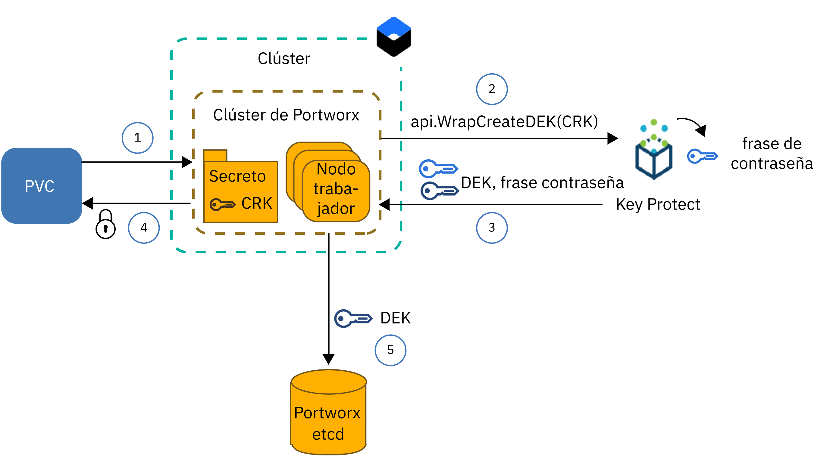
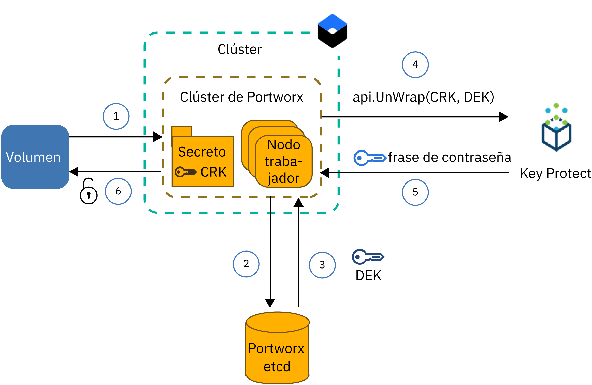

---

copyright:
  years: 2014, 2019
lastupdated: "2019-05-31"

keywords: kubernetes, iks, local persistent storage

subcollection: containers

---

{:new_window: target="_blank"}
{:shortdesc: .shortdesc}
{:screen: .screen}
{:pre: .pre}
{:table: .aria-labeledby="caption"}
{:codeblock: .codeblock}
{:tip: .tip}
{:note: .note}
{:important: .important}
{:deprecated: .deprecated}
{:download: .download}
{:preview: .preview}


# Almacenamiento de datos en almacenamiento definido por software (SDS) con Portworx
{: #portworx}

[Portworx ](https://portworx.com/products/introduction/) es una solución de almacenamiento definida por software de alta disponibilidad que puede utilizar para gestionar el almacenamiento persistente local para bases de datos contenerizadas y otras apps con estado, o para compartir datos entre pods de varias zonas.
{: shortdesc}

**¿Qué es el almacenamiento definido por software (SDS)?** </br>
Una solución SDS abarca dispositivos de almacenamiento de varios tipos y tamaños o de distintos proveedores que están conectados a los nodos trabajadores del clúster. Los nodos trabajadores con almacenamiento disponible en discos duros se añaden como un nodo a un clúster de almacenamiento. En este clúster, el almacenamiento físico se virtualiza y se presenta al usuario como una agrupación de almacenamiento virtual. El clúster de almacenamiento está gestionado por el software SDS. Si se deben almacenar datos en el clúster de almacenamiento, el software SDS decide dónde almacenar los datos para obtener la máxima disponibilidad. El almacenamiento virtual se suministra con un conjunto común de funciones y servicios que puede aprovechar sin preocuparse de la arquitectura de almacenamiento subyacente.

**¿Cómo funciona Portworx?** </br>
Portworx agrega el almacenamiento disponible que está conectado a los nodos trabajadores y crea una capa de almacenamiento persistente unificada para bases de datos contenerizadas u otras apps con estado que desee ejecutar en el clúster. Mediante el uso de la réplica de volúmenes de cada volumen a nivel de contenedor entre varios nodos trabajadores, Portworx garantiza la persistencia de los datos y la accesibilidad a los datos en las distintas zonas.

Portworx también viene con características adicionales que puede utilizar para sus apps con estado, como instantáneas de volumen, cifrado de volumen, aislamiento y un organizador de almacenamiento integrado para Kubernetes (Stork) que garantiza la ubicación óptima de los volúmenes en el clúster. Para obtener más información, consulte la [documentación de Portworx ](https://docs.portworx.com/).

**¿Qué tipo de nodo trabajador de {{site.data.keyword.containerlong_notm}} es el más adecuado para Portworx?** </br>
{{site.data.keyword.containerlong_notm}} proporciona tipos de nodos trabajadores nativos que están optimizados para el [uso de almacenamiento definido por software (SDS)](/docs/containers?topic=containers-planning_worker_nodes#sds) y que vienen con uno o varios discos locales sin formatear que puede utilizar para la capa de almacenamiento de Portworx. Portworx ofrece el mejor rendimiento cuando se utilizan máquinas de nodo trabajador SDS con una velocidad de red de 10 Gbps.

**¿Qué ocurre si quiero ejecutar Portworx en nodos trabajadores que no son SDS?** </br>
Puede instalar Portworx en tipos de nodos trabajadores que no sean SDS, pero es posible que no obtenga las ventajas de rendimiento que requiere la app. Los nodos trabajadores que no son SDS pueden ser virtuales o nativos. Si desea utilizar máquinas virtuales, utilice el tipo de nodo trabajador `b2c.16x64` o uno mejor. Las máquinas virtuales con el tipo `b3c.4x16` o con el tipo `u3c.2x4` no proporcionan los recursos necesarios para que Portworx funcione correctamente. Tenga en cuenta que las máquinas virtuales vienen con 1000 Mbps, lo que no es suficiente para conseguir el rendimiento óptimo de Portworx. Las máquinas nativas vienen con suficientes recursos de cálculo y velocidad de red para Portworx, pero debe [añadir almacenamiento en bloque sin formato y sin montar](#create_block_storage) para poder utilizar estas máquinas.

**¿Cómo puedo asegurarme de que mis datos se almacenan con alta disponibilidad?** </br>
Necesita al menos 3 nodos trabajadores en el clúster de Portworx para que Portworx pueda replicar los datos entre nodos. Al replicar los datos en los nodos trabajadores, Portworx le puede garantizar que la app con estado se puede volver a planificar en otro nodo trabajador en caso de que se produzca una anomalía sin que se pierdan datos. Para obtener una disponibilidad aún más mayor, utilice un [clúster multizona](/docs/containers?topic=containers-ha_clusters#multizone) y duplique los volúmenes entre nodos trabajadores SDS en 3 o más zonas.

**¿Qué topología de volumen ofrece el mejor rendimiento para mis pods?** </br>
Uno de los mayores desafíos cuando se ejecutan apps con estado en un clúster es asegurarse de que el contenedor se puede volver a planificar en otro host si falla el contenedor o el host completo. En Docker, cuando un contenedor se debe volver a planificar en otro host, el volumen no se mueve al nuevo host. Portworx se puede configurar de modo que ejecute `hyper-converged` para garantizar que los recursos de cálculo y el almacenamiento siempre se colocan en el mismo nodo trabajador. Cuando se debe volver a planificar la app, Portworx mueve la app a un nodo trabajador en el que reside una de las réplicas de volumen para garantizar la velocidad de acceso al disco local y el mejor rendimiento para la app con estado. El hecho de ejecutar `hyper-converged` ofrece el mejor rendimiento para los pods, pero requiere que el almacenamiento esté disponible en todos los nodos trabajadores del clúster.

También puede optar por utilizar solo un subconjunto de nodos trabajadores para la capa de almacenamiento de Portworx. Por ejemplo, puede tener una agrupación de nodos trabajadores con nodos trabajadores SDS que vienen con almacenamiento en bloque sin formato local y otra agrupación de nodos trabajadores con nodos trabajadores virtuales que no se ven con almacenamiento local. Cuando instala Portworx, se planifica un pod Portworx en cada nodo trabajador del clúster como parte de un conjunto de daemons. Puesto que los nodos trabajadores SDS tienen almacenamiento local, estos nodos trabajadores solo se incluyen en la capa de almacenamiento de Portworx. Los nodos trabajadores virtuales no se incluyen como un nodo de almacenamiento porque falta almacenamiento local. Sin embargo, cuando despliegue un pod de app en el nodo trabajador virtual, este pod todavía puede acceder a datos que están almacenados físicamente en un nodo trabajador SDS mediante el pod del conjunto de daemons de Portworx. Esta configuración se denomina de `almacenamiento pesado` y ofrece un rendimiento ligeramente inferior que la configuración de `hyper-converged` porque el nodo trabajador virtual debe comunicarse con el nodo trabajador SDS a través de la red privada para acceder a los datos.

**¿Qué necesito para suministrar Portworx?** </br>
{{site.data.keyword.containerlong}} proporciona tipos de nodos trabajadores optimizados para el uso de SDS y que vienen con uno o varios discos locales sin formato y sin montar que puede utilizar para almacenar los datos. Portworx ofrece el mejor rendimiento cuando se utilizan [máquinas de nodo trabajador SDS](/docs/containers?topic=containers-planning_worker_nodes#sds) con una velocidad de red de 10 Gbps. Sin embargo, puede instalar Portworx en tipos de nodos trabajadores que no sean SDS, pero es posible que no obtenga las ventajas de rendimiento que requiere la app. Los requisitos mínimos de un nodo trabajador para ejecutar correctamente Portworx incluyen los siguientes:
- 4 núcleos de CPU
- 4 GB de memoria
- 128 GB de almacenamiento sin formato
- 10 Gbps de velocidad de red

**¿Cuáles son las limitaciones que debo planificar?** </br>
Portworx está disponible para los clústeres estándares configurados con conectividad de red pública. Si el clúster no puede acceder a la red pública, como por ejemplo un clúster privado detrás de un cortafuegos o un clúster con solo el punto final de servicio privado habilitado, no puede utilizar Portworx en el clúster, a no ser que abra todo el tráfico de red de salida en el puerto TCP 443 o habilite el punto final de servicio público.


¿Todo listo? Vamos a empezar por [crear un clúster con una agrupación de nodos trabajadores SDS de al menos 3 nodos trabajadores](/docs/containers?topic=containers-clusters#clusters_ui). Si desea incluir nodos trabajadores no SDS en el clúster Portworx, [añada almacenamiento en bloque sin formato](#create_block_storage) a cada nodo trabajador. Después de preparar el clúster, [instale el diagrama de Helm de Portworx](#install_portworx) en el clúster y cree el primer clúster de almacenamiento hiperconvergente.  

## Creación de almacenamiento en bloque sin formato y sin montar para nodos trabajadores no SDS
{: #create_block_storage}

Portworx funciona mejor si utiliza tipos de nodos trabajadores nativos que estén optimizados para el [uso de almacenamiento definido por software (SDS)](/docs/containers?topic=containers-planning_worker_nodes#sds). Sin embargo, si no puede o no desea utilizar nodos trabajadores SDS, puede optar por instalar Portworx en los tipos de nodos trabajadores no SDS. Tenga en cuenta que los nodos trabajadores no SDS no están optimizados para Portworx y es posible que no ofrezcan las ventajas de rendimiento que requiere la app.
{: shortdesc}

Para incluir nodos trabajadores no SDS en el clúster Portworx, debe añadir dispositivos de almacenamiento en bloque sin formato y sin montar a los nodos trabajadores mediante el plugin {{site.data.keyword.Bluemix_notm}} Block Volume Attacher. El almacenamiento en bloque sin formato no se puede suministrar mediante reclamaciones de volumen persistente (PVC) de Kubernetes, ya que {{site.data.keyword.containerlong_notm}} formatea automáticamente el dispositivo de almacenamiento en bloque. Portworx solo da soporte al almacenamiento en bloque. Los nodos trabajadores no SDS que montan almacenamiento de archivos o de objetos no se pueden utilizar para la capa de datos Portworx.

Si tiene tipos de nodos trabajadores SDS en el clúster y desea utilizar estos nodos trabajadores solo para crear la capa de almacenamiento de Portworx, puede saltarse este paso entero y continuar en el apartado [Configuración de la base de datos de Portworx](#portworx_database).
{: note}

1. [Instale el plugin {{site.data.keyword.Bluemix_notm}} Block Volume Attacher](/docs/containers?topic=containers-utilities#block_storage_attacher).
2. Si desea añadir almacenamiento en bloque con la misma configuración a todos los nodos trabajadores, [añada automáticamente almacenamiento en bloque](/docs/containers?topic=containers-utilities#automatic_block) con el plugin {{site.data.keyword.Bluemix_notm}} Block Volume Attacher. Para añadir almacenamiento en bloque con otra configuración, añada almacenamiento en bloque únicamente a un subconjunto de nodos trabajadores, o, si desea tener más control sobre el proceso de suministro, [añada manualmente almacenamiento en bloque](/docs/containers?topic=containers-utilities#manual_block).
3. [Conecte el almacenamiento en bloque](/docs/containers?topic=containers-utilities#attach_block) a los nodos trabajadores.

## Obtención de una licencia de Portworx
{: #portworx_license}

Cuando [instala Portworx con un diagrama de Helm](#install_portworx), obtiene la edición `px-enterprise` de Portworx como versión de prueba. La versión de prueba le proporciona toda la funcionalidad de Portworx, que puede probar durante 30 días. Cuando caduque la versión de prueba, debe adquirir una licencia de Portworx para seguir utilizando el clúster Portworx.
{: shortdesc}

Para obtener más información sobre los tipos de licencias disponibles y sobre cómo actualizar la licencia de prueba, consulte [Licencia de Portworx ](https://docs.portworx.com/reference/knowledge-base/px-licensing/). Los empleados de IBM deben solicitar una licencia de Portworx siguiendo [este proceso](https://github.ibm.com/alchemy-containers/armada-storage/blob/master/portworx/px-license.md).

## Configuración de una base de datos para metadatos de Portworx
{: #portworx_database}

Configure un servicio de base de datos de {{site.data.keyword.Bluemix_notm}}, como por ejemplo [Databases for etcd](#databaseetcd) o [{{site.data.keyword.composeForEtcd}}](#compose) para crear un almacén de claves y valores para los metadatos del clúster de Portworx.
{: shortdesc}

El almacén de claves y valores de Portworx sirve como única fuente fiable para el clúster de Portworx. Si el almacén de claves y valores no está disponible, no puede trabajar con el clúster de Portworx para acceder a los datos ni para almacenarlos. Los datos existentes no se modifican ni se eliminan cuando la base de datos de Portworx no está disponible.

### Configuración de una instancia del servicio Databases for etcd
{: #databaseetcd}

Databases for etcd es un servicio de etcd gestionado que almacena y duplica de forma seguro los datos entre tres instancias de almacenamiento para ofrecer alta disponibilidad y resiliencia de los datos. Para obtener más información, consulte la [Guía de aprendizaje de iniciación de Databases for etc](/docs/services/databases-for-etcd?topic=databases-for-etcd-getting-started#getting-started).

En los pasos siguientes se muestra cómo suministrar y configurar una instancia del servicio Databases for etc para Portworx.

1. Asegúrese de que tiene el rol de acceso a la plataforma de [`Administrador` en {{site.data.keyword.Bluemix_notm}} Identity and Access Management (IAM)](/docs/iam?topic=iam-iammanidaccser#iammanidaccser) para el servicio Databases for etcd.  

2. Suministre su instancia de servicio de Databases for etcd.
   1. Abra la [página del catálogo de Databases for etcd](https://cloud.ibm.com/catalog/services/databases-for-etcd)
   2. Especifique un nombre para la instancia de servicio, como por ejemplo `px-etcd`.
   3. Seleccione la región en la que desea desplegar la instancia de servicio. Para conseguir un rendimiento óptimo, seleccione la región en la que está el clúster.
   4. Seleccione el grupo de recursos en el que está el clúster.
   5. Utilice los valores predeterminados para memoria inicial y asignación de disco.
   6. Elija si desea utilizar la instancia de servicio de {{site.data.keyword.keymanagementserviceshort}} predeterminada o la suya propia.
   5. Revise el plan de precios.
   6. Pulse **Crear** para iniciar la configuración de la instancia de servicio. La configuración puede tardar unos minutos en completarse.
3. Cree credenciales de servicio para su instancia de Databases for etcd.
   1. En la navegación de la página de detalles de servicio, pulse **Credenciales de servicio**.
   2. Pulse **Nuevas credenciales**.
   3. Especifique un nombre para las credenciales de servicio y pulse **Añadir**.
4. {: #databases_credentials}Recupere las credenciales de servicio y el certificado.
   1. En la columna **Acciones** de la tabla de credenciales de servicio, pulse **Ver credenciales**.
   2. Localice la sección `grp.authentication` de las credenciales de servicio y anote los valores de **`username`** y **`password`**.
      Salida de ejemplo de nombres de usuario y contraseña:
      ```
      "grpc": {
      "authentication": {
        "method": "direct",
        "password": "123a4567ab89cde09876vaa543a2bc2a10a123456bcd123456f0a7895aab1de",
        "username": "ibm_cloud_1abd2e3f_g12h_3bc4_1234_5a6bc7890ab"
      }
      ```
      {: screen}
   3. Localice la sección `composed` de las credenciales de servicio y anote los valores de **`--endpoints`** de etcd.  
      Salida de ejemplo de `--endpoints`:
      ```
      --endpoints=https://1ab234c5-12a1-1234-a123-123abc45cde1.123456ab78cd9ab1234a456740ab123c.databases.appdomain.cloud:32059
      ```
      {: screen}

   4. Localice la sección `certificate` de las credenciales de servicio y anote el valor de **`certificate_base64`**.
      Salida de ejemplo para `certificate`
      ```
      "certificate": {
        "certificate_base64": "AB0cAB1CDEaABcCEFABCDEF1ACB3ABCD1ab2AB0cAB1CDEaABcCEFABCDEF1ACB3ABCD1ab2AB0cAB1CDEaABcCEFABCDEF1ACB3ABCD1ab2..."
      ```
      {: screen}

5. Cree un secreto de Kubernetes para el certificado.
   1. Cree un archivo de configuración para el secreto.
      ```
      apiVersion: v1
      kind: Secret
      metadata:
        name: px-etcd-certs
        namespace: kube-system
      type: Opaque
      data:
        ca.pem: <certificate_base64>
        client-key.pem: ""
        client.pem: ""
      ```
      {: codeblock}

   2. Cree el secreto en el clúster.
      ```
      kubectl apply -f secret.yaml
      ```

6. [Instale Portworx en el clúster](#install_portworx).


### Configuración de una instancia del servicio Compose for etcd
{: #compose}

{{site.data.keyword.composeForEtcd}} se proporciona con la opción de configurar la base de datos como parte de un clúster de almacenamiento en la nube que ofrece alta disponibilidad y capacidad de recuperación en caso de que se produzca una anomalía en la zona. Para obtener más información, consulte la {{site.data.keyword.composeForEtcd}} [Guía de aprendizaje de iniciación](/docs/services/ComposeForEtcd?topic=compose-for-etcd-getting-started-tutorial#getting-started-tutorial).
{: shortdesc}

En los pasos siguientes se muestra cómo suministrar y configurar el servicio de base de datos de {{site.data.keyword.composeForEtcd}} para Portworx.

1. Asegúrese de que tiene el rol de [`Desarrollador` de Cloud Foundry para el espacio](/docs/iam?topic=iam-mngcf#mngcf) en el que desea crear el servicio de base de datos de {{site.data.keyword.composeForEtcd}}.

2. Suministre una instancia de servicio de {{site.data.keyword.composeForEtcd}}.
   1. Abra la [página de catálogo de {{site.data.keyword.composeForEtcd}}](https://cloud.ibm.com/catalog/services/compose-for-etcd)
   2. Especifique un nombre para la instancia de servicio, como por ejemplo `px-etcd`.
   3. Seleccione la región en la que desea desplegar la instancia de servicio. Para conseguir un rendimiento óptimo, seleccione la región en la que está el clúster.
   4. Seleccione una organización y un espacio de Cloud Foundry.
   5. Revise los planes de precios y seleccione el que desea.
   6. Pulse **Crear** para iniciar la configuración de la instancia de servicio. Cuando termine la configuración, se abrirá la página de detalles del servicio.
3. {: #etcd_credentials}Recupere las credenciales de servicio de {{site.data.keyword.composeForEtcd}}.
   1. En la navegación de la página de detalles de servicio, pulse **Gestionar**.
   2. Vaya al separador **Visión general**.
   3. En la sección **Conexiones de conexión**, seleccione **Línea de mandatos**.
   4. Anote el valor de los parámetros `--endpoints` y `--user`.
      Salida de ejemplo de `--endpoints`:
      ```
      --endpoints=https://portal-ssl123-34.bmix-dal-yp-12a23b5c-123a-12ab-a1b2-1a2bc3d34567.1234567890.composedb.com:12345,https://portal-ssl123-35.bmix-dal-yp-12a23b5c-123a-12ab-a1b2-1a2bc3d34567.1234567890.composedb.com:12345
      ```
      {: screen}

      Salida de ejemplo de `--user`:
      ```
      --user=root:ABCDEFGHIJKLMNOP
      ```
      {: screen}
   5. Utilice estas credenciales de servicio cuando [instale Portworx en el clúster](#install_portworx).


## Instalación de Portworx en el clúster
{: #install_portworx}

Instale Portworx con un diagrama de Helm. El diagrama de Helm despliega una versión de prueba de la edición `px-enterprise` de Portwork que puede utilizar durante 30 días. Además, también se instala [Stork ](https://docs.portworx.com/portworx-install-with-kubernetes/storage-operations/stork/) en el clúster de Kubernetes. Stork es el planificador de almacenamiento de Portworx y le permite localizar los pods con sus datos y crear y restaurar instantáneas de volúmenes de Portworx.
{: shortdesc}

¿Está buscando instrucciones sobre cómo actualizar o eliminar Portworx? Consulte los apartados sobre [Actualización de Portworx](#update_portworx) y [Eliminación de Portworx](#remove_portworx).
{: tip}

Antes de empezar:
- [Cree o utilice un clúster existente](/docs/containers?topic=containers-clusters#clusters_ui).
- Si desea utilizar nodos trabajadores no SDS para la capa de almacenamiento de Portworx, [añada un dispositivo de almacenamiento en bloque sin formato a su nodo trabajador no SDS](#create_block_storage).
- Cree una [instancia de servicio de {{site.data.keyword.composeForEtcd}}](#portworx_database) para almacenar la configuración y los metadatos de Portworx.
- Decida si desea cifrar los volúmenes de Portworx con {{site.data.keyword.keymanagementservicelong_notm}}. Para cifrar los volúmenes, debe [configurar una instancia de servicio de {{site.data.keyword.keymanagementservicelong_notm}} y almacenar la información de servicio en un secreto de Kubernetes](#encrypt_volumes).
- [Inicie una sesión en su cuenta. Si procede, apunte al grupo de recursos adecuado. Establezca el contexto para el clúster.](/docs/containers?topic=containers-cs_cli_install#cs_cli_configure)

Para instalar Portworx:

1.  [Siga las instrucciones](/docs/containers?topic=containers-helm#public_helm_install) para instalar el cliente Helm en la máquina local e instale el servidor Helm (tiller) con una cuenta de servicio en el clúster.

2.  Verifique que el tiller se ha instalado con una cuenta de servicio.

    ```
    kubectl get serviceaccount -n kube-system tiller
    ```
    {: pre}

    Salida de ejemplo:

    ```
    NAME                                 SECRETS   AGE
    tiller                               1         2m
    ```
    {: screen}

3. Recupere el punto final de etcd, el nombre de usuario y la contraseña de la base de datos de Portworx que ha establecido anteriormente. En función del tipo de servicio de base de datos que ha utilizado, consulte [{{site.data.keyword.composeForEtcd}}](#etcd_credentials) o [Databases for etcd](#databases_credentials).

4. Descargue el diagrama de Helm de Portworx.
   ```
   git clone https://github.com/portworx/helm.git
   ```
   {: pre}

5. Abra el archivo `values.yaml` con el editor que prefiera. En este ejemplo se utiliza la clase de almacenamiento `nano`.
   ```
   nano helm/charts/portworx/values.yaml
   ```
   {: pre}

6. Actualice los valores siguientes y guarde los cambios.
   - **`etcdEndPoint`**: Añada el punto final de la instancia de servicio de {{site.data.keyword.composeForEtcd}} que ha recuperado anteriormente en el formato `"etcd:<etcd_endpoint1>;etcd:<etcd_endpoint2>"`. Si tiene más de un punto final, incluya todos los puntos finales y sepárelos con un signo de dos puntos (`;`).
    - **`imageVersion`**: Especifique la versión más reciente del diagrama de Helm de Portworx. Para localizar la versión más reciente, consulte las [notas del release ](https://docs.portworx.com/reference/release-notes/) de Portworx.
   - **`clusterName`**: Especifique el nombre del clúster en el que desea instalar Portworx.
   - **`usedrivesAndPartitions`**: Especifique `true` para permitir que Portworx encuentre discos duros y particiones sin montar.
   - **`usefileSystemDrive`**: Especifique `true` para permitir que Portworx encuentre discos duros sin montar, aunque estén formateados.
   - **`drives`**: especifique `none` para permitir que Portworx encuentre unidades de disco duro sin formato y sin montar.
   - **`etcd.credentials`**: Especifique el nombre de usuario y la contraseña de la instancia de servicio de {{site.data.keyword.composeForEtcd}} que ha recuperado anteriormente en el formato `<user_name>:<password>`.
   - **`etcd.certPath`**: Especifique la vía de acceso en la que se está almacenado el certificado de la instancia de servicio de base de datos. Si configura una instancia de servicio de Databases for etcd, especifique `/etc/pwx/etcdcerts`. Para {{site.data.keyword.composeForEtcd}}, especifique `none`.
   - **`etcd.ca`**: Especifique la vía de acceso al archivo de la entidad emisora de certificados (CA). Si configura una instancia de servicio de Databases for etcd, especifique `/etc/pwx/etcdcerts/ca.pem`. Para {{site.data.keyword.composeForEtcd}}, especifique `none`.

   Para ver una lista completa de parámetros admitidos, consulte la [documentación del diagrama de Helm de Portworx ](https://github.com/portworx/helm/blob/master/charts/portworx/README.md#configuration).

   Archivo `values.yaml` de ejemplo para Databases for etcd:
   ```
   # Elimine el comentario y especifique para estas opciones valores que se ajusten a sus requisitos.

   deploymentType: oci                     # acepta "oci" o "docker"
   imageType: none                         #
   imageVersion: 2.0.2                   # Versión de la imagen de PX.

   openshiftInstall: false                 # El valor predeterminado es false para instalar Portworx en Openshift.
   isTargetOSCoreOS: false                 # ¿Su SO de destino es CoreOS? El valor predeterminado es false.
   pksInstall: false                       # instalación en PKS (Pivotal Container Service)
   AKSorEKSInstall: false                  # instalación en AKS o EKS.
   etcdEndPoint: "etcd:<etcd_endpoint1>;etcd:<etcd_endpoint2>"
                                         # el valor predeterminado está vacío ya que se debe establecer de forma explícita mediante la opción --set option o -f values.yaml.
   clusterName: <cluster_name>                # Este es el valor predeterminado. Cámbielo por el nombre de su clúster.
   usefileSystemDrive: true             # true/false Indica a PX que utilice una unidad sin montar aunque tenga un sistema de archivos.
   usedrivesAndPartitions: true          # El valor predeterminado es false. Cámbielo por true y PX utilizará unidades sin montar y particiones.
   secretType: none                      # El valor predeterminado es None, pero puede ser AWS / KVDB / Vault.
   drives: none                          # NOTA: Es una lista de unidades separadas por ";". Por ejemplo: "/dev/sda;/dev/sdb;/dev/sdc" El valor predeterminado es utilizar el conmutador -A.
   dataInterface: none                   # Nombre de la interfaz <ethX>
   managementInterface: none             # Nombre de la interfaz <ethX>
   envVars: none                         # NOTA: Es una lista de variables de entorno separadas por ";". Por ejemplo: MYENV1=myvalue1;MYENV2=myvalue2

   stork: true                           # Utilice Stork https://docs.portworx.com/portworx-install-with-kubernetes/storage-operations/stork/ para hiperconvergencia.
   storkVersion: 1.1.3

   customRegistryURL:
   registrySecret:

   lighthouse: false
   lighthouseVersion: 1.4.0

   journalDevice:

   deployOnMaster:  false                # Solo para POC
   csi: false                            # Habilitar CSI

   internalKVDB: false                   # KVDB interna
   etcd:
     credentials: <username>:<password>  # Nombre de usuario y contraseña de la autenticación ETCD en el formato usuario:contraseña
     certPath: /etc/pwx/etcdcerts                      # Vía de acceso base donde están los certificados. (Ejemplo: si los certificados ca,crt y la clave están en /etc/pwx/etcdcerts el valor se debe especificar como /etc/pwx/$
     ca: /etc/pwx/etcdcerts/ca.pem                            # Ubicación del archivo de CA para la autenticación ETCD. Debe ser /path/to/server.ca
     cert: none                          # Ubicación del certificado para la autenticación ETCD. Debe ser /path/to/server.crt
     key: none                           # Ubicación de la clave de certificado para la autenticación ETCD Debe ser /path/to/servery.key
   consul:
     token: none                           # Señal de ACL utilizado para la autenticación Consul. (Ejemplo: 398073a8-5091-4d9c-871a-bbbeb030d1f6)

   serviceAccount:
     hook:
       create: true
       name:
   ```
   {: codeblock}

7. Instale el diagrama de Helm de Portworx.
   ```
   helm install ./helm/charts/portworx/ --debug --name portworx
   ```
   {: pre}

   Salida de ejemplo:
   ```
   LAST DEPLOYED: Mon Sep 17 16:33:01 2018
   NAMESPACE: default
   STATUS: DEPLOYED

   RESOURCES:
   ==> v1/Pod(related)
   NAME                             READY  STATUS             RESTARTS  AGE
   portworx-594rw                   0/1    ContainerCreating  0         1s
   portworx-rn6wk                   0/1    ContainerCreating  0         1s
   portworx-rx9vf                   0/1    ContainerCreating  0         1s
   stork-6b99cf5579-5q6x4           0/1    ContainerCreating  0         1s
   stork-6b99cf5579-slqlr           0/1    ContainerCreating  0         1s
   stork-6b99cf5579-vz9j4           0/1    ContainerCreating  0         1s
   stork-scheduler-7dd8799cc-bl75b  0/1    ContainerCreating  0         1s
   stork-scheduler-7dd8799cc-j4rc9  0/1    ContainerCreating  0         1s
   stork-scheduler-7dd8799cc-knjwt  0/1    ContainerCreating  0         1s

   ==> v1/ConfigMap
   NAME          DATA  AGE
   stork-config  1     1s

   ==> v1/ClusterRoleBinding
   NAME                          AGE
   node-role-binding             1s
   stork-scheduler-role-binding  1s
   stork-role-binding            1s

   ==> v1/ServiceAccount
   NAME                     SECRETS  AGE
   px-account               1        1s
   stork-account            1        1s
   stork-scheduler-account  1        1s

   ==> v1/ClusterRole
   NAME                    AGE
   node-get-put-list-role  1s
   stork-scheduler-role    1s
   stork-role              1s

   ==> v1/Service
   NAME              TYPE       CLUSTER-IP     EXTERNAL-IP  PORT(S)   AGE
   portworx-service  ClusterIP  172.21.50.26   <none>       9001/TCP  1s
   stork-service     ClusterIP  172.21.132.84  <none>       8099/TCP  1s

   ==> v1beta1/DaemonSet
   NAME      DESIRED  CURRENT  READY  UP-TO-DATE  AVAILABLE  NODE SELECTOR  AGE
   portworx  3        3        0      3           0          <none>         1s

   ==> v1beta1/Deployment
   NAME             DESIRED  CURRENT  UP-TO-DATE  AVAILABLE  AGE
   stork            3        3        3           0          1s
   stork-scheduler  3        3        3           0          1s

   ==> v1/StorageClass
   NAME                                    PROVISIONER                    AGE
   px-sc-repl3-iodb-512blk-snap60-15snaps  kubernetes.io/portworx-volume  1s
   px-sc-repl3-iodb-snap60-15snaps         kubernetes.io/portworx-volume  1s

   ==> v1/StorageClass
   stork-snapshot-sc  stork-snapshot  1s

   NOTAS:

   El release se llama "portworx"
   Los pods de Portworx deben estar en ejecución en cada nodo del clúster.

   Portworx debería crear una agrupación unificada de discos conectados a los nodos de Kubernetes.
   No se necesita ninguna otra acción y estará listo para consumir volúmenes de Portworx como parte de los requisitos de datos de la aplicación.

   Para obtener más información sobre cómo utilizar Portworx para crear volúmenes, consulte
       https://docs.portworx.com/scheduler/kubernetes/preprovisioned-volumes.html

   Para el suministro dinámico de volúmenes para las aplicaciones sin estado a medida que se ejecutan en Kubernetes, consulte
       https://docs.portworx.com/scheduler/kubernetes/dynamic-provisioning.html

   Si desea utilizar Storage Orchestration para hiperconvergencia, consulte STork aquí. (NOTA: Esto actualmente no se despliega como parte del diagrama de Helm)
   https://docs.portworx.com/portworx-install-with-kubernetes/storage-operations/stork/

   Consulte soluciones de aplicaciones, como Cassandra, Kafka, etc.
       https://docs.portworx.com/portworx-install-with-kubernetes/application-install-with-kubernetes/cassandra/
       https://docs.portworx.com/portworx-install-with-kubernetes/application-install-with-kubernetes/kafka-with-zookeeper/

   Para ver las opciones que puede proporcionar al instalar Portworx en el clúster, consulte el archivo README.md
   ```
   {: screen}

8. Verifique que Portworx se ha instalado correctamente.
   1. Obtenga una lista de los pods de Portworx en el espacio de nombres `kube-system`.
      ```
      kubectl get pods -n kube-system | grep 'portworx\|stork'
      ```
      {: pre}

      Salida de ejemplo:
      ```
      portworx-594rw                          1/1       Running     0          20h
      portworx-rn6wk                          1/1       Running     0          20h
      portworx-rx9vf                          1/1       Running     0          20h
      stork-6b99cf5579-5q6x4                  1/1       Running     0          20h
      stork-6b99cf5579-slqlr                  1/1       Running     0          20h
      stork-6b99cf5579-vz9j4                  1/1       Running     0          20h
      stork-scheduler-7dd8799cc-bl75b         1/1       Running     0          20h
      stork-scheduler-7dd8799cc-j4rc9         1/1       Running     0          20h
      stork-scheduler-7dd8799cc-knjwt         1/1       Running     0          20h
      ```
      {: screen}

      La instalación se ha realizado correctamente cuando se ven uno o varios pods `portworx`, `stork` y `stork-scheduler`. El número de pods `portworx`, `stork` y `stork-scheduler` es igual al número de nodos trabajadores que se incluyen en el clúster de Portworx. Todos los pods deben estar en un estado **Running**.

9. Verifique que el clúster de Portworx se ha configurado correctamente.      
   1. Inicie una sesión en uno de los pods de `portworx` y obtenga una lista del estado del clúster de Portworx.
      ```
      kubectl exec <portworx_pod> -it -n kube-system -- /opt/pwx/bin/pxctl status
      ```
      {: pre}

      Salida de ejemplo:
      ```
      Status: PX is operational
      License: Trial (expires in 30 days)
      Node ID: 10.176.48.67
	      IP: 10.176.48.67
 	      Local Storage Pool: 1 pool
	      POOL	IO_PRIORITY	RAID_LEVEL	USABLE	USED	STATUS	ZONE	REGION
      	0	LOW		raid0		20 GiB	3.0 GiB	Online	dal10	us-south
      	Local Storage Devices: 1 device
      	Device	Path						Media Type		Size		Last-Scan
       	0:1	/dev/mapper/3600a09803830445455244c4a38754c66	STORAGE_MEDIUM_MAGNETIC	20 GiB		17 Sep 18 20:36 UTC
      	total							-			20 GiB
      Cluster Summary
	      Cluster ID: multizone
	      Cluster UUID: a0d287ba-be82-4aac-b81c-7e22ac49faf5
	      Scheduler: kubernetes
	      Nodes: 2 node(s) with storage (2 online), 1 node(s) without storage (1 online)
	      IP		ID		StorageNode	Used	Capacity	Status	StorageStatus	Version		Kernel			OS
	      10.184.58.11	10.184.58.11	Yes		3.0 GiB	20 GiB		Online	Up		1.5.0.0-bc1c580	4.4.0-133-generic	Ubuntu 16.04.5 LTS
	      10.176.48.67	10.176.48.67	Yes		3.0 GiB	20 GiB		Online	Up (This node)	1.5.0.0-bc1c580	4.4.0-133-generic	Ubuntu 16.04.5 LTS
	      10.176.48.83	10.176.48.83	No		0 B	0 B		Online	No Storage	1.5.0.0-bc1c580	4.4.0-133-generic	Ubuntu 16.04.5 LTS
      Global Storage Pool
	      Total Used    	:  6.0 GiB
	      Total Capacity	:  40 GiB
      ```
      {: screen}

   2. Verifique que todos los nodos trabajadores que desea incluir en el clúster de Portworx están incluidos; para ello revise la columna **`StorageNode`** en la sección **Cluster Summary** de la salida de la CLI. Si un nodo trabajador está incluido como un nodo de almacenamiento en el clúster de Portworx, este nodo trabajador muestra **Yes** en la columna **`StorageNode`**. Si un nodo trabajador no está incluido en el clúster de Portworx, significa que Portworx no ha podido encontrar el dispositivo de almacenamiento en bloque sin formato que está conectado al nodo trabajador.

      Puesto que Portworx se está ejecutando como un conjunto de daemons en el clúster, los nuevos nodos trabajadores que se añaden al clúster se inspeccionan automáticamente para ver el almacenamiento en bloque sin formato y se añaden a la capa de datos de Portworx.
      {: note}

   3. Verifique que cada nodo de almacenamiento aparece en la lista con la cantidad correcta de almacenamiento en bloque sin formato; para ello revise la columna **Capacity** en la sección **Cluster Summary** de la salida de la CLI.

   4. Revise la clasificación de E/S de Portworx que se ha asignado a los discos que forman parte del clúster de Portworx. Durante la configuración del clúster de Portworx, se inspecciona cada disco para determinar el perfil de rendimiento del dispositivo. La clasificación del perfil depende de la velocidad de la red a la que está conectado el nodo trabajador y del tipo de dispositivo de almacenamiento que tiene. Los discos de los nodos trabajadores SDS se clasifican como `high`. Si conecta manualmente discos a un nodo trabajador virtual, estos discos se clasifican como `low` debido a la velocidad de red inferior que se proporciona con nodos trabajadores virtuales.

      ```
      kubectl exec -it <portworx_pod> -n kube-system -- /opt/pwx/bin/pxctl cluster provision-status
      ```
      {: pre}

      Salida de ejemplo:
      ```
      NODE		NODE STATUS	POOL	POOL STATUS	IO_PRIORITY	SIZE	AVAILABLE	USED	PROVISIONED	RESERVEFACTOR	ZONE	REGION		RACK
      10.184.58.11	Up		0	Online		LOW		20 GiB	17 GiB		3.0 GiB	0 B		0		dal12	us-south	default
      10.176.48.67	Up		0	Online		LOW		20 GiB	17 GiB		3.0 GiB	0 B		0		dal10	us-south	default
      10.176.48.83	Up		0	Online		HIGH		3.5 TiB	3.5 TiB		10 GiB	0 B		0		dal10	us-south	default
      ```
      {: screen}

¡Estupendo! Ahora que ha configurado el clúster de Portworx, puede [añadir almacenamiento desde el clúster a las apps](#add_portworx_storage).

### Actualización de Portworx en el clúster
{: #update_portworx}

Puede actualizar Portworx a la versión más reciente.
{: shortdesc}

1. Siga los pasos del 2 al 5 del apartado [Instalación de Portworx en el clúster](#install_portworx).

2. Busque el nombre de la instalación de su diagrama de Helm de Portworx.
   ```
   helm list | grep portworx
   ```
   {: pre}

   Salida de ejemplo:
   ```
   <helm_chart_name>            1       	Mon Sep 17 16:33:01 2018	DEPLOYED	portworx-1.0.0     default     
   ```
   {: screen}

3. Actualice el diagrama de Helm de Portworx.
   ```
   helm upgrade <helm_chart_name> ./helm/charts/portworx/
   ```
   {: pre}

### Eliminación de Portworx del clúster
{: #remove_portworx}

Si no desea utilizar Portworx en el clúster, puede desinstalar el diagrama de Helm.
{: shortdesc}

1. Busque el nombre de la instalación de su diagrama de Helm de Portworx.
   ```
   helm list | grep portworx
   ```
   {: pre}

   Salida de ejemplo:
   ```
   <helm_chart_name>            1       	Mon Sep 17 16:33:01 2018	DEPLOYED	portworx-1.0.0     default     
   ```
   {: screen}

2. Suprima Portworx eliminando el diagrama de Helm.
   ```
   helm delete --purge <helm_chart_name>
   ```
   {: pre}

3. Verifique que los pods de Portworx se han eliminado.
   ```
   kubectl get pod -n kube-system | grep 'portworx\|stork'
   ```
   {: pre}

   La eliminación de los pods es satisfactoria si dejan de aparecer en la salida de la CLI.

## Cifrado de volúmenes de Portworx con {{site.data.keyword.keymanagementservicelong_notm}}
{: #encrypt_volumes}

Para proteger los datos de un volumen de Portworx, puede optar por proteger los volúmenes con {{site.data.keyword.keymanagementservicelong_notm}}.
{: shortdesc}

{{site.data.keyword.keymanagementservicelong_notm}} le ayuda a suministrar claves cifradas que están protegidas por módulos de seguridad de hardware (HSM) certificados por FIPS 140-2 Nivel 2. Puede utilizar estas claves para proteger de forma segura los datos de usuarios no autorizados. Puede elegir entre utilizar una clave de cifrado para cifrar todos los volúmenes de un clúster o utilizar una clave de cifrado para cada volumen. Portworx utiliza esta clave para cifrar los datos en reposo y en tránsito cuando se envían datos a otro nodo trabajador. Para obtener más información, consulte [Cifrado de volúmenes ](https://docs.portworx.com/portworx-install-with-kubernetes/storage-operations/create-pvcs/create-encrypted-pvcs/#volume-encryption). Para obtener una mayor seguridad, configure el cifrado por volumen.

Revise la información siguiente:
- Visión general del [flujo de trabajo de cifrado de volúmenes de Portworx](#px_encryption) con {{site.data.keyword.keymanagementservicelong_notm}} para el cifrado por volumen
- Visión general del [flujo de trabajo de descifrado de volúmenes de Portworx](#decryption) con {{site.data.keyword.keymanagementservicelong_notm}} para el cifrado por volumen
- [Configuración del cifrado por volumen](#setup_encryption) para volúmenes de Portworx.

### Flujo de trabajo del cifrado por volumen de Portworx
{: #px_encryption}

En la imagen siguiente se muestra el flujo de trabajo de cifrado de Portworx con {{site.data.keyword.keymanagementservicelong_notm}} cuando se configura el cifrado por volumen.
{: shortdesc}



1. El usuario crea una PVC con una clase de almacenamiento de Portworx y solicita que se cifre el almacenamiento.
2. Portworx invoca la API de {{site.data.keyword.keymanagementservicelong_notm}} `WrapCreateDEK` para crear una frase de contraseña utilizando la clave raíz de cliente (CRK) que se almacena en el secreto de Portworx.
3. La instancia de servicio de {{site.data.keyword.keymanagementservicelong_notm}} genera una frase de contraseña de 256 bits y e incorpora la frase de contraseña en la DEK. La DEK se devuelve al clúster de Portworx.
4. El clúster de Portworx utiliza la frase de contraseña para cifrar el volumen.
5. El clúster de Portworx almacena la DEK en texto sin formato en la base de datos de Portworx etcd, asocia el ID de volumen con la DEK y elimina la frase de contraseña de su memoria.

### Flujo de trabajo del descifrado por volumen de Portworx
{: #decryption}

En la imagen siguiente se muestra el flujo de trabajo de descifrado de Portworx con {{site.data.keyword.keymanagementservicelong_notm}} cuando se configura el cifrado por volumen.



1. Kubernetes envía una solicitud para descifrar un volumen cifrado.
2. Portworx solicita la DEK del volumen a la base de datos etcd de Portworx.
3. La base de datos etcd de Portworx busca la DEK y la devuelve al clúster de Portworx.
4. El clúster de Portworx llama a la API de {{site.data.keyword.keymanagementservicelong_notm}} `UnWrapDEK` proporcionando la DEK y la clave raíz (CRK) que se almacenan en el secreto de Portworx.
5. {{site.data.keyword.keymanagementservicelong_notm}} obtiene la DEK para extraer la frase de contraseña y devuelve dicha frase al clúster de Portworx.
6. El clúster de Portworx utiliza la frase de contraseña para descifrar el volumen. Después de descifrar el volumen, la frase de contraseña se elimina del clúster de Portworx.  

### Configuración del cifrado por volumen para volúmenes de Portworx
{: #setup_encryption}

Siga estos pasos para configurar el cifrado para los volúmenes de Portworx con {{site.data.keyword.keymanagementservicelong_notm}}.
{: shortdesc}

1. Asegúrese de que tiene [asignado el rol de acceso de plataforma de `Editor` y el rol de acceso al servicio de `Escritor`](/docs/services/key-protect?topic=key-protect-manage-access#manage-access) en {{site.data.keyword.Bluemix_notm}} Identity and Access Management sobre {{site.data.keyword.keymanagementservicelong_notm}}.

2. Cree una instancia de servicio de {{site.data.keyword.keymanagementservicelong_notm}}.
   1. Abra la [página de catálogo de {{site.data.keyword.keymanagementservicelong_notm}}](https://cloud.ibm.com/catalog/services/key-protect).
   2. En el campo **Nombre de servicio**, especifique un nombre para la instancia de servicio.
   3. Seleccione la región en la que desea desplegar la instancia de servicio. Para conseguir un rendimiento óptimo, seleccione la región en la que está el clúster.
   4. Seleccione el grupo de recursos en el que está el clúster.
   5. Revise el plan de precios.
   6. Pulse **Crear** para crear la instancia de servicio. Cuando termine la creación, se abrirá la página de detalles del servicio.

3. Cree una clave raíz de {{site.data.keyword.keymanagementservicelong_notm}}.
   1. En la página de detalles de servicio, seleccione **Gestionar**.
   2. Pulse **Añadir clave**.
   3. Escriba el **Nombre** de la clave y seleccione **Clave raíz** en la lista desplegable **Tipo de clave**.
   4. Pulse **Crear clave**.
   5. Anote el ID de la clave raíz que ha creado.

4. Recupere el **GUID** de la instancia de servicio.
   ```
   ibmcloud resource service-instance <service_instance_name_or_ID>
   ```
   {: pre}

   Salida de ejemplo:
   ```
   Retrieving service instance portworx in resource group default under account IBM as nspies@us.ibm.com...
   OK

   Name:                  portworx
   ID:                    crn:v1:bluemix:public:kms:us-south:a/1ab123ab3c456789cde1f1234ab1cd123:a1a2b345-1d12-12ab-a12a-1abc2d3e1234::
   GUID:                  a1a2b345-1d12-12ab-a12a-1abc2d3e1234
   Location:              us-south
   Service Name:          kms
   Service Plan Name:     tiered-pricing
   Resource Group Name:   default
   State:                 active
   Type:                  service_instance
   Sub Type:
   Tags:
   Created at:            2018-10-30T20:24:54Z
   Updated at:            2018-10-30T20:24:54Z  
   ```
   {: screen}

5. [Cree un ID de servicio para la cuenta](/docs/iam?topic=iam-serviceids#serviceids).  

6. [Asigne los permisos de ID de servicio](/docs/iam?topic=iam-serviceidpolicy#serviceidpolicy) a la instancia de servicio de {{site.data.keyword.keymanagementservicelong_notm}}.

7. [Cree una clave de API para el ID de servicio](/docs/iam?topic=iam-serviceidapikeys#serviceidapikeys). Portworx utiliza esta clave de API para acceder a la API de {{site.data.keyword.keymanagementservicelong_notm}}.

8. [Recupere el punto final de API de {{site.data.keyword.keymanagementservicelong_notm}}](/docs/services/key-protect?topic=key-protect-regions#regions) para la región en la que ha creado la instancia de servicio. Asegúrese de que anota el punto final de la API en el formato `https://<api_endpoint>`.

9. Codifique el GUID de {{site.data.keyword.keymanagementservicelong_notm}}, la clave de API, la clave raíz y el punto final de la API de {{site.data.keyword.keymanagementservicelong_notm}} en base64 y anote todos los valores codificados en base64. Repita este mandato para todos los parámetros para recuperar el valor codificado en base 64.
   ```
   echo -n "<value>" | base64
   ```
   {: pre}

10. Cree un espacio de nombres en el clúster que se llame `portworx` y permita a Portworx acceder a todos los secretos de Kubernetes que están almacenados en este espacio de nombres.
    ```
    apiVersion: v1
    kind: Namespace
    metadata:
      name: portworx
    ---
    # Rol para acceder a secretos de Kubernetes solo en el espacio de nombres de portworx
    kind: Role
    apiVersion: rbac.authorization.k8s.io/v1
    metadata:
      name: px-role
      namespace: portworx
    rules:
    - apiGroups: [""]
      resources: ["secrets"]
      verbs: ["get", "list", "create", "update", "patch"]
    ---
    # Permitir que la cuenta de servicio de portworx acceda a los secretos del espacio de nombres de portworx
    kind: RoleBinding
    apiVersion: rbac.authorization.k8s.io/v1
    metadata:
      name: px-role-binding
      namespace: portworx
    subjects:
    - kind: ServiceAccount
      name: px-account
      namespace: kube-system
    roleRef:
      kind: Role
      name: px-role
      apiGroup: rbac.authorization.k8s.io
    ```
    {: codeblock}

11. Cree un secreto de Kubernetes llamado `px-ibm` en el espacio de nombres `portworx` del clúster para almacenar la información de {{site.data.keyword.keymanagementservicelong_notm}}.
   1. Cree un archivo de configuración para el secreto de Kubernetes con el contenido siguiente.
      ```
      apiVersion: v1
      kind: Secret
      metadata:
        name: px-ibm
        namespace: portworx
      type: Opaque
      data:
        IBM_SERVICE_API_KEY: <base64_apikey>
        IBM_INSTANCE_ID: <base64_guid>
        IBM_CUSTOMER_ROOT_KEY: <base64_rootkey>
	    IBM_BASE_URL: <base64_kp_api_endpoint>
      ```
      {: codeblock}

      <table>
      <caption>Visión general de los componentes del archivo YAML</caption>
      <thead>
      <th colspan=2> Visión general de los componentes del archivo YAML</th>
      </thead>
      <tbody>
      <tr>
      <td><code>metadata.name</code></td>
      <td>Especifique <code>px-ibm</code> como nombre del secreto de Kubernetes. Si utiliza otro nombre, Portworx no reconoce el secreto durante la instalación. </td>
      </tr>
      <tr>
      <td><code>data.IBM_SERVICE_API_KEY</code></td>
      <td>Especifique la clave de API de {{site.data.keyword.keymanagementservicelong_notm}} codificada en base64 que ha recuperado anteriormente. </td>
      </tr>
      <tr>
      <td><code>data.IBM_INSTANCE_ID</code></td>
      <td>Especifique el GUID de {{site.data.keyword.keymanagementservicelong_notm}} codificado en base64 que ha recuperado anteriormente. </td>
      </tr>
      <tr>
      <td><code>data.IBM_CUSTOMER_ROOT_KEY</code></td>
      <td>Especifique la clave raíz de {{site.data.keyword.keymanagementservicelong_notm}} codificada en base64 que ha recuperado anteriormente. </td>
      </tr>
      <tr>
      <td><code>data.IBM_BASE_URL</code></td>
      <td>Especifique el punto final de la API codificado en base64 de la instancia de servicio de {{site.data.keyword.keymanagementservicelong_notm}}. </td>
      </tr>
      </tbody>
      </table>

   2. Cree el secreto en el espacio de nombres `portworx` del clúster.
      ```
      kubectl apply -f secret.yaml
      ```
      {: pre}

   3. Verifique que el secreto se ha creado correctamente.
      ```
      kubectl get secrets -n portworx
      ```
      {: pre}

12. Si ha configurado el cifrado antes de instalar Portworx, ahora puede [instalar Portworx en el clúster](#add_portworx_storage). Para añadir cifrado al clúster después de instalar Portworx, actualice el conjunto de daemons Portworx para añadir `"-secret_type"` e `"ibm-kp"` como argumentos adicionales a la definición de contenedor de Portworx.
   1. Actualice el conjunto de daemons de Portworx.
      ```
      kubectl edit daemonset portworx -n kube-system
      ```
      {: pre}

      Ejemplo de conjunto daemons actualizado:
      ```
      containers:
       - args:
       - -c
       - testclusterid
       - -s
       - /dev/sdb
       - -x
       - kubernetes
       - -secret_type
       - ibm-kp
       name: portworx
      ```
      {: codeblock}

      Después de editar el conjunto de daemons, los pods de Portworx se reinician y actualizan automáticamente el archivo `config.json`
en el nodo trabajador para reflejar dicho cambio.

   2. Obtenga una lista de los pods de Portworx en el espacio de nombres `kube-system`.
      ```
      kubectl get pods -n kube-system | grep portworx
      ```
      {: pre}

   3. Inicie una sesión en uno de los pods de Portworx.
      ```
      kubectl exec -it <pod_name> -it -n kube-system
      ```
      {: pre}

   4. Vaya al directorio `pwx`.
      ```
      cd etc/pwx
      ```
      {: pre}

   5. Revise el archivo `config.json` para verificar que `"secret_type":"ibm-kp"` se ha añadido a la sección **secret** de la salida de la CLI.
      ```
      cat config.json
      ```
      {: pre}

      Salida de ejemplo:
      ```
      {
      "alertingurl": "",
      "clusterid": "px-kp-test",
      "dataiface": "",
      "kvdb": [
          "etcd:https://portal-ssl748-34.bmix-dal-yp-12a2312v5-123a-44ac-b8f7-5d8ce1d123456.123456789.composedb.com:56963",
          "etcd:https://portal-ssl735-35.bmix-dal-yp-12a2312v5-123a-44ac-b8f7-5d8ce1d123456.12345678.composedb.com:56963"
      ],
      "mgtiface": "",
      "password": "ABCDEFGHIJK",
      "scheduler": "kubernetes",
      "secret": {
         "cluster_secret_key": "",
         "secret_type": "ibm-kp"
      }, "storage": {
        "devices": [
         "/dev/sdc1"
        ],
        "journal_dev": "",
        "max_storage_nodes_per_zone": 0,
        "system_metadata_dev": ""
      },
      "username": "root",
      "version": "1.0"
      }
      ```
      {: screen}

   6. Salga del pod.

Consulte cómo [cifrar los secretos en el clúster de Kubernetes](/docs/containers?topic=containers-encryption#keyprotect), incluido el secreto en el que ha almacenado la CRK de {{site.data.keyword.keymanagementserviceshort}} para el clúster de almacenamiento de Portworx.
{: tip}

## Adición de almacenamiento del clúster de Portworx a las apps
{: #add_portworx_storage}

Ahora que el clúster Portworx está configurado, puede empezar a crear volúmenes de Portworx mediante el [suministro dinámico de Kubernetes](/docs/containers?topic=containers-kube_concepts#dynamic_provisioning).
{: shortdesc}

### Paso 1: Creación o utilización de una clase de almacenamiento existente para la PVC
{: #create_storageclass}

Para solicitar almacenamiento del clúster de Portworx y utilizarlo en su app, debe empezar por crear o localizar una clase de almacenamiento que pueda utilizar para suministrar un volumen de Portworx.
{: shortdesc}

1. Obtenga una lista de las clases de almacenamiento disponibles en el clúster y compruebe si puede utilizar una clase de almacenamiento de Portworx existente. Portworx se proporciona con un conjunto de clases de almacenamiento predeterminadas que están optimizadas para que las utilice la base de datos para compartir datos entre pods.
   ```
   kubectl get storageclasses | grep portworx
   ```
   {: pre}

   Para ver los detalles de una clase de almacenamiento, ejecute `kubectl describe storageclass <storageclass_name>`.
   {: tip}

2. Si no desea utilizar una clase de almacenamiento existente, cree un archivo de configuración para la nueva clase de almacenamiento.

   Para ver una lista completa de las opciones admitidas que puede especificar en la clase de almacenamiento, consulte [Utilización del suministro dinámico ](https://docs.portworx.com/portworx-install-with-kubernetes/storage-operations/create-pvcs/dynamic-provisioning/#using-dynamic-provisioning)

   ```
   kind: StorageClass
   apiVersion: storage.k8s.io/v1
   metadata:
       name: <storageclass_name>
   provisioner: kubernetes.io/portworx-volume
   parameters:
      repl: "<replication_factor>"
      secure: "<true_or_false>"
      priority_io: "<io_priority>"
      shared: "<true_or_false>"
   ```
   {: codeblock}

   <table>
   <caption>Visión general de los componentes del archivo YAML</caption>
   <thead>
   <th colspan=2> Visión general de los componentes del archivo YAML</th>
   </thead>
   <tbody>
   <tr>
   <td><code>metadata.name</code></td>
   <td>Especifique un nombre para la clase de almacenamiento. </td>
   </tr>
   <tr>
   <td><code>parameters.repl</code></td>
   <td>Especifique el número de réplicas de los datos que desea almacenar en distintos nodos trabajadores. Los números permitidos son `1`,`2` o `3`. Por ejemplo, si especifica `3`, los datos se duplican en 3 nodos trabajadores diferentes en el clúster de Portworx. Para almacenar sus datos de alta disponibilidad, utilice un clúster multizona y duplique los datos entre 3 nodos trabajadores de distintas zonas. <strong>Nota: </strong> Debe tener suficientes nodos trabajadores para cumplir con el requisito de réplica. Por ejemplo, si tiene dos nodos trabajadores, pero especifica tres réplicas, la creación de la PVC con esta clase de almacenamiento falla. </td>
   </tr>
   <tr>
   <td><code>parameters.secure</code></td>
   <td>Especifique si desea cifrar los datos del volumen con {{site.data.keyword.keymanagementservicelong_notm}}. Seleccione una de las opciones siguientes: <ul><li><strong>true</strong>: Especifique <code>true</code> para habilitar el cifrado para los volúmenes de Portworx. Para cifrar volúmenes, debe tener una instancia de servicio de {{site.data.keyword.keymanagementservicelong_notm}} y un secreto de Kubernetes que contenga la clave raíz del cliente. Para obtener más información sobre cómo configurar el cifrado para los volúmenes de Portworx, consulte [Cifrado de volúmenes de Portworx](#encrypt_volumes). </li><li><strong>false</strong>: Cuando se especifica <code>false</code>, los volúmenes de Portworx no se cifran. </li></ul> Si no especifica esta opción, los volúmenes de Portworx no se cifran de forma predeterminada. <strong>Nota:</strong> Puede optar por habilitar el cifrado de volúmenes en la PVC, incluso si ha inhabilitado el cifrado en la clase de almacenamiento. El valor de la PVC prevalece sobre los valores de la clase de almacenamiento.  </td>
   </tr>
   <tr>
   <td><code>parameters.priority_io</code></td>
   <td>Especifique la prioridad de E/S de Portworx que desea solicitar para los datos. Las opciones disponibles son `high`, `medium` y `low`. Durante la configuración del clúster de Portworx, se inspecciona cada disco para determinar el perfil de rendimiento del dispositivo. La clasificación de perfil depende del ancho de banda de red del nodo trabajador y del tipo de dispositivo de almacenamiento que tenga. Los discos de los nodos trabajadores SDS se clasifican como `high`. Si conecta manualmente discos a un nodo trabajador virtual, estos discos se clasifican como `low` debido a la velocidad de red inferior que se proporciona con nodos trabajadores virtuales. </br><br> Cuando se crea una PVC con una clase de almacenamiento, el número de réplicas que especifique en <code>parameters/repl</code> prevalece sobre la prioridad de E/S. Por ejemplo, si especifica 3 réplicas que desea almacenar en discos de alta velocidad, pero solo tiene un nodo trabajador con un disco de alta velocidad en el clúster, la creación de la PVC se ejecuta correctamente. Los datos se replican en discos de alta velocidad y de baja velocidad. </td>
   </tr>
   <tr>
   <td><code>parameters.shared</code></td>
   <td>Defina si desea permitir que varios pods accedan al mismo volumen. Seleccione una de las opciones siguientes: <ul><li><strong>True: </strong>Si establece esta opción en <code>true</code>, puede acceder al mismo volumen mediante varios pods distribuidos entre nodos trabajadores de diferentes zonas. </li><li><strong>False: </strong>Si establece esta opción en <code>false</code>, puede acceder al volumen desde varios pods solo si los pods están desplegados en el nodo trabajador conectado al disco físico que realiza la copia de seguridad del volumen. Si el pod está desplegado en otro nodo trabajador, el pod no puede acceder al volumen.</li></ul></td>
   </tr>
   </tbody>
   </table>

3. Cree la clase de almacenamiento.
   ```
   kubectl apply -f storageclass.yaml
   ```
   {: pre}

4. Verifique que se ha creado la clase de almacenamiento.
   ```
   kubectl get storageclasses
   ```
   {: pre}

### Paso 2: Creación de la reclamación de volumen persistente (PVC)
{: #create_dynamic_pvc}

Cuando se crea la PVC especificando la clase de almacenamiento que ha creado anteriormente, se suministran dinámicamente el volumen persistente (PV) y el volumen de Portworx que bloquea el espacio en los discos del clúster de Portworx.
{: shortdesc}

1. Cree un archivo de configuración para la PVC.
   ```
   kind: PersistentVolumeClaim
   apiVersion: v1
   metadata:
      name: mypvc
   spec:
      accessModes:
        - <access_mode>
      resources:
        requests:
          storage: <size>
      storageClassName: portworx-shared-sc
    ```
    {: codeblock}

    <table>
    <caption>Visión general de los componentes del archivo YAML</caption>
    <thead>
    <th colspan=2> Visión general de los componentes del archivo YAML</th>
    </thead>
    <tbody>
    <tr>
    <td><code>metadata.name</code></td>
    <td>Especifique un nombre para la PVC, como por ejemplo <code>mypvc</code>. </td>
    </tr>
    <tr>
    <td><code>spec.accessModes</code></td>
    <td>Especifique la [modalidad de acceso de Kubernetes ](https://kubernetes.io/docs/concepts/storage/persistent-volumes/#access-modes) que desea utilizar. </td>
    </tr>
    <tr>
    <td><code>resources.requests.storage</code></td>
    <td>Especifique la cantidad de almacenamiento en gigabytes que desea asignar desde el clúster de Portworx. Por ejemplo, para asignar 2 gigabytes desde el clúster de Portworx, especifique `2Gi`. La cantidad de almacenamiento que puede especificar está limitada por la cantidad de almacenamiento que está disponible en el clúster de Portworx. Si ha especificado un factor de réplica en la [clase de almacenamiento](#create_storageclass) que es superior a 1, la cantidad de almacenamiento que especifique en la PVC se reserva en varios nodos trabajadores.   </td>
    </tr>
    <tr>
    <td><code>spec.storageClassName</code></td>
    <td>Especifique el nombre de la clase de almacenamiento que ha elegido o que ha creado anteriormente y que desea utilizar para suministrar el PV. En el archivo YAML de ejemplo se utiliza la clase de almacenamiento <code>portworx-shared-sc</code>. </td>
    </tr>
    </tbody>
    </table>

2. Cree la PVC.
   ```
   kubectl apply -f pvc.yaml
   ```
   {: pre}

3. Verifique que la PVC se ha creado y se ha vinculado a un volumen persistente (PV). Este proceso puede tardar unos minutos.
   ```
   kubectl get pvc
   ```
   {: pre}

### Paso 3: Montaje de la PVC en la app
{: #mount_pvc}

Para acceder al almacenamiento desde la app, debe montar la PVC en la app.
{: shortdesc}

1. Cree un archivo de configuración para un despliegue que monte la PVC.

   Para ver consejos sobre cómo desplegar un conjunto con estado con Portworx, consulte [StatefulSets ](https://docs.portworx.com/portworx-install-with-kubernetes/application-install-with-kubernetes/cassandra/). La documentación de Portworx también incluye ejemplos de cómo desplegar [Cassandra ](https://docs.portworx.com/portworx-install-with-kubernetes/application-install-with-kubernetes/cassandra/), [Kafka ](https://docs.portworx.com/portworx-install-with-kubernetes/application-install-with-kubernetes/kafka-with-zookeeper/), [ElasticSearch con Kibana ](https://docs.portworx.com/portworx-install-with-kubernetes/application-install-with-kubernetes/elastic-search-and-kibana/) y [WordPress con MySQL ](https://docs.portworx.com/portworx-install-with-kubernetes/application-install-with-kubernetes/wordpress/).
   {: tip}

   ```
   apiVersion: apps/v1
   kind: Deployment
   metadata:
     name: <deployment_name>
     labels:
       app: <deployment_label>
   spec:
     selector:
       matchLabels:
         app: <app_name>
     template:
       metadata:
         labels:
           app: <app_name>
       spec:
         schedulerName: stork
         containers:
         - image: <image_name>
           name: <container_name>
	   securityContext:
             fsGroup: <group_ID>
           volumeMounts:
           - name: <volume_name>
             mountPath: /<file_path>
         volumes:
         - name: <volume_name>
           persistentVolumeClaim:
             claimName: <pvc_name>
   ```
   {: codeblock}

   <table>
    <caption>Visión general de los componentes del archivo YAML</caption>
    <thead>
    <th colspan=2> Visión general de los componentes del archivo YAML</th>
    </thead>
    <tbody>
        <tr>
    <td><code>metadata.labels.app</code></td>
    <td>Una etiqueta para el despliegue.</td>
      </tr>
      <tr>
        <td><code>spec.selector.matchLabels.app</code> <br/> <code>spec.template.metadata.labels.app</code></td>
        <td>Una etiqueta para la app.</td>
      </tr>
    <tr>
    <td><code>template.metadata.labels.app</code></td>
    <td>Una etiqueta para el despliegue.</td>
      </tr>
    <tr>
    <td><code>spec.schedulerName</code></td>
    <td>Utilice [Stork ](https://docs.portworx.com/portworx-install-with-kubernetes/storage-operations/stork/) como planificador para el clúster de Portworx. Stork le permite coubicar pods con sus datos, proporciona una migración sencilla de pods en el caso de que se produzcan errores de almacenamiento y facilita la creación y restauración de instantáneas de volúmenes de Portworx. </td>
    </tr>
    <tr>
    <td><code>spec.containers.image</code></td>
    <td>El nombre del imagen que desea utilizar. Para ver una lista de todas las imágenes disponibles en su cuenta de {{site.data.keyword.registryshort_notm}}, ejecute <code>ibmcloud cr image-list</code>.</td>
    </tr>
    <tr>
    <td><code>spec.containers.name</code></td>
    <td>El nombre del contenedor que desea desplegar en el clúster.</td>
    </tr>
    <tr>
    <td><code>spec.containers.securityContext.fsGroup</code></td>
    <td>Opcional: Para acceder a su almacenamiento con un usuario no root, especifique el [contexto de seguridad ](https://kubernetes.io/docs/tasks/configure-pod-container/security-context/) para su pod y defina el conjunto de usuarios a los que desea otorgar acceso en la sección `fsGroup` del archivo YAML de despliegue. Para obtener más información, consulte [Acceso a volúmenes Portworx con un usuario no root ](https://docs.portworx.com/portworx-install-with-kubernetes/storage-operations/create-pvcs/access-via-non-root-users/). </td>
    </tr>
    <tr>
    <td><code>spec.containers.volumeMounts.mountPath</code></td>
    <td>La vía de acceso absoluta del directorio en el que el que está montado el volumen dentro del contenedor. Si desea compartir un volumen entre distintas apps, puede especificar [sub vías de acceso de volumen ](https://kubernetes.io/docs/concepts/storage/volumes/#using-subpath) para cada una de las apps.</td>
    </tr>
    <tr>
    <td><code>spec.containers.volumeMounts.name</code></td>
    <td>El nombre del volumen que va a montar en el pod.</td>
    </tr>
    <tr>
    <td><code>volumes.name</code></td>
    <td>El nombre del volumen que va a montar en el pod. Normalmente, este nombre es el mismo que <code>volumeMounts/name</code>.</td>
    </tr>
    <tr>
    <td><code>volumes.persistentVolumeClaim.claimName</code></td>
    <td>El nombre de la PVC que enlaza el PV que desea utilizar. </td>
    </tr>
    </tbody></table>

2. Cree el despliegue.
   ```
   kubectl apply -f deployment.yaml
   ```
   {: pre}

3. Verifique que el PV se ha montado correctamente en la app.

   ```
   kubectl describe deployment <deployment_name>
   ```
   {: pre}

   El punto de montaje se muestra en el campo **Volume Mounts** y el volumen se muestra en el campo **Volumes**.

   ```
    Volume Mounts:
          /var/run/secrets/kubernetes.io/serviceaccount from default-token-tqp61 (ro)
          /volumemount from myvol (rw)
   ...
   Volumes:
     myvol:
       Type:	PersistentVolumeClaim (a reference to a PersistentVolumeClaim in the same namespace)
       ClaimName:	mypvc
       ReadOnly:	false
   ```
   {: screen}

4. Verifique que puede escribir datos en el clúster de Portworx.
   1. Inicie la sesión en el pod que monta el PV.
      ```
      kubectl exec <pod_name> -it bash
      ```
      {: pre}

   2. Vaya a la vía de acceso de montaje de volumen que ha definido en el despliegue de la app.
   3. Cree un archivo de texto.
      ```
      echo "This is a test" > test.txt
      ```
      {: pre}

   4. Lea el archivo que ha creado.
      ```
      cat test.txt
      ```
      {: pre}


## Exploración de otras características de Portworx
{: #features}

<dl>
<dt>Utilización de volúmenes de Portworx existentes</dt>
<dd>Si tiene un volumen de Portworx existente que ha creado manualmente o que no se ha suprimido automáticamente al suprimir la PVC, puede suministrar de forma estática el PV y la PVC correspondientes y utilizar este volumen con la app. Para obtener más información, consulte [Utilización de volúmenes existentes ](https://docs.portworx.com/portworx-install-with-kubernetes/storage-operations/create-pvcs/using-preprovisioned-volumes/#using-the-portworx-volume). </dd>
<dt>Ejecución de conjuntos con estado en Portworx</dt>
<dd>Si tiene una app con estado que desea desplegar como un conjunto con estado en el clúster, puede configurar el conjunto con estado para que utilice el almacenamiento del clúster de Portworx. Para obtener más información, consulte [Creación de MySQL StatefulSet ](https://docs.portworx.com/portworx-install-with-kubernetes/application-install-with-kubernetes/cassandra/#create-a-mysql-statefulset). </dd>
<dt>Ejecución de pods con hiperconvergencia</dt>
<dd>Puede configurar el clúster de Portworx de modo que planifique pods en el mismo nodo trabajador en el que reside el volumen del pod. Esta configuración también se conoce como `hiperconvergencia` y puede mejorar el rendimiento del almacenamiento de datos. Para obtener más información, consulte [Ejecución de pods en el mismo host que un volumen ](https://docs.portworx.com/portworx-install-with-kubernetes/storage-operations/hyperconvergence/).</dd>
<dt>Creación de instantáneas de volúmenes de Portworx</dt>
<dd>Puede guardar el estado actual de un volumen y sus datos mediante la creación de una instantánea de Portworx. Las instantáneas se pueden almacenar en el clúster local de Portworx o en la nube. Para obtener más información, consulte [Creación y utilización de instantáneas locales ](https://docs.portworx.com/portworx-install-with-kubernetes/storage-operations/create-snapshots/). </dd>
	<dt>Supervisión y gestión del clúster de Portworx con Lighthouse</dt>
	<dd>[Lighthouse ](https://docs.portworx.com/reference/lighthouse/) es una herramienta gráfica e intuitiva que le ayuda a gestionar y a supervisar los clústeres y las instantáneas de volúmenes de Portworx. Con Lighthouse, puede ver el estado del clúster de Portworx, incluidos el número de nodos de almacenamiento disponibles y los volúmenes y la capacidad disponibles, y analizar los datos en Prometheus, Grafana o Kibana. </dd>
</dl>

## Limpieza de los volúmenes y del clúster de Portworx
{: #portworx_cleanup}

Elimine un [volumen de Portworx](#remove_pvc), un [nodo de almacenamiento](#remove_storage_node_cluster) o el [clúster de Portworx completo](#remove_storage_node_cluster) si ya no lo necesita.
{: shortdesc}

### Eliminación de volúmenes de Portworx de apps
{: #remove_pvc}

Si ha añadido almacenamiento del clúster de Portworx a la app, tiene tres componentes principales: la reclamación de volumen persistente (PVC) de Kubernetes que ha solicitado el almacenamiento, el volumen persistente (PV) de Kubernetes (PV) que está montado en el pod y que se describe en la PVC, y el volumen de Portworx que bloquea espacio en los discos físicos del clúster de Portworx. Para eliminar almacenamiento de la app, debe eliminar todos los componentes.
{: shortdesc}

1. Obtenga una lista de las PVC del clúster y anote el nombre (**NAME**) de la PVC y el nombre del PV vinculado a la PVC que se muestra como **VOLUME**.
    ```
    kubectl get pvc
    ```
    {: pre}

    Salida de ejemplo:
    ```
    NAME                  STATUS    VOLUME                                     CAPACITY   ACCESSMODES   STORAGECLASS            AGE
    px-pvc		  Bound     pvc-06886b77-102b-11e8-968a-f6612bb731fb   20Gi       RWO           px-high                 78d
    ```
    {: screen}

2. Revise el valor de **`ReclaimPolicy`** para la clase de almacenamiento.
   ```
   kubectl describe storageclass <storageclass_name>
   ```
   {: pre}

   Si la política de reclamación indica `Delete`, el PV y los datos del almacenamiento físico del clúster de Portworx se eliminan cuando se elimina la PVC. Si la política de reclamación indica `Retain`, o si ha suministrado el almacenamiento sin una clase de almacenamiento, el PV y los datos no se eliminan cuando se elimina la PVC. Debe eliminar la PVC, el PV y los datos por separado.

3. Elimine los pods que montan la PVC.
   1. Obtenga una lista de los pods que montan la PVC.
      ```
      kubectl get pods --all-namespaces -o=jsonpath='{range .items[*]}{"\n"}{.metadata.name}{":\t"}{range .spec.volumes[*]}{.persistentVolumeClaim.claimName}{" "}{end}{end}' | grep "<pvc_name>"
      ```
      {: pre}

      Salida de ejemplo:
      ```
      blockdepl-12345-prz7b:	claim1-block-bronze  
      ```
      {: screen}

      Si no se devuelve ningún pod en la salida de la CLI, significa que no tiene ningún pod que utilice la PVC.

   2. Elimine el pod que utiliza la PVC.

      Si el pod forma parte de un despliegue, elimine el despliegue.
      {: tip}

      ```
      kubectl delete pod <pod_name>
      ```
      {: pre}

   3. Verifique que el pod se ha eliminado.
      ```
      kubectl get pods
      ```
      {: pre}

4. Elimine la PVC.
   ```
   kubectl delete pvc <pvc_name>
   ```
   {: pre}

5. Revise el estado de su PV. Utilice el nombre del PV que ha recuperado antes como **VOLUME**.
   ```
   kubectl get pv <pv_name>
   ```
   {: pre}

   Cuando se elimina la PVC, se libera el PV vinculado a la PVC. En función de cómo haya suministrado el almacenamiento, el PV entra en estado `Deleting` si el PV se suprime automáticamente o en estado `Released` si debe suprimir manualmente el PV. **Nota**: para los PV que se suprimen automáticamente, el estado puede indicar brevemente `Released` antes de que se suprima. Vuelva a ejecutar el mandato después de unos minutos para ver si se ha eliminado el PV.

6. Si su PV no se ha suprimido, elimine manualmente el PV.
   ```
   kubectl delete pv <pv_name>
   ```
   {: pre}

7. Verifique que el PV se ha eliminado.
   ```
   kubectl get pv
   ```
   {: pre}

8. Verifique que el volumen de Portworx se ha eliminado. Inicie una sesión en uno de los pods de Portworx del clúster para obtener una lista de los volúmenes. Para encontrar los pods de Portworx disponibles, ejecute `kubectl get pods -n kube-system | grep portworx`.
   ```
   kubectl exec <portworx-pod>  -it -n kube-system -- /opt/pwx/bin/pxctl volume list
   ```
   {: pre}

9. Si el volumen de Portworx no se ha eliminado, elimínelo manualmente.
   ```
   kubectl exec <portworx-pod>  -it -n kube-system -- /opt/pwx/bin/pxctl volume delete <volume_ID>
   ```
   {: pre}

### Eliminación de un nodo trabajador del clúster de Portworx o eliminación de todo el clúster de Portworx
{: #remove_storage_node_cluster}

Puede excluir nodos trabajadores del clúster de Portworx o puede eliminar todo el clúster de Portworx si ya no desea utilizar Portworx.
{: shortdesc}

Al eliminar el clúster de Portworx se eliminan todos los datos del clúster de Portworx. Asegúrese de que [crea una instantánea para los datos y guarda esta instantánea en la nube ](https://docs.portworx.com/portworx-install-with-kubernetes/storage-operations/create-snapshots/).
{: important}

- **Elimine un nodo trabajador del clúster de Portworx:** Si desea eliminar un nodo trabajador que ejecuta Portworx y almacena datos en el clúster de Portworx, debe migrar los pods existentes a los nodos trabajadores restantes y luego desinstalar Portworx del nodo. Para obtener más información, consulte [Colocación de un nodo de Portworx fuera de servicio en Kubernetes ](https://docs.portworx.com/portworx-install-with-kubernetes/operate-and-maintain-on-kubernetes/uninstall/decommission-a-node/).
- **Elimine todo el clúster de Portworx:** Puede eliminar un clúster de Portworx con el mandato [`kubectl exec <portworx-pod>  -it -n kube-system -- /opt/pwx/bin/pxctl cluster-delete` ](https://docs.portworx.com/reference/cli/#pxctl-cluster-delete) o mediante la [desinstalación del diagrama de Helm de Portworx](#remove_portworx).

## Obtención de ayuda y soporte
{: #portworx_help}

Si tiene un problema con el uso de Portworx o desea conversar sobre las configuraciones de Portworx para el caso de uso específico, publique una pregunta en el canal `portworx-on-iks` en el [Slack de {{site.data.keyword.containerlong_notm}} ](https://ibm-container-service.slack.com/). Inicie una sesión en Slack con el ID de IBM. Si no utiliza un ID de IBM para la cuenta de {{site.data.keyword.Bluemix_notm}}, [solicite una invitación a este Slack ](https://bxcs-slack-invite.mybluemix.net/).
