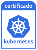
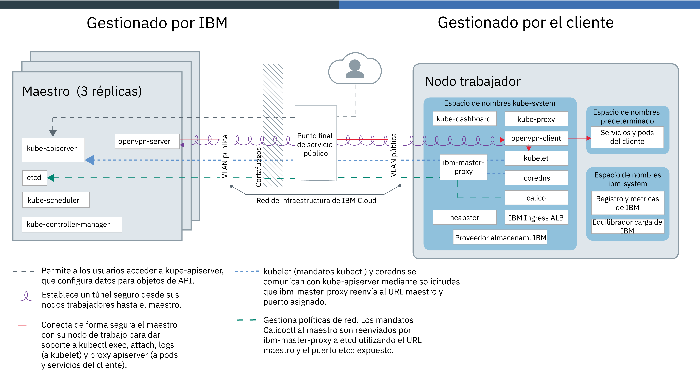
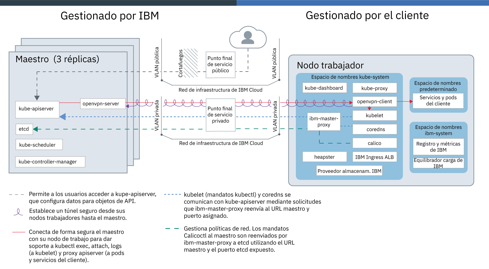

---

copyright:
  years: 2014, 2019
lastupdated: "2019-06-12"

keywords: kubernetes, iks, docker

subcollection: containers

---

{:new_window: target="_blank"}
{:shortdesc: .shortdesc}
{:screen: .screen}
{:pre: .pre}
{:table: .aria-labeledby="caption"}
{:codeblock: .codeblock}
{:tip: .tip}
{:note: .note}
{:important: .important}
{:deprecated: .deprecated}
{:download: .download}
{:preview: .preview}

# Tecnología {{site.data.keyword.containerlong_notm}}

Más información sobre la tecnología de {{site.data.keyword.containerlong}}.
{:shortdesc}

## Contenedores de Docker
{: #docker_containers}

Basado en la tecnología de contenedor de Linux (LXC) existente, el proyecto de código abierto denominado Docker define plantillas para empaquetar software en unidades estandarizadas, denominados contenedores, que incluyen todos los elementos que una app necesita para ejecutarse. {{site.data.keyword.containerlong_notm}} utiliza `containerd` como tiempo de ejecución de contenedor para desplegar contenedores desde imágenes de contenedor Docker en el clúster.
{:shortdesc}

Obtenga información acerca de algunos aspectos básicos de Docker:

<dl>
<dt>Imagen</dt>
<dd>Una imagen de contenedor es la base de cada contenedor que desee ejecutar. Las imágenes de contenedor se crean a partir de un Dockerfile, un archivo de texto que define cómo crear la imagen y qué artefactos incluir en ella, como la app, la configuración de la app y sus dependencias. Las imágenes siempre se crean a partir de otras imágenes, lo que agiliza su configuración. Deje que otra persona haga la mayor parte del trabajo en una imagen y entonces modifíquela para su uso.</dd>
<dt>Registro</dt>
<dd>Un registro de imagen es un lugar para almacenar, recuperar y compartir imágenes de contenedor. Las imágenes que se almacenan en un registro pueden estar disponibles a nivel público (registro público) o pueden resultar accesibles para un pequeño grupo de usuarios (registro privado). {{site.data.keyword.containerlong_notm}} ofrece imágenes públicas, como ibmliberty, que puede utilizar para crear su primera app contenerizada. Cuando se trate de aplicaciones de empresa, utilice un registro privado como el que se proporciona en {{site.data.keyword.Bluemix_notm}} para evitar que usuarios no autorizados utilicen sus imágenes.
</dd>
<dt>Contenedor</dt>
<dd>Cada contenedor se crea a partir de una imagen. Un contenedor es una app empaquetada con todas sus dependencias, de modo que la app se puede traspasar entre entornos y se puede ejecutar sin cambios. A diferencia de las máquinas virtuales, los contenedores no virtualizan un dispositivo, su sistema operativo y el hardware subyacente. El contenedor solo contiene código de la app, tiempo de ejecución, herramientas del sistema, bibliotecas y valores. Los contenedores se ejecutan como procesos aislados en los hosts de cálculo de Ubuntu y comparten el sistema operativo del host y sus recursos de hardware. Este enfoque hace que el contenedor sea más ligero, portátil y eficiente que una máquina virtual.</dd>
</dl>

### Principales ventajas de utilizar contenedores
{: #container_benefits}

<dl>
<dt>Los contenedores son ágiles</dt>
<dd>Los contenedores simplifican la administración del sistema proporcionando entornos estándares para despliegues de producción y desarrollo. El tiempo de ejecución ligero permite un escalado rápido de despliegues. Elimine la complejidad de gestionar varias plataformas de sistemas operativos y sus infraestructuras subyacentes utilizando contenedores que le ayudan a desplegar y ejecutar apps rápidamente, de forma segura y en cualquier infraestructura.</dd>
<dt>Los contenedores son pequeños</dt>
<dd>Puede incluir varios contenedores en el espacio que necesita una sola máquina virtual.</dd>
<dt>Los contenedores son portátiles</dt>
<dd>
<ul>
  <li>Reutilice fragmentos de imágenes para crear contenedores. </li>
  <li>Traslade código de app rápidamente de los entornos de transferencia a producción.</li>
  <li>Automatice los procesos con herramientas de entrega continua.</li>
  </ul>
  </dd>

Obtenga más información sobre cómo [proteger su información personal](/docs/containers?topic=containers-security#pi) cuando se trabaja con imágenes de contenedor.

¿Listo para conocer Docker en más profundidad? <a href="https://developer.ibm.com/courses/all/docker-essentials-a-developer-introduction/" target="_blank">Complete este curso para conocer cómo Docker y {{site.data.keyword.containerlong_notm}} funcionan conjuntamente.</a>

</dl>

 

## Clústeres de Kubernetes
{: #kubernetes_basics}

El proyecto de código abierto Kubernetes combina la ejecución de una infraestructura contenerizada con cargas de trabajo de producción, contribuciones de código abierto y herramientas de gestión de contenedores Docker. La infraestructura de Kubernetes ofrece una plataforma de app aislada y segura para gestionar contenedores que es portátil, ampliable y con resolución automática de problemas en caso de que se produzcan anomalías.
{:shortdesc}

Conozca algunos conceptos básicos de Kubernetes que se muestran en el diagrama siguiente.

<dl>
<dt>Cuenta</dt>
<dd>Su cuenta se refiere a su cuenta de {{site.data.keyword.Bluemix_notm}}.</dd>

<dt>Clúster</dt>
<dd>Un clúster de Kubernetes consta de uno o varios hosts de cálculo que se denominan nodos trabajadores. Los nodos trabajadores se gestionan mediante un maestro de Kubernetes que controla y supervisa de forma centralizada todos los recursos de Kubernetes del clúster. De ese modo, cuando se despliegan los recursos de una app contenerizada,
el maestro de Kubernetes decide en qué nodo trabajador desplegar los recursos, teniendo en cuenta los requisitos del despliegue y la capacidad disponible del clúster. Los recursos de Kubernetes incluyen servicios, despliegues y pods.</dd>

<dt>Servicio</dt>
<dd>Un servicio es un recurso de Kubernetes que agrupa un conjunto de pods y proporciona conexión de red a estos pods sin exponer la dirección IP privada real de cada pod. Puede utilizar un servicio para poner la app a disponibilidad dentro de su clúster o en Internet público.
</dd>

<dt>Despliegue</dt>
<dd>Un despliegue es un recurso de Kubernetes en el que se especifica información acerca de otros recursos o prestaciones necesarios para ejecutar la app, como por ejemplo servicios, almacenamiento persistente o anotaciones. Puede documentar un despliegue en un archivo YAML de configuración y luego aplicarlo al clúster. El maestro de Kubernetes configura los recursos y despliega los contenedores en pods en los nodos trabajadores con capacidad disponible.
  
Defina estrategias para la app que incluyan el número de pods que desea añadir durante una actualización continuada y el número de pods que pueden no estar disponibles al mismo tiempo. Cuando lleva a cabo una actualización continuada, el despliegue comprueba si la actualización funciona y detiene la implantación cuando se detectan anomalías.</dd>

<dt>Pod</dt>
<dd>Cada app contenerizada que se despliega en un clúster se despliega, ejecuta y gestiona mediante un recurso de Kubernetes que se denomina pod. Los pods representan las unidades desplegables de tamaño reducido de un clúster de Kubernetes y se utilizan para agrupar contenedores que se deben tratar como una sola unidad. En la mayoría de los casos, cada contenedor se despliega en su propio pod. Sin embargo, una app puede requerir un contenedor y otros contenedores ayudantes para desplegarse en un pod, de manera que dichos contenedores puedan resolverse mediante la misma dirección IP privada.</dd>

<dt>App</dt>
<dd>Una app puede hacer referencia a una app completa o al componente de una app. Puede desplegar componentes de una app en pods o nodos trabajadores independientes.</dd>

Obtenga más información sobre cómo [proteger su información personal](/docs/containers?topic=containers-security#pi) cuando se trabaja recursos de Kubernetes.

¿Listo para conocer Kubernetes en más profundidad?

<ul><li><a href="/docs/containers?topic=containers-cs_cluster_tutorial#cs_cluster_tutorial" target="_blank">Amplíe su conocimiento terminológico con la guía de aprendizaje de creación de clústeres</a>.</li>
<li><a href="https://developer.ibm.com/courses/all/container-kubernetes-essentials-with-ibm-cloud/" target="_blank">Complete este curso para conocer cómo Kubernetes y {{site.data.keyword.containerlong_notm}} funcionan conjuntamente.</a></li></ul>

</dl>

 

## Arquitectura del servicio
{: #architecture}

En un clúster de Kubernetes que se ejecuta en {{site.data.keyword.containerlong_notm}}, las apps contenerizadas se alojan en hosts de cálculo que se denominan nodos trabajadores. Para ser más específicos, las apps se ejecutan en pods, y los pods se alojan en nodos trabajadores. Los nodos trabajadores están gestionados por el maestro de Kubernetes. La configuración de la comunicación entre el maestro de Kubernetes y los nodos trabajadores depende de cómo se configure la red de la infraestructura de IBM Cloud (SoftLayer): una cuenta con un punto final de servicio público o una cuenta habilitada para VRF con puntos finales de servicio público y privado.
{: shortdesc}

En la imagen siguiente se muestran los componentes del clúster y la forma en que interactúan en una cuenta cuando solo se habilita el [punto final de servicio público](/docs/containers?topic=containers-plan_clusters#workeruser-master).

<figure>
 
 <figcaption>Arquitectura de {{site.data.keyword.containerlong_notm}} cuando solo está habilitado el punto final de servicio público</figcaption> </figure>

En la imagen siguiente se muestran los componentes del clúster y la forma en que interactúan en una cuenta habilitada para VRF cuando [están habilitados los puntos finales de servicio público y privado](/docs/containers?topic=containers-plan_clusters#workeruser-master).

<figure>
 
 <figcaption>Arquitectura de {{site.data.keyword.containerlong_notm}} cuando están habilitados los puntos finales de servicio público y privado</figcaption>
</figure>

¿Cuál es la diferencia entre el maestro de Kubernetes y un nodo trabajador? Nos complace que lo pregunte.

<dl>
  <dt>Maestro de Kubernetes</dt>
    <dd>El maestro de Kubernetes está relacionado con la gestión de todos los recursos de cálculo, red y almacenamiento del clúster. El maestro de Kubernetes se asegura de que las apps y los servicios se desplieguen de igual forma en los nodos trabajadores del clúster. En función de cómo configurar la app y los servicios, el maestro determina el nodo trabajador que tiene los recursos suficientes para cumplir los requisitos de la app.  En la tabla siguiente se describen los componentes del nodo maestro de Kubernetes.
    <table>
    <caption>Componentes del nodo maestro de Kubernetes</caption>
    <thead>
    <th>Componente del nodo maestro</th>
    <th>Descripción</th>
    </thead>
    <tbody>
    <tr>
    <td>kube-apiserver</td>
    <td>El servidor de API de Kubernetes sirve como punto de entrada principal para todas las solicitudes de gestión del clúster procedentes del nodo trabajador destinadas al nodo maestro de Kubernetes. El servidor de API de Kubernetes valida y procesa las solicitudes que cambian el estado de los recursos de Kubernetes, como pods o servicios, y almacena este estado en etcd.</td>
    </tr>
    <tr>
    <td>openvpn-server</td>
    <td>El servidor OpenVPN funciona con el cliente OpenVPN para conectar de forma segura el nodo maestro con el nodo trabajador. Esta conexión admite llamadas `apiserver proxy` a los pods y servicios, y llamadas `kubectl exec`, `attach` y `logs` a kubelet.</td>
    </tr>
    <tr>
    <td>etcd</td>
    <td>etcd es un almacén de valores de claves de alta disponibilidad que almacena el estado de todos los recursos de Kubernetes de un clúster, como servicios, despliegues y pods. Se realiza una copia de seguridad de los datos de etcd en una instancia de almacenamiento cifrada que gestiona IBM.</td>
    </tr>
    <tr>
    <td>kube-scheduler</td>
    <td>El planificador de Kubernetes observa los pods recién creados y decide dónde se desplegarán en función de la capacidad, las necesidades de rendimiento, las restricciones de políticas, las especificaciones de antiafinidad y los requisitos de la carga de trabajo. Si no se encuentra ningún nodo trabajador que se ajuste a los requisitos, el pod no se despliega en el clúster.</td>
    </tr>
    <tr>
    <td>kube-controller-manager</td>
    <td>El gestor de controlador de Kubernetes es un daemon que observa el estado de los recursos del clúster, como por ejemplo los conjuntos de réplicas. Cuando cambia el estado de un recurso, por ejemplo si cae un pod de un conjunto de réplicas, el gestor del controlador inicia acciones de corrección para conseguir el estado necesario.</td>
    </tr>
    </tbody></table></dd>
  <dt>Nodo trabajador</dt>
    <dd>Cada nodo trabajador es una máquina física (nativa) o una máquina virtual que se ejecuta en hardware físico en el entorno de nube. Al suministrar un nodo trabajador, puede determinar los recursos que están disponibles para los contenedores alojados en dicho nodo trabajador. De forma predeterminada, los nodos trabajadores están configurados con un motor Docker gestionado por {{site.data.keyword.IBM_notm}}, distintos recursos de cálculo, sistema de red y un servicio de volúmenes. Las características integradas de seguridad proporcionan aislamiento, funciones de gestión de recursos y conformidad con la seguridad de los nodos trabajadores.  
No se da soporte a la modificación de componentes de nodo trabajador predeterminado, `kubelet`, y puede provocar resultados inesperados.
En la tabla siguiente se describen los componentes de un nodo trabajador.
    <table>
    <caption>Componentes de los nodos trabajadores</caption>
    <thead>
    <th>Componente de nodo trabajador</th>
    <th>Espacio de nombres</th>
    <th>Descripción</th>
    </thead>
    <tbody>
    <tr>
    <td>`ibm-master-proxy`</td>
    <td>kube-system</td>
    <td>El `ibm-master-proxy` reenvía solicitudes desde el nodo trabajador a las direcciones IP de las réplicas de maestro de alta disponibilidad. En clústeres de una sola zona, el maestro tiene tres réplicas en hosts independientes con un nombre de dominio y una dirección IP de maestro. Para clústeres que se encuentran en una zona con capacidad multizona, el maestro tiene tres réplicas que se dispersan entre zonas. Como tal, cada maestro tiene su propia dirección IP que se registra con DNS, con un nombre de dominio para el maestro de clúster completo.</td>
    </tr>
    <tr>
    <td>`openvpn-client`</td>
    <td>kube-system</td>
    <td>El cliente OpenVPN funciona con el servidor OpenVPN para conectar de forma segura el nodo maestro con el nodo trabajador. Esta conexión admite llamadas `apiserver proxy` a los pods y servicios, y llamadas `kubectl exec`, `attach` y `logs` a kubelet.</td>
    </tr>
    <tr>
    <td>`kubelet`</td>
    <td>kube-system</td>
    <td>El kubelet es un pod que se ejecuta en cada nodo trabajador y que es el responsable de supervisar el estado de los pods que se ejecutan en el nodo trabajador y de ver los sucesos que envía el servidor de API de Kubernetes. Basándose en los sucesos, el kubelet crea o elimina pods, garantiza sondeos de actividad y de preparación e informa sobre el estado de los pods al servidor de API de Kubernetes.</td>
    </tr>
    <tr>
    <td>`coredns`</td>
    <td>kube-system</td>
    <td>De forma predeterminada, Kubernetes planifica un pod CoreDNS (o un pod de KubeDNS en la versión 1.12 y anteriores) y el servicio en el clúster. Los contenedores utilizan automáticamente la IP del servicio DNS para resolver nombres de DNS en sus búsquedas de otros pods y servicios.</td>
    </tr>
    <tr>
    <td>`calico`</td>
    <td>kube-system</td>
    <td>Calico gestiona las políticas de red del clúster y consta de varios componentes, indicados a continuación.
    <ul>
    <li>**`calico-cni`**: La interfaz de red de contenedor de Calico (CNI) gestiona la conectividad de red de los contenedores y elimina los recursos asignados cuando se suprime un contenedor.</li>
    <li>**`calico-ipam`**: Calico IPAM gestiona la asignación de direcciones IP a contenedores.</li>
    <li>**`calico-node`**: El nodo Calico es un contenedor que agrupa los distintos componentes necesarios para los contenedores de red con Calico.</li>
    <li>**`calico-policy-controller`**: El controlador de políticas de Calico observa el tráfico de red de entrada y de salida para comprobar la conformidad con las políticas de red establecidas. Si el tráfico no está permitido en el clúster, se bloquea el acceso al clúster. El controlador de políticas de Calico también se utiliza para crear y establecer políticas de red para un clúster.</li></ul></td>
    </tr>
    <tr>
    <td>`kube-proxy`</td>
    <td>kube-system</td>
    <td>El proxy de red de Kubernetes es un daemon que se ejecuta en cada nodo trabajador y que reenvía o equilibra la carga del tráfico de red TCP y UDP para los servicios que se ejecutan en el clúster.</td>
    </tr>
    <tr>
    <td>`kube-dashboard`</td>
    <td>kube-system</td>
    <td>El panel de control de Kubernetes es una GUI basada en web que permite a los usuarios gestionar y resolver problemas en el clúster y en las aplicaciones que se ejecutan en el clúster.</td>
    </tr>
    <tr>
    <td>`heapster`</td>
    <td>kube-system</td>
    <td>Heapster es un agregador a nivel de clúster de datos de supervisión y de sucesos. El pod Heapster descubre todos los nodos del clúster y consulta información de uso del kubelet de cada nodo. En el panel de control de Kubernetes encontrará gráficos de utilización.</td>
    </tr>
    <tr>
    <td>ALB de Ingress</td>
    <td>kube-system</td>
    <td>Ingress es un servicio de Kubernetes que puede utilizar para equilibrar las cargas de trabajo de tráfico de red en el clúster reenviando solicitudes públicas o privadas a varias apps del clúster. Para exponer sus apps a través de la red pública o privada, debe crear un recurso de Ingress para registrar sus apps con el equilibrador de carga de aplicación de Ingress (ALB). Un solo URL o dirección IP puede acceder a varias apps.</td>
    </tr>
    <tr>
    <td>Proveedor de almacenamiento</td>
    <td>kube-system</td>
    <td>Cada clúster se configura con un plugin para suministrar almacenamiento de archivos. Si lo desea puede instalar otros complementos, como almacenamiento en bloque.</td>
    </tr>
    <tr>
    <td>Registro y métricas</td>
    <td>ibm-system</td>
    <td>Puede utilizar los servicios {{site.data.keyword.loganalysislong_notm}} y {{site.data.keyword.monitoringlong_notm}} integrados para ampliar las funciones de recopilación y retención cuando trabaje con registros y con métricas.</td>
    </tr>
    <tr>
    <td>Equilibrador de carga</td>
    <td>ibm-system</td>
    <td>Un equilibrador de carga es un servicio de Kubernetes que se puede utilizar para equilibrar las cargas de trabajo de tráfico de red en el clúster reenviando solicitudes públicas o privadas a una app.</td>
    </tr>
    <tr>
    <td>Servicios y pods de app</td>
    <td>default</td>
    <td>En el espacio de nombres <code>default</code> o en los espacios de nombres que cree, puede desplegar apps en pods y servicios para que se comuniquen con dichos pods.</td>
    </tr>
    </tbody></table></dd>
</dl>

¿Desea ver cómo se puede utilizar {{site.data.keyword.containerlong_notm}} con otros productos y servicios? Compruebe algunas de las [integraciones](/docs/containers?topic=containers-supported_integrations#supported_integrations).
{: tip}

## Limitaciones del servicio
{: #tech_limits}

{{site.data.keyword.containerlong_notm}} y el proyecto de código abierto de Kubernetes se proporcionan con valores predeterminados de servicio y limitaciones para garantizar la seguridad, la comodidad y la funcionalidad básica. Se indican algunas de las limitaciones que puede modificar. Si tiene previsto alcanzar las siguientes limitaciones de {{site.data.keyword.containerlong_notm}}, póngase en contacto con el equipo de IBM en el canal Slack [interno ](https://ibm-argonauts.slack.com/messages/C4S4NUCB1) o [externo ](https://ibm-container-service.slack.com).
{: shortdesc}

<table summary="Esta tabla contiene información sobre las limitaciones de {{site.data.keyword.containerlong_notm}}. Las columnas se leen de izquierda a derecha. La primera columna es el tipo de limitación y la segunda es la descripción de la limitación.">
<caption>Limitaciones de {{site.data.keyword.containerlong_notm}}</caption>
<thead>
  <tr>
    <th>Tipo</th>
    <th>Descripción</th>
  </tr>
</thead>
<tbody>
  <tr>
    <td>Límites de velocidad de API</td>
    <td>100 solicitudes por 10 segundos a la API de {{site.data.keyword.containerlong_notm}} por cada dirección IP de origen exclusiva.</td>
  </tr>
  <tr>
    <td>Capacidad de nodo trabajador</td>
    <td>Están disponibles [determinados tipos](/docs/containers?topic=containers-planning_worker_nodes#shared_dedicated_node) de recursos de cálculo de los nodos trabajadores.</td>
  </tr>
  <tr>
    <td>Acceso a host de nodo trabajador</td>
    <td>Por motivos de seguridad, no puede ejecutar SSH en un host de cálculo de nodo trabajador.</td>
  </tr>
  <tr>
    <td>Número máximo de nodos trabajadores</td>
    <td>Si tiene previsto superar los 900 por clúster, póngase primero en contacto con el equipo de IBM en el canal Slack [interno ](https://ibm-argonauts.slack.com/messages/C4S4NUCB1) o [externo ](https://ibm-container-service.slack.com).  Si ve un límite de capacidad de la infraestructura de IBM Cloud (SoftLayer) en el número de instancias por centro de datos o en las que se solicitan cada mes, póngase en contacto con el representante de la infraestructura de IBM Cloud (SoftLayer).</td>
  </tr>
  <tr>
    <td>Número máximo de pods</td>
    <td>110 por nodo trabajador.  El número de pods incluye los pods `kube-system` e `ibm-system` que se ejecutan en el nodo trabajador. Para mejorar el rendimiento, considere la posibilidad de limitar el número de pods que ejecuta por núcleo de cálculo para que no se sobreutilice el nodo trabajador. Por ejemplo, en un nodo trabajador de tipo `b3c.4x16`, puede ejecutar 10 pods por núcleo que no utilicen más del 75 % de la capacidad total del nodo trabajador.</td>
  </tr>
  <tr>
    <td>Número máximo de servicios de Kubernetes</td>
    <td>65.000 IP por clúster en el rango 172.21.0.0/16 que se pueden asignar a los servicios de Kubernetes dentro del clúster.</td>
  </tr>
  <tr>
    <td>Tráfico de equilibrador de carga de aplicación (ALB) de Ingress</td>
    <td>32.768 conexiones por segundo.  Si el tráfico de Ingress supera este número, [aumente el número de réplicas de ALB](/docs/containers?topic=containers-ingress#scale_albs) en el clúster para manejar la carga de trabajo incrementada.</td>
  </tr>
  <tr>
    <td>Volúmenes de almacenamiento</td>
    <td>Un total de 250 volúmenes combinados de instancias de almacenamiento de archivos y en bloque de la infraestructura de IBM Cloud (SoftLayer) por cuenta.  Si se monta más de esta cantidad, es posible que vea un mensaje que indique que "falta capacidad" cuando suministre volúmenes persistentes; deberá ponerse en contacto con el representante de la infraestructura de IBM Cloud (SoftLayer). Para ver más preguntas frecuentes, consulte la documentación sobre almacenamiento [de archivos](/docs/infrastructure/FileStorage?topic=FileStorage-file-storage-faqs#how-many-volumes-can-i-provision-) y [en bloque](/docs/infrastructure/BlockStorage?topic=BlockStorage-block-storage-faqs#how-many-instances-can-share-the-use-of-a-block-storage-volume-).</td>
  </tr>
</tbody>
</table>
