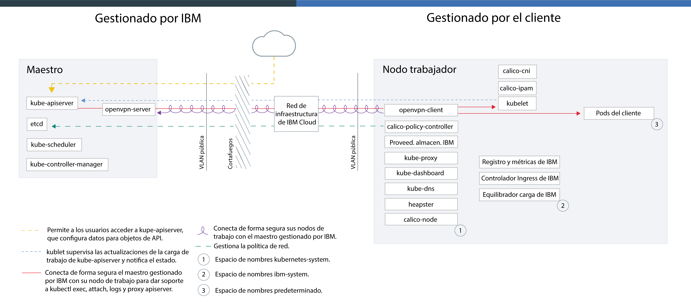

---

copyright:
  years: 2014, 2018
lastupdated: "2018-4-20"

---

{:new_window: target="_blank"}
{:shortdesc: .shortdesc}
{:screen: .screen}
{:pre: .pre}
{:table: .aria-labeledby="caption"}
{:codeblock: .codeblock}
{:tip: .tip}
{:download: .download}

# Tecnología {{site.data.keyword.containerlong_notm}}

Más información sobre la tecnología de {{site.data.keyword.containerlong}}.
{:shortdesc}

## Contenedores de Docker
{: #docker_containers}

Basado en la tecnología existente de contenedores de Linux (LXC), el proyecto de código abierto denominado Docker se convirtió en una plataforma de software que se puede utilizar para crear, probar, desplegar y adaptar apps rápidamente. Docker incluye software en unidades estandarizadas denominadas contenedores que incluyen todos los elementos que una app necesita para ejecutarse.
{:shortdesc}

Obtenga información acerca de algunos aspectos básicos de Docker:

<dl>
<dt>Imagen</dt>
<dd>Una imagen de Docker se crea a partir de Dockerfile, un archivo de texto que define cómo crear la imagen y qué artefactos incluir en ella, como la app, la configuración de la app y sus dependencias. Las imágenes siempre se crean a partir de otras imágenes, lo que agiliza su configuración. Deje que otra persona haga la mayor parte del trabajo en una imagen y entonces modifíquela para su uso.</dd>
<dt>Registro</dt>
<dd>Un registro de imagen es un lugar para almacenar, recuperar y compartir imágenes de Docker. Las imágenes que se almacenan en un registro pueden estar disponibles a nivel público (registro público) o pueden resultar accesibles para un pequeño grupo de usuarios (registro privado). {{site.data.keyword.containershort_notm}} ofrece imágenes públicas, como ibmliberty, que puede utilizar para crear su primera app contenerizada. Cuando se trate de aplicaciones de empresa, utilice un registro privado como el que se proporciona en {{site.data.keyword.Bluemix_notm}} para evitar que usuarios no autorizados utilicen sus imágenes.
</dd>
<dt>Contenedor</dt>
<dd>Cada contenedor se crea a partir de una imagen. Un contenedor es una app empaquetada con todas sus dependencias, de modo que la app se puede traspasar entre entornos y se puede ejecutar sin cambios. A diferencia de las máquinas virtuales, los contenedores no virtualizan un dispositivo, su sistema operativo y el hardware subyacente. El contenedor solo contiene código de la app, tiempo de ejecución, herramientas del sistema, bibliotecas y valores. Los contenedores se ejecutan como procesos aislados en los hosts de cálculo de Ubuntu y comparten el sistema operativo del host y sus recursos de hardware. Este enfoque hace que el contenedor sea más ligero, portátil y eficiente que una máquina virtual.</dd>
</dl>

### Principales ventajas de utilizar contenedores
{: #container_benefits}

<dl>
<dt>Los contenedores son ágiles</dt>
<dd>Los contenedores simplifican la administración del sistema proporcionando entornos estándares para despliegues de producción y desarrollo. El tiempo de ejecución ligero permite un escalado rápido de despliegues. Elimine la complejidad de gestionar varias plataformas de sistemas operativos y sus infraestructuras subyacentes utilizando contenedores que le ayudan a desplegar y ejecutar apps rápidamente, de forma segura y en cualquier infraestructura.</dd>
<dt>Los contenedores son pequeños</dt>
<dd>Puede incluir varios contenedores en el espacio que necesita una sola máquina virtual.</dd>
<dt>Los contenedores son portátiles</dt>
<dd>
<ul>
  <li>Reutilice fragmentos de imágenes para crear contenedores. </li>
  <li>Traslade código de app rápidamente de los entornos de transferencia a producción.</li>
  <li>Automatice los procesos con herramientas de entrega continua.</li>
  </ul>
  </dd>

  

¿Listo para conocer Docker en más profundidad?  <a href="https://developer.ibm.com/courses/all/docker-essentials-extend-your-apps-with-containers/" target="_blank">Complete este curso para conocer cómo Docker y {{site.data.keyword.containershort_notm}} funcionan conjuntamente.</a>

</dl>

 

## Clústeres de Kubernetes
{: #kubernetes_basics}

El proyecto de código abierto Kubernetes combina la ejecución de una infraestructura contenerizada con cargas de trabajo de producción, contribuciones de código abierto y herramientas de gestión de contenedores Docker. La infraestructura de Kubernetes ofrece una plataforma de app aislada y segura para gestionar contenedores que es portátil, ampliable y con resolución automática de problemas en caso de que se produzcan anomalías.
{:shortdesc}

Conozca algunos conceptos básicos de Kubernetes que se muestran en el diagrama siguiente.

<dl>
<dt>Cuenta</dt>
<dd>Su cuenta se refiere a su cuenta de {{site.data.keyword.Bluemix_notm}}.</dd>

<dt>Clúster</dt>
<dd>Un clúster de Kubernetes consta de uno o varios hosts de cálculo que se denominan nodos trabajadores. Los nodos trabajadores se gestionan mediante un maestro de Kubernetes que controla y supervisa de forma centralizada todos los recursos de Kubernetes del clúster. De ese modo, cuando se despliegan los recursos de una app contenerizada,
el maestro de Kubernetes decide en qué nodo trabajador desplegar los recursos, teniendo en cuenta los requisitos del despliegue y la capacidad disponible del clúster. Los recursos de Kubernetes incluyen servicios, despliegues y pods.</dd>

<dt>Servicio</dt>
<dd>Un servicio es un recurso de Kubernetes que agrupa un conjunto de pods y proporciona conexión de red a estos pods sin exponer la dirección IP privada real de cada pod. Puede utilizar un servicio para poner la app a disponibilidad dentro de su clúster o en Internet público.
</dd>

<dt>Despliegue</dt>
<dd>Un despliegue es un recurso de Kubernetes en el que se especifica información acerca de otros recursos o prestaciones necesarios para ejecutar la app, como por ejemplo servicios, almacenamiento permanente o anotaciones. Puede documentar un despliegue en un archivo YAML de configuración y luego aplicarlo al clúster. El maestro de Kubernetes configura los recursos y despliega los contenedores en pods en los nodos trabajadores con capacidad disponible.
  
Defina estrategias para la app que incluyan el número de pods que desea añadir durante una actualización continuada y el número de pods que pueden no estar disponibles al mismo tiempo. Cuando lleva a cabo una actualización continuada, el despliegue comprueba si la actualización funciona y detiene la implantación cuando se detectan anomalías.</dd>

<dt>Pod</dt>
<dd>Cada app contenerizada que se despliega en un clúster se despliega, ejecuta y gestiona mediante un recurso de Kubernetes que se denomina pod. Los pods representan las unidades desplegables de tamaño reducido de un clúster de Kubernetes y se utilizan para agrupar contenedores que se deben tratar como una sola unidad. En la mayoría de los casos, cada contenedor se despliega en su propio pod. Sin embargo, una app puede requerir un contenedor y otros contenedores ayudantes para desplegarse en un pod, de manera que dichos contenedores puedan resolverse mediante la misma dirección IP privada.</dd>

<dt>App</dt>
<dd>Una app puede hacer referencia a una app completa o al componente de una app. Puede desplegar componentes de una app en pods o nodos trabajadores independientes.</dd>

  

¿Listo para conocer Kubernetes en más profundidad?  

<ul><li><a href="cs_tutorials.html#cs_cluster_tutorial" target="_blank">Amplíe su conocimiento terminológico con la guía de aprendizaje de creación de clústeres</a>.</li>
<li><a href="https://developer.ibm.com/courses/all/get-started-kubernetes-ibm-cloud-container-service/" target="_blank">Complete este curso para conocer cómo Kubernetes y {{site.data.keyword.containershort_notm}} funcionan conjuntamente.</a></li></ul>

</dl>

 

## Arquitectura del servicio
{: #architecture}

En un clúster de Kubernetes que se ejecuta en {{site.data.keyword.containershort_notm}}, las apps contenerizadas se alojan en hosts de cálculo que se denominan nodos trabajadores. En realidad, para ser más específicos, las apps se ejecutan en pods, y los pods se alojan en nodos trabajadores. Los nodos trabajadores están gestionados por el maestro de Kubernetes. El maestro de Kubernetes y los nodos trabajadores se comunican entre sí mediante certificados TLS seguros y una conexión openVPN para organizar sus configuraciones de clúster.
{: shortdesc}

¿Cuál es la diferencia entre el maestro de Kubernetes y un nodo trabajador? Nos complace que lo pregunte.

<dl>
  <dt>Maestro de Kubernetes</dt>
    <dd>El maestro de Kubernetes está relacionado con la gestión de todos los recursos de cálculo, red y almacenamiento del clúster. El maestro de Kubernetes se asegura de que las apps y los servicios se desplieguen de igual forma en los nodos trabajadores del clúster. En función de cómo configurar la app y los servicios, el maestro determina el nodo trabajador que tiene los recursos suficientes para cumplir los requisitos de la app.</dd>
  <dt>Nodo trabajador</dt>
    <dd>Cada nodo trabajador es una máquina física (nativa) o una máquina virtual que se ejecuta en hardware físico en el entorno de nube. Al suministrar un nodo trabajador, puede determinar los recursos que están disponibles para los contenedores alojados en dicho nodo trabajador. De forma predeterminada, los nodos trabajadores están configurados con un motor Docker gestionado por {{site.data.keyword.IBM_notm}}, distintos recursos de cálculo, sistema de red y un servicio de volúmenes. Las características integradas de seguridad proporcionan aislamiento, funciones de gestión de recursos y conformidad con la seguridad de los nodos trabajadores.</dd>
</dl>

Figura. Arquitectura de {{site.data.keyword.containershort_notm}}

¿Desea ver cómo se puede utilizar {{site.data.keyword.containerlong_notm}} con otros productos y servicios? Compruebe algunas de las [integraciones](cs_integrations.html#integrations).

 

