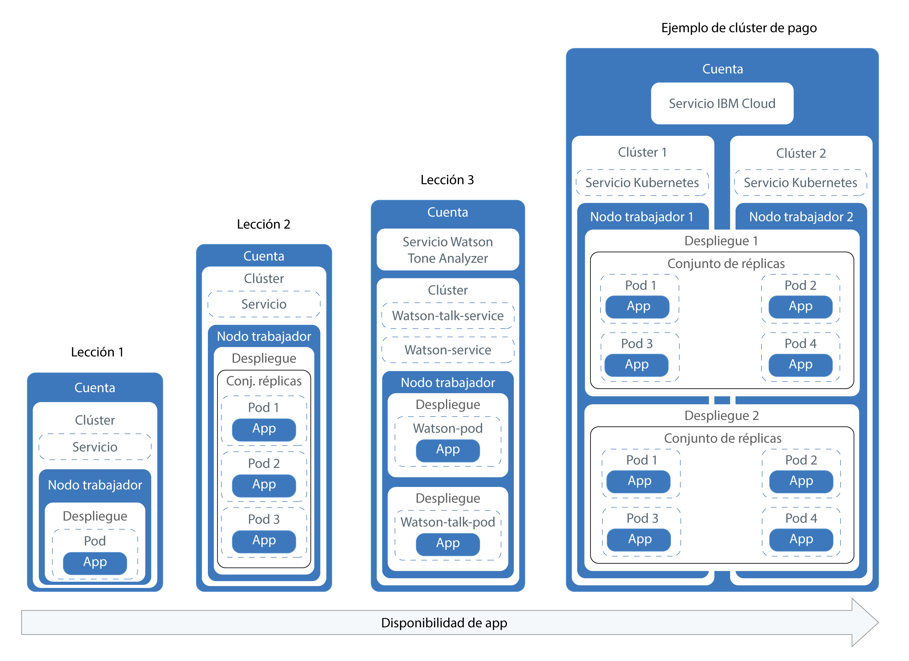
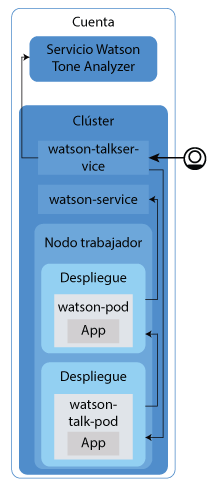

---

copyright:
  years: 2014, 2017
lastupdated: "2017-11-14"

---

{:new_window: target="blank"}
{:shortdesc: .shortdesc}
{:screen: .screen}
{:pre: .pre}
{:table: .aria-labeledby="caption"}
{:codeblock: .codeblock}
{:tip: .tip}
{:download: .download}


# Guía de aprendizaje: Despliegue de apps en clústeres
{: #cs_apps_tutorial}

Esta segunda guía de aprendizaje continúa mostrando cómo puede desplegar una app contenerizada que aproveche el servicio {{site.data.keyword.watson}} {{site.data.keyword.toneanalyzershort}} de {{site.data.keyword.Bluemix_notm}}. Una empresa PR ficticia utiliza {{site.data.keyword.watson}} para analizar sus notas de prensa y recibir comentarios sobre el tono de sus mensajes.
{:shortdesc}

En este caso de ejemplo, el desarrollador de apps de la empresa PR despliega una versión de Hello World de la app en el clúster de Kubernetes que el administrador de la red ha creado en la [primera guía de aprendizaje](cs_tutorials.html#cs_cluster_tutorial).

En cada lección aprenderá a desplegar versiones cada vez más complicadas de la misma app.  El diagrama muestra los componentes de la guía de aprendizaje de despliegues de apps, excepto la cuarta parte.



Tal como ilustra el diagrama, Kubernetes utiliza varios tipos de recursos para configurar y ejecutar sus apps en los clústeres. En Kubernetes, los despliegues y los servicios trabajan conjuntamente. Los despliegues incluyen las definiciones de la app, como por ejemplo la imagen que se utilizará para el contenedor y el puerto que se debe exponer para la app. Cuando crea un despliegue, se crea un pod de Kubernetes para cada contenedor que haya definido en el despliegue. Para que la app resulte más resistente, puede definir varias instancias de la misma app en su despliegue y dejar que Kubernetes cree automáticamente una réplica. El conjunto de réplicas supervisa los pods y garantiza que el número deseado de pods están activos y en ejecución en todo momento. Si uno de los pods deja de responder, el pod se vuelve a crear automáticamente.

Los servicios agrupan un conjunto de pods y proporciona conexión de red a estos pods para otros servicios del clúster sin exponer la dirección IP privada real de cada pod. Puede utilizar los servicios de Kubernetes para poner una app a disposición de otros pods dentro del clúster o para exponer una app en Internet. En esta guía de aprendizaje, utilizará un servicio de Kubernetes para acceder a la app en ejecución desde Internet utilizando una dirección IP pública que se asigna automáticamente a un nodo trabajador y un puerto público.

Para hacer que la app esté aún más disponible, en los clústeres estándares puede crear varios nodos trabajadores para ejecutar incluso más réplicas de la app. Esta tarea no se trata en esta guía de aprendizaje, pero tenga en cuenta este concepto para futuras mejoras de la disponibilidad de una app.

Solo una de las lecciones incluye la integración de un servicio de {{site.data.keyword.Bluemix_notm}} en una app, pero puede utilizarlo para apps tan sencillas o complejas como pueda imaginar.

## Objetivos

* Comprensión de la terminología básica de Kubernetes
* Envíe una imagen al espacio de nombres del registro de {{site.data.keyword.registryshort_notm}}
* Asignación de acceso público a una app
* Despliegue de una sola instancia de una app en un clúster utilizando un mandato de Kubernetes y un script
* Despliegue de varias instancias de una app en contenedores que se vuelven a crear durante comprobaciones de estado
* Despliegue de una app que utilice funcionalidad de un servicio de {{site.data.keyword.Bluemix_notm}}

## Tiempo necesario

40 minutos

## Audiencia

Desarrolladores de software y administradores de la red que nunca antes han desplegado una app en un clúster de Kubernetes.

## Requisitos previos

[Guía de aprendizaje: Creación de clústeres de Kubernetes en {{site.data.keyword.containershort_notm}}](cs_tutorials.html#cs_cluster_tutorial).

## Lección 1: Despliegue de apps de una sola instancia en clústeres de Kubernetes
{: #cs_apps_tutorial_lesson1}

En esta lección, desplegará una única instancia de la app Hello World en un clúster. El siguiente diagrama incluye los componentes que desplegará al completar esta lección.
{:shortdesc}


En la guía de aprendizaje anterior, ha creado una cuenta y un clúster con un nodo trabajador. En esta lección, debe configurar un despliegue y desplegar la app Hello World en un contenedor Kubernetes en el nodo trabajador. Para hacerlo accesible a nivel público, puede crear un servicio Kubernetes.


1.  Inicie la sesión en la CLI de {{site.data.keyword.Bluemix_notm}}. Escriba
sus credenciales de {{site.data.keyword.Bluemix_notm}} cuando se le solicite. Para especificar una región de {{site.data.keyword.Bluemix_notm}}, [incluya el punto final de API](cs_regions.html#bluemix_regions).

    ```
    bx login
    ```
    {: pre}

    **Nota:** Si tiene un ID federado, utilice `bx login --sso` para iniciar
la sesión en la CLI de {{site.data.keyword.Bluemix_notm}}. Especifique su nombre de usuario y utilice el URL proporcionado en la salida de la CLI para recuperar el código de acceso de un solo uso. Sabe tiene un ID federado cuando el inicio de sesión falla sin el `--sso` y se lleva a cabo correctamente con la opción `--sso`.

2.  Establezca el contexto del clúster en la CLI.
    1.  Obtenga el mandato para establecer la variable de entorno y descargar los archivos de configuración de Kubernetes.

        ```
        bx cs cluster-config <pr_firm_cluster>
        ```
        {: pre}

        Cuando termine la descarga de los archivos de configuración, se muestra un mandato que puede utilizar para establecer la vía de acceso al archivo de configuración de
Kubernetes como variable de entorno.

        Ejemplo para OS X:

        ```
        export KUBECONFIG=/Users/<user_name>/.bluemix/plugins/container-service/clusters/<pr_firm_cluster>/kube-config-prod-dal10-pr_firm_cluster.yml
        ```
        {: screen}

    2.  Copie y pegue el mandato que se muestra en el terminal para definir la variable de entorno `KUBECONFIG`.
    3.  Compruebe que la variable de entorno `KUBECONFIG` se haya establecido correctamente.

        Ejemplo para OS X:

        ```
        echo $KUBECONFIG
        ```
        {: pre}

        Salida:

        ```
        /Users/<user_name>/.bluemix/plugins/container-service/clusters/<pr_firm_cluster>/kube-config-prod-dal10-pr_firm_cluster.yml
        ```
        {: screen}

    4.  Compruebe que los mandatos `kubectl` se ejecutan correctamente con el clúster comprobando la versión del cliente de la CLI de Kubernetes.

        ```
        kubectl version  --short
        ```
        {: pre}

        Salida de ejemplo:

        ```
        Client Version: v1.7.4
        Server Version: v1.7.4
        ```
        {: screen}

3.  Inicie Docker.
    * Si utiliza Docker CE, no se requiere ninguna acción.
    * Si utiliza Linux, siga la [documentación de Docker ](https://docs.docker.com/engine/admin/) para encontrar instrucciones sobre cómo iniciar Docker en función de la distribución de Linux que utilice.
    * Si utiliza Docker Toolbox en Windows u OSX, puede utilizar el Docker Quickstart Terminal, que inicia Docker automáticamente. Utilice Docker Quickstart Terminal en los siguientes pasos para ejecutar los mandatos de
Docker y luego vuelva a la CLI en la que ha definido la variable de sesión `KUBECONFIG`.
        * Si utiliza Docker QuickStart Terminal, vuelva a ejecutar el mandato login de la CLI de {{site.data.keyword.Bluemix_notm}}.

          ```
          bx login
          ```
          {: pre}

4.  Inicie la sesión en la CLI de {{site.data.keyword.registryshort_notm}}. **Nota**: asegúrese de tener el plugin container-registry [instalado](/docs/services/Registry/index.html#registry_cli_install).

    ```
    bx cr login
    ```
    {: pre}

    -   Si ha olvidado el espacio de nombres de {{site.data.keyword.registryshort_notm}}, ejecute el mandato siguiente.

        ```
        bx cr namespace-list
        ```
        {: pre}

5.  Clone o descargue el código fuente de la [app Hello world](https://github.com/Osthanes/container-service-getting-started-wt) en el directorio inicial de su usuario.

    ```
    git clone https://github.com/Osthanes/container-service-getting-started-wt.git
    ```
    {: pre}

    Si ha descargado el repositorio, extraiga el archivo comprimido.

    Ejemplos:

    * Windows: `C:Users\<my_username>\container-service-getting-started-wt`
    * OS X: `/Users/<my_username>/container-service-getting-started-wt`

    El repositorio contiene tres versiones de una app similar en carpetas que se denominan `Stage1`, `Stage2` y `Stage3`. Cada versión contiene los siguientes archivos:
    * `Dockerfile`: las definiciones de compilación para la imagen
    * `app.js`: la app Hello world
    * `package.json`: metadatos sobre la app

6.  Vaya al primer directorio de la app, `Stage1`.

    ```
    cd <username_home_directory>/container-service-getting-started-wt/Stage1
    ```
    {: pre}

7.  Cree una imagen de Docker que incluya los archivos de la app del directorio `Stage1`. Si tiene que realizar un cambio en la app en el futuro, repita estos pasos para crear otra versión de la imagen.

    1.  Cree la imagen localmente y etiquétela con el nombre y la etiqueta que desee utilizar, y el espacio de nombres que ha creado en {{site.data.keyword.registryshort_notm}} en la guía de aprendizaje anterior. El hecho de etiquetar la imagen con la información del espacio de nombres indica a Docker dónde enviar la imagen en un paso posterior. Utilice caracteres alfanuméricos en minúscula o guiones bajos (`_`) solo en el nombre de imagen. No olvide el punto (`.`) al final del mandato. El punto indica a Docker que debe buscar el Dockerfile y crear artefactos para crear la imagen dentro del directorio actual.

        ```
        docker build -t registry.<region>.bluemix.net/<namespace>/hello-world:1 .
        ```
        {: pre}

        Cuando finalice la compilación, compruebe que aparece el mensaje de éxito.

        ```
        Successfully built <image_id>
        ```
        {: screen}

    2.  Envíe la imagen al registro del espacio de nombres.

        ```
        docker push registry.<region>.bluemix.net/<namespace>/hello-world:1
        ```
        {: pre}

        Salida:

        ```
        The push refers to a repository [registry.<region>.bluemix.net/<namespace>/hello-world]
        ea2ded433ac8: Pushed
        894eb973f4d3: Pushed
        788906ca2c7e: Pushed
        381c97ba7dc3: Pushed
        604c78617f34: Pushed
        fa18e5ffd316: Pushed
        0a5e2b2ddeaa: Pushed
        53c779688d06: Pushed
        60a0858edcd5: Pushed
        b6ca02dfe5e6: Pushed
        1: digest: sha256:0d90cb73288113bde441ae9b8901204c212c8980d6283fbc2ae5d7cf652405
        43 size: 2398
        ```
        {: screen}

        Espere a que se envíe la imagen antes de continuar con el paso siguiente.

    3.  Si utiliza Docker Quickstart Terminal, vuelva a la CLI
que ha utilizado para definir la variable de entorno `KUBECONFIG`.

    4.  Compruebe que la imagen se haya añadido correctamente al espacio de nombres.

        ```
        bx cr images
        ```
        {: pre}

        Salida:

        ```
        Listing images...

        REPOSITORY                                  NAMESPACE   TAG       DIGEST         CREATED        SIZE     VULNERABILITY STATUS
        registry.<region>.bluemix.net/<namespace>/hello-world   <namespace>   1   0d90cb732881   1 minute ago   264 MB   OK
        ```
        {: screen}

8.  Cree un despliegue de Kubernetes llamado _hello-world-deployment_ para desplegar la app en un pod del clúster. Los despliegues se utilizan para gestionar pods, lo que incluye instancias contenerizadas de una app. El despliegue siguiente despliega la app en un solo pod.

    ```
    kubectl run hello-world-deployment --image=registry.<region>.bluemix.net/<namespace>/hello-world:1
    ```
    {: pre}

    Salida:

    ```
    deployment "hello-world-deployment" created
    ```
    {: screen}

    Puesto que este despliegue crea una sola instancia de la app, el despliegue se crea más rápidamente que en lecciones posteriores, donde se crea más de una instancia de la app.

9.  Facilite el acceso general a la app exponiendo el despliegue como un servicio NodePort. Los servicios aplican funciones de red a la app. Puesto que el clúster tiene un nodo trabajador en lugar de varios, no es necesario equilibrar la carga entre nodos trabajadores. Por lo tanto, se puede utilizar un NodePort para proporcionar a los usuarios acceso externo a la app. Al igual que puede exponer un puerto para una app de Cloud Foundry, el NodePort que expone es el puerto en el que el nodo trabajador escucha si hay tráfico. En un paso posterior verá qué
NodePort se asigna aleatoriamente al servicio.

    ```
    kubectl expose deployment/hello-world-deployment --type=NodePort --port=8080 --name=hello-world-service --target-port=8080
    ```
    {: pre}

    Salida:

    ```
    service "hello-world-service" exposed
    ```
    {: screen}

    <table>
    <table summary=“Information about the expose command parameters.”>
    <caption>Tabla 1. Parámetros del mandato</caption>
    <thead>
    <th colspan=2> Más información acerca de los parámetros de exposición</th>
    </thead>
    <tbody>
    <tr>
    <td><code>expose</code></td>
    <td>Exponer un recurso como un servicio Kubernetes y difundirlo públicamente a los usuarios.</td>
    </tr>
    <tr>
    <td><code>deployment/<em>&lt;hello-world-deployment&gt;</em></code></td>
    <td>El tipo de recurso y el nombre del recurso para exponer con este servicio.</td>
    </tr>
    <tr>
    <td><code>--name=<em>&lt;hello-world-service&gt;</em></code></td>
    <td>El nombre del servicio.</td>
    </tr>
    <tr>
    <td><code>--port=<em>&lt;8080&gt;</em></code></td>
    <td>El puerto que en el que debe servir el servicio.</td>
    </tr>
    <tr>
    <td><code>--type=NodePort</code></td>
    <td>El tipo de servicio a crear.</td>
    </tr>
    <tr>
    <td><code>--target-port=<em>&lt;8080&gt;</em></code></td>
    <td>El puerto al que el servicio dirige el tráfico. En esta instancia, el destino-puerto es el mismo que el puerto, pero otras apps que cree pueden ser distintas.</td>
    </tr>
    </tbody></table>

    Ahora que ya se ha realizado todo el trabajo de despliegue, puede comprobar cómo ha funcionado el proceso.

10. Para probar la app en un navegador, obtenga los detalles para formar el URL.
    1.  Obtenga información acerca del servicio para ver qué NodePort se ha asignado.

        ```
        kubectl describe service <hello-world-service>
        ```
        {: pre}

        Salida:

        ```
        Name:                   hello-world-service
        Namespace:              default
        Labels:                 run=hello-world-deployment
        Selector:               run=hello-world-deployment
        Type:                   NodePort
        IP:                     10.10.10.8
        Port:                   <unset> 8080/TCP
        NodePort:               <unset> 30872/TCP
        Endpoints:              172.30.171.87:8080
        Session Affinity:       None
        No events.
        ```
        {: screen}

        Los
NodePorts se asignan aleatoriamente cuando se generan con el mandato `expose`, pero
dentro del rango 30000-32767. En este ejemplo, el NodePort es 30872.

    2.  Obtenga la dirección IP pública del nodo trabajador en el clúster.

        ```
        bx cs workers <pr_firm_cluster>
        ```
        {: pre}

        Salida:

        ```
        Listing cluster workers...
        OK
        ID                                            Public IP        Private IP      Machine Type   State      Status
        dal10-pa10c8f571c84d4ac3b52acbf50fd11788-w1   169.47.227.138   10.171.53.188   free           normal    Ready
        ```
        {: screen}

11. Abra un navegador y compruebe la app con el siguiente URL: `http://<IP_address>:<NodePort>`. Con los valores del ejemplo, el URL es `http://169.47.227.138:30872`. Cuando escriba
dicho URL en un navegador, verá un mensaje parecido al siguiente.

    ```
    Hello world! Your app is up and running in a cluster!
    ```
    {: screen}

    Puede facilitar este URL a un compañero para que lo pruebe o lo puede escribir en el navegador de su móvil para comprobar que la app Hello
World esté realmente disponible a nivel público.

12. Inicie el panel de control de Kubernetes con el puerto predeterminado 8001.
    1.  Establezca el proxy con el número de puerto predeterminado.

        ```
        kubectl proxy
        ```
         {: pre}

        ```
        Starting to serve on 127.0.0.1:8001
        ```
        {: screen}

    2.  Abra el siguiente URL en un navegador web para ver el panel de control de Kubernetes.

        ```
        http://localhost:8001/ui
        ```
         {: pre}

13. En el separador **Cargas de trabajo**, verá los recursos que ha creado. Cuando termine de explorar el panel de control de Kubernetes, utilice CTRL+C para salir del mandato `proxy`.

¡Enhorabuena! Ha desplegado su primera versión de la app.

¿Ha utilizado demasiados mandatos en esta lección? Es cierto. ¿Qué le parece si ahora utilizamos un script de configuración para realizar automáticamente parte del trabajo? Para utilizar un script de configuración para la segunda versión de la app y para aumentar la disponibilidad desplegando varias instancias de dicha app, continúe en la lección siguiente.


## Lección 2: Despliegue y actualización de apps con mayor disponibilidad
{: #cs_apps_tutorial_lesson2}

En esta lección, desplegará tres instancias de la app Hello World en un clúster para aumentar la disponibilidad con respecto a la primera versión de la app. Mayor disponibilidad significa que el acceso de usuario se divide entre las tres instancias. Cuando hay demasiados usuarios que intentan acceder a la misma instancia de la app, es posible que el tiempo de respuesta sea lento. Varias instancias puede significar mejores tiempos de respuesta para los usuarios. En esta lección, también aprenderá cómo funcionan las comprobaciones de estado y las actualizaciones de despliegue con Kubernetes.
{:shortdesc}

El siguiente diagrama incluye los componentes que desplegará al completar esta lección.


En la guía de aprendizaje anterior, ha creado una cuenta y un clúster con un nodo trabajador. En esta lección, debe configurar un despliegue y desplegar tres instancias de la app Hello World. Cada instancia se despliega en un pod de Kubernetes como parte de un conjunto de réplicas del nodo trabajador. Para hacerlo accesible a nivel público, puede crear un servicio Kubernetes. 

Tal como se define en el script de configuración, Kubernetes puede utilizar una comprobación de disponibilidad para ver si un contenedor de un pod se está o no ejecutando. Por ejemplo, estas comprobaciones pueden detectar puntos muertos, en los que una app se está ejecutando pero no progresa. Reiniciar un contenedor que está en esta condición puede ayudar a mejorar la disponibilidad de la app a pesar de los errores. Luego Kubernetes utiliza la comprobación de preparación para ver si un contenedor está preparado para empezar de nuevo a aceptar tráfico. Se considera que un pod está preparado cuando su contenedor está preparado. Cuando el pod está preparado, se inicia de nuevo. En la app Stage2, cada 15 segundos se agota el tiempo de espera de la app. Con una comprobación de estado configurada en el script de configuración, los contenedores se vuelven a crear si la comprobación de estado encuentra un problema con una app.

1.  En una CLI, vaya al directorio de la segunda app, `Stage2`. Si utiliza Docker Toolbox para Windows u OS X, utilice Docker
Quickstart Terminal.

  ```
  cd <username_home_directory>/container-service-getting-started-wt/Stage2
  ```
  {: pre}

2.  Cree y etiquete la segunda versión de la app localmente como una imagen. Como siempre, no olvide el punto (`.`) al final del mandato.

  ```
  docker build -t registry.<region>.bluemix.net/<namespace>/hello-world:2 .
  ```
  {: pre}

  Verifique que aparece el mensaje de éxito.

  ```
  Successfully built <image_id>
  ```
  {: screen}

3.  Transmita la segunda versión de la imagen al espacio de nombres del registro. Espere a que se envíe la imagen antes de continuar con el paso siguiente.

  ```
  docker push registry.<region>.bluemix.net/<namespace>/hello-world:2
  ```
  {: pre}

  Salida:

  ```
  The push refers to a repository [registry.<region>.bluemix.net/<namespace>/hello-world]
  ea2ded433ac8: Pushed
  894eb973f4d3: Pushed
  788906ca2c7e: Pushed
  381c97ba7dc3: Pushed
  604c78617f34: Pushed
  fa18e5ffd316: Pushed
  0a5e2b2ddeaa: Pushed
  53c779688d06: Pushed
  60a0858edcd5: Pushed
  b6ca02dfe5e6: Pushed
  1: digest: sha256:0d90cb73288113bde441ae9b8901204c212c8980d6283fbc2ae5d7cf652405
  43 size: 2398
  ```
  {: screen}

4.  Si utiliza Docker Quickstart Terminal, vuelva a la CLI
que ha utilizado para definir la variable de entorno `KUBECONFIG`.
5.  Compruebe que la imagen se haya añadido correctamente al espacio de nombres del registro.

    ```
    bx cr images
    ```
     {: pre}

    Salida:

    ```
    Listing images...

    REPOSITORY                                 NAMESPACE  TAG  DIGEST        CREATED        SIZE     VULNERABILITY STATUS
    registry.<region>.bluemix.net/<namespace>/hello-world  <namespace>  1    0d90cb732881  30 minutes ago 264 MB   OK
    registry.<region>.bluemix.net/<namespace>/hello-world  <namespace>  2    c3b506bdf33e  1 minute ago   264 MB   OK
    ```
    {: screen}

6.  Abra el archivo `<username_home_directory>/container-service-getting-started-wt/Stage2/healthcheck.yml` con un editor de texto. Este script de configuración combina unos pocos pasos de la lección anterior para crear un despliegue y un servicio al mismo tiempo. Los desarrolladores de apps de la empresa PR pueden utilizar estos scripts cuando se realizan actualizaciones o para solucionar problemas cuando se vuelven a crear los pods.

    1.  En la sección **Despliegue**, anote el valor de `replicas`. El valor de réplicas indica el número de instancias de la app. Si se ejecutan tres instancias, la app tiene una mayor disponibilidad que si se utiliza una sola instancia.

        ```
        replicas: 3
        ```
        {: pre}

    2.  Actualice los detalles de la imagen en el registro privado de espacio de nombres.

        ```
        image: "registry.<region>.bluemix.net/<namespace>/hello-world:2"
        ```
        {: pre}

    3.  Observe que la prueba de actividad de HTTP comprueba el estado del contenedor cada 5 segundos.

        ```
        livenessProbe:
                    httpGet:
                      path: /healthz
                      port: 8080
                    initialDelaySeconds: 5
                    periodSeconds: 5
        ```
        {: codeblock}

    4.  En la sección **Service**, anote el valor de `NodePort`. En lugar de generar un NodePort aleatorio como hizo en la lección anterior, puede especificar un puerto comprendido entre 30000 y 32767. En este ejemplo se utiliza el valor 30072.

7.  Ejecute el script de configuración en el clúster. Cuando se hayan creado el despliegue y el servicio, la app estará disponible para que la vean los usuarios de la empresa PR.

  ```
  kubectl apply -f <username_home_directory>/container-service-getting-started-wt/Stage2/healthcheck.yml
  ```
  {: pre}

  Salida:

  ```
  deployment "hw-demo-deployment" created
  service "hw-demo-service" created
  ```
  {: screen}

  Ahora que ya se ha realizado todo el trabajo de despliegue, compruebe cómo ha funcionado el proceso. Es posible que detecte que, puesto que se ejecutan más instancias, la ejecución de procesos sea algo más lenta.

8.  Abra un navegador y compruebe la app. Para formar el URL, tome la misma dirección IP pública que ha utilizado en la lección anterior para el nodo trabajador y combínela con el NodePort especificado en el script de configuración. Para obtener la dirección IP pública para el nodo trabajador:

  ```
  bx cs workers <pr_firm_cluster>
  ```
  {: pre}

  Con los valores del ejemplo, el URL es `http://169.47.227.138:30072`. En un navegador, es posible que vea el texto siguiente. Si no ve este texto, no se preocupe. Esta app está diseñado para ir hacia arriba y hacia abajo.

  ```
  Hello world! Great job getting the second stage up and running!
  ```
  {: screen}

  También puede consultar `http://169.47.227.138:30072/healthz` para ver el estado.

  Durante los 10 - 15 primeros segundos, se devuelve un mensaje 200, que le indica que la app se está ejecutando correctamente. Transcurridos estos 15 segundos, aparece un mensaje de tiempo de espera excedido, diseñado para la app.

  ```
  {
    "error": "Timeout, Health check error!"
  }
  ```
  {: screen}

9.  Inicie el panel de control de Kubernetes con el puerto predeterminado 8001.
    1.  Establezca el proxy con el número de puerto predeterminado.

        ```
        kubectl proxy
        ```
        {: pre}

        Salida:

        ```
        Starting to serve on 127.0.0.1:8001
        ```
        {: screen}

    2.  Abra el siguiente URL en un navegador web para ver el panel de control de Kubernetes.

        ```
        http://localhost:8001/ui
        ```
        {: codeblock}

10. En el separador **Cargas de trabajo**, verá los recursos que ha creado. Desde este separador, puede renovar continuamente y ver que la comprobación de estado funciona. En la sección **Pods**, puede ver el número de veces que se han reiniciado los pods cuando se vuelven a crear los contenedores que contienen. Si recibe el siguiente error en el panel de control, este mensaje indica que la comprobación de estado ha detectado un problema. Espere unos minutos y vuelva a renovar. Verá el número de cambios de reinicio para cada pod.

    ```
    Liveness probe failed: HTTP probe failed with statuscode: 500
    Back-off restarting failed docker container
    Error syncing pod, skipping: failed to "StartContainer" for "hw-container" with CrashLoopBackOff: "Back-off 1m20s restarting failed container=hw-container pod=hw-demo-deployment-3090568676-3s8v1_default(458320e7-059b-11e7-8941-56171be20503)"
    ```
    {: screen}

    Cuando termine de explorar el panel de control de Kubernetes, en la CLI escriba CTRL+C para salir del mandato `proxy`.


¡Enhorabuena! Ha desplegado la segunda versión de la app. Ha tenido que utilizar menos mandatos, ha visto cómo funcionan las comprobaciones de seguridad y ha editado un despliegue, lo cual no está nada mal. La app Hello world ha pasado la prueba para la empresa PR. Ahora puede desplegar una app más útil para que la empresa PR empiece a analizar notas de prensa.

¿Está listo para suprimir lo que ha creado antes de continuar? Esta vez puede utilizar el mismo script de configuración para suprimir los recursos que ha creado.

```
kubectl delete -f <username_home_directory>/container-service-getting-started-wt/Stage2/healthcheck.yml
```
{: pre}

Salida:

```
deployment "hw-demo-deployment" deleted
service "hw-demo-service" deleted
```
{: screen}

## Lección 3: Despliegue y actualización de la app Watson Tone Analyzer
{: #cs_apps_tutorial_lesson3}

En las lecciones anteriores, las apps se han desplegado como componentes únicos de un nodo trabajador. En esta lección, desplegará dos componentes de una app en un clúster y utiliza el servicio Watson Tone Analyzer que ha añadido al clúster en la guía de aprendizaje anterior. La separación de componentes en distintos contenedores garantiza que puede actualizar uno sin que afecte a los otros. A continuación, actualizará la app para ampliarla con más réplicas a fin de aumentar su disponibilidad.
{:shortdesc}

El siguiente diagrama incluye los componentes que desplegará al completar esta lección.




En la guía de aprendizaje anterior, ha creado una cuenta y un clúster con un nodo trabajador. En esta lección, se crea una instancia del servicio Watson Tone Analyzer en la cuenta de {{site.data.keyword.Bluemix_notm}} y se configuran dos despliegues, uno por cada componente de la app. Cada componente se despliega en un pod de Kubernetes del nodo trabajador. Para hacerlos accesibles a nivel público, también puede crear un servicio Kubernetes para cada componente. 


### Lección 3a: Despliegue de la app Watson Tone Analyzer
{: #lesson3a}

1.  En una CLI, vaya al directorio de la tercera app, `Stage3`. Si utiliza Docker Toolbox para Windows u OS X, utilice Docker
Quickstart Terminal.

  ```
  cd <username_home_directory>/container-service-getting-started-wt/Stage3
  ```
  {: pre}

2.  Cree la primera imagen de {{site.data.keyword.watson}}.

    1.  Vaya al directorio `watson`.

        ```
        cd watson
        ```
        {: pre}

    2.  Cree y etiquete la primera parte de la app localmente como una imagen. Como siempre, no olvide el punto (`.`) al final del mandato.

        ```
        docker build -t registry.<region>.bluemix.net/<namespace>/watson .
        ```
        {: pre}

        Verifique que aparece el mensaje de éxito.

        ```
        Successfully built <image_id>
        ```
        {: screen}

    3.  Transmita la primera parte de la app como una imagen al espacio de nombres del registro privado. Espere a que se envíe la imagen antes de continuar con el paso siguiente.

        ```
        docker push registry.<region>.bluemix.net/<namespace>/watson
        ```
        {: pre}

3.  Cree la segunda imagen de {{site.data.keyword.watson}}.

    1.  Vaya al directorio `watson-talk`.

        ```
        cd <username_home_directory>/container-service-getting-started-wt/Stage3/watson-talk
        ```
        {: pre}

    2.  Cree y etiquete la segunda parte de la app localmente como una imagen. Como siempre, no olvide el punto (`.`) al final del mandato.

        ```
        docker build -t registry.<region>.bluemix.net/<namespace>/watson-talk .
        ```
        {: pre}

        Verifique que aparece el mensaje de éxito.

        ```
        Successfully built <image_id>
        ```
        {: screen}

    3.  Transmita la segunda parte de la app al espacio de nombres del registro privado. Espere a que se envíe la imagen antes de continuar con el paso siguiente.

        ```
        docker push registry.<region>.bluemix.net/<namespace>/watson-talk
        ```
        {: pre}

4.  Si utiliza Docker Quickstart Terminal, vuelva a la CLI
que ha utilizado para definir la variable de entorno `KUBECONFIG`.

5.  Compruebe que las imágenes se han añadido correctamente al espacio de nombres del registro.

    ```
    bx cr images
    ```
    {: pre}

    Salida:

    ```
    Listing images...

    REPOSITORY                                  NAMESPACE  TAG            DIGEST         CREATED         SIZE     VULNERABILITY STATUS
    registry.<region>.bluemix.net/namespace/hello-world   namespace  1              0d90cb732881   40 minutes ago  264 MB   OK
    registry.<region>.bluemix.net/namespace/hello-world   namespace  2              c3b506bdf33e   20 minutes ago  264 MB   OK
    registry.<region>.bluemix.net/namespace/watson        namespace  latest         fedbe587e174   3 minutes ago   274 MB   OK
    registry.<region>.bluemix.net/namespace/watson-talk   namespace  latest         fedbe587e174   2 minutes ago   274 MB   OK
    ```
    {: screen}

6.  Abra el archivo `<username_home_directory>/container-service-getting-started-wt/Stage3/watson-deployment.yml` con un editor de texto. Este script de configuración incluye un despliegue y un servicio para los componentes watson y watson-talk de la app.

    1.  Actualice los detalles de la imagen en el espacio de nombres del registro para ambos despliegues.

        watson:

        ```
        image: "registry.<region>.bluemix.net/namespace/watson"
        ```
        {: codeblock}

        watson-talk:

        ```
        image: "registry.<region>.bluemix.net/namespace/watson-talk"
        ```
        {: codeblock}

    2.  En la sección volumes del despliegue de watson, actualice el nombre del secreto de {{site.data.keyword.watson}} {{site.data.keyword.toneanalyzershort}} que ha creado en la guía de aprendizaje anterior. Si monta el secreto de Kubernetes como volumen en el despliegue, las credenciales de servicio de {{site.data.keyword.Bluemix_notm}} estarán disponibles para el contenedor que se ejecuta en el pod. Los componentes
de la app {{site.data.keyword.watson}} de esta guía de aprendizaje están configurados para buscar las credenciales de servicio utilizando la vía de acceso de montaje del volumen.

        ```
        volumes:
                - name: service-bind-volume
                  secret:
                    defaultMode: 420
                    secretName: binding-<mytoneanalyzer>
        ```
        {: codeblock}

        Si ha olvidado cómo llamó al secreto, ejecute el siguiente mandato:

        ```
        kubectl get secrets --namespace=default
        ```
        {: pre}

    3.  En la sección del servicio watson-talk, anote el valor definido para el `NodePort`. En este ejemplo se utiliza 30080.

7.  Ejecute el script de configuración.

  ```
  kubectl apply -f <username_home_directory>/container-service-getting-started-wt/Stage3/watson-deployment.yml
  ```
  {: pre}

8.  Opcional: Compruebe que el secreto de {{site.data.keyword.watson}} {{site.data.keyword.toneanalyzershort}} se haya montado como volumen en el pod.

    1.  Para obtener el nombre de un pod de watson, ejecute el siguiente mandato:

        ```
        kubectl get pods
        ```
        {: pre}

        Salida:

        ```
        NAME                                 READY     STATUS    RESTARTS  AGE
        watson-pod-4255222204-rdl2f          1/1       Running   0         13h
        watson-talk-pod-956939399-zlx5t      1/1       Running   0         13h
        ```
        {: screen}

    2.  Obtenga los detalles del pod y busque el nombre del secreto.

        ```
        kubectl describe pod <pod_name>
        ```
        {: pre}

        Salida:

        ```
        Volumes:
          service-bind-volume:
            Type:       Secret (a volume populated by a Secret)
            SecretName: binding-mytoneanalyzer
          default-token-j9mgd:
            Type:       Secret (a volume populated by a Secret)
            SecretName: default-token-j9mgd
        ```
        {: codeblock}

9.  Abra un navegador y analice parte del texto. Con la dirección IP de ejemplo, el formato del URL es `http://<worker_node_IP_address>:<watson-talk-nodeport>/analyze/"<text_to_analyze>"`. Ejemplo:

    ```
    http://169.47.227.138:30080/analyze/"Today is a beautiful day"
    ```
    {: codeblock}

    En un navegador, puede ver la respuesta JSON para el texto especificado.

10. Inicie el panel de control de Kubernetes con el puerto predeterminado 8001.

    1.  Establezca el proxy con el número de puerto predeterminado.

        ```
        kubectl proxy
        ```
        {: pre}

        ```
        Starting to serve on 127.0.0.1:8001
        ```
        {: screen}

    2.  Abra el siguiente URL en un navegador web para ver el panel de control de Kubernetes.

        ```
        http://localhost:8001/ui
        ```
        {: codeblock}

11. En el separador **Cargas de trabajo**, verá los recursos que ha creado. Cuando termine de explorar el panel de control de Kubernetes, utilice CTRL+C para salir del mandato `proxy`.

### Lección 3b. Actualización del despliegue de Watson Tone Analyzer en ejecución
{: #lesson3b}

Mientras un despliegue se está ejecutando, puede editar el despliegue para cambiar valores en la plantilla del pod. Esta lección incluye la actualización de la imagen que se utiliza.

1.  Cambie el nombre de la imagen. La empresa PR desea probar otra app en el mismo despliegue, pero quiere poder retrotraer si se detecta algún problema con la nueva app.

    1.  Abra el script de configuración del despliegue en ejecución.

        ```
        kubectl edit deployment/watson-talk-pod
        ```
        {: pre}

        En función del sistema operativo, lo abre un editor vi o un editor de texto.

    2.  Cambie el nombre de la imagen por la imagen ibmliberty.

        ```
        spec:
              containers:
              - image: registry.<region>.bluemix.net/ibmliberty:latest
        ```
        {: codeblock}

    3.  Guarde los cambios y salga del editor.

    4.  Aplique los cambios del script de configuración al despliegue en ejecución.

        ```
        kubectl rollout status deployment/watson-talk-pod
        ```
        {: pre}

        Espere a que se confirme que la actualización ha finalizado.

        ```
        deployment "watson-talk-pod" successfully rolled out
        ```
        {: screen}

        Cuando se despliega un cambio, se crea otro pod y Kubernetes lo prueba. Cuando la prueba se ejecuta correctamente, el pod antiguo se elimina.

    5.  Si los cambios no tienen el efecto esperado, se pueden retrotraer. Es posible que alguien de la empresa PR haya cometido un error con los cambios en la app y tengan que recuperar el despliegue anterior.

        1.  Ver los números de versión de revisión para identificar el número del despliegue anterior. La revisión más reciente es la que tiene el número de versión más alto. En este ejemplo, la revisión 1 era el despliegue original y la revisión 2 es el cambio de imagen que ha realizado en el paso anterior.

            ```
            kubectl rollout history deployment/watson-talk-pod
            ```
            {: pre}

            Salida:

            ```
            deployments "watson-talk-pod"
            REVISION CHANGE-CAUSE
            1          <none>
            2          <none>

            ```
            {: screen}

        2.  Ejecute el siguiente mandato para revertir el despliegue a la revisión anterior. De nuevo, se crea otro pod y Kubernetes lo prueba. Cuando la prueba se ejecuta correctamente, el pod antiguo se elimina.

            ```
            kubectl rollout undo deployment/watson-talk-pod --to-revision=1
            ```
            {: pre}

            Salida:

            ```
            deployment "watson-talk-pod" rolled back
            ```
            {: screen}

        3.  Obtener el nombre del pod para utilizarlo en el paso siguiente.

            ```
            kubectl get pods
            ```
            {: pre}

            Salida:

            ```
            NAME                              READY     STATUS    RESTARTS   AGE
            watson-talk-pod-2511517105-6tckg  1/1       Running   0          2m
            ```
            {: screen}

        4.  Ver los detalles del pod y verificar que la imagen se ha retrotraído.

            ```
            kubectl describe pod <pod_name>
            ```
            {: pre}

            Salida:

            ```
            Image: registry.<region>.bluemix.net/namespace/watson-talk
            ```
            {: screen}

2.  Opcional: Repita los cambios para el despliegue de watson-pod.

[Probar sus conocimientos y responder a un cuestionario.](https://ibmcloud-quizzes.mybluemix.net/containers/apps_tutorial/quiz.php)

¡Enhorabuena! Ha desplegado la app Watson Tone Analyzer. La empresa PR puede empezar definitivamente a utilizar este despliegue de la app para empezar a analizar sus notas de prensa.

¿Está listo para suprimir lo que ha creado? Puede utilizar el script de configuración para suprimir los recursos que ha creado.

```
kubectl delete -f <username_home_directory>/container-service-getting-started-wt/Stage3/watson-deployment.yml
```
{: pre}

Salida:

```
deployment "watson-pod" deleted
deployment "watson-talk-pod" deleted
service "watson-service" deleted
service "watson-talk-service" deleted
```
{: screen}

Si no desea conservar el clúster, también puede suprimirlo.

```
bx cs cluster-rm <pr_firm_cluster>
```
{: pre}

## ¿Qué es lo siguiente?

Intente explorar los trayectos de orquestación del contenedor de [developerWorks ](https://developer.ibm.com/code/journey/category/container-orchestration/).
