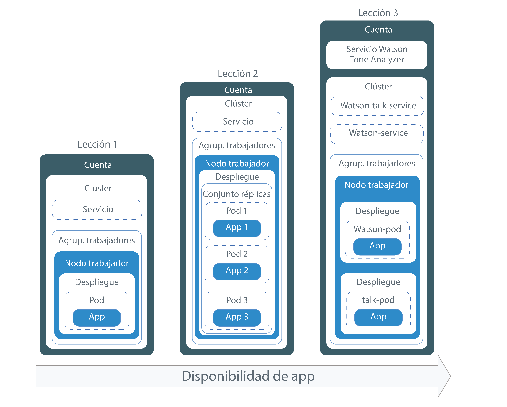
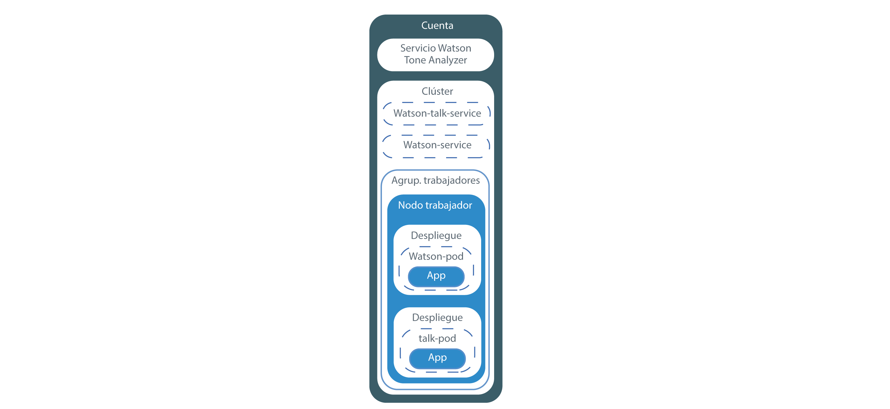

---

copyright:
  years: 2014, 2019
lastupdated: "2019-05-31"

keywords: kubernetes, iks

subcollection: containers

---

{:new_window: target="_blank"}
{:shortdesc: .shortdesc}
{:screen: .screen}
{:pre: .pre}
{:table: .aria-labeledby="caption"}
{:codeblock: .codeblock}
{:tip: .tip}
{:note: .note}
{:important: .important}
{:deprecated: .deprecated}
{:download: .download}
{:preview: .preview}


# Guía de aprendizaje: Despliegue de apps en clústeres de Kubernetes
{: #cs_apps_tutorial}

Puede aprender a utilizar {{site.data.keyword.containerlong}} para desplegar una app contenerizada que aproveche {{site.data.keyword.watson}} {{site.data.keyword.toneanalyzershort}}.
{: shortdesc}

En este escenario, una empresa PR ficticia utiliza el servicio {{site.data.keyword.Bluemix_notm}} para analizar sus notas de prensa y recibir comentarios sobre el tono de sus mensajes.

Mediante el clúster de Kubernetes creado en la última guía de aprendizaje, el desarrollador de apps de la empresa PR despliega una versión de Hello World de la app. Basándose en cada lección de esta guía, el desarrollador de apps despliega versiones cada vez más complicadas de la misma app. El siguiente diagrama muestra los componentes de cada despliegue por lección.



Tal como ilustra el diagrama, Kubernetes utiliza varios tipos de recursos para configurar y ejecutar sus apps en los clústeres. En Kubernetes, los despliegues y los servicios trabajan conjuntamente. Los despliegues incluyen las definiciones de la app. Por ejemplo, la imagen que se utilizará para el contenedor y el puerto que se debe exponer para la app. Cuando crea un despliegue, se crea un pod de Kubernetes para cada contenedor que haya definido en el despliegue. Para que la app resulte más resistente, puede definir varias instancias de la misma app en su despliegue y dejar que Kubernetes cree automáticamente una réplica. El conjunto de réplicas supervisa los pods y garantiza que el número especificado de pods están siempre activos y en ejecución. Si uno de los pods deja de responder, el pod se vuelve a crear automáticamente.

Los servicios agrupan un conjunto de pods y proporciona conexión de red a estos pods para otros servicios del clúster sin exponer la dirección IP privada real de cada pod. Puede utilizar los servicios de Kubernetes para poner una app a disposición de otros pods dentro del clúster o para exponer una app en Internet. En esta guía de aprendizaje, utilizará un servicio de Kubernetes para acceder a la app en ejecución desde Internet utilizando una dirección IP pública que se asigna automáticamente a un nodo trabajador y un puerto público.

Para hacer que la app esté aún más disponible, en los clústeres estándares puede crear una agrupación de nodos trabajadores que abarque varias zonas con nodos trabajadores en cada zona para ejecutar incluso más réplicas de la app. Esta tarea no se trata en esta guía de aprendizaje, pero tenga en cuenta este concepto para futuras mejoras de la disponibilidad de una app.

Solo una de las lecciones incluye la integración de un servicio de {{site.data.keyword.Bluemix_notm}} en una app, pero puede utilizarlo para apps tan sencillas o complejas como pueda imaginar.

## Objetivos
{: #apps_objectives}

* Comprensión de la terminología básica de Kubernetes
* Envíe una imagen al espacio de nombres del registro de {{site.data.keyword.registryshort_notm}}
* Asignación de acceso público a una app
* Despliegue de una sola instancia de una app en un clúster utilizando un mandato de Kubernetes y un script
* Despliegue de varias instancias de una app en contenedores que se vuelven a crear durante comprobaciones de estado
* Despliegue de una app que utilice funcionalidad de un servicio de {{site.data.keyword.Bluemix_notm}}

## Tiempo necesario
{: #apps_time}

40 minutos

## Audiencia
{: #apps_audience}

Los desarrolladores de software y administradores de la red que despliegan apps en un clúster de Kubernetes por primera vez.

## Requisitos previos
{: #apps_prereqs}

[Guía de aprendizaje: Creación de clústeres de Kubernetes](/docs/containers?topic=containers-cs_cluster_tutorial#cs_cluster_tutorial)


## Lección 1: Despliegue de apps de una sola instancia en clústeres de Kubernetes
{: #cs_apps_tutorial_lesson1}

En la guía de aprendizaje anterior, ha creado un clúster con un nodo trabajador. En esta lección, configurará un despliegue y desplegará una única instancia de la app en un pod de Kubernetes dentro del nodo trabajador.
{:shortdesc}

Los componentes que desplegará al completar esta lección se muestran en el siguiente diagrama.


Para desplegar la app:

1.  Clone el código fuente de la [app Hello world ](https://github.com/IBM/container-service-getting-started-wt) en el directorio inicial de su usuario. El repositorio contiene distintas versiones de una app similar en carpetas que se que empiezan por `Lab`. Cada versión contiene los siguientes archivos:
    * `Dockerfile`: las definiciones de compilación para la imagen.
    * `app.js`: la app Hello world.
    * `package.json`: metadatos sobre la app.

    ```
    git clone https://github.com/IBM/container-service-getting-started-wt.git
    ```
    {: pre}

2.  Vaya al directorio `Lab 1`.

    ```
    cd 'container-service-getting-started-wt/Lab 1'
    ```
    {: pre}

3. [Inicie una sesión en su cuenta. Si procede, apunte al grupo de recursos adecuado. Establezca el contexto para el clúster.](/docs/containers?topic=containers-cs_cli_install#cs_cli_configure)

5.  Inicie la sesión en la CLI de {{site.data.keyword.registryshort_notm}}.

    ```
    ibmcloud cr login
    ```
    {: pre}
    -   Si ha olvidado el espacio de nombres de {{site.data.keyword.registryshort_notm}}, ejecute el mandato siguiente.

        ```
        ibmcloud cr namespace-list
        ```
        {: pre}

6.  Cree una imagen de Docker que incluya los archivos de la app del directorio `Lab 1` y envíe por push la imagen al espacio de nombres de {{site.data.keyword.registryshort_notm}} que ha creado en la guía de aprendizaje anterior. Si tiene que realizar un cambio en la app en el futuro, repita estos pasos para crear otra versión de la imagen. **Nota**: Obtenga más información sobre cómo [proteger su información personal](/docs/containers?topic=containers-security#pi) cuando se trabaja con imágenes de contenedor.

    Utilice caracteres alfanuméricos en minúscula o guiones bajos (`_`) solo en el nombre de imagen. No olvide el punto (`.`) al final del mandato. El punto indica a Docker que debe buscar el Dockerfile y crear artefactos para crear la imagen dentro del directorio actual. Para obtener la región de registro en la que se encuentra actualmente, ejecute `ibmcloud cr region`.

    ```
    ibmcloud cr build -t <region>.icr.io/<namespace>/hello-world:1 .
    ```
    {: pre}

    Cuando finalice la compilación, compruebe que aparece el siguiente mensaje de éxito:

    ```
    Successfully built <image_ID>
    Successfully tagged <region>.icr.io/<namespace>/hello-world:1
    The push refers to a repository [<region>.icr.io/<namespace>/hello-world]
    29042bc0b00c: Pushed
    f31d9ee9db57: Pushed
    33c64488a635: Pushed
    0804854a4553: Layer already exists
    6bd4a62f5178: Layer already exists
    9dfa40a0da3b: Layer already exists
    1: digest: sha256:f824e99435a29e55c25eea2ffcbb84be4b01345e0a3efbd7d9f238880d63d4a5 size: 1576
    ```
    {: screen}

7.  Los despliegues se utilizan para gestionar pods, lo que incluye instancias contenerizadas de una app. El mandato siguiente despliega la app en un solo pod. Para los efectos de esta guía, el despliegue se denomina despliegue **hello-world-deployment**, pero puede darle al despliegue cualquier nombre que desee.

    ```
    kubectl create deployment hello-world-deployment --image=<region>.icr.io/<namespace>/hello-world:1
    ```
    {: pre}

    Salida de ejemplo:

    ```
    deployment "hello-world-deployment" created
    ```
    {: screen}

    Obtenga más información sobre cómo [proteger su información personal](/docs/containers?topic=containers-security#pi) cuando se trabaja recursos de Kubernetes.

8.  Facilite el acceso general a la app exponiendo el despliegue como un servicio NodePort. Al igual que expone un puerto para una app Cloud Foundry, el NodePort que expone es el puerto en el que el nodo trabajador escucha si hay tráfico.

    ```
    kubectl expose deployment/hello-world-deployment --type=NodePort --port=8080 --name=hello-world-service --target-port=8080
    ```
    {: pre}

    Salida de ejemplo:

    ```
    service "hello-world-service" exposed
    ```
    {: screen}

    <table summary=“Information about the expose command parameters.”>
    <caption>Más información acerca de los parámetros de exposición</caption>
    <thead>
    <th colspan=2> Más información acerca de los parámetros de exposición</th>
    </thead>
    <tbody>
    <tr>
    <td><code>expose</code></td>
    <td>Exponer un recurso como un servicio Kubernetes y difundirlo públicamente a los usuarios.</td>
    </tr>
    <tr>
    <td><code>deployment/<em>&lt;hello-world-deployment&gt;</em></code></td>
    <td>El tipo de recurso y el nombre del recurso para exponer con este servicio.</td>
    </tr>
    <tr>
    <td><code>--name=<em>&lt;hello-world-service&gt;</em></code></td>
    <td>El nombre del servicio.</td>
    </tr>
    <tr>
    <td><code>--port=<em>&lt;8080&gt;</em></code></td>
    <td>El puerto en el que el servicio sirve.</td>
    </tr>
    <tr>
    <td><code>--type=NodePort</code></td>
    <td>El tipo de servicio a crear.</td>
    </tr>
    <tr>
    <td><code>--target-port=<em>&lt;8080&gt;</em></code></td>
    <td>El puerto al que el servicio dirige el tráfico. En esta instancia, el destino-puerto es el mismo que el puerto, pero otras apps que cree pueden ser distintas.</td>
    </tr>
    </tbody></table>

9. Ahora que ya se ha realizado todo el trabajo de despliegue, puede probar la app en un navegador. Obtenga los detalles para formar el URL.
    1.  Obtenga información acerca del servicio para ver qué NodePort se ha asignado.

        ```
        kubectl describe service hello-world-service
        ```
        {: pre}

        Salida de ejemplo:

        ```
        Name:                   hello-world-service
        Namespace:              default
        Labels:                 run=hello-world-deployment
        Selector:               run=hello-world-deployment
        Type:                   NodePort
        IP:                     10.xxx.xx.xxx
        Port:                   <unset> 8080/TCP
        NodePort:               <unset> 30872/TCP
        Endpoints:              172.30.xxx.xxx:8080
        Session Affinity:       None
        No events.
        ```
        {: screen}

        Los
NodePorts se asignan aleatoriamente cuando se generan con el mandato `expose`, pero
dentro del rango 30000-32767. En este ejemplo, el NodePort es 30872.

    2.  Obtenga la dirección IP pública del nodo trabajador en el clúster.

        ```
        ibmcloud ks workers --cluster <cluster_name_or_ID>
        ```
        {: pre}

        Salida de ejemplo:

        ```
        ibmcloud ks workers --cluster pr_firm_cluster
        Listing cluster workers...
        OK
        ID                                                 Public IP       Private IP       Machine Type   State    Status   Zone   Version
        kube-mil01-pa10c8f571c84d4ac3b52acbf50fd11788-w1   169.xx.xxx.xxx  10.xxx.xx.xxx    free           normal   Ready    mil01      1.13.6
        ```
        {: screen}

10. Abra un navegador y compruebe la app con el siguiente URL: `http://<IP_address>:<NodePort>`. Con los valores de ejemplo, el URL es `http://169.xx.xxx.xxx:30872`. Cuando escriba
dicho URL en un navegador, verá un mensaje parecido al siguiente.

    ```
    Hello world! Your app is up and running in a cluster!
    ```
    {: screen}

    Para ver que la app está disponible públicamente, intente entrar en ella con un navegador en su teléfono móvil.
    {: tip}

11. [Inicie el panel de control de Kubernetes](/docs/containers?topic=containers-app#cli_dashboard).

    Si selecciona su clúster en la [consola de {{site.data.keyword.Bluemix_notm}}](https://cloud.ibm.com/), utilice el botón del **Panel de control de Kubernetes** para iniciar el panel de control con una pulsación.
    {: tip}

12. En el separador **Cargas de trabajo**, verá los recursos que ha creado.

¡Buen trabajo! Ha desplegado su primera versión de la app.

¿Ha utilizado demasiados mandatos en esta lección? Es cierto. ¿Qué le parece si ahora utilizamos un script de configuración para realizar automáticamente parte del trabajo? Para utilizar un script de configuración para la segunda versión de la app y para aumentar la disponibilidad desplegando varias instancias de dicha app, continúe en la lección siguiente.

<br />


## Lección 2: Despliegue y actualización de apps con mayor disponibilidad
{: #cs_apps_tutorial_lesson2}

En esta lección, desplegará tres instancias de la app Hello World en un clúster para aumentar la disponibilidad con respecto a la primera versión de la app.
{:shortdesc}

Mayor disponibilidad significa que el acceso de usuario se divide entre las tres instancias. Cuando hay demasiados usuarios que intentan acceder a la misma instancia de la app, es posible que el tiempo de respuesta sea lento. Varias instancias puede significar mejores tiempos de respuesta para los usuarios. En esta lección, también aprenderá cómo funcionan las comprobaciones de estado y las actualizaciones de despliegue con Kubernetes. El siguiente diagrama incluye los componentes que desplegará al completar esta lección.


En la guía de aprendizaje anterior, ha creado una cuenta y un clúster con un nodo trabajador. En esta lección, debe configurar un despliegue y desplegar tres instancias de la app Hello World. Cada instancia se despliega en un pod de Kubernetes como parte de un conjunto de réplicas del nodo trabajador. Para hacerlo accesible a nivel público, puede crear un servicio Kubernetes.

Tal como se define en el script de configuración, Kubernetes puede utilizar una comprobación de disponibilidad para ver si un contenedor de un pod se está o no ejecutando. Por ejemplo, estas comprobaciones pueden detectar puntos muertos, en los que una app se está ejecutando pero no progresa. Reiniciar un contenedor que está en esta condición puede ayudar a mejorar la disponibilidad de la app a pesar de los errores. Luego Kubernetes utiliza una comprobación de preparación para ver si un contenedor está preparado para empezar de nuevo a aceptar tráfico. Se considera que un pod está preparado cuando su contenedor está preparado. Cuando el pod está preparado, se inicia de nuevo. En esta versión de la app, cada 15 segundos se agota el tiempo de espera de la app. Con una comprobación de estado configurada en el script de configuración, los contenedores se vuelven a crear si la comprobación de estado encuentra un problema con una app.

1.  En una CLI, vaya al directorio `Lab 2`.

  ```
  cd 'container-service-getting-started-wt/Lab 2'
  ```
  {: pre}

2.  Si ha iniciado una nueva sesión de CLI, inicie sesión y establezca el contexto de clúster.

3.  Cree, etiquete y envíe por push la app como una imagen al espacio de nombres en {{site.data.keyword.registryshort_notm}}.  Como siempre, no olvide el punto (`.`) al final del mandato.

    ```
    ibmcloud cr build -t <region>.icr.io/<namespace>/hello-world:2 .
      ```
    {: pre}

    Verifique que aparece el mensaje de éxito.

    ```
    Successfully built <image_ID>
    Successfully tagged <region>.icr.io/<namespace>/hello-world:1
    The push refers to a repository [<region>.icr.io/<namespace>/hello-world]
    29042bc0b00c: Pushed
    f31d9ee9db57: Pushed
    33c64488a635: Pushed
    0804854a4553: Layer already exists
    6bd4a62f5178: Layer already exists
    9dfa40a0da3b: Layer already exists
    1: digest: sha256:f824e99435a29e55c25eea2ffcbb84be4b01345e0a3efbd7d9f238880d63d4a5 size: 1576
    ```
    {: screen}

4.  Abra el archivo `healthcheck.yml`, en el directorio `Lab 2`, con un editor de texto. Este script de configuración combina unos pocos pasos de la lección anterior para crear un despliegue y un servicio al mismo tiempo. Los desarrolladores de apps de la empresa PR pueden utilizar estos scripts cuando se realizan actualizaciones o para solucionar problemas cuando se vuelven a crear los pods.
    1. Actualice los detalles de la imagen en el espacio de nombres del registro privado.

        ```
        image: "<region>.icr.io/<namespace>/hello-world:2"
        ```
        {: codeblock}

    2.  En la sección **Despliegue**, anote el valor de `replicas`. El valor de réplicas indica el número de instancias de la app. Si se ejecutan tres instancias, la app tiene una mayor disponibilidad que si se utiliza una sola instancia.

        ```
        replicas: 3
        ```
        {: codeblock}

    3.  Observe que la prueba de actividad de HTTP comprueba el estado del contenedor cada 5 segundos.

        ```
        livenessProbe:
                    httpGet:
                      path: /healthz
                      port: 8080
                    initialDelaySeconds: 5
                    periodSeconds: 5
        ```
        {: codeblock}

    4.  En la sección **Service**, anote el valor de `NodePort`. En lugar de generar un NodePort aleatorio como hizo en la lección anterior, puede especificar un puerto comprendido entre 30000 y 32767. En este ejemplo se utiliza el valor 30072.

5.  Vuelva a la CLI que ha utilizado para definir el contexto de clúster y ejecute el script de configuración. Cuando se hayan creado el despliegue y el servicio, la app estará disponible para que la vean los usuarios de la empresa PR.

  ```
  kubectl apply -f healthcheck.yml
  ```
  {: pre}

  Salida de ejemplo:

  ```
  deployment "hw-demo-deployment" created
  service "hw-demo-service" created
  ```
  {: screen}

6.  Una vez realizado todo el trabajo de despliegue, puede abrir un navegador y comprobar la app. Para formar el URL, tome la misma dirección IP pública que ha utilizado en la lección anterior para el nodo trabajador y combínela con el NodePort especificado en el script de configuración. Para obtener la dirección IP pública para el nodo trabajador:

  ```
  ibmcloud ks workers --cluster <cluster_name_or_ID>
  ```
  {: pre}

  Con los valores de ejemplo, el URL es `http://169.xx.xxx.xxx:30072`. En un navegador, es posible que vea el texto siguiente. Si no ve este texto, no se preocupe. Esta app está diseñado para ir hacia arriba y hacia abajo.

  ```
  Hello world! Great job getting the second stage up and running!
  ```
  {: screen}

  También puede consultar `http://169.xx.xxx.xxx:30072/healthz` para ver el estado.

  Durante los 10 - 15 primeros segundos, se devuelve un mensaje 200, que le indica que la app se está ejecutando correctamente. Transcurridos estos 15 segundos, aparece un mensaje de tiempo de espera excedido. Este es el comportamiento esperado.

  ```
  {
    "error": "Timeout, Health check error!"
  }
  ```
  {: screen}

7.  Compruebe el estado del pod para supervisar el estado de la app en Kubernetes. Puede comprobar el estado en la CLI o en el panel de control de Kubernetes.

    *  **Desde la CLI**: vea lo que sucede en los pods a medida que cambia su estado.
       ```
       kubectl get pods -o wide -w
       ```
       {: pre}

    *  **Desde el panel de control de Kubernetes**:

       1.  [Inicie el panel de control de Kubernetes](/docs/containers?topic=containers-app#cli_dashboard).
       2.  En el separador **Cargas de trabajo**, verá los recursos que ha creado. Desde este separador, puede renovar continuamente y ver que la comprobación de estado funciona. En la sección **Pods**, puede ver el número de veces que se han reiniciado los pods cuando se vuelven a crear los contenedores que contienen. Si recibe el siguiente error en el panel de control, este mensaje indica que la comprobación de estado ha detectado un problema. Espere unos minutos y vuelva a renovar. Verá el número de cambios de reinicio para cada pod.

       ```
       Liveness probe failed: HTTP probe failed with statuscode: 500
    Back-off restarting failed docker container
    Error syncing pod, skipping: failed to "StartContainer" for "hw-container" with CrashLoopBackOff: "Back-off 1m20s restarting failed container=hw-container pod=hw-demo-deployment-3090568676-3s8v1_default(458320e7-059b-11e7-8941-56171be20503)"
       ```
       {: screen}

¡Buen trabajo! Ha desplegado la segunda versión de la app. Ha tenido que utilizar menos mandatos, ha visto cómo funcionan las comprobaciones de seguridad y ha editado un despliegue, lo cual no está nada mal. La app Hello world ha pasado la prueba para la empresa PR. Ahora puede desplegar una app más útil para que la empresa PR empiece a analizar notas de prensa.

¿Está listo para suprimir lo que ha creado antes de continuar? Esta vez puede utilizar el mismo script de configuración para suprimir los recursos que ha creado.

  ```
  kubectl delete -f healthcheck.yml
  ```
  {: pre}

  Salida de ejemplo:

  ```
  deployment "hw-demo-deployment" deleted
service "hw-demo-service" deleted
  ```
  {: screen}

<br />


## Lección 3: Despliegue y actualización de la app Watson Tone Analyzer
{: #cs_apps_tutorial_lesson3}

En las lecciones anteriores, las apps se han desplegado como componentes únicos de un nodo trabajador. En esta lección, puede desplegar dos componentes de una app en un clúster que utiliza el servicio {{site.data.keyword.watson}} {{site.data.keyword.toneanalyzershort}}.
{:shortdesc}

La separación de componentes en distintos contenedores garantiza que puede actualizar uno sin que afecte a los otros. A continuación, actualizará la app para ampliarla con más réplicas a fin de aumentar su disponibilidad. El siguiente diagrama incluye los componentes que desplegará al completar esta lección.



En la guía de aprendizaje anterior, ha creado una cuenta y un clúster con un nodo trabajador. En esta lección, creará una instancia del servicio {{site.data.keyword.watson}} {{site.data.keyword.toneanalyzershort}} en su cuenta de {{site.data.keyword.Bluemix_notm}} y configurará dos despliegues, uno para cada componente de la app. Cada componente se despliega en un pod de Kubernetes del nodo trabajador. Para hacerlos accesibles a nivel público, también puede crear un servicio Kubernetes para cada componente.


### Lección 3a: Despliegue de la app {{site.data.keyword.watson}} {{site.data.keyword.toneanalyzershort}}
{: #lesson3a}

1.  En una CLI, vaya al directorio `Lab 3`.

  ```
  cd 'container-service-getting-started-wt/Lab 3'
  ```
  {: pre}

2.  Si ha iniciado una nueva sesión de CLI, inicie sesión y establezca el contexto de clúster.

3.  Cree la primera imagen de {{site.data.keyword.watson}}.

    1.  Vaya al directorio `watson`.

        ```
        cd watson
        ```
        {: pre}

    2.  Cree, etiquete y envíe por push la app `watson` como una imagen al espacio de nombres en {{site.data.keyword.registryshort_notm}}. Como siempre, no olvide el punto (`.`) al final del mandato.

        ```
        ibmcloud cr build -t <region>.icr.io/<namespace>/watson .
        ```
        {: pre}

        Verifique que aparece el mensaje de éxito.

        ```
        Successfully built <image_id>
        ```
        {: screen}

4.  Cree la imagen {{site.data.keyword.watson}}-talk.

    1.  Vaya al directorio `watson-talk`.

        ```
        cd 'container-service-getting-started-wt/Lab 3/watson-talk'
        ```
        {: pre}

    2.  Cree, etiquete y envíe por push la app `watson-talk` como una imagen al espacio de nombres en {{site.data.keyword.registryshort_notm}}. Como siempre, no olvide el punto (`.`) al final del mandato.

        ```
        ibmcloud cr build -t <region>.icr.io/<namespace>/watson-talk .
        ```
        {: pre}

        Verifique que aparece el mensaje de éxito.

        ```
        Successfully built <image_id>
        ```
        {: screen}

5.  Compruebe que las imágenes se han añadido correctamente al espacio de nombres del registro.

    ```
    ibmcloud cr images
    ```
    {: pre}

    Salida de ejemplo:

    ```
    Listing images...

    REPOSITORY                        NAMESPACE  TAG      DIGEST         CREATED         SIZE     VULNERABILITY STATUS
    us.icr.io/namespace/hello-world   namespace  1        0d90cb732881   40 minutes ago  264 MB   OK
    us.icr.io/namespace/hello-world   namespace  2        c3b506bdf33e   20 minutes ago  264 MB   OK
    us.icr.io/namespace/watson        namespace  latest   fedbe587e174   3 minutes ago   274 MB   OK
    us.icr.io/namespace/watson-talk   namespace  latest   fedbe587e174   2 minutes ago   274 MB   OK
    ```
    {: screen}

6.  Abra el archivo `watson-deployment.yml`, en el directorio `Lab 3`, con un editor de texto. Este script de configuración incluye un despliegue y un servicio para los componentes `watson` y `watson-talk` de la app.

    1.  Actualice los detalles de la imagen en el espacio de nombres del registro para ambos despliegues.

        watson:

        ```
        image: "<region>.icr.io/namespace/watson"
        ```
        {: codeblock}

        watson-talk:

        ```
        image: "<region>.icr.io/namespace/watson-talk"
        ```
        {: codeblock}

    2.  En la sección volumes del despliegue de `watson-pod`, actualice el nombre del secreto de {{site.data.keyword.watson}} {{site.data.keyword.toneanalyzershort}} que ha creado en la [guía de aprendizaje sobre cómo crear un clúster de Kubernetes](/docs/containers?topic=containers-cs_cluster_tutorial#cs_cluster_tutorial_lesson4) anterior. Al montar el secreto de Kubernetes como un volumen en el despliegue, establecerá la clave de API de
{{site.data.keyword.Bluemix_notm}} Identity and Access Management (IAM) como disponible para el contenedor que se ejecuta en el pod. Los componentes
de la app {{site.data.keyword.watson}} de esta guía de aprendizaje están configurados para buscar la clave de API utilizando la vía de acceso de montaje del volumen.

        ```
        volumes:
                - name: service-bind-volume
                  secret:
                    defaultMode: 420
                    secretName: binding-mytoneanalyzer
        ```
        {: codeblock}

        Si ha olvidado cómo llamó al secreto, ejecute el siguiente mandato:

        ```
        kubectl get secrets --namespace=default
        ```
        {: pre}

    3.  En la sección del servicio watson-talk, anote el valor definido para el `NodePort`. En este ejemplo se utiliza 30080.

7.  Ejecute el script de configuración.

  ```
  kubectl apply -f watson-deployment.yml
  ```
  {: pre}

8.  Opcional: Compruebe que el secreto de {{site.data.keyword.watson}} {{site.data.keyword.toneanalyzershort}} se haya montado como volumen en el pod.

    1.  Para obtener el nombre de un pod de watson, ejecute el siguiente mandato:

        ```
        kubectl get pods
        ```
        {: pre}

        Salida de ejemplo:

        ```
        NAME                                 READY     STATUS    RESTARTS  AGE
        watson-pod-4255222204-rdl2f          1/1       Running   0         13h
        watson-talk-pod-956939399-zlx5t      1/1       Running   0         13h
        ```
        {: screen}

    2.  Obtenga los detalles del pod y busque el nombre del secreto.

        ```
        kubectl describe pod <pod_name>
        ```
        {: pre}

        Salida de ejemplo:

        ```
        Volumes:
          service-bind-volume:
            Type:       Secret (a volume populated by a Secret)
            SecretName: binding-mytoneanalyzer
          default-token-j9mgd:
            Type:       Secret (a volume populated by a Secret)
            SecretName: default-token-j9mgd
        ```
        {: codeblock}

9.  Abra un navegador y analice parte del texto. El formato del URL es `http://<worker_node_IP_address>:<watson-talk-nodeport>/analyze/"<text_to_analyze>"`.

    Ejemplo:

    ```
    http://169.xx.xxx.xxx:30080/analyze/"Today is a beautiful day"
    ```
    {: screen}

    En un navegador, puede ver la respuesta JSON para el texto especificado.

10. [Inicie el panel de control de Kubernetes](/docs/containers?topic=containers-app#cli_dashboard).

11. En el separador **Cargas de trabajo**, verá los recursos que ha creado.

### Lección 3b. Actualización del despliegue de Watson Tone Analyzer en ejecución
{: #lesson3b}

Mientras un despliegue se está ejecutando, puede editar el despliegue para cambiar valores en la plantilla del pod. Esta lección incluye la actualización de la imagen que se utiliza. La empresa PR quiere cambiar la app en el despliegue.
{: shortdesc}

Cambie el nombre de la imagen:

1.  Abra los detalles de configuración del despliegue en ejecución.

    ```
    kubectl edit deployment/watson-talk-pod
    ```
    {: pre}

    En función del sistema operativo, lo abre un editor vi o un editor de texto.

2.  Cambie el nombre de la imagen por la imagen ibmliberty.

    ```
    spec:
          containers:
          - image: <region>.icr.io/ibmliberty:latest
    ```
    {: codeblock}

3.  Guarde los cambios y salga del editor.

4.  Aplique los cambios en el despliegue en ejecución.

    ```
    kubectl rollout status deployment/watson-talk-pod
    ```
    {: pre}

    Espere a que se confirme que la actualización ha finalizado.

    ```
    deployment "watson-talk-pod" successfully rolled out
    ```
    {: screen}

    Cuando se despliega un cambio, se crea otro pod y Kubernetes lo prueba. Cuando la prueba se ejecuta correctamente, el pod antiguo se elimina.

[Probar sus conocimientos y responder a un cuestionario.](https://ibmcloud-quizzes.mybluemix.net/containers/apps_tutorial/quiz.php)

¡Buen trabajo! Ha desplegado la app {{site.data.keyword.watson}} {{site.data.keyword.toneanalyzershort}}. La empresa PR puede empezar a utilizar este despliegue para iniciar el análisis de sus notas de prensa.

¿Está listo para suprimir lo que ha creado? Puede utilizar el script de configuración para suprimir los recursos que ha creado.

  ```
  kubectl delete -f watson-deployment.yml
  ```
  {: pre}

  Salida de ejemplo:

  ```
  deployment "watson-pod" deleted
deployment "watson-talk-pod" deleted
service "watson-service" deleted
service "watson-talk-service" deleted
  ```
  {: screen}

  Si no desea conservar el clúster, también puede suprimirlo.

  ```
  ibmcloud ks cluster-rm --cluster <cluster_name_or_ID>
  ```
  {: pre}

## ¿Qué es lo siguiente?
{: #apps_next}

Ahora que ya domina los conceptos básicos, puede pasar a actividades más avanzadas. Considere probar uno de los siguientes:

- Completar un [laboratorio más complejo ](https://github.com/IBM/container-service-getting-started-wt#lab-overview) en el repositorio
- [Escalar automáticamente sus apps](/docs/containers?topic=containers-app#app_scaling) con {{site.data.keyword.containerlong_notm}}
- Explorar los trayectos de orquestación de contenedores en [IBM Developer ](https://developer.ibm.com/technologies/containers/)
