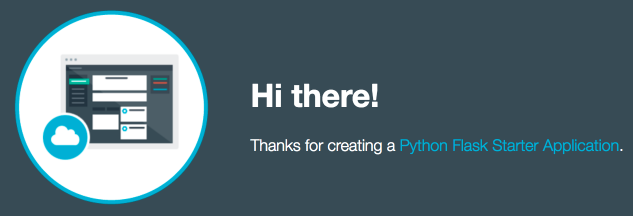

---

copyright:
  years: 2014, 2018
lastupdated: "2018-4-20"

---

{:new_window: target="_blank"}
{:shortdesc: .shortdesc}
{:screen: .screen}
{:pre: .pre}
{:table: .aria-labeledby="caption"}
{:codeblock: .codeblock}
{:tip: .tip}
{:download: .download}


# Guía de aprendizaje: Migración de una app desde Cloud Foundry a un clúster
{: #cf_tutorial}

Puede tomar una app que haya desplegado anteriormente utilizando Cloud Foundry y desplegar el mismo código en un contenedor a un clúster de Kubernetes en {{site.data.keyword.containershort_notm}}.
{: shortdesc}


## Objetivos

- Conocer el proceso general de desplegar apps en contenedores en un clúster de Kubernetes. 
- Crear un Dockerfile con el código de su app para crear una imagen de contenedor. 
- Desplegar un contenedor desde dicha imagen en un clúster de Kubernetes. 

## Tiempo necesario
30
minutos

## Público
Esta guía de aprendizaje está destinada a los desarrolladores de app de Cloud Foundry. 

## Requisitos previos

- [Cree un registro de imágenes privadas en {{site.data.keyword.registrylong_notm}}](../services/Registry/index.html).
- [Cree un clúster](cs_clusters.html#clusters_ui).
- [Establezca el clúster como el destino de su CLI](cs_cli_install.html#cs_cli_configure).
- [Obtenga más información sobre la terminología de Docker y Kubernetes](cs_tech.html).


<br />


## Lección 1: Descarga del código de la app 

Obtenga su código ya listo para ser utilizado. ¿Aún no tiene un código? Puede descargar el código de inicio para utilizarlo en esta guía de aprendizaje.
{: shortdesc}

1. Cree un directorio que se denomine `cf-py` y ubíquese en el mismo. En este directorio, guarde todos los archivos necesarios para crear la imagen Docker y para ejecutar su app. 

  ```
  mkdir cf-py && cd cf-py
  ```
  {: pre}

2. Copie el código de la app y todos los archivos relacionados en el directorio. Puede utilizar su propio código de app o descargar un modelo del catálogo. Esta guía de aprendizaje utiliza el modelo de Python Flask. Sin embargo, puede seguir los mismos pasos básicos con una app Node.js, Java o [Kitura](https://github.com/IBM-Cloud/Kitura-Starter). 

    Para descargar el código de app de Python Flask: 

    a. En el catálogo, en **Modelos**, pulse **Python Flask**. Este modelo incluye un entorno de ejecución Python 2 y Python 3 para las apps. 

    b. Especifique el nombre de la app `cf-py-<name>` y pulse **CREAR**. Para acceder al código de la app para el modelo, primero debe desplegar la app CF en la nube. Puede utilizar cualquier nombre para la app. Si utiliza el nombre del ejemplo, sustituya `<name>` con un identificador exclusivo como, por ejemplo, `cf-py-msx`. 
    
    **Atención**: No utilice información personal en las apps, las imágenes de contenedor o los nombres de recursos de Kubernetes. 

    Puesto que la app se despliega, se visualizan instrucciones para descargar, modificar y redesplegar su app con la interfaz de línea de mandatos. 

    c. En el paso 1 de la GUI, pulse **DESCARGAR CÓDIGO DE INICIADOR**.

    d. Extraiga el archivo .zip y guarde su contenido en su directorio `cf-py`. 

Su app estará lista para ser contenerizada. 


<br />


## Lección 2: Creación de una imagen de Docker con el código de su app

Cree un Dockerfile que incluya el código de la app y las configuraciones necesarias para el contenedor. A continuación, cree una imagen de Docker desde dicho Dockerfile y envíela por push a su registro privado de imágenes.
{: shortdesc}

1. En el directorio `cf-py` que ha creado en la lección anterior, cree un `Dockerfile`, que es la base para crear una imagen de contenedor. Puede crear el Dockerfile utilizando el editor de CLI que desee o un editor de texto del
sistema. El siguiente ejemplo muestra cómo crear un archivo Dockerfile con el editor nano. 

  ```
  nano Dockerfile
  ```
  {: pre}

2. Copie el script siguiente en el Dockerfile. Este Dockerfile se aplica específicamente a apps Python. Si está utilizando otro tipo de código, el Dockerfile debe incluir una imagen base diferente y podría ser necesario definir otros campos. 

  ```
  #Use the Python image from DockerHub as a base image
  FROM python:3-slim

  #Expose the port for your python app
  EXPOSE 5000

  #Copy all app files from the current directory into the app
  #directory in your container. Set the app directory
  #as the working directory
  WORKDIR /cf-py/
  COPY .  .

  #Install any requirements that are defined
  RUN pip install --no-cache-dir -r requirements.txt

  #Update the openssl package
  RUN apt-get update && apt-get install -y \
  openssl

  #Start the app.
  CMD ["python", "welcome.py"]
  ```
  {: codeblock}

3. Guarde los cambios en el editor nano pulsando `control + o`. Confirme los cambios pulsando `Intro`. Salga del editor nano mediante `ctrl + x`.

4. Cree una imagen de Docker que incluya el código de la app y envíela por push al registro privado.

  ```
  bx cr build -t registry.<region>.bluemix.net/namespace/cf-py .
  ```
  {: pre}

  <table>
  <thead>
  <th colspan=2> Descripción de los componentes de este mandato</th>
  </thead>
  <tbody>
  <tr>
  <td>Parámetro</td>
  <td>Descripción</td>
  </tr>
  <tr>
  <td><code> build</code></td>
  <td>El mandato build. </td>
  </tr>
  <tr>
  <td><code>-t registry.&lt;region&gt;.bluemix.net/namespace/cf-py</code></td>
  <td>La vía de acceso al registro privado, que incluye el nombre exclusivo del espacio de nombres y el nombre de la imagen. En este ejemplo, se utiliza el mismo nombre para la imagen que para el directorio de app, sin embargo, puede elegir cualquier nombre para la imagen en su registro privado. Si no está seguro de cuál es su espacio de nombres, ejecute el mandato `bx cr namespaces` para encontrarlo.
</td>
  </tr>
  <tr>
  <td><code>.</code></td>
  <td>La ubicación del Dockerfile. Si está ejecutando el mandato de compilación desde el directorio que incluye
el Dockerfile, escriba un punto (.). De lo contrario, utilice la vía de acceso relativa al Dockerfile. </td>
  </tr>
  </tbody>
  </table>

  La imagen se crea en el registro privado. Puede ejecutar el mandato `bx cr images` para verificar que se haya creado la imagen. 

  ```
  REPOSITORY                                     NAMESPACE   TAG      DIGEST         CREATED         SIZE     VULNERABILITY STATUS   
  registry.ng.bluemix.net/namespace/cf-py        namespace   latest   cb03170b2cb2   3 minutes ago   271 MB   OK
  ```
  {: screen}


<br />


## Lección 3: Despliegue de un contenedor desde la imagen

Despliegue su app como un contenedor en un clúster de Kubernetes.
{: shortdesc}

1. Cree un archivo YAML de configuración que se denomine `cf-py.yaml` y actualice `<registry_namespace>` con el nombre de su registro de imágenes privado. Este archivo de configuración define un despliegue de contenedores desde la imagen que ha creado en la lección anterior y un servicio para exponer la app al público. 

  ```
  apiVersion: extensions/v1beta1
  kind: Deployment
  metadata:
    labels:
      app: cf-py
    name: cf-py
    namespace: default
  spec:
    selector:
      matchLabels:
        app: cf-py
    replicas: 1
    template:
      metadata:
        labels:
          app: cf-py
      spec:
        containers:
        - image: registry.ng.bluemix.net/<registry_namespace>/cf-py:latest
          name: cf-py
  ---
  apiVersion: v1
  kind: Service
  metadata:
    name: cf-py-nodeport
    labels:
      app: cf-py
  spec:
    selector:
      app: cf-py
    type: NodePort
    ports:
     - port: 5000
       nodePort: 30872
  ```
  {: codeblock}

  <table>
  <thead>
  <th colspan=2> Visión general de los componentes del archivo YAML</th>
  </thead>
  <tbody>
  <tr>
  <td><code>image</code></td>
  <td>En `registry.ng.bluemix.net/<registry_namespace>/cf-py:latest`, sustituya &lt;registry_namespace&gt; con el espacio de nombres de su registro de imágenes privado. Si no está seguro de cuál es su espacio de nombres, ejecute el mandato `bx cr namespaces` para encontrarlo.
</td>
  </tr>
  <tr>
  <td><code>nodePort</code></td>
  <td>Expone la app creando un servicio de Kubernetes de tipo NodePort. Los valores de NodePort están en el rango 30000 - 32767. Utilizará este puerto para probar su app en un navegador más tarde. </td>
  </tr>
  </tbody></table>

2. Aplique el archivo de configuración para crear el despliegue y el servicio en el clúster. 

  ```
  kubectl apply -f filepath/cf-py.yaml
  ```
  {: pre}

  Salida:

  ```
  deployment "cf-py" configured
  service "cf-py-nodeport" configured
  ```
  {: screen}

3. Ahora que ya se ha realizado todo el trabajo de despliegue, puede probar la app en un navegador. Obtenga los detalles para formar el URL.

    a.  Obtenga la dirección IP pública del nodo trabajador en el clúster.

    ```
    bx cs workers <cluster_name>
    ```
    {: pre}

    Salida:

    ```
    ID                                                 Public IP        Private IP     Machine Type        State    Status   Zone    Version   
    kube-dal10-cr18e61e63c6e94b658596ca93d087eed9-w1   169.xx.xxx.xxx   10.xxx.xx.xxx   u2c.2x4.encrypted   normal   Ready    dal10   1.8.11
    ```
    {: screen}

    b. Abra un navegador y compruebe la app con el siguiente URL: `http://<public_IP_address>:<NodePort>`. Con los valores de ejemplo, el URL es `http://169.xx.xxx.xxx:30872`. Puede facilitar este URL a un compañero para que lo pruebe o lo puede escribir en el navegador de su móvil para comprobar que la app esté realmente disponible a nivel público. 

    

5. [Inicie el panel de control de Kubernetes](cs_app.html#cli_dashboard). Los pasos varían dependiendo de la versión de Kubernetes. 

6. En el separador **Cargas de trabajo**, verá los recursos que ha creado. Cuando termine de explorar el panel de control de Kubernetes, utilice `control + c` para salir del mandato `proxy`.

¡Enhorabuena! La app se despliega en un contenedor.

