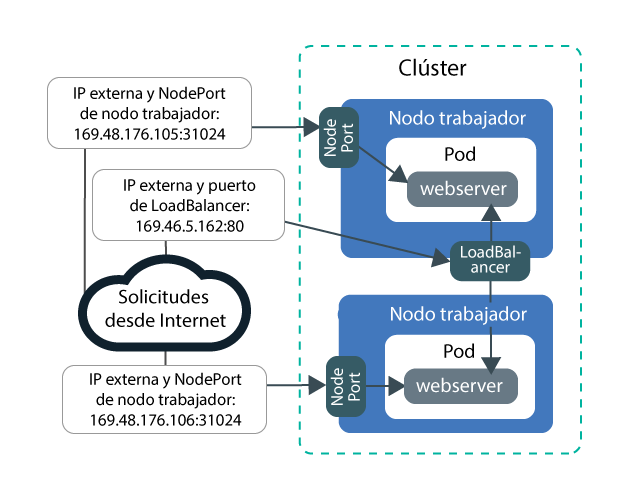
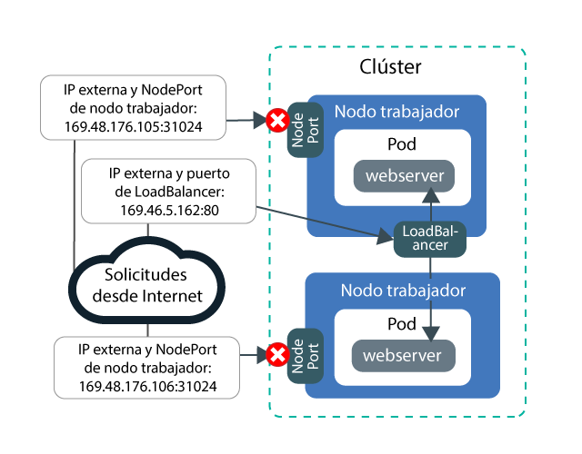
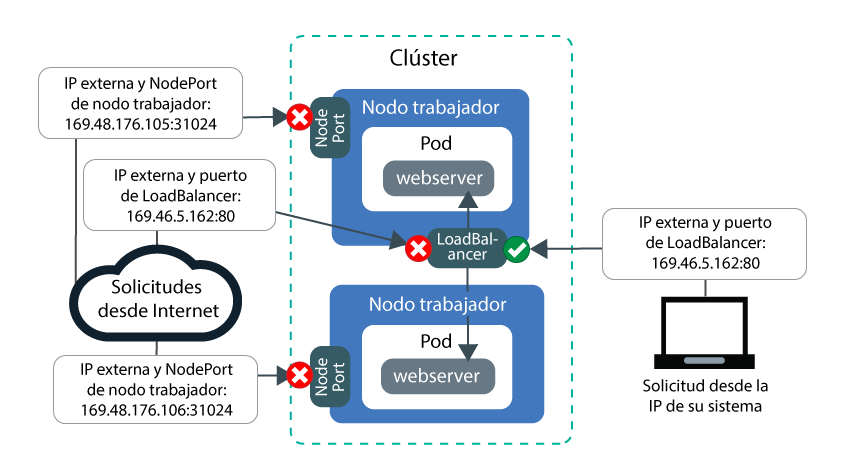
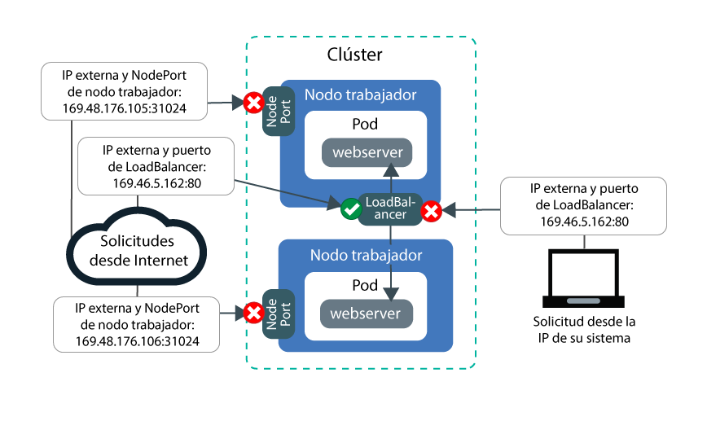

---

copyright:
  years: 2014, 2018
lastupdated: "2018-08-06"

---

{:new_window: target="_blank"}
{:shortdesc: .shortdesc}
{:screen: .screen}
{:pre: .pre}
{:table: .aria-labeledby="caption"}
{:codeblock: .codeblock}
{:tip: .tip}
{:download: .download}


# Guía de aprendizaje: Utilización de políticas de red de Calico para bloquear el tráfico
{: #policy_tutorial}

De forma predeterminada, los servicios Kubernetes NodePort, LoadBalancer e Ingress hacen que la app esté disponible en todas las interfaces de red de clúster públicas y privadas. La política predeterminada de Calico `allow-node-port-dnat` permite el tráfico de entrada procedente de NodePort, LoadBalancer e Ingress a las pods de la app que exponen dichos servicios. Kubernetes utiliza la conversión de direcciones de red de destino (DNAT) para reenviar las solicitudes de servicio a los pods adecuados.

Sin embargo, por motivos de seguridad, es posible que tenga que permitir el tráfico a los servicios de red solo desde determinadas direcciones IP de origen. Puede utilizar [políticas Pre-DNAT de Calico ](https://docs.projectcalico.org/v3.1/getting-started/bare-metal/policy/pre-dnat) para crear una lista blanca o una lista negra del tráfico procedente o destinado a determinadas direcciones IP. Las políticas Pre-DNAT impiden que el tráfico especificado llegue a sus apps porque se aplican antes de que Kubernetes utilice DNAT normal para reenviar el tráfico a los pods. Cuando se crean políticas Pre-DNAT de Calico, se elige si las direcciones IP de origen deben estar en la lista blanca o en la lista negra. Para la mayoría de los casos, la lista blanca proporciona la configuración más segura porque todo el tráfico se bloquea excepto el tráfico de las direcciones IP de origen conocidas y permitidas. La creación de una lista negra suele ser útil solo en ciertos casos como, por ejemplo, para evitar un ataque desde un pequeño conjunto de direcciones IP.

En este caso de ejemplo, el usuario adopta el rol de administrador de una empresa de relaciones públicas (PR) y observa un tráfico poco habitual que afecta a sus apps. Las lecciones de esta guía de aprendizaje le guían a través de la creación de una app de servidor web de ejemplo, la exposición la app mediante un servicio LoadBalancer y la protección de la app frente a un tráfico no deseado con políticas de Calico de lista blanca y de lista negra.

## Objetivos

- Aprender a bloquear todo el tráfico entrante a todos los NodePorts creando una política de Pre-DNAT de orden superior.
- Aprender a permitir el acceso de las direcciones IP de origen de lista blanca a la IP pública y al puerto de LoadBalancer creando una política Pre-DNAT de orden inferior. Las políticas de orden inferior tienen preferencia sobre las políticas de orden superior.
- Aprender a bloquear el acceso de las direcciones IP de origen de lista negra a la IP pública y al puerto de LoadBalancer creando una política Pre-DNAT de orden inferior.

## Tiempo necesario
1 hora

## Público
Esta guía de aprendizaje está destinada a los desarrolladores de software y administradores de la red que gestionan el tráfico de red a una app.

## Requisitos previos

- [Cree un clúster de la versión 1.10](cs_clusters.html#clusters_ui) o [actualice un clúster existente a la versión 1.10](cs_versions.html#cs_v110). Se necesita un clúster Kubernetes versión 1.10 o posterior para poder utilizar la CLI de Calico 3.1.1. o la sintaxis de la política de Calico v3 en esta guía de aprendizaje.
- [Defina su clúster como destino de la CLI](cs_cli_install.html#cs_cli_configure).
- [Instale y configure la CLI de Calico](cs_network_policy.html#1.10_install).

<br />


## Lección 1: Desplegar una aplicación y exponerla mediante un LoadBalancer
{: #lesson1}

En la primera lección se muestra cómo se expone la app desde varias direcciones IP y puertos y de dónde procede el tráfico público que entra en el clúster.
{: shortdesc}

Empiece desplegando una app de servidor web de ejemplo para utilizarla en la guía de aprendizaje. El servidor web `echoserver` muestra datos sobre la conexión que se establece con el clúster desde el cliente y le deja probar el acceso al clúster de la empresa PR. A continuación, exponga la app creando un servicio LoadBalancer. Un servicio LoadBalancer hace que la app esté disponible a través de la dirección IP del servicio LoadBalancer y de los NodePorts de los nodos trabajadores.

En la siguiente imagen se muestra cómo la app de servidor web estará expuesta a Internet por el NodePort público y el servicio LoadBalancer público al final de la Lección 1:



1. Cree un espacio de nombres de prueba denominado `pr-firm` para utilizarlo en esta guía de aprendizaje.
    ```
    kubectl create ns pr-firm
    ```
    {: pre}

2. Despliegue la app de servidor web de ejemplo. Cuando se establece una conexión con la app de servidor web, la app responde con las cabeceras HTTP que ha recibido en la conexión.
    ```
    kubectl run webserver -n pr-firm --image=k8s.gcr.io/echoserver:1.10 --replicas=3
    ```
    {: pre}

3. Verifique que los pods de la app de servidor web tienen en **STATUS** el valor `Running`.
    ```
    kubectl get pods -n pr-firm -o wide
    ```
    {: pre}

    Salida de ejemplo:
    ```
    NAME                         READY     STATUS    RESTARTS   AGE       IP               NODE
    webserver-855556f688-6dbsn   1/1       Running   0          1m        172.30.xxx.xxx   10.176.48.78
    webserver-855556f688-76rkp   1/1       Running   0          1m        172.30.xxx.xxx   10.176.48.78
    webserver-855556f688-xd849   1/1       Running   0          1m        172.30.xxx.xxx   10.176.48.78
    ```
    {: screen}

4. Para exponer la app a internet público, cree un archivo de configuración de servicio LoadBalancer denominado `webserver.yaml` en un editor de texto.
    ```
    apiVersion: v1
    kind: Service
    metadata:
      labels:
        run: webserver
      name: webserver-lb
      namespace: pr-firm
    spec:
      externalTrafficPolicy: Cluster
      ports:
      - name: webserver-port
        port: 80
        protocol: TCP
        targetPort: 8080
      selector:
        run: webserver
      type: LoadBalancer
    ```
    {: codeblock}

5. Despliegue el servicio LoadBalancer.
    ```
    kubectl apply -f filepath/webserver.yaml
    ```
    {: pre}

6. Verifique que puede acceder públicamente a la app expuesta por LoadBalancer desde el sistema.

    1. Obtenga la dirección **EXTERNAL-IP** pública de LoadBalancer.
        ```
        kubectl get svc -n pr-firm -o wide
        ```
        {: pre}

        Salida de ejemplo:
        ```
        NAME           CLUSTER-IP       EXTERNAL-IP        PORT(S)        AGE       SELECTOR
        webserver-lb   172.21.xxx.xxx   169.xx.xxx.xxx     80:31024/TCP   2m        run=webserver
        ```
        {: screen}

    2. Cree un archivo de texto de hoja de apuntes y copie la IP de LoadBalancer en el archivo de texto. La hoja de apuntes le ayudará a utilizar valores rápidamente en las lecciones siguientes.

    3. Verifique que puede acceder públicamente a la IP externa correspondiente a LoadBalancer.
        ```
        curl --connect-timeout 10 <loadbalancer_IP>:80
        ```
        {: pre}

        La información de salida del siguiente ejemplo confirma que LoadBalancer expone la app en la dirección IP pública de LoadBalancer `169.1.1.1`. El pod de la app `webserver-855556f688-76rkp` ha recibido la solicitud curl:
        ```
        Hostname: webserver-855556f688-76rkp
        Pod Information:
            -no pod information available-
        Server values:
            server_version=nginx: 1.13.3 - lua: 10008
        Request Information:
            client_address=1.1.1.1
            method=GET
            real path=/
            query=
            request_version=1.1
            request_scheme=http
            request_uri=http://169.1.1.1:8080/
        Request Headers:
            accept=*/*
            host=169.1.1.1
            user-agent=curl/7.54.0
        Request Body:
            -no body in request-
        ```
        {: screen}

6. Verifique que puede acceder públicamente a la app expuesta por NodePort desde el sistema. Un servicio LoadBalancer hace que la app esté disponible a través de la dirección IP del servicio LoadBalancer y de los NodePorts de los nodos trabajadores.

    1. Obtenga el NodePort que LoadBalancer ha asignado a los nodos trabajadores. El NodePort se encuentra en el rango comprendido entre 30000 y 32767.
        ```
        kubectl get svc -n pr-firm -o wide
        ```
        {: pre}

        En la siguiente información de salida de ejemplo, el NodePort es `31024`:
        ```
        NAME           CLUSTER-IP       EXTERNAL-IP        PORT(S)        AGE       SELECTOR
        webserver-lb   172.21.xxx.xxx   169.xx.xxx.xxx     80:31024/TCP   2m        run=webserver
        ```
        {: screen}  

    2. Obtenga la dirección **IP pública** de un nodo trabajador.
        ```
        ibmcloud ks workers <cluster_name>
        ```
        {: pre}

        Salida de ejemplo:
        ```
        ID                                                 Public IP        Private IP     Machine Type        State    Status   Zone    Version   
        kube-dal10-cr18e61e63c6e94b658596ca93d087eed9-w1   169.xx.xxx.xxx   10.176.48.67   u2c.2x4.encrypted   normal   Ready    dal10   1.10.5_1513*   
        kube-dal10-cr18e61e63c6e94b658596ca93d087eed9-w2   169.xx.xxx.xxx   10.176.48.79   u2c.2x4.encrypted   normal   Ready    dal10   1.10.5_1513*   
        kube-dal10-cr18e61e63c6e94b658596ca93d087eed9-w3   169.xx.xxx.xxx   10.176.48.78   u2c.2x4.encrypted   normal   Ready    dal10   1.10.5_1513*   
        ```
        {: screen}

    3. Copie la IP pública del nodo trabajador y el NodePort en la hoja de apuntes de texto para utilizarla en lecciones posteriores.

    4. Verifique que puede acceder a la dirección IP pública del nodo trabajador a través de NodePort.
        ```
        curl  --connect-timeout 10 <worker_IP>:<NodePort>
        ```
        {: pre}

        La información de salida de ejemplo siguiente confirma que la solicitud a la app se ha recibido a través de la dirección IP privada `10.1.1.1` para el nodo trabajador y el NodePort `31024`. El pod de la app `webserver-855556f688-xd849` ha recibido la solicitud curl:
        ```
        Hostname: webserver-855556f688-xd849
        Pod Information:
            -no pod information available-
        Server values:
            server_version=nginx: 1.13.3 - lua: 10008
        Request Information:
            client_address=1.1.1.1
            method=GET
            real path=/
            query=
            request_version=1.1
            request_scheme=http
            request_uri=http://10.1.1.1:8080/
        Request Headers:
            accept=*/*
            host=10.1.1.1:31024
            user-agent=curl/7.60.0
        Request Body:
            -no body in request-
        ```
        {: screen}

En este punto, la app está expuesta desde varias direcciones IP y puertos. La mayoría de estas direcciones IP son internas del clúster y solo se puede acceder a ellas a través de la red privada. Solo el puerto NodePort público y el puerto público de LoadBalancer están expuestos a Internet público.

A continuación, puede empezar a crear y aplicar políticas de Calico para bloquear el tráfico público.

## Lección 2: Bloquear todo el tráfico de entrada a todos los NodePorts
{: #lesson2}

Para proteger el clúster de la empresa PR, debe bloquear el acceso público tanto al servicio LoadBalancer como a los NodePorts que exponen la app. Empiece bloqueando el acceso a los NodePorts. En la imagen siguiente se muestra cómo se permitirá el tráfico a LoadBalancer pero no a los NodePorts al final de la Lección 2:



1. En un editor de texto, cree una política Pre-DNAT de orden superior denominada `deny-nodeports.yaml` para denegar el tráfico TCP y UDP entrante procedente de cualquier IP de origen a todos los NodePorts.
    ```
    apiVersion: projectcalico.org/v3
    kind: GlobalNetworkPolicy
    metadata:
      name: deny-nodeports
    spec:
      applyOnForward: true
      ingress:
      - action: Deny
            destination:
              ports:
          - 30000:32767
            protocol: TCP
            source: {}
      - action: Deny
            destination:
              ports:
          - 30000:32767
        protocol: UDP
        source: {}
      preDNAT: true
      selector: ibm.role=='worker_public'
      order: 1100
      types:
      - Ingress
    ```
    {: codeblock}

2. Aplique la política.
    - Linux:

      ```
      calicoctl apply -f filepath/deny-nodeports.yaml
      ```
      {: pre}

    - Windows y OS X:

      ```
      calicoctl apply -f filepath/deny-nodeports.yaml --config=filepath/calicoctl.cfg
      ```
      {: pre}
  Salida de ejemplo:
  ```
  Successfully applied 1 'GlobalNetworkPolicy' resource(s)
  ```
  {: screen}

3. Utilizando los valores de la hoja de apuntes, verifique que no puede acceder públicamente a la dirección IP pública y NodePort del nodo trabajador.
    ```
    curl  --connect-timeout 10 <worker_IP>:<NodePort>
    ```
    {: pre}

    La conexión excede el tiempo de espera porque la política de Calico que ha creado está bloqueando el tráfico a los NodePorts.
    ```
    curl: (28) Connection timed out after 10016 milliseconds
    ```
    {: screen}

4. Cambie el valor de externalTrafficPolicy de LoadBalancer que ha creado en la lección anterior, `Cluster`, por `Local`. `Local` garantiza que la IP de origen del sistema se conserva cuando se envíe curl a la IP externa de LoadBalancer en el paso siguiente.
    ```
    kubectl patch svc -n pr-firm webserver -p '{"spec":{"externalTrafficPolicy":"Local"}}'
    ```
    {: pre}

5. Utilizando el valor de la hoja de apuntes, verifique que aún puede acceder públicamente a la dirección IP externa de LoadBalancer.
    ```
    curl --connect-timeout 10 <loadbalancer_IP>:80
    ```
    {: pre}

    Salida de ejemplo:
    ```
    Hostname: webserver-855556f688-76rkp
    Pod Information:
        -no pod information available-
    Server values:
        server_version=nginx: 1.13.3 - lua: 10008
    Request Information:
        client_address=1.1.1.1
        method=GET
        real path=/
        query=
        request_version=1.1
        request_scheme=http
        request_uri=http://<loadbalancer_IP>:8080/
    Request Headers:
        accept=*/*
        host=<loadbalancer_IP>
        user-agent=curl/7.54.0
    Request Body:
        -no body in request-
    ```
    {: screen}
    En la sección `Request Information` de la información de salida, observe que la dirección IP de origen es, por ejemplo, `client_address=1.1.1.1`. La dirección IP de origen es la dirección IP pública del sistema que está utilizando para ejecutar curl. De lo contrario, si se está conectando a internet a través de un proxy o VPN, es posible que el proxy o VPN esté ocultando la dirección IP real del sistema. En cualquier caso, el servicio LoadBalancer ve la dirección IP de origen del sistema como la dirección IP del cliente.

6. Copie la dirección IP de origen del sistema (`client_address=1.1.1.1` en la información de salida del paso anterior) en la hoja de apuntes para utilizarla en lecciones posteriores.

¡Estupendo! En este punto, la app está expuesta a internet público solo desde el puerto público de LoadBalancer. El tráfico a los NodePorts públicos está bloqueado. Ha bloqueado parcialmente el clúster frente a tráfico no deseado.

A continuación, puede crear y aplicar políticas de Calico al tráfico de la lista blanca desde determinadas IP de origen.

## Lección 3: Permitir el tráfico de entrada desde una IP de la lista blanca en LoadBalancer
{: #lesson3}

Supongamos que ahora decide bloquear por completo el tráfico al clúster de la empresa PR y probar el acceso colocando en la lista blanca la dirección IP de su propio sistema.
{: shortdesc}

En primer lugar, además de los NodePorts, debe bloquear todo el tráfico entrante a LoadBalancer que expone la app. A continuación, puede crear una política que contenga la dirección IP de su sistema en la lista blanca. Al final de la Lección 3, todo el tráfico dirigido a los NodePorts públicos y a LoadBalancer se bloqueará y solo se permitirá el tráfico desde la IP del sistema de la lista blanca:


1. En un editor de texto, cree una política Pre-DNAT de orden superior denominada `deny-lb-port-80.yaml` para denegar todo el tráfico TCP y UDP entrante procedente de cualquier IP de origen a la dirección IP y puerto de LoadBalancer. Sustituya `<loadbalancer_IP>` por la dirección IP pública de LoadBalancer de la hoja de apuntes.
    ```
    apiVersion: projectcalico.org/v3
    kind: GlobalNetworkPolicy
    metadata:
      name: deny-lb-port-80
    spec:
      applyOnForward: true
      ingress:
      - action: Deny
        destination:
          nets:
          - <loadbalancer_IP>/32
          ports:
          - 80
        protocol: TCP
        source: {}
      - action: Deny
        destination:
          nets:
          - <loadbalancer_IP>/32
          ports:
          - 80
        protocol: UDP
        source: {}
      preDNAT: true
      selector: ibm.role=='worker_public'
      order: 1100
      types:
      - Ingress
    ```
    {: codeblock}

2. Aplique la política.
    - Linux:

      ```
      calicoctl apply -f filepath/deny-lb-port-80.yaml
      ```
      {: pre}

    - Windows y OS X:

      ```
      calicoctl apply -f filepath/deny-lb-port-80.yaml --config=filepath/calicoctl.cfg
      ```
      {: pre}

3. Utilizando el valor de la hoja de apuntes, verifique que ahora no puede acceder a la dirección IP pública de LoadBalancer. La conexión excede el tiempo de espera porque la política de Calico que ha creado está bloqueando el tráfico destinado a LoadBalancer.
    ```
    curl --connect-timeout 10 <loadbalancer_IP>:80
    ```
    {: pre}

4. En un editor de texto, cree una política de Pre-DNAT de orden inferior denominada `whitelist.yaml` para permitir el tráfico desde la IP del sistema a la dirección IP y puerto de LoadBalancer. Utilizando los valores de la hoja de apuntes, sustituya `<loadbalancer_IP>` por la dirección IP pública de LoadBalancer y `<client_address>` por la dirección IP pública de la IP de origen de su sistema.
    ```
    apiVersion: projectcalico.org/v3
    kind: GlobalNetworkPolicy
    metadata:
      name: whitelist
    spec:
      applyOnForward: true
      ingress:
      - action: Allow
        destination:
          nets:
          - <loadbalancer_IP>/32
          ports:
          - 80
        protocol: TCP
        source:
          nets:
          - <client_address>/32
      preDNAT: true
      selector: ibm.role=='worker_public'
      order: 500
      types:
      - Ingress
    ```
    {: codeblock}

5. Aplique la política.
    - Linux:

      ```
      calicoctl apply -f filepath/whitelist.yaml
      ```
      {: pre}

    - Windows y OS X:

      ```
      calicoctl apply -f filepath/whitelist.yaml --config=filepath/calicoctl.cfg
      ```
      {: pre}
  Ahora la dirección IP de su sistema está en la lista blanca.

6. Utilizando el valor de la hoja de apuntes, verifique que ahora puede acceder a la dirección IP pública de LoadBalancer.
    ```
    curl --connect-timeout 10 <loadbalancer_IP>:80
    ```
    {: pre}

7. Si tiene acceso a otro sistema que tenga otra dirección IP, intente acceder a LoadBalancer desde dicho sistema.
    ```
    curl --connect-timeout 10 <loadbalancer_IP>:80
    ```
    {: pre}
    La conexión excede el tiempo de espera porque la dirección IP del sistema no está en la lista blanca.

En este punto, todo el tráfico dirigido a LoadBalancer y los NodePorts públicos está bloqueado. Solo se permite el tráfico procedente de la IP del sistema de la lista blanca.

## Lección 4: Denegar el tráfico de entrada a LoadBalancer procedente de las IP de la lista negra
{: #lesson4}

En la lección anterior, ha bloqueado todo el tráfico y solo ha colocado en la lista blanca unas pocas IP. Este caso de ejemplo funciona bien para fines de prueba cuando se desea limitar el acceso a unas pocas direcciones IP de origen controladas. Sin embargo, la empresa PR tiene apps que tienen que estar ampliamente disponibles para el público. Debe asegurarse de que se permita todo el tráfico, excepto el tráfico inusual que ve desde unas pocas direcciones IP. La creación de una lista negra resulta útil en un escenario como este, porque puede ayudarle a evitar un ataque desde un pequeño conjunto de direcciones IP.

En esta lección, probará la creación de una lista negra que bloquee el tráfico procedente de la dirección IP de origen de su propio sistema. Al final de la Lección 4, todo el tráfico dirigido a los NodePorts públicos quedará bloqueado, y se permitirá todo el tráfico dirigido a LoadBalancer público. Solo se bloqueará el tráfico procedente de la IP del sistema en la lista negra a LoadBalancer:


1. Limpie las políticas de la lista blanca que ha creado en la lección anterior.
    ```
    calicoctl delete GlobalNetworkPolicy deny-lb-port-80
    ```
    {: pre}
    ```
    calicoctl delete GlobalNetworkPolicy whitelist
    ```
    {: pre}
    Ahora, todo el tráfico TCP y UDP entrante procedente cualquier IP de origen a la dirección IP y puerto de LoadBalancer vuelve a estar permitido.

2. Para denegar todo el tráfico TCP y UDP de entrada procedente de la dirección IP de origen de su sistema a la dirección IP y puerto de LoadBalancer, cree una política Pre-DNAT de orden inferior denominada `deny-lb-port-80.yaml` en un editor de texto. Utilizando los valores de la hoja de apuntes, sustituya `<loadbalancer_IP>` por la dirección IP pública de LoadBalancer y `<client_address>` por la dirección IP pública de la IP de origen de su sistema.
    ```
    apiVersion: projectcalico.org/v3
    kind: GlobalNetworkPolicy
    metadata:
      name: blacklist
    spec:
      applyOnForward: true
      ingress:
      - action: Deny
        destination:
          nets:
          - <loadbalancer_IP>/32
          ports:
          - 80
        protocol: TCP
        source:
          nets:
          - <client_address>/32
      - action: Deny
        destination:
          nets:
          - <loadbalancer_IP>/32
          ports:
          - 80
        protocol: UDP
        source:
          nets:
          - <client_address>/32
      preDNAT: true
      selector: ibm.role=='worker_public'
      order: 500
      types:
      - Ingress
    ```
    {: codeblock}

3. Aplique la política.
    - Linux:

      ```
      calicoctl apply -f filepath/blacklist.yaml
      ```
      {: pre}

    - Windows y OS X:

      ```
      calicoctl apply -f filepath/blacklist.yaml --config=filepath/calicoctl.cfg
      ```
      {: pre}
  Ahora la dirección IP de su sistema está en la lista negra.

4. Utilizando el valor de la hoja de apuntes, verifique desde su sistema que no puede acceder a la dirección IP de LoadBalancer porque la IP de su sistema está en la lista negra.
    ```
    curl --connect-timeout 10 <loadbalancer_IP>:80
    ```
    {: pre}
    En este punto, todo el tráfico dirigido a los NodePorts públicos está bloqueado y se permite todo el tráfico dirigido a LoadBalancer público. Solo se bloquea el tráfico procedente de la IP del sistema en la lista negra a LoadBalancer.

5. Para limpiar esta política de lista negra:
    ```
    calicoctl delete GlobalNetworkPolicy blacklist
    ```
    {: pre}

¡Buen trabajo! Ha controlado correctamente el tráfico de entrada en la app utilizando las políticas Pre-DNAT de Calico para crear listas blancas y listas negras de direcciones IP de origen.

## ¿Qué es lo siguiente?
{: #whats_next}

* Obtenga más información sobre [ cómo controlar el tráfico con políticas de red](cs_network_policy.html).
* Para ver más ejemplos de políticas de red de Calico que controlan el tráfico procedente y destinado a su clúster, puede consultar la [demostración de política inicial ](https://docs.projectcalico.org/v3.1/getting-started/kubernetes/tutorials/stars-policy/) y la [política de red avanzada ](https://docs.projectcalico.org/v3.1/getting-started/kubernetes/tutorials/advanced-policy).
