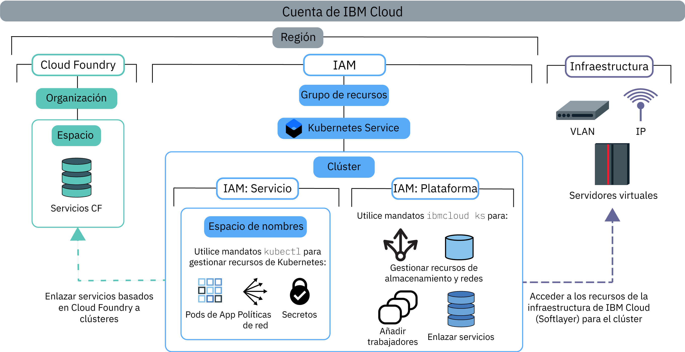

---

copyright:
  years: 2014, 2019
lastupdated: "2019-06-12"

keywords: kubernetes, iks

subcollection: containers

---

{:new_window: target="blank"}
{:shortdesc: .shortdesc}
{:screen: .screen}
{:pre: .pre}
{:table: .aria-labeledby="caption"}
{:codeblock: .codeblock}
{:tip: .tip}
{:note: .note}
{:important: .important}
{:deprecated: .deprecated}
{:download: .download}
{:preview: .preview}


# Asignación de acceso al clúster
{: #users}

Como administrador del clúster, puede definir políticas de acceso para el clúster de {{site.data.keyword.containerlong}} para crear distintos niveles de acceso para distintos usuarios. Por ejemplo, puede autorizar a determinados usuarios a trabajar con recursos de la infraestructura del clúster y a otros solo a desplegar contenedores.
{: shortdesc}

A partir del 30 de enero de 2019, {{site.data.keyword.containerlong_notm}} tiene una nueva forma de autorizar a los usuarios con {{site.data.keyword.Bluemix_notm}} IAM: [roles de acceso al servicio](/docs/containers?topic=containers-access_reference#service). Estos roles de servicio se utilizan para otorgar acceso a recursos dentro del clúster como, por ejemplo, espacios de nombres de Kubernetes. Para obtener más información, consulte el blog de [Introducción de roles de servicio y de espacios de nombres en IAM para obtener un control más granular del acceso de clúster ](https://www.ibm.com/blogs/bluemix/2019/02/introducing-service-roles-and-namespaces-in-iam-for-more-granular-control-of-cluster-access/).
{: note}

## Visión general de las políticas y los roles de acceso
{: #access_policies}

Las políticas de acceso determinan el nivel de acceso que tienen los usuarios de la cuenta {{site.data.keyword.Bluemix_notm}} a los recursos de la plataforma {{site.data.keyword.Bluemix_notm}}. Una política asigna a un usuario uno o varios roles que definen el ámbito de acceso a un solo servicio o a un conjunto de servicios y recursos organizados conjuntamente en un grupo de recursos. Es posible que cada servicio de {{site.data.keyword.Bluemix_notm}} necesite su propio conjunto de políticas de acceso.
{: shortdesc}

Cuando desarrolle el plan para gestionar el acceso de los usuarios, tenga en cuenta los pasos generales siguientes:
1.  [Elegir la política de acceso y el rol correctos para los usuarios](#access_roles)
2.  [Asignar roles de acceso a individuos o a grupos de usuarios en {{site.data.keyword.Bluemix_notm}} IAM](#iam_individuals_groups)
3.  [Limitación del acceso de los usuarios a instancias del clúster, espacios de nombres de Kubernetes o grupos de recursos](#resource_groups)

Cuando comprenda cómo se pueden gestionar los roles, los usuarios y los recursos de la cuenta, consulte [Configuración del acceso a su clúster](#access-checklist) para ver una lista de comprobación de cómo configurar el acceso.

### Elegir la política de acceso y el rol correctos para los usuarios
{: #access_roles}

Debe definir políticas de acceso para cada usuario que trabaje con {{site.data.keyword.containerlong_notm}}. El ámbito de una política de acceso se basa en uno o varios roles definidos para los usuarios, que determinan las acciones que estos pueden realizar. Algunas políticas son predefinidas, pero otras se pueden personalizar. La misma política se aplica independientemente de si el usuario realiza una solicitud desde la consola de {{site.data.keyword.containerlong_notm}} o mediante la CLI, incluso cuando las acciones se completan en la infraestructura de IBM Cloud (SoftLayer).
{: shortdesc}

En la siguiente imagen se muestran los distintos tipos de permisos y roles, qué rol puede realizar cada acción y cómo se relacionan los roles entre sí.



Para ver los permisos de {{site.data.keyword.containerlong_notm}} específicos de cada rol, consulte el tema de referencia [Permisos de acceso de usuario](/docs/containers?topic=containers-access_reference).
{: tip}

<dl>
<dt><a href="#platform">Roles de plataforma de {{site.data.keyword.Bluemix_notm}} IAM y de servicio</a></dt>
<dd>{{site.data.keyword.containerlong_notm}} utiliza roles de {{site.data.keyword.Bluemix_notm}} Identity and Access Management (IAM) y de servicio para otorgar a los usuarios acceso al clúster.
<ul><li>**Plataforma**: los roles de plataforma determinan las acciones que los usuarios pueden llevar a cabo en la infraestructura del clúster mediante la API de {{site.data.keyword.containerlong_notm}}, la consola y la CLI (`ibmcloud ks`). Los roles de plataforma no otorgan acceso a la API de Kubernetes. Puede establecer las políticas para estos roles por grupo de recursos, región o instancia de clúster. Aunque los roles de plataforma le autorizan a realizar acciones de la infraestructura en el clúster, no otorgan acceso a los recursos de la infraestructura IBM Cloud (SoftLayer). El acceso a los recursos de la infraestructura de IBM Cloud (SoftLayer) viene determinado por la [clave de API que se ha establecido para la región](#api_key). Algunas acciones de ejemplo que están permitidas por los roles de plataforma son crear o eliminar clústeres, enlazar servicios a un clúster, gestionar recursos de red y de almacenamiento o añadir nodos trabajadores adicionales.<br><br>Si solo asigna roles de plataforma a los usuarios, no pueden interactuar con los recursos de Kubernetes dentro del clúster. No obstante, pueden ejecutar el [mandato](/docs/containers?topic=containers-cli-plugin-kubernetes-service-cli#cs_cluster_config) `ibmcloud ks cluster-config`. Luego puede autorizar a los usuarios a realizar determinadas acciones de Kubernetes mediante el uso de [políticas de RBAC personalizadas](/docs/containers?topic=containers-users#role-binding). Puede hacerlo si su organización utiliza actualmente políticas de RBAC personalizadas para controlar el acceso de Kubernetes y tiene intención de seguir utilizando políticas de RBAC personalizadas en lugar de roles de servicio.</li>
<li>**Servicio**: los roles de servicio otorgan políticas de RBAC de Kubernetes correspondientes que se proporcionan a un usuario dentro de un clúster. Como tales, los roles de servicio otorgan acceso a la API de Kubernetes, el panel de control y a la CLI (`kubectl`). Puede limitar la política a roles de servicio por grupo de recursos, por región o por instancia del clúster. También puede limitar los roles de servicio a espacios de nombres de Kubernetes que estén en todos los clústeres, en clústeres individuales o en los clústeres de una región. Si limita un rol de servicio a un espacio de nombres, no puede aplicar la política a un grupo de recursos o asignar un rol de plataforma a la vez. Otros ejemplos de acciones permitidas por roles de servicio son la creación de despliegues de apps, la adición de espacios de nombres o la configuración de mapas de configuración.<br><br>Si solo asigna roles de servicio a los usuarios, no pueden ver ni interactuar con ningún recurso de {{site.data.keyword.containerlong_notm}}. Para que los usuarios accedan al clúster y utilicen los recursos de Kubernetes del clúster, debe dar a los usuarios el nombre de clúster y el ID para que puedan ejecutar el [mandato](/docs/containers?topic=containers-cli-plugin-kubernetes-service-cli#cs_cluster_config) `ibmcloud ks cluster-config` y, a continuación, [iniciar el panel de control de Kubernetes desde la CLI](/docs/containers?topic=containers-app#db_cli). Si desea que estos usuarios puedan acceder a la consola de clústeres de {{site.data.keyword.containerlong_notm}} y obtener una lista de clústeres y de otros recursos de infraestructura desde la CLI, asigne a los usuarios el rol de **Visor** de plataforma.</li></ul></dd>
<dt><a href="#role-binding">RBAC</a></dt>
<dd>En Kubernetes, el control de acceso basado en rol (RBAC) es una forma de proteger los recursos dentro de su clúster. Los roles RBAC determinan las acciones de Kubernetes que los usuarios pueden llevar a cabo en dichos recursos. A cada usuario que tenga asignado un rol de servicio se le asigna automáticamente un rol de clúster de RBAC correspondiente. Este rol de clúster de RBAC se aplica en un espacio de nombres específico o en todos los espacios de nombres, en función de si limita la política a un espacio de nombres.</br></br>
Algunas acciones de ejemplo que están permitidas por los roles RBAC son crear objetos, como pods, o leer registros de pod.</dd>
<dt><a href="#api_key">Infraestructura</a></dt>
<dd>Los roles de infraestructura permiten el acceso a los recursos de la infraestructura de IBM Cloud (SoftLayer). Configure un usuario con el rol de infraestructura **Superusuario** y almacene las credenciales de infraestructura de este usuario en una clave de API. A continuación, establezca la clave de API en cada región en la que desee crear clústeres. Después de configurar la clave de API, otros usuarios a los que otorgue acceso a {{site.data.keyword.containerlong_notm}} no necesitarán roles de infraestructura, ya que la clave de API se comparte entre todos los usuarios de la región. En su lugar, los roles de plataforma de {{site.data.keyword.Bluemix_notm}} IAM determinan las acciones de infraestructura que los usuarios pueden llevar a cabo. Si no configura la clave de API con la infraestructura completa de <strong>Superusuario</strong> o tiene que otorgar acceso a un dispositivo específico a los usuarios, puede [personalizar los permisos de infraestructura](#infra_access). </br></br>
Algunas acciones de ejemplo permitidas por los roles de infraestructura son ver los detalles de las máquinas de los nodos trabajadores del clúster o editar recursos de red y de almacenamiento.</dd>
<dt>Cloud Foundry</dt>
<dd>No todos los servicios se pueden gestionar con {{site.data.keyword.Bluemix_notm}} IAM. Si está utilizando uno de estos servicios, puede continuar utilizando los roles de usuario de Cloud Foundry para controlar el acceso a estos servicios. Los roles de Cloud Foundry otorgan acceso a las organizaciones y espacios dentro de la cuenta. Para ver la lista de servicios basados en Cloud Foundry de {{site.data.keyword.Bluemix_notm}}, ejecute <code>ibmcloud service list</code>.</br></br>
Algunas acciones de ejemplo que están permitidas por los roles de Cloud Foundry son crear una nueva instancia de servicio Cloud Foundry o enlazar una instancia de servicio de Cloud Foundry a un clúster. Para obtener más información, consulte los [roles de espacio y organización](/docs/iam?topic=iam-cfaccess) disponibles o los pasos para [gestionar el acceso a Cloud Foundry](/docs/iam?topic=iam-mngcf) en la documentación de {{site.data.keyword.Bluemix_notm}} IAM.</dd>
</dl>

### Asignar roles de acceso a individuos o a grupos de usuarios en {{site.data.keyword.Bluemix_notm}} IAM
{: #iam_individuals_groups}

Cuando establezca políticas de {{site.data.keyword.Bluemix_notm}} IAM, puede asignar roles a un usuario individual o a un grupo de usuarios.
{: shortdesc}

<dl>
<dt>Usuarios individuales</dt>
<dd>Es posible que un usuario específico necesite más o menos permisos que el resto de su equipo. Puede personalizar los permisos de forma individual de forma que cada persona tenga los permisos que necesita para realizar sus tareas. Puede asignar más de un rol de {{site.data.keyword.Bluemix_notm}} IAM a cada usuario.</dd>
<dt>Varios usuarios de un grupo de acceso</dt>
<dd>Puede crear un grupo de usuarios y luego asignar permisos a dicho grupo. Por ejemplo, puede agrupar a todos los jefes de equipo y asignar acceso de administrador al grupo. A continuación, puede agrupar todos los desarrolladores y asignar solo acceso de escritura a dicho grupo. Puede asignar más de un rol de {{site.data.keyword.Bluemix_notm}} IAM a cada grupo de acceso. Cuando asigne permisos a un grupo, cualquier usuario que se añada o se elimine de dicho grupo se verá afectado. Si añade un usuario al grupo, también recibe el acceso adicional. Si se elimina, su acceso se revoca.</dd>
</dl>

Los roles de {{site.data.keyword.Bluemix_notm}} IAM no se pueden asignar a una cuenta de servicio. En lugar de ello, puede [asignar roles RBAC a las cuentas de servicio](#rbac) directamente.
{: tip}

También debe especificar si los usuarios tienen acceso a un clúster de un grupo de recursos, a todos los clústeres de un grupo de recursos o a todos los clústeres de todos los grupos de recursos de la cuenta.

### Limitación del acceso de los usuarios a instancias del clúster, espacios de nombres o grupos de recursos
{: #resource_groups}

En {{site.data.keyword.Bluemix_notm}} IAM, puede asignar roles de acceso de usuario a instancias de recursos, a espacios de nombres de Kubernetes o a grupos de recursos.
{: shortdesc}

Cuando crea su cuenta de {{site.data.keyword.Bluemix_notm}}, se crea automáticamente un grupo de recursos predeterminado. Si no especifica un grupo de recursos al crear el recurso, las instancias de recursos (clústeres) pertenecen al grupo de recursos predeterminado. En {{site.data.keyword.Bluemix_notm}} IAM, un espacio de nombres de Kubernetes es un tipo de recurso de una instancia de recurso (clúster). Si desea añadir un grupo de recursos a su cuenta, consulte [Prácticas recomendadas para configurar su cuenta](/docs/account?topic=account-account_setup) y [Configuración de grupos de recursos](/docs/resources?topic=resources-bp_resourcegroups#setuprgs).

<dl>
<dt>Instancia de recurso</dt>
  <dd><p>Cada servicio de {{site.data.keyword.Bluemix_notm}} de la cuenta es un recurso que tiene instancias. La instancia difiere por servicio. Por ejemplo, en {{site.data.keyword.containerlong_notm}}, la instancia es un clúster, pero en {{site.data.keyword.cloudcerts_long_notm}}, la instancia es un certificado. De forma predeterminada, los recursos también pertenecen al grupo de recursos predeterminado de la cuenta. Puede asignar a los usuarios un rol de acceso a una instancia del recurso en los siguientes casos.
  <ul><li>Todos los servicios de {{site.data.keyword.Bluemix_notm}} IAM de su cuenta, incluidos todos los clústeres de {{site.data.keyword.containerlong_notm}} y las imágenes de {{site.data.keyword.registrylong_notm}}.</li>
  <li>Todas las instancias de un servicio, como por ejemplo todos los clústeres de {{site.data.keyword.containerlong_notm}}.</li>
  <li>Todas las instancias de una región de un servicio, como por ejemplo todos los clústeres de la región **EE. UU. sur** de {{site.data.keyword.containerlong_notm}}.</li>
  <li>Una instancia individual, como por ejemplo un clúster.</li></ul></dd>
<dt>Espacio de nombres de Kubernetes</dt>
  <dd><p>Como parte de las instancias de recursos de clúster de {{site.data.keyword.Bluemix_notm}} IAM, puede asignar a los usuarios roles de acceso al servicio a espacios de nombres de Kubernetes de los clústeres.</p>
  <p>Si asigna acceso a un espacio de nombres, la política se aplica a todas las instancias actuales y futuras del espacio de nombres en todos los clústeres que autorice. Por ejemplo, supongamos que desea que el grupo de usuarios `dev` pueda desplegar recursos de Kubernetes en el espacio de nombres `test` en todos los clústeres de AP norte. Si asigna al grupo de acceso `dev` el rol de acceso al servicio de **Escritor** sobre el espacio de nombres de Kubernetes test en todos los clústeres de la región AP norte dentro del grupo de recursos `default`, el grupo `dev` podrá acceder al espacio de nombres `test` en cualquier clúster de AP norte del grupo de recursos `default` que actualmente tenga o pueda tener un espacio de nombres test.</p>
  <p class="important">Si limita un rol de servicio a un espacio de nombres, no puede aplicar la política a un grupo de recursos o asignar un rol de plataforma a la vez.</p></dd>
<dt>Grupo de recursos</dt>
  <dd><p>Puede organizar los recursos de su cuenta en agrupaciones personalizables de forma que pueda asignar rápidamente el acceso de usuarios individuales o grupos de usuarios a más de un recurso a la vez. Los grupos de recursos pueden ayudar a los operadores y administradores a filtrar los recursos para ver su uso actual, resolver problemas y gestionar equipos.</p>
  <p class="important">Un clúster solo se puede crear en un grupo de recursos que no se puede cambiar después. Si crea un clúster en el grupo de recursos incorrecto, debe suprimir el clúster y volver a crearlo en el grupo de recursos correcto. Además, si necesita utilizar el [mandato](/docs/containers-cli-plugin?topic=containers-cli-plugin-kubernetes-service-cli#cs_cluster_service_bind) `ibmcloud ks cluster-service-bind` para [integrar con un servicio de {{site.data.keyword.Bluemix_notm}}](/docs/containers?topic=containers-service-binding#bind-services), este servicio debe estar en el mismo grupo de recursos que el clúster. Los servicios que no utilizan grupos de recursos, como {{site.data.keyword.registrylong_notm}}, o que no necesitan enlaces a servicios, como {{site.data.keyword.la_full_notm}}, funcionan aunque el clúster se encuentre en otro grupo de recursos distinto.</p>
  <p>Si tiene previsto utilizar [{{site.data.keyword.monitoringlong_notm}} para métricas](/docs/containers?topic=containers-health#view_metrics), considere la posibilidad de asignar nombres exclusivos a los clústeres de los grupos de recursos y a las regiones de la cuenta para evitar conflictos de nombres de métricas. No se puede cambiar el nombre de un clúster.</p>
  <p>Puede asignar a los usuarios un rol de acceso a un grupo de recursos en los siguientes casos. Tenga en cuenta que, a diferencia de las instancias de recursos, no puede otorgar acceso a una instancia individual dentro de un grupo de recursos.</p>
  <ul><li>Todos los servicios de {{site.data.keyword.Bluemix_notm}} IAM del grupo de recursos, incluidos todos los clústeres de {{site.data.keyword.containerlong_notm}} y las imágenes de {{site.data.keyword.registrylong_notm}}.</li>
  <li>Todas las instancias de un servicio del grupo de recursos, como por ejemplo todos los clústeres de {{site.data.keyword.containerlong_notm}}.</li>
  <li>Todas las instancias de una región de un servicio del grupo de recursos, como por ejemplo todos los clústeres de la región **EE. UU. sur** de {{site.data.keyword.containerlong_notm}}.</li></ul></dd>
</dl>

<br />


## Configuración del acceso al clúster
{: #access-checklist}

Después de [comprender cómo se gestionan los roles, los usuarios y los recursos de la cuenta](#access_policies), utilice la siguiente lista de comprobación para configurar el acceso de los usuarios en el clúster.
{: shortdesc}

<p class="tip">No asigne los roles de plataforma de {{site.data.keyword.Bluemix_notm}} IAM al mismo tiempo que un rol de servicio. Los roles de plataforma y de servicio se deben asignar por separado.</p>

1. [Establezca la clave de API](#api_key) para todas las regiones y grupos de recursos en los que desea crear clústeres.
2. Invite a los usuarios a su cuenta y [asígneles roles de {{site.data.keyword.Bluemix_notm}} IAM](#platform) para {{site.data.keyword.containerlong_notm}}. 
3. Para permitir a los usuarios enlazar servicios con el clúster o ver los registros que se reenvían desde las configuraciones de registro del clúster, [otorgue a los usuarios roles de Cloud Foundry](/docs/iam?topic=iam-mngcf) para la organización y el espacio en los que se despliegan los servicios o donde se recopilan los registros.
4. Si utiliza espacios de nombres de Kubernetes para aislar recursos dentro del clúster, otorgue acceso a los espacios de nombres [asignando a los usuarios roles de servicio de {{site.data.keyword.Bluemix_notm}} IAM sobre los espacios de nombres](#platform).
5. Para cualquier herramienta de automatización, como por ejemplo en la interconexión CI/CD, configure las cuentas de servicio y [asigne a las cuentas de servicio permisos RBAC de Kubernetes](#rbac).
6. Para otras configuraciones avanzadas para controlar el acceso a los recursos de clúster en el nivel de pod, consulte [Configuración de la seguridad de pod](/docs/containers?topic=containers-psp).

</br>

Para obtener más información sobre cómo configurar la cuenta y los recursos, consulte esta guía de aprendizaje acerca de las [prácticas recomendadas para organizar usuarios, equipos y aplicaciones](/docs/tutorials?topic=solution-tutorials-users-teams-applications).
{: tip}

<br />


## Configuración de la clave de API para habilitar el acceso al portafolio de infraestructura
{: #api_key}

Para suministrar correctamente clústeres y trabajar con ellos, debe asegurarse de que la cuenta de {{site.data.keyword.Bluemix_notm}} esté correctamente configurada para acceder al portafolio de infraestructura de IBM Cloud (SoftLayer) en cada grupo de recursos y región en los que se encuentren los clústeres.
{: shortdesc}

**En la mayoría de los casos**: su cuenta de tipo pago según uso de {{site.data.keyword.Bluemix_notm}} ya tiene acceso al portafolio de infraestructura de IBM Cloud (SoftLayer). Para configurar el acceso de {{site.data.keyword.containerlong_notm}} al portafolio, el **propietario de la cuenta** debe establecer la clave de API para la región y el grupo de recursos.

1. Inicie la sesión en el terminal como propietario de la cuenta.
    ```
    ibmcloud login [--sso]
    ```
    {: pre}

2. Elija como destino el grupo de recursos en el que desea establecer la clave de API. Si no elige como destino un grupo de recursos, la clave de API se establece para el grupo de recursos predeterminado. Para ver una lista de los grupos de recursos, ejecute `ibmcloud resource groups`.
    ```
    ibmcloud target -g <resource_group_name>
    ```
    {:pre}

3. Establezca la clave de API para la región y el grupo de recursos.
    ```
    ibmcloud ks api-key-reset --region <region>
    ```
    {: pre}    

4. Compruebe que la clave de API está establecida.
    ```
    ibmcloud ks api-key-info --cluster <cluster_name_or_ID>
    ```
    {: pre}

5. Repita el proceso para cada región y grupo de recursos en los que desea crear clústeres.

**Opciones alternativas y más información**: para ver distintas formas de acceder al portafolio de infraestructura de IBM Cloud (SoftLayer), consulte las secciones siguientes.
* Si no está seguro de si su cuenta ya tiene acceso al portafolio de infraestructura de IBM Cloud (SoftLayer), consulte [Visión general de acceso al portafolio de infraestructura de IBM Cloud (SoftLayer)](#understand_infra).
* Si el propietario de la cuenta no establece la clave de API, [asegúrese de que el usuario que establece la clave de API tenga los permisos correctos](#owner_permissions).
* Para obtener más información sobre cómo utilizar la cuenta predeterminada para establecer la clave de API, consulte [Acceso al portafolio de infraestructura con la cuenta de pago según uso de {{site.data.keyword.Bluemix_notm}} predeterminada](#default_account).
* Si no tiene una cuenta de pago según uso predeterminada o necesita utilizar otra cuenta de infraestructura de IBM Cloud (SoftLayer), consulte [Acceso a otra cuenta de IBM Cloud (SoftLayer)](#credentials).

### Visión general del acceso al portafolio de infraestructura de IBM Cloud (SoftLayer)
{: #understand_infra}

Determine si la cuenta tiene acceso al portafolio de infraestructura de IBM Cloud (SoftLayer) y vea cómo {{site.data.keyword.containerlong_notm}} utiliza la clave de API para acceder al portafolio.
{: shortdesc}

**¿Mi cuenta ya tiene acceso al portafolio de infraestructura de IBM Cloud (SoftLayer)?**</br>

Para acceder al portafolio de infraestructura de IBM Cloud (SoftLayer), se utiliza una cuenta de pago según uso de {{site.data.keyword.Bluemix_notm}}. Si tiene otro tipo de cuenta, consulte las opciones en la tabla siguiente.

<table summary="En la tabla se muestran las opciones de creación de clúster estándar por tipo de cuenta. Las filas se leen de izquierda a derecha; la descripción de la cuenta está en la columna uno y las opciones para crear un clúster estándar en la columna dos.">
<caption>Opciones de creación de clúster estándar por tipo de cuenta</caption>
  <thead>
  <th>Descripción de la cuenta</th>
  <th>Opciones para crear un clúster estándar</th>
  </thead>
  <tbody>
    <tr>
      <td>Las **cuentas Lite** no pueden suministrar clústeres.</td>
      <td>[Actualizar su cuenta Lite a una cuenta de pago según uso de {{site.data.keyword.Bluemix_notm}}](/docs/account?topic=account-accounts#paygo).</td>
    </tr>
    <tr>
      <td>Las cuentas de **pago según uso** se suministran con acceso al portafolio de infraestructura.</td>
      <td>Puede crear clústeres estándares. Utilice una clave de API para configurar los permisos de la infraestructura para los clústeres.</td>
    </tr>
    <tr>
      <td>Las **cuentas de suscripción** no se configuran con acceso al portafolio de infraestructura de IBM Cloud (SoftLayer).</td>
      <td><p><strong>Opción 1: </strong> [Crear una nueva cuenta de Pago según uso](/docs/account?topic=account-accounts#paygo) que esté configurada para acceder al portafolio de infraestructura de IBM Cloud (SoftLayer). Cuando elige esta opción, tendrá dos cuentas y dos facturaciones distintas para {{site.data.keyword.Bluemix_notm}}.</p><p>Si desea continuar utilizando su cuenta de Suscripción, debe utilizar su nueva cuenta de Pago según uso para generar una clave de API en la infraestructura de IBM Cloud (SoftLayer). Debe configurar la clave de la API de la infraestructura de IBM Cloud (SoftLayer) de forma manual para su cuenta de Suscripción. Tenga en cuenta que los recursos de infraestructura de IBM Cloud (SoftLayer) se facturarán a través de su nueva cuenta de Pago según uso.</p><p><strong>Opción 2:</strong> si ya tiene una cuenta de infraestructura de IBM Cloud (SoftLayer) existente que desea utilizar, puede configurar sus credenciales de forma manual para su cuenta de {{site.data.keyword.Bluemix_notm}}.</p><p class="note">Cuando enlaza de forma manual a una cuenta de infraestructura de IBM Cloud (SoftLayer), las credenciales se utilizan para cada acción específica de la infraestructura de IBM Cloud (SoftLayer) en su cuenta de {{site.data.keyword.Bluemix_notm}}. Debe asegurarse de que la clave de API que ha establecido tiene [suficientes permisos de infraestructura](/docs/containers?topic=containers-users#infra_access) para que los usuarios pueden crear y trabajar con clústeres.</p></td>
    </tr>
    <tr>
      <td>**Cuentas de infraestructura de IBM Cloud (SoftLayer)**, no cuenta de {{site.data.keyword.Bluemix_notm}}</td>
      <td><p>[Crear una cuenta de pago según uso de {{site.data.keyword.Bluemix_notm}}](/docs/account?topic=account-accounts#paygo). Tiene dos cuentas y facturaciones separadas de infraestructura de IBM Cloud (SoftLayer).</p><p>De forma predeterminada, la nueva cuenta de {{site.data.keyword.Bluemix_notm}} utiliza la nueva cuenta de infraestructura. Para seguir utilizando la cuenta de infraestructura antigua, defina manualmente las credenciales.</p></td>
    </tr>
  </tbody>
  </table>

**Ahora que mi portafolio de infraestructura está configurado, ¿cómo accede {{site.data.keyword.containerlong_notm}} al portafolio?**</br>

{{site.data.keyword.containerlong_notm}} accede al portafolio de infraestructura de IBM Cloud (SoftLayer) utilizando una clave de API. La clave de API almacena las credenciales de un usuario con acceso a una cuenta de infraestructura de IBM Cloud (SoftLayer). Las claves de API se establecen por región dentro de un grupo de recursos y se comparten entre los usuarios de dicha región.
 
Para permitir que todos los usuarios puedan acceder al portafolio de infraestructura de IBM Cloud (SoftLayer), el usuario cuyas credenciales están almacenadas en la clave de API debe tener [el rol de infraestructura **Superusuario** y el rol de plataforma **Administrador** para {{site.data.keyword.containerlong_notm}} y para {{site.data.keyword.registryshort_notm}}](#owner_permissions) en su cuenta de {{site.data.keyword.Bluemix_notm}}. A continuación, deje que el usuario realice la primera acción de administración en una región y grupo de recursos. Las credenciales de infraestructura del usuario se almacenan en una clave de API para dicha región y grupo de recursos.

Otros usuarios de la cuenta comparten la clave de API para acceder a la infraestructura. Cuando los usuarios inician sesión en la cuenta de {{site.data.keyword.Bluemix_notm}}, se genera una señal {{site.data.keyword.Bluemix_notm}} IAM que se basa en la clave de API para la sesión de CLI y permite que se ejecuten mandatos relacionados con la infraestructura en un clúster.

Para ver la señal {{site.data.keyword.Bluemix_notm}} IAM para una sesión de CLI, puede ejecutar `ibmcloud iam oauth-tokens`. Las señales de {{site.data.keyword.Bluemix_notm}} IAM también se pueden utilizar para [realizar llamadas directamente a la API de {{site.data.keyword.containerlong_notm}}](/docs/containers?topic=containers-cs_cli_install#cs_api).
{: tip}

**Si los usuarios tienen acceso al portafolio a través de una señal de {{site.data.keyword.Bluemix_notm}} IAM, ¿cómo limito qué mandatos puede ejecutar un usuario?**

Tras configurar el acceso al portafolio para los usuarios de su cuenta, puede controlar las acciones de la infraestructura que pueden llevar a cabo los usuarios asignando el [rol de plataforma](#platform) adecuado. Al asignar roles de {{site.data.keyword.Bluemix_notm}} IAM a los usuarios, se establecen límites en cuanto a los mandatos que pueden ejecutar en un clúster. Por ejemplo, debido a que el propietario de la clave de API tiene el rol de infraestructura **Superusuario**, todos los mandatos relacionados con la infraestructura se pueden ejecutar en un clúster. Sin embargo, en función del rol de {{site.data.keyword.Bluemix_notm}} IAM que se haya asignado a un usuario, el usuario podrá ejecutar solo algunos de esos mandatos relacionados con la infraestructura.

Por ejemplo, si desea crear un clúster en una región nueva, asegúrese de que el primer clúster lo crea un usuario con el rol de **Superusuario** de la infraestructura, como por ejemplo el propietario de la cuenta. Después, puede invitar a usuarios individuales o a usuarios de grupos de acceso de {{site.data.keyword.Bluemix_notm}} IAM a dicha región estableciendo las políticas de gestión de la plataforma para ellos en dicha región. Un usuario con un rol de plataforma **Visor** no tiene autorización para añadir un nodo trabajador. Por lo tanto, la acción `worker-add` falla, aunque la clave de API tenga los permisos de infraestructura correctos. Si cambia el rol de plataforma del usuario por **Operador**, el usuario tendrá autorización para añadir un nodo trabajador. La acción `worker-add` se ejecuta correctamente porque el usuario está autorizado y la clave de API se ha establecido correctamente. No es necesario que edite los permisos de infraestructura de IBM Cloud (SoftLayer) del usuario.

Para auditar las acciones que ejecutan los usuarios de la cuenta, puede utilizar [{{site.data.keyword.cloudaccesstrailshort}}](/docs/containers?topic=containers-at_events) para ver todos los sucesos relacionados con el clúster.
{: tip}

**¿Qué sucede si no quiero asignar al propietario de la clave de API o al propietario de las credenciales al rol de Superusuario de la infraestructura?**</br>

Por razones de conformidad, seguridad o facturación, es posible que no desee otorgar el rol de **Superusuario** de la infraestructura al usuario que establece la clave de API o cuyas credenciales se han establecido con el mandato `ibmcloud ks credential-set`. Sin embargo, si este usuario no tiene el rol de **Superusuario**, las acciones relacionadas con la infraestructura, como la creación de un clúster o la recarga de un nodo trabajador, pueden fallar. En lugar de utilizar roles de plataforma de {{site.data.keyword.Bluemix_notm}} IAM para controlar el acceso de los usuarios a la infraestructura, debe [establecer permisos específicos de la infraestructura de IBM Cloud (SoftLayer)](#infra_access) para los usuarios.

**¿Qué ocurre si el usuario que ha establecido la clave de API para una región y grupo de recursos deja la empresa?**

Si el usuario va a dejar su organización, el propietario de la cuenta de {{site.data.keyword.Bluemix_notm}} puede eliminar los permisos de dicho usuario. No obstante, antes de eliminar los permisos de acceso específicos de un usuario o eliminar un usuario de la cuenta completamente, debe restablecer la clave de API con las credenciales de infraestructura de otro usuario. De lo contrario, los demás usuarios de la cuenta podrían perder el acceso al portal de infraestructura de IBM Cloud (SoftLayer) y los mandatos relacionados con la infraestructura podrían fallar. Para obtener más información, consulte [Eliminación de permisos de usuario](#removing).

**¿Cómo puedo bloquear mi clúster si mi clave de API se ve comprometida?**

Si una clave de API establecida para una región y grupo de recursos del clúster se ve comprometida, [suprímala](/docs/iam?topic=iam-userapikey#delete_user_key) para que no se realicen más llamadas utilizando la clave de API como autenticación. Para obtener más información sobre cómo proteger el acceso al servidor de API de Kubernetes, consulte el tema de seguridad [Servidor de API Kubernetes y etcd](/docs/containers?topic=containers-security#apiserver).

**¿Cómo configuro la clave de API para mi clúster?**</br>

Depende del tipo de cuenta que esté utilizando para acceder al portafolio de infraestructura IBM Cloud (SoftLayer):
* [Una cuenta predeterminada de {{site.data.keyword.Bluemix_notm}} de pago según uso](#default_account)
* [Una cuenta distinta de infraestructura de IBM Cloud (SoftLayer) que no está enlazada a la cuenta predeterminada de {{site.data.keyword.Bluemix_notm}} de pago según uso](#credentials)

### Cómo asegurarse de que el propietario de la clave de API o de las credenciales de la infraestructura tiene los permisos correctos
{: #owner_permissions}

Para asegurarse de que todas las acciones relacionadas con la infraestructura se pueden completar satisfactoriamente en el clúster, el usuario cuyas credenciales desea establecer para la clave de API debe tener los permisos adecuados.
{: shortdesc}

1. Inicie una sesión en la [consola de {{site.data.keyword.Bluemix_notm}} ](https://cloud.ibm.com/).

2. Para asegurarse de que todas las acciones relacionadas con la cuenta se pueden realizar satisfactoriamente, verifique que el usuario tenga los roles de plataforma correctos de {{site.data.keyword.Bluemix_notm}} IAM.
    1. En la barra de menús, seleccione **Gestionar > Acceso (IAM)** y, a continuación, pulse la página **Usuarios**.
    2. Pulse el nombre del usuario para el que desea establecer la clave de API o cuyas credenciales desea establecer para la clave de API y luego pulse el separador **Políticas de acceso**.
    3. Si el usuario no tiene el rol de plataforma **Administrador** para todos los clústeres de {{site.data.keyword.containerlong_notm}} de todas las regiones, [asigne ese rol de plataforma al usuario](#platform).
    4. Si el usuario no tiene como mínimo el rol de plataforma **Visor** para el grupo de recursos donde desea establecer la clave de API, [asigne ese rol de grupo de recursos al usuario](#platform).
    5. Para crear clústeres, el usuario también necesita el rol de plataforma **Administrador** para {{site.data.keyword.registrylong_notm}} a nivel de cuenta. No limite las políticas para {{site.data.keyword.registryshort_notm}} a nivel de grupo de recursos.

3. Para asegurarse de que todas las acciones relacionadas con la infraestructura del clúster se pueden realizar satisfactoriamente, verifique que el usuario tenga las políticas correctas de acceso de la infraestructura.
    1.  En la barra de menús, seleccione **Gestionar > Acceso (IAM)**.
    2.  Seleccione el separador **Usuarios** y pulse en el usuario.
    3. En el panel **Claves de API**, verifique que el usuario tiene una **clave de API de la infraestructura clásica** o bien pulse **Crear una clave de API de IBM Cloud**. Para obtener más información, consulte [Gestión de claves de API de la infraestructura clásica](/docs/iam?topic=iam-classic_keys#classic_keys).
    4. Pulse el separador **Infraestructura clásica** y, a continuación, pulse el separador **Permisos**.
    5. Si el usuario no tiene una marca de comprobación en cada categoría, puede utilizar la lista desplegable **Conjuntos de permisos** para asignar el rol de **Superusuario**. O bien puede ampliar cada categoría y asignar al usuario los [permisos de infraestructura](/docs/containers?topic=containers-access_reference#infra) necesarios.

### Acceso al portafolio de infraestructura con la cuenta predeterminada de {{site.data.keyword.Bluemix_notm}} de pago según uso
{: #default_account}

Si tiene una cuenta de pago según uso de {{site.data.keyword.Bluemix_notm}}, tiene acceso al portafolio enlazado de una infraestructura de IBM Cloud (SoftLayer) de forma predeterminada. La clave de API se utiliza para solicitar recursos de infraestructura de esta infraestructura de IBM Cloud (SoftLayer) como, por ejemplo, nuevos nodos trabajadores o VLAN.
{: shortdec}

Puede encontrar el propietario de la clave de API actual ejecutando [`ibmcloud ks api-key-info --cluster <cluster>`](/docs/containers?topic=containers-cli-plugin-kubernetes-service-cli#cs_api_key_info). Si tiene que actualizar la clave de API almacenada para una región, puede hacerlo con el mandato [`ibmcloud ks api-key-reset --region <region>`](/docs/containers?topic=containers-cli-plugin-kubernetes-service-cli#cs_api_key_reset). Este mandato requiere la política de acceso de administrador de {{site.data.keyword.containerlong_notm}} y almacena la clave de API del usuario que ejecuta este mandato en la cuenta.

Asegúrese de que desea restablecer la clave y de que comprende el impacto en la app. La clave se utiliza en varios lugares y puede provocar cambios de última hora si se modifica innecesariamente.
{: note}

**Antes de empezar**:
- Si el propietario de la cuenta no establece la clave de API, [asegúrese de que el usuario que establece la clave de API tenga los permisos correctos](#owner_permissions).
- [Inicie una sesión en su cuenta. Si procede, apunte al grupo de recursos adecuado. Establezca el contexto para el clúster.](/docs/containers?topic=containers-cs_cli_install#cs_cli_configure)

Para establecer la clave de API para acceder al portafolio de infraestructura de IBM Cloud (SoftLayer):

1.  Establezca la clave de API para la región y el grupo de recursos donde se encuentra el clúster.
    1.  Inicie sesión en el terminal con el usuario cuyos permisos de infraestructura desea utilizar.
    2.  Elija como destino el grupo de recursos en el que desea establecer la clave de API. Si no elige como destino un grupo de recursos, la clave de API se establece para el grupo de recursos predeterminado.
        ```
        ibmcloud target -g <resource_group_name>
        ```
        {:pre}
    4.  Establezca la clave de API del usuario para la región.
        ```
        ibmcloud ks api-key-reset --region <region>
        ```
        {: pre}    
    5.  Compruebe que la clave de API está establecida.
        ```
        ibmcloud ks api-key-info --cluster <cluster_name_or_ID>
        ```
        {: pre}

2. [Cree un clúster](/docs/containers?topic=containers-clusters). Para crear el clúster, se utilizan las credenciales de clave de API que ha establecido para la región y el grupo de recursos.

### Acceso a otra cuenta de infraestructura de IBM Cloud (SoftLayer)
{: #credentials}

En lugar de utilizar la cuenta enlazada predeterminada de infraestructura de IBM Cloud (SoftLayer) para solicitar la infraestructura para clústeres dentro de una región, es posible que desee otra cuenta de infraestructura de IBM Cloud (SoftLayer) que ya tenga. Puede enlazar esta cuenta de infraestructura a la cuenta de {{site.data.keyword.Bluemix_notm}} mediante el mandato [`ibmcloud ks credential-set`](/docs/containers?topic=containers-cli-plugin-kubernetes-service-cli#cs_credentials_set). Se utilizan las credenciales de la infraestructura de IBM Cloud (SoftLayer) en lugar de las credenciales de la cuenta de pago según uso predeterminada almacenadas para la región.
{: shortdesc}

Las credenciales de la infraestructura de IBM Cloud (SoftLayer) establecidas mediante el mandato `ibmcloud ks credential-set` permanecen después de que finalice la sesión. Si elimina credenciales de infraestructura de IBM Cloud (SoftLayer) definidos manualmente con el mandato [`ibmcloud ks credential-unset --region <region>`](/docs/containers?topic=containers-cli-plugin-kubernetes-service-cli#cs_credentials_unset), se utilizan las credenciales predeterminadas de la cuenta de pago según uso. Sin embargo, este cambio en las credenciales de la cuenta de infraestructura puede provocar [clústeres huérfanos](/docs/containers?topic=containers-cs_troubleshoot_clusters#orphaned).
{: important}

**Antes de empezar**:
- Si no está utilizando las credenciales del propietario de la cuenta, [asegúrese de que el usuario cuyas credenciales desea establecer para la clave de API tenga los permisos correctos](#owner_permissions).
- [Inicie una sesión en su cuenta. Si procede, apunte al grupo de recursos adecuado. Establezca el contexto para el clúster.](/docs/containers?topic=containers-cs_cli_install#cs_cli_configure)

Para establecer las credenciales de la cuenta de infraestructura para acceder al portafolio de infraestructura de IBM Cloud (SoftLayer):

1. Obtenga la cuenta de infraestructura que desea utilizar para acceder al portafolio de infraestructura de IBM Cloud (SoftLayer). Tiene diversas opciones que dependen del [tipo de cuenta actual](#understand_infra).

2.  Establezca las credenciales de API de la infraestructura con el usuario correspondiente a la cuenta correcta.

    1.  Obtenga las credenciales de API de la infraestructura del usuario. Tenga en cuenta que las credenciales difieren del IBMid.

        1.  En la [consola de {{site.data.keyword.Bluemix_notm}} ](https://cloud.ibm.com/), seleccione la tabla **Gestionar** > **Acceso (IAM)** > **Usuarios** y pulse el nombre de usuario.

        2.  En la sección **Claves de API**, busque o cree una clave de API de la infraestructura clásica.   

    2.  Defina las credenciales de API de la infraestructura que desea utilizar.
        ```
        ibmcloud ks credential-set --infrastructure-username <infrastructure_API_username> --infrastructure-api-key <infrastructure_API_authentication_key> --region <region>
        ```
        {: pre}

    3. Verifique que se han establecido las credenciales correctas.
        ```
        ibmcloud ks credential-get --region <region>
        ```
        Salida de ejemplo:
        ```
        Infrastructure credentials for user name user@email.com set for resource group default.
        ```
        {: screen}

3. [Cree un clúster](/docs/containers?topic=containers-clusters). Para crear el clúster, se utilizan las credenciales de la infraestructura que ha establecido para la región y el grupo de recursos.

4. Verifique que el clúster utiliza las credenciales de la cuenta de infraestructura que ha establecido.
  1. Abra la [consola de {{site.data.keyword.containerlong_notm}} ](https://cloud.ibm.com/kubernetes/clusters) y seleccione el clúster. 
  2. En el separador Visión general, busque el campo **Usuario de infraestructura**. 
  3. Si ve este campo, no utilizará las credenciales de infraestructura predeterminadas que vienen con su cuenta de Pago según uso en esta región. En su lugar, la región se establece para utilizar unas credenciales de cuenta de infraestructura distintas de las que ha establecido.

<br />


## Cómo otorgar a los usuarios acceso al clúster a través de {{site.data.keyword.Bluemix_notm}} IAM
{: #platform}

Establezca políticas de gestión de la plataforma {{site.data.keyword.Bluemix_notm}} IAM y políticas de acceso a servicio en la [consola de {{site.data.keyword.Bluemix_notm}}](#add_users) o en la [CLI](#add_users_cli) para que los usuarios puedan trabajar con clústeres en {{site.data.keyword.containerlong_notm}}. Antes de empezar, consulte [Visión general de las políticas y los roles de acceso](#access_policies) para revisar lo que son las políticas, a quién puede asignar políticas y a qué recursos se puede otorgar políticas.
{: shortdesc}

Los roles de {{site.data.keyword.Bluemix_notm}} IAM no se pueden asignar a una cuenta de servicio. En lugar de ello, puede [asignar roles RBAC a las cuentas de servicio](#rbac) directamente.
{: tip}

### Asignación de roles de {{site.data.keyword.Bluemix_notm}} IAM con la consola
{: #add_users}

Otorgue a los usuarios acceso a sus clústeres asignando roles de gestión de la plataforma de {{site.data.keyword.Bluemix_notm}} IAM y de acceso al servicio con la consola de {{site.data.keyword.Bluemix_notm}}.
{: shortdesc}

<p class="tip">No asigne los roles de plataforma al mismo tiempo que un rol de servicio. Los roles de plataforma y de servicio se deben asignar por separado.</p>

Antes de empezar, verifique que tiene asignado el rol de plataforma **Administrador** para la cuenta de {{site.data.keyword.Bluemix_notm}} en la que está trabajando.

1. Inicie una sesión en la [consola de {{site.data.keyword.Bluemix_notm}} ](https://cloud.ibm.com/). En la barra de menús, seleccione **Gestionar > Acceso (IAM)**.

2. Seleccione los usuarios individualmente o cree un grupo de acceso de usuarios.
    * **Para asignar roles a un usuario individual**:
      1. En el panel de navegación de la izquierda, pulse la página **Usuarios** y, a continuación, pulse el nombre del usuario para el que desea establecer los permisos. Si el usuario no se muestra, pulse **Invitar a usuarios** para añadirlo a la cuenta.
      2. Pulse el separador **Políticas de acceso** y, a continuación, pulse **Asignar acceso**.
    * **Para asignar roles a varios usuarios de un grupo de acceso**:
      1. En el panel de navegación de la izquierda, pulse la página **Grupos de acceso**.
      2. Pulse **Crear** y asigne al grupo un **Nombre** y una **Descripción**. Pulse **Crear**.
      3. Pulse **Añadir usuarios** para añadir personas a su grupo de acceso. Se muestra una lista de los usuarios que tienen acceso a su cuenta.
      4. Seleccione el recuadro que hay junto a los usuarios que desea añadir al grupo. Aparece un recuadro de diálogo.
      5. Pulse **Añadir a grupo**.
      6. Pulse el separador **Políticas de acceso**.
      7. Pulse **Asignar acceso**.

3. Asigne una política, ya sea para grupos de recursos o para instancias de recursos. Si desea limitar la política a un espacio de nombres, debe asignar la política a instancias de recursos (no a grupos de recursos).
  * **Para grupos de recursos**:
    1. Pulse **Asignar acceso dentro de un grupo de recursos**.
    2. Seleccione el nombre del grupo de recursos.
    3. En la lista desplegable **Asignar acceso a un grupo de recursos**, elija el nivel de permiso que desea asignar al usuario sobre propio grupo de recursos (no sobre los recursos del grupo). Por ejemplo, para permitir que los usuarios vean clústeres a los que tienen acceso en varios grupos de recursos, asígneles el rol de **Visor** sobre cada grupo de recursos.
    4. En la lista **Servicios**, seleccione
**{{site.data.keyword.containershort_notm}}**.
    5. En la lista **Región**, seleccione una región o todas ellas.
    6. Seleccione un rol para la política.
       * **Rol de acceso de plataforma**: Otorga acceso a {{site.data.keyword.containerlong_notm}} de modo que los usuarios puedan gestionar recursos de la infraestructura, como clústeres, nodos trabajadores, agrupaciones de trabajadores, equilibradores de carga de aplicación de Ingress y almacenamiento. Para ver una lista de las acciones admitidas por rol, consulte la [página de referencia de roles de plataforma](/docs/containers?topic=containers-access_reference#iam_platform).
       * **Rol de acceso al servicio**: otorga acceso a Kubernetes como acceso desde dentro de un clúster para que los usuarios puedan gestionar los recursos de Kubernetes, como pods, despliegues, servicios y espacios de nombres. Para ver una lista de las acciones admitidas por rol, consulte la [página de referencia de roles de servicio](/docs/containers?topic=containers-access_reference#service).<p class="note">No puede limitar un rol de acceso al servicio a un espacio de nombres si asigna el rol a nivel de grupo de recursos. Asigne en su lugar acceso a una instancia del recurso. Tampoco asigne un rol de plataforma al mismo tiempo que un rol de servicio.</p>
    7. Pulse **Asignar**.
    8. **Opcional**: si solo ha asignado un rol de servicio a los usuarios, debe darles el nombre y el ID del clúster para que puedan ejecutar el [mandato](/docs/containers?topic=containers-cli-plugin-kubernetes-service-cli#cs_cluster_config) `ibmcloud ks cluster-config` y luego [iniciar el panel de control de Kubernetes desde la CLI](/docs/containers?topic=containers-app#db_cli) o interactuar de otra manera con la API de Kubernetes. Si desea que estos usuarios puedan acceder a la consola de clústeres de {{site.data.keyword.containerlong_notm}} y obtener una lista de clústeres y de otros recursos de infraestructura desde la CLI, repita estos pasos para asignar a los usuarios el rol de **Visor** de plataforma.
  * **Para instancias de recursos dentro o entre grupos de recursos**:
    1. Pulse **Asignar acceso a recursos**.
    2. En la lista **Servicios**, seleccione
**{{site.data.keyword.containershort_notm}}**.
    3. En la lista **Región**, seleccione una región o todas ellas.
    4. En la lista **Clúster**, seleccione una instancia de clúster o todas ellas.
    5. En el campo **Espacio de nombres**, especifique el nombre del espacio de nombres de Kubernetes al que desea limitar la política de _acceso a servicio_. Tenga en cuenta que no puede limitar una política de _acceso a plataforma_ a un espacio de nombres. La política otorga acceso a espacios de nombres en todos los clústeres que ha seleccionado anteriormente, como por ejemplo todos los clústeres de una región. Si desea otorgar acceso a todos los espacios de nombres, puede dejar el campo de espacio de nombres en blanco.
    6. Seleccione un rol para la política.
       *  **Rol de acceso de plataforma**: Otorga acceso a {{site.data.keyword.containerlong_notm}} de modo que los usuarios puedan gestionar recursos de la infraestructura, como clústeres, nodos trabajadores, agrupaciones de trabajadores, equilibradores de carga de aplicación de Ingress y almacenamiento. Para ver una lista de las acciones admitidas por rol, consulte la [página de referencia de roles de plataforma](/docs/containers?topic=containers-access_reference#iam_platform).
          * Si asigna a un usuario el rol de plataforma **Administrador** solo para un clúster, también debe asignar al usuario el rol de plataforma **Visor** para todos los clústeres de dicha región en el grupo de recursos.
          * Si ha limitado la política a un espacio de nombres, no puede asignar también un rol de plataforma a la vez. Si también desea que el usuario tenga un rol de plataforma, repita estos pasos, pero deje el campo del espacio de nombres en blanco y asigne solo un rol de plataforma (no vuelva a asignar un rol de acceso al servicio).
       * **Rol de acceso al servicio**: otorga acceso a Kubernetes como acceso desde dentro de un clúster para que los usuarios puedan gestionar los recursos de Kubernetes, como pods, despliegues, servicios y espacios de nombres. Para ver una lista de las acciones admitidas por rol, consulte la [página de referencia de roles de servicio](/docs/containers?topic=containers-access_reference#service).
    7. Pulse **Asignar**.
    8. **Opcional**: si ha asignado solo roles de servicio a usuarios, debe dar a los usuarios el nombre de clúster y el ID para que puedan ejecutar el [mandato](/docs/containers?topic=containers-cli-plugin-kubernetes-service-cli#cs_cluster_config) `ibmcloud ks cluster-config` y, a continuación, [iniciar el panel de control de Kubernetes desde la CLI](/docs/containers?topic=containers-app#db_cli) o interactuar con la API de Kubernetes. Si desea que estos usuarios puedan acceder a la consola de clústeres de {{site.data.keyword.containerlong_notm}} y obtener una lista de clústeres y de otros recursos de infraestructura desde la CLI, repita estos pasos para asignar a los usuarios el rol de **Visor** de plataforma.

4.  Opcional: si desea que los usuarios puedan trabajar con clústeres en un grupo de recursos que no sea el predeterminado, estos usuarios necesitan acceso adicional a los grupos de recursos en los que se encuentran los clústeres. Puede asignar a estos usuarios el rol de plataforma **Visor** para los grupos de recursos si no lo ha hecho anteriormente.
    1.  Pulse **Asignar acceso dentro de un grupo de recursos**.
    2.  Seleccione el nombre del grupo de recursos.
    3.  En la lista **Asignar acceso a un grupo de recursos**, seleccione el rol **Visor**. Este rol permite a los usuarios acceder al propio grupo de recursos, pero no a los recursos que hay dentro del grupo.
    4.  Pulse **Asignar**.

5.  Para que se añada el usuario, los permisos de RBAC se deben sincronizar con el clúster. El usuario al que se otorga acceso debe [iniciar el panel de control de Kubernetes](/docs/containers?topic=containers-app#db_gui) para iniciar la sincronización. Los permisos RBAC se almacenan en memoria caché, de modo que la sincronización puede no ser instantánea.

### Asignación de roles de {{site.data.keyword.Bluemix_notm}} IAM con la CLI
{: #add_users_cli}

Otorgue a los usuarios acceso a sus clústeres asignando roles de gestión de la plataforma de {{site.data.keyword.Bluemix_notm}} IAM y de acceso al servicio con la CLI.
{: shortdesc}

**Antes de empezar**:

- Verifique que tiene asignado el rol de plataforma `cluster-admin` de {{site.data.keyword.Bluemix_notm}} IAM para la cuenta de {{site.data.keyword.Bluemix_notm}} en la que está trabajando.
- Verifique que el usuario se ha añadido a la cuenta. Si no es así, invite al usuario a su cuenta ejecutando `ibmcloud account user-invite <user@email.com>`.
- [Inicie una sesión en su cuenta. Si procede, apunte al grupo de recursos adecuado. Establezca el contexto para el clúster.](/docs/containers?topic=containers-cs_cli_install#cs_cli_configure)
- Decida si desea asignar los roles de [plataforma o de acceso de servicio](/docs/containers?topic=containers-users#access_policies). Los pasos de la CLI varían según el rol de acceso que desee asignar:
  * [Asignar roles de plataforma desde la CLI](#add_users_cli_platform)
  * [Asignar roles de servicio desde la CLI](#add_users_cli_service)

**Para asignar roles de _plataforma_ de {{site.data.keyword.Bluemix_notm}} IAM desde la CLI:**
{: #add_users_cli_platform}

1.  Cree una política de acceso de {{site.data.keyword.Bluemix_notm}} IAM para establecer permisos para {{site.data.keyword.containerlong_notm}} (**`--service-name containers-kubernetes`**). Limite la política de acceso en función de los servicios a los que desea asignar acceso.

    <table summary="En la tabla se describen las áreas de acceso a las que puede limitar la política mediante distintivos de CLI. Las filas se leen de izquierda a derecha; el ámbito está en la columna uno, el distintivo de CLI en la columna dos y la descripción en la columna tres.">
    <caption>Opciones para limitar la política de acceso</caption>
      <thead>
      <th>Ámbito</th>
      <th>Distintivo de CLI</th>
      <th>Descripción</th>
      </thead>
      <tbody>
        <tr>
        <td>Usuario</td>
        <td>N/D</td>
        <td>Puede asignar la política a un individuo o a un grupo de usuarios. Coloque este argumento posicional inmediatamente después del mandato.
        <ul><li>**Usuario individual**: Especifique la dirección de correo electrónico del usuario.</li>
        <li>**Grupo de acceso**: Especifique el nombre del grupo de usuarios de acceso. Puede crear un grupo de acceso con el mandato `ibmcloud iam access-group-create`. Para ver una lista de los grupos de acceso disponibles, ejecute `ibmcloud iam access-groups`. Para añadir un usuario a un grupo de acceso, ejecute `ibmcloud iam access-group-user-add <access_group_name> <user_email>`.</li></ul></td>
        </tr>
        <tr>
        <td>Grupo de recursos</td>
        <td>`--resource-group-name`</td>
        <td>Puede otorgar una política para un grupo de recursos. Si no especifica un grupo de recursos o un ID de clúster específico, la política se aplica a todos los clústeres correspondientes a todos los grupos de recursos. Para ver una lista de los grupos de recursos, ejecute `ibmcloud resource groups`.</td>
        </tr>
        <tr>
        <td>Clúster</td>
        <td>`--service-instance`</td>
        <td>Puede limitar la política a un solo clúster. Para ver una lista de los ID de clúster, ejecute `ibmcloud ks clusters`. **Nota**: si asigna a un usuario el rol de plataforma **Administrador** solo para un clúster, también debe asignar al usuario el rol de plataforma **Visor** para todos los clústeres de la región en el grupo de recursos.</td>
        </tr>
        <tr>
        <td>Región</td>
        <td>`--region`</td>
        <td>Puede limitar la política de modo que se aplique a los clústeres de una región determinada. Si no especifica una región o un ID de clúster específico, la política se aplica a todos los clústeres de todas las regiones. Para ver una lista de las regiones disponibles, ejecute `ibmcloud ks regions` y utilice el valor de la columna **Alias de región**.</td>
        </tr>
        <tr>
        <td>Rol</td>
        <td>`--role`</td>
        <td>Elija el [rol de plataforma](/docs/containers?topic=containers-access_reference#iam_platform) que desea asignar. Los valores posibles son: `Administrator`, `Operator`, `Editor` o `Viewer`.</td>
        </tr>
      </tbody>
      </table>

    **Mandatos de ejemplo**:

    *  Asignar a un usuario individual el rol de acceso de plataforma de **Visor** para un clúster del grupo de recursos predeterminado y de la región EE. UU. este:
       ```
       ibmcloud iam user-policy-create user@email.com --resource-group-name default --service-name containers-kubernetes --region us-east --service-instance clusterID-1111aa2b2bb22bb3333c3c4444dd4ee5 --roles Viewer
       ```
       {: pre}

    *  Asignar a un usuario individual acceso de plataforma de un acceso de plataforma **Administrador** (Administrador) para todos los clústeres del grupo de recursos `HR`:
       ```
       ibmcloud iam user-policy-create user@email.com --resource-group-name HR --service-name containers-kubernetes [--region <region>] --roles Administrator
       ```
       {: pre}

    *  Asignar a un grupo de usuarios `auditors` el rol de plataforma **Visor** para todos los clústeres de todos los grupos de recursos:
       ```
       ibmcloud iam access-group-policy-create auditors --service-name containers-kubernetes --roles Viewer
       ```
       {: pre}

2. Si desea que los usuarios puedan trabajar con clústeres en un grupo de recursos que no sea el predeterminado, estos usuarios necesitan acceso adicional a los grupos de recursos en los que se encuentran los clústeres. Puede asignar a estos usuarios el rol de **Visor**, como mínimo, para los grupos de recursos. Para encontrar el ID de grupo de recursos, ejecute `ibmcloud resource group <resource_group_name> --id`.
    *   Para usuarios individuales:
        ```
        ibmcloud iam user-policy-create <user@email.com> --resource-type resource-group --resource <resource_group_ID> --roles Viewer
        ```
        {: pre}
    *   Para grupos de acceso:
        ```
        ibmcloud iam access-group-policy-create <access_group> --resource-type resource-group --resource <resource_group_ID> --roles Viewer
        ```
        {: pre}

3.  Verifique que el usuario o el grupo de acceso tenga el rol de plataforma asignado.
    *   Para usuarios individuales:
        ```
        ibmcloud iam user-policies <user@email.com>
        ```
        {: pre}
    *   Para grupos de acceso:
        ```
        ibmcloud iam access-group-policies <access_group>
        ```
        {: pre}

<br>
<br>

**Para asignar roles de _servicio_ de {{site.data.keyword.Bluemix_notm}} IAM desde la CLI:**
{: #add_users_cli_service}

1.  Obtenga la información de usuario para el usuario individual o grupo de acceso al que desea asignar el rol de servicio.

    1.  Obtenga su **ID de cuenta**.
        ```
        ibmcloud account show
        ```
        {: pre}
    2.  Para usuarios individuales, obtenga el **userID** y el **ibmUniqueId**.
        ```
        ibmcloud account users --account-id <account_ID> --output JSON
        ```
        {: pre}
    3.  Para grupos de acceso, obtenga el **Nombre** y el **ID**.
        ```
        ibmcloud iam access-groups
        ```
        {: pre}

2.  Cree un archivo `policy.json` que circunscriba el rol de acceso al servicio a un espacio de nombres de Kubernetes en el clúster.

    ```
    {
        "subjects": [
            {
                "attributes": [
                    {
                        "name": "(iam_id|access_group_id)",
                        "value": "<user_or_group_ID>"
                    }
                ]
            }
        ],
        "roles": [
            {
                "role_id": "crn:v1:bluemix:public:iam::::serviceRole:<(Manager|Writer|Reader)>"
            }
        ],
        "resources": [
            {
                "attributes": [
                    {
                        "name": "accountId",
                        "value": "<account_ID>"
                    },
                    {
                        "name": "serviceName",
                        "value": "containers-kubernetes"
                    },
                    {
                        "name": "serviceInstance",
                        "value": "<cluster_ID1,cluster_ID2>"
                    },
                    {
                        "name": "namespace",
                        "value": "<namespace_name>"
                    }
                ]
            }
        ]
    }
    ```
    {: codeblock}

    <table summary="En la tabla se describen los campos que se deben rellenar para el archivo JSON. Las filas se leen de izquierda a derecha, con el ámbito en la primera columna, eldistintivo de CLI en la segunda y la descripción en la tercera.">
    <caption>Visión general de los componentes del archivo JSON</caption>
      <thead>
      <th colspan=2>Visión general de los componentes del archivo JSON</th>
      </thead>
      <tbody>
        <tr>
        <td>`subjects.attributes`</td>
        <td>Especifique los detalles de {{site.data.keyword.Bluemix_notm}} IAM del usuario individual o del grupo de acceso que ha recuperado anteriormente.
        <ul><li>Para usuarios individuales, establezca `iam_id` en el campo `name`. Especifique el **ibmUniqueId** que ha recuperado anteriormente en el campo `value`.</li>
        <li>Para grupos de acceso, establezca `access_group_id` en el campo `name`. Especifique el **ID** que ha recuperado anteriormente en el campo `value`.</li></ul></td>
        </tr>
        <tr>
        <td>`roles.role_id`</td>
        <td>Elija el [rol de acceso al servicio de IAM](/docs/containers?topic=containers-access_reference#service) que desea asignar. Los valores posibles son:
        <ul><li>`crn:v1:bluemix:public:iam::::serviceRole:Manager`</li>
        <li>`crn:v1:bluemix:public:iam::::serviceRole:Writer`</li>
        <li>`crn:v1:bluemix:public:iam::::serviceRole:Reader`</li></ul></td>
        </tr>
        <tr>
        <td>`resources.attributes`</td>
        <td>Configure el ámbito de la política en la cuenta, el clúster y el espacio de nombres. Deje los campos `"name"` como se indica en el ejemplo, y especifique algunos campos `"value"` como se indica a continuación.
        <ul><li>**En `"accountId"`**: especifique su ID de cuenta de {{site.data.keyword.Bluemix_notm}} que ha recuperado anteriormente.</li>
        <li>**En `"serviceName"`**: deje el nombre de servicio que se proporciona: `containers-kubernetes`.</li>
        <li>**En `"serviceInstance"`**: especifique el ID del clúster. Si hay varios clústeres, sepárelos con una coma. Para obtener el ID de clúster, ejecute `ibmcloud ks clusters`.</li>
        <li>**En `"namespace"`**: especifique un espacio de nombres de Kubernetes del clúster. Para obtener una lista de los espacios de nombres del clúster, ejecute el mandato `kubectl get namespaces`. <p class="note">Para asignar la política de acceso a todos los espacios de nombres de un clúster, elimine toda la entrada `{"name": "namespace", "value": "<namespace_name"}`.</p></li></td>
        </tr>
      </tbody>
      </table>

3.  Aplique la política de {{site.data.keyword.Bluemix_notm}} IAM a un usuario individual o a un grupo de acceso.
    *   Para usuarios individuales:
        ```
        ibmcloud iam user-policy-create <user@email.com> --file <filepath>/policy.json
        ```
        {: pre}
    *   Para grupos de acceso:
        ```
        ibmcloud iam access-group-policy-create <access_group> --file <filepath>/policy.json
        ```
        {: pre}

4.  Si ha asignado solo roles de servicio a usuarios, debe dar a los usuarios el nombre de clúster y el ID para que puedan ejecutar el [mandato](/docs/containers?topic=containers-cli-plugin-kubernetes-service-cli#cs_cluster_config) `ibmcloud ks cluster-config` y, a continuación, [iniciar el panel de control de Kubernetes desde la CLI](/docs/containers?topic=containers-app#db_cli) o interactuar con la API de Kubernetes. Si desea que estos usuarios puedan acceder a la consola de clústeres de {{site.data.keyword.containerlong_notm}} y obtener una lista de clústeres y de otros recursos de infraestructura desde la CLI, [asigne a los usuarios el rol de **Visor** de plataforma](#add_users_cli_platform).

5.  Para que los cambios entren en vigor, el usuario al que se otorga acceso debe renovar la configuración del clúster. Los usuarios no se añaden a los enlaces de rol hasta que cada uno de ellos renueva de forma individual la configuración del clúster, aunque haya añadido varios usuarios al mismo tiempo. Los usuarios tampoco se añaden a un enlace de rol si tienen un permiso superior. Por ejemplo, si los usuarios tienen un rol de clúster y están en un enlace de rol de clúster, no se añaden también a cada uno de los enlaces de rol de espacio de nombres.
    ```
    ibmcloud ks cluster-config --cluster <cluster_name_or_id>
    ```
    {: pre}

6.  **Opcional**: Verifique que el usuario se ha añadido al correspondiente [enlace de rol de RBAC o enlace de rol de clúster](#role-binding). Tenga en cuenta que debe ser un administrador del clúster (rol de servicio de **Manager** en todos los espacios de nombres) para poder comprobar los enlaces de rol y los enlaces de rol de clúster.
    Compruebe el enlace de rol o el enlace de rol de clúster para el rol.
    *   Lector:
        ```
        kubectl get rolebinding ibm-view -o yaml -n <namespace>
        ```
        {: pre}
    *   Escritor:
        ```
        kubectl get rolebinding ibm-edit -o yaml -n <namespace>
        ```
        {: pre}
    *   Gestor, limitado a un espacio de nombres:
        ```
        kubectl get rolebinding ibm-operate -o yaml -n <namespace>
        ```
        {: pre}
    *   Gestor, todos los espacios de nombres:
        ```
        kubectl get clusterrolebinding ibm-admin -o yaml
        ```
        {: pre}

    **Salida de ejemplo**: obtiene la salida de ejemplo siguiente si asigna el usuario `user@email.com` y al grupo de acceso `team1` el rol de servicio **Reader** (Lector) y, a continuación, ejecuta `kubectl get rolebinding ibm-view -o yaml -n default`.

    ```
    apiVersion: rbac.authorization.k8s.io/v1
    kind: RoleBinding
    metadata:
      creationTimestamp: 2018-05-23T14:34:24Z
      name: ibm-view
      namespace: default
      resourceVersion: "8192510"
      selfLink: /apis/rbac.authorization.k8s.io/v1/namespaces/default/rolebindings/ibm-view
      uid: 63f62887-5e96-11e8-8a75-b229c11ba64a
    roleRef:
      apiGroup: rbac.authorization.k8s.io
      kind: ClusterRole
      name: view
    subjects:
    - apiGroup: rbac.authorization.k8s.io
      kind: User
      name: IAM#user@email.com
    - apiGroup: rbac.authorization.k8s.io
      kind: group
      name: team1
    ```
    {: screen}

<br />


## Asignación de permisos RBAC
{: #role-binding}

Utilice roles RBAC para definir las acciones que puede realizar un usuario para trabajar con los recursos de Kubernetes en el clúster.
{: shortdesc}

**¿Qué son los roles RBAC y los roles de clúster?**</br>
Los roles RBAC y los roles de clúster definen un conjunto de permisos para determinar la forma en que los usuarios pueden interactuar con los recursos de Kubernetes en el clúster. Un rol se circunscribe a los recursos de un espacio de nombres específico, como un despliegue. Un rol de clúster se circunscribe a los recursos del clúster, como los nodos trabajadores, o a los recursos de espacio de nombres que se pueden encontrar en cada espacio de nombres, como los pods.

**¿Qué son los enlaces de rol RBAC y los enlaces de rol de clúster?**</br>
Los enlaces de rol aplican los roles RBAC o los roles de clúster a un espacio de nombres específico. Cuando utiliza un enlace de rol para aplicar un rol, asigna a un usuario acceso a un recurso específico en un espacio de nombres específico. Cuando utiliza un enlace de rol para aplicar un rol de clúster, asigna a un usuario acceso a los recursos del ámbito de un espacio de nombres que se encuentran en cada espacio de nombres, como pods, pero solo dentro de un espacio de nombres específico.

Los enlaces de rol de clúster aplican roles de clúster RBAC a todos los espacios de nombres del clúster. Cuando utiliza un enlace de rol de clúster para aplicar un rol de clúster, da a un usuario acceso a los recursos del clúster, como nodos trabajadores, o a los recursos del ámbito del espacio de nombres en cada espacio de nombres, como pods.

**¿Qué aspecto tienen estos roles en mi clúster?**</br>
Si desea que los usuarios puedan interactuar con los recursos de Kubernetes desde dentro de un clúster, debe asignar a los usuarios acceso a uno o varios espacios de nombres mediante [roles de servicio de {{site.data.keyword.Bluemix_notm}} IAM](#platform). A cada usuario que tenga asignado un rol de servicio se le asigna automáticamente un rol de clúster de RBAC correspondiente. Estos roles de clúster RBAC están predefinidos y permiten a los usuarios interactuar con los recursos de Kubernetes del clúster. Además, se crea un enlace de rol para aplicar el rol de clúster a un espacio de nombres específico, o se crea un enlace de rol de clúster para aplicar el rol de clúster a todos los espacios de nombres.

Para obtener más información acerca de las acciones permitidas por cada rol RBAC, consulte el tema de referencia [Roles de servicio de {{site.data.keyword.Bluemix_notm}} IAM](/docs/containers?topic=containers-access_reference#service). Para ver los permisos que otorga cada rol de RBAC a recursos de Kubernetes individuales, consulte [Permisos de recursos de Kubernetes por rol de RBAC](/docs/containers?topic=containers-access_reference#rbac_ref).
{: tip}

**¿Puedo crear roles de clúster o roles personalizados?**
Los roles de clúster `view`, `edit`, `admin` y `cluster-admin` son roles predefinidos que se crean automáticamente cuando asigna a un usuario el rol correspondiente de servicio de {{site.data.keyword.Bluemix_notm}} IAM. Para otorgar otros permisos de Kubernetes, puede [crear permisos RBAC personalizados](#rbac). Los roles de RBAC personalizados se añaden a los roles de RBAC que puede haber asignado con roles de acceso al servicio, no los cambian ni los alteran. Tenga en cuenta que, para crear permisos de RBAC personalizados, debe tener el rol de acceso al servicio de IAM de **Gestor** que le proporciona el rol de RBAC de `cluster-admin` de Kubernetes. Los otros usuarios, sin embargo, no necesitan un rol de acceso al servicio de IAM si gestiona sus propios roles de RBAC de Kubernetes personalizados.

¿Desea crear sus propias políticas de RBAC personalizadas? Asegúrese de no editar los enlaces de roles de IBM existentes que hay en el clúster ni de asignar a los nuevos enlaces de roles los mismos nombres. Los cambios en los enlaces de roles de RBAC proporcionados por IBM se sobrescriben periódicamente. Cree en su lugar sus propios enlaces de roles.
{: tip}

**¿Cuándo debo utilizar los enlaces de rol de clúster y enlaces de rol que no están vinculados a permisos de {{site.data.keyword.Bluemix_notm}} IAM que he establecido?**
Es posible que desee autorizar quién puede crear y actualizar los pods en el clúster. Mediante las [políticas de seguridad de pod](/docs/containers?topic=containers-psp#psp), puede utilizar enlaces de rol de clúster existentes que vienen con el clúster o puede crear los suyos propios.

Es posible que también desee integrar complementos en el clúster. Por ejemplo, cuando [configure Helm en el clúster](/docs/containers?topic=containers-helm#public_helm_install), debe crear una cuenta de servicio para Tiller en el espacio de nombres `kube-system` y un enlace de rol de clúster RBAC de Kubernetes para el pod `tiller-deploy`.

### Creación de permisos RBAC personalizados para usuarios, grupos o cuentas de servicio
{: #rbac}

Los roles de clúster `view`, `edit`, `admin` y `cluster-admin` se crean automáticamente cuando asigna el correspondiente rol de servicio de {{site.data.keyword.Bluemix_notm}} IAM. ¿Necesita que las políticas de acceso de clúster sean más granulares de lo que permiten estos permisos predefinidos? No hay problema. Puede crear roles de clúster y roles RBAC personalizados.
{: shortdesc}

Puede asignar roles RBAC y roles de clúster personalizados a usuarios individuales, grupos de usuarios (en clústeres que ejecutan Kubernetes v1.11 o posteriores) o cuentas de servicio. Cuando se crea un enlace para un grupo, este afecta a cualquier usuario que se añada o se elimine de dicho grupo. Cuando añade usuarios a un grupo, reciben los derechos de acceso del grupo además de los derechos de acceso individuales que les otorgue. Si se elimina, su acceso se revoca. Tenga en cuenta que no se pueden añadir cuentas de servicio a grupos de acceso.

Si desea asignar acceso a un proceso que se ejecuta en pods, como por ejemplo una cadena de herramientas de entrega continua, puede utilizar [`ServiceAccounts` de Kubernetes ](https://kubernetes.io/docs/reference/access-authn-authz/service-accounts-admin/). Para seguir una guía de aprendizaje que muestra cómo configurar cuentas de servicio para Travis y Jenkins y cómo asignar roles de RBAC personalizados a cuentas de servicio, consulte la publicación del blog sobre [`cuentas de servicio` de Kubernetes para utilizarlas en sistemas automatizados ](https://medium.com/@jakekitchener/kubernetes-serviceaccounts-for-use-in-automated-systems-515297974982).

Para evitar cambios de última hora, no modifique los roles de clúster predefinidos `view`, `edit`, `admin` ni `cluster-admin`. Los roles de RBAC personalizados se añaden a los roles de RBAC que puede haber asignado con roles de acceso al servicio de {{site.data.keyword.Bluemix_notm}} IAM, no los cambian ni los alteran.
{: important}

**¿Debo crear un rol o un rol de clúster? ¿Lo tengo que aplicar con un enlace de rol o con un enlace de rol de clúster?**

* **Acceso a espacios de nombres**: Para permitir que un usuario, un grupo de acceso o una cuenta de servicio acceda a un recurso dentro de un espacio de nombres específico, elija una de las combinaciones siguientes:
  * Cree un rol y aplíquelo con un enlace de rol. Esta opción resulta útil para controlar el acceso a un recurso exclusivo que solo existe en un espacio de nombres, como un despliegue de app.
  * Cree un rol de clúster y aplíquelo con un enlace de rol. Esta opción resulta útil para controlar el acceso a recursos generales de un espacio de nombres, como pods.
* **Acceso a clúster**: Para permitir que un usuario o un grupo de acceso acceda a los recursos de todo el clúster o a los recursos de clúster de todos los espacios de nombres, cree un rol de clúster y aplíquelo con un enlace de rol de clúster. Esta opción resulta útil para controlar el acceso a recursos que no se circunscriben a espacios de nombres, como nodos trabajadores, o a recursos de todos los espacios de nombres de su clúster, como los pods de cada espacio de nombres.

**Antes de empezar**:

- Defina el clúster como destino de la [CLI de Kubernetes](/docs/containers?topic=containers-cs_cli_install#cs_cli_configure).
- Asegúrese de tener el [rol de servicio de {{site.data.keyword.Bluemix_notm}} IAM de **Gestor**](/docs/containers?topic=containers-users#platform) sobre todos los espacios de nombres.
- Para asignar acceso a usuarios individuales o a usuarios de un grupo de acceso, asegúrese de que al usuario o al grupo tiene asignado al menos un [rol de plataforma {{site.data.keyword.Bluemix_notm}} IAM](#platform) en el nivel de servicio de {{site.data.keyword.containerlong_notm}}.

**Para crear permisos de RBAC personalizados**:

1. Cree el rol o el rol de clúster con el acceso que desea asignar.

    1. Cree un archivo `.yaml` para definir el rol o el rol de clúster.

        ```
        kind: Role
        apiVersion: rbac.authorization.k8s.io/v1
        metadata:
          namespace: default
          name: my_role
        rules:
        - apiGroups: [""]
          resources: ["pods"]
          verbs: ["get", "watch", "list"]
        - apiGroups: ["apps", "extensions"]
          resources: ["daemonsets", "deployments"]
          verbs: ["get", "list", "watch", "create", "update", "patch", "delete"]
        ```
        {: codeblock}

        <table>
        <caption>Visión general de los componentes del archivo YAML</caption>
          <thead>
            <th colspan=2> Visión general de los componentes del archivo YAML</th>
          </thead>
          <tbody>
            <tr>
              <td><code>kind</code></td>
              <td>Utilice `Role` para otorgar acceso a los recursos dentro de un espacio de nombres específico. Utilice `ClusterRole` para otorgar acceso a los recursos de todo el clúster, como nodos trabajadores, o a recursos del ámbito del espacio de nombres, como pods de todos los espacios de nombres.</td>
            </tr>
            <tr>
              <td><code>apiVersion</code></td>
              <td><ul><li>Para clústeres que ejecutan Kubernetes 1.8 o posterior, utilice `rbac.authorization.k8s.io/v1`. </li><li>Para versiones anteriores, utilice `apiVersion: rbac.authorization.k8s.io/v1beta1`.</li></ul></td>
            </tr>
            <tr>
              <td><code>metadata.namespace</code></td>
              <td>Solo para el tipo `Role`: especifique el espacio de nombres de Kubernetes al que se otorga acceso.</td>
            </tr>
            <tr>
              <td><code>metadata.name</code></td>
              <td>Asigne un nombre al rol o al rol de clúster.</td>
            </tr>
            <tr>
              <td><code>rules.apiGroups</code></td>
              <td>Especifique los [grupos de API ](https://kubernetes.io/docs/reference/using-api/api-overview/#api-groups) de Kubernetes con los que desea que interactúen los usuarios, como por ejemplo `"apps"`, `"batch"` o `"extensions"`. Para acceder al grupo de API principal en la vía de acceso de REST `api/v1`, deje el grupo en blanco: `[""]`.</td>
            </tr>
            <tr>
              <td><code>rules.resources</code></td>
              <td>Especifique los [tipos de recursos ](https://kubernetes.io/docs/reference/kubectl/cheatsheet/) de Kubernetes a los que desea otorgar acceso, como por ejemplo `"daemonsets"`, `"deployments"`, `"events"` o `"ingresses"`. Si especifica `"nodes"`, entonces el tipo debe ser `ClusterRole`.</td>
            </tr>
            <tr>
              <td><code>rules.verbs</code></td>
              <td>Especifique los tipos de [acciones ](https://kubectl.docs.kubernetes.io/) que desea que los usuarios puedan realizar, como `"get"`, `"list"`, `"describe"`, `"create"` o `"delete"`.</td>
            </tr>
          </tbody>
        </table>

    2. Cree el rol o rol de clúster en el clúster.

        ```
        kubectl apply -f my_role.yaml
        ```
        {: pre}

    3. Verifique que se ha creado el rol o rol de clúster.
      * Rol:
          ```
          kubectl get roles -n <namespace>
          ```
          {: pre}

      * Rol de clúster:
          ```
          kubectl get clusterroles
          ```
          {: pre}

2. Enlace usuarios al rol o al rol de clúster.

    1. Cree un archivo `.yaml` para enlazar usuarios al rol o rol de clúster. Anote el URL exclusivo que se debe utilizar para el nombre de cada sujeto.

        ```
        kind: RoleBinding
        apiVersion: rbac.authorization.k8s.io/v1
        metadata:
          name: my_role_binding
          namespace: default
        subjects:
        - kind: User
          name: IAM#user1@example.com
          apiGroup: rbac.authorization.k8s.io
        - kind: Group
          name: team1
          apiGroup: rbac.authorization.k8s.io
        - kind: ServiceAccount
          name: <service_account_name>
          namespace: <kubernetes_namespace>
        roleRef:
          kind: Role
          name: my_role
          apiGroup: rbac.authorization.k8s.io
        ```
        {: codeblock}

        <table>
        <caption>Visión general de los componentes del archivo YAML</caption>
          <thead>
            <th colspan=2> Visión general de los componentes del archivo YAML</th>
          </thead>
          <tbody>
            <tr>
              <td><code>kind</code></td>
              <td><ul><li>Especifique `RoleBinding` para un `Role` o `ClusterRole` específico del espacio de nombres.</li><li>Especifique `ClusterRoleBinding` para un `ClusterRole` de todo el clúster.</li></ul></td>
            </tr>
            <tr>
              <td><code>apiVersion</code></td>
              <td><ul><li>Para clústeres que ejecutan Kubernetes 1.8 o posterior, utilice `rbac.authorization.k8s.io/v1`. </li><li>Para versiones anteriores, utilice `apiVersion: rbac.authorization.k8s.io/v1beta1`.</li></ul></td>
            </tr>
            <tr>
              <td><code>metadata.namespace</code></td>
              <td><ul><li>Para el tipo `RoleBinding`: especifique el espacio de nombres de Kubernetes al que se otorga acceso.</li><li>Para el tipo `ClusterRoleBinding`: no utilice el campo `namespace`.</li></ul></td>
            </tr>
            <tr>
              <td><code>metadata.name</code></td>
              <td>Nombre el enlace de rol o del enlace de rol de clúster.</td>
            </tr>
            <tr>
              <td><code>subjects.kind</code></td>
              <td>Especifique el tipo como una de las opciones siguientes:
              <ul><li>`User`: enlace el rol de RBAC o el rol de clúster a un usuario individual de la cuenta.</li>
              <li>`Group`: para los clústeres que ejecutan Kubernetes 1.11 o posterior, enlace el rol de RBAC o el rol de clúster a un [grupo de acceso de {{site.data.keyword.Bluemix_notm}} IAM](/docs/iam?topic=iam-groups#groups) de la cuenta.</li>
              <li>`ServiceAccount`: enlace el rol de RBAC o el rol de clúster a una cuenta de servicio en un espacio de nombres en el clúster.</li></ul></td>
            </tr>
            <tr>
              <td><code>subjects.name</code></td>
              <td><ul><li>Para `Usuario`: añada la dirección de correo electrónico del usuario individual a `IAM#` del siguiente modo: <code>IAM#user@email.com</code>.</li>
              <li>Para `Group`: para clústeres que ejecutan Kubernetes 1.11 o posterior, especifique el nombre del [grupo de acceso de {{site.data.keyword.Bluemix_notm}} IAM](/docs/iam?topic=iam-groups#groups) en la cuenta.</li>
              <li>Para `ServiceAccount`: especifique el nombre de la cuenta de servicio.</li></ul></td>
            </tr>
            <tr>
              <td><code>subjects.apiGroup</code></td>
              <td><ul><li>Para `User` o `Group`: utilice `rbac.authorization.k8s.io`.</li>
              <li>Para `ServiceAccount`: no incluya este campo.</li></ul></td>
            </tr>
            <tr>
              <td><code>subjects.namespace</code></td>
              <td>Solo para `ServiceAccount`: especifique el nombre del espacio de nombres de Kubernetes en el que se despliega la cuenta de servicio.</td>
            </tr>
            <tr>
              <td><code>roleRef.kind</code></td>
              <td>Especifique el mismo valor que el de `kind` en el archivo `.yaml` de roles: `Role` o `ClusterRole`.</td>
            </tr>
            <tr>
              <td><code>roleRef.name</code></td>
              <td>Especifique el nombre del archivo `.yaml` de roles.</td>
            </tr>
            <tr>
              <td><code>roleRef.apiGroup</code></td>
              <td>Utilice `rbac.authorization.k8s.io`.</td>
            </tr>
          </tbody>
        </table>

    2. Cree el recurso de enlace de rol o de enlace de rol de clúster en el clúster.

        ```
        kubectl apply -f my_role_binding.yaml
        ```
        {: pre}

    3.  Verifique que se ha creado el enlace.

        ```
        kubectl get rolebinding -n <namespace>
        ```
        {: pre}

3. Opcional: Para imponer el mismo nivel de acceso de usuario en otros espacios de nombres, puede copiar los enlaces de rol para dichos roles o roles de clúster en otros espacios de nombres.
    1. Copie el enlace de rol de un espacio de nombres a otro espacio de nombres.
        ```
        kubectl get rolebinding <role_binding_name> -o yaml | sed 's/<namespace_1>/<namespace_2>/g' | kubectl -n <namespace_2> create -f -
        ```
        {: pre}

        Por ejemplo, para copiar el enlace de rol `custom-role` desde el espacio de nombres `default` al espacio de nombres `testns`:
        ```
        kubectl get rolebinding custom-role -o yaml | sed 's/default/testns/g' | kubectl -n testns create -f -
        ```
        {: pre}

    2. Verifique que se copia el enlace de rol. Si ha añadido un grupo de acceso de {{site.data.keyword.Bluemix_notm}} IAM al enlace de rol, cada usuario de dicho grupo se añade individualmente, no como un ID de grupo de acceso.
        ```
        kubectl get rolebinding -n <namespace_2>
        ```
        {: pre}

Ahora que ha creado y enlazado un rol de RBAC o un rol de clúster de Kubernetes personalizado, siga con los usuarios. Pídales que prueben una acción que tengan permiso para realizar debido al rol, como suprimir un pod.

### Ampliación de los permisos existentes mediante la agregación de roles de clúster 
{: #rbac_aggregate}

Puede ampliar los permisos existentes de los usuarios agregando roles de clúster o combinando roles de clúster con otros roles de clúster. Cuando asigna a un usuario un rol de servicio de {{site.data.keyword.Bluemix_notm}}, el usuario se añade a un [rol de clúster RBAC de Kubernetes correspondiente](/docs/containers?topic=containers-access_reference#service). Sin embargo, es posible que desee permitir a determinados usuarios realizar operaciones adicionales. 
{: shortdesc}

Por ejemplo, un usuario con el rol de clúster `admin` limitado al espacio de nombres no puede utilizar el mandato `kubectl top pods` para ver métricas de todos los pods del espacio de nombres. Puede agregar un rol de clúster para que los usuarios con el rol de clúster `admin` tengan autorización para ejecutar el mandato `top pods`. Para obtener más información, [consulte la documentación de Kubernetes ](https://kubernetes.io/docs/reference/access-authn-authz/rbac/#aggregated-clusterroles).

**¿Cuáles son las operaciones comunes para las que podría querer ampliar los permisos para un rol de clúster predeterminado?**<br>
Revise [las operaciones que permite cada rol de clúster RBAC predeterminado](/docs/containers?topic=containers-access_reference#rbac_ref) para tener una idea de lo que pueden hacer los usuarios y luego compare las operaciones permitidas con lo que desea que puedan realizar.

Si los usuarios con el mismo rol de clúster encuentran errores similares al siguiente para el mismo tipo de operación, es posible que desee ampliar el rol de clúster para incluir esta operación.

```
Error from server (Forbidden): pods.metrics.k8s.io is forbidden: User "IAM#myname@example.com" cannot list resource "pods" in API group "metrics.k8s.io" in the namespace "mynamespace"
```
{: screen}

**Para agregar roles de clúster**:

Antes de empezar: [Inicie la sesión en su cuenta. Si procede, apunte al grupo de recursos adecuado. Establezca el contexto para el clúster.](/docs/containers?topic=containers-cs_cli_install#cs_cli_configure)

1.  Cree un archivo YAML de rol de clúster. En la sección `labels`, especifique el rol de clúster existente al que desea agregar permisos. En el ejemplo siguiente se amplía el rol de clúster `admin` predefinido para permitir que los usuarios puedan ejecutar `kubectl top pods`. Para ver más ejemplos, [consulte la documentación de Kubernetes ](https://kubernetes.io/docs/reference/access-authn-authz/rbac/#aggregated-clusterroles).
    ```
    apiVersion: rbac.authorization.k8s.io/v1
    kind: ClusterRole
    metadata:
      name: view-pod-metrics
      labels:
        rbac.authorization.k8s.io/aggregate-to-admin: "true"
    rules:
    - apiGroups:
      - "metrics.k8s.io"
      resources:
      - pods
      verbs:
      - list
    ```
    {: codeblock}
    
    <table>
    <caption>Visión general de los componentes del archivo YAML</caption>
      <thead>
        <th colspan=2> Visión general de los componentes del archivo YAML</th>
      </thead>
      <tbody>
        <tr>
          <td><code>metadata.name</code></td>
          <td>Especifique un nombre para el rol de clúster. **No** utilice los nombres de rol de clúster predefinidos: `view`, `edit`, `admin` y `cluster-admin`.</td>
        </tr>
        <tr>
          <td><code>metadata.labels</code></td>
          <td>Añada una etiqueta que coincida con el rol de clúster que desea agregar en el formato `rbac.authorization.k8s.io/aggregate-to-<cluster_role>: "true"`. Las etiquetas de los roles de clúster predefinidos son las siguientes.<ul>
          <li>Rol de servicio de **Gestor** de IAM, limitado a un espacio de nombres: `rbac.authorization.k8s.io/aggregate-to-admin: "true"`</li>
          <li>Rol de servicio de **Escritor** de IAM: `rbac.authorization.k8s.io/aggregate-to-edit: "true"`</li>
          <li>Rol de servicio de **Lector** de IAM: `rbac.authorization.k8s.io/aggregate-to-view: "true"`</li></ul></td>
        </tr>
        <tr>
          <td><code>rules.apiGroups</code></td>
          <td>Especifique los [grupos de API ](https://kubernetes.io/docs/reference/using-api/api-overview/#api-groups) de Kubernetes con los que desea que interactúen los usuarios, como por ejemplo `"apps"`, `"batch"` o `"extensions"`. Para acceder al grupo de API principal en la vía de acceso de REST `api/v1`, deje el grupo en blanco: `[""]`.</td>
        </tr>
        <tr>
          <td><code>rules.resources</code></td>
          <td>Especifique los [tipos de recursos ](https://kubernetes.io/docs/reference/kubectl/cheatsheet/) de Kubernetes a los que desea otorgar acceso, como por ejemplo `"daemonsets"`, `"deployments"`, `"events"` o `"ingresses"`.</td>
        </tr>
        <tr>
          <td><code>rules.verbs</code></td>
          <td>Especifique los tipos de [acciones ](https://kubectl.docs.kubernetes.io/) que desea que los usuarios puedan realizar, como `"get"`, `"list"`, `"describe"`, `"create"` o `"delete"`.</td>
        </tr>
      </tbody>
    </table>
2.  Cree el rol de clúster en el clúster. Los usuarios que tengan un enlace de rol con el rol de clúster de `admin` ahora disponen de permisos adicionales del rol de clúster `view-pod-metrics`.
    ```
    kubectl apply -f <cluster_role_file.yaml>
    ```
    {: pre}
3.  Siga a los usuarios que tienen el rol de clúster `admin`. Solicite que [renueven su configuración de clúster](/docs/containers?topic=containers-cs_cli_install#cs_cli_configure) y pruebe una acción, como por ejemplo, `kubectl top pods`.


<br />


## Personalización de permisos de infraestructura
{: #infra_access}

Cuando asigna el rol de infraestructura **Superusuario** al administrador que establece la clave de API o cuyas credenciales de infraestructura están establecidas, otros usuarios de la cuenta comparten la clave de API o las credenciales para realizar acciones de la infraestructura. Luego puede controlar las acciones de la infraestructura que pueden llevar a cabo los usuarios asignando el [rol de plataforma {{site.data.keyword.Bluemix_notm}} IAM](#platform) adecuado. No es necesario que edite los permisos de infraestructura de IBM Cloud (SoftLayer) del usuario.
{: shortdesc}

Por razones de conformidad, seguridad o facturación, es posible que no desee otorgar el rol de **Superusuario** de la infraestructura al usuario que establece la clave de API o cuyas credenciales se han establecido con el mandato `ibmcloud ks credential-set`. Sin embargo, si este usuario no tiene el rol de **Superusuario**, las acciones relacionadas con la infraestructura, como la creación de un clúster o la recarga de un nodo trabajador, pueden fallar. En lugar de utilizar roles de plataforma de {{site.data.keyword.Bluemix_notm}} IAM para controlar el acceso de los usuarios a la infraestructura, debe establecer permisos específicos de la infraestructura de IBM Cloud (SoftLayer) para los usuarios.

Por ejemplo, si la cuenta no está habilitada para VRF, el propietario de la cuenta de infraestructura de IBM Cloud (SoftLayer) debe activar la distribución de VLAN. El propietario de la cuenta también puede asignar a un usuario al permiso **Red > Gestionar distribución de VLAN de red** para que el usuario pueda habilitar la distribución de VLAN. Para obtener más información, consulte [Distribución de VLAN para la comunicación entre VLAN](/docs/containers?topic=containers-subnets#basics_segmentation).

<p class="tip">¿Ya ha establecido las credenciales de la infraestructura mediante el mandato `ibmcloud ks credential-set`? Puede comprobar si en las credenciales faltan permisos de infraestructura recomendados o necesarios mediante la ejecución del mandato [`ibmcloud ks infr-permissions-get --region <region>`](/docs/containers?topic=containers-cli-plugin-kubernetes-service-cli#infra_permissions_get). En la salida, si falta alguno de los permisos recomendados o necesarios, puede seguir los pasos de esta sección para asignar el acceso necesario.</p>

Antes de empezar, asegúrese de que es el propietario de la cuenta o que tiene el rol de **Superusuario** y todo el acceso de dispositivo. No se puede otorgar un acceso de usuario que no tiene.

1. Inicie una sesión en la [consola de {{site.data.keyword.Bluemix_notm}} ](https://cloud.ibm.com). En la barra de menús, seleccione **Gestionar > Acceso (IAM)**.

2. Pulse la página **Usuarios** y, a continuación, pulse el nombre del usuario para el que desea establecer los permisos.

3. Pulse el separador **Infraestructura clásica** y luego pulse el separador **Permisos**.

4. Personalice el acceso del usuario. Los permisos que los usuarios necesitan dependen de los recursos de infraestructura que necesitan utilizar. Tiene dos opciones para asignar acceso:
    * Utilice la lista desplegable **Conjuntos de permisos** para asignar uno de los siguientes roles predefinidos. Después de seleccionar un rol, pulse **Establecer**.
        * **Solo ver** solo proporciona a los usuarios permisos para ver detalles de la infraestructura.
        * **Usuario básico** proporciona al usuario algunos permisos de infraestructura, pero no todos.
        * **Superusuario** otorga al usuario todos los permisos de la infraestructura.
    * Seleccione permisos individuales para cada categoría. Para revisar los permisos que se necesitan para realizar tareas comunes en {{site.data.keyword.containerlong_notm}}, consulte [Permisos de acceso de usuario](/docs/containers?topic=containers-access_reference#infra).

5.  Pulse **Guardar**.

6.  En el separador **Dispositivo**, seleccione los dispositivos a los que desea otorgar acceso.

    * En el grupo **Seleccionar tipo**, puede otorgar acceso a todos los servidores nativos, dedicados y virtuales para que los usuarios puedan trabajar con todos los [tipos de máquinas correspondientes a nodos trabajadores](/docs/containers?topic=containers-planning_worker_nodes#planning_worker_nodes).
    * En el grupo **Habilitar acceso futuro**, puede otorgar al usuario acceso a todos los futuros servidores nativos, dedicados y virtuales.
    * En la tabla de dispositivos, asegúrese de que se han seleccionado los dispositivos adecuados.

7. Para guardar los cambios, pulse **Establecer**.

8. **Importante**: si está asignando permisos para que un usuario pueda gestionar clústeres y nodos trabajadores, debe asignar al usuario acceso para trabajar con casos de soporte.
  1. Pulse el separador **Políticas de acceso** y, a continuación, pulse **Asignar acceso**.
  2. Pulse la tarjeta **Asignar acceso a servicios de gestión de cuentas**.
  3. Seleccione **Centro de soporte**.
  4. Para permitir que el usuario pueda ver, añadir y editar casos de soporte, seleccione **Administrador**.
  5. Pulse **Asignar**.

¿Degradación de permisos? La acción puede tardar unos minutos en completarse.
{: tip}

<br />


## Eliminación de permisos de usuario
{: #removing}

Si un usuario ya no necesita permisos de acceso específicos o si el usuario va a dejar su organización, el propietario de la cuenta de {{site.data.keyword.Bluemix_notm}} puede eliminar los permisos de dicho usuario.
{: shortdesc}

Antes de eliminar los permisos de acceso específicos de un usuario o eliminar el usuario de la cuenta completamente, asegúrese de que las credenciales de infraestructura del usuario no se utilizan para establecer la clave de API ni para el mandato `ibmcloud ks credential-set`. De lo contrario, los demás usuarios de la cuenta podrían perder el acceso al portal de infraestructura de IBM Cloud (SoftLayer) y los mandatos relacionados con la infraestructura podrían fallar.
{: important}

1. Apunte el contexto de CLI a una región y grupo de recursos donde tenga clústeres.
    ```
    ibmcloud target -g <resource_group_name> -r <region>
    ```
    {: pre}

2. Compruebe el propietario de la clave de API o las credenciales de infraestructura establecidas para dicha región y grupo de recursos.
    * Si utiliza la [clave de API para acceder al portafolio de infraestructura de IBM Cloud (SoftLayer)](#default_account):
        ```
        ibmcloud ks api-key-info --cluster <cluster_name_or_id>
        ```
        {: pre}
    * Si ha establecido las [credenciales de infraestructura para acceder al portafolio de infraestructura de IBM Cloud (SoftLayer)](#credentials):
        ```
        ibmcloud ks credential-get --region <region>
        ```
        {: pre}

3. Si se devuelve el nombre de usuario del usuario, utilice las credenciales de otro usuario para establecer la clave de API o las credenciales de infraestructura.

  Si el propietario de la cuenta no va a establecer la clave de API, o si no va a establecer las credenciales de infraestructura del propietario de la cuenta, [asegúrese de que el usuario que establece la clave de API o cuyas credenciales va a establecer tiene los permisos correctos](#owner_permissions).
  {: note}

    * Para restablecer la clave de API:
        ```
        ibmcloud ks api-key-reset --region <region>
        ```
        {: pre}
    * Para restablecer las credenciales de infraestructura:
        ```
        ibmcloud ks credential-set --infrastructure-username <infrastructure_API_username> --infrastructure-api-key <infrastructure_API_authentication_key> --region <region>
        ```
        {: pre}

4. Repita estos pasos para cada combinación de grupos de recursos y regiones donde tenga clústeres.

### Eliminación de un usuario de la cuenta
{: #remove_user}

Si un usuario de la cuenta va a dejar la organización, debe eliminar los permisos de dicho usuario cuidadosamente para asegurarse de que no deja huérfanos clústeres ni otros recursos. Después, puede eliminar el usuario de la cuenta de {{site.data.keyword.Bluemix_notm}}.
{: shortdesc}

Antes de empezar:
- [Asegúrese de que las credenciales de infraestructura del usuario no se utilizan para establecer la clave de API ni para el mandato `ibmcloud ks credential-set`](#removing).
- Si tiene otras instancias de servicio en la cuenta de {{site.data.keyword.Bluemix_notm}} que pueda haber suministrado el usuario, compruebe la documentación de dichos servicios para ver los pasos que debe realizar antes de eliminar el usuario de la cuenta.

Antes de que el usuario se vaya, el propietario de la cuenta de {{site.data.keyword.Bluemix_notm}} debe completar los pasos siguientes para evitar cambios de última hora en {{site.data.keyword.containerlong_notm}}.

1. Determine qué clústeres ha creado el usuario.
    1.  Inicie una sesión en la [consola de {{site.data.keyword.containerlong_notm}} ](https://cloud.ibm.com/kubernetes/clusters).
    2.  En la tabla, seleccione el clúster.
    3.  En el separador **Visión general**, busque el campo **Propietario**.

2. Para cada clúster que haya creado el usuario, siga estos pasos:
    1. Compruebe qué cuenta de infraestructura ha utilizado el usuario para suministrar el clúster.
        1.  En el separador **Nodos trabajadores**, seleccione un nodo trabajador y anote su **ID**.
        2.  Abra el menú  y pulse **Infraestructura clásica**.
        3.  En el panel de navegación de infraestructura, pulse **Dispositivos > Lista de dispositivos**.
        4.  Busque el ID de nodo trabajador que ha anotado anteriormente.
        5.  Si no encuentra el ID del nodo trabajador, significa que el nodo trabajador no se suministra en esta cuenta de infraestructura. Cambie a otra cuenta de infraestructura y vuélvalo a intentar.
    2. Determine qué ocurre con la cuenta de infraestructura que ha utilizado el usuario para suministrar los clústeres después de que el usuario se vaya.
        * Si el usuario no es propietario de la cuenta de infraestructura, los demás usuarios tendrán acceso a esta cuenta de infraestructura y se conservará después de que el usuario se vaya. Puede seguir trabajando con estos clústeres en la cuenta. Asegúrese de que al menos un usuario tenga el [rol de plataforma **Administrador**](#platform) para los clústeres.
        * Si el usuario es propietario de la cuenta de infraestructura, se suprimirá la cuenta de infraestructura cuando el usuario se vaya. No puede seguir trabajando con estos clústeres. Para evitar que el clúster quede huérfano, el usuario debe suprimir los clústeres antes de que el usuario se vaya. Si el usuario se ha ido pero no se han suprimido los clústeres, deberá utilizar el mandato `ibmcloud ks credential-set` para cambiar las credenciales de infraestructura a la cuenta en la que se han suministrado los nodos trabajadores del clúster, y suprimir el clúster. Para obtener más información, consulte [No se ha podido modificar o suprimir la infraestructura en un clúster huérfano](/docs/containers?topic=containers-cs_troubleshoot_clusters#orphaned).

3. Elimine el usuario de la cuenta de {{site.data.keyword.Bluemix_notm}}.
    1. En la barra de menús, seleccione **Gestionar > Acceso (IAM)**. Luego pulse la página **Usuarios**.
    2. Pulse el nombre del usuario.
    3. En la entrada de la tabla correspondiente al usuario, pulse el **menú Acción**  **> Eliminar usuario**. Al eliminar un usuario, los roles de plataforma de {{site.data.keyword.Bluemix_notm}} IAM asignados al usuario, así como los roles de Cloud Foundry y los roles de infraestructura de IBM Cloud (SoftLayer) se eliminarán automáticamente.

4.  Cuando se eliminan permisos de plataforma {{site.data.keyword.Bluemix_notm}} IAM, los permisos del usuario también se eliminan automáticamente de los roles RBAC predefinidos asociados. No obstante, si ha creado roles RBAC personalizados o roles de clúster, [elimine el usuario de dichos enlaces de rol RBAC o enlaces de rol de clúster](#remove_custom_rbac).<p class="note">El proceso de eliminación de permisos de {{site.data.keyword.Bluemix_notm}} IAM es asíncrono y puede tardar un rato en completarse.</p>


### Eliminación de permisos específicos
{: #remove_permissions}

Si desea eliminar permisos específicos para un usuario, puede eliminar políticas de acceso individuales que se hayan asignado al usuario.
{: shortdesc}

Antes de empezar, [asegúrese de que las credenciales de infraestructura del usuario no se utilizan para establecer la clave de API ni para el mandato `ibmcloud ks credential-set`](#removing). Después, puede eliminar:
* [un usuario de un grupo de acceso](#remove_access_group)
* [los permisos de plataforma {{site.data.keyword.Bluemix_notm}} IAM y permisos de RBAC asociados de un usuario](#remove_iam_rbac)
* [los permisos de RBAC personalizados de un usuario](#remove_custom_rbac)
* [los permisos de Cloud Foundry de un usuario](#remove_cloud_foundry)
* [los permisos de infraestructura de un usuario](#remove_infra)

#### Eliminar un usuario de un grupo de acceso
{: #remove_access_group}

1. Inicie una sesión en la [consola de {{site.data.keyword.Bluemix_notm}} ](https://cloud.ibm.com/). En la barra de menús, seleccione **Gestionar > Acceso (IAM)**.
2. Pulse la página **Usuarios** y, a continuación, pulse el nombre del usuario para el que desea eliminar permisos.
3. Pulse el separador **Grupo de acceso**.
4. En la entrada de la tabla correspondiente al grupo de acceso, pulse el **menú Acción**  **> Eliminar usuario**. Cuando se elimine el usuario, los roles que se asignaron al grupo de acceso se eliminarán del usuario.

#### Eliminar permisos de la plataforma de {{site.data.keyword.Bluemix_notm}} IAM y los permisos de RBAC predefinidos asociados
{: #remove_iam_rbac}

1. Inicie una sesión en la [consola de {{site.data.keyword.Bluemix_notm}} ](https://cloud.ibm.com/). En la barra de menús, seleccione **Gestionar > Acceso (IAM)**.
2. Pulse la página **Usuarios** y, a continuación, pulse el nombre del usuario para el que desea eliminar permisos.
3. En la entrada de la tabla correspondiente al usuario, pulse el **menú Acciones**  **> Eliminar usuario**.
5. Cuando se eliminan permisos de plataforma {{site.data.keyword.Bluemix_notm}} IAM, los permisos del usuario también se eliminan automáticamente de los roles RBAC predefinidos asociados. Para actualizar los roles RBAC con los cambios, ejecute `ibmcloud ks cluster-config`. No obstante, si ha creado [roles RBAC personalizados o roles de clúster](#rbac), debe eliminar el usuario de los archivos `.yaml` para dichos enlaces de rol RBAC o enlaces de rol de clúster. Consulte los pasos para eliminar permisos de RBAC personalizados que se indican a continuación.

#### Eliminar permisos de RBAC personalizados
{: #remove_custom_rbac}

Si ya no necesita permisos de RBAC personalizados, puede eliminarlos.
{: shortdesc}

1. Abra el archivo `.yaml` para el enlace de rol o el enlace de rol de clúster que haya creado.
2. En la sección `subjects`, elimine la sección para el usuario.
3. Guarde el archivo.
4. Aplique los cambios en el recurso de enlace de rol o de enlace de rol de clúster de su clúster.
    ```
    kubectl apply -f my_role_binding.yaml
    ```
    {: pre}

#### Eliminar permisos de Cloud Foundry
{: #remove_cloud_foundry}

Para eliminar todos los permisos de Cloud Foundry de un usuario, puede eliminar los roles de la organización del usuario. Si solo desea eliminar la capacidad de un usuario para, por ejemplo, enlazar servicios en un clúster, elimine solo los roles de espacio del usuario.
{: shortdesc}

1. Inicie una sesión en la [consola de {{site.data.keyword.Bluemix_notm}}](https://cloud.ibm.com/). En la barra de menús, seleccione **Gestionar > Acceso (IAM)**.
2. Pulse la página **Usuarios** y, a continuación, pulse el nombre del usuario para el que desea eliminar permisos.
3. Pulse el separador **Acceso de Cloud Foundry**.
    * Para eliminar el rol de espacio del usuario:
        1. Expanda la entrada de tabla para la organización en la que está el espacio.
        2. En la entrada de tabla del rol de espacio, pulse el menú de acciones y seleccione **Editar el rol de espacio**.
        3. Suprima un rol pulsando el botón cerrar.
        4. Para eliminar todos los roles de espacio, seleccione **Sin rol de espacio** en la lista desplegable.
        5. Pulse **Guardar rol**.
    * Para eliminar el rol de organización del usuario:
        1. En la entrada de tabla del rol de organización, pulse el menú de acciones y seleccione **Editar rol de organización**.
        3. Suprima un rol pulsando el botón cerrar.
        4. Para eliminar todos los roles de organización, seleccione **Sin rol de organización** en la lista desplegable.
        5. Pulse **Guardar rol**.

#### Eliminar permisos de infraestructura de IBM Cloud (SoftLayer)
{: #remove_infra}

Puede eliminar permisos de infraestructura de IBM Cloud (SoftLayer) para un usuario utilizando la consola de {{site.data.keyword.Bluemix_notm}}.
{: shortdesc}

1. Inicie una sesión en la [consola de {{site.data.keyword.Bluemix_notm}} ](https://cloud.ibm.com/). En la barra de menús, seleccione **Gestionar > Acceso (IAM)**.
2. Pulse la página **Usuarios** y, a continuación, pulse el nombre del usuario para el que desea eliminar permisos.
4. Pulse el separador **Infraestructura clásica** y luego pulse los separadores **Permisos, Dispositivos o Subredes de VPN**.
5. En cada separador, deseleccione permisos específicos.
6. Para guardar los cambios, pulse **Establecer** y **Guardar**. Los permisos se degradarán después de unos minutos.
