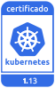
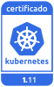

---

copyright:
  years: 2014, 2019
lastupdated: "2019-03-21"

keywords: kubernetes, iks

subcollection: containers

---

{:new_window: target="_blank"}
{:shortdesc: .shortdesc}
{:screen: .screen}
{:pre: .pre}
{:table: .aria-labeledby="caption"}
{:codeblock: .codeblock}
{:tip: .tip}
{:note: .note}
{:important: .important}
{:deprecated: .deprecated}
{:note: .note}


# Información de versión y acciones de actualización
{: #cs_versions}

## Tipos de versión de Kubernetes
{: #version_types}

{{site.data.keyword.containerlong}} da soporte a varias versiones de Kubernetes simultáneamente. Cuando se publica una versión más reciente (n), se da soporte a hasta 2 versiones anteriores (n-2). Las versiones anteriores a 2 versiones anteriores a la versión más reciente (n-3) son las primeras que quedan en desuso y a las que se deja de dar soporte.
{:shortdesc}

**Versiones soportadas de Kubernetes**:
*   Más reciente: 1.13.4
*   Predeterminada: 1.12.6
*   Otras: 1.11.8

**Versiones en desuso y no soportadas de Kubernetes**:
*   En desuso: 1.10
*   No soportadas: 1.5, 1.7, 1.8, 1.9

</br>

**Versiones en desuso**: cuando los clústeres se ejecutan en una versión en desuso de Kubernetes, tiene un mínimo de 30 días para revisar y actualizar a una versión soportada de Kubernetes antes de que la versión deje de estar soportada. Durante el periodo de desuso, el clúster sigue siendo funcional, pero es posible que necesite actualizaciones a un release con soporte para arreglar vulnerabilidades de seguridad. No puede crear nuevos clústeres que utilicen la versión en desuso.

**Versiones no soportadas**: si los clústeres ejecutan una versión de Kubernetes que no está soportada, revise los siguientes impactos potenciales de la actualización y, a continuación, [actualice inmediatamente el clúster](/docs/containers?topic=containers-update#update) para seguir recibiendo actualizaciones importantes de seguridad y soporte. Los clústeres no soportados no pueden añadir ni volver a cargar nodos trabajadores existentes. Para saber si su clúster **no recibe soporte**, examine el campo **State** (Estado) de la salida del mandato `ibmcloud ks clusters` o en la [consola de {{site.data.keyword.containerlong_notm}} ](https://cloud.ibm.com/containers-kubernetes/clusters).

Si espera hasta que el clúster esté tres o más versiones por detrás de una versión soportada, deberá forzar la actualización, lo que podría provocar resultados o errores inesperados. La actualización de la versión 1.7 o 1.8 a la versión 1.11 o posterior falla. Para otras versiones, como por ejemplo si el clúster ejecuta Kubernetes versión 1.9, cuando actualiza el nodo maestro directamente a la versión 1.12 o posterior, la mayoría de los pods fallan y entran en el estado `MatchNodeSelector`, `CrashLoopBackOff` o `ContainerCreating`
hasta que actualiza los nodos trabajadores a la misma versión. Para evitar este problema, actualice el clúster a una versión soportada que esté a menos de tres versiones por delante de la versión actual, como por ejemplo de 1.9 a 1.11 y luego actualice a la versión 1.12.<br><br>Después de actualizar el clúster a una versión soportada, el clúster puede reanudar las operaciones normales y seguir recibiendo soporte.
{: important}

</br>

Para comprobar la versión del servidor de un clúster, ejecute el mandato siguiente.

```
kubectl version  --short | grep -i server
```
{: pre}

Salida de ejemplo:

```
Server Version: v1.12.6+IKS
```
{: screen}


## Tipos de actualización
{: #update_types}

El clúster de Kubernetes tiene tres tipos de actualizaciones: mayores, menores y parches.
{:shortdesc}

|Tipo actualización|Ejemplos de etiquetas de versión|Actualizado por|Impacto
|-----|-----|-----|-----|
|Mayor|1.x.x|Puede|Operación de clústeres de cambios, incluyendo scripts o despliegues.|
|Menor|x.9.x|Puede|Operación de clústeres de cambios, incluyendo scripts o despliegues.|
|Parche|x.x.4_1510|IBM y el usuario|Parches de Kubernetes, así como otras actualizaciones de componentes de Proveedor de {{site.data.keyword.Bluemix_notm}} como, por ejemplo, parches de seguridad y del sistema operativo. IBM actualiza los maestros automáticamente, pero el usuario debe aplicar los parches a los nodos trabajadores. Consulte más información sobre los parches en la sección siguiente.|
{: caption="Consecuencias en las actualizaciones de Kubernetes" caption-side="top"}

A medida que las actualizaciones pasan a estar disponibles, se le notifica cuando visualiza información sobre los nodos trabajadores, por ejemplo con los mandatos `ibmcloud ks workers --cluster <cluster>` o `ibmcloud ks worker-get --cluster <cluster> --worker <worker>`.
-  **Actualizaciones menores y mayores (1.x)**: En primer lugar, [actualice el nodo maestro](/docs/containers?topic=containers-update#master) y, a continuación, [actualice los nodos trabajadores](/docs/containers?topic=containers-update#worker_node). Los nodos de trabajo no pueden ejecutar una versión mayor o menor de Kubernetes que sea posterior a la de los nodos maestros.
   - De forma predeterminada, no es posible actualizar un maestro de Kubernetes tres o más versiones menores al mismo tiempo. Por ejemplo, si el maestro actual es de la versión 1.9 y desea actualizar a 1.12, primero se debe actualizar a la versión 1.10. Puede forzar la actualización para continuar, pero actualizar más de dos versiones menores puede provocar resultados o errores imprevistos.
   - Si utiliza una versión de CLI `kubectl` que coincide al menos con la versión `major.minor` de los clústeres, puede experimentar resultados inesperados. Mantenga actualizadas las [versiones de la CLI](/docs/containers?topic=containers-cs_cli_install#kubectl) y el clúster de Kubernetes.
-  **Actualizaciones de parches (x.x.4_1510)**: Los cambios entre parches están documentados en el [Registro de cambios de versión](/docs/containers?topic=containers-changelog). Los parches maestros se aplican automáticamente, pero el usuario debe iniciar las actualizaciones de parches de los nodos trabajadores. Los nodos maestros también puede ejecutar versiones de parches que sean posteriores a las de los nodos maestros. A medida que las actualizaciones estén disponibles, se le notificará cuando visualice información sobre los nodos trabajadores y maestro en la CLI o consola de {{site.data.keyword.Bluemix_notm}}, como por ejemplo con los siguientes mandatos: `ibmcloud ks clusters`, `cluster-get`, `workers` o `worker-get`.
   - **Parches de nodos trabajadores**: Consulte cada mes para ver si hay una actualización disponible y utilice el [mandato](/docs/containers?topic=containers-cs_cli_reference#cs_worker_update) `ibmcloud ks worker-update` o el [mandato](/docs/containers?topic=containers-cs_cli_reference#cs_worker_reload) `ibmcloud ks worker-reload` para aplicar estos parches de seguridad y de sistema operativo. Tenga en cuenta que, durante una actualización o recarga, se creará de nuevo la imagen de la máquina del nodo trabajador y se suprimirán los datos si no se [almacenan fuera del nodo trabajador](/docs/containers?topic=containers-storage_planning#persistent_storage_overview).
   - **Parches maestros**: los parches maestros se aplican automáticamente durante el curso de varios días, por lo que una versión de parche maestro podría aparecer como disponible antes de que se aplique a su nodo maestro. La automatización de actualizaciones también pasa por alto los clústeres que están en un estado no saludable o que tienen operaciones actualmente en curso. Ocasionalmente, IBM podría inhabilitar las actualizaciones automáticas para un fixpack maestro específico, tal como se indica en el registro de cambios, como un parche que solo sea necesario si se actualiza un nodo maestro de una versión menor a otra. En cualquiera de estos casos, puede utilizar el [mandato](/docs/containers?topic=containers-cs_cli_reference#cs_cluster_update) `ibmcloud ks cluster-update` de forma seguro por su cuenta sin esperar a que se aplique una automatización de actualización.

</br>

{: #prep-up}
Esta información resume las actualizaciones que pueden tener un probable impacto sobre las apps desplegadas al actualizar un clúster a una nueva versión desde la versión anterior.
-  [Acciones de preparación](#cs_v113) de la versión 1.13.
-  [Acciones de preparación](#cs_v112) de la versión 1.12.
-  [Acciones de preparación](#cs_v111) de la versión 1.11.
-  **En desuso**: [Acciones de preparación](#cs_v110) de la versión 1.10.
-  [Archivo](#k8s_version_archive) de versiones no soportadas.

<br/>

Para ver una lista completa de cambios, revise la siguiente información:
* [Registro de cambios de Kubernetes ](https://github.com/kubernetes/kubernetes/blob/master/CHANGELOG.md).
* [Registro de cambios de versión de IBM](/docs/containers?topic=containers-changelog).

</br>

## Historial de releases
{: #release-history}

En la tabla siguiente se registra el historial de releases de versiones de {{site.data.keyword.containerlong_notm}}. Puede utilizar esta información con fines de planificación, como por ejemplo para calcular cuándo un determinado release puede dejar de recibir soporte. Después de que la comunidad de Kubernetes publica una actualización de una versión, el equipo de IBM inicia un proceso de prueba del release para entornos de {{site.data.keyword.containerlong_notm}}. La fecha de disponibilidad y la fecha en que se deja de dar soporte a un release dependen de los resultados de estas pruebas, de las actualizaciones de la comunidad, de los parches de seguridad y de los cambios tecnológicos entre las versiones. Planifique el mantenimiento de la versión del nodo maestro y trabajador del clúster según la política de soporte de versión `n-2`.
{: shortdesc}

{{site.data.keyword.containerlong_notm}} pasó a estar disponible a nivel general por primera vez con Kubernetes versión 1.5. Las fechas planificadas de lanzamiento de un release y las fechas en que se deja de dar soporte a un release están sujetas a cambios. Para ver los pasos de preparación de actualización de versión, pulse el número de versión.

Las fechas que están marcadas con el símbolo `†` son provisionales y están sujetas a cambios.
{: important}

<table summary="Esta tabla muestra el historial de releases de {{site.data.keyword.containerlong_notm}}.">
<caption>Historial de releases de {{site.data.keyword.containerlong_notm}}.</caption>
<col width="20%" align="center">
<col width="20%">
<col width="30%">
<col width="30%">
<thead>
<tr>
<th>¿Recibe soporte?</th>
<th>Versión</th>
<th>{{site.data.keyword.containerlong_notm}}<br>Fecha de lanzamiento</th>
<th>{{site.data.keyword.containerlong_notm}}<br>Fecha en que deja de recibir soporte</th>
</tr>
</thead>
<tbody>
<tr>
  <td></td>
  <td>[1.13](#cs_v113)</td>
  <td>5 de febrero de 2019</td>
  <td>Diciembre de 2019 `†`</td>
</tr>
<tr>
  <td></td>
  <td>[1.12](#cs_v112)</td>
  <td>7 de noviembre de 2018</td>
  <td>Septiembre de 2019 `†`</td>
</tr>
<tr>
  <td></td>
  <td>[1.11](#cs_v111)</td>
  <td>14 de agosto de 2018</td>
  <td>Junio de 2019 `†`</td>
</tr>
<tr>
  <td></td>
  <td>[1.10](#cs_v110)</td>
  <td>1 de mayo de 2018</td>
  <td>30 de abril de 2019 `†`</td>
</tr>
<tr>
  <td></td>
  <td>[1.9](#cs_v19)</td>
  <td>8 de febrero de 2018</td>
  <td>27 de diciembre de 2018</td>
</tr>
<tr>
  <td></td>
  <td>[1.8](#cs_v18)</td>
  <td>8 de noviembre de 2017</td>
  <td>22 de septiembre de 2018</td>
</tr>
<tr>
  <td></td>
  <td>[1.7](#cs_v17)</td>
  <td>19 de septiembre de 2017</td>
  <td>21 de junio de 2018</td>
</tr>
<tr>
  <td></td>
  <td>1.6</td>
  <td>N/D</td>
  <td>N/D</td>
</tr>
<tr>
  <td></td>
  <td>[1.5](#cs_v1-5)</td>
  <td>23 de mayo de 2017</td>
  <td>4 de abril de 2018</td>
</tr>
</tbody>
</table>

<br />


## Versión 1.13
{: #cs_v113}

<p> {{site.data.keyword.containerlong_notm}} es un producto Kubernetes certificado para la versión 1.13 bajo el programa de certificación de conformidad de software de Kubernetes de CNCF. _Kubernetes® es una marca registrada de The Linux Foundation en Estados Unidos y en otros países, y se utiliza de acuerdo con una licencia de The Linux Foundation._</p>

Revise los cambios que puede necesitar hacer cuando actualice la versión anterior de Kubernetes a 1.13.
{: shortdesc}

### Antes de actualizar el nodo maestro
{: #113_before}

En la tabla siguiente se muestran las acciones que debe llevar a cabo antes de actualizar el maestro de Kubernetes.
{: shortdesc}

<table summary="Actualizaciones de Kubernetes para la versión 1.13">
<caption>Cambios necesarios antes de actualizar el maestro a Kubernetes 1.13</caption>
<thead>
<tr>
<th>Tipo</th>
<th>Descripción</th>
</tr>
</thead>
<tbody>
<tr>
<td>N/D</td>
<td></td>
</tr>
</tbody>
</table>

### Después de actualizar el nodo maestro
{: #113_after}

En la tabla siguiente se muestran las acciones que debe llevar a cabo después de actualizar el maestro de Kubernetes.
{: shortdesc}

<table summary="Actualizaciones de Kubernetes para la versión 1.13">
<caption>Cambios necesarios después de actualizar el nodo maestro a Kubernetes 1.13</caption>
<thead>
<tr>
<th>Tipo</th>
<th>Descripción</th>
</tr>
</thead>
<tbody>
<tr>
<td>CoreDNS disponible como el nuevo proveedor DNS de clúster predeterminado</td>
<td>CoreDNS es ahora el proveedor de DNS de clúster predeterminado para los nuevos clústeres en Kubernetes 1.13 y posteriores. Si actualiza un clúster existente a 1.13 que utiliza KubeDNS como proveedor de DNS de clúster, KubeDNS continúa siendo el proveedor de DNS de clúster. Sin embargo, puede optar por [utilizar CoreDNS en su lugar](/docs/containers?topic=containers-cluster_dns#dns_set).
<br><br>CoreDNS da soporte a la [especificación DNS de clúster ](https://github.com/kubernetes/dns/blob/master/docs/specification.md#25---records-for-external-name-services) para especificar un nombre de dominio como campo `ExternalName` del servicio Kubernetes. El proveedor de DNS de clúster anterior, KubeDNS, no sigue la especificación DNS de clúster, y, por lo tanto, permite direcciones IP para `ExternalName`. Si algún servicio de Kubernetes utiliza direcciones IP en lugar de DNS, debe actualizar el valor de `ExternalName` a DNS para que siga funcionando.</td>
</tr>
<tr>
<td>Salida de `kubectl` para `Deployment` y `StatefulSet`</td>
<td>La salida de `kubectl` para `Deployment` y `StatefulSet` ahora incluye una columna `Ready` y resulta más fácil de leer para el usuario. Si sus scripts se basan en el comportamiento anterior, actualícelos.</td>
</tr>
<tr>
<td>Salida de `kubectl` para `PriorityClass`</td>
<td>La salida de `kubectl` para `PriorityClass` ahora incluye una columna `Value`. Si sus scripts se basan en el comportamiento anterior, actualícelos.</td>
</tr>
<tr>
<td>`kubectl get componentstatuses`</td>
<td>El mandato `kubectl get componentstatuses` no notifica correctamente el estado de algunos componentes maestros de Kubernetes porque ya no se puede acceder a estos componentes desde el servidor de API de Kubernetes ahora que los puertos de `localhost` e inseguros (HTTP) están inhabilitados. Después de incorporar nodos maestros de alta disponibilidad (HA) en Kubernetes versión 1.10, cada nodo maestro de Kubernetes se configura con varias instancias de `apiserver`, `controller-manager`, `scheduler` y `etcd`. Debe consultar el estado del clúster desde la [consola de {{site.data.keyword.Bluemix_notm}} ](https://cloud.ibm.com/containers-kubernetes/landing) o mediante el [mandato](/docs/containers?topic=containers-cs_cli_reference#cs_cluster_get) `ibmcloud ks cluster-get`.</td>
</tr>
<tr>
<tr>
<td>No soportado: `kubectl run-container`</td>
<td>El mandato `kubectl run-container` se ha eliminado. Utilice en su lugar el mandato `kubectl run`.</td>
</tr>
<tr>
<td>`kubectl rollout undo`</td>
<td>Cuando se ejecuta `kubectl rollout undo` para una revisión que no existe, se devuelve un error. Si sus scripts se basan en el comportamiento anterior, actualícelos.</td>
</tr>
<tr>
<td>En desuso: Anotación `scheduler.alpha.kubernetes.io/critical-pod`</td>
<td>La anotación `scheduler.alpha.kubernetes.io/critical-pod` ya no se utiliza. Cambie los pods que se basan en esta anotación para que utilicen en su lugar la [prioridad de pod](/docs/containers?topic=containers-pod_priority#pod_priority).</td>
</tr>
</tbody>
</table>

### Después de actualizar los nodos trabajadores
{: #113_after_workers}

En la tabla siguiente se muestran las acciones que debe llevar a cabo después de actualizar los nodos trabajadores.
{: shortdesc}

<table summary="Actualizaciones de Kubernetes para la versión 1.13">
<caption>Cambios necesarios después de actualizar los nodos trabajadores a Kubernetes 1.13</caption>
<thead>
<tr>
<th>Tipo</th>
<th>Descripción</th>
</tr>
</thead>
<tbody>
<tr>
<td>Servidor dedicado `cri` de contenedor</td>
<td>En la versión 1.2 de contenedor, el servidor dedicado del plugin `cri` ahora da servicio en un puerto aleatorio, `http://localhost:0`. Este cambio da soporte al proxy dedicado `kubelet` y ofrece una interfaz dedicada más segura para las operaciones `exec` y `logs` de contenedor. Antes, el servidor dedicado `cri` escuchaba en la interfaz de red privada del nodo trabajador mediante el puerto 10010. Si las apps utilizan el plugin `cri` de contenedor y siguen el comportamiento anterior, actualícelas.</td>
</tr>
</tbody>
</table>

<br />


## Versión 1.12
{: #cs_v112}

<p> {{site.data.keyword.containerlong_notm}} es un producto Kubernetes certificado para la versión 1.12 bajo el programa CNCF de certificación de conformidad de software Kubernetes. _Kubernetes® es una marca registrada de The Linux Foundation en Estados Unidos y en otros países, y se utiliza de acuerdo con una licencia de The Linux Foundation._</p>

Revise los cambios que puede necesitar hacer cuando actualice la versión anterior de Kubernetes a 1.12.
{: shortdesc}

### Antes de actualizar el nodo maestro
{: #112_before}

En la tabla siguiente se muestran las acciones que debe llevar a cabo antes de actualizar el maestro de Kubernetes.
{: shortdesc}

<table summary="Actualizaciones de Kubernetes para la versión 1.12">
<caption>Cambios necesarios antes de actualizar el maestro a Kubernetes 1.12</caption>
<thead>
<tr>
<th>Tipo</th>
<th>Descripción</th>
</tr>
</thead>
<tbody>
<tr>
<td>Servidor de métricas de Kubernetes</td>
<td>Si actualmente tiene el `metric-server` de Kubernetes desplegado en el clúster, debe eliminar el `metric-server` antes de actualizar el clúster a Kubernetes 1.12. Esta eliminación evita conflictos con el `metric-server` que se despliega durante la actualización.</td>
</tr>
<tr>
<td>Enlaces de rol para la cuenta de servicio `default` de `kube-system`</td>
<td>La cuenta de servicio `default` de `kube-system` ya no tiene acceso **cluster-admin** a la API de Kubernetes. Si despliega características o complementos como [Helm](/docs/containers?topic=containers-integrations#helm) que requieran acceso a los procesos del clúster, configure una [cuenta de servicio ](https://kubernetes.io/docs/reference/access-authn-authz/service-accounts-admin/). Si necesita tiempo para crear y configurar cuentas de servicio individuales con los permisos adecuados, puede otorgar temporalmente el rol **cluster-admin** con el enlace de rol de clúster siguiente: `kubectl create clusterrolebinding kube-system:default --clusterrole=cluster-admin --serviceaccount=kube-system:default`</td>
</tr>
</tbody>
</table>

### Después de actualizar el nodo maestro
{: #112_after}

En la tabla siguiente se muestran las acciones que debe llevar a cabo después de actualizar el maestro de Kubernetes.
{: shortdesc}

<table summary="Actualizaciones de Kubernetes para la versión 1.12">
<caption>Cambios necesarios después de actualizar el nodo maestro a Kubernetes 1.12</caption>
<thead>
<tr>
<th>Tipo</th>
<th>Descripción</th>
</tr>
</thead>
<tbody>
<tr>
<td>API para Kubernetes</td>
<td>La API de Kubernetes sustituye a las API en desuso de la forma siguiente:
<ul><li><strong>apps/v1</strong>: La API de Kubernetes `apps/v1`
sustituye a las API `apps/v1beta1` y `apps/v1alpha`. La API `apps/v1` también sustituye a la API `extensions/v1beta1` para los recursos `daemonset`, `deployment`, `replicaset` y `statefulset`. El proyecto Kubernetes está poniendo en desuso y eliminando gradualmente el soporte para las API anteriores del `apiserver` de Kubernetes y el cliente `kubectl`.</li>
<li><strong>networking.k8s.io/v1</strong>: La API `networking.k8s.io/v1` sustituye a la API `extensions/v1beta1` para recursos `networkpolicy`.</li>
<li><strong>policy/v1beta1</strong>: La API `policy/v1beta1` sustituye a la API `extensions/v1beta1` para recursos `podsecuritypolicy`.</li></ul>
<br><br>Actualice todos los campos del archivo YAML `apiVersion` para que utilicen la API de Kubernetes adecuada antes de que las API en desuso se conviertas en no soportadas. Además, revise los [Documentos de Kubernetes ](https://kubernetes.io/docs/concepts/workloads/controllers/deployment/) para ver si existen cambios relacionados con `apps/v1`, como el siguiente.
<ul><li>Después de crear un despliegue, el campo `.spec.selector` es inmutable.</li>
<li>El campo `.spec.rollbackTo` está en desuso. En su lugar, utilice el mandato `kubectl rollout undo`.</li></ul></td>
</tr>
<tr>
<td>CoreDNS disponible como proveedor DNS de clúster</td>
<td>El proyecto Kubernetes está en proceso de transición para dar soporte a CoreDNS en lugar de hacerlo al DNS de Kubernetes actual (KubeDNS). En la versión 1.12, el DNS de clúster predeterminado sigue siendo KubeDNS, pero puede [optar por utilizar CoreDNS](/docs/containers?topic=containers-cluster_dns#dns_set).</td>
</tr>
<tr>
<td>`kubectl apply --force`</td>
<td>Ahora, al forzar una acción de aplicación (`kubectl apply --force`) sobre recursos que no se pueden actualizar, como campos inmutables en archivos YAML, los recursos se vuelven a crear en su lugar. Si sus scripts se basan en el comportamiento anterior, actualícelos.</td>
</tr>
<tr>
<td>`kubectl get componentstatuses`</td>
<td>El mandato `kubectl get componentstatuses` no notifica correctamente el estado de algunos componentes maestros de Kubernetes porque ya no se puede acceder a estos componentes desde el servidor de API de Kubernetes ahora que los puertos de `localhost` e inseguros (HTTP) están inhabilitados. Después de incorporar nodos maestros de alta disponibilidad (HA) en Kubernetes versión 1.10, cada nodo maestro de Kubernetes se configura con varias instancias de `apiserver`, `controller-manager`, `scheduler` y `etcd`. Debe consultar el estado del clúster desde la [consola de {{site.data.keyword.Bluemix_notm}} ](https://cloud.ibm.com/containers-kubernetes/landing) o mediante el [mandato](/docs/containers?topic=containers-cs_cli_reference#cs_cluster_get) `ibmcloud ks cluster-get`.</td>
</tr>
<tr>
<td>`kubectl logs --interactive`</td>
<td>Ya no hay soporte para el distintivo `--interactive` en `kubectl logs`. Actualice cualquier automatización que utilice este distintivo.</td>
</tr>
<tr>
<td>`kubectl patch`</td>
<td>Si el mandato `patch` no tiene ningún cambio como resultado (parche redundante), el mandato ya no sale con un código de retorno de `1`. Si sus scripts se basan en el comportamiento anterior, actualícelos.</td>
</tr>
<tr>
<td>`kubectl version -c`</td>
<td>Ya no hay soporte para el distintivo de sintaxis abreviada `-c`. En su lugar, utilice el distintivo completo `--client`. Actualice cualquier automatización que utilice este distintivo.</td>
</tr>
<tr>
<td>`kubectl wait`</td>
<td>Si no se encuentra ningún selector coincidente, ahora el mandato imprime un mensaje de error y sale con un código de retorno de `1`. Si sus scripts se basan en el comportamiento anterior, actualícelos.</td>
</tr>
<tr>
<td>kubelet cAdvisor port</td>
<td>La interfaz de usuario web de [Container Advisor (cAdvisor) ](https://github.com/google/cadvisor) que utilizaba Kubelet al iniciar el `--cadvisor-port` se ha eliminado de Kubernetes 1.12. Si aún tiene la necesidad de ejecutar cAdvisor, [despliegue cAdvisor como un conjunto de daemons ](https://github.com/google/cadvisor/tree/master/deploy/kubernetes).<br><br>En el conjunto de daemons, especifique la sección de puertos para que se pueda acceder a cAdvisor a través de
`http://node-ip:4194`, según se indica a continuación. Tenga en cuenta que los pods de cAdvisor fallarán hasta que los nodos trabajadores se actualicen a 1.12, debido a que las versiones anteriores de Kubelet utilizan el puerto de host 4194 para cAdvisor.
<pre class="screen"><code>ports:
          - name: http
            containerPort: 8080
            hostPort: 4194
            protocol: TCP</code></pre></td>
</tr>
<tr>
<td>Panel de control de Kubernetes</td>
<td>Si accede al panel de control a través de `kubectl proxy`, se elimina el botón **OMITIR** de la página de inicio de sesión. En su lugar, [utilice una **Señal** para iniciar una sesión](/docs/containers?topic=containers-app#cli_dashboard).</td>
</tr>
<tr>
<td id="metrics-server">Servidor de métricas de Kubernetes</td>
<td>El servidor de métricas de Kubernetes sustituye a Kubernetes Heapster (en desuso desde la versión 1.8 de Kubernetes) como proveedor de métricas de clúster. Si ejecuta más de 30 pods por nodo trabajador en el clúster, [ajuste la configuración de `metrics-server` por motivos de rendimiento](/docs/containers?topic=containers-kernel#metrics).
<p>El panel de control de Kubernetes no funciona con el `metrics-server`. Si desea mostrar métricas en un panel de control, elija una de las opciones siguientes.</p>
<ul><li>[Configure Grafana para analizar métricas](/docs/services/cloud-monitoring/tutorials?topic=cloud-monitoring-container_service_metrics#container_service_metrics) utilizando el Panel de control de supervisión del clúster.</li>
<li>Despliegue [Heapster ](https://github.com/kubernetes/heapster) en el clúster.
<ol><li>Copie los archivos [YAML ](https://github.com/kubernetes/kubernetes/blob/release-1.12/cluster/addons/cluster-monitoring/heapster-rbac.yaml) `heapster-rbac`, [YAML ](https://github.com/kubernetes/kubernetes/blob/release-1.12/cluster/addons/cluster-monitoring/standalone/heapster-service.yaml) `heapster-service` y [YAML ](https://github.com/kubernetes/kubernetes/blob/release-1.12/cluster/addons/cluster-monitoring/standalone/heapster-controller.yaml) `heapster-controller`.</li>
<li>Edite el archivo YAML `heapster-controller` sustituyendo las series siguientes.
<ul><li>Sustituya `{{ nanny_memory }}` por `90Mi`</li>
<li>Sustituya `{{ base_metrics_cpu }}` por `80m`</li>
<li>Sustituya `{{ metrics_cpu_per_node }}` por `0.5m`</li>
<li>Sustituya `{{ base_metrics_memory }}` por `140Mi`</li>
<li>Sustituya `{{ metrics_memory_per_node }}` por `4Mi`</li>
<li>Sustituya `{{ heapster_min_cluster_size }}` por `16`</li></ul></li>
<li>Aplique los archivos YAML `heapster-rbac`, `heapster-service` y `heapster-controller` al clúster ejecutando el mandato `kubectl apply -f`.</li></ol></li></ul></td>
</tr>
<tr>
<td>API de Kubernetes `rbac.authorization.k8s.io/v1`</td>
<td>La API de Kubernetes `rbac.authorization.k8s.io/v1` (soportada desde Kubernetes 1.8) va a sustituir a las API `rbac.authorization.k8s.io/v1alpha1` y `rbac.authorization.k8s.io/v1beta1`. Ya no puede crear objetos RBAC como roles o enlaces de rol con la API `v1alpha` no soportada. Los objetos RBAC existentes se convierten a la API `v1`.</td>
</tr>
</tbody>
</table>

<br />


## Versión 1.11
{: #cs_v111}

<p> {{site.data.keyword.containerlong_notm}} es un producto certificado para Kubernetes versión 1.11 bajo el programa CNCF Kubernetes Software Conformance Certification. _Kubernetes® es una marca registrada de The Linux Foundation en Estados Unidos y en otros países, y se utiliza de acuerdo con una licencia de The Linux Foundation._</p>

Revise los cambios que puede necesitar hacer cuando actualice la versión anterior de Kubernetes a 1.11.
{: shortdesc}

Para poder actualizar correctamente de la versión 1.9 o anterior de Kubernetes a la versión 1.11, debe seguir los pasos que se indican en [Preparación para actualizar a Calico v3](#111_calicov3).
{: important}

### Antes de actualizar el nodo maestro
{: #111_before}

En la tabla siguiente se muestran las acciones que debe llevar a cabo antes de actualizar el maestro de Kubernetes.
{: shortdesc}

<table summary="Actualizaciones de Kubernetes para la versión 1.11">
<caption>Cambios necesarios antes de actualizar el maestro a Kubernetes 1.11</caption>
<thead>
<tr>
<th>Tipo</th>
<th>Descripción</th>
</tr>
</thead>
<tbody>
<tr>
<td>Configuración de alta disponibilidad (HA) del maestro del clúster</td>
<td>Se ha actualizado la configuración del maestro del clúster para aumentar la alta disponibilidad (HA). Los clústeres tienen ahora tres réplicas del maestro de Kubernetes que se configuran con cada maestro desplegado en hosts físicos independientes. Además, si el clúster está en una zona con capacidad multizona, los maestros se distribuyen entre las zonas.<br><br>Para ver las acciones que debe realizar, consulte [Actualización a maestros de clúster de alta disponibilidad](#ha-masters). Estas acciones preparatorias se aplican:<ul>
<li>Si tiene un cortafuegos o políticas de red Calico personalizadas.</li>
<li>Si utiliza los puertos de host `2040` o `2041` en sus nodos trabajadores.</li>
<li>Si ha utilizado la dirección IP del maestro del clúster para el acceso al maestro dentro del clúster.</li>
<li>Si tiene una automatización que llama a la API o a la CLI de Calico (`calicoctl`), como para crear políticas de Calico.</li>
<li>Si utiliza políticas de red de Kubernetes o Calico para controlar el acceso de salida de pod al maestro.</li></ul></td>
</tr>
<tr>
<td>Nuevo tiempo de ejecución de contenedor de Kubernetes `containerd`</td>
<td><p class="important">`containerd` sustituye a Docker como el nuevo tiempo de ejecución de contenedor para Kubernetes. Para conocer las acciones que debe llevar a cabo, consulte [Actualización a `containerd` como tiempo de ejecución de contenedor](#containerd).</p></td>
</tr>
<tr>
<td>Cifrado de datos en etcd</td>
<td>Anteriormente, los datos de etcd se almacenaban en una instancia de almacenamiento de archivos NFS del maestro que se cifraba en reposo. Ahora, los datos de etcd se almacenan en el disco local del maestro y se realiza una copia de seguridad en {{site.data.keyword.cos_full_notm}}. Los datos se cifran durante el tránsito a {{site.data.keyword.cos_full_notm}} y en reposo. No obstante, los datos de etcd en el disco local del maestro no se cifran. Si desea que se cifren los datos de etcd locales del maestro, [habilite {{site.data.keyword.keymanagementservicelong_notm}} en el clúster](/docs/containers?topic=containers-encryption#keyprotect).</td>
</tr>
<tr>
<td>Propagación de montaje de volumen de contenedor de Kubernetes</td>
<td>El valor predeterminado para el campo [`mountPropagation` ](https://kubernetes.io/docs/concepts/storage/volumes/#mount-propagation) para un contenedor `VolumeMount` ha cambiado de `HostToContainer` a `None`. Este cambio restaura el comportamiento que existía en Kubernetes versión 1.9 y anteriores. Si sus especificaciones de pod se basan en `HostToContainer` como valor predeterminado, actualícelas.</td>
</tr>
<tr>
<td>Deserializador JSON del servidor de API de Kubernetes</td>
<td>El deserializador JSON del servidor de API de Kubernetes ahora es sensible a las mayúsculas y minúsculas. Este cambio restaura el comportamiento que existía en Kubernetes versión 1.7 y anteriores. Si las definiciones de recursos JSON utilizan mayúsculas y minúsculas de forma incorrecta, actualícelas. <br><br>Solo se ven afectadas las solicitudes directas de servidor de API de Kubernetes. En la CLI de `kubectl` se han seguido aplicando claves sensibles a las mayúsculas y minúsculas en la versión 1.7 y posteriores de Kubernetes, por lo que si gestiona sus recursos exclusivamente con `kubectl`, no se ve afectado.</td>
</tr>
</tbody>
</table>

### Después de actualizar el nodo maestro
{: #111_after}

En la tabla siguiente se muestran las acciones que debe llevar a cabo después de actualizar el maestro de Kubernetes.
{: shortdesc}

<table summary="Actualizaciones de Kubernetes para la versión 1.11">
<caption>Cambios necesarios después de actualizar el nodo maestro a Kubernetes 1.11</caption>
<thead>
<tr>
<th>Tipo</th>
<th>Descripción</th>
</tr>
</thead>
<tbody>
<tr>
<td>Configuración de registro de clúster</td>
<td>El complemento de clúster `fluentd` se actualiza automáticamente con la versión 1.11, incluso cuando está inhabilitado `logging-autoupdate`.<br><br>
El directorio de registro de contenedor ha cambiado de `/var/lib/docker/` a `/var/log/pods/`. Si utiliza su propia solución de registro que supervisa el directorio anterior, actualice según corresponda.</td>
</tr>
<tr>
<td>Renovar la configuración de Kubernetes</td>
<td>La configuración de OpenID Connect para el servidor de API de Kubernetes del clúster se ha actualizado para dar soporte a los grupos de acceso de {{site.data.keyword.Bluemix_notm}} Identity Access and Management (IAM). Como resultado, debe renovar la configuración de Kubernetes del clúster después de la actualización del maestro de Kubernetes v1.11 ejecutando `ibmcloud ks cluster-config --cluster <cluster_name_or_ID>`. Con este mandato, la configuración se aplica a enlaces de rol en el espacio de nombres `default`.<br><br>Si no renueva la configuración, las acciones de clúster fallan con el siguiente mensaje de error: `You must be logged in to the server (Unauthorized).`</td>
</tr>
<tr>
<td>Panel de control de Kubernetes</td>
<td>Si accede al panel de control a través de `kubectl proxy`, se elimina el botón **OMITIR** de la página de inicio de sesión. En su lugar, [utilice una **Señal** para iniciar una sesión](/docs/containers?topic=containers-app#cli_dashboard).</td>
</tr>
<tr>
<td>CLI de `kubectl`</td>
<td>La CLI de `kubectl` para Kubernetes versión 1.11 requiere las API de `apps/v1`. Como resultado, la CLI de `kubectl` de v1.11 no funciona para los clústeres que ejecutan Kubernetes versión 1.8 o anterior. Utilice la versión de la CLI de `kubectl` que coincida con la versión del servidor de API de Kubernetes del clúster.</td>
</tr>
<tr>
<td>`kubectl auth can-i`</td>
<td>Ahora, si un usuario no está autorizado, el mandato `kubectl auth can-i` falla con `exit code 1`. Si sus scripts se basan en el comportamiento anterior, actualícelos.</td>
</tr>
<tr>
<td>`kubectl delete`</td>
<td>Ahora, al suprimir recursos utilizando criterios de selección como, por ejemplo, etiquetas, el mandato `kubectl delete` pasa por alto los errores `not found` de forma predeterminada. Si sus scripts se basan en el comportamiento anterior, actualícelos.</td>
</tr>
<tr>
<td>Característica `sysctls` de Kubernetes</td>
<td>Ahora se ignora la anotación de `security.alpha.kubernetes.io/sysctls`. En su lugar, Kubernetes ha añadido campos a los objetos `PodSecurityPolicy` y `Pod` para especificar y controlar `sysctls`. Para obtener más información, consulte [Uso de sysctls en Kubernetes ](https://kubernetes.io/docs/tasks/administer-cluster/sysctl-cluster/). <br><br>Después de actualizar los trabajadores y el maestro de clúster, actualice los objetos `PodSecurityPolicy` y `Pod` para utilizar los nuevos campos `sysctls`.</td>
</tr>
</tbody>
</table>

### Actualización a maestros de clúster de alta disponibilidad en Kubernetes 1.11
{: #ha-masters}

Para clústeres que ejecutan Kubernetes versión [1.10.8_1530](#110_ha-masters), 1.11.3_1531, o posterior, se ha actualizado la configuración del maestro del clúster para aumentar la alta disponibilidad (HA). Los clústeres tienen ahora tres réplicas del maestro de Kubernetes que se configuran con cada maestro desplegado en hosts físicos independientes. Además, si el clúster está en una zona con capacidad multizona, los maestros se distribuyen entre las zonas.
{: shortdesc}

Puede comprobar si el clúster tiene una configuración maestra de alta disponibilidad comprobando el URL maestro del clúster en la consola o con el mandato `ibmcloud ks cluster clúster-get --cluster <cluster_name_or_ID`. Si el URL maestro tiene un nombre de host como ` https://c2.us-south.containers.cloud.ibm.com:xxxxx` y no una dirección IP, como por ejemplo ` https://169.xx.xx.xx:xxxxx`,
significa que el clúster tiene una configuración de maestro de alta disponibilidad. Es posible que obtenga una configuración maestra de alta disponibilidad debido a una actualización automática de parches maestros o mediante la aplicación manual de una actualización. En cualquier caso, todavía debe revisar los siguientes elementos para asegurarse de que la red del clúster se ha configurado de modo que se aproveche la configuración.

* Si tiene un cortafuegos o políticas de red Calico personalizadas.
* Si utiliza los puertos de host `2040` o `2041` en sus nodos trabajadores.
* Si ha utilizado la dirección IP del maestro del clúster para el acceso al maestro dentro del clúster.
* Si tiene una automatización que llama a la API o a la CLI de Calico (`calicoctl`), como para crear políticas de Calico.
* Si utiliza políticas de red de Kubernetes o Calico para controlar el acceso de salida de pod al maestro.

<br>
**Actualización del cortafuegos o las políticas de red de host de Calico personalizadas para maestros de alta disponibilidad**:</br>
{: #ha-firewall}
Si utiliza un cortafuegos o políticas de red de host de Calico personalizadas para controlar la salida de sus nodos trabajadores, permita el tráfico de salida con los puertos y direcciones IP para todas las zonas que estén dentro de la región en la que se encuentra el clúster. Consulte [Cómo permitir al clúster acceder a recursos de infraestructura y otros servicios](/docs/containers?topic=containers-firewall#firewall_outbound).

<br>
**Reserva de los puertos de host `2040` y `2041` en los nodos trabajadores**:</br>
{: #ha-ports}
Para permitir el acceso al maestro de clúster en una configuración de alta disponibilidad, debe dejar los puertos de host `2040` y `2041` disponibles en todos los nodos trabajadores.
* Actualice los pods que tengan `hostPort` establecido en `2040` o `2041` para que utilicen puertos distintos.
* Actualice los pods que tengan `hostNetwork` establecido en `true` que estén a la escucha en los puertos `2040` o `2041` para que utilicen puertos distintos.

Para comprobar si los pods están utilizando actualmente los puertos `2040` o `2041`, ejecute el mandato siguiente con su clúster como objetivo.

```
kubectl get pods --all-namespaces -o yaml | grep "hostPort: 204[0,1]"
```
{: pre}

<br>
**Uso del dominio o IP del clúster del servicio `kubernetes` para el acceso al maestro dentro del clúster**:</br>
{: #ha-incluster}
Para acceder al maestro de clúster en una configuración de alta disponibilidad desde dentro del clúster, utilice una de las opciones siguientes:
* La dirección IP del clúster del servicio `kubernetes`, cuyo valor predeterminado es `https://172.21.0.1`
* El nombre de dominio del servicio `kubernetes`, cuyo valor predeterminado es `https://kubernetes.default.svc.cluster.local`

Si ha utilizado anteriormente la dirección IP del maestro de clúster, este método seguirá funcionando. Sin embargo, para obtener una disponibilidad mejorada, actualice para utilizar la dirección IP o el nombre de dominio del clúster del servicio `kubernetes`.

<br>
**Configuración de Calico para el acceso fuera del clúster al maestro con una configuración de alta disponibilidad**:</br>
{: #ha-outofcluster}
Los datos que se almacenan en el mapa de configuración `calico-config` del espacio de nombres `kube-system` se han modificado para dar soporte a la configuración de maestro de alta disponibilidad. En concreto, el valor de `etcd_endpoints` solo tiene ahora soporte para el acceso dentro del clúster. El uso de este valor para configurar la CLI de Calico para acceder desde fuera del clúster ya no funciona.

En su lugar, utilice los datos almacenados en el mapa de configuración `cluster-info` del espacio de nombres `kube-system`. En concreto, utilice los valores de `etcd_host` y `etcd_port` para configurar el punto final para la [Calico CLI](/docs/containers?topic=containers-network_policies#cli_install) para acceder al maestro con la configuración de alta disponibilidad desde fuera del clúster.

<br>
**Actualización de las políticas de red de Kubernetes o Calico**:</br>
{: #ha-networkpolicies}
Necesitará llevar a cabo acciones adicionales si utiliza [políticas de red de Kubernetes o Calico](/docs/containers?topic=containers-network_policies#network_policies) para controlar el acceso de salida de pod al maestro de clúster y actualmente utiliza:
*  La dirección IP del clúster del servicio Kubernetes, que puede obtener ejecutando `kubectl get service kubernetes -o yaml | grep clusterIP`.
*  El nombre de dominio del servicio Kubernetes, cuyo valor predeterminado es `https://kubernetes.default.svc.cluster.local`.
*  La dirección IP del maestro de clúster, que puede obtener ejecutando `kubectl cluster-info | grep Kubernetes`.

Los pasos siguientes describen cómo actualizar las políticas de red de Kubernetes. Para actualizar las políticas de red de Calico, repita estos pasos con algunos cambios de sintaxis de política menores y `calicoctl` para buscar políticas y ver su impacto.
{: note}

Antes de empezar: [Inicie la sesión en su cuenta. Elija como destino la región adecuada y, si procede, el grupo de recursos. Establezca el contexto para el clúster](/docs/containers?topic=containers-cs_cli_install#cs_cli_configure).

1.  Obtenga la dirección IP del maestro de clúster.
    ```
    kubectl cluster-info | grep Kubernetes
    ```
    {: pre}

2.  Busque las políticas de red de Kubernetes para ver su impacto. Si no se devuelve ningún YAML, el clúster no se ve afectado y no necesita realizar cambios adicionales.
    ```
    kubectl get networkpolicies --all-namespaces -o yaml | grep <cluster-master-ip>
    ```
    {: pre}

3.  Revise el YAML. Por ejemplo, si el clúster utiliza la política de red de Kubernetes siguiente para permitir que los pods del espacio de nombres `default` puedan acceder al maestro de clúster a través de la dirección IP del clúster del servicio `kubernetes` o de la dirección IP del maestro de clúster, deberá actualizar la política.
    ```
    apiVersion: networking.k8s.io/v1
    kind: NetworkPolicy
    metadata:
      name: all-master-egress
      namespace: default
    spec:
      egress:
      # Allow access to cluster master using kubernetes service cluster IP address
      # or domain name or cluster master IP address.
      - ports:
        - protocol: TCP
        to:
        - ipBlock:
            cidr: 161.202.126.210/32
      # Allow access to Kubernetes DNS in order to resolve the kubernetes service
      # domain name.
      - ports:
        - protocol: TCP
          port: 53
        - protocol: UDP
          port: 53
      podSelector: {}
      policyTypes:
      - Egress
    ```
    {: screen}

4.  Revise la política de red de Kubernetes para permitir la salida para la dirección IP `172.20.0.1` del proxy maestro dentro del clúster. Por ahora, guarde la dirección IP del maestro de clúster. Por ejemplo, el ejemplo anterior de política de red cambia a lo siguiente.

    Si ha configurado anteriormente las políticas de salida para abrir solo la dirección IP y el puerto para el único maestro de Kubernetes, utilice ahora el rango de direcciones IP 172.20.0.1/32 y el puerto 2040 del proxy maestro dentro del clúster.
    {: tip}

    ```
    apiVersion: networking.k8s.io/v1
    kind: NetworkPolicy
    metadata:
      name: all-master-egress
      namespace: default
    spec:
      egress:
      # Allow access to cluster master using kubernetes service cluster IP address
      # or domain name.
      - ports:
        - protocol: TCP
        to:
        - ipBlock:
            cidr: 172.20.0.1/32
        - ipBlock:
            cidr: 161.202.126.210/32
      # Allow access to Kubernetes DNS in order to resolve the kubernetes service domain name.
      - ports:
        - protocol: TCP
          port: 53
        - protocol: UDP
          port: 53
      podSelector: {}
      policyTypes:
      - Egress
    ```
    {: screen}

5.  Aplique la política de red revisada al clúster.
    ```
    kubectl apply -f all-master-egress.yaml
    ```
    {: pre}

6.  Después de completar todas las [acciones de preparación](#ha-masters) (incluyendo estos pasos), [actualice el maestro de clúster](/docs/containers?topic=containers-update#master) al fixpack de maestro de alta disponibilidad.

7.  Una vez completada la actualización, elimine la dirección IP del maestro de clúster de la política de red. Por ejemplo, a partir de la política de red anterior, elimine las líneas siguientes y, a continuación, vuelva a aplicar la política.

    ```
    - ipBlock:
        cidr: 161.202.126.210/32
    ```
    {: screen}

    ```
    kubectl apply -f all-master-egress.yaml
    ```
    {: pre}

### Actualización a `containerd` como tiempo de ejecución de contenedor
{: #containerd}

Para clústeres que ejecutan la versión 1.11 o posterior, `containerd` sustituye a Docker como el nuevo tiempo de ejecución de contenedor para Kubernetes, para mejorar el rendimiento. Si sus pods se basan en Docker como tiempo de ejecución de contenedor de Kubernetes, debe actualizarlos para que gestionen `containerd` como tiempo de ejecución de contenedor. Para obtener más información, consulte el [anuncio de containerd de Kubernetes ](https://kubernetes.io/blog/2018/05/24/kubernetes-containerd-integration-goes-ga/).
{: shortdesc}

**¿Cómo puedo saber si mis apps se basan en `docker` en lugar de en `containerd`?**<br>
Ejemplos de situaciones en las que es posible que se base en Docker como tiempo de ejecución de contenedor:
*  Si accede al motor de Docker o a la API directamente utilizando contenedores con privilegios, actualice los pods para admitir `containerd` como tiempo de ejecución. Por ejemplo, puede llamar directamente al socket de Docker para iniciar contenedores o realizar otras operaciones de Docker. El socket de Docker ha cambiado de `/var/run/docker.sock` a `/run/containerd/containerd.sock`. El protocolo utilizado en el socket `containerd` es ligeramente distinto al de Docker. Intente actualizar la app al socket `containerd`. Si desea seguir utilizando el socket de Docker, investigue el uso de [Docker-inside-Docker (DinD) ](https://hub.docker.com/_/docker/).
*  Algunos complementos de terceros como, por ejemplo, las herramientas de registro y supervisión, que se instalan en el clúster, pueden basarse en el motor de Docker. Consulte con el proveedor para asegurarse de que las herramientas son compatibles con containerd. Los casos de uso posibles incluyen:
   - La herramienta de registro podría utilizar el directorio `/var/log/pods/<pod_uuid>/<container_name>/*.log` del contenedor `stderr/stdout` para acceder a los registros. En Docker, este directorio es un enlace simbólico a `/var/data/cripersistentstorage/containers/<container_uuid>/<container_uuid>-json.log`, mientras que en `containerd` acceder al directorio directamente sin un enlace simbólico.
   - La herramienta de supervisión accede al socket de Docker directamente. El socket de Docker ha cambiado de `/var/run/docker.sock` a `/run/containerd/containerd.sock`.

<br>

**Además de la dependencia en el tiempo de ejecución, ¿tengo que realizar otras acciones de preparación?**<br>

**Herramienta de manifiesto**: si imágenes de varias plataformas que se han creado con la herramienta experimental `docker manifest` [](https://docs.docker.com/edge/engine/reference/commandline/manifest/) antes de Docker versión 18.06, no puede extraer la imagen de DockerHub utilizando `containerd`.

Cuando compruebe los sucesos de pod, es posible que vea un error como el siguiente.
```
failed size validation
```
{: screen}

Para utilizar una imagen que se ha creado mediante la herramienta de manifiesto con `containerd`, elija una de las opciones siguientes.

*  Vuelva a crear la imagen con la [herramienta de manifiesto ](https://github.com/estesp/manifest-tool).
*  Vuelva a crear la imagen con la herramienta `docker-manifest` después de actualizar a Docker versión 18.06 o posterior.

<br>

**¿Qué es lo que no se ve afectado? ¿Debo cambiar la forma en la que despliego los contenedores?**<br>
En general, los procesos de despliegue de contenedor no cambian. Todavía puede utilizar un Dockerfile para definir una imagen de Docker y crear un contenedor Docker para sus apps. Si utiliza mandatos `docker` para crear imágenes y enviarlas por push a un registro, puede seguir utilizando `docker` o utilizar mandatos `ibmcloud cr` en su lugar.

### Preparación para actualizar a Calico v3
{: #111_calicov3}

Si está actualizando un clúster de la versión 1.9 o anterior de Kubernetes a la versión 1.11, prepárese para la actualización de Calico v3 antes de actualizar el nodo maestro. Durante la actualización del nodo maestro a Kubernetes v1.11, los nuevos pods y las nuevas políticas de red de Calico o Kubernetes no se planifican. La cantidad de tiempo que la actualización impide nuevas planificaciones varía. En pequeños clústeres podría llevar unos minutos, con unos minutos adicionales por cada 10 nodos. Los pods y las políticas de red existentes continuarán en ejecución.
{: shortdesc}

Si actualiza un clúster de Kubernetes versión 1.10 a la versión 1.11, omita estos pasos porque ya los ha realizado al actualizar a la versión 1.10.
{: note}

Antes de empezar, el maestro del clúster y todos los nodos trabajadores deben estar ejecutándose con Kubernetes versión 1.8 o 1.9, y deben tener como mínimo un nodo trabajador.

1.  Verifique que el estado de los pods de Calico es correcto.
    ```
    kubectl get pods -n kube-system -l k8s-app=calico-node -o wide
    ```
    {: pre}

2.  Si hay algún pod que no esté en el estado **En ejecución**, suprima el pod y espere hasta que esté en el estado **En ejecución** antes de continuar. Si el pod no vuelve a un estado **En ejecución**:
    1.  Compruebe el **Estado (State)** y el **Estatus (Status)** del nodo trabajador.
        ```
        ibmcloud ks workers --cluster <cluster_name_or_ID>
        ```
        {: pre}
    2.  Si el estado del nodo trabajador no es **Normal**, siga los pasos de [Depuración de nodos trabajadores](/docs/containers?topic=containers-cs_troubleshoot#debug_worker_nodes). Por ejemplo, un estado **Crítico** o **Desconocido** se resuelve con frecuencia [volviendo a cargar el nodo trabajador](/docs/containers?topic=containers-cs_cli_reference#cs_worker_reload).

3.  Si genera automáticamente políticas de Calico u otros recursos de Calico, actualice su herramienta de automatización para generar estos recursos con la [sintaxis de Calico v3 ](https://docs.projectcalico.org/v3.1/reference/calicoctl/resources/).

4.  Si utiliza [strongSwan](/docs/containers?topic=containers-vpn#vpn-setup) para la conectividad de VPN, el diagrama de Helm strongSwan 2.0.0 no funciona con Calico v3 ni Kubernetes 1.11. [Actualice strongSwan](/docs/containers?topic=containers-vpn#vpn_upgrade) al diagrama Helm 2.1.0, que es compatible con la versión anterior de Calico 2.6 y Kubernetes 1.7, 1.8 y 1.9.

5.  [Actualice el nodo maestro del clúster a Kubernetes v1.11](/docs/containers?topic=containers-update#master).

<br />


## En desuso: Versión 1.10
{: #cs_v110}

<p> {{site.data.keyword.containerlong_notm}} es un producto certificado para Kubernetes versión 1.10 bajo el programa CNCF Kubernetes Software Conformance Certification. _Kubernetes® es una marca registrada de The Linux Foundation en Estados Unidos y en otros países, y se utiliza de acuerdo con una licencia de The Linux Foundation._</p>

Revise los cambios que puede necesitar hacer cuando actualice la versión anterior de Kubernetes a 1.10.
{: shortdesc}

La versión 1.10 de Kubernetes está en desuso y deja de recibir soporte el 30 de abril de 2019 (provisional). [Revise el impacto potencial](/docs/containers?topic=containers-cs_versions#cs_versions) de cada actualización de versión de Kubernetes y luego [actualice los clústeres](/docs/containers?topic=containers-update#update) inmediatamente al menos a la versión 1.11.
{: deprecated}

Antes de poder actualizar de forma satisfactoria a Kubernetes 1.10, debe seguir los pasos que se indican en [Preparación para actualizar a Calico v3](#110_calicov3).
{: important}

<br/>

### Antes de actualizar el nodo maestro
{: #110_before}

En la tabla siguiente se muestran las acciones que debe llevar a cabo antes de actualizar el maestro de Kubernetes.
{: shortdesc}

<table summary="Actualizaciones de Kubernetes para la versión 1.10">
<caption>Cambios necesarios antes de actualizar el maestro a Kubernetes 1.10</caption>
<thead>
<tr>
<th>Tipo</th>
<th>Descripción</th>
</tr>
</thead>
<tbody>
<tr>
<td>Calico v3</td>
<td>La actualización a Kubernetes versión 1.10 también actualiza Calico desde la v2.6.5 a v3.1.1. <strong>Importante</strong>: Antes de poder actualizar de forma satisfactoria a Kubernetes v1.10, debe seguir los pasos que se indican en [Preparación para actualizar a Calico v3](#110_calicov3).</td>
</tr>
<tr>
<td>Configuración de alta disponibilidad (HA) del maestro del clúster</td>
<td>Se ha actualizado la configuración del maestro del clúster para aumentar la alta disponibilidad (HA). Los clústeres tienen ahora tres réplicas del maestro de Kubernetes que se configuran con cada maestro desplegado en hosts físicos independientes. Además, si el clúster está en una zona con capacidad multizona, los maestros se distribuyen entre las zonas.<br><br>Para ver las acciones que debe realizar, consulte [Actualización a maestros de clúster de alta disponibilidad](#110_ha-masters). Estas acciones preparatorias se aplican:<ul>
<li>Si tiene un cortafuegos o políticas de red Calico personalizadas.</li>
<li>Si utiliza los puertos de host `2040` o `2041` en sus nodos trabajadores.</li>
<li>Si ha utilizado la dirección IP del maestro del clúster para el acceso al maestro dentro del clúster.</li>
<li>Si tiene una automatización que llama a la API o a la CLI de Calico (`calicoctl`), como para crear políticas de Calico.</li>
<li>Si utiliza políticas de red de Kubernetes o Calico para controlar el acceso de salida de pod al maestro.</li></ul></td>
</tr>
<tr>
<td>Política de red del panel de control de Kubernetes</td>
<td>En Kubernetes 1.10, la política de red <code>kubernetes-dashboard</code> en el espacio de nombres <code>kube-system</code> bloquea el acceso de todos los pods al panel de control de Kubernetes. Sin embargo, esto <strong>no</strong> afecta a la posibilidad de acceder al panel de control desde la consola de {{site.data.keyword.Bluemix_notm}} o utilizando <code>kubectl proxy</code>. Si un pod precisa de acceso al panel de control, puede añadir la etiqueta <code>kubernetes-dashboard-policy: allow</code> a un espacio de nombre y, a continuación, desplegar el pod en el espacio de nombres.</td>
</tr>
<tr>
<td>Acceso a la API de Kubelet</td>
<td>La autorización a la API de Kubelet ahora se delega en el <code>servidor de API de Kubernetes</code>. El acceso a la API de Kubelet ahora se basa en los <code>ClusterRoles</code> que otorgan permisos para acceder a los subrecursos de <strong>node</strong>. De forma predeterminada, Kubernetes Heapster tiene <code>ClusterRole</code> y <code>ClusterRoleBinding</code>. Sin embargo, si otros usuarios o apps utilizan la API de Kubelet, les debe otorgar permisos para que utilicen la API. Consulte en la documentación de Kubernetes la página [Autorización de Kubelet ](https://kubernetes.io/docs/reference/command-line-tools-reference/kubelet-authentication-authorization/).</td>
</tr>
<tr>
<td>Suites de cifrado</td>
<td>Las suites de cifrado soportadas para el <code>servidor de API de Kubernetes</code> y la API de Kubelet están ahora restringidas a un subconjunto con un cifrado fuerte de 128 bits o más. Si tiene recursos o automatizaciones existentes que utilicen cifrados más débiles y se utilicen para comunicarse con el <code>servidor de API de Kubernetes</code> o la API de Kubelet, habilite el soporte para un cifrado más fuerte antes de actualizar el maestro.</td>
</tr>
<tr>
<td>VPN strongSwan</td>
<td>Si utiliza [strongSwan](/docs/containers?topic=containers-vpn#vpn-setup) para la conectividad de VPN, debe eliminar el diagrama antes de actualizar el clúster ejecutando `helm delete --purge <release_name>`. Una vez finalizada la actualización del clúster, vuelva a instalar el diagrama de Helm strongSwan.</td>
</tr>
</tbody>
</table>

### Después de actualizar el nodo maestro
{: #110_after}

En la tabla siguiente se muestran las acciones que debe llevar a cabo después de actualizar el maestro de Kubernetes.
{: shortdesc}

<table summary="Actualizaciones de Kubernetes para la versión 1.10">
<caption>Cambios necesarios después de actualizar el nodo maestro a Kubernetes 1.10</caption>
<thead>
<tr>
<th>Tipo</th>
<th>Descripción</th>
</tr>
</thead>
<tbody>
<tr>
<td>Calico v3</td>
<td>Cuando se actualice el clúster, todos los datos existentes de Calico del clúster se migran de forma automática para utilizar la sintaxis de Calico v3. Para ver, añadir o modificar recursos de Calico con la sintaxis de Calico v3, actualice su [configuración de CLI de Calico a la versión 3.1.1](#110_calicov3).</td>
</tr>
<tr>
<td>Dirección <code>ExternalIP</code> del nodo</td>
<td>El campo <code>ExternalIP</code> de un nodo ahora se establece en el valor de la dirección IP pública del nodo. Revise y actualice todos los recursos que dependan de este valor.</td>
</tr>
<tr>
<td>Panel de control de Kubernetes</td>
<td>Si accede al panel de control a través de `kubectl proxy`, se elimina el botón **OMITIR** de la página de inicio de sesión. En su lugar, [utilice una **Señal** para iniciar una sesión](/docs/containers?topic=containers-app#cli_dashboard).</td>
</tr>
<tr>
<td><code>kubectl port-forward</code></td>
<td>Ahora al utilizar el mandato <code>kubectl port-forward</code>, ya no se dará soporte al distintivo <code>-p</code>. Si sus scripts se basan en el comportamiento anterior, actualícelos sustituyendo el distintivo <code>-p</code> con el nombre de pod.</td>
</tr>
<tr>
<td>Distintivo `kubectl --show-all, -a`</td>
<td>El distintivo `--show-all, -a`, que solo se aplica a mandatos de pod legibles (no a llamadas de API), está en desuso y no tiene soporte en versiones posteriores. El distintivo se utiliza para mostrar pods en un estado terminal. Para realizar un seguimiento de la información acerca de contenedores y apps terminadas, [configure el reenvío de registros en el clúster](/docs/containers?topic=containers-health#health).</td>
</tr>
<tr>
<td>Volúmenes de datos de API de solo lectura</td>
<td>Ahora se montan como de solo lectura los volúmenes proyectados, `secret`, `configMap` y `downwardAPI`.
Con anterioridad, las apps podían escribir datos en estos volúmenes que el sistema podía revertir de forma automática. Este cambio es necesario para arreglar la vulnerabilidad de seguridad [CVE-2017-1002102](https://cve.mitre.org/cgi-bin/cvename.cgi?name=2017-1002102).
Si sus apps se basaban en este comportamiento inseguro anterior, modifíquelas en consecuencia.</td>
</tr>
<tr>
<td>VPN strongSwan</td>
<td>Si utiliza [strongSwan](/docs/containers?topic=containers-vpn#vpn-setup) para la conectividad VPN y ha suprimido su diagrama antes de actualizar el clúster, ya puede volver a instalar el diagrama de Helm strongSwan.</td>
</tr>
</tbody>
</table>

### Actualización a maestros de clúster de alta disponibilidad en Kubernetes 1.10
{: #110_ha-masters}

Para clústeres que ejecutan Kubernetes versión 1.10.8_1530, [1.11.3_1531](#ha-masters), o posterior, se ha actualizado la configuración del maestro del clúster para aumentar la alta disponibilidad (HA). Los clústeres tienen ahora tres réplicas del maestro de Kubernetes que se configuran con cada maestro desplegado en hosts físicos independientes. Además, si el clúster está en una zona con capacidad multizona, los maestros se distribuyen entre las zonas.
{: shortdesc}

Puede comprobar si el clúster tiene una configuración maestra de alta disponibilidad comprobando el URL maestro del clúster en la consola o con el mandato `ibmcloud ks cluster clúster-get --cluster <cluster_name_or_ID`. Si el URL maestro tiene un nombre de host como ` https://c2.us-south.containers.cloud.ibm.com:xxxxx` y no una dirección IP, como por ejemplo ` https://169.xx.xx.xx:xxxxx`,
significa que el clúster tiene una configuración de maestro de alta disponibilidad. Es posible que obtenga una configuración maestra de alta disponibilidad debido a una actualización automática de parches maestros o mediante la aplicación manual de una actualización. En cualquier caso, todavía debe revisar los siguientes elementos para asegurarse de que la red del clúster se ha configurado de modo que se aproveche la configuración.

* Si tiene un cortafuegos o políticas de red Calico personalizadas.
* Si utiliza los puertos de host `2040` o `2041` en sus nodos trabajadores.
* Si ha utilizado la dirección IP del maestro del clúster para el acceso al maestro dentro del clúster.
* Si tiene una automatización que llama a la API o a la CLI de Calico (`calicoctl`), como para crear políticas de Calico.
* Si utiliza políticas de red de Kubernetes o Calico para controlar el acceso de salida de pod al maestro.

<br>
**Actualización del cortafuegos o las políticas de red de host de Calico personalizadas para maestros de alta disponibilidad**:</br>
{: #110_ha-firewall}
Si utiliza un cortafuegos o políticas de red de host de Calico personalizadas para controlar la salida de sus nodos trabajadores, permita el tráfico de salida con los puertos y direcciones IP para todas las zonas que estén dentro de la región en la que se encuentra el clúster. Consulte [Cómo permitir al clúster acceder a recursos de infraestructura y otros servicios](/docs/containers?topic=containers-firewall#firewall_outbound).

<br>
**Reserva de los puertos de host `2040` y `2041` en los nodos trabajadores**:</br>
{: #110_ha-ports}
Para permitir el acceso al maestro de clúster en una configuración de alta disponibilidad, debe dejar los puertos de host `2040` y `2041` disponibles en todos los nodos trabajadores.
* Actualice los pods que tengan `hostPort` establecido en `2040` o `2041` para que utilicen puertos distintos.
* Actualice los pods que tengan `hostNetwork` establecido en `true` que estén a la escucha en los puertos `2040` o `2041` para que utilicen puertos distintos.

Para comprobar si los pods están utilizando actualmente los puertos `2040` o `2041`, ejecute el mandato siguiente con su clúster como objetivo.

```
kubectl get pods --all-namespaces -o yaml | grep "hostPort: 204[0,1]"
```
{: pre}

<br>
**Uso del dominio o IP del clúster del servicio `kubernetes` para el acceso al maestro dentro del clúster**:</br>
{: #110_ha-incluster}
Para acceder al maestro de clúster en una configuración de alta disponibilidad desde dentro del clúster, utilice una de las opciones siguientes:
* La dirección IP del clúster del servicio `kubernetes`, cuyo valor predeterminado es `https://172.21.0.1`
* El nombre de dominio del servicio `kubernetes`, cuyo valor predeterminado es `https://kubernetes.default.svc.cluster.local`

Si ha utilizado anteriormente la dirección IP del maestro de clúster, este método seguirá funcionando. Sin embargo, para obtener una disponibilidad mejorada, actualice para utilizar la dirección IP o el nombre de dominio del clúster del servicio `kubernetes`.

<br>
**Configuración de Calico para el acceso fuera del clúster al maestro con una configuración de alta disponibilidad**:</br>
{: #110_ha-outofcluster}
Los datos que se almacenan en el mapa de configuración `calico-config` del espacio de nombres `kube-system` se han modificado para dar soporte a la configuración de maestro de alta disponibilidad. En concreto, el valor de `etcd_endpoints` solo tiene ahora soporte para el acceso dentro del clúster. El uso de este valor para configurar la CLI de Calico para acceder desde fuera del clúster ya no funciona.

En su lugar, utilice los datos almacenados en el mapa de configuración `cluster-info` del espacio de nombres `kube-system`. En concreto, utilice los valores de `etcd_host` y `etcd_port` para configurar el punto final para la [Calico CLI](/docs/containers?topic=containers-network_policies#cli_install) para acceder al maestro con la configuración de alta disponibilidad desde fuera del clúster.

<br>
**Actualización de las políticas de red de Kubernetes o Calico**:</br>
{: #110_ha-networkpolicies}
Necesitará llevar a cabo acciones adicionales si utiliza [políticas de red de Kubernetes o Calico](/docs/containers?topic=containers-network_policies#network_policies) para controlar el acceso de salida de pod al maestro de clúster y actualmente utiliza:
*  La dirección IP del clúster del servicio Kubernetes, que puede obtener ejecutando `kubectl get service kubernetes -o yaml | grep clusterIP`.
*  El nombre de dominio del servicio Kubernetes, cuyo valor predeterminado es `https://kubernetes.default.svc.cluster.local`.
*  La dirección IP del maestro de clúster, que puede obtener ejecutando `kubectl cluster-info | grep Kubernetes`.

Los pasos siguientes describen cómo actualizar las políticas de red de Kubernetes. Para actualizar las políticas de red de Calico, repita estos pasos con algunos cambios de sintaxis de política menores y utilice `calicoctl` para buscar impactos políticas y ver su impacto.
{: note}

Antes de empezar: [Inicie la sesión en su cuenta. Elija como destino la región adecuada y, si procede, el grupo de recursos. Establezca el contexto para el clúster](/docs/containers?topic=containers-cs_cli_install#cs_cli_configure).

1.  Obtenga la dirección IP del maestro de clúster.
    ```
    kubectl cluster-info | grep Kubernetes
    ```
    {: pre}

2.  Busque las políticas de red de Kubernetes para ver su impacto. Si no se devuelve ningún YAML, el clúster no se ve afectado y no necesita realizar cambios adicionales.
    ```
    kubectl get networkpolicies --all-namespaces -o yaml | grep <cluster-master-ip>
    ```
    {: pre}

3.  Revise el YAML. Por ejemplo, si el clúster utiliza la política de red de Kubernetes siguiente para permitir que los pods del espacio de nombres `default` puedan acceder al maestro de clúster a través de la dirección IP del clúster del servicio `kubernetes` o de la dirección IP del maestro de clúster, deberá actualizar la política.
    ```
    apiVersion: networking.k8s.io/v1
    kind: NetworkPolicy
    metadata:
      name: all-master-egress
      namespace: default
    spec:
      egress:
      # Allow access to cluster master using kubernetes service cluster IP address
      # or domain name or cluster master IP address.
      - ports:
        - protocol: TCP
        to:
        - ipBlock:
            cidr: 161.202.126.210/32
      # Allow access to Kubernetes DNS in order to resolve the kubernetes service
      # domain name.
      - ports:
        - protocol: TCP
          port: 53
        - protocol: UDP
          port: 53
      podSelector: {}
      policyTypes:
      - Egress
    ```
    {: screen}

4.  Revise la política de red de Kubernetes para permitir la salida para la dirección IP `172.20.0.1` del proxy maestro dentro del clúster. Por ahora, guarde la dirección IP del maestro de clúster. Por ejemplo, el ejemplo anterior de política de red cambia a lo siguiente.

    Si ha configurado anteriormente las políticas de salida para abrir solo la dirección IP y el puerto para el único maestro de Kubernetes, utilice ahora el rango de direcciones IP 172.20.0.1/32 y el puerto 2040 del proxy maestro dentro del clúster.
    {: tip}

    ```
    apiVersion: networking.k8s.io/v1
    kind: NetworkPolicy
    metadata:
      name: all-master-egress
      namespace: default
    spec:
      egress:
      # Allow access to cluster master using kubernetes service cluster IP address
      # or domain name.
      - ports:
        - protocol: TCP
        to:
        - ipBlock:
            cidr: 172.20.0.1/32
        - ipBlock:
            cidr: 161.202.126.210/32
      # Allow access to Kubernetes DNS in order to resolve the kubernetes service domain name.
      - ports:
        - protocol: TCP
          port: 53
        - protocol: UDP
          port: 53
      podSelector: {}
      policyTypes:
      - Egress
    ```
    {: screen}

5.  Aplique la política de red revisada al clúster.
    ```
    kubectl apply -f all-master-egress.yaml
    ```
    {: pre}

6.  Después de completar todas las [acciones de preparación](#ha-masters) (incluyendo estos pasos), [actualice el maestro de clúster](/docs/containers?topic=containers-update#master) al fixpack de maestro de alta disponibilidad.

7.  Una vez completada la actualización, elimine la dirección IP del maestro de clúster de la política de red. Por ejemplo, a partir de la política de red anterior, elimine las líneas siguientes y, a continuación, vuelva a aplicar la política.

    ```
    - ipBlock:
        cidr: 161.202.126.210/32
    ```
    {: screen}

    ```
    kubectl apply -f all-master-egress.yaml
    ```
    {: pre}

### Preparación para actualizar a Calico v3
{: #110_calicov3}

Antes de empezar, el maestro del clúster y todos los nodos trabajadores deben estar ejecutándose con Kubernetes versión 1.8 o posterior, y deben tener como mínimo un nodo trabajador.
{: shortdesc}

Prepárese para la actualización a Calico v3 antes de actualizar el maestro. Durante la actualización del maestro a Kubernetes v1.10, los nuevos pods y las nuevas políticas de red de Calico o Kubernetes no se planifican. La cantidad de tiempo que la actualización impide nuevas planificaciones varía. En pequeños clústeres podría llevar unos minutos, con unos minutos adicionales por cada 10 nodos. Los pods y las políticas de red existentes continuarán en ejecución.
{: important}

1.  Verifique que el estado de los pods de Calico es correcto.
    ```
    kubectl get pods -n kube-system -l k8s-app=calico-node -o wide
    ```
    {: pre}

2.  Si hay algún pod que no esté en el estado **En ejecución**, suprima el pod y espere hasta que esté en el estado **En ejecución** antes de continuar. Si el pod no vuelve a un estado **En ejecución**:
    1.  Compruebe el **Estado (State)** y el **Estatus (Status)** del nodo trabajador.
        ```
        ibmcloud ks workers --cluster <cluster_name_or_ID>
        ```
        {: pre}
    2.  Si el estado del nodo trabajador no es **Normal**, siga los pasos de [Depuración de nodos trabajadores](/docs/containers?topic=containers-cs_troubleshoot#debug_worker_nodes). Por ejemplo, un estado **Crítico** o **Desconocido** se resuelve con frecuencia [volviendo a cargar el nodo trabajador](/docs/containers?topic=containers-cs_cli_reference#cs_worker_reload).

3.  Si genera automáticamente políticas de Calico u otros recursos de Calico, actualice su herramienta de automatización para generar estos recursos con la [sintaxis de Calico v3 ](https://docs.projectcalico.org/v3.1/reference/calicoctl/resources/).

4.  Si utiliza [strongSwan](/docs/containers?topic=containers-vpn#vpn-setup) para la conectividad de VPN, el diagrama de Helm strongSwan 2.0.0 no funciona con Calico v3 ni Kubernetes 1.10. [Actualice strongSwan](/docs/containers?topic=containers-vpn#vpn_upgrade) al diagrama Helm 2.1.0, que es compatible con la versión anterior de Calico 2.6 y Kubernetes 1.7, 1.8 y 1.9.

5.  [Actualice el nodo maestro del clúster a Kubernetes v1.10](/docs/containers?topic=containers-update#master).

<br />


## Archivo
{: #k8s_version_archive}

Obtenga una visión general de las versiones de Kubernetes que no se admiten en {{site.data.keyword.containerlong_notm}}.
{: shortdesc}

### Versión 1.9 (no soportada)
{: #cs_v19}

A partir del 27 de diciembre de 2018, se deja de dar soporte a los clústeres de {{site.data.keyword.containerlong_notm}} que ejecutan [la versión 1.9 de Kubernetes](/docs/containers?topic=containers-changelog#changelog_archive). Los clústeres de la versión 1.9 no pueden recibir actualizaciones de seguridad ni soporte a menos que se actualicen a la siguiente versión más reciente ([Kubernetes 1.10](#cs_v110)).
{: shortdesc}

[Revise el impacto potencial](/docs/containers?topic=containers-cs_versions#cs_versions) de cada actualización de versión de Kubernetes y luego [actualice los clústeres](/docs/containers?topic=containers-update#update) inmediatamente al menos a la versión 1.10.

### Versión 1.8 (no soportada)
{: #cs_v18}

A partir del 22 de septiembre de 2018, se deja de dar soporte a los clústeres de {{site.data.keyword.containerlong_notm}} que ejecutan [la versión 1.8 de Kubernetes](/docs/containers?topic=containers-changelog#changelog_archive). Los clústeres de la versión 1.8 no pueden recibir actualizaciones de seguridad ni soporte a menos que se actualicen a la siguiente versión más reciente ([Kubernetes 1.10](#cs_v110)).
{: shortdesc}

[Revise el impacto potencial](/docs/containers?topic=containers-cs_versions#cs_versions) de cada actualización de versión de Kubernetes y luego [actualice los clústeres](/docs/containers?topic=containers-update#update) inmediatamente a la versión 1.10. Las actualizaciones de la versión 1.8 a la versión 1.11 o posteriores fallan.

### Versión 1.7 (no soportada)
{: #cs_v17}

A partir del 21 de junio de 2018, se deja de dar soporte a los clústeres de {{site.data.keyword.containerlong_notm}} que ejecutan [la versión 1.7 de Kubernetes](/docs/containers?topic=containers-changelog#changelog_archive). Los clústeres de la versión 1.7 no pueden recibir actualizaciones de seguridad ni soporte a menos que se actualicen a la siguiente versión más reciente ([Kubernetes 1.10](#cs_v110)).
{: shortdesc}

[Revise el impacto potencial](/docs/containers?topic=containers-cs_versions#cs_versions) de cada actualización de versión de Kubernetes y luego [actualice los clústeres](/docs/containers?topic=containers-update#update) inmediatamente a la versión 1.10. Las actualizaciones de la versión 1.7 a la versión 1.11 o posteriores fallan.

### Versión 1.5 (no soportada)
{: #cs_v1-5}

A partir del 4 de abril de 2018, se deja de dar soporte a los clústeres de {{site.data.keyword.containerlong_notm}} que ejecutan [la versión 1.5 de Kubernetes](https://github.com/kubernetes/kubernetes/blob/master/CHANGELOG-1.5.md). Los clústeres de la versión 1.5 no pueden recibir actualizaciones de seguridad ni soporte.
{: shortdesc}

Para seguir ejecutando sus apps en {{site.data.keyword.containerlong_notm}}, [cree un clúster nuevo](/docs/containers?topic=containers-clusters#clusters) y [despliegue sus apps](/docs/containers?topic=containers-app#app) en el nuevo clúster.
