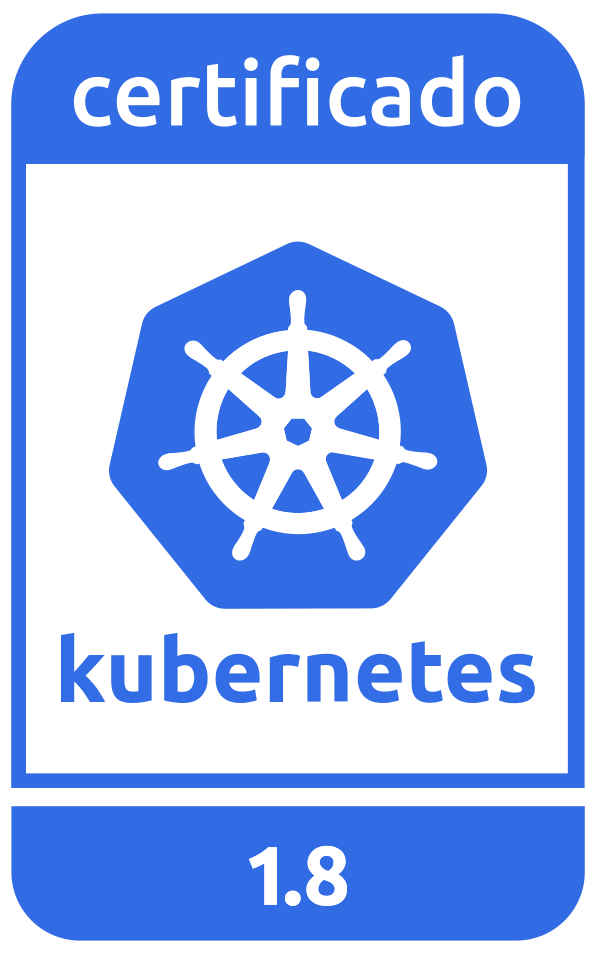
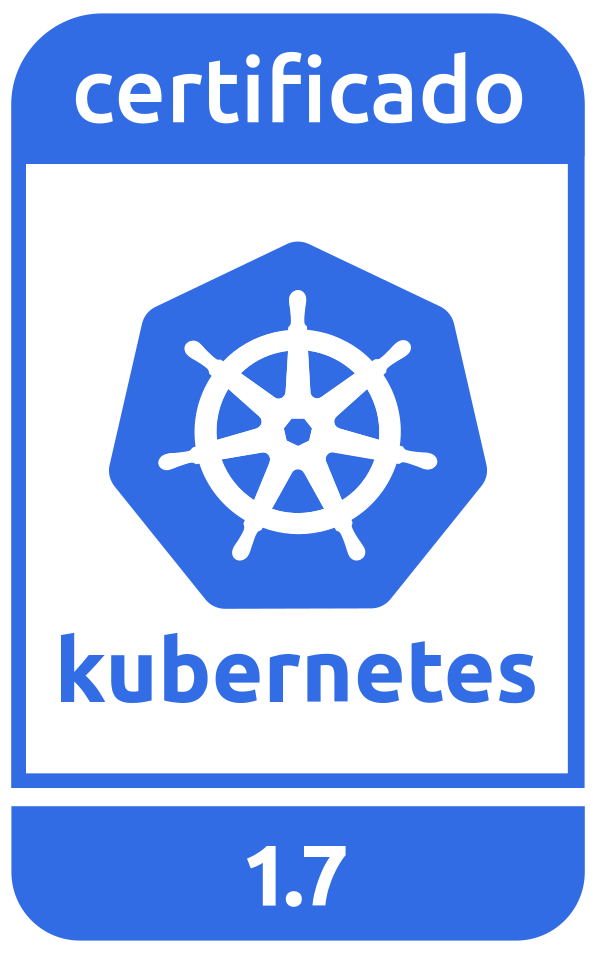

---

copyright:
  years: 2014, 2018
lastupdated: "2018-02-08"

---

{:new_window: target="_blank"}
{:shortdesc: .shortdesc}
{:screen: .screen}
{:pre: .pre}
{:table: .aria-labeledby="caption"}
{:codeblock: .codeblock}
{:tip: .tip}
{:download: .download}

# Versiones de Kubernetes para {{site.data.keyword.containerlong_notm}}
{: #cs_versions}

{{site.data.keyword.containerlong}} da soporte a varias versiones de Kubernetes simultáneamente: la versión más reciente, una versión predeterminada y una versión soportada, que normalmente es dos versiones anteriores a la última. La versión predeterminada puede ser la misma que la versión más reciente, y se utiliza al crear o actualizar un clúster, a menos que especifique otra versión.
{:shortdesc}

Las versiones de Kubernetes actualmente soportadas son:

- Más reciente: 1.9.2
- Predeterminada: 1.8.6
- Soportada: 1.7.4

Si está ejecutando clústeres en una versión de Kubernetes que no esté soportada actualmente, [revise las posibles repercusiones](#version_types) de las actualizaciones y, a continuación, [actualice su clúster](cs_cluster_update.html#update) inmediatamente para continuar recibiendo importantes actualizaciones de seguridad y soporte. Para comprobar la versión del servidor, ejecute el siguiente mandato.

```
kubectl version  --short | grep -i server
```
{: pre}

Salida de ejemplo:

```
Versión del servidor: 1.8.6
```
{: screen}

## Tipos de actualización
{: #version_types}

Kubernetes proporciona estos tipos de actualización:
{:shortdesc}

|Tipo actualización|Ejemplos de etiquetas de versión|Actualizado por|Impacto
|-----|-----|-----|-----|
|Mayor|1.x.x|Puede|Operación de clústeres de cambios, incluyendo scripts o despliegues.|
|Menor|x.5.x|Puede|Operación de clústeres de cambios, incluyendo scripts o despliegues.|
|Parche|x.x.3|IBM y el usuario|No requiere cambios en scripts ni en despliegues. IBM actualiza los maestros automáticamente, pero el usuario debe aplicar los parches a los nodos trabajadores.|
{: caption="Consecuencias en las actualizaciones de Kubernetes" caption-side="top"}

De forma predeterminada, no se puede actualizar un maestro de Kubernetes con una antigüedad superior a dos versiones. Por ejemplo, si el maestro actual es de la versión 1.5 y desea actualizar a 1.8, primero se debe actualizar a la versión 1.7. Puede formar la actualización para continuar, pero actualizar a dos versiones anteriores puede provocar resultados imprevistos.
{: tip}

La siguiente información resume las actualizaciones que pueden tener un impacto probable sobre las apps desplegadas cuando se actualice un clúster a una nueva versión desde la versión anterior. Revise el [registro de cambios de Kubernetes ](https://github.com/kubernetes/kubernetes/blob/master/CHANGELOG.md) para ver una lista completa de los cambios en las versiones Kubernetes.

Para obtener más información sobre el proceso de actualización, consulte [Actualización de clústeres](cs_cluster_update.html#master) y [Actualización de nodos trabajadores](cs_cluster_update.html#worker_node).

## Versión 1.9
{: #cs_v19}


Revise los cambios que necesite hacer cuando actualice de la versión anterior de Kubernetes a 1.9.

<br/>

### Actualización antes de maestro
{: #19_before}

<table summary="Actualizaciones de Kubernetes para la versión 1.9">
<caption>Cambios necesarios antes de actualizar el maestro a Kubernetes 1.9</caption>
<thead>
<tr>
<th>Tipo</th>
<th>Descripción</th>
</tr>
</thead>
<tbody>
<tr>
<td>API de admisión de Webhook</td>
<td>La API de admisión, que se utiliza cuando el servidor de API llama a webhooks de control de admisión, se desplaza de <code>admission.v1alpha1</code> a <code>admission.v1beta1</code>. <em>Debe suprimir cualquier webhook existente antes de actualizar el clúster</em>, así como actualizar los archivos de configuración de webhook para utilizar la API más reciente. Este cambio no es compatible con versiones anteriores.</td>
</tr>
</tbody>
</table>

### Actualización después de maestro
{: #19_after}

<table summary="Actualizaciones de Kubernetes para la versión 1.9">
<caption>Cambios necesarios después de actualizar el maestro a Kubernetes 1.9</caption>
<thead>
<tr>
<th>Tipo</th>
<th>Descripción</th>
</tr>
</thead>
<tbody>
<tr>
<td>Salida `kubectl`</td>
<td>Ahora, cuando se utiliza el mandato `kubectl` para especificar `-o custom-columns` y no se encuentra la columna en el objeto, verá una salida de `<none>`.<br>
Antes, la operación fallaba y se mostraba el mensaje de error `No se ha encontrado xxx`. Si sus scripts se basan en el comportamiento anterior, actualícelos.</td>
</tr>
<tr>
<td>`kubectl patch`</td>
<td>Ahora, si no se realizan cambios en el recurso al que se aplican parches, el mandato `kubectl patch` falla con `exit code 1`. Si sus scripts se basan en el comportamiento anterior, actualícelos.</td>
</tr>
<tr>
<td>Permisos del panel de control de Kubernetes</td>
<td>Los usuarios ahora tienen que iniciar sesión en el panel de control de Kubernetes con sus credenciales para ver los recursos del clúster. La autorización RBAC del panel de control de Kubernetes `ClusterRoleBinding` predeterminado se ha eliminado. Para obtener instrucciones, consulte [Inicio del panel de control de Kubernetes](cs_app.html#cli_dashboard).</td>
</tr>
<tr>
<td>RBAC para `default` `ServiceAccount`</td>
<td>Se ha eliminado el administrador `ClusterRoleBinding` para `default` `ServiceAccount` en el espacio de nombres `default`. Si sus aplicaciones se basan en esta política RBAC para acceder a la API de Kubernetes, [actualice sus políticas RBAC](https://kubernetes.io/docs/admin/authorization/rbac/#api-overview).</td>
</tr>
<tr>
<td>Corrupciones y tolerancias</td>
<td>Las corrupciones `node.alpha.kubernetes.io/notReady` y `node.alpha.kubernetes.io/unreachable` se han cambiado a `node.kubernetes.io/not-ready` y `node.kubernetes.io/unreachable` respectivamente.<br>
A pesar de que las corrupciones se actualizan automáticamente, deberá actualizar manualmente las tolerancias para dichas corrupciones. Para cada espacio de nombres excepto `ibm-system` y `kube-system`, determine si tiene que cambiar las tolerancias:<br>
<ul><li><code>kubectl get pods -n &lt;namespace&gt; -o yaml | grep "node.alpha.kubernetes.io/notReady" && echo "Action required"</code></li><li>
<code>kubectl get pods -n &lt;namespace&gt; -o yaml | grep "node.alpha.kubernetes.io/unreachable" && echo "Action required"</code></li></ul><br>
Si se devuelve `Action required`, modifique las tolerancias de pod en consonancia.</td>
</tr>
<tr>
<td>API de admisión de Webhook</td>
<td>Si ha suprimido los webhooks existentes antes de actualizar el clúster, cree nuevos webhooks.</td>
</tr>
</tbody>
</table>


## Versión 1.8
{: #cs_v18}

<p> {{site.data.keyword.containerlong_notm}} es un producto Kubernetes certificado para la versión 1.8 bajo el programa CNCF de certificación de conformidad de software Kubernetes. _Kubernetes® es una marca registrada de The Linux Foundation en Estados Unidos y en otros países, y se utiliza de acuerdo con una licencia de The Linux Foundation._</p>

Revise los cambios que necesite hacer cuando actualice de la versión anterior de Kubernetes a 1.8.

<br/>

### Actualización antes de maestro
{: #18_before}

<table summary="Actualizaciones de Kubernetes para las versiones 1.8">
<caption>Cambios necesarios antes de actualizar el maestro a Kubernetes 1.8</caption>
<thead>
<tr>
<th>Tipo</th>
<th>Descripción</th>
</tr>
</thead>
<tbody>
<tr>
<td colspan='2'>No hay cambios necesarios antes de actualizar el maestro</td>
</tr>
</tbody>
</table>

### Actualización después de maestro
{: #18_after}

<table summary="Actualizaciones de Kubernetes para las versiones 1.8">
<caption>Cambios necesarios después de actualizar el maestro a Kubernetes 1.8</caption>
<thead>
<tr>
<th>Tipo</th>
<th>Descripción</th>
</tr>
</thead>
<tbody>
<tr>
<td>Inicio de sesión en el panel de control de Kubernetes</td>
<td>El URL para acceder al panel de control de Kubernetes en la versión 1.8 ha cambiado y el proceso de inicio de sesión incluye un nuevo paso de autenticación. Consulte [acceso al panel de control de Kubernetes](cs_app.html#cli_dashboard) para obtener más información.</td>
</tr>
<tr>
<td>Permisos del panel de control de Kubernetes</td>
<td>Para forzar a los usuarios a que inicien sesión con sus credenciales para ver recursos de clúster en la versión 1.8, elimine la autorización 1.7 ClusterRoleBinding RBAC. Ejecute `kubectl delete clusterrolebinding -n kube-system kubernetes-dashboard`.</td>
</tr>
<tr>
<td>`kubectl delete`</td>
<td>El mandato `kubectl delete` ya no reduce los objetos de la API de carga de trabajo, como los pods, antes de suprimir el objeto. Si necesita reducir el objeto, utilice la [escala kubectl ](https://kubernetes.io/docs/reference/generated/kubectl/kubectl-commands#scale) antes de suprimir el objeto.</td>
</tr>
<tr>
<td>`kubectl run`</td>
<td>El mandato `kubectl run` debe utilizar varios distintivos para `--env` en lugar de argumentos separados por comas. Por ejemplo, ejecute <code>kubectl run --env &lt;x&gt;=&lt;y&gt; --env &lt;z&gt;=&lt;a&gt;</code> y no <code>kubectl run --env &lt;x&gt;=&lt;y&gt;,&lt;z&gt;=&lt;a&gt;</code>. </td>
</tr>
<tr>
<td>`kubectl stop`</td>
<td>El mandato `kubectl stop` ya no está disponible.</td>
</tr>
</tbody>
</table>


## Versión 1.7
{: #cs_v17}

<p> {{site.data.keyword.containerlong_notm}} es un producto Kubernetes certificado para la versión 1.7 bajo el programa CNCF de certificación de conformidad de software Kubernetes.</p>

Revise los cambios que necesite hacer cuando actualice de la versión anterior de Kubernetes a 1.7.

<br/>

### Actualización antes de maestro
{: #17_before}

<table summary="Actualizaciones de Kubernetes para las versiones 1.7 y 1.6">
<caption>Cambios necesarios antes de actualizar el maestro a Kubernetes 1.7</caption>
<thead>
<tr>
<th>Tipo</th>
<th>Descripción</th>
</tr>
</thead>
<tbody>
<tr>
<td>Almacenamiento</td>
<td>Los scripts de configuración con `hostPath` y `mountPath` con referencias al directorio padre como `../to/dir` no están permitidos. Cambie las vías de acceso por vías de acceso absolutas simples, como por ejemplo `/path/to/dir`.
<ol>
  <li>Determine si necesita cambiar las vías de acceso:</br>
  ```
  kubectl get pods --all-namespaces -o yaml | grep "\.\." && echo "Action required"
  ```
  </br>

  <li>Si se devuelve `Action required`, modifique los pods para que hagan referencia a la vía de acceso absoluta antes de actualizar todos los nodos trabajadores. Si el pod es propiedad de otro recurso, como por ejemplo un despliegue, modifique el valor de [_PodSpec_ ](https://kubernetes.io/docs/api-reference/v1.7/#podspec-v1-core) dentro de dicho recurso.
</ol>
</td>
</tr>
</tbody>
</table>

### Actualización después de maestro
{: #17_after}

<table summary="Actualizaciones de Kubernetes para las versiones 1.7 y 1.6">
<caption>Cambios necesarios después de actualizar el maestro a Kubernetes 1.7</caption>
<thead>
<tr>
<th>Tipo</th>
<th>Descripción</th>
</tr>
</thead>
<tbody>
<tr>
<td>kubectl</td>
<td>Después de actualizar la CLI `kubectl`, estos mandatos `kubectl create` deben utilizar varios distintivos en lugar de argumentos separados por comas:<ul>
 <li>`role`
 <li>`clusterrole`
 <li>`rolebinding`
 <li>`clusterrolebinding`
 <li>`secret`
 </ul>
</br>  Por ejemplo, ejecute `kubectl create role --resource-name <x> --resource-name <y>` y no `kubectl create role --resource-name <x>,<y>`.</td>
</tr>
<tr>
<td>Planificación de la afinidad de pod</td>
<td> La anotación `scheduler.alpha.kubernetes.io/affinity` ya no se utiliza.
<ol>
  <li>Para cada espacio de nombres excepto para `ibm-system` y `kube-system`, determine si necesita actualizar la Planificación de la afinidad de pod:</br>
  ```
  kubectl get pods -n <namespace> -o yaml | grep "scheduler.alpha.kubernetes.io/affinity" && echo "Action required"
  ```
  </br></li>
  <li>Si se devuelve `"Action required"`, utilice el campo de [_PodSpec_ ](https://kubernetes.io/docs/api-reference/v1.7/#podspec-v1-core) _affinity_ en lugar de la anotación `scheduler.alpha.kubernetes.io/affinity`.</li>
</ol>
</tr>
<tr>
<td>Política de red</td>
<td>La anotación `net.beta.kubernetes.io/network-policy` ya no está disponible.
<ol>
  <li>Determine si necesita cambiar las políticas:</br>
  ```
  kubectl get ns -o yaml | grep "net.beta.kubernetes.io/network-policy" | grep "DefaultDeny" && echo "Action required"
  ```
  <li>Si se devuelve `"Action required"`, añada la siguiente política de red a cada espacio de nombres de Kubernetes que aparezca en la lista:</br>

  <pre class="codeblock">
  <code>
  kubectl create -n &lt;namespace&gt; -f - &lt;&lt;EOF
  kind: NetworkPolicy
  apiVersion: networking.k8s.io/v1
  metadata:
    name: default-deny
    namespace: &lt;namespace&gt;
  spec:
    podSelector: {}
  EOF
  </code>
  </pre>

  <li> Una vez añadida la política de redes, elimine la anotación `net.beta.kubernetes.io/network-policy`:
  ```
  kubectl annotate ns <namespace> --overwrite "net.beta.kubernetes.io/network-policy-"
  ```
  </li></ol>
</tr>
<tr>
<td>Tolerancias</td>
<td>La anotación `scheduler.alpha.kubernetes.io/tolerations` ya no está disponible.
<ol>
  <li>Para cada espacio de nombre excepto para `ibm-system` y `kube-system`, determine si necesita cambiar las tolerancias:</br>
  ```
  kubectl get pods -n <namespace> -o yaml | grep "scheduler.alpha.kubernetes.io/tolerations" && echo "Action required"
  ```
  </br>

  <li>Si se devuelve `"Action required"`, utilicen el campo de [_PodSpec_ ](https://kubernetes.io/docs/api-reference/v1.7/#podspec-v1-core) _tolerations_ en lugar de la anotación `scheduler.alpha.kubernetes.io/tolerations`.
</ol>
</tr>
<tr>
<td>Corrupciones</td>
<td>La anotación `scheduler.alpha.kubernetes.io/taints` ya no está disponible.
<ol>
  <li>Determine si necesita cambiar las corrupciones:</br>
  ```
  kubectl get nodes -o yaml | grep "scheduler.alpha.kubernetes.io/taints" && echo "Action required"
  ```
  <li>Si se devuelve `"Action required"`, elimine la anotación `scheduler.alpha.kubernetes.io/taints` para cada nodo:</br>
  `kubectl annotate nodes <node> scheduler.alpha.kubernetes.io/taints-`
  <li>Añada una corrupción a cada nodo:</br>
  `kubectl taint node <node> <taint>`
  </li></ol>
</tr>
<tr>
<td>StatefulSet pod DNS</td>
<td>Los pods StatefulSet pierden las entradas Kubernetes DNS correspondientes después de haber actualizado el maestro. Para restaurar las entradas DNS, suprima los pods StatefulSet. Kubernetes vuelve a crear los pods y restaura automáticamente las entradas DNS. Para más información, consulte el [Tema sobre Kubernetes ](https://github.com/kubernetes/kubernetes/issues/48327).
</tr>
</tbody>
</table>
