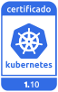
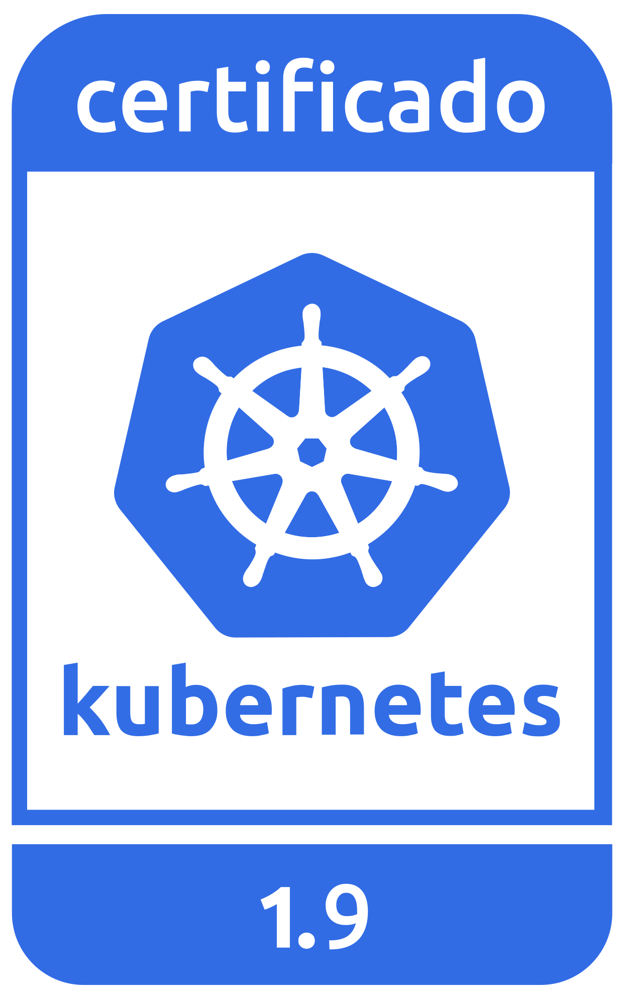

---

copyright:
  years: 2014, 2018
lastupdated: "2018-08-06"

---

{:new_window: target="_blank"}
{:shortdesc: .shortdesc}
{:screen: .screen}
{:pre: .pre}
{:table: .aria-labeledby="caption"}
{:codeblock: .codeblock}
{:tip: .tip}
{:download: .download}


# Información de versión y acciones de actualización
{: #cs_versions}

## Tipos de versión de Kubernetes
{: #version_types}

{{site.data.keyword.containerlong}} da soporte a varias versiones de Kubernetes simultáneamente. Cuando se publica una versión más reciente (n), se da soporte a hasta 2 versiones anteriores (n-2). Las versiones anteriores a 2 versiones anteriores a la versión más reciente (n-3) son las primeras que quedan en desuso y a las que se deja de dar soporte.
{:shortdesc}

**Versiones soportadas de Kubernetes**:

- Última: 1.10.5
- Predeterminada: 1.10.5
- Otras: 1.9.9, 1.8.15

</br>

**Versiones en desuso**: cuando los clústeres se ejecutan en una versión en desuso de Kubernetes, tiene 30 días para revisar y actualizar a una versión soportada de Kubernetes antes de que la versión deje de estar soportada. Durante el periodo de desuso, el clúster sigue recibiendo soporte completo. Sin embargo, no puede crear nuevos clústeres que utilicen la versión en desuso.

**Versiones no soportadas**: si está ejecutando clústeres con una versión de Kubernetes que no esté soportada, [revise las posibles repercusiones](#version_types) de las actualizaciones y, a continuación, [actualice el clúster](cs_cluster_update.html#update) inmediatamente para continuar recibiendo importantes actualizaciones de seguridad y soporte. 
*  **Atención**: si espera hasta que el clúster esté tres o más versiones por detrás de una versión soportada, deberá forzar la actualización, lo que podría provocar resultados o errores inesperados. 
*  Los clústeres no soportados no pueden añadir ni volver a cargar nodos trabajadores existentes. 
*  Después de actualizar el clúster a una versión soportada, el clúster puede reanudar las operaciones normales y seguir recibiendo soporte.

</br>

Para comprobar la versión del servidor de un clúster, ejecute el mandato siguiente.

```
kubectl version  --short | grep -i server
```
{: pre}

Salida de ejemplo:

```
Server Version: v1.10.5+IKS
```
{: screen}


## Tipos de actualización
{: #update_types}

El clúster Kubernetes tiene tres tipos de actualizaciones: mayores, menores y parches.
{:shortdesc}

|Tipo actualización|Ejemplos de etiquetas de versión|Actualizado por|Impacto
|-----|-----|-----|-----|
|Mayor|1.x.x|Puede|Operación de clústeres de cambios, incluyendo scripts o despliegues.|
|Menor|x.9.x|Puede|Operación de clústeres de cambios, incluyendo scripts o despliegues.|
|Parche|x.x.4_1510|IBM y el usuario|Parches de Kubernetes, así como otras actualizaciones de componentes de Proveedor de {{site.data.keyword.Bluemix_notm}} como, por ejemplo, parches de seguridad y del sistema operativo. IBM actualiza los maestros automáticamente, pero el usuario debe aplicar los parches a los nodos trabajadores.|
{: caption="Consecuencias en las actualizaciones de Kubernetes" caption-side="top"}

A medida que las actualizaciones pasan a estar disponibles, se le notifica cuando visualiza información sobre los nodos trabajadores, por ejemplo con los mandatos `ibmcloud ks workers <cluster>` o `ibmcloud ks worker-get <cluster> <worker>`.
-  **Actualizaciones menores y mayores**: En primer lugar, [actualice el nodo maestro](cs_cluster_update.html#master) y, a continuación, [actualice los nodos trabajadores](cs_cluster_update.html#worker_node).
   - De forma predeterminada, no es posible actualizar un maestro de Kubernetes tres o más versiones menores al mismo tiempo. Por ejemplo, si el maestro actual es de la versión 1.5 y desea actualizar a 1.8, primero se debe actualizar a la versión 1.7. Puede forzar la actualización para continuar, pero actualizar más de dos versiones menores puede provocar resultados o errores imprevistos.
   - Si utiliza una versión de CLI `kubectl` que coincide al menos con la versión `major.minor` de los clústeres, puede experimentar resultados inesperados. Mantenga actualizadas las [versiones de la CLI](cs_cli_install.html#kubectl) y el clúster de Kubernetes.
-  **Actualizaciones de parche**: compruebe mensualmente si hay una actualización disponible, y utilice el [mandato](cs_cli_reference.html#cs_worker_update) `ibmcloud ks worker-update` o el [mandato](cs_cli_reference.html#cs_worker_reload) `ibmcloud ks worker-reload` para aplicar estos parches de sistema operativo y de seguridad. Para obtener más información, consulte el [registro de cambio de versiones](cs_versions_changelog.html).

<br/>

Esta información resume las actualizaciones que pueden tener un probable impacto sobre las apps desplegadas al actualizar un clúster a una nueva versión desde la versión anterior.
-  [Acciones de migración](#cs_v110) de la versión 1.10.
-  [Acciones de migración](#cs_v19) de la versión 1.9.
-  [Acciones de migración](#cs_v18) de la versión 1.8.
-  [Archivo](#k8s_version_archive) de versiones no soportadas o en desuso.

<br/>

Para ver una lista completa de cambios, revise la siguiente información:
* [Registro de cambios de Kubernetes ](https://github.com/kubernetes/kubernetes/blob/master/CHANGELOG.md).
* [Registro de cambios de versión de IBM](cs_versions_changelog.html).

## Versión 1.10
{: #cs_v110}

<p> {{site.data.keyword.containerlong_notm}} es un producto certificado para Kubernetes versión 1.10 bajo el programa CNCF Kubernetes Software Conformance Certification. _Kubernetes® es una marca registrada de The Linux Foundation en Estados Unidos y en otros países, y se utiliza de acuerdo con una licencia de The Linux Foundation._</p>

Revise los cambios que puede necesitar hacer cuando vaya a actualizar de la versión anterior de Kubernetes a la versión 1.10.

**Importante**: Antes de poder actualizar de forma satisfactoria a Kubernetes 1.10, debe seguir los pasos que se indican en [Preparación para actualizar a Calico v3](#110_calicov3).

<br/>

### Actualización antes de maestro
{: #110_before}

<table summary="Actualizaciones de Kubernetes para la versión 1.10">
<caption>Cambios necesarios antes de actualizar el maestro a Kubernetes 1.10</caption>
<thead>
<tr>
<th>Tipo</th>
<th>Descripción</th>
</tr>
</thead>
<tbody>
<tr>
<td>Calico v3</td>
<td>La actualización a Kubernetes versión 1.10 también actualiza Calico desde la v2.6.5 a v3.1.1. <strong>Importante</strong>: Antes de poder actualizar de forma satisfactoria a Kubernetes v1.10, debe seguir los pasos que se indican en [Preparación para actualizar a Calico v3](#110_calicov3).</td>
</tr>
<tr>
<td>Política de red del panel de control de Kubernetes</td>
<td>En Kubernetes 1.10, la política de red <code>kubernetes-dashboard</code> en el espacio de nombres <code>kube-system</code> bloquea el acceso de todos los pods al panel de control de Kubernetes. Sin embargo, esto <strong>no</strong> afecta a la posibilidad de acceder al panel de control desde la consola de {{site.data.keyword.Bluemix_notm}} o utilizando <code>kubectl proxy</code>. Sin un podo precisa de acceso al panel de control, puede añadir la etiqueta <code>kubernetes-dashboard-policy: allow</code> a un espacio de nombre y, a continuación, desplegar el pod en el espacio de nombres.</td>
</tr>
<tr>
<td>Acceso a la API de Kubelet</td>
<td>La autorización a la API de Kubelet ahora se delega en el <code>servidor de API de Kubernetes</code>. El acceso a la API de Kubelet ahora se basa en los <code>ClusterRoles</code> que otorgan permisos para acceder a los subrecursos de <strong>node</strong>. De forma predeterminada, Kubernetes Heapster tiene <code>ClusterRole</code> y <code>ClusterRoleBinding</code>. Sin embargo, si otros usuarios o apps utilizan la API de Kubelet, les debe otorgar permisos para que utilicen la API. Consulte en la documentación de Kubernetes la página [Autorización de Kubelet ](https://kubernetes.io/docs/reference/command-line-tools-reference/kubelet-authentication-authorization/).</td>
</tr>
<tr>
<td>Suites de cifrado</td>
<td>Las suites de cifrado soportadas para el <code>servidor de API de Kubernetes</code> y la API de Kubelet están ahora restringidas a un subconjunto con un cifrado fuerte de 128 bits o más. Si tiene recursos o automatizaciones existentes que utilicen cifrados más débiles y se utilicen para comunicarse con el <code>servidor de API de Kubernetes</code> o la API de Kubelet, habilite el soporte para un cifrado más fuerte antes de actualizar el maestro.</td>
</tr>
<tr>
<td>VPN strongSwan</td>
<td>Si utiliza [strongSwan](cs_vpn.html#vpn-setup) para la conectividad de VPN, debe eliminar el diagrama antes de actualizar el clúster ejecutando `helm delete -- purge <release_name>`. Una vez finalizada la actualización del clúster, vuelva a instalar el diagrama de Helm strongSwan.</td>
</tr>
</tbody>
</table>

### Actualización después de nodo maestro
{: #110_after}

<table summary="Actualizaciones de Kubernetes para la versión 1.10">
<caption>Cambios necesarios después de actualizar el nodo maestro a Kubernetes 1.10</caption>
<thead>
<tr>
<th>Tipo</th>
<th>Descripción</th>
</tr>
</thead>
<tbody>
<tr>
<td>Calico v3</td>
<td>Cuando se actualice el clúster, todos los datos existentes de Calico del clúster se migran de forma automática para utilizar la sintaxis de Calico v3. Para ver, añadir o modificar recursos de Calico con la sintaxis de Calico v3, actualice su [configuración de CLI de Calico a la versión 3.1.1](#110_calicov3).</td>
</tr>
<tr>
<td>Dirección <code>ExternalIP</code> del nodo</td>
<td>El campo <code>ExternalIP</code> de un nodo ahora se establece en el valor de la dirección IP pública del nodo. Revise y actualice todos los recursos que dependan de este valor.</td>
</tr>
<tr>
<td><code>kubectl port-forward</code></td>
<td>Ahora al utilizar el mandato <code>kubectl port-forward</code>, ya no se dará soporte al distintivo <code>-p</code>. Si sus scripts se basan en el comportamiento anterior, actualícelos sustituyendo el distintivo <code>-p</code> con el nombre de pod.</td>
</tr>
<tr>
<td>Volúmenes de datos de API de solo lectura</td>
<td>Ahora se montan como de solo lectura los volúmenes proyectados, `secret`, `configMap` y `downwardAPI`.
Con anterioridad, las apps podían escribir datos en estos volúmenes que el sistema podía revertir de forma automática. Esta acción de migración es necesaria para corregir la vulnerabilidad de seguridad [CVE-2017-1002102](https://cve.mitre.org/cgi-bin/cvename.cgi?name=2017-1002102).
Si sus apps se basaban en este comportamiento inseguro anterior, modifíquelas en consecuencia.</td>
</tr>
<tr>
<td>VPN strongSwan</td>
<td>Si utiliza [strongSwan](cs_vpn.html#vpn-setup) para la conectividad VPN y ha suprimido su diagrama antes de actualizar el clúster, ya puede volver a instalar el diagrama de Helm strongSwan.</td>
</tr>
</tbody>
</table>

### Preparación para actualizar a Calico v3
{: #110_calicov3}

Antes de empezar, el maestro del clúster y todos los nodos trabajadores deben estar ejecutándose con Kubernetes versión 1.8 o posterior, y deben tener como mínimo un nodo trabajador.

**Importante**: Prepárese para la actualización a Calico v3 antes de actualizar el maestro. Durante la actualización del maestro a Kubernetes v1.10, los nuevos pods y las nuevas políticas de red de Calico o Kubernetes no se planifican. La cantidad de tiempo que la actualización impide nuevas planificaciones varía. En pequeños clústeres podría llevar unos minutos, con unos minutos adicionales por cada 10 nodos. Los pods y las políticas de red existentes continuarán en ejecución.

1.  Verifique que el estado de los pods de Calico es correcto.
    ```
    kubectl get pods -n kube-system -l k8s-app=calico-node -o wide
    ```
    {: pre}

2.  Si hay algún podo que no esté en el estado **Running**, suprima el pod y espere hasta que esté en el estado **Running** antes de continuar.

3.  Si genera automáticamente políticas de Calico u otros recursos de Calico, actualice su herramienta de automatización para generar estos recursos con la [sintaxis de Calico v3 ](https://docs.projectcalico.org/v3.1/reference/calicoctl/resources/).

4.  Si utiliza [strongSwan](cs_vpn.html#vpn-setup) para la conectividad de VPN, el diagrama de Helm strongSwan 2.0.0 no funciona con Calico v3 ni Kubernetes 1.10. [Actualice strongSwan](cs_vpn.html#vpn_upgrade) al diagrama Helm 2.1.0, que es compatible con la versión anterior de Calico 2.6 y Kubernetes 1.7, 1.8 y 1.9.

5.  [Actualice el nodo maestro del clúster a Kubernetes v1.10](cs_cluster_update.html#master).

<br />


## Versión 1.9
{: #cs_v19}

<p> {{site.data.keyword.containerlong_notm}} es un producto Kubernetes certificado para la versión 1.9 bajo el programa CNCF de certificación de conformidad de software Kubernetes. _Kubernetes® es una marca registrada de The Linux Foundation en Estados Unidos y en otros países, y se utiliza de acuerdo con una licencia de The Linux Foundation._</p>

Revise los cambios que puede necesitar hacer cuando vaya a actualizar de la versión anterior de Kubernetes a 1.9.

<br/>

### Actualización antes de maestro
{: #19_before}

<table summary="Actualizaciones de Kubernetes para la versión 1.9">
<caption>Cambios necesarios antes de actualizar el maestro a Kubernetes 1.9</caption>
<thead>
<tr>
<th>Tipo</th>
<th>Descripción</th>
</tr>
</thead>
<tbody>
<tr>
<td>API de admisión de Webhook</td>
<td>La API de admisión, que se utiliza cuando el servidor de API llama a webhooks de control de admisión, se desplaza de <code>admission.v1alpha1</code> a <code>admission.v1beta1</code>. <em>Debe suprimir cualquier webhook existente antes de actualizar el clúster</em>, así como actualizar los archivos de configuración de webhook para utilizar la API más reciente. Este cambio no es compatible con versiones anteriores.</td>
</tr>
</tbody>
</table>

### Actualización después de nodo maestro
{: #19_after}

<table summary="Actualizaciones de Kubernetes para la versión 1.9">
<caption>Cambios necesarios después de actualizar el maestro a Kubernetes 1.9</caption>
<thead>
<tr>
<th>Tipo</th>
<th>Descripción</th>
</tr>
</thead>
<tbody>
<tr>
<td>Salida `kubectl`</td>
<td>Ahora, cuando se utiliza el mandato `kubectl` para especificar `-o custom-columns` y no se encuentra la columna en el objeto, verá una salida de `<none>`.<br>
Antes, la operación fallaba y se mostraba el mensaje de error `No se ha encontrado xxx`. Si sus scripts se basan en el comportamiento anterior, actualícelos.</td>
</tr>
<tr>
<td>`kubectl patch`</td>
<td>Ahora, si no se realizan cambios en el recurso al que se aplican parches, el mandato `kubectl patch` falla con `exit code 1`. Si sus scripts se basan en el comportamiento anterior, actualícelos.</td>
</tr>
<tr>
<td>Permisos del panel de control de Kubernetes</td>
<td>Los usuarios tienen que iniciar sesión en el panel de control de Kubernetes con sus credenciales para ver los recursos del clúster. La autorización RBAC del panel de control de Kubernetes `ClusterRoleBinding` predeterminado se ha eliminado. Para obtener instrucciones, consulte [Inicio del panel de control de Kubernetes](cs_app.html#cli_dashboard).</td>
</tr>
<tr>
<td>Volúmenes de datos de API de solo lectura</td>
<td>Ahora se montan como de solo lectura los volúmenes proyectados, `secret`, `configMap` y `downwardAPI`.
Con anterioridad, las apps podían escribir datos en estos volúmenes que el sistema podía revertir de forma automática. Esta acción de migración es necesaria para corregir la vulnerabilidad de seguridad [CVE-2017-1002102](https://cve.mitre.org/cgi-bin/cvename.cgi?name=2017-1002102).
Si sus apps se basaban en este comportamiento inseguro anterior, modifíquelas en consecuencia.</td>
</tr>
<tr>
<td>Antagonismos y tolerancias</td>
<td>Los antagonismos `node.alpha.kubernetes.io/notReady` y `node.alpha.kubernetes.io/unreachable` se han cambiado a `node.kubernetes.io/not-ready` y `node.kubernetes.io/unreachable` respectivamente.<br>
A pesar de que los antagonismos se actualizan automáticamente, deberá actualizar manualmente las tolerancias para dichos antagonismos. Para cada espacio de nombre excepto para `ibm-system` y `kube-system`, determine si necesita cambiar las tolerancias:<br>
<ul><li><code>kubectl get pods -n &lt;namespace&gt; -o yaml | grep "node.alpha.kubernetes.io/notReady" && echo "Action required"</code></li><li>
<code>kubectl get pods -n &lt;namespace&gt; -o yaml | grep "node.alpha.kubernetes.io/unreachable" && echo "Action required"</code></li></ul><br>
Si se devuelve `Action required`, modifique las tolerancias de pod en consonancia.</td>
</tr>
<tr>
<td>API de admisión de Webhook</td>
<td>Si ha suprimido los webhooks existentes antes de actualizar el clúster, cree nuevos webhooks.</td>
</tr>
</tbody>
</table>

<br />


## Versión 1.8
{: #cs_v18}

<p> {{site.data.keyword.containerlong_notm}} es un producto Kubernetes certificado para la versión 1.8 bajo el programa CNCF de certificación de conformidad de software Kubernetes. _Kubernetes® es una marca registrada de The Linux Foundation en Estados Unidos y en otros países, y se utiliza de acuerdo con una licencia de The Linux Foundation._</p>

Revise los cambios que puede necesitar hacer cuando vaya a actualizar de la versión anterior de Kubernetes a 1.8.

<br/>

### Actualización antes de maestro
{: #18_before}

<table summary="Actualizaciones de Kubernetes para las versiones 1.8">
<caption>Cambios necesarios antes de actualizar el maestro a Kubernetes 1.8</caption>
<thead>
<tr>
<th>Tipo</th>
<th>Descripción</th>
</tr>
</thead>
<tbody>
<tr>
<td>Ninguno</td>
<td>No hay cambios necesarios antes de actualizar el maestro</td>
</tr>
</tbody>
</table>

### Actualización después de nodo maestro
{: #18_after}

<table summary="Actualizaciones de Kubernetes para las versiones 1.8">
<caption>Cambios necesarios después de actualizar el maestro a Kubernetes 1.8</caption>
<thead>
<tr>
<th>Tipo</th>
<th>Descripción</th>
</tr>
</thead>
<tbody>
<tr>
<td>Inicio de sesión en el panel de control de Kubernetes</td>
<td>El URL para acceder al panel de control de Kubernetes en la versión 1.8 ha cambiado y el proceso de inicio de sesión incluye un nuevo paso de autenticación. Para obtener más información, consulte el [acceso al panel de control de Kubernetes](cs_app.html#cli_dashboard).</td>
</tr>
<tr>
<td>Permisos del panel de control de Kubernetes</td>
<td>Para forzar a los usuarios a que inicien sesión con sus credenciales para ver recursos de clúster en la versión 1.8, elimine la autorización 1.7 ClusterRoleBinding RBAC. Ejecute `kubectl delete clusterrolebinding -n kube-system kubernetes-dashboard`.</td>
</tr>
<tr>
<td>`kubectl delete`</td>
<td>El mandato `kubectl delete` ya no reduce los objetos de la API de carga de trabajo, como los pods, antes de suprimir el objeto. Si necesita reducir el objeto, utilice la [`escala kubectl ` ](https://kubernetes.io/docs/reference/kubectl/overview/#scale) antes de suprimir el objeto.</td>
</tr>
<tr>
<td>`kubectl run`</td>
<td>El mandato `kubectl run` debe utilizar varios distintivos para `--env` en lugar de argumentos separados por comas. Por ejemplo, ejecute <code>kubectl run --env &lt;x&gt;=&lt;y&gt; --env &lt;z&gt;=&lt;a&gt;</code> y no <code>kubectl run --env &lt;x&gt;=&lt;y&gt;,&lt;z&gt;=&lt;a&gt;</code>. </td>
</tr>
<tr>
<td>`kubectl stop`</td>
<td>El mandato `kubectl stop` ya no está disponible.</td>
</tr>
<tr>
<td>Volúmenes de datos de API de solo lectura</td>
<td>Ahora se montan como de solo lectura los volúmenes proyectados, `secret`, `configMap` y `downwardAPI`.
Con anterioridad, las apps podían escribir datos en estos volúmenes que el sistema podía revertir de forma automática. Esta acción de migración es necesaria para corregir la vulnerabilidad de seguridad [CVE-2017-1002102](https://cve.mitre.org/cgi-bin/cvename.cgi?name=2017-1002102).
Si sus apps se basaban en este comportamiento inseguro anterior, modifíquelas en consecuencia.</td>
</tr>
</tbody>
</table>

<br />


## Archivo
{: #k8s_version_archive}

### Versión 1.7 (no soportada)
{: #cs_v17}

A partir del 21 de junio de 2018, se deja de dar soporte a los clústeres de {{site.data.keyword.containershort_notm}} que ejecutan [la versión 1.7 de Kubernetes](cs_versions_changelog.html#changelog_archive). Los clústeres de la versión 1.7 no pueden recibir actualizaciones de seguridad ni soporte a menos que se actualicen a la siguiente versión más reciente ([Kubernetes 1.8](#cs_v18)).

[Revise el impacto potencial](cs_versions.html#cs_versions) de cada actualización de versión de Kubernetes y luego [actualice los clústeres](cs_cluster_update.html#update) inmediatamente al menos a la versión 1.8.

### Versión 1.5 (no soportada)
{: #cs_v1-5}

A partir del 4 de abril de 2018, se deja de dar soporte a los clústeres de {{site.data.keyword.containershort_notm}} que ejecutan [la versión 1.5 de Kubernetes](https://github.com/kubernetes/kubernetes/blob/master/CHANGELOG-1.5.md). Los clústeres de la versión 1.5 no pueden recibir actualizaciones de seguridad ni soporte a menos que se actualicen a la siguiente versión más reciente ([Kubernetes 1.8](#cs_v18)).

[Revise el impacto potencial](cs_versions.html#cs_versions) de cada actualización de versión de Kubernetes y luego [actualice los clústeres](cs_cluster_update.html#update) inmediatamente al menos a la versión 1.8.
