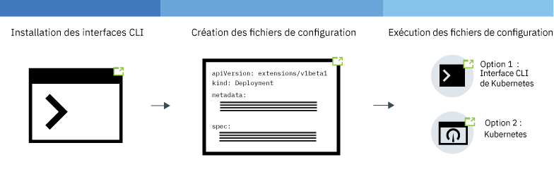
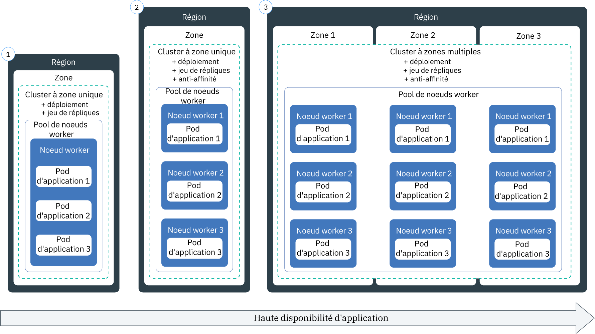

---

copyright:
  years: 2014, 2019
lastupdated: "2019-06-11"

keywords: kubernetes, iks, node.js, js, java, .net, go, flask, react, python, swift, rails, ruby, spring boot, angular

subcollection: containers

---

{:new_window: target="_blank"}
{:shortdesc: .shortdesc}
{:screen: .screen}
{:pre: .pre}
{:table: .aria-labeledby="caption"}
{:codeblock: .codeblock}
{:tip: .tip}
{:note: .note}
{:important: .important}
{:deprecated: .deprecated}
{:download: .download}
{:preview: .preview}


# Déploiement d'applications natives Kubernetes dans des clusters
{: #app}

Vous pouvez recourir à des techniques Kubernetes dans {{site.data.keyword.containerlong}} pour déployer des applications et faire en sorte qu'elles soient toujours opérationnelles. Par exemple, vous pouvez effectuer des mises à jour et des rétromigrations en continu sans générer de temps d'indisponibilité pour vos utilisateurs. Kubernetes étant une plateforme d'orchestration de conteneurs extensible qui n'est pas tributaire d'une langue ou d'une application spécifique, vous pouvez exécuter diverses charges de travail, notamment des applications sans ou avec état et des applications de traitement de données écrites dans la langue de votre choix.
{: shortdesc}

Découvrez les étapes générales de déploiement d'applications en cliquant sur une zone de l'image suivante. Vous voulez commencer par un déploiement de base ? Suivez le [tutoriel de déploiement des applications](/docs/containers?topic=containers-cs_apps_tutorial#cs_apps_tutorial).


<map name="d62e18" id="d62e18">
<area href="/docs/containers?topic=containers-cs_cli_install" target="_blank" alt="Installation des interfaces CLI." title="Installation des interfaces CLI." shape="rect" coords="30, 69, 179, 209" />
<area href="https://kubernetes.io/docs/concepts/configuration/overview/" target="_blank" alt="Création d'un fichier de configuration pour votre application. Consultez les pratiques Kubernetes recommandées." title="Création d'un fichier de configuration pour votre application. Consultez les pratiques Kubernetes recommandées." shape="rect" coords="254, 64, 486, 231" />
<area href="#app_cli" target="_blank" alt="Option 1 : Exécuter des fichiers de configuration depuis l'interface CLI de Kubernetes." title="Option 1 : Exécuter des fichiers de configuration depuis l'interface CLI de Kubernetes." shape="rect" coords="544, 67, 730, 124" />
<area href="#cli_dashboard" target="_blank" alt="Option 2 : Démarrer le tableau de bord Kubernetes en local et exécuter des fichiers de configuration." title="Option 2 : Démarrer le tableau de bord Kubernetes en local et exécuter des fichiers de configuration." shape="rect" coords="544, 141, 728, 204" />
</map>

<br />


## Planification de l'exécution d'applications dans les clusters
{: #plan_apps}

Avant de déployer une application dans un cluster {{site.data.keyword.containerlong_notm}}, déterminez de quelle manière vous souhaitez configurer votre application pour qu'elle soit accessible correctement et puisse s'intégrer à d'autres services dans {{site.data.keyword.Bluemix_notm}}.
{:shortdesc}

### Quel type d'objets Kubernetes puis-je créer pour mon application ?
{: #object}

Lorsque vous préparez le fichier YAML de votre application, vous disposez de plusieurs options pour augmenter la disponibilité, les performances et la sécurité de l'application. Par exemple, au lieu d'un simple pod, vous pouvez utiliser un objet contrôleur Kubernetes pour gérer votre charge de travail, par exemple un jeu de répliques, un travail ou un ensemble de démons. Pour plus d'informations sur les pods et les contrôleurs, consultez la [documentation Kubernetes ](https://kubernetes.io/docs/concepts/workloads/pods/pod-overview/). Un déploiement qui gère un jeu de répliques de pods est un cas d'utilisation courant d'application.
{: shortdesc}

Par exemple, un objet `kind: Deployment` est un bon choix pour déployer un pod d'application car avec cet objet, vous pouvez spécifier un jeu de répliques pour obtenir une disponibilité accrue pour vos pods.

Le tableau suivant décrit les raisons pour lesquelles vous pourrez être amené à créer différents types d'objets de charge de travail Kubernetes.

| Objet | Description |
| --- | --- |
| [`Pod` ](https://kubernetes.io/docs/concepts/workloads/pods/pod/) | Un pod est l'unité la plus petite que vous puissiez déployer pour vos charges de travail. Elle peut héberger un ou plusieurs conteneurs. Semblables aux conteneurs, les pods sont conçus pour pouvoir être supprimés et sont souvent utilisés à des fins de test unitaire de fonctions d'application. Pour éviter que votre application soit indisponible, envisagez de déployer les pods avec un contrôleur Kubernetes, par exemple un déploiement. Un déploiement vous aide à gérer plusieurs pods, répliques, mises à l'échelle, transferts, etc. |
| [`ReplicaSet` ](https://kubernetes.io/docs/concepts/workloads/controllers/replicaset/) | Un jeu de réplique (ReplicaSet) permet d'assurer que plusieurs répliques de votre pod sont en cours d'exécution et replanifie un pod s'il tombe en panne. Vous pouvez créer un jeu de répliques pour tester comment fonctionne la planification d'un pod, toutefois, pour gérer les mises à jour, les transferts et les mises à l'échelle, créez plutôt un déploiement à la place. |
| [`Deployment` ](https://kubernetes.io/docs/concepts/workloads/controllers/deployment/) | Un déploiement (Deployment) est un contrôleur qui gère un pod ou un [jeu de répliques ](https://kubernetes.io/docs/concepts/workloads/controllers/replicaset/) de modèles de pod. Vous pouvez créer des pods ou des jeux de répliques sans recourir à un déploiement pour tester des fonctions d'application. Pour une configuration au niveau production, utilisez des déploiements pour gérer les mises à jour, les transferts ou la mise à niveau des applications. |
| [`StatefulSet` ](https://kubernetes.io/docs/concepts/workloads/controllers/statefulset/) | Semblable aux déploiements, un ensemble avec état (Statefulset) est un contrôleur qui gère un jeu de répliques de pods. Contrairement aux déploiements, un ensemble avec état assure que votre pod a une identité unique sur le réseau et conserve son état lors d'une replanification. Lorsque vous voulez exécuter des charges de travail sur le cloud, essayez de [concevoir votre application sans état](/docs/containers?topic=containers-strategy#cloud_workloads) pour que vos instances de service soient indépendantes les unes des autres et puissent échouer sans entraîner d'interruption de service. Cependant, certaines applications, telles que des bases de données, doivent être avec état. Dans ce cas, envisagez de créer un ensemble avec état et utilisez un stockage de [fichiers](/docs/containers?topic=containers-file_storage#file_statefulset), un stockage [par blocs](/docs/containers?topic=containers-block_storage#block_statefulset) ou un stockage d'[objets](/docs/containers?topic=containers-object_storage#cos_statefulset) comme stockage persistant pour votre ensemble avec état. Vous pouvez également installer [Portworx](/docs/containers?topic=containers-portworx) sur vos noeuds worker bare metal et utiliser Portworx comme solution de stockage défini par logiciel (SDS) à haute disponibilité pour gérer du stockage persistant pour votre ensemble avec état. |
| [`DaemonSet` ](https://kubernetes.io/docs/concepts/workloads/controllers/daemonset/) | Utilisez un ensemble de démons (DaemonSet) lorsque vous devez exécuter le même pod sur tous les noeuds worker de votre cluster. Les pods gérés par un ensemble de démons sont automatiquement planifiés lorsqu'un noeud worker est ajouté dans un cluster. Les cas d'utilisation courants sont en principe les collecteurs de journaux, par exemple `logstash` ou `prometheus`, qui collectent les journaux à partir de tous les noeuds worker pour donner un aperçu de l'état de santé d'un cluster ou d'une application. |
| [`Job` ](https://kubernetes.io/docs/concepts/workloads/controllers/jobs-run-to-completion/) | Un travail (Job) garantit que l'exécution d'un ou plusieurs pods se termine avec succès. Vous pouvez utiliser un travail pour les files d'attente ou les travaux par lots afin de prendre en charge le traitement parallèle d'éléments de travail distincts mais associés, par exemple un certain nombre de trames à restituer, de courriers électroniques à envoyer et de fichiers à convertir. Pour planifier l'exécution d'un travail à des périodes spécifiques, utilisez un travail [`CronJob` ](https://kubernetes.io/docs/concepts/workloads/controllers/cron-jobs/).|
{: caption="Types d'objets de charge de travail Kubernetes que vous pouvez créer." caption-side="top"}

### Comment ajouter des fonctionnalités à ma configuration d'application Kubernetes ?
Voir [Spécification des exigences relatives à votre application dans votre fichier YAML](#app_yaml) pour obtenir la description de ce que vous pouvez inclure dans un déploiement. Par exemple :
* [Jeux de répliques](#replicaset)
* [Libellés](#label)
* [Affinité](#affinity)
* [Politiques d'image](#image)
* [Ports](#port)
* [Demandes et limites de ressources](#resourcereq)
* [Sondes Liveness Probe et Readiness Probe](#probe)
* [Services](#app-service) pour l'exposition du service d'application sur un port
* [Objets ConfigMap](#configmap) pour définir des variables d'environnement de conteneur
* [Objets Secret](#secret) pour définir des variables d'environnement de conteneur
* [Volumes persistants](#pv) montés sur le conteneur à des fins de stockage

### Et si je souhaite utiliser des variables dans ma configuration d'application Kubernetes ? Comment les ajouter dans le fichier YAML ?
{: #variables}

Pour ajouter des informations de variable à vos déploiements au lieu de coder en dur les données dans le fichier YAML, vous pouvez utiliser un objet Kubernetes [`ConfigMap` ](https://kubernetes.io/docs/tasks/configure-pod-container/configure-pod-configmap/) ou [`Secret` ](https://kubernetes.io/docs/concepts/configuration/secret/).
{: shortdesc}

Pour consommer un objet ConfigMap ou Secret, vous devez le monter sur le pod. L'objet ConfigMap ou Secret est combiné au pod juste avant l'exécution du pod. Vous pouvez réutiliser une spécification et une image de déploiement sur de nombreuses applications, mais les échanger ensuite contre des objets ConfigMap et Secret personnalisés. Les objets Secret peuvent prendre beaucoup d'espace de stockage dans le noeud local, donc planifiez-les en conséquence.

Ces deux ressources définissent des paires clé-valeur, mais vous les utilisez dans des contextes différents.

<dl>
<dt>ConfigMap</dt>
<dd>Fournit des informations de configuration non sensibles pour les charges de travail spécifiées dans un déploiement. Vous pouvez utiliser des objets ConfigMap de trois manières principales.
<ul><li><strong>Système de fichiers</strong> : vous pouvez monter un fichier complet ou un ensemble de variables sur un pod. Un fichier et créé pour chaque entrée en fonction du contenu du nom de la clé du fichier défini avec la valeur.</li>
<li><strong>Variable d'environnement</strong> : définissez de manière dynamique la variable d'environnement pour une spécification de conteneur.</li>
<li><strong>Argument de ligne de commande</strong> : définissez l'argument de ligne de commande utilisé dans une spécification de conteneur.</li></ul></dd>

<dt>Secret</dt>
<dd>Fournit les informations sensibles suivantes relatives à vos charges de travail. D'autres utilisateurs du cluster peuvent avoir accès à la valeur confidentielle (secret), donc n'oubliez pas que les informations qu'elle contient peuvent être partagées avec ces utilisateurs.
<ul><li><strong>Informations identifiant la personne (PII)</strong> : stockez les informations sensibles, telles que les adresses e-mail ou d'autres types d'informations requises pour la conformité de l'entreprise ou pour la réglementation officielle dans les valeurs confidentielles (secret).</li>
<li><strong>Données d'identification</strong> : insérez les données d'identification, telles que les mots de passe, les clés et les jetons dans une valeur confidentielle (secret) pour réduire le risque d'exposition accidentelle. Par exemple, lorsque vous [liez un service](/docs/containers?topic=containers-service-binding#bind-services) à votre cluster, les données d'identification sont stockées dans une valeur confidentielle (secret).</li></ul></dd>
</dl>

Vous voulez sécuriser davantage vos valeurs confidentielles ? Demandez à l'administrateur de votre cluster d'[activer {{site.data.keyword.keymanagementservicefull}}](/docs/containers?topic=containers-encryption#keyprotect) dans votre cluster pour chiffrer les valeurs confidentielles qu'elles soient nouvelles ou existantes.
{: tip}

### Comment ajouter des services IBM, tels que Watson, à mon application ?
Voir [Ajout de services à des applications](/docs/containers?topic=containers-service-binding#adding_app).

### Comment m'assurer que mon application dispose des ressources adéquates ?
Lorsque vous [spécifiez le fichier YAML de votre application](#app_yaml), vous pouvez ajouter des fonctionnalités Kubernetes à la configuration de votre application pour l'aider à acquérir les ressources appropriées. En particulier, [définissez les limites et les demandes de ressources ](https://kubernetes.io/docs/concepts/configuration/manage-compute-resources-container/) pour chaque conteneur défini dans votre fichier YAML.
{: shortdesc}

Par ailleurs, l'administrateur de votre cluster doit configurer des contrôles de ressources pouvant affecter le déploiement de votre application, par exemple :
*  [Quotas de ressources ](https://kubernetes.io/docs/concepts/policy/resource-quotas/)
*  [Priorité de pod](/docs/containers?topic=containers-pod_priority#pod_priority)

### Comment accéder à mon application ?
Vous pouvez accéder à votre application en privé au sein du cluster en [utilisant un service `clusterIP`](/docs/containers?topic=containers-cs_network_planning#in-cluster).
{: shortdesc}

Pour exposer votre application au public, vous disposez de différentes options en fonction de votre type de cluster.
*  **Cluster gratuit** : vous pouvez exposer votre application en utilisant un [service NodePort](/docs/containers?topic=containers-nodeport#nodeport).
*  **Cluster standard** : vous pouvez exposer votre application en utilisant un [service NodePort, LoadBalancer ou Ingress](/docs/containers?topic=containers-cs_network_planning#external).
*  **Cluster rendu privé en utilisant Calico** : vous pouvez exposer votre application en utilisant un [service NodePort, LoadBalancer ou Ingress](/docs/containers?topic=containers-cs_network_planning#private_both_vlans). Vous devez également utiliser une règle réseau Calico preDNAT pour bloquer les ports de noeud publics.
*  **Cluster standard de VLAN privé uniquement** : vous pouvez exposer votre application en utilisant un [service NodePort, LoadBalancer ou Ingress](/docs/containers?topic=containers-cs_network_planning#plan_private_vlan). Vous devez également ouvrir le port de l'adresse IP privée du service dans votre pare-feu.

### Après avoir déployé mon application, comment en surveiller l'état de santé ?
Vous pouvez configurer la [consignation et la surveillance](/docs/containers?topic=containers-health#health) {{site.data.keyword.Bluemix_notm}} pour votre cluster. Vous pouvez également choisir d'intégrer un [service de consignation ou de surveillance](/docs/containers?topic=containers-supported_integrations#health_services) tiers.
{: shortdesc}

### Comment maintenir mon application à jour ?
Si vous voulez ajouter et supprimer des applications de manière dynamique par rapport à l'utilisation des charges de travail, voir [Mise à l'échelle des applications](/docs/containers?topic=containers-app#app_scaling).
{: shortdesc}

Si vous souhaitez gérer les mises à jour de votre application, voir [Gestion des déploiements en continu](/docs/containers?topic=containers-app#app_rolling).

### Comment contrôler qui a accès à mes déploiements d'application ?
Les administrateurs de compte et de cluster peuvent contrôler l'accès à de nombreux niveaux distincts : le cluster, l'espace de nom Kubernetes, le pod et le conteneur.
{: shortdesc}

Avec {{site.data.keyword.Bluemix_notm}} IAM, vous pouvez affecter des droits à des utilisateurs individuels, des groupes ou des comptes de service au niveau de l'instance du cluster.  Vous pouvez davantage restreindre l'accès au cluster en limitant les utilisateurs à certains espaces de nom au sein du cluster. Pour plus d'informations, voir [Affectation d'accès au cluster](/docs/containers?topic=containers-users#users).

Pour contrôler l'accès au niveau du pod, vous pouvez [configurer des politiques de sécurité de pod avec Kubernetes RBAC](/docs/containers?topic=containers-psp#psp).

Au sein du fichier YAML de déploiement de l'application, vous pouvez définir le contexte de sécurité d'un pod ou d'un conteneur. Pour plus d'informations, consultez la [documentation Kubernetes ](https://kubernetes.io/docs/tasks/configure-pod-container/security-context/).

Vous souhaitez contrôler l'accès au niveau de l'application ? Pour créer un flux de connexion que vous pouvez mettre à jour à tout moment sans changer le code de l'application, essayez d'utiliser [{{site.data.keyword.appid_long_notm}}](/docs/services/appid?topic=appid-getting-started).
{: tip}

<br />


## Planification de déploiements à haute disponibilité
{: #highly_available_apps}

Plus votre configuration sera distribuée entre plusieurs noeuds worker et clusters, et moins vos utilisateurs seront susceptibles d'encourir des temps d'indisponibilité de votre application.
{: shortdesc}

Examinez les configurations potentielles d'application suivantes, classées par ordre de disponibilité croissante.



1.  Déploiement avec n+2 pods gérés par un jeu de répliques dans un seul noeud figurant dans un cluster à zone unique.
2.  Déploiement avec n+2 pods gérés par un jeu de répliques et disséminés entre plusieurs noeuds (anti-affinité) dans un cluster à zone unique.
3.  Déploiement avec n+2 pods gérés par un jeu de répliques et disséminés entre plusieurs noeuds (anti-affinité) dans un cluster à zones multiples entre différentes zones.

Vous pouvez également [connecter plusieurs clusters dans différentes régions avec un équilibreur de charge global](/docs/containers?topic=containers-ha_clusters#multiple_clusters) pour une haute disponibilité accrue.

### Augmentation de la disponibilité de votre application
{: #increase_availability}

Tenez compte des options suivantes pour une disponibilité accrue de votre application.
{: shortdesc}

<dl>
  <dt>Utilisez des déploiements et des jeux de répliques pour déployer votre application et ses dépendances</dt>
    <dd><p>Un déploiement est une ressource Kubernetes que vous pouvez utiliser pour déclarer tous les composants de votre application et de ses dépendances. Avec les déploiements, vous n'avez pas à noter toutes les étapes, ce qui vous permet de vous concentrer sur votre application.</p>
    <p>Lorsque vous déployez plusieurs pods, un jeu de répliques est créé automatiquement pour vos déploiements afin de surveiller les pods et de garantir que le nombre de pods spécifié est opérationnel en tout temps. Lorsqu'un pod tombe en panne, le jeu de répliques remplace le pod qui ne répond plus par un nouveau.</p>
    <p>Vous pouvez utiliser un déploiement afin de définir des stratégies de mise à jour pour votre application, notamment le nombre de pods que vous désirez ajouter lors d'une mise à jour en continu et le nombre de pods pouvant être indisponibles à un moment donné. Lorsque vous effectuez une mise à jour en continu, le déploiement vérifie si la révision est fonctionnelle et l'arrête si des échecs sont détectés.</p>
    <p>Avec les déploiements, vous pouvez déployer simultanément plusieurs révisions avec différents indicateurs. Par exemple, vous pouvez d'abord tester un déploiement avant de décider de l'utiliser en environnement de production.</p>
    <p>Les déploiements vous permettent de suivre toutes les révisions déployées. Vous pouvez utiliser cet historique pour rétablir une version antérieure si vous constatez que vos mises à jour ne fonctionnent pas comme prévu.</p></dd>
  <dt>Incluez suffisamment de répliques pour répondre à la charge de travail de votre application, plus deux répliques</dt>
    <dd>Pour rendre votre application encore plus disponible et réfractaire aux échecs, envisagez d'inclure des répliques supplémentaires au-delà du strict minimum requis pour gérer la charge de travail anticipée. Ces répliques supplémentaires pourront gérer la charge de travail en cas de panne d'un pod et avant que le jeu de répliques n'ait rétabli le pod défaillant. Pour une protection face à deux défaillances simultanées de pods, incluez deux répliques supplémentaires. Cette configuration correspond à un modèle N+2, où N désigne le nombre de pods destinés à traiter la charge de travail entrante et +2 indique deux répliques supplémentaires. Tant qu'il y a suffisamment d'espace dans votre cluster, vous pouvez avoir autant de pods que vous voulez.</dd>
  <dt>Disséminez les pods entre plusieurs noeuds (anti-affinité)</dt>
    <dd><p>Lorsque vous créez votre déploiement, vous pouvez déployer tous les pods sur le même noeud worker. C'est ce qu'on appelle affinité ou collocation. Pour protéger votre application contre une défaillance de noeud worker, vous pouvez configurer votre déploiement de sorte à disséminer les pods entre plusieurs noeuds worker, et ce en utilisant l'option <code>podAntiAffinity</code> avec vos clusters standard. Vous pouvez définir deux types d'anti-affinité de pod : préféré (preferred) ou obligatoire (required).
      <p>Pour plus d'informations, voir la documentation Kubernetes sur l'<a href="https://kubernetes.io/docs/concepts/configuration/assign-pod-node/" rel="external" target="_blank" title="(S'ouvre dans un nouvel onglet ou une nouvelle fenêtre)">affectation de pods à des noeuds</a>.</p>
      <p>Pour obtenir un exemple d'affinité dans un déploiement d'application, voir [Création du fichier YAML pour le déploiement de votre application](#app_yaml).</p>
      </dd>
    </dd>
<dt>Disséminez les pods entre plusieurs zones ou régions</dt>
  <dd><p>Pour protéger votre application en cas de défaillance d'une zone, vous pouvez créer plusieurs clusters dans des zones distinctes ou ajouter des zones dans un pool de noeuds worker dans un cluster à zones multiples. Les clusters à zones multiples sont disponibles uniquement dans certaines [métropoles](/docs/containers?topic=containers-regions-and-zones#zones), comme Dallas. Si vous créez plusieurs clusters dans des zones distinctes, vous devez [configurer un équilibreur de charge global](/docs/containers?topic=containers-ha_clusters#multiple_clusters).</p>
  <p>Lorsque vous utilisez un jeu de répliques et spécifiez l'anti-affinité pour les pods, Kubernetes répartit les pods d'application sur les différents noeuds. Si vos noeuds se trouvent dans plusieurs zones, les pods sont répartis entre les zones, pour augmenter la disponibilité de votre application. Si vous souhaitez limiter l'exécution de vos applications à une seule zone, vous pouvez configurer l'affinité de pod pour créer et labelliser un pool de noeuds worker dans une zone. Pour plus d'informations, voir [Haute disponibilité pour les clusters à zones multiples](/docs/containers?topic=containers-ha_clusters#ha_clusters).</p>
  <p><strong>Dans le déploiement d'un cluster à zones multiples, mes pods d'application sont-ils répartis uniformément entre les noeuds ?</strong></p>
  <p>Les pods sont répartis uniformément entre les zones mais pas toujours entre les noeuds. Par exemple, si vous disposez d'un cluster avec un noeud dans chacune des trois zones et que vous déployez un jeu de répliques de six pods, chaque noeud obtient deux pods. Cependant, si vous avez un cluster avec deux noeuds dans chacune des trois zones et que vous déployez un jeu de répliques de six pods, chaque zone dispose de deux pods planifiés et peut ou non planifier un pod par noeud. Pour avoir plus de contrôle sur la planification, vous pouvez [définir l'affinité entre les pods  ](https://kubernetes.io/docs/concepts/configuration/assign-pod-node).</p>
  <p><strong>En cas de défaillance d'une zone, de quelle manière sont replanifiés les pods sur les noeuds restants dans les autres zones ?</strong></br>Tout dépend de la politique de planification que vous avez utilisée dans le déploiement. Si vous avez inclus l'[affinité entre pods de noeuds spécifiques ](https://kubernetes.io/docs/concepts/configuration/assign-pod-node/#node-affinity-beta-feature), vos pods ne sont pas replanifiés. Si vous ne l'avez pas fait, les pods sont créés sur les noeuds worker disponibles dans d'autres zones, mais risquent de ne pas être équilibrés. Par exemple, les deux pods peuvent être répartis sur les deux noeuds disponibles ou peuvent être planifiés tous les deux sur un noeud doté de la capacité disponible. De même, lorsque la zone indisponible est restaurée, les pods ne sont pas automatiquement supprimés et rééquilibrés entre les noeuds. Pour que les pods soient rééquilibrés entre les zones une fois qu'une zone redevient opérationnelle, envisagez l'utilisation de l'[outil de déplanification de Kubernetes ](https://github.com/kubernetes-incubator/descheduler).</p>
  <p><strong>Astuce</strong> : dans les clusters à zones multiples, tâchez de maintenir la capacité de vos noeuds worker à 50 % par zone de manière à disposer d'une capacité disponible suffisante pour protéger votre cluster en cas de défaillance de zone.</p>
  <p><strong>Comment faire pour répartir mon application dans des régions ?</strong></br>Pour protéger votre application en cas de défaillance de zone, créez un deuxième cluster dans une autre région, [configurez un équilibreur de charge global](/docs/containers?topic=containers-ha_clusters#multiple_clusters) pour connecter vos clusters, et utilisez un fichier YAML de déploiement pour déployer un jeu de répliques dupliqué avec [anti-affinité de pod ](https://kubernetes.io/docs/concepts/configuration/assign-pod-node/) pour votre application.</p>
  <p><strong>Que faire si mes applications nécessitent du stockage persistant ?</strong></p>
  <p>Utilisez un service de cloud, comme par exemple [{{site.data.keyword.cloudant_short_notm}}](/docs/services/Cloudant?topic=cloudant-getting-started#getting-started) ou [{{site.data.keyword.cos_full_notm}}](/docs/services/cloud-object-storage?topic=cloud-object-storage-about).</p></dd>
</dl>

## Spécification des exigences relatives à votre application dans votre fichier YAML
{: #app_yaml}

Dans Kubernetes, vous décrivez votre application dans un fichier YAML qui déclare la configuration de l'objet Kubernetes. Le serveur d'API Kubernetes traite ensuite le fichier YAML et stocke la configuration et l'état requis de l'objet dans le magasin de données etcd. Le planificateur de Kubernetes planifie vos charges de travail sur les noeuds worker au sein de votre cluster, en tenant compte de la spécification dans votre fichier YAML, de toutes les règles de cluster définies par l'administrateur et de la capacité disponible du cluster.
{: shortdesc}

Passez en revue la copie d'un [fichier YAML complet](https://raw.githubusercontent.com/IBM-Cloud/kube-samples/master/deploy-apps-clusters/deploy_wasliberty.yaml). Puis, consultez les sections suivantes pour comprendre comment améliorer le déploiement de votre application.

* [Jeux de répliques](#replicaset)
* [Libellés](#label)
* [Affinité](#affinity)
* [Politiques d'image](#image)
* [Ports](#port)
* [Demandes et limites de ressources](#resourcereq)
* [Sondes Liveness Probe et Readiness Probe](#probe)
* [Services](#app-service) pour l'exposition du service d'application sur un port
* [Objets ConfigMap](#configmap) pour définir des variables d'environnement de conteneur
* [Objets Secret](#secret) pour définir des variables d'environnement de conteneur
* [Volumes persistants](#pv) montés sur le conteneur à des fins de stockage
* [Etapes suivantes](#nextsteps)
* [Exemple de fichier YAML complet](#yaml-example)

<dl>
<dt>Métadonnées de déploiement de base</dt>
  <dd><p>Utilisez la version d'API appropriée correspondant au [type (kind) de l'objet Kubernetes](#object) que vous déployez. La version d'API détermine les fonctions prises en charge pour l'objet Kubernetes qui vous sont accessibles. Le nom que vous indiquez dans la section metadata est le nom de l'objet et non pas son libellé. Vous utilisez le nom lors des interactions avec votre objet, par exemple avec la commande `kubectl get deployment <name>`.</p>
  <p><pre class="codeblock"><code>apiVersion: apps/v1
kind: Deployment
metadata:
  name: wasliberty</code></pre></p></dd>

<dt id="replicaset">Jeu de répliques</dt>
  <dd><p>Pour augmenter la disponibilité de votre application, vous pouvez spécifier un jeu de répliques dans votre déploiement. Dans un jeu de répliques, vous définissez le nombre d'instances de votre application que vous souhaitez déployer. Les jeux de répliques sont gérés et surveillés par votre déploiement Kubernetes. En cas de défaillance d'une instance d'application, Kubernetes lance automatiquement une nouvelle instance de votre application pour conserver le nombre indiqué d'instances de l'application.</p>
  <p><pre class="codeblock"><code>spec:
  replicas: 3</pre></code></p></dd>

<dt id="label">Libellés</dt>
  <dd><p>Avec les [libellés](/docs/containers?topic=containers-strategy#deploy_organize), vous pouvez marquer différents types de ressources dans votre cluster avec la même paire clé-valeur (`key: value`). Vous pouvez ensuite indiquer le sélecteur pour correspondre au libellé de sorte que vous puissiez créer ces autres ressources par dessus. Si vous envisagez d'exposer votre application au public, vous devez utiliser un libellé qui corresponde au sélecteur que vous spécifiez dans le service. Dans l'exemple, la spécification (spec) de déploiement utilise un modèle qui correspond au libellé `app: wasliberty`.</p>
  <p>Vous pouvez extraire des objets labellisés dans votre cluster, pour voir des composants `staging` ou `production`. Par exemple, répertoriez toutes les ressources avec le libellé `env: production` sur tous les espaces de nom dans le cluster. <strong>Remarque :</strong> vous devez accéder à tous les espaces de nom pour exécuter cette commande. <pre class="pre"><code>kubectl get all -l env=production --all-namespaces</code></pre></p>
  <ul><li>Pour plus d'informations sur les libellés, voir la [documentation Kubernetes ](https://kubernetes.io/docs/concepts/overview/working-with-objects/labels/).</li>
  <li>Pour appliquer des libellés à des noeuds worker, [créez votre pool de noeuds worker](/docs/containers?topic=containers-add_workers#add_pool) avec des libellés ou [mettez à jour un pool de noeuds worker existant](/docs/containers?topic=containers-add_workers#worker_pool_labels)</li>
  <li>Pour obtenir un exemple plus détaillé, voir [Déploiement d'applications sur des noeuds worker spécifiques à l'aide de libellés](/docs/containers?topic=containers-app#node_affinity).</li></ul>
  <p><pre class="codeblock"><code>selector:
  matchLabels:
    app: wasliberty
template:
  metadata:
    labels:
      app: wasliberty</pre></code></p></dd>

<dt id="affinity">Affinité</dt>
  <dd><p>Indiquez l'affinité (collocation) lorsque vous souhaitez obtenir davantage de contrôle sur les noeuds worker sur lesquels sont planifiés les pods. L'affinité n'affecte les pods qu'au moment de la planification. Par exemple, pour étendre le déploiement sur les noeuds worker au lieu de permettre la planification des pods sur le même noeud, utilisez l'option <code>podAntiAffinity</code> avec vos clusters standard. Vous pouvez définir deux types d'anti-affinité de pod : préféré ou obligatoire.</p>
  <p>Pour plus d'informations, voir la documentation Kubernetes sur l'<a href="https://kubernetes.io/docs/concepts/configuration/assign-pod-node/" rel="external" target="_blank" title="(S'ouvre dans un nouvel onglet ou une nouvelle fenêtre)">affectation de pods à des noeuds</a>.</p>
  <ul><li><strong>Anti-affinité obligatoire</strong> : vous ne pouvez déployer que le nombre de répliques pour lesquelles vous disposez de noeuds worker. Par exemple, si vous disposez de trois noeuds worker dans votre cluster mais que vous définissez cinq répliques dans votre fichier YAML, seules trois répliques sont déployées. Chaque réplique réside sur un noeud worker distinct. Les deux autres répliques restent en attente. Si vous ajoutez un autre noeud worker dans votre cluster, l'une de ces répliques restantes se déploie automatiquement sur ce nouveau noeud. En cas de défaillance d'un noeud worker, le pod n'est pas replanifié car la règle d'affinité est obligatoire. Pour obtenir un exemple de fichier YAML avec anti-affinité obligatoire, voir <a href="https://github.com/IBM-Cloud/kube-samples/blob/master/deploy-apps-clusters/liberty_requiredAntiAffinity.yaml" rel="external" target="_blank" title="(S'ouvre dans un nouvel onglet ou une nouvelle fenêtre)">Application Liberty avec anti-affinité de pod obligatoire.</a></li>
  <li><strong>Anti-affinité préférée</strong> : vous pouvez déployer vos pods sur les noeuds avec de la capacité disponible, ce qui offre davantage de flexibilité pour votre charge de travail. Dès que c'est possible, les pods sont planifiés sur différents noeuds worker. Par exemple, si vous disposez de trois noeuds worker avec une capacité suffisante dans votre cluster, cinq pods de réplique peuvent être planifiés sur ces noeuds. Cependant, si vous ajoutez deux noeuds worker supplémentaires dans votre cluster, la règle d'affinité n'applique pas la replanification de ces two noeuds en plus s'exécutant sur des noeuds existants sur le noeud disponible.</li>
  <li><strong>Affinité des noeuds worker</strong> : vous pouvez configurer votre déploiement pour qu'il s'exécute uniquement sur certains noeuds worker, par exemple des noeuds bare metal. Pour plus d'informations, voir [Déploiement d'applications sur des noeuds worker spécifiques à l'aide de libellés](/docs/containers?topic=containers-app#node_affinity).</li></ul>
  <p>Exemple d'anti-affinité préférée :</p>
  <p><pre class="codeblock"><code>spec:
  affinity:
    podAntiAffinity:
      preferredDuringSchedulingIgnoredDuringExecution:
      - weight: 100
        podAffinityTerm:
          labelSelector:
            matchExpressions:
            - key: app
              operator: In
              values:
              - wasliberty
          topologyKey: kubernetes.io/hostname</pre></code></p></dd>

<dt id="image">Image de conteneur</dt>
  <dd>
  <p>Indiquez l'image que vous envisagez d'utiliser pour vos conteneurs, l'emplacement de l'image ainsi que sa politique d'extraction. Si vous n'indiquez aucune balise d'image, l'image avec la balise `latest` est extraite par défaut.</p>
  <p>**Attention** : évitez d'utiliser la balise "latest" pour les charges de travail de production. Vous n'avez peut-être pas testé votre charge de travail avec la dernière image si vous utilisez un référentiel public ou privé, de type Docker Hub ou {{site.data.keyword.registryshort_notm}}.</p>
  <p>Par exemple, pour répertorier les balises des images IBM publiques :</p>
  <ol><li>Basculez dans la région de la base de registre globale.<pre class="pre"><code>ibmcloud cr region-set global
</code></pre></li>
  <li>Répertoriez les images IBM.<pre class="pre"><code>ibmcloud cr images --include-ibm</code></pre></li></ol>
  <p>La règle par défaut `imagePullPolicy` est définie avec `IfNotPresent`, ce qui indique que l'image est extraite uniquement si elle n'est pas déjà présente en local. Pour que l'image soit extraite chaque fois que le conteneur démarre, spécifiez `imagePullPolicy: Always`.</p>
  <p><pre class="codeblock"><code>containers:
- name: wasliberty
  image: icr.io/ibmliberty:webProfile8
  imagePullPolicy: Always</pre></code></p></dd>

<dt id="port">Port du service de l'application</dt>
  <dd><p>Sélectionnez un port de conteneur pour ouvrir les services de l'application sur ce port. Pour voir les ports qui doivent être ouverts, reportez-vous aux spécifications de votre application ou au fichier Dockerfile. Le port est accessible depuis le réseau privé mais pas depuis une connexion de réseau public. Pour exposer l'application au public, vous devez créer un service NodePort, LoadBalancer ou Ingress. Vous utilisez ce même numéro de port lorsque vous [créez un objet `Service`](#app-service).</p>
  <p><pre class="codeblock"><code>ports:
- containerPort: 9080</pre></code></p></dd>

<dt id="resourcereq">Demandes et limites de ressources</dt>
  <dd><p>En tant qu'administrateur de cluster, vous pouvez vérifier que toutes les équipes partageant un cluster ne consomment pas plus que leur juste part de ressources de calcul (mémoire et processeur) en créant un [objet <code>ResourceQuota</code> ](https://kubernetes.io/docs/concepts/policy/resource-quotas/) pour chaque espace de nom Kubernetes dans le cluster. Si l'administrateur du cluster définit un quota de ressources de calcul, chaque conteneur dans le modèle de déploiement doit spécifier des demandes et des limites de ressources pour la mémoire et le nombre de processeurs, autrement la création de pod échouera.</p>
  <p><ol><li>Vérifiez si un quota de ressources est défini pour un espace de nom. <pre class="pre"><code>kubectl get quota --namespace=<namespace></code></pre></li>
  <li>Examinez quelles sont les limites du quota.<pre class="pre"><code>kubectl describe quota <quota_name> --namespace=<namespace></code></pre></li></ol></p>
  <p>Même si aucun quota de ressources n'est défini, vous pouvez inclure des demandes et des limites de ressources dans votre déploiement pour une meilleure gestion des ressources de noeuds worker.</p><p class="note">Si un conteneur dépasse ses limites, il peut être redémarré ou risque d'échouer. Si un conteneur dépasse une demande, son pod peut être expulsé si le noeud worker est à cours de la ressource demandée qui fait l'objet du dépassement. Pour plus d'informations sur le traitement des incidents, voir [Les pods ne parviennent pas à redémarrer à plusieurs reprises ou sont retirés de manière imprévisible](/docs/containers?topic=containers-cs_troubleshoot_clusters#pods_fail).</p>
  <p>**Demande** : quantité minimale de ressources réservée par le planificateur à l'usage du conteneur. Si cette quantité est égale à la limite, la demande est assurée. Si la quantité est inférieure à la limite, la demande est toujours assurée mais le planificateur peut utiliser le différentiel entre la demande et la limite pour compléter les ressources d'autres conteneurs.</p>
  <p>**Limite** : quantité maximale de ressources pouvant être consommées par le conteneur. Si la quantité de ressources totale qui est utilisée sur les conteneurs dépasse la quantité disponible sur le noeud worker, les conteneurs peuvent être expulsés pour libérer de l'espace. Pour éviter cela, définissez la demande de ressources avec une valeur égale à la limite du conteneur. Si aucune limite n'est indiquée, la valeur par défaut correspond à la capacité du noeud worker.</p>
  <p>Pour plus d'informations, voir la [documentation Kubernetes ](https://kubernetes.io/docs/concepts/configuration/manage-compute-resources-container/).</p>
  <p><pre class="codeblock"><code>resources:
  requests:
    memory: "512Mi"
    cpu: "500m"
  limits:
    memory: "1024Mi"
    cpu: "1000m"</pre></code></p></dd>

<dt id="probe">Sondes Liveness Probe et Readiness Probe</dt>
  <dd><p>Par défaut, Kubernetes envoie le trafic à vos pods d'application après le démarrage de tous les conteneurs dans le pod et redémarre les conteneurs lorsqu'ils plantent. Cependant, vous pouvez définir des diagnostics d'intégrité pour améliorer la robustesse du routage du trafic de service. Par exemple, votre application peut avoir un délai de démarrage. Les processus d'application peuvent commencer avant que l'application ne soit totalement prête, ce qui peut affecter les réponses, notamment lors d'une augmentation d'échelle sur de nombreuses instances. Avec les diagnostics d'intégrité, votre système peut savoir si votre application est en cours d'exécution et prête à recevoir des demandes. En définissant ces sondes, vous pouvez également éviter des durées d'indisponibilité lorsque vous effectuez une [mise à jour en continu](#app_rolling) de votre application. Vous pouvez définir deux types de diagnostic d'intégrité avec les sondes Liveness Probe et Readiness Probe.</p>
  <p>**Sonde Liveness Probe** : configurez une sonde Liveness Probe pour vérifier si le conteneur est en cours d'exécution. En cas d'échec de cette sonde, le conteneur est redémarré. Si le conteneur ne spécifie aucune sonde Liveness Probe, la sonde réussit car elle suppose que le conteneur est actif lorsqu'il est à l'état **Running**.</p>
  <p>**Sonde Readiness Probe** : configurez une sonde Readiness Probe pour vérifier si le conteneur est prêt à recevoir des demandes et du trafic externe. Si la sonde échoue, l'adresse IP du pod est retirée des adresses IP utilisables pour les services, qui correspondent au pod, mais le conteneur n'est pas redémarré. Définir une sonde Readiness Probe avec un délai d'attente initial est important, en particulier si votre application met du temps à démarrer. Avant le délai d'attente, la sonde ne démarre pas, ce qui laisse au conteneur le temps de démarrer. Si le conteneur ne spécifie aucune sonde Readiness Probe, la sonde réussit car elle suppose que le conteneur est actif lorsqu'il est à l'état **Running**.</p>
  <p>Vous pouvez définir les sondes sous forme de commandes, de demandes HTTP ou de sockets TCP. L'exemple suivant utilise des demandes HTTP. Octroyez plus de temps à la sonde Liveness Probe qu'à la sonde Readiness Probe. Pour plus d'informations, voir la [documentation Kubernetes ](https://kubernetes.io/docs/tasks/configure-pod-container/configure-liveness-readiness-probes/).</p>
  <p><pre class="codeblock"><code>livenessProbe:
  httpGet:
    path: /
    port: 9080
  initialDelaySeconds: 300
  periodSeconds: 15
readinessProbe:
  httpGet:
    path: /
    port: 9080
  initialDelaySeconds: 45
  periodSeconds: 5</pre></code></p></dd>

<dt id="app-service">Service d'exposition de l'application</dt>
  <dd><p>Vous pouvez créer un service pour exposer votre application. Dans la section `spec`, vérifiez que les valeurs de `port` et de libellés (labels) correspondent à celles que vous avez utilisées dans le déploiement. Le service expose des objets qui correspondent au libellé, tels que `app: wasliberty` dans l'exemple suivant.</p>
  <ul><li>Par défaut, un service utilise une [`adresse IP de cluster ` ](https://kubernetes.io/docs/tutorials/kubernetes-basics/expose/expose-intro/), qui rend le cluster accessible uniquement de l'intérieur du cluster et non en dehors du cluster.</li>
  <li>Vous pouvez créer un service NodePort, LoadBalancer ou Ingress pour exposer l'application au public. Ces services ont deux adresses IP, une externe et une interne. Lorsque le trafic est reçu sur l'adresse IP externe, il est transmis à l'adresse IP du cluster interne. Ensuite, le trafic est routé depuis l'adresse IP interne du cluster vers l'adresse IP du conteneur de l'application.</li>
  <li>Dans cet exemple, un service `NodePort` est utilisé pour exposer le service en dehors du cluster. Pour plus d'informations sur la configuration de l'accès externe, voir [Choisir un service NodePort, LoadBalancer ou Ingress](/docs/containers?topic=containers-cs_network_planning#external).</li></ul>
  <p><pre class="codeblock"><code>apiVersion: v1
kind: Service
metadata:
  name: wasliberty
  labels:
    app: wasliberty
spec:
  ports:
  - port: 9080
  selector:
    app: wasliberty
    type: NodePort</pre></code></p></dd>

<dt id="configmap">Objets ConfigMap pour les variables d'environnement de conteneur</dt>
<dd><p>Les objets ConfigMap fournissent des informations de configuration non sensibles pour vos charges de travail de déploiement. L'exemple suivant illustre comment référencer des valeurs de votre ConfigMap en tant que variables d'environnement dans la section de spécification (spec) de conteneurs de votre fichier YAML de déploiement. En référençant des valeurs à partir de votre objet ConfigMap, vous pouvez découpler ces informations dans votre déploiement pour que votre application conteneurisée soit toujours portable.<ul><li>[Aidez-moi à déterminer si je dois utiliser un objet Kubernetes `ConfigMap` ou `Secret` pour les variables](#variables).</li>
<li>Pour obtenir d'autres utilisations possibles des objets ConfigMap, voir la [documentation Kubernetes ](https://kubernetes.io/docs/tasks/configure-pod-container/configure-pod-configmap/).</li></ul></p>
<p><pre class="codeblock"><code>apiVersion: apps/v1
kind: Deployment
metadata:
  name: wasliberty
spec:
  replicas: 3
  template:
    ...
    spec:
      ...
      containers:
      - name: wasliberty
        ...
        env :
          - name: VERSION
            valueFrom:
              configMapKeyRef:
                name: wasliberty
                key: VERSION
          - name: LANGUAGE
            valueFrom:
              configMapKeyRef:
                name: wasliberty
                key: LANGUAGE
        ...
---
apiVersion: v1
kind: ConfigMap
metadata:
  name: wasliberty
  labels:
    app: wasliberty
data:
  VERSION: "1.0"
  LANGUAGE: en</pre></code></p></dd>

  <dt id="secret">Objets Secret pour les variables d'environnement de conteneur</dt>
  <dd><p>Les objets Secret fournissent des informations de configuration sensibles telles que des mots de passe pour vos charges de travail de déploiement. L'exemple suivant illustre comment référencer des valeurs de votre valeur confidentielle en tant que variables d'environnement dans la section de spécification (spec) de conteneurs de votre fichier YAML de déploiement. Vous pouvez également monter l'objet Secret en tant que volume. En référençant des valeurs à partir de votre objet Secret, vous pouvez découpler ces informations dans votre déploiement pour que votre application conteneurisée soit toujours portable.<ul><li>[Aidez-moi à déterminer si je dois utiliser un objet ConfigMap ou Secret pour les variables](#variables).</li>
  <li>Pour plus d'informations, voir [Comprendre dans quels cas utiliser des objets Secret](/docs/containers?topic=containers-encryption#secrets).</li></ul></p>
  <p><pre class="codeblock"><code>apiVersion: apps/v1
  kind: Deployment
  metadata:
    name: wasliberty
  spec:
    replicas: 3
    template:
      ...
      spec:
        ...
        containers:
        - name: wasliberty
          ...
          env :
          - name: username
            valueFrom:
              secretKeyRef:
                name: wasliberty
                key: username
          - name: password
            valueFrom:
              secretKeyRef:
                name: wasliberty
                key: password
          ...
  ---
  apiVersion: v1
  kind: Secret
  metadata:
    name: wasliberty
    labels:
      app: wasliberty
  type: Opaque
  data:
    username: dXNlcm5hbWU=
    password: cGFzc3dvcmQ=</pre></code></p></dd>

<dt id="pv">Volumes persistants pour le stockage de conteneur</dt>
<dd><p>Les volumes persistants (PV) interagissent avec le stockage physique pour offrir un stockage de données persistant pour vos charges de travail de conteneur. L'exemple suivant illustre comment ajouter du stockage persistant à votre application. Pour mettre à disposition du stockage persistant, vous créez une réservation de volume persistant (PVC) pour décrire le type et la taille du stockage de fichiers dont vous voulez disposer. Après que vous avez créé la PVC, le volume persistant et le stockage physique sont automatiquement créés à l'aide du [provisionnement dynamique](/docs/containers?topic=containers-kube_concepts#dynamic_provisioning). En référençant la PVC avec votre fichier YAML de déploiement, le stockage est automatiquement monté sur votre pod d'application. Lorsque le conteneur de votre pod écrit des données dans le répertoire du chemin de montage `/test`, les données sont stockées sur l'instance de stockage de fichiers NFS.</p><ul><li>Pour plus d'informations, voir [Description des concepts de base du stockage Kubernetes](/docs/containers?topic=containers-kube_concepts#kube_concepts).</li><li>Pour connaître les options d'autres types de stockage que vous pouvez mettre à disposition, voir [Planification de stockage persistant à haute disponibilité](/docs/containers?topic=containers-storage_planning#storage_planning).</li></ul>
<p><pre class="codeblock"><code>apiVersion: apps/v1
kind: Deployment
metadata:
  name: wasliberty
spec:
  replicas: 3
  template:
    ...
    spec:
      ...
      containers:
      - name: wasliberty
        ...
        volumeMounts:
        - name: pvmount
          mountPath: /test
      volumes:
      - name: pvmount
        persistentVolumeClaim:
          claimName: wasliberty
        ...
---
apiVersion: v1
kind: PersistentVolumeClaim
metadata:
  name: wasliberty
  annotations:
    volume.beta.kubernetes.io/storage-class: "ibmc-file-bronze"
  labels:
    billingType: "hourly"
    app: wasliberty
spec:
  accessModes:
    - ReadWriteMany
         resources:
           requests:
             storage: 24Gi</pre></code></p></dd>

<dt id="nextsteps">Prêt à déployer une application ?</dt>
<dd><ul><li>[Utilisez une copie de fichier YAML complet comme modèle pour commencer](https://raw.githubusercontent.com/IBM-Cloud/kube-samples/master/deploy-apps-clusters/deploy_wasliberty.yaml).</li>
<li>[Déployez une application à partir du tableau de bord Kubernetes](/docs/containers?topic=containers-app#app_ui).</li>
<li>[Déployez une application à partir de l'interface de ligne de commande](/docs/containers?topic=containers-app#app_cli).</li></ul></dd>

</dl>

### Exemple de fichier YAML de déploiement complet
{: #yaml-example}

L'exemple suivant illustre une copie du fichier YAML de déploiement qui a été [explicité section par section précédemment](#app_yaml). Vous pouvez également [télécharger le fichier YAML à partir de GitHub](https://raw.githubusercontent.com/IBM-Cloud/kube-samples/master/deploy-apps-clusters/deploy_wasliberty.yaml).
{: shortdesc}

Pour appliquer le fichier YAML :

```
kubectl apply -f file.yaml [-n <namespace>]
```
{: pre}

Exemple de fichier YAML :

```yaml
apiVersion: apps/v1
kind: Deployment
metadata:
  name: wasliberty
spec:
  replicas: 3
  selector:
    matchLabels:
      app: wasliberty
  template:
    metadata:
      labels:
        app: wasliberty
    spec:
      affinity:
        podAntiAffinity:
          preferredDuringSchedulingIgnoredDuringExecution:
          - weight: 100
            podAffinityTerm:
              labelSelector:
                matchExpressions:
                - key: app
                  operator: In
                  values:
                  - wasliberty
              topologyKey: kubernetes.io/hostname
      containers:
      - name: wasliberty
        image: icr.io/ibmliberty
        env:
          - name: VERSION
            valueFrom:
              configMapKeyRef:
                name: wasliberty
                key: VERSION
          - name: LANGUAGE
            valueFrom:
              configMapKeyRef:
                name: wasliberty
                key: LANGUAGE
          - name: username
            valueFrom:
              secretKeyRef:
                name: wasliberty
                key: username
          - name: password
            valueFrom:
              secretKeyRef:
                name: wasliberty
                key: password
        ports:
          - containerPort: 9080
        resources:
          requests:
            memory: "512Mi"
            cpu: "500m"
          limits:
            memory: "1024Mi"
            cpu: "1000m"
        livenessProbe:
          httpGet:
            path: /
            port: 9080
          initialDelaySeconds: 300
          periodSeconds: 15
        readinessProbe:
          httpGet:
            path: /
            port: 9080
          initialDelaySeconds: 45
          periodSeconds: 5
        volumeMounts:
        - name: pvmount
          mountPath: /test
      volumes:
      - name: pvmount
        persistentVolumeClaim:
          claimName: wasliberty
---
apiVersion: v1
kind: Service
metadata:
  name: wasliberty
  labels:
    app: wasliberty
spec:
  ports:
  - port: 9080
  selector:
    app: wasliberty
  type: NodePort
---
apiVersion: v1
kind: ConfigMap
metadata:
  name: wasliberty
  labels:
    app: wasliberty
data:
  VERSION: "1.0"
  LANGUAGE: en
---
apiVersion: v1
kind: Secret
metadata:
  name: wasliberty
  labels:
    app: wasliberty
type: Opaque
data:
  username: dXNlcm5hbWU=
  password: cGFzc3dvcmQ=
---
apiVersion: v1
kind: PersistentVolumeClaim
metadata:
  name: wasliberty
  annotations:
    volume.beta.kubernetes.io/storage-class: "ibmc-file-bronze"
  labels:
    billingType: "hourly"
    app: wasliberty
spec:
  accessModes:
    - ReadWriteMany
  resources:
    requests:
      storage: 24Gi
```
{: codeblock}

<br />


## Gestion des fichiers de configuration Kubernetes afin de les réutiliser dans plusieurs environnements avec Kustomize
{: #kustomize}

Dans le cadre d'une application native cloud [à douze facteurs ](https://12factor.net/), vous souhaitez maintenir une parité développement et production en configurant un pipeline de développement et de distribution en continu qui utilise une source de codebase courante sous contrôle de version. Dans vos référentiels de codebase, vous stockez vos fichiers manifeste de configuration de ressource Kubernetes, souvent au format YAML. Vous pouvez utiliser le projet Kubernetes [Kustomize ](https://kustomize.io/) pour standardiser et personnaliser vos déploiements sur plusieurs environnements.
{: shortdesc}

Par exemple, vous pouvez configurer un fichier YAML `kustomization` de base pour déclarer des objets Kubernetes, tels que des déploiements et des PVC qui sont partagés dans vos environnements de développement, de test et de production. Ensuite, vous pouvez configurer des fichiers YAML `kustomization` distincts qui ont des configurations personnalisées pour chaque environnement, par exemple, davantage de répliques en environnement de production qu'en environnement de test. Ces fichiers YAML personnalisés peuvent ensuite chevaucher ou être utilisés pour générer le fichier YAML de base partagé de manière à vous permettre de gérer des environnements qui sont pour la plupart identiques, à l'exception de quelques différences de configuration de chevauchement dont vous contrôlez la source. Pour plus d'informations sur Kustomize, par exemple, un glossaire ou des foires aux questions, voir la [documentation Kustomize ](https://github.com/kubernetes-sigs/kustomize/tree/master/docs).

Avant de commencer :
*   [Créez](/docs/containers?topic=containers-clusters#clusters_ui) ou [mettez à jour](/docs/containers?topic=containers-update) un cluster qui exécute Kubernetes version 1.14 ou ultérieure. 
*   Assurez-vous que votre [version `kubectl` ](/docs/containers?topic=containers-cs_cli_install#kubectl) correspond à la version de votre cluster. 
*   [Connectez-vous à votre compte. Le cas échéant, ciblez le groupe de ressources approprié. Définissez le contexte pour votre cluster.](/docs/containers?topic=containers-cs_cli_install#cs_cli_configure)

Pour configurer des fichiers de configuration avec Kustomize :
1.  [Installez l'outil `kustomize` ](https://github.com/kubernetes-sigs/kustomize/blob/master/docs/INSTALL.md).
    *   Pour MacOS, vous pouvez utiliser le gestionnaire de package `brew`.
        ```
        brew install kustomize
        ```
        {: pre}
    *   Pour Windows, vous pouvez utiliser le gestionnaire de package `chocolatey`.
        ```
        choco install kustomize
        ```
        {: pre}
2.  Créez un répertoire pour votre application dans un système de contrôle de version, tel que Git.
    ```
    git init ~/<my_app>
    ```
    {: pre}
3.  Créez votre structure de référentiels pour vos répertoires `kustomize` [`base` ](https://github.com/kubernetes-sigs/kustomize/blob/master/docs/glossary.md#base)[`overlay`](https://github.com/kubernetes-sigs/kustomize/blob/master/docs/glossary.md#overlay) et vos répertoires d'environnement, par exemple pour la préproduction (staging) et la production (prod). Dans les étapes suivantes, vous configurez ces référentiels pour une utilisation avec `kustomize` :
    ```
    mkdir -p ~/<my_app>/base &&
    mkdir -p ~/<my_app>/overlay &&
    mkdir -p ~/<my_app>/overlay/staging &&
    mkdir -p ~/<my_app>/overlay/prod
    ```
    {: pre}
    
    Exemple de structure de référentiels :
    ```
    .
    ├── base
    └── overlay
        ├── prod
        └── staging
    ```
    {: screen}
4.  Configurez le référentiel `base`. 
    1.  Accédez au référentiel base.
        ```
        cd ~/<my_app>/base
        ```
        {: pre}
    2.  Créez un ensemble initial de fichiers YAML de configuration Kubernetes pour votre déploiement d'application. Vous pouvez utiliser l'[exemple de fichier YAML](#yaml-example) `wasliberty` pour créer un déploiement, un service, un objet ConfigMap et une réservation de volume persistant. 
    3.  Créez un fichier [`kustomization` ](https://github.com/kubernetes-sigs/kustomize/blob/master/docs/kustomization.yaml) qui spécifie la configuration de base à appliquer aux environnements. Le fichier `kustomization` doit inclure la liste de fichiers YAML de configuration de ressource Kubernetes qui sont stockés dans le même référentiel `base`. Dans le fichier `kustomization`, vous pouvez également ajouter des configurations qui s'appliquent à tous les fichiers YAML de ressource dans le référentiel de base, par exemple, un préfixe ou un suffixe qui est ajouté à tous les noms de ressource, un libellé, l'espace de nom existant dans lequel les ressources sont créées, des valeurs confidentielles, des objets ConfigMap, etc.
        ```
        apiVersion: kustomize.config.k8s.io/v1beta1
        kind: Kustomization
        namespace: wasliberty
        namePrefix: kustomtest-
        nameSuffix: -v2
        commonLabels:
          app: kustomized-wasliberty
        resources:
        - deployment.yaml
        - service.yaml
        - pvc.yaml
        - configmap.yaml
        - secret.yaml
        ```
        {: codeblock}
        
        Les noms des fichiers YAML `resource` doivent correspondre aux noms des autres fichiers dans le référentiel `base`. Vous pouvez inclure plusieurs configurations dans le même fichier, mais dans l'exemple, les configurations sont des fichiers distincts, par exemple, `deployment.yaml`, `service.yaml` et `pvc.yaml`.
        
    4.  Générez vos fichiers YAML resource avec les configurations que vous avez définies dans le fichier YAML de base `kustomization`. Les ressources sont générées en combinant les configurations dans les fichiers YAML `kustomization` et resource. Les fichiers YAML combinés sont renvoyés dans `stdout` dans la sortie de terminal. Utilisez cette même commande pour générer les modifications ultérieures que vous apportez au fichier YAML `kustomization`, telles que l'ajout d'un nouveau libellé.
        ```
        kustomize build
        ```
        {: pre}
5.  Configurez votre référentiel overlay avec des fichiers YAML `kustomization` uniques pour chacun de vos environnements, par exemple, staging et prod.
    1.  Dans le référentiel staging, créez un fichier `kustomization.yaml`. Ajoutez des configurations uniques à staging, telles qu'un libellé, une balise image ou un fichier YAML pour un nouveau composant que vous souhaitez tester.
        ```
        apiVersion: kustomize.config.k8s.io/v1beta1
        kind: Kustomization
        namePrefix: staging-
        commonLabels:
          env: staging
          owner: TeamA
        bases:
        - ../../base
        patchesStrategicMerge:
        - configmap.yaml
        - new_staging_resource.yaml
        resources:
        - new_staging_resource.yaml
        ```
        {: codeblock}
        <table summary="Tableau dont la colonne 1 décrit les zones du fichier YAML et dont la colonne 2 explique comment renseigner ces zones.">
        <caption>Composants YAML</caption>
        <thead>
        <th colspan=2> Description des composants du fichier YAML</th>
        </thead>
        <tbody>
        <tr>
        <td><code>namePrefix</code></td>
        <td>Spécifiez un préfixe à associer au nom de chaque ressource que vous souhaitez créer avec votre fichier `kustomization` de préproduction, par exemple, `staging-`.</td>
        </tr>
        <tr>
        <td><code>commonLabels</code></td>
        <td>Ajoutez des libellés qui sont uniques aux objets de préproduction, par exemple, l'environnement de préproduction et l'équipe responsable. </td>
        </tr>
        <tr>
        <td><code>bases</code></td>
        <td>Ajoutez un chemin relatif à un répertoire ou une URL vers un référentiel distant qui contient un fichier `kustomization` base. Dans cet exemple, le chemin relatif pointe vers le fichier `kustomization` base dans le référentiel `base` que vous avez créé précédemment. Cette zone est obligatoire pour un fichier `kustomization` overlay. </td>
        </tr>
        <tr>
        <td><code>patchesStrategicMerge</code></td>
        <td>Répertoriez les fichiers YAML de configuration ressource que vous souhaitez fusionner dans le fichier `kustomization` base. Vous devez également ajouter ces fichiers au même référentiel que le fichier `kustomization`, par exemple, `overlay/staging`. Ces fichiers de configuration resource peuvent contenir de petites modifications qui sont fusionnées avec les fichiers de configuration base de même nom sous forme de correctif. La ressource récupère tous les composants qui se trouvent dans le fichier de configuration `base`, plus les composants supplémentaires que vous spécifiez dans le fichier de configuration `overlay`. <br><br>Si la configuration est un nouveau fichier qui ne se trouve pas dans la  base, vous devez également ajouter le nom de fichier à la zone `resources`. </td>
        </tr>
        <tr>
        <td><code>resources</code></td>
        <td>Répertoriez les fichiers YAML de configuration resource qui sont uniques dans le référentiel staging et non inclus dans le référentiel base. Ajoutez ces fichiers également dans la zone `patchesStrategicMerge` et ajoutez-les au même référentiel que le fichier `kustomization`, par exemple, `overlay/staging`.</td>
        </tr>
        <tr>
        <td>Autres configurations possibles</td>
        <td>Pour connaître les autres configurations que vous pouvez ajouter à votre fichier, voir [`kustomization` YAML example ](https://github.com/kubernetes-sigs/kustomize/blob/master/docs/kustomization.yaml).</td>
        </tr>
        </tbody></table>
    2.  Générez vos fichier de configuration staging/overlay.
        ```
        kustomize build overlay/staging
        ```
        {: pre}
    3.  Répétez ces étapes pour créer votre fichier `kustomization` prod/overlay et d'autres fichiers YAML de configuration. Par exemple, vous pouvez augmenter le nombre de répliques dans votre fichier `deployment.yaml` de sorte que votre environnement de production puisse gérer davantage de demandes utilisateur. 
    4.  Passez en revue votre structure de référentiel `kustomize` pour vous assurer qu'elle contient tous les fichiers de configuration YAML dont vous avez besoin. La structure peut se présenter comme suit :
        ```
        ├── base
        │   ├── configmap.yaml
        │   ├── deployment.yaml
        │   ├── kustomization.yaml
        │   ├── pvc.yaml
        │   ├── secret.yaml
        │   └── service.yaml
        └── overlay
            ├── prod
            │   ├── deployment.yaml
            │   ├── kustomization.yaml
            │   └── new_prod_resource.yaml
            └── staging
                ├── configmap.yaml
                ├── kustomization.yaml
                └── new_staging_resource.yaml
        ```
        {: screen}
6.  Appliquez les ressources Kubernetes pour l'environnement que vous souhaitez déployer. L'exemple ci-après utilise le référentiel staging. 
    1.  Accédez au répertoire overlay/staging. Si vous n'avez pas créé vos ressources lors de l'étape précédente, créez-les maintenant.
        ```
        cd overlay/staging && kustomize build
        ```
        {: pre}
    2.  Appliquez les ressources Kubernetes à votre cluster. Ajoutez l'indicateur `-k` et le répertoire dans lequel se trouve le fichier `kustomization`. Par exemple, si vous vous trouvez déjà dans le répertoire staging, ajoutez `../staging` pour marquer le chemin vers le répertoire.
        ```
        kubectl apply -k ../staging
        ```
        {: pre}
        Exemple de sortie :
        ```
        configmap/staging-kustomtest-configmap-v2 created
        secret/staging-kustomtest-secret-v2 created
        service/staging-kustomtest-service-v2 created
        deployment.apps/staging-kustomtest-deployment-v2 created
        job.batch/staging-pi created
        persistentvolumeclaim/staging-kustomtest-pvc-v2 created
        ```
    3.  Assurez-vous que les modifications uniques du répertoire staging sont appliquées. Par exemple, si vous avez ajouté un préfixe `staging-`, les pods et les autres ressources qui sont créés comportent ce préfixe dans leur nom.
        ```
        kubectl get -k ../staging
        ```
        {: pre}
        Exemple de sortie :
        ```
        NAME                                        DATA   AGE
        configmap/staging-kustomtest-configmap-v2   2      90s

        NAME                                  TYPE     DATA   AGE
        secret/staging-kustomtest-secret-v2   Opaque   2      90s

        NAME                                    TYPE       CLUSTER-IP      EXTERNAL-IP   PORT(S)          AGE
        service/staging-kustomtest-service-v2   NodePort   172.21.xxx.xxx   <none>        9080:30200/TCP   90s

        NAME                                               READY   UP-TO-DATE   AVAILABLE   AGE
        deployment.apps/staging-kustomtest-deployment-v2   0/3     3            0           91s

        NAME                   COMPLETIONS   DURATION   AGE
        job.batch/staging-pi   1/1           41s        2m37s

        NAME                                              STATUS    VOLUME   CAPACITY   ACCESS MODES   STORAGECLASS       AGE
        persistentvolumeclaim/staging-kustomtest-pvc-v2   Pending                                      ibmc-file-bronze   90s
        ```
        {: screen}
    4.  Répétez ces étapes pour chaque environnement que vous souhaitez créer. 
7.  **Facultatif** : nettoyez votre environnement en retirant toutes les ressources que vous avez appliquées avec Kustomize.
    ```
    kubectl delete -k <directory>
    ```
    {: pre}
    Exemple de sortie :
    ```
    configmap "staging-kustomtest-configmap-v2" deleted
    secret "staging-kustomtest-secret-v2" deleted
    service "staging-kustomtest-service-v2" deleted
    deployment.apps "staging-kustomtest-deployment-v2" deleted
    job.batch "staging-pi" deleted
    persistentvolumeclaim "staging-kustomtest-pvc-v2" deleted
    ```
    {: screen}

## Lancement du tableau de bord Kubernetes
{: #cli_dashboard}

Ouvrez un tableau de bord Kubernetes sur votre système local pour consulter des informations sur un cluster et les noeuds worker associés. [Dans la console {{site.data.keyword.Bluemix_notm}}](#db_gui), vous pouvez accéder au tableau de bord par simple clic sur un bouton. [Avec l'interface de ligne de commande (CLI)](#db_cli), vous pouvez accéder au tableau de bord ou utiliser les étapes d'un processus automatique, comme pour un pipeline CI/CD.
{:shortdesc}

Votre cluster comporte tellement de ressources et d'utilisateurs que votre tableau de bord Kubernetes est un peu lent ? Pour les clusters qui exécutent Kubernetes version 1.12 ou ultérieure, votre administrateur de cluster peut ajuster le déploiement de `kubernetes-dashboard` en exécutant la commande `kubectl -n kube-system scale deploy kubernetes-dashboard --replicas=3`.
{: tip}

Avant de commencer :
* Vérifiez que vous disposez d'un [rôle de service](/docs/containers?topic=containers-users#platform) qui vous octroie le rôle Kubernetes RBAC approprié pour travailler avec des ressources Kubernetes.
* Pour [lancer le tableau de bord Kubernetes à partir de la console](#db_gui), vous devez disposer d'un [rôle de plateforme](/docs/containers?topic=containers-users#platform). Si vous bénéficiez d'un rôle de service mais pas de rôle de plateforme, [lancez le tableau de bord Kubernetes dans l'interface de ligne de commande](#db_cli).
* [Connectez-vous à votre compte. Le cas échéant, ciblez le groupe de ressources approprié. Définissez le contexte pour votre cluster.](/docs/containers?topic=containers-cs_cli_install#cs_cli_configure)

Vous pouvez utiliser le port par défaut ou définir votre propre port pour lancer le tableau de bord Kubernetes d'un cluster.

**Lancement du tableau de bord Kubernetes à partir de la console {{site.data.keyword.Bluemix_notm}}**
{: #db_gui}

1.  Connectez-vous à la [console{{site.data.keyword.Bluemix_notm}}](https://cloud.ibm.com/).
2.  Dans la barre de menu, sélectionnez le compte que vous souhaitez utiliser.
3.  Dans le menu , cliquez sur **Kubernetes**.
4.  Sur la page **Clusters**, cliquez sur le cluster auquel vous souhaitez accéder.
5.  Sur la page des détails du cluster, cliquez sur le bouton **Tableau de bord Kubernetes**.

</br>
</br>

**Lancement du tableau de bord Kubernetes à partir de l'interface de ligne de commande (CLI)**
{: #db_cli}

1.  Extrayez vos données d'identification pour Kubernetes.

    ```
    kubectl config view -o jsonpath='{.users[0].user.auth-provider.config.id-token}'
    ```
    {: pre}

2.  Copiez la valeur **id-token** affichée dans la sortie.

3.  Affectez le numéro de port par défaut au proxy.

    ```
    kubectl proxy
    ```
    {: pre}

    Exemple de sortie :

    ```
    Starting to serve on 127.0.0.1:8001
    ```
    {: screen}

4.  Connectez-vous au tableau de bord.

  1.  Dans votre navigateur, accédez à l'URL suivante :

      ```
      http://localhost:8001/api/v1/namespaces/kube-system/services/https:kubernetes-dashboard:/proxy/
      ```
      {: codeblock}

  2.  Sur la page de connexion, sélectionnez la méthode d'authentification par **Jeton**.

  3.  Collez ensuite la valeur **id-token** que vous aviez copiée dans la zone **Jeton** et cliquez sur **Connexion**.

Lorsque vous en avez terminé avec le tableau de bord Kubernetes, utilisez les touches `CTRL+C` pour quitter la commande `proxy`. Après avoir quitté, le tableau de bord Kubernetes n'est plus disponible. Exécutez la commande `proxy` pour redémarrer le tableau de bord Kubernetes.

[Ensuite, vous pouvez exécuter un fichier de configuration à partir du tableau de bord.](#app_ui)

<br />


## Déploiement d'applications avec le tableau de bord Kubernetes
{: #app_ui}

Lorsque vous déployez une application dans votre cluster à l'aide du tableau de bord Kubernetes, une ressource de déploiement crée, met à jour et gère automatiquement les pods dans votre cluster. Pour plus d'informations sur l'utilisation du tableau de bord, voir [la documentation Kubernetes ](https://kubernetes.io/docs/tasks/access-application-cluster/web-ui-dashboard/).
{:shortdesc}

Votre cluster comporte tellement de ressources et d'utilisateurs que votre tableau de bord Kubernetes est un peu lent ? Pour les clusters qui exécutent Kubernetes version 1.12 ou ultérieure, votre administrateur de cluster peut ajuster le déploiement de `kubernetes-dashboard` en exécutant la commande `kubectl -n kube-system scale deploy kubernetes-dashboard --replicas=3`.
{: tip}

Avant de commencer :

-   [Installez les interfaces de ligne de commande (CLI) requises](/docs/containers?topic=containers-cs_cli_install#cs_cli_install).
-   [Connectez-vous à votre compte. Le cas échéant, ciblez le groupe de ressources approprié. Définissez le contexte pour votre cluster.](/docs/containers?topic=containers-cs_cli_install#cs_cli_configure)
-   Vérifiez que vous disposez d'un [rôle de service](/docs/containers?topic=containers-users#platform) qui vous octroie le rôle Kubernetes RBAC approprié pour travailler avec des ressources Kubernetes.
-   Pour [lancer le tableau de bord Kubernetes à partir de la console](#db_gui), vous devez disposer d'un [rôle de plateforme](/docs/containers?topic=containers-users#platform). Si vous bénéficiez d'un rôle de service mais pas de rôle de plateforme, [lancez le tableau de bord Kubernetes dans l'interface de ligne de commande](#db_cli).

Pour déployer votre application :

1.  Ouvrez le [tableau de bord](#cli_dashboard) Kubernetes et cliquez sur **+ Créer**.
2.  Entrez les détails de votre application en choisissant l'une de ces deux méthodes :
  * Sélectionnez **Spécifier les détails de l'application ci-dessous** et entrez les détails.
  * Sélectionnez **Télécharger un fichier YAML ou JSON** pour télécharger le [fichier de configuration ](https://kubernetes.io/docs/tasks/inject-data-application/define-environment-variable-container/) de votre application.

  Besoin d'aide sur votre fichier de configuration ? Consultez cet [exemple de fichier YAML ](https://github.com/IBM-Cloud/kube-samples/blob/master/deploy-apps-clusters/deploy-ibmliberty.yaml). Dans cet exemple, un conteneur est déployé à partir d'une image **ibmliberty** dans la région du Sud des Etats-Unis (US-South). Découvrez comment [sécuriser vos informations personnelles](/docs/containers?topic=containers-security#pi) lorsque vous utilisez des ressources Kubernetes.
  {: tip}

3.  Vérifiez que vous avez déployé correctement votre application à l'aide de l'une des méthodes suivantes :
  * Dans le tableau de bord Kubernetes, cliquez sur **Déploiements**. La liste des déploiements ayant abouti s'affiche.
  * Si votre application est [accessible au public](/docs/containers?topic=containers-cs_network_planning#public_access), accédez à la page de présentation du cluster dans votre tableau de bord {{site.data.keyword.containerlong}}. Copiez le sous-domaine qui se trouve dans la section récapitulatif des clusters et collez-le dans un navigateur pour afficher votre application.

<br />


## Déploiement d'applications depuis l'interface CLI
{: #app_cli}

Après avoir créé un cluster, vous pouvez y déployer une application à l'aide de l'interface CLI de Kubernetes.
{:shortdesc}

Avant de commencer :

-   Installez les [interfaces de ligne de commande](/docs/containers?topic=containers-cs_cli_install#cs_cli_install) requises.
-   [Connectez-vous à votre compte. Le cas échéant, ciblez le groupe de ressources approprié. Définissez le contexte pour votre cluster.](/docs/containers?topic=containers-cs_cli_install#cs_cli_configure)
-   Vérifiez que vous disposez d'un [rôle de service](/docs/containers?topic=containers-users#platform) qui vous octroie le rôle Kubernetes RBAC approprié pour travailler avec des ressources Kubernetes dans l'espace de nom.

Pour déployer votre application :

1.  Créez un fichier de configuration basé sur les [pratiques Kubernetes recommandées ](https://kubernetes.io/docs/concepts/configuration/overview/). En général, un fichier de configuration contient des informations de configuration détaillées pour chacune des ressources que vous créez dans Kubernetes. Votre script peut inclure une ou plusieurs des sections suivantes :

    -   [Deployments ](https://kubernetes.io/docs/concepts/workloads/controllers/deployment/) : définit la création des pods et des jeux de répliques. Un pod contient une application conteneurisée unique et les jeux de répliques contrôlent plusieurs instances de pods.

    -   [Service ](https://kubernetes.io/docs/concepts/services-networking/service/) : fournit un accès frontal aux pods en utilisant une adresse IP publique de noeud worker ou d'équilibreur de charge, ou une route Ingress publique.

    -   [Ingress ](https://kubernetes.io/docs/concepts/services-networking/ingress/) : spécifie un type d'équilibreur de charge qui fournit des routes permettant d'accéder publiquement à l'application.

    Découvrez comment [sécuriser vos informations personnelles](/docs/containers?topic=containers-security#pi) lorsque vous utilisez des ressources Kubernetes.

2.  Exécutez le fichier de configuration dans un contexte de cluster.

    ```
    kubectl apply -f config.yaml
    ```
    {: pre}

3.  Si vous avez rendu votre application disponible au public en utilisant un service Nodeport, LoadBalancer ou Ingress, vérifiez que vous pouvez accéder à l'application.

<br />


## Déploiement d'applications sur des noeuds worker spécifiques à l'aide de libellés
{: #node_affinity}

Lorsque vous déployez une application, les pods d'application déploient plusieurs noeuds worker dans votre cluster sans discernement. Dans certains cas, vous souhaiterez limiter le nombre de noeuds sur lesquels se déploient les pods d'application. Par exemple, vous pouvez opter pour le déploiement des pods d'application uniquement sur les noeuds worker d'un certain pool de noeuds worker car ces noeuds se trouvent sur des machines bare metal. Pour désigner les noeuds worker sur lesquels doivent se déployer les pods d'application, ajoutez une règle d'affinité dans le déploiement de votre application.
{:shortdesc}

Avant de commencer :
*   [Connectez-vous à votre compte. Le cas échéant, ciblez le groupe de ressources approprié. Définissez le contexte pour votre cluster.](/docs/containers?topic=containers-cs_cli_install#cs_cli_configure)
*   Vérifiez que vous disposez d'un [rôle de service](/docs/containers?topic=containers-users#platform) qui vous octroie le rôle Kubernetes RBAC approprié pour travailler avec des ressources Kubernetes dans l'espace de nom.

Pour déployer des applications sur des noeuds worker spécifiques :

1.  Récupérez l'ID du pool de noeuds worker sur lequel vous souhaitez déployer des pods d'application.
    ```
    ibmcloud ks worker-pools --cluster <cluster_name_or_ID>
    ```
    {: pre}

2.  Répertoriez les noeuds worker figurant dans le pool de noeuds worker et notez l'une des adresses **IP privées**.
    ```
    ibmcloud ks workers --cluster <cluster_name_or_ID> --worker-pool <worker_pool_name_or_ID>
    ```
    {: pre}

3.  Décrivez le noeud worker. Dans la sortie **Labels**, notez le libellé de l'ID du pool de noeuds worker, `ibm-cloud.kubernetes.io/worker-pool-id`.

    <p class="tip">Les étapes indiquées dans cette rubrique utilisent un ID de pool de noeuds worker pour déployer les pods d'application uniquement sur des noeuds worker figurant dans ce pool. Pour déployer des pods d'application sur des noeuds worker en utilisant un autre libellé, notez le libellé à utiliser. Par exemple, pour déployer des pods d'application uniquement sur des noeuds worker sur un VLAN privé spécifique, utilisez le libellé `privateVLAN=`.</p>

    ```
    kubectl describe node <worker_node_private_IP>
    ```
    {: pre}

    Exemple de sortie :
    ```
    Name:               10.xxx.xx.xxx
    Roles:              <none>
    Labels:             arch=amd64
                        beta.kubernetes.io/arch=amd64
                        beta.kubernetes.io/instance-type=b3c.4x16.encrypted
                        beta.kubernetes.io/os=linux
                        failure-domain.beta.kubernetes.io/region=us-south
                        failure-domain.beta.kubernetes.io/zone=dal10
                        ibm-cloud.kubernetes.io/encrypted-docker-data=true
                        ibm-cloud.kubernetes.io/ha-worker=true
                        ibm-cloud.kubernetes.io/iaas-provider=softlayer
                        ibm-cloud.kubernetes.io/machine-type=b3c.4x16.encrypted
                        ibm-cloud.kubernetes.io/sgx-enabled=false
                        ibm-cloud.kubernetes.io/worker-pool-id=00a11aa1a11aa11a1111a1111aaa11aa-11a11a
                        ibm-cloud.kubernetes.io/worker-version=1.13.6_1534
                        kubernetes.io/hostname=10.xxx.xx.xxx
                        privateVLAN=1234567
                        publicVLAN=7654321
    Annotations:        node.alpha.kubernetes.io/ttl=0
    ...
    ```
    {: screen}

4. [Ajoutez une règle d'affinité ](https://kubernetes.io/docs/concepts/configuration/assign-pod-node/#node-affinity-beta-feature) pour le libellé de l'ID du pool de noeuds worker dans le déploiement de l'application.

    Exemple de fichier YAML :

    ```
    apiVersion: apps/v1
    kind: Deployment
    metadata:
      name: with-node-affinity
    spec:
      template:
        spec:
          affinity:
            nodeAffinity:
              requiredDuringSchedulingIgnoredDuringExecution:
                nodeSelectorTerms:
                - matchExpressions:
                  - key: ibm-cloud.kubernetes.io/worker-pool-id
                    operator: In
                    values:
                    - <worker_pool_ID>
    ...
    ```
    {: codeblock}

    Dans la section **affinity** de l'exemple de fichier YAML, `ibm-cloud.kubernetes.io/worker-pool-id` est la clé (`key`) et `<worker_pool_ID>` est la valeur (`value`).

5. Appliquez le fichier de configuration de déploiement mis à jour.
    ```
    kubectl apply -f with-node-affinity.yaml
    ```
    {: pre}

6. Vérifiez que les pods d'application se sont déployés sur les noeuds worker appropriés.

    1. Affichez la liste des pods de votre cluster.
        ```
        kubectl get pods -o wide
        ```
        {: pre}

        Exemple de sortie :
        ```
        NAME                   READY     STATUS              RESTARTS   AGE       IP               NODE
        cf-py-d7b7d94db-vp8pq  1/1       Running             0          15d       172.30.xxx.xxx   10.176.48.78
        ```
        {: screen}

    2. Dans la sortie, identifiez un pod pour votre application. Notez l'adresse IP privée du noeud (**NODE**) correspondant au noeud worker dans lequel figure le pod.

        Dans la sortie de l'exemple précédent, le pod d'application `cf-py-d7b7d94db-vp8pq` se trouve sur un noeud worker dont l'adresse IP est `10.xxx.xx.xxx`.

    3. Affichez la liste des noeuds worker figurant dans le pool de noeuds worker que vous avez désigné dans le déploiement de votre application.

        ```
        ibmcloud ks workers --cluster <cluster_name_or_ID> --worker-pool <worker_pool_name_or_ID>
        ```
        {: pre}

        Exemple de sortie :

        ```
        ID                                                 Public IP       Private IP     Machine Type      State    Status  Zone    Version
        kube-dal10-crb20b637238bb471f8b4b8b881bbb4962-w7   169.xx.xxx.xxx  10.176.48.78   b3c.4x16          normal   Ready   dal10   1.8.6_1504
        kube-dal10-crb20b637238bb471f8b4b8b881bbb4962-w8   169.xx.xxx.xxx  10.176.48.83   b3c.4x16          normal   Ready   dal10   1.8.6_1504
        kube-dal12-crb20b637238bb471f8b4b8b881bbb4962-w9   169.xx.xxx.xxx  10.176.48.69   b3c.4x16          normal   Ready   dal12   1.8.6_1504
        ```
        {: screen}

        Si vous avez créé une règle d'affinité pour l'application en fonction d'un autre facteur, récupérez cette valeur à la place. Par exemple, pour vérifier que le pod d'application est déployé sur un noeud worker d'un VLAN spécifique, affichez le VLAN dans lequel se trouve le noeud worker en exécutant la commande `ibmcloud ks worker-get --cluster <cluster_name_or_ID> --worker <worker_ID>`.
        {: tip}

    4. Dans la sortie, vérifiez que le noeud worker avec l'adresse IP que vous avez identifiée à l'étape précédente est déployé dans ce pool de noeuds worker.

<br />


## Déploiement d'une application sur une machine GPU
{: #gpu_app}

Si vous disposez d'une [machine de type processeur graphique (GPU)](/docs/containers?topic=containers-planning_worker_nodes#planning_worker_nodes), vous pouvez planifier des charges de travail nécessitant de nombreux calculs mathématiques sur le noeud worker. Par exemple, vous pouvez exécutez une application en 3D qui utilise la plateforme CUDA (Compute Unified Device Architecture) pour partager la charge de traitement entre le processeur graphique (GPU) et l'UC afin d'améliorer les performances.
{:shortdesc}

Dans les étapes suivantes, vous apprendrez à déployer des charges de travail nécessitant le processeur graphique (GPU). Vous pouvez également [déployer des applications](#app_ui) qui n'ont pas besoin de passer par le GPU et l'UC pour traiter leurs charges de travail. Par la suite, vous trouverez peut-être utile d'expérimenter des charges de travail nécessitant de nombreux calculs, par exemple l'infrastructure d'apprentissage automatique [TensorFlow ](https://www.tensorflow.org/) avec [cette démonstration Kubernetes ](https://github.com/pachyderm/pachyderm/tree/master/examples/ml/tensorflow).

Avant de commencer :
* [Créez un type de machine GPU bare metal](/docs/containers?topic=containers-clusters#clusters_ui). Ce processus peut prendre plus d'un jour ouvrable.

* Vérifiez que vous disposez d'un [rôle de service](/docs/containers?topic=containers-users#platform) qui vous octroie le rôle Kubernetes RBAC approprié pour travailler avec des ressources Kubernetes dans l'espace de nom.

Pour exécuter une charge de travail sur une machine GPU :
1.  Créez un fichier YAML. Dans cet exemple, un fichier YAML `Job` gère des charges de travail de type lots en créant un pod provisoire qui s'exécute jusqu'à ce que l'exécution de la commande planifiée soit terminée.

    Pour les charges de travail GPU, vous devez toujours indiquer la zone `resources: limits: nvidia.com/gpu` dans la spécification YAML.
    {: note}

    ```yaml
    apiVersion: batch/v1
    kind: Job
    metadata:
      name: nvidia-smi
      labels:
        name: nvidia-smi
    spec:
      template:
        metadata:
          labels:
            name: nvidia-smi
        spec:
          containers:
          - name: nvidia-smi
            image: nvidia/cuda:9.1-base-ubuntu16.04
            command: [ "/usr/test/nvidia-smi" ]
            imagePullPolicy: IfNotPresent
            resources:
              limits:
                nvidia.com/gpu: 2
            volumeMounts:
            - mountPath: /usr/test
              name: nvidia0
          volumes:
            - name: nvidia0
              hostPath:
                path: /usr/bin
          restartPolicy: Never
    ```
    {: codeblock}

    <table summary="Tableau dont la colonne 1 décrit les zones du fichier YAML et dont la colonne 2 explique comment renseigner ces zones.">
    <caption>Composants YAML</caption>
    <thead>
    <th colspan=2> Description des composants du fichier YAML</th>
    </thead>
    <tbody>
    <tr>
    <td>Noms et libellé des métadonnées</td>
    <td>Indiquez un nom et un libellé (label) pour le travail et utilisez le même nom dans la zone metadata du fichier et de `spec template`. Par exemple, `nvidia-smi`.</td>
    </tr>
    <tr>
    <td><code>containers.image</code></td>
    <td>Fournissez l'image dont le conteneur est une instance d'exécution. Dans cet exemple, la valeur est définie pour utiliser l'image CUDA DockerHub : <code>nvidia/cuda:9.1-base-ubuntu16.04</code></td>
    </tr>
    <tr>
    <td><code>containers.command</code></td>
    <td>Indiquez une commande à exécuter dans le conteneur. Dans cet exemple, la commande <code>[ "/usr/test/nvidia-smi" ]</code> fait référence à un fichier binaire qui se trouve sur la machine GPU, donc vous devez également configurer un montage de volume.</td>
    </tr>
    <tr>
    <td><code>containers.imagePullPolicy</code></td>
    <td>Pour extraire une nouvelle image uniquement si l'image ne se trouve pas actuellement sur le noeud worker, indiquez <code>IfNotPresent</code>.</td>
    </tr>
    <tr>
    <td><code>resources.limits</code></td>
    <td>Pour les machines GPU, vous devez indiquer une limite de ressources. Le [plug-in d'unité](https://kubernetes.io/docs/concepts/cluster-administration/device-plugins/) Kubernetes définit la demande de ressource par défaut pour se conformer à la limite.
    <ul><li>Vous devez indiquer la clé sous la forme <code>nvidia.com/gpu</code>.</li>
    <li>Entrez le nombre entier de GPU que vous demandez, par exemple <code>2</code>. <strong>Remarque</strong> : les pods de conteneur ne partagent pas les GPU et les GPU ne peuvent pas être sursollicités. Par exemple, si vous ne disposez que d'une machine `mg1c.16x128`, vous n'avez que 2 GPU dans cette machine. Vous ne pouvez donc en spécifier que `2` maximum.</li></ul></td>
    </tr>
    <tr>
    <td><code>volumeMounts</code></td>
    <td>Nom du volume monté sur le conteneur, par exemple <code>nvidia0</code>. Indiquez le chemin de montage (<code>mountPath</code>) du volume sur le conteneur. Dans cet exemple, le chemin <code>/usr/test</code> correspond au chemin utilisé dans la commande container du travail. </td>
    </tr>
    <tr>
    <td><code> volumes</code></td>
    <td>Nom du volume de travail, par exemple <code>nvidia0</code>. Dans le chemin <code>hostPath</code> du noeud worker du GPU, indiquez le chemin (<code>path</code>) sur l'hôte, dans cet exemple, il s'agit de <code>/usr/bin</code>. Le chemin de montage (<code>mountPath</code>) du conteneur est mappé au chemin (<code>path</code>) du volume hôte, ce qui donne à ce travail l'accès aux fichiers binaires NVIDIA sur le noeud worker du GPU pour que la commande container s'exécute.</td>
    </tr>
    </tbody></table>

2.  Appliquez le fichier YAML. Exemple :

    ```
    kubectl apply -f nvidia-smi.yaml
    ```
    {: pre}

3.  Vérifiez le pod du travail en filtrant vos pods avec le libellé `nvidia-sim`. Vérifiez que la valeur de la zone **STATUS** est **Completed**.

    ```
    kubectl get pod -a -l 'name in (nvidia-sim)'
    ```
    {: pre}

    Exemple de sortie :
    ```
    NAME                  READY     STATUS      RESTARTS   AGE
    nvidia-smi-ppkd4      0/1       Completed   0          36s
    ```
    {: screen}

4.  Décrivez le pod pour voir comment le plug-in d'unité GPU a planifié le pod.
    * Dans les zones `Limits` et `Requests`, observez que la limite de ressources que vous avez spécifiée correspond à la demande définie automatiquement par le plug-in d'unité.
    * Dans les événements, vérifiez que le pod est affecté au noeud worker de votre GPU.

    ```
    kubectl describe pod nvidia-smi-ppkd4
    ```
    {: pre}

    Exemple de sortie :
    ```
    Name:           nvidia-smi-ppkd4
    Namespace:      default
    ...
    Limits:
     nvidia.com/gpu:  2
    Requests:
     nvidia.com/gpu:  2
    ...
    Events:
    Type    Reason                 Age   From                     Message
    ----    ------                 ----  ----                     -------
    Normal  Scheduled              1m    default-scheduler        Successfully assigned nvidia-smi-ppkd4 to 10.xxx.xx.xxx
    ...
    ```
    {: screen}

5.  Pour vérifier que votre travail a utilisé le processeur graphique (GPU) pour calculer sa charge de travail, vous pouvez consulter les journaux. La commande `[ "/usr/test/nvidia-smi" ]` du travail interroge l'état de l'unité GPU sur le noeud worker du GPU.

    ```
    kubectl logs nvidia-sim-ppkd4
    ```
    {: pre}

    Exemple de sortie :
    ```
    +-----------------------------------------------------------------------------+
    | NVIDIA-SMI 390.12                 Driver Version: 390.12                    |
    |-------------------------------+----------------------+----------------------+
    | GPU  Name        Persistence-M| Bus-Id        Disp.A | Volatile Uncorr. ECC |
    | Fan  Temp  Perf  Pwr:Usage/Cap|         Memory-Usage | GPU-Util  Compute M. |
    |===============================+======================+======================|
    |   0  Tesla K80           Off  | 00000000:83:00.0 Off |                  Off |
    | N/A   37C    P0    57W / 149W |      0MiB / 12206MiB |      0%      Default |
    +-------------------------------+----------------------+----------------------+
    |   1  Tesla K80           Off  | 00000000:84:00.0 Off |                  Off |
    | N/A   32C    P0    63W / 149W |      0MiB / 12206MiB |      1%      Default |
    +-------------------------------+----------------------+----------------------+

    +-----------------------------------------------------------------------------+
    | Processes:                                                       GPU Memory |
    |  GPU       PID   Type   Process name                             Usage      |
    |=============================================================================|
    |  No running processes found                                                 |
    +-----------------------------------------------------------------------------+
    ```
    {: screen}

    Dans cet exemple, vous voyez que les deux GPU ont été utilisés pour exécuter le travail car ils étaient tous les deux planifiés sur le noeud worker. Si la limite est définie sur 1, 1 seul GPU s'affiche.

## Mise à l'échelle des applications
{: #app_scaling}

Avec Kubernetes, vous pouvez activer la [mise à l'échelle automatique horizontale de pod ](https://kubernetes.io/docs/tasks/run-application/horizontal-pod-autoscale/) pour augmenter ou diminuer automatiquement le nombre d'instances de vos applications en fonction de l'UC.
{:shortdesc}

Vous recherchez des informations sur la mise à l'échelle des applications Cloud Foundry ? Consultez [IBM - Mise à l'échelle automatique pour {{site.data.keyword.Bluemix_notm}}](/docs/services/Auto-Scaling?topic=Auto-Scaling%20-get-started). Vous voulez plutôt mettre à l'échelle vos noeuds worker à la place de vos pods ? Découvrez le [programme de mise à l'échelle automatique de cluster (cluster autoscaler)](/docs/containers?topic=containers-ca#ca).
{: tip}

Avant de commencer :
- [Connectez-vous à votre compte. Le cas échéant, ciblez le groupe de ressources approprié. Définissez le contexte pour votre cluster.](/docs/containers?topic=containers-cs_cli_install#cs_cli_configure)
- La surveillance avec Heapster doit être déployée dans le cluster qui doit faire l'objet de la mise à l'échelle automatique.
- Vérifiez que vous disposez d'un [rôle de service](/docs/containers?topic=containers-users#platform) qui vous octroie le rôle Kubernetes RBAC approprié pour travailler avec des ressources Kubernetes dans l'espace de nom.

Etapes :

1.  Déployez votre application sur un cluster à partir de l'interface de ligne de commande. Lorsque vous déployez votre application vous devez solliciter une unité centrale (cpu).

    ```
    kubectl run <app_name> --image=<image> --requests=cpu=<cpu> --expose --port=<port_number>
    ```
    {: pre}

    <table summary="Tableau dont la colonne 1 décrit les options de commande Kubectl et dont la colonne 2 explique comment renseigner ces options.">
    <caption>Options de la commande `kubectl run`</caption>
    <thead>
    <th colspan=2> Description des options de cette commande</th>
    </thead>
    <tbody>
    <tr>
    <td><code>--image</code></td>
    <td>Application que vous désirez déployer.</td>
    </tr>
    <tr>
    <td><code>--request=cpu</code></td>
    <td>UC requise pour le conteneur, exprimée en milli-coeurs. Par exemple, <code>--requests=200m</code>.</td>
    </tr>
    <tr>
    <td><code>--expose</code></td>
    <td>Lorsque la valeur est true, un service externe est créé.</td>
    </tr>
    <tr>
    <td><code>--port</code></td>
    <td>Port sur lequel votre application est disponible en externe.</td>
    </tr></tbody></table>

    Pour les déploiements plus complexes, vous devrez éventuellement créer un [fichier de configuration](#app_cli).
    {: tip}

2.  Créez un service de mise à l'échelle automatique et définissez votre règle. Pour plus d'informations sur l'utilisation de la commande `kubectl autoscale`, voir la [documentation Kubernetes ](https://kubernetes.io/docs/reference/generated/kubectl/kubectl-commands#autoscale).

    ```
    kubectl autoscale deployment <deployment_name> --cpu-percent=<percentage> --min=<min_value> --max=<max_value>
    ```
    {: pre}

    <table summary="Tableau dont la colonne 1 décrit les options de commande Kubectl et dont la colonne 2 explique comment renseigner ces options.">
    <caption>Options de la commande `kubectl autoscale`</caption>
    <thead>
    <th colspan=2> Description des options de cette commande</th>
    </thead>
    <tbody>
    <tr>
    <td><code>--cpu-percent</code></td>
    <td>Utilisation d'UC moyenne gérée par le programme de mise à l'échelle automatique de pod horizontale, exprimée en pourcentage.</td>
    </tr>
    <tr>
    <td><code>--min</code></td>
    <td>Nombre minimal de pods déployés utilisés pour gérer le pourcentage d'utilisation d'UC spécifié.</td>
    </tr>
    <tr>
    <td><code>--max</code></td>
    <td>Nombre maximal de pods déployés utilisés pour gérer le pourcentage d'utilisation d'UC spécifié.</td>
    </tr>
    </tbody></table>


<br />


## Gestion des déploiements en continu pour mettre à jour vos applications
{: #app_rolling}

Vous pouvez gérer le déploiement en continu de votre application de façon automatique et contrôlée pour les charges de travail avec un modèle de pod te type déploiements, par exemple. S'il ne correspond pas à ce que vous aviez prévu, vous pouvez rétromigrer le déploiement vers la dernière révision.
{:shortdesc}

Vous voulez éviter toute indisponibilité lors de la mise à jour en continu ? Veillez à spécifier une [sonde Readiness Probe dans votre déploiement](#probe) pour que le déploiement passe au pod d'application suivant une fois que le pod qui vient d'être mis à jour est prêt.
{: tip}

Avant de commencer :
*   [Connectez-vous à votre compte. Le cas échéant, ciblez le groupe de ressources approprié. Définissez le contexte pour votre cluster.](/docs/containers?topic=containers-cs_cli_install#cs_cli_configure)
*   Créez un [déploiement](#app_cli).
*   Vérifiez que vous disposez d'un [rôle de service](/docs/containers?topic=containers-users#platform) qui vous octroie le rôle Kubernetes RBAC approprié pour travailler avec des ressources Kubernetes dans l'espace de nom.

Pour gérer les mises à jour en continu de vos applications :
1.  Pour être certain que vos déploiements sont marqués comme étant accessibles en lecture seule lorsque le conteneur est en cours d'exécution et prêt à traiter des demandes, ajoutez des [sondes Liveness et Readiness à votre déploiement](#probe).

2.  Mettez à jour votre déploiement de manière à y inclure une stratégie de mise à jour en continu dans laquelle sont spécifiés le nombre maximal de pods non disponibles ou en surcharge ou le pourcentage de pods durant la mise à jour.

    ```
    apiVersion: apps/v1
    kind: Deployment
    metadata:  
      name: nginx-test
    spec:
      replicas: 10
      selector:
        matchLabels:
          service: http-server
      minReadySeconds: 5
      progressDeadlineSeconds: 600
      strategy: 
        type: RollingUpdate  
        rollingUpdate:    
          maxUnavailable: 50%
          maxSurge: 2
    ...
    ```
    {: codeblock}

    <table summary="Tableau dont la colonne 1 décrit les zones du fichier YAML et dont la colonne 2 explique comment renseigner ces zones.">
    <caption>Composants YAML</caption>
    <thead>
    <th colspan=2> Description des composants du fichier YAML</th>
    </thead>
    <tbody>
    <tr>
    <td><code>spec.minReadySeconds</code></td>
    <td>Par défaut, les déploiements attendent que le pod soit marqué `Prêt` pour poursuivre. Si vous constatez que le déploiement continue de créer des pods alors même que votre application située dans le pod le plus récent n'est pas encore prête, utilisez cette zone pour ralentir le déploiement. Par exemple, si vous spécifiez `5`, le déploiement attend pendant 5 secondes une fois que le pod est `prêt` avant de créer le pod suivant.</td>
    </tr>
    <tr>
    <td><code>spec.progressDeadlineSeconds</code></td>
    <td>Définissez un délai d'attente (en secondes) à observer avant de considérer qu'un déploiement a échoué. Par exemple, lorsqu'aucun délai d'attente n'est défini, si votre nouvelle version d'application présente un bogue et se bloque immédiatement, le déploiement ne peut pas se poursuivre car le pod n'atteint jamais l'état `Prêt`. Si vous définissez un délai d'attente de `600` secondes et si une phase du déploiement ne progresse plus pendant 10 minutes, le déploiement est marqué comme ayant échoué et s'arrête.</td>
    </tr>
    <tr>
    <td><code>spec.strategy.type</code></td>
    <td>Spécifiez le type de stratégie `RollingUpdate`.</td>
    </tr>
    <tr>
    <td><code>spec.strategy.rollingUpdate.maxUnavailable</code></td>
    <td>Définissez le nombre maximal de pods qui peuvent être non disponibles durant une mise à jour ; il peut s'agir d'un nombre (`2`) ou d'un pourcentage (`50%`). IL est recommandé d'utiliser un pourcentage. Ainsi, si vous modifiez le nombre de répliques ultérieurement, vous n'aurez pas à penser à mettre à jour le nombre ici, sauf si vous souhaitez limiter le déploiement afin d'autoriser l'arrêt d'un seul pod à la fois. Si vous ne voulez jamais passer au-dessous de 100 % capacité, affectez la valeur `0%` à ce paramètre et spécifiez le paramètre `spec.strategy.type.rollingUpdate.maxSurge`.</td>
    </tr>
    <tr>
    <td><code>spec.strategy.rollingUpdate.maxSurge</code></td>
    <td>Définissez le nombre de ressources supplémentaires pouvant être utilisées par le déploiement. Il peut s'agir d'un nombre (`2`) ou d'un pourcentage (`50%`). Par exemple, si votre déploiement spécifie `10` répliques et que vous affectez au paramètre `maxSurge` la valeur `2`, durant le déploiement, deux nouvelles répliques sont créées. Vous disposez à présent de 12 répliques (10 répliques existantes et 2 nouvelles répliques). Lorsque les deux nouvelles répliques sont prêtes, le déploiement réduit le nombre d'anciennes répliques à 8 afin d'être conforme aux 10 répliques spécifiées. Ce processus se poursuit jusqu'à ce que le déploiement soit terminé et que les 10 répliques exécutent la nouvelle version.<p class="tip">Si vous souhaitez effectuer une mise à jour de basculement instantanée de type Blue-Green,  affectez au paramètre `maxSurge` la valeur `100%`. Le déploiement crée toutes les nouvelles répliques requises, puis fait passer le nombre de répliques de l'ancienne version à 0.</p></td>
    </tr>
    </tbody></table>

3.  [Déployez ](https://kubernetes.io/docs/concepts/workloads/controllers/deployment/#updating-a-deployment) une modification. Par exemple, vous souhaiterez peut-être modifier l'image que vous avez utilisée dans votre déploiement initial.

    1.  Identifiez le nom du déploiement.

        ```
        kubectl get deployments
        ```
        {: pre}

    2.  Identifiez le nom du pod.

        ```
        kubectl get pods
        ```
        {: pre}

    3.  Identifiez le nom du conteneur s'exécutant dans le pod.

        ```
        kubectl describe pod <pod_name>
        ```
        {: pre}

    4.  Définissez la nouvelle image à utiliser par le déploiement.

        ```
        kubectl set image deployment/<deployment_name><container_name>=<image_name>
        ```
        {: pre}

    Lorsque vous exécutez les commandes, la modification est immédiatement appliquée et consignée dans l'historique de déploiement.

4.  Vérifiez le statut de votre déploiement.

    ```
    kubectl rollout status deployments/<deployment_name>
    ```
    {: pre}

    Si vous constatez qu'il se passe quelque chose au niveau du statut et souhaitez prendre le temps d'effectuer des vérifications, vous pouvez simplement interrompre et reprendre votre déploiement à l'aide des commandes suivantes :

    ```
    kubectl rollout pause deployment <deployment_name>
    ```
    {: pre}

    ```
    kubectl rollout resume deployment <deployment_name>
    ```
    {: pre}

5.  Rétromigrez une modification.
    1.  Affichez l'historique des modifications en continu du déploiement et identifiez le numéro de révision de votre dernier déploiement.

        ```
        kubectl rollout history deployment/<deployment_name>
        ```
        {: pre}

        **Astuce :** pour afficher les détails d'une révision spécifique, incluez le numéro de la révision.

        ```
        kubectl rollout history deployment/<deployment_name> --revision=<number>
        ```
        {: pre}

    2.  Rétablissez la version précédente ou spécifiez la révision à rétablir. Pour rétromigrer vers la révision précédente, utilisez la commande suivante.

        ```
        kubectl rollout undo deployment/<depoyment_name> --to-revision=<number>
        ```
        {: pre}

<br />

