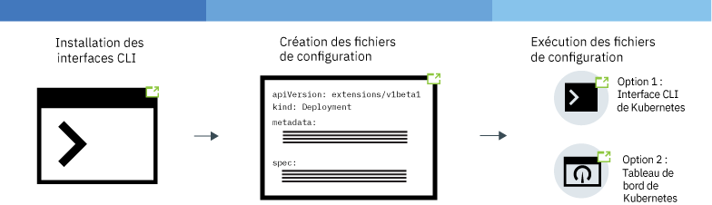
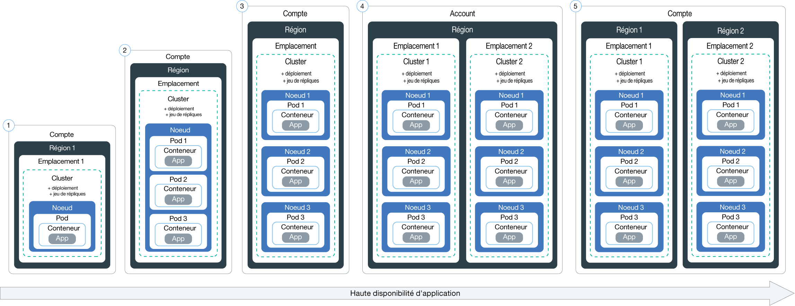
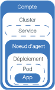

---

copyright:
  years: 2014, 2018
lastupdated: "2018-05-24"

---

{:new_window: target="_blank"}
{:shortdesc: .shortdesc}
{:screen: .screen}
{:pre: .pre}
{:table: .aria-labeledby="caption"}
{:codeblock: .codeblock}
{:tip: .tip}
{:download: .download}


# Déploiement d'applications dans des clusters
{: #app}

Vous pouvez recourir à des techniques Kubernetes dans {{site.data.keyword.containerlong}} pour déployer des applications et faire en sorte qu'elles soient toujours opérationnelles. Par exemple, vous pouvez effectuer des mises à jour et des rétromigrations en continu sans générer de temps d'indisponibilité pour vos utilisateurs.
{: shortdesc}

Découvrez les étapes générales de déploiement d'applications en cliquant sur une zone de l'image suivante.


<map name="d62e18" id="d62e18">
<area href="cs_cli_install.html" target="_blank" alt="Installation des interfaces CLI." title="Installation des interfaces CLI." shape="rect" coords="30, 69, 179, 209" />
<area href="https://kubernetes.io/docs/concepts/configuration/overview/" target="_blank" alt="Création d'un fichier de configuration pour votre application. Consultez les pratiques Kubernetes recommandées." title="Création d'un fichier de configuration pour votre application. Consultez les pratiques Kubernetes recommandées." shape="rect" coords="254, 64, 486, 231" />
<area href="#app_cli" target="_blank" alt="Option 1 : Exécuter des fichiers de configuration depuis l'interface CLI de Kubernetes." title="Option 1 : Exécuter des fichiers de configuration depuis l'interface CLI de Kubernetes." shape="rect" coords="544, 67, 730, 124" />
<area href="#cli_dashboard" target="_blank" alt="Option 2 : Démarrer le tableau de bord Kubernetes en local et exécuter des fichiers de configuration." title="Option 2 : Démarrer le tableau de bord Kubernetes en local et exécuter des fichiers de configuration." shape="rect" coords="544, 141, 728, 204" />
</map>


<br />


## Planification de déploiements à haute disponibilité
{: #highly_available_apps}

Plus votre configuration sera distribuée entre plusieurs noeuds worker et clusters, et moins vos utilisateurs seront susceptibles d'encourir des temps d'indisponibilité de votre application.
{: shortdesc}

Examinez les configurations potentielles d'application suivantes, classées par ordre de disponibilité croissante.



1.  Déploiement avec n+2 pods gérés par un jeu de répliques.
2.  Déploiement avec n+2 pods gérés par un jeu de répliques et disséminés entre plusieurs noeuds (anti-affinité) sur le même emplacement.
3.  Déploiement avec n+2 pods gérés par un jeu de répliques et disséminés entre plusieurs noeuds (anti-affinité) dans des emplacements différents.
4.  Déploiement avec n+2 pods gérés par un jeu de répliques et disséminés entre plusieurs noeuds (anti-affinité) dans des régions différentes.


### Augmentation de la disponibilité de votre application
{: #increase_availability}

<dl>
  <dt>Utilisez des déploiements et des jeux de répliques pour déployer votre application et ses dépendances</dt>
    <dd><p>Un déploiement est une ressource Kubernetes que vous pouvez utiliser pour déclarer tous les composants de votre application et de ses dépendances. Avec les déploiements, vous n'avez pas à noter toutes les étapes, ce qui vous permet de vous concentrer sur votre application.</p>
    <p>Lorsque vous déployez plusieurs pods, un jeu de répliques est créé automatiquement pour vos déploiements afin de surveiller les pods et de garantir que le nombre voulu de pods est opérationnel en tout temps. Lorsqu'un pod tombe en panne, le jeu de répliques remplace le pod ne répondant plus par un nouveau.</p>
    <p>Vous pouvez utiliser un déploiement pour définir des stratégies de mise à jour de votre application, notamment le nombre de pods que vous désirez ajouter lors d'une mise à jour en continu et le nombre de pods pouvant être indisponibles à un moment donné. Lorsque vous effectuez une mise à jour en continu, le déploiement vérifie si la révision est fonctionnelle et l'arrête si des échecs sont détectés.</p>
    <p>Avec les déploiements, vous pouvez déployer simultanément plusieurs révisions avec différents indicateurs. Par exemple, vous pouvez d'abord tester un déploiement avant de décider de l'utiliser en environnement de production.</p>
    <p>Les déploiements vous permettent de suivre toutes les révisions déployées. Vous pouvez utiliser cet historique pour rétablir une version antérieure si vous constatez que vos mises à jour ne fonctionnent pas comme prévu.</p></dd>
  <dt>Incluez suffisamment de répliques pour répondre à la charge de travail de votre application, plus deux répliques</dt>
    <dd>Pour rendre votre application encore plus disponible et réfractaire aux échecs, envisagez d'inclure des répliques supplémentaires au-delà du strict minimum requis pour gérer la charge de travail anticipée. Ces répliques supplémentaires pourront gérer la charge de travail en cas de panne d'un pod et avant que le jeu de répliques n'ait encore rétabli le pod défaillant. Pour une protection face à deux défaillances simultanées de pods, incluez deux répliques supplémentaires. Cette configuration correspond à un canevas N+2, où N désigne le nombre de pods destinés à traiter la charge de travail entrante et +2 indique deux répliques supplémentaires. Tant qu'il y a suffisamment d'espace dans votre cluster, vous pouvez avoir autant de pods que vous voulez.</dd>
  <dt>Disséminez les pods entre plusieurs noeuds (anti-affinité)</dt>
    <dd><p>Lorsque vous créez votre déploiement, vous pouvez déployer tous les pods sur le même noeud worker. C'est ce qu'on appelle affinité ou collocation. Pour protéger votre application contre une défaillance de noeud worker, vous pouvez configurer votre déploiement de sorte à disséminer les pods entre plusieurs noeuds worker, et ce en utilisant l'option <em>podAntiAffinity</em> avec vos clusters standard. Vous pouvez définir deux types d'anti-affinité de pod : préféré ou obligatoire. Pour plus d'informations, voir la documentation Kubernetes sur l'<a href="https://kubernetes.io/docs/concepts/configuration/assign-pod-node/" rel="external" target="_blank" title="(S'ouvre dans un nouvel onglet ou une nouvelle fenêtre)">affectation de pods à des noeuds</a>.</p>
    <p><strong>Remarque</strong> : avec l'anti-affinité obligatoire, vous ne pouvez déployer que le nombre de répliques correspondant au nombre de noeuds worker. Par exemple, si vous disposez de 3 noeuds worker dans votre cluster mais que vous définissez 5 répliques dans votre fichier YAML, seules 3 répliques sont déployées. Chaque réplique réside sur un noeud worker distinct. Les deux autres répliques restent en attente. Si vous ajoutez un autre noeud worker dans votre cluster, l'une de ces répliques restantes se déploie automatiquement sur ce nouveau noeud.<p>
    <p><strong>Exemples de fichiers YAML de déploiement</strong>:<ul>
    <li><a href="https://raw.githubusercontent.com/IBM-Cloud/kube-samples/master/deploy-apps-clusters/nginx_preferredAntiAffinity.yaml" rel="external" target="_blank" title="(S'ouvre dans un nouvel onglet ou une nouvelle fenêtre)">Application Nginx avec anti-affinité de pod préférée.</a></li>
    <li><a href="https://raw.githubusercontent.com/IBM-Cloud/kube-samples/master/deploy-apps-clusters/liberty_requiredAntiAffinity.yaml" rel="external" target="_blank" title="(S'ouvre dans un nouvel onglet ou une nouvelle fenêtre)">Application IBM WebSphere Application Server Liberty avec anti-affinité de pod obligatoire.</a></li></ul></p>
    </dd>
<dt>Disséminez les pods entre plusieurs zones ou régions</dt>
  <dd>Pour protéger votre application en cas de défaillance d'un emplacement ou d'une région, vous pouvez créer un second cluster dans un autre emplacement ou une autre région et utiliser un fichier YAML de déploiement afin de déployer un doublon du jeu de répliques pour votre application. En ajoutant une route partagée et un équilibreur de charge devant vos clusters, vous pouvez répartir votre charge de travail entre plusieurs emplacements et régions. Pour plus d'informations, voir [Haute disponibilité de cluster](cs_clusters.html#clusters).
  </dd>
</dl>


### Déploiement d'application minimal
{: #minimal_app_deployment}

Un déploiement élémentaire d'application dans un cluster gratuit ou standard pourrait inclure les composants suivants.
{: shortdesc}



Pour déployer les composants pour une application minimale comme illustré dans le diagramme, vous utilisez un fichier de configuration semblable à l'exemple suivant :
```
apiVersion: apps/v1beta1
kind: Deployment
metadata:
  name: ibmliberty
spec:
  replicas: 1
  template:
    metadata:
      labels:
        app: ibmliberty
    spec:
      containers:
      - name: ibmliberty
        image: registry.bluemix.net/ibmliberty:latest
        ports:
        - containerPort: 9080        
---
apiVersion: v1
kind: Service
metadata:
  name: ibmliberty-service
  labels:
    app: ibmliberty
spec:
  selector:
    app: ibmliberty
  type: NodePort
  ports:
   - protocol: TCP
     port: 9080
```
{: codeblock}

**Remarque :** pour exposer votre service, assurez-vous que la paire clé-valeur que vous utilisez dans la section `spec.selector` du service est identique à celle que vous utilisez dans la section `spec.template.metadata.labels` du fichier YAML de déploiement.
Pour en savoir plus sur chaque composant, consultez les [concepts de base de Kubernetes](cs_tech.html#kubernetes_basics).

<br />


## Lancement du tableau de bord Kubernetes
{: #cli_dashboard}

Ouvrez un tableau de bord Kubernetes sur votre système local pour consulter des informations sur un cluster et ses noeuds worker. [Dans l'interface graphique](#db_gui), vous pouvez accéder au tableau de bord par simple clic sur un bouton. [Avec l'interface de ligne de commande (CLI)](#db_cli), vous pouvez accéder au tableau de bord ou utiliser les étapes d'un processus automatique, comme pour un pipeline CI/CD.
{:shortdesc}

Avant de commencer, [ciblez avec votre interface de ligne de commande](cs_cli_install.html#cs_cli_configure) votre cluster. Cette tâche requiert d'utiliser la [règle d'accès administrateur](cs_users.html#access_policies). Vérifiez votre [règle d'accès actuelle](cs_users.html#infra_access).

Vous pouvez utiliser le port par défaut ou définir votre propre port pour lancer le tableau de bord Kubernetes d'un cluster.

**Lancement du tableau de bord Kubernetes à partir de l'interface graphique**
{: #db_gui}

1.  Connectez-vous à l'[interface graphique {{site.data.keyword.Bluemix_notm}}](https://console.bluemix.net/).
2.  Dans le profil figurant dans la barre de menu, sélectionnez le compte que vous souhaitez utiliser.
3.  Dans le menu, cliquez sur **Conteneurs**.
4.  Sur la page **Clusters**, cliquez sur le cluster auquel vous souhaitez accéder.
5.  Sur la page des détails du cluster, cliquez sur le bouton **Tableau de bord Kubernetes**.

**Lancement du tableau de bord Kubernetes à partir de l'interface de ligne de commande (CLI)**
{: #db_cli}

*  Pour les clusters avec un maître Kubernetes version 1.7.16 ou antérieure :

    1.  Affectez le numéro de port par défaut au proxy.

        ```
        kubectl proxy
        ```
        {: pre}

        Sortie :

        ```
        Starting to serve on 127.0.0.1:8001
        ```
        {: screen}

    2.  Ouvrez le tableau de bord Kubernetes dans un navigateur Web.

        ```
        http://localhost:8001/ui
        ```
        {: codeblock}

*  Pour les clusters avec un maître Kubernetes version 1.8.2 ou supérieure :

    1.  Extrayez vos données d'identification pour Kubernetes.

        ```
        kubectl config view -o jsonpath='{.users[0].user.auth-provider.config.id-token}'
        ```
        {: pre}

    2.  Copiez la valeur **id-token** affichée dans la sortie.

    3.  Affectez le numéro de port par défaut au proxy.

        ```
        kubectl proxy
        ```
        {: pre}

        Exemple de sortie :

        ```
        Starting to serve on 127.0.0.1:8001
        ```
        {: screen}

    4.  Connectez-vous au tableau de bord.

      1.  Dans votre navigateur, accédez à l'URL suivante :

          ```
          http://localhost:8001/api/v1/namespaces/kube-system/services/https:kubernetes-dashboard:/proxy/
          ```
          {: codeblock}

      2.  Sur la page de connexion, sélectionnez la méthode d'authentification par **Jeton**.

      3.  Collez ensuite la valeur **id-token** que vous aviez copiée dans la zone **Jeton** et cliquez sur **Connexion**.

Lorsque vous avez fini d'examiner le tableau de bord Kubernetes, utilisez les touches `CTRL+C` pour quitter la commande
`proxy`. Après avoir quitté, le tableau de bord Kubernetes n'est plus disponible. Exécutez la commande `proxy` pour redémarrer le tableau de bord Kubernetes.

[Ensuite, vous pouvez exécuter un fichier de configuration à partir du tableau de bord.](#app_ui)


<br />


## Création de valeurs confidentielles
{: #secrets}

Les valeurs confidentielles Kubernetes permettent de stocker de manière
sécurisée des informations sensibles, comme les noms des utilisateurs, leurs mots de passe ou leurs clés.
{:shortdesc}

<table>
<caption>Fichiers requis à stocker dans les valeurs confidentielles par tâche</caption>
<thead>
<th>Tâche</th>
<th>Fichiers à stocker dans des valeurs confidentielles</th>
</thead>
<tbody>
<tr>
<td>Ajout d'un service à un cluster</td>
<td>Aucun. Une valeur confidentielle est automatiquement créée lorsque vous liez un service à un cluster.</td>
</tr>
<tr>
<td>Facultatif : Configurez le service Ingress avec TLS, si vous n'utilisez pas ingress-secret. <p><b>Remarque</b> : TLS est déjà activé par défaut et une valeur confidentielle créée pour la connexion TLS.

Pour afficher la valeur confidentielle TLS par défaut :
<pre>
bx cs cluster-get &lt;cluster_name_or_ID&gt; | grep "Ingress secret"
</pre>
</p>
Pour créer à la place votre propre valeur confidentielle, exécutez la procédure décrite dans cette rubrique.</td>
<td>Certificat et clé de serveur : <code>server.crt</code> et <code>server.key</code></td>
<tr>
<td>Création de l'annotation mutual-authentication.</td>
<td>Certificat d'autorité de certification : <code>ca.crt</code></td>
</tr>
</tbody>
</table>

Pour plus d'informations sur les éléments que vous pouvez stocker dans les valeurs confidentielles, voir la [documentation Kubernetes](https://kubernetes.io/docs/concepts/configuration/secret/).


Pour créer une valeur confidentielle avec un certificat :

1. Procurez-vous le certificat d'autorité de certification et la clé auprès de votre fournisseur de certificat. Si vous disposez de votre propre domaine, achetez un certificat TLS officiel pour votre domaine. Pour des tests, vous pouvez générer un certificat autosigné.

 **Important** : assurez-vous que la valeur [CN](https://support.dnsimple.com/articles/what-is-common-name/) est différente pour chaque certificat.

 Le certificat et la clé du client doivent être vérifiés jusqu'au niveau du certificat racine accrédité qui, dans ce cas, est le certificat de l'autorité de certification. Exemple :

 ```
 Client Certificate: issued by Intermediate Certificate
 Intermediate Certificate: issued by Root Certificate
 Root Certificate: issued by itself
 ```
 {: codeblock}

2. Créez le certificat en tant que valeur confidentielle Kubernetes.

   ```
   kubectl create secret generic <secret_name> --from-file=<cert_file>=<cert_file>
   ```
   {: pre}

   Exemples :
   - Connexion TLS :

     ```
     kubectl create secret tls <secret_name> --from-file=tls.crt=server.crt --from-file=tls.key=server.key
     ```
     {: pre}

   - Annotation d'authentification mutuelle :

     ```
     kubectl create secret generic <secret_name> --from-file=ca.crt=ca.crt
     ```
     {: pre}

<br />


## Déploiement d'applications depuis l'interface graphique
{: #app_ui}

Lorsque vous déployez une application dans votre cluster à l'aide du tableau de bord Kubernetes, une ressource de déploiement crée, met à jour et gère automatiquement les pods dans votre cluster.
{:shortdesc}

Avant de commencer :

-   Installez les [interfaces de ligne de commande](cs_cli_install.html#cs_cli_install) requises.
-   [Ciblez votre interface de ligne de commande](cs_cli_install.html#cs_cli_configure) vers votre cluster.

Pour déployer votre application :

1.  Ouvrez le [tableau de bord](#cli_dashboard) Kubernetes et cliquez sur **+ Créer**.
2.  Entrez les détails de votre application en choisissant l'une de ces deux méthodes :
  * Sélectionnez **Spécifier les détails de l'application ci-dessous** et entrez les détails.
  * Sélectionnez **Télécharger un fichier YAML ou JSON** pour télécharger le [fichier de configuration  de votre application](https://kubernetes.io/docs/tasks/inject-data-application/define-environment-variable-container/).

  Besoin d'aide sur votre fichier de configuration ? Consultez cet [exemple de fichier YAML ](https://github.com/IBM-Cloud/kube-samples/blob/master/deploy-apps-clusters/deploy-ibmliberty.yaml). Dans cet exemple, un conteneur est déployé à partir d'une image **ibmliberty** dans la région du Sud des Etats-Unis (US-South). Découvrez comment [sécuriser vos informations personnelles](cs_secure.html#pi) lorsque vous utilisez des ressources Kubernetes.
  {: tip}

3.  Vérifiez que vous avez déployé correctement votre application à l'aide de l'une des méthodes suivantes :
  * Dans le tableau de bord Kubernetes, cliquez sur **Déploiements**. La liste des déploiements ayant abouti s'affiche.
  * Si votre application est [accessible au public](cs_network_planning.html#public_access), accédez à la page de présentation du cluster dans votre tableau de bord {{site.data.keyword.containerlong}}. Copiez le sous-domaine qui se trouve dans la section récapitulatif des clusters et collez-le dans un navigateur pour afficher votre application.

<br />


## Déploiement d'applications depuis l'interface CLI
{: #app_cli}

Après avoir créé un cluster, vous pouvez y déployer une application à l'aide de l'interface CLI de Kubernetes.
{:shortdesc}

Avant de commencer :

-   Installez les [interfaces de ligne de commande](cs_cli_install.html#cs_cli_install) requises.
-   [Ciblez votre interface de ligne de commande](cs_cli_install.html#cs_cli_configure) vers votre cluster.

Pour déployer votre application :

1.  Créez un fichier de configuration basé sur les [pratiques Kubernetes recommandées ](https://kubernetes.io/docs/concepts/configuration/overview/). En général, un fichier de configuration contient des informations de configuration détaillées pour chacune des ressources que vous créez dans Kubernetes. Votre script peut inclure une ou plusieurs des sections suivantes :

    -   [Deployments ](https://kubernetes.io/docs/concepts/workloads/controllers/deployment/) : définit la création des pods et des jeux de répliques. Un pod contient une application conteneurisée unique et les jeux de répliques contrôlent plusieurs instances de pods.

    -   [Service ](https://kubernetes.io/docs/concepts/services-networking/service/) : fournit un accès frontal aux pods en utilisant une adresse IP publique de noeud worker ou d'équilibreur de charge, ou une route Ingress publique.

    -   [Ingress ](https://kubernetes.io/docs/concepts/services-networking/ingress/) : spécifie un type d'équilibreur de charge qui fournit des routes permettant d'accéder publiquement à l'application.

    Découvrez comment [sécuriser vos informations personnelles](cs_secure.html#pi) lorsque vous utilisez des ressources Kubernetes.

2.  Exécutez le fichier de configuration dans un contexte de cluster.

    ```
    kubectl apply -f config.yaml
    ```
    {: pre}

3.  Si vous avez rendu votre application disponible au public en utilisant un service Nodeport, un service d'équilibreur de charge ou Ingress, vérifiez que vous pouvez accéder à l'application.

<br />


## Déploiement d'une application sur une machine GPU
{: #gpu_app}

Si vous disposez d'un [type de machine d'unité de traitement graphique (GPU)](cs_clusters.html#shared_dedicated_node), vous pouvez planifier des charges de travail nécessitant de nombreux calculs mathématiques sur le noeud worker. Par exemple, vous pouvez exécutez une application en 3D qui utilise la plateforme CUDA (Compute Unified Device Architecture) pour partager la charge de traitement entre l'unité GPU et l'UC pour améliorer les performances.
{:shortdesc}

Dans les étapes suivantes, vous apprendrez à déployer des charges de travail nécessitant l'unité GPU. Vous pouvez également [déployer des applications](#app_ui) qui n'ont pas besoin de passer par l'unité GPU et l'UC pour traiter leurs charges de travail. Par la suite, vous trouverez peut-être utile d'expérimenter des charges de travail nécessitant de nombreux calculs par exemple avec l'infrastructure d'apprentissage automatique [TensorFlow ](https://www.tensorflow.org/) avec [cette démonstration Kubernetes ](https://github.com/pachyderm/pachyderm/tree/master/doc/examples/ml/tensorflow).

Avant de commencer :
* [Créez un type de machine GPU bare metal](cs_clusters.html#clusters_cli). Notez que l'exécution de ce processus peut prendre plus d'1 jour ouvrable.
* Votre maître de cluster et le noeud worker de l'unité GPU doivent exécuter Kubernetes version 1.10 ou ultérieure.

Pour exécuter une charge de travail sur une machine GPU :
1.  Créez un fichier YAML. Dans cet exemple, un fichier YALM `Job` gère des charges de travail de type lots en créant un pod provisoire qui s'exécute jusqu'à ce que l'exécution de la commande planifiée soit terminée.

    **Important** : Pour les charges de travail GPU, vous devez toujours indiquer la zone `resources: limits: nvidia.com/gpu` dans la spécification YAML.

    ```yaml
    apiVersion: batch/v1
    kind: Job
    metadata:
      name: nvidia-smi
      labels:
        name: nvidia-smi
    spec:
      template:
        metadata:
          labels:
            name: nvidia-smi
        spec:
          containers:
          - name: nvidia-smi
            image: nvidia/cuda:9.1-base-ubuntu16.04
            command: [ "/usr/test/nvidia-smi" ]
            imagePullPolicy: IfNotPresent
            resources:
              limits:
                nvidia.com/gpu: 2
            volumeMounts:
            - mountPath: /usr/test
              name: nvidia0
          volumes:
            - name: nvidia0
              hostPath:
                path: /usr/bin
          restartPolicy: Never
    ```
    {: codeblock}

    <table>
    <caption>Composants YAML</caption>
    <thead>
    <th colspan=2> Description des composants du fichier YAML</th>
    </thead>
    <tbody>
    <tr>
    <td>Noms et libellé des métadonnées</td>
    <td>Indiquez un nom et un libellé (label) pour le travail et utilisez le même nom dans la zone metadata du fichier et de `spec template`. Par exemple, `nvidia-smi`.</td>
    </tr>
    <tr>
    <td><code>containers/image</code></td>
    <td>Fournissez l'image dont le conteneur est une instance d'exécution. Dans cet exemple, la valeur est définie pour utiliser l'image CUDA DockerHub : <code>nvidia/cuda:9.1-base-ubuntu16.04</code></td>
    </tr>
    <tr>
    <td><code>containers/command</code></td>
    <td>Indiquez une commande à exécuter dans le conteneur. Dans cet exemple, la commande <code>[ "/usr/test/nvidia-smi" ]</code> fait référence à un fichier binaire qui se trouve sur la machine GPU, donc vous devez également configurer un montage de volume.</td>
    </tr>
    <tr>
    <td><code>containers/imagePullPolicy</code></td>
    <td>Pour extraire une nouvelle image uniquement si l'image ne se trouve pas actuellement sur le noeud worker, indiquez <code>IfNotPresent</code>.</td>
    </tr>
    <tr>
    <td><code>resources/limits</code></td>
    <td>Pour les machines GPU, vous devez indiquer une limite de ressources. Le [plug-in d'unité](https://kubernetes.io/docs/concepts/cluster-administration/device-plugins/) Kubernetes définit la demande de ressource par défaut pour se conformer à la limite.
    <ul><li>Vous devez indiquer la clé sous la forme <code>nvidia.com/gpu</code>.</li>
    <li>Entrez le nombre entier d'unités GPU que vous demandez, par exemple <code>2</code>. <strong>Remarque</strong> : les pods de conteneur ne partagent pas les unités GPU et les unités GPU ne peuvent pas être sursollicitées. Par exemple, si vous ne disposez que d'une machine `mg1c.16x128`, vous n'avez que 2 unités GPU dans cette machine. Vous ne pouvez donc en spécifier que `2` maximum.</li></ul></td>
    </tr>
    <tr>
    <td><code>volumeMounts</code></td>
    <td>Nom du volume monté sur le conteneur, par exemple <code>nvidia0</code>. Indiquez le chemin de montage (<code>mountPath</code>) du volume sur le conteneur. Dans cet exemple, le chemin <code>/usr/test</code> correspond au chemin utilisé dans la commande containers du travail.</td>
    </tr>
    <tr>
    <td><code> volumes</code></td>
    <td>Nom du volume de travail, par exemple <code>nvidia0</code>. Dans le chemin <code>hostPath</code> du noeud worker de l'unité GPU, indiquez le chemin (<code>path</code>) sur l'hôte, dans cet exemple, il s'agit de <code>/usr/bin</code>. Le chemin de montage (<code>mountPath</code>) du conteneur est mappé au chemin (<code>path</code>) du volume hôte, ce qui donne à ce travail l'accès aux fichiers binaires NVIDIA sur le noeud worker de l'unité GPU pour que la commande container s'exécute.</td>
    </tr>
    </tbody></table>

2.  Appliquez le fichier YAML. Exemple :

    ```
    kubectl apply -f nvidia-smi.yaml
    ```
    {: pre}

3.  Vérifiez le pod du travail en filtrant vos pods avec le libellé `nvidia-sim`. Vérifiez que la valeur de la zone **STATUS** est **Completed**.

    ```
    kubectl get pod -a -l 'name in (nvidia-sim)'
    ```
    {: pre}

    Exemple de sortie :
    ```
    NAME                  READY     STATUS      RESTARTS   AGE
    nvidia-smi-ppkd4      0/1       Completed   0          36s
    ```
    {: screen}

4.  Décrivez le pod pour voir comment le plug-in d'unité GPU a planifié le pod.
    * Dans les zones `Limits` et `Requests`, observez que la limite de ressources que vous avez spécifiée correspond à la demande définie automatiquement par le plug-in d'unité.
    * Dans les événements, vérifiez que le pod est affecté au noeud worker de votre GPU.

    ```
    kubectl describe pod nvidia-smi-ppkd4
    ```
    {: pre}

    Exemple de sortie :
    ```
    Name:           nvidia-smi-ppkd4
    Namespace:      default
    ...
    Limits:
     nvidia.com/gpu:  2
    Requests:
     nvidia.com/gpu:  2
    ...
    Events:
    Type    Reason                 Age   From                     Message
    ----    ------                 ----  ----                     -------
    Normal  Scheduled              1m    default-scheduler        Successfully assigned nvidia-smi-ppkd4 to 10.xxx.xx.xxx
    ...
    ```
    {: screen}

5.  Pour vérifier que votre travail a utilisé l'unité GPU pour calculer sa charge de travail, vous pouvez consulter les journaux. La commande `[ "/usr/test/nvidia-smi" ]` du travail interroge l'état de l'unité GPU sur le noeud worker de l'unité GPU.

    ```
    kubectl logs nvidia-sim-ppkd4
    ```
    {: pre}

    Exemple de sortie :
    ```
    +-----------------------------------------------------------------------------+
    | NVIDIA-SMI 390.12                 Driver Version: 390.12                    |
    |-------------------------------+----------------------+----------------------+
    | GPU  Name        Persistence-M| Bus-Id        Disp.A | Volatile Uncorr. ECC |
    | Fan  Temp  Perf  Pwr:Usage/Cap|         Memory-Usage | GPU-Util  Compute M. |
    |===============================+======================+======================|
    |   0  Tesla K80           Off  | 00000000:83:00.0 Off |                  Off |
    | N/A   37C    P0    57W / 149W |      0MiB / 12206MiB |      0%      Default |
    +-------------------------------+----------------------+----------------------+
    |   1  Tesla K80           Off  | 00000000:84:00.0 Off |                  Off |
    | N/A   32C    P0    63W / 149W |      0MiB / 12206MiB |      1%      Default |
    +-------------------------------+----------------------+----------------------+

    +-----------------------------------------------------------------------------+
    | Processes:                                                       GPU Memory |
    |  GPU       PID   Type   Process name                             Usage      |
    |=============================================================================|
    |  No running processes found                                                 |
    +-----------------------------------------------------------------------------+
    ```
    {: screen}

    Dans cet exemple, vous voyez que les deux unités GPU ont été utilisées pour exécuter le travail car elles étaient toutes les deux planifiées sur le noeud worker. Si la limite est définie sur 1, 1 seule unité GPU s'affiche.

## Mise à l'échelle des applications 
{: #app_scaling}

Avec Kubernetes, vous pouvez activer la [mise à l'échelle automatique horizontale de pod ](https://kubernetes.io/docs/tasks/run-application/horizontal-pod-autoscale/) pour augmenter ou diminuer automatiquement le nombre d'instances de vos applications en fonction de l'UC.
{:shortdesc}

Vous recherchez des informations sur la mise à l'échelle des applications Cloud Foundry ? Consultez [IBM - Mise à l'échelle automatique pour {{site.data.keyword.Bluemix_notm}}](/docs/services/Auto-Scaling/index.html). 
{: tip}

Avant de commencer :
- [Ciblez votre interface de ligne de commande](cs_cli_install.html#cs_cli_configure) vers votre cluster.
- La surveillance avec Heapster doit être déployée dans le cluster qui doit faire l'objet de la mise à l'échelle automatique.

Etapes :

1.  Déployez votre application sur un cluster à partir de l'interface de ligne de commande. Lorsque vous déployez votre application vous devez solliciter une unité centrale (cpu).

    ```
    kubectl run <app_name> --image=<image> --requests=cpu=<cpu> --expose --port=<port_number>
    ```
    {: pre}

    <table>
    <caption>Composantes de la commande kubectl run</caption>
    <thead>
    <th colspan=2> Description des composantes de cette commande</th>
    </thead>
    <tbody>
    <tr>
    <td><code>--image</code></td>
    <td>Application que vous désirez déployer.</td>
    </tr>
    <tr>
    <td><code>--request=cpu</code></td>
    <td>UC requise pour le conteneur, exprimée en milli-coeurs. Par exemple, <code>--requests=200m</code>.</td>
    </tr>
    <tr>
    <td><code>--expose</code></td>
    <td>Lorsque la valeur est true, un service externe est créé.</td>
    </tr>
    <tr>
    <td><code>--port</code></td>
    <td>Port sur lequel votre application est disponible en externe.</td>
    </tr></tbody></table>

    Pour les déploiements plus complexes, vous devrez éventuellement créer un [fichier de configuration](#app_cli).
    {: tip}

2.  Créez un service de mise à l'échelle automatique et définissez votre règle. Pour plus d'informations sur l'utilisation de la commande `kubectl autoscale`, voir la [documentation Kubernetes ](https://v1-8.docs.kubernetes.io/docs/reference/generated/kubectl/kubectl-commands#autoscale).

    ```
    kubectl autoscale deployment <deployment_name> --cpu-percent=<percentage> --min=<min_value> --max=<max_value>
    ```
    {: pre}

    <table>
    <caption>Composantes de la commande kubectl autoscale</caption>
    <thead>
    <th colspan=2> Description des composantes de cette commande</th>
    </thead>
    <tbody>
    <tr>
    <td><code>--cpu-percent</code></td>
    <td>Utilisation d'UC moyenne gérée par le programme de mise à l'échelle automatique de pod horizontale, exprimée en pourcentage.</td>
    </tr>
    <tr>
    <td><code>--min</code></td>
    <td>Nombre minimal de pods déployés utilisés pour gérer le pourcentage d'utilisation d'UC spécifié.</td>
    </tr>
    <tr>
    <td><code>--max</code></td>
    <td>Nombre maximal de pods déployés utilisés pour gérer le pourcentage d'utilisation d'UC spécifié.</td>
    </tr>
    </tbody></table>


<br />


## Gestion des déploiements en continu
{: #app_rolling}

Vous pouvez gérer un déploiement en continu automatique et contrôlé de vos modifications. S'il ne correspond pas à ce que vous aviez prévu, vous pouvez rétromigrer le déploiement vers la dernière révision.
{:shortdesc}

Avant de commencer, créez un [déploiement](#app_cli).

1.  [Déployez ](https://kubernetes.io/docs/concepts/workloads/controllers/deployment/#updating-a-deployment) une modification. Par exemple, vous souhaiterez peut-être modifier l'image que vous avez utilisée dans votre déploiement initial.

    1.  Identifiez le nom du déploiement.

        ```
        kubectl get deployments
        ```
        {: pre}

    2.  Identifiez le nom du pod.

        ```
        kubectl get pods
        ```
        {: pre}

    3.  Identifiez le nom du conteneur s'exécutant dans le pod.

        ```
        kubectl describe pod <pod_name>
        ```
        {: pre}

    4.  Définissez la nouvelle image à utiliser par le déploiement.

        ```
        kubectl set image deployment/<deployment_name><container_name>=<image_name>
        ```
        {: pre}

    Lorsque vous exécutez les commandes, la modification est immédiatement appliquée et consignée dans l'historique de déploiement.

2.  Vérifiez le statut de votre déploiement.

    ```
    kubectl rollout status deployments/<deployment_name>
    ```
    {: pre}

3.  Rétromigrez une modification.
    1.  Affichez l'historique des modifications en continu du déploiement et identifiez le numéro de révision de votre dernier déploiement.

        ```
        kubectl rollout history deployment/<deployment_name>
        ```
        {: pre}

        **Astuce :** pour afficher les détails d'une révision spécifique, incluez le numéro de la révision.

        ```
        kubectl rollout history deployment/<deployment_name> --revision=<number>
        ```
        {: pre}

    2.  Rétablissez la version précédente ou spécifiez la révision à rétablir. Pour rétromigrer vers la révision précédente, utilisez la commande suivante.

        ```
        kubectl rollout undo deployment/<depoyment_name> --to-revision=<number>
        ```
        {: pre}

<br />

