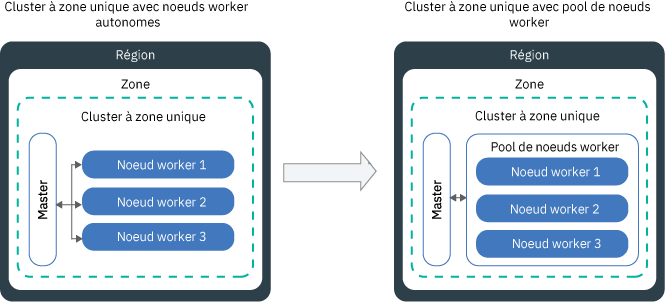

---

copyright:
  years: 2014, 2019
lastupdated: "2019-06-12"

keywords: kubernetes, iks

subcollection: containers

---

{:new_window: target="_blank"}
{:shortdesc: .shortdesc}
{:screen: .screen}
{:pre: .pre}
{:table: .aria-labeledby="caption"}
{:codeblock: .codeblock}
{:tip: .tip}
{:note: .note}
{:important: .important}
{:deprecated: .deprecated}
{:download: .download}
{:preview: .preview}


# Mise à jour des clusters, des noeuds worker et des composants de cluster
{: #update}

Vous pouvez installer des mises à jour pour maintenir vos clusters Kubernetes à jour dans {{site.data.keyword.containerlong}}.
{:shortdesc}

## Mise à jour du maître Kubernetes
{: #master}

Régulièrement, Kubernetes publie des [mises à jour principales, secondaires ou des correctifs](/docs/containers?topic=containers-cs_versions#version_types). Les mises à jour peuvent affecter la version du serveur d'API Kubernetes ou d'autres composants dans le maître Kubernetes. IBM met à jour la version de correctif, mais vous devez mettre à jour les versions principales et secondaires.
{:shortdesc}

**Comment savoir à quel moment effectuer la mise à jour du maître ?**</br>
Dès que des mises à jour sont disponibles, vous recevez une notification dans l'interface de ligne de commande et dans la console {{site.data.keyword.Bluemix_notm}}, et vous pouvez également consulter la page des [versions prises en charge](/docs/containers?topic=containers-cs_versions).

**Combien de versions peut avoir le maître derrière la version la plus récente ?**</br>
En principe, IBM prend en charge trois versions de Kubernetes à un moment donné. Vous ne pouvez pas mettre à jour le serveur d'API Kubernetes vers une version deux fois supérieure à sa version actuelle.

Par exemple, si la version actuelle de votre serveur d'API Kubernetes est 1.11 et que vous voulez le mettre à jour vers la version 1.14, vous devez d'abord effectuer une mise à jour vers la version 1.12. 

Si votre cluster exécute une version Kubernetes non prise en charge, suivez les [instructions d'archivage de version](/docs/containers?topic=containers-cs_versions#k8s_version_archive). Pour éviter que le cluster ne se retrouve dans un état non pris en charge et pour éviter tout impact opérationnel, maintenez votre cluster à jour. 

**Mes noeuds worker peuvent-ils s'exécuter avec une version ultérieure à celle du maître ?**</br>
Vos noeuds worker ne peuvent pas s'exécuter sur une version `principale.secondaire` plus récente que le maître. Commencez par [mettre à jour votre maître](#update_master) à la dernière version de Kubernetes. Ensuite, [mettez à jour les noeuds worker](#worker_node) dans votre cluster.

Les noeuds worker peuvent exécuter des versions de correctif ultérieures à celle du maître, par exemple des versions de correctif spécifiques aux noeuds worker pour les mises à jour de sécurité.

**Comment sont appliquées les mises à jour de correctif ?**</br>
Par défaut, les correctifs du maître sont appliqués automatiquement sur plusieurs jours, de sorte que la version d'un correctif de maître s'affiche comme étant disponible avant d'être appliquée à votre maître. L'automatisation de la mise à jour ignore également les clusters qui ne sont pas dans un état sain ou dont les opérations sont encore en cours d'exécution. Occasionnellement, IBM peut désactiver les mises à jour automatiques pour un groupe de correctifs de maître spécifique, par exemple un correctif nécessaire uniquement si un maître est mis à jour d'une version secondaire à une autre. Pour chacun de ces cas de figure, vous pouvez [consulter le journal des modifications de version](/docs/containers?topic=containers-changelog) pour en mesurer l'impact potentiel et choisir d'utiliser la [commande](/docs/containers?topic=containers-cli-plugin-kubernetes-service-cli#cs_cluster_update)  `ibmcloud ks cluster-update` vous-même en toute sécurité sans attendre l'application de la mise à jour automatique.

Contrairement au maître, vous devez mettre à jour vos noeuds worker pour chaque version de correctif.

**Que se passe-t-il lors de la mise à jour du maître ?**</br>
Dans les clusters qui exécutent Kubernetes version 1.11 ou ultérieure, la haute disponibilité de votre maître est assurée par trois pods avec des répliques du maître. Les pods de maître ont des mises à jour en continu, au cours desquelles un seul pod à la fois est indisponible. Deux instances sont opérationnelles pour que vous puissiez accéder au cluster et le modifier lors de la mise à jour. Vos noeuds worker, applications et ressources continuent à s'exécuter.

Pour les clusters qui exécutent de versions antérieures de Kubernetes, lorsque vous mettez à jour le serveur d'API Kubernetes, celui-ci est indisponible durant 5 à 10 minutes environ. Pendant la mise à jour, vous ne pouvez ni accéder au cluster, ni le modifier. En revanche, les noeuds worker, les applications et les ressources que les utilisateurs du cluster ont déployés ne sont pas modifiés et poursuivent leur exécution.

**Puis-je annuler la mise à jour effectuée ?**</br>
Non, vous ne pouvez pas restaurer la version antérieure d'un cluster une fois le processus de mise à jour enclenché. Prenez soin d'utiliser un cluster de test et de suivre les instructions afin d'éviter des problèmes potentiels avant de mettre à jour votre maître en production.

**Quelle procédure dois-je suivre pour la mise à jour du maître ?**</br>
Le diagramme suivant illustre la procédure que vous pouvez suivre pour mettre à jour le maître.


Figure 1. Diagramme de la procédure de mise à jour du maître Kubernetes

{: #update_master}
Avant de commencer, assurez-vous de disposer du [rôle de plateforme {{site.data.keyword.Bluemix_notm}} IAM **Opérateur** ou **Administrateur**](/docs/containers?topic=containers-users#platform). 

Pour mettre à jour la version _principale_ ou _secondaire_ du maître Kubernetes :

1.  Passez en revue les [modifications de Kubernetes](/docs/containers?topic=containers-cs_versions) et effectuez les mises à jour marquées _Mise à jour avant le maître_.

2.  Mettez à jour le serveur d'API Kubernetes et les composants associés du maître Kubernetes en utilisant la [console {{site.data.keyword.Bluemix_notm}}](https://cloud.ibm.com/login) ou en exécutant la [commande](/docs/containers?topic=containers-cli-plugin-kubernetes-service-cli#cs_cluster_update) `ibmcloud ks cluster-update` de l'interface de ligne de commande.

3.  Patientez quelques minutes, puis confirmez que la mise à jour est terminée. Examinez la version du serveur d'API Kubernetes sur le tableau de bord Clusters d'{{site.data.keyword.Bluemix_notm}} ou exécutez la commande `ibmcloud ks clusters`.

4.  Installez la version de l'interface CLI [`kubectl cli`](/docs/containers?topic=containers-cs_cli_install#kubectl) qui correspond à la version du serveur d'API qui s'exécute sur le maître Kubernetes. [Kubernetes ne prend pas en charge les versions client de ](https://kubernetes.io/docs/setup/version-skew-policy/) `kubectl` qui diffèrent d'au moins deux niveaux par rapport à la version du serveur (n +/- 2).

Lorsque la mise à jour du serveur d'API Kubernetes est terminée, vous pouvez mettre à jour vos noeuds worker.

<br />


## Mise à jour des noeuds worker
{: #worker_node}

Vous avez reçu une notification vous invitant à mettre à jour vos noeuds worker. Qu'est-ce que cela signifie ? Comme les mises à jour de sécurité et les correctifs sont mis en place pour le serveur d'API Kubernetes et d'autres composants du maître Kubernetes, vous devez vérifier que les noeuds worker soient toujours synchronisés.
{: shortdesc}

**Qu'advient-il de mes applications au cours d'une mise à jour ?**</br>
Si vous exécutez des applications dans le cadre d'un déploiement sur des noeuds worker faisant l'objet d'une mise à jour, les applications sont replanifiées sur d'autres noeuds worker dans le cluster. Ces noeuds worker peuvent se trouver dans des pools de noeuds worker différents ou, si vous disposez de noeuds worker autonomes, les applications peuvent être planifiées sur ces noeuds. Pour éviter toute interruption d'application, vous devez veiller à ce que le cluster dispose d'une capacité suffisante pour traiter la charge de travail.

**Comment puis-je contrôler le nombre de noeuds worker indisponibles à moment donné durant la mise à jour ?**</br>
Si vous avez besoin que tous vos noeuds worker soient opérationnels, envisagez de [redimensionner votre pool de noeuds worker](/docs/containers?topic=containers-cli-plugin-kubernetes-service-cli#cs_worker_pool_resize) ou d'[ajouter des noeuds worker autonomes](/docs/containers?topic=containers-cli-plugin-kubernetes-service-cli#cs_worker_add) pour ajouter des noeuds worker supplémentaires. Vous pourrez supprimer ces noeuds supplémentaires une fois la mise à jour terminée.

De plus, vous pouvez créer une mappe de configuration (ConfigMap) Kubernetes qui indique le nombre maximal de noeuds worker pouvant être indisponibles à moment donné pendant la mise à jour. Les noeuds worker sont identifiés par leur libellé. Vous pouvez utiliser les libellés fournis par IBM ou des libellés personnalisés que vous avez ajoutés au noeud worker.

**Et si je n'envisage pas de définir une mappe de configuration ?**</br>
Lorsque la mappe de configuration n'est pas définie, la valeur par défaut est utilisée. Par défaut, il peut y avoir au maximum 20% de noeuds worker indisponibles dans chaque cluster pendant le processus de mise à jour.

**Avant de commencer** :
- [Connectez-vous à votre compte. Le cas échéant, ciblez le groupe de ressources approprié. Définissez le contexte pour votre cluster.](/docs/containers?topic=containers-cs_cli_install#cs_cli_configure)
- [Mettez à jour le maître Kubernetes](#master). La version Kubernetes du noeud worker ne peut pas être supérieure à celle du serveur d'API Kubernetes qui s'exécute sur votre maître Kubernetes.
- Apportez toutes les modifications indiquées dans _Mise à jour après le maître_ sur la page des [modifications de Kubernetes](/docs/containers?topic=containers-cs_versions).
- Pour appliquer une mise à jour de module de correction, consultez le [journal des modifications de version de Kubernetes](/docs/containers?topic=containers-changelog#changelog).
- Vérifiez que vous disposez du [rôle de plateforme {{site.data.keyword.Bluemix_notm}} IAM **Opérateur** ou **Administrateur**](/docs/containers?topic=containers-users#platform). </br>

Les mises à jour des noeuds worker peuvent provoquer l'indisponibilité de vos services et applications. La machine de votre noeud worker est réimagée et les données sont supprimées si elles ne sont pas [stockées hors du pod](/docs/containers?topic=containers-storage_planning#persistent_storage_overview).
{: important}

{: #worker-up-configmap}
**Pour créer une mappe de configuration et mettre à jour les noeuds worker** :

1.  Affichez la liste des noeuds worker disponibles et notez leur adresse IP privée.

    ```
    ibmcloud ks workers --cluster <cluster_name_or_ID>
    ```
    {: pre}

2. Affichez les libellés d'un noeud worker. Vous pouvez identifier les libellés des noeuds worker dans la section **Labels** de la sortie de l'interface CLI. Chaque libellé est constitué de deux éléments `NodeSelectorKey` et `NodeSelectorValue`.
   ```
   kubectl describe node <private_worker_IP>
   ```
   {: pre}

   Exemple de sortie :
   ```
   Name:               10.184.58.3
   Roles:              <none>
   Labels:             arch=amd64
                    beta.kubernetes.io/arch=amd64
                    beta.kubernetes.io/os=linux
                    failure-domain.beta.kubernetes.io/region=us-south
                    failure-domain.beta.kubernetes.io/zone=dal12
                    ibm-cloud.kubernetes.io/encrypted-docker-data=true
                    ibm-cloud.kubernetes.io/iaas-provider=softlayer
                    ibm-cloud.kubernetes.io/machine-type=u3c.2x4.encrypted
                    kubernetes.io/hostname=10.123.45.3
                    privateVLAN=2299001
                    publicVLAN=2299012
   Annotations:        node.alpha.kubernetes.io/ttl=0
                    volumes.kubernetes.io/controller-managed-attach-detach=true
   CreationTimestamp:  Tue, 03 Apr 2018 15:26:17 -0400
   Taints:             <none>
   Unschedulable:      false
   ```
   {: screen}

3. Créez une mappe de configuration et définissez les règles d'indisponibilité applicables à vos noeuds worker. L'exemple suivant présente quatre vérifications, `zonecheck.json`, `regioncheck.json`, `defaultcheck.json`, et un modèle de vérification. Vous pouvez utiliser ces exemples de vérification pour définir les règles de vos noeuds worker dans une zone (`zonecheck.json`), une région (`regioncheck.json`) spécifiques, ou pour tous les noeuds worker qui ne correspondent à aucune des vérifications que vous avez définies dans la mappe de configuration (`defaultcheck.json`). Utilisez le modèle de vérification pour créer votre propre vérification. Pour chaque vérification, vous devez choisir un des libellés de noeud worker obtenus à l'étape précédente pour identifier un noeud worker.  

   Pour chaque vérification, vous ne pouvez définir qu'une seule valeur pour <code>NodeSelectorKey</code> et <code>NodeSelectorValue</code>. Si vous souhaitez définir des règles pour plusieurs régions, zones ou d'autres libellés de noeud worker, créez une nouvelle vérification. Vous pouvez définir jusqu'à 10 vérifications dans une mappe de configuration. Si vous ajoutez d'autres vérifications, elles sont ignorées.
   {: note}

   Exemple :
   ```
   apiVersion: v1
    kind: ConfigMap
    metadata:
      name: ibm-cluster-update-configuration
      namespace: kube-system
    data:
     drain_timeout_seconds: "120"
     zonecheck.json: |
       {
        "MaxUnavailablePercentage": 30,
        "NodeSelectorKey": "failure-domain.beta.kubernetes.io/zone",
        "NodeSelectorValue": "dal13"
      }
    regioncheck.json: |
       {
        "MaxUnavailablePercentage": 20,
        "NodeSelectorKey": "failure-domain.beta.kubernetes.io/region",
        "NodeSelectorValue": "us-south"
      }
    defaultcheck.json: |
       {
        "MaxUnavailablePercentage": 20
      }
    <check_name>: |
      {
        "MaxUnavailablePercentage": <value_in_percentage>,
        "NodeSelectorKey": "<node_selector_key>",
        "NodeSelectorValue": "<node_selector_value>"
      }
   ```
   {: codeblock}

   <table summary="La première ligne du tableau est répartie sur deux colonnes. La lecture des autres lignes s'effectue de gauche à droite, le paramètre figurant dans la première colonne et les descriptions correspondantes dans la deuxième colonne.">
   <caption>Composants de ConfigMap</caption>
    <thead>
      <th colspan=2> Description des composants </th>
    </thead>
    <tbody>
      <tr>
        <td><code>drain_timeout_seconds</code></td>
        <td> Facultatif : délai d'attente en seconde nécessaire à l'exécution de l'opération [drain ](https://kubernetes.io/docs/tasks/administer-cluster/safely-drain-node/). L'arrêt avec drain d'un noeud worker en toute sécurité supprime tous les pods existants du noeuds worker et replanifie les pods sur d'autres noeuds worker du cluster. Les valeurs admises sont des entiers compris entre 1 et 180. La valeur par défaut est 30.</td>
      </tr>
      <tr>
        <td><code>zonecheck.json</code></br><code>regioncheck.json</code></td>
        <td>Deux vérifications utilisées pour définir une règle pour un ensemble de noeuds worker que vous pouvez identifier à l'aide des éléments <code>NodeSelectorKey</code> et <code>NodeSelectorValue</code>. La vérification <code>zonecheck.json</code> identifie les noeuds worker en fonction du libellé de leur zone et la vérification <code>regioncheck.json</code> utilise le libellé de la région ajouté à chaque noeud worker lors de la mise à disposition. Dans l'exemple, 30% de tous les noeuds worker ayant <code>dal13</code> comme libellé de zone et 20% de tous les noeuds worker dans la région du Sud des Etats-Unis (<code>us-south</code>) peuvent être indisponibles lors de la mise à jour.</td>
      </tr>
      <tr>
        <td><code>defaultcheck.json</code></td>
        <td>Si vous ne créez pas de mappe de configuration ou si la mappe n'est pas configurée correctement, la valeur par défaut de Kubernetes est appliquée. Par défaut, seuls 20 % des noeuds worker du cluster peuvent être indisponibles à moment donné. Vous pouvez remplacer la valeur par défaut en ajoutant la vérification par défaut dans votre mappe de configuration. Dans cet exemple, tous les noeuds worker qui ne sont pas indiqués dans les vérifications de zone et de région (<code>dal13</code> ou <code>us-south</code>) peuvent être indisponibles lors de la mise à jour. </td>
      </tr>
      <tr>
        <td><code>MaxUnavailablePercentage</code></td>
        <td>Nombre maximal de noeuds pouvant être indisponibles pour un libellé clé-valeur spécifique, exprimé en pourcentage. Un noeud worker est indisponible lorsqu'il est en cours de déploiement, de rechargement ou de mise à disposition. Les noeuds worker en file d'attente sont bloqués pour la mise à jour s'ils dépassent un pourcentage maximum de noeuds indisponibles défini. </td>
      </tr>
      <tr>
        <td><code>NodeSelectorKey</code></td>
        <td>Clé de libellé du noeud worker pour lequel vous voulez définir une règle. Vous pouvez définir des règles pour les libellés par défaut fournis par IBM, ainsi que sur les libellés de noeuds worker que vous avez créés. <ul><li>Si vous souhaitez ajouter une règle pour les noeuds worker appartenant à un pool de noeuds worker, vous pouvez utiliser le libellé <code>ibm-cloud.kubernetes.io/machine-type</code>. </li><li> Si vous disposez de plusieurs pools de noeuds worker avec le même type de machine, utilisez un libellé personnalisé. </li></ul></td>
      </tr>
      <tr>
        <td><code>NodeSelectorValue</code></td>
        <td>Valeur de libellé que doit avoir le noeud worker pour être pris en compte dans la règle que vous définissez. </td>
      </tr>
    </tbody>
   </table>

4. Créez la mappe de configuration dans votre cluster.
   ```
   kubectl apply -f <filepath/configmap.yaml>
   ```
   {: pre}

5.  Vérifiez que la mappe de configuration est créée.
    ```
    kubectl get configmap --namespace kube-system
    ```
    {: pre}

6.  Mettez à jour les noeuds worker.

    ```
    ibmcloud ks worker-update --cluster <cluster_name_or_ID> --workers <worker_node1_ID> <worker_node2_ID>
    ```
    {: pre}

7. Facultatif : vérifiez les événements déclenchés par la mappe de configuration et les éventuelles erreurs de validation. Les événements peuvent être consultés dans la section **Events** de la sortie de l'interface CLI.
   ```
   kubectl describe -n kube-system cm ibm-cluster-update-configuration
   ```
   {: pre}

8. Confirmez que la mise à jour est terminée en examinant la version Kubernetes de vos noeuds worker.  
   ```
   kubectl get nodes
   ```
   {: pre}

9. Vérifiez que vous n'avez pas de noeuds worker en double. Dans certains cas, des clusters plus anciens peuvent répertorier des noeuds worker en double avec un statut **`NotReady`** après une mise à jour. Pour supprimer ces doublons, voir la section de [traitement des incidents](/docs/containers?topic=containers-cs_troubleshoot_clusters#cs_duplicate_nodes).

Etapes suivantes :
-   Répétez le processus de mise à jour pour les autres pools de noeuds worker.
-   Informez les développeurs qui travaillent dans le cluster pour qu'ils mettent à jour leur interface de ligne de commande `kubectl` à la version du maître Kubernetes.
-   Si le tableau de bord Kubernetes n'affiche pas les graphiques d'utilisation, [supprimez le pod `kube-dashboard`](/docs/containers?topic=containers-cs_troubleshoot_health#cs_dashboard_graphs).


### Mise à jour des noeuds worker dans la console
{: #worker_up_console}

Après avoir configuré la mappe de configuration pour la première fois, vous pouvez effectuer la mise à jour des noeuds worker en utilisant la console {{site.data.keyword.Bluemix_notm}}.
{: shortdesc}

Avant de commencer :
*   [Configurez une mappe de configuration](#worker_node) pour contrôler le mode de mise à jour de vos noeuds worker.
*   [Mettez à jour le maître Kubernetes](#master). La version Kubernetes du noeud worker ne peut pas être supérieure à celle du serveur d'API Kubernetes qui s'exécute sur votre maître Kubernetes.
*   Apportez toutes les modifications indiquées dans _Mise à jour après le maître_ sur la page des [modifications de Kubernetes](/docs/containers?topic=containers-cs_versions).
*   Pour appliquer une mise à jour de module de correction, consultez le [journal des modifications de version de Kubernetes](/docs/containers?topic=containers-changelog#changelog).
*   Vérifiez que vous disposez du [rôle de plateforme {{site.data.keyword.Bluemix_notm}} IAM **Opérateur** ou **Administrateur**](/docs/containers?topic=containers-users#platform). </br>

Les mises à jour des noeuds worker peuvent provoquer l'indisponibilité de vos services et applications. La machine de votre noeud worker est réimagée et les données sont supprimées si elles ne sont pas [stockées hors du pod](/docs/containers?topic=containers-storage_planning#persistent_storage_overview).
{: important}

Pour mettre à jour les noeuds worker à partir de la console :
1.  Dans le menu de la [console {{site.data.keyword.Bluemix_notm}}](https://cloud.ibm.com/) , cliquez sur **Kubernetes**.
2.  Sur la page **Clusters**, cliquez sur votre cluster.
3.  Dans l'onglet **Noeuds worker**, sélectionnez la case à cocher de chaque noeud worker que vous désirez mettre à jour. Une barre d'actions s'affiche sur la ligne d'en-tête du tableau.
4.  Dans cette barre d'actions, cliquez sur **Mettre à jour Kubernetes**.

<br />


## Mise à jour des types de machine
{: #machine_type}

Vous pouvez mettre à jour les types de machine de vos noeuds worker en ajoutant de nouveaux noeuds worker et en supprimant les anciens. Par exemple, si votre cluster a des versions de noeud worker `x1c` obsolètes ou Ubuntu 16 `x2c` plus anciennes, créez des noeuds worker Ubuntu 18 qui utilisent des types de machine dont le nom comprend `x3c`.
{: shortdesc}

Avant de commencer :
- [Connectez-vous à votre compte. Le cas échéant, ciblez le groupe de ressources approprié. Définissez le contexte pour votre cluster.](/docs/containers?topic=containers-cs_cli_install#cs_cli_configure)
- Si vous stockez des données sur votre noeud worker, les données sont supprimées si elles ne sont pas [stockées hors du noeud worker](/docs/containers?topic=containers-storage_planning#persistent_storage_overview).
- Vérifiez que vous disposez du [rôle de plateforme {{site.data.keyword.Bluemix_notm}} IAM **Opérateur** ou **Administrateur**](/docs/containers?topic=containers-users#platform).

Pour mettre à jour les types de machine :

1. Affichez la liste des noeuds worker disponibles et notez leur adresse IP privée.
   - **Pour les noeuds worker figurant dans un pool de noeuds worker** :
     1. Affichez la liste des pools de noeuds worker disponibles dans votre cluster.
        ```
        ibmcloud ks worker-pools --cluster <cluster_name_or_ID>
        ```
        {: pre}

     2. Affichez la liste des noeuds worker figurant dans le pool de noeuds worker.
        ```
        ibmcloud ks workers --cluster <cluster_name_or_ID> --worker-pool <pool_name>
        ```
        {: pre}

     3. Obtenez les détails d'un noeud worker et notez la zone, ainsi que l'ID du VLAN privé et du VLAN public.
        ```
        ibmcloud ks worker-get --cluster <cluster_name_or_ID> --worker <worker_ID>
        ```
        {: pre}

   - **Déprécié : pour les noeuds worker autonomes** :
     1. Affichez la liste des noeuds worker disponibles.
        ```
        ibmcloud ks workers --cluster <cluster_name_or_ID>
        ```
        {: pre}

     2. Obtenez les détails d'un noeud worker et notez la zone, ainsi que l'ID du VLAN privé et du VLAN public.
        ```
        ibmcloud ks worker-get --cluster <cluster_name_or_ID> --worker <worker_ID>
        ```
        {: pre}

2. Affichez la liste des types de machine disponibles dans la zone.
   ```
   ibmcloud ks machine-types <zone>
   ```
   {: pre}

3. Créez un noeud worker avec le nouveau type de machine.
   - **Pour les noeuds worker figurant dans un pool de noeuds worker** :
     1. Créez un pool de noeuds worker avec le nombre de noeuds worker que vous désirez remplacer.
        ```
        ibmcloud ks worker-pool-create --name <pool_name> --cluster <cluster_name_or_ID> --machine-type <machine_type> --size-per-zone <number_of_workers_per_zone>
        ```
        {: pre}

     2. Vérifiez que le pool de noeuds worker est créé.
        ```
        ibmcloud ks worker-pools --cluster <cluster_name_or_ID>
        ```
        {: pre}

     3. Ajoutez la zone de votre pool de noeuds worker que vous avez récupérée auparavant. Lorsque vous ajoutez une zone, les noeuds worker définis dans votre pool de noeuds worker sont mis à disposition dans cette zone et pris en compte pour la planification des charges de travail à venir. Si vous souhaitez répartir vos noeuds worker sur plusieurs zones, sélectionnez une [zone compatible avec plusieurs zones](/docs/containers?topic=containers-regions-and-zones#zones).
        ```
        ibmcloud ks zone-add --zone <zone> --cluster <cluster_name_or_ID> --worker-pools <pool_name> --private-vlan <private_VLAN_ID> --public-vlan <public_VLAN_ID>
        ```
        {: pre}

   - **Déprécié : pour les noeuds worker autonomes** :
       ```
       ibmcloud ks worker-add --cluster <cluster_name> --machine-type <machine_type> --workers <number_of_worker_nodes> --private-vlan <private_VLAN_ID> --public-vlan <public_VLAN_ID>
       ```
       {: pre}

4. Patientez jusqu'à la fin du déploiement des noeuds worker.
   ```
   ibmcloud ks workers --cluster <cluster_name_or_ID>
   ```
   {: pre}

   Lorsque l'état des noeuds worker passe à **Normal**, le déploiement est terminé.

5. Supprimez l'ancien noeud worker. **Remarque** : si vous supprimez un type de machine qui est facturé au mois (par exemple bare metal), vous êtes facturé pour le mois complet.
   - **Pour les noeuds worker figurant dans un pool de noeuds worker** :
     1. Supprimez le pool de noeuds worker associé à l'ancien type de machine. Cette opération supprime tous les noeuds worker qui se trouvent dans le pool dans toutes les zones. L'exécution de ce processus peut prendre quelques minutes.
        ```
        ibmcloud ks worker-pool-rm --worker-pool <pool_name> --cluster <cluster_name_or_ID>
        ```
        {: pre}

     2. Vérifiez que le pool de noeuds worker est supprimé.
        ```
        ibmcloud ks worker-pools --cluster <cluster_name_or_ID>
        ```
        {: pre}

   - **Déprécié : pour les noeuds worker autonomes** :
      ```
      ibmcloud ks worker-rm --cluster <cluster_name> --worker <worker_node>
      ```
      {: pre}

6. Vérifiez que les noeuds worker ont été supprimés de votre cluster.
   ```
   ibmcloud ks workers --cluster <cluster_name_or_ID>
   ```
   {: pre}

7. Répétez ces étapes pour mettre à jour d'autres pools de noeuds worker ou d'autres noeuds worker autonomes sur différents types de machine.

## Mise à jour des composants de cluster
{: #components}

Votre cluster {{site.data.keyword.containerlong_notm}} est livré avec des composants, par exemple Fluentd pour la consignation. Ces modules s'installent automatiquement lorsque vous mettez à disposition le cluster. Par défaut, ces composants sont automatiquement mis à jour par IBM. Cependant, vous pouvez désactiver les mises à jour automatiques pour certains composants afin d'effectuer leur mise à jour manuellement indépendamment du maître et des noeuds worker.
{: shortdesc}

**Quels sont les composants par défaut que je peux mettre à jour séparément du cluster ?**</br>
Vous pouvez éventuellement désactiver les mises à jour automatiques des composants suivants :
* [Fluentd pour la consignation](#logging-up)
* [Equilibreur de charge d'application (ALB) Ingress](#alb)

**Existe-t-il des composants à mettre à jour séparément du cluster ?**</br>

Oui. Votre cluster est déployé avec les composants gérés suivants et les ressources associées qui ne sont pas modifiables, sauf pour effectuer la mise à l'échelle des pods ou éditer des éléments configmap afin d'améliorer les performances. Si vous essayez de modifier l'un de ces composants de déploiement, leurs paramètres d'origine sont restaurés à intervalles réguliers.

* `coredns`
* `coredns-autoscaler`
* `heapster`
* `ibm-file-plugin`
* `ibm-storage-watcher`
* `ibm-keepalived-watcher`
* `kube-dns-amd64`
* `kube-dns-autoscaler`
* `kubernetes-dashboard`
* `metrics-server`
* `vpn`

Vous pouvez afficher ces ressources en utilisant le libellé `addonmanager.kubernetes.io/mode: Reconcile`. Exemple :

```
kubectl get deployments --all-namespaces -l addonmanager.kubernetes.io/mode=Reconcile
```
{: pre}

**Puis-je installer d'autres plug-in ou modules complémentaires que les composants par défaut ?**</br>
Oui. {{site.data.keyword.containerlong_notm}} offre d'autres plug-in et modules complémentaires que vous pouvez sélectionner pour ajouter des fonctionnalités à votre cluster. Par exemple, vous envisagerez peut-être d'[utiliser des chartes Helm](/docs/containers?topic=containers-helm#public_helm_install) pour installer le [plug-in Block Storage](/docs/containers?topic=containers-block_storage#install_block) ou le [VPN strongSwan](/docs/containers?topic=containers-vpn#vpn-setup). Ou, vous souhaiterez peut-être activer les modules complémentaires gérés par IBM dans votre cluster, par exemple, [Istio](/docs/containers?topic=containers-istio) ou [Knative](/docs/containers?topic=containers-serverless-apps-knative). Vous devez mettre à jour ces chartes Helm et modules complémentaires séparément en suivant les instructions fournies dans le fichier Readme de la charte Helm ou en suivant les étapes de [mise à jour des modules complémentaires gérés](/docs/containers?topic=containers-managed-addons#updating-managed-add-ons).

### Gestion des mises à jour automatiques pour Fluentd
{: #logging-up}

Pour que des modifications puissent être apportées à vos configurations de consignation ou de filtrage, le composant Fluentd doit être au niveau de version le plus récent. Par défaut, les mises à jour automatiques du composant sont activées.
{: shortdesc}

Vous pouvez gérer les mises à jour automatiques du composant Fluentd de plusieurs manières indiquées ci-après. **Remarque** : pour exécuter les commandes suivantes, vous devez disposer du [rôle de plateforme {{site.data.keyword.Bluemix_notm}} IAM **Administrateur**](/docs/containers?topic=containers-users#platform) pour le cluster.

* Vérifiez si les mises à jour automatiques sont activées en exécutant la [commande](/docs/containers?topic=containers-cli-plugin-kubernetes-service-cli#cs_log_autoupdate_get) `ibmcloud ks logging-autoupdate-get --cluster <cluster_name_or_ID>`. 
* Désactivez les mises à jour automatiques en exécutant la [commande](/docs/containers?topic=containers-cli-plugin-kubernetes-service-cli#cs_log_autoupdate_disable) `ibmcloud ks logging-autoupdate-disable`. 
* Si les mises à jour automatiques sont désactivées et que vous devez modifier votre configuration, il y a deux options possibles :
    * Activez les mises à jour automatiques pour vos pods Fluentd.
        ```
        ibmcloud ks logging-autoupdate-enable --cluster <cluster_name_or_ID>
        ```
        {: pre}
    * Forcez une mise à jour unique lorsque vous utilisez une commande de consignation comportant l'option `--force-update`. **Remarque** : vos pods se mettent à jour vers la version la plus récente du composant Fluentd, mais Fluentd ne se met plus à jour automatiquement par la suite.
        Exemple de commande :

        ```
        ibmcloud ks logging-config-update --cluster <cluster_name_or_ID> --id <log_config_ID> --type <log_type> --force-update
        ```
        {: pre}

### Gestion des mises à jour automatiques pour les ALB Ingress
{: #alb}

Contrôlez à quel moment doit s'effectuer la mise à jour du composant d'équilibreur de charge d'application (ALB) Ingress.
{: shortdesc}

Lorsque le composant ALB Ingress est mis à jour, les conteneurs `nginx-ingress` et `ingress-auth` figurant dans tous les pods d'ALB sont mis à jour à la dernière version. Par défaut, les mises à jour automatiques des ALB sont activées. Les mises à jour sont effectuées en continu de sorte que vos équilibreurs de charge ALB n'encourent jamais d'indisponibilité.

Si vous désactivez les mises à jour automatiques, vous êtes chargé de mettre à jour vos ALB. Dès que des mises à jour sont disponibles, vous en êtes averti dans l'interface de ligne de commande lorsque vous exécutez les commandes `ibmcloud ks albs` ou `alb-autoupdate-get`.

Lorsque vous mettez à jour une version Kubernetes principale ou secondaire de votre cluster, IBM effectue les modifications nécessaires dans le déploiement Ingress, mais ne change pas la version de vos ALB Ingress. Vous êtes chargé de vérifier la compatibilité des dernières versions de Kubernetes et des images de vos ALB Ingress.
{: note}

Avant de commencer :

1. Vérifiez que vos équilibreurs de charge ALB sont opérationnels.
    ```
    ibmcloud ks albs
    ```
    {: pre}

2. Vérifiez le statut des mises à jour automatiques du composant ALB Ingress.
    ```
    ibmcloud ks alb-autoupdate-get --cluster <cluster_name_or_ID>
    ```
    {: pre}

    Exemple de sortie lorsque les mises à jour automatiques sont activées :
    ```
    Retrieving automatic update status of application load balancer (ALB) pods in cluster mycluster...
    OK
    Automatic updates of the ALB pods are enabled in cluster mycluster
    ALBs are at the latest version in cluster mycluster
    ```
    {: screen}

    Exemple de sortie lorsque les mises à jour automatiques sont désactivées :
    ```
    Retrieving automatic update status of application load balancer (ALB) pods in cluster mycluster...
    OK
    Automatic updates of the ALB pods are disabled in cluster mycluster
    ALBs are not at the latest version in cluster mycluster. To view the current version, run 'ibmcloud ks albs'.
    ```
    {: screen}

3. Vérifiez la version (**Build**) de vos pods ALB.
    ```
    ibmcloud ks albs --cluster <cluster_name_or_ID>
    ```
    {: pre}

    Exemple de sortie :
    ```
    ALB ID                                            Enabled   Status     Type      ALB IP          Zone    Build                           ALB VLAN ID
    private-crdf253b6025d64944ab99ed63bb4567b6-alb2   false     disabled   private   10.xxx.xx.xxx   dal10   ingress:411/ingress-auth:315*   2234947
    public-crdf253b6025d64944ab99ed63bb4567b6-alb2    true      enabled    public    169.xx.xxx.xxx  dal10   ingress:411/ingress-auth:315*   2234945

    * Une mise à jour est disponible pour les pods d'équilibreur de charge d'application. Passez en revue les changements de la dernière version pouvant nécessiter une interruption avant d'effectuer la mise à jour : https://cloud.ibm.com/docs/containers?topic=containers-update#alb
    ```
    {: screen}

Vous pouvez gérer les mises à jour automatiques du composant ALB Ingress de plusieurs manières indiquées ci-après. **Remarque** : pour exécuter les commandes suivantes, vous devez disposer du [rôle de plateforme {{site.data.keyword.Bluemix_notm}} IAM **Editeur** ou **Administrateur**](/docs/containers?topic=containers-users#platform) pour le cluster.
* Désactivez les mises à jour automatiques.
    ```
    ibmcloud ks alb-autoupdate-disable --cluster <cluster_name_or_ID>
    ```
    {: pre}
* Mettez à jour manuellement vos ALB Ingress.
    1. Si une mise à jour est disponible et que vous souhaitez mettre à jour vos ALB, consultez d'abord le [journal des modifications de la dernière version du composant ALB Ingress](/docs/containers?topic=containers-cluster-add-ons-changelog#alb_changelog) pour vérifier les effets négatifs qu'elle pourrait avoir.
    2. Forcez une mise à jour unique de vos pods ALB. Tous les pods ALB dans votre cluster sont mis à jour à la dernière version. Vous ne pouvez pas mettre à jour un ALB individuel ou choisir la version vers laquelle mettre à jour les ALB. Les mises à jour automatiques restent désactivées.
        ```
        ibmcloud ks alb-update --cluster <cluster_name_or_ID>
        ```
        {: pre}
* Si vos pods ALB ont été récemment mis à jour, mais qu'une configuration personnalisée de vos ALB est affectée par la dernière version, vous pouvez rétromigrer la mise à jour à la version que vos pods ALB utilisaient avant. **Remarque** : après avoir annulé une mise à jour, les mises à jour automatiques des pods ALB sont désactivées.
    ```
    ibmcloud ks alb-rollback --cluster <cluster_name_or_ID>
    ```
    {: pre}
* Réactivez les mises à jour automatiques. Dès que la version suivante est disponible, les pods ALB sont automatiquement mis à jour à la dernière version.
    ```
    ibmcloud ks alb-autoupdate-enable --cluster <cluster_name_or_ID>
    ```
    {: pre}

<br />


## Mise à jour des modules complémentaires gérés
{: #addons}

Les modules complémentaires {{site.data.keyword.containerlong_notm}} gérés permettent d'améliorer facilement votre cluster avec des fonctions open source, telles que Istio ou Knative. La version de l'outil open source que vous ajoutez à votre cluster est testée par IBM et approuvée pour être utilisée dans {{site.data.keyword.containerlong_notm}}. Pour mettre à jour vers la dernière version des modules complémentaires gérés que vous avez activés dans votre cluster, voir [Mise à jour des modules complémentaires gérés](/docs/containers?topic=containers-managed-addons#updating-managed-add-ons).

## Mise à jour pour passer des noeuds worker autonomes aux pools de noeuds worker
{: #standalone_to_workerpool}

Avec l'introduction des clusters à zones multiples, les noeuds worker avec la même configuration, par exemple, le type de machine, sont regroupés en pools. Lorsque vous créez un cluster, un pool de noeuds worker nommé `default` est automatiquement créé pour vous.
{: shortdesc}

Vous pouvez utiliser des pools de noeuds worker pour répartir vos noeuds worker uniformément entre les zones et réaliser un cluster équilibré. Les clusters équilibrés sont encore plus disponibles et offrent moins de défaillances. En cas de suppression d'un noeud worker dans une zone, vous pouvez rééquilibrer le pool de noeuds worker et insérer automatiquement de nouveaux noeuds worker dans cette zone. Les pools de noeuds worker sont également utilisés pour installer des mises à jour de version Kubernetes sur tous vos noeuds worker.  

Si vous avez créé des clusters avant l'introduction des clusters à zones multiples, vos noeuds worker sont toujours autonomes et ne sont pas automatiquement regroupés dans les pools de noeuds worker. Vous devez mettre à jour ces clusters de sorte à utiliser des pools de noeuds worker. Si vous n'effectuez pas cette mise à jour, vous ne pourrez pas passer d'un cluster à zone unique à un cluster à zones multiples.
{: important}

Examinez l'image suivante pour voir comment évolue la configuration de votre cluster lorsque vous passez des noeuds worker autonomes aux pools de noeuds worker.



Avant de commencer :
- Vérifiez que vous disposez du [rôle de plateforme {{site.data.keyword.Bluemix_notm}} IAM **Opérateur** ou **Administrateur**](/docs/containers?topic=containers-users#platform) pour le cluster.
- [Connectez-vous à votre compte. Le cas échéant, ciblez le groupe de ressources approprié. Définissez le contexte pour votre cluster.](/docs/containers?topic=containers-cs_cli_install#cs_cli_configure)

Pour mettre à jour les noeuds worker autonomes pour passer aux pools de noeuds worker :

1. Affichez la liste des noeuds worker autonomes de votre cluster et notez leur **ID**, **Type de machine** et **Adresse IP privée**.
   ```
   ibmcloud ks workers --cluster <cluster_name_or_ID>
   ```
   {: pre}

2. Créez un pool de noeuds worker et déterminez le type de machine et le nombre de noeuds worker que vous souhaitez ajouter dans ce pool.
   ```
   ibmcloud ks worker-pool-create --name <pool_name> --cluster <cluster_name_or_ID> --machine-type <machine_type> --size-per-zone <number_of_workers_per_zone>
   ```
   {: pre}

3. Répertoriez les zones disponibles et choisissez où vous souhaitez déployer les noeuds worker dans votre pool de noeuds worker. Pour afficher la zone dans laquelle se trouvent vos noeuds worker autonomes, exécutez la commande `ibmcloud ks cluster-get --cluster <cluster_name_or_ID>`. Si vous souhaitez répartir vos noeuds worker sur plusieurs zones, sélectionnez une [zone compatible avec plusieurs zones](/docs/containers?topic=containers-regions-and-zones#zones).
   ```
   ibmcloud ks zones
   ```
   {: pre}

4. Répertoriez les VLAN disponibles pour la zone que vous avez choisie à l'étape précédente. Si vous ne disposez pas encore de VLAN dans cette zone, un VLAN est automatiquement créé pour vous lorsque vous ajoutez la zone dans le pool de noeuds worker.
   ```
   ibmcloud ks vlans --zone <zone>
   ```
   {: pre}

5. Ajoutez la zone dans votre pool de noeuds worker. Lorsque vous ajoutez une zone dans un pool de noeuds worker, les noeuds worker définis dans votre pool de noeuds worker sont mis à disposition dans cette zone et pris en compte pour la planification des charges de travail à venir. {{site.data.keyword.containerlong}} ajoute automatiquement le libellé `failure-domain.beta.kubernetes.io/region` pour la région et le libellé `failure-domain.beta.kubernetes.io/zone` pour la zone à chaque noeud worker. Le planificateur de Kubernetes utilise ces libellés pour répartir les pods sur les zones situées dans la même région.
   1. **Pour ajouter une zone à un pool de noeuds worker** : remplacez `<pool_name>` par le nom de votre pool de noeuds worker et indiquez l'ID de cluster, la zone et les VLAN avec les informations que vous avez récupérées précédemment. Si vous ne disposez pas de VLAN public et privé dans cette zone, n'indiquez pas cette option. Un VLAN privé et un VLAN public sont automatiquement créés pour vous.

      Si vous souhaitez utiliser des VLAN différents pour des pools de noeuds worker différents, répétez cette commande pour chaque VLAN et les pools de noeuds worker correspondants associés. Les nouveaux noeuds worker sont ajoutés aux VLAN que vous spécifiez, mais les VLAN pour les noeuds worker existants restent inchangés.
      ```
      ibmcloud ks zone-add --zone <zone> --cluster <cluster_name_or_ID> --worker-pools <pool_name> --private-vlan <private_VLAN_ID> --public-vlan <public_VLAN_ID>
      ```
      {: pre}

   2. **Pour ajouter la zone dans plusieurs pools de noeuds worker** : ajoutez plusieurs pools de noeuds worker dans la commande `ibmcloud ks zone-add`. Pour ajouter plusieurs pools de noeuds worker dans une zone, vous devez déjà disposer de VLAN privé et public dans cette zone. Si vous ne disposez pas de VLAN public et privé dans cette zone, envisagez d'ajouter d'abord la zone à un pool de noeuds worker pour qu'un VLAN public et un VLAN privé soient créés pour vous. Ensuite, vous pouvez ajouter cette zone à d'autres pools de noeuds worker. </br></br>Il est important que les noeuds worker de tous vos pools de noeuds worker soient mis à disposition dans toutes les zones pour que votre cluster soit équilibré entre les zones. Si vous souhaitez utiliser des VLAN différents pour des pools de noeuds worker différents, répétez cette commande avec les VLAN que vous souhaitez utiliser pour votre pool de noeuds worker. Si vous disposez de plusieurs VLAN pour un cluster, de plusieurs sous-réseaux sur le même VLAN ou d'un cluster à zones multiples, vous devez activer une fonction [VRF (Virtual Router Function)](/docs/infrastructure/direct-link?topic=direct-link-overview-of-virtual-routing-and-forwarding-vrf-on-ibm-cloud#overview-of-virtual-routing-and-forwarding-vrf-on-ibm-cloud) pour votre compte d'infrastructure IBM Cloud (SoftLayer) pour que vos noeuds worker puissent communiquer entre eux sur le réseau privé. Pour activer la fonction VRF, [contactez le représentant de votre compte d'infrastructure IBM Cloud (SoftLayer)](/docs/infrastructure/direct-link?topic=direct-link-overview-of-virtual-routing-and-forwarding-vrf-on-ibm-cloud#how-you-can-initiate-the-conversion). Si vous ne parvenez pas à activer la fonction VRF ou si vous ne souhaitez pas le faire, activez la fonction [Spanning VLAN](/docs/infrastructure/vlans?topic=vlans-vlan-spanning#vlan-spanning). Pour effectuer cette action, vous devez disposer du [droit d'infrastructure](/docs/containers?topic=containers-users#infra_access) **Réseau > Gérer le spanning VLAN pour réseau**, ou vous pouvez demander au propriétaire du compte de l'activer. Pour vérifier si le spanning VLAN est déjà activé, utilisez la [commande](/docs/containers?topic=containers-cli-plugin-kubernetes-service-cli#cs_vlan_spanning_get) `ibmcloud ks vlan-spanning-get --region <region>`.
      ```
      ibmcloud ks zone-add --zone <zone> --cluster <cluster_name_or_ID> --worker-pools <pool_name1,pool_name2,pool_name3> --private-vlan <private_VLAN_ID> --public-vlan <public_VLAN_ID>
      ```
      {: pre}

   3. **Pour ajouter plusieurs zones dans vos pools de noeuds worker** : répétez la commande `ibmcloud ks zone-add` avec une zone différente et indiquez les pools de noeuds worker que vous voulez mettre à disposition dans cette zone. En ajoutant des zones supplémentaires dans votre cluster, vous passez d'un cluster à zone unique à un [cluster à zones multiples](/docs/containers?topic=containers-ha_clusters#multizone).

6. Patientez jusqu'à la fin du déploiement des noeuds worker dans chaque zone.
   ```
   ibmcloud ks workers --cluster <cluster_name_or_ID>
   ```
   {: pre}
   Lorsque l'état des noeuds worker passe à **Normal**, le déploiement est terminé.

7. Supprimez vos noeuds worker autonomes. Si vous en avez plusieurs, supprimez-les un par un.
   1. Répertoriez les noeuds worker dans votre cluster et comparez l'adresse IP privée de cette commande à l'adresse IP privée que vous avez récupérée au début pour rechercher vos noeuds worker autonomes.
      ```
      kubectl get nodes
      ```
      {: pre}
   2. Marquez le noeud worker comme non planifiable dans un processus désigné par cordon. Lorsque vous exécutez ce processus sur un noeud worker, vous le rendez indisponible pour toute planification de pod ultérieure. Utilisez le nom indiqué dans la section `name` renvoyé dans la commande `kubectl get nodes`.
      ```
      kubectl cordon <worker_name>
      ```
      {: pre}
   3. Vérifiez que la planification de pod est désactivée pour votre noeud worker.
      ```
      kubectl get nodes
      ```
      {: pre}
      Votre noeud worker n'est pas activé pour la planification de pod si le statut affiche **`SchedulingDisabled`**.
   4. Forcez la suppression des pods de votre noeud worker autonome et leur replanification sur des noeuds worker autonomes restants éligibles pour la création de pods, ainsi que sur les noeuds worker de votre pool de noeuds worker.
      ```
      kubectl drain <worker_name> --ignore-daemonsets
      ```
      {: pre}
      Ce processus peut prendre quelques minutes.

   5. Supprimez votre noeud worker autonome. Utilisez l'ID du noeud worker que vous avez récupéré avec la commande `ibmcloud ks workers --cluster <cluster_name_or_ID>` command.
      ```
      ibmcloud ks worker-rm --cluster <cluster_name_or_ID> --worker <worker_ID>
      ```
      {: pre}
   6. Répétez ces étapes jusqu'à ce que tous vos noeuds worker autonomes soient supprimés.


**Etape suivante ?** </br>
Maintenant que vous avez mis à jour votre cluster pour utiliser des pools de noeuds worker, vous pouvez améliorer la disponibilité en ajoutant d'autres zones dans votre cluster. L'ajout de zones supplémentaires dans votre cluster, vous fait passer d'un cluster à zone unique à un [cluster à zones multiples](/docs/containers?topic=containers-ha_clusters#ha_clusters). Lorsque vous passez d'un cluster à zone unique à un cluster à zones multiples, votre domaine Ingress `<cluster_name>.<region>.containers.mybluemix.net` devient `<cluster_name>.<region_or_zone>.containers.appdomain.cloud`. Le domaine Ingress existant est toujours valide et peut être utilisé pour envoyer des demandes à vos applications.

<br />

